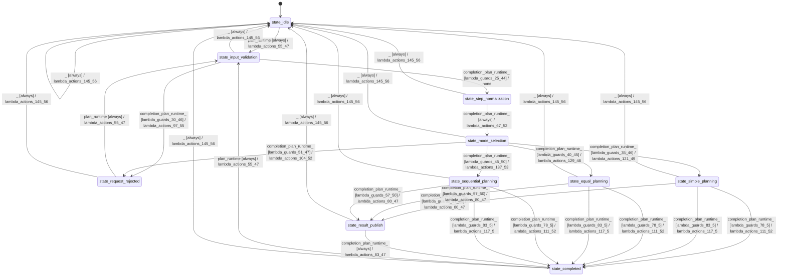

# batch_planner

Source: [`emel/batch/planner/sm.hpp`](https://github.com/stateforward/emel.cpp/blob/main/src/emel/batch/planner/sm.hpp)

## Mermaid

## Transitions

| Source | Event | Guard | Action | Target |
| --- | --- | --- | --- | --- |
| [`state_idle`](https://github.com/stateforward/emel.cpp/blob/main/src/emel/batch/planner/sm.hpp) | [`plan_runtime`](https://github.com/stateforward/emel.cpp/blob/main/src/emel/batch/planner/sm.hpp) | [`always`](https://github.com/stateforward/emel.cpp/blob/main/src/emel/batch/planner/sm.hpp) | [`lambda_actions_55_47`](https://github.com/stateforward/emel.cpp/blob/main/src/emel/batch/planner/sm.hpp) | [`state_input_validation`](https://github.com/stateforward/emel.cpp/blob/main/src/emel/batch/planner/sm.hpp) |
| [`state_input_validation`](https://github.com/stateforward/emel.cpp/blob/main/src/emel/batch/planner/sm.hpp) | [`completion<plan_runtime>`](https://github.com/stateforward/emel.cpp/blob/main/src/emel/batch/planner/sm.hpp) | [`lambda_guards_25_44`](https://github.com/stateforward/emel.cpp/blob/main/src/emel/batch/planner/sm.hpp) | [`none`](https://github.com/stateforward/emel.cpp/blob/main/src/emel/batch/planner/sm.hpp) | [`state_step_normalization`](https://github.com/stateforward/emel.cpp/blob/main/src/emel/batch/planner/sm.hpp) |
| [`state_input_validation`](https://github.com/stateforward/emel.cpp/blob/main/src/emel/batch/planner/sm.hpp) | [`completion<plan_runtime>`](https://github.com/stateforward/emel.cpp/blob/main/src/emel/batch/planner/sm.hpp) | [`lambda_guards_30_46`](https://github.com/stateforward/emel.cpp/blob/main/src/emel/batch/planner/sm.hpp) | [`lambda_actions_97_55`](https://github.com/stateforward/emel.cpp/blob/main/src/emel/batch/planner/sm.hpp) | [`state_request_rejected`](https://github.com/stateforward/emel.cpp/blob/main/src/emel/batch/planner/sm.hpp) |
| [`state_step_normalization`](https://github.com/stateforward/emel.cpp/blob/main/src/emel/batch/planner/sm.hpp) | [`completion<plan_runtime>`](https://github.com/stateforward/emel.cpp/blob/main/src/emel/batch/planner/sm.hpp) | [`always`](https://github.com/stateforward/emel.cpp/blob/main/src/emel/batch/planner/sm.hpp) | [`lambda_actions_67_52`](https://github.com/stateforward/emel.cpp/blob/main/src/emel/batch/planner/sm.hpp) | [`state_mode_selection`](https://github.com/stateforward/emel.cpp/blob/main/src/emel/batch/planner/sm.hpp) |
| [`state_mode_selection`](https://github.com/stateforward/emel.cpp/blob/main/src/emel/batch/planner/sm.hpp) | [`completion<plan_runtime>`](https://github.com/stateforward/emel.cpp/blob/main/src/emel/batch/planner/sm.hpp) | [`lambda_guards_35_46`](https://github.com/stateforward/emel.cpp/blob/main/src/emel/batch/planner/sm.hpp) | [`lambda_actions_121_49`](https://github.com/stateforward/emel.cpp/blob/main/src/emel/batch/planner/sm.hpp) | [`state_simple_planning`](https://github.com/stateforward/emel.cpp/blob/main/src/emel/batch/planner/sm.hpp) |
| [`state_mode_selection`](https://github.com/stateforward/emel.cpp/blob/main/src/emel/batch/planner/sm.hpp) | [`completion<plan_runtime>`](https://github.com/stateforward/emel.cpp/blob/main/src/emel/batch/planner/sm.hpp) | [`lambda_guards_40_45`](https://github.com/stateforward/emel.cpp/blob/main/src/emel/batch/planner/sm.hpp) | [`lambda_actions_129_48`](https://github.com/stateforward/emel.cpp/blob/main/src/emel/batch/planner/sm.hpp) | [`state_equal_planning`](https://github.com/stateforward/emel.cpp/blob/main/src/emel/batch/planner/sm.hpp) |
| [`state_mode_selection`](https://github.com/stateforward/emel.cpp/blob/main/src/emel/batch/planner/sm.hpp) | [`completion<plan_runtime>`](https://github.com/stateforward/emel.cpp/blob/main/src/emel/batch/planner/sm.hpp) | [`lambda_guards_45_50`](https://github.com/stateforward/emel.cpp/blob/main/src/emel/batch/planner/sm.hpp) | [`lambda_actions_137_53`](https://github.com/stateforward/emel.cpp/blob/main/src/emel/batch/planner/sm.hpp) | [`state_sequential_planning`](https://github.com/stateforward/emel.cpp/blob/main/src/emel/batch/planner/sm.hpp) |
| [`state_mode_selection`](https://github.com/stateforward/emel.cpp/blob/main/src/emel/batch/planner/sm.hpp) | [`completion<plan_runtime>`](https://github.com/stateforward/emel.cpp/blob/main/src/emel/batch/planner/sm.hpp) | [`lambda_guards_51_47`](https://github.com/stateforward/emel.cpp/blob/main/src/emel/batch/planner/sm.hpp) | [`lambda_actions_104_52`](https://github.com/stateforward/emel.cpp/blob/main/src/emel/batch/planner/sm.hpp) | [`state_request_rejected`](https://github.com/stateforward/emel.cpp/blob/main/src/emel/batch/planner/sm.hpp) |
| [`state_simple_planning`](https://github.com/stateforward/emel.cpp/blob/main/src/emel/batch/planner/sm.hpp) | [`completion<plan_runtime>`](https://github.com/stateforward/emel.cpp/blob/main/src/emel/batch/planner/sm.hpp) | [`lambda_guards_57_50`](https://github.com/stateforward/emel.cpp/blob/main/src/emel/batch/planner/sm.hpp) | [`lambda_actions_80_47`](https://github.com/stateforward/emel.cpp/blob/main/src/emel/batch/planner/sm.hpp) | [`state_result_publish`](https://github.com/stateforward/emel.cpp/blob/main/src/emel/batch/planner/sm.hpp) |
| [`state_simple_planning`](https://github.com/stateforward/emel.cpp/blob/main/src/emel/batch/planner/sm.hpp) | [`completion<plan_runtime>`](https://github.com/stateforward/emel.cpp/blob/main/src/emel/batch/planner/sm.hpp) | [`lambda_guards_78_5`](https://github.com/stateforward/emel.cpp/blob/main/src/emel/batch/planner/sm.hpp) | [`lambda_actions_111_52`](https://github.com/stateforward/emel.cpp/blob/main/src/emel/batch/planner/sm.hpp) | [`state_completed`](https://github.com/stateforward/emel.cpp/blob/main/src/emel/batch/planner/sm.hpp) |
| [`state_simple_planning`](https://github.com/stateforward/emel.cpp/blob/main/src/emel/batch/planner/sm.hpp) | [`completion<plan_runtime>`](https://github.com/stateforward/emel.cpp/blob/main/src/emel/batch/planner/sm.hpp) | [`lambda_guards_83_5`](https://github.com/stateforward/emel.cpp/blob/main/src/emel/batch/planner/sm.hpp) | [`lambda_actions_117_5`](https://github.com/stateforward/emel.cpp/blob/main/src/emel/batch/planner/sm.hpp) | [`state_completed`](https://github.com/stateforward/emel.cpp/blob/main/src/emel/batch/planner/sm.hpp) |
| [`state_equal_planning`](https://github.com/stateforward/emel.cpp/blob/main/src/emel/batch/planner/sm.hpp) | [`completion<plan_runtime>`](https://github.com/stateforward/emel.cpp/blob/main/src/emel/batch/planner/sm.hpp) | [`lambda_guards_57_50`](https://github.com/stateforward/emel.cpp/blob/main/src/emel/batch/planner/sm.hpp) | [`lambda_actions_80_47`](https://github.com/stateforward/emel.cpp/blob/main/src/emel/batch/planner/sm.hpp) | [`state_result_publish`](https://github.com/stateforward/emel.cpp/blob/main/src/emel/batch/planner/sm.hpp) |
| [`state_equal_planning`](https://github.com/stateforward/emel.cpp/blob/main/src/emel/batch/planner/sm.hpp) | [`completion<plan_runtime>`](https://github.com/stateforward/emel.cpp/blob/main/src/emel/batch/planner/sm.hpp) | [`lambda_guards_78_5`](https://github.com/stateforward/emel.cpp/blob/main/src/emel/batch/planner/sm.hpp) | [`lambda_actions_111_52`](https://github.com/stateforward/emel.cpp/blob/main/src/emel/batch/planner/sm.hpp) | [`state_completed`](https://github.com/stateforward/emel.cpp/blob/main/src/emel/batch/planner/sm.hpp) |
| [`state_equal_planning`](https://github.com/stateforward/emel.cpp/blob/main/src/emel/batch/planner/sm.hpp) | [`completion<plan_runtime>`](https://github.com/stateforward/emel.cpp/blob/main/src/emel/batch/planner/sm.hpp) | [`lambda_guards_83_5`](https://github.com/stateforward/emel.cpp/blob/main/src/emel/batch/planner/sm.hpp) | [`lambda_actions_117_5`](https://github.com/stateforward/emel.cpp/blob/main/src/emel/batch/planner/sm.hpp) | [`state_completed`](https://github.com/stateforward/emel.cpp/blob/main/src/emel/batch/planner/sm.hpp) |
| [`state_sequential_planning`](https://github.com/stateforward/emel.cpp/blob/main/src/emel/batch/planner/sm.hpp) | [`completion<plan_runtime>`](https://github.com/stateforward/emel.cpp/blob/main/src/emel/batch/planner/sm.hpp) | [`lambda_guards_57_50`](https://github.com/stateforward/emel.cpp/blob/main/src/emel/batch/planner/sm.hpp) | [`lambda_actions_80_47`](https://github.com/stateforward/emel.cpp/blob/main/src/emel/batch/planner/sm.hpp) | [`state_result_publish`](https://github.com/stateforward/emel.cpp/blob/main/src/emel/batch/planner/sm.hpp) |
| [`state_sequential_planning`](https://github.com/stateforward/emel.cpp/blob/main/src/emel/batch/planner/sm.hpp) | [`completion<plan_runtime>`](https://github.com/stateforward/emel.cpp/blob/main/src/emel/batch/planner/sm.hpp) | [`lambda_guards_78_5`](https://github.com/stateforward/emel.cpp/blob/main/src/emel/batch/planner/sm.hpp) | [`lambda_actions_111_52`](https://github.com/stateforward/emel.cpp/blob/main/src/emel/batch/planner/sm.hpp) | [`state_completed`](https://github.com/stateforward/emel.cpp/blob/main/src/emel/batch/planner/sm.hpp) |
| [`state_sequential_planning`](https://github.com/stateforward/emel.cpp/blob/main/src/emel/batch/planner/sm.hpp) | [`completion<plan_runtime>`](https://github.com/stateforward/emel.cpp/blob/main/src/emel/batch/planner/sm.hpp) | [`lambda_guards_83_5`](https://github.com/stateforward/emel.cpp/blob/main/src/emel/batch/planner/sm.hpp) | [`lambda_actions_117_5`](https://github.com/stateforward/emel.cpp/blob/main/src/emel/batch/planner/sm.hpp) | [`state_completed`](https://github.com/stateforward/emel.cpp/blob/main/src/emel/batch/planner/sm.hpp) |
| [`state_result_publish`](https://github.com/stateforward/emel.cpp/blob/main/src/emel/batch/planner/sm.hpp) | [`completion<plan_runtime>`](https://github.com/stateforward/emel.cpp/blob/main/src/emel/batch/planner/sm.hpp) | [`always`](https://github.com/stateforward/emel.cpp/blob/main/src/emel/batch/planner/sm.hpp) | [`lambda_actions_83_47`](https://github.com/stateforward/emel.cpp/blob/main/src/emel/batch/planner/sm.hpp) | [`state_completed`](https://github.com/stateforward/emel.cpp/blob/main/src/emel/batch/planner/sm.hpp) |
| [`state_completed`](https://github.com/stateforward/emel.cpp/blob/main/src/emel/batch/planner/sm.hpp) | [`plan_runtime`](https://github.com/stateforward/emel.cpp/blob/main/src/emel/batch/planner/sm.hpp) | [`always`](https://github.com/stateforward/emel.cpp/blob/main/src/emel/batch/planner/sm.hpp) | [`lambda_actions_55_47`](https://github.com/stateforward/emel.cpp/blob/main/src/emel/batch/planner/sm.hpp) | [`state_input_validation`](https://github.com/stateforward/emel.cpp/blob/main/src/emel/batch/planner/sm.hpp) |
| [`state_request_rejected`](https://github.com/stateforward/emel.cpp/blob/main/src/emel/batch/planner/sm.hpp) | [`plan_runtime`](https://github.com/stateforward/emel.cpp/blob/main/src/emel/batch/planner/sm.hpp) | [`always`](https://github.com/stateforward/emel.cpp/blob/main/src/emel/batch/planner/sm.hpp) | [`lambda_actions_55_47`](https://github.com/stateforward/emel.cpp/blob/main/src/emel/batch/planner/sm.hpp) | [`state_input_validation`](https://github.com/stateforward/emel.cpp/blob/main/src/emel/batch/planner/sm.hpp) |
| [`state_idle`](https://github.com/stateforward/emel.cpp/blob/main/src/emel/batch/planner/sm.hpp) | [`_`](https://github.com/stateforward/emel.cpp/blob/main/src/emel/batch/planner/sm.hpp) | [`always`](https://github.com/stateforward/emel.cpp/blob/main/src/emel/batch/planner/sm.hpp) | [`lambda_actions_145_56`](https://github.com/stateforward/emel.cpp/blob/main/src/emel/batch/planner/sm.hpp) | [`state_idle`](https://github.com/stateforward/emel.cpp/blob/main/src/emel/batch/planner/sm.hpp) |
| [`state_input_validation`](https://github.com/stateforward/emel.cpp/blob/main/src/emel/batch/planner/sm.hpp) | [`_`](https://github.com/stateforward/emel.cpp/blob/main/src/emel/batch/planner/sm.hpp) | [`always`](https://github.com/stateforward/emel.cpp/blob/main/src/emel/batch/planner/sm.hpp) | [`lambda_actions_145_56`](https://github.com/stateforward/emel.cpp/blob/main/src/emel/batch/planner/sm.hpp) | [`state_idle`](https://github.com/stateforward/emel.cpp/blob/main/src/emel/batch/planner/sm.hpp) |
| [`state_step_normalization`](https://github.com/stateforward/emel.cpp/blob/main/src/emel/batch/planner/sm.hpp) | [`_`](https://github.com/stateforward/emel.cpp/blob/main/src/emel/batch/planner/sm.hpp) | [`always`](https://github.com/stateforward/emel.cpp/blob/main/src/emel/batch/planner/sm.hpp) | [`lambda_actions_145_56`](https://github.com/stateforward/emel.cpp/blob/main/src/emel/batch/planner/sm.hpp) | [`state_idle`](https://github.com/stateforward/emel.cpp/blob/main/src/emel/batch/planner/sm.hpp) |
| [`state_mode_selection`](https://github.com/stateforward/emel.cpp/blob/main/src/emel/batch/planner/sm.hpp) | [`_`](https://github.com/stateforward/emel.cpp/blob/main/src/emel/batch/planner/sm.hpp) | [`always`](https://github.com/stateforward/emel.cpp/blob/main/src/emel/batch/planner/sm.hpp) | [`lambda_actions_145_56`](https://github.com/stateforward/emel.cpp/blob/main/src/emel/batch/planner/sm.hpp) | [`state_idle`](https://github.com/stateforward/emel.cpp/blob/main/src/emel/batch/planner/sm.hpp) |
| [`state_simple_planning`](https://github.com/stateforward/emel.cpp/blob/main/src/emel/batch/planner/sm.hpp) | [`_`](https://github.com/stateforward/emel.cpp/blob/main/src/emel/batch/planner/sm.hpp) | [`always`](https://github.com/stateforward/emel.cpp/blob/main/src/emel/batch/planner/sm.hpp) | [`lambda_actions_145_56`](https://github.com/stateforward/emel.cpp/blob/main/src/emel/batch/planner/sm.hpp) | [`state_idle`](https://github.com/stateforward/emel.cpp/blob/main/src/emel/batch/planner/sm.hpp) |
| [`state_equal_planning`](https://github.com/stateforward/emel.cpp/blob/main/src/emel/batch/planner/sm.hpp) | [`_`](https://github.com/stateforward/emel.cpp/blob/main/src/emel/batch/planner/sm.hpp) | [`always`](https://github.com/stateforward/emel.cpp/blob/main/src/emel/batch/planner/sm.hpp) | [`lambda_actions_145_56`](https://github.com/stateforward/emel.cpp/blob/main/src/emel/batch/planner/sm.hpp) | [`state_idle`](https://github.com/stateforward/emel.cpp/blob/main/src/emel/batch/planner/sm.hpp) |
| [`state_sequential_planning`](https://github.com/stateforward/emel.cpp/blob/main/src/emel/batch/planner/sm.hpp) | [`_`](https://github.com/stateforward/emel.cpp/blob/main/src/emel/batch/planner/sm.hpp) | [`always`](https://github.com/stateforward/emel.cpp/blob/main/src/emel/batch/planner/sm.hpp) | [`lambda_actions_145_56`](https://github.com/stateforward/emel.cpp/blob/main/src/emel/batch/planner/sm.hpp) | [`state_idle`](https://github.com/stateforward/emel.cpp/blob/main/src/emel/batch/planner/sm.hpp) |
| [`state_result_publish`](https://github.com/stateforward/emel.cpp/blob/main/src/emel/batch/planner/sm.hpp) | [`_`](https://github.com/stateforward/emel.cpp/blob/main/src/emel/batch/planner/sm.hpp) | [`always`](https://github.com/stateforward/emel.cpp/blob/main/src/emel/batch/planner/sm.hpp) | [`lambda_actions_145_56`](https://github.com/stateforward/emel.cpp/blob/main/src/emel/batch/planner/sm.hpp) | [`state_idle`](https://github.com/stateforward/emel.cpp/blob/main/src/emel/batch/planner/sm.hpp) |
| [`state_completed`](https://github.com/stateforward/emel.cpp/blob/main/src/emel/batch/planner/sm.hpp) | [`_`](https://github.com/stateforward/emel.cpp/blob/main/src/emel/batch/planner/sm.hpp) | [`always`](https://github.com/stateforward/emel.cpp/blob/main/src/emel/batch/planner/sm.hpp) | [`lambda_actions_145_56`](https://github.com/stateforward/emel.cpp/blob/main/src/emel/batch/planner/sm.hpp) | [`state_idle`](https://github.com/stateforward/emel.cpp/blob/main/src/emel/batch/planner/sm.hpp) |
| [`state_request_rejected`](https://github.com/stateforward/emel.cpp/blob/main/src/emel/batch/planner/sm.hpp) | [`_`](https://github.com/stateforward/emel.cpp/blob/main/src/emel/batch/planner/sm.hpp) | [`always`](https://github.com/stateforward/emel.cpp/blob/main/src/emel/batch/planner/sm.hpp) | [`lambda_actions_145_56`](https://github.com/stateforward/emel.cpp/blob/main/src/emel/batch/planner/sm.hpp) | [`state_idle`](https://github.com/stateforward/emel.cpp/blob/main/src/emel/batch/planner/sm.hpp) |
