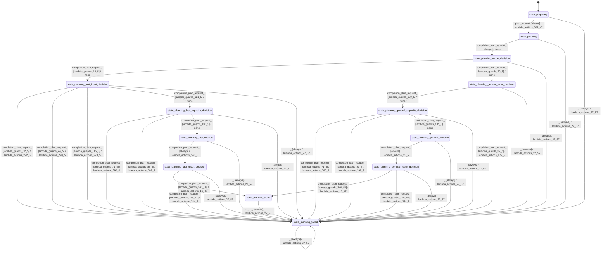

# batch_planner_modes_equal

Source: [`emel/batch/planner/modes/equal/sm.hpp`](https://github.com/stateforward/emel.cpp/blob/main/src/emel/batch/planner/modes/equal/sm.hpp)

## Mermaid

## Transitions

| Source | Event | Guard | Action | Target |
| --- | --- | --- | --- | --- |
| [`state_preparing`](https://github.com/stateforward/emel.cpp/blob/main/src/emel/batch/planner/modes/equal/sm.hpp) | [`plan_request`](https://github.com/stateforward/emel.cpp/blob/main/src/emel/batch/planner/modes/equal/sm.hpp) | [`always`](https://github.com/stateforward/emel.cpp/blob/main/src/emel/batch/planner/modes/equal/sm.hpp) | [`lambda_actions_301_47`](https://github.com/stateforward/emel.cpp/blob/main/src/emel/batch/planner/modes/equal/sm.hpp) | [`state_planning`](https://github.com/stateforward/emel.cpp/blob/main/src/emel/batch/planner/modes/equal/sm.hpp) |
| [`state_planning`](https://github.com/stateforward/emel.cpp/blob/main/src/emel/batch/planner/modes/equal/sm.hpp) | [`completion<plan_request>`](https://github.com/stateforward/emel.cpp/blob/main/src/emel/batch/planner/modes/equal/sm.hpp) | [`always`](https://github.com/stateforward/emel.cpp/blob/main/src/emel/batch/planner/modes/equal/sm.hpp) | [`none`](https://github.com/stateforward/emel.cpp/blob/main/src/emel/batch/planner/modes/equal/sm.hpp) | [`state_planning_mode_decision`](https://github.com/stateforward/emel.cpp/blob/main/src/emel/batch/planner/modes/equal/sm.hpp) |
| [`state_planning_mode_decision`](https://github.com/stateforward/emel.cpp/blob/main/src/emel/batch/planner/modes/equal/sm.hpp) | [`completion<plan_request>`](https://github.com/stateforward/emel.cpp/blob/main/src/emel/batch/planner/modes/equal/sm.hpp) | [`lambda_guards_14_5`](https://github.com/stateforward/emel.cpp/blob/main/src/emel/batch/planner/modes/equal/sm.hpp) | [`none`](https://github.com/stateforward/emel.cpp/blob/main/src/emel/batch/planner/modes/equal/sm.hpp) | [`state_planning_fast_input_decision`](https://github.com/stateforward/emel.cpp/blob/main/src/emel/batch/planner/modes/equal/sm.hpp) |
| [`state_planning_mode_decision`](https://github.com/stateforward/emel.cpp/blob/main/src/emel/batch/planner/modes/equal/sm.hpp) | [`completion<plan_request>`](https://github.com/stateforward/emel.cpp/blob/main/src/emel/batch/planner/modes/equal/sm.hpp) | [`lambda_guards_20_5`](https://github.com/stateforward/emel.cpp/blob/main/src/emel/batch/planner/modes/equal/sm.hpp) | [`none`](https://github.com/stateforward/emel.cpp/blob/main/src/emel/batch/planner/modes/equal/sm.hpp) | [`state_planning_general_input_decision`](https://github.com/stateforward/emel.cpp/blob/main/src/emel/batch/planner/modes/equal/sm.hpp) |
| [`state_planning_general_input_decision`](https://github.com/stateforward/emel.cpp/blob/main/src/emel/batch/planner/modes/equal/sm.hpp) | [`completion<plan_request>`](https://github.com/stateforward/emel.cpp/blob/main/src/emel/batch/planner/modes/equal/sm.hpp) | [`lambda_guards_129_5`](https://github.com/stateforward/emel.cpp/blob/main/src/emel/batch/planner/modes/equal/sm.hpp) | [`none`](https://github.com/stateforward/emel.cpp/blob/main/src/emel/batch/planner/modes/equal/sm.hpp) | [`state_planning_general_capacity_decision`](https://github.com/stateforward/emel.cpp/blob/main/src/emel/batch/planner/modes/equal/sm.hpp) |
| [`state_planning_general_input_decision`](https://github.com/stateforward/emel.cpp/blob/main/src/emel/batch/planner/modes/equal/sm.hpp) | [`completion<plan_request>`](https://github.com/stateforward/emel.cpp/blob/main/src/emel/batch/planner/modes/equal/sm.hpp) | [`lambda_guards_32_5`](https://github.com/stateforward/emel.cpp/blob/main/src/emel/batch/planner/modes/equal/sm.hpp) | [`lambda_actions_272_5`](https://github.com/stateforward/emel.cpp/blob/main/src/emel/batch/planner/modes/equal/sm.hpp) | [`state_planning_failed`](https://github.com/stateforward/emel.cpp/blob/main/src/emel/batch/planner/modes/equal/sm.hpp) |
| [`state_planning_general_capacity_decision`](https://github.com/stateforward/emel.cpp/blob/main/src/emel/batch/planner/modes/equal/sm.hpp) | [`completion<plan_request>`](https://github.com/stateforward/emel.cpp/blob/main/src/emel/batch/planner/modes/equal/sm.hpp) | [`lambda_guards_71_5`](https://github.com/stateforward/emel.cpp/blob/main/src/emel/batch/planner/modes/equal/sm.hpp) | [`lambda_actions_290_5`](https://github.com/stateforward/emel.cpp/blob/main/src/emel/batch/planner/modes/equal/sm.hpp) | [`state_planning_failed`](https://github.com/stateforward/emel.cpp/blob/main/src/emel/batch/planner/modes/equal/sm.hpp) |
| [`state_planning_general_capacity_decision`](https://github.com/stateforward/emel.cpp/blob/main/src/emel/batch/planner/modes/equal/sm.hpp) | [`completion<plan_request>`](https://github.com/stateforward/emel.cpp/blob/main/src/emel/batch/planner/modes/equal/sm.hpp) | [`lambda_guards_83_5`](https://github.com/stateforward/emel.cpp/blob/main/src/emel/batch/planner/modes/equal/sm.hpp) | [`lambda_actions_296_5`](https://github.com/stateforward/emel.cpp/blob/main/src/emel/batch/planner/modes/equal/sm.hpp) | [`state_planning_failed`](https://github.com/stateforward/emel.cpp/blob/main/src/emel/batch/planner/modes/equal/sm.hpp) |
| [`state_planning_general_capacity_decision`](https://github.com/stateforward/emel.cpp/blob/main/src/emel/batch/planner/modes/equal/sm.hpp) | [`completion<plan_request>`](https://github.com/stateforward/emel.cpp/blob/main/src/emel/batch/planner/modes/equal/sm.hpp) | [`lambda_guards_135_5`](https://github.com/stateforward/emel.cpp/blob/main/src/emel/batch/planner/modes/equal/sm.hpp) | [`none`](https://github.com/stateforward/emel.cpp/blob/main/src/emel/batch/planner/modes/equal/sm.hpp) | [`state_planning_general_execute`](https://github.com/stateforward/emel.cpp/blob/main/src/emel/batch/planner/modes/equal/sm.hpp) |
| [`state_planning_general_execute`](https://github.com/stateforward/emel.cpp/blob/main/src/emel/batch/planner/modes/equal/sm.hpp) | [`completion<plan_request>`](https://github.com/stateforward/emel.cpp/blob/main/src/emel/batch/planner/modes/equal/sm.hpp) | [`always`](https://github.com/stateforward/emel.cpp/blob/main/src/emel/batch/planner/modes/equal/sm.hpp) | [`lambda_actions_35_5`](https://github.com/stateforward/emel.cpp/blob/main/src/emel/batch/planner/modes/equal/sm.hpp) | [`state_planning_general_result_decision`](https://github.com/stateforward/emel.cpp/blob/main/src/emel/batch/planner/modes/equal/sm.hpp) |
| [`state_planning_fast_input_decision`](https://github.com/stateforward/emel.cpp/blob/main/src/emel/batch/planner/modes/equal/sm.hpp) | [`completion<plan_request>`](https://github.com/stateforward/emel.cpp/blob/main/src/emel/batch/planner/modes/equal/sm.hpp) | [`lambda_guards_32_5`](https://github.com/stateforward/emel.cpp/blob/main/src/emel/batch/planner/modes/equal/sm.hpp) | [`lambda_actions_272_5`](https://github.com/stateforward/emel.cpp/blob/main/src/emel/batch/planner/modes/equal/sm.hpp) | [`state_planning_failed`](https://github.com/stateforward/emel.cpp/blob/main/src/emel/batch/planner/modes/equal/sm.hpp) |
| [`state_planning_fast_input_decision`](https://github.com/stateforward/emel.cpp/blob/main/src/emel/batch/planner/modes/equal/sm.hpp) | [`completion<plan_request>`](https://github.com/stateforward/emel.cpp/blob/main/src/emel/batch/planner/modes/equal/sm.hpp) | [`lambda_guards_44_5`](https://github.com/stateforward/emel.cpp/blob/main/src/emel/batch/planner/modes/equal/sm.hpp) | [`lambda_actions_278_5`](https://github.com/stateforward/emel.cpp/blob/main/src/emel/batch/planner/modes/equal/sm.hpp) | [`state_planning_failed`](https://github.com/stateforward/emel.cpp/blob/main/src/emel/batch/planner/modes/equal/sm.hpp) |
| [`state_planning_fast_input_decision`](https://github.com/stateforward/emel.cpp/blob/main/src/emel/batch/planner/modes/equal/sm.hpp) | [`completion<plan_request>`](https://github.com/stateforward/emel.cpp/blob/main/src/emel/batch/planner/modes/equal/sm.hpp) | [`lambda_guards_115_5`](https://github.com/stateforward/emel.cpp/blob/main/src/emel/batch/planner/modes/equal/sm.hpp) | [`lambda_actions_278_5`](https://github.com/stateforward/emel.cpp/blob/main/src/emel/batch/planner/modes/equal/sm.hpp) | [`state_planning_failed`](https://github.com/stateforward/emel.cpp/blob/main/src/emel/batch/planner/modes/equal/sm.hpp) |
| [`state_planning_fast_input_decision`](https://github.com/stateforward/emel.cpp/blob/main/src/emel/batch/planner/modes/equal/sm.hpp) | [`completion<plan_request>`](https://github.com/stateforward/emel.cpp/blob/main/src/emel/batch/planner/modes/equal/sm.hpp) | [`lambda_guards_121_5`](https://github.com/stateforward/emel.cpp/blob/main/src/emel/batch/planner/modes/equal/sm.hpp) | [`none`](https://github.com/stateforward/emel.cpp/blob/main/src/emel/batch/planner/modes/equal/sm.hpp) | [`state_planning_fast_capacity_decision`](https://github.com/stateforward/emel.cpp/blob/main/src/emel/batch/planner/modes/equal/sm.hpp) |
| [`state_planning_fast_capacity_decision`](https://github.com/stateforward/emel.cpp/blob/main/src/emel/batch/planner/modes/equal/sm.hpp) | [`completion<plan_request>`](https://github.com/stateforward/emel.cpp/blob/main/src/emel/batch/planner/modes/equal/sm.hpp) | [`lambda_guards_71_5`](https://github.com/stateforward/emel.cpp/blob/main/src/emel/batch/planner/modes/equal/sm.hpp) | [`lambda_actions_290_5`](https://github.com/stateforward/emel.cpp/blob/main/src/emel/batch/planner/modes/equal/sm.hpp) | [`state_planning_failed`](https://github.com/stateforward/emel.cpp/blob/main/src/emel/batch/planner/modes/equal/sm.hpp) |
| [`state_planning_fast_capacity_decision`](https://github.com/stateforward/emel.cpp/blob/main/src/emel/batch/planner/modes/equal/sm.hpp) | [`completion<plan_request>`](https://github.com/stateforward/emel.cpp/blob/main/src/emel/batch/planner/modes/equal/sm.hpp) | [`lambda_guards_83_5`](https://github.com/stateforward/emel.cpp/blob/main/src/emel/batch/planner/modes/equal/sm.hpp) | [`lambda_actions_296_5`](https://github.com/stateforward/emel.cpp/blob/main/src/emel/batch/planner/modes/equal/sm.hpp) | [`state_planning_failed`](https://github.com/stateforward/emel.cpp/blob/main/src/emel/batch/planner/modes/equal/sm.hpp) |
| [`state_planning_fast_capacity_decision`](https://github.com/stateforward/emel.cpp/blob/main/src/emel/batch/planner/modes/equal/sm.hpp) | [`completion<plan_request>`](https://github.com/stateforward/emel.cpp/blob/main/src/emel/batch/planner/modes/equal/sm.hpp) | [`lambda_guards_135_5`](https://github.com/stateforward/emel.cpp/blob/main/src/emel/batch/planner/modes/equal/sm.hpp) | [`none`](https://github.com/stateforward/emel.cpp/blob/main/src/emel/batch/planner/modes/equal/sm.hpp) | [`state_planning_fast_execute`](https://github.com/stateforward/emel.cpp/blob/main/src/emel/batch/planner/modes/equal/sm.hpp) |
| [`state_planning_fast_execute`](https://github.com/stateforward/emel.cpp/blob/main/src/emel/batch/planner/modes/equal/sm.hpp) | [`completion<plan_request>`](https://github.com/stateforward/emel.cpp/blob/main/src/emel/batch/planner/modes/equal/sm.hpp) | [`always`](https://github.com/stateforward/emel.cpp/blob/main/src/emel/batch/planner/modes/equal/sm.hpp) | [`lambda_actions_148_5`](https://github.com/stateforward/emel.cpp/blob/main/src/emel/batch/planner/modes/equal/sm.hpp) | [`state_planning_fast_result_decision`](https://github.com/stateforward/emel.cpp/blob/main/src/emel/batch/planner/modes/equal/sm.hpp) |
| [`state_planning_general_result_decision`](https://github.com/stateforward/emel.cpp/blob/main/src/emel/batch/planner/modes/equal/sm.hpp) | [`completion<plan_request>`](https://github.com/stateforward/emel.cpp/blob/main/src/emel/batch/planner/modes/equal/sm.hpp) | [`lambda_guards_140_50`](https://github.com/stateforward/emel.cpp/blob/main/src/emel/batch/planner/modes/equal/sm.hpp) | [`lambda_actions_16_47`](https://github.com/stateforward/emel.cpp/blob/main/src/emel/batch/planner/modes/equal/sm.hpp) | [`state_planning_done`](https://github.com/stateforward/emel.cpp/blob/main/src/emel/batch/planner/modes/equal/sm.hpp) |
| [`state_planning_general_result_decision`](https://github.com/stateforward/emel.cpp/blob/main/src/emel/batch/planner/modes/equal/sm.hpp) | [`completion<plan_request>`](https://github.com/stateforward/emel.cpp/blob/main/src/emel/batch/planner/modes/equal/sm.hpp) | [`lambda_guards_145_47`](https://github.com/stateforward/emel.cpp/blob/main/src/emel/batch/planner/modes/equal/sm.hpp) | [`lambda_actions_284_5`](https://github.com/stateforward/emel.cpp/blob/main/src/emel/batch/planner/modes/equal/sm.hpp) | [`state_planning_failed`](https://github.com/stateforward/emel.cpp/blob/main/src/emel/batch/planner/modes/equal/sm.hpp) |
| [`state_planning_fast_result_decision`](https://github.com/stateforward/emel.cpp/blob/main/src/emel/batch/planner/modes/equal/sm.hpp) | [`completion<plan_request>`](https://github.com/stateforward/emel.cpp/blob/main/src/emel/batch/planner/modes/equal/sm.hpp) | [`lambda_guards_140_50`](https://github.com/stateforward/emel.cpp/blob/main/src/emel/batch/planner/modes/equal/sm.hpp) | [`lambda_actions_16_47`](https://github.com/stateforward/emel.cpp/blob/main/src/emel/batch/planner/modes/equal/sm.hpp) | [`state_planning_done`](https://github.com/stateforward/emel.cpp/blob/main/src/emel/batch/planner/modes/equal/sm.hpp) |
| [`state_planning_fast_result_decision`](https://github.com/stateforward/emel.cpp/blob/main/src/emel/batch/planner/modes/equal/sm.hpp) | [`completion<plan_request>`](https://github.com/stateforward/emel.cpp/blob/main/src/emel/batch/planner/modes/equal/sm.hpp) | [`lambda_guards_145_47`](https://github.com/stateforward/emel.cpp/blob/main/src/emel/batch/planner/modes/equal/sm.hpp) | [`lambda_actions_284_5`](https://github.com/stateforward/emel.cpp/blob/main/src/emel/batch/planner/modes/equal/sm.hpp) | [`state_planning_failed`](https://github.com/stateforward/emel.cpp/blob/main/src/emel/batch/planner/modes/equal/sm.hpp) |
| [`state_preparing`](https://github.com/stateforward/emel.cpp/blob/main/src/emel/batch/planner/modes/equal/sm.hpp) | [`_`](https://github.com/stateforward/emel.cpp/blob/main/src/emel/batch/planner/modes/equal/sm.hpp) | [`always`](https://github.com/stateforward/emel.cpp/blob/main/src/emel/batch/planner/modes/equal/sm.hpp) | [`lambda_actions_27_57`](https://github.com/stateforward/emel.cpp/blob/main/src/emel/batch/planner/modes/equal/sm.hpp) | [`state_planning_failed`](https://github.com/stateforward/emel.cpp/blob/main/src/emel/batch/planner/modes/equal/sm.hpp) |
| [`state_planning`](https://github.com/stateforward/emel.cpp/blob/main/src/emel/batch/planner/modes/equal/sm.hpp) | [`_`](https://github.com/stateforward/emel.cpp/blob/main/src/emel/batch/planner/modes/equal/sm.hpp) | [`always`](https://github.com/stateforward/emel.cpp/blob/main/src/emel/batch/planner/modes/equal/sm.hpp) | [`lambda_actions_27_57`](https://github.com/stateforward/emel.cpp/blob/main/src/emel/batch/planner/modes/equal/sm.hpp) | [`state_planning_failed`](https://github.com/stateforward/emel.cpp/blob/main/src/emel/batch/planner/modes/equal/sm.hpp) |
| [`state_planning_mode_decision`](https://github.com/stateforward/emel.cpp/blob/main/src/emel/batch/planner/modes/equal/sm.hpp) | [`_`](https://github.com/stateforward/emel.cpp/blob/main/src/emel/batch/planner/modes/equal/sm.hpp) | [`always`](https://github.com/stateforward/emel.cpp/blob/main/src/emel/batch/planner/modes/equal/sm.hpp) | [`lambda_actions_27_57`](https://github.com/stateforward/emel.cpp/blob/main/src/emel/batch/planner/modes/equal/sm.hpp) | [`state_planning_failed`](https://github.com/stateforward/emel.cpp/blob/main/src/emel/batch/planner/modes/equal/sm.hpp) |
| [`state_planning_fast_input_decision`](https://github.com/stateforward/emel.cpp/blob/main/src/emel/batch/planner/modes/equal/sm.hpp) | [`_`](https://github.com/stateforward/emel.cpp/blob/main/src/emel/batch/planner/modes/equal/sm.hpp) | [`always`](https://github.com/stateforward/emel.cpp/blob/main/src/emel/batch/planner/modes/equal/sm.hpp) | [`lambda_actions_27_57`](https://github.com/stateforward/emel.cpp/blob/main/src/emel/batch/planner/modes/equal/sm.hpp) | [`state_planning_failed`](https://github.com/stateforward/emel.cpp/blob/main/src/emel/batch/planner/modes/equal/sm.hpp) |
| [`state_planning_fast_capacity_decision`](https://github.com/stateforward/emel.cpp/blob/main/src/emel/batch/planner/modes/equal/sm.hpp) | [`_`](https://github.com/stateforward/emel.cpp/blob/main/src/emel/batch/planner/modes/equal/sm.hpp) | [`always`](https://github.com/stateforward/emel.cpp/blob/main/src/emel/batch/planner/modes/equal/sm.hpp) | [`lambda_actions_27_57`](https://github.com/stateforward/emel.cpp/blob/main/src/emel/batch/planner/modes/equal/sm.hpp) | [`state_planning_failed`](https://github.com/stateforward/emel.cpp/blob/main/src/emel/batch/planner/modes/equal/sm.hpp) |
| [`state_planning_fast_execute`](https://github.com/stateforward/emel.cpp/blob/main/src/emel/batch/planner/modes/equal/sm.hpp) | [`_`](https://github.com/stateforward/emel.cpp/blob/main/src/emel/batch/planner/modes/equal/sm.hpp) | [`always`](https://github.com/stateforward/emel.cpp/blob/main/src/emel/batch/planner/modes/equal/sm.hpp) | [`lambda_actions_27_57`](https://github.com/stateforward/emel.cpp/blob/main/src/emel/batch/planner/modes/equal/sm.hpp) | [`state_planning_failed`](https://github.com/stateforward/emel.cpp/blob/main/src/emel/batch/planner/modes/equal/sm.hpp) |
| [`state_planning_general_input_decision`](https://github.com/stateforward/emel.cpp/blob/main/src/emel/batch/planner/modes/equal/sm.hpp) | [`_`](https://github.com/stateforward/emel.cpp/blob/main/src/emel/batch/planner/modes/equal/sm.hpp) | [`always`](https://github.com/stateforward/emel.cpp/blob/main/src/emel/batch/planner/modes/equal/sm.hpp) | [`lambda_actions_27_57`](https://github.com/stateforward/emel.cpp/blob/main/src/emel/batch/planner/modes/equal/sm.hpp) | [`state_planning_failed`](https://github.com/stateforward/emel.cpp/blob/main/src/emel/batch/planner/modes/equal/sm.hpp) |
| [`state_planning_general_capacity_decision`](https://github.com/stateforward/emel.cpp/blob/main/src/emel/batch/planner/modes/equal/sm.hpp) | [`_`](https://github.com/stateforward/emel.cpp/blob/main/src/emel/batch/planner/modes/equal/sm.hpp) | [`always`](https://github.com/stateforward/emel.cpp/blob/main/src/emel/batch/planner/modes/equal/sm.hpp) | [`lambda_actions_27_57`](https://github.com/stateforward/emel.cpp/blob/main/src/emel/batch/planner/modes/equal/sm.hpp) | [`state_planning_failed`](https://github.com/stateforward/emel.cpp/blob/main/src/emel/batch/planner/modes/equal/sm.hpp) |
| [`state_planning_general_execute`](https://github.com/stateforward/emel.cpp/blob/main/src/emel/batch/planner/modes/equal/sm.hpp) | [`_`](https://github.com/stateforward/emel.cpp/blob/main/src/emel/batch/planner/modes/equal/sm.hpp) | [`always`](https://github.com/stateforward/emel.cpp/blob/main/src/emel/batch/planner/modes/equal/sm.hpp) | [`lambda_actions_27_57`](https://github.com/stateforward/emel.cpp/blob/main/src/emel/batch/planner/modes/equal/sm.hpp) | [`state_planning_failed`](https://github.com/stateforward/emel.cpp/blob/main/src/emel/batch/planner/modes/equal/sm.hpp) |
| [`state_planning_general_result_decision`](https://github.com/stateforward/emel.cpp/blob/main/src/emel/batch/planner/modes/equal/sm.hpp) | [`_`](https://github.com/stateforward/emel.cpp/blob/main/src/emel/batch/planner/modes/equal/sm.hpp) | [`always`](https://github.com/stateforward/emel.cpp/blob/main/src/emel/batch/planner/modes/equal/sm.hpp) | [`lambda_actions_27_57`](https://github.com/stateforward/emel.cpp/blob/main/src/emel/batch/planner/modes/equal/sm.hpp) | [`state_planning_failed`](https://github.com/stateforward/emel.cpp/blob/main/src/emel/batch/planner/modes/equal/sm.hpp) |
| [`state_planning_fast_result_decision`](https://github.com/stateforward/emel.cpp/blob/main/src/emel/batch/planner/modes/equal/sm.hpp) | [`_`](https://github.com/stateforward/emel.cpp/blob/main/src/emel/batch/planner/modes/equal/sm.hpp) | [`always`](https://github.com/stateforward/emel.cpp/blob/main/src/emel/batch/planner/modes/equal/sm.hpp) | [`lambda_actions_27_57`](https://github.com/stateforward/emel.cpp/blob/main/src/emel/batch/planner/modes/equal/sm.hpp) | [`state_planning_failed`](https://github.com/stateforward/emel.cpp/blob/main/src/emel/batch/planner/modes/equal/sm.hpp) |
| [`state_planning_done`](https://github.com/stateforward/emel.cpp/blob/main/src/emel/batch/planner/modes/equal/sm.hpp) | [`_`](https://github.com/stateforward/emel.cpp/blob/main/src/emel/batch/planner/modes/equal/sm.hpp) | [`always`](https://github.com/stateforward/emel.cpp/blob/main/src/emel/batch/planner/modes/equal/sm.hpp) | [`lambda_actions_27_57`](https://github.com/stateforward/emel.cpp/blob/main/src/emel/batch/planner/modes/equal/sm.hpp) | [`state_planning_failed`](https://github.com/stateforward/emel.cpp/blob/main/src/emel/batch/planner/modes/equal/sm.hpp) |
| [`state_planning_failed`](https://github.com/stateforward/emel.cpp/blob/main/src/emel/batch/planner/modes/equal/sm.hpp) | [`_`](https://github.com/stateforward/emel.cpp/blob/main/src/emel/batch/planner/modes/equal/sm.hpp) | [`always`](https://github.com/stateforward/emel.cpp/blob/main/src/emel/batch/planner/modes/equal/sm.hpp) | [`lambda_actions_27_57`](https://github.com/stateforward/emel.cpp/blob/main/src/emel/batch/planner/modes/equal/sm.hpp) | [`state_planning_failed`](https://github.com/stateforward/emel.cpp/blob/main/src/emel/batch/planner/modes/equal/sm.hpp) |
