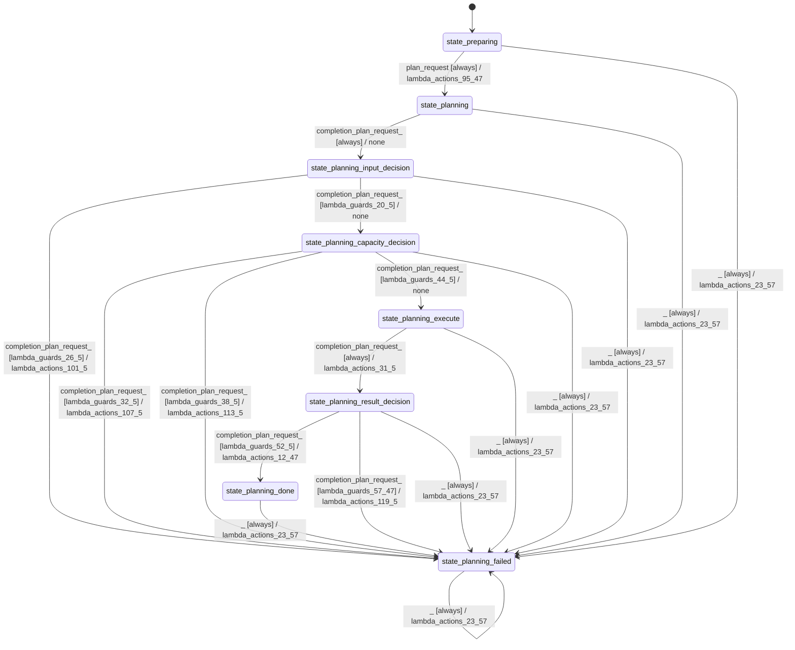

# batch_planner_modes_sequential

Source: [`emel/batch/planner/modes/sequential/sm.hpp`](https://github.com/stateforward/emel.cpp/blob/main/src/emel/batch/planner/modes/sequential/sm.hpp)

## Mermaid

## Transitions

| Source | Event | Guard | Action | Target |
| --- | --- | --- | --- | --- |
| [`state_preparing`](https://github.com/stateforward/emel.cpp/blob/main/src/emel/batch/planner/modes/sequential/sm.hpp) | [`plan_request`](https://github.com/stateforward/emel.cpp/blob/main/src/emel/batch/planner/modes/sequential/sm.hpp) | [`always`](https://github.com/stateforward/emel.cpp/blob/main/src/emel/batch/planner/modes/sequential/sm.hpp) | [`lambda_actions_95_47`](https://github.com/stateforward/emel.cpp/blob/main/src/emel/batch/planner/modes/sequential/sm.hpp) | [`state_planning`](https://github.com/stateforward/emel.cpp/blob/main/src/emel/batch/planner/modes/sequential/sm.hpp) |
| [`state_planning`](https://github.com/stateforward/emel.cpp/blob/main/src/emel/batch/planner/modes/sequential/sm.hpp) | [`completion<plan_request>`](https://github.com/stateforward/emel.cpp/blob/main/src/emel/batch/planner/modes/sequential/sm.hpp) | [`always`](https://github.com/stateforward/emel.cpp/blob/main/src/emel/batch/planner/modes/sequential/sm.hpp) | [`none`](https://github.com/stateforward/emel.cpp/blob/main/src/emel/batch/planner/modes/sequential/sm.hpp) | [`state_planning_input_decision`](https://github.com/stateforward/emel.cpp/blob/main/src/emel/batch/planner/modes/sequential/sm.hpp) |
| [`state_planning_input_decision`](https://github.com/stateforward/emel.cpp/blob/main/src/emel/batch/planner/modes/sequential/sm.hpp) | [`completion<plan_request>`](https://github.com/stateforward/emel.cpp/blob/main/src/emel/batch/planner/modes/sequential/sm.hpp) | [`lambda_guards_26_5`](https://github.com/stateforward/emel.cpp/blob/main/src/emel/batch/planner/modes/sequential/sm.hpp) | [`lambda_actions_101_5`](https://github.com/stateforward/emel.cpp/blob/main/src/emel/batch/planner/modes/sequential/sm.hpp) | [`state_planning_failed`](https://github.com/stateforward/emel.cpp/blob/main/src/emel/batch/planner/modes/sequential/sm.hpp) |
| [`state_planning_input_decision`](https://github.com/stateforward/emel.cpp/blob/main/src/emel/batch/planner/modes/sequential/sm.hpp) | [`completion<plan_request>`](https://github.com/stateforward/emel.cpp/blob/main/src/emel/batch/planner/modes/sequential/sm.hpp) | [`lambda_guards_20_5`](https://github.com/stateforward/emel.cpp/blob/main/src/emel/batch/planner/modes/sequential/sm.hpp) | [`none`](https://github.com/stateforward/emel.cpp/blob/main/src/emel/batch/planner/modes/sequential/sm.hpp) | [`state_planning_capacity_decision`](https://github.com/stateforward/emel.cpp/blob/main/src/emel/batch/planner/modes/sequential/sm.hpp) |
| [`state_planning_capacity_decision`](https://github.com/stateforward/emel.cpp/blob/main/src/emel/batch/planner/modes/sequential/sm.hpp) | [`completion<plan_request>`](https://github.com/stateforward/emel.cpp/blob/main/src/emel/batch/planner/modes/sequential/sm.hpp) | [`lambda_guards_32_5`](https://github.com/stateforward/emel.cpp/blob/main/src/emel/batch/planner/modes/sequential/sm.hpp) | [`lambda_actions_107_5`](https://github.com/stateforward/emel.cpp/blob/main/src/emel/batch/planner/modes/sequential/sm.hpp) | [`state_planning_failed`](https://github.com/stateforward/emel.cpp/blob/main/src/emel/batch/planner/modes/sequential/sm.hpp) |
| [`state_planning_capacity_decision`](https://github.com/stateforward/emel.cpp/blob/main/src/emel/batch/planner/modes/sequential/sm.hpp) | [`completion<plan_request>`](https://github.com/stateforward/emel.cpp/blob/main/src/emel/batch/planner/modes/sequential/sm.hpp) | [`lambda_guards_38_5`](https://github.com/stateforward/emel.cpp/blob/main/src/emel/batch/planner/modes/sequential/sm.hpp) | [`lambda_actions_113_5`](https://github.com/stateforward/emel.cpp/blob/main/src/emel/batch/planner/modes/sequential/sm.hpp) | [`state_planning_failed`](https://github.com/stateforward/emel.cpp/blob/main/src/emel/batch/planner/modes/sequential/sm.hpp) |
| [`state_planning_capacity_decision`](https://github.com/stateforward/emel.cpp/blob/main/src/emel/batch/planner/modes/sequential/sm.hpp) | [`completion<plan_request>`](https://github.com/stateforward/emel.cpp/blob/main/src/emel/batch/planner/modes/sequential/sm.hpp) | [`lambda_guards_44_5`](https://github.com/stateforward/emel.cpp/blob/main/src/emel/batch/planner/modes/sequential/sm.hpp) | [`none`](https://github.com/stateforward/emel.cpp/blob/main/src/emel/batch/planner/modes/sequential/sm.hpp) | [`state_planning_execute`](https://github.com/stateforward/emel.cpp/blob/main/src/emel/batch/planner/modes/sequential/sm.hpp) |
| [`state_planning_execute`](https://github.com/stateforward/emel.cpp/blob/main/src/emel/batch/planner/modes/sequential/sm.hpp) | [`completion<plan_request>`](https://github.com/stateforward/emel.cpp/blob/main/src/emel/batch/planner/modes/sequential/sm.hpp) | [`always`](https://github.com/stateforward/emel.cpp/blob/main/src/emel/batch/planner/modes/sequential/sm.hpp) | [`lambda_actions_31_5`](https://github.com/stateforward/emel.cpp/blob/main/src/emel/batch/planner/modes/sequential/sm.hpp) | [`state_planning_result_decision`](https://github.com/stateforward/emel.cpp/blob/main/src/emel/batch/planner/modes/sequential/sm.hpp) |
| [`state_planning_result_decision`](https://github.com/stateforward/emel.cpp/blob/main/src/emel/batch/planner/modes/sequential/sm.hpp) | [`completion<plan_request>`](https://github.com/stateforward/emel.cpp/blob/main/src/emel/batch/planner/modes/sequential/sm.hpp) | [`lambda_guards_52_5`](https://github.com/stateforward/emel.cpp/blob/main/src/emel/batch/planner/modes/sequential/sm.hpp) | [`lambda_actions_12_47`](https://github.com/stateforward/emel.cpp/blob/main/src/emel/batch/planner/modes/sequential/sm.hpp) | [`state_planning_done`](https://github.com/stateforward/emel.cpp/blob/main/src/emel/batch/planner/modes/sequential/sm.hpp) |
| [`state_planning_result_decision`](https://github.com/stateforward/emel.cpp/blob/main/src/emel/batch/planner/modes/sequential/sm.hpp) | [`completion<plan_request>`](https://github.com/stateforward/emel.cpp/blob/main/src/emel/batch/planner/modes/sequential/sm.hpp) | [`lambda_guards_57_47`](https://github.com/stateforward/emel.cpp/blob/main/src/emel/batch/planner/modes/sequential/sm.hpp) | [`lambda_actions_119_5`](https://github.com/stateforward/emel.cpp/blob/main/src/emel/batch/planner/modes/sequential/sm.hpp) | [`state_planning_failed`](https://github.com/stateforward/emel.cpp/blob/main/src/emel/batch/planner/modes/sequential/sm.hpp) |
| [`state_planning_done`](https://github.com/stateforward/emel.cpp/blob/main/src/emel/batch/planner/modes/sequential/sm.hpp) | [`_`](https://github.com/stateforward/emel.cpp/blob/main/src/emel/batch/planner/modes/sequential/sm.hpp) | [`always`](https://github.com/stateforward/emel.cpp/blob/main/src/emel/batch/planner/modes/sequential/sm.hpp) | [`lambda_actions_23_57`](https://github.com/stateforward/emel.cpp/blob/main/src/emel/batch/planner/modes/sequential/sm.hpp) | [`state_planning_failed`](https://github.com/stateforward/emel.cpp/blob/main/src/emel/batch/planner/modes/sequential/sm.hpp) |
| [`state_planning_failed`](https://github.com/stateforward/emel.cpp/blob/main/src/emel/batch/planner/modes/sequential/sm.hpp) | [`_`](https://github.com/stateforward/emel.cpp/blob/main/src/emel/batch/planner/modes/sequential/sm.hpp) | [`always`](https://github.com/stateforward/emel.cpp/blob/main/src/emel/batch/planner/modes/sequential/sm.hpp) | [`lambda_actions_23_57`](https://github.com/stateforward/emel.cpp/blob/main/src/emel/batch/planner/modes/sequential/sm.hpp) | [`state_planning_failed`](https://github.com/stateforward/emel.cpp/blob/main/src/emel/batch/planner/modes/sequential/sm.hpp) |
| [`state_preparing`](https://github.com/stateforward/emel.cpp/blob/main/src/emel/batch/planner/modes/sequential/sm.hpp) | [`_`](https://github.com/stateforward/emel.cpp/blob/main/src/emel/batch/planner/modes/sequential/sm.hpp) | [`always`](https://github.com/stateforward/emel.cpp/blob/main/src/emel/batch/planner/modes/sequential/sm.hpp) | [`lambda_actions_23_57`](https://github.com/stateforward/emel.cpp/blob/main/src/emel/batch/planner/modes/sequential/sm.hpp) | [`state_planning_failed`](https://github.com/stateforward/emel.cpp/blob/main/src/emel/batch/planner/modes/sequential/sm.hpp) |
| [`state_planning`](https://github.com/stateforward/emel.cpp/blob/main/src/emel/batch/planner/modes/sequential/sm.hpp) | [`_`](https://github.com/stateforward/emel.cpp/blob/main/src/emel/batch/planner/modes/sequential/sm.hpp) | [`always`](https://github.com/stateforward/emel.cpp/blob/main/src/emel/batch/planner/modes/sequential/sm.hpp) | [`lambda_actions_23_57`](https://github.com/stateforward/emel.cpp/blob/main/src/emel/batch/planner/modes/sequential/sm.hpp) | [`state_planning_failed`](https://github.com/stateforward/emel.cpp/blob/main/src/emel/batch/planner/modes/sequential/sm.hpp) |
| [`state_planning_input_decision`](https://github.com/stateforward/emel.cpp/blob/main/src/emel/batch/planner/modes/sequential/sm.hpp) | [`_`](https://github.com/stateforward/emel.cpp/blob/main/src/emel/batch/planner/modes/sequential/sm.hpp) | [`always`](https://github.com/stateforward/emel.cpp/blob/main/src/emel/batch/planner/modes/sequential/sm.hpp) | [`lambda_actions_23_57`](https://github.com/stateforward/emel.cpp/blob/main/src/emel/batch/planner/modes/sequential/sm.hpp) | [`state_planning_failed`](https://github.com/stateforward/emel.cpp/blob/main/src/emel/batch/planner/modes/sequential/sm.hpp) |
| [`state_planning_capacity_decision`](https://github.com/stateforward/emel.cpp/blob/main/src/emel/batch/planner/modes/sequential/sm.hpp) | [`_`](https://github.com/stateforward/emel.cpp/blob/main/src/emel/batch/planner/modes/sequential/sm.hpp) | [`always`](https://github.com/stateforward/emel.cpp/blob/main/src/emel/batch/planner/modes/sequential/sm.hpp) | [`lambda_actions_23_57`](https://github.com/stateforward/emel.cpp/blob/main/src/emel/batch/planner/modes/sequential/sm.hpp) | [`state_planning_failed`](https://github.com/stateforward/emel.cpp/blob/main/src/emel/batch/planner/modes/sequential/sm.hpp) |
| [`state_planning_execute`](https://github.com/stateforward/emel.cpp/blob/main/src/emel/batch/planner/modes/sequential/sm.hpp) | [`_`](https://github.com/stateforward/emel.cpp/blob/main/src/emel/batch/planner/modes/sequential/sm.hpp) | [`always`](https://github.com/stateforward/emel.cpp/blob/main/src/emel/batch/planner/modes/sequential/sm.hpp) | [`lambda_actions_23_57`](https://github.com/stateforward/emel.cpp/blob/main/src/emel/batch/planner/modes/sequential/sm.hpp) | [`state_planning_failed`](https://github.com/stateforward/emel.cpp/blob/main/src/emel/batch/planner/modes/sequential/sm.hpp) |
| [`state_planning_result_decision`](https://github.com/stateforward/emel.cpp/blob/main/src/emel/batch/planner/modes/sequential/sm.hpp) | [`_`](https://github.com/stateforward/emel.cpp/blob/main/src/emel/batch/planner/modes/sequential/sm.hpp) | [`always`](https://github.com/stateforward/emel.cpp/blob/main/src/emel/batch/planner/modes/sequential/sm.hpp) | [`lambda_actions_23_57`](https://github.com/stateforward/emel.cpp/blob/main/src/emel/batch/planner/modes/sequential/sm.hpp) | [`state_planning_failed`](https://github.com/stateforward/emel.cpp/blob/main/src/emel/batch/planner/modes/sequential/sm.hpp) |
