# cact_loader

Source: [`emel/cact/loader/sm.hpp`](https://github.com/stateforward/emel.cpp/blob/main/src/emel/cact/loader/sm.hpp)

## Mermaid

```mermaid
stateDiagram-v2
  direction TB
  [*] --> state_uninitialized
  state_uninitialized --> state_probe_request_decision : probe_runtime [always] / effect_begin_probe_
  state_probed --> state_probe_request_decision : probe_runtime [always] / effect_begin_probe_
  state_bound --> state_probe_request_decision : probe_runtime [always] / effect_begin_probe_
  state_parsed --> state_probe_request_decision : probe_runtime [always] / effect_begin_probe_
  state_errored --> state_probe_request_decision : probe_runtime [always] / effect_begin_probe_
  state_probe_request_decision --> state_probe_outcome_dispatch : completion_probe_runtime_ [guard_probe_valid_request_] / effect_exec_probe_
  state_probe_request_decision --> state_probe_outcome_dispatch : completion_probe_runtime_ [guard_probe_invalid_request_] / effect_mark_probe_invalid_request_
  state_probe_outcome_dispatch --> state_probe_geometry_dispatch : completion_probe_runtime_ [guard_probe_error_none_] / effect_commit_probe_geometry_
  state_probe_geometry_dispatch --> state_probed : completion_probe_runtime_ [always] / effect_publish_probe_done_
  state_probe_outcome_dispatch --> state_errored : completion_probe_runtime_ [guard_probe_error_invalid_request_] / effect_publish_probe_error_
  state_probe_outcome_dispatch --> state_errored : completion_probe_runtime_ [guard_probe_error_model_invalid_] / effect_publish_probe_error_
  state_probe_outcome_dispatch --> state_errored : completion_probe_runtime_ [guard_probe_error_capacity_] / effect_publish_probe_error_
  state_probe_outcome_dispatch --> state_errored : completion_probe_runtime_ [guard_probe_error_parse_failed_] / effect_publish_probe_error_
  state_probe_outcome_dispatch --> state_errored : completion_probe_runtime_ [guard_probe_error_internal_error_] / effect_publish_probe_error_
  state_probe_outcome_dispatch --> state_errored : completion_probe_runtime_ [guard_probe_error_untracked_] / effect_publish_probe_error_
  state_probe_outcome_dispatch --> state_errored : completion_probe_runtime_ [guard_probe_error_unknown_] / effect_publish_probe_error_
  state_probed --> state_bind_request_decision : bind_runtime [always] / effect_begin_bind_
  state_bound --> state_bind_request_decision : bind_runtime [always] / effect_begin_bind_
  state_parsed --> state_bind_request_decision : bind_runtime [always] / effect_begin_bind_
  state_uninitialized --> state_bind_outcome_dispatch : bind_runtime [always] / effect_mark_bind_invalid_request_
  state_errored --> state_bind_outcome_dispatch : bind_runtime [always] / effect_mark_bind_invalid_request_
  state_bind_request_decision --> state_bind_request_shape_decision : completion_bind_runtime_ [always] / none
  state_bind_request_shape_decision --> state_bind_capacity_decision : completion_bind_runtime_ [guard_bind_valid_request_] / none
  state_bind_request_shape_decision --> state_bind_outcome_dispatch : completion_bind_runtime_ [guard_bind_invalid_request_] / effect_mark_bind_invalid_request_
  state_bind_request_shape_decision --> state_bind_outcome_dispatch : completion_bind_runtime_ [always] / effect_mark_bind_invalid_request_
  state_bind_capacity_decision --> state_bind_outcome_dispatch : completion_bind_runtime_ [guard_bind_capacity_sufficient_] / effect_exec_bind_
  state_bind_capacity_decision --> state_bind_outcome_dispatch : completion_bind_runtime_ [guard_bind_capacity_insufficient_] / effect_mark_bind_capacity_
  state_bind_capacity_decision --> state_bind_outcome_dispatch : completion_bind_runtime_ [always] / effect_mark_bind_capacity_
  state_bind_outcome_dispatch --> state_bound : completion_bind_runtime_ [guard_bind_error_none_] / effect_publish_bind_done_
  state_bind_outcome_dispatch --> state_errored : completion_bind_runtime_ [guard_bind_error_invalid_request_] / effect_publish_bind_error_
  state_bind_outcome_dispatch --> state_errored : completion_bind_runtime_ [guard_bind_error_model_invalid_] / effect_publish_bind_error_
  state_bind_outcome_dispatch --> state_errored : completion_bind_runtime_ [guard_bind_error_capacity_] / effect_publish_bind_error_
  state_bind_outcome_dispatch --> state_errored : completion_bind_runtime_ [guard_bind_error_parse_failed_] / effect_publish_bind_error_
  state_bind_outcome_dispatch --> state_errored : completion_bind_runtime_ [guard_bind_error_internal_error_] / effect_publish_bind_error_
  state_bind_outcome_dispatch --> state_errored : completion_bind_runtime_ [guard_bind_error_untracked_] / effect_publish_bind_error_
  state_bind_outcome_dispatch --> state_errored : completion_bind_runtime_ [guard_bind_error_unknown_] / effect_publish_bind_error_
  state_bound --> state_parse_request_decision : parse_runtime [always] / effect_begin_parse_
  state_parsed --> state_parse_request_decision : parse_runtime [always] / effect_begin_parse_
  state_uninitialized --> state_parse_outcome_dispatch : parse_runtime [always] / effect_mark_parse_invalid_request_
  state_probed --> state_parse_outcome_dispatch : parse_runtime [always] / effect_mark_parse_invalid_request_
  state_errored --> state_parse_outcome_dispatch : parse_runtime [always] / effect_mark_parse_invalid_request_
  state_parse_request_decision --> state_parse_file_image_decision : completion_parse_runtime_ [always] / none
  state_parse_file_image_decision --> state_parse_bound_storage_decision : completion_parse_runtime_ [guard_parse_has_file_image_] / none
  state_parse_file_image_decision --> state_parse_outcome_dispatch : completion_parse_runtime_ [guard_parse_missing_file_image_] / effect_mark_parse_invalid_request_
  state_parse_file_image_decision --> state_parse_outcome_dispatch : completion_parse_runtime_ [always] / effect_mark_parse_invalid_request_
  state_parse_bound_storage_decision --> state_parse_capacity_decision : completion_parse_runtime_ [guard_parse_has_bound_storage_] / none
  state_parse_bound_storage_decision --> state_parse_outcome_dispatch : completion_parse_runtime_ [guard_parse_missing_bound_storage_] / effect_mark_parse_invalid_request_
  state_parse_bound_storage_decision --> state_parse_outcome_dispatch : completion_parse_runtime_ [always] / effect_mark_parse_invalid_request_
  state_parse_capacity_decision --> state_parse_outcome_dispatch : completion_parse_runtime_ [guard_parse_bound_capacity_sufficient_] / effect_exec_parse_
  state_parse_capacity_decision --> state_parse_outcome_dispatch : completion_parse_runtime_ [guard_parse_bound_capacity_insufficient_] / effect_mark_parse_capacity_
  state_parse_capacity_decision --> state_parse_outcome_dispatch : completion_parse_runtime_ [always] / effect_mark_parse_capacity_
  state_parse_outcome_dispatch --> state_parsed : completion_parse_runtime_ [guard_parse_error_none_] / effect_publish_parse_done_
  state_parse_outcome_dispatch --> state_errored : completion_parse_runtime_ [guard_parse_error_invalid_request_] / effect_publish_parse_error_
  state_parse_outcome_dispatch --> state_errored : completion_parse_runtime_ [guard_parse_error_model_invalid_] / effect_publish_parse_error_
  state_parse_outcome_dispatch --> state_errored : completion_parse_runtime_ [guard_parse_error_capacity_] / effect_publish_parse_error_
  state_parse_outcome_dispatch --> state_errored : completion_parse_runtime_ [guard_parse_error_parse_failed_] / effect_publish_parse_error_
  state_parse_outcome_dispatch --> state_errored : completion_parse_runtime_ [guard_parse_error_internal_error_] / effect_publish_parse_error_
  state_parse_outcome_dispatch --> state_errored : completion_parse_runtime_ [guard_parse_error_untracked_] / effect_publish_parse_error_
  state_parse_outcome_dispatch --> state_errored : completion_parse_runtime_ [guard_parse_error_unknown_] / effect_publish_parse_error_
  state_uninitialized --> state_errored : _ [always] / effect_on_unexpected_
  state_probed --> state_errored : _ [always] / effect_on_unexpected_
  state_bound --> state_errored : _ [always] / effect_on_unexpected_
  state_parsed --> state_errored : _ [always] / effect_on_unexpected_
  state_errored --> state_errored : _ [always] / effect_on_unexpected_
  state_probe_request_decision --> state_errored : _ [always] / effect_on_unexpected_
  state_probe_outcome_dispatch --> state_errored : _ [always] / effect_on_unexpected_
  state_probe_geometry_dispatch --> state_errored : _ [always] / effect_on_unexpected_
  state_bind_request_decision --> state_errored : _ [always] / effect_on_unexpected_
  state_bind_request_shape_decision --> state_errored : _ [always] / effect_on_unexpected_
  state_bind_capacity_decision --> state_errored : _ [always] / effect_on_unexpected_
  state_bind_outcome_dispatch --> state_errored : _ [always] / effect_on_unexpected_
  state_parse_request_decision --> state_errored : _ [always] / effect_on_unexpected_
  state_parse_file_image_decision --> state_errored : _ [always] / effect_on_unexpected_
  state_parse_bound_storage_decision --> state_errored : _ [always] / effect_on_unexpected_
  state_parse_capacity_decision --> state_errored : _ [always] / effect_on_unexpected_
  state_parse_outcome_dispatch --> state_errored : _ [always] / effect_on_unexpected_
```

## Transitions

| Source | Event | Guard | Action | Target |
| --- | --- | --- | --- | --- |
| [`state_uninitialized`](https://github.com/stateforward/emel.cpp/blob/main/src/emel/cact/loader/sm.hpp) | [`probe_runtime`](https://github.com/stateforward/emel.cpp/blob/main/src/emel/cact/loader/sm.hpp) | [`always`](https://github.com/stateforward/emel.cpp/blob/main/src/emel/cact/loader/sm.hpp) | [`effect_begin_probe>`](https://github.com/stateforward/emel.cpp/blob/main/src/emel/cact/loader/sm.hpp) | [`state_probe_request_decision`](https://github.com/stateforward/emel.cpp/blob/main/src/emel/cact/loader/sm.hpp) |
| [`state_probed`](https://github.com/stateforward/emel.cpp/blob/main/src/emel/cact/loader/sm.hpp) | [`probe_runtime`](https://github.com/stateforward/emel.cpp/blob/main/src/emel/cact/loader/sm.hpp) | [`always`](https://github.com/stateforward/emel.cpp/blob/main/src/emel/cact/loader/sm.hpp) | [`effect_begin_probe>`](https://github.com/stateforward/emel.cpp/blob/main/src/emel/cact/loader/sm.hpp) | [`state_probe_request_decision`](https://github.com/stateforward/emel.cpp/blob/main/src/emel/cact/loader/sm.hpp) |
| [`state_bound`](https://github.com/stateforward/emel.cpp/blob/main/src/emel/cact/loader/sm.hpp) | [`probe_runtime`](https://github.com/stateforward/emel.cpp/blob/main/src/emel/cact/loader/sm.hpp) | [`always`](https://github.com/stateforward/emel.cpp/blob/main/src/emel/cact/loader/sm.hpp) | [`effect_begin_probe>`](https://github.com/stateforward/emel.cpp/blob/main/src/emel/cact/loader/sm.hpp) | [`state_probe_request_decision`](https://github.com/stateforward/emel.cpp/blob/main/src/emel/cact/loader/sm.hpp) |
| [`state_parsed`](https://github.com/stateforward/emel.cpp/blob/main/src/emel/cact/loader/sm.hpp) | [`probe_runtime`](https://github.com/stateforward/emel.cpp/blob/main/src/emel/cact/loader/sm.hpp) | [`always`](https://github.com/stateforward/emel.cpp/blob/main/src/emel/cact/loader/sm.hpp) | [`effect_begin_probe>`](https://github.com/stateforward/emel.cpp/blob/main/src/emel/cact/loader/sm.hpp) | [`state_probe_request_decision`](https://github.com/stateforward/emel.cpp/blob/main/src/emel/cact/loader/sm.hpp) |
| [`state_errored`](https://github.com/stateforward/emel.cpp/blob/main/src/emel/cact/loader/sm.hpp) | [`probe_runtime`](https://github.com/stateforward/emel.cpp/blob/main/src/emel/cact/loader/sm.hpp) | [`always`](https://github.com/stateforward/emel.cpp/blob/main/src/emel/cact/loader/sm.hpp) | [`effect_begin_probe>`](https://github.com/stateforward/emel.cpp/blob/main/src/emel/cact/loader/sm.hpp) | [`state_probe_request_decision`](https://github.com/stateforward/emel.cpp/blob/main/src/emel/cact/loader/sm.hpp) |
| [`state_probe_request_decision`](https://github.com/stateforward/emel.cpp/blob/main/src/emel/cact/loader/sm.hpp) | [`completion<probe_runtime>`](https://github.com/stateforward/emel.cpp/blob/main/src/emel/cact/loader/sm.hpp) | [`guard_probe_valid_request>`](https://github.com/stateforward/emel.cpp/blob/main/src/emel/cact/loader/sm.hpp) | [`effect_exec_probe>`](https://github.com/stateforward/emel.cpp/blob/main/src/emel/cact/loader/sm.hpp) | [`state_probe_outcome_dispatch`](https://github.com/stateforward/emel.cpp/blob/main/src/emel/cact/loader/sm.hpp) |
| [`state_probe_request_decision`](https://github.com/stateforward/emel.cpp/blob/main/src/emel/cact/loader/sm.hpp) | [`completion<probe_runtime>`](https://github.com/stateforward/emel.cpp/blob/main/src/emel/cact/loader/sm.hpp) | [`guard_probe_invalid_request>`](https://github.com/stateforward/emel.cpp/blob/main/src/emel/cact/loader/sm.hpp) | [`effect_mark_probe_invalid_request>`](https://github.com/stateforward/emel.cpp/blob/main/src/emel/cact/loader/sm.hpp) | [`state_probe_outcome_dispatch`](https://github.com/stateforward/emel.cpp/blob/main/src/emel/cact/loader/sm.hpp) |
| [`state_probe_outcome_dispatch`](https://github.com/stateforward/emel.cpp/blob/main/src/emel/cact/loader/sm.hpp) | [`completion<probe_runtime>`](https://github.com/stateforward/emel.cpp/blob/main/src/emel/cact/loader/sm.hpp) | [`guard_probe_error_none>`](https://github.com/stateforward/emel.cpp/blob/main/src/emel/cact/loader/sm.hpp) | [`effect_commit_probe_geometry>`](https://github.com/stateforward/emel.cpp/blob/main/src/emel/cact/loader/sm.hpp) | [`state_probe_geometry_dispatch`](https://github.com/stateforward/emel.cpp/blob/main/src/emel/cact/loader/sm.hpp) |
| [`state_probe_geometry_dispatch`](https://github.com/stateforward/emel.cpp/blob/main/src/emel/cact/loader/sm.hpp) | [`completion<probe_runtime>`](https://github.com/stateforward/emel.cpp/blob/main/src/emel/cact/loader/sm.hpp) | [`always`](https://github.com/stateforward/emel.cpp/blob/main/src/emel/cact/loader/sm.hpp) | [`effect_publish_probe_done>`](https://github.com/stateforward/emel.cpp/blob/main/src/emel/cact/loader/sm.hpp) | [`state_probed`](https://github.com/stateforward/emel.cpp/blob/main/src/emel/cact/loader/sm.hpp) |
| [`state_probe_outcome_dispatch`](https://github.com/stateforward/emel.cpp/blob/main/src/emel/cact/loader/sm.hpp) | [`completion<probe_runtime>`](https://github.com/stateforward/emel.cpp/blob/main/src/emel/cact/loader/sm.hpp) | [`guard_probe_error_invalid_request>`](https://github.com/stateforward/emel.cpp/blob/main/src/emel/cact/loader/sm.hpp) | [`effect_publish_probe_error>`](https://github.com/stateforward/emel.cpp/blob/main/src/emel/cact/loader/sm.hpp) | [`state_errored`](https://github.com/stateforward/emel.cpp/blob/main/src/emel/cact/loader/sm.hpp) |
| [`state_probe_outcome_dispatch`](https://github.com/stateforward/emel.cpp/blob/main/src/emel/cact/loader/sm.hpp) | [`completion<probe_runtime>`](https://github.com/stateforward/emel.cpp/blob/main/src/emel/cact/loader/sm.hpp) | [`guard_probe_error_model_invalid>`](https://github.com/stateforward/emel.cpp/blob/main/src/emel/cact/loader/sm.hpp) | [`effect_publish_probe_error>`](https://github.com/stateforward/emel.cpp/blob/main/src/emel/cact/loader/sm.hpp) | [`state_errored`](https://github.com/stateforward/emel.cpp/blob/main/src/emel/cact/loader/sm.hpp) |
| [`state_probe_outcome_dispatch`](https://github.com/stateforward/emel.cpp/blob/main/src/emel/cact/loader/sm.hpp) | [`completion<probe_runtime>`](https://github.com/stateforward/emel.cpp/blob/main/src/emel/cact/loader/sm.hpp) | [`guard_probe_error_capacity>`](https://github.com/stateforward/emel.cpp/blob/main/src/emel/cact/loader/sm.hpp) | [`effect_publish_probe_error>`](https://github.com/stateforward/emel.cpp/blob/main/src/emel/cact/loader/sm.hpp) | [`state_errored`](https://github.com/stateforward/emel.cpp/blob/main/src/emel/cact/loader/sm.hpp) |
| [`state_probe_outcome_dispatch`](https://github.com/stateforward/emel.cpp/blob/main/src/emel/cact/loader/sm.hpp) | [`completion<probe_runtime>`](https://github.com/stateforward/emel.cpp/blob/main/src/emel/cact/loader/sm.hpp) | [`guard_probe_error_parse_failed>`](https://github.com/stateforward/emel.cpp/blob/main/src/emel/cact/loader/sm.hpp) | [`effect_publish_probe_error>`](https://github.com/stateforward/emel.cpp/blob/main/src/emel/cact/loader/sm.hpp) | [`state_errored`](https://github.com/stateforward/emel.cpp/blob/main/src/emel/cact/loader/sm.hpp) |
| [`state_probe_outcome_dispatch`](https://github.com/stateforward/emel.cpp/blob/main/src/emel/cact/loader/sm.hpp) | [`completion<probe_runtime>`](https://github.com/stateforward/emel.cpp/blob/main/src/emel/cact/loader/sm.hpp) | [`guard_probe_error_internal_error>`](https://github.com/stateforward/emel.cpp/blob/main/src/emel/cact/loader/sm.hpp) | [`effect_publish_probe_error>`](https://github.com/stateforward/emel.cpp/blob/main/src/emel/cact/loader/sm.hpp) | [`state_errored`](https://github.com/stateforward/emel.cpp/blob/main/src/emel/cact/loader/sm.hpp) |
| [`state_probe_outcome_dispatch`](https://github.com/stateforward/emel.cpp/blob/main/src/emel/cact/loader/sm.hpp) | [`completion<probe_runtime>`](https://github.com/stateforward/emel.cpp/blob/main/src/emel/cact/loader/sm.hpp) | [`guard_probe_error_untracked>`](https://github.com/stateforward/emel.cpp/blob/main/src/emel/cact/loader/sm.hpp) | [`effect_publish_probe_error>`](https://github.com/stateforward/emel.cpp/blob/main/src/emel/cact/loader/sm.hpp) | [`state_errored`](https://github.com/stateforward/emel.cpp/blob/main/src/emel/cact/loader/sm.hpp) |
| [`state_probe_outcome_dispatch`](https://github.com/stateforward/emel.cpp/blob/main/src/emel/cact/loader/sm.hpp) | [`completion<probe_runtime>`](https://github.com/stateforward/emel.cpp/blob/main/src/emel/cact/loader/sm.hpp) | [`guard_probe_error_unknown>`](https://github.com/stateforward/emel.cpp/blob/main/src/emel/cact/loader/sm.hpp) | [`effect_publish_probe_error>`](https://github.com/stateforward/emel.cpp/blob/main/src/emel/cact/loader/sm.hpp) | [`state_errored`](https://github.com/stateforward/emel.cpp/blob/main/src/emel/cact/loader/sm.hpp) |
| [`state_probed`](https://github.com/stateforward/emel.cpp/blob/main/src/emel/cact/loader/sm.hpp) | [`bind_runtime`](https://github.com/stateforward/emel.cpp/blob/main/src/emel/cact/loader/sm.hpp) | [`always`](https://github.com/stateforward/emel.cpp/blob/main/src/emel/cact/loader/sm.hpp) | [`effect_begin_bind>`](https://github.com/stateforward/emel.cpp/blob/main/src/emel/cact/loader/sm.hpp) | [`state_bind_request_decision`](https://github.com/stateforward/emel.cpp/blob/main/src/emel/cact/loader/sm.hpp) |
| [`state_bound`](https://github.com/stateforward/emel.cpp/blob/main/src/emel/cact/loader/sm.hpp) | [`bind_runtime`](https://github.com/stateforward/emel.cpp/blob/main/src/emel/cact/loader/sm.hpp) | [`always`](https://github.com/stateforward/emel.cpp/blob/main/src/emel/cact/loader/sm.hpp) | [`effect_begin_bind>`](https://github.com/stateforward/emel.cpp/blob/main/src/emel/cact/loader/sm.hpp) | [`state_bind_request_decision`](https://github.com/stateforward/emel.cpp/blob/main/src/emel/cact/loader/sm.hpp) |
| [`state_parsed`](https://github.com/stateforward/emel.cpp/blob/main/src/emel/cact/loader/sm.hpp) | [`bind_runtime`](https://github.com/stateforward/emel.cpp/blob/main/src/emel/cact/loader/sm.hpp) | [`always`](https://github.com/stateforward/emel.cpp/blob/main/src/emel/cact/loader/sm.hpp) | [`effect_begin_bind>`](https://github.com/stateforward/emel.cpp/blob/main/src/emel/cact/loader/sm.hpp) | [`state_bind_request_decision`](https://github.com/stateforward/emel.cpp/blob/main/src/emel/cact/loader/sm.hpp) |
| [`state_uninitialized`](https://github.com/stateforward/emel.cpp/blob/main/src/emel/cact/loader/sm.hpp) | [`bind_runtime`](https://github.com/stateforward/emel.cpp/blob/main/src/emel/cact/loader/sm.hpp) | [`always`](https://github.com/stateforward/emel.cpp/blob/main/src/emel/cact/loader/sm.hpp) | [`effect_mark_bind_invalid_request>`](https://github.com/stateforward/emel.cpp/blob/main/src/emel/cact/loader/sm.hpp) | [`state_bind_outcome_dispatch`](https://github.com/stateforward/emel.cpp/blob/main/src/emel/cact/loader/sm.hpp) |
| [`state_errored`](https://github.com/stateforward/emel.cpp/blob/main/src/emel/cact/loader/sm.hpp) | [`bind_runtime`](https://github.com/stateforward/emel.cpp/blob/main/src/emel/cact/loader/sm.hpp) | [`always`](https://github.com/stateforward/emel.cpp/blob/main/src/emel/cact/loader/sm.hpp) | [`effect_mark_bind_invalid_request>`](https://github.com/stateforward/emel.cpp/blob/main/src/emel/cact/loader/sm.hpp) | [`state_bind_outcome_dispatch`](https://github.com/stateforward/emel.cpp/blob/main/src/emel/cact/loader/sm.hpp) |
| [`state_bind_request_decision`](https://github.com/stateforward/emel.cpp/blob/main/src/emel/cact/loader/sm.hpp) | [`completion<bind_runtime>`](https://github.com/stateforward/emel.cpp/blob/main/src/emel/cact/loader/sm.hpp) | [`always`](https://github.com/stateforward/emel.cpp/blob/main/src/emel/cact/loader/sm.hpp) | [`none`](https://github.com/stateforward/emel.cpp/blob/main/src/emel/cact/loader/sm.hpp) | [`state_bind_request_shape_decision`](https://github.com/stateforward/emel.cpp/blob/main/src/emel/cact/loader/sm.hpp) |
| [`state_bind_request_shape_decision`](https://github.com/stateforward/emel.cpp/blob/main/src/emel/cact/loader/sm.hpp) | [`completion<bind_runtime>`](https://github.com/stateforward/emel.cpp/blob/main/src/emel/cact/loader/sm.hpp) | [`guard_bind_valid_request>`](https://github.com/stateforward/emel.cpp/blob/main/src/emel/cact/loader/sm.hpp) | [`none`](https://github.com/stateforward/emel.cpp/blob/main/src/emel/cact/loader/sm.hpp) | [`state_bind_capacity_decision`](https://github.com/stateforward/emel.cpp/blob/main/src/emel/cact/loader/sm.hpp) |
| [`state_bind_request_shape_decision`](https://github.com/stateforward/emel.cpp/blob/main/src/emel/cact/loader/sm.hpp) | [`completion<bind_runtime>`](https://github.com/stateforward/emel.cpp/blob/main/src/emel/cact/loader/sm.hpp) | [`guard_bind_invalid_request>`](https://github.com/stateforward/emel.cpp/blob/main/src/emel/cact/loader/sm.hpp) | [`effect_mark_bind_invalid_request>`](https://github.com/stateforward/emel.cpp/blob/main/src/emel/cact/loader/sm.hpp) | [`state_bind_outcome_dispatch`](https://github.com/stateforward/emel.cpp/blob/main/src/emel/cact/loader/sm.hpp) |
| [`state_bind_request_shape_decision`](https://github.com/stateforward/emel.cpp/blob/main/src/emel/cact/loader/sm.hpp) | [`completion<bind_runtime>`](https://github.com/stateforward/emel.cpp/blob/main/src/emel/cact/loader/sm.hpp) | [`always`](https://github.com/stateforward/emel.cpp/blob/main/src/emel/cact/loader/sm.hpp) | [`effect_mark_bind_invalid_request>`](https://github.com/stateforward/emel.cpp/blob/main/src/emel/cact/loader/sm.hpp) | [`state_bind_outcome_dispatch`](https://github.com/stateforward/emel.cpp/blob/main/src/emel/cact/loader/sm.hpp) |
| [`state_bind_capacity_decision`](https://github.com/stateforward/emel.cpp/blob/main/src/emel/cact/loader/sm.hpp) | [`completion<bind_runtime>`](https://github.com/stateforward/emel.cpp/blob/main/src/emel/cact/loader/sm.hpp) | [`guard_bind_capacity_sufficient>`](https://github.com/stateforward/emel.cpp/blob/main/src/emel/cact/loader/sm.hpp) | [`effect_exec_bind>`](https://github.com/stateforward/emel.cpp/blob/main/src/emel/cact/loader/sm.hpp) | [`state_bind_outcome_dispatch`](https://github.com/stateforward/emel.cpp/blob/main/src/emel/cact/loader/sm.hpp) |
| [`state_bind_capacity_decision`](https://github.com/stateforward/emel.cpp/blob/main/src/emel/cact/loader/sm.hpp) | [`completion<bind_runtime>`](https://github.com/stateforward/emel.cpp/blob/main/src/emel/cact/loader/sm.hpp) | [`guard_bind_capacity_insufficient>`](https://github.com/stateforward/emel.cpp/blob/main/src/emel/cact/loader/sm.hpp) | [`effect_mark_bind_capacity>`](https://github.com/stateforward/emel.cpp/blob/main/src/emel/cact/loader/sm.hpp) | [`state_bind_outcome_dispatch`](https://github.com/stateforward/emel.cpp/blob/main/src/emel/cact/loader/sm.hpp) |
| [`state_bind_capacity_decision`](https://github.com/stateforward/emel.cpp/blob/main/src/emel/cact/loader/sm.hpp) | [`completion<bind_runtime>`](https://github.com/stateforward/emel.cpp/blob/main/src/emel/cact/loader/sm.hpp) | [`always`](https://github.com/stateforward/emel.cpp/blob/main/src/emel/cact/loader/sm.hpp) | [`effect_mark_bind_capacity>`](https://github.com/stateforward/emel.cpp/blob/main/src/emel/cact/loader/sm.hpp) | [`state_bind_outcome_dispatch`](https://github.com/stateforward/emel.cpp/blob/main/src/emel/cact/loader/sm.hpp) |
| [`state_bind_outcome_dispatch`](https://github.com/stateforward/emel.cpp/blob/main/src/emel/cact/loader/sm.hpp) | [`completion<bind_runtime>`](https://github.com/stateforward/emel.cpp/blob/main/src/emel/cact/loader/sm.hpp) | [`guard_bind_error_none>`](https://github.com/stateforward/emel.cpp/blob/main/src/emel/cact/loader/sm.hpp) | [`effect_publish_bind_done>`](https://github.com/stateforward/emel.cpp/blob/main/src/emel/cact/loader/sm.hpp) | [`state_bound`](https://github.com/stateforward/emel.cpp/blob/main/src/emel/cact/loader/sm.hpp) |
| [`state_bind_outcome_dispatch`](https://github.com/stateforward/emel.cpp/blob/main/src/emel/cact/loader/sm.hpp) | [`completion<bind_runtime>`](https://github.com/stateforward/emel.cpp/blob/main/src/emel/cact/loader/sm.hpp) | [`guard_bind_error_invalid_request>`](https://github.com/stateforward/emel.cpp/blob/main/src/emel/cact/loader/sm.hpp) | [`effect_publish_bind_error>`](https://github.com/stateforward/emel.cpp/blob/main/src/emel/cact/loader/sm.hpp) | [`state_errored`](https://github.com/stateforward/emel.cpp/blob/main/src/emel/cact/loader/sm.hpp) |
| [`state_bind_outcome_dispatch`](https://github.com/stateforward/emel.cpp/blob/main/src/emel/cact/loader/sm.hpp) | [`completion<bind_runtime>`](https://github.com/stateforward/emel.cpp/blob/main/src/emel/cact/loader/sm.hpp) | [`guard_bind_error_model_invalid>`](https://github.com/stateforward/emel.cpp/blob/main/src/emel/cact/loader/sm.hpp) | [`effect_publish_bind_error>`](https://github.com/stateforward/emel.cpp/blob/main/src/emel/cact/loader/sm.hpp) | [`state_errored`](https://github.com/stateforward/emel.cpp/blob/main/src/emel/cact/loader/sm.hpp) |
| [`state_bind_outcome_dispatch`](https://github.com/stateforward/emel.cpp/blob/main/src/emel/cact/loader/sm.hpp) | [`completion<bind_runtime>`](https://github.com/stateforward/emel.cpp/blob/main/src/emel/cact/loader/sm.hpp) | [`guard_bind_error_capacity>`](https://github.com/stateforward/emel.cpp/blob/main/src/emel/cact/loader/sm.hpp) | [`effect_publish_bind_error>`](https://github.com/stateforward/emel.cpp/blob/main/src/emel/cact/loader/sm.hpp) | [`state_errored`](https://github.com/stateforward/emel.cpp/blob/main/src/emel/cact/loader/sm.hpp) |
| [`state_bind_outcome_dispatch`](https://github.com/stateforward/emel.cpp/blob/main/src/emel/cact/loader/sm.hpp) | [`completion<bind_runtime>`](https://github.com/stateforward/emel.cpp/blob/main/src/emel/cact/loader/sm.hpp) | [`guard_bind_error_parse_failed>`](https://github.com/stateforward/emel.cpp/blob/main/src/emel/cact/loader/sm.hpp) | [`effect_publish_bind_error>`](https://github.com/stateforward/emel.cpp/blob/main/src/emel/cact/loader/sm.hpp) | [`state_errored`](https://github.com/stateforward/emel.cpp/blob/main/src/emel/cact/loader/sm.hpp) |
| [`state_bind_outcome_dispatch`](https://github.com/stateforward/emel.cpp/blob/main/src/emel/cact/loader/sm.hpp) | [`completion<bind_runtime>`](https://github.com/stateforward/emel.cpp/blob/main/src/emel/cact/loader/sm.hpp) | [`guard_bind_error_internal_error>`](https://github.com/stateforward/emel.cpp/blob/main/src/emel/cact/loader/sm.hpp) | [`effect_publish_bind_error>`](https://github.com/stateforward/emel.cpp/blob/main/src/emel/cact/loader/sm.hpp) | [`state_errored`](https://github.com/stateforward/emel.cpp/blob/main/src/emel/cact/loader/sm.hpp) |
| [`state_bind_outcome_dispatch`](https://github.com/stateforward/emel.cpp/blob/main/src/emel/cact/loader/sm.hpp) | [`completion<bind_runtime>`](https://github.com/stateforward/emel.cpp/blob/main/src/emel/cact/loader/sm.hpp) | [`guard_bind_error_untracked>`](https://github.com/stateforward/emel.cpp/blob/main/src/emel/cact/loader/sm.hpp) | [`effect_publish_bind_error>`](https://github.com/stateforward/emel.cpp/blob/main/src/emel/cact/loader/sm.hpp) | [`state_errored`](https://github.com/stateforward/emel.cpp/blob/main/src/emel/cact/loader/sm.hpp) |
| [`state_bind_outcome_dispatch`](https://github.com/stateforward/emel.cpp/blob/main/src/emel/cact/loader/sm.hpp) | [`completion<bind_runtime>`](https://github.com/stateforward/emel.cpp/blob/main/src/emel/cact/loader/sm.hpp) | [`guard_bind_error_unknown>`](https://github.com/stateforward/emel.cpp/blob/main/src/emel/cact/loader/sm.hpp) | [`effect_publish_bind_error>`](https://github.com/stateforward/emel.cpp/blob/main/src/emel/cact/loader/sm.hpp) | [`state_errored`](https://github.com/stateforward/emel.cpp/blob/main/src/emel/cact/loader/sm.hpp) |
| [`state_bound`](https://github.com/stateforward/emel.cpp/blob/main/src/emel/cact/loader/sm.hpp) | [`parse_runtime`](https://github.com/stateforward/emel.cpp/blob/main/src/emel/cact/loader/sm.hpp) | [`always`](https://github.com/stateforward/emel.cpp/blob/main/src/emel/cact/loader/sm.hpp) | [`effect_begin_parse>`](https://github.com/stateforward/emel.cpp/blob/main/src/emel/cact/loader/sm.hpp) | [`state_parse_request_decision`](https://github.com/stateforward/emel.cpp/blob/main/src/emel/cact/loader/sm.hpp) |
| [`state_parsed`](https://github.com/stateforward/emel.cpp/blob/main/src/emel/cact/loader/sm.hpp) | [`parse_runtime`](https://github.com/stateforward/emel.cpp/blob/main/src/emel/cact/loader/sm.hpp) | [`always`](https://github.com/stateforward/emel.cpp/blob/main/src/emel/cact/loader/sm.hpp) | [`effect_begin_parse>`](https://github.com/stateforward/emel.cpp/blob/main/src/emel/cact/loader/sm.hpp) | [`state_parse_request_decision`](https://github.com/stateforward/emel.cpp/blob/main/src/emel/cact/loader/sm.hpp) |
| [`state_uninitialized`](https://github.com/stateforward/emel.cpp/blob/main/src/emel/cact/loader/sm.hpp) | [`parse_runtime`](https://github.com/stateforward/emel.cpp/blob/main/src/emel/cact/loader/sm.hpp) | [`always`](https://github.com/stateforward/emel.cpp/blob/main/src/emel/cact/loader/sm.hpp) | [`effect_mark_parse_invalid_request>`](https://github.com/stateforward/emel.cpp/blob/main/src/emel/cact/loader/sm.hpp) | [`state_parse_outcome_dispatch`](https://github.com/stateforward/emel.cpp/blob/main/src/emel/cact/loader/sm.hpp) |
| [`state_probed`](https://github.com/stateforward/emel.cpp/blob/main/src/emel/cact/loader/sm.hpp) | [`parse_runtime`](https://github.com/stateforward/emel.cpp/blob/main/src/emel/cact/loader/sm.hpp) | [`always`](https://github.com/stateforward/emel.cpp/blob/main/src/emel/cact/loader/sm.hpp) | [`effect_mark_parse_invalid_request>`](https://github.com/stateforward/emel.cpp/blob/main/src/emel/cact/loader/sm.hpp) | [`state_parse_outcome_dispatch`](https://github.com/stateforward/emel.cpp/blob/main/src/emel/cact/loader/sm.hpp) |
| [`state_errored`](https://github.com/stateforward/emel.cpp/blob/main/src/emel/cact/loader/sm.hpp) | [`parse_runtime`](https://github.com/stateforward/emel.cpp/blob/main/src/emel/cact/loader/sm.hpp) | [`always`](https://github.com/stateforward/emel.cpp/blob/main/src/emel/cact/loader/sm.hpp) | [`effect_mark_parse_invalid_request>`](https://github.com/stateforward/emel.cpp/blob/main/src/emel/cact/loader/sm.hpp) | [`state_parse_outcome_dispatch`](https://github.com/stateforward/emel.cpp/blob/main/src/emel/cact/loader/sm.hpp) |
| [`state_parse_request_decision`](https://github.com/stateforward/emel.cpp/blob/main/src/emel/cact/loader/sm.hpp) | [`completion<parse_runtime>`](https://github.com/stateforward/emel.cpp/blob/main/src/emel/cact/loader/sm.hpp) | [`always`](https://github.com/stateforward/emel.cpp/blob/main/src/emel/cact/loader/sm.hpp) | [`none`](https://github.com/stateforward/emel.cpp/blob/main/src/emel/cact/loader/sm.hpp) | [`state_parse_file_image_decision`](https://github.com/stateforward/emel.cpp/blob/main/src/emel/cact/loader/sm.hpp) |
| [`state_parse_file_image_decision`](https://github.com/stateforward/emel.cpp/blob/main/src/emel/cact/loader/sm.hpp) | [`completion<parse_runtime>`](https://github.com/stateforward/emel.cpp/blob/main/src/emel/cact/loader/sm.hpp) | [`guard_parse_has_file_image>`](https://github.com/stateforward/emel.cpp/blob/main/src/emel/cact/loader/sm.hpp) | [`none`](https://github.com/stateforward/emel.cpp/blob/main/src/emel/cact/loader/sm.hpp) | [`state_parse_bound_storage_decision`](https://github.com/stateforward/emel.cpp/blob/main/src/emel/cact/loader/sm.hpp) |
| [`state_parse_file_image_decision`](https://github.com/stateforward/emel.cpp/blob/main/src/emel/cact/loader/sm.hpp) | [`completion<parse_runtime>`](https://github.com/stateforward/emel.cpp/blob/main/src/emel/cact/loader/sm.hpp) | [`guard_parse_missing_file_image>`](https://github.com/stateforward/emel.cpp/blob/main/src/emel/cact/loader/sm.hpp) | [`effect_mark_parse_invalid_request>`](https://github.com/stateforward/emel.cpp/blob/main/src/emel/cact/loader/sm.hpp) | [`state_parse_outcome_dispatch`](https://github.com/stateforward/emel.cpp/blob/main/src/emel/cact/loader/sm.hpp) |
| [`state_parse_file_image_decision`](https://github.com/stateforward/emel.cpp/blob/main/src/emel/cact/loader/sm.hpp) | [`completion<parse_runtime>`](https://github.com/stateforward/emel.cpp/blob/main/src/emel/cact/loader/sm.hpp) | [`always`](https://github.com/stateforward/emel.cpp/blob/main/src/emel/cact/loader/sm.hpp) | [`effect_mark_parse_invalid_request>`](https://github.com/stateforward/emel.cpp/blob/main/src/emel/cact/loader/sm.hpp) | [`state_parse_outcome_dispatch`](https://github.com/stateforward/emel.cpp/blob/main/src/emel/cact/loader/sm.hpp) |
| [`state_parse_bound_storage_decision`](https://github.com/stateforward/emel.cpp/blob/main/src/emel/cact/loader/sm.hpp) | [`completion<parse_runtime>`](https://github.com/stateforward/emel.cpp/blob/main/src/emel/cact/loader/sm.hpp) | [`guard_parse_has_bound_storage>`](https://github.com/stateforward/emel.cpp/blob/main/src/emel/cact/loader/sm.hpp) | [`none`](https://github.com/stateforward/emel.cpp/blob/main/src/emel/cact/loader/sm.hpp) | [`state_parse_capacity_decision`](https://github.com/stateforward/emel.cpp/blob/main/src/emel/cact/loader/sm.hpp) |
| [`state_parse_bound_storage_decision`](https://github.com/stateforward/emel.cpp/blob/main/src/emel/cact/loader/sm.hpp) | [`completion<parse_runtime>`](https://github.com/stateforward/emel.cpp/blob/main/src/emel/cact/loader/sm.hpp) | [`guard_parse_missing_bound_storage>`](https://github.com/stateforward/emel.cpp/blob/main/src/emel/cact/loader/sm.hpp) | [`effect_mark_parse_invalid_request>`](https://github.com/stateforward/emel.cpp/blob/main/src/emel/cact/loader/sm.hpp) | [`state_parse_outcome_dispatch`](https://github.com/stateforward/emel.cpp/blob/main/src/emel/cact/loader/sm.hpp) |
| [`state_parse_bound_storage_decision`](https://github.com/stateforward/emel.cpp/blob/main/src/emel/cact/loader/sm.hpp) | [`completion<parse_runtime>`](https://github.com/stateforward/emel.cpp/blob/main/src/emel/cact/loader/sm.hpp) | [`always`](https://github.com/stateforward/emel.cpp/blob/main/src/emel/cact/loader/sm.hpp) | [`effect_mark_parse_invalid_request>`](https://github.com/stateforward/emel.cpp/blob/main/src/emel/cact/loader/sm.hpp) | [`state_parse_outcome_dispatch`](https://github.com/stateforward/emel.cpp/blob/main/src/emel/cact/loader/sm.hpp) |
| [`state_parse_capacity_decision`](https://github.com/stateforward/emel.cpp/blob/main/src/emel/cact/loader/sm.hpp) | [`completion<parse_runtime>`](https://github.com/stateforward/emel.cpp/blob/main/src/emel/cact/loader/sm.hpp) | [`guard_parse_bound_capacity_sufficient>`](https://github.com/stateforward/emel.cpp/blob/main/src/emel/cact/loader/sm.hpp) | [`effect_exec_parse>`](https://github.com/stateforward/emel.cpp/blob/main/src/emel/cact/loader/sm.hpp) | [`state_parse_outcome_dispatch`](https://github.com/stateforward/emel.cpp/blob/main/src/emel/cact/loader/sm.hpp) |
| [`state_parse_capacity_decision`](https://github.com/stateforward/emel.cpp/blob/main/src/emel/cact/loader/sm.hpp) | [`completion<parse_runtime>`](https://github.com/stateforward/emel.cpp/blob/main/src/emel/cact/loader/sm.hpp) | [`guard_parse_bound_capacity_insufficient>`](https://github.com/stateforward/emel.cpp/blob/main/src/emel/cact/loader/sm.hpp) | [`effect_mark_parse_capacity>`](https://github.com/stateforward/emel.cpp/blob/main/src/emel/cact/loader/sm.hpp) | [`state_parse_outcome_dispatch`](https://github.com/stateforward/emel.cpp/blob/main/src/emel/cact/loader/sm.hpp) |
| [`state_parse_capacity_decision`](https://github.com/stateforward/emel.cpp/blob/main/src/emel/cact/loader/sm.hpp) | [`completion<parse_runtime>`](https://github.com/stateforward/emel.cpp/blob/main/src/emel/cact/loader/sm.hpp) | [`always`](https://github.com/stateforward/emel.cpp/blob/main/src/emel/cact/loader/sm.hpp) | [`effect_mark_parse_capacity>`](https://github.com/stateforward/emel.cpp/blob/main/src/emel/cact/loader/sm.hpp) | [`state_parse_outcome_dispatch`](https://github.com/stateforward/emel.cpp/blob/main/src/emel/cact/loader/sm.hpp) |
| [`state_parse_outcome_dispatch`](https://github.com/stateforward/emel.cpp/blob/main/src/emel/cact/loader/sm.hpp) | [`completion<parse_runtime>`](https://github.com/stateforward/emel.cpp/blob/main/src/emel/cact/loader/sm.hpp) | [`guard_parse_error_none>`](https://github.com/stateforward/emel.cpp/blob/main/src/emel/cact/loader/sm.hpp) | [`effect_publish_parse_done>`](https://github.com/stateforward/emel.cpp/blob/main/src/emel/cact/loader/sm.hpp) | [`state_parsed`](https://github.com/stateforward/emel.cpp/blob/main/src/emel/cact/loader/sm.hpp) |
| [`state_parse_outcome_dispatch`](https://github.com/stateforward/emel.cpp/blob/main/src/emel/cact/loader/sm.hpp) | [`completion<parse_runtime>`](https://github.com/stateforward/emel.cpp/blob/main/src/emel/cact/loader/sm.hpp) | [`guard_parse_error_invalid_request>`](https://github.com/stateforward/emel.cpp/blob/main/src/emel/cact/loader/sm.hpp) | [`effect_publish_parse_error>`](https://github.com/stateforward/emel.cpp/blob/main/src/emel/cact/loader/sm.hpp) | [`state_errored`](https://github.com/stateforward/emel.cpp/blob/main/src/emel/cact/loader/sm.hpp) |
| [`state_parse_outcome_dispatch`](https://github.com/stateforward/emel.cpp/blob/main/src/emel/cact/loader/sm.hpp) | [`completion<parse_runtime>`](https://github.com/stateforward/emel.cpp/blob/main/src/emel/cact/loader/sm.hpp) | [`guard_parse_error_model_invalid>`](https://github.com/stateforward/emel.cpp/blob/main/src/emel/cact/loader/sm.hpp) | [`effect_publish_parse_error>`](https://github.com/stateforward/emel.cpp/blob/main/src/emel/cact/loader/sm.hpp) | [`state_errored`](https://github.com/stateforward/emel.cpp/blob/main/src/emel/cact/loader/sm.hpp) |
| [`state_parse_outcome_dispatch`](https://github.com/stateforward/emel.cpp/blob/main/src/emel/cact/loader/sm.hpp) | [`completion<parse_runtime>`](https://github.com/stateforward/emel.cpp/blob/main/src/emel/cact/loader/sm.hpp) | [`guard_parse_error_capacity>`](https://github.com/stateforward/emel.cpp/blob/main/src/emel/cact/loader/sm.hpp) | [`effect_publish_parse_error>`](https://github.com/stateforward/emel.cpp/blob/main/src/emel/cact/loader/sm.hpp) | [`state_errored`](https://github.com/stateforward/emel.cpp/blob/main/src/emel/cact/loader/sm.hpp) |
| [`state_parse_outcome_dispatch`](https://github.com/stateforward/emel.cpp/blob/main/src/emel/cact/loader/sm.hpp) | [`completion<parse_runtime>`](https://github.com/stateforward/emel.cpp/blob/main/src/emel/cact/loader/sm.hpp) | [`guard_parse_error_parse_failed>`](https://github.com/stateforward/emel.cpp/blob/main/src/emel/cact/loader/sm.hpp) | [`effect_publish_parse_error>`](https://github.com/stateforward/emel.cpp/blob/main/src/emel/cact/loader/sm.hpp) | [`state_errored`](https://github.com/stateforward/emel.cpp/blob/main/src/emel/cact/loader/sm.hpp) |
| [`state_parse_outcome_dispatch`](https://github.com/stateforward/emel.cpp/blob/main/src/emel/cact/loader/sm.hpp) | [`completion<parse_runtime>`](https://github.com/stateforward/emel.cpp/blob/main/src/emel/cact/loader/sm.hpp) | [`guard_parse_error_internal_error>`](https://github.com/stateforward/emel.cpp/blob/main/src/emel/cact/loader/sm.hpp) | [`effect_publish_parse_error>`](https://github.com/stateforward/emel.cpp/blob/main/src/emel/cact/loader/sm.hpp) | [`state_errored`](https://github.com/stateforward/emel.cpp/blob/main/src/emel/cact/loader/sm.hpp) |
| [`state_parse_outcome_dispatch`](https://github.com/stateforward/emel.cpp/blob/main/src/emel/cact/loader/sm.hpp) | [`completion<parse_runtime>`](https://github.com/stateforward/emel.cpp/blob/main/src/emel/cact/loader/sm.hpp) | [`guard_parse_error_untracked>`](https://github.com/stateforward/emel.cpp/blob/main/src/emel/cact/loader/sm.hpp) | [`effect_publish_parse_error>`](https://github.com/stateforward/emel.cpp/blob/main/src/emel/cact/loader/sm.hpp) | [`state_errored`](https://github.com/stateforward/emel.cpp/blob/main/src/emel/cact/loader/sm.hpp) |
| [`state_parse_outcome_dispatch`](https://github.com/stateforward/emel.cpp/blob/main/src/emel/cact/loader/sm.hpp) | [`completion<parse_runtime>`](https://github.com/stateforward/emel.cpp/blob/main/src/emel/cact/loader/sm.hpp) | [`guard_parse_error_unknown>`](https://github.com/stateforward/emel.cpp/blob/main/src/emel/cact/loader/sm.hpp) | [`effect_publish_parse_error>`](https://github.com/stateforward/emel.cpp/blob/main/src/emel/cact/loader/sm.hpp) | [`state_errored`](https://github.com/stateforward/emel.cpp/blob/main/src/emel/cact/loader/sm.hpp) |
| [`state_uninitialized`](https://github.com/stateforward/emel.cpp/blob/main/src/emel/cact/loader/sm.hpp) | [`_`](https://github.com/stateforward/emel.cpp/blob/main/src/emel/cact/loader/sm.hpp) | [`always`](https://github.com/stateforward/emel.cpp/blob/main/src/emel/cact/loader/sm.hpp) | [`effect_on_unexpected>`](https://github.com/stateforward/emel.cpp/blob/main/src/emel/cact/loader/sm.hpp) | [`state_errored`](https://github.com/stateforward/emel.cpp/blob/main/src/emel/cact/loader/sm.hpp) |
| [`state_probed`](https://github.com/stateforward/emel.cpp/blob/main/src/emel/cact/loader/sm.hpp) | [`_`](https://github.com/stateforward/emel.cpp/blob/main/src/emel/cact/loader/sm.hpp) | [`always`](https://github.com/stateforward/emel.cpp/blob/main/src/emel/cact/loader/sm.hpp) | [`effect_on_unexpected>`](https://github.com/stateforward/emel.cpp/blob/main/src/emel/cact/loader/sm.hpp) | [`state_errored`](https://github.com/stateforward/emel.cpp/blob/main/src/emel/cact/loader/sm.hpp) |
| [`state_bound`](https://github.com/stateforward/emel.cpp/blob/main/src/emel/cact/loader/sm.hpp) | [`_`](https://github.com/stateforward/emel.cpp/blob/main/src/emel/cact/loader/sm.hpp) | [`always`](https://github.com/stateforward/emel.cpp/blob/main/src/emel/cact/loader/sm.hpp) | [`effect_on_unexpected>`](https://github.com/stateforward/emel.cpp/blob/main/src/emel/cact/loader/sm.hpp) | [`state_errored`](https://github.com/stateforward/emel.cpp/blob/main/src/emel/cact/loader/sm.hpp) |
| [`state_parsed`](https://github.com/stateforward/emel.cpp/blob/main/src/emel/cact/loader/sm.hpp) | [`_`](https://github.com/stateforward/emel.cpp/blob/main/src/emel/cact/loader/sm.hpp) | [`always`](https://github.com/stateforward/emel.cpp/blob/main/src/emel/cact/loader/sm.hpp) | [`effect_on_unexpected>`](https://github.com/stateforward/emel.cpp/blob/main/src/emel/cact/loader/sm.hpp) | [`state_errored`](https://github.com/stateforward/emel.cpp/blob/main/src/emel/cact/loader/sm.hpp) |
| [`state_errored`](https://github.com/stateforward/emel.cpp/blob/main/src/emel/cact/loader/sm.hpp) | [`_`](https://github.com/stateforward/emel.cpp/blob/main/src/emel/cact/loader/sm.hpp) | [`always`](https://github.com/stateforward/emel.cpp/blob/main/src/emel/cact/loader/sm.hpp) | [`effect_on_unexpected>`](https://github.com/stateforward/emel.cpp/blob/main/src/emel/cact/loader/sm.hpp) | [`state_errored`](https://github.com/stateforward/emel.cpp/blob/main/src/emel/cact/loader/sm.hpp) |
| [`state_probe_request_decision`](https://github.com/stateforward/emel.cpp/blob/main/src/emel/cact/loader/sm.hpp) | [`_`](https://github.com/stateforward/emel.cpp/blob/main/src/emel/cact/loader/sm.hpp) | [`always`](https://github.com/stateforward/emel.cpp/blob/main/src/emel/cact/loader/sm.hpp) | [`effect_on_unexpected>`](https://github.com/stateforward/emel.cpp/blob/main/src/emel/cact/loader/sm.hpp) | [`state_errored`](https://github.com/stateforward/emel.cpp/blob/main/src/emel/cact/loader/sm.hpp) |
| [`state_probe_outcome_dispatch`](https://github.com/stateforward/emel.cpp/blob/main/src/emel/cact/loader/sm.hpp) | [`_`](https://github.com/stateforward/emel.cpp/blob/main/src/emel/cact/loader/sm.hpp) | [`always`](https://github.com/stateforward/emel.cpp/blob/main/src/emel/cact/loader/sm.hpp) | [`effect_on_unexpected>`](https://github.com/stateforward/emel.cpp/blob/main/src/emel/cact/loader/sm.hpp) | [`state_errored`](https://github.com/stateforward/emel.cpp/blob/main/src/emel/cact/loader/sm.hpp) |
| [`state_probe_geometry_dispatch`](https://github.com/stateforward/emel.cpp/blob/main/src/emel/cact/loader/sm.hpp) | [`_`](https://github.com/stateforward/emel.cpp/blob/main/src/emel/cact/loader/sm.hpp) | [`always`](https://github.com/stateforward/emel.cpp/blob/main/src/emel/cact/loader/sm.hpp) | [`effect_on_unexpected>`](https://github.com/stateforward/emel.cpp/blob/main/src/emel/cact/loader/sm.hpp) | [`state_errored`](https://github.com/stateforward/emel.cpp/blob/main/src/emel/cact/loader/sm.hpp) |
| [`state_bind_request_decision`](https://github.com/stateforward/emel.cpp/blob/main/src/emel/cact/loader/sm.hpp) | [`_`](https://github.com/stateforward/emel.cpp/blob/main/src/emel/cact/loader/sm.hpp) | [`always`](https://github.com/stateforward/emel.cpp/blob/main/src/emel/cact/loader/sm.hpp) | [`effect_on_unexpected>`](https://github.com/stateforward/emel.cpp/blob/main/src/emel/cact/loader/sm.hpp) | [`state_errored`](https://github.com/stateforward/emel.cpp/blob/main/src/emel/cact/loader/sm.hpp) |
| [`state_bind_request_shape_decision`](https://github.com/stateforward/emel.cpp/blob/main/src/emel/cact/loader/sm.hpp) | [`_`](https://github.com/stateforward/emel.cpp/blob/main/src/emel/cact/loader/sm.hpp) | [`always`](https://github.com/stateforward/emel.cpp/blob/main/src/emel/cact/loader/sm.hpp) | [`effect_on_unexpected>`](https://github.com/stateforward/emel.cpp/blob/main/src/emel/cact/loader/sm.hpp) | [`state_errored`](https://github.com/stateforward/emel.cpp/blob/main/src/emel/cact/loader/sm.hpp) |
| [`state_bind_capacity_decision`](https://github.com/stateforward/emel.cpp/blob/main/src/emel/cact/loader/sm.hpp) | [`_`](https://github.com/stateforward/emel.cpp/blob/main/src/emel/cact/loader/sm.hpp) | [`always`](https://github.com/stateforward/emel.cpp/blob/main/src/emel/cact/loader/sm.hpp) | [`effect_on_unexpected>`](https://github.com/stateforward/emel.cpp/blob/main/src/emel/cact/loader/sm.hpp) | [`state_errored`](https://github.com/stateforward/emel.cpp/blob/main/src/emel/cact/loader/sm.hpp) |
| [`state_bind_outcome_dispatch`](https://github.com/stateforward/emel.cpp/blob/main/src/emel/cact/loader/sm.hpp) | [`_`](https://github.com/stateforward/emel.cpp/blob/main/src/emel/cact/loader/sm.hpp) | [`always`](https://github.com/stateforward/emel.cpp/blob/main/src/emel/cact/loader/sm.hpp) | [`effect_on_unexpected>`](https://github.com/stateforward/emel.cpp/blob/main/src/emel/cact/loader/sm.hpp) | [`state_errored`](https://github.com/stateforward/emel.cpp/blob/main/src/emel/cact/loader/sm.hpp) |
| [`state_parse_request_decision`](https://github.com/stateforward/emel.cpp/blob/main/src/emel/cact/loader/sm.hpp) | [`_`](https://github.com/stateforward/emel.cpp/blob/main/src/emel/cact/loader/sm.hpp) | [`always`](https://github.com/stateforward/emel.cpp/blob/main/src/emel/cact/loader/sm.hpp) | [`effect_on_unexpected>`](https://github.com/stateforward/emel.cpp/blob/main/src/emel/cact/loader/sm.hpp) | [`state_errored`](https://github.com/stateforward/emel.cpp/blob/main/src/emel/cact/loader/sm.hpp) |
| [`state_parse_file_image_decision`](https://github.com/stateforward/emel.cpp/blob/main/src/emel/cact/loader/sm.hpp) | [`_`](https://github.com/stateforward/emel.cpp/blob/main/src/emel/cact/loader/sm.hpp) | [`always`](https://github.com/stateforward/emel.cpp/blob/main/src/emel/cact/loader/sm.hpp) | [`effect_on_unexpected>`](https://github.com/stateforward/emel.cpp/blob/main/src/emel/cact/loader/sm.hpp) | [`state_errored`](https://github.com/stateforward/emel.cpp/blob/main/src/emel/cact/loader/sm.hpp) |
| [`state_parse_bound_storage_decision`](https://github.com/stateforward/emel.cpp/blob/main/src/emel/cact/loader/sm.hpp) | [`_`](https://github.com/stateforward/emel.cpp/blob/main/src/emel/cact/loader/sm.hpp) | [`always`](https://github.com/stateforward/emel.cpp/blob/main/src/emel/cact/loader/sm.hpp) | [`effect_on_unexpected>`](https://github.com/stateforward/emel.cpp/blob/main/src/emel/cact/loader/sm.hpp) | [`state_errored`](https://github.com/stateforward/emel.cpp/blob/main/src/emel/cact/loader/sm.hpp) |
| [`state_parse_capacity_decision`](https://github.com/stateforward/emel.cpp/blob/main/src/emel/cact/loader/sm.hpp) | [`_`](https://github.com/stateforward/emel.cpp/blob/main/src/emel/cact/loader/sm.hpp) | [`always`](https://github.com/stateforward/emel.cpp/blob/main/src/emel/cact/loader/sm.hpp) | [`effect_on_unexpected>`](https://github.com/stateforward/emel.cpp/blob/main/src/emel/cact/loader/sm.hpp) | [`state_errored`](https://github.com/stateforward/emel.cpp/blob/main/src/emel/cact/loader/sm.hpp) |
| [`state_parse_outcome_dispatch`](https://github.com/stateforward/emel.cpp/blob/main/src/emel/cact/loader/sm.hpp) | [`_`](https://github.com/stateforward/emel.cpp/blob/main/src/emel/cact/loader/sm.hpp) | [`always`](https://github.com/stateforward/emel.cpp/blob/main/src/emel/cact/loader/sm.hpp) | [`effect_on_unexpected>`](https://github.com/stateforward/emel.cpp/blob/main/src/emel/cact/loader/sm.hpp) | [`state_errored`](https://github.com/stateforward/emel.cpp/blob/main/src/emel/cact/loader/sm.hpp) |
