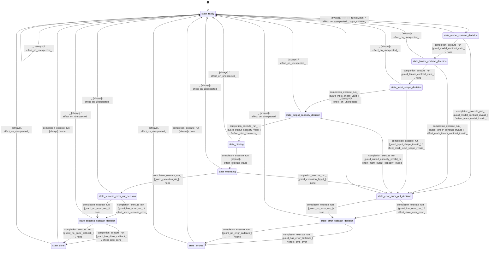

# diarization_sortformer_executor

Source: [`emel/diarization/sortformer/executor/sm.hpp`](https://github.com/stateforward/emel.cpp/blob/main/src/emel/diarization/sortformer/executor/sm.hpp)

## Mermaid

## Transitions

| Source | Event | Guard | Action | Target |
| --- | --- | --- | --- | --- |
| [`state_ready`](https://github.com/stateforward/emel.cpp/blob/main/src/emel/diarization/sortformer/executor/sm.hpp) | [`execute_run`](https://github.com/stateforward/emel.cpp/blob/main/src/emel/diarization/sortformer/executor/sm.hpp) | [`always`](https://github.com/stateforward/emel.cpp/blob/main/src/emel/diarization/sortformer/executor/sm.hpp) | [`effect_begin_execute>`](https://github.com/stateforward/emel.cpp/blob/main/src/emel/diarization/sortformer/executor/sm.hpp) | [`state_model_contract_decision`](https://github.com/stateforward/emel.cpp/blob/main/src/emel/diarization/sortformer/executor/sm.hpp) |
| [`state_model_contract_decision`](https://github.com/stateforward/emel.cpp/blob/main/src/emel/diarization/sortformer/executor/sm.hpp) | [`completion<execute_run>`](https://github.com/stateforward/emel.cpp/blob/main/src/emel/diarization/sortformer/executor/sm.hpp) | [`guard_model_contract_valid>`](https://github.com/stateforward/emel.cpp/blob/main/src/emel/diarization/sortformer/executor/sm.hpp) | [`none`](https://github.com/stateforward/emel.cpp/blob/main/src/emel/diarization/sortformer/executor/sm.hpp) | [`state_tensor_contract_decision`](https://github.com/stateforward/emel.cpp/blob/main/src/emel/diarization/sortformer/executor/sm.hpp) |
| [`state_model_contract_decision`](https://github.com/stateforward/emel.cpp/blob/main/src/emel/diarization/sortformer/executor/sm.hpp) | [`completion<execute_run>`](https://github.com/stateforward/emel.cpp/blob/main/src/emel/diarization/sortformer/executor/sm.hpp) | [`guard_model_contract_invalid>`](https://github.com/stateforward/emel.cpp/blob/main/src/emel/diarization/sortformer/executor/sm.hpp) | [`effect_mark_model_invalid>`](https://github.com/stateforward/emel.cpp/blob/main/src/emel/diarization/sortformer/executor/sm.hpp) | [`state_error_error_out_decision`](https://github.com/stateforward/emel.cpp/blob/main/src/emel/diarization/sortformer/executor/sm.hpp) |
| [`state_tensor_contract_decision`](https://github.com/stateforward/emel.cpp/blob/main/src/emel/diarization/sortformer/executor/sm.hpp) | [`completion<execute_run>`](https://github.com/stateforward/emel.cpp/blob/main/src/emel/diarization/sortformer/executor/sm.hpp) | [`guard_tensor_contract_valid>`](https://github.com/stateforward/emel.cpp/blob/main/src/emel/diarization/sortformer/executor/sm.hpp) | [`none`](https://github.com/stateforward/emel.cpp/blob/main/src/emel/diarization/sortformer/executor/sm.hpp) | [`state_input_shape_decision`](https://github.com/stateforward/emel.cpp/blob/main/src/emel/diarization/sortformer/executor/sm.hpp) |
| [`state_tensor_contract_decision`](https://github.com/stateforward/emel.cpp/blob/main/src/emel/diarization/sortformer/executor/sm.hpp) | [`completion<execute_run>`](https://github.com/stateforward/emel.cpp/blob/main/src/emel/diarization/sortformer/executor/sm.hpp) | [`guard_tensor_contract_invalid>`](https://github.com/stateforward/emel.cpp/blob/main/src/emel/diarization/sortformer/executor/sm.hpp) | [`effect_mark_tensor_contract_invalid>`](https://github.com/stateforward/emel.cpp/blob/main/src/emel/diarization/sortformer/executor/sm.hpp) | [`state_error_error_out_decision`](https://github.com/stateforward/emel.cpp/blob/main/src/emel/diarization/sortformer/executor/sm.hpp) |
| [`state_input_shape_decision`](https://github.com/stateforward/emel.cpp/blob/main/src/emel/diarization/sortformer/executor/sm.hpp) | [`completion<execute_run>`](https://github.com/stateforward/emel.cpp/blob/main/src/emel/diarization/sortformer/executor/sm.hpp) | [`guard_input_shape_valid>`](https://github.com/stateforward/emel.cpp/blob/main/src/emel/diarization/sortformer/executor/sm.hpp) | [`none`](https://github.com/stateforward/emel.cpp/blob/main/src/emel/diarization/sortformer/executor/sm.hpp) | [`state_output_capacity_decision`](https://github.com/stateforward/emel.cpp/blob/main/src/emel/diarization/sortformer/executor/sm.hpp) |
| [`state_input_shape_decision`](https://github.com/stateforward/emel.cpp/blob/main/src/emel/diarization/sortformer/executor/sm.hpp) | [`completion<execute_run>`](https://github.com/stateforward/emel.cpp/blob/main/src/emel/diarization/sortformer/executor/sm.hpp) | [`guard_input_shape_invalid>`](https://github.com/stateforward/emel.cpp/blob/main/src/emel/diarization/sortformer/executor/sm.hpp) | [`effect_mark_input_shape_invalid>`](https://github.com/stateforward/emel.cpp/blob/main/src/emel/diarization/sortformer/executor/sm.hpp) | [`state_error_error_out_decision`](https://github.com/stateforward/emel.cpp/blob/main/src/emel/diarization/sortformer/executor/sm.hpp) |
| [`state_output_capacity_decision`](https://github.com/stateforward/emel.cpp/blob/main/src/emel/diarization/sortformer/executor/sm.hpp) | [`completion<execute_run>`](https://github.com/stateforward/emel.cpp/blob/main/src/emel/diarization/sortformer/executor/sm.hpp) | [`guard_output_capacity_valid>`](https://github.com/stateforward/emel.cpp/blob/main/src/emel/diarization/sortformer/executor/sm.hpp) | [`effect_bind_contracts>`](https://github.com/stateforward/emel.cpp/blob/main/src/emel/diarization/sortformer/executor/sm.hpp) | [`state_binding`](https://github.com/stateforward/emel.cpp/blob/main/src/emel/diarization/sortformer/executor/sm.hpp) |
| [`state_output_capacity_decision`](https://github.com/stateforward/emel.cpp/blob/main/src/emel/diarization/sortformer/executor/sm.hpp) | [`completion<execute_run>`](https://github.com/stateforward/emel.cpp/blob/main/src/emel/diarization/sortformer/executor/sm.hpp) | [`guard_output_capacity_invalid>`](https://github.com/stateforward/emel.cpp/blob/main/src/emel/diarization/sortformer/executor/sm.hpp) | [`effect_mark_output_capacity_invalid>`](https://github.com/stateforward/emel.cpp/blob/main/src/emel/diarization/sortformer/executor/sm.hpp) | [`state_error_error_out_decision`](https://github.com/stateforward/emel.cpp/blob/main/src/emel/diarization/sortformer/executor/sm.hpp) |
| [`state_binding`](https://github.com/stateforward/emel.cpp/blob/main/src/emel/diarization/sortformer/executor/sm.hpp) | [`completion<execute_run>`](https://github.com/stateforward/emel.cpp/blob/main/src/emel/diarization/sortformer/executor/sm.hpp) | [`always`](https://github.com/stateforward/emel.cpp/blob/main/src/emel/diarization/sortformer/executor/sm.hpp) | [`effect_execute_stage>`](https://github.com/stateforward/emel.cpp/blob/main/src/emel/diarization/sortformer/executor/sm.hpp) | [`state_executing`](https://github.com/stateforward/emel.cpp/blob/main/src/emel/diarization/sortformer/executor/sm.hpp) |
| [`state_executing`](https://github.com/stateforward/emel.cpp/blob/main/src/emel/diarization/sortformer/executor/sm.hpp) | [`completion<execute_run>`](https://github.com/stateforward/emel.cpp/blob/main/src/emel/diarization/sortformer/executor/sm.hpp) | [`guard_execution_ok>`](https://github.com/stateforward/emel.cpp/blob/main/src/emel/diarization/sortformer/executor/sm.hpp) | [`none`](https://github.com/stateforward/emel.cpp/blob/main/src/emel/diarization/sortformer/executor/sm.hpp) | [`state_success_error_out_decision`](https://github.com/stateforward/emel.cpp/blob/main/src/emel/diarization/sortformer/executor/sm.hpp) |
| [`state_executing`](https://github.com/stateforward/emel.cpp/blob/main/src/emel/diarization/sortformer/executor/sm.hpp) | [`completion<execute_run>`](https://github.com/stateforward/emel.cpp/blob/main/src/emel/diarization/sortformer/executor/sm.hpp) | [`guard_execution_failed>`](https://github.com/stateforward/emel.cpp/blob/main/src/emel/diarization/sortformer/executor/sm.hpp) | [`none`](https://github.com/stateforward/emel.cpp/blob/main/src/emel/diarization/sortformer/executor/sm.hpp) | [`state_error_error_out_decision`](https://github.com/stateforward/emel.cpp/blob/main/src/emel/diarization/sortformer/executor/sm.hpp) |
| [`state_success_error_out_decision`](https://github.com/stateforward/emel.cpp/blob/main/src/emel/diarization/sortformer/executor/sm.hpp) | [`completion<execute_run>`](https://github.com/stateforward/emel.cpp/blob/main/src/emel/diarization/sortformer/executor/sm.hpp) | [`guard_has_error_out>`](https://github.com/stateforward/emel.cpp/blob/main/src/emel/diarization/sortformer/executor/sm.hpp) | [`effect_store_success_error>`](https://github.com/stateforward/emel.cpp/blob/main/src/emel/diarization/sortformer/executor/sm.hpp) | [`state_success_callback_decision`](https://github.com/stateforward/emel.cpp/blob/main/src/emel/diarization/sortformer/executor/sm.hpp) |
| [`state_success_error_out_decision`](https://github.com/stateforward/emel.cpp/blob/main/src/emel/diarization/sortformer/executor/sm.hpp) | [`completion<execute_run>`](https://github.com/stateforward/emel.cpp/blob/main/src/emel/diarization/sortformer/executor/sm.hpp) | [`guard_no_error_out>`](https://github.com/stateforward/emel.cpp/blob/main/src/emel/diarization/sortformer/executor/sm.hpp) | [`none`](https://github.com/stateforward/emel.cpp/blob/main/src/emel/diarization/sortformer/executor/sm.hpp) | [`state_success_callback_decision`](https://github.com/stateforward/emel.cpp/blob/main/src/emel/diarization/sortformer/executor/sm.hpp) |
| [`state_error_error_out_decision`](https://github.com/stateforward/emel.cpp/blob/main/src/emel/diarization/sortformer/executor/sm.hpp) | [`completion<execute_run>`](https://github.com/stateforward/emel.cpp/blob/main/src/emel/diarization/sortformer/executor/sm.hpp) | [`guard_has_error_out>`](https://github.com/stateforward/emel.cpp/blob/main/src/emel/diarization/sortformer/executor/sm.hpp) | [`effect_store_error_error>`](https://github.com/stateforward/emel.cpp/blob/main/src/emel/diarization/sortformer/executor/sm.hpp) | [`state_error_callback_decision`](https://github.com/stateforward/emel.cpp/blob/main/src/emel/diarization/sortformer/executor/sm.hpp) |
| [`state_error_error_out_decision`](https://github.com/stateforward/emel.cpp/blob/main/src/emel/diarization/sortformer/executor/sm.hpp) | [`completion<execute_run>`](https://github.com/stateforward/emel.cpp/blob/main/src/emel/diarization/sortformer/executor/sm.hpp) | [`guard_no_error_out>`](https://github.com/stateforward/emel.cpp/blob/main/src/emel/diarization/sortformer/executor/sm.hpp) | [`none`](https://github.com/stateforward/emel.cpp/blob/main/src/emel/diarization/sortformer/executor/sm.hpp) | [`state_error_callback_decision`](https://github.com/stateforward/emel.cpp/blob/main/src/emel/diarization/sortformer/executor/sm.hpp) |
| [`state_success_callback_decision`](https://github.com/stateforward/emel.cpp/blob/main/src/emel/diarization/sortformer/executor/sm.hpp) | [`completion<execute_run>`](https://github.com/stateforward/emel.cpp/blob/main/src/emel/diarization/sortformer/executor/sm.hpp) | [`guard_has_done_callback>`](https://github.com/stateforward/emel.cpp/blob/main/src/emel/diarization/sortformer/executor/sm.hpp) | [`effect_emit_done>`](https://github.com/stateforward/emel.cpp/blob/main/src/emel/diarization/sortformer/executor/sm.hpp) | [`state_done`](https://github.com/stateforward/emel.cpp/blob/main/src/emel/diarization/sortformer/executor/sm.hpp) |
| [`state_success_callback_decision`](https://github.com/stateforward/emel.cpp/blob/main/src/emel/diarization/sortformer/executor/sm.hpp) | [`completion<execute_run>`](https://github.com/stateforward/emel.cpp/blob/main/src/emel/diarization/sortformer/executor/sm.hpp) | [`guard_no_done_callback>`](https://github.com/stateforward/emel.cpp/blob/main/src/emel/diarization/sortformer/executor/sm.hpp) | [`none`](https://github.com/stateforward/emel.cpp/blob/main/src/emel/diarization/sortformer/executor/sm.hpp) | [`state_done`](https://github.com/stateforward/emel.cpp/blob/main/src/emel/diarization/sortformer/executor/sm.hpp) |
| [`state_error_callback_decision`](https://github.com/stateforward/emel.cpp/blob/main/src/emel/diarization/sortformer/executor/sm.hpp) | [`completion<execute_run>`](https://github.com/stateforward/emel.cpp/blob/main/src/emel/diarization/sortformer/executor/sm.hpp) | [`guard_has_error_callback>`](https://github.com/stateforward/emel.cpp/blob/main/src/emel/diarization/sortformer/executor/sm.hpp) | [`effect_emit_error>`](https://github.com/stateforward/emel.cpp/blob/main/src/emel/diarization/sortformer/executor/sm.hpp) | [`state_errored`](https://github.com/stateforward/emel.cpp/blob/main/src/emel/diarization/sortformer/executor/sm.hpp) |
| [`state_error_callback_decision`](https://github.com/stateforward/emel.cpp/blob/main/src/emel/diarization/sortformer/executor/sm.hpp) | [`completion<execute_run>`](https://github.com/stateforward/emel.cpp/blob/main/src/emel/diarization/sortformer/executor/sm.hpp) | [`guard_no_error_callback>`](https://github.com/stateforward/emel.cpp/blob/main/src/emel/diarization/sortformer/executor/sm.hpp) | [`none`](https://github.com/stateforward/emel.cpp/blob/main/src/emel/diarization/sortformer/executor/sm.hpp) | [`state_errored`](https://github.com/stateforward/emel.cpp/blob/main/src/emel/diarization/sortformer/executor/sm.hpp) |
| [`state_done`](https://github.com/stateforward/emel.cpp/blob/main/src/emel/diarization/sortformer/executor/sm.hpp) | [`completion<execute_run>`](https://github.com/stateforward/emel.cpp/blob/main/src/emel/diarization/sortformer/executor/sm.hpp) | [`always`](https://github.com/stateforward/emel.cpp/blob/main/src/emel/diarization/sortformer/executor/sm.hpp) | [`none`](https://github.com/stateforward/emel.cpp/blob/main/src/emel/diarization/sortformer/executor/sm.hpp) | [`state_ready`](https://github.com/stateforward/emel.cpp/blob/main/src/emel/diarization/sortformer/executor/sm.hpp) |
| [`state_errored`](https://github.com/stateforward/emel.cpp/blob/main/src/emel/diarization/sortformer/executor/sm.hpp) | [`completion<execute_run>`](https://github.com/stateforward/emel.cpp/blob/main/src/emel/diarization/sortformer/executor/sm.hpp) | [`always`](https://github.com/stateforward/emel.cpp/blob/main/src/emel/diarization/sortformer/executor/sm.hpp) | [`none`](https://github.com/stateforward/emel.cpp/blob/main/src/emel/diarization/sortformer/executor/sm.hpp) | [`state_ready`](https://github.com/stateforward/emel.cpp/blob/main/src/emel/diarization/sortformer/executor/sm.hpp) |
| [`state_ready`](https://github.com/stateforward/emel.cpp/blob/main/src/emel/diarization/sortformer/executor/sm.hpp) | [`_`](https://github.com/stateforward/emel.cpp/blob/main/src/emel/diarization/sortformer/executor/sm.hpp) | [`always`](https://github.com/stateforward/emel.cpp/blob/main/src/emel/diarization/sortformer/executor/sm.hpp) | [`effect_on_unexpected>`](https://github.com/stateforward/emel.cpp/blob/main/src/emel/diarization/sortformer/executor/sm.hpp) | [`state_ready`](https://github.com/stateforward/emel.cpp/blob/main/src/emel/diarization/sortformer/executor/sm.hpp) |
| [`state_model_contract_decision`](https://github.com/stateforward/emel.cpp/blob/main/src/emel/diarization/sortformer/executor/sm.hpp) | [`_`](https://github.com/stateforward/emel.cpp/blob/main/src/emel/diarization/sortformer/executor/sm.hpp) | [`always`](https://github.com/stateforward/emel.cpp/blob/main/src/emel/diarization/sortformer/executor/sm.hpp) | [`effect_on_unexpected>`](https://github.com/stateforward/emel.cpp/blob/main/src/emel/diarization/sortformer/executor/sm.hpp) | [`state_ready`](https://github.com/stateforward/emel.cpp/blob/main/src/emel/diarization/sortformer/executor/sm.hpp) |
| [`state_tensor_contract_decision`](https://github.com/stateforward/emel.cpp/blob/main/src/emel/diarization/sortformer/executor/sm.hpp) | [`_`](https://github.com/stateforward/emel.cpp/blob/main/src/emel/diarization/sortformer/executor/sm.hpp) | [`always`](https://github.com/stateforward/emel.cpp/blob/main/src/emel/diarization/sortformer/executor/sm.hpp) | [`effect_on_unexpected>`](https://github.com/stateforward/emel.cpp/blob/main/src/emel/diarization/sortformer/executor/sm.hpp) | [`state_ready`](https://github.com/stateforward/emel.cpp/blob/main/src/emel/diarization/sortformer/executor/sm.hpp) |
| [`state_input_shape_decision`](https://github.com/stateforward/emel.cpp/blob/main/src/emel/diarization/sortformer/executor/sm.hpp) | [`_`](https://github.com/stateforward/emel.cpp/blob/main/src/emel/diarization/sortformer/executor/sm.hpp) | [`always`](https://github.com/stateforward/emel.cpp/blob/main/src/emel/diarization/sortformer/executor/sm.hpp) | [`effect_on_unexpected>`](https://github.com/stateforward/emel.cpp/blob/main/src/emel/diarization/sortformer/executor/sm.hpp) | [`state_ready`](https://github.com/stateforward/emel.cpp/blob/main/src/emel/diarization/sortformer/executor/sm.hpp) |
| [`state_output_capacity_decision`](https://github.com/stateforward/emel.cpp/blob/main/src/emel/diarization/sortformer/executor/sm.hpp) | [`_`](https://github.com/stateforward/emel.cpp/blob/main/src/emel/diarization/sortformer/executor/sm.hpp) | [`always`](https://github.com/stateforward/emel.cpp/blob/main/src/emel/diarization/sortformer/executor/sm.hpp) | [`effect_on_unexpected>`](https://github.com/stateforward/emel.cpp/blob/main/src/emel/diarization/sortformer/executor/sm.hpp) | [`state_ready`](https://github.com/stateforward/emel.cpp/blob/main/src/emel/diarization/sortformer/executor/sm.hpp) |
| [`state_binding`](https://github.com/stateforward/emel.cpp/blob/main/src/emel/diarization/sortformer/executor/sm.hpp) | [`_`](https://github.com/stateforward/emel.cpp/blob/main/src/emel/diarization/sortformer/executor/sm.hpp) | [`always`](https://github.com/stateforward/emel.cpp/blob/main/src/emel/diarization/sortformer/executor/sm.hpp) | [`effect_on_unexpected>`](https://github.com/stateforward/emel.cpp/blob/main/src/emel/diarization/sortformer/executor/sm.hpp) | [`state_ready`](https://github.com/stateforward/emel.cpp/blob/main/src/emel/diarization/sortformer/executor/sm.hpp) |
| [`state_executing`](https://github.com/stateforward/emel.cpp/blob/main/src/emel/diarization/sortformer/executor/sm.hpp) | [`_`](https://github.com/stateforward/emel.cpp/blob/main/src/emel/diarization/sortformer/executor/sm.hpp) | [`always`](https://github.com/stateforward/emel.cpp/blob/main/src/emel/diarization/sortformer/executor/sm.hpp) | [`effect_on_unexpected>`](https://github.com/stateforward/emel.cpp/blob/main/src/emel/diarization/sortformer/executor/sm.hpp) | [`state_ready`](https://github.com/stateforward/emel.cpp/blob/main/src/emel/diarization/sortformer/executor/sm.hpp) |
| [`state_success_error_out_decision`](https://github.com/stateforward/emel.cpp/blob/main/src/emel/diarization/sortformer/executor/sm.hpp) | [`_`](https://github.com/stateforward/emel.cpp/blob/main/src/emel/diarization/sortformer/executor/sm.hpp) | [`always`](https://github.com/stateforward/emel.cpp/blob/main/src/emel/diarization/sortformer/executor/sm.hpp) | [`effect_on_unexpected>`](https://github.com/stateforward/emel.cpp/blob/main/src/emel/diarization/sortformer/executor/sm.hpp) | [`state_ready`](https://github.com/stateforward/emel.cpp/blob/main/src/emel/diarization/sortformer/executor/sm.hpp) |
| [`state_success_callback_decision`](https://github.com/stateforward/emel.cpp/blob/main/src/emel/diarization/sortformer/executor/sm.hpp) | [`_`](https://github.com/stateforward/emel.cpp/blob/main/src/emel/diarization/sortformer/executor/sm.hpp) | [`always`](https://github.com/stateforward/emel.cpp/blob/main/src/emel/diarization/sortformer/executor/sm.hpp) | [`effect_on_unexpected>`](https://github.com/stateforward/emel.cpp/blob/main/src/emel/diarization/sortformer/executor/sm.hpp) | [`state_ready`](https://github.com/stateforward/emel.cpp/blob/main/src/emel/diarization/sortformer/executor/sm.hpp) |
| [`state_error_error_out_decision`](https://github.com/stateforward/emel.cpp/blob/main/src/emel/diarization/sortformer/executor/sm.hpp) | [`_`](https://github.com/stateforward/emel.cpp/blob/main/src/emel/diarization/sortformer/executor/sm.hpp) | [`always`](https://github.com/stateforward/emel.cpp/blob/main/src/emel/diarization/sortformer/executor/sm.hpp) | [`effect_on_unexpected>`](https://github.com/stateforward/emel.cpp/blob/main/src/emel/diarization/sortformer/executor/sm.hpp) | [`state_ready`](https://github.com/stateforward/emel.cpp/blob/main/src/emel/diarization/sortformer/executor/sm.hpp) |
| [`state_error_callback_decision`](https://github.com/stateforward/emel.cpp/blob/main/src/emel/diarization/sortformer/executor/sm.hpp) | [`_`](https://github.com/stateforward/emel.cpp/blob/main/src/emel/diarization/sortformer/executor/sm.hpp) | [`always`](https://github.com/stateforward/emel.cpp/blob/main/src/emel/diarization/sortformer/executor/sm.hpp) | [`effect_on_unexpected>`](https://github.com/stateforward/emel.cpp/blob/main/src/emel/diarization/sortformer/executor/sm.hpp) | [`state_ready`](https://github.com/stateforward/emel.cpp/blob/main/src/emel/diarization/sortformer/executor/sm.hpp) |
| [`state_done`](https://github.com/stateforward/emel.cpp/blob/main/src/emel/diarization/sortformer/executor/sm.hpp) | [`_`](https://github.com/stateforward/emel.cpp/blob/main/src/emel/diarization/sortformer/executor/sm.hpp) | [`always`](https://github.com/stateforward/emel.cpp/blob/main/src/emel/diarization/sortformer/executor/sm.hpp) | [`effect_on_unexpected>`](https://github.com/stateforward/emel.cpp/blob/main/src/emel/diarization/sortformer/executor/sm.hpp) | [`state_ready`](https://github.com/stateforward/emel.cpp/blob/main/src/emel/diarization/sortformer/executor/sm.hpp) |
| [`state_errored`](https://github.com/stateforward/emel.cpp/blob/main/src/emel/diarization/sortformer/executor/sm.hpp) | [`_`](https://github.com/stateforward/emel.cpp/blob/main/src/emel/diarization/sortformer/executor/sm.hpp) | [`always`](https://github.com/stateforward/emel.cpp/blob/main/src/emel/diarization/sortformer/executor/sm.hpp) | [`effect_on_unexpected>`](https://github.com/stateforward/emel.cpp/blob/main/src/emel/diarization/sortformer/executor/sm.hpp) | [`state_ready`](https://github.com/stateforward/emel.cpp/blob/main/src/emel/diarization/sortformer/executor/sm.hpp) |
