# diarization_sortformer_executor

Source: [`emel/diarization/sortformer/executor/sm.hpp`](https://github.com/stateforward/emel.cpp/blob/main/src/emel/diarization/sortformer/executor/sm.hpp)

## Mermaid

```mermaid
stateDiagram-v2
  direction TB
  [*] --> state_ready
  state_ready --> state_model_contract_decision : execute_run [always] / effect_begin_execute_
  state_model_contract_decision --> state_tensor_contract_decision : completion_execute_run_ [guard_model_contract_valid_] / none
  state_model_contract_decision --> state_error_error_out_decision : completion_execute_run_ [guard_model_contract_invalid_] / effect_mark_model_invalid_
  state_tensor_contract_decision --> state_input_shape_decision : completion_execute_run_ [guard_tensor_contract_valid_] / none
  state_tensor_contract_decision --> state_error_error_out_decision : completion_execute_run_ [guard_tensor_contract_invalid_] / effect_mark_tensor_contract_invalid_
  state_input_shape_decision --> state_output_capacity_decision : completion_execute_run_ [guard_input_shape_valid_] / none
  state_input_shape_decision --> state_error_error_out_decision : completion_execute_run_ [guard_input_shape_invalid_] / effect_mark_input_shape_invalid_
  state_output_capacity_decision --> state_binding : completion_execute_run_ [guard_output_capacity_valid_] / effect_bind_contracts_
  state_output_capacity_decision --> state_error_error_out_decision : completion_execute_run_ [guard_output_capacity_invalid_] / effect_mark_output_capacity_invalid_
  state_binding --> state_projecting : completion_execute_run_ [always] / effect_project_encoder_
  state_projecting --> state_transformer_cache : completion_execute_run_ [guard_execution_ok_] / effect_write_projected_frames_to_cache_
  state_projecting --> state_error_error_out_decision : completion_execute_run_ [guard_execution_failed_] / none
  state_transformer_cache --> state_transformer_layer_00 : completion_execute_run_ [always] / effect_execute_transformer_layer_0__
  state_transformer_layer_00 --> state_transformer_layer_01 : completion_execute_run_ [guard_execution_ok_] / effect_execute_transformer_layer_1__
  state_transformer_layer_00 --> state_error_error_out_decision : completion_execute_run_ [guard_execution_failed_] / none
  state_transformer_layer_01 --> state_transformer_layer_02 : completion_execute_run_ [guard_execution_ok_] / effect_execute_transformer_layer_2__
  state_transformer_layer_01 --> state_error_error_out_decision : completion_execute_run_ [guard_execution_failed_] / none
  state_transformer_layer_02 --> state_transformer_layer_03 : completion_execute_run_ [guard_execution_ok_] / effect_execute_transformer_layer_3__
  state_transformer_layer_02 --> state_error_error_out_decision : completion_execute_run_ [guard_execution_failed_] / none
  state_transformer_layer_03 --> state_transformer_layer_04 : completion_execute_run_ [guard_execution_ok_] / effect_execute_transformer_layer_4__
  state_transformer_layer_03 --> state_error_error_out_decision : completion_execute_run_ [guard_execution_failed_] / none
  state_transformer_layer_04 --> state_transformer_layer_05 : completion_execute_run_ [guard_execution_ok_] / effect_execute_transformer_layer_5__
  state_transformer_layer_04 --> state_error_error_out_decision : completion_execute_run_ [guard_execution_failed_] / none
  state_transformer_layer_05 --> state_transformer_layer_06 : completion_execute_run_ [guard_execution_ok_] / effect_execute_transformer_layer_6__
  state_transformer_layer_05 --> state_error_error_out_decision : completion_execute_run_ [guard_execution_failed_] / none
  state_transformer_layer_06 --> state_transformer_layer_07 : completion_execute_run_ [guard_execution_ok_] / effect_execute_transformer_layer_7__
  state_transformer_layer_06 --> state_error_error_out_decision : completion_execute_run_ [guard_execution_failed_] / none
  state_transformer_layer_07 --> state_transformer_layer_08 : completion_execute_run_ [guard_execution_ok_] / effect_execute_transformer_layer_8__
  state_transformer_layer_07 --> state_error_error_out_decision : completion_execute_run_ [guard_execution_failed_] / none
  state_transformer_layer_08 --> state_transformer_layer_09 : completion_execute_run_ [guard_execution_ok_] / effect_execute_transformer_layer_9__
  state_transformer_layer_08 --> state_error_error_out_decision : completion_execute_run_ [guard_execution_failed_] / none
  state_transformer_layer_09 --> state_transformer_layer_10 : completion_execute_run_ [guard_execution_ok_] / effect_execute_transformer_layer_10__
  state_transformer_layer_09 --> state_error_error_out_decision : completion_execute_run_ [guard_execution_failed_] / none
  state_transformer_layer_10 --> state_transformer_layer_11 : completion_execute_run_ [guard_execution_ok_] / effect_execute_transformer_layer_11__
  state_transformer_layer_10 --> state_error_error_out_decision : completion_execute_run_ [guard_execution_failed_] / none
  state_transformer_layer_11 --> state_transformer_layer_12 : completion_execute_run_ [guard_execution_ok_] / effect_execute_transformer_layer_12__
  state_transformer_layer_11 --> state_error_error_out_decision : completion_execute_run_ [guard_execution_failed_] / none
  state_transformer_layer_12 --> state_transformer_layer_13 : completion_execute_run_ [guard_execution_ok_] / effect_execute_transformer_layer_13__
  state_transformer_layer_12 --> state_error_error_out_decision : completion_execute_run_ [guard_execution_failed_] / none
  state_transformer_layer_13 --> state_transformer_layer_14 : completion_execute_run_ [guard_execution_ok_] / effect_execute_transformer_layer_14__
  state_transformer_layer_13 --> state_error_error_out_decision : completion_execute_run_ [guard_execution_failed_] / none
  state_transformer_layer_14 --> state_transformer_layer_15 : completion_execute_run_ [guard_execution_ok_] / effect_execute_transformer_layer_15__
  state_transformer_layer_14 --> state_error_error_out_decision : completion_execute_run_ [guard_execution_failed_] / none
  state_transformer_layer_15 --> state_transformer_layer_16 : completion_execute_run_ [guard_execution_ok_] / effect_execute_transformer_layer_16__
  state_transformer_layer_15 --> state_error_error_out_decision : completion_execute_run_ [guard_execution_failed_] / none
  state_transformer_layer_16 --> state_transformer_layer_17 : completion_execute_run_ [guard_execution_ok_] / effect_execute_transformer_layer_17__
  state_transformer_layer_16 --> state_error_error_out_decision : completion_execute_run_ [guard_execution_failed_] / none
  state_transformer_layer_17 --> state_publishing_hidden : completion_execute_run_ [guard_execution_ok_] / effect_publish_hidden_
  state_transformer_layer_17 --> state_error_error_out_decision : completion_execute_run_ [guard_execution_failed_] / none
  state_publishing_hidden --> state_success_error_out_decision : completion_execute_run_ [guard_execution_ok_] / none
  state_success_error_out_decision --> state_success_callback_decision : completion_execute_run_ [guard_has_error_out_] / effect_store_success_error_
  state_success_error_out_decision --> state_success_callback_decision : completion_execute_run_ [guard_no_error_out_] / none
  state_error_error_out_decision --> state_error_callback_decision : completion_execute_run_ [guard_has_error_out_] / effect_store_error_error_
  state_error_error_out_decision --> state_error_callback_decision : completion_execute_run_ [guard_no_error_out_] / none
  state_success_callback_decision --> state_done : completion_execute_run_ [guard_has_done_callback_] / effect_emit_done_
  state_success_callback_decision --> state_done : completion_execute_run_ [guard_no_done_callback_] / none
  state_error_callback_decision --> state_errored : completion_execute_run_ [guard_has_error_callback_] / effect_emit_error_
  state_error_callback_decision --> state_errored : completion_execute_run_ [guard_no_error_callback_] / none
  state_done --> state_ready : completion_execute_run_ [always] / none
  state_errored --> state_ready : completion_execute_run_ [always] / none
  state_ready --> state_ready : _ [always] / effect_on_unexpected_
  state_model_contract_decision --> state_ready : _ [always] / effect_on_unexpected_
  state_tensor_contract_decision --> state_ready : _ [always] / effect_on_unexpected_
  state_input_shape_decision --> state_ready : _ [always] / effect_on_unexpected_
  state_output_capacity_decision --> state_ready : _ [always] / effect_on_unexpected_
  state_binding --> state_ready : _ [always] / effect_on_unexpected_
  state_projecting --> state_ready : _ [always] / effect_on_unexpected_
  state_transformer_cache --> state_ready : _ [always] / effect_on_unexpected_
  state_transformer_layer_00 --> state_ready : _ [always] / effect_on_unexpected_
  state_transformer_layer_01 --> state_ready : _ [always] / effect_on_unexpected_
  state_transformer_layer_02 --> state_ready : _ [always] / effect_on_unexpected_
  state_transformer_layer_03 --> state_ready : _ [always] / effect_on_unexpected_
  state_transformer_layer_04 --> state_ready : _ [always] / effect_on_unexpected_
  state_transformer_layer_05 --> state_ready : _ [always] / effect_on_unexpected_
  state_transformer_layer_06 --> state_ready : _ [always] / effect_on_unexpected_
  state_transformer_layer_07 --> state_ready : _ [always] / effect_on_unexpected_
  state_transformer_layer_08 --> state_ready : _ [always] / effect_on_unexpected_
  state_transformer_layer_09 --> state_ready : _ [always] / effect_on_unexpected_
  state_transformer_layer_10 --> state_ready : _ [always] / effect_on_unexpected_
  state_transformer_layer_11 --> state_ready : _ [always] / effect_on_unexpected_
  state_transformer_layer_12 --> state_ready : _ [always] / effect_on_unexpected_
  state_transformer_layer_13 --> state_ready : _ [always] / effect_on_unexpected_
  state_transformer_layer_14 --> state_ready : _ [always] / effect_on_unexpected_
  state_transformer_layer_15 --> state_ready : _ [always] / effect_on_unexpected_
  state_transformer_layer_16 --> state_ready : _ [always] / effect_on_unexpected_
  state_transformer_layer_17 --> state_ready : _ [always] / effect_on_unexpected_
  state_publishing_hidden --> state_ready : _ [always] / effect_on_unexpected_
  state_success_error_out_decision --> state_ready : _ [always] / effect_on_unexpected_
  state_success_callback_decision --> state_ready : _ [always] / effect_on_unexpected_
  state_error_error_out_decision --> state_ready : _ [always] / effect_on_unexpected_
  state_error_callback_decision --> state_ready : _ [always] / effect_on_unexpected_
  state_done --> state_ready : _ [always] / effect_on_unexpected_
  state_errored --> state_ready : _ [always] / effect_on_unexpected_
```

## Transitions

| Source | Event | Guard | Action | Target |
| --- | --- | --- | --- | --- |
| [`state_ready`](https://github.com/stateforward/emel.cpp/blob/main/src/emel/diarization/sortformer/executor/sm.hpp) | [`execute_run`](https://github.com/stateforward/emel.cpp/blob/main/src/emel/diarization/sortformer/executor/sm.hpp) | [`always`](https://github.com/stateforward/emel.cpp/blob/main/src/emel/diarization/sortformer/executor/sm.hpp) | [`effect_begin_execute>`](https://github.com/stateforward/emel.cpp/blob/main/src/emel/diarization/sortformer/executor/sm.hpp) | [`state_model_contract_decision`](https://github.com/stateforward/emel.cpp/blob/main/src/emel/diarization/sortformer/executor/sm.hpp) |
| [`state_model_contract_decision`](https://github.com/stateforward/emel.cpp/blob/main/src/emel/diarization/sortformer/executor/sm.hpp) | [`completion<execute_run>`](https://github.com/stateforward/emel.cpp/blob/main/src/emel/diarization/sortformer/executor/sm.hpp) | [`guard_model_contract_valid>`](https://github.com/stateforward/emel.cpp/blob/main/src/emel/diarization/sortformer/executor/sm.hpp) | [`none`](https://github.com/stateforward/emel.cpp/blob/main/src/emel/diarization/sortformer/executor/sm.hpp) | [`state_tensor_contract_decision`](https://github.com/stateforward/emel.cpp/blob/main/src/emel/diarization/sortformer/executor/sm.hpp) |
| [`state_model_contract_decision`](https://github.com/stateforward/emel.cpp/blob/main/src/emel/diarization/sortformer/executor/sm.hpp) | [`completion<execute_run>`](https://github.com/stateforward/emel.cpp/blob/main/src/emel/diarization/sortformer/executor/sm.hpp) | [`guard_model_contract_invalid>`](https://github.com/stateforward/emel.cpp/blob/main/src/emel/diarization/sortformer/executor/sm.hpp) | [`effect_mark_model_invalid>`](https://github.com/stateforward/emel.cpp/blob/main/src/emel/diarization/sortformer/executor/sm.hpp) | [`state_error_error_out_decision`](https://github.com/stateforward/emel.cpp/blob/main/src/emel/diarization/sortformer/executor/sm.hpp) |
| [`state_tensor_contract_decision`](https://github.com/stateforward/emel.cpp/blob/main/src/emel/diarization/sortformer/executor/sm.hpp) | [`completion<execute_run>`](https://github.com/stateforward/emel.cpp/blob/main/src/emel/diarization/sortformer/executor/sm.hpp) | [`guard_tensor_contract_valid>`](https://github.com/stateforward/emel.cpp/blob/main/src/emel/diarization/sortformer/executor/sm.hpp) | [`none`](https://github.com/stateforward/emel.cpp/blob/main/src/emel/diarization/sortformer/executor/sm.hpp) | [`state_input_shape_decision`](https://github.com/stateforward/emel.cpp/blob/main/src/emel/diarization/sortformer/executor/sm.hpp) |
| [`state_tensor_contract_decision`](https://github.com/stateforward/emel.cpp/blob/main/src/emel/diarization/sortformer/executor/sm.hpp) | [`completion<execute_run>`](https://github.com/stateforward/emel.cpp/blob/main/src/emel/diarization/sortformer/executor/sm.hpp) | [`guard_tensor_contract_invalid>`](https://github.com/stateforward/emel.cpp/blob/main/src/emel/diarization/sortformer/executor/sm.hpp) | [`effect_mark_tensor_contract_invalid>`](https://github.com/stateforward/emel.cpp/blob/main/src/emel/diarization/sortformer/executor/sm.hpp) | [`state_error_error_out_decision`](https://github.com/stateforward/emel.cpp/blob/main/src/emel/diarization/sortformer/executor/sm.hpp) |
| [`state_input_shape_decision`](https://github.com/stateforward/emel.cpp/blob/main/src/emel/diarization/sortformer/executor/sm.hpp) | [`completion<execute_run>`](https://github.com/stateforward/emel.cpp/blob/main/src/emel/diarization/sortformer/executor/sm.hpp) | [`guard_input_shape_valid>`](https://github.com/stateforward/emel.cpp/blob/main/src/emel/diarization/sortformer/executor/sm.hpp) | [`none`](https://github.com/stateforward/emel.cpp/blob/main/src/emel/diarization/sortformer/executor/sm.hpp) | [`state_output_capacity_decision`](https://github.com/stateforward/emel.cpp/blob/main/src/emel/diarization/sortformer/executor/sm.hpp) |
| [`state_input_shape_decision`](https://github.com/stateforward/emel.cpp/blob/main/src/emel/diarization/sortformer/executor/sm.hpp) | [`completion<execute_run>`](https://github.com/stateforward/emel.cpp/blob/main/src/emel/diarization/sortformer/executor/sm.hpp) | [`guard_input_shape_invalid>`](https://github.com/stateforward/emel.cpp/blob/main/src/emel/diarization/sortformer/executor/sm.hpp) | [`effect_mark_input_shape_invalid>`](https://github.com/stateforward/emel.cpp/blob/main/src/emel/diarization/sortformer/executor/sm.hpp) | [`state_error_error_out_decision`](https://github.com/stateforward/emel.cpp/blob/main/src/emel/diarization/sortformer/executor/sm.hpp) |
| [`state_output_capacity_decision`](https://github.com/stateforward/emel.cpp/blob/main/src/emel/diarization/sortformer/executor/sm.hpp) | [`completion<execute_run>`](https://github.com/stateforward/emel.cpp/blob/main/src/emel/diarization/sortformer/executor/sm.hpp) | [`guard_output_capacity_valid>`](https://github.com/stateforward/emel.cpp/blob/main/src/emel/diarization/sortformer/executor/sm.hpp) | [`effect_bind_contracts>`](https://github.com/stateforward/emel.cpp/blob/main/src/emel/diarization/sortformer/executor/sm.hpp) | [`state_binding`](https://github.com/stateforward/emel.cpp/blob/main/src/emel/diarization/sortformer/executor/sm.hpp) |
| [`state_output_capacity_decision`](https://github.com/stateforward/emel.cpp/blob/main/src/emel/diarization/sortformer/executor/sm.hpp) | [`completion<execute_run>`](https://github.com/stateforward/emel.cpp/blob/main/src/emel/diarization/sortformer/executor/sm.hpp) | [`guard_output_capacity_invalid>`](https://github.com/stateforward/emel.cpp/blob/main/src/emel/diarization/sortformer/executor/sm.hpp) | [`effect_mark_output_capacity_invalid>`](https://github.com/stateforward/emel.cpp/blob/main/src/emel/diarization/sortformer/executor/sm.hpp) | [`state_error_error_out_decision`](https://github.com/stateforward/emel.cpp/blob/main/src/emel/diarization/sortformer/executor/sm.hpp) |
| [`state_binding`](https://github.com/stateforward/emel.cpp/blob/main/src/emel/diarization/sortformer/executor/sm.hpp) | [`completion<execute_run>`](https://github.com/stateforward/emel.cpp/blob/main/src/emel/diarization/sortformer/executor/sm.hpp) | [`always`](https://github.com/stateforward/emel.cpp/blob/main/src/emel/diarization/sortformer/executor/sm.hpp) | [`effect_project_encoder>`](https://github.com/stateforward/emel.cpp/blob/main/src/emel/diarization/sortformer/executor/sm.hpp) | [`state_projecting`](https://github.com/stateforward/emel.cpp/blob/main/src/emel/diarization/sortformer/executor/sm.hpp) |
| [`state_projecting`](https://github.com/stateforward/emel.cpp/blob/main/src/emel/diarization/sortformer/executor/sm.hpp) | [`completion<execute_run>`](https://github.com/stateforward/emel.cpp/blob/main/src/emel/diarization/sortformer/executor/sm.hpp) | [`guard_execution_ok>`](https://github.com/stateforward/emel.cpp/blob/main/src/emel/diarization/sortformer/executor/sm.hpp) | [`effect_write_projected_frames_to_cache>`](https://github.com/stateforward/emel.cpp/blob/main/src/emel/diarization/sortformer/executor/sm.hpp) | [`state_transformer_cache`](https://github.com/stateforward/emel.cpp/blob/main/src/emel/diarization/sortformer/executor/sm.hpp) |
| [`state_projecting`](https://github.com/stateforward/emel.cpp/blob/main/src/emel/diarization/sortformer/executor/sm.hpp) | [`completion<execute_run>`](https://github.com/stateforward/emel.cpp/blob/main/src/emel/diarization/sortformer/executor/sm.hpp) | [`guard_execution_failed>`](https://github.com/stateforward/emel.cpp/blob/main/src/emel/diarization/sortformer/executor/sm.hpp) | [`none`](https://github.com/stateforward/emel.cpp/blob/main/src/emel/diarization/sortformer/executor/sm.hpp) | [`state_error_error_out_decision`](https://github.com/stateforward/emel.cpp/blob/main/src/emel/diarization/sortformer/executor/sm.hpp) |
| [`state_transformer_cache`](https://github.com/stateforward/emel.cpp/blob/main/src/emel/diarization/sortformer/executor/sm.hpp) | [`completion<execute_run>`](https://github.com/stateforward/emel.cpp/blob/main/src/emel/diarization/sortformer/executor/sm.hpp) | [`always`](https://github.com/stateforward/emel.cpp/blob/main/src/emel/diarization/sortformer/executor/sm.hpp) | [`effect_execute_transformer_layer<0>>`](https://github.com/stateforward/emel.cpp/blob/main/src/emel/diarization/sortformer/executor/sm.hpp) | [`state_transformer_layer_00`](https://github.com/stateforward/emel.cpp/blob/main/src/emel/diarization/sortformer/executor/sm.hpp) |
| [`state_transformer_layer_00`](https://github.com/stateforward/emel.cpp/blob/main/src/emel/diarization/sortformer/executor/sm.hpp) | [`completion<execute_run>`](https://github.com/stateforward/emel.cpp/blob/main/src/emel/diarization/sortformer/executor/sm.hpp) | [`guard_execution_ok>`](https://github.com/stateforward/emel.cpp/blob/main/src/emel/diarization/sortformer/executor/sm.hpp) | [`effect_execute_transformer_layer<1>>`](https://github.com/stateforward/emel.cpp/blob/main/src/emel/diarization/sortformer/executor/sm.hpp) | [`state_transformer_layer_01`](https://github.com/stateforward/emel.cpp/blob/main/src/emel/diarization/sortformer/executor/sm.hpp) |
| [`state_transformer_layer_00`](https://github.com/stateforward/emel.cpp/blob/main/src/emel/diarization/sortformer/executor/sm.hpp) | [`completion<execute_run>`](https://github.com/stateforward/emel.cpp/blob/main/src/emel/diarization/sortformer/executor/sm.hpp) | [`guard_execution_failed>`](https://github.com/stateforward/emel.cpp/blob/main/src/emel/diarization/sortformer/executor/sm.hpp) | [`none`](https://github.com/stateforward/emel.cpp/blob/main/src/emel/diarization/sortformer/executor/sm.hpp) | [`state_error_error_out_decision`](https://github.com/stateforward/emel.cpp/blob/main/src/emel/diarization/sortformer/executor/sm.hpp) |
| [`state_transformer_layer_01`](https://github.com/stateforward/emel.cpp/blob/main/src/emel/diarization/sortformer/executor/sm.hpp) | [`completion<execute_run>`](https://github.com/stateforward/emel.cpp/blob/main/src/emel/diarization/sortformer/executor/sm.hpp) | [`guard_execution_ok>`](https://github.com/stateforward/emel.cpp/blob/main/src/emel/diarization/sortformer/executor/sm.hpp) | [`effect_execute_transformer_layer<2>>`](https://github.com/stateforward/emel.cpp/blob/main/src/emel/diarization/sortformer/executor/sm.hpp) | [`state_transformer_layer_02`](https://github.com/stateforward/emel.cpp/blob/main/src/emel/diarization/sortformer/executor/sm.hpp) |
| [`state_transformer_layer_01`](https://github.com/stateforward/emel.cpp/blob/main/src/emel/diarization/sortformer/executor/sm.hpp) | [`completion<execute_run>`](https://github.com/stateforward/emel.cpp/blob/main/src/emel/diarization/sortformer/executor/sm.hpp) | [`guard_execution_failed>`](https://github.com/stateforward/emel.cpp/blob/main/src/emel/diarization/sortformer/executor/sm.hpp) | [`none`](https://github.com/stateforward/emel.cpp/blob/main/src/emel/diarization/sortformer/executor/sm.hpp) | [`state_error_error_out_decision`](https://github.com/stateforward/emel.cpp/blob/main/src/emel/diarization/sortformer/executor/sm.hpp) |
| [`state_transformer_layer_02`](https://github.com/stateforward/emel.cpp/blob/main/src/emel/diarization/sortformer/executor/sm.hpp) | [`completion<execute_run>`](https://github.com/stateforward/emel.cpp/blob/main/src/emel/diarization/sortformer/executor/sm.hpp) | [`guard_execution_ok>`](https://github.com/stateforward/emel.cpp/blob/main/src/emel/diarization/sortformer/executor/sm.hpp) | [`effect_execute_transformer_layer<3>>`](https://github.com/stateforward/emel.cpp/blob/main/src/emel/diarization/sortformer/executor/sm.hpp) | [`state_transformer_layer_03`](https://github.com/stateforward/emel.cpp/blob/main/src/emel/diarization/sortformer/executor/sm.hpp) |
| [`state_transformer_layer_02`](https://github.com/stateforward/emel.cpp/blob/main/src/emel/diarization/sortformer/executor/sm.hpp) | [`completion<execute_run>`](https://github.com/stateforward/emel.cpp/blob/main/src/emel/diarization/sortformer/executor/sm.hpp) | [`guard_execution_failed>`](https://github.com/stateforward/emel.cpp/blob/main/src/emel/diarization/sortformer/executor/sm.hpp) | [`none`](https://github.com/stateforward/emel.cpp/blob/main/src/emel/diarization/sortformer/executor/sm.hpp) | [`state_error_error_out_decision`](https://github.com/stateforward/emel.cpp/blob/main/src/emel/diarization/sortformer/executor/sm.hpp) |
| [`state_transformer_layer_03`](https://github.com/stateforward/emel.cpp/blob/main/src/emel/diarization/sortformer/executor/sm.hpp) | [`completion<execute_run>`](https://github.com/stateforward/emel.cpp/blob/main/src/emel/diarization/sortformer/executor/sm.hpp) | [`guard_execution_ok>`](https://github.com/stateforward/emel.cpp/blob/main/src/emel/diarization/sortformer/executor/sm.hpp) | [`effect_execute_transformer_layer<4>>`](https://github.com/stateforward/emel.cpp/blob/main/src/emel/diarization/sortformer/executor/sm.hpp) | [`state_transformer_layer_04`](https://github.com/stateforward/emel.cpp/blob/main/src/emel/diarization/sortformer/executor/sm.hpp) |
| [`state_transformer_layer_03`](https://github.com/stateforward/emel.cpp/blob/main/src/emel/diarization/sortformer/executor/sm.hpp) | [`completion<execute_run>`](https://github.com/stateforward/emel.cpp/blob/main/src/emel/diarization/sortformer/executor/sm.hpp) | [`guard_execution_failed>`](https://github.com/stateforward/emel.cpp/blob/main/src/emel/diarization/sortformer/executor/sm.hpp) | [`none`](https://github.com/stateforward/emel.cpp/blob/main/src/emel/diarization/sortformer/executor/sm.hpp) | [`state_error_error_out_decision`](https://github.com/stateforward/emel.cpp/blob/main/src/emel/diarization/sortformer/executor/sm.hpp) |
| [`state_transformer_layer_04`](https://github.com/stateforward/emel.cpp/blob/main/src/emel/diarization/sortformer/executor/sm.hpp) | [`completion<execute_run>`](https://github.com/stateforward/emel.cpp/blob/main/src/emel/diarization/sortformer/executor/sm.hpp) | [`guard_execution_ok>`](https://github.com/stateforward/emel.cpp/blob/main/src/emel/diarization/sortformer/executor/sm.hpp) | [`effect_execute_transformer_layer<5>>`](https://github.com/stateforward/emel.cpp/blob/main/src/emel/diarization/sortformer/executor/sm.hpp) | [`state_transformer_layer_05`](https://github.com/stateforward/emel.cpp/blob/main/src/emel/diarization/sortformer/executor/sm.hpp) |
| [`state_transformer_layer_04`](https://github.com/stateforward/emel.cpp/blob/main/src/emel/diarization/sortformer/executor/sm.hpp) | [`completion<execute_run>`](https://github.com/stateforward/emel.cpp/blob/main/src/emel/diarization/sortformer/executor/sm.hpp) | [`guard_execution_failed>`](https://github.com/stateforward/emel.cpp/blob/main/src/emel/diarization/sortformer/executor/sm.hpp) | [`none`](https://github.com/stateforward/emel.cpp/blob/main/src/emel/diarization/sortformer/executor/sm.hpp) | [`state_error_error_out_decision`](https://github.com/stateforward/emel.cpp/blob/main/src/emel/diarization/sortformer/executor/sm.hpp) |
| [`state_transformer_layer_05`](https://github.com/stateforward/emel.cpp/blob/main/src/emel/diarization/sortformer/executor/sm.hpp) | [`completion<execute_run>`](https://github.com/stateforward/emel.cpp/blob/main/src/emel/diarization/sortformer/executor/sm.hpp) | [`guard_execution_ok>`](https://github.com/stateforward/emel.cpp/blob/main/src/emel/diarization/sortformer/executor/sm.hpp) | [`effect_execute_transformer_layer<6>>`](https://github.com/stateforward/emel.cpp/blob/main/src/emel/diarization/sortformer/executor/sm.hpp) | [`state_transformer_layer_06`](https://github.com/stateforward/emel.cpp/blob/main/src/emel/diarization/sortformer/executor/sm.hpp) |
| [`state_transformer_layer_05`](https://github.com/stateforward/emel.cpp/blob/main/src/emel/diarization/sortformer/executor/sm.hpp) | [`completion<execute_run>`](https://github.com/stateforward/emel.cpp/blob/main/src/emel/diarization/sortformer/executor/sm.hpp) | [`guard_execution_failed>`](https://github.com/stateforward/emel.cpp/blob/main/src/emel/diarization/sortformer/executor/sm.hpp) | [`none`](https://github.com/stateforward/emel.cpp/blob/main/src/emel/diarization/sortformer/executor/sm.hpp) | [`state_error_error_out_decision`](https://github.com/stateforward/emel.cpp/blob/main/src/emel/diarization/sortformer/executor/sm.hpp) |
| [`state_transformer_layer_06`](https://github.com/stateforward/emel.cpp/blob/main/src/emel/diarization/sortformer/executor/sm.hpp) | [`completion<execute_run>`](https://github.com/stateforward/emel.cpp/blob/main/src/emel/diarization/sortformer/executor/sm.hpp) | [`guard_execution_ok>`](https://github.com/stateforward/emel.cpp/blob/main/src/emel/diarization/sortformer/executor/sm.hpp) | [`effect_execute_transformer_layer<7>>`](https://github.com/stateforward/emel.cpp/blob/main/src/emel/diarization/sortformer/executor/sm.hpp) | [`state_transformer_layer_07`](https://github.com/stateforward/emel.cpp/blob/main/src/emel/diarization/sortformer/executor/sm.hpp) |
| [`state_transformer_layer_06`](https://github.com/stateforward/emel.cpp/blob/main/src/emel/diarization/sortformer/executor/sm.hpp) | [`completion<execute_run>`](https://github.com/stateforward/emel.cpp/blob/main/src/emel/diarization/sortformer/executor/sm.hpp) | [`guard_execution_failed>`](https://github.com/stateforward/emel.cpp/blob/main/src/emel/diarization/sortformer/executor/sm.hpp) | [`none`](https://github.com/stateforward/emel.cpp/blob/main/src/emel/diarization/sortformer/executor/sm.hpp) | [`state_error_error_out_decision`](https://github.com/stateforward/emel.cpp/blob/main/src/emel/diarization/sortformer/executor/sm.hpp) |
| [`state_transformer_layer_07`](https://github.com/stateforward/emel.cpp/blob/main/src/emel/diarization/sortformer/executor/sm.hpp) | [`completion<execute_run>`](https://github.com/stateforward/emel.cpp/blob/main/src/emel/diarization/sortformer/executor/sm.hpp) | [`guard_execution_ok>`](https://github.com/stateforward/emel.cpp/blob/main/src/emel/diarization/sortformer/executor/sm.hpp) | [`effect_execute_transformer_layer<8>>`](https://github.com/stateforward/emel.cpp/blob/main/src/emel/diarization/sortformer/executor/sm.hpp) | [`state_transformer_layer_08`](https://github.com/stateforward/emel.cpp/blob/main/src/emel/diarization/sortformer/executor/sm.hpp) |
| [`state_transformer_layer_07`](https://github.com/stateforward/emel.cpp/blob/main/src/emel/diarization/sortformer/executor/sm.hpp) | [`completion<execute_run>`](https://github.com/stateforward/emel.cpp/blob/main/src/emel/diarization/sortformer/executor/sm.hpp) | [`guard_execution_failed>`](https://github.com/stateforward/emel.cpp/blob/main/src/emel/diarization/sortformer/executor/sm.hpp) | [`none`](https://github.com/stateforward/emel.cpp/blob/main/src/emel/diarization/sortformer/executor/sm.hpp) | [`state_error_error_out_decision`](https://github.com/stateforward/emel.cpp/blob/main/src/emel/diarization/sortformer/executor/sm.hpp) |
| [`state_transformer_layer_08`](https://github.com/stateforward/emel.cpp/blob/main/src/emel/diarization/sortformer/executor/sm.hpp) | [`completion<execute_run>`](https://github.com/stateforward/emel.cpp/blob/main/src/emel/diarization/sortformer/executor/sm.hpp) | [`guard_execution_ok>`](https://github.com/stateforward/emel.cpp/blob/main/src/emel/diarization/sortformer/executor/sm.hpp) | [`effect_execute_transformer_layer<9>>`](https://github.com/stateforward/emel.cpp/blob/main/src/emel/diarization/sortformer/executor/sm.hpp) | [`state_transformer_layer_09`](https://github.com/stateforward/emel.cpp/blob/main/src/emel/diarization/sortformer/executor/sm.hpp) |
| [`state_transformer_layer_08`](https://github.com/stateforward/emel.cpp/blob/main/src/emel/diarization/sortformer/executor/sm.hpp) | [`completion<execute_run>`](https://github.com/stateforward/emel.cpp/blob/main/src/emel/diarization/sortformer/executor/sm.hpp) | [`guard_execution_failed>`](https://github.com/stateforward/emel.cpp/blob/main/src/emel/diarization/sortformer/executor/sm.hpp) | [`none`](https://github.com/stateforward/emel.cpp/blob/main/src/emel/diarization/sortformer/executor/sm.hpp) | [`state_error_error_out_decision`](https://github.com/stateforward/emel.cpp/blob/main/src/emel/diarization/sortformer/executor/sm.hpp) |
| [`state_transformer_layer_09`](https://github.com/stateforward/emel.cpp/blob/main/src/emel/diarization/sortformer/executor/sm.hpp) | [`completion<execute_run>`](https://github.com/stateforward/emel.cpp/blob/main/src/emel/diarization/sortformer/executor/sm.hpp) | [`guard_execution_ok>`](https://github.com/stateforward/emel.cpp/blob/main/src/emel/diarization/sortformer/executor/sm.hpp) | [`effect_execute_transformer_layer<10>>`](https://github.com/stateforward/emel.cpp/blob/main/src/emel/diarization/sortformer/executor/sm.hpp) | [`state_transformer_layer_10`](https://github.com/stateforward/emel.cpp/blob/main/src/emel/diarization/sortformer/executor/sm.hpp) |
| [`state_transformer_layer_09`](https://github.com/stateforward/emel.cpp/blob/main/src/emel/diarization/sortformer/executor/sm.hpp) | [`completion<execute_run>`](https://github.com/stateforward/emel.cpp/blob/main/src/emel/diarization/sortformer/executor/sm.hpp) | [`guard_execution_failed>`](https://github.com/stateforward/emel.cpp/blob/main/src/emel/diarization/sortformer/executor/sm.hpp) | [`none`](https://github.com/stateforward/emel.cpp/blob/main/src/emel/diarization/sortformer/executor/sm.hpp) | [`state_error_error_out_decision`](https://github.com/stateforward/emel.cpp/blob/main/src/emel/diarization/sortformer/executor/sm.hpp) |
| [`state_transformer_layer_10`](https://github.com/stateforward/emel.cpp/blob/main/src/emel/diarization/sortformer/executor/sm.hpp) | [`completion<execute_run>`](https://github.com/stateforward/emel.cpp/blob/main/src/emel/diarization/sortformer/executor/sm.hpp) | [`guard_execution_ok>`](https://github.com/stateforward/emel.cpp/blob/main/src/emel/diarization/sortformer/executor/sm.hpp) | [`effect_execute_transformer_layer<11>>`](https://github.com/stateforward/emel.cpp/blob/main/src/emel/diarization/sortformer/executor/sm.hpp) | [`state_transformer_layer_11`](https://github.com/stateforward/emel.cpp/blob/main/src/emel/diarization/sortformer/executor/sm.hpp) |
| [`state_transformer_layer_10`](https://github.com/stateforward/emel.cpp/blob/main/src/emel/diarization/sortformer/executor/sm.hpp) | [`completion<execute_run>`](https://github.com/stateforward/emel.cpp/blob/main/src/emel/diarization/sortformer/executor/sm.hpp) | [`guard_execution_failed>`](https://github.com/stateforward/emel.cpp/blob/main/src/emel/diarization/sortformer/executor/sm.hpp) | [`none`](https://github.com/stateforward/emel.cpp/blob/main/src/emel/diarization/sortformer/executor/sm.hpp) | [`state_error_error_out_decision`](https://github.com/stateforward/emel.cpp/blob/main/src/emel/diarization/sortformer/executor/sm.hpp) |
| [`state_transformer_layer_11`](https://github.com/stateforward/emel.cpp/blob/main/src/emel/diarization/sortformer/executor/sm.hpp) | [`completion<execute_run>`](https://github.com/stateforward/emel.cpp/blob/main/src/emel/diarization/sortformer/executor/sm.hpp) | [`guard_execution_ok>`](https://github.com/stateforward/emel.cpp/blob/main/src/emel/diarization/sortformer/executor/sm.hpp) | [`effect_execute_transformer_layer<12>>`](https://github.com/stateforward/emel.cpp/blob/main/src/emel/diarization/sortformer/executor/sm.hpp) | [`state_transformer_layer_12`](https://github.com/stateforward/emel.cpp/blob/main/src/emel/diarization/sortformer/executor/sm.hpp) |
| [`state_transformer_layer_11`](https://github.com/stateforward/emel.cpp/blob/main/src/emel/diarization/sortformer/executor/sm.hpp) | [`completion<execute_run>`](https://github.com/stateforward/emel.cpp/blob/main/src/emel/diarization/sortformer/executor/sm.hpp) | [`guard_execution_failed>`](https://github.com/stateforward/emel.cpp/blob/main/src/emel/diarization/sortformer/executor/sm.hpp) | [`none`](https://github.com/stateforward/emel.cpp/blob/main/src/emel/diarization/sortformer/executor/sm.hpp) | [`state_error_error_out_decision`](https://github.com/stateforward/emel.cpp/blob/main/src/emel/diarization/sortformer/executor/sm.hpp) |
| [`state_transformer_layer_12`](https://github.com/stateforward/emel.cpp/blob/main/src/emel/diarization/sortformer/executor/sm.hpp) | [`completion<execute_run>`](https://github.com/stateforward/emel.cpp/blob/main/src/emel/diarization/sortformer/executor/sm.hpp) | [`guard_execution_ok>`](https://github.com/stateforward/emel.cpp/blob/main/src/emel/diarization/sortformer/executor/sm.hpp) | [`effect_execute_transformer_layer<13>>`](https://github.com/stateforward/emel.cpp/blob/main/src/emel/diarization/sortformer/executor/sm.hpp) | [`state_transformer_layer_13`](https://github.com/stateforward/emel.cpp/blob/main/src/emel/diarization/sortformer/executor/sm.hpp) |
| [`state_transformer_layer_12`](https://github.com/stateforward/emel.cpp/blob/main/src/emel/diarization/sortformer/executor/sm.hpp) | [`completion<execute_run>`](https://github.com/stateforward/emel.cpp/blob/main/src/emel/diarization/sortformer/executor/sm.hpp) | [`guard_execution_failed>`](https://github.com/stateforward/emel.cpp/blob/main/src/emel/diarization/sortformer/executor/sm.hpp) | [`none`](https://github.com/stateforward/emel.cpp/blob/main/src/emel/diarization/sortformer/executor/sm.hpp) | [`state_error_error_out_decision`](https://github.com/stateforward/emel.cpp/blob/main/src/emel/diarization/sortformer/executor/sm.hpp) |
| [`state_transformer_layer_13`](https://github.com/stateforward/emel.cpp/blob/main/src/emel/diarization/sortformer/executor/sm.hpp) | [`completion<execute_run>`](https://github.com/stateforward/emel.cpp/blob/main/src/emel/diarization/sortformer/executor/sm.hpp) | [`guard_execution_ok>`](https://github.com/stateforward/emel.cpp/blob/main/src/emel/diarization/sortformer/executor/sm.hpp) | [`effect_execute_transformer_layer<14>>`](https://github.com/stateforward/emel.cpp/blob/main/src/emel/diarization/sortformer/executor/sm.hpp) | [`state_transformer_layer_14`](https://github.com/stateforward/emel.cpp/blob/main/src/emel/diarization/sortformer/executor/sm.hpp) |
| [`state_transformer_layer_13`](https://github.com/stateforward/emel.cpp/blob/main/src/emel/diarization/sortformer/executor/sm.hpp) | [`completion<execute_run>`](https://github.com/stateforward/emel.cpp/blob/main/src/emel/diarization/sortformer/executor/sm.hpp) | [`guard_execution_failed>`](https://github.com/stateforward/emel.cpp/blob/main/src/emel/diarization/sortformer/executor/sm.hpp) | [`none`](https://github.com/stateforward/emel.cpp/blob/main/src/emel/diarization/sortformer/executor/sm.hpp) | [`state_error_error_out_decision`](https://github.com/stateforward/emel.cpp/blob/main/src/emel/diarization/sortformer/executor/sm.hpp) |
| [`state_transformer_layer_14`](https://github.com/stateforward/emel.cpp/blob/main/src/emel/diarization/sortformer/executor/sm.hpp) | [`completion<execute_run>`](https://github.com/stateforward/emel.cpp/blob/main/src/emel/diarization/sortformer/executor/sm.hpp) | [`guard_execution_ok>`](https://github.com/stateforward/emel.cpp/blob/main/src/emel/diarization/sortformer/executor/sm.hpp) | [`effect_execute_transformer_layer<15>>`](https://github.com/stateforward/emel.cpp/blob/main/src/emel/diarization/sortformer/executor/sm.hpp) | [`state_transformer_layer_15`](https://github.com/stateforward/emel.cpp/blob/main/src/emel/diarization/sortformer/executor/sm.hpp) |
| [`state_transformer_layer_14`](https://github.com/stateforward/emel.cpp/blob/main/src/emel/diarization/sortformer/executor/sm.hpp) | [`completion<execute_run>`](https://github.com/stateforward/emel.cpp/blob/main/src/emel/diarization/sortformer/executor/sm.hpp) | [`guard_execution_failed>`](https://github.com/stateforward/emel.cpp/blob/main/src/emel/diarization/sortformer/executor/sm.hpp) | [`none`](https://github.com/stateforward/emel.cpp/blob/main/src/emel/diarization/sortformer/executor/sm.hpp) | [`state_error_error_out_decision`](https://github.com/stateforward/emel.cpp/blob/main/src/emel/diarization/sortformer/executor/sm.hpp) |
| [`state_transformer_layer_15`](https://github.com/stateforward/emel.cpp/blob/main/src/emel/diarization/sortformer/executor/sm.hpp) | [`completion<execute_run>`](https://github.com/stateforward/emel.cpp/blob/main/src/emel/diarization/sortformer/executor/sm.hpp) | [`guard_execution_ok>`](https://github.com/stateforward/emel.cpp/blob/main/src/emel/diarization/sortformer/executor/sm.hpp) | [`effect_execute_transformer_layer<16>>`](https://github.com/stateforward/emel.cpp/blob/main/src/emel/diarization/sortformer/executor/sm.hpp) | [`state_transformer_layer_16`](https://github.com/stateforward/emel.cpp/blob/main/src/emel/diarization/sortformer/executor/sm.hpp) |
| [`state_transformer_layer_15`](https://github.com/stateforward/emel.cpp/blob/main/src/emel/diarization/sortformer/executor/sm.hpp) | [`completion<execute_run>`](https://github.com/stateforward/emel.cpp/blob/main/src/emel/diarization/sortformer/executor/sm.hpp) | [`guard_execution_failed>`](https://github.com/stateforward/emel.cpp/blob/main/src/emel/diarization/sortformer/executor/sm.hpp) | [`none`](https://github.com/stateforward/emel.cpp/blob/main/src/emel/diarization/sortformer/executor/sm.hpp) | [`state_error_error_out_decision`](https://github.com/stateforward/emel.cpp/blob/main/src/emel/diarization/sortformer/executor/sm.hpp) |
| [`state_transformer_layer_16`](https://github.com/stateforward/emel.cpp/blob/main/src/emel/diarization/sortformer/executor/sm.hpp) | [`completion<execute_run>`](https://github.com/stateforward/emel.cpp/blob/main/src/emel/diarization/sortformer/executor/sm.hpp) | [`guard_execution_ok>`](https://github.com/stateforward/emel.cpp/blob/main/src/emel/diarization/sortformer/executor/sm.hpp) | [`effect_execute_transformer_layer<17>>`](https://github.com/stateforward/emel.cpp/blob/main/src/emel/diarization/sortformer/executor/sm.hpp) | [`state_transformer_layer_17`](https://github.com/stateforward/emel.cpp/blob/main/src/emel/diarization/sortformer/executor/sm.hpp) |
| [`state_transformer_layer_16`](https://github.com/stateforward/emel.cpp/blob/main/src/emel/diarization/sortformer/executor/sm.hpp) | [`completion<execute_run>`](https://github.com/stateforward/emel.cpp/blob/main/src/emel/diarization/sortformer/executor/sm.hpp) | [`guard_execution_failed>`](https://github.com/stateforward/emel.cpp/blob/main/src/emel/diarization/sortformer/executor/sm.hpp) | [`none`](https://github.com/stateforward/emel.cpp/blob/main/src/emel/diarization/sortformer/executor/sm.hpp) | [`state_error_error_out_decision`](https://github.com/stateforward/emel.cpp/blob/main/src/emel/diarization/sortformer/executor/sm.hpp) |
| [`state_transformer_layer_17`](https://github.com/stateforward/emel.cpp/blob/main/src/emel/diarization/sortformer/executor/sm.hpp) | [`completion<execute_run>`](https://github.com/stateforward/emel.cpp/blob/main/src/emel/diarization/sortformer/executor/sm.hpp) | [`guard_execution_ok>`](https://github.com/stateforward/emel.cpp/blob/main/src/emel/diarization/sortformer/executor/sm.hpp) | [`effect_publish_hidden>`](https://github.com/stateforward/emel.cpp/blob/main/src/emel/diarization/sortformer/executor/sm.hpp) | [`state_publishing_hidden`](https://github.com/stateforward/emel.cpp/blob/main/src/emel/diarization/sortformer/executor/sm.hpp) |
| [`state_transformer_layer_17`](https://github.com/stateforward/emel.cpp/blob/main/src/emel/diarization/sortformer/executor/sm.hpp) | [`completion<execute_run>`](https://github.com/stateforward/emel.cpp/blob/main/src/emel/diarization/sortformer/executor/sm.hpp) | [`guard_execution_failed>`](https://github.com/stateforward/emel.cpp/blob/main/src/emel/diarization/sortformer/executor/sm.hpp) | [`none`](https://github.com/stateforward/emel.cpp/blob/main/src/emel/diarization/sortformer/executor/sm.hpp) | [`state_error_error_out_decision`](https://github.com/stateforward/emel.cpp/blob/main/src/emel/diarization/sortformer/executor/sm.hpp) |
| [`state_publishing_hidden`](https://github.com/stateforward/emel.cpp/blob/main/src/emel/diarization/sortformer/executor/sm.hpp) | [`completion<execute_run>`](https://github.com/stateforward/emel.cpp/blob/main/src/emel/diarization/sortformer/executor/sm.hpp) | [`guard_execution_ok>`](https://github.com/stateforward/emel.cpp/blob/main/src/emel/diarization/sortformer/executor/sm.hpp) | [`none`](https://github.com/stateforward/emel.cpp/blob/main/src/emel/diarization/sortformer/executor/sm.hpp) | [`state_success_error_out_decision`](https://github.com/stateforward/emel.cpp/blob/main/src/emel/diarization/sortformer/executor/sm.hpp) |
| [`state_success_error_out_decision`](https://github.com/stateforward/emel.cpp/blob/main/src/emel/diarization/sortformer/executor/sm.hpp) | [`completion<execute_run>`](https://github.com/stateforward/emel.cpp/blob/main/src/emel/diarization/sortformer/executor/sm.hpp) | [`guard_has_error_out>`](https://github.com/stateforward/emel.cpp/blob/main/src/emel/diarization/sortformer/executor/sm.hpp) | [`effect_store_success_error>`](https://github.com/stateforward/emel.cpp/blob/main/src/emel/diarization/sortformer/executor/sm.hpp) | [`state_success_callback_decision`](https://github.com/stateforward/emel.cpp/blob/main/src/emel/diarization/sortformer/executor/sm.hpp) |
| [`state_success_error_out_decision`](https://github.com/stateforward/emel.cpp/blob/main/src/emel/diarization/sortformer/executor/sm.hpp) | [`completion<execute_run>`](https://github.com/stateforward/emel.cpp/blob/main/src/emel/diarization/sortformer/executor/sm.hpp) | [`guard_no_error_out>`](https://github.com/stateforward/emel.cpp/blob/main/src/emel/diarization/sortformer/executor/sm.hpp) | [`none`](https://github.com/stateforward/emel.cpp/blob/main/src/emel/diarization/sortformer/executor/sm.hpp) | [`state_success_callback_decision`](https://github.com/stateforward/emel.cpp/blob/main/src/emel/diarization/sortformer/executor/sm.hpp) |
| [`state_error_error_out_decision`](https://github.com/stateforward/emel.cpp/blob/main/src/emel/diarization/sortformer/executor/sm.hpp) | [`completion<execute_run>`](https://github.com/stateforward/emel.cpp/blob/main/src/emel/diarization/sortformer/executor/sm.hpp) | [`guard_has_error_out>`](https://github.com/stateforward/emel.cpp/blob/main/src/emel/diarization/sortformer/executor/sm.hpp) | [`effect_store_error_error>`](https://github.com/stateforward/emel.cpp/blob/main/src/emel/diarization/sortformer/executor/sm.hpp) | [`state_error_callback_decision`](https://github.com/stateforward/emel.cpp/blob/main/src/emel/diarization/sortformer/executor/sm.hpp) |
| [`state_error_error_out_decision`](https://github.com/stateforward/emel.cpp/blob/main/src/emel/diarization/sortformer/executor/sm.hpp) | [`completion<execute_run>`](https://github.com/stateforward/emel.cpp/blob/main/src/emel/diarization/sortformer/executor/sm.hpp) | [`guard_no_error_out>`](https://github.com/stateforward/emel.cpp/blob/main/src/emel/diarization/sortformer/executor/sm.hpp) | [`none`](https://github.com/stateforward/emel.cpp/blob/main/src/emel/diarization/sortformer/executor/sm.hpp) | [`state_error_callback_decision`](https://github.com/stateforward/emel.cpp/blob/main/src/emel/diarization/sortformer/executor/sm.hpp) |
| [`state_success_callback_decision`](https://github.com/stateforward/emel.cpp/blob/main/src/emel/diarization/sortformer/executor/sm.hpp) | [`completion<execute_run>`](https://github.com/stateforward/emel.cpp/blob/main/src/emel/diarization/sortformer/executor/sm.hpp) | [`guard_has_done_callback>`](https://github.com/stateforward/emel.cpp/blob/main/src/emel/diarization/sortformer/executor/sm.hpp) | [`effect_emit_done>`](https://github.com/stateforward/emel.cpp/blob/main/src/emel/diarization/sortformer/executor/sm.hpp) | [`state_done`](https://github.com/stateforward/emel.cpp/blob/main/src/emel/diarization/sortformer/executor/sm.hpp) |
| [`state_success_callback_decision`](https://github.com/stateforward/emel.cpp/blob/main/src/emel/diarization/sortformer/executor/sm.hpp) | [`completion<execute_run>`](https://github.com/stateforward/emel.cpp/blob/main/src/emel/diarization/sortformer/executor/sm.hpp) | [`guard_no_done_callback>`](https://github.com/stateforward/emel.cpp/blob/main/src/emel/diarization/sortformer/executor/sm.hpp) | [`none`](https://github.com/stateforward/emel.cpp/blob/main/src/emel/diarization/sortformer/executor/sm.hpp) | [`state_done`](https://github.com/stateforward/emel.cpp/blob/main/src/emel/diarization/sortformer/executor/sm.hpp) |
| [`state_error_callback_decision`](https://github.com/stateforward/emel.cpp/blob/main/src/emel/diarization/sortformer/executor/sm.hpp) | [`completion<execute_run>`](https://github.com/stateforward/emel.cpp/blob/main/src/emel/diarization/sortformer/executor/sm.hpp) | [`guard_has_error_callback>`](https://github.com/stateforward/emel.cpp/blob/main/src/emel/diarization/sortformer/executor/sm.hpp) | [`effect_emit_error>`](https://github.com/stateforward/emel.cpp/blob/main/src/emel/diarization/sortformer/executor/sm.hpp) | [`state_errored`](https://github.com/stateforward/emel.cpp/blob/main/src/emel/diarization/sortformer/executor/sm.hpp) |
| [`state_error_callback_decision`](https://github.com/stateforward/emel.cpp/blob/main/src/emel/diarization/sortformer/executor/sm.hpp) | [`completion<execute_run>`](https://github.com/stateforward/emel.cpp/blob/main/src/emel/diarization/sortformer/executor/sm.hpp) | [`guard_no_error_callback>`](https://github.com/stateforward/emel.cpp/blob/main/src/emel/diarization/sortformer/executor/sm.hpp) | [`none`](https://github.com/stateforward/emel.cpp/blob/main/src/emel/diarization/sortformer/executor/sm.hpp) | [`state_errored`](https://github.com/stateforward/emel.cpp/blob/main/src/emel/diarization/sortformer/executor/sm.hpp) |
| [`state_done`](https://github.com/stateforward/emel.cpp/blob/main/src/emel/diarization/sortformer/executor/sm.hpp) | [`completion<execute_run>`](https://github.com/stateforward/emel.cpp/blob/main/src/emel/diarization/sortformer/executor/sm.hpp) | [`always`](https://github.com/stateforward/emel.cpp/blob/main/src/emel/diarization/sortformer/executor/sm.hpp) | [`none`](https://github.com/stateforward/emel.cpp/blob/main/src/emel/diarization/sortformer/executor/sm.hpp) | [`state_ready`](https://github.com/stateforward/emel.cpp/blob/main/src/emel/diarization/sortformer/executor/sm.hpp) |
| [`state_errored`](https://github.com/stateforward/emel.cpp/blob/main/src/emel/diarization/sortformer/executor/sm.hpp) | [`completion<execute_run>`](https://github.com/stateforward/emel.cpp/blob/main/src/emel/diarization/sortformer/executor/sm.hpp) | [`always`](https://github.com/stateforward/emel.cpp/blob/main/src/emel/diarization/sortformer/executor/sm.hpp) | [`none`](https://github.com/stateforward/emel.cpp/blob/main/src/emel/diarization/sortformer/executor/sm.hpp) | [`state_ready`](https://github.com/stateforward/emel.cpp/blob/main/src/emel/diarization/sortformer/executor/sm.hpp) |
| [`state_ready`](https://github.com/stateforward/emel.cpp/blob/main/src/emel/diarization/sortformer/executor/sm.hpp) | [`_`](https://github.com/stateforward/emel.cpp/blob/main/src/emel/diarization/sortformer/executor/sm.hpp) | [`always`](https://github.com/stateforward/emel.cpp/blob/main/src/emel/diarization/sortformer/executor/sm.hpp) | [`effect_on_unexpected>`](https://github.com/stateforward/emel.cpp/blob/main/src/emel/diarization/sortformer/executor/sm.hpp) | [`state_ready`](https://github.com/stateforward/emel.cpp/blob/main/src/emel/diarization/sortformer/executor/sm.hpp) |
| [`state_model_contract_decision`](https://github.com/stateforward/emel.cpp/blob/main/src/emel/diarization/sortformer/executor/sm.hpp) | [`_`](https://github.com/stateforward/emel.cpp/blob/main/src/emel/diarization/sortformer/executor/sm.hpp) | [`always`](https://github.com/stateforward/emel.cpp/blob/main/src/emel/diarization/sortformer/executor/sm.hpp) | [`effect_on_unexpected>`](https://github.com/stateforward/emel.cpp/blob/main/src/emel/diarization/sortformer/executor/sm.hpp) | [`state_ready`](https://github.com/stateforward/emel.cpp/blob/main/src/emel/diarization/sortformer/executor/sm.hpp) |
| [`state_tensor_contract_decision`](https://github.com/stateforward/emel.cpp/blob/main/src/emel/diarization/sortformer/executor/sm.hpp) | [`_`](https://github.com/stateforward/emel.cpp/blob/main/src/emel/diarization/sortformer/executor/sm.hpp) | [`always`](https://github.com/stateforward/emel.cpp/blob/main/src/emel/diarization/sortformer/executor/sm.hpp) | [`effect_on_unexpected>`](https://github.com/stateforward/emel.cpp/blob/main/src/emel/diarization/sortformer/executor/sm.hpp) | [`state_ready`](https://github.com/stateforward/emel.cpp/blob/main/src/emel/diarization/sortformer/executor/sm.hpp) |
| [`state_input_shape_decision`](https://github.com/stateforward/emel.cpp/blob/main/src/emel/diarization/sortformer/executor/sm.hpp) | [`_`](https://github.com/stateforward/emel.cpp/blob/main/src/emel/diarization/sortformer/executor/sm.hpp) | [`always`](https://github.com/stateforward/emel.cpp/blob/main/src/emel/diarization/sortformer/executor/sm.hpp) | [`effect_on_unexpected>`](https://github.com/stateforward/emel.cpp/blob/main/src/emel/diarization/sortformer/executor/sm.hpp) | [`state_ready`](https://github.com/stateforward/emel.cpp/blob/main/src/emel/diarization/sortformer/executor/sm.hpp) |
| [`state_output_capacity_decision`](https://github.com/stateforward/emel.cpp/blob/main/src/emel/diarization/sortformer/executor/sm.hpp) | [`_`](https://github.com/stateforward/emel.cpp/blob/main/src/emel/diarization/sortformer/executor/sm.hpp) | [`always`](https://github.com/stateforward/emel.cpp/blob/main/src/emel/diarization/sortformer/executor/sm.hpp) | [`effect_on_unexpected>`](https://github.com/stateforward/emel.cpp/blob/main/src/emel/diarization/sortformer/executor/sm.hpp) | [`state_ready`](https://github.com/stateforward/emel.cpp/blob/main/src/emel/diarization/sortformer/executor/sm.hpp) |
| [`state_binding`](https://github.com/stateforward/emel.cpp/blob/main/src/emel/diarization/sortformer/executor/sm.hpp) | [`_`](https://github.com/stateforward/emel.cpp/blob/main/src/emel/diarization/sortformer/executor/sm.hpp) | [`always`](https://github.com/stateforward/emel.cpp/blob/main/src/emel/diarization/sortformer/executor/sm.hpp) | [`effect_on_unexpected>`](https://github.com/stateforward/emel.cpp/blob/main/src/emel/diarization/sortformer/executor/sm.hpp) | [`state_ready`](https://github.com/stateforward/emel.cpp/blob/main/src/emel/diarization/sortformer/executor/sm.hpp) |
| [`state_projecting`](https://github.com/stateforward/emel.cpp/blob/main/src/emel/diarization/sortformer/executor/sm.hpp) | [`_`](https://github.com/stateforward/emel.cpp/blob/main/src/emel/diarization/sortformer/executor/sm.hpp) | [`always`](https://github.com/stateforward/emel.cpp/blob/main/src/emel/diarization/sortformer/executor/sm.hpp) | [`effect_on_unexpected>`](https://github.com/stateforward/emel.cpp/blob/main/src/emel/diarization/sortformer/executor/sm.hpp) | [`state_ready`](https://github.com/stateforward/emel.cpp/blob/main/src/emel/diarization/sortformer/executor/sm.hpp) |
| [`state_transformer_cache`](https://github.com/stateforward/emel.cpp/blob/main/src/emel/diarization/sortformer/executor/sm.hpp) | [`_`](https://github.com/stateforward/emel.cpp/blob/main/src/emel/diarization/sortformer/executor/sm.hpp) | [`always`](https://github.com/stateforward/emel.cpp/blob/main/src/emel/diarization/sortformer/executor/sm.hpp) | [`effect_on_unexpected>`](https://github.com/stateforward/emel.cpp/blob/main/src/emel/diarization/sortformer/executor/sm.hpp) | [`state_ready`](https://github.com/stateforward/emel.cpp/blob/main/src/emel/diarization/sortformer/executor/sm.hpp) |
| [`state_transformer_layer_00`](https://github.com/stateforward/emel.cpp/blob/main/src/emel/diarization/sortformer/executor/sm.hpp) | [`_`](https://github.com/stateforward/emel.cpp/blob/main/src/emel/diarization/sortformer/executor/sm.hpp) | [`always`](https://github.com/stateforward/emel.cpp/blob/main/src/emel/diarization/sortformer/executor/sm.hpp) | [`effect_on_unexpected>`](https://github.com/stateforward/emel.cpp/blob/main/src/emel/diarization/sortformer/executor/sm.hpp) | [`state_ready`](https://github.com/stateforward/emel.cpp/blob/main/src/emel/diarization/sortformer/executor/sm.hpp) |
| [`state_transformer_layer_01`](https://github.com/stateforward/emel.cpp/blob/main/src/emel/diarization/sortformer/executor/sm.hpp) | [`_`](https://github.com/stateforward/emel.cpp/blob/main/src/emel/diarization/sortformer/executor/sm.hpp) | [`always`](https://github.com/stateforward/emel.cpp/blob/main/src/emel/diarization/sortformer/executor/sm.hpp) | [`effect_on_unexpected>`](https://github.com/stateforward/emel.cpp/blob/main/src/emel/diarization/sortformer/executor/sm.hpp) | [`state_ready`](https://github.com/stateforward/emel.cpp/blob/main/src/emel/diarization/sortformer/executor/sm.hpp) |
| [`state_transformer_layer_02`](https://github.com/stateforward/emel.cpp/blob/main/src/emel/diarization/sortformer/executor/sm.hpp) | [`_`](https://github.com/stateforward/emel.cpp/blob/main/src/emel/diarization/sortformer/executor/sm.hpp) | [`always`](https://github.com/stateforward/emel.cpp/blob/main/src/emel/diarization/sortformer/executor/sm.hpp) | [`effect_on_unexpected>`](https://github.com/stateforward/emel.cpp/blob/main/src/emel/diarization/sortformer/executor/sm.hpp) | [`state_ready`](https://github.com/stateforward/emel.cpp/blob/main/src/emel/diarization/sortformer/executor/sm.hpp) |
| [`state_transformer_layer_03`](https://github.com/stateforward/emel.cpp/blob/main/src/emel/diarization/sortformer/executor/sm.hpp) | [`_`](https://github.com/stateforward/emel.cpp/blob/main/src/emel/diarization/sortformer/executor/sm.hpp) | [`always`](https://github.com/stateforward/emel.cpp/blob/main/src/emel/diarization/sortformer/executor/sm.hpp) | [`effect_on_unexpected>`](https://github.com/stateforward/emel.cpp/blob/main/src/emel/diarization/sortformer/executor/sm.hpp) | [`state_ready`](https://github.com/stateforward/emel.cpp/blob/main/src/emel/diarization/sortformer/executor/sm.hpp) |
| [`state_transformer_layer_04`](https://github.com/stateforward/emel.cpp/blob/main/src/emel/diarization/sortformer/executor/sm.hpp) | [`_`](https://github.com/stateforward/emel.cpp/blob/main/src/emel/diarization/sortformer/executor/sm.hpp) | [`always`](https://github.com/stateforward/emel.cpp/blob/main/src/emel/diarization/sortformer/executor/sm.hpp) | [`effect_on_unexpected>`](https://github.com/stateforward/emel.cpp/blob/main/src/emel/diarization/sortformer/executor/sm.hpp) | [`state_ready`](https://github.com/stateforward/emel.cpp/blob/main/src/emel/diarization/sortformer/executor/sm.hpp) |
| [`state_transformer_layer_05`](https://github.com/stateforward/emel.cpp/blob/main/src/emel/diarization/sortformer/executor/sm.hpp) | [`_`](https://github.com/stateforward/emel.cpp/blob/main/src/emel/diarization/sortformer/executor/sm.hpp) | [`always`](https://github.com/stateforward/emel.cpp/blob/main/src/emel/diarization/sortformer/executor/sm.hpp) | [`effect_on_unexpected>`](https://github.com/stateforward/emel.cpp/blob/main/src/emel/diarization/sortformer/executor/sm.hpp) | [`state_ready`](https://github.com/stateforward/emel.cpp/blob/main/src/emel/diarization/sortformer/executor/sm.hpp) |
| [`state_transformer_layer_06`](https://github.com/stateforward/emel.cpp/blob/main/src/emel/diarization/sortformer/executor/sm.hpp) | [`_`](https://github.com/stateforward/emel.cpp/blob/main/src/emel/diarization/sortformer/executor/sm.hpp) | [`always`](https://github.com/stateforward/emel.cpp/blob/main/src/emel/diarization/sortformer/executor/sm.hpp) | [`effect_on_unexpected>`](https://github.com/stateforward/emel.cpp/blob/main/src/emel/diarization/sortformer/executor/sm.hpp) | [`state_ready`](https://github.com/stateforward/emel.cpp/blob/main/src/emel/diarization/sortformer/executor/sm.hpp) |
| [`state_transformer_layer_07`](https://github.com/stateforward/emel.cpp/blob/main/src/emel/diarization/sortformer/executor/sm.hpp) | [`_`](https://github.com/stateforward/emel.cpp/blob/main/src/emel/diarization/sortformer/executor/sm.hpp) | [`always`](https://github.com/stateforward/emel.cpp/blob/main/src/emel/diarization/sortformer/executor/sm.hpp) | [`effect_on_unexpected>`](https://github.com/stateforward/emel.cpp/blob/main/src/emel/diarization/sortformer/executor/sm.hpp) | [`state_ready`](https://github.com/stateforward/emel.cpp/blob/main/src/emel/diarization/sortformer/executor/sm.hpp) |
| [`state_transformer_layer_08`](https://github.com/stateforward/emel.cpp/blob/main/src/emel/diarization/sortformer/executor/sm.hpp) | [`_`](https://github.com/stateforward/emel.cpp/blob/main/src/emel/diarization/sortformer/executor/sm.hpp) | [`always`](https://github.com/stateforward/emel.cpp/blob/main/src/emel/diarization/sortformer/executor/sm.hpp) | [`effect_on_unexpected>`](https://github.com/stateforward/emel.cpp/blob/main/src/emel/diarization/sortformer/executor/sm.hpp) | [`state_ready`](https://github.com/stateforward/emel.cpp/blob/main/src/emel/diarization/sortformer/executor/sm.hpp) |
| [`state_transformer_layer_09`](https://github.com/stateforward/emel.cpp/blob/main/src/emel/diarization/sortformer/executor/sm.hpp) | [`_`](https://github.com/stateforward/emel.cpp/blob/main/src/emel/diarization/sortformer/executor/sm.hpp) | [`always`](https://github.com/stateforward/emel.cpp/blob/main/src/emel/diarization/sortformer/executor/sm.hpp) | [`effect_on_unexpected>`](https://github.com/stateforward/emel.cpp/blob/main/src/emel/diarization/sortformer/executor/sm.hpp) | [`state_ready`](https://github.com/stateforward/emel.cpp/blob/main/src/emel/diarization/sortformer/executor/sm.hpp) |
| [`state_transformer_layer_10`](https://github.com/stateforward/emel.cpp/blob/main/src/emel/diarization/sortformer/executor/sm.hpp) | [`_`](https://github.com/stateforward/emel.cpp/blob/main/src/emel/diarization/sortformer/executor/sm.hpp) | [`always`](https://github.com/stateforward/emel.cpp/blob/main/src/emel/diarization/sortformer/executor/sm.hpp) | [`effect_on_unexpected>`](https://github.com/stateforward/emel.cpp/blob/main/src/emel/diarization/sortformer/executor/sm.hpp) | [`state_ready`](https://github.com/stateforward/emel.cpp/blob/main/src/emel/diarization/sortformer/executor/sm.hpp) |
| [`state_transformer_layer_11`](https://github.com/stateforward/emel.cpp/blob/main/src/emel/diarization/sortformer/executor/sm.hpp) | [`_`](https://github.com/stateforward/emel.cpp/blob/main/src/emel/diarization/sortformer/executor/sm.hpp) | [`always`](https://github.com/stateforward/emel.cpp/blob/main/src/emel/diarization/sortformer/executor/sm.hpp) | [`effect_on_unexpected>`](https://github.com/stateforward/emel.cpp/blob/main/src/emel/diarization/sortformer/executor/sm.hpp) | [`state_ready`](https://github.com/stateforward/emel.cpp/blob/main/src/emel/diarization/sortformer/executor/sm.hpp) |
| [`state_transformer_layer_12`](https://github.com/stateforward/emel.cpp/blob/main/src/emel/diarization/sortformer/executor/sm.hpp) | [`_`](https://github.com/stateforward/emel.cpp/blob/main/src/emel/diarization/sortformer/executor/sm.hpp) | [`always`](https://github.com/stateforward/emel.cpp/blob/main/src/emel/diarization/sortformer/executor/sm.hpp) | [`effect_on_unexpected>`](https://github.com/stateforward/emel.cpp/blob/main/src/emel/diarization/sortformer/executor/sm.hpp) | [`state_ready`](https://github.com/stateforward/emel.cpp/blob/main/src/emel/diarization/sortformer/executor/sm.hpp) |
| [`state_transformer_layer_13`](https://github.com/stateforward/emel.cpp/blob/main/src/emel/diarization/sortformer/executor/sm.hpp) | [`_`](https://github.com/stateforward/emel.cpp/blob/main/src/emel/diarization/sortformer/executor/sm.hpp) | [`always`](https://github.com/stateforward/emel.cpp/blob/main/src/emel/diarization/sortformer/executor/sm.hpp) | [`effect_on_unexpected>`](https://github.com/stateforward/emel.cpp/blob/main/src/emel/diarization/sortformer/executor/sm.hpp) | [`state_ready`](https://github.com/stateforward/emel.cpp/blob/main/src/emel/diarization/sortformer/executor/sm.hpp) |
| [`state_transformer_layer_14`](https://github.com/stateforward/emel.cpp/blob/main/src/emel/diarization/sortformer/executor/sm.hpp) | [`_`](https://github.com/stateforward/emel.cpp/blob/main/src/emel/diarization/sortformer/executor/sm.hpp) | [`always`](https://github.com/stateforward/emel.cpp/blob/main/src/emel/diarization/sortformer/executor/sm.hpp) | [`effect_on_unexpected>`](https://github.com/stateforward/emel.cpp/blob/main/src/emel/diarization/sortformer/executor/sm.hpp) | [`state_ready`](https://github.com/stateforward/emel.cpp/blob/main/src/emel/diarization/sortformer/executor/sm.hpp) |
| [`state_transformer_layer_15`](https://github.com/stateforward/emel.cpp/blob/main/src/emel/diarization/sortformer/executor/sm.hpp) | [`_`](https://github.com/stateforward/emel.cpp/blob/main/src/emel/diarization/sortformer/executor/sm.hpp) | [`always`](https://github.com/stateforward/emel.cpp/blob/main/src/emel/diarization/sortformer/executor/sm.hpp) | [`effect_on_unexpected>`](https://github.com/stateforward/emel.cpp/blob/main/src/emel/diarization/sortformer/executor/sm.hpp) | [`state_ready`](https://github.com/stateforward/emel.cpp/blob/main/src/emel/diarization/sortformer/executor/sm.hpp) |
| [`state_transformer_layer_16`](https://github.com/stateforward/emel.cpp/blob/main/src/emel/diarization/sortformer/executor/sm.hpp) | [`_`](https://github.com/stateforward/emel.cpp/blob/main/src/emel/diarization/sortformer/executor/sm.hpp) | [`always`](https://github.com/stateforward/emel.cpp/blob/main/src/emel/diarization/sortformer/executor/sm.hpp) | [`effect_on_unexpected>`](https://github.com/stateforward/emel.cpp/blob/main/src/emel/diarization/sortformer/executor/sm.hpp) | [`state_ready`](https://github.com/stateforward/emel.cpp/blob/main/src/emel/diarization/sortformer/executor/sm.hpp) |
| [`state_transformer_layer_17`](https://github.com/stateforward/emel.cpp/blob/main/src/emel/diarization/sortformer/executor/sm.hpp) | [`_`](https://github.com/stateforward/emel.cpp/blob/main/src/emel/diarization/sortformer/executor/sm.hpp) | [`always`](https://github.com/stateforward/emel.cpp/blob/main/src/emel/diarization/sortformer/executor/sm.hpp) | [`effect_on_unexpected>`](https://github.com/stateforward/emel.cpp/blob/main/src/emel/diarization/sortformer/executor/sm.hpp) | [`state_ready`](https://github.com/stateforward/emel.cpp/blob/main/src/emel/diarization/sortformer/executor/sm.hpp) |
| [`state_publishing_hidden`](https://github.com/stateforward/emel.cpp/blob/main/src/emel/diarization/sortformer/executor/sm.hpp) | [`_`](https://github.com/stateforward/emel.cpp/blob/main/src/emel/diarization/sortformer/executor/sm.hpp) | [`always`](https://github.com/stateforward/emel.cpp/blob/main/src/emel/diarization/sortformer/executor/sm.hpp) | [`effect_on_unexpected>`](https://github.com/stateforward/emel.cpp/blob/main/src/emel/diarization/sortformer/executor/sm.hpp) | [`state_ready`](https://github.com/stateforward/emel.cpp/blob/main/src/emel/diarization/sortformer/executor/sm.hpp) |
| [`state_success_error_out_decision`](https://github.com/stateforward/emel.cpp/blob/main/src/emel/diarization/sortformer/executor/sm.hpp) | [`_`](https://github.com/stateforward/emel.cpp/blob/main/src/emel/diarization/sortformer/executor/sm.hpp) | [`always`](https://github.com/stateforward/emel.cpp/blob/main/src/emel/diarization/sortformer/executor/sm.hpp) | [`effect_on_unexpected>`](https://github.com/stateforward/emel.cpp/blob/main/src/emel/diarization/sortformer/executor/sm.hpp) | [`state_ready`](https://github.com/stateforward/emel.cpp/blob/main/src/emel/diarization/sortformer/executor/sm.hpp) |
| [`state_success_callback_decision`](https://github.com/stateforward/emel.cpp/blob/main/src/emel/diarization/sortformer/executor/sm.hpp) | [`_`](https://github.com/stateforward/emel.cpp/blob/main/src/emel/diarization/sortformer/executor/sm.hpp) | [`always`](https://github.com/stateforward/emel.cpp/blob/main/src/emel/diarization/sortformer/executor/sm.hpp) | [`effect_on_unexpected>`](https://github.com/stateforward/emel.cpp/blob/main/src/emel/diarization/sortformer/executor/sm.hpp) | [`state_ready`](https://github.com/stateforward/emel.cpp/blob/main/src/emel/diarization/sortformer/executor/sm.hpp) |
| [`state_error_error_out_decision`](https://github.com/stateforward/emel.cpp/blob/main/src/emel/diarization/sortformer/executor/sm.hpp) | [`_`](https://github.com/stateforward/emel.cpp/blob/main/src/emel/diarization/sortformer/executor/sm.hpp) | [`always`](https://github.com/stateforward/emel.cpp/blob/main/src/emel/diarization/sortformer/executor/sm.hpp) | [`effect_on_unexpected>`](https://github.com/stateforward/emel.cpp/blob/main/src/emel/diarization/sortformer/executor/sm.hpp) | [`state_ready`](https://github.com/stateforward/emel.cpp/blob/main/src/emel/diarization/sortformer/executor/sm.hpp) |
| [`state_error_callback_decision`](https://github.com/stateforward/emel.cpp/blob/main/src/emel/diarization/sortformer/executor/sm.hpp) | [`_`](https://github.com/stateforward/emel.cpp/blob/main/src/emel/diarization/sortformer/executor/sm.hpp) | [`always`](https://github.com/stateforward/emel.cpp/blob/main/src/emel/diarization/sortformer/executor/sm.hpp) | [`effect_on_unexpected>`](https://github.com/stateforward/emel.cpp/blob/main/src/emel/diarization/sortformer/executor/sm.hpp) | [`state_ready`](https://github.com/stateforward/emel.cpp/blob/main/src/emel/diarization/sortformer/executor/sm.hpp) |
| [`state_done`](https://github.com/stateforward/emel.cpp/blob/main/src/emel/diarization/sortformer/executor/sm.hpp) | [`_`](https://github.com/stateforward/emel.cpp/blob/main/src/emel/diarization/sortformer/executor/sm.hpp) | [`always`](https://github.com/stateforward/emel.cpp/blob/main/src/emel/diarization/sortformer/executor/sm.hpp) | [`effect_on_unexpected>`](https://github.com/stateforward/emel.cpp/blob/main/src/emel/diarization/sortformer/executor/sm.hpp) | [`state_ready`](https://github.com/stateforward/emel.cpp/blob/main/src/emel/diarization/sortformer/executor/sm.hpp) |
| [`state_errored`](https://github.com/stateforward/emel.cpp/blob/main/src/emel/diarization/sortformer/executor/sm.hpp) | [`_`](https://github.com/stateforward/emel.cpp/blob/main/src/emel/diarization/sortformer/executor/sm.hpp) | [`always`](https://github.com/stateforward/emel.cpp/blob/main/src/emel/diarization/sortformer/executor/sm.hpp) | [`effect_on_unexpected>`](https://github.com/stateforward/emel.cpp/blob/main/src/emel/diarization/sortformer/executor/sm.hpp) | [`state_ready`](https://github.com/stateforward/emel.cpp/blob/main/src/emel/diarization/sortformer/executor/sm.hpp) |
