# diarization_sortformer_pipeline

Source: [`emel/diarization/sortformer/pipeline/sm.hpp`](https://github.com/stateforward/emel.cpp/blob/main/src/emel/diarization/sortformer/pipeline/sm.hpp)

## Mermaid

```mermaid
stateDiagram-v2
  direction TB
  [*] --> state_ready
  state_ready --> state_model_contract_decision : run_flow [always] / effect_begin_run_
  state_model_contract_decision --> state_sample_rate_decision : completion_run_flow_ [guard_model_contract_valid_] / none
  state_model_contract_decision --> state_publish_error : completion_run_flow_ [guard_model_contract_invalid_] / effect_mark_model_invalid_
  state_sample_rate_decision --> state_channel_count_decision : completion_run_flow_ [guard_sample_rate_valid_] / none
  state_sample_rate_decision --> state_publish_error : completion_run_flow_ [guard_sample_rate_invalid_] / effect_mark_sample_rate_invalid_
  state_channel_count_decision --> state_pcm_shape_decision : completion_run_flow_ [guard_channel_count_valid_] / none
  state_channel_count_decision --> state_publish_error : completion_run_flow_ [guard_channel_count_invalid_] / effect_mark_channel_count_invalid_
  state_pcm_shape_decision --> state_probability_capacity_decision : completion_run_flow_ [guard_pcm_shape_valid_] / none
  state_pcm_shape_decision --> state_publish_error : completion_run_flow_ [guard_pcm_shape_invalid_] / effect_mark_pcm_shape_invalid_
  state_probability_capacity_decision --> state_segment_capacity_decision : completion_run_flow_ [guard_probability_capacity_valid_] / none
  state_probability_capacity_decision --> state_publish_error : completion_run_flow_ [guard_probability_capacity_invalid_] / effect_mark_probability_capacity_invalid_
  state_segment_capacity_decision --> state_tensor_contract_decision : completion_run_flow_ [guard_segment_capacity_valid_] / none
  state_segment_capacity_decision --> state_publish_error : completion_run_flow_ [guard_segment_capacity_invalid_] / effect_mark_segment_capacity_invalid_
  state_tensor_contract_decision --> state_preparing_features : completion_run_flow_ [guard_tensor_contract_valid_] / none
  state_tensor_contract_decision --> state_publish_error : completion_run_flow_ [guard_tensor_contract_invalid_] / effect_mark_tensor_contract_invalid_
  state_preparing_features --> state_prepare_decision : completion_run_flow_ [always] / effect_prepare_features_
  state_prepare_decision --> state_binding_encoder : completion_run_flow_ [guard_no_error_] / none
  state_prepare_decision --> state_publish_error : completion_run_flow_ [guard_has_error_] / none
  state_binding_encoder --> state_computing_encoder : completion_run_flow_ [always] / effect_bind_encoder_
  state_computing_encoder --> state_executing_hidden : completion_run_flow_ [always] / effect_compute_encoder_frames_
  state_executing_hidden --> state_execute_decision : completion_run_flow_ [guard_no_error_] / effect_execute_hidden_
  state_executing_hidden --> state_publish_error : completion_run_flow_ [guard_has_error_] / none
  state_execute_decision --> state_binding_modules : completion_run_flow_ [guard_no_error_] / none
  state_execute_decision --> state_publish_error : completion_run_flow_ [guard_has_error_] / none
  state_binding_modules --> state_computing_probabilities : completion_run_flow_ [always] / effect_bind_modules_
  state_computing_probabilities --> state_probability_decision : completion_run_flow_ [always] / effect_compute_probabilities_
  state_probability_decision --> state_decoding_segments : completion_run_flow_ [guard_no_error_] / none
  state_probability_decision --> state_publish_error : completion_run_flow_ [guard_has_error_] / none
  state_decoding_segments --> state_publish_success : completion_run_flow_ [always] / effect_decode_segments_
  state_publish_success --> state_done : completion_run_flow_ [always] / effect_publish_success_
  state_publish_error --> state_errored : completion_run_flow_ [always] / effect_publish_error_
  state_done --> state_ready : completion_run_flow_ [always] / none
  state_errored --> state_ready : completion_run_flow_ [always] / none
  state_ready --> state_ready : _ [always] / effect_on_unexpected_
  state_model_contract_decision --> state_ready : _ [always] / effect_on_unexpected_
  state_sample_rate_decision --> state_ready : _ [always] / effect_on_unexpected_
  state_channel_count_decision --> state_ready : _ [always] / effect_on_unexpected_
  state_pcm_shape_decision --> state_ready : _ [always] / effect_on_unexpected_
  state_probability_capacity_decision --> state_ready : _ [always] / effect_on_unexpected_
  state_segment_capacity_decision --> state_ready : _ [always] / effect_on_unexpected_
  state_tensor_contract_decision --> state_ready : _ [always] / effect_on_unexpected_
  state_preparing_features --> state_ready : _ [always] / effect_on_unexpected_
  state_prepare_decision --> state_ready : _ [always] / effect_on_unexpected_
  state_binding_encoder --> state_ready : _ [always] / effect_on_unexpected_
  state_computing_encoder --> state_ready : _ [always] / effect_on_unexpected_
  state_executing_hidden --> state_ready : _ [always] / effect_on_unexpected_
  state_execute_decision --> state_ready : _ [always] / effect_on_unexpected_
  state_binding_modules --> state_ready : _ [always] / effect_on_unexpected_
  state_computing_probabilities --> state_ready : _ [always] / effect_on_unexpected_
  state_probability_decision --> state_ready : _ [always] / effect_on_unexpected_
  state_decoding_segments --> state_ready : _ [always] / effect_on_unexpected_
  state_publish_success --> state_ready : _ [always] / effect_on_unexpected_
  state_publish_error --> state_ready : _ [always] / effect_on_unexpected_
  state_done --> state_ready : _ [always] / effect_on_unexpected_
  state_errored --> state_ready : _ [always] / effect_on_unexpected_
```

## Transitions

| Source | Event | Guard | Action | Target |
| --- | --- | --- | --- | --- |
| [`state_ready`](https://github.com/stateforward/emel.cpp/blob/main/src/emel/diarization/sortformer/pipeline/sm.hpp) | [`run_flow`](https://github.com/stateforward/emel.cpp/blob/main/src/emel/diarization/sortformer/pipeline/sm.hpp) | [`always`](https://github.com/stateforward/emel.cpp/blob/main/src/emel/diarization/sortformer/pipeline/sm.hpp) | [`effect_begin_run>`](https://github.com/stateforward/emel.cpp/blob/main/src/emel/diarization/sortformer/pipeline/sm.hpp) | [`state_model_contract_decision`](https://github.com/stateforward/emel.cpp/blob/main/src/emel/diarization/sortformer/pipeline/sm.hpp) |
| [`state_model_contract_decision`](https://github.com/stateforward/emel.cpp/blob/main/src/emel/diarization/sortformer/pipeline/sm.hpp) | [`completion<run_flow>`](https://github.com/stateforward/emel.cpp/blob/main/src/emel/diarization/sortformer/pipeline/sm.hpp) | [`guard_model_contract_valid>`](https://github.com/stateforward/emel.cpp/blob/main/src/emel/diarization/sortformer/pipeline/sm.hpp) | [`none`](https://github.com/stateforward/emel.cpp/blob/main/src/emel/diarization/sortformer/pipeline/sm.hpp) | [`state_sample_rate_decision`](https://github.com/stateforward/emel.cpp/blob/main/src/emel/diarization/sortformer/pipeline/sm.hpp) |
| [`state_model_contract_decision`](https://github.com/stateforward/emel.cpp/blob/main/src/emel/diarization/sortformer/pipeline/sm.hpp) | [`completion<run_flow>`](https://github.com/stateforward/emel.cpp/blob/main/src/emel/diarization/sortformer/pipeline/sm.hpp) | [`guard_model_contract_invalid>`](https://github.com/stateforward/emel.cpp/blob/main/src/emel/diarization/sortformer/pipeline/sm.hpp) | [`effect_mark_model_invalid>`](https://github.com/stateforward/emel.cpp/blob/main/src/emel/diarization/sortformer/pipeline/sm.hpp) | [`state_publish_error`](https://github.com/stateforward/emel.cpp/blob/main/src/emel/diarization/sortformer/pipeline/sm.hpp) |
| [`state_sample_rate_decision`](https://github.com/stateforward/emel.cpp/blob/main/src/emel/diarization/sortformer/pipeline/sm.hpp) | [`completion<run_flow>`](https://github.com/stateforward/emel.cpp/blob/main/src/emel/diarization/sortformer/pipeline/sm.hpp) | [`guard_sample_rate_valid>`](https://github.com/stateforward/emel.cpp/blob/main/src/emel/diarization/sortformer/pipeline/sm.hpp) | [`none`](https://github.com/stateforward/emel.cpp/blob/main/src/emel/diarization/sortformer/pipeline/sm.hpp) | [`state_channel_count_decision`](https://github.com/stateforward/emel.cpp/blob/main/src/emel/diarization/sortformer/pipeline/sm.hpp) |
| [`state_sample_rate_decision`](https://github.com/stateforward/emel.cpp/blob/main/src/emel/diarization/sortformer/pipeline/sm.hpp) | [`completion<run_flow>`](https://github.com/stateforward/emel.cpp/blob/main/src/emel/diarization/sortformer/pipeline/sm.hpp) | [`guard_sample_rate_invalid>`](https://github.com/stateforward/emel.cpp/blob/main/src/emel/diarization/sortformer/pipeline/sm.hpp) | [`effect_mark_sample_rate_invalid>`](https://github.com/stateforward/emel.cpp/blob/main/src/emel/diarization/sortformer/pipeline/sm.hpp) | [`state_publish_error`](https://github.com/stateforward/emel.cpp/blob/main/src/emel/diarization/sortformer/pipeline/sm.hpp) |
| [`state_channel_count_decision`](https://github.com/stateforward/emel.cpp/blob/main/src/emel/diarization/sortformer/pipeline/sm.hpp) | [`completion<run_flow>`](https://github.com/stateforward/emel.cpp/blob/main/src/emel/diarization/sortformer/pipeline/sm.hpp) | [`guard_channel_count_valid>`](https://github.com/stateforward/emel.cpp/blob/main/src/emel/diarization/sortformer/pipeline/sm.hpp) | [`none`](https://github.com/stateforward/emel.cpp/blob/main/src/emel/diarization/sortformer/pipeline/sm.hpp) | [`state_pcm_shape_decision`](https://github.com/stateforward/emel.cpp/blob/main/src/emel/diarization/sortformer/pipeline/sm.hpp) |
| [`state_channel_count_decision`](https://github.com/stateforward/emel.cpp/blob/main/src/emel/diarization/sortformer/pipeline/sm.hpp) | [`completion<run_flow>`](https://github.com/stateforward/emel.cpp/blob/main/src/emel/diarization/sortformer/pipeline/sm.hpp) | [`guard_channel_count_invalid>`](https://github.com/stateforward/emel.cpp/blob/main/src/emel/diarization/sortformer/pipeline/sm.hpp) | [`effect_mark_channel_count_invalid>`](https://github.com/stateforward/emel.cpp/blob/main/src/emel/diarization/sortformer/pipeline/sm.hpp) | [`state_publish_error`](https://github.com/stateforward/emel.cpp/blob/main/src/emel/diarization/sortformer/pipeline/sm.hpp) |
| [`state_pcm_shape_decision`](https://github.com/stateforward/emel.cpp/blob/main/src/emel/diarization/sortformer/pipeline/sm.hpp) | [`completion<run_flow>`](https://github.com/stateforward/emel.cpp/blob/main/src/emel/diarization/sortformer/pipeline/sm.hpp) | [`guard_pcm_shape_valid>`](https://github.com/stateforward/emel.cpp/blob/main/src/emel/diarization/sortformer/pipeline/sm.hpp) | [`none`](https://github.com/stateforward/emel.cpp/blob/main/src/emel/diarization/sortformer/pipeline/sm.hpp) | [`state_probability_capacity_decision`](https://github.com/stateforward/emel.cpp/blob/main/src/emel/diarization/sortformer/pipeline/sm.hpp) |
| [`state_pcm_shape_decision`](https://github.com/stateforward/emel.cpp/blob/main/src/emel/diarization/sortformer/pipeline/sm.hpp) | [`completion<run_flow>`](https://github.com/stateforward/emel.cpp/blob/main/src/emel/diarization/sortformer/pipeline/sm.hpp) | [`guard_pcm_shape_invalid>`](https://github.com/stateforward/emel.cpp/blob/main/src/emel/diarization/sortformer/pipeline/sm.hpp) | [`effect_mark_pcm_shape_invalid>`](https://github.com/stateforward/emel.cpp/blob/main/src/emel/diarization/sortformer/pipeline/sm.hpp) | [`state_publish_error`](https://github.com/stateforward/emel.cpp/blob/main/src/emel/diarization/sortformer/pipeline/sm.hpp) |
| [`state_probability_capacity_decision`](https://github.com/stateforward/emel.cpp/blob/main/src/emel/diarization/sortformer/pipeline/sm.hpp) | [`completion<run_flow>`](https://github.com/stateforward/emel.cpp/blob/main/src/emel/diarization/sortformer/pipeline/sm.hpp) | [`guard_probability_capacity_valid>`](https://github.com/stateforward/emel.cpp/blob/main/src/emel/diarization/sortformer/pipeline/sm.hpp) | [`none`](https://github.com/stateforward/emel.cpp/blob/main/src/emel/diarization/sortformer/pipeline/sm.hpp) | [`state_segment_capacity_decision`](https://github.com/stateforward/emel.cpp/blob/main/src/emel/diarization/sortformer/pipeline/sm.hpp) |
| [`state_probability_capacity_decision`](https://github.com/stateforward/emel.cpp/blob/main/src/emel/diarization/sortformer/pipeline/sm.hpp) | [`completion<run_flow>`](https://github.com/stateforward/emel.cpp/blob/main/src/emel/diarization/sortformer/pipeline/sm.hpp) | [`guard_probability_capacity_invalid>`](https://github.com/stateforward/emel.cpp/blob/main/src/emel/diarization/sortformer/pipeline/sm.hpp) | [`effect_mark_probability_capacity_invalid>`](https://github.com/stateforward/emel.cpp/blob/main/src/emel/diarization/sortformer/pipeline/sm.hpp) | [`state_publish_error`](https://github.com/stateforward/emel.cpp/blob/main/src/emel/diarization/sortformer/pipeline/sm.hpp) |
| [`state_segment_capacity_decision`](https://github.com/stateforward/emel.cpp/blob/main/src/emel/diarization/sortformer/pipeline/sm.hpp) | [`completion<run_flow>`](https://github.com/stateforward/emel.cpp/blob/main/src/emel/diarization/sortformer/pipeline/sm.hpp) | [`guard_segment_capacity_valid>`](https://github.com/stateforward/emel.cpp/blob/main/src/emel/diarization/sortformer/pipeline/sm.hpp) | [`none`](https://github.com/stateforward/emel.cpp/blob/main/src/emel/diarization/sortformer/pipeline/sm.hpp) | [`state_tensor_contract_decision`](https://github.com/stateforward/emel.cpp/blob/main/src/emel/diarization/sortformer/pipeline/sm.hpp) |
| [`state_segment_capacity_decision`](https://github.com/stateforward/emel.cpp/blob/main/src/emel/diarization/sortformer/pipeline/sm.hpp) | [`completion<run_flow>`](https://github.com/stateforward/emel.cpp/blob/main/src/emel/diarization/sortformer/pipeline/sm.hpp) | [`guard_segment_capacity_invalid>`](https://github.com/stateforward/emel.cpp/blob/main/src/emel/diarization/sortformer/pipeline/sm.hpp) | [`effect_mark_segment_capacity_invalid>`](https://github.com/stateforward/emel.cpp/blob/main/src/emel/diarization/sortformer/pipeline/sm.hpp) | [`state_publish_error`](https://github.com/stateforward/emel.cpp/blob/main/src/emel/diarization/sortformer/pipeline/sm.hpp) |
| [`state_tensor_contract_decision`](https://github.com/stateforward/emel.cpp/blob/main/src/emel/diarization/sortformer/pipeline/sm.hpp) | [`completion<run_flow>`](https://github.com/stateforward/emel.cpp/blob/main/src/emel/diarization/sortformer/pipeline/sm.hpp) | [`guard_tensor_contract_valid>`](https://github.com/stateforward/emel.cpp/blob/main/src/emel/diarization/sortformer/pipeline/sm.hpp) | [`none`](https://github.com/stateforward/emel.cpp/blob/main/src/emel/diarization/sortformer/pipeline/sm.hpp) | [`state_preparing_features`](https://github.com/stateforward/emel.cpp/blob/main/src/emel/diarization/sortformer/pipeline/sm.hpp) |
| [`state_tensor_contract_decision`](https://github.com/stateforward/emel.cpp/blob/main/src/emel/diarization/sortformer/pipeline/sm.hpp) | [`completion<run_flow>`](https://github.com/stateforward/emel.cpp/blob/main/src/emel/diarization/sortformer/pipeline/sm.hpp) | [`guard_tensor_contract_invalid>`](https://github.com/stateforward/emel.cpp/blob/main/src/emel/diarization/sortformer/pipeline/sm.hpp) | [`effect_mark_tensor_contract_invalid>`](https://github.com/stateforward/emel.cpp/blob/main/src/emel/diarization/sortformer/pipeline/sm.hpp) | [`state_publish_error`](https://github.com/stateforward/emel.cpp/blob/main/src/emel/diarization/sortformer/pipeline/sm.hpp) |
| [`state_preparing_features`](https://github.com/stateforward/emel.cpp/blob/main/src/emel/diarization/sortformer/pipeline/sm.hpp) | [`completion<run_flow>`](https://github.com/stateforward/emel.cpp/blob/main/src/emel/diarization/sortformer/pipeline/sm.hpp) | [`always`](https://github.com/stateforward/emel.cpp/blob/main/src/emel/diarization/sortformer/pipeline/sm.hpp) | [`effect_prepare_features>`](https://github.com/stateforward/emel.cpp/blob/main/src/emel/diarization/sortformer/pipeline/sm.hpp) | [`state_prepare_decision`](https://github.com/stateforward/emel.cpp/blob/main/src/emel/diarization/sortformer/pipeline/sm.hpp) |
| [`state_prepare_decision`](https://github.com/stateforward/emel.cpp/blob/main/src/emel/diarization/sortformer/pipeline/sm.hpp) | [`completion<run_flow>`](https://github.com/stateforward/emel.cpp/blob/main/src/emel/diarization/sortformer/pipeline/sm.hpp) | [`guard_no_error>`](https://github.com/stateforward/emel.cpp/blob/main/src/emel/diarization/sortformer/pipeline/sm.hpp) | [`none`](https://github.com/stateforward/emel.cpp/blob/main/src/emel/diarization/sortformer/pipeline/sm.hpp) | [`state_binding_encoder`](https://github.com/stateforward/emel.cpp/blob/main/src/emel/diarization/sortformer/pipeline/sm.hpp) |
| [`state_prepare_decision`](https://github.com/stateforward/emel.cpp/blob/main/src/emel/diarization/sortformer/pipeline/sm.hpp) | [`completion<run_flow>`](https://github.com/stateforward/emel.cpp/blob/main/src/emel/diarization/sortformer/pipeline/sm.hpp) | [`guard_has_error>`](https://github.com/stateforward/emel.cpp/blob/main/src/emel/diarization/sortformer/pipeline/sm.hpp) | [`none`](https://github.com/stateforward/emel.cpp/blob/main/src/emel/diarization/sortformer/pipeline/sm.hpp) | [`state_publish_error`](https://github.com/stateforward/emel.cpp/blob/main/src/emel/diarization/sortformer/pipeline/sm.hpp) |
| [`state_binding_encoder`](https://github.com/stateforward/emel.cpp/blob/main/src/emel/diarization/sortformer/pipeline/sm.hpp) | [`completion<run_flow>`](https://github.com/stateforward/emel.cpp/blob/main/src/emel/diarization/sortformer/pipeline/sm.hpp) | [`always`](https://github.com/stateforward/emel.cpp/blob/main/src/emel/diarization/sortformer/pipeline/sm.hpp) | [`effect_bind_encoder>`](https://github.com/stateforward/emel.cpp/blob/main/src/emel/diarization/sortformer/pipeline/sm.hpp) | [`state_computing_encoder`](https://github.com/stateforward/emel.cpp/blob/main/src/emel/diarization/sortformer/pipeline/sm.hpp) |
| [`state_computing_encoder`](https://github.com/stateforward/emel.cpp/blob/main/src/emel/diarization/sortformer/pipeline/sm.hpp) | [`completion<run_flow>`](https://github.com/stateforward/emel.cpp/blob/main/src/emel/diarization/sortformer/pipeline/sm.hpp) | [`always`](https://github.com/stateforward/emel.cpp/blob/main/src/emel/diarization/sortformer/pipeline/sm.hpp) | [`effect_compute_encoder_frames>`](https://github.com/stateforward/emel.cpp/blob/main/src/emel/diarization/sortformer/pipeline/sm.hpp) | [`state_executing_hidden`](https://github.com/stateforward/emel.cpp/blob/main/src/emel/diarization/sortformer/pipeline/sm.hpp) |
| [`state_executing_hidden`](https://github.com/stateforward/emel.cpp/blob/main/src/emel/diarization/sortformer/pipeline/sm.hpp) | [`completion<run_flow>`](https://github.com/stateforward/emel.cpp/blob/main/src/emel/diarization/sortformer/pipeline/sm.hpp) | [`guard_no_error>`](https://github.com/stateforward/emel.cpp/blob/main/src/emel/diarization/sortformer/pipeline/sm.hpp) | [`effect_execute_hidden>`](https://github.com/stateforward/emel.cpp/blob/main/src/emel/diarization/sortformer/pipeline/sm.hpp) | [`state_execute_decision`](https://github.com/stateforward/emel.cpp/blob/main/src/emel/diarization/sortformer/pipeline/sm.hpp) |
| [`state_executing_hidden`](https://github.com/stateforward/emel.cpp/blob/main/src/emel/diarization/sortformer/pipeline/sm.hpp) | [`completion<run_flow>`](https://github.com/stateforward/emel.cpp/blob/main/src/emel/diarization/sortformer/pipeline/sm.hpp) | [`guard_has_error>`](https://github.com/stateforward/emel.cpp/blob/main/src/emel/diarization/sortformer/pipeline/sm.hpp) | [`none`](https://github.com/stateforward/emel.cpp/blob/main/src/emel/diarization/sortformer/pipeline/sm.hpp) | [`state_publish_error`](https://github.com/stateforward/emel.cpp/blob/main/src/emel/diarization/sortformer/pipeline/sm.hpp) |
| [`state_execute_decision`](https://github.com/stateforward/emel.cpp/blob/main/src/emel/diarization/sortformer/pipeline/sm.hpp) | [`completion<run_flow>`](https://github.com/stateforward/emel.cpp/blob/main/src/emel/diarization/sortformer/pipeline/sm.hpp) | [`guard_no_error>`](https://github.com/stateforward/emel.cpp/blob/main/src/emel/diarization/sortformer/pipeline/sm.hpp) | [`none`](https://github.com/stateforward/emel.cpp/blob/main/src/emel/diarization/sortformer/pipeline/sm.hpp) | [`state_binding_modules`](https://github.com/stateforward/emel.cpp/blob/main/src/emel/diarization/sortformer/pipeline/sm.hpp) |
| [`state_execute_decision`](https://github.com/stateforward/emel.cpp/blob/main/src/emel/diarization/sortformer/pipeline/sm.hpp) | [`completion<run_flow>`](https://github.com/stateforward/emel.cpp/blob/main/src/emel/diarization/sortformer/pipeline/sm.hpp) | [`guard_has_error>`](https://github.com/stateforward/emel.cpp/blob/main/src/emel/diarization/sortformer/pipeline/sm.hpp) | [`none`](https://github.com/stateforward/emel.cpp/blob/main/src/emel/diarization/sortformer/pipeline/sm.hpp) | [`state_publish_error`](https://github.com/stateforward/emel.cpp/blob/main/src/emel/diarization/sortformer/pipeline/sm.hpp) |
| [`state_binding_modules`](https://github.com/stateforward/emel.cpp/blob/main/src/emel/diarization/sortformer/pipeline/sm.hpp) | [`completion<run_flow>`](https://github.com/stateforward/emel.cpp/blob/main/src/emel/diarization/sortformer/pipeline/sm.hpp) | [`always`](https://github.com/stateforward/emel.cpp/blob/main/src/emel/diarization/sortformer/pipeline/sm.hpp) | [`effect_bind_modules>`](https://github.com/stateforward/emel.cpp/blob/main/src/emel/diarization/sortformer/pipeline/sm.hpp) | [`state_computing_probabilities`](https://github.com/stateforward/emel.cpp/blob/main/src/emel/diarization/sortformer/pipeline/sm.hpp) |
| [`state_computing_probabilities`](https://github.com/stateforward/emel.cpp/blob/main/src/emel/diarization/sortformer/pipeline/sm.hpp) | [`completion<run_flow>`](https://github.com/stateforward/emel.cpp/blob/main/src/emel/diarization/sortformer/pipeline/sm.hpp) | [`always`](https://github.com/stateforward/emel.cpp/blob/main/src/emel/diarization/sortformer/pipeline/sm.hpp) | [`effect_compute_probabilities>`](https://github.com/stateforward/emel.cpp/blob/main/src/emel/diarization/sortformer/pipeline/sm.hpp) | [`state_probability_decision`](https://github.com/stateforward/emel.cpp/blob/main/src/emel/diarization/sortformer/pipeline/sm.hpp) |
| [`state_probability_decision`](https://github.com/stateforward/emel.cpp/blob/main/src/emel/diarization/sortformer/pipeline/sm.hpp) | [`completion<run_flow>`](https://github.com/stateforward/emel.cpp/blob/main/src/emel/diarization/sortformer/pipeline/sm.hpp) | [`guard_no_error>`](https://github.com/stateforward/emel.cpp/blob/main/src/emel/diarization/sortformer/pipeline/sm.hpp) | [`none`](https://github.com/stateforward/emel.cpp/blob/main/src/emel/diarization/sortformer/pipeline/sm.hpp) | [`state_decoding_segments`](https://github.com/stateforward/emel.cpp/blob/main/src/emel/diarization/sortformer/pipeline/sm.hpp) |
| [`state_probability_decision`](https://github.com/stateforward/emel.cpp/blob/main/src/emel/diarization/sortformer/pipeline/sm.hpp) | [`completion<run_flow>`](https://github.com/stateforward/emel.cpp/blob/main/src/emel/diarization/sortformer/pipeline/sm.hpp) | [`guard_has_error>`](https://github.com/stateforward/emel.cpp/blob/main/src/emel/diarization/sortformer/pipeline/sm.hpp) | [`none`](https://github.com/stateforward/emel.cpp/blob/main/src/emel/diarization/sortformer/pipeline/sm.hpp) | [`state_publish_error`](https://github.com/stateforward/emel.cpp/blob/main/src/emel/diarization/sortformer/pipeline/sm.hpp) |
| [`state_decoding_segments`](https://github.com/stateforward/emel.cpp/blob/main/src/emel/diarization/sortformer/pipeline/sm.hpp) | [`completion<run_flow>`](https://github.com/stateforward/emel.cpp/blob/main/src/emel/diarization/sortformer/pipeline/sm.hpp) | [`always`](https://github.com/stateforward/emel.cpp/blob/main/src/emel/diarization/sortformer/pipeline/sm.hpp) | [`effect_decode_segments>`](https://github.com/stateforward/emel.cpp/blob/main/src/emel/diarization/sortformer/pipeline/sm.hpp) | [`state_publish_success`](https://github.com/stateforward/emel.cpp/blob/main/src/emel/diarization/sortformer/pipeline/sm.hpp) |
| [`state_publish_success`](https://github.com/stateforward/emel.cpp/blob/main/src/emel/diarization/sortformer/pipeline/sm.hpp) | [`completion<run_flow>`](https://github.com/stateforward/emel.cpp/blob/main/src/emel/diarization/sortformer/pipeline/sm.hpp) | [`always`](https://github.com/stateforward/emel.cpp/blob/main/src/emel/diarization/sortformer/pipeline/sm.hpp) | [`effect_publish_success>`](https://github.com/stateforward/emel.cpp/blob/main/src/emel/diarization/sortformer/pipeline/sm.hpp) | [`state_done`](https://github.com/stateforward/emel.cpp/blob/main/src/emel/diarization/sortformer/pipeline/sm.hpp) |
| [`state_publish_error`](https://github.com/stateforward/emel.cpp/blob/main/src/emel/diarization/sortformer/pipeline/sm.hpp) | [`completion<run_flow>`](https://github.com/stateforward/emel.cpp/blob/main/src/emel/diarization/sortformer/pipeline/sm.hpp) | [`always`](https://github.com/stateforward/emel.cpp/blob/main/src/emel/diarization/sortformer/pipeline/sm.hpp) | [`effect_publish_error>`](https://github.com/stateforward/emel.cpp/blob/main/src/emel/diarization/sortformer/pipeline/sm.hpp) | [`state_errored`](https://github.com/stateforward/emel.cpp/blob/main/src/emel/diarization/sortformer/pipeline/sm.hpp) |
| [`state_done`](https://github.com/stateforward/emel.cpp/blob/main/src/emel/diarization/sortformer/pipeline/sm.hpp) | [`completion<run_flow>`](https://github.com/stateforward/emel.cpp/blob/main/src/emel/diarization/sortformer/pipeline/sm.hpp) | [`always`](https://github.com/stateforward/emel.cpp/blob/main/src/emel/diarization/sortformer/pipeline/sm.hpp) | [`none`](https://github.com/stateforward/emel.cpp/blob/main/src/emel/diarization/sortformer/pipeline/sm.hpp) | [`state_ready`](https://github.com/stateforward/emel.cpp/blob/main/src/emel/diarization/sortformer/pipeline/sm.hpp) |
| [`state_errored`](https://github.com/stateforward/emel.cpp/blob/main/src/emel/diarization/sortformer/pipeline/sm.hpp) | [`completion<run_flow>`](https://github.com/stateforward/emel.cpp/blob/main/src/emel/diarization/sortformer/pipeline/sm.hpp) | [`always`](https://github.com/stateforward/emel.cpp/blob/main/src/emel/diarization/sortformer/pipeline/sm.hpp) | [`none`](https://github.com/stateforward/emel.cpp/blob/main/src/emel/diarization/sortformer/pipeline/sm.hpp) | [`state_ready`](https://github.com/stateforward/emel.cpp/blob/main/src/emel/diarization/sortformer/pipeline/sm.hpp) |
| [`state_ready`](https://github.com/stateforward/emel.cpp/blob/main/src/emel/diarization/sortformer/pipeline/sm.hpp) | [`_`](https://github.com/stateforward/emel.cpp/blob/main/src/emel/diarization/sortformer/pipeline/sm.hpp) | [`always`](https://github.com/stateforward/emel.cpp/blob/main/src/emel/diarization/sortformer/pipeline/sm.hpp) | [`effect_on_unexpected>`](https://github.com/stateforward/emel.cpp/blob/main/src/emel/diarization/sortformer/pipeline/sm.hpp) | [`state_ready`](https://github.com/stateforward/emel.cpp/blob/main/src/emel/diarization/sortformer/pipeline/sm.hpp) |
| [`state_model_contract_decision`](https://github.com/stateforward/emel.cpp/blob/main/src/emel/diarization/sortformer/pipeline/sm.hpp) | [`_`](https://github.com/stateforward/emel.cpp/blob/main/src/emel/diarization/sortformer/pipeline/sm.hpp) | [`always`](https://github.com/stateforward/emel.cpp/blob/main/src/emel/diarization/sortformer/pipeline/sm.hpp) | [`effect_on_unexpected>`](https://github.com/stateforward/emel.cpp/blob/main/src/emel/diarization/sortformer/pipeline/sm.hpp) | [`state_ready`](https://github.com/stateforward/emel.cpp/blob/main/src/emel/diarization/sortformer/pipeline/sm.hpp) |
| [`state_sample_rate_decision`](https://github.com/stateforward/emel.cpp/blob/main/src/emel/diarization/sortformer/pipeline/sm.hpp) | [`_`](https://github.com/stateforward/emel.cpp/blob/main/src/emel/diarization/sortformer/pipeline/sm.hpp) | [`always`](https://github.com/stateforward/emel.cpp/blob/main/src/emel/diarization/sortformer/pipeline/sm.hpp) | [`effect_on_unexpected>`](https://github.com/stateforward/emel.cpp/blob/main/src/emel/diarization/sortformer/pipeline/sm.hpp) | [`state_ready`](https://github.com/stateforward/emel.cpp/blob/main/src/emel/diarization/sortformer/pipeline/sm.hpp) |
| [`state_channel_count_decision`](https://github.com/stateforward/emel.cpp/blob/main/src/emel/diarization/sortformer/pipeline/sm.hpp) | [`_`](https://github.com/stateforward/emel.cpp/blob/main/src/emel/diarization/sortformer/pipeline/sm.hpp) | [`always`](https://github.com/stateforward/emel.cpp/blob/main/src/emel/diarization/sortformer/pipeline/sm.hpp) | [`effect_on_unexpected>`](https://github.com/stateforward/emel.cpp/blob/main/src/emel/diarization/sortformer/pipeline/sm.hpp) | [`state_ready`](https://github.com/stateforward/emel.cpp/blob/main/src/emel/diarization/sortformer/pipeline/sm.hpp) |
| [`state_pcm_shape_decision`](https://github.com/stateforward/emel.cpp/blob/main/src/emel/diarization/sortformer/pipeline/sm.hpp) | [`_`](https://github.com/stateforward/emel.cpp/blob/main/src/emel/diarization/sortformer/pipeline/sm.hpp) | [`always`](https://github.com/stateforward/emel.cpp/blob/main/src/emel/diarization/sortformer/pipeline/sm.hpp) | [`effect_on_unexpected>`](https://github.com/stateforward/emel.cpp/blob/main/src/emel/diarization/sortformer/pipeline/sm.hpp) | [`state_ready`](https://github.com/stateforward/emel.cpp/blob/main/src/emel/diarization/sortformer/pipeline/sm.hpp) |
| [`state_probability_capacity_decision`](https://github.com/stateforward/emel.cpp/blob/main/src/emel/diarization/sortformer/pipeline/sm.hpp) | [`_`](https://github.com/stateforward/emel.cpp/blob/main/src/emel/diarization/sortformer/pipeline/sm.hpp) | [`always`](https://github.com/stateforward/emel.cpp/blob/main/src/emel/diarization/sortformer/pipeline/sm.hpp) | [`effect_on_unexpected>`](https://github.com/stateforward/emel.cpp/blob/main/src/emel/diarization/sortformer/pipeline/sm.hpp) | [`state_ready`](https://github.com/stateforward/emel.cpp/blob/main/src/emel/diarization/sortformer/pipeline/sm.hpp) |
| [`state_segment_capacity_decision`](https://github.com/stateforward/emel.cpp/blob/main/src/emel/diarization/sortformer/pipeline/sm.hpp) | [`_`](https://github.com/stateforward/emel.cpp/blob/main/src/emel/diarization/sortformer/pipeline/sm.hpp) | [`always`](https://github.com/stateforward/emel.cpp/blob/main/src/emel/diarization/sortformer/pipeline/sm.hpp) | [`effect_on_unexpected>`](https://github.com/stateforward/emel.cpp/blob/main/src/emel/diarization/sortformer/pipeline/sm.hpp) | [`state_ready`](https://github.com/stateforward/emel.cpp/blob/main/src/emel/diarization/sortformer/pipeline/sm.hpp) |
| [`state_tensor_contract_decision`](https://github.com/stateforward/emel.cpp/blob/main/src/emel/diarization/sortformer/pipeline/sm.hpp) | [`_`](https://github.com/stateforward/emel.cpp/blob/main/src/emel/diarization/sortformer/pipeline/sm.hpp) | [`always`](https://github.com/stateforward/emel.cpp/blob/main/src/emel/diarization/sortformer/pipeline/sm.hpp) | [`effect_on_unexpected>`](https://github.com/stateforward/emel.cpp/blob/main/src/emel/diarization/sortformer/pipeline/sm.hpp) | [`state_ready`](https://github.com/stateforward/emel.cpp/blob/main/src/emel/diarization/sortformer/pipeline/sm.hpp) |
| [`state_preparing_features`](https://github.com/stateforward/emel.cpp/blob/main/src/emel/diarization/sortformer/pipeline/sm.hpp) | [`_`](https://github.com/stateforward/emel.cpp/blob/main/src/emel/diarization/sortformer/pipeline/sm.hpp) | [`always`](https://github.com/stateforward/emel.cpp/blob/main/src/emel/diarization/sortformer/pipeline/sm.hpp) | [`effect_on_unexpected>`](https://github.com/stateforward/emel.cpp/blob/main/src/emel/diarization/sortformer/pipeline/sm.hpp) | [`state_ready`](https://github.com/stateforward/emel.cpp/blob/main/src/emel/diarization/sortformer/pipeline/sm.hpp) |
| [`state_prepare_decision`](https://github.com/stateforward/emel.cpp/blob/main/src/emel/diarization/sortformer/pipeline/sm.hpp) | [`_`](https://github.com/stateforward/emel.cpp/blob/main/src/emel/diarization/sortformer/pipeline/sm.hpp) | [`always`](https://github.com/stateforward/emel.cpp/blob/main/src/emel/diarization/sortformer/pipeline/sm.hpp) | [`effect_on_unexpected>`](https://github.com/stateforward/emel.cpp/blob/main/src/emel/diarization/sortformer/pipeline/sm.hpp) | [`state_ready`](https://github.com/stateforward/emel.cpp/blob/main/src/emel/diarization/sortformer/pipeline/sm.hpp) |
| [`state_binding_encoder`](https://github.com/stateforward/emel.cpp/blob/main/src/emel/diarization/sortformer/pipeline/sm.hpp) | [`_`](https://github.com/stateforward/emel.cpp/blob/main/src/emel/diarization/sortformer/pipeline/sm.hpp) | [`always`](https://github.com/stateforward/emel.cpp/blob/main/src/emel/diarization/sortformer/pipeline/sm.hpp) | [`effect_on_unexpected>`](https://github.com/stateforward/emel.cpp/blob/main/src/emel/diarization/sortformer/pipeline/sm.hpp) | [`state_ready`](https://github.com/stateforward/emel.cpp/blob/main/src/emel/diarization/sortformer/pipeline/sm.hpp) |
| [`state_computing_encoder`](https://github.com/stateforward/emel.cpp/blob/main/src/emel/diarization/sortformer/pipeline/sm.hpp) | [`_`](https://github.com/stateforward/emel.cpp/blob/main/src/emel/diarization/sortformer/pipeline/sm.hpp) | [`always`](https://github.com/stateforward/emel.cpp/blob/main/src/emel/diarization/sortformer/pipeline/sm.hpp) | [`effect_on_unexpected>`](https://github.com/stateforward/emel.cpp/blob/main/src/emel/diarization/sortformer/pipeline/sm.hpp) | [`state_ready`](https://github.com/stateforward/emel.cpp/blob/main/src/emel/diarization/sortformer/pipeline/sm.hpp) |
| [`state_executing_hidden`](https://github.com/stateforward/emel.cpp/blob/main/src/emel/diarization/sortformer/pipeline/sm.hpp) | [`_`](https://github.com/stateforward/emel.cpp/blob/main/src/emel/diarization/sortformer/pipeline/sm.hpp) | [`always`](https://github.com/stateforward/emel.cpp/blob/main/src/emel/diarization/sortformer/pipeline/sm.hpp) | [`effect_on_unexpected>`](https://github.com/stateforward/emel.cpp/blob/main/src/emel/diarization/sortformer/pipeline/sm.hpp) | [`state_ready`](https://github.com/stateforward/emel.cpp/blob/main/src/emel/diarization/sortformer/pipeline/sm.hpp) |
| [`state_execute_decision`](https://github.com/stateforward/emel.cpp/blob/main/src/emel/diarization/sortformer/pipeline/sm.hpp) | [`_`](https://github.com/stateforward/emel.cpp/blob/main/src/emel/diarization/sortformer/pipeline/sm.hpp) | [`always`](https://github.com/stateforward/emel.cpp/blob/main/src/emel/diarization/sortformer/pipeline/sm.hpp) | [`effect_on_unexpected>`](https://github.com/stateforward/emel.cpp/blob/main/src/emel/diarization/sortformer/pipeline/sm.hpp) | [`state_ready`](https://github.com/stateforward/emel.cpp/blob/main/src/emel/diarization/sortformer/pipeline/sm.hpp) |
| [`state_binding_modules`](https://github.com/stateforward/emel.cpp/blob/main/src/emel/diarization/sortformer/pipeline/sm.hpp) | [`_`](https://github.com/stateforward/emel.cpp/blob/main/src/emel/diarization/sortformer/pipeline/sm.hpp) | [`always`](https://github.com/stateforward/emel.cpp/blob/main/src/emel/diarization/sortformer/pipeline/sm.hpp) | [`effect_on_unexpected>`](https://github.com/stateforward/emel.cpp/blob/main/src/emel/diarization/sortformer/pipeline/sm.hpp) | [`state_ready`](https://github.com/stateforward/emel.cpp/blob/main/src/emel/diarization/sortformer/pipeline/sm.hpp) |
| [`state_computing_probabilities`](https://github.com/stateforward/emel.cpp/blob/main/src/emel/diarization/sortformer/pipeline/sm.hpp) | [`_`](https://github.com/stateforward/emel.cpp/blob/main/src/emel/diarization/sortformer/pipeline/sm.hpp) | [`always`](https://github.com/stateforward/emel.cpp/blob/main/src/emel/diarization/sortformer/pipeline/sm.hpp) | [`effect_on_unexpected>`](https://github.com/stateforward/emel.cpp/blob/main/src/emel/diarization/sortformer/pipeline/sm.hpp) | [`state_ready`](https://github.com/stateforward/emel.cpp/blob/main/src/emel/diarization/sortformer/pipeline/sm.hpp) |
| [`state_probability_decision`](https://github.com/stateforward/emel.cpp/blob/main/src/emel/diarization/sortformer/pipeline/sm.hpp) | [`_`](https://github.com/stateforward/emel.cpp/blob/main/src/emel/diarization/sortformer/pipeline/sm.hpp) | [`always`](https://github.com/stateforward/emel.cpp/blob/main/src/emel/diarization/sortformer/pipeline/sm.hpp) | [`effect_on_unexpected>`](https://github.com/stateforward/emel.cpp/blob/main/src/emel/diarization/sortformer/pipeline/sm.hpp) | [`state_ready`](https://github.com/stateforward/emel.cpp/blob/main/src/emel/diarization/sortformer/pipeline/sm.hpp) |
| [`state_decoding_segments`](https://github.com/stateforward/emel.cpp/blob/main/src/emel/diarization/sortformer/pipeline/sm.hpp) | [`_`](https://github.com/stateforward/emel.cpp/blob/main/src/emel/diarization/sortformer/pipeline/sm.hpp) | [`always`](https://github.com/stateforward/emel.cpp/blob/main/src/emel/diarization/sortformer/pipeline/sm.hpp) | [`effect_on_unexpected>`](https://github.com/stateforward/emel.cpp/blob/main/src/emel/diarization/sortformer/pipeline/sm.hpp) | [`state_ready`](https://github.com/stateforward/emel.cpp/blob/main/src/emel/diarization/sortformer/pipeline/sm.hpp) |
| [`state_publish_success`](https://github.com/stateforward/emel.cpp/blob/main/src/emel/diarization/sortformer/pipeline/sm.hpp) | [`_`](https://github.com/stateforward/emel.cpp/blob/main/src/emel/diarization/sortformer/pipeline/sm.hpp) | [`always`](https://github.com/stateforward/emel.cpp/blob/main/src/emel/diarization/sortformer/pipeline/sm.hpp) | [`effect_on_unexpected>`](https://github.com/stateforward/emel.cpp/blob/main/src/emel/diarization/sortformer/pipeline/sm.hpp) | [`state_ready`](https://github.com/stateforward/emel.cpp/blob/main/src/emel/diarization/sortformer/pipeline/sm.hpp) |
| [`state_publish_error`](https://github.com/stateforward/emel.cpp/blob/main/src/emel/diarization/sortformer/pipeline/sm.hpp) | [`_`](https://github.com/stateforward/emel.cpp/blob/main/src/emel/diarization/sortformer/pipeline/sm.hpp) | [`always`](https://github.com/stateforward/emel.cpp/blob/main/src/emel/diarization/sortformer/pipeline/sm.hpp) | [`effect_on_unexpected>`](https://github.com/stateforward/emel.cpp/blob/main/src/emel/diarization/sortformer/pipeline/sm.hpp) | [`state_ready`](https://github.com/stateforward/emel.cpp/blob/main/src/emel/diarization/sortformer/pipeline/sm.hpp) |
| [`state_done`](https://github.com/stateforward/emel.cpp/blob/main/src/emel/diarization/sortformer/pipeline/sm.hpp) | [`_`](https://github.com/stateforward/emel.cpp/blob/main/src/emel/diarization/sortformer/pipeline/sm.hpp) | [`always`](https://github.com/stateforward/emel.cpp/blob/main/src/emel/diarization/sortformer/pipeline/sm.hpp) | [`effect_on_unexpected>`](https://github.com/stateforward/emel.cpp/blob/main/src/emel/diarization/sortformer/pipeline/sm.hpp) | [`state_ready`](https://github.com/stateforward/emel.cpp/blob/main/src/emel/diarization/sortformer/pipeline/sm.hpp) |
| [`state_errored`](https://github.com/stateforward/emel.cpp/blob/main/src/emel/diarization/sortformer/pipeline/sm.hpp) | [`_`](https://github.com/stateforward/emel.cpp/blob/main/src/emel/diarization/sortformer/pipeline/sm.hpp) | [`always`](https://github.com/stateforward/emel.cpp/blob/main/src/emel/diarization/sortformer/pipeline/sm.hpp) | [`effect_on_unexpected>`](https://github.com/stateforward/emel.cpp/blob/main/src/emel/diarization/sortformer/pipeline/sm.hpp) | [`state_ready`](https://github.com/stateforward/emel.cpp/blob/main/src/emel/diarization/sortformer/pipeline/sm.hpp) |
