# embeddings_generator

Source: [`emel/embeddings/generator/sm.hpp`](https://github.com/stateforward/emel.cpp/blob/main/src/emel/embeddings/generator/sm.hpp)

## Mermaid

```mermaid
stateDiagram-v2
  direction TB
  [*] --> state_uninitialized
  state_uninitialized --> state_initializing : initialize_run [guard_valid_initialize_] / effect_begin_initialize_
  state_uninitialized --> state_initialize_publish_error : initialize_run [guard_invalid_initialize_] / effect_reject_initialize_
  state_idle --> state_initializing : initialize_run [guard_valid_initialize_] / effect_begin_initialize_
  state_idle --> state_initialize_publish_error : initialize_run [guard_invalid_initialize_] / effect_reject_initialize_
  state_idle --> state_conditioning : embed_text_run [guard_valid_embed_full_] / effect_begin_embed_text_
  state_idle --> state_conditioning : embed_text_run [guard_valid_embed_truncate_] / effect_begin_embed_text_
  state_idle --> state_embed_publish_error : embed_text_run [guard_invalid_embed_] / effect_reject_embed_text_
  state_idle --> state_image_preparing : embed_image_run [guard_valid_embed_image_full_] / effect_begin_embed_image_
  state_idle --> state_image_preparing : embed_image_run [guard_valid_embed_image_truncate_] / effect_begin_embed_image_
  state_idle --> state_embed_publish_error : embed_image_run [guard_invalid_embed_image_] / effect_reject_embed_image_
  state_idle --> state_audio_preparing : embed_audio_run [guard_valid_embed_audio_full_] / effect_begin_embed_audio_
  state_idle --> state_audio_preparing : embed_audio_run [guard_valid_embed_audio_truncate_] / effect_begin_embed_audio_
  state_idle --> state_embed_publish_error : embed_audio_run [guard_invalid_embed_audio_] / effect_reject_embed_audio_
  state_done --> state_initializing : initialize_run [guard_valid_initialize_] / effect_begin_initialize_
  state_done --> state_initialize_publish_error : initialize_run [guard_invalid_initialize_] / effect_reject_initialize_
  state_done --> state_conditioning : embed_text_run [guard_valid_embed_full_] / effect_begin_embed_text_
  state_done --> state_conditioning : embed_text_run [guard_valid_embed_truncate_] / effect_begin_embed_text_
  state_done --> state_embed_publish_error : embed_text_run [guard_invalid_embed_] / effect_reject_embed_text_
  state_done --> state_image_preparing : embed_image_run [guard_valid_embed_image_full_] / effect_begin_embed_image_
  state_done --> state_image_preparing : embed_image_run [guard_valid_embed_image_truncate_] / effect_begin_embed_image_
  state_done --> state_embed_publish_error : embed_image_run [guard_invalid_embed_image_] / effect_reject_embed_image_
  state_done --> state_audio_preparing : embed_audio_run [guard_valid_embed_audio_full_] / effect_begin_embed_audio_
  state_done --> state_audio_preparing : embed_audio_run [guard_valid_embed_audio_truncate_] / effect_begin_embed_audio_
  state_done --> state_embed_publish_error : embed_audio_run [guard_invalid_embed_audio_] / effect_reject_embed_audio_
  state_errored --> state_initializing : initialize_run [guard_valid_initialize_] / effect_begin_initialize_
  state_errored --> state_initialize_publish_error : initialize_run [guard_invalid_initialize_] / effect_reject_initialize_
  state_errored --> state_conditioning : embed_text_run [guard_valid_embed_full_] / effect_begin_embed_text_
  state_errored --> state_conditioning : embed_text_run [guard_valid_embed_truncate_] / effect_begin_embed_text_
  state_errored --> state_embed_publish_error : embed_text_run [guard_invalid_embed_] / effect_reject_embed_text_
  state_errored --> state_image_preparing : embed_image_run [guard_valid_embed_image_full_] / effect_begin_embed_image_
  state_errored --> state_image_preparing : embed_image_run [guard_valid_embed_image_truncate_] / effect_begin_embed_image_
  state_errored --> state_embed_publish_error : embed_image_run [guard_invalid_embed_image_] / effect_reject_embed_image_
  state_errored --> state_audio_preparing : embed_audio_run [guard_valid_embed_audio_full_] / effect_begin_embed_audio_
  state_errored --> state_audio_preparing : embed_audio_run [guard_valid_embed_audio_truncate_] / effect_begin_embed_audio_
  state_errored --> state_embed_publish_error : embed_audio_run [guard_invalid_embed_audio_] / effect_reject_embed_audio_
  state_initializing --> state_initialize_decision : completion_initialize_run_ [always] / effect_dispatch_bind_conditioner_
  state_initialize_decision --> state_initialize_publish_success : completion_initialize_run_ [guard_initialize_success_] / effect_mark_initialized_
  state_initialize_decision --> state_initialize_publish_error : completion_initialize_run_ [guard_initialize_model_invalid_] / effect_set_initialize_model_invalid_
  state_initialize_decision --> state_initialize_publish_error : completion_initialize_run_ [guard_initialize_backend_error_] / effect_set_initialize_backend_error_
  state_initialize_publish_success --> state_idle : completion_initialize_run_ [guard_has_initialize_done_callback_] / effect_emit_initialize_done_
  state_initialize_publish_success --> state_idle : completion_initialize_run_ [guard_no_initialize_done_callback_] / none
  state_initialize_publish_error --> state_initialize_error_channel_decision : completion_initialize_run_ [always] / effect_write_initialize_error_out_
  state_initialize_error_channel_decision --> state_errored : completion_initialize_run_ [guard_has_initialize_error_callback_] / effect_emit_initialize_error_
  state_initialize_error_channel_decision --> state_errored : completion_initialize_run_ [guard_no_initialize_error_callback_] / none
  state_conditioning --> state_conditioning_decision : completion_embed_text_run_ [always] / effect_dispatch_condition_text_
  state_conditioning_decision --> state_embed_publish_error : completion_embed_text_run_ [guard_prepare_invalid_request_] / effect_set_embed_invalid_request_
  state_conditioning_decision --> state_embed_publish_error : completion_embed_text_run_ [guard_prepare_model_invalid_] / effect_set_embed_model_invalid_
  state_conditioning_decision --> state_embed_publish_error : completion_embed_text_run_ [guard_prepare_backend_error_] / effect_set_embed_backend_error_
  state_conditioning_decision --> state_encoding : completion_embed_text_run_ [guard_prepare_success_] / none
  state_encoding --> state_embed_publish_error : completion_embed_text_run_ [guard_text_route_unsupported_] / effect_set_embed_backend_error_
  state_encoding --> state_embed_publish_error : completion_embed_text_run_ [guard_text_encode_bert_unready_] / effect_set_embed_backend_error_
  state_encoding --> state_embedding_decision : completion_embed_text_run_ [guard_text_encode_bert_ready_] / effect_run_text_embedding_bert_
  state_embedding_decision --> state_embed_publish_error : completion_embed_text_run_ [guard_embedding_failed_] / none
  state_embedding_decision --> state_embed_publish_success : completion_embed_text_run_ [guard_embedding_succeeded_full_] / effect_publish_full_embedding_
  state_embedding_decision --> state_embed_publish_success : completion_embed_text_run_ [guard_embedding_succeeded_truncate_] / effect_publish_truncated_embedding_
  state_embed_publish_success --> state_done : completion_embed_text_run_ [guard_has_embed_done_callback_] / effect_emit_embed_done_
  state_embed_publish_success --> state_done : completion_embed_text_run_ [guard_no_embed_done_callback_] / none
  state_embed_publish_error --> state_embed_error_channel_decision : completion_embed_text_run_ [always] / effect_write_embed_error_out_
  state_embed_error_channel_decision --> state_errored : completion_embed_text_run_ [guard_has_embed_error_callback_] / effect_emit_embed_error_
  state_embed_error_channel_decision --> state_errored : completion_embed_text_run_ [guard_no_embed_error_callback_] / none
  state_image_preparing --> state_embed_publish_error : completion_embed_image_run_ [guard_image_route_unsupported_] / effect_set_embed_backend_error_
  state_image_preparing --> state_embed_publish_error : completion_embed_image_run_ [guard_image_prepare_mobilenetv4_unready_] / effect_set_embed_backend_error_
  state_image_preparing --> state_image_encoding : completion_embed_image_run_ [guard_image_prepare_mobilenetv4_ready_] / effect_prepare_image_input_mobilenetv4_
  state_image_encoding --> state_embed_publish_error : completion_embed_image_run_ [guard_image_route_unsupported_] / effect_set_embed_backend_error_
  state_image_encoding --> state_embed_publish_error : completion_embed_image_run_ [guard_image_encode_mobilenetv4_unready_] / effect_set_embed_backend_error_
  state_image_encoding --> state_embedding_decision : completion_embed_image_run_ [guard_image_encode_mobilenetv4_ready_] / effect_run_image_embedding_mobilenetv4_
  state_embedding_decision --> state_embed_publish_error : completion_embed_image_run_ [guard_embedding_failed_] / none
  state_embedding_decision --> state_embed_publish_success : completion_embed_image_run_ [guard_embedding_succeeded_full_] / effect_publish_full_embedding_
  state_embedding_decision --> state_embed_publish_success : completion_embed_image_run_ [guard_embedding_succeeded_truncate_] / effect_publish_truncated_embedding_
  state_embed_publish_success --> state_done : completion_embed_image_run_ [guard_has_embed_done_callback_] / effect_emit_embed_done_
  state_embed_publish_success --> state_done : completion_embed_image_run_ [guard_no_embed_done_callback_] / none
  state_embed_publish_error --> state_embed_error_channel_decision : completion_embed_image_run_ [always] / effect_write_embed_error_out_
  state_embed_error_channel_decision --> state_errored : completion_embed_image_run_ [guard_has_embed_error_callback_] / effect_emit_embed_error_
  state_embed_error_channel_decision --> state_errored : completion_embed_image_run_ [guard_no_embed_error_callback_] / none
  state_audio_preparing --> state_embed_publish_error : completion_embed_audio_run_ [guard_audio_route_unsupported_] / effect_set_embed_backend_error_
  state_audio_preparing --> state_embed_publish_error : completion_embed_audio_run_ [guard_audio_prepare_efficientat_unready_] / effect_set_embed_backend_error_
  state_audio_preparing --> state_audio_encoding : completion_embed_audio_run_ [guard_audio_prepare_efficientat_ready_] / effect_prepare_audio_input_efficientat_
  state_audio_encoding --> state_embed_publish_error : completion_embed_audio_run_ [guard_audio_route_unsupported_] / effect_set_embed_backend_error_
  state_audio_encoding --> state_embed_publish_error : completion_embed_audio_run_ [guard_audio_encode_efficientat_unready_] / effect_set_embed_backend_error_
  state_audio_encoding --> state_embedding_decision : completion_embed_audio_run_ [guard_audio_encode_efficientat_ready_] / effect_run_audio_embedding_efficientat_
  state_embedding_decision --> state_embed_publish_error : completion_embed_audio_run_ [guard_embedding_failed_] / none
  state_embedding_decision --> state_embed_publish_success : completion_embed_audio_run_ [guard_embedding_succeeded_full_] / effect_publish_full_embedding_
  state_embedding_decision --> state_embed_publish_success : completion_embed_audio_run_ [guard_embedding_succeeded_truncate_] / effect_publish_truncated_embedding_
  state_embed_publish_success --> state_done : completion_embed_audio_run_ [guard_has_embed_done_callback_] / effect_emit_embed_done_
  state_embed_publish_success --> state_done : completion_embed_audio_run_ [guard_no_embed_done_callback_] / none
  state_embed_publish_error --> state_embed_error_channel_decision : completion_embed_audio_run_ [always] / effect_write_embed_error_out_
  state_embed_error_channel_decision --> state_errored : completion_embed_audio_run_ [guard_has_embed_error_callback_] / effect_emit_embed_error_
  state_embed_error_channel_decision --> state_errored : completion_embed_audio_run_ [guard_no_embed_error_callback_] / none
  state_uninitialized --> state_uninitialized : _ [always] / effect_reject_unexpected_
  state_initializing --> state_uninitialized : _ [always] / effect_reject_unexpected_
  state_initialize_decision --> state_uninitialized : _ [always] / effect_reject_unexpected_
  state_initialize_publish_success --> state_idle : _ [always] / effect_reject_unexpected_
  state_initialize_publish_error --> state_errored : _ [always] / effect_reject_unexpected_
  state_initialize_error_channel_decision --> state_errored : _ [always] / effect_reject_unexpected_
  state_idle --> state_idle : _ [always] / effect_reject_unexpected_
  state_conditioning --> state_idle : _ [always] / effect_reject_unexpected_
  state_conditioning_decision --> state_idle : _ [always] / effect_reject_unexpected_
  state_encoding --> state_idle : _ [always] / effect_reject_unexpected_
  state_image_preparing --> state_idle : _ [always] / effect_reject_unexpected_
  state_image_encoding --> state_idle : _ [always] / effect_reject_unexpected_
  state_audio_preparing --> state_idle : _ [always] / effect_reject_unexpected_
  state_audio_encoding --> state_idle : _ [always] / effect_reject_unexpected_
  state_embedding_decision --> state_idle : _ [always] / effect_reject_unexpected_
  state_embed_publish_success --> state_done : _ [always] / effect_reject_unexpected_
  state_embed_publish_error --> state_errored : _ [always] / effect_reject_unexpected_
  state_embed_error_channel_decision --> state_errored : _ [always] / effect_reject_unexpected_
  state_done --> state_done : _ [always] / effect_reject_unexpected_
  state_errored --> state_errored : _ [always] / effect_reject_unexpected_
```

## Transitions

| Source | Event | Guard | Action | Target |
| --- | --- | --- | --- | --- |
| [`state_uninitialized`](https://github.com/stateforward/emel.cpp/blob/main/src/emel/embeddings/generator/sm.hpp) | [`initialize_run`](https://github.com/stateforward/emel.cpp/blob/main/src/emel/embeddings/generator/sm.hpp) | [`guard_valid_initialize>`](https://github.com/stateforward/emel.cpp/blob/main/src/emel/embeddings/generator/sm.hpp) | [`effect_begin_initialize>`](https://github.com/stateforward/emel.cpp/blob/main/src/emel/embeddings/generator/sm.hpp) | [`state_initializing`](https://github.com/stateforward/emel.cpp/blob/main/src/emel/embeddings/generator/sm.hpp) |
| [`state_uninitialized`](https://github.com/stateforward/emel.cpp/blob/main/src/emel/embeddings/generator/sm.hpp) | [`initialize_run`](https://github.com/stateforward/emel.cpp/blob/main/src/emel/embeddings/generator/sm.hpp) | [`guard_invalid_initialize>`](https://github.com/stateforward/emel.cpp/blob/main/src/emel/embeddings/generator/sm.hpp) | [`effect_reject_initialize>`](https://github.com/stateforward/emel.cpp/blob/main/src/emel/embeddings/generator/sm.hpp) | [`state_initialize_publish_error`](https://github.com/stateforward/emel.cpp/blob/main/src/emel/embeddings/generator/sm.hpp) |
| [`state_idle`](https://github.com/stateforward/emel.cpp/blob/main/src/emel/embeddings/generator/sm.hpp) | [`initialize_run`](https://github.com/stateforward/emel.cpp/blob/main/src/emel/embeddings/generator/sm.hpp) | [`guard_valid_initialize>`](https://github.com/stateforward/emel.cpp/blob/main/src/emel/embeddings/generator/sm.hpp) | [`effect_begin_initialize>`](https://github.com/stateforward/emel.cpp/blob/main/src/emel/embeddings/generator/sm.hpp) | [`state_initializing`](https://github.com/stateforward/emel.cpp/blob/main/src/emel/embeddings/generator/sm.hpp) |
| [`state_idle`](https://github.com/stateforward/emel.cpp/blob/main/src/emel/embeddings/generator/sm.hpp) | [`initialize_run`](https://github.com/stateforward/emel.cpp/blob/main/src/emel/embeddings/generator/sm.hpp) | [`guard_invalid_initialize>`](https://github.com/stateforward/emel.cpp/blob/main/src/emel/embeddings/generator/sm.hpp) | [`effect_reject_initialize>`](https://github.com/stateforward/emel.cpp/blob/main/src/emel/embeddings/generator/sm.hpp) | [`state_initialize_publish_error`](https://github.com/stateforward/emel.cpp/blob/main/src/emel/embeddings/generator/sm.hpp) |
| [`state_idle`](https://github.com/stateforward/emel.cpp/blob/main/src/emel/embeddings/generator/sm.hpp) | [`embed_text_run`](https://github.com/stateforward/emel.cpp/blob/main/src/emel/embeddings/generator/sm.hpp) | [`guard_valid_embed_full>`](https://github.com/stateforward/emel.cpp/blob/main/src/emel/embeddings/generator/sm.hpp) | [`effect_begin_embed_text>`](https://github.com/stateforward/emel.cpp/blob/main/src/emel/embeddings/generator/sm.hpp) | [`state_conditioning`](https://github.com/stateforward/emel.cpp/blob/main/src/emel/embeddings/generator/sm.hpp) |
| [`state_idle`](https://github.com/stateforward/emel.cpp/blob/main/src/emel/embeddings/generator/sm.hpp) | [`embed_text_run`](https://github.com/stateforward/emel.cpp/blob/main/src/emel/embeddings/generator/sm.hpp) | [`guard_valid_embed_truncate>`](https://github.com/stateforward/emel.cpp/blob/main/src/emel/embeddings/generator/sm.hpp) | [`effect_begin_embed_text>`](https://github.com/stateforward/emel.cpp/blob/main/src/emel/embeddings/generator/sm.hpp) | [`state_conditioning`](https://github.com/stateforward/emel.cpp/blob/main/src/emel/embeddings/generator/sm.hpp) |
| [`state_idle`](https://github.com/stateforward/emel.cpp/blob/main/src/emel/embeddings/generator/sm.hpp) | [`embed_text_run`](https://github.com/stateforward/emel.cpp/blob/main/src/emel/embeddings/generator/sm.hpp) | [`guard_invalid_embed>`](https://github.com/stateforward/emel.cpp/blob/main/src/emel/embeddings/generator/sm.hpp) | [`effect_reject_embed_text>`](https://github.com/stateforward/emel.cpp/blob/main/src/emel/embeddings/generator/sm.hpp) | [`state_embed_publish_error`](https://github.com/stateforward/emel.cpp/blob/main/src/emel/embeddings/generator/sm.hpp) |
| [`state_idle`](https://github.com/stateforward/emel.cpp/blob/main/src/emel/embeddings/generator/sm.hpp) | [`embed_image_run`](https://github.com/stateforward/emel.cpp/blob/main/src/emel/embeddings/generator/sm.hpp) | [`guard_valid_embed_image_full>`](https://github.com/stateforward/emel.cpp/blob/main/src/emel/embeddings/generator/sm.hpp) | [`effect_begin_embed_image>`](https://github.com/stateforward/emel.cpp/blob/main/src/emel/embeddings/generator/sm.hpp) | [`state_image_preparing`](https://github.com/stateforward/emel.cpp/blob/main/src/emel/embeddings/generator/sm.hpp) |
| [`state_idle`](https://github.com/stateforward/emel.cpp/blob/main/src/emel/embeddings/generator/sm.hpp) | [`embed_image_run`](https://github.com/stateforward/emel.cpp/blob/main/src/emel/embeddings/generator/sm.hpp) | [`guard_valid_embed_image_truncate>`](https://github.com/stateforward/emel.cpp/blob/main/src/emel/embeddings/generator/sm.hpp) | [`effect_begin_embed_image>`](https://github.com/stateforward/emel.cpp/blob/main/src/emel/embeddings/generator/sm.hpp) | [`state_image_preparing`](https://github.com/stateforward/emel.cpp/blob/main/src/emel/embeddings/generator/sm.hpp) |
| [`state_idle`](https://github.com/stateforward/emel.cpp/blob/main/src/emel/embeddings/generator/sm.hpp) | [`embed_image_run`](https://github.com/stateforward/emel.cpp/blob/main/src/emel/embeddings/generator/sm.hpp) | [`guard_invalid_embed_image>`](https://github.com/stateforward/emel.cpp/blob/main/src/emel/embeddings/generator/sm.hpp) | [`effect_reject_embed_image>`](https://github.com/stateforward/emel.cpp/blob/main/src/emel/embeddings/generator/sm.hpp) | [`state_embed_publish_error`](https://github.com/stateforward/emel.cpp/blob/main/src/emel/embeddings/generator/sm.hpp) |
| [`state_idle`](https://github.com/stateforward/emel.cpp/blob/main/src/emel/embeddings/generator/sm.hpp) | [`embed_audio_run`](https://github.com/stateforward/emel.cpp/blob/main/src/emel/embeddings/generator/sm.hpp) | [`guard_valid_embed_audio_full>`](https://github.com/stateforward/emel.cpp/blob/main/src/emel/embeddings/generator/sm.hpp) | [`effect_begin_embed_audio>`](https://github.com/stateforward/emel.cpp/blob/main/src/emel/embeddings/generator/sm.hpp) | [`state_audio_preparing`](https://github.com/stateforward/emel.cpp/blob/main/src/emel/embeddings/generator/sm.hpp) |
| [`state_idle`](https://github.com/stateforward/emel.cpp/blob/main/src/emel/embeddings/generator/sm.hpp) | [`embed_audio_run`](https://github.com/stateforward/emel.cpp/blob/main/src/emel/embeddings/generator/sm.hpp) | [`guard_valid_embed_audio_truncate>`](https://github.com/stateforward/emel.cpp/blob/main/src/emel/embeddings/generator/sm.hpp) | [`effect_begin_embed_audio>`](https://github.com/stateforward/emel.cpp/blob/main/src/emel/embeddings/generator/sm.hpp) | [`state_audio_preparing`](https://github.com/stateforward/emel.cpp/blob/main/src/emel/embeddings/generator/sm.hpp) |
| [`state_idle`](https://github.com/stateforward/emel.cpp/blob/main/src/emel/embeddings/generator/sm.hpp) | [`embed_audio_run`](https://github.com/stateforward/emel.cpp/blob/main/src/emel/embeddings/generator/sm.hpp) | [`guard_invalid_embed_audio>`](https://github.com/stateforward/emel.cpp/blob/main/src/emel/embeddings/generator/sm.hpp) | [`effect_reject_embed_audio>`](https://github.com/stateforward/emel.cpp/blob/main/src/emel/embeddings/generator/sm.hpp) | [`state_embed_publish_error`](https://github.com/stateforward/emel.cpp/blob/main/src/emel/embeddings/generator/sm.hpp) |
| [`state_done`](https://github.com/stateforward/emel.cpp/blob/main/src/emel/embeddings/generator/sm.hpp) | [`initialize_run`](https://github.com/stateforward/emel.cpp/blob/main/src/emel/embeddings/generator/sm.hpp) | [`guard_valid_initialize>`](https://github.com/stateforward/emel.cpp/blob/main/src/emel/embeddings/generator/sm.hpp) | [`effect_begin_initialize>`](https://github.com/stateforward/emel.cpp/blob/main/src/emel/embeddings/generator/sm.hpp) | [`state_initializing`](https://github.com/stateforward/emel.cpp/blob/main/src/emel/embeddings/generator/sm.hpp) |
| [`state_done`](https://github.com/stateforward/emel.cpp/blob/main/src/emel/embeddings/generator/sm.hpp) | [`initialize_run`](https://github.com/stateforward/emel.cpp/blob/main/src/emel/embeddings/generator/sm.hpp) | [`guard_invalid_initialize>`](https://github.com/stateforward/emel.cpp/blob/main/src/emel/embeddings/generator/sm.hpp) | [`effect_reject_initialize>`](https://github.com/stateforward/emel.cpp/blob/main/src/emel/embeddings/generator/sm.hpp) | [`state_initialize_publish_error`](https://github.com/stateforward/emel.cpp/blob/main/src/emel/embeddings/generator/sm.hpp) |
| [`state_done`](https://github.com/stateforward/emel.cpp/blob/main/src/emel/embeddings/generator/sm.hpp) | [`embed_text_run`](https://github.com/stateforward/emel.cpp/blob/main/src/emel/embeddings/generator/sm.hpp) | [`guard_valid_embed_full>`](https://github.com/stateforward/emel.cpp/blob/main/src/emel/embeddings/generator/sm.hpp) | [`effect_begin_embed_text>`](https://github.com/stateforward/emel.cpp/blob/main/src/emel/embeddings/generator/sm.hpp) | [`state_conditioning`](https://github.com/stateforward/emel.cpp/blob/main/src/emel/embeddings/generator/sm.hpp) |
| [`state_done`](https://github.com/stateforward/emel.cpp/blob/main/src/emel/embeddings/generator/sm.hpp) | [`embed_text_run`](https://github.com/stateforward/emel.cpp/blob/main/src/emel/embeddings/generator/sm.hpp) | [`guard_valid_embed_truncate>`](https://github.com/stateforward/emel.cpp/blob/main/src/emel/embeddings/generator/sm.hpp) | [`effect_begin_embed_text>`](https://github.com/stateforward/emel.cpp/blob/main/src/emel/embeddings/generator/sm.hpp) | [`state_conditioning`](https://github.com/stateforward/emel.cpp/blob/main/src/emel/embeddings/generator/sm.hpp) |
| [`state_done`](https://github.com/stateforward/emel.cpp/blob/main/src/emel/embeddings/generator/sm.hpp) | [`embed_text_run`](https://github.com/stateforward/emel.cpp/blob/main/src/emel/embeddings/generator/sm.hpp) | [`guard_invalid_embed>`](https://github.com/stateforward/emel.cpp/blob/main/src/emel/embeddings/generator/sm.hpp) | [`effect_reject_embed_text>`](https://github.com/stateforward/emel.cpp/blob/main/src/emel/embeddings/generator/sm.hpp) | [`state_embed_publish_error`](https://github.com/stateforward/emel.cpp/blob/main/src/emel/embeddings/generator/sm.hpp) |
| [`state_done`](https://github.com/stateforward/emel.cpp/blob/main/src/emel/embeddings/generator/sm.hpp) | [`embed_image_run`](https://github.com/stateforward/emel.cpp/blob/main/src/emel/embeddings/generator/sm.hpp) | [`guard_valid_embed_image_full>`](https://github.com/stateforward/emel.cpp/blob/main/src/emel/embeddings/generator/sm.hpp) | [`effect_begin_embed_image>`](https://github.com/stateforward/emel.cpp/blob/main/src/emel/embeddings/generator/sm.hpp) | [`state_image_preparing`](https://github.com/stateforward/emel.cpp/blob/main/src/emel/embeddings/generator/sm.hpp) |
| [`state_done`](https://github.com/stateforward/emel.cpp/blob/main/src/emel/embeddings/generator/sm.hpp) | [`embed_image_run`](https://github.com/stateforward/emel.cpp/blob/main/src/emel/embeddings/generator/sm.hpp) | [`guard_valid_embed_image_truncate>`](https://github.com/stateforward/emel.cpp/blob/main/src/emel/embeddings/generator/sm.hpp) | [`effect_begin_embed_image>`](https://github.com/stateforward/emel.cpp/blob/main/src/emel/embeddings/generator/sm.hpp) | [`state_image_preparing`](https://github.com/stateforward/emel.cpp/blob/main/src/emel/embeddings/generator/sm.hpp) |
| [`state_done`](https://github.com/stateforward/emel.cpp/blob/main/src/emel/embeddings/generator/sm.hpp) | [`embed_image_run`](https://github.com/stateforward/emel.cpp/blob/main/src/emel/embeddings/generator/sm.hpp) | [`guard_invalid_embed_image>`](https://github.com/stateforward/emel.cpp/blob/main/src/emel/embeddings/generator/sm.hpp) | [`effect_reject_embed_image>`](https://github.com/stateforward/emel.cpp/blob/main/src/emel/embeddings/generator/sm.hpp) | [`state_embed_publish_error`](https://github.com/stateforward/emel.cpp/blob/main/src/emel/embeddings/generator/sm.hpp) |
| [`state_done`](https://github.com/stateforward/emel.cpp/blob/main/src/emel/embeddings/generator/sm.hpp) | [`embed_audio_run`](https://github.com/stateforward/emel.cpp/blob/main/src/emel/embeddings/generator/sm.hpp) | [`guard_valid_embed_audio_full>`](https://github.com/stateforward/emel.cpp/blob/main/src/emel/embeddings/generator/sm.hpp) | [`effect_begin_embed_audio>`](https://github.com/stateforward/emel.cpp/blob/main/src/emel/embeddings/generator/sm.hpp) | [`state_audio_preparing`](https://github.com/stateforward/emel.cpp/blob/main/src/emel/embeddings/generator/sm.hpp) |
| [`state_done`](https://github.com/stateforward/emel.cpp/blob/main/src/emel/embeddings/generator/sm.hpp) | [`embed_audio_run`](https://github.com/stateforward/emel.cpp/blob/main/src/emel/embeddings/generator/sm.hpp) | [`guard_valid_embed_audio_truncate>`](https://github.com/stateforward/emel.cpp/blob/main/src/emel/embeddings/generator/sm.hpp) | [`effect_begin_embed_audio>`](https://github.com/stateforward/emel.cpp/blob/main/src/emel/embeddings/generator/sm.hpp) | [`state_audio_preparing`](https://github.com/stateforward/emel.cpp/blob/main/src/emel/embeddings/generator/sm.hpp) |
| [`state_done`](https://github.com/stateforward/emel.cpp/blob/main/src/emel/embeddings/generator/sm.hpp) | [`embed_audio_run`](https://github.com/stateforward/emel.cpp/blob/main/src/emel/embeddings/generator/sm.hpp) | [`guard_invalid_embed_audio>`](https://github.com/stateforward/emel.cpp/blob/main/src/emel/embeddings/generator/sm.hpp) | [`effect_reject_embed_audio>`](https://github.com/stateforward/emel.cpp/blob/main/src/emel/embeddings/generator/sm.hpp) | [`state_embed_publish_error`](https://github.com/stateforward/emel.cpp/blob/main/src/emel/embeddings/generator/sm.hpp) |
| [`state_errored`](https://github.com/stateforward/emel.cpp/blob/main/src/emel/embeddings/generator/sm.hpp) | [`initialize_run`](https://github.com/stateforward/emel.cpp/blob/main/src/emel/embeddings/generator/sm.hpp) | [`guard_valid_initialize>`](https://github.com/stateforward/emel.cpp/blob/main/src/emel/embeddings/generator/sm.hpp) | [`effect_begin_initialize>`](https://github.com/stateforward/emel.cpp/blob/main/src/emel/embeddings/generator/sm.hpp) | [`state_initializing`](https://github.com/stateforward/emel.cpp/blob/main/src/emel/embeddings/generator/sm.hpp) |
| [`state_errored`](https://github.com/stateforward/emel.cpp/blob/main/src/emel/embeddings/generator/sm.hpp) | [`initialize_run`](https://github.com/stateforward/emel.cpp/blob/main/src/emel/embeddings/generator/sm.hpp) | [`guard_invalid_initialize>`](https://github.com/stateforward/emel.cpp/blob/main/src/emel/embeddings/generator/sm.hpp) | [`effect_reject_initialize>`](https://github.com/stateforward/emel.cpp/blob/main/src/emel/embeddings/generator/sm.hpp) | [`state_initialize_publish_error`](https://github.com/stateforward/emel.cpp/blob/main/src/emel/embeddings/generator/sm.hpp) |
| [`state_errored`](https://github.com/stateforward/emel.cpp/blob/main/src/emel/embeddings/generator/sm.hpp) | [`embed_text_run`](https://github.com/stateforward/emel.cpp/blob/main/src/emel/embeddings/generator/sm.hpp) | [`guard_valid_embed_full>`](https://github.com/stateforward/emel.cpp/blob/main/src/emel/embeddings/generator/sm.hpp) | [`effect_begin_embed_text>`](https://github.com/stateforward/emel.cpp/blob/main/src/emel/embeddings/generator/sm.hpp) | [`state_conditioning`](https://github.com/stateforward/emel.cpp/blob/main/src/emel/embeddings/generator/sm.hpp) |
| [`state_errored`](https://github.com/stateforward/emel.cpp/blob/main/src/emel/embeddings/generator/sm.hpp) | [`embed_text_run`](https://github.com/stateforward/emel.cpp/blob/main/src/emel/embeddings/generator/sm.hpp) | [`guard_valid_embed_truncate>`](https://github.com/stateforward/emel.cpp/blob/main/src/emel/embeddings/generator/sm.hpp) | [`effect_begin_embed_text>`](https://github.com/stateforward/emel.cpp/blob/main/src/emel/embeddings/generator/sm.hpp) | [`state_conditioning`](https://github.com/stateforward/emel.cpp/blob/main/src/emel/embeddings/generator/sm.hpp) |
| [`state_errored`](https://github.com/stateforward/emel.cpp/blob/main/src/emel/embeddings/generator/sm.hpp) | [`embed_text_run`](https://github.com/stateforward/emel.cpp/blob/main/src/emel/embeddings/generator/sm.hpp) | [`guard_invalid_embed>`](https://github.com/stateforward/emel.cpp/blob/main/src/emel/embeddings/generator/sm.hpp) | [`effect_reject_embed_text>`](https://github.com/stateforward/emel.cpp/blob/main/src/emel/embeddings/generator/sm.hpp) | [`state_embed_publish_error`](https://github.com/stateforward/emel.cpp/blob/main/src/emel/embeddings/generator/sm.hpp) |
| [`state_errored`](https://github.com/stateforward/emel.cpp/blob/main/src/emel/embeddings/generator/sm.hpp) | [`embed_image_run`](https://github.com/stateforward/emel.cpp/blob/main/src/emel/embeddings/generator/sm.hpp) | [`guard_valid_embed_image_full>`](https://github.com/stateforward/emel.cpp/blob/main/src/emel/embeddings/generator/sm.hpp) | [`effect_begin_embed_image>`](https://github.com/stateforward/emel.cpp/blob/main/src/emel/embeddings/generator/sm.hpp) | [`state_image_preparing`](https://github.com/stateforward/emel.cpp/blob/main/src/emel/embeddings/generator/sm.hpp) |
| [`state_errored`](https://github.com/stateforward/emel.cpp/blob/main/src/emel/embeddings/generator/sm.hpp) | [`embed_image_run`](https://github.com/stateforward/emel.cpp/blob/main/src/emel/embeddings/generator/sm.hpp) | [`guard_valid_embed_image_truncate>`](https://github.com/stateforward/emel.cpp/blob/main/src/emel/embeddings/generator/sm.hpp) | [`effect_begin_embed_image>`](https://github.com/stateforward/emel.cpp/blob/main/src/emel/embeddings/generator/sm.hpp) | [`state_image_preparing`](https://github.com/stateforward/emel.cpp/blob/main/src/emel/embeddings/generator/sm.hpp) |
| [`state_errored`](https://github.com/stateforward/emel.cpp/blob/main/src/emel/embeddings/generator/sm.hpp) | [`embed_image_run`](https://github.com/stateforward/emel.cpp/blob/main/src/emel/embeddings/generator/sm.hpp) | [`guard_invalid_embed_image>`](https://github.com/stateforward/emel.cpp/blob/main/src/emel/embeddings/generator/sm.hpp) | [`effect_reject_embed_image>`](https://github.com/stateforward/emel.cpp/blob/main/src/emel/embeddings/generator/sm.hpp) | [`state_embed_publish_error`](https://github.com/stateforward/emel.cpp/blob/main/src/emel/embeddings/generator/sm.hpp) |
| [`state_errored`](https://github.com/stateforward/emel.cpp/blob/main/src/emel/embeddings/generator/sm.hpp) | [`embed_audio_run`](https://github.com/stateforward/emel.cpp/blob/main/src/emel/embeddings/generator/sm.hpp) | [`guard_valid_embed_audio_full>`](https://github.com/stateforward/emel.cpp/blob/main/src/emel/embeddings/generator/sm.hpp) | [`effect_begin_embed_audio>`](https://github.com/stateforward/emel.cpp/blob/main/src/emel/embeddings/generator/sm.hpp) | [`state_audio_preparing`](https://github.com/stateforward/emel.cpp/blob/main/src/emel/embeddings/generator/sm.hpp) |
| [`state_errored`](https://github.com/stateforward/emel.cpp/blob/main/src/emel/embeddings/generator/sm.hpp) | [`embed_audio_run`](https://github.com/stateforward/emel.cpp/blob/main/src/emel/embeddings/generator/sm.hpp) | [`guard_valid_embed_audio_truncate>`](https://github.com/stateforward/emel.cpp/blob/main/src/emel/embeddings/generator/sm.hpp) | [`effect_begin_embed_audio>`](https://github.com/stateforward/emel.cpp/blob/main/src/emel/embeddings/generator/sm.hpp) | [`state_audio_preparing`](https://github.com/stateforward/emel.cpp/blob/main/src/emel/embeddings/generator/sm.hpp) |
| [`state_errored`](https://github.com/stateforward/emel.cpp/blob/main/src/emel/embeddings/generator/sm.hpp) | [`embed_audio_run`](https://github.com/stateforward/emel.cpp/blob/main/src/emel/embeddings/generator/sm.hpp) | [`guard_invalid_embed_audio>`](https://github.com/stateforward/emel.cpp/blob/main/src/emel/embeddings/generator/sm.hpp) | [`effect_reject_embed_audio>`](https://github.com/stateforward/emel.cpp/blob/main/src/emel/embeddings/generator/sm.hpp) | [`state_embed_publish_error`](https://github.com/stateforward/emel.cpp/blob/main/src/emel/embeddings/generator/sm.hpp) |
| [`state_initializing`](https://github.com/stateforward/emel.cpp/blob/main/src/emel/embeddings/generator/sm.hpp) | [`completion<initialize_run>`](https://github.com/stateforward/emel.cpp/blob/main/src/emel/embeddings/generator/sm.hpp) | [`always`](https://github.com/stateforward/emel.cpp/blob/main/src/emel/embeddings/generator/sm.hpp) | [`effect_dispatch_bind_conditioner>`](https://github.com/stateforward/emel.cpp/blob/main/src/emel/embeddings/generator/sm.hpp) | [`state_initialize_decision`](https://github.com/stateforward/emel.cpp/blob/main/src/emel/embeddings/generator/sm.hpp) |
| [`state_initialize_decision`](https://github.com/stateforward/emel.cpp/blob/main/src/emel/embeddings/generator/sm.hpp) | [`completion<initialize_run>`](https://github.com/stateforward/emel.cpp/blob/main/src/emel/embeddings/generator/sm.hpp) | [`guard_initialize_success>`](https://github.com/stateforward/emel.cpp/blob/main/src/emel/embeddings/generator/sm.hpp) | [`effect_mark_initialized>`](https://github.com/stateforward/emel.cpp/blob/main/src/emel/embeddings/generator/sm.hpp) | [`state_initialize_publish_success`](https://github.com/stateforward/emel.cpp/blob/main/src/emel/embeddings/generator/sm.hpp) |
| [`state_initialize_decision`](https://github.com/stateforward/emel.cpp/blob/main/src/emel/embeddings/generator/sm.hpp) | [`completion<initialize_run>`](https://github.com/stateforward/emel.cpp/blob/main/src/emel/embeddings/generator/sm.hpp) | [`guard_initialize_model_invalid>`](https://github.com/stateforward/emel.cpp/blob/main/src/emel/embeddings/generator/sm.hpp) | [`effect_set_initialize_model_invalid>`](https://github.com/stateforward/emel.cpp/blob/main/src/emel/embeddings/generator/sm.hpp) | [`state_initialize_publish_error`](https://github.com/stateforward/emel.cpp/blob/main/src/emel/embeddings/generator/sm.hpp) |
| [`state_initialize_decision`](https://github.com/stateforward/emel.cpp/blob/main/src/emel/embeddings/generator/sm.hpp) | [`completion<initialize_run>`](https://github.com/stateforward/emel.cpp/blob/main/src/emel/embeddings/generator/sm.hpp) | [`guard_initialize_backend_error>`](https://github.com/stateforward/emel.cpp/blob/main/src/emel/embeddings/generator/sm.hpp) | [`effect_set_initialize_backend_error>`](https://github.com/stateforward/emel.cpp/blob/main/src/emel/embeddings/generator/sm.hpp) | [`state_initialize_publish_error`](https://github.com/stateforward/emel.cpp/blob/main/src/emel/embeddings/generator/sm.hpp) |
| [`state_initialize_publish_success`](https://github.com/stateforward/emel.cpp/blob/main/src/emel/embeddings/generator/sm.hpp) | [`completion<initialize_run>`](https://github.com/stateforward/emel.cpp/blob/main/src/emel/embeddings/generator/sm.hpp) | [`guard_has_initialize_done_callback>`](https://github.com/stateforward/emel.cpp/blob/main/src/emel/embeddings/generator/sm.hpp) | [`effect_emit_initialize_done>`](https://github.com/stateforward/emel.cpp/blob/main/src/emel/embeddings/generator/sm.hpp) | [`state_idle`](https://github.com/stateforward/emel.cpp/blob/main/src/emel/embeddings/generator/sm.hpp) |
| [`state_initialize_publish_success`](https://github.com/stateforward/emel.cpp/blob/main/src/emel/embeddings/generator/sm.hpp) | [`completion<initialize_run>`](https://github.com/stateforward/emel.cpp/blob/main/src/emel/embeddings/generator/sm.hpp) | [`guard_no_initialize_done_callback>`](https://github.com/stateforward/emel.cpp/blob/main/src/emel/embeddings/generator/sm.hpp) | [`none`](https://github.com/stateforward/emel.cpp/blob/main/src/emel/embeddings/generator/sm.hpp) | [`state_idle`](https://github.com/stateforward/emel.cpp/blob/main/src/emel/embeddings/generator/sm.hpp) |
| [`state_initialize_publish_error`](https://github.com/stateforward/emel.cpp/blob/main/src/emel/embeddings/generator/sm.hpp) | [`completion<initialize_run>`](https://github.com/stateforward/emel.cpp/blob/main/src/emel/embeddings/generator/sm.hpp) | [`always`](https://github.com/stateforward/emel.cpp/blob/main/src/emel/embeddings/generator/sm.hpp) | [`effect_write_initialize_error_out>`](https://github.com/stateforward/emel.cpp/blob/main/src/emel/embeddings/generator/sm.hpp) | [`state_initialize_error_channel_decision`](https://github.com/stateforward/emel.cpp/blob/main/src/emel/embeddings/generator/sm.hpp) |
| [`state_initialize_error_channel_decision`](https://github.com/stateforward/emel.cpp/blob/main/src/emel/embeddings/generator/sm.hpp) | [`completion<initialize_run>`](https://github.com/stateforward/emel.cpp/blob/main/src/emel/embeddings/generator/sm.hpp) | [`guard_has_initialize_error_callback>`](https://github.com/stateforward/emel.cpp/blob/main/src/emel/embeddings/generator/sm.hpp) | [`effect_emit_initialize_error>`](https://github.com/stateforward/emel.cpp/blob/main/src/emel/embeddings/generator/sm.hpp) | [`state_errored`](https://github.com/stateforward/emel.cpp/blob/main/src/emel/embeddings/generator/sm.hpp) |
| [`state_initialize_error_channel_decision`](https://github.com/stateforward/emel.cpp/blob/main/src/emel/embeddings/generator/sm.hpp) | [`completion<initialize_run>`](https://github.com/stateforward/emel.cpp/blob/main/src/emel/embeddings/generator/sm.hpp) | [`guard_no_initialize_error_callback>`](https://github.com/stateforward/emel.cpp/blob/main/src/emel/embeddings/generator/sm.hpp) | [`none`](https://github.com/stateforward/emel.cpp/blob/main/src/emel/embeddings/generator/sm.hpp) | [`state_errored`](https://github.com/stateforward/emel.cpp/blob/main/src/emel/embeddings/generator/sm.hpp) |
| [`state_conditioning`](https://github.com/stateforward/emel.cpp/blob/main/src/emel/embeddings/generator/sm.hpp) | [`completion<embed_text_run>`](https://github.com/stateforward/emel.cpp/blob/main/src/emel/embeddings/generator/sm.hpp) | [`always`](https://github.com/stateforward/emel.cpp/blob/main/src/emel/embeddings/generator/sm.hpp) | [`effect_dispatch_condition_text>`](https://github.com/stateforward/emel.cpp/blob/main/src/emel/embeddings/generator/sm.hpp) | [`state_conditioning_decision`](https://github.com/stateforward/emel.cpp/blob/main/src/emel/embeddings/generator/sm.hpp) |
| [`state_conditioning_decision`](https://github.com/stateforward/emel.cpp/blob/main/src/emel/embeddings/generator/sm.hpp) | [`completion<embed_text_run>`](https://github.com/stateforward/emel.cpp/blob/main/src/emel/embeddings/generator/sm.hpp) | [`guard_prepare_invalid_request>`](https://github.com/stateforward/emel.cpp/blob/main/src/emel/embeddings/generator/sm.hpp) | [`effect_set_embed_invalid_request>`](https://github.com/stateforward/emel.cpp/blob/main/src/emel/embeddings/generator/sm.hpp) | [`state_embed_publish_error`](https://github.com/stateforward/emel.cpp/blob/main/src/emel/embeddings/generator/sm.hpp) |
| [`state_conditioning_decision`](https://github.com/stateforward/emel.cpp/blob/main/src/emel/embeddings/generator/sm.hpp) | [`completion<embed_text_run>`](https://github.com/stateforward/emel.cpp/blob/main/src/emel/embeddings/generator/sm.hpp) | [`guard_prepare_model_invalid>`](https://github.com/stateforward/emel.cpp/blob/main/src/emel/embeddings/generator/sm.hpp) | [`effect_set_embed_model_invalid>`](https://github.com/stateforward/emel.cpp/blob/main/src/emel/embeddings/generator/sm.hpp) | [`state_embed_publish_error`](https://github.com/stateforward/emel.cpp/blob/main/src/emel/embeddings/generator/sm.hpp) |
| [`state_conditioning_decision`](https://github.com/stateforward/emel.cpp/blob/main/src/emel/embeddings/generator/sm.hpp) | [`completion<embed_text_run>`](https://github.com/stateforward/emel.cpp/blob/main/src/emel/embeddings/generator/sm.hpp) | [`guard_prepare_backend_error>`](https://github.com/stateforward/emel.cpp/blob/main/src/emel/embeddings/generator/sm.hpp) | [`effect_set_embed_backend_error>`](https://github.com/stateforward/emel.cpp/blob/main/src/emel/embeddings/generator/sm.hpp) | [`state_embed_publish_error`](https://github.com/stateforward/emel.cpp/blob/main/src/emel/embeddings/generator/sm.hpp) |
| [`state_conditioning_decision`](https://github.com/stateforward/emel.cpp/blob/main/src/emel/embeddings/generator/sm.hpp) | [`completion<embed_text_run>`](https://github.com/stateforward/emel.cpp/blob/main/src/emel/embeddings/generator/sm.hpp) | [`guard_prepare_success>`](https://github.com/stateforward/emel.cpp/blob/main/src/emel/embeddings/generator/sm.hpp) | [`none`](https://github.com/stateforward/emel.cpp/blob/main/src/emel/embeddings/generator/sm.hpp) | [`state_encoding`](https://github.com/stateforward/emel.cpp/blob/main/src/emel/embeddings/generator/sm.hpp) |
| [`state_encoding`](https://github.com/stateforward/emel.cpp/blob/main/src/emel/embeddings/generator/sm.hpp) | [`completion<embed_text_run>`](https://github.com/stateforward/emel.cpp/blob/main/src/emel/embeddings/generator/sm.hpp) | [`guard_text_route_unsupported>`](https://github.com/stateforward/emel.cpp/blob/main/src/emel/embeddings/generator/sm.hpp) | [`effect_set_embed_backend_error>`](https://github.com/stateforward/emel.cpp/blob/main/src/emel/embeddings/generator/sm.hpp) | [`state_embed_publish_error`](https://github.com/stateforward/emel.cpp/blob/main/src/emel/embeddings/generator/sm.hpp) |
| [`state_encoding`](https://github.com/stateforward/emel.cpp/blob/main/src/emel/embeddings/generator/sm.hpp) | [`completion<embed_text_run>`](https://github.com/stateforward/emel.cpp/blob/main/src/emel/embeddings/generator/sm.hpp) | [`guard_text_encode_bert_unready>`](https://github.com/stateforward/emel.cpp/blob/main/src/emel/embeddings/generator/sm.hpp) | [`effect_set_embed_backend_error>`](https://github.com/stateforward/emel.cpp/blob/main/src/emel/embeddings/generator/sm.hpp) | [`state_embed_publish_error`](https://github.com/stateforward/emel.cpp/blob/main/src/emel/embeddings/generator/sm.hpp) |
| [`state_encoding`](https://github.com/stateforward/emel.cpp/blob/main/src/emel/embeddings/generator/sm.hpp) | [`completion<embed_text_run>`](https://github.com/stateforward/emel.cpp/blob/main/src/emel/embeddings/generator/sm.hpp) | [`guard_text_encode_bert_ready>`](https://github.com/stateforward/emel.cpp/blob/main/src/emel/embeddings/generator/sm.hpp) | [`effect_run_text_embedding_bert>`](https://github.com/stateforward/emel.cpp/blob/main/src/emel/embeddings/generator/sm.hpp) | [`state_embedding_decision`](https://github.com/stateforward/emel.cpp/blob/main/src/emel/embeddings/generator/sm.hpp) |
| [`state_embedding_decision`](https://github.com/stateforward/emel.cpp/blob/main/src/emel/embeddings/generator/sm.hpp) | [`completion<embed_text_run>`](https://github.com/stateforward/emel.cpp/blob/main/src/emel/embeddings/generator/sm.hpp) | [`guard_embedding_failed>`](https://github.com/stateforward/emel.cpp/blob/main/src/emel/embeddings/generator/sm.hpp) | [`none`](https://github.com/stateforward/emel.cpp/blob/main/src/emel/embeddings/generator/sm.hpp) | [`state_embed_publish_error`](https://github.com/stateforward/emel.cpp/blob/main/src/emel/embeddings/generator/sm.hpp) |
| [`state_embedding_decision`](https://github.com/stateforward/emel.cpp/blob/main/src/emel/embeddings/generator/sm.hpp) | [`completion<embed_text_run>`](https://github.com/stateforward/emel.cpp/blob/main/src/emel/embeddings/generator/sm.hpp) | [`guard_embedding_succeeded_full>`](https://github.com/stateforward/emel.cpp/blob/main/src/emel/embeddings/generator/sm.hpp) | [`effect_publish_full_embedding>`](https://github.com/stateforward/emel.cpp/blob/main/src/emel/embeddings/generator/sm.hpp) | [`state_embed_publish_success`](https://github.com/stateforward/emel.cpp/blob/main/src/emel/embeddings/generator/sm.hpp) |
| [`state_embedding_decision`](https://github.com/stateforward/emel.cpp/blob/main/src/emel/embeddings/generator/sm.hpp) | [`completion<embed_text_run>`](https://github.com/stateforward/emel.cpp/blob/main/src/emel/embeddings/generator/sm.hpp) | [`guard_embedding_succeeded_truncate>`](https://github.com/stateforward/emel.cpp/blob/main/src/emel/embeddings/generator/sm.hpp) | [`effect_publish_truncated_embedding>`](https://github.com/stateforward/emel.cpp/blob/main/src/emel/embeddings/generator/sm.hpp) | [`state_embed_publish_success`](https://github.com/stateforward/emel.cpp/blob/main/src/emel/embeddings/generator/sm.hpp) |
| [`state_embed_publish_success`](https://github.com/stateforward/emel.cpp/blob/main/src/emel/embeddings/generator/sm.hpp) | [`completion<embed_text_run>`](https://github.com/stateforward/emel.cpp/blob/main/src/emel/embeddings/generator/sm.hpp) | [`guard_has_embed_done_callback>`](https://github.com/stateforward/emel.cpp/blob/main/src/emel/embeddings/generator/sm.hpp) | [`effect_emit_embed_done>`](https://github.com/stateforward/emel.cpp/blob/main/src/emel/embeddings/generator/sm.hpp) | [`state_done`](https://github.com/stateforward/emel.cpp/blob/main/src/emel/embeddings/generator/sm.hpp) |
| [`state_embed_publish_success`](https://github.com/stateforward/emel.cpp/blob/main/src/emel/embeddings/generator/sm.hpp) | [`completion<embed_text_run>`](https://github.com/stateforward/emel.cpp/blob/main/src/emel/embeddings/generator/sm.hpp) | [`guard_no_embed_done_callback>`](https://github.com/stateforward/emel.cpp/blob/main/src/emel/embeddings/generator/sm.hpp) | [`none`](https://github.com/stateforward/emel.cpp/blob/main/src/emel/embeddings/generator/sm.hpp) | [`state_done`](https://github.com/stateforward/emel.cpp/blob/main/src/emel/embeddings/generator/sm.hpp) |
| [`state_embed_publish_error`](https://github.com/stateforward/emel.cpp/blob/main/src/emel/embeddings/generator/sm.hpp) | [`completion<embed_text_run>`](https://github.com/stateforward/emel.cpp/blob/main/src/emel/embeddings/generator/sm.hpp) | [`always`](https://github.com/stateforward/emel.cpp/blob/main/src/emel/embeddings/generator/sm.hpp) | [`effect_write_embed_error_out>`](https://github.com/stateforward/emel.cpp/blob/main/src/emel/embeddings/generator/sm.hpp) | [`state_embed_error_channel_decision`](https://github.com/stateforward/emel.cpp/blob/main/src/emel/embeddings/generator/sm.hpp) |
| [`state_embed_error_channel_decision`](https://github.com/stateforward/emel.cpp/blob/main/src/emel/embeddings/generator/sm.hpp) | [`completion<embed_text_run>`](https://github.com/stateforward/emel.cpp/blob/main/src/emel/embeddings/generator/sm.hpp) | [`guard_has_embed_error_callback>`](https://github.com/stateforward/emel.cpp/blob/main/src/emel/embeddings/generator/sm.hpp) | [`effect_emit_embed_error>`](https://github.com/stateforward/emel.cpp/blob/main/src/emel/embeddings/generator/sm.hpp) | [`state_errored`](https://github.com/stateforward/emel.cpp/blob/main/src/emel/embeddings/generator/sm.hpp) |
| [`state_embed_error_channel_decision`](https://github.com/stateforward/emel.cpp/blob/main/src/emel/embeddings/generator/sm.hpp) | [`completion<embed_text_run>`](https://github.com/stateforward/emel.cpp/blob/main/src/emel/embeddings/generator/sm.hpp) | [`guard_no_embed_error_callback>`](https://github.com/stateforward/emel.cpp/blob/main/src/emel/embeddings/generator/sm.hpp) | [`none`](https://github.com/stateforward/emel.cpp/blob/main/src/emel/embeddings/generator/sm.hpp) | [`state_errored`](https://github.com/stateforward/emel.cpp/blob/main/src/emel/embeddings/generator/sm.hpp) |
| [`state_image_preparing`](https://github.com/stateforward/emel.cpp/blob/main/src/emel/embeddings/generator/sm.hpp) | [`completion<embed_image_run>`](https://github.com/stateforward/emel.cpp/blob/main/src/emel/embeddings/generator/sm.hpp) | [`guard_image_route_unsupported>`](https://github.com/stateforward/emel.cpp/blob/main/src/emel/embeddings/generator/sm.hpp) | [`effect_set_embed_backend_error>`](https://github.com/stateforward/emel.cpp/blob/main/src/emel/embeddings/generator/sm.hpp) | [`state_embed_publish_error`](https://github.com/stateforward/emel.cpp/blob/main/src/emel/embeddings/generator/sm.hpp) |
| [`state_image_preparing`](https://github.com/stateforward/emel.cpp/blob/main/src/emel/embeddings/generator/sm.hpp) | [`completion<embed_image_run>`](https://github.com/stateforward/emel.cpp/blob/main/src/emel/embeddings/generator/sm.hpp) | [`guard_image_prepare_mobilenetv4_unready>`](https://github.com/stateforward/emel.cpp/blob/main/src/emel/embeddings/generator/sm.hpp) | [`effect_set_embed_backend_error>`](https://github.com/stateforward/emel.cpp/blob/main/src/emel/embeddings/generator/sm.hpp) | [`state_embed_publish_error`](https://github.com/stateforward/emel.cpp/blob/main/src/emel/embeddings/generator/sm.hpp) |
| [`state_image_preparing`](https://github.com/stateforward/emel.cpp/blob/main/src/emel/embeddings/generator/sm.hpp) | [`completion<embed_image_run>`](https://github.com/stateforward/emel.cpp/blob/main/src/emel/embeddings/generator/sm.hpp) | [`guard_image_prepare_mobilenetv4_ready>`](https://github.com/stateforward/emel.cpp/blob/main/src/emel/embeddings/generator/sm.hpp) | [`effect_prepare_image_input_mobilenetv4>`](https://github.com/stateforward/emel.cpp/blob/main/src/emel/embeddings/generator/sm.hpp) | [`state_image_encoding`](https://github.com/stateforward/emel.cpp/blob/main/src/emel/embeddings/generator/sm.hpp) |
| [`state_image_encoding`](https://github.com/stateforward/emel.cpp/blob/main/src/emel/embeddings/generator/sm.hpp) | [`completion<embed_image_run>`](https://github.com/stateforward/emel.cpp/blob/main/src/emel/embeddings/generator/sm.hpp) | [`guard_image_route_unsupported>`](https://github.com/stateforward/emel.cpp/blob/main/src/emel/embeddings/generator/sm.hpp) | [`effect_set_embed_backend_error>`](https://github.com/stateforward/emel.cpp/blob/main/src/emel/embeddings/generator/sm.hpp) | [`state_embed_publish_error`](https://github.com/stateforward/emel.cpp/blob/main/src/emel/embeddings/generator/sm.hpp) |
| [`state_image_encoding`](https://github.com/stateforward/emel.cpp/blob/main/src/emel/embeddings/generator/sm.hpp) | [`completion<embed_image_run>`](https://github.com/stateforward/emel.cpp/blob/main/src/emel/embeddings/generator/sm.hpp) | [`guard_image_encode_mobilenetv4_unready>`](https://github.com/stateforward/emel.cpp/blob/main/src/emel/embeddings/generator/sm.hpp) | [`effect_set_embed_backend_error>`](https://github.com/stateforward/emel.cpp/blob/main/src/emel/embeddings/generator/sm.hpp) | [`state_embed_publish_error`](https://github.com/stateforward/emel.cpp/blob/main/src/emel/embeddings/generator/sm.hpp) |
| [`state_image_encoding`](https://github.com/stateforward/emel.cpp/blob/main/src/emel/embeddings/generator/sm.hpp) | [`completion<embed_image_run>`](https://github.com/stateforward/emel.cpp/blob/main/src/emel/embeddings/generator/sm.hpp) | [`guard_image_encode_mobilenetv4_ready>`](https://github.com/stateforward/emel.cpp/blob/main/src/emel/embeddings/generator/sm.hpp) | [`effect_run_image_embedding_mobilenetv4>`](https://github.com/stateforward/emel.cpp/blob/main/src/emel/embeddings/generator/sm.hpp) | [`state_embedding_decision`](https://github.com/stateforward/emel.cpp/blob/main/src/emel/embeddings/generator/sm.hpp) |
| [`state_embedding_decision`](https://github.com/stateforward/emel.cpp/blob/main/src/emel/embeddings/generator/sm.hpp) | [`completion<embed_image_run>`](https://github.com/stateforward/emel.cpp/blob/main/src/emel/embeddings/generator/sm.hpp) | [`guard_embedding_failed>`](https://github.com/stateforward/emel.cpp/blob/main/src/emel/embeddings/generator/sm.hpp) | [`none`](https://github.com/stateforward/emel.cpp/blob/main/src/emel/embeddings/generator/sm.hpp) | [`state_embed_publish_error`](https://github.com/stateforward/emel.cpp/blob/main/src/emel/embeddings/generator/sm.hpp) |
| [`state_embedding_decision`](https://github.com/stateforward/emel.cpp/blob/main/src/emel/embeddings/generator/sm.hpp) | [`completion<embed_image_run>`](https://github.com/stateforward/emel.cpp/blob/main/src/emel/embeddings/generator/sm.hpp) | [`guard_embedding_succeeded_full>`](https://github.com/stateforward/emel.cpp/blob/main/src/emel/embeddings/generator/sm.hpp) | [`effect_publish_full_embedding>`](https://github.com/stateforward/emel.cpp/blob/main/src/emel/embeddings/generator/sm.hpp) | [`state_embed_publish_success`](https://github.com/stateforward/emel.cpp/blob/main/src/emel/embeddings/generator/sm.hpp) |
| [`state_embedding_decision`](https://github.com/stateforward/emel.cpp/blob/main/src/emel/embeddings/generator/sm.hpp) | [`completion<embed_image_run>`](https://github.com/stateforward/emel.cpp/blob/main/src/emel/embeddings/generator/sm.hpp) | [`guard_embedding_succeeded_truncate>`](https://github.com/stateforward/emel.cpp/blob/main/src/emel/embeddings/generator/sm.hpp) | [`effect_publish_truncated_embedding>`](https://github.com/stateforward/emel.cpp/blob/main/src/emel/embeddings/generator/sm.hpp) | [`state_embed_publish_success`](https://github.com/stateforward/emel.cpp/blob/main/src/emel/embeddings/generator/sm.hpp) |
| [`state_embed_publish_success`](https://github.com/stateforward/emel.cpp/blob/main/src/emel/embeddings/generator/sm.hpp) | [`completion<embed_image_run>`](https://github.com/stateforward/emel.cpp/blob/main/src/emel/embeddings/generator/sm.hpp) | [`guard_has_embed_done_callback>`](https://github.com/stateforward/emel.cpp/blob/main/src/emel/embeddings/generator/sm.hpp) | [`effect_emit_embed_done>`](https://github.com/stateforward/emel.cpp/blob/main/src/emel/embeddings/generator/sm.hpp) | [`state_done`](https://github.com/stateforward/emel.cpp/blob/main/src/emel/embeddings/generator/sm.hpp) |
| [`state_embed_publish_success`](https://github.com/stateforward/emel.cpp/blob/main/src/emel/embeddings/generator/sm.hpp) | [`completion<embed_image_run>`](https://github.com/stateforward/emel.cpp/blob/main/src/emel/embeddings/generator/sm.hpp) | [`guard_no_embed_done_callback>`](https://github.com/stateforward/emel.cpp/blob/main/src/emel/embeddings/generator/sm.hpp) | [`none`](https://github.com/stateforward/emel.cpp/blob/main/src/emel/embeddings/generator/sm.hpp) | [`state_done`](https://github.com/stateforward/emel.cpp/blob/main/src/emel/embeddings/generator/sm.hpp) |
| [`state_embed_publish_error`](https://github.com/stateforward/emel.cpp/blob/main/src/emel/embeddings/generator/sm.hpp) | [`completion<embed_image_run>`](https://github.com/stateforward/emel.cpp/blob/main/src/emel/embeddings/generator/sm.hpp) | [`always`](https://github.com/stateforward/emel.cpp/blob/main/src/emel/embeddings/generator/sm.hpp) | [`effect_write_embed_error_out>`](https://github.com/stateforward/emel.cpp/blob/main/src/emel/embeddings/generator/sm.hpp) | [`state_embed_error_channel_decision`](https://github.com/stateforward/emel.cpp/blob/main/src/emel/embeddings/generator/sm.hpp) |
| [`state_embed_error_channel_decision`](https://github.com/stateforward/emel.cpp/blob/main/src/emel/embeddings/generator/sm.hpp) | [`completion<embed_image_run>`](https://github.com/stateforward/emel.cpp/blob/main/src/emel/embeddings/generator/sm.hpp) | [`guard_has_embed_error_callback>`](https://github.com/stateforward/emel.cpp/blob/main/src/emel/embeddings/generator/sm.hpp) | [`effect_emit_embed_error>`](https://github.com/stateforward/emel.cpp/blob/main/src/emel/embeddings/generator/sm.hpp) | [`state_errored`](https://github.com/stateforward/emel.cpp/blob/main/src/emel/embeddings/generator/sm.hpp) |
| [`state_embed_error_channel_decision`](https://github.com/stateforward/emel.cpp/blob/main/src/emel/embeddings/generator/sm.hpp) | [`completion<embed_image_run>`](https://github.com/stateforward/emel.cpp/blob/main/src/emel/embeddings/generator/sm.hpp) | [`guard_no_embed_error_callback>`](https://github.com/stateforward/emel.cpp/blob/main/src/emel/embeddings/generator/sm.hpp) | [`none`](https://github.com/stateforward/emel.cpp/blob/main/src/emel/embeddings/generator/sm.hpp) | [`state_errored`](https://github.com/stateforward/emel.cpp/blob/main/src/emel/embeddings/generator/sm.hpp) |
| [`state_audio_preparing`](https://github.com/stateforward/emel.cpp/blob/main/src/emel/embeddings/generator/sm.hpp) | [`completion<embed_audio_run>`](https://github.com/stateforward/emel.cpp/blob/main/src/emel/embeddings/generator/sm.hpp) | [`guard_audio_route_unsupported>`](https://github.com/stateforward/emel.cpp/blob/main/src/emel/embeddings/generator/sm.hpp) | [`effect_set_embed_backend_error>`](https://github.com/stateforward/emel.cpp/blob/main/src/emel/embeddings/generator/sm.hpp) | [`state_embed_publish_error`](https://github.com/stateforward/emel.cpp/blob/main/src/emel/embeddings/generator/sm.hpp) |
| [`state_audio_preparing`](https://github.com/stateforward/emel.cpp/blob/main/src/emel/embeddings/generator/sm.hpp) | [`completion<embed_audio_run>`](https://github.com/stateforward/emel.cpp/blob/main/src/emel/embeddings/generator/sm.hpp) | [`guard_audio_prepare_efficientat_unready>`](https://github.com/stateforward/emel.cpp/blob/main/src/emel/embeddings/generator/sm.hpp) | [`effect_set_embed_backend_error>`](https://github.com/stateforward/emel.cpp/blob/main/src/emel/embeddings/generator/sm.hpp) | [`state_embed_publish_error`](https://github.com/stateforward/emel.cpp/blob/main/src/emel/embeddings/generator/sm.hpp) |
| [`state_audio_preparing`](https://github.com/stateforward/emel.cpp/blob/main/src/emel/embeddings/generator/sm.hpp) | [`completion<embed_audio_run>`](https://github.com/stateforward/emel.cpp/blob/main/src/emel/embeddings/generator/sm.hpp) | [`guard_audio_prepare_efficientat_ready>`](https://github.com/stateforward/emel.cpp/blob/main/src/emel/embeddings/generator/sm.hpp) | [`effect_prepare_audio_input_efficientat>`](https://github.com/stateforward/emel.cpp/blob/main/src/emel/embeddings/generator/sm.hpp) | [`state_audio_encoding`](https://github.com/stateforward/emel.cpp/blob/main/src/emel/embeddings/generator/sm.hpp) |
| [`state_audio_encoding`](https://github.com/stateforward/emel.cpp/blob/main/src/emel/embeddings/generator/sm.hpp) | [`completion<embed_audio_run>`](https://github.com/stateforward/emel.cpp/blob/main/src/emel/embeddings/generator/sm.hpp) | [`guard_audio_route_unsupported>`](https://github.com/stateforward/emel.cpp/blob/main/src/emel/embeddings/generator/sm.hpp) | [`effect_set_embed_backend_error>`](https://github.com/stateforward/emel.cpp/blob/main/src/emel/embeddings/generator/sm.hpp) | [`state_embed_publish_error`](https://github.com/stateforward/emel.cpp/blob/main/src/emel/embeddings/generator/sm.hpp) |
| [`state_audio_encoding`](https://github.com/stateforward/emel.cpp/blob/main/src/emel/embeddings/generator/sm.hpp) | [`completion<embed_audio_run>`](https://github.com/stateforward/emel.cpp/blob/main/src/emel/embeddings/generator/sm.hpp) | [`guard_audio_encode_efficientat_unready>`](https://github.com/stateforward/emel.cpp/blob/main/src/emel/embeddings/generator/sm.hpp) | [`effect_set_embed_backend_error>`](https://github.com/stateforward/emel.cpp/blob/main/src/emel/embeddings/generator/sm.hpp) | [`state_embed_publish_error`](https://github.com/stateforward/emel.cpp/blob/main/src/emel/embeddings/generator/sm.hpp) |
| [`state_audio_encoding`](https://github.com/stateforward/emel.cpp/blob/main/src/emel/embeddings/generator/sm.hpp) | [`completion<embed_audio_run>`](https://github.com/stateforward/emel.cpp/blob/main/src/emel/embeddings/generator/sm.hpp) | [`guard_audio_encode_efficientat_ready>`](https://github.com/stateforward/emel.cpp/blob/main/src/emel/embeddings/generator/sm.hpp) | [`effect_run_audio_embedding_efficientat>`](https://github.com/stateforward/emel.cpp/blob/main/src/emel/embeddings/generator/sm.hpp) | [`state_embedding_decision`](https://github.com/stateforward/emel.cpp/blob/main/src/emel/embeddings/generator/sm.hpp) |
| [`state_embedding_decision`](https://github.com/stateforward/emel.cpp/blob/main/src/emel/embeddings/generator/sm.hpp) | [`completion<embed_audio_run>`](https://github.com/stateforward/emel.cpp/blob/main/src/emel/embeddings/generator/sm.hpp) | [`guard_embedding_failed>`](https://github.com/stateforward/emel.cpp/blob/main/src/emel/embeddings/generator/sm.hpp) | [`none`](https://github.com/stateforward/emel.cpp/blob/main/src/emel/embeddings/generator/sm.hpp) | [`state_embed_publish_error`](https://github.com/stateforward/emel.cpp/blob/main/src/emel/embeddings/generator/sm.hpp) |
| [`state_embedding_decision`](https://github.com/stateforward/emel.cpp/blob/main/src/emel/embeddings/generator/sm.hpp) | [`completion<embed_audio_run>`](https://github.com/stateforward/emel.cpp/blob/main/src/emel/embeddings/generator/sm.hpp) | [`guard_embedding_succeeded_full>`](https://github.com/stateforward/emel.cpp/blob/main/src/emel/embeddings/generator/sm.hpp) | [`effect_publish_full_embedding>`](https://github.com/stateforward/emel.cpp/blob/main/src/emel/embeddings/generator/sm.hpp) | [`state_embed_publish_success`](https://github.com/stateforward/emel.cpp/blob/main/src/emel/embeddings/generator/sm.hpp) |
| [`state_embedding_decision`](https://github.com/stateforward/emel.cpp/blob/main/src/emel/embeddings/generator/sm.hpp) | [`completion<embed_audio_run>`](https://github.com/stateforward/emel.cpp/blob/main/src/emel/embeddings/generator/sm.hpp) | [`guard_embedding_succeeded_truncate>`](https://github.com/stateforward/emel.cpp/blob/main/src/emel/embeddings/generator/sm.hpp) | [`effect_publish_truncated_embedding>`](https://github.com/stateforward/emel.cpp/blob/main/src/emel/embeddings/generator/sm.hpp) | [`state_embed_publish_success`](https://github.com/stateforward/emel.cpp/blob/main/src/emel/embeddings/generator/sm.hpp) |
| [`state_embed_publish_success`](https://github.com/stateforward/emel.cpp/blob/main/src/emel/embeddings/generator/sm.hpp) | [`completion<embed_audio_run>`](https://github.com/stateforward/emel.cpp/blob/main/src/emel/embeddings/generator/sm.hpp) | [`guard_has_embed_done_callback>`](https://github.com/stateforward/emel.cpp/blob/main/src/emel/embeddings/generator/sm.hpp) | [`effect_emit_embed_done>`](https://github.com/stateforward/emel.cpp/blob/main/src/emel/embeddings/generator/sm.hpp) | [`state_done`](https://github.com/stateforward/emel.cpp/blob/main/src/emel/embeddings/generator/sm.hpp) |
| [`state_embed_publish_success`](https://github.com/stateforward/emel.cpp/blob/main/src/emel/embeddings/generator/sm.hpp) | [`completion<embed_audio_run>`](https://github.com/stateforward/emel.cpp/blob/main/src/emel/embeddings/generator/sm.hpp) | [`guard_no_embed_done_callback>`](https://github.com/stateforward/emel.cpp/blob/main/src/emel/embeddings/generator/sm.hpp) | [`none`](https://github.com/stateforward/emel.cpp/blob/main/src/emel/embeddings/generator/sm.hpp) | [`state_done`](https://github.com/stateforward/emel.cpp/blob/main/src/emel/embeddings/generator/sm.hpp) |
| [`state_embed_publish_error`](https://github.com/stateforward/emel.cpp/blob/main/src/emel/embeddings/generator/sm.hpp) | [`completion<embed_audio_run>`](https://github.com/stateforward/emel.cpp/blob/main/src/emel/embeddings/generator/sm.hpp) | [`always`](https://github.com/stateforward/emel.cpp/blob/main/src/emel/embeddings/generator/sm.hpp) | [`effect_write_embed_error_out>`](https://github.com/stateforward/emel.cpp/blob/main/src/emel/embeddings/generator/sm.hpp) | [`state_embed_error_channel_decision`](https://github.com/stateforward/emel.cpp/blob/main/src/emel/embeddings/generator/sm.hpp) |
| [`state_embed_error_channel_decision`](https://github.com/stateforward/emel.cpp/blob/main/src/emel/embeddings/generator/sm.hpp) | [`completion<embed_audio_run>`](https://github.com/stateforward/emel.cpp/blob/main/src/emel/embeddings/generator/sm.hpp) | [`guard_has_embed_error_callback>`](https://github.com/stateforward/emel.cpp/blob/main/src/emel/embeddings/generator/sm.hpp) | [`effect_emit_embed_error>`](https://github.com/stateforward/emel.cpp/blob/main/src/emel/embeddings/generator/sm.hpp) | [`state_errored`](https://github.com/stateforward/emel.cpp/blob/main/src/emel/embeddings/generator/sm.hpp) |
| [`state_embed_error_channel_decision`](https://github.com/stateforward/emel.cpp/blob/main/src/emel/embeddings/generator/sm.hpp) | [`completion<embed_audio_run>`](https://github.com/stateforward/emel.cpp/blob/main/src/emel/embeddings/generator/sm.hpp) | [`guard_no_embed_error_callback>`](https://github.com/stateforward/emel.cpp/blob/main/src/emel/embeddings/generator/sm.hpp) | [`none`](https://github.com/stateforward/emel.cpp/blob/main/src/emel/embeddings/generator/sm.hpp) | [`state_errored`](https://github.com/stateforward/emel.cpp/blob/main/src/emel/embeddings/generator/sm.hpp) |
| [`state_uninitialized`](https://github.com/stateforward/emel.cpp/blob/main/src/emel/embeddings/generator/sm.hpp) | [`_`](https://github.com/stateforward/emel.cpp/blob/main/src/emel/embeddings/generator/sm.hpp) | [`always`](https://github.com/stateforward/emel.cpp/blob/main/src/emel/embeddings/generator/sm.hpp) | [`effect_reject_unexpected>`](https://github.com/stateforward/emel.cpp/blob/main/src/emel/embeddings/generator/sm.hpp) | [`state_uninitialized`](https://github.com/stateforward/emel.cpp/blob/main/src/emel/embeddings/generator/sm.hpp) |
| [`state_initializing`](https://github.com/stateforward/emel.cpp/blob/main/src/emel/embeddings/generator/sm.hpp) | [`_`](https://github.com/stateforward/emel.cpp/blob/main/src/emel/embeddings/generator/sm.hpp) | [`always`](https://github.com/stateforward/emel.cpp/blob/main/src/emel/embeddings/generator/sm.hpp) | [`effect_reject_unexpected>`](https://github.com/stateforward/emel.cpp/blob/main/src/emel/embeddings/generator/sm.hpp) | [`state_uninitialized`](https://github.com/stateforward/emel.cpp/blob/main/src/emel/embeddings/generator/sm.hpp) |
| [`state_initialize_decision`](https://github.com/stateforward/emel.cpp/blob/main/src/emel/embeddings/generator/sm.hpp) | [`_`](https://github.com/stateforward/emel.cpp/blob/main/src/emel/embeddings/generator/sm.hpp) | [`always`](https://github.com/stateforward/emel.cpp/blob/main/src/emel/embeddings/generator/sm.hpp) | [`effect_reject_unexpected>`](https://github.com/stateforward/emel.cpp/blob/main/src/emel/embeddings/generator/sm.hpp) | [`state_uninitialized`](https://github.com/stateforward/emel.cpp/blob/main/src/emel/embeddings/generator/sm.hpp) |
| [`state_initialize_publish_success`](https://github.com/stateforward/emel.cpp/blob/main/src/emel/embeddings/generator/sm.hpp) | [`_`](https://github.com/stateforward/emel.cpp/blob/main/src/emel/embeddings/generator/sm.hpp) | [`always`](https://github.com/stateforward/emel.cpp/blob/main/src/emel/embeddings/generator/sm.hpp) | [`effect_reject_unexpected>`](https://github.com/stateforward/emel.cpp/blob/main/src/emel/embeddings/generator/sm.hpp) | [`state_idle`](https://github.com/stateforward/emel.cpp/blob/main/src/emel/embeddings/generator/sm.hpp) |
| [`state_initialize_publish_error`](https://github.com/stateforward/emel.cpp/blob/main/src/emel/embeddings/generator/sm.hpp) | [`_`](https://github.com/stateforward/emel.cpp/blob/main/src/emel/embeddings/generator/sm.hpp) | [`always`](https://github.com/stateforward/emel.cpp/blob/main/src/emel/embeddings/generator/sm.hpp) | [`effect_reject_unexpected>`](https://github.com/stateforward/emel.cpp/blob/main/src/emel/embeddings/generator/sm.hpp) | [`state_errored`](https://github.com/stateforward/emel.cpp/blob/main/src/emel/embeddings/generator/sm.hpp) |
| [`state_initialize_error_channel_decision`](https://github.com/stateforward/emel.cpp/blob/main/src/emel/embeddings/generator/sm.hpp) | [`_`](https://github.com/stateforward/emel.cpp/blob/main/src/emel/embeddings/generator/sm.hpp) | [`always`](https://github.com/stateforward/emel.cpp/blob/main/src/emel/embeddings/generator/sm.hpp) | [`effect_reject_unexpected>`](https://github.com/stateforward/emel.cpp/blob/main/src/emel/embeddings/generator/sm.hpp) | [`state_errored`](https://github.com/stateforward/emel.cpp/blob/main/src/emel/embeddings/generator/sm.hpp) |
| [`state_idle`](https://github.com/stateforward/emel.cpp/blob/main/src/emel/embeddings/generator/sm.hpp) | [`_`](https://github.com/stateforward/emel.cpp/blob/main/src/emel/embeddings/generator/sm.hpp) | [`always`](https://github.com/stateforward/emel.cpp/blob/main/src/emel/embeddings/generator/sm.hpp) | [`effect_reject_unexpected>`](https://github.com/stateforward/emel.cpp/blob/main/src/emel/embeddings/generator/sm.hpp) | [`state_idle`](https://github.com/stateforward/emel.cpp/blob/main/src/emel/embeddings/generator/sm.hpp) |
| [`state_conditioning`](https://github.com/stateforward/emel.cpp/blob/main/src/emel/embeddings/generator/sm.hpp) | [`_`](https://github.com/stateforward/emel.cpp/blob/main/src/emel/embeddings/generator/sm.hpp) | [`always`](https://github.com/stateforward/emel.cpp/blob/main/src/emel/embeddings/generator/sm.hpp) | [`effect_reject_unexpected>`](https://github.com/stateforward/emel.cpp/blob/main/src/emel/embeddings/generator/sm.hpp) | [`state_idle`](https://github.com/stateforward/emel.cpp/blob/main/src/emel/embeddings/generator/sm.hpp) |
| [`state_conditioning_decision`](https://github.com/stateforward/emel.cpp/blob/main/src/emel/embeddings/generator/sm.hpp) | [`_`](https://github.com/stateforward/emel.cpp/blob/main/src/emel/embeddings/generator/sm.hpp) | [`always`](https://github.com/stateforward/emel.cpp/blob/main/src/emel/embeddings/generator/sm.hpp) | [`effect_reject_unexpected>`](https://github.com/stateforward/emel.cpp/blob/main/src/emel/embeddings/generator/sm.hpp) | [`state_idle`](https://github.com/stateforward/emel.cpp/blob/main/src/emel/embeddings/generator/sm.hpp) |
| [`state_encoding`](https://github.com/stateforward/emel.cpp/blob/main/src/emel/embeddings/generator/sm.hpp) | [`_`](https://github.com/stateforward/emel.cpp/blob/main/src/emel/embeddings/generator/sm.hpp) | [`always`](https://github.com/stateforward/emel.cpp/blob/main/src/emel/embeddings/generator/sm.hpp) | [`effect_reject_unexpected>`](https://github.com/stateforward/emel.cpp/blob/main/src/emel/embeddings/generator/sm.hpp) | [`state_idle`](https://github.com/stateforward/emel.cpp/blob/main/src/emel/embeddings/generator/sm.hpp) |
| [`state_image_preparing`](https://github.com/stateforward/emel.cpp/blob/main/src/emel/embeddings/generator/sm.hpp) | [`_`](https://github.com/stateforward/emel.cpp/blob/main/src/emel/embeddings/generator/sm.hpp) | [`always`](https://github.com/stateforward/emel.cpp/blob/main/src/emel/embeddings/generator/sm.hpp) | [`effect_reject_unexpected>`](https://github.com/stateforward/emel.cpp/blob/main/src/emel/embeddings/generator/sm.hpp) | [`state_idle`](https://github.com/stateforward/emel.cpp/blob/main/src/emel/embeddings/generator/sm.hpp) |
| [`state_image_encoding`](https://github.com/stateforward/emel.cpp/blob/main/src/emel/embeddings/generator/sm.hpp) | [`_`](https://github.com/stateforward/emel.cpp/blob/main/src/emel/embeddings/generator/sm.hpp) | [`always`](https://github.com/stateforward/emel.cpp/blob/main/src/emel/embeddings/generator/sm.hpp) | [`effect_reject_unexpected>`](https://github.com/stateforward/emel.cpp/blob/main/src/emel/embeddings/generator/sm.hpp) | [`state_idle`](https://github.com/stateforward/emel.cpp/blob/main/src/emel/embeddings/generator/sm.hpp) |
| [`state_audio_preparing`](https://github.com/stateforward/emel.cpp/blob/main/src/emel/embeddings/generator/sm.hpp) | [`_`](https://github.com/stateforward/emel.cpp/blob/main/src/emel/embeddings/generator/sm.hpp) | [`always`](https://github.com/stateforward/emel.cpp/blob/main/src/emel/embeddings/generator/sm.hpp) | [`effect_reject_unexpected>`](https://github.com/stateforward/emel.cpp/blob/main/src/emel/embeddings/generator/sm.hpp) | [`state_idle`](https://github.com/stateforward/emel.cpp/blob/main/src/emel/embeddings/generator/sm.hpp) |
| [`state_audio_encoding`](https://github.com/stateforward/emel.cpp/blob/main/src/emel/embeddings/generator/sm.hpp) | [`_`](https://github.com/stateforward/emel.cpp/blob/main/src/emel/embeddings/generator/sm.hpp) | [`always`](https://github.com/stateforward/emel.cpp/blob/main/src/emel/embeddings/generator/sm.hpp) | [`effect_reject_unexpected>`](https://github.com/stateforward/emel.cpp/blob/main/src/emel/embeddings/generator/sm.hpp) | [`state_idle`](https://github.com/stateforward/emel.cpp/blob/main/src/emel/embeddings/generator/sm.hpp) |
| [`state_embedding_decision`](https://github.com/stateforward/emel.cpp/blob/main/src/emel/embeddings/generator/sm.hpp) | [`_`](https://github.com/stateforward/emel.cpp/blob/main/src/emel/embeddings/generator/sm.hpp) | [`always`](https://github.com/stateforward/emel.cpp/blob/main/src/emel/embeddings/generator/sm.hpp) | [`effect_reject_unexpected>`](https://github.com/stateforward/emel.cpp/blob/main/src/emel/embeddings/generator/sm.hpp) | [`state_idle`](https://github.com/stateforward/emel.cpp/blob/main/src/emel/embeddings/generator/sm.hpp) |
| [`state_embed_publish_success`](https://github.com/stateforward/emel.cpp/blob/main/src/emel/embeddings/generator/sm.hpp) | [`_`](https://github.com/stateforward/emel.cpp/blob/main/src/emel/embeddings/generator/sm.hpp) | [`always`](https://github.com/stateforward/emel.cpp/blob/main/src/emel/embeddings/generator/sm.hpp) | [`effect_reject_unexpected>`](https://github.com/stateforward/emel.cpp/blob/main/src/emel/embeddings/generator/sm.hpp) | [`state_done`](https://github.com/stateforward/emel.cpp/blob/main/src/emel/embeddings/generator/sm.hpp) |
| [`state_embed_publish_error`](https://github.com/stateforward/emel.cpp/blob/main/src/emel/embeddings/generator/sm.hpp) | [`_`](https://github.com/stateforward/emel.cpp/blob/main/src/emel/embeddings/generator/sm.hpp) | [`always`](https://github.com/stateforward/emel.cpp/blob/main/src/emel/embeddings/generator/sm.hpp) | [`effect_reject_unexpected>`](https://github.com/stateforward/emel.cpp/blob/main/src/emel/embeddings/generator/sm.hpp) | [`state_errored`](https://github.com/stateforward/emel.cpp/blob/main/src/emel/embeddings/generator/sm.hpp) |
| [`state_embed_error_channel_decision`](https://github.com/stateforward/emel.cpp/blob/main/src/emel/embeddings/generator/sm.hpp) | [`_`](https://github.com/stateforward/emel.cpp/blob/main/src/emel/embeddings/generator/sm.hpp) | [`always`](https://github.com/stateforward/emel.cpp/blob/main/src/emel/embeddings/generator/sm.hpp) | [`effect_reject_unexpected>`](https://github.com/stateforward/emel.cpp/blob/main/src/emel/embeddings/generator/sm.hpp) | [`state_errored`](https://github.com/stateforward/emel.cpp/blob/main/src/emel/embeddings/generator/sm.hpp) |
| [`state_done`](https://github.com/stateforward/emel.cpp/blob/main/src/emel/embeddings/generator/sm.hpp) | [`_`](https://github.com/stateforward/emel.cpp/blob/main/src/emel/embeddings/generator/sm.hpp) | [`always`](https://github.com/stateforward/emel.cpp/blob/main/src/emel/embeddings/generator/sm.hpp) | [`effect_reject_unexpected>`](https://github.com/stateforward/emel.cpp/blob/main/src/emel/embeddings/generator/sm.hpp) | [`state_done`](https://github.com/stateforward/emel.cpp/blob/main/src/emel/embeddings/generator/sm.hpp) |
| [`state_errored`](https://github.com/stateforward/emel.cpp/blob/main/src/emel/embeddings/generator/sm.hpp) | [`_`](https://github.com/stateforward/emel.cpp/blob/main/src/emel/embeddings/generator/sm.hpp) | [`always`](https://github.com/stateforward/emel.cpp/blob/main/src/emel/embeddings/generator/sm.hpp) | [`effect_reject_unexpected>`](https://github.com/stateforward/emel.cpp/blob/main/src/emel/embeddings/generator/sm.hpp) | [`state_errored`](https://github.com/stateforward/emel.cpp/blob/main/src/emel/embeddings/generator/sm.hpp) |
