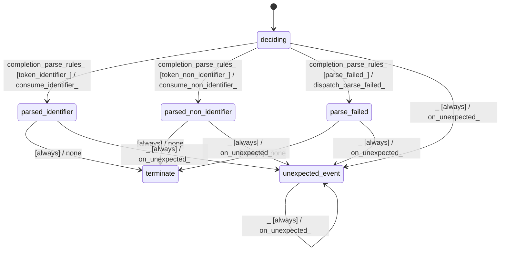

# gbnf_rule_parser_expression_parser

Source: [`emel/gbnf/rule_parser/expression_parser/sm.hpp`](https://github.com/stateforward/emel.cpp/blob/main/src/emel/gbnf/rule_parser/expression_parser/sm.hpp)

## Mermaid

## Transitions

| Source | Event | Guard | Action | Target |
| --- | --- | --- | --- | --- |
| [`deciding`](https://github.com/stateforward/emel.cpp/blob/main/src/emel/gbnf/rule_parser/expression_parser/sm.hpp) | [`completion<parse_rules>`](https://github.com/stateforward/emel.cpp/blob/main/src/emel/gbnf/rule_parser/expression_parser/sm.hpp) | [`token_identifier>`](https://github.com/stateforward/emel.cpp/blob/main/src/emel/gbnf/rule_parser/expression_parser/sm.hpp) | [`consume_identifier>`](https://github.com/stateforward/emel.cpp/blob/main/src/emel/gbnf/rule_parser/expression_parser/sm.hpp) | [`parsed_identifier`](https://github.com/stateforward/emel.cpp/blob/main/src/emel/gbnf/rule_parser/expression_parser/sm.hpp) |
| [`deciding`](https://github.com/stateforward/emel.cpp/blob/main/src/emel/gbnf/rule_parser/expression_parser/sm.hpp) | [`completion<parse_rules>`](https://github.com/stateforward/emel.cpp/blob/main/src/emel/gbnf/rule_parser/expression_parser/sm.hpp) | [`token_non_identifier>`](https://github.com/stateforward/emel.cpp/blob/main/src/emel/gbnf/rule_parser/expression_parser/sm.hpp) | [`consume_non_identifier>`](https://github.com/stateforward/emel.cpp/blob/main/src/emel/gbnf/rule_parser/expression_parser/sm.hpp) | [`parsed_non_identifier`](https://github.com/stateforward/emel.cpp/blob/main/src/emel/gbnf/rule_parser/expression_parser/sm.hpp) |
| [`deciding`](https://github.com/stateforward/emel.cpp/blob/main/src/emel/gbnf/rule_parser/expression_parser/sm.hpp) | [`completion<parse_rules>`](https://github.com/stateforward/emel.cpp/blob/main/src/emel/gbnf/rule_parser/expression_parser/sm.hpp) | [`parse_failed>`](https://github.com/stateforward/emel.cpp/blob/main/src/emel/gbnf/rule_parser/expression_parser/sm.hpp) | [`dispatch_parse_failed>`](https://github.com/stateforward/emel.cpp/blob/main/src/emel/gbnf/rule_parser/expression_parser/sm.hpp) | [`parse_failed`](https://github.com/stateforward/emel.cpp/blob/main/src/emel/gbnf/rule_parser/expression_parser/sm.hpp) |
| [`parsed_identifier`](https://github.com/stateforward/emel.cpp/blob/main/src/emel/gbnf/rule_parser/expression_parser/sm.hpp) | - | [`always`](https://github.com/stateforward/emel.cpp/blob/main/src/emel/gbnf/rule_parser/expression_parser/sm.hpp) | [`none`](https://github.com/stateforward/emel.cpp/blob/main/src/emel/gbnf/rule_parser/expression_parser/sm.hpp) | [`terminate`](https://github.com/stateforward/emel.cpp/blob/main/src/emel/gbnf/rule_parser/expression_parser/sm.hpp) |
| [`parsed_non_identifier`](https://github.com/stateforward/emel.cpp/blob/main/src/emel/gbnf/rule_parser/expression_parser/sm.hpp) | - | [`always`](https://github.com/stateforward/emel.cpp/blob/main/src/emel/gbnf/rule_parser/expression_parser/sm.hpp) | [`none`](https://github.com/stateforward/emel.cpp/blob/main/src/emel/gbnf/rule_parser/expression_parser/sm.hpp) | [`terminate`](https://github.com/stateforward/emel.cpp/blob/main/src/emel/gbnf/rule_parser/expression_parser/sm.hpp) |
| [`parse_failed`](https://github.com/stateforward/emel.cpp/blob/main/src/emel/gbnf/rule_parser/expression_parser/sm.hpp) | - | [`always`](https://github.com/stateforward/emel.cpp/blob/main/src/emel/gbnf/rule_parser/expression_parser/sm.hpp) | [`none`](https://github.com/stateforward/emel.cpp/blob/main/src/emel/gbnf/rule_parser/expression_parser/sm.hpp) | [`terminate`](https://github.com/stateforward/emel.cpp/blob/main/src/emel/gbnf/rule_parser/expression_parser/sm.hpp) |
| [`deciding`](https://github.com/stateforward/emel.cpp/blob/main/src/emel/gbnf/rule_parser/expression_parser/sm.hpp) | [`_`](https://github.com/stateforward/emel.cpp/blob/main/src/emel/gbnf/rule_parser/expression_parser/sm.hpp) | [`always`](https://github.com/stateforward/emel.cpp/blob/main/src/emel/gbnf/rule_parser/expression_parser/sm.hpp) | [`on_unexpected>`](https://github.com/stateforward/emel.cpp/blob/main/src/emel/gbnf/rule_parser/expression_parser/sm.hpp) | [`unexpected_event`](https://github.com/stateforward/emel.cpp/blob/main/src/emel/gbnf/rule_parser/expression_parser/sm.hpp) |
| [`parsed_identifier`](https://github.com/stateforward/emel.cpp/blob/main/src/emel/gbnf/rule_parser/expression_parser/sm.hpp) | [`_`](https://github.com/stateforward/emel.cpp/blob/main/src/emel/gbnf/rule_parser/expression_parser/sm.hpp) | [`always`](https://github.com/stateforward/emel.cpp/blob/main/src/emel/gbnf/rule_parser/expression_parser/sm.hpp) | [`on_unexpected>`](https://github.com/stateforward/emel.cpp/blob/main/src/emel/gbnf/rule_parser/expression_parser/sm.hpp) | [`unexpected_event`](https://github.com/stateforward/emel.cpp/blob/main/src/emel/gbnf/rule_parser/expression_parser/sm.hpp) |
| [`parsed_non_identifier`](https://github.com/stateforward/emel.cpp/blob/main/src/emel/gbnf/rule_parser/expression_parser/sm.hpp) | [`_`](https://github.com/stateforward/emel.cpp/blob/main/src/emel/gbnf/rule_parser/expression_parser/sm.hpp) | [`always`](https://github.com/stateforward/emel.cpp/blob/main/src/emel/gbnf/rule_parser/expression_parser/sm.hpp) | [`on_unexpected>`](https://github.com/stateforward/emel.cpp/blob/main/src/emel/gbnf/rule_parser/expression_parser/sm.hpp) | [`unexpected_event`](https://github.com/stateforward/emel.cpp/blob/main/src/emel/gbnf/rule_parser/expression_parser/sm.hpp) |
| [`parse_failed`](https://github.com/stateforward/emel.cpp/blob/main/src/emel/gbnf/rule_parser/expression_parser/sm.hpp) | [`_`](https://github.com/stateforward/emel.cpp/blob/main/src/emel/gbnf/rule_parser/expression_parser/sm.hpp) | [`always`](https://github.com/stateforward/emel.cpp/blob/main/src/emel/gbnf/rule_parser/expression_parser/sm.hpp) | [`on_unexpected>`](https://github.com/stateforward/emel.cpp/blob/main/src/emel/gbnf/rule_parser/expression_parser/sm.hpp) | [`unexpected_event`](https://github.com/stateforward/emel.cpp/blob/main/src/emel/gbnf/rule_parser/expression_parser/sm.hpp) |
| [`unexpected_event`](https://github.com/stateforward/emel.cpp/blob/main/src/emel/gbnf/rule_parser/expression_parser/sm.hpp) | [`_`](https://github.com/stateforward/emel.cpp/blob/main/src/emel/gbnf/rule_parser/expression_parser/sm.hpp) | [`always`](https://github.com/stateforward/emel.cpp/blob/main/src/emel/gbnf/rule_parser/expression_parser/sm.hpp) | [`on_unexpected>`](https://github.com/stateforward/emel.cpp/blob/main/src/emel/gbnf/rule_parser/expression_parser/sm.hpp) | [`unexpected_event`](https://github.com/stateforward/emel.cpp/blob/main/src/emel/gbnf/rule_parser/expression_parser/sm.hpp) |
