# gbnf_rule_parser_lexer

Source: [`emel/gbnf/rule_parser/lexer/sm.hpp`](https://github.com/stateforward/emel.cpp/blob/main/src/emel/gbnf/rule_parser/lexer/sm.hpp)

## Mermaid

```mermaid
stateDiagram-v2
  direction TB
  [*] --> initialized
  initialized --> initialized : scan_next [invalid_next_] / reject_invalid_next_
  initialized --> initialized : scan_next [invalid_cursor_position_] / reject_invalid_cursor_
  scanning --> scanning : scan_next [invalid_next_] / reject_invalid_next_
  scanning --> scanning : scan_next [invalid_cursor_position_] / reject_invalid_cursor_
  initialized --> scan_ready : scan_next [valid_cursor_position_] / prepare_scan_
  scanning --> scan_ready : scan_next [valid_cursor_position_] / prepare_scan_
  scan_ready --> scanning : completion_scan_next_ [at_eof_] / emit_eof_
  scan_ready --> scanning : completion_scan_next_ [layout_exhausted_] / emit_layout_exhausted_unknown_
  scan_ready --> scanning : completion_scan_next_ [starts_newline_crlf_] / emit_newline_token_width_2__
  scan_ready --> scanning : completion_scan_next_ [starts_newline_single_] / emit_newline_token_width_1__
  scan_ready --> scanning : completion_scan_next_ [starts_definition_operator_] / emit_definition_operator_
  scan_ready --> scanning : completion_scan_next_ [starts_symbol______] / emit_alternation_
  scan_ready --> scanning : completion_scan_next_ [starts_symbol______] / emit_dot_
  scan_ready --> scanning : completion_scan_next_ [starts_symbol______] / emit_open_group_
  scan_ready --> scanning : completion_scan_next_ [starts_symbol______] / emit_close_group_
  scan_ready --> scanning : completion_scan_next_ [starts_quantifier_] / emit_quantifier_
  scan_ready --> scanning : completion_scan_next_ [starts_symbol______] / emit_string_literal_
  scan_ready --> scanning : completion_scan_next_ [starts_symbol______] / emit_character_class_
  scan_ready --> scanning : completion_scan_next_ [starts_symbol______] / emit_braced_quantifier_
  scan_ready --> scanning : completion_scan_next_ [parsed_rule_reference_negated_valid_] / emit_rule_reference_negated_
  scan_ready --> scanning : completion_scan_next_ [parsed_rule_reference_negated_invalid_] / emit_unknown_
  scan_ready --> scanning : completion_scan_next_ [parsed_rule_reference_plain_valid_] / emit_rule_reference_plain_
  scan_ready --> scanning : completion_scan_next_ [parsed_rule_reference_plain_invalid_] / emit_unknown_
  scan_ready --> scanning : completion_scan_next_ [starts_identifier_] / emit_identifier_
  scan_ready --> scanning : completion_scan_next_ [always] / emit_unknown_
  initialized --> initialized : _ [unexpected_has_error_callback_] / dispatch_unexpected_error_
  scanning --> scanning : _ [unexpected_has_error_callback_] / dispatch_unexpected_error_
  scan_ready --> scan_ready : _ [unexpected_has_error_callback_] / dispatch_unexpected_error_
  initialized --> initialized : _ [always] / ignore_unexpected_
  scanning --> scanning : _ [always] / ignore_unexpected_
  scan_ready --> scan_ready : _ [always] / ignore_unexpected_
```

## Transitions

| Source | Event | Guard | Action | Target |
| --- | --- | --- | --- | --- |
| [`initialized`](https://github.com/stateforward/emel.cpp/blob/main/src/emel/gbnf/rule_parser/lexer/sm.hpp) | [`scan_next`](https://github.com/stateforward/emel.cpp/blob/main/src/emel/gbnf/rule_parser/lexer/sm.hpp) | [`invalid_next>`](https://github.com/stateforward/emel.cpp/blob/main/src/emel/gbnf/rule_parser/lexer/sm.hpp) | [`reject_invalid_next>`](https://github.com/stateforward/emel.cpp/blob/main/src/emel/gbnf/rule_parser/lexer/sm.hpp) | [`initialized`](https://github.com/stateforward/emel.cpp/blob/main/src/emel/gbnf/rule_parser/lexer/sm.hpp) |
| [`initialized`](https://github.com/stateforward/emel.cpp/blob/main/src/emel/gbnf/rule_parser/lexer/sm.hpp) | [`scan_next`](https://github.com/stateforward/emel.cpp/blob/main/src/emel/gbnf/rule_parser/lexer/sm.hpp) | [`invalid_cursor_position>`](https://github.com/stateforward/emel.cpp/blob/main/src/emel/gbnf/rule_parser/lexer/sm.hpp) | [`reject_invalid_cursor>`](https://github.com/stateforward/emel.cpp/blob/main/src/emel/gbnf/rule_parser/lexer/sm.hpp) | [`initialized`](https://github.com/stateforward/emel.cpp/blob/main/src/emel/gbnf/rule_parser/lexer/sm.hpp) |
| [`scanning`](https://github.com/stateforward/emel.cpp/blob/main/src/emel/gbnf/rule_parser/lexer/sm.hpp) | [`scan_next`](https://github.com/stateforward/emel.cpp/blob/main/src/emel/gbnf/rule_parser/lexer/sm.hpp) | [`invalid_next>`](https://github.com/stateforward/emel.cpp/blob/main/src/emel/gbnf/rule_parser/lexer/sm.hpp) | [`reject_invalid_next>`](https://github.com/stateforward/emel.cpp/blob/main/src/emel/gbnf/rule_parser/lexer/sm.hpp) | [`scanning`](https://github.com/stateforward/emel.cpp/blob/main/src/emel/gbnf/rule_parser/lexer/sm.hpp) |
| [`scanning`](https://github.com/stateforward/emel.cpp/blob/main/src/emel/gbnf/rule_parser/lexer/sm.hpp) | [`scan_next`](https://github.com/stateforward/emel.cpp/blob/main/src/emel/gbnf/rule_parser/lexer/sm.hpp) | [`invalid_cursor_position>`](https://github.com/stateforward/emel.cpp/blob/main/src/emel/gbnf/rule_parser/lexer/sm.hpp) | [`reject_invalid_cursor>`](https://github.com/stateforward/emel.cpp/blob/main/src/emel/gbnf/rule_parser/lexer/sm.hpp) | [`scanning`](https://github.com/stateforward/emel.cpp/blob/main/src/emel/gbnf/rule_parser/lexer/sm.hpp) |
| [`initialized`](https://github.com/stateforward/emel.cpp/blob/main/src/emel/gbnf/rule_parser/lexer/sm.hpp) | [`scan_next`](https://github.com/stateforward/emel.cpp/blob/main/src/emel/gbnf/rule_parser/lexer/sm.hpp) | [`valid_cursor_position>`](https://github.com/stateforward/emel.cpp/blob/main/src/emel/gbnf/rule_parser/lexer/sm.hpp) | [`prepare_scan>`](https://github.com/stateforward/emel.cpp/blob/main/src/emel/gbnf/rule_parser/lexer/sm.hpp) | [`scan_ready`](https://github.com/stateforward/emel.cpp/blob/main/src/emel/gbnf/rule_parser/lexer/sm.hpp) |
| [`scanning`](https://github.com/stateforward/emel.cpp/blob/main/src/emel/gbnf/rule_parser/lexer/sm.hpp) | [`scan_next`](https://github.com/stateforward/emel.cpp/blob/main/src/emel/gbnf/rule_parser/lexer/sm.hpp) | [`valid_cursor_position>`](https://github.com/stateforward/emel.cpp/blob/main/src/emel/gbnf/rule_parser/lexer/sm.hpp) | [`prepare_scan>`](https://github.com/stateforward/emel.cpp/blob/main/src/emel/gbnf/rule_parser/lexer/sm.hpp) | [`scan_ready`](https://github.com/stateforward/emel.cpp/blob/main/src/emel/gbnf/rule_parser/lexer/sm.hpp) |
| [`scan_ready`](https://github.com/stateforward/emel.cpp/blob/main/src/emel/gbnf/rule_parser/lexer/sm.hpp) | [`completion<scan_next>`](https://github.com/stateforward/emel.cpp/blob/main/src/emel/gbnf/rule_parser/lexer/sm.hpp) | [`at_eof>`](https://github.com/stateforward/emel.cpp/blob/main/src/emel/gbnf/rule_parser/lexer/sm.hpp) | [`emit_eof>`](https://github.com/stateforward/emel.cpp/blob/main/src/emel/gbnf/rule_parser/lexer/sm.hpp) | [`scanning`](https://github.com/stateforward/emel.cpp/blob/main/src/emel/gbnf/rule_parser/lexer/sm.hpp) |
| [`scan_ready`](https://github.com/stateforward/emel.cpp/blob/main/src/emel/gbnf/rule_parser/lexer/sm.hpp) | [`completion<scan_next>`](https://github.com/stateforward/emel.cpp/blob/main/src/emel/gbnf/rule_parser/lexer/sm.hpp) | [`layout_exhausted>`](https://github.com/stateforward/emel.cpp/blob/main/src/emel/gbnf/rule_parser/lexer/sm.hpp) | [`emit_layout_exhausted_unknown>`](https://github.com/stateforward/emel.cpp/blob/main/src/emel/gbnf/rule_parser/lexer/sm.hpp) | [`scanning`](https://github.com/stateforward/emel.cpp/blob/main/src/emel/gbnf/rule_parser/lexer/sm.hpp) |
| [`scan_ready`](https://github.com/stateforward/emel.cpp/blob/main/src/emel/gbnf/rule_parser/lexer/sm.hpp) | [`completion<scan_next>`](https://github.com/stateforward/emel.cpp/blob/main/src/emel/gbnf/rule_parser/lexer/sm.hpp) | [`starts_newline_crlf>`](https://github.com/stateforward/emel.cpp/blob/main/src/emel/gbnf/rule_parser/lexer/sm.hpp) | [`emit_newline_token_width<2>>`](https://github.com/stateforward/emel.cpp/blob/main/src/emel/gbnf/rule_parser/lexer/sm.hpp) | [`scanning`](https://github.com/stateforward/emel.cpp/blob/main/src/emel/gbnf/rule_parser/lexer/sm.hpp) |
| [`scan_ready`](https://github.com/stateforward/emel.cpp/blob/main/src/emel/gbnf/rule_parser/lexer/sm.hpp) | [`completion<scan_next>`](https://github.com/stateforward/emel.cpp/blob/main/src/emel/gbnf/rule_parser/lexer/sm.hpp) | [`starts_newline_single>`](https://github.com/stateforward/emel.cpp/blob/main/src/emel/gbnf/rule_parser/lexer/sm.hpp) | [`emit_newline_token_width<1>>`](https://github.com/stateforward/emel.cpp/blob/main/src/emel/gbnf/rule_parser/lexer/sm.hpp) | [`scanning`](https://github.com/stateforward/emel.cpp/blob/main/src/emel/gbnf/rule_parser/lexer/sm.hpp) |
| [`scan_ready`](https://github.com/stateforward/emel.cpp/blob/main/src/emel/gbnf/rule_parser/lexer/sm.hpp) | [`completion<scan_next>`](https://github.com/stateforward/emel.cpp/blob/main/src/emel/gbnf/rule_parser/lexer/sm.hpp) | [`starts_definition_operator>`](https://github.com/stateforward/emel.cpp/blob/main/src/emel/gbnf/rule_parser/lexer/sm.hpp) | [`emit_definition_operator>`](https://github.com/stateforward/emel.cpp/blob/main/src/emel/gbnf/rule_parser/lexer/sm.hpp) | [`scanning`](https://github.com/stateforward/emel.cpp/blob/main/src/emel/gbnf/rule_parser/lexer/sm.hpp) |
| [`scan_ready`](https://github.com/stateforward/emel.cpp/blob/main/src/emel/gbnf/rule_parser/lexer/sm.hpp) | [`completion<scan_next>`](https://github.com/stateforward/emel.cpp/blob/main/src/emel/gbnf/rule_parser/lexer/sm.hpp) | [`starts_symbol<'|'>>`](https://github.com/stateforward/emel.cpp/blob/main/src/emel/gbnf/rule_parser/lexer/sm.hpp) | [`emit_alternation>`](https://github.com/stateforward/emel.cpp/blob/main/src/emel/gbnf/rule_parser/lexer/sm.hpp) | [`scanning`](https://github.com/stateforward/emel.cpp/blob/main/src/emel/gbnf/rule_parser/lexer/sm.hpp) |
| [`scan_ready`](https://github.com/stateforward/emel.cpp/blob/main/src/emel/gbnf/rule_parser/lexer/sm.hpp) | [`completion<scan_next>`](https://github.com/stateforward/emel.cpp/blob/main/src/emel/gbnf/rule_parser/lexer/sm.hpp) | [`starts_symbol<'.'>>`](https://github.com/stateforward/emel.cpp/blob/main/src/emel/gbnf/rule_parser/lexer/sm.hpp) | [`emit_dot>`](https://github.com/stateforward/emel.cpp/blob/main/src/emel/gbnf/rule_parser/lexer/sm.hpp) | [`scanning`](https://github.com/stateforward/emel.cpp/blob/main/src/emel/gbnf/rule_parser/lexer/sm.hpp) |
| [`scan_ready`](https://github.com/stateforward/emel.cpp/blob/main/src/emel/gbnf/rule_parser/lexer/sm.hpp) | [`completion<scan_next>`](https://github.com/stateforward/emel.cpp/blob/main/src/emel/gbnf/rule_parser/lexer/sm.hpp) | [`starts_symbol<'('>>`](https://github.com/stateforward/emel.cpp/blob/main/src/emel/gbnf/rule_parser/lexer/sm.hpp) | [`emit_open_group>`](https://github.com/stateforward/emel.cpp/blob/main/src/emel/gbnf/rule_parser/lexer/sm.hpp) | [`scanning`](https://github.com/stateforward/emel.cpp/blob/main/src/emel/gbnf/rule_parser/lexer/sm.hpp) |
| [`scan_ready`](https://github.com/stateforward/emel.cpp/blob/main/src/emel/gbnf/rule_parser/lexer/sm.hpp) | [`completion<scan_next>`](https://github.com/stateforward/emel.cpp/blob/main/src/emel/gbnf/rule_parser/lexer/sm.hpp) | [`starts_symbol<')'>>`](https://github.com/stateforward/emel.cpp/blob/main/src/emel/gbnf/rule_parser/lexer/sm.hpp) | [`emit_close_group>`](https://github.com/stateforward/emel.cpp/blob/main/src/emel/gbnf/rule_parser/lexer/sm.hpp) | [`scanning`](https://github.com/stateforward/emel.cpp/blob/main/src/emel/gbnf/rule_parser/lexer/sm.hpp) |
| [`scan_ready`](https://github.com/stateforward/emel.cpp/blob/main/src/emel/gbnf/rule_parser/lexer/sm.hpp) | [`completion<scan_next>`](https://github.com/stateforward/emel.cpp/blob/main/src/emel/gbnf/rule_parser/lexer/sm.hpp) | [`starts_quantifier>`](https://github.com/stateforward/emel.cpp/blob/main/src/emel/gbnf/rule_parser/lexer/sm.hpp) | [`emit_quantifier>`](https://github.com/stateforward/emel.cpp/blob/main/src/emel/gbnf/rule_parser/lexer/sm.hpp) | [`scanning`](https://github.com/stateforward/emel.cpp/blob/main/src/emel/gbnf/rule_parser/lexer/sm.hpp) |
| [`scan_ready`](https://github.com/stateforward/emel.cpp/blob/main/src/emel/gbnf/rule_parser/lexer/sm.hpp) | [`completion<scan_next>`](https://github.com/stateforward/emel.cpp/blob/main/src/emel/gbnf/rule_parser/lexer/sm.hpp) | [`starts_symbol<'"'>>`](https://github.com/stateforward/emel.cpp/blob/main/src/emel/gbnf/rule_parser/lexer/sm.hpp) | [`emit_string_literal>`](https://github.com/stateforward/emel.cpp/blob/main/src/emel/gbnf/rule_parser/lexer/sm.hpp) | [`scanning`](https://github.com/stateforward/emel.cpp/blob/main/src/emel/gbnf/rule_parser/lexer/sm.hpp) |
| [`scan_ready`](https://github.com/stateforward/emel.cpp/blob/main/src/emel/gbnf/rule_parser/lexer/sm.hpp) | [`completion<scan_next>`](https://github.com/stateforward/emel.cpp/blob/main/src/emel/gbnf/rule_parser/lexer/sm.hpp) | [`starts_symbol<'['>>`](https://github.com/stateforward/emel.cpp/blob/main/src/emel/gbnf/rule_parser/lexer/sm.hpp) | [`emit_character_class>`](https://github.com/stateforward/emel.cpp/blob/main/src/emel/gbnf/rule_parser/lexer/sm.hpp) | [`scanning`](https://github.com/stateforward/emel.cpp/blob/main/src/emel/gbnf/rule_parser/lexer/sm.hpp) |
| [`scan_ready`](https://github.com/stateforward/emel.cpp/blob/main/src/emel/gbnf/rule_parser/lexer/sm.hpp) | [`completion<scan_next>`](https://github.com/stateforward/emel.cpp/blob/main/src/emel/gbnf/rule_parser/lexer/sm.hpp) | [`starts_symbol<'{'>>`](https://github.com/stateforward/emel.cpp/blob/main/src/emel/gbnf/rule_parser/lexer/sm.hpp) | [`emit_braced_quantifier>`](https://github.com/stateforward/emel.cpp/blob/main/src/emel/gbnf/rule_parser/lexer/sm.hpp) | [`scanning`](https://github.com/stateforward/emel.cpp/blob/main/src/emel/gbnf/rule_parser/lexer/sm.hpp) |
| [`scan_ready`](https://github.com/stateforward/emel.cpp/blob/main/src/emel/gbnf/rule_parser/lexer/sm.hpp) | [`completion<scan_next>`](https://github.com/stateforward/emel.cpp/blob/main/src/emel/gbnf/rule_parser/lexer/sm.hpp) | [`parsed_rule_reference_negated_valid>`](https://github.com/stateforward/emel.cpp/blob/main/src/emel/gbnf/rule_parser/lexer/sm.hpp) | [`emit_rule_reference_negated>`](https://github.com/stateforward/emel.cpp/blob/main/src/emel/gbnf/rule_parser/lexer/sm.hpp) | [`scanning`](https://github.com/stateforward/emel.cpp/blob/main/src/emel/gbnf/rule_parser/lexer/sm.hpp) |
| [`scan_ready`](https://github.com/stateforward/emel.cpp/blob/main/src/emel/gbnf/rule_parser/lexer/sm.hpp) | [`completion<scan_next>`](https://github.com/stateforward/emel.cpp/blob/main/src/emel/gbnf/rule_parser/lexer/sm.hpp) | [`parsed_rule_reference_negated_invalid>`](https://github.com/stateforward/emel.cpp/blob/main/src/emel/gbnf/rule_parser/lexer/sm.hpp) | [`emit_unknown>`](https://github.com/stateforward/emel.cpp/blob/main/src/emel/gbnf/rule_parser/lexer/sm.hpp) | [`scanning`](https://github.com/stateforward/emel.cpp/blob/main/src/emel/gbnf/rule_parser/lexer/sm.hpp) |
| [`scan_ready`](https://github.com/stateforward/emel.cpp/blob/main/src/emel/gbnf/rule_parser/lexer/sm.hpp) | [`completion<scan_next>`](https://github.com/stateforward/emel.cpp/blob/main/src/emel/gbnf/rule_parser/lexer/sm.hpp) | [`parsed_rule_reference_plain_valid>`](https://github.com/stateforward/emel.cpp/blob/main/src/emel/gbnf/rule_parser/lexer/sm.hpp) | [`emit_rule_reference_plain>`](https://github.com/stateforward/emel.cpp/blob/main/src/emel/gbnf/rule_parser/lexer/sm.hpp) | [`scanning`](https://github.com/stateforward/emel.cpp/blob/main/src/emel/gbnf/rule_parser/lexer/sm.hpp) |
| [`scan_ready`](https://github.com/stateforward/emel.cpp/blob/main/src/emel/gbnf/rule_parser/lexer/sm.hpp) | [`completion<scan_next>`](https://github.com/stateforward/emel.cpp/blob/main/src/emel/gbnf/rule_parser/lexer/sm.hpp) | [`parsed_rule_reference_plain_invalid>`](https://github.com/stateforward/emel.cpp/blob/main/src/emel/gbnf/rule_parser/lexer/sm.hpp) | [`emit_unknown>`](https://github.com/stateforward/emel.cpp/blob/main/src/emel/gbnf/rule_parser/lexer/sm.hpp) | [`scanning`](https://github.com/stateforward/emel.cpp/blob/main/src/emel/gbnf/rule_parser/lexer/sm.hpp) |
| [`scan_ready`](https://github.com/stateforward/emel.cpp/blob/main/src/emel/gbnf/rule_parser/lexer/sm.hpp) | [`completion<scan_next>`](https://github.com/stateforward/emel.cpp/blob/main/src/emel/gbnf/rule_parser/lexer/sm.hpp) | [`starts_identifier>`](https://github.com/stateforward/emel.cpp/blob/main/src/emel/gbnf/rule_parser/lexer/sm.hpp) | [`emit_identifier>`](https://github.com/stateforward/emel.cpp/blob/main/src/emel/gbnf/rule_parser/lexer/sm.hpp) | [`scanning`](https://github.com/stateforward/emel.cpp/blob/main/src/emel/gbnf/rule_parser/lexer/sm.hpp) |
| [`scan_ready`](https://github.com/stateforward/emel.cpp/blob/main/src/emel/gbnf/rule_parser/lexer/sm.hpp) | [`completion<scan_next>`](https://github.com/stateforward/emel.cpp/blob/main/src/emel/gbnf/rule_parser/lexer/sm.hpp) | [`always`](https://github.com/stateforward/emel.cpp/blob/main/src/emel/gbnf/rule_parser/lexer/sm.hpp) | [`emit_unknown>`](https://github.com/stateforward/emel.cpp/blob/main/src/emel/gbnf/rule_parser/lexer/sm.hpp) | [`scanning`](https://github.com/stateforward/emel.cpp/blob/main/src/emel/gbnf/rule_parser/lexer/sm.hpp) |
| [`initialized`](https://github.com/stateforward/emel.cpp/blob/main/src/emel/gbnf/rule_parser/lexer/sm.hpp) | [`_`](https://github.com/stateforward/emel.cpp/blob/main/src/emel/gbnf/rule_parser/lexer/sm.hpp) | [`unexpected_has_error_callback>`](https://github.com/stateforward/emel.cpp/blob/main/src/emel/gbnf/rule_parser/lexer/sm.hpp) | [`dispatch_unexpected_error>`](https://github.com/stateforward/emel.cpp/blob/main/src/emel/gbnf/rule_parser/lexer/sm.hpp) | [`initialized`](https://github.com/stateforward/emel.cpp/blob/main/src/emel/gbnf/rule_parser/lexer/sm.hpp) |
| [`scanning`](https://github.com/stateforward/emel.cpp/blob/main/src/emel/gbnf/rule_parser/lexer/sm.hpp) | [`_`](https://github.com/stateforward/emel.cpp/blob/main/src/emel/gbnf/rule_parser/lexer/sm.hpp) | [`unexpected_has_error_callback>`](https://github.com/stateforward/emel.cpp/blob/main/src/emel/gbnf/rule_parser/lexer/sm.hpp) | [`dispatch_unexpected_error>`](https://github.com/stateforward/emel.cpp/blob/main/src/emel/gbnf/rule_parser/lexer/sm.hpp) | [`scanning`](https://github.com/stateforward/emel.cpp/blob/main/src/emel/gbnf/rule_parser/lexer/sm.hpp) |
| [`scan_ready`](https://github.com/stateforward/emel.cpp/blob/main/src/emel/gbnf/rule_parser/lexer/sm.hpp) | [`_`](https://github.com/stateforward/emel.cpp/blob/main/src/emel/gbnf/rule_parser/lexer/sm.hpp) | [`unexpected_has_error_callback>`](https://github.com/stateforward/emel.cpp/blob/main/src/emel/gbnf/rule_parser/lexer/sm.hpp) | [`dispatch_unexpected_error>`](https://github.com/stateforward/emel.cpp/blob/main/src/emel/gbnf/rule_parser/lexer/sm.hpp) | [`scan_ready`](https://github.com/stateforward/emel.cpp/blob/main/src/emel/gbnf/rule_parser/lexer/sm.hpp) |
| [`initialized`](https://github.com/stateforward/emel.cpp/blob/main/src/emel/gbnf/rule_parser/lexer/sm.hpp) | [`_`](https://github.com/stateforward/emel.cpp/blob/main/src/emel/gbnf/rule_parser/lexer/sm.hpp) | [`always`](https://github.com/stateforward/emel.cpp/blob/main/src/emel/gbnf/rule_parser/lexer/sm.hpp) | [`ignore_unexpected>`](https://github.com/stateforward/emel.cpp/blob/main/src/emel/gbnf/rule_parser/lexer/sm.hpp) | [`initialized`](https://github.com/stateforward/emel.cpp/blob/main/src/emel/gbnf/rule_parser/lexer/sm.hpp) |
| [`scanning`](https://github.com/stateforward/emel.cpp/blob/main/src/emel/gbnf/rule_parser/lexer/sm.hpp) | [`_`](https://github.com/stateforward/emel.cpp/blob/main/src/emel/gbnf/rule_parser/lexer/sm.hpp) | [`always`](https://github.com/stateforward/emel.cpp/blob/main/src/emel/gbnf/rule_parser/lexer/sm.hpp) | [`ignore_unexpected>`](https://github.com/stateforward/emel.cpp/blob/main/src/emel/gbnf/rule_parser/lexer/sm.hpp) | [`scanning`](https://github.com/stateforward/emel.cpp/blob/main/src/emel/gbnf/rule_parser/lexer/sm.hpp) |
| [`scan_ready`](https://github.com/stateforward/emel.cpp/blob/main/src/emel/gbnf/rule_parser/lexer/sm.hpp) | [`_`](https://github.com/stateforward/emel.cpp/blob/main/src/emel/gbnf/rule_parser/lexer/sm.hpp) | [`always`](https://github.com/stateforward/emel.cpp/blob/main/src/emel/gbnf/rule_parser/lexer/sm.hpp) | [`ignore_unexpected>`](https://github.com/stateforward/emel.cpp/blob/main/src/emel/gbnf/rule_parser/lexer/sm.hpp) | [`scan_ready`](https://github.com/stateforward/emel.cpp/blob/main/src/emel/gbnf/rule_parser/lexer/sm.hpp) |
