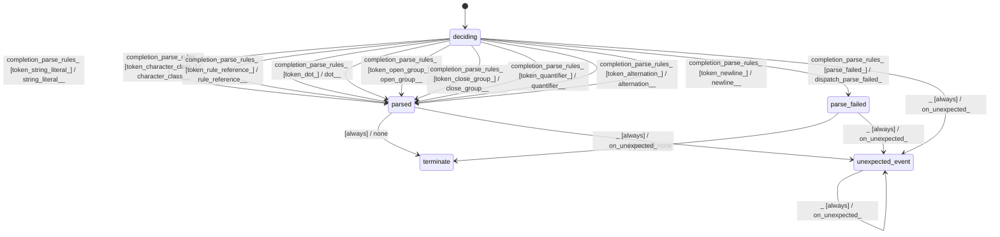

# gbnf_rule_parser_term_parser

Source: [`emel/gbnf/rule_parser/term_parser/sm.hpp`](https://github.com/stateforward/emel.cpp/blob/main/src/emel/gbnf/rule_parser/term_parser/sm.hpp)

## Mermaid

## Transitions

| Source | Event | Guard | Action | Target |
| --- | --- | --- | --- | --- |
| [`deciding`](https://github.com/stateforward/emel.cpp/blob/main/src/emel/gbnf/rule_parser/term_parser/sm.hpp) | [`completion<parse_rules>`](https://github.com/stateforward/emel.cpp/blob/main/src/emel/gbnf/rule_parser/term_parser/sm.hpp) | [`token_string_literal>`](https://github.com/stateforward/emel.cpp/blob/main/src/emel/gbnf/rule_parser/term_parser/sm.hpp) | [`string_literal>>`](https://github.com/stateforward/emel.cpp/blob/main/src/emel/gbnf/rule_parser/term_parser/sm.hpp) | [`parsed`](https://github.com/stateforward/emel.cpp/blob/main/src/emel/gbnf/rule_parser/term_parser/sm.hpp) |
| [`deciding`](https://github.com/stateforward/emel.cpp/blob/main/src/emel/gbnf/rule_parser/term_parser/sm.hpp) | [`completion<parse_rules>`](https://github.com/stateforward/emel.cpp/blob/main/src/emel/gbnf/rule_parser/term_parser/sm.hpp) | [`token_character_class>`](https://github.com/stateforward/emel.cpp/blob/main/src/emel/gbnf/rule_parser/term_parser/sm.hpp) | [`character_class>>`](https://github.com/stateforward/emel.cpp/blob/main/src/emel/gbnf/rule_parser/term_parser/sm.hpp) | [`parsed`](https://github.com/stateforward/emel.cpp/blob/main/src/emel/gbnf/rule_parser/term_parser/sm.hpp) |
| [`deciding`](https://github.com/stateforward/emel.cpp/blob/main/src/emel/gbnf/rule_parser/term_parser/sm.hpp) | [`completion<parse_rules>`](https://github.com/stateforward/emel.cpp/blob/main/src/emel/gbnf/rule_parser/term_parser/sm.hpp) | [`token_rule_reference>`](https://github.com/stateforward/emel.cpp/blob/main/src/emel/gbnf/rule_parser/term_parser/sm.hpp) | [`rule_reference>>`](https://github.com/stateforward/emel.cpp/blob/main/src/emel/gbnf/rule_parser/term_parser/sm.hpp) | [`parsed`](https://github.com/stateforward/emel.cpp/blob/main/src/emel/gbnf/rule_parser/term_parser/sm.hpp) |
| [`deciding`](https://github.com/stateforward/emel.cpp/blob/main/src/emel/gbnf/rule_parser/term_parser/sm.hpp) | [`completion<parse_rules>`](https://github.com/stateforward/emel.cpp/blob/main/src/emel/gbnf/rule_parser/term_parser/sm.hpp) | [`token_dot>`](https://github.com/stateforward/emel.cpp/blob/main/src/emel/gbnf/rule_parser/term_parser/sm.hpp) | [`dot>>`](https://github.com/stateforward/emel.cpp/blob/main/src/emel/gbnf/rule_parser/term_parser/sm.hpp) | [`parsed`](https://github.com/stateforward/emel.cpp/blob/main/src/emel/gbnf/rule_parser/term_parser/sm.hpp) |
| [`deciding`](https://github.com/stateforward/emel.cpp/blob/main/src/emel/gbnf/rule_parser/term_parser/sm.hpp) | [`completion<parse_rules>`](https://github.com/stateforward/emel.cpp/blob/main/src/emel/gbnf/rule_parser/term_parser/sm.hpp) | [`token_open_group>`](https://github.com/stateforward/emel.cpp/blob/main/src/emel/gbnf/rule_parser/term_parser/sm.hpp) | [`open_group>>`](https://github.com/stateforward/emel.cpp/blob/main/src/emel/gbnf/rule_parser/term_parser/sm.hpp) | [`parsed`](https://github.com/stateforward/emel.cpp/blob/main/src/emel/gbnf/rule_parser/term_parser/sm.hpp) |
| [`deciding`](https://github.com/stateforward/emel.cpp/blob/main/src/emel/gbnf/rule_parser/term_parser/sm.hpp) | [`completion<parse_rules>`](https://github.com/stateforward/emel.cpp/blob/main/src/emel/gbnf/rule_parser/term_parser/sm.hpp) | [`token_close_group>`](https://github.com/stateforward/emel.cpp/blob/main/src/emel/gbnf/rule_parser/term_parser/sm.hpp) | [`close_group>>`](https://github.com/stateforward/emel.cpp/blob/main/src/emel/gbnf/rule_parser/term_parser/sm.hpp) | [`parsed`](https://github.com/stateforward/emel.cpp/blob/main/src/emel/gbnf/rule_parser/term_parser/sm.hpp) |
| [`deciding`](https://github.com/stateforward/emel.cpp/blob/main/src/emel/gbnf/rule_parser/term_parser/sm.hpp) | [`completion<parse_rules>`](https://github.com/stateforward/emel.cpp/blob/main/src/emel/gbnf/rule_parser/term_parser/sm.hpp) | [`token_quantifier>`](https://github.com/stateforward/emel.cpp/blob/main/src/emel/gbnf/rule_parser/term_parser/sm.hpp) | [`quantifier>>`](https://github.com/stateforward/emel.cpp/blob/main/src/emel/gbnf/rule_parser/term_parser/sm.hpp) | [`parsed`](https://github.com/stateforward/emel.cpp/blob/main/src/emel/gbnf/rule_parser/term_parser/sm.hpp) |
| [`deciding`](https://github.com/stateforward/emel.cpp/blob/main/src/emel/gbnf/rule_parser/term_parser/sm.hpp) | [`completion<parse_rules>`](https://github.com/stateforward/emel.cpp/blob/main/src/emel/gbnf/rule_parser/term_parser/sm.hpp) | [`token_alternation>`](https://github.com/stateforward/emel.cpp/blob/main/src/emel/gbnf/rule_parser/term_parser/sm.hpp) | [`alternation>>`](https://github.com/stateforward/emel.cpp/blob/main/src/emel/gbnf/rule_parser/term_parser/sm.hpp) | [`parsed`](https://github.com/stateforward/emel.cpp/blob/main/src/emel/gbnf/rule_parser/term_parser/sm.hpp) |
| [`deciding`](https://github.com/stateforward/emel.cpp/blob/main/src/emel/gbnf/rule_parser/term_parser/sm.hpp) | [`completion<parse_rules>`](https://github.com/stateforward/emel.cpp/blob/main/src/emel/gbnf/rule_parser/term_parser/sm.hpp) | [`token_newline>`](https://github.com/stateforward/emel.cpp/blob/main/src/emel/gbnf/rule_parser/term_parser/sm.hpp) | [`newline>>`](https://github.com/stateforward/emel.cpp/blob/main/src/emel/gbnf/rule_parser/term_parser/sm.hpp) | [`parsed`](https://github.com/stateforward/emel.cpp/blob/main/src/emel/gbnf/rule_parser/term_parser/sm.hpp) |
| [`deciding`](https://github.com/stateforward/emel.cpp/blob/main/src/emel/gbnf/rule_parser/term_parser/sm.hpp) | [`completion<parse_rules>`](https://github.com/stateforward/emel.cpp/blob/main/src/emel/gbnf/rule_parser/term_parser/sm.hpp) | [`parse_failed>`](https://github.com/stateforward/emel.cpp/blob/main/src/emel/gbnf/rule_parser/term_parser/sm.hpp) | [`dispatch_parse_failed>`](https://github.com/stateforward/emel.cpp/blob/main/src/emel/gbnf/rule_parser/term_parser/sm.hpp) | [`parse_failed`](https://github.com/stateforward/emel.cpp/blob/main/src/emel/gbnf/rule_parser/term_parser/sm.hpp) |
| [`parsed`](https://github.com/stateforward/emel.cpp/blob/main/src/emel/gbnf/rule_parser/term_parser/sm.hpp) | - | [`always`](https://github.com/stateforward/emel.cpp/blob/main/src/emel/gbnf/rule_parser/term_parser/sm.hpp) | [`none`](https://github.com/stateforward/emel.cpp/blob/main/src/emel/gbnf/rule_parser/term_parser/sm.hpp) | [`terminate`](https://github.com/stateforward/emel.cpp/blob/main/src/emel/gbnf/rule_parser/term_parser/sm.hpp) |
| [`parse_failed`](https://github.com/stateforward/emel.cpp/blob/main/src/emel/gbnf/rule_parser/term_parser/sm.hpp) | - | [`always`](https://github.com/stateforward/emel.cpp/blob/main/src/emel/gbnf/rule_parser/term_parser/sm.hpp) | [`none`](https://github.com/stateforward/emel.cpp/blob/main/src/emel/gbnf/rule_parser/term_parser/sm.hpp) | [`terminate`](https://github.com/stateforward/emel.cpp/blob/main/src/emel/gbnf/rule_parser/term_parser/sm.hpp) |
| [`deciding`](https://github.com/stateforward/emel.cpp/blob/main/src/emel/gbnf/rule_parser/term_parser/sm.hpp) | [`_`](https://github.com/stateforward/emel.cpp/blob/main/src/emel/gbnf/rule_parser/term_parser/sm.hpp) | [`always`](https://github.com/stateforward/emel.cpp/blob/main/src/emel/gbnf/rule_parser/term_parser/sm.hpp) | [`on_unexpected>`](https://github.com/stateforward/emel.cpp/blob/main/src/emel/gbnf/rule_parser/term_parser/sm.hpp) | [`unexpected_event`](https://github.com/stateforward/emel.cpp/blob/main/src/emel/gbnf/rule_parser/term_parser/sm.hpp) |
| [`parsed`](https://github.com/stateforward/emel.cpp/blob/main/src/emel/gbnf/rule_parser/term_parser/sm.hpp) | [`_`](https://github.com/stateforward/emel.cpp/blob/main/src/emel/gbnf/rule_parser/term_parser/sm.hpp) | [`always`](https://github.com/stateforward/emel.cpp/blob/main/src/emel/gbnf/rule_parser/term_parser/sm.hpp) | [`on_unexpected>`](https://github.com/stateforward/emel.cpp/blob/main/src/emel/gbnf/rule_parser/term_parser/sm.hpp) | [`unexpected_event`](https://github.com/stateforward/emel.cpp/blob/main/src/emel/gbnf/rule_parser/term_parser/sm.hpp) |
| [`parse_failed`](https://github.com/stateforward/emel.cpp/blob/main/src/emel/gbnf/rule_parser/term_parser/sm.hpp) | [`_`](https://github.com/stateforward/emel.cpp/blob/main/src/emel/gbnf/rule_parser/term_parser/sm.hpp) | [`always`](https://github.com/stateforward/emel.cpp/blob/main/src/emel/gbnf/rule_parser/term_parser/sm.hpp) | [`on_unexpected>`](https://github.com/stateforward/emel.cpp/blob/main/src/emel/gbnf/rule_parser/term_parser/sm.hpp) | [`unexpected_event`](https://github.com/stateforward/emel.cpp/blob/main/src/emel/gbnf/rule_parser/term_parser/sm.hpp) |
| [`unexpected_event`](https://github.com/stateforward/emel.cpp/blob/main/src/emel/gbnf/rule_parser/term_parser/sm.hpp) | [`_`](https://github.com/stateforward/emel.cpp/blob/main/src/emel/gbnf/rule_parser/term_parser/sm.hpp) | [`always`](https://github.com/stateforward/emel.cpp/blob/main/src/emel/gbnf/rule_parser/term_parser/sm.hpp) | [`on_unexpected>`](https://github.com/stateforward/emel.cpp/blob/main/src/emel/gbnf/rule_parser/term_parser/sm.hpp) | [`unexpected_event`](https://github.com/stateforward/emel.cpp/blob/main/src/emel/gbnf/rule_parser/term_parser/sm.hpp) |
