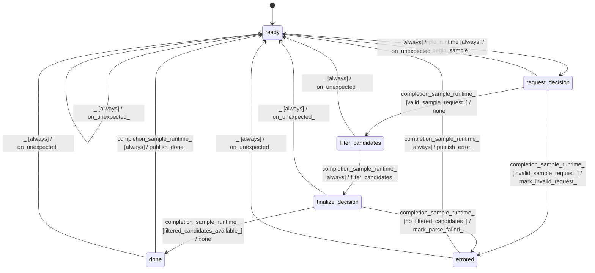

# gbnf_sampler

Source: [`emel/gbnf/sampler/sm.hpp`](https://github.com/stateforward/emel.cpp/blob/main/src/emel/gbnf/sampler/sm.hpp)

## Mermaid

## Transitions

| Source | Event | Guard | Action | Target |
| --- | --- | --- | --- | --- |
| [`ready`](https://github.com/stateforward/emel.cpp/blob/main/src/emel/gbnf/sampler/sm.hpp) | [`sample_runtime`](https://github.com/stateforward/emel.cpp/blob/main/src/emel/gbnf/sampler/sm.hpp) | [`always`](https://github.com/stateforward/emel.cpp/blob/main/src/emel/gbnf/sampler/sm.hpp) | [`begin_sample>`](https://github.com/stateforward/emel.cpp/blob/main/src/emel/gbnf/sampler/sm.hpp) | [`request_decision`](https://github.com/stateforward/emel.cpp/blob/main/src/emel/gbnf/sampler/sm.hpp) |
| [`request_decision`](https://github.com/stateforward/emel.cpp/blob/main/src/emel/gbnf/sampler/sm.hpp) | [`completion<sample_runtime>`](https://github.com/stateforward/emel.cpp/blob/main/src/emel/gbnf/sampler/sm.hpp) | [`valid_sample_request>`](https://github.com/stateforward/emel.cpp/blob/main/src/emel/gbnf/sampler/sm.hpp) | [`none`](https://github.com/stateforward/emel.cpp/blob/main/src/emel/gbnf/sampler/sm.hpp) | [`filter_candidates`](https://github.com/stateforward/emel.cpp/blob/main/src/emel/gbnf/sampler/sm.hpp) |
| [`request_decision`](https://github.com/stateforward/emel.cpp/blob/main/src/emel/gbnf/sampler/sm.hpp) | [`completion<sample_runtime>`](https://github.com/stateforward/emel.cpp/blob/main/src/emel/gbnf/sampler/sm.hpp) | [`invalid_sample_request>`](https://github.com/stateforward/emel.cpp/blob/main/src/emel/gbnf/sampler/sm.hpp) | [`mark_invalid_request>`](https://github.com/stateforward/emel.cpp/blob/main/src/emel/gbnf/sampler/sm.hpp) | [`errored`](https://github.com/stateforward/emel.cpp/blob/main/src/emel/gbnf/sampler/sm.hpp) |
| [`filter_candidates`](https://github.com/stateforward/emel.cpp/blob/main/src/emel/gbnf/sampler/sm.hpp) | [`completion<sample_runtime>`](https://github.com/stateforward/emel.cpp/blob/main/src/emel/gbnf/sampler/sm.hpp) | [`always`](https://github.com/stateforward/emel.cpp/blob/main/src/emel/gbnf/sampler/sm.hpp) | [`filter_candidates>`](https://github.com/stateforward/emel.cpp/blob/main/src/emel/gbnf/sampler/sm.hpp) | [`finalize_decision`](https://github.com/stateforward/emel.cpp/blob/main/src/emel/gbnf/sampler/sm.hpp) |
| [`finalize_decision`](https://github.com/stateforward/emel.cpp/blob/main/src/emel/gbnf/sampler/sm.hpp) | [`completion<sample_runtime>`](https://github.com/stateforward/emel.cpp/blob/main/src/emel/gbnf/sampler/sm.hpp) | [`filtered_candidates_available>`](https://github.com/stateforward/emel.cpp/blob/main/src/emel/gbnf/sampler/sm.hpp) | [`none`](https://github.com/stateforward/emel.cpp/blob/main/src/emel/gbnf/sampler/sm.hpp) | [`done`](https://github.com/stateforward/emel.cpp/blob/main/src/emel/gbnf/sampler/sm.hpp) |
| [`finalize_decision`](https://github.com/stateforward/emel.cpp/blob/main/src/emel/gbnf/sampler/sm.hpp) | [`completion<sample_runtime>`](https://github.com/stateforward/emel.cpp/blob/main/src/emel/gbnf/sampler/sm.hpp) | [`no_filtered_candidates>`](https://github.com/stateforward/emel.cpp/blob/main/src/emel/gbnf/sampler/sm.hpp) | [`mark_parse_failed>`](https://github.com/stateforward/emel.cpp/blob/main/src/emel/gbnf/sampler/sm.hpp) | [`errored`](https://github.com/stateforward/emel.cpp/blob/main/src/emel/gbnf/sampler/sm.hpp) |
| [`done`](https://github.com/stateforward/emel.cpp/blob/main/src/emel/gbnf/sampler/sm.hpp) | [`completion<sample_runtime>`](https://github.com/stateforward/emel.cpp/blob/main/src/emel/gbnf/sampler/sm.hpp) | [`always`](https://github.com/stateforward/emel.cpp/blob/main/src/emel/gbnf/sampler/sm.hpp) | [`publish_done>`](https://github.com/stateforward/emel.cpp/blob/main/src/emel/gbnf/sampler/sm.hpp) | [`ready`](https://github.com/stateforward/emel.cpp/blob/main/src/emel/gbnf/sampler/sm.hpp) |
| [`errored`](https://github.com/stateforward/emel.cpp/blob/main/src/emel/gbnf/sampler/sm.hpp) | [`completion<sample_runtime>`](https://github.com/stateforward/emel.cpp/blob/main/src/emel/gbnf/sampler/sm.hpp) | [`always`](https://github.com/stateforward/emel.cpp/blob/main/src/emel/gbnf/sampler/sm.hpp) | [`publish_error>`](https://github.com/stateforward/emel.cpp/blob/main/src/emel/gbnf/sampler/sm.hpp) | [`ready`](https://github.com/stateforward/emel.cpp/blob/main/src/emel/gbnf/sampler/sm.hpp) |
| [`ready`](https://github.com/stateforward/emel.cpp/blob/main/src/emel/gbnf/sampler/sm.hpp) | [`_`](https://github.com/stateforward/emel.cpp/blob/main/src/emel/gbnf/sampler/sm.hpp) | [`always`](https://github.com/stateforward/emel.cpp/blob/main/src/emel/gbnf/sampler/sm.hpp) | [`on_unexpected>`](https://github.com/stateforward/emel.cpp/blob/main/src/emel/gbnf/sampler/sm.hpp) | [`ready`](https://github.com/stateforward/emel.cpp/blob/main/src/emel/gbnf/sampler/sm.hpp) |
| [`request_decision`](https://github.com/stateforward/emel.cpp/blob/main/src/emel/gbnf/sampler/sm.hpp) | [`_`](https://github.com/stateforward/emel.cpp/blob/main/src/emel/gbnf/sampler/sm.hpp) | [`always`](https://github.com/stateforward/emel.cpp/blob/main/src/emel/gbnf/sampler/sm.hpp) | [`on_unexpected>`](https://github.com/stateforward/emel.cpp/blob/main/src/emel/gbnf/sampler/sm.hpp) | [`ready`](https://github.com/stateforward/emel.cpp/blob/main/src/emel/gbnf/sampler/sm.hpp) |
| [`filter_candidates`](https://github.com/stateforward/emel.cpp/blob/main/src/emel/gbnf/sampler/sm.hpp) | [`_`](https://github.com/stateforward/emel.cpp/blob/main/src/emel/gbnf/sampler/sm.hpp) | [`always`](https://github.com/stateforward/emel.cpp/blob/main/src/emel/gbnf/sampler/sm.hpp) | [`on_unexpected>`](https://github.com/stateforward/emel.cpp/blob/main/src/emel/gbnf/sampler/sm.hpp) | [`ready`](https://github.com/stateforward/emel.cpp/blob/main/src/emel/gbnf/sampler/sm.hpp) |
| [`finalize_decision`](https://github.com/stateforward/emel.cpp/blob/main/src/emel/gbnf/sampler/sm.hpp) | [`_`](https://github.com/stateforward/emel.cpp/blob/main/src/emel/gbnf/sampler/sm.hpp) | [`always`](https://github.com/stateforward/emel.cpp/blob/main/src/emel/gbnf/sampler/sm.hpp) | [`on_unexpected>`](https://github.com/stateforward/emel.cpp/blob/main/src/emel/gbnf/sampler/sm.hpp) | [`ready`](https://github.com/stateforward/emel.cpp/blob/main/src/emel/gbnf/sampler/sm.hpp) |
| [`done`](https://github.com/stateforward/emel.cpp/blob/main/src/emel/gbnf/sampler/sm.hpp) | [`_`](https://github.com/stateforward/emel.cpp/blob/main/src/emel/gbnf/sampler/sm.hpp) | [`always`](https://github.com/stateforward/emel.cpp/blob/main/src/emel/gbnf/sampler/sm.hpp) | [`on_unexpected>`](https://github.com/stateforward/emel.cpp/blob/main/src/emel/gbnf/sampler/sm.hpp) | [`ready`](https://github.com/stateforward/emel.cpp/blob/main/src/emel/gbnf/sampler/sm.hpp) |
| [`errored`](https://github.com/stateforward/emel.cpp/blob/main/src/emel/gbnf/sampler/sm.hpp) | [`_`](https://github.com/stateforward/emel.cpp/blob/main/src/emel/gbnf/sampler/sm.hpp) | [`always`](https://github.com/stateforward/emel.cpp/blob/main/src/emel/gbnf/sampler/sm.hpp) | [`on_unexpected>`](https://github.com/stateforward/emel.cpp/blob/main/src/emel/gbnf/sampler/sm.hpp) | [`ready`](https://github.com/stateforward/emel.cpp/blob/main/src/emel/gbnf/sampler/sm.hpp) |
