# graph

Source: [`emel/graph/sm.hpp`](https://github.com/stateforward/emel.cpp/blob/main/src/emel/graph/sm.hpp)

## Mermaid

```mermaid
stateDiagram-v2
  direction TB
  [*] --> uninitialized
  uninitialized --> reserving : reserve_graph [valid_reserve_] / begin_reserve_
  uninitialized --> uninitialized : reserve_graph [invalid_reserve_with_dispatchable_output_] / reject_invalid_reserve_with_dispatch_
  uninitialized --> uninitialized : reserve_graph [invalid_reserve_with_output_only_] / reject_invalid_reserve_with_output_only_
  uninitialized --> uninitialized : reserve_graph [invalid_reserve_without_output_] / reject_invalid_reserve_without_output_
  reserved --> reserved : reserve_graph [valid_reserve_] / reject_invalid_reserve_with_dispatch_
  reserved --> reserved : reserve_graph [invalid_reserve_with_dispatchable_output_] / reject_invalid_reserve_with_dispatch_
  reserved --> reserved : reserve_graph [invalid_reserve_with_output_only_] / reject_invalid_reserve_with_output_only_
  reserved --> reserved : reserve_graph [invalid_reserve_without_output_] / reject_invalid_reserve_without_output_
  reserving --> reserve_decision : completion_reserve_graph_ [always] / request_reserve_
  reserve_decision --> reserve_tensor_decision : completion_reserve_graph_ [reserve_done_] / request_tensor_reserve_
  reserve_tensor_decision --> reserved : completion_reserve_graph_ [tensor_reserve_done_] / dispatch_reserve_done_
  reserve_decision --> uninitialized : completion_reserve_graph_ [reserve_failed_] / dispatch_reserve_error_
  reserve_tensor_decision --> uninitialized : completion_reserve_graph_ [tensor_reserve_failed_] / dispatch_reserve_error_
  reserved --> assembling : compute_graph [valid_compute_] / begin_compute_
  reserved --> reserved : compute_graph [invalid_compute_with_dispatchable_output_] / reject_invalid_compute_with_dispatch_
  reserved --> reserved : compute_graph [invalid_compute_with_output_only_] / reject_invalid_compute_with_output_only_
  reserved --> reserved : compute_graph [invalid_compute_without_output_] / reject_invalid_compute_without_output_
  uninitialized --> uninitialized : compute_graph [valid_compute_] / reject_invalid_compute_with_dispatch_
  uninitialized --> uninitialized : compute_graph [invalid_compute_with_dispatchable_output_] / reject_invalid_compute_with_dispatch_
  uninitialized --> uninitialized : compute_graph [invalid_compute_with_output_only_] / reject_invalid_compute_with_output_only_
  uninitialized --> uninitialized : compute_graph [invalid_compute_without_output_] / reject_invalid_compute_without_output_
  reserved --> executing : compute_reserved_graph [guard_valid_compute_reserved_] / effect_begin_reserved_compute_
  reserved --> reserved : compute_reserved_graph [guard_invalid_compute_reserved_with_dispatchable_output_] / effect_reject_invalid_reserved_compute_with_dispatch_
  reserved --> reserved : compute_reserved_graph [guard_invalid_compute_reserved_with_output_only_] / effect_reject_invalid_reserved_compute_with_output_only_
  reserved --> reserved : compute_reserved_graph [guard_invalid_compute_reserved_without_output_] / effect_reject_invalid_reserved_compute_without_output_
  uninitialized --> uninitialized : compute_reserved_graph [guard_valid_compute_reserved_] / effect_reject_invalid_reserved_compute_with_dispatch_
  uninitialized --> uninitialized : compute_reserved_graph [guard_invalid_compute_reserved_with_dispatchable_output_] / effect_reject_invalid_reserved_compute_with_dispatch_
  uninitialized --> uninitialized : compute_reserved_graph [guard_invalid_compute_reserved_with_output_only_] / effect_reject_invalid_reserved_compute_with_output_only_
  uninitialized --> uninitialized : compute_reserved_graph [guard_invalid_compute_reserved_without_output_] / effect_reject_invalid_reserved_compute_without_output_
  assembling --> assemble_decision : completion_compute_graph_ [always] / request_assemble_
  assemble_decision --> executing : completion_compute_graph_ [assemble_done_] / none
  assemble_decision --> compute_decision : completion_compute_graph_ [assemble_failed_] / none
  executing --> execute_decision : completion_compute_graph_ [always] / request_execute_
  execute_decision --> compute_decision : completion_compute_graph_ [execute_done_] / none
  execute_decision --> compute_decision : completion_compute_graph_ [execute_failed_] / none
  executing --> execute_decision : completion_compute_reserved_graph_ [always] / effect_request_reserved_execute_
  execute_decision --> compute_decision : completion_compute_reserved_graph_ [guard_reserved_execute_done_] / none
  execute_decision --> compute_decision : completion_compute_reserved_graph_ [guard_reserved_execute_failed_] / none
  compute_decision --> reserved : completion_compute_graph_ [compute_error_none_] / dispatch_compute_done_
  compute_decision --> reserved : completion_compute_graph_ [compute_error_invalid_request_] / dispatch_compute_error_
  compute_decision --> reserved : completion_compute_graph_ [compute_error_assembler_failed_] / dispatch_compute_error_
  compute_decision --> reserved : completion_compute_graph_ [compute_error_processor_failed_] / dispatch_compute_error_
  compute_decision --> reserved : completion_compute_graph_ [compute_error_busy_] / dispatch_compute_error_
  compute_decision --> reserved : completion_compute_graph_ [compute_error_internal_error_] / dispatch_compute_error_
  compute_decision --> reserved : completion_compute_graph_ [compute_error_untracked_] / dispatch_compute_error_
  compute_decision --> reserved : completion_compute_graph_ [compute_error_unknown_] / dispatch_compute_error_
  compute_decision --> reserved : completion_compute_reserved_graph_ [guard_reserved_compute_error_none_] / effect_dispatch_reserved_compute_done_
  compute_decision --> reserved : completion_compute_reserved_graph_ [guard_reserved_compute_error_invalid_request_] / effect_dispatch_reserved_compute_error_
  compute_decision --> reserved : completion_compute_reserved_graph_ [guard_reserved_compute_error_assembler_failed_] / effect_dispatch_reserved_compute_error_
  compute_decision --> reserved : completion_compute_reserved_graph_ [guard_reserved_compute_error_processor_failed_] / effect_dispatch_reserved_compute_error_
  compute_decision --> reserved : completion_compute_reserved_graph_ [guard_reserved_compute_error_busy_] / effect_dispatch_reserved_compute_error_
  compute_decision --> reserved : completion_compute_reserved_graph_ [guard_reserved_compute_error_internal_error_] / effect_dispatch_reserved_compute_error_
  compute_decision --> reserved : completion_compute_reserved_graph_ [guard_reserved_compute_error_untracked_] / effect_dispatch_reserved_compute_error_
  compute_decision --> reserved : completion_compute_reserved_graph_ [guard_reserved_compute_error_unknown_] / effect_dispatch_reserved_compute_error_
  uninitialized --> uninitialized : _ [always] / on_unexpected_
  reserved --> reserved : _ [always] / on_unexpected_
  reserving --> uninitialized : _ [always] / on_unexpected_
  reserve_decision --> uninitialized : _ [always] / on_unexpected_
  reserve_tensor_decision --> uninitialized : _ [always] / on_unexpected_
  assembling --> reserved : _ [always] / on_unexpected_
  assemble_decision --> reserved : _ [always] / on_unexpected_
  executing --> reserved : _ [always] / on_unexpected_
  execute_decision --> reserved : _ [always] / on_unexpected_
  compute_decision --> reserved : _ [always] / on_unexpected_
```

## Transitions

| Source | Event | Guard | Action | Target |
| --- | --- | --- | --- | --- |
| [`uninitialized`](https://github.com/stateforward/emel.cpp/blob/main/src/emel/graph/sm.hpp) | [`reserve_graph`](https://github.com/stateforward/emel.cpp/blob/main/src/emel/graph/sm.hpp) | [`valid_reserve>`](https://github.com/stateforward/emel.cpp/blob/main/src/emel/graph/sm.hpp) | [`begin_reserve>`](https://github.com/stateforward/emel.cpp/blob/main/src/emel/graph/sm.hpp) | [`reserving`](https://github.com/stateforward/emel.cpp/blob/main/src/emel/graph/sm.hpp) |
| [`uninitialized`](https://github.com/stateforward/emel.cpp/blob/main/src/emel/graph/sm.hpp) | [`reserve_graph`](https://github.com/stateforward/emel.cpp/blob/main/src/emel/graph/sm.hpp) | [`invalid_reserve_with_dispatchable_output>`](https://github.com/stateforward/emel.cpp/blob/main/src/emel/graph/sm.hpp) | [`reject_invalid_reserve_with_dispatch>`](https://github.com/stateforward/emel.cpp/blob/main/src/emel/graph/sm.hpp) | [`uninitialized`](https://github.com/stateforward/emel.cpp/blob/main/src/emel/graph/sm.hpp) |
| [`uninitialized`](https://github.com/stateforward/emel.cpp/blob/main/src/emel/graph/sm.hpp) | [`reserve_graph`](https://github.com/stateforward/emel.cpp/blob/main/src/emel/graph/sm.hpp) | [`invalid_reserve_with_output_only>`](https://github.com/stateforward/emel.cpp/blob/main/src/emel/graph/sm.hpp) | [`reject_invalid_reserve_with_output_only>`](https://github.com/stateforward/emel.cpp/blob/main/src/emel/graph/sm.hpp) | [`uninitialized`](https://github.com/stateforward/emel.cpp/blob/main/src/emel/graph/sm.hpp) |
| [`uninitialized`](https://github.com/stateforward/emel.cpp/blob/main/src/emel/graph/sm.hpp) | [`reserve_graph`](https://github.com/stateforward/emel.cpp/blob/main/src/emel/graph/sm.hpp) | [`invalid_reserve_without_output>`](https://github.com/stateforward/emel.cpp/blob/main/src/emel/graph/sm.hpp) | [`reject_invalid_reserve_without_output>`](https://github.com/stateforward/emel.cpp/blob/main/src/emel/graph/sm.hpp) | [`uninitialized`](https://github.com/stateforward/emel.cpp/blob/main/src/emel/graph/sm.hpp) |
| [`reserved`](https://github.com/stateforward/emel.cpp/blob/main/src/emel/graph/sm.hpp) | [`reserve_graph`](https://github.com/stateforward/emel.cpp/blob/main/src/emel/graph/sm.hpp) | [`valid_reserve>`](https://github.com/stateforward/emel.cpp/blob/main/src/emel/graph/sm.hpp) | [`reject_invalid_reserve_with_dispatch>`](https://github.com/stateforward/emel.cpp/blob/main/src/emel/graph/sm.hpp) | [`reserved`](https://github.com/stateforward/emel.cpp/blob/main/src/emel/graph/sm.hpp) |
| [`reserved`](https://github.com/stateforward/emel.cpp/blob/main/src/emel/graph/sm.hpp) | [`reserve_graph`](https://github.com/stateforward/emel.cpp/blob/main/src/emel/graph/sm.hpp) | [`invalid_reserve_with_dispatchable_output>`](https://github.com/stateforward/emel.cpp/blob/main/src/emel/graph/sm.hpp) | [`reject_invalid_reserve_with_dispatch>`](https://github.com/stateforward/emel.cpp/blob/main/src/emel/graph/sm.hpp) | [`reserved`](https://github.com/stateforward/emel.cpp/blob/main/src/emel/graph/sm.hpp) |
| [`reserved`](https://github.com/stateforward/emel.cpp/blob/main/src/emel/graph/sm.hpp) | [`reserve_graph`](https://github.com/stateforward/emel.cpp/blob/main/src/emel/graph/sm.hpp) | [`invalid_reserve_with_output_only>`](https://github.com/stateforward/emel.cpp/blob/main/src/emel/graph/sm.hpp) | [`reject_invalid_reserve_with_output_only>`](https://github.com/stateforward/emel.cpp/blob/main/src/emel/graph/sm.hpp) | [`reserved`](https://github.com/stateforward/emel.cpp/blob/main/src/emel/graph/sm.hpp) |
| [`reserved`](https://github.com/stateforward/emel.cpp/blob/main/src/emel/graph/sm.hpp) | [`reserve_graph`](https://github.com/stateforward/emel.cpp/blob/main/src/emel/graph/sm.hpp) | [`invalid_reserve_without_output>`](https://github.com/stateforward/emel.cpp/blob/main/src/emel/graph/sm.hpp) | [`reject_invalid_reserve_without_output>`](https://github.com/stateforward/emel.cpp/blob/main/src/emel/graph/sm.hpp) | [`reserved`](https://github.com/stateforward/emel.cpp/blob/main/src/emel/graph/sm.hpp) |
| [`reserving`](https://github.com/stateforward/emel.cpp/blob/main/src/emel/graph/sm.hpp) | [`completion<reserve_graph>`](https://github.com/stateforward/emel.cpp/blob/main/src/emel/graph/sm.hpp) | [`always`](https://github.com/stateforward/emel.cpp/blob/main/src/emel/graph/sm.hpp) | [`request_reserve>`](https://github.com/stateforward/emel.cpp/blob/main/src/emel/graph/sm.hpp) | [`reserve_decision`](https://github.com/stateforward/emel.cpp/blob/main/src/emel/graph/sm.hpp) |
| [`reserve_decision`](https://github.com/stateforward/emel.cpp/blob/main/src/emel/graph/sm.hpp) | [`completion<reserve_graph>`](https://github.com/stateforward/emel.cpp/blob/main/src/emel/graph/sm.hpp) | [`reserve_done>`](https://github.com/stateforward/emel.cpp/blob/main/src/emel/graph/sm.hpp) | [`request_tensor_reserve>`](https://github.com/stateforward/emel.cpp/blob/main/src/emel/graph/sm.hpp) | [`reserve_tensor_decision`](https://github.com/stateforward/emel.cpp/blob/main/src/emel/graph/sm.hpp) |
| [`reserve_tensor_decision`](https://github.com/stateforward/emel.cpp/blob/main/src/emel/graph/sm.hpp) | [`completion<reserve_graph>`](https://github.com/stateforward/emel.cpp/blob/main/src/emel/graph/sm.hpp) | [`tensor_reserve_done>`](https://github.com/stateforward/emel.cpp/blob/main/src/emel/graph/sm.hpp) | [`dispatch_reserve_done>`](https://github.com/stateforward/emel.cpp/blob/main/src/emel/graph/sm.hpp) | [`reserved`](https://github.com/stateforward/emel.cpp/blob/main/src/emel/graph/sm.hpp) |
| [`reserve_decision`](https://github.com/stateforward/emel.cpp/blob/main/src/emel/graph/sm.hpp) | [`completion<reserve_graph>`](https://github.com/stateforward/emel.cpp/blob/main/src/emel/graph/sm.hpp) | [`reserve_failed>`](https://github.com/stateforward/emel.cpp/blob/main/src/emel/graph/sm.hpp) | [`dispatch_reserve_error>`](https://github.com/stateforward/emel.cpp/blob/main/src/emel/graph/sm.hpp) | [`uninitialized`](https://github.com/stateforward/emel.cpp/blob/main/src/emel/graph/sm.hpp) |
| [`reserve_tensor_decision`](https://github.com/stateforward/emel.cpp/blob/main/src/emel/graph/sm.hpp) | [`completion<reserve_graph>`](https://github.com/stateforward/emel.cpp/blob/main/src/emel/graph/sm.hpp) | [`tensor_reserve_failed>`](https://github.com/stateforward/emel.cpp/blob/main/src/emel/graph/sm.hpp) | [`dispatch_reserve_error>`](https://github.com/stateforward/emel.cpp/blob/main/src/emel/graph/sm.hpp) | [`uninitialized`](https://github.com/stateforward/emel.cpp/blob/main/src/emel/graph/sm.hpp) |
| [`reserved`](https://github.com/stateforward/emel.cpp/blob/main/src/emel/graph/sm.hpp) | [`compute_graph`](https://github.com/stateforward/emel.cpp/blob/main/src/emel/graph/sm.hpp) | [`valid_compute>`](https://github.com/stateforward/emel.cpp/blob/main/src/emel/graph/sm.hpp) | [`begin_compute>`](https://github.com/stateforward/emel.cpp/blob/main/src/emel/graph/sm.hpp) | [`assembling`](https://github.com/stateforward/emel.cpp/blob/main/src/emel/graph/sm.hpp) |
| [`reserved`](https://github.com/stateforward/emel.cpp/blob/main/src/emel/graph/sm.hpp) | [`compute_graph`](https://github.com/stateforward/emel.cpp/blob/main/src/emel/graph/sm.hpp) | [`invalid_compute_with_dispatchable_output>`](https://github.com/stateforward/emel.cpp/blob/main/src/emel/graph/sm.hpp) | [`reject_invalid_compute_with_dispatch>`](https://github.com/stateforward/emel.cpp/blob/main/src/emel/graph/sm.hpp) | [`reserved`](https://github.com/stateforward/emel.cpp/blob/main/src/emel/graph/sm.hpp) |
| [`reserved`](https://github.com/stateforward/emel.cpp/blob/main/src/emel/graph/sm.hpp) | [`compute_graph`](https://github.com/stateforward/emel.cpp/blob/main/src/emel/graph/sm.hpp) | [`invalid_compute_with_output_only>`](https://github.com/stateforward/emel.cpp/blob/main/src/emel/graph/sm.hpp) | [`reject_invalid_compute_with_output_only>`](https://github.com/stateforward/emel.cpp/blob/main/src/emel/graph/sm.hpp) | [`reserved`](https://github.com/stateforward/emel.cpp/blob/main/src/emel/graph/sm.hpp) |
| [`reserved`](https://github.com/stateforward/emel.cpp/blob/main/src/emel/graph/sm.hpp) | [`compute_graph`](https://github.com/stateforward/emel.cpp/blob/main/src/emel/graph/sm.hpp) | [`invalid_compute_without_output>`](https://github.com/stateforward/emel.cpp/blob/main/src/emel/graph/sm.hpp) | [`reject_invalid_compute_without_output>`](https://github.com/stateforward/emel.cpp/blob/main/src/emel/graph/sm.hpp) | [`reserved`](https://github.com/stateforward/emel.cpp/blob/main/src/emel/graph/sm.hpp) |
| [`uninitialized`](https://github.com/stateforward/emel.cpp/blob/main/src/emel/graph/sm.hpp) | [`compute_graph`](https://github.com/stateforward/emel.cpp/blob/main/src/emel/graph/sm.hpp) | [`valid_compute>`](https://github.com/stateforward/emel.cpp/blob/main/src/emel/graph/sm.hpp) | [`reject_invalid_compute_with_dispatch>`](https://github.com/stateforward/emel.cpp/blob/main/src/emel/graph/sm.hpp) | [`uninitialized`](https://github.com/stateforward/emel.cpp/blob/main/src/emel/graph/sm.hpp) |
| [`uninitialized`](https://github.com/stateforward/emel.cpp/blob/main/src/emel/graph/sm.hpp) | [`compute_graph`](https://github.com/stateforward/emel.cpp/blob/main/src/emel/graph/sm.hpp) | [`invalid_compute_with_dispatchable_output>`](https://github.com/stateforward/emel.cpp/blob/main/src/emel/graph/sm.hpp) | [`reject_invalid_compute_with_dispatch>`](https://github.com/stateforward/emel.cpp/blob/main/src/emel/graph/sm.hpp) | [`uninitialized`](https://github.com/stateforward/emel.cpp/blob/main/src/emel/graph/sm.hpp) |
| [`uninitialized`](https://github.com/stateforward/emel.cpp/blob/main/src/emel/graph/sm.hpp) | [`compute_graph`](https://github.com/stateforward/emel.cpp/blob/main/src/emel/graph/sm.hpp) | [`invalid_compute_with_output_only>`](https://github.com/stateforward/emel.cpp/blob/main/src/emel/graph/sm.hpp) | [`reject_invalid_compute_with_output_only>`](https://github.com/stateforward/emel.cpp/blob/main/src/emel/graph/sm.hpp) | [`uninitialized`](https://github.com/stateforward/emel.cpp/blob/main/src/emel/graph/sm.hpp) |
| [`uninitialized`](https://github.com/stateforward/emel.cpp/blob/main/src/emel/graph/sm.hpp) | [`compute_graph`](https://github.com/stateforward/emel.cpp/blob/main/src/emel/graph/sm.hpp) | [`invalid_compute_without_output>`](https://github.com/stateforward/emel.cpp/blob/main/src/emel/graph/sm.hpp) | [`reject_invalid_compute_without_output>`](https://github.com/stateforward/emel.cpp/blob/main/src/emel/graph/sm.hpp) | [`uninitialized`](https://github.com/stateforward/emel.cpp/blob/main/src/emel/graph/sm.hpp) |
| [`reserved`](https://github.com/stateforward/emel.cpp/blob/main/src/emel/graph/sm.hpp) | [`compute_reserved_graph`](https://github.com/stateforward/emel.cpp/blob/main/src/emel/graph/sm.hpp) | [`guard_valid_compute_reserved>`](https://github.com/stateforward/emel.cpp/blob/main/src/emel/graph/sm.hpp) | [`effect_begin_reserved_compute>`](https://github.com/stateforward/emel.cpp/blob/main/src/emel/graph/sm.hpp) | [`executing`](https://github.com/stateforward/emel.cpp/blob/main/src/emel/graph/sm.hpp) |
| [`reserved`](https://github.com/stateforward/emel.cpp/blob/main/src/emel/graph/sm.hpp) | [`compute_reserved_graph`](https://github.com/stateforward/emel.cpp/blob/main/src/emel/graph/sm.hpp) | [`guard_invalid_compute_reserved_with_dispatchable_output>`](https://github.com/stateforward/emel.cpp/blob/main/src/emel/graph/sm.hpp) | [`effect_reject_invalid_reserved_compute_with_dispatch>`](https://github.com/stateforward/emel.cpp/blob/main/src/emel/graph/sm.hpp) | [`reserved`](https://github.com/stateforward/emel.cpp/blob/main/src/emel/graph/sm.hpp) |
| [`reserved`](https://github.com/stateforward/emel.cpp/blob/main/src/emel/graph/sm.hpp) | [`compute_reserved_graph`](https://github.com/stateforward/emel.cpp/blob/main/src/emel/graph/sm.hpp) | [`guard_invalid_compute_reserved_with_output_only>`](https://github.com/stateforward/emel.cpp/blob/main/src/emel/graph/sm.hpp) | [`effect_reject_invalid_reserved_compute_with_output_only>`](https://github.com/stateforward/emel.cpp/blob/main/src/emel/graph/sm.hpp) | [`reserved`](https://github.com/stateforward/emel.cpp/blob/main/src/emel/graph/sm.hpp) |
| [`reserved`](https://github.com/stateforward/emel.cpp/blob/main/src/emel/graph/sm.hpp) | [`compute_reserved_graph`](https://github.com/stateforward/emel.cpp/blob/main/src/emel/graph/sm.hpp) | [`guard_invalid_compute_reserved_without_output>`](https://github.com/stateforward/emel.cpp/blob/main/src/emel/graph/sm.hpp) | [`effect_reject_invalid_reserved_compute_without_output>`](https://github.com/stateforward/emel.cpp/blob/main/src/emel/graph/sm.hpp) | [`reserved`](https://github.com/stateforward/emel.cpp/blob/main/src/emel/graph/sm.hpp) |
| [`uninitialized`](https://github.com/stateforward/emel.cpp/blob/main/src/emel/graph/sm.hpp) | [`compute_reserved_graph`](https://github.com/stateforward/emel.cpp/blob/main/src/emel/graph/sm.hpp) | [`guard_valid_compute_reserved>`](https://github.com/stateforward/emel.cpp/blob/main/src/emel/graph/sm.hpp) | [`effect_reject_invalid_reserved_compute_with_dispatch>`](https://github.com/stateforward/emel.cpp/blob/main/src/emel/graph/sm.hpp) | [`uninitialized`](https://github.com/stateforward/emel.cpp/blob/main/src/emel/graph/sm.hpp) |
| [`uninitialized`](https://github.com/stateforward/emel.cpp/blob/main/src/emel/graph/sm.hpp) | [`compute_reserved_graph`](https://github.com/stateforward/emel.cpp/blob/main/src/emel/graph/sm.hpp) | [`guard_invalid_compute_reserved_with_dispatchable_output>`](https://github.com/stateforward/emel.cpp/blob/main/src/emel/graph/sm.hpp) | [`effect_reject_invalid_reserved_compute_with_dispatch>`](https://github.com/stateforward/emel.cpp/blob/main/src/emel/graph/sm.hpp) | [`uninitialized`](https://github.com/stateforward/emel.cpp/blob/main/src/emel/graph/sm.hpp) |
| [`uninitialized`](https://github.com/stateforward/emel.cpp/blob/main/src/emel/graph/sm.hpp) | [`compute_reserved_graph`](https://github.com/stateforward/emel.cpp/blob/main/src/emel/graph/sm.hpp) | [`guard_invalid_compute_reserved_with_output_only>`](https://github.com/stateforward/emel.cpp/blob/main/src/emel/graph/sm.hpp) | [`effect_reject_invalid_reserved_compute_with_output_only>`](https://github.com/stateforward/emel.cpp/blob/main/src/emel/graph/sm.hpp) | [`uninitialized`](https://github.com/stateforward/emel.cpp/blob/main/src/emel/graph/sm.hpp) |
| [`uninitialized`](https://github.com/stateforward/emel.cpp/blob/main/src/emel/graph/sm.hpp) | [`compute_reserved_graph`](https://github.com/stateforward/emel.cpp/blob/main/src/emel/graph/sm.hpp) | [`guard_invalid_compute_reserved_without_output>`](https://github.com/stateforward/emel.cpp/blob/main/src/emel/graph/sm.hpp) | [`effect_reject_invalid_reserved_compute_without_output>`](https://github.com/stateforward/emel.cpp/blob/main/src/emel/graph/sm.hpp) | [`uninitialized`](https://github.com/stateforward/emel.cpp/blob/main/src/emel/graph/sm.hpp) |
| [`assembling`](https://github.com/stateforward/emel.cpp/blob/main/src/emel/graph/sm.hpp) | [`completion<compute_graph>`](https://github.com/stateforward/emel.cpp/blob/main/src/emel/graph/sm.hpp) | [`always`](https://github.com/stateforward/emel.cpp/blob/main/src/emel/graph/sm.hpp) | [`request_assemble>`](https://github.com/stateforward/emel.cpp/blob/main/src/emel/graph/sm.hpp) | [`assemble_decision`](https://github.com/stateforward/emel.cpp/blob/main/src/emel/graph/sm.hpp) |
| [`assemble_decision`](https://github.com/stateforward/emel.cpp/blob/main/src/emel/graph/sm.hpp) | [`completion<compute_graph>`](https://github.com/stateforward/emel.cpp/blob/main/src/emel/graph/sm.hpp) | [`assemble_done>`](https://github.com/stateforward/emel.cpp/blob/main/src/emel/graph/sm.hpp) | [`none`](https://github.com/stateforward/emel.cpp/blob/main/src/emel/graph/sm.hpp) | [`executing`](https://github.com/stateforward/emel.cpp/blob/main/src/emel/graph/sm.hpp) |
| [`assemble_decision`](https://github.com/stateforward/emel.cpp/blob/main/src/emel/graph/sm.hpp) | [`completion<compute_graph>`](https://github.com/stateforward/emel.cpp/blob/main/src/emel/graph/sm.hpp) | [`assemble_failed>`](https://github.com/stateforward/emel.cpp/blob/main/src/emel/graph/sm.hpp) | [`none`](https://github.com/stateforward/emel.cpp/blob/main/src/emel/graph/sm.hpp) | [`compute_decision`](https://github.com/stateforward/emel.cpp/blob/main/src/emel/graph/sm.hpp) |
| [`executing`](https://github.com/stateforward/emel.cpp/blob/main/src/emel/graph/sm.hpp) | [`completion<compute_graph>`](https://github.com/stateforward/emel.cpp/blob/main/src/emel/graph/sm.hpp) | [`always`](https://github.com/stateforward/emel.cpp/blob/main/src/emel/graph/sm.hpp) | [`request_execute>`](https://github.com/stateforward/emel.cpp/blob/main/src/emel/graph/sm.hpp) | [`execute_decision`](https://github.com/stateforward/emel.cpp/blob/main/src/emel/graph/sm.hpp) |
| [`execute_decision`](https://github.com/stateforward/emel.cpp/blob/main/src/emel/graph/sm.hpp) | [`completion<compute_graph>`](https://github.com/stateforward/emel.cpp/blob/main/src/emel/graph/sm.hpp) | [`execute_done>`](https://github.com/stateforward/emel.cpp/blob/main/src/emel/graph/sm.hpp) | [`none`](https://github.com/stateforward/emel.cpp/blob/main/src/emel/graph/sm.hpp) | [`compute_decision`](https://github.com/stateforward/emel.cpp/blob/main/src/emel/graph/sm.hpp) |
| [`execute_decision`](https://github.com/stateforward/emel.cpp/blob/main/src/emel/graph/sm.hpp) | [`completion<compute_graph>`](https://github.com/stateforward/emel.cpp/blob/main/src/emel/graph/sm.hpp) | [`execute_failed>`](https://github.com/stateforward/emel.cpp/blob/main/src/emel/graph/sm.hpp) | [`none`](https://github.com/stateforward/emel.cpp/blob/main/src/emel/graph/sm.hpp) | [`compute_decision`](https://github.com/stateforward/emel.cpp/blob/main/src/emel/graph/sm.hpp) |
| [`executing`](https://github.com/stateforward/emel.cpp/blob/main/src/emel/graph/sm.hpp) | [`completion<compute_reserved_graph>`](https://github.com/stateforward/emel.cpp/blob/main/src/emel/graph/sm.hpp) | [`always`](https://github.com/stateforward/emel.cpp/blob/main/src/emel/graph/sm.hpp) | [`effect_request_reserved_execute>`](https://github.com/stateforward/emel.cpp/blob/main/src/emel/graph/sm.hpp) | [`execute_decision`](https://github.com/stateforward/emel.cpp/blob/main/src/emel/graph/sm.hpp) |
| [`execute_decision`](https://github.com/stateforward/emel.cpp/blob/main/src/emel/graph/sm.hpp) | [`completion<compute_reserved_graph>`](https://github.com/stateforward/emel.cpp/blob/main/src/emel/graph/sm.hpp) | [`guard_reserved_execute_done>`](https://github.com/stateforward/emel.cpp/blob/main/src/emel/graph/sm.hpp) | [`none`](https://github.com/stateforward/emel.cpp/blob/main/src/emel/graph/sm.hpp) | [`compute_decision`](https://github.com/stateforward/emel.cpp/blob/main/src/emel/graph/sm.hpp) |
| [`execute_decision`](https://github.com/stateforward/emel.cpp/blob/main/src/emel/graph/sm.hpp) | [`completion<compute_reserved_graph>`](https://github.com/stateforward/emel.cpp/blob/main/src/emel/graph/sm.hpp) | [`guard_reserved_execute_failed>`](https://github.com/stateforward/emel.cpp/blob/main/src/emel/graph/sm.hpp) | [`none`](https://github.com/stateforward/emel.cpp/blob/main/src/emel/graph/sm.hpp) | [`compute_decision`](https://github.com/stateforward/emel.cpp/blob/main/src/emel/graph/sm.hpp) |
| [`compute_decision`](https://github.com/stateforward/emel.cpp/blob/main/src/emel/graph/sm.hpp) | [`completion<compute_graph>`](https://github.com/stateforward/emel.cpp/blob/main/src/emel/graph/sm.hpp) | [`compute_error_none>`](https://github.com/stateforward/emel.cpp/blob/main/src/emel/graph/sm.hpp) | [`dispatch_compute_done>`](https://github.com/stateforward/emel.cpp/blob/main/src/emel/graph/sm.hpp) | [`reserved`](https://github.com/stateforward/emel.cpp/blob/main/src/emel/graph/sm.hpp) |
| [`compute_decision`](https://github.com/stateforward/emel.cpp/blob/main/src/emel/graph/sm.hpp) | [`completion<compute_graph>`](https://github.com/stateforward/emel.cpp/blob/main/src/emel/graph/sm.hpp) | [`compute_error_invalid_request>`](https://github.com/stateforward/emel.cpp/blob/main/src/emel/graph/sm.hpp) | [`dispatch_compute_error>`](https://github.com/stateforward/emel.cpp/blob/main/src/emel/graph/sm.hpp) | [`reserved`](https://github.com/stateforward/emel.cpp/blob/main/src/emel/graph/sm.hpp) |
| [`compute_decision`](https://github.com/stateforward/emel.cpp/blob/main/src/emel/graph/sm.hpp) | [`completion<compute_graph>`](https://github.com/stateforward/emel.cpp/blob/main/src/emel/graph/sm.hpp) | [`compute_error_assembler_failed>`](https://github.com/stateforward/emel.cpp/blob/main/src/emel/graph/sm.hpp) | [`dispatch_compute_error>`](https://github.com/stateforward/emel.cpp/blob/main/src/emel/graph/sm.hpp) | [`reserved`](https://github.com/stateforward/emel.cpp/blob/main/src/emel/graph/sm.hpp) |
| [`compute_decision`](https://github.com/stateforward/emel.cpp/blob/main/src/emel/graph/sm.hpp) | [`completion<compute_graph>`](https://github.com/stateforward/emel.cpp/blob/main/src/emel/graph/sm.hpp) | [`compute_error_processor_failed>`](https://github.com/stateforward/emel.cpp/blob/main/src/emel/graph/sm.hpp) | [`dispatch_compute_error>`](https://github.com/stateforward/emel.cpp/blob/main/src/emel/graph/sm.hpp) | [`reserved`](https://github.com/stateforward/emel.cpp/blob/main/src/emel/graph/sm.hpp) |
| [`compute_decision`](https://github.com/stateforward/emel.cpp/blob/main/src/emel/graph/sm.hpp) | [`completion<compute_graph>`](https://github.com/stateforward/emel.cpp/blob/main/src/emel/graph/sm.hpp) | [`compute_error_busy>`](https://github.com/stateforward/emel.cpp/blob/main/src/emel/graph/sm.hpp) | [`dispatch_compute_error>`](https://github.com/stateforward/emel.cpp/blob/main/src/emel/graph/sm.hpp) | [`reserved`](https://github.com/stateforward/emel.cpp/blob/main/src/emel/graph/sm.hpp) |
| [`compute_decision`](https://github.com/stateforward/emel.cpp/blob/main/src/emel/graph/sm.hpp) | [`completion<compute_graph>`](https://github.com/stateforward/emel.cpp/blob/main/src/emel/graph/sm.hpp) | [`compute_error_internal_error>`](https://github.com/stateforward/emel.cpp/blob/main/src/emel/graph/sm.hpp) | [`dispatch_compute_error>`](https://github.com/stateforward/emel.cpp/blob/main/src/emel/graph/sm.hpp) | [`reserved`](https://github.com/stateforward/emel.cpp/blob/main/src/emel/graph/sm.hpp) |
| [`compute_decision`](https://github.com/stateforward/emel.cpp/blob/main/src/emel/graph/sm.hpp) | [`completion<compute_graph>`](https://github.com/stateforward/emel.cpp/blob/main/src/emel/graph/sm.hpp) | [`compute_error_untracked>`](https://github.com/stateforward/emel.cpp/blob/main/src/emel/graph/sm.hpp) | [`dispatch_compute_error>`](https://github.com/stateforward/emel.cpp/blob/main/src/emel/graph/sm.hpp) | [`reserved`](https://github.com/stateforward/emel.cpp/blob/main/src/emel/graph/sm.hpp) |
| [`compute_decision`](https://github.com/stateforward/emel.cpp/blob/main/src/emel/graph/sm.hpp) | [`completion<compute_graph>`](https://github.com/stateforward/emel.cpp/blob/main/src/emel/graph/sm.hpp) | [`compute_error_unknown>`](https://github.com/stateforward/emel.cpp/blob/main/src/emel/graph/sm.hpp) | [`dispatch_compute_error>`](https://github.com/stateforward/emel.cpp/blob/main/src/emel/graph/sm.hpp) | [`reserved`](https://github.com/stateforward/emel.cpp/blob/main/src/emel/graph/sm.hpp) |
| [`compute_decision`](https://github.com/stateforward/emel.cpp/blob/main/src/emel/graph/sm.hpp) | [`completion<compute_reserved_graph>`](https://github.com/stateforward/emel.cpp/blob/main/src/emel/graph/sm.hpp) | [`guard_reserved_compute_error_none>`](https://github.com/stateforward/emel.cpp/blob/main/src/emel/graph/sm.hpp) | [`effect_dispatch_reserved_compute_done>`](https://github.com/stateforward/emel.cpp/blob/main/src/emel/graph/sm.hpp) | [`reserved`](https://github.com/stateforward/emel.cpp/blob/main/src/emel/graph/sm.hpp) |
| [`compute_decision`](https://github.com/stateforward/emel.cpp/blob/main/src/emel/graph/sm.hpp) | [`completion<compute_reserved_graph>`](https://github.com/stateforward/emel.cpp/blob/main/src/emel/graph/sm.hpp) | [`guard_reserved_compute_error_invalid_request>`](https://github.com/stateforward/emel.cpp/blob/main/src/emel/graph/sm.hpp) | [`effect_dispatch_reserved_compute_error>`](https://github.com/stateforward/emel.cpp/blob/main/src/emel/graph/sm.hpp) | [`reserved`](https://github.com/stateforward/emel.cpp/blob/main/src/emel/graph/sm.hpp) |
| [`compute_decision`](https://github.com/stateforward/emel.cpp/blob/main/src/emel/graph/sm.hpp) | [`completion<compute_reserved_graph>`](https://github.com/stateforward/emel.cpp/blob/main/src/emel/graph/sm.hpp) | [`guard_reserved_compute_error_assembler_failed>`](https://github.com/stateforward/emel.cpp/blob/main/src/emel/graph/sm.hpp) | [`effect_dispatch_reserved_compute_error>`](https://github.com/stateforward/emel.cpp/blob/main/src/emel/graph/sm.hpp) | [`reserved`](https://github.com/stateforward/emel.cpp/blob/main/src/emel/graph/sm.hpp) |
| [`compute_decision`](https://github.com/stateforward/emel.cpp/blob/main/src/emel/graph/sm.hpp) | [`completion<compute_reserved_graph>`](https://github.com/stateforward/emel.cpp/blob/main/src/emel/graph/sm.hpp) | [`guard_reserved_compute_error_processor_failed>`](https://github.com/stateforward/emel.cpp/blob/main/src/emel/graph/sm.hpp) | [`effect_dispatch_reserved_compute_error>`](https://github.com/stateforward/emel.cpp/blob/main/src/emel/graph/sm.hpp) | [`reserved`](https://github.com/stateforward/emel.cpp/blob/main/src/emel/graph/sm.hpp) |
| [`compute_decision`](https://github.com/stateforward/emel.cpp/blob/main/src/emel/graph/sm.hpp) | [`completion<compute_reserved_graph>`](https://github.com/stateforward/emel.cpp/blob/main/src/emel/graph/sm.hpp) | [`guard_reserved_compute_error_busy>`](https://github.com/stateforward/emel.cpp/blob/main/src/emel/graph/sm.hpp) | [`effect_dispatch_reserved_compute_error>`](https://github.com/stateforward/emel.cpp/blob/main/src/emel/graph/sm.hpp) | [`reserved`](https://github.com/stateforward/emel.cpp/blob/main/src/emel/graph/sm.hpp) |
| [`compute_decision`](https://github.com/stateforward/emel.cpp/blob/main/src/emel/graph/sm.hpp) | [`completion<compute_reserved_graph>`](https://github.com/stateforward/emel.cpp/blob/main/src/emel/graph/sm.hpp) | [`guard_reserved_compute_error_internal_error>`](https://github.com/stateforward/emel.cpp/blob/main/src/emel/graph/sm.hpp) | [`effect_dispatch_reserved_compute_error>`](https://github.com/stateforward/emel.cpp/blob/main/src/emel/graph/sm.hpp) | [`reserved`](https://github.com/stateforward/emel.cpp/blob/main/src/emel/graph/sm.hpp) |
| [`compute_decision`](https://github.com/stateforward/emel.cpp/blob/main/src/emel/graph/sm.hpp) | [`completion<compute_reserved_graph>`](https://github.com/stateforward/emel.cpp/blob/main/src/emel/graph/sm.hpp) | [`guard_reserved_compute_error_untracked>`](https://github.com/stateforward/emel.cpp/blob/main/src/emel/graph/sm.hpp) | [`effect_dispatch_reserved_compute_error>`](https://github.com/stateforward/emel.cpp/blob/main/src/emel/graph/sm.hpp) | [`reserved`](https://github.com/stateforward/emel.cpp/blob/main/src/emel/graph/sm.hpp) |
| [`compute_decision`](https://github.com/stateforward/emel.cpp/blob/main/src/emel/graph/sm.hpp) | [`completion<compute_reserved_graph>`](https://github.com/stateforward/emel.cpp/blob/main/src/emel/graph/sm.hpp) | [`guard_reserved_compute_error_unknown>`](https://github.com/stateforward/emel.cpp/blob/main/src/emel/graph/sm.hpp) | [`effect_dispatch_reserved_compute_error>`](https://github.com/stateforward/emel.cpp/blob/main/src/emel/graph/sm.hpp) | [`reserved`](https://github.com/stateforward/emel.cpp/blob/main/src/emel/graph/sm.hpp) |
| [`uninitialized`](https://github.com/stateforward/emel.cpp/blob/main/src/emel/graph/sm.hpp) | [`_`](https://github.com/stateforward/emel.cpp/blob/main/src/emel/graph/sm.hpp) | [`always`](https://github.com/stateforward/emel.cpp/blob/main/src/emel/graph/sm.hpp) | [`on_unexpected>`](https://github.com/stateforward/emel.cpp/blob/main/src/emel/graph/sm.hpp) | [`uninitialized`](https://github.com/stateforward/emel.cpp/blob/main/src/emel/graph/sm.hpp) |
| [`reserved`](https://github.com/stateforward/emel.cpp/blob/main/src/emel/graph/sm.hpp) | [`_`](https://github.com/stateforward/emel.cpp/blob/main/src/emel/graph/sm.hpp) | [`always`](https://github.com/stateforward/emel.cpp/blob/main/src/emel/graph/sm.hpp) | [`on_unexpected>`](https://github.com/stateforward/emel.cpp/blob/main/src/emel/graph/sm.hpp) | [`reserved`](https://github.com/stateforward/emel.cpp/blob/main/src/emel/graph/sm.hpp) |
| [`reserving`](https://github.com/stateforward/emel.cpp/blob/main/src/emel/graph/sm.hpp) | [`_`](https://github.com/stateforward/emel.cpp/blob/main/src/emel/graph/sm.hpp) | [`always`](https://github.com/stateforward/emel.cpp/blob/main/src/emel/graph/sm.hpp) | [`on_unexpected>`](https://github.com/stateforward/emel.cpp/blob/main/src/emel/graph/sm.hpp) | [`uninitialized`](https://github.com/stateforward/emel.cpp/blob/main/src/emel/graph/sm.hpp) |
| [`reserve_decision`](https://github.com/stateforward/emel.cpp/blob/main/src/emel/graph/sm.hpp) | [`_`](https://github.com/stateforward/emel.cpp/blob/main/src/emel/graph/sm.hpp) | [`always`](https://github.com/stateforward/emel.cpp/blob/main/src/emel/graph/sm.hpp) | [`on_unexpected>`](https://github.com/stateforward/emel.cpp/blob/main/src/emel/graph/sm.hpp) | [`uninitialized`](https://github.com/stateforward/emel.cpp/blob/main/src/emel/graph/sm.hpp) |
| [`reserve_tensor_decision`](https://github.com/stateforward/emel.cpp/blob/main/src/emel/graph/sm.hpp) | [`_`](https://github.com/stateforward/emel.cpp/blob/main/src/emel/graph/sm.hpp) | [`always`](https://github.com/stateforward/emel.cpp/blob/main/src/emel/graph/sm.hpp) | [`on_unexpected>`](https://github.com/stateforward/emel.cpp/blob/main/src/emel/graph/sm.hpp) | [`uninitialized`](https://github.com/stateforward/emel.cpp/blob/main/src/emel/graph/sm.hpp) |
| [`assembling`](https://github.com/stateforward/emel.cpp/blob/main/src/emel/graph/sm.hpp) | [`_`](https://github.com/stateforward/emel.cpp/blob/main/src/emel/graph/sm.hpp) | [`always`](https://github.com/stateforward/emel.cpp/blob/main/src/emel/graph/sm.hpp) | [`on_unexpected>`](https://github.com/stateforward/emel.cpp/blob/main/src/emel/graph/sm.hpp) | [`reserved`](https://github.com/stateforward/emel.cpp/blob/main/src/emel/graph/sm.hpp) |
| [`assemble_decision`](https://github.com/stateforward/emel.cpp/blob/main/src/emel/graph/sm.hpp) | [`_`](https://github.com/stateforward/emel.cpp/blob/main/src/emel/graph/sm.hpp) | [`always`](https://github.com/stateforward/emel.cpp/blob/main/src/emel/graph/sm.hpp) | [`on_unexpected>`](https://github.com/stateforward/emel.cpp/blob/main/src/emel/graph/sm.hpp) | [`reserved`](https://github.com/stateforward/emel.cpp/blob/main/src/emel/graph/sm.hpp) |
| [`executing`](https://github.com/stateforward/emel.cpp/blob/main/src/emel/graph/sm.hpp) | [`_`](https://github.com/stateforward/emel.cpp/blob/main/src/emel/graph/sm.hpp) | [`always`](https://github.com/stateforward/emel.cpp/blob/main/src/emel/graph/sm.hpp) | [`on_unexpected>`](https://github.com/stateforward/emel.cpp/blob/main/src/emel/graph/sm.hpp) | [`reserved`](https://github.com/stateforward/emel.cpp/blob/main/src/emel/graph/sm.hpp) |
| [`execute_decision`](https://github.com/stateforward/emel.cpp/blob/main/src/emel/graph/sm.hpp) | [`_`](https://github.com/stateforward/emel.cpp/blob/main/src/emel/graph/sm.hpp) | [`always`](https://github.com/stateforward/emel.cpp/blob/main/src/emel/graph/sm.hpp) | [`on_unexpected>`](https://github.com/stateforward/emel.cpp/blob/main/src/emel/graph/sm.hpp) | [`reserved`](https://github.com/stateforward/emel.cpp/blob/main/src/emel/graph/sm.hpp) |
| [`compute_decision`](https://github.com/stateforward/emel.cpp/blob/main/src/emel/graph/sm.hpp) | [`_`](https://github.com/stateforward/emel.cpp/blob/main/src/emel/graph/sm.hpp) | [`always`](https://github.com/stateforward/emel.cpp/blob/main/src/emel/graph/sm.hpp) | [`on_unexpected>`](https://github.com/stateforward/emel.cpp/blob/main/src/emel/graph/sm.hpp) | [`reserved`](https://github.com/stateforward/emel.cpp/blob/main/src/emel/graph/sm.hpp) |
