# graph_assembler

Source: [`emel/graph/assembler/sm.hpp`](https://github.com/stateforward/emel.cpp/blob/main/src/emel/graph/assembler/sm.hpp)

## Mermaid

```mermaid
stateDiagram-v2
  direction TB
  [*] --> uninitialized
  uninitialized --> model__ : reserve_graph [valid_reserve_] / begin_reserve_
  uninitialized --> uninitialized : reserve_graph [invalid_reserve_with_dispatchable_output_] / reject_invalid_reserve_with_dispatch_
  uninitialized --> uninitialized : reserve_graph [invalid_reserve_with_output_only_] / reject_invalid_reserve_with_output_only_
  uninitialized --> uninitialized : reserve_graph [invalid_reserve_without_output_] / reject_invalid_reserve_without_output_
  reserved --> reserved : reserve_graph [valid_reserve_] / reject_invalid_reserve_with_dispatch_
  reserved --> reserved : reserve_graph [invalid_reserve_with_dispatchable_output_] / reject_invalid_reserve_with_dispatch_
  reserved --> reserved : reserve_graph [invalid_reserve_with_output_only_] / reject_invalid_reserve_with_output_only_
  reserved --> reserved : reserve_graph [invalid_reserve_without_output_] / reject_invalid_reserve_without_output_
  model__ --> reserve_validate_decision : completion_reserve_graph_ [always] / none
  reserve_validate_decision --> model__ : completion_reserve_graph_ [reserve_validate_done_] / none
  reserve_validate_decision --> reserve_dispatch_decision : completion_reserve_graph_ [reserve_validate_failed_] / none
  model__ --> reserve_build_decision : completion_reserve_graph_ [always] / none
  reserve_build_decision --> model__ : completion_reserve_graph_ [reserve_build_done_] / none
  reserve_build_decision --> reserve_dispatch_decision : completion_reserve_graph_ [reserve_build_failed_] / none
  model__ --> reserve_alloc_decision : completion_reserve_graph_ [always] / none
  reserve_alloc_decision --> reserve_dispatch_decision : completion_reserve_graph_ [reserve_alloc_done_] / commit_reserve_result_
  reserve_alloc_decision --> reserve_dispatch_decision : completion_reserve_graph_ [reserve_alloc_failed_] / none
  reserve_dispatch_decision --> reserved : completion_reserve_graph_ [reserve_error_none_] / dispatch_reserve_done_
  reserve_dispatch_decision --> uninitialized : completion_reserve_graph_ [reserve_error_invalid_request_] / dispatch_reserve_error_
  reserve_dispatch_decision --> uninitialized : completion_reserve_graph_ [reserve_error_capacity_] / dispatch_reserve_error_
  reserve_dispatch_decision --> uninitialized : completion_reserve_graph_ [reserve_error_internal_error_] / dispatch_reserve_error_
  reserve_dispatch_decision --> uninitialized : completion_reserve_graph_ [reserve_error_untracked_] / dispatch_reserve_error_
  reserve_dispatch_decision --> uninitialized : completion_reserve_graph_ [reserve_error_unknown_] / dispatch_reserve_error_
  reserved --> model__ : assemble_graph [valid_assemble_] / begin_assemble_
  reserved --> reserved : assemble_graph [invalid_assemble_with_dispatchable_output_] / reject_invalid_assemble_with_dispatch_
  reserved --> reserved : assemble_graph [invalid_assemble_with_output_only_] / reject_invalid_assemble_with_output_only_
  reserved --> reserved : assemble_graph [invalid_assemble_without_output_] / reject_invalid_assemble_without_output_
  uninitialized --> uninitialized : assemble_graph [valid_assemble_] / reject_invalid_assemble_with_dispatch_
  uninitialized --> uninitialized : assemble_graph [invalid_assemble_with_dispatchable_output_] / reject_invalid_assemble_with_dispatch_
  uninitialized --> uninitialized : assemble_graph [invalid_assemble_with_output_only_] / reject_invalid_assemble_with_output_only_
  uninitialized --> uninitialized : assemble_graph [invalid_assemble_without_output_] / reject_invalid_assemble_without_output_
  model__ --> assemble_validate_decision : completion_assemble_graph_ [always] / none
  assemble_validate_decision --> model__ : completion_assemble_graph_ [assemble_validate_done_] / none
  assemble_validate_decision --> assemble_dispatch_decision : completion_assemble_graph_ [assemble_validate_failed_] / none
  model__ --> reuse_decision : completion_assemble_graph_ [always] / none
  reuse_decision --> assemble_dispatch_decision : completion_assemble_graph_ [reuse_decision_reused_] / commit_assemble_reuse_result_
  reuse_decision --> model__ : completion_assemble_graph_ [reuse_decision_rebuild_] / none
  reuse_decision --> assemble_dispatch_decision : completion_assemble_graph_ [reuse_decision_failed_] / none
  model__ --> assemble_build_decision : completion_assemble_graph_ [always] / none
  assemble_build_decision --> model__ : completion_assemble_graph_ [assemble_build_done_] / none
  assemble_build_decision --> assemble_dispatch_decision : completion_assemble_graph_ [assemble_build_failed_] / none
  model__ --> assemble_alloc_decision : completion_assemble_graph_ [always] / none
  assemble_alloc_decision --> assemble_dispatch_decision : completion_assemble_graph_ [assemble_alloc_done_] / commit_assemble_rebuild_result_
  assemble_alloc_decision --> assemble_dispatch_decision : completion_assemble_graph_ [assemble_alloc_failed_] / none
  assemble_dispatch_decision --> reserved : completion_assemble_graph_ [assemble_error_none_] / dispatch_assemble_done_
  assemble_dispatch_decision --> reserved : completion_assemble_graph_ [assemble_error_invalid_request_] / dispatch_assemble_error_
  assemble_dispatch_decision --> reserved : completion_assemble_graph_ [assemble_error_capacity_] / dispatch_assemble_error_
  assemble_dispatch_decision --> reserved : completion_assemble_graph_ [assemble_error_internal_error_] / dispatch_assemble_error_
  assemble_dispatch_decision --> reserved : completion_assemble_graph_ [assemble_error_untracked_] / dispatch_assemble_error_
  assemble_dispatch_decision --> reserved : completion_assemble_graph_ [assemble_error_unknown_] / dispatch_assemble_error_
  uninitialized --> uninitialized : _ [always] / on_unexpected_
  reserved --> reserved : _ [always] / on_unexpected_
  reserve_validate_decision --> reserve_dispatch_decision : _ [always] / on_unexpected_
  reserve_build_decision --> reserve_dispatch_decision : _ [always] / on_unexpected_
  reserve_alloc_decision --> reserve_dispatch_decision : _ [always] / on_unexpected_
  reserve_dispatch_decision --> uninitialized : _ [always] / on_unexpected_
  assemble_validate_decision --> assemble_dispatch_decision : _ [always] / on_unexpected_
  reuse_decision --> assemble_dispatch_decision : _ [always] / on_unexpected_
  assemble_build_decision --> assemble_dispatch_decision : _ [always] / on_unexpected_
  assemble_alloc_decision --> assemble_dispatch_decision : _ [always] / on_unexpected_
  assemble_dispatch_decision --> reserved : _ [always] / on_unexpected_
```

## Transitions

| Source | Event | Guard | Action | Target |
| --- | --- | --- | --- | --- |
| [`uninitialized`](https://github.com/stateforward/emel.cpp/blob/main/src/emel/graph/assembler/sm.hpp) | [`reserve_graph`](https://github.com/stateforward/emel.cpp/blob/main/src/emel/graph/assembler/sm.hpp) | [`valid_reserve>`](https://github.com/stateforward/emel.cpp/blob/main/src/emel/graph/assembler/sm.hpp) | [`begin_reserve>`](https://github.com/stateforward/emel.cpp/blob/main/src/emel/graph/assembler/sm.hpp) | [`model>>`](https://github.com/stateforward/emel.cpp/blob/main/src/emel/graph/assembler/sm.hpp) |
| [`uninitialized`](https://github.com/stateforward/emel.cpp/blob/main/src/emel/graph/assembler/sm.hpp) | [`reserve_graph`](https://github.com/stateforward/emel.cpp/blob/main/src/emel/graph/assembler/sm.hpp) | [`invalid_reserve_with_dispatchable_output>`](https://github.com/stateforward/emel.cpp/blob/main/src/emel/graph/assembler/sm.hpp) | [`reject_invalid_reserve_with_dispatch>`](https://github.com/stateforward/emel.cpp/blob/main/src/emel/graph/assembler/sm.hpp) | [`uninitialized`](https://github.com/stateforward/emel.cpp/blob/main/src/emel/graph/assembler/sm.hpp) |
| [`uninitialized`](https://github.com/stateforward/emel.cpp/blob/main/src/emel/graph/assembler/sm.hpp) | [`reserve_graph`](https://github.com/stateforward/emel.cpp/blob/main/src/emel/graph/assembler/sm.hpp) | [`invalid_reserve_with_output_only>`](https://github.com/stateforward/emel.cpp/blob/main/src/emel/graph/assembler/sm.hpp) | [`reject_invalid_reserve_with_output_only>`](https://github.com/stateforward/emel.cpp/blob/main/src/emel/graph/assembler/sm.hpp) | [`uninitialized`](https://github.com/stateforward/emel.cpp/blob/main/src/emel/graph/assembler/sm.hpp) |
| [`uninitialized`](https://github.com/stateforward/emel.cpp/blob/main/src/emel/graph/assembler/sm.hpp) | [`reserve_graph`](https://github.com/stateforward/emel.cpp/blob/main/src/emel/graph/assembler/sm.hpp) | [`invalid_reserve_without_output>`](https://github.com/stateforward/emel.cpp/blob/main/src/emel/graph/assembler/sm.hpp) | [`reject_invalid_reserve_without_output>`](https://github.com/stateforward/emel.cpp/blob/main/src/emel/graph/assembler/sm.hpp) | [`uninitialized`](https://github.com/stateforward/emel.cpp/blob/main/src/emel/graph/assembler/sm.hpp) |
| [`reserved`](https://github.com/stateforward/emel.cpp/blob/main/src/emel/graph/assembler/sm.hpp) | [`reserve_graph`](https://github.com/stateforward/emel.cpp/blob/main/src/emel/graph/assembler/sm.hpp) | [`valid_reserve>`](https://github.com/stateforward/emel.cpp/blob/main/src/emel/graph/assembler/sm.hpp) | [`reject_invalid_reserve_with_dispatch>`](https://github.com/stateforward/emel.cpp/blob/main/src/emel/graph/assembler/sm.hpp) | [`reserved`](https://github.com/stateforward/emel.cpp/blob/main/src/emel/graph/assembler/sm.hpp) |
| [`reserved`](https://github.com/stateforward/emel.cpp/blob/main/src/emel/graph/assembler/sm.hpp) | [`reserve_graph`](https://github.com/stateforward/emel.cpp/blob/main/src/emel/graph/assembler/sm.hpp) | [`invalid_reserve_with_dispatchable_output>`](https://github.com/stateforward/emel.cpp/blob/main/src/emel/graph/assembler/sm.hpp) | [`reject_invalid_reserve_with_dispatch>`](https://github.com/stateforward/emel.cpp/blob/main/src/emel/graph/assembler/sm.hpp) | [`reserved`](https://github.com/stateforward/emel.cpp/blob/main/src/emel/graph/assembler/sm.hpp) |
| [`reserved`](https://github.com/stateforward/emel.cpp/blob/main/src/emel/graph/assembler/sm.hpp) | [`reserve_graph`](https://github.com/stateforward/emel.cpp/blob/main/src/emel/graph/assembler/sm.hpp) | [`invalid_reserve_with_output_only>`](https://github.com/stateforward/emel.cpp/blob/main/src/emel/graph/assembler/sm.hpp) | [`reject_invalid_reserve_with_output_only>`](https://github.com/stateforward/emel.cpp/blob/main/src/emel/graph/assembler/sm.hpp) | [`reserved`](https://github.com/stateforward/emel.cpp/blob/main/src/emel/graph/assembler/sm.hpp) |
| [`reserved`](https://github.com/stateforward/emel.cpp/blob/main/src/emel/graph/assembler/sm.hpp) | [`reserve_graph`](https://github.com/stateforward/emel.cpp/blob/main/src/emel/graph/assembler/sm.hpp) | [`invalid_reserve_without_output>`](https://github.com/stateforward/emel.cpp/blob/main/src/emel/graph/assembler/sm.hpp) | [`reject_invalid_reserve_without_output>`](https://github.com/stateforward/emel.cpp/blob/main/src/emel/graph/assembler/sm.hpp) | [`reserved`](https://github.com/stateforward/emel.cpp/blob/main/src/emel/graph/assembler/sm.hpp) |
| [`model>>`](https://github.com/stateforward/emel.cpp/blob/main/src/emel/graph/assembler/sm.hpp) | [`completion<reserve_graph>`](https://github.com/stateforward/emel.cpp/blob/main/src/emel/graph/assembler/sm.hpp) | [`always`](https://github.com/stateforward/emel.cpp/blob/main/src/emel/graph/assembler/sm.hpp) | [`none`](https://github.com/stateforward/emel.cpp/blob/main/src/emel/graph/assembler/sm.hpp) | [`reserve_validate_decision`](https://github.com/stateforward/emel.cpp/blob/main/src/emel/graph/assembler/sm.hpp) |
| [`reserve_validate_decision`](https://github.com/stateforward/emel.cpp/blob/main/src/emel/graph/assembler/sm.hpp) | [`completion<reserve_graph>`](https://github.com/stateforward/emel.cpp/blob/main/src/emel/graph/assembler/sm.hpp) | [`reserve_validate_done>`](https://github.com/stateforward/emel.cpp/blob/main/src/emel/graph/assembler/sm.hpp) | [`none`](https://github.com/stateforward/emel.cpp/blob/main/src/emel/graph/assembler/sm.hpp) | [`model>>`](https://github.com/stateforward/emel.cpp/blob/main/src/emel/graph/assembler/sm.hpp) |
| [`reserve_validate_decision`](https://github.com/stateforward/emel.cpp/blob/main/src/emel/graph/assembler/sm.hpp) | [`completion<reserve_graph>`](https://github.com/stateforward/emel.cpp/blob/main/src/emel/graph/assembler/sm.hpp) | [`reserve_validate_failed>`](https://github.com/stateforward/emel.cpp/blob/main/src/emel/graph/assembler/sm.hpp) | [`none`](https://github.com/stateforward/emel.cpp/blob/main/src/emel/graph/assembler/sm.hpp) | [`reserve_dispatch_decision`](https://github.com/stateforward/emel.cpp/blob/main/src/emel/graph/assembler/sm.hpp) |
| [`model>>`](https://github.com/stateforward/emel.cpp/blob/main/src/emel/graph/assembler/sm.hpp) | [`completion<reserve_graph>`](https://github.com/stateforward/emel.cpp/blob/main/src/emel/graph/assembler/sm.hpp) | [`always`](https://github.com/stateforward/emel.cpp/blob/main/src/emel/graph/assembler/sm.hpp) | [`none`](https://github.com/stateforward/emel.cpp/blob/main/src/emel/graph/assembler/sm.hpp) | [`reserve_build_decision`](https://github.com/stateforward/emel.cpp/blob/main/src/emel/graph/assembler/sm.hpp) |
| [`reserve_build_decision`](https://github.com/stateforward/emel.cpp/blob/main/src/emel/graph/assembler/sm.hpp) | [`completion<reserve_graph>`](https://github.com/stateforward/emel.cpp/blob/main/src/emel/graph/assembler/sm.hpp) | [`reserve_build_done>`](https://github.com/stateforward/emel.cpp/blob/main/src/emel/graph/assembler/sm.hpp) | [`none`](https://github.com/stateforward/emel.cpp/blob/main/src/emel/graph/assembler/sm.hpp) | [`model>>`](https://github.com/stateforward/emel.cpp/blob/main/src/emel/graph/assembler/sm.hpp) |
| [`reserve_build_decision`](https://github.com/stateforward/emel.cpp/blob/main/src/emel/graph/assembler/sm.hpp) | [`completion<reserve_graph>`](https://github.com/stateforward/emel.cpp/blob/main/src/emel/graph/assembler/sm.hpp) | [`reserve_build_failed>`](https://github.com/stateforward/emel.cpp/blob/main/src/emel/graph/assembler/sm.hpp) | [`none`](https://github.com/stateforward/emel.cpp/blob/main/src/emel/graph/assembler/sm.hpp) | [`reserve_dispatch_decision`](https://github.com/stateforward/emel.cpp/blob/main/src/emel/graph/assembler/sm.hpp) |
| [`model>>`](https://github.com/stateforward/emel.cpp/blob/main/src/emel/graph/assembler/sm.hpp) | [`completion<reserve_graph>`](https://github.com/stateforward/emel.cpp/blob/main/src/emel/graph/assembler/sm.hpp) | [`always`](https://github.com/stateforward/emel.cpp/blob/main/src/emel/graph/assembler/sm.hpp) | [`none`](https://github.com/stateforward/emel.cpp/blob/main/src/emel/graph/assembler/sm.hpp) | [`reserve_alloc_decision`](https://github.com/stateforward/emel.cpp/blob/main/src/emel/graph/assembler/sm.hpp) |
| [`reserve_alloc_decision`](https://github.com/stateforward/emel.cpp/blob/main/src/emel/graph/assembler/sm.hpp) | [`completion<reserve_graph>`](https://github.com/stateforward/emel.cpp/blob/main/src/emel/graph/assembler/sm.hpp) | [`reserve_alloc_done>`](https://github.com/stateforward/emel.cpp/blob/main/src/emel/graph/assembler/sm.hpp) | [`commit_reserve_result>`](https://github.com/stateforward/emel.cpp/blob/main/src/emel/graph/assembler/sm.hpp) | [`reserve_dispatch_decision`](https://github.com/stateforward/emel.cpp/blob/main/src/emel/graph/assembler/sm.hpp) |
| [`reserve_alloc_decision`](https://github.com/stateforward/emel.cpp/blob/main/src/emel/graph/assembler/sm.hpp) | [`completion<reserve_graph>`](https://github.com/stateforward/emel.cpp/blob/main/src/emel/graph/assembler/sm.hpp) | [`reserve_alloc_failed>`](https://github.com/stateforward/emel.cpp/blob/main/src/emel/graph/assembler/sm.hpp) | [`none`](https://github.com/stateforward/emel.cpp/blob/main/src/emel/graph/assembler/sm.hpp) | [`reserve_dispatch_decision`](https://github.com/stateforward/emel.cpp/blob/main/src/emel/graph/assembler/sm.hpp) |
| [`reserve_dispatch_decision`](https://github.com/stateforward/emel.cpp/blob/main/src/emel/graph/assembler/sm.hpp) | [`completion<reserve_graph>`](https://github.com/stateforward/emel.cpp/blob/main/src/emel/graph/assembler/sm.hpp) | [`reserve_error_none>`](https://github.com/stateforward/emel.cpp/blob/main/src/emel/graph/assembler/sm.hpp) | [`dispatch_reserve_done>`](https://github.com/stateforward/emel.cpp/blob/main/src/emel/graph/assembler/sm.hpp) | [`reserved`](https://github.com/stateforward/emel.cpp/blob/main/src/emel/graph/assembler/sm.hpp) |
| [`reserve_dispatch_decision`](https://github.com/stateforward/emel.cpp/blob/main/src/emel/graph/assembler/sm.hpp) | [`completion<reserve_graph>`](https://github.com/stateforward/emel.cpp/blob/main/src/emel/graph/assembler/sm.hpp) | [`reserve_error_invalid_request>`](https://github.com/stateforward/emel.cpp/blob/main/src/emel/graph/assembler/sm.hpp) | [`dispatch_reserve_error>`](https://github.com/stateforward/emel.cpp/blob/main/src/emel/graph/assembler/sm.hpp) | [`uninitialized`](https://github.com/stateforward/emel.cpp/blob/main/src/emel/graph/assembler/sm.hpp) |
| [`reserve_dispatch_decision`](https://github.com/stateforward/emel.cpp/blob/main/src/emel/graph/assembler/sm.hpp) | [`completion<reserve_graph>`](https://github.com/stateforward/emel.cpp/blob/main/src/emel/graph/assembler/sm.hpp) | [`reserve_error_capacity>`](https://github.com/stateforward/emel.cpp/blob/main/src/emel/graph/assembler/sm.hpp) | [`dispatch_reserve_error>`](https://github.com/stateforward/emel.cpp/blob/main/src/emel/graph/assembler/sm.hpp) | [`uninitialized`](https://github.com/stateforward/emel.cpp/blob/main/src/emel/graph/assembler/sm.hpp) |
| [`reserve_dispatch_decision`](https://github.com/stateforward/emel.cpp/blob/main/src/emel/graph/assembler/sm.hpp) | [`completion<reserve_graph>`](https://github.com/stateforward/emel.cpp/blob/main/src/emel/graph/assembler/sm.hpp) | [`reserve_error_internal_error>`](https://github.com/stateforward/emel.cpp/blob/main/src/emel/graph/assembler/sm.hpp) | [`dispatch_reserve_error>`](https://github.com/stateforward/emel.cpp/blob/main/src/emel/graph/assembler/sm.hpp) | [`uninitialized`](https://github.com/stateforward/emel.cpp/blob/main/src/emel/graph/assembler/sm.hpp) |
| [`reserve_dispatch_decision`](https://github.com/stateforward/emel.cpp/blob/main/src/emel/graph/assembler/sm.hpp) | [`completion<reserve_graph>`](https://github.com/stateforward/emel.cpp/blob/main/src/emel/graph/assembler/sm.hpp) | [`reserve_error_untracked>`](https://github.com/stateforward/emel.cpp/blob/main/src/emel/graph/assembler/sm.hpp) | [`dispatch_reserve_error>`](https://github.com/stateforward/emel.cpp/blob/main/src/emel/graph/assembler/sm.hpp) | [`uninitialized`](https://github.com/stateforward/emel.cpp/blob/main/src/emel/graph/assembler/sm.hpp) |
| [`reserve_dispatch_decision`](https://github.com/stateforward/emel.cpp/blob/main/src/emel/graph/assembler/sm.hpp) | [`completion<reserve_graph>`](https://github.com/stateforward/emel.cpp/blob/main/src/emel/graph/assembler/sm.hpp) | [`reserve_error_unknown>`](https://github.com/stateforward/emel.cpp/blob/main/src/emel/graph/assembler/sm.hpp) | [`dispatch_reserve_error>`](https://github.com/stateforward/emel.cpp/blob/main/src/emel/graph/assembler/sm.hpp) | [`uninitialized`](https://github.com/stateforward/emel.cpp/blob/main/src/emel/graph/assembler/sm.hpp) |
| [`reserved`](https://github.com/stateforward/emel.cpp/blob/main/src/emel/graph/assembler/sm.hpp) | [`assemble_graph`](https://github.com/stateforward/emel.cpp/blob/main/src/emel/graph/assembler/sm.hpp) | [`valid_assemble>`](https://github.com/stateforward/emel.cpp/blob/main/src/emel/graph/assembler/sm.hpp) | [`begin_assemble>`](https://github.com/stateforward/emel.cpp/blob/main/src/emel/graph/assembler/sm.hpp) | [`model>>`](https://github.com/stateforward/emel.cpp/blob/main/src/emel/graph/assembler/sm.hpp) |
| [`reserved`](https://github.com/stateforward/emel.cpp/blob/main/src/emel/graph/assembler/sm.hpp) | [`assemble_graph`](https://github.com/stateforward/emel.cpp/blob/main/src/emel/graph/assembler/sm.hpp) | [`invalid_assemble_with_dispatchable_output>`](https://github.com/stateforward/emel.cpp/blob/main/src/emel/graph/assembler/sm.hpp) | [`reject_invalid_assemble_with_dispatch>`](https://github.com/stateforward/emel.cpp/blob/main/src/emel/graph/assembler/sm.hpp) | [`reserved`](https://github.com/stateforward/emel.cpp/blob/main/src/emel/graph/assembler/sm.hpp) |
| [`reserved`](https://github.com/stateforward/emel.cpp/blob/main/src/emel/graph/assembler/sm.hpp) | [`assemble_graph`](https://github.com/stateforward/emel.cpp/blob/main/src/emel/graph/assembler/sm.hpp) | [`invalid_assemble_with_output_only>`](https://github.com/stateforward/emel.cpp/blob/main/src/emel/graph/assembler/sm.hpp) | [`reject_invalid_assemble_with_output_only>`](https://github.com/stateforward/emel.cpp/blob/main/src/emel/graph/assembler/sm.hpp) | [`reserved`](https://github.com/stateforward/emel.cpp/blob/main/src/emel/graph/assembler/sm.hpp) |
| [`reserved`](https://github.com/stateforward/emel.cpp/blob/main/src/emel/graph/assembler/sm.hpp) | [`assemble_graph`](https://github.com/stateforward/emel.cpp/blob/main/src/emel/graph/assembler/sm.hpp) | [`invalid_assemble_without_output>`](https://github.com/stateforward/emel.cpp/blob/main/src/emel/graph/assembler/sm.hpp) | [`reject_invalid_assemble_without_output>`](https://github.com/stateforward/emel.cpp/blob/main/src/emel/graph/assembler/sm.hpp) | [`reserved`](https://github.com/stateforward/emel.cpp/blob/main/src/emel/graph/assembler/sm.hpp) |
| [`uninitialized`](https://github.com/stateforward/emel.cpp/blob/main/src/emel/graph/assembler/sm.hpp) | [`assemble_graph`](https://github.com/stateforward/emel.cpp/blob/main/src/emel/graph/assembler/sm.hpp) | [`valid_assemble>`](https://github.com/stateforward/emel.cpp/blob/main/src/emel/graph/assembler/sm.hpp) | [`reject_invalid_assemble_with_dispatch>`](https://github.com/stateforward/emel.cpp/blob/main/src/emel/graph/assembler/sm.hpp) | [`uninitialized`](https://github.com/stateforward/emel.cpp/blob/main/src/emel/graph/assembler/sm.hpp) |
| [`uninitialized`](https://github.com/stateforward/emel.cpp/blob/main/src/emel/graph/assembler/sm.hpp) | [`assemble_graph`](https://github.com/stateforward/emel.cpp/blob/main/src/emel/graph/assembler/sm.hpp) | [`invalid_assemble_with_dispatchable_output>`](https://github.com/stateforward/emel.cpp/blob/main/src/emel/graph/assembler/sm.hpp) | [`reject_invalid_assemble_with_dispatch>`](https://github.com/stateforward/emel.cpp/blob/main/src/emel/graph/assembler/sm.hpp) | [`uninitialized`](https://github.com/stateforward/emel.cpp/blob/main/src/emel/graph/assembler/sm.hpp) |
| [`uninitialized`](https://github.com/stateforward/emel.cpp/blob/main/src/emel/graph/assembler/sm.hpp) | [`assemble_graph`](https://github.com/stateforward/emel.cpp/blob/main/src/emel/graph/assembler/sm.hpp) | [`invalid_assemble_with_output_only>`](https://github.com/stateforward/emel.cpp/blob/main/src/emel/graph/assembler/sm.hpp) | [`reject_invalid_assemble_with_output_only>`](https://github.com/stateforward/emel.cpp/blob/main/src/emel/graph/assembler/sm.hpp) | [`uninitialized`](https://github.com/stateforward/emel.cpp/blob/main/src/emel/graph/assembler/sm.hpp) |
| [`uninitialized`](https://github.com/stateforward/emel.cpp/blob/main/src/emel/graph/assembler/sm.hpp) | [`assemble_graph`](https://github.com/stateforward/emel.cpp/blob/main/src/emel/graph/assembler/sm.hpp) | [`invalid_assemble_without_output>`](https://github.com/stateforward/emel.cpp/blob/main/src/emel/graph/assembler/sm.hpp) | [`reject_invalid_assemble_without_output>`](https://github.com/stateforward/emel.cpp/blob/main/src/emel/graph/assembler/sm.hpp) | [`uninitialized`](https://github.com/stateforward/emel.cpp/blob/main/src/emel/graph/assembler/sm.hpp) |
| [`model>>`](https://github.com/stateforward/emel.cpp/blob/main/src/emel/graph/assembler/sm.hpp) | [`completion<assemble_graph>`](https://github.com/stateforward/emel.cpp/blob/main/src/emel/graph/assembler/sm.hpp) | [`always`](https://github.com/stateforward/emel.cpp/blob/main/src/emel/graph/assembler/sm.hpp) | [`none`](https://github.com/stateforward/emel.cpp/blob/main/src/emel/graph/assembler/sm.hpp) | [`assemble_validate_decision`](https://github.com/stateforward/emel.cpp/blob/main/src/emel/graph/assembler/sm.hpp) |
| [`assemble_validate_decision`](https://github.com/stateforward/emel.cpp/blob/main/src/emel/graph/assembler/sm.hpp) | [`completion<assemble_graph>`](https://github.com/stateforward/emel.cpp/blob/main/src/emel/graph/assembler/sm.hpp) | [`assemble_validate_done>`](https://github.com/stateforward/emel.cpp/blob/main/src/emel/graph/assembler/sm.hpp) | [`none`](https://github.com/stateforward/emel.cpp/blob/main/src/emel/graph/assembler/sm.hpp) | [`model>>`](https://github.com/stateforward/emel.cpp/blob/main/src/emel/graph/assembler/sm.hpp) |
| [`assemble_validate_decision`](https://github.com/stateforward/emel.cpp/blob/main/src/emel/graph/assembler/sm.hpp) | [`completion<assemble_graph>`](https://github.com/stateforward/emel.cpp/blob/main/src/emel/graph/assembler/sm.hpp) | [`assemble_validate_failed>`](https://github.com/stateforward/emel.cpp/blob/main/src/emel/graph/assembler/sm.hpp) | [`none`](https://github.com/stateforward/emel.cpp/blob/main/src/emel/graph/assembler/sm.hpp) | [`assemble_dispatch_decision`](https://github.com/stateforward/emel.cpp/blob/main/src/emel/graph/assembler/sm.hpp) |
| [`model>>`](https://github.com/stateforward/emel.cpp/blob/main/src/emel/graph/assembler/sm.hpp) | [`completion<assemble_graph>`](https://github.com/stateforward/emel.cpp/blob/main/src/emel/graph/assembler/sm.hpp) | [`always`](https://github.com/stateforward/emel.cpp/blob/main/src/emel/graph/assembler/sm.hpp) | [`none`](https://github.com/stateforward/emel.cpp/blob/main/src/emel/graph/assembler/sm.hpp) | [`reuse_decision`](https://github.com/stateforward/emel.cpp/blob/main/src/emel/graph/assembler/sm.hpp) |
| [`reuse_decision`](https://github.com/stateforward/emel.cpp/blob/main/src/emel/graph/assembler/sm.hpp) | [`completion<assemble_graph>`](https://github.com/stateforward/emel.cpp/blob/main/src/emel/graph/assembler/sm.hpp) | [`reuse_decision_reused>`](https://github.com/stateforward/emel.cpp/blob/main/src/emel/graph/assembler/sm.hpp) | [`commit_assemble_reuse_result>`](https://github.com/stateforward/emel.cpp/blob/main/src/emel/graph/assembler/sm.hpp) | [`assemble_dispatch_decision`](https://github.com/stateforward/emel.cpp/blob/main/src/emel/graph/assembler/sm.hpp) |
| [`reuse_decision`](https://github.com/stateforward/emel.cpp/blob/main/src/emel/graph/assembler/sm.hpp) | [`completion<assemble_graph>`](https://github.com/stateforward/emel.cpp/blob/main/src/emel/graph/assembler/sm.hpp) | [`reuse_decision_rebuild>`](https://github.com/stateforward/emel.cpp/blob/main/src/emel/graph/assembler/sm.hpp) | [`none`](https://github.com/stateforward/emel.cpp/blob/main/src/emel/graph/assembler/sm.hpp) | [`model>>`](https://github.com/stateforward/emel.cpp/blob/main/src/emel/graph/assembler/sm.hpp) |
| [`reuse_decision`](https://github.com/stateforward/emel.cpp/blob/main/src/emel/graph/assembler/sm.hpp) | [`completion<assemble_graph>`](https://github.com/stateforward/emel.cpp/blob/main/src/emel/graph/assembler/sm.hpp) | [`reuse_decision_failed>`](https://github.com/stateforward/emel.cpp/blob/main/src/emel/graph/assembler/sm.hpp) | [`none`](https://github.com/stateforward/emel.cpp/blob/main/src/emel/graph/assembler/sm.hpp) | [`assemble_dispatch_decision`](https://github.com/stateforward/emel.cpp/blob/main/src/emel/graph/assembler/sm.hpp) |
| [`model>>`](https://github.com/stateforward/emel.cpp/blob/main/src/emel/graph/assembler/sm.hpp) | [`completion<assemble_graph>`](https://github.com/stateforward/emel.cpp/blob/main/src/emel/graph/assembler/sm.hpp) | [`always`](https://github.com/stateforward/emel.cpp/blob/main/src/emel/graph/assembler/sm.hpp) | [`none`](https://github.com/stateforward/emel.cpp/blob/main/src/emel/graph/assembler/sm.hpp) | [`assemble_build_decision`](https://github.com/stateforward/emel.cpp/blob/main/src/emel/graph/assembler/sm.hpp) |
| [`assemble_build_decision`](https://github.com/stateforward/emel.cpp/blob/main/src/emel/graph/assembler/sm.hpp) | [`completion<assemble_graph>`](https://github.com/stateforward/emel.cpp/blob/main/src/emel/graph/assembler/sm.hpp) | [`assemble_build_done>`](https://github.com/stateforward/emel.cpp/blob/main/src/emel/graph/assembler/sm.hpp) | [`none`](https://github.com/stateforward/emel.cpp/blob/main/src/emel/graph/assembler/sm.hpp) | [`model>>`](https://github.com/stateforward/emel.cpp/blob/main/src/emel/graph/assembler/sm.hpp) |
| [`assemble_build_decision`](https://github.com/stateforward/emel.cpp/blob/main/src/emel/graph/assembler/sm.hpp) | [`completion<assemble_graph>`](https://github.com/stateforward/emel.cpp/blob/main/src/emel/graph/assembler/sm.hpp) | [`assemble_build_failed>`](https://github.com/stateforward/emel.cpp/blob/main/src/emel/graph/assembler/sm.hpp) | [`none`](https://github.com/stateforward/emel.cpp/blob/main/src/emel/graph/assembler/sm.hpp) | [`assemble_dispatch_decision`](https://github.com/stateforward/emel.cpp/blob/main/src/emel/graph/assembler/sm.hpp) |
| [`model>>`](https://github.com/stateforward/emel.cpp/blob/main/src/emel/graph/assembler/sm.hpp) | [`completion<assemble_graph>`](https://github.com/stateforward/emel.cpp/blob/main/src/emel/graph/assembler/sm.hpp) | [`always`](https://github.com/stateforward/emel.cpp/blob/main/src/emel/graph/assembler/sm.hpp) | [`none`](https://github.com/stateforward/emel.cpp/blob/main/src/emel/graph/assembler/sm.hpp) | [`assemble_alloc_decision`](https://github.com/stateforward/emel.cpp/blob/main/src/emel/graph/assembler/sm.hpp) |
| [`assemble_alloc_decision`](https://github.com/stateforward/emel.cpp/blob/main/src/emel/graph/assembler/sm.hpp) | [`completion<assemble_graph>`](https://github.com/stateforward/emel.cpp/blob/main/src/emel/graph/assembler/sm.hpp) | [`assemble_alloc_done>`](https://github.com/stateforward/emel.cpp/blob/main/src/emel/graph/assembler/sm.hpp) | [`commit_assemble_rebuild_result>`](https://github.com/stateforward/emel.cpp/blob/main/src/emel/graph/assembler/sm.hpp) | [`assemble_dispatch_decision`](https://github.com/stateforward/emel.cpp/blob/main/src/emel/graph/assembler/sm.hpp) |
| [`assemble_alloc_decision`](https://github.com/stateforward/emel.cpp/blob/main/src/emel/graph/assembler/sm.hpp) | [`completion<assemble_graph>`](https://github.com/stateforward/emel.cpp/blob/main/src/emel/graph/assembler/sm.hpp) | [`assemble_alloc_failed>`](https://github.com/stateforward/emel.cpp/blob/main/src/emel/graph/assembler/sm.hpp) | [`none`](https://github.com/stateforward/emel.cpp/blob/main/src/emel/graph/assembler/sm.hpp) | [`assemble_dispatch_decision`](https://github.com/stateforward/emel.cpp/blob/main/src/emel/graph/assembler/sm.hpp) |
| [`assemble_dispatch_decision`](https://github.com/stateforward/emel.cpp/blob/main/src/emel/graph/assembler/sm.hpp) | [`completion<assemble_graph>`](https://github.com/stateforward/emel.cpp/blob/main/src/emel/graph/assembler/sm.hpp) | [`assemble_error_none>`](https://github.com/stateforward/emel.cpp/blob/main/src/emel/graph/assembler/sm.hpp) | [`dispatch_assemble_done>`](https://github.com/stateforward/emel.cpp/blob/main/src/emel/graph/assembler/sm.hpp) | [`reserved`](https://github.com/stateforward/emel.cpp/blob/main/src/emel/graph/assembler/sm.hpp) |
| [`assemble_dispatch_decision`](https://github.com/stateforward/emel.cpp/blob/main/src/emel/graph/assembler/sm.hpp) | [`completion<assemble_graph>`](https://github.com/stateforward/emel.cpp/blob/main/src/emel/graph/assembler/sm.hpp) | [`assemble_error_invalid_request>`](https://github.com/stateforward/emel.cpp/blob/main/src/emel/graph/assembler/sm.hpp) | [`dispatch_assemble_error>`](https://github.com/stateforward/emel.cpp/blob/main/src/emel/graph/assembler/sm.hpp) | [`reserved`](https://github.com/stateforward/emel.cpp/blob/main/src/emel/graph/assembler/sm.hpp) |
| [`assemble_dispatch_decision`](https://github.com/stateforward/emel.cpp/blob/main/src/emel/graph/assembler/sm.hpp) | [`completion<assemble_graph>`](https://github.com/stateforward/emel.cpp/blob/main/src/emel/graph/assembler/sm.hpp) | [`assemble_error_capacity>`](https://github.com/stateforward/emel.cpp/blob/main/src/emel/graph/assembler/sm.hpp) | [`dispatch_assemble_error>`](https://github.com/stateforward/emel.cpp/blob/main/src/emel/graph/assembler/sm.hpp) | [`reserved`](https://github.com/stateforward/emel.cpp/blob/main/src/emel/graph/assembler/sm.hpp) |
| [`assemble_dispatch_decision`](https://github.com/stateforward/emel.cpp/blob/main/src/emel/graph/assembler/sm.hpp) | [`completion<assemble_graph>`](https://github.com/stateforward/emel.cpp/blob/main/src/emel/graph/assembler/sm.hpp) | [`assemble_error_internal_error>`](https://github.com/stateforward/emel.cpp/blob/main/src/emel/graph/assembler/sm.hpp) | [`dispatch_assemble_error>`](https://github.com/stateforward/emel.cpp/blob/main/src/emel/graph/assembler/sm.hpp) | [`reserved`](https://github.com/stateforward/emel.cpp/blob/main/src/emel/graph/assembler/sm.hpp) |
| [`assemble_dispatch_decision`](https://github.com/stateforward/emel.cpp/blob/main/src/emel/graph/assembler/sm.hpp) | [`completion<assemble_graph>`](https://github.com/stateforward/emel.cpp/blob/main/src/emel/graph/assembler/sm.hpp) | [`assemble_error_untracked>`](https://github.com/stateforward/emel.cpp/blob/main/src/emel/graph/assembler/sm.hpp) | [`dispatch_assemble_error>`](https://github.com/stateforward/emel.cpp/blob/main/src/emel/graph/assembler/sm.hpp) | [`reserved`](https://github.com/stateforward/emel.cpp/blob/main/src/emel/graph/assembler/sm.hpp) |
| [`assemble_dispatch_decision`](https://github.com/stateforward/emel.cpp/blob/main/src/emel/graph/assembler/sm.hpp) | [`completion<assemble_graph>`](https://github.com/stateforward/emel.cpp/blob/main/src/emel/graph/assembler/sm.hpp) | [`assemble_error_unknown>`](https://github.com/stateforward/emel.cpp/blob/main/src/emel/graph/assembler/sm.hpp) | [`dispatch_assemble_error>`](https://github.com/stateforward/emel.cpp/blob/main/src/emel/graph/assembler/sm.hpp) | [`reserved`](https://github.com/stateforward/emel.cpp/blob/main/src/emel/graph/assembler/sm.hpp) |
| [`uninitialized`](https://github.com/stateforward/emel.cpp/blob/main/src/emel/graph/assembler/sm.hpp) | [`_`](https://github.com/stateforward/emel.cpp/blob/main/src/emel/graph/assembler/sm.hpp) | [`always`](https://github.com/stateforward/emel.cpp/blob/main/src/emel/graph/assembler/sm.hpp) | [`on_unexpected>`](https://github.com/stateforward/emel.cpp/blob/main/src/emel/graph/assembler/sm.hpp) | [`uninitialized`](https://github.com/stateforward/emel.cpp/blob/main/src/emel/graph/assembler/sm.hpp) |
| [`reserved`](https://github.com/stateforward/emel.cpp/blob/main/src/emel/graph/assembler/sm.hpp) | [`_`](https://github.com/stateforward/emel.cpp/blob/main/src/emel/graph/assembler/sm.hpp) | [`always`](https://github.com/stateforward/emel.cpp/blob/main/src/emel/graph/assembler/sm.hpp) | [`on_unexpected>`](https://github.com/stateforward/emel.cpp/blob/main/src/emel/graph/assembler/sm.hpp) | [`reserved`](https://github.com/stateforward/emel.cpp/blob/main/src/emel/graph/assembler/sm.hpp) |
| [`reserve_validate_decision`](https://github.com/stateforward/emel.cpp/blob/main/src/emel/graph/assembler/sm.hpp) | [`_`](https://github.com/stateforward/emel.cpp/blob/main/src/emel/graph/assembler/sm.hpp) | [`always`](https://github.com/stateforward/emel.cpp/blob/main/src/emel/graph/assembler/sm.hpp) | [`on_unexpected>`](https://github.com/stateforward/emel.cpp/blob/main/src/emel/graph/assembler/sm.hpp) | [`reserve_dispatch_decision`](https://github.com/stateforward/emel.cpp/blob/main/src/emel/graph/assembler/sm.hpp) |
| [`reserve_build_decision`](https://github.com/stateforward/emel.cpp/blob/main/src/emel/graph/assembler/sm.hpp) | [`_`](https://github.com/stateforward/emel.cpp/blob/main/src/emel/graph/assembler/sm.hpp) | [`always`](https://github.com/stateforward/emel.cpp/blob/main/src/emel/graph/assembler/sm.hpp) | [`on_unexpected>`](https://github.com/stateforward/emel.cpp/blob/main/src/emel/graph/assembler/sm.hpp) | [`reserve_dispatch_decision`](https://github.com/stateforward/emel.cpp/blob/main/src/emel/graph/assembler/sm.hpp) |
| [`reserve_alloc_decision`](https://github.com/stateforward/emel.cpp/blob/main/src/emel/graph/assembler/sm.hpp) | [`_`](https://github.com/stateforward/emel.cpp/blob/main/src/emel/graph/assembler/sm.hpp) | [`always`](https://github.com/stateforward/emel.cpp/blob/main/src/emel/graph/assembler/sm.hpp) | [`on_unexpected>`](https://github.com/stateforward/emel.cpp/blob/main/src/emel/graph/assembler/sm.hpp) | [`reserve_dispatch_decision`](https://github.com/stateforward/emel.cpp/blob/main/src/emel/graph/assembler/sm.hpp) |
| [`reserve_dispatch_decision`](https://github.com/stateforward/emel.cpp/blob/main/src/emel/graph/assembler/sm.hpp) | [`_`](https://github.com/stateforward/emel.cpp/blob/main/src/emel/graph/assembler/sm.hpp) | [`always`](https://github.com/stateforward/emel.cpp/blob/main/src/emel/graph/assembler/sm.hpp) | [`on_unexpected>`](https://github.com/stateforward/emel.cpp/blob/main/src/emel/graph/assembler/sm.hpp) | [`uninitialized`](https://github.com/stateforward/emel.cpp/blob/main/src/emel/graph/assembler/sm.hpp) |
| [`assemble_validate_decision`](https://github.com/stateforward/emel.cpp/blob/main/src/emel/graph/assembler/sm.hpp) | [`_`](https://github.com/stateforward/emel.cpp/blob/main/src/emel/graph/assembler/sm.hpp) | [`always`](https://github.com/stateforward/emel.cpp/blob/main/src/emel/graph/assembler/sm.hpp) | [`on_unexpected>`](https://github.com/stateforward/emel.cpp/blob/main/src/emel/graph/assembler/sm.hpp) | [`assemble_dispatch_decision`](https://github.com/stateforward/emel.cpp/blob/main/src/emel/graph/assembler/sm.hpp) |
| [`reuse_decision`](https://github.com/stateforward/emel.cpp/blob/main/src/emel/graph/assembler/sm.hpp) | [`_`](https://github.com/stateforward/emel.cpp/blob/main/src/emel/graph/assembler/sm.hpp) | [`always`](https://github.com/stateforward/emel.cpp/blob/main/src/emel/graph/assembler/sm.hpp) | [`on_unexpected>`](https://github.com/stateforward/emel.cpp/blob/main/src/emel/graph/assembler/sm.hpp) | [`assemble_dispatch_decision`](https://github.com/stateforward/emel.cpp/blob/main/src/emel/graph/assembler/sm.hpp) |
| [`assemble_build_decision`](https://github.com/stateforward/emel.cpp/blob/main/src/emel/graph/assembler/sm.hpp) | [`_`](https://github.com/stateforward/emel.cpp/blob/main/src/emel/graph/assembler/sm.hpp) | [`always`](https://github.com/stateforward/emel.cpp/blob/main/src/emel/graph/assembler/sm.hpp) | [`on_unexpected>`](https://github.com/stateforward/emel.cpp/blob/main/src/emel/graph/assembler/sm.hpp) | [`assemble_dispatch_decision`](https://github.com/stateforward/emel.cpp/blob/main/src/emel/graph/assembler/sm.hpp) |
| [`assemble_alloc_decision`](https://github.com/stateforward/emel.cpp/blob/main/src/emel/graph/assembler/sm.hpp) | [`_`](https://github.com/stateforward/emel.cpp/blob/main/src/emel/graph/assembler/sm.hpp) | [`always`](https://github.com/stateforward/emel.cpp/blob/main/src/emel/graph/assembler/sm.hpp) | [`on_unexpected>`](https://github.com/stateforward/emel.cpp/blob/main/src/emel/graph/assembler/sm.hpp) | [`assemble_dispatch_decision`](https://github.com/stateforward/emel.cpp/blob/main/src/emel/graph/assembler/sm.hpp) |
| [`assemble_dispatch_decision`](https://github.com/stateforward/emel.cpp/blob/main/src/emel/graph/assembler/sm.hpp) | [`_`](https://github.com/stateforward/emel.cpp/blob/main/src/emel/graph/assembler/sm.hpp) | [`always`](https://github.com/stateforward/emel.cpp/blob/main/src/emel/graph/assembler/sm.hpp) | [`on_unexpected>`](https://github.com/stateforward/emel.cpp/blob/main/src/emel/graph/assembler/sm.hpp) | [`reserved`](https://github.com/stateforward/emel.cpp/blob/main/src/emel/graph/assembler/sm.hpp) |
