# io_async

Source: [`emel/io/async/sm.hpp`](https://github.com/stateforward/emel.cpp/blob/main/src/emel/io/async/sm.hpp)

## Mermaid

```mermaid
stateDiagram-v2
  direction TB
  [*] --> state_ready
  state_ready --> state_guard_callbacks_decision : load_window_runtime [always] / effect_begin_load_window_
  state_guard_callbacks_decision --> state_guard_source_contract_decision : completion_load_window_runtime_ [guard_load_window_callbacks_present_] / none
  state_guard_callbacks_decision --> state_invalid_callbacks_error_decision : completion_load_window_runtime_ [guard_load_window_callbacks_missing_] / effect_mark_invalid_callbacks_
  state_guard_source_contract_decision --> state_guard_target_window_decision : completion_load_window_runtime_ [guard_source_contract_valid_] / none
  state_guard_source_contract_decision --> state_invalid_source_contract_error_decision : completion_load_window_runtime_ [guard_source_contract_invalid_] / effect_mark_invalid_source_contract_
  state_guard_target_window_decision --> state_guard_progress_contract_decision : completion_load_window_runtime_ [guard_target_window_valid_] / none
  state_guard_target_window_decision --> state_invalid_target_window_error_decision : completion_load_window_runtime_ [guard_target_window_invalid_] / effect_mark_invalid_target_window_
  state_guard_progress_contract_decision --> state_guard_cancel_decision : completion_load_window_runtime_ [guard_progress_contract_valid_] / none
  state_guard_progress_contract_decision --> state_invalid_progress_contract_error_decision : completion_load_window_runtime_ [guard_progress_contract_invalid_] / effect_mark_invalid_progress_contract_
  state_guard_cancel_decision --> state_cancelled_error_decision : completion_load_window_runtime_ [guard_cancel_requested_] / effect_mark_cancelled_
  state_guard_cancel_decision --> state_guard_scheduler_contract_decision : completion_load_window_runtime_ [guard_cancel_absent_] / none
  state_guard_scheduler_contract_decision --> state_guard_progress_kind_decision : completion_load_window_runtime_ [guard_scheduler_contract_valid_] / none
  state_guard_scheduler_contract_decision --> state_invalid_scheduler_contract_error_decision : completion_load_window_runtime_ [guard_scheduler_contract_invalid_] / effect_mark_invalid_scheduler_contract_
  state_guard_progress_kind_decision --> state_ready : completion_load_window_runtime_ [guard_partial_progress_ready_] / effect_publish_load_window_progress_done_
  state_guard_progress_kind_decision --> state_ready : completion_load_window_runtime_ [guard_terminal_progress_ready_] / effect_publish_load_window_done_
  state_invalid_callbacks_error_decision --> state_error_callback : completion_load_window_runtime_ [error_callback_present_] / effect_publish_load_window_error_
  state_invalid_callbacks_error_decision --> state_ready : completion_load_window_runtime_ [error_callback_absent_] / effect_record_load_window_error_
  state_invalid_source_contract_error_decision --> state_error_callback : completion_load_window_runtime_ [error_callback_present_] / effect_publish_load_window_error_
  state_invalid_source_contract_error_decision --> state_ready : completion_load_window_runtime_ [error_callback_absent_] / effect_record_load_window_error_
  state_invalid_target_window_error_decision --> state_error_callback : completion_load_window_runtime_ [error_callback_present_] / effect_publish_load_window_error_
  state_invalid_target_window_error_decision --> state_ready : completion_load_window_runtime_ [error_callback_absent_] / effect_record_load_window_error_
  state_invalid_progress_contract_error_decision --> state_error_callback : completion_load_window_runtime_ [error_callback_present_] / effect_publish_load_window_error_
  state_invalid_progress_contract_error_decision --> state_ready : completion_load_window_runtime_ [error_callback_absent_] / effect_record_load_window_error_
  state_cancelled_error_decision --> state_error_callback : completion_load_window_runtime_ [error_callback_present_] / effect_publish_load_window_error_
  state_cancelled_error_decision --> state_ready : completion_load_window_runtime_ [error_callback_absent_] / effect_record_load_window_error_
  state_invalid_scheduler_contract_error_decision --> state_error_callback : completion_load_window_runtime_ [error_callback_present_] / effect_publish_load_window_error_
  state_invalid_scheduler_contract_error_decision --> state_ready : completion_load_window_runtime_ [error_callback_absent_] / effect_record_load_window_error_
  state_error_callback --> state_ready : completion_load_window_runtime_ [always] / effect_record_load_window_error_
  state_ready --> state_ready : _ [always] / effect_on_unexpected_
  state_guard_callbacks_decision --> state_ready : _ [always] / effect_on_unexpected_
  state_guard_source_contract_decision --> state_ready : _ [always] / effect_on_unexpected_
  state_guard_target_window_decision --> state_ready : _ [always] / effect_on_unexpected_
  state_guard_progress_contract_decision --> state_ready : _ [always] / effect_on_unexpected_
  state_guard_cancel_decision --> state_ready : _ [always] / effect_on_unexpected_
  state_guard_scheduler_contract_decision --> state_ready : _ [always] / effect_on_unexpected_
  state_guard_progress_kind_decision --> state_ready : _ [always] / effect_on_unexpected_
  state_invalid_callbacks_error_decision --> state_ready : _ [always] / effect_on_unexpected_
  state_invalid_source_contract_error_decision --> state_ready : _ [always] / effect_on_unexpected_
  state_invalid_target_window_error_decision --> state_ready : _ [always] / effect_on_unexpected_
  state_invalid_progress_contract_error_decision --> state_ready : _ [always] / effect_on_unexpected_
  state_cancelled_error_decision --> state_ready : _ [always] / effect_on_unexpected_
  state_invalid_scheduler_contract_error_decision --> state_ready : _ [always] / effect_on_unexpected_
  state_error_callback --> state_ready : _ [always] / effect_on_unexpected_
```

## Transitions

| Source | Event | Guard | Action | Target |
| --- | --- | --- | --- | --- |
| [`state_ready`](https://github.com/stateforward/emel.cpp/blob/main/src/emel/io/async/sm.hpp) | [`load_window_runtime`](https://github.com/stateforward/emel.cpp/blob/main/src/emel/io/async/sm.hpp) | [`always`](https://github.com/stateforward/emel.cpp/blob/main/src/emel/io/async/sm.hpp) | [`effect_begin_load_window>`](https://github.com/stateforward/emel.cpp/blob/main/src/emel/io/async/sm.hpp) | [`state_guard_callbacks_decision`](https://github.com/stateforward/emel.cpp/blob/main/src/emel/io/async/sm.hpp) |
| [`state_guard_callbacks_decision`](https://github.com/stateforward/emel.cpp/blob/main/src/emel/io/async/sm.hpp) | [`completion<load_window_runtime>`](https://github.com/stateforward/emel.cpp/blob/main/src/emel/io/async/sm.hpp) | [`guard_load_window_callbacks_present>`](https://github.com/stateforward/emel.cpp/blob/main/src/emel/io/async/sm.hpp) | [`none`](https://github.com/stateforward/emel.cpp/blob/main/src/emel/io/async/sm.hpp) | [`state_guard_source_contract_decision`](https://github.com/stateforward/emel.cpp/blob/main/src/emel/io/async/sm.hpp) |
| [`state_guard_callbacks_decision`](https://github.com/stateforward/emel.cpp/blob/main/src/emel/io/async/sm.hpp) | [`completion<load_window_runtime>`](https://github.com/stateforward/emel.cpp/blob/main/src/emel/io/async/sm.hpp) | [`guard_load_window_callbacks_missing>`](https://github.com/stateforward/emel.cpp/blob/main/src/emel/io/async/sm.hpp) | [`effect_mark_invalid_callbacks>`](https://github.com/stateforward/emel.cpp/blob/main/src/emel/io/async/sm.hpp) | [`state_invalid_callbacks_error_decision`](https://github.com/stateforward/emel.cpp/blob/main/src/emel/io/async/sm.hpp) |
| [`state_guard_source_contract_decision`](https://github.com/stateforward/emel.cpp/blob/main/src/emel/io/async/sm.hpp) | [`completion<load_window_runtime>`](https://github.com/stateforward/emel.cpp/blob/main/src/emel/io/async/sm.hpp) | [`guard_source_contract_valid>`](https://github.com/stateforward/emel.cpp/blob/main/src/emel/io/async/sm.hpp) | [`none`](https://github.com/stateforward/emel.cpp/blob/main/src/emel/io/async/sm.hpp) | [`state_guard_target_window_decision`](https://github.com/stateforward/emel.cpp/blob/main/src/emel/io/async/sm.hpp) |
| [`state_guard_source_contract_decision`](https://github.com/stateforward/emel.cpp/blob/main/src/emel/io/async/sm.hpp) | [`completion<load_window_runtime>`](https://github.com/stateforward/emel.cpp/blob/main/src/emel/io/async/sm.hpp) | [`guard_source_contract_invalid>`](https://github.com/stateforward/emel.cpp/blob/main/src/emel/io/async/sm.hpp) | [`effect_mark_invalid_source_contract>`](https://github.com/stateforward/emel.cpp/blob/main/src/emel/io/async/sm.hpp) | [`state_invalid_source_contract_error_decision`](https://github.com/stateforward/emel.cpp/blob/main/src/emel/io/async/sm.hpp) |
| [`state_guard_target_window_decision`](https://github.com/stateforward/emel.cpp/blob/main/src/emel/io/async/sm.hpp) | [`completion<load_window_runtime>`](https://github.com/stateforward/emel.cpp/blob/main/src/emel/io/async/sm.hpp) | [`guard_target_window_valid>`](https://github.com/stateforward/emel.cpp/blob/main/src/emel/io/async/sm.hpp) | [`none`](https://github.com/stateforward/emel.cpp/blob/main/src/emel/io/async/sm.hpp) | [`state_guard_progress_contract_decision`](https://github.com/stateforward/emel.cpp/blob/main/src/emel/io/async/sm.hpp) |
| [`state_guard_target_window_decision`](https://github.com/stateforward/emel.cpp/blob/main/src/emel/io/async/sm.hpp) | [`completion<load_window_runtime>`](https://github.com/stateforward/emel.cpp/blob/main/src/emel/io/async/sm.hpp) | [`guard_target_window_invalid>`](https://github.com/stateforward/emel.cpp/blob/main/src/emel/io/async/sm.hpp) | [`effect_mark_invalid_target_window>`](https://github.com/stateforward/emel.cpp/blob/main/src/emel/io/async/sm.hpp) | [`state_invalid_target_window_error_decision`](https://github.com/stateforward/emel.cpp/blob/main/src/emel/io/async/sm.hpp) |
| [`state_guard_progress_contract_decision`](https://github.com/stateforward/emel.cpp/blob/main/src/emel/io/async/sm.hpp) | [`completion<load_window_runtime>`](https://github.com/stateforward/emel.cpp/blob/main/src/emel/io/async/sm.hpp) | [`guard_progress_contract_valid>`](https://github.com/stateforward/emel.cpp/blob/main/src/emel/io/async/sm.hpp) | [`none`](https://github.com/stateforward/emel.cpp/blob/main/src/emel/io/async/sm.hpp) | [`state_guard_cancel_decision`](https://github.com/stateforward/emel.cpp/blob/main/src/emel/io/async/sm.hpp) |
| [`state_guard_progress_contract_decision`](https://github.com/stateforward/emel.cpp/blob/main/src/emel/io/async/sm.hpp) | [`completion<load_window_runtime>`](https://github.com/stateforward/emel.cpp/blob/main/src/emel/io/async/sm.hpp) | [`guard_progress_contract_invalid>`](https://github.com/stateforward/emel.cpp/blob/main/src/emel/io/async/sm.hpp) | [`effect_mark_invalid_progress_contract>`](https://github.com/stateforward/emel.cpp/blob/main/src/emel/io/async/sm.hpp) | [`state_invalid_progress_contract_error_decision`](https://github.com/stateforward/emel.cpp/blob/main/src/emel/io/async/sm.hpp) |
| [`state_guard_cancel_decision`](https://github.com/stateforward/emel.cpp/blob/main/src/emel/io/async/sm.hpp) | [`completion<load_window_runtime>`](https://github.com/stateforward/emel.cpp/blob/main/src/emel/io/async/sm.hpp) | [`guard_cancel_requested>`](https://github.com/stateforward/emel.cpp/blob/main/src/emel/io/async/sm.hpp) | [`effect_mark_cancelled>`](https://github.com/stateforward/emel.cpp/blob/main/src/emel/io/async/sm.hpp) | [`state_cancelled_error_decision`](https://github.com/stateforward/emel.cpp/blob/main/src/emel/io/async/sm.hpp) |
| [`state_guard_cancel_decision`](https://github.com/stateforward/emel.cpp/blob/main/src/emel/io/async/sm.hpp) | [`completion<load_window_runtime>`](https://github.com/stateforward/emel.cpp/blob/main/src/emel/io/async/sm.hpp) | [`guard_cancel_absent>`](https://github.com/stateforward/emel.cpp/blob/main/src/emel/io/async/sm.hpp) | [`none`](https://github.com/stateforward/emel.cpp/blob/main/src/emel/io/async/sm.hpp) | [`state_guard_scheduler_contract_decision`](https://github.com/stateforward/emel.cpp/blob/main/src/emel/io/async/sm.hpp) |
| [`state_guard_scheduler_contract_decision`](https://github.com/stateforward/emel.cpp/blob/main/src/emel/io/async/sm.hpp) | [`completion<load_window_runtime>`](https://github.com/stateforward/emel.cpp/blob/main/src/emel/io/async/sm.hpp) | [`guard_scheduler_contract_valid>`](https://github.com/stateforward/emel.cpp/blob/main/src/emel/io/async/sm.hpp) | [`none`](https://github.com/stateforward/emel.cpp/blob/main/src/emel/io/async/sm.hpp) | [`state_guard_progress_kind_decision`](https://github.com/stateforward/emel.cpp/blob/main/src/emel/io/async/sm.hpp) |
| [`state_guard_scheduler_contract_decision`](https://github.com/stateforward/emel.cpp/blob/main/src/emel/io/async/sm.hpp) | [`completion<load_window_runtime>`](https://github.com/stateforward/emel.cpp/blob/main/src/emel/io/async/sm.hpp) | [`guard_scheduler_contract_invalid>`](https://github.com/stateforward/emel.cpp/blob/main/src/emel/io/async/sm.hpp) | [`effect_mark_invalid_scheduler_contract>`](https://github.com/stateforward/emel.cpp/blob/main/src/emel/io/async/sm.hpp) | [`state_invalid_scheduler_contract_error_decision`](https://github.com/stateforward/emel.cpp/blob/main/src/emel/io/async/sm.hpp) |
| [`state_guard_progress_kind_decision`](https://github.com/stateforward/emel.cpp/blob/main/src/emel/io/async/sm.hpp) | [`completion<load_window_runtime>`](https://github.com/stateforward/emel.cpp/blob/main/src/emel/io/async/sm.hpp) | [`guard_partial_progress_ready>`](https://github.com/stateforward/emel.cpp/blob/main/src/emel/io/async/sm.hpp) | [`effect_publish_load_window_progress_done>`](https://github.com/stateforward/emel.cpp/blob/main/src/emel/io/async/sm.hpp) | [`state_ready`](https://github.com/stateforward/emel.cpp/blob/main/src/emel/io/async/sm.hpp) |
| [`state_guard_progress_kind_decision`](https://github.com/stateforward/emel.cpp/blob/main/src/emel/io/async/sm.hpp) | [`completion<load_window_runtime>`](https://github.com/stateforward/emel.cpp/blob/main/src/emel/io/async/sm.hpp) | [`guard_terminal_progress_ready>`](https://github.com/stateforward/emel.cpp/blob/main/src/emel/io/async/sm.hpp) | [`effect_publish_load_window_done>`](https://github.com/stateforward/emel.cpp/blob/main/src/emel/io/async/sm.hpp) | [`state_ready`](https://github.com/stateforward/emel.cpp/blob/main/src/emel/io/async/sm.hpp) |
| [`state_invalid_callbacks_error_decision`](https://github.com/stateforward/emel.cpp/blob/main/src/emel/io/async/sm.hpp) | [`completion<load_window_runtime>`](https://github.com/stateforward/emel.cpp/blob/main/src/emel/io/async/sm.hpp) | [`error_callback_present>`](https://github.com/stateforward/emel.cpp/blob/main/src/emel/io/async/sm.hpp) | [`effect_publish_load_window_error>`](https://github.com/stateforward/emel.cpp/blob/main/src/emel/io/async/sm.hpp) | [`state_error_callback`](https://github.com/stateforward/emel.cpp/blob/main/src/emel/io/async/sm.hpp) |
| [`state_invalid_callbacks_error_decision`](https://github.com/stateforward/emel.cpp/blob/main/src/emel/io/async/sm.hpp) | [`completion<load_window_runtime>`](https://github.com/stateforward/emel.cpp/blob/main/src/emel/io/async/sm.hpp) | [`error_callback_absent>`](https://github.com/stateforward/emel.cpp/blob/main/src/emel/io/async/sm.hpp) | [`effect_record_load_window_error>`](https://github.com/stateforward/emel.cpp/blob/main/src/emel/io/async/sm.hpp) | [`state_ready`](https://github.com/stateforward/emel.cpp/blob/main/src/emel/io/async/sm.hpp) |
| [`state_invalid_source_contract_error_decision`](https://github.com/stateforward/emel.cpp/blob/main/src/emel/io/async/sm.hpp) | [`completion<load_window_runtime>`](https://github.com/stateforward/emel.cpp/blob/main/src/emel/io/async/sm.hpp) | [`error_callback_present>`](https://github.com/stateforward/emel.cpp/blob/main/src/emel/io/async/sm.hpp) | [`effect_publish_load_window_error>`](https://github.com/stateforward/emel.cpp/blob/main/src/emel/io/async/sm.hpp) | [`state_error_callback`](https://github.com/stateforward/emel.cpp/blob/main/src/emel/io/async/sm.hpp) |
| [`state_invalid_source_contract_error_decision`](https://github.com/stateforward/emel.cpp/blob/main/src/emel/io/async/sm.hpp) | [`completion<load_window_runtime>`](https://github.com/stateforward/emel.cpp/blob/main/src/emel/io/async/sm.hpp) | [`error_callback_absent>`](https://github.com/stateforward/emel.cpp/blob/main/src/emel/io/async/sm.hpp) | [`effect_record_load_window_error>`](https://github.com/stateforward/emel.cpp/blob/main/src/emel/io/async/sm.hpp) | [`state_ready`](https://github.com/stateforward/emel.cpp/blob/main/src/emel/io/async/sm.hpp) |
| [`state_invalid_target_window_error_decision`](https://github.com/stateforward/emel.cpp/blob/main/src/emel/io/async/sm.hpp) | [`completion<load_window_runtime>`](https://github.com/stateforward/emel.cpp/blob/main/src/emel/io/async/sm.hpp) | [`error_callback_present>`](https://github.com/stateforward/emel.cpp/blob/main/src/emel/io/async/sm.hpp) | [`effect_publish_load_window_error>`](https://github.com/stateforward/emel.cpp/blob/main/src/emel/io/async/sm.hpp) | [`state_error_callback`](https://github.com/stateforward/emel.cpp/blob/main/src/emel/io/async/sm.hpp) |
| [`state_invalid_target_window_error_decision`](https://github.com/stateforward/emel.cpp/blob/main/src/emel/io/async/sm.hpp) | [`completion<load_window_runtime>`](https://github.com/stateforward/emel.cpp/blob/main/src/emel/io/async/sm.hpp) | [`error_callback_absent>`](https://github.com/stateforward/emel.cpp/blob/main/src/emel/io/async/sm.hpp) | [`effect_record_load_window_error>`](https://github.com/stateforward/emel.cpp/blob/main/src/emel/io/async/sm.hpp) | [`state_ready`](https://github.com/stateforward/emel.cpp/blob/main/src/emel/io/async/sm.hpp) |
| [`state_invalid_progress_contract_error_decision`](https://github.com/stateforward/emel.cpp/blob/main/src/emel/io/async/sm.hpp) | [`completion<load_window_runtime>`](https://github.com/stateforward/emel.cpp/blob/main/src/emel/io/async/sm.hpp) | [`error_callback_present>`](https://github.com/stateforward/emel.cpp/blob/main/src/emel/io/async/sm.hpp) | [`effect_publish_load_window_error>`](https://github.com/stateforward/emel.cpp/blob/main/src/emel/io/async/sm.hpp) | [`state_error_callback`](https://github.com/stateforward/emel.cpp/blob/main/src/emel/io/async/sm.hpp) |
| [`state_invalid_progress_contract_error_decision`](https://github.com/stateforward/emel.cpp/blob/main/src/emel/io/async/sm.hpp) | [`completion<load_window_runtime>`](https://github.com/stateforward/emel.cpp/blob/main/src/emel/io/async/sm.hpp) | [`error_callback_absent>`](https://github.com/stateforward/emel.cpp/blob/main/src/emel/io/async/sm.hpp) | [`effect_record_load_window_error>`](https://github.com/stateforward/emel.cpp/blob/main/src/emel/io/async/sm.hpp) | [`state_ready`](https://github.com/stateforward/emel.cpp/blob/main/src/emel/io/async/sm.hpp) |
| [`state_cancelled_error_decision`](https://github.com/stateforward/emel.cpp/blob/main/src/emel/io/async/sm.hpp) | [`completion<load_window_runtime>`](https://github.com/stateforward/emel.cpp/blob/main/src/emel/io/async/sm.hpp) | [`error_callback_present>`](https://github.com/stateforward/emel.cpp/blob/main/src/emel/io/async/sm.hpp) | [`effect_publish_load_window_error>`](https://github.com/stateforward/emel.cpp/blob/main/src/emel/io/async/sm.hpp) | [`state_error_callback`](https://github.com/stateforward/emel.cpp/blob/main/src/emel/io/async/sm.hpp) |
| [`state_cancelled_error_decision`](https://github.com/stateforward/emel.cpp/blob/main/src/emel/io/async/sm.hpp) | [`completion<load_window_runtime>`](https://github.com/stateforward/emel.cpp/blob/main/src/emel/io/async/sm.hpp) | [`error_callback_absent>`](https://github.com/stateforward/emel.cpp/blob/main/src/emel/io/async/sm.hpp) | [`effect_record_load_window_error>`](https://github.com/stateforward/emel.cpp/blob/main/src/emel/io/async/sm.hpp) | [`state_ready`](https://github.com/stateforward/emel.cpp/blob/main/src/emel/io/async/sm.hpp) |
| [`state_invalid_scheduler_contract_error_decision`](https://github.com/stateforward/emel.cpp/blob/main/src/emel/io/async/sm.hpp) | [`completion<load_window_runtime>`](https://github.com/stateforward/emel.cpp/blob/main/src/emel/io/async/sm.hpp) | [`error_callback_present>`](https://github.com/stateforward/emel.cpp/blob/main/src/emel/io/async/sm.hpp) | [`effect_publish_load_window_error>`](https://github.com/stateforward/emel.cpp/blob/main/src/emel/io/async/sm.hpp) | [`state_error_callback`](https://github.com/stateforward/emel.cpp/blob/main/src/emel/io/async/sm.hpp) |
| [`state_invalid_scheduler_contract_error_decision`](https://github.com/stateforward/emel.cpp/blob/main/src/emel/io/async/sm.hpp) | [`completion<load_window_runtime>`](https://github.com/stateforward/emel.cpp/blob/main/src/emel/io/async/sm.hpp) | [`error_callback_absent>`](https://github.com/stateforward/emel.cpp/blob/main/src/emel/io/async/sm.hpp) | [`effect_record_load_window_error>`](https://github.com/stateforward/emel.cpp/blob/main/src/emel/io/async/sm.hpp) | [`state_ready`](https://github.com/stateforward/emel.cpp/blob/main/src/emel/io/async/sm.hpp) |
| [`state_error_callback`](https://github.com/stateforward/emel.cpp/blob/main/src/emel/io/async/sm.hpp) | [`completion<load_window_runtime>`](https://github.com/stateforward/emel.cpp/blob/main/src/emel/io/async/sm.hpp) | [`always`](https://github.com/stateforward/emel.cpp/blob/main/src/emel/io/async/sm.hpp) | [`effect_record_load_window_error>`](https://github.com/stateforward/emel.cpp/blob/main/src/emel/io/async/sm.hpp) | [`state_ready`](https://github.com/stateforward/emel.cpp/blob/main/src/emel/io/async/sm.hpp) |
| [`state_ready`](https://github.com/stateforward/emel.cpp/blob/main/src/emel/io/async/sm.hpp) | [`_`](https://github.com/stateforward/emel.cpp/blob/main/src/emel/io/async/sm.hpp) | [`always`](https://github.com/stateforward/emel.cpp/blob/main/src/emel/io/async/sm.hpp) | [`effect_on_unexpected>`](https://github.com/stateforward/emel.cpp/blob/main/src/emel/io/async/sm.hpp) | [`state_ready`](https://github.com/stateforward/emel.cpp/blob/main/src/emel/io/async/sm.hpp) |
| [`state_guard_callbacks_decision`](https://github.com/stateforward/emel.cpp/blob/main/src/emel/io/async/sm.hpp) | [`_`](https://github.com/stateforward/emel.cpp/blob/main/src/emel/io/async/sm.hpp) | [`always`](https://github.com/stateforward/emel.cpp/blob/main/src/emel/io/async/sm.hpp) | [`effect_on_unexpected>`](https://github.com/stateforward/emel.cpp/blob/main/src/emel/io/async/sm.hpp) | [`state_ready`](https://github.com/stateforward/emel.cpp/blob/main/src/emel/io/async/sm.hpp) |
| [`state_guard_source_contract_decision`](https://github.com/stateforward/emel.cpp/blob/main/src/emel/io/async/sm.hpp) | [`_`](https://github.com/stateforward/emel.cpp/blob/main/src/emel/io/async/sm.hpp) | [`always`](https://github.com/stateforward/emel.cpp/blob/main/src/emel/io/async/sm.hpp) | [`effect_on_unexpected>`](https://github.com/stateforward/emel.cpp/blob/main/src/emel/io/async/sm.hpp) | [`state_ready`](https://github.com/stateforward/emel.cpp/blob/main/src/emel/io/async/sm.hpp) |
| [`state_guard_target_window_decision`](https://github.com/stateforward/emel.cpp/blob/main/src/emel/io/async/sm.hpp) | [`_`](https://github.com/stateforward/emel.cpp/blob/main/src/emel/io/async/sm.hpp) | [`always`](https://github.com/stateforward/emel.cpp/blob/main/src/emel/io/async/sm.hpp) | [`effect_on_unexpected>`](https://github.com/stateforward/emel.cpp/blob/main/src/emel/io/async/sm.hpp) | [`state_ready`](https://github.com/stateforward/emel.cpp/blob/main/src/emel/io/async/sm.hpp) |
| [`state_guard_progress_contract_decision`](https://github.com/stateforward/emel.cpp/blob/main/src/emel/io/async/sm.hpp) | [`_`](https://github.com/stateforward/emel.cpp/blob/main/src/emel/io/async/sm.hpp) | [`always`](https://github.com/stateforward/emel.cpp/blob/main/src/emel/io/async/sm.hpp) | [`effect_on_unexpected>`](https://github.com/stateforward/emel.cpp/blob/main/src/emel/io/async/sm.hpp) | [`state_ready`](https://github.com/stateforward/emel.cpp/blob/main/src/emel/io/async/sm.hpp) |
| [`state_guard_cancel_decision`](https://github.com/stateforward/emel.cpp/blob/main/src/emel/io/async/sm.hpp) | [`_`](https://github.com/stateforward/emel.cpp/blob/main/src/emel/io/async/sm.hpp) | [`always`](https://github.com/stateforward/emel.cpp/blob/main/src/emel/io/async/sm.hpp) | [`effect_on_unexpected>`](https://github.com/stateforward/emel.cpp/blob/main/src/emel/io/async/sm.hpp) | [`state_ready`](https://github.com/stateforward/emel.cpp/blob/main/src/emel/io/async/sm.hpp) |
| [`state_guard_scheduler_contract_decision`](https://github.com/stateforward/emel.cpp/blob/main/src/emel/io/async/sm.hpp) | [`_`](https://github.com/stateforward/emel.cpp/blob/main/src/emel/io/async/sm.hpp) | [`always`](https://github.com/stateforward/emel.cpp/blob/main/src/emel/io/async/sm.hpp) | [`effect_on_unexpected>`](https://github.com/stateforward/emel.cpp/blob/main/src/emel/io/async/sm.hpp) | [`state_ready`](https://github.com/stateforward/emel.cpp/blob/main/src/emel/io/async/sm.hpp) |
| [`state_guard_progress_kind_decision`](https://github.com/stateforward/emel.cpp/blob/main/src/emel/io/async/sm.hpp) | [`_`](https://github.com/stateforward/emel.cpp/blob/main/src/emel/io/async/sm.hpp) | [`always`](https://github.com/stateforward/emel.cpp/blob/main/src/emel/io/async/sm.hpp) | [`effect_on_unexpected>`](https://github.com/stateforward/emel.cpp/blob/main/src/emel/io/async/sm.hpp) | [`state_ready`](https://github.com/stateforward/emel.cpp/blob/main/src/emel/io/async/sm.hpp) |
| [`state_invalid_callbacks_error_decision`](https://github.com/stateforward/emel.cpp/blob/main/src/emel/io/async/sm.hpp) | [`_`](https://github.com/stateforward/emel.cpp/blob/main/src/emel/io/async/sm.hpp) | [`always`](https://github.com/stateforward/emel.cpp/blob/main/src/emel/io/async/sm.hpp) | [`effect_on_unexpected>`](https://github.com/stateforward/emel.cpp/blob/main/src/emel/io/async/sm.hpp) | [`state_ready`](https://github.com/stateforward/emel.cpp/blob/main/src/emel/io/async/sm.hpp) |
| [`state_invalid_source_contract_error_decision`](https://github.com/stateforward/emel.cpp/blob/main/src/emel/io/async/sm.hpp) | [`_`](https://github.com/stateforward/emel.cpp/blob/main/src/emel/io/async/sm.hpp) | [`always`](https://github.com/stateforward/emel.cpp/blob/main/src/emel/io/async/sm.hpp) | [`effect_on_unexpected>`](https://github.com/stateforward/emel.cpp/blob/main/src/emel/io/async/sm.hpp) | [`state_ready`](https://github.com/stateforward/emel.cpp/blob/main/src/emel/io/async/sm.hpp) |
| [`state_invalid_target_window_error_decision`](https://github.com/stateforward/emel.cpp/blob/main/src/emel/io/async/sm.hpp) | [`_`](https://github.com/stateforward/emel.cpp/blob/main/src/emel/io/async/sm.hpp) | [`always`](https://github.com/stateforward/emel.cpp/blob/main/src/emel/io/async/sm.hpp) | [`effect_on_unexpected>`](https://github.com/stateforward/emel.cpp/blob/main/src/emel/io/async/sm.hpp) | [`state_ready`](https://github.com/stateforward/emel.cpp/blob/main/src/emel/io/async/sm.hpp) |
| [`state_invalid_progress_contract_error_decision`](https://github.com/stateforward/emel.cpp/blob/main/src/emel/io/async/sm.hpp) | [`_`](https://github.com/stateforward/emel.cpp/blob/main/src/emel/io/async/sm.hpp) | [`always`](https://github.com/stateforward/emel.cpp/blob/main/src/emel/io/async/sm.hpp) | [`effect_on_unexpected>`](https://github.com/stateforward/emel.cpp/blob/main/src/emel/io/async/sm.hpp) | [`state_ready`](https://github.com/stateforward/emel.cpp/blob/main/src/emel/io/async/sm.hpp) |
| [`state_cancelled_error_decision`](https://github.com/stateforward/emel.cpp/blob/main/src/emel/io/async/sm.hpp) | [`_`](https://github.com/stateforward/emel.cpp/blob/main/src/emel/io/async/sm.hpp) | [`always`](https://github.com/stateforward/emel.cpp/blob/main/src/emel/io/async/sm.hpp) | [`effect_on_unexpected>`](https://github.com/stateforward/emel.cpp/blob/main/src/emel/io/async/sm.hpp) | [`state_ready`](https://github.com/stateforward/emel.cpp/blob/main/src/emel/io/async/sm.hpp) |
| [`state_invalid_scheduler_contract_error_decision`](https://github.com/stateforward/emel.cpp/blob/main/src/emel/io/async/sm.hpp) | [`_`](https://github.com/stateforward/emel.cpp/blob/main/src/emel/io/async/sm.hpp) | [`always`](https://github.com/stateforward/emel.cpp/blob/main/src/emel/io/async/sm.hpp) | [`effect_on_unexpected>`](https://github.com/stateforward/emel.cpp/blob/main/src/emel/io/async/sm.hpp) | [`state_ready`](https://github.com/stateforward/emel.cpp/blob/main/src/emel/io/async/sm.hpp) |
| [`state_error_callback`](https://github.com/stateforward/emel.cpp/blob/main/src/emel/io/async/sm.hpp) | [`_`](https://github.com/stateforward/emel.cpp/blob/main/src/emel/io/async/sm.hpp) | [`always`](https://github.com/stateforward/emel.cpp/blob/main/src/emel/io/async/sm.hpp) | [`effect_on_unexpected>`](https://github.com/stateforward/emel.cpp/blob/main/src/emel/io/async/sm.hpp) | [`state_ready`](https://github.com/stateforward/emel.cpp/blob/main/src/emel/io/async/sm.hpp) |
