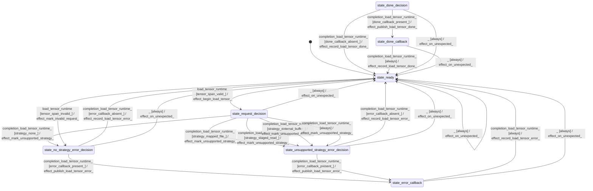

# io_loader

Source: [`emel/io/loader/sm.hpp`](https://github.com/stateforward/emel.cpp/blob/main/src/emel/io/loader/sm.hpp)

## Ownership

`emel/io` owns loading strategy-boundary events and failure routing. It does not own tensor residency, and concrete mmap/read/copy/async strategies remain unsupported until strategy actors land.

## Mermaid

## Transitions

| Source | Event | Guard | Action | Target |
| --- | --- | --- | --- | --- |
| [`state_ready`](https://github.com/stateforward/emel.cpp/blob/main/src/emel/io/loader/sm.hpp) | [`load_tensor_runtime`](https://github.com/stateforward/emel.cpp/blob/main/src/emel/io/loader/sm.hpp) | [`tensor_span_valid>`](https://github.com/stateforward/emel.cpp/blob/main/src/emel/io/loader/sm.hpp) | [`effect_begin_load_tensor>`](https://github.com/stateforward/emel.cpp/blob/main/src/emel/io/loader/sm.hpp) | [`state_request_decision`](https://github.com/stateforward/emel.cpp/blob/main/src/emel/io/loader/sm.hpp) |
| [`state_request_decision`](https://github.com/stateforward/emel.cpp/blob/main/src/emel/io/loader/sm.hpp) | [`completion<load_tensor_runtime>`](https://github.com/stateforward/emel.cpp/blob/main/src/emel/io/loader/sm.hpp) | [`strategy_none>`](https://github.com/stateforward/emel.cpp/blob/main/src/emel/io/loader/sm.hpp) | [`effect_mark_unsupported_strategy>`](https://github.com/stateforward/emel.cpp/blob/main/src/emel/io/loader/sm.hpp) | [`state_no_strategy_error_decision`](https://github.com/stateforward/emel.cpp/blob/main/src/emel/io/loader/sm.hpp) |
| [`state_request_decision`](https://github.com/stateforward/emel.cpp/blob/main/src/emel/io/loader/sm.hpp) | [`completion<load_tensor_runtime>`](https://github.com/stateforward/emel.cpp/blob/main/src/emel/io/loader/sm.hpp) | [`strategy_mapped_file>`](https://github.com/stateforward/emel.cpp/blob/main/src/emel/io/loader/sm.hpp) | [`effect_mark_unsupported_strategy>`](https://github.com/stateforward/emel.cpp/blob/main/src/emel/io/loader/sm.hpp) | [`state_unsupported_strategy_error_decision`](https://github.com/stateforward/emel.cpp/blob/main/src/emel/io/loader/sm.hpp) |
| [`state_request_decision`](https://github.com/stateforward/emel.cpp/blob/main/src/emel/io/loader/sm.hpp) | [`completion<load_tensor_runtime>`](https://github.com/stateforward/emel.cpp/blob/main/src/emel/io/loader/sm.hpp) | [`strategy_staged_read>`](https://github.com/stateforward/emel.cpp/blob/main/src/emel/io/loader/sm.hpp) | [`effect_mark_unsupported_strategy>`](https://github.com/stateforward/emel.cpp/blob/main/src/emel/io/loader/sm.hpp) | [`state_unsupported_strategy_error_decision`](https://github.com/stateforward/emel.cpp/blob/main/src/emel/io/loader/sm.hpp) |
| [`state_request_decision`](https://github.com/stateforward/emel.cpp/blob/main/src/emel/io/loader/sm.hpp) | [`completion<load_tensor_runtime>`](https://github.com/stateforward/emel.cpp/blob/main/src/emel/io/loader/sm.hpp) | [`strategy_external_buffer>`](https://github.com/stateforward/emel.cpp/blob/main/src/emel/io/loader/sm.hpp) | [`effect_mark_unsupported_strategy>`](https://github.com/stateforward/emel.cpp/blob/main/src/emel/io/loader/sm.hpp) | [`state_unsupported_strategy_error_decision`](https://github.com/stateforward/emel.cpp/blob/main/src/emel/io/loader/sm.hpp) |
| [`state_request_decision`](https://github.com/stateforward/emel.cpp/blob/main/src/emel/io/loader/sm.hpp) | [`completion<load_tensor_runtime>`](https://github.com/stateforward/emel.cpp/blob/main/src/emel/io/loader/sm.hpp) | [`always`](https://github.com/stateforward/emel.cpp/blob/main/src/emel/io/loader/sm.hpp) | [`effect_mark_unsupported_strategy>`](https://github.com/stateforward/emel.cpp/blob/main/src/emel/io/loader/sm.hpp) | [`state_unsupported_strategy_error_decision`](https://github.com/stateforward/emel.cpp/blob/main/src/emel/io/loader/sm.hpp) |
| [`state_ready`](https://github.com/stateforward/emel.cpp/blob/main/src/emel/io/loader/sm.hpp) | [`load_tensor_runtime`](https://github.com/stateforward/emel.cpp/blob/main/src/emel/io/loader/sm.hpp) | [`tensor_span_invalid>`](https://github.com/stateforward/emel.cpp/blob/main/src/emel/io/loader/sm.hpp) | [`effect_mark_invalid_request>`](https://github.com/stateforward/emel.cpp/blob/main/src/emel/io/loader/sm.hpp) | [`state_no_strategy_error_decision`](https://github.com/stateforward/emel.cpp/blob/main/src/emel/io/loader/sm.hpp) |
| [`state_done_decision`](https://github.com/stateforward/emel.cpp/blob/main/src/emel/io/loader/sm.hpp) | [`completion<load_tensor_runtime>`](https://github.com/stateforward/emel.cpp/blob/main/src/emel/io/loader/sm.hpp) | [`done_callback_present>`](https://github.com/stateforward/emel.cpp/blob/main/src/emel/io/loader/sm.hpp) | [`effect_publish_load_tensor_done>`](https://github.com/stateforward/emel.cpp/blob/main/src/emel/io/loader/sm.hpp) | [`state_done_callback`](https://github.com/stateforward/emel.cpp/blob/main/src/emel/io/loader/sm.hpp) |
| [`state_done_decision`](https://github.com/stateforward/emel.cpp/blob/main/src/emel/io/loader/sm.hpp) | [`completion<load_tensor_runtime>`](https://github.com/stateforward/emel.cpp/blob/main/src/emel/io/loader/sm.hpp) | [`done_callback_absent>`](https://github.com/stateforward/emel.cpp/blob/main/src/emel/io/loader/sm.hpp) | [`effect_record_load_tensor_done>`](https://github.com/stateforward/emel.cpp/blob/main/src/emel/io/loader/sm.hpp) | [`state_ready`](https://github.com/stateforward/emel.cpp/blob/main/src/emel/io/loader/sm.hpp) |
| [`state_done_callback`](https://github.com/stateforward/emel.cpp/blob/main/src/emel/io/loader/sm.hpp) | [`completion<load_tensor_runtime>`](https://github.com/stateforward/emel.cpp/blob/main/src/emel/io/loader/sm.hpp) | [`always`](https://github.com/stateforward/emel.cpp/blob/main/src/emel/io/loader/sm.hpp) | [`effect_record_load_tensor_done>`](https://github.com/stateforward/emel.cpp/blob/main/src/emel/io/loader/sm.hpp) | [`state_ready`](https://github.com/stateforward/emel.cpp/blob/main/src/emel/io/loader/sm.hpp) |
| [`state_no_strategy_error_decision`](https://github.com/stateforward/emel.cpp/blob/main/src/emel/io/loader/sm.hpp) | [`completion<load_tensor_runtime>`](https://github.com/stateforward/emel.cpp/blob/main/src/emel/io/loader/sm.hpp) | [`error_callback_present>`](https://github.com/stateforward/emel.cpp/blob/main/src/emel/io/loader/sm.hpp) | [`effect_publish_load_tensor_error>`](https://github.com/stateforward/emel.cpp/blob/main/src/emel/io/loader/sm.hpp) | [`state_error_callback`](https://github.com/stateforward/emel.cpp/blob/main/src/emel/io/loader/sm.hpp) |
| [`state_no_strategy_error_decision`](https://github.com/stateforward/emel.cpp/blob/main/src/emel/io/loader/sm.hpp) | [`completion<load_tensor_runtime>`](https://github.com/stateforward/emel.cpp/blob/main/src/emel/io/loader/sm.hpp) | [`error_callback_absent>`](https://github.com/stateforward/emel.cpp/blob/main/src/emel/io/loader/sm.hpp) | [`effect_record_load_tensor_error>`](https://github.com/stateforward/emel.cpp/blob/main/src/emel/io/loader/sm.hpp) | [`state_ready`](https://github.com/stateforward/emel.cpp/blob/main/src/emel/io/loader/sm.hpp) |
| [`state_unsupported_strategy_error_decision`](https://github.com/stateforward/emel.cpp/blob/main/src/emel/io/loader/sm.hpp) | [`completion<load_tensor_runtime>`](https://github.com/stateforward/emel.cpp/blob/main/src/emel/io/loader/sm.hpp) | [`error_callback_present>`](https://github.com/stateforward/emel.cpp/blob/main/src/emel/io/loader/sm.hpp) | [`effect_publish_load_tensor_error>`](https://github.com/stateforward/emel.cpp/blob/main/src/emel/io/loader/sm.hpp) | [`state_error_callback`](https://github.com/stateforward/emel.cpp/blob/main/src/emel/io/loader/sm.hpp) |
| [`state_unsupported_strategy_error_decision`](https://github.com/stateforward/emel.cpp/blob/main/src/emel/io/loader/sm.hpp) | [`completion<load_tensor_runtime>`](https://github.com/stateforward/emel.cpp/blob/main/src/emel/io/loader/sm.hpp) | [`error_callback_absent>`](https://github.com/stateforward/emel.cpp/blob/main/src/emel/io/loader/sm.hpp) | [`effect_record_load_tensor_error>`](https://github.com/stateforward/emel.cpp/blob/main/src/emel/io/loader/sm.hpp) | [`state_ready`](https://github.com/stateforward/emel.cpp/blob/main/src/emel/io/loader/sm.hpp) |
| [`state_error_callback`](https://github.com/stateforward/emel.cpp/blob/main/src/emel/io/loader/sm.hpp) | [`completion<load_tensor_runtime>`](https://github.com/stateforward/emel.cpp/blob/main/src/emel/io/loader/sm.hpp) | [`always`](https://github.com/stateforward/emel.cpp/blob/main/src/emel/io/loader/sm.hpp) | [`effect_record_load_tensor_error>`](https://github.com/stateforward/emel.cpp/blob/main/src/emel/io/loader/sm.hpp) | [`state_ready`](https://github.com/stateforward/emel.cpp/blob/main/src/emel/io/loader/sm.hpp) |
| [`state_ready`](https://github.com/stateforward/emel.cpp/blob/main/src/emel/io/loader/sm.hpp) | [`_`](https://github.com/stateforward/emel.cpp/blob/main/src/emel/io/loader/sm.hpp) | [`always`](https://github.com/stateforward/emel.cpp/blob/main/src/emel/io/loader/sm.hpp) | [`effect_on_unexpected>`](https://github.com/stateforward/emel.cpp/blob/main/src/emel/io/loader/sm.hpp) | [`state_ready`](https://github.com/stateforward/emel.cpp/blob/main/src/emel/io/loader/sm.hpp) |
| [`state_request_decision`](https://github.com/stateforward/emel.cpp/blob/main/src/emel/io/loader/sm.hpp) | [`_`](https://github.com/stateforward/emel.cpp/blob/main/src/emel/io/loader/sm.hpp) | [`always`](https://github.com/stateforward/emel.cpp/blob/main/src/emel/io/loader/sm.hpp) | [`effect_on_unexpected>`](https://github.com/stateforward/emel.cpp/blob/main/src/emel/io/loader/sm.hpp) | [`state_ready`](https://github.com/stateforward/emel.cpp/blob/main/src/emel/io/loader/sm.hpp) |
| [`state_no_strategy_error_decision`](https://github.com/stateforward/emel.cpp/blob/main/src/emel/io/loader/sm.hpp) | [`_`](https://github.com/stateforward/emel.cpp/blob/main/src/emel/io/loader/sm.hpp) | [`always`](https://github.com/stateforward/emel.cpp/blob/main/src/emel/io/loader/sm.hpp) | [`effect_on_unexpected>`](https://github.com/stateforward/emel.cpp/blob/main/src/emel/io/loader/sm.hpp) | [`state_ready`](https://github.com/stateforward/emel.cpp/blob/main/src/emel/io/loader/sm.hpp) |
| [`state_unsupported_strategy_error_decision`](https://github.com/stateforward/emel.cpp/blob/main/src/emel/io/loader/sm.hpp) | [`_`](https://github.com/stateforward/emel.cpp/blob/main/src/emel/io/loader/sm.hpp) | [`always`](https://github.com/stateforward/emel.cpp/blob/main/src/emel/io/loader/sm.hpp) | [`effect_on_unexpected>`](https://github.com/stateforward/emel.cpp/blob/main/src/emel/io/loader/sm.hpp) | [`state_ready`](https://github.com/stateforward/emel.cpp/blob/main/src/emel/io/loader/sm.hpp) |
| [`state_error_callback`](https://github.com/stateforward/emel.cpp/blob/main/src/emel/io/loader/sm.hpp) | [`_`](https://github.com/stateforward/emel.cpp/blob/main/src/emel/io/loader/sm.hpp) | [`always`](https://github.com/stateforward/emel.cpp/blob/main/src/emel/io/loader/sm.hpp) | [`effect_on_unexpected>`](https://github.com/stateforward/emel.cpp/blob/main/src/emel/io/loader/sm.hpp) | [`state_ready`](https://github.com/stateforward/emel.cpp/blob/main/src/emel/io/loader/sm.hpp) |
| [`state_done_decision`](https://github.com/stateforward/emel.cpp/blob/main/src/emel/io/loader/sm.hpp) | [`_`](https://github.com/stateforward/emel.cpp/blob/main/src/emel/io/loader/sm.hpp) | [`always`](https://github.com/stateforward/emel.cpp/blob/main/src/emel/io/loader/sm.hpp) | [`effect_on_unexpected>`](https://github.com/stateforward/emel.cpp/blob/main/src/emel/io/loader/sm.hpp) | [`state_ready`](https://github.com/stateforward/emel.cpp/blob/main/src/emel/io/loader/sm.hpp) |
| [`state_done_callback`](https://github.com/stateforward/emel.cpp/blob/main/src/emel/io/loader/sm.hpp) | [`_`](https://github.com/stateforward/emel.cpp/blob/main/src/emel/io/loader/sm.hpp) | [`always`](https://github.com/stateforward/emel.cpp/blob/main/src/emel/io/loader/sm.hpp) | [`effect_on_unexpected>`](https://github.com/stateforward/emel.cpp/blob/main/src/emel/io/loader/sm.hpp) | [`state_ready`](https://github.com/stateforward/emel.cpp/blob/main/src/emel/io/loader/sm.hpp) |
