# io_mmap

Source: [`emel/io/mmap/sm.hpp`](https://github.com/stateforward/emel.cpp/blob/main/src/emel/io/mmap/sm.hpp)

## Mermaid

```mermaid
stateDiagram-v2
  direction TB
  [*] --> state_ready
  state_ready --> state_request_decision : map_tensor_runtime [always] / effect_begin_map_tensor_
  state_request_decision --> state_file_path_decision : completion_map_tensor_runtime_ [request_span_valid_] / none
  state_request_decision --> state_invalid_request_error_decision : completion_map_tensor_runtime_ [request_span_invalid_] / effect_mark_invalid_request_
  state_file_path_decision --> state_file_decision : completion_map_tensor_runtime_ [file_path_valid_] / none
  state_file_path_decision --> state_invalid_request_error_decision : completion_map_tensor_runtime_ [file_path_invalid_] / effect_mark_invalid_request_
  state_file_decision --> state_offset_decision : completion_map_tensor_runtime_ [file_index_valid_] / none
  state_file_decision --> state_unsupported_resource_error_decision : completion_map_tensor_runtime_ [file_index_invalid_] / effect_mark_unsupported_file_
  state_offset_decision --> state_length_decision : completion_map_tensor_runtime_ [offset_aligned_] / none
  state_offset_decision --> state_unsupported_resource_error_decision : completion_map_tensor_runtime_ [offset_unaligned_] / effect_mark_unsupported_offset_
  state_length_decision --> state_layout_decision : completion_map_tensor_runtime_ [length_within_bounds_] / none
  state_length_decision --> state_unsupported_resource_error_decision : completion_map_tensor_runtime_ [length_overflow_] / effect_mark_unsupported_length_
  state_layout_decision --> state_platform_decision : completion_map_tensor_runtime_ [layout_supported_] / none
  state_layout_decision --> state_unsupported_resource_error_decision : completion_map_tensor_runtime_ [layout_unsupported_] / effect_mark_unsupported_layout_
  state_platform_decision --> state_slot_reservation_decision : completion_map_tensor_runtime_ [platform_mmap_supported_] / none
  state_platform_decision --> state_unsupported_platform_error_decision : completion_map_tensor_runtime_ [platform_mmap_unsupported_] / effect_mark_unsupported_platform_
  state_slot_reservation_decision --> state_file_open_decision : completion_map_tensor_runtime_ [slot_capacity_available_] / effect_reserve_top_free_slot_then_attempt_open_
  state_slot_reservation_decision --> state_resource_exhausted_error_decision : completion_map_tensor_runtime_ [slot_pool_exhausted_] / effect_mark_resource_exhausted_
  state_file_open_decision --> state_mapping_decision : completion_map_tensor_runtime_ [file_open_succeeded_] / effect_attempt_mapping_
  state_file_open_decision --> state_file_open_failed_error_decision : completion_map_tensor_runtime_ [file_open_failed_] / effect_release_reserved_slot_on_open_failure_
  state_mapping_decision --> state_publish_done_decision : completion_map_tensor_runtime_ [mapping_succeeded_] / effect_commit_mapping_
  state_mapping_decision --> state_mapping_failed_error_decision : completion_map_tensor_runtime_ [mapping_failed_] / effect_close_open_resource_and_release_slot_on_mapping_failure_
  state_publish_done_decision --> state_done_callback : completion_map_tensor_runtime_ [done_callback_present_] / effect_publish_map_tensor_done_
  state_publish_done_decision --> state_ready : completion_map_tensor_runtime_ [done_callback_absent_] / effect_record_map_tensor_done_
  state_done_callback --> state_ready : completion_map_tensor_runtime_ [always] / effect_record_map_tensor_done_
  state_invalid_request_error_decision --> state_error_callback : completion_map_tensor_runtime_ [error_callback_present_] / effect_publish_map_tensor_error_
  state_invalid_request_error_decision --> state_ready : completion_map_tensor_runtime_ [error_callback_absent_] / effect_record_map_tensor_error_
  state_unsupported_resource_error_decision --> state_error_callback : completion_map_tensor_runtime_ [error_callback_present_] / effect_publish_map_tensor_error_
  state_unsupported_resource_error_decision --> state_ready : completion_map_tensor_runtime_ [error_callback_absent_] / effect_record_map_tensor_error_
  state_unsupported_platform_error_decision --> state_error_callback : completion_map_tensor_runtime_ [error_callback_present_] / effect_publish_map_tensor_error_
  state_unsupported_platform_error_decision --> state_ready : completion_map_tensor_runtime_ [error_callback_absent_] / effect_record_map_tensor_error_
  state_resource_exhausted_error_decision --> state_error_callback : completion_map_tensor_runtime_ [error_callback_present_] / effect_publish_map_tensor_error_
  state_resource_exhausted_error_decision --> state_ready : completion_map_tensor_runtime_ [error_callback_absent_] / effect_record_map_tensor_error_
  state_file_open_failed_error_decision --> state_error_callback : completion_map_tensor_runtime_ [error_callback_present_] / effect_publish_map_tensor_error_
  state_file_open_failed_error_decision --> state_ready : completion_map_tensor_runtime_ [error_callback_absent_] / effect_record_map_tensor_error_
  state_mapping_failed_error_decision --> state_error_callback : completion_map_tensor_runtime_ [error_callback_present_] / effect_publish_map_tensor_error_
  state_mapping_failed_error_decision --> state_ready : completion_map_tensor_runtime_ [error_callback_absent_] / effect_record_map_tensor_error_
  state_error_callback --> state_ready : completion_map_tensor_runtime_ [always] / effect_record_map_tensor_error_
  state_ready --> state_release_decision : release_mapping_runtime [always] / effect_begin_release_
  state_release_decision --> state_release_in_use_decision : completion_release_mapping_runtime_ [release_handle_in_range_] / none
  state_release_decision --> state_release_invalid_handle_error_decision : completion_release_mapping_runtime_ [release_handle_out_of_range_] / effect_mark_release_invalid_handle_
  state_release_in_use_decision --> state_unmap_decision : completion_release_mapping_runtime_ [release_slot_in_use_owned_by_tensor_] / effect_attempt_unmap_
  state_release_in_use_decision --> state_release_invalid_handle_error_decision : completion_release_mapping_runtime_ [release_slot_not_in_use_] / effect_mark_release_invalid_handle_
  state_release_in_use_decision --> state_release_invalid_handle_error_decision : completion_release_mapping_runtime_ [release_slot_in_use_not_owned_by_tensor_] / effect_mark_release_invalid_handle_
  state_unmap_decision --> state_release_publish_done_decision : completion_release_mapping_runtime_ [unmap_succeeded_] / effect_release_slot_after_unmap_
  state_unmap_decision --> state_unmap_failed_error_decision : completion_release_mapping_runtime_ [unmap_failed_] / effect_mark_unmap_failed_and_release_slot_
  state_release_publish_done_decision --> state_release_done_callback : completion_release_mapping_runtime_ [release_done_callback_present_] / effect_publish_release_mapping_done_
  state_release_publish_done_decision --> state_ready : completion_release_mapping_runtime_ [release_done_callback_absent_] / effect_record_release_mapping_done_
  state_release_done_callback --> state_ready : completion_release_mapping_runtime_ [always] / effect_record_release_mapping_done_
  state_release_invalid_handle_error_decision --> state_release_error_callback : completion_release_mapping_runtime_ [release_error_callback_present_] / effect_publish_release_mapping_error_
  state_release_invalid_handle_error_decision --> state_ready : completion_release_mapping_runtime_ [release_error_callback_absent_] / effect_record_release_mapping_error_
  state_unmap_failed_error_decision --> state_release_error_callback : completion_release_mapping_runtime_ [release_error_callback_present_] / effect_publish_release_mapping_error_
  state_unmap_failed_error_decision --> state_ready : completion_release_mapping_runtime_ [release_error_callback_absent_] / effect_record_release_mapping_error_
  state_release_error_callback --> state_ready : completion_release_mapping_runtime_ [always] / effect_record_release_mapping_error_
  state_ready --> state_ready : _ [always] / effect_on_unexpected_
  state_request_decision --> state_ready : _ [always] / effect_on_unexpected_
  state_file_path_decision --> state_ready : _ [always] / effect_on_unexpected_
  state_file_decision --> state_ready : _ [always] / effect_on_unexpected_
  state_offset_decision --> state_ready : _ [always] / effect_on_unexpected_
  state_length_decision --> state_ready : _ [always] / effect_on_unexpected_
  state_layout_decision --> state_ready : _ [always] / effect_on_unexpected_
  state_platform_decision --> state_ready : _ [always] / effect_on_unexpected_
  state_slot_reservation_decision --> state_ready : _ [always] / effect_on_unexpected_
  state_file_open_decision --> state_ready : _ [always] / effect_on_unexpected_
  state_mapping_decision --> state_ready : _ [always] / effect_on_unexpected_
  state_publish_done_decision --> state_ready : _ [always] / effect_on_unexpected_
  state_done_callback --> state_ready : _ [always] / effect_on_unexpected_
  state_invalid_request_error_decision --> state_ready : _ [always] / effect_on_unexpected_
  state_unsupported_resource_error_decision --> state_ready : _ [always] / effect_on_unexpected_
  state_unsupported_platform_error_decision --> state_ready : _ [always] / effect_on_unexpected_
  state_resource_exhausted_error_decision --> state_ready : _ [always] / effect_on_unexpected_
  state_file_open_failed_error_decision --> state_ready : _ [always] / effect_on_unexpected_
  state_mapping_failed_error_decision --> state_ready : _ [always] / effect_on_unexpected_
  state_error_callback --> state_ready : _ [always] / effect_on_unexpected_
  state_release_decision --> state_ready : _ [always] / effect_on_unexpected_
  state_release_in_use_decision --> state_ready : _ [always] / effect_on_unexpected_
  state_unmap_decision --> state_ready : _ [always] / effect_on_unexpected_
  state_release_publish_done_decision --> state_ready : _ [always] / effect_on_unexpected_
  state_release_done_callback --> state_ready : _ [always] / effect_on_unexpected_
  state_release_invalid_handle_error_decision --> state_ready : _ [always] / effect_on_unexpected_
  state_unmap_failed_error_decision --> state_ready : _ [always] / effect_on_unexpected_
  state_release_error_callback --> state_ready : _ [always] / effect_on_unexpected_
```

## Transitions

| Source | Event | Guard | Action | Target |
| --- | --- | --- | --- | --- |
| [`state_ready`](https://github.com/stateforward/emel.cpp/blob/main/src/emel/io/mmap/sm.hpp) | [`map_tensor_runtime`](https://github.com/stateforward/emel.cpp/blob/main/src/emel/io/mmap/sm.hpp) | [`always`](https://github.com/stateforward/emel.cpp/blob/main/src/emel/io/mmap/sm.hpp) | [`effect_begin_map_tensor>`](https://github.com/stateforward/emel.cpp/blob/main/src/emel/io/mmap/sm.hpp) | [`state_request_decision`](https://github.com/stateforward/emel.cpp/blob/main/src/emel/io/mmap/sm.hpp) |
| [`state_request_decision`](https://github.com/stateforward/emel.cpp/blob/main/src/emel/io/mmap/sm.hpp) | [`completion<map_tensor_runtime>`](https://github.com/stateforward/emel.cpp/blob/main/src/emel/io/mmap/sm.hpp) | [`request_span_valid>`](https://github.com/stateforward/emel.cpp/blob/main/src/emel/io/mmap/sm.hpp) | [`none`](https://github.com/stateforward/emel.cpp/blob/main/src/emel/io/mmap/sm.hpp) | [`state_file_path_decision`](https://github.com/stateforward/emel.cpp/blob/main/src/emel/io/mmap/sm.hpp) |
| [`state_request_decision`](https://github.com/stateforward/emel.cpp/blob/main/src/emel/io/mmap/sm.hpp) | [`completion<map_tensor_runtime>`](https://github.com/stateforward/emel.cpp/blob/main/src/emel/io/mmap/sm.hpp) | [`request_span_invalid>`](https://github.com/stateforward/emel.cpp/blob/main/src/emel/io/mmap/sm.hpp) | [`effect_mark_invalid_request>`](https://github.com/stateforward/emel.cpp/blob/main/src/emel/io/mmap/sm.hpp) | [`state_invalid_request_error_decision`](https://github.com/stateforward/emel.cpp/blob/main/src/emel/io/mmap/sm.hpp) |
| [`state_file_path_decision`](https://github.com/stateforward/emel.cpp/blob/main/src/emel/io/mmap/sm.hpp) | [`completion<map_tensor_runtime>`](https://github.com/stateforward/emel.cpp/blob/main/src/emel/io/mmap/sm.hpp) | [`file_path_valid>`](https://github.com/stateforward/emel.cpp/blob/main/src/emel/io/mmap/sm.hpp) | [`none`](https://github.com/stateforward/emel.cpp/blob/main/src/emel/io/mmap/sm.hpp) | [`state_file_decision`](https://github.com/stateforward/emel.cpp/blob/main/src/emel/io/mmap/sm.hpp) |
| [`state_file_path_decision`](https://github.com/stateforward/emel.cpp/blob/main/src/emel/io/mmap/sm.hpp) | [`completion<map_tensor_runtime>`](https://github.com/stateforward/emel.cpp/blob/main/src/emel/io/mmap/sm.hpp) | [`file_path_invalid>`](https://github.com/stateforward/emel.cpp/blob/main/src/emel/io/mmap/sm.hpp) | [`effect_mark_invalid_request>`](https://github.com/stateforward/emel.cpp/blob/main/src/emel/io/mmap/sm.hpp) | [`state_invalid_request_error_decision`](https://github.com/stateforward/emel.cpp/blob/main/src/emel/io/mmap/sm.hpp) |
| [`state_file_decision`](https://github.com/stateforward/emel.cpp/blob/main/src/emel/io/mmap/sm.hpp) | [`completion<map_tensor_runtime>`](https://github.com/stateforward/emel.cpp/blob/main/src/emel/io/mmap/sm.hpp) | [`file_index_valid>`](https://github.com/stateforward/emel.cpp/blob/main/src/emel/io/mmap/sm.hpp) | [`none`](https://github.com/stateforward/emel.cpp/blob/main/src/emel/io/mmap/sm.hpp) | [`state_offset_decision`](https://github.com/stateforward/emel.cpp/blob/main/src/emel/io/mmap/sm.hpp) |
| [`state_file_decision`](https://github.com/stateforward/emel.cpp/blob/main/src/emel/io/mmap/sm.hpp) | [`completion<map_tensor_runtime>`](https://github.com/stateforward/emel.cpp/blob/main/src/emel/io/mmap/sm.hpp) | [`file_index_invalid>`](https://github.com/stateforward/emel.cpp/blob/main/src/emel/io/mmap/sm.hpp) | [`effect_mark_unsupported_file>`](https://github.com/stateforward/emel.cpp/blob/main/src/emel/io/mmap/sm.hpp) | [`state_unsupported_resource_error_decision`](https://github.com/stateforward/emel.cpp/blob/main/src/emel/io/mmap/sm.hpp) |
| [`state_offset_decision`](https://github.com/stateforward/emel.cpp/blob/main/src/emel/io/mmap/sm.hpp) | [`completion<map_tensor_runtime>`](https://github.com/stateforward/emel.cpp/blob/main/src/emel/io/mmap/sm.hpp) | [`offset_aligned>`](https://github.com/stateforward/emel.cpp/blob/main/src/emel/io/mmap/sm.hpp) | [`none`](https://github.com/stateforward/emel.cpp/blob/main/src/emel/io/mmap/sm.hpp) | [`state_length_decision`](https://github.com/stateforward/emel.cpp/blob/main/src/emel/io/mmap/sm.hpp) |
| [`state_offset_decision`](https://github.com/stateforward/emel.cpp/blob/main/src/emel/io/mmap/sm.hpp) | [`completion<map_tensor_runtime>`](https://github.com/stateforward/emel.cpp/blob/main/src/emel/io/mmap/sm.hpp) | [`offset_unaligned>`](https://github.com/stateforward/emel.cpp/blob/main/src/emel/io/mmap/sm.hpp) | [`effect_mark_unsupported_offset>`](https://github.com/stateforward/emel.cpp/blob/main/src/emel/io/mmap/sm.hpp) | [`state_unsupported_resource_error_decision`](https://github.com/stateforward/emel.cpp/blob/main/src/emel/io/mmap/sm.hpp) |
| [`state_length_decision`](https://github.com/stateforward/emel.cpp/blob/main/src/emel/io/mmap/sm.hpp) | [`completion<map_tensor_runtime>`](https://github.com/stateforward/emel.cpp/blob/main/src/emel/io/mmap/sm.hpp) | [`length_within_bounds>`](https://github.com/stateforward/emel.cpp/blob/main/src/emel/io/mmap/sm.hpp) | [`none`](https://github.com/stateforward/emel.cpp/blob/main/src/emel/io/mmap/sm.hpp) | [`state_layout_decision`](https://github.com/stateforward/emel.cpp/blob/main/src/emel/io/mmap/sm.hpp) |
| [`state_length_decision`](https://github.com/stateforward/emel.cpp/blob/main/src/emel/io/mmap/sm.hpp) | [`completion<map_tensor_runtime>`](https://github.com/stateforward/emel.cpp/blob/main/src/emel/io/mmap/sm.hpp) | [`length_overflow>`](https://github.com/stateforward/emel.cpp/blob/main/src/emel/io/mmap/sm.hpp) | [`effect_mark_unsupported_length>`](https://github.com/stateforward/emel.cpp/blob/main/src/emel/io/mmap/sm.hpp) | [`state_unsupported_resource_error_decision`](https://github.com/stateforward/emel.cpp/blob/main/src/emel/io/mmap/sm.hpp) |
| [`state_layout_decision`](https://github.com/stateforward/emel.cpp/blob/main/src/emel/io/mmap/sm.hpp) | [`completion<map_tensor_runtime>`](https://github.com/stateforward/emel.cpp/blob/main/src/emel/io/mmap/sm.hpp) | [`layout_supported>`](https://github.com/stateforward/emel.cpp/blob/main/src/emel/io/mmap/sm.hpp) | [`none`](https://github.com/stateforward/emel.cpp/blob/main/src/emel/io/mmap/sm.hpp) | [`state_platform_decision`](https://github.com/stateforward/emel.cpp/blob/main/src/emel/io/mmap/sm.hpp) |
| [`state_layout_decision`](https://github.com/stateforward/emel.cpp/blob/main/src/emel/io/mmap/sm.hpp) | [`completion<map_tensor_runtime>`](https://github.com/stateforward/emel.cpp/blob/main/src/emel/io/mmap/sm.hpp) | [`layout_unsupported>`](https://github.com/stateforward/emel.cpp/blob/main/src/emel/io/mmap/sm.hpp) | [`effect_mark_unsupported_layout>`](https://github.com/stateforward/emel.cpp/blob/main/src/emel/io/mmap/sm.hpp) | [`state_unsupported_resource_error_decision`](https://github.com/stateforward/emel.cpp/blob/main/src/emel/io/mmap/sm.hpp) |
| [`state_platform_decision`](https://github.com/stateforward/emel.cpp/blob/main/src/emel/io/mmap/sm.hpp) | [`completion<map_tensor_runtime>`](https://github.com/stateforward/emel.cpp/blob/main/src/emel/io/mmap/sm.hpp) | [`platform_mmap_supported>`](https://github.com/stateforward/emel.cpp/blob/main/src/emel/io/mmap/sm.hpp) | [`none`](https://github.com/stateforward/emel.cpp/blob/main/src/emel/io/mmap/sm.hpp) | [`state_slot_reservation_decision`](https://github.com/stateforward/emel.cpp/blob/main/src/emel/io/mmap/sm.hpp) |
| [`state_platform_decision`](https://github.com/stateforward/emel.cpp/blob/main/src/emel/io/mmap/sm.hpp) | [`completion<map_tensor_runtime>`](https://github.com/stateforward/emel.cpp/blob/main/src/emel/io/mmap/sm.hpp) | [`platform_mmap_unsupported>`](https://github.com/stateforward/emel.cpp/blob/main/src/emel/io/mmap/sm.hpp) | [`effect_mark_unsupported_platform>`](https://github.com/stateforward/emel.cpp/blob/main/src/emel/io/mmap/sm.hpp) | [`state_unsupported_platform_error_decision`](https://github.com/stateforward/emel.cpp/blob/main/src/emel/io/mmap/sm.hpp) |
| [`state_slot_reservation_decision`](https://github.com/stateforward/emel.cpp/blob/main/src/emel/io/mmap/sm.hpp) | [`completion<map_tensor_runtime>`](https://github.com/stateforward/emel.cpp/blob/main/src/emel/io/mmap/sm.hpp) | [`slot_capacity_available>`](https://github.com/stateforward/emel.cpp/blob/main/src/emel/io/mmap/sm.hpp) | [`effect_reserve_top_free_slot_then_attempt_open>`](https://github.com/stateforward/emel.cpp/blob/main/src/emel/io/mmap/sm.hpp) | [`state_file_open_decision`](https://github.com/stateforward/emel.cpp/blob/main/src/emel/io/mmap/sm.hpp) |
| [`state_slot_reservation_decision`](https://github.com/stateforward/emel.cpp/blob/main/src/emel/io/mmap/sm.hpp) | [`completion<map_tensor_runtime>`](https://github.com/stateforward/emel.cpp/blob/main/src/emel/io/mmap/sm.hpp) | [`slot_pool_exhausted>`](https://github.com/stateforward/emel.cpp/blob/main/src/emel/io/mmap/sm.hpp) | [`effect_mark_resource_exhausted>`](https://github.com/stateforward/emel.cpp/blob/main/src/emel/io/mmap/sm.hpp) | [`state_resource_exhausted_error_decision`](https://github.com/stateforward/emel.cpp/blob/main/src/emel/io/mmap/sm.hpp) |
| [`state_file_open_decision`](https://github.com/stateforward/emel.cpp/blob/main/src/emel/io/mmap/sm.hpp) | [`completion<map_tensor_runtime>`](https://github.com/stateforward/emel.cpp/blob/main/src/emel/io/mmap/sm.hpp) | [`file_open_succeeded>`](https://github.com/stateforward/emel.cpp/blob/main/src/emel/io/mmap/sm.hpp) | [`effect_attempt_mapping>`](https://github.com/stateforward/emel.cpp/blob/main/src/emel/io/mmap/sm.hpp) | [`state_mapping_decision`](https://github.com/stateforward/emel.cpp/blob/main/src/emel/io/mmap/sm.hpp) |
| [`state_file_open_decision`](https://github.com/stateforward/emel.cpp/blob/main/src/emel/io/mmap/sm.hpp) | [`completion<map_tensor_runtime>`](https://github.com/stateforward/emel.cpp/blob/main/src/emel/io/mmap/sm.hpp) | [`file_open_failed>`](https://github.com/stateforward/emel.cpp/blob/main/src/emel/io/mmap/sm.hpp) | [`effect_release_reserved_slot_on_open_failure>`](https://github.com/stateforward/emel.cpp/blob/main/src/emel/io/mmap/sm.hpp) | [`state_file_open_failed_error_decision`](https://github.com/stateforward/emel.cpp/blob/main/src/emel/io/mmap/sm.hpp) |
| [`state_mapping_decision`](https://github.com/stateforward/emel.cpp/blob/main/src/emel/io/mmap/sm.hpp) | [`completion<map_tensor_runtime>`](https://github.com/stateforward/emel.cpp/blob/main/src/emel/io/mmap/sm.hpp) | [`mapping_succeeded>`](https://github.com/stateforward/emel.cpp/blob/main/src/emel/io/mmap/sm.hpp) | [`effect_commit_mapping>`](https://github.com/stateforward/emel.cpp/blob/main/src/emel/io/mmap/sm.hpp) | [`state_publish_done_decision`](https://github.com/stateforward/emel.cpp/blob/main/src/emel/io/mmap/sm.hpp) |
| [`state_mapping_decision`](https://github.com/stateforward/emel.cpp/blob/main/src/emel/io/mmap/sm.hpp) | [`completion<map_tensor_runtime>`](https://github.com/stateforward/emel.cpp/blob/main/src/emel/io/mmap/sm.hpp) | [`mapping_failed>`](https://github.com/stateforward/emel.cpp/blob/main/src/emel/io/mmap/sm.hpp) | [`effect_close_open_resource_and_release_slot_on_mapping_failure>`](https://github.com/stateforward/emel.cpp/blob/main/src/emel/io/mmap/sm.hpp) | [`state_mapping_failed_error_decision`](https://github.com/stateforward/emel.cpp/blob/main/src/emel/io/mmap/sm.hpp) |
| [`state_publish_done_decision`](https://github.com/stateforward/emel.cpp/blob/main/src/emel/io/mmap/sm.hpp) | [`completion<map_tensor_runtime>`](https://github.com/stateforward/emel.cpp/blob/main/src/emel/io/mmap/sm.hpp) | [`done_callback_present>`](https://github.com/stateforward/emel.cpp/blob/main/src/emel/io/mmap/sm.hpp) | [`effect_publish_map_tensor_done>`](https://github.com/stateforward/emel.cpp/blob/main/src/emel/io/mmap/sm.hpp) | [`state_done_callback`](https://github.com/stateforward/emel.cpp/blob/main/src/emel/io/mmap/sm.hpp) |
| [`state_publish_done_decision`](https://github.com/stateforward/emel.cpp/blob/main/src/emel/io/mmap/sm.hpp) | [`completion<map_tensor_runtime>`](https://github.com/stateforward/emel.cpp/blob/main/src/emel/io/mmap/sm.hpp) | [`done_callback_absent>`](https://github.com/stateforward/emel.cpp/blob/main/src/emel/io/mmap/sm.hpp) | [`effect_record_map_tensor_done>`](https://github.com/stateforward/emel.cpp/blob/main/src/emel/io/mmap/sm.hpp) | [`state_ready`](https://github.com/stateforward/emel.cpp/blob/main/src/emel/io/mmap/sm.hpp) |
| [`state_done_callback`](https://github.com/stateforward/emel.cpp/blob/main/src/emel/io/mmap/sm.hpp) | [`completion<map_tensor_runtime>`](https://github.com/stateforward/emel.cpp/blob/main/src/emel/io/mmap/sm.hpp) | [`always`](https://github.com/stateforward/emel.cpp/blob/main/src/emel/io/mmap/sm.hpp) | [`effect_record_map_tensor_done>`](https://github.com/stateforward/emel.cpp/blob/main/src/emel/io/mmap/sm.hpp) | [`state_ready`](https://github.com/stateforward/emel.cpp/blob/main/src/emel/io/mmap/sm.hpp) |
| [`state_invalid_request_error_decision`](https://github.com/stateforward/emel.cpp/blob/main/src/emel/io/mmap/sm.hpp) | [`completion<map_tensor_runtime>`](https://github.com/stateforward/emel.cpp/blob/main/src/emel/io/mmap/sm.hpp) | [`error_callback_present>`](https://github.com/stateforward/emel.cpp/blob/main/src/emel/io/mmap/sm.hpp) | [`effect_publish_map_tensor_error>`](https://github.com/stateforward/emel.cpp/blob/main/src/emel/io/mmap/sm.hpp) | [`state_error_callback`](https://github.com/stateforward/emel.cpp/blob/main/src/emel/io/mmap/sm.hpp) |
| [`state_invalid_request_error_decision`](https://github.com/stateforward/emel.cpp/blob/main/src/emel/io/mmap/sm.hpp) | [`completion<map_tensor_runtime>`](https://github.com/stateforward/emel.cpp/blob/main/src/emel/io/mmap/sm.hpp) | [`error_callback_absent>`](https://github.com/stateforward/emel.cpp/blob/main/src/emel/io/mmap/sm.hpp) | [`effect_record_map_tensor_error>`](https://github.com/stateforward/emel.cpp/blob/main/src/emel/io/mmap/sm.hpp) | [`state_ready`](https://github.com/stateforward/emel.cpp/blob/main/src/emel/io/mmap/sm.hpp) |
| [`state_unsupported_resource_error_decision`](https://github.com/stateforward/emel.cpp/blob/main/src/emel/io/mmap/sm.hpp) | [`completion<map_tensor_runtime>`](https://github.com/stateforward/emel.cpp/blob/main/src/emel/io/mmap/sm.hpp) | [`error_callback_present>`](https://github.com/stateforward/emel.cpp/blob/main/src/emel/io/mmap/sm.hpp) | [`effect_publish_map_tensor_error>`](https://github.com/stateforward/emel.cpp/blob/main/src/emel/io/mmap/sm.hpp) | [`state_error_callback`](https://github.com/stateforward/emel.cpp/blob/main/src/emel/io/mmap/sm.hpp) |
| [`state_unsupported_resource_error_decision`](https://github.com/stateforward/emel.cpp/blob/main/src/emel/io/mmap/sm.hpp) | [`completion<map_tensor_runtime>`](https://github.com/stateforward/emel.cpp/blob/main/src/emel/io/mmap/sm.hpp) | [`error_callback_absent>`](https://github.com/stateforward/emel.cpp/blob/main/src/emel/io/mmap/sm.hpp) | [`effect_record_map_tensor_error>`](https://github.com/stateforward/emel.cpp/blob/main/src/emel/io/mmap/sm.hpp) | [`state_ready`](https://github.com/stateforward/emel.cpp/blob/main/src/emel/io/mmap/sm.hpp) |
| [`state_unsupported_platform_error_decision`](https://github.com/stateforward/emel.cpp/blob/main/src/emel/io/mmap/sm.hpp) | [`completion<map_tensor_runtime>`](https://github.com/stateforward/emel.cpp/blob/main/src/emel/io/mmap/sm.hpp) | [`error_callback_present>`](https://github.com/stateforward/emel.cpp/blob/main/src/emel/io/mmap/sm.hpp) | [`effect_publish_map_tensor_error>`](https://github.com/stateforward/emel.cpp/blob/main/src/emel/io/mmap/sm.hpp) | [`state_error_callback`](https://github.com/stateforward/emel.cpp/blob/main/src/emel/io/mmap/sm.hpp) |
| [`state_unsupported_platform_error_decision`](https://github.com/stateforward/emel.cpp/blob/main/src/emel/io/mmap/sm.hpp) | [`completion<map_tensor_runtime>`](https://github.com/stateforward/emel.cpp/blob/main/src/emel/io/mmap/sm.hpp) | [`error_callback_absent>`](https://github.com/stateforward/emel.cpp/blob/main/src/emel/io/mmap/sm.hpp) | [`effect_record_map_tensor_error>`](https://github.com/stateforward/emel.cpp/blob/main/src/emel/io/mmap/sm.hpp) | [`state_ready`](https://github.com/stateforward/emel.cpp/blob/main/src/emel/io/mmap/sm.hpp) |
| [`state_resource_exhausted_error_decision`](https://github.com/stateforward/emel.cpp/blob/main/src/emel/io/mmap/sm.hpp) | [`completion<map_tensor_runtime>`](https://github.com/stateforward/emel.cpp/blob/main/src/emel/io/mmap/sm.hpp) | [`error_callback_present>`](https://github.com/stateforward/emel.cpp/blob/main/src/emel/io/mmap/sm.hpp) | [`effect_publish_map_tensor_error>`](https://github.com/stateforward/emel.cpp/blob/main/src/emel/io/mmap/sm.hpp) | [`state_error_callback`](https://github.com/stateforward/emel.cpp/blob/main/src/emel/io/mmap/sm.hpp) |
| [`state_resource_exhausted_error_decision`](https://github.com/stateforward/emel.cpp/blob/main/src/emel/io/mmap/sm.hpp) | [`completion<map_tensor_runtime>`](https://github.com/stateforward/emel.cpp/blob/main/src/emel/io/mmap/sm.hpp) | [`error_callback_absent>`](https://github.com/stateforward/emel.cpp/blob/main/src/emel/io/mmap/sm.hpp) | [`effect_record_map_tensor_error>`](https://github.com/stateforward/emel.cpp/blob/main/src/emel/io/mmap/sm.hpp) | [`state_ready`](https://github.com/stateforward/emel.cpp/blob/main/src/emel/io/mmap/sm.hpp) |
| [`state_file_open_failed_error_decision`](https://github.com/stateforward/emel.cpp/blob/main/src/emel/io/mmap/sm.hpp) | [`completion<map_tensor_runtime>`](https://github.com/stateforward/emel.cpp/blob/main/src/emel/io/mmap/sm.hpp) | [`error_callback_present>`](https://github.com/stateforward/emel.cpp/blob/main/src/emel/io/mmap/sm.hpp) | [`effect_publish_map_tensor_error>`](https://github.com/stateforward/emel.cpp/blob/main/src/emel/io/mmap/sm.hpp) | [`state_error_callback`](https://github.com/stateforward/emel.cpp/blob/main/src/emel/io/mmap/sm.hpp) |
| [`state_file_open_failed_error_decision`](https://github.com/stateforward/emel.cpp/blob/main/src/emel/io/mmap/sm.hpp) | [`completion<map_tensor_runtime>`](https://github.com/stateforward/emel.cpp/blob/main/src/emel/io/mmap/sm.hpp) | [`error_callback_absent>`](https://github.com/stateforward/emel.cpp/blob/main/src/emel/io/mmap/sm.hpp) | [`effect_record_map_tensor_error>`](https://github.com/stateforward/emel.cpp/blob/main/src/emel/io/mmap/sm.hpp) | [`state_ready`](https://github.com/stateforward/emel.cpp/blob/main/src/emel/io/mmap/sm.hpp) |
| [`state_mapping_failed_error_decision`](https://github.com/stateforward/emel.cpp/blob/main/src/emel/io/mmap/sm.hpp) | [`completion<map_tensor_runtime>`](https://github.com/stateforward/emel.cpp/blob/main/src/emel/io/mmap/sm.hpp) | [`error_callback_present>`](https://github.com/stateforward/emel.cpp/blob/main/src/emel/io/mmap/sm.hpp) | [`effect_publish_map_tensor_error>`](https://github.com/stateforward/emel.cpp/blob/main/src/emel/io/mmap/sm.hpp) | [`state_error_callback`](https://github.com/stateforward/emel.cpp/blob/main/src/emel/io/mmap/sm.hpp) |
| [`state_mapping_failed_error_decision`](https://github.com/stateforward/emel.cpp/blob/main/src/emel/io/mmap/sm.hpp) | [`completion<map_tensor_runtime>`](https://github.com/stateforward/emel.cpp/blob/main/src/emel/io/mmap/sm.hpp) | [`error_callback_absent>`](https://github.com/stateforward/emel.cpp/blob/main/src/emel/io/mmap/sm.hpp) | [`effect_record_map_tensor_error>`](https://github.com/stateforward/emel.cpp/blob/main/src/emel/io/mmap/sm.hpp) | [`state_ready`](https://github.com/stateforward/emel.cpp/blob/main/src/emel/io/mmap/sm.hpp) |
| [`state_error_callback`](https://github.com/stateforward/emel.cpp/blob/main/src/emel/io/mmap/sm.hpp) | [`completion<map_tensor_runtime>`](https://github.com/stateforward/emel.cpp/blob/main/src/emel/io/mmap/sm.hpp) | [`always`](https://github.com/stateforward/emel.cpp/blob/main/src/emel/io/mmap/sm.hpp) | [`effect_record_map_tensor_error>`](https://github.com/stateforward/emel.cpp/blob/main/src/emel/io/mmap/sm.hpp) | [`state_ready`](https://github.com/stateforward/emel.cpp/blob/main/src/emel/io/mmap/sm.hpp) |
| [`state_ready`](https://github.com/stateforward/emel.cpp/blob/main/src/emel/io/mmap/sm.hpp) | [`release_mapping_runtime`](https://github.com/stateforward/emel.cpp/blob/main/src/emel/io/mmap/sm.hpp) | [`always`](https://github.com/stateforward/emel.cpp/blob/main/src/emel/io/mmap/sm.hpp) | [`effect_begin_release>`](https://github.com/stateforward/emel.cpp/blob/main/src/emel/io/mmap/sm.hpp) | [`state_release_decision`](https://github.com/stateforward/emel.cpp/blob/main/src/emel/io/mmap/sm.hpp) |
| [`state_release_decision`](https://github.com/stateforward/emel.cpp/blob/main/src/emel/io/mmap/sm.hpp) | [`completion<release_mapping_runtime>`](https://github.com/stateforward/emel.cpp/blob/main/src/emel/io/mmap/sm.hpp) | [`release_handle_in_range>`](https://github.com/stateforward/emel.cpp/blob/main/src/emel/io/mmap/sm.hpp) | [`none`](https://github.com/stateforward/emel.cpp/blob/main/src/emel/io/mmap/sm.hpp) | [`state_release_in_use_decision`](https://github.com/stateforward/emel.cpp/blob/main/src/emel/io/mmap/sm.hpp) |
| [`state_release_decision`](https://github.com/stateforward/emel.cpp/blob/main/src/emel/io/mmap/sm.hpp) | [`completion<release_mapping_runtime>`](https://github.com/stateforward/emel.cpp/blob/main/src/emel/io/mmap/sm.hpp) | [`release_handle_out_of_range>`](https://github.com/stateforward/emel.cpp/blob/main/src/emel/io/mmap/sm.hpp) | [`effect_mark_release_invalid_handle>`](https://github.com/stateforward/emel.cpp/blob/main/src/emel/io/mmap/sm.hpp) | [`state_release_invalid_handle_error_decision`](https://github.com/stateforward/emel.cpp/blob/main/src/emel/io/mmap/sm.hpp) |
| [`state_release_in_use_decision`](https://github.com/stateforward/emel.cpp/blob/main/src/emel/io/mmap/sm.hpp) | [`completion<release_mapping_runtime>`](https://github.com/stateforward/emel.cpp/blob/main/src/emel/io/mmap/sm.hpp) | [`release_slot_in_use_owned_by_tensor>`](https://github.com/stateforward/emel.cpp/blob/main/src/emel/io/mmap/sm.hpp) | [`effect_attempt_unmap>`](https://github.com/stateforward/emel.cpp/blob/main/src/emel/io/mmap/sm.hpp) | [`state_unmap_decision`](https://github.com/stateforward/emel.cpp/blob/main/src/emel/io/mmap/sm.hpp) |
| [`state_release_in_use_decision`](https://github.com/stateforward/emel.cpp/blob/main/src/emel/io/mmap/sm.hpp) | [`completion<release_mapping_runtime>`](https://github.com/stateforward/emel.cpp/blob/main/src/emel/io/mmap/sm.hpp) | [`release_slot_not_in_use>`](https://github.com/stateforward/emel.cpp/blob/main/src/emel/io/mmap/sm.hpp) | [`effect_mark_release_invalid_handle>`](https://github.com/stateforward/emel.cpp/blob/main/src/emel/io/mmap/sm.hpp) | [`state_release_invalid_handle_error_decision`](https://github.com/stateforward/emel.cpp/blob/main/src/emel/io/mmap/sm.hpp) |
| [`state_release_in_use_decision`](https://github.com/stateforward/emel.cpp/blob/main/src/emel/io/mmap/sm.hpp) | [`completion<release_mapping_runtime>`](https://github.com/stateforward/emel.cpp/blob/main/src/emel/io/mmap/sm.hpp) | [`release_slot_in_use_not_owned_by_tensor>`](https://github.com/stateforward/emel.cpp/blob/main/src/emel/io/mmap/sm.hpp) | [`effect_mark_release_invalid_handle>`](https://github.com/stateforward/emel.cpp/blob/main/src/emel/io/mmap/sm.hpp) | [`state_release_invalid_handle_error_decision`](https://github.com/stateforward/emel.cpp/blob/main/src/emel/io/mmap/sm.hpp) |
| [`state_unmap_decision`](https://github.com/stateforward/emel.cpp/blob/main/src/emel/io/mmap/sm.hpp) | [`completion<release_mapping_runtime>`](https://github.com/stateforward/emel.cpp/blob/main/src/emel/io/mmap/sm.hpp) | [`unmap_succeeded>`](https://github.com/stateforward/emel.cpp/blob/main/src/emel/io/mmap/sm.hpp) | [`effect_release_slot_after_unmap>`](https://github.com/stateforward/emel.cpp/blob/main/src/emel/io/mmap/sm.hpp) | [`state_release_publish_done_decision`](https://github.com/stateforward/emel.cpp/blob/main/src/emel/io/mmap/sm.hpp) |
| [`state_unmap_decision`](https://github.com/stateforward/emel.cpp/blob/main/src/emel/io/mmap/sm.hpp) | [`completion<release_mapping_runtime>`](https://github.com/stateforward/emel.cpp/blob/main/src/emel/io/mmap/sm.hpp) | [`unmap_failed>`](https://github.com/stateforward/emel.cpp/blob/main/src/emel/io/mmap/sm.hpp) | [`effect_mark_unmap_failed_and_release_slot>`](https://github.com/stateforward/emel.cpp/blob/main/src/emel/io/mmap/sm.hpp) | [`state_unmap_failed_error_decision`](https://github.com/stateforward/emel.cpp/blob/main/src/emel/io/mmap/sm.hpp) |
| [`state_release_publish_done_decision`](https://github.com/stateforward/emel.cpp/blob/main/src/emel/io/mmap/sm.hpp) | [`completion<release_mapping_runtime>`](https://github.com/stateforward/emel.cpp/blob/main/src/emel/io/mmap/sm.hpp) | [`release_done_callback_present>`](https://github.com/stateforward/emel.cpp/blob/main/src/emel/io/mmap/sm.hpp) | [`effect_publish_release_mapping_done>`](https://github.com/stateforward/emel.cpp/blob/main/src/emel/io/mmap/sm.hpp) | [`state_release_done_callback`](https://github.com/stateforward/emel.cpp/blob/main/src/emel/io/mmap/sm.hpp) |
| [`state_release_publish_done_decision`](https://github.com/stateforward/emel.cpp/blob/main/src/emel/io/mmap/sm.hpp) | [`completion<release_mapping_runtime>`](https://github.com/stateforward/emel.cpp/blob/main/src/emel/io/mmap/sm.hpp) | [`release_done_callback_absent>`](https://github.com/stateforward/emel.cpp/blob/main/src/emel/io/mmap/sm.hpp) | [`effect_record_release_mapping_done>`](https://github.com/stateforward/emel.cpp/blob/main/src/emel/io/mmap/sm.hpp) | [`state_ready`](https://github.com/stateforward/emel.cpp/blob/main/src/emel/io/mmap/sm.hpp) |
| [`state_release_done_callback`](https://github.com/stateforward/emel.cpp/blob/main/src/emel/io/mmap/sm.hpp) | [`completion<release_mapping_runtime>`](https://github.com/stateforward/emel.cpp/blob/main/src/emel/io/mmap/sm.hpp) | [`always`](https://github.com/stateforward/emel.cpp/blob/main/src/emel/io/mmap/sm.hpp) | [`effect_record_release_mapping_done>`](https://github.com/stateforward/emel.cpp/blob/main/src/emel/io/mmap/sm.hpp) | [`state_ready`](https://github.com/stateforward/emel.cpp/blob/main/src/emel/io/mmap/sm.hpp) |
| [`state_release_invalid_handle_error_decision`](https://github.com/stateforward/emel.cpp/blob/main/src/emel/io/mmap/sm.hpp) | [`completion<release_mapping_runtime>`](https://github.com/stateforward/emel.cpp/blob/main/src/emel/io/mmap/sm.hpp) | [`release_error_callback_present>`](https://github.com/stateforward/emel.cpp/blob/main/src/emel/io/mmap/sm.hpp) | [`effect_publish_release_mapping_error>`](https://github.com/stateforward/emel.cpp/blob/main/src/emel/io/mmap/sm.hpp) | [`state_release_error_callback`](https://github.com/stateforward/emel.cpp/blob/main/src/emel/io/mmap/sm.hpp) |
| [`state_release_invalid_handle_error_decision`](https://github.com/stateforward/emel.cpp/blob/main/src/emel/io/mmap/sm.hpp) | [`completion<release_mapping_runtime>`](https://github.com/stateforward/emel.cpp/blob/main/src/emel/io/mmap/sm.hpp) | [`release_error_callback_absent>`](https://github.com/stateforward/emel.cpp/blob/main/src/emel/io/mmap/sm.hpp) | [`effect_record_release_mapping_error>`](https://github.com/stateforward/emel.cpp/blob/main/src/emel/io/mmap/sm.hpp) | [`state_ready`](https://github.com/stateforward/emel.cpp/blob/main/src/emel/io/mmap/sm.hpp) |
| [`state_unmap_failed_error_decision`](https://github.com/stateforward/emel.cpp/blob/main/src/emel/io/mmap/sm.hpp) | [`completion<release_mapping_runtime>`](https://github.com/stateforward/emel.cpp/blob/main/src/emel/io/mmap/sm.hpp) | [`release_error_callback_present>`](https://github.com/stateforward/emel.cpp/blob/main/src/emel/io/mmap/sm.hpp) | [`effect_publish_release_mapping_error>`](https://github.com/stateforward/emel.cpp/blob/main/src/emel/io/mmap/sm.hpp) | [`state_release_error_callback`](https://github.com/stateforward/emel.cpp/blob/main/src/emel/io/mmap/sm.hpp) |
| [`state_unmap_failed_error_decision`](https://github.com/stateforward/emel.cpp/blob/main/src/emel/io/mmap/sm.hpp) | [`completion<release_mapping_runtime>`](https://github.com/stateforward/emel.cpp/blob/main/src/emel/io/mmap/sm.hpp) | [`release_error_callback_absent>`](https://github.com/stateforward/emel.cpp/blob/main/src/emel/io/mmap/sm.hpp) | [`effect_record_release_mapping_error>`](https://github.com/stateforward/emel.cpp/blob/main/src/emel/io/mmap/sm.hpp) | [`state_ready`](https://github.com/stateforward/emel.cpp/blob/main/src/emel/io/mmap/sm.hpp) |
| [`state_release_error_callback`](https://github.com/stateforward/emel.cpp/blob/main/src/emel/io/mmap/sm.hpp) | [`completion<release_mapping_runtime>`](https://github.com/stateforward/emel.cpp/blob/main/src/emel/io/mmap/sm.hpp) | [`always`](https://github.com/stateforward/emel.cpp/blob/main/src/emel/io/mmap/sm.hpp) | [`effect_record_release_mapping_error>`](https://github.com/stateforward/emel.cpp/blob/main/src/emel/io/mmap/sm.hpp) | [`state_ready`](https://github.com/stateforward/emel.cpp/blob/main/src/emel/io/mmap/sm.hpp) |
| [`state_ready`](https://github.com/stateforward/emel.cpp/blob/main/src/emel/io/mmap/sm.hpp) | [`_`](https://github.com/stateforward/emel.cpp/blob/main/src/emel/io/mmap/sm.hpp) | [`always`](https://github.com/stateforward/emel.cpp/blob/main/src/emel/io/mmap/sm.hpp) | [`effect_on_unexpected>`](https://github.com/stateforward/emel.cpp/blob/main/src/emel/io/mmap/sm.hpp) | [`state_ready`](https://github.com/stateforward/emel.cpp/blob/main/src/emel/io/mmap/sm.hpp) |
| [`state_request_decision`](https://github.com/stateforward/emel.cpp/blob/main/src/emel/io/mmap/sm.hpp) | [`_`](https://github.com/stateforward/emel.cpp/blob/main/src/emel/io/mmap/sm.hpp) | [`always`](https://github.com/stateforward/emel.cpp/blob/main/src/emel/io/mmap/sm.hpp) | [`effect_on_unexpected>`](https://github.com/stateforward/emel.cpp/blob/main/src/emel/io/mmap/sm.hpp) | [`state_ready`](https://github.com/stateforward/emel.cpp/blob/main/src/emel/io/mmap/sm.hpp) |
| [`state_file_path_decision`](https://github.com/stateforward/emel.cpp/blob/main/src/emel/io/mmap/sm.hpp) | [`_`](https://github.com/stateforward/emel.cpp/blob/main/src/emel/io/mmap/sm.hpp) | [`always`](https://github.com/stateforward/emel.cpp/blob/main/src/emel/io/mmap/sm.hpp) | [`effect_on_unexpected>`](https://github.com/stateforward/emel.cpp/blob/main/src/emel/io/mmap/sm.hpp) | [`state_ready`](https://github.com/stateforward/emel.cpp/blob/main/src/emel/io/mmap/sm.hpp) |
| [`state_file_decision`](https://github.com/stateforward/emel.cpp/blob/main/src/emel/io/mmap/sm.hpp) | [`_`](https://github.com/stateforward/emel.cpp/blob/main/src/emel/io/mmap/sm.hpp) | [`always`](https://github.com/stateforward/emel.cpp/blob/main/src/emel/io/mmap/sm.hpp) | [`effect_on_unexpected>`](https://github.com/stateforward/emel.cpp/blob/main/src/emel/io/mmap/sm.hpp) | [`state_ready`](https://github.com/stateforward/emel.cpp/blob/main/src/emel/io/mmap/sm.hpp) |
| [`state_offset_decision`](https://github.com/stateforward/emel.cpp/blob/main/src/emel/io/mmap/sm.hpp) | [`_`](https://github.com/stateforward/emel.cpp/blob/main/src/emel/io/mmap/sm.hpp) | [`always`](https://github.com/stateforward/emel.cpp/blob/main/src/emel/io/mmap/sm.hpp) | [`effect_on_unexpected>`](https://github.com/stateforward/emel.cpp/blob/main/src/emel/io/mmap/sm.hpp) | [`state_ready`](https://github.com/stateforward/emel.cpp/blob/main/src/emel/io/mmap/sm.hpp) |
| [`state_length_decision`](https://github.com/stateforward/emel.cpp/blob/main/src/emel/io/mmap/sm.hpp) | [`_`](https://github.com/stateforward/emel.cpp/blob/main/src/emel/io/mmap/sm.hpp) | [`always`](https://github.com/stateforward/emel.cpp/blob/main/src/emel/io/mmap/sm.hpp) | [`effect_on_unexpected>`](https://github.com/stateforward/emel.cpp/blob/main/src/emel/io/mmap/sm.hpp) | [`state_ready`](https://github.com/stateforward/emel.cpp/blob/main/src/emel/io/mmap/sm.hpp) |
| [`state_layout_decision`](https://github.com/stateforward/emel.cpp/blob/main/src/emel/io/mmap/sm.hpp) | [`_`](https://github.com/stateforward/emel.cpp/blob/main/src/emel/io/mmap/sm.hpp) | [`always`](https://github.com/stateforward/emel.cpp/blob/main/src/emel/io/mmap/sm.hpp) | [`effect_on_unexpected>`](https://github.com/stateforward/emel.cpp/blob/main/src/emel/io/mmap/sm.hpp) | [`state_ready`](https://github.com/stateforward/emel.cpp/blob/main/src/emel/io/mmap/sm.hpp) |
| [`state_platform_decision`](https://github.com/stateforward/emel.cpp/blob/main/src/emel/io/mmap/sm.hpp) | [`_`](https://github.com/stateforward/emel.cpp/blob/main/src/emel/io/mmap/sm.hpp) | [`always`](https://github.com/stateforward/emel.cpp/blob/main/src/emel/io/mmap/sm.hpp) | [`effect_on_unexpected>`](https://github.com/stateforward/emel.cpp/blob/main/src/emel/io/mmap/sm.hpp) | [`state_ready`](https://github.com/stateforward/emel.cpp/blob/main/src/emel/io/mmap/sm.hpp) |
| [`state_slot_reservation_decision`](https://github.com/stateforward/emel.cpp/blob/main/src/emel/io/mmap/sm.hpp) | [`_`](https://github.com/stateforward/emel.cpp/blob/main/src/emel/io/mmap/sm.hpp) | [`always`](https://github.com/stateforward/emel.cpp/blob/main/src/emel/io/mmap/sm.hpp) | [`effect_on_unexpected>`](https://github.com/stateforward/emel.cpp/blob/main/src/emel/io/mmap/sm.hpp) | [`state_ready`](https://github.com/stateforward/emel.cpp/blob/main/src/emel/io/mmap/sm.hpp) |
| [`state_file_open_decision`](https://github.com/stateforward/emel.cpp/blob/main/src/emel/io/mmap/sm.hpp) | [`_`](https://github.com/stateforward/emel.cpp/blob/main/src/emel/io/mmap/sm.hpp) | [`always`](https://github.com/stateforward/emel.cpp/blob/main/src/emel/io/mmap/sm.hpp) | [`effect_on_unexpected>`](https://github.com/stateforward/emel.cpp/blob/main/src/emel/io/mmap/sm.hpp) | [`state_ready`](https://github.com/stateforward/emel.cpp/blob/main/src/emel/io/mmap/sm.hpp) |
| [`state_mapping_decision`](https://github.com/stateforward/emel.cpp/blob/main/src/emel/io/mmap/sm.hpp) | [`_`](https://github.com/stateforward/emel.cpp/blob/main/src/emel/io/mmap/sm.hpp) | [`always`](https://github.com/stateforward/emel.cpp/blob/main/src/emel/io/mmap/sm.hpp) | [`effect_on_unexpected>`](https://github.com/stateforward/emel.cpp/blob/main/src/emel/io/mmap/sm.hpp) | [`state_ready`](https://github.com/stateforward/emel.cpp/blob/main/src/emel/io/mmap/sm.hpp) |
| [`state_publish_done_decision`](https://github.com/stateforward/emel.cpp/blob/main/src/emel/io/mmap/sm.hpp) | [`_`](https://github.com/stateforward/emel.cpp/blob/main/src/emel/io/mmap/sm.hpp) | [`always`](https://github.com/stateforward/emel.cpp/blob/main/src/emel/io/mmap/sm.hpp) | [`effect_on_unexpected>`](https://github.com/stateforward/emel.cpp/blob/main/src/emel/io/mmap/sm.hpp) | [`state_ready`](https://github.com/stateforward/emel.cpp/blob/main/src/emel/io/mmap/sm.hpp) |
| [`state_done_callback`](https://github.com/stateforward/emel.cpp/blob/main/src/emel/io/mmap/sm.hpp) | [`_`](https://github.com/stateforward/emel.cpp/blob/main/src/emel/io/mmap/sm.hpp) | [`always`](https://github.com/stateforward/emel.cpp/blob/main/src/emel/io/mmap/sm.hpp) | [`effect_on_unexpected>`](https://github.com/stateforward/emel.cpp/blob/main/src/emel/io/mmap/sm.hpp) | [`state_ready`](https://github.com/stateforward/emel.cpp/blob/main/src/emel/io/mmap/sm.hpp) |
| [`state_invalid_request_error_decision`](https://github.com/stateforward/emel.cpp/blob/main/src/emel/io/mmap/sm.hpp) | [`_`](https://github.com/stateforward/emel.cpp/blob/main/src/emel/io/mmap/sm.hpp) | [`always`](https://github.com/stateforward/emel.cpp/blob/main/src/emel/io/mmap/sm.hpp) | [`effect_on_unexpected>`](https://github.com/stateforward/emel.cpp/blob/main/src/emel/io/mmap/sm.hpp) | [`state_ready`](https://github.com/stateforward/emel.cpp/blob/main/src/emel/io/mmap/sm.hpp) |
| [`state_unsupported_resource_error_decision`](https://github.com/stateforward/emel.cpp/blob/main/src/emel/io/mmap/sm.hpp) | [`_`](https://github.com/stateforward/emel.cpp/blob/main/src/emel/io/mmap/sm.hpp) | [`always`](https://github.com/stateforward/emel.cpp/blob/main/src/emel/io/mmap/sm.hpp) | [`effect_on_unexpected>`](https://github.com/stateforward/emel.cpp/blob/main/src/emel/io/mmap/sm.hpp) | [`state_ready`](https://github.com/stateforward/emel.cpp/blob/main/src/emel/io/mmap/sm.hpp) |
| [`state_unsupported_platform_error_decision`](https://github.com/stateforward/emel.cpp/blob/main/src/emel/io/mmap/sm.hpp) | [`_`](https://github.com/stateforward/emel.cpp/blob/main/src/emel/io/mmap/sm.hpp) | [`always`](https://github.com/stateforward/emel.cpp/blob/main/src/emel/io/mmap/sm.hpp) | [`effect_on_unexpected>`](https://github.com/stateforward/emel.cpp/blob/main/src/emel/io/mmap/sm.hpp) | [`state_ready`](https://github.com/stateforward/emel.cpp/blob/main/src/emel/io/mmap/sm.hpp) |
| [`state_resource_exhausted_error_decision`](https://github.com/stateforward/emel.cpp/blob/main/src/emel/io/mmap/sm.hpp) | [`_`](https://github.com/stateforward/emel.cpp/blob/main/src/emel/io/mmap/sm.hpp) | [`always`](https://github.com/stateforward/emel.cpp/blob/main/src/emel/io/mmap/sm.hpp) | [`effect_on_unexpected>`](https://github.com/stateforward/emel.cpp/blob/main/src/emel/io/mmap/sm.hpp) | [`state_ready`](https://github.com/stateforward/emel.cpp/blob/main/src/emel/io/mmap/sm.hpp) |
| [`state_file_open_failed_error_decision`](https://github.com/stateforward/emel.cpp/blob/main/src/emel/io/mmap/sm.hpp) | [`_`](https://github.com/stateforward/emel.cpp/blob/main/src/emel/io/mmap/sm.hpp) | [`always`](https://github.com/stateforward/emel.cpp/blob/main/src/emel/io/mmap/sm.hpp) | [`effect_on_unexpected>`](https://github.com/stateforward/emel.cpp/blob/main/src/emel/io/mmap/sm.hpp) | [`state_ready`](https://github.com/stateforward/emel.cpp/blob/main/src/emel/io/mmap/sm.hpp) |
| [`state_mapping_failed_error_decision`](https://github.com/stateforward/emel.cpp/blob/main/src/emel/io/mmap/sm.hpp) | [`_`](https://github.com/stateforward/emel.cpp/blob/main/src/emel/io/mmap/sm.hpp) | [`always`](https://github.com/stateforward/emel.cpp/blob/main/src/emel/io/mmap/sm.hpp) | [`effect_on_unexpected>`](https://github.com/stateforward/emel.cpp/blob/main/src/emel/io/mmap/sm.hpp) | [`state_ready`](https://github.com/stateforward/emel.cpp/blob/main/src/emel/io/mmap/sm.hpp) |
| [`state_error_callback`](https://github.com/stateforward/emel.cpp/blob/main/src/emel/io/mmap/sm.hpp) | [`_`](https://github.com/stateforward/emel.cpp/blob/main/src/emel/io/mmap/sm.hpp) | [`always`](https://github.com/stateforward/emel.cpp/blob/main/src/emel/io/mmap/sm.hpp) | [`effect_on_unexpected>`](https://github.com/stateforward/emel.cpp/blob/main/src/emel/io/mmap/sm.hpp) | [`state_ready`](https://github.com/stateforward/emel.cpp/blob/main/src/emel/io/mmap/sm.hpp) |
| [`state_release_decision`](https://github.com/stateforward/emel.cpp/blob/main/src/emel/io/mmap/sm.hpp) | [`_`](https://github.com/stateforward/emel.cpp/blob/main/src/emel/io/mmap/sm.hpp) | [`always`](https://github.com/stateforward/emel.cpp/blob/main/src/emel/io/mmap/sm.hpp) | [`effect_on_unexpected>`](https://github.com/stateforward/emel.cpp/blob/main/src/emel/io/mmap/sm.hpp) | [`state_ready`](https://github.com/stateforward/emel.cpp/blob/main/src/emel/io/mmap/sm.hpp) |
| [`state_release_in_use_decision`](https://github.com/stateforward/emel.cpp/blob/main/src/emel/io/mmap/sm.hpp) | [`_`](https://github.com/stateforward/emel.cpp/blob/main/src/emel/io/mmap/sm.hpp) | [`always`](https://github.com/stateforward/emel.cpp/blob/main/src/emel/io/mmap/sm.hpp) | [`effect_on_unexpected>`](https://github.com/stateforward/emel.cpp/blob/main/src/emel/io/mmap/sm.hpp) | [`state_ready`](https://github.com/stateforward/emel.cpp/blob/main/src/emel/io/mmap/sm.hpp) |
| [`state_unmap_decision`](https://github.com/stateforward/emel.cpp/blob/main/src/emel/io/mmap/sm.hpp) | [`_`](https://github.com/stateforward/emel.cpp/blob/main/src/emel/io/mmap/sm.hpp) | [`always`](https://github.com/stateforward/emel.cpp/blob/main/src/emel/io/mmap/sm.hpp) | [`effect_on_unexpected>`](https://github.com/stateforward/emel.cpp/blob/main/src/emel/io/mmap/sm.hpp) | [`state_ready`](https://github.com/stateforward/emel.cpp/blob/main/src/emel/io/mmap/sm.hpp) |
| [`state_release_publish_done_decision`](https://github.com/stateforward/emel.cpp/blob/main/src/emel/io/mmap/sm.hpp) | [`_`](https://github.com/stateforward/emel.cpp/blob/main/src/emel/io/mmap/sm.hpp) | [`always`](https://github.com/stateforward/emel.cpp/blob/main/src/emel/io/mmap/sm.hpp) | [`effect_on_unexpected>`](https://github.com/stateforward/emel.cpp/blob/main/src/emel/io/mmap/sm.hpp) | [`state_ready`](https://github.com/stateforward/emel.cpp/blob/main/src/emel/io/mmap/sm.hpp) |
| [`state_release_done_callback`](https://github.com/stateforward/emel.cpp/blob/main/src/emel/io/mmap/sm.hpp) | [`_`](https://github.com/stateforward/emel.cpp/blob/main/src/emel/io/mmap/sm.hpp) | [`always`](https://github.com/stateforward/emel.cpp/blob/main/src/emel/io/mmap/sm.hpp) | [`effect_on_unexpected>`](https://github.com/stateforward/emel.cpp/blob/main/src/emel/io/mmap/sm.hpp) | [`state_ready`](https://github.com/stateforward/emel.cpp/blob/main/src/emel/io/mmap/sm.hpp) |
| [`state_release_invalid_handle_error_decision`](https://github.com/stateforward/emel.cpp/blob/main/src/emel/io/mmap/sm.hpp) | [`_`](https://github.com/stateforward/emel.cpp/blob/main/src/emel/io/mmap/sm.hpp) | [`always`](https://github.com/stateforward/emel.cpp/blob/main/src/emel/io/mmap/sm.hpp) | [`effect_on_unexpected>`](https://github.com/stateforward/emel.cpp/blob/main/src/emel/io/mmap/sm.hpp) | [`state_ready`](https://github.com/stateforward/emel.cpp/blob/main/src/emel/io/mmap/sm.hpp) |
| [`state_unmap_failed_error_decision`](https://github.com/stateforward/emel.cpp/blob/main/src/emel/io/mmap/sm.hpp) | [`_`](https://github.com/stateforward/emel.cpp/blob/main/src/emel/io/mmap/sm.hpp) | [`always`](https://github.com/stateforward/emel.cpp/blob/main/src/emel/io/mmap/sm.hpp) | [`effect_on_unexpected>`](https://github.com/stateforward/emel.cpp/blob/main/src/emel/io/mmap/sm.hpp) | [`state_ready`](https://github.com/stateforward/emel.cpp/blob/main/src/emel/io/mmap/sm.hpp) |
| [`state_release_error_callback`](https://github.com/stateforward/emel.cpp/blob/main/src/emel/io/mmap/sm.hpp) | [`_`](https://github.com/stateforward/emel.cpp/blob/main/src/emel/io/mmap/sm.hpp) | [`always`](https://github.com/stateforward/emel.cpp/blob/main/src/emel/io/mmap/sm.hpp) | [`effect_on_unexpected>`](https://github.com/stateforward/emel.cpp/blob/main/src/emel/io/mmap/sm.hpp) | [`state_ready`](https://github.com/stateforward/emel.cpp/blob/main/src/emel/io/mmap/sm.hpp) |
