# io_read

Source: [`emel/io/read/sm.hpp`](https://github.com/stateforward/emel.cpp/blob/main/src/emel/io/read/sm.hpp)

## Mermaid

```mermaid
stateDiagram-v2
  direction TB
  [*] --> state_ready
  state_ready --> state_request_decision : read_tensor_runtime [always] / effect_begin_read_tensor_
  state_request_decision --> state_file_path_decision : completion_read_tensor_runtime_ [request_span_valid_] / none
  state_request_decision --> state_invalid_request_error_decision : completion_read_tensor_runtime_ [request_span_invalid_] / effect_mark_invalid_request_
  state_file_path_decision --> state_file_decision : completion_read_tensor_runtime_ [file_path_valid_] / none
  state_file_path_decision --> state_invalid_request_error_decision : completion_read_tensor_runtime_ [file_path_invalid_] / effect_mark_invalid_request_
  state_file_decision --> state_length_decision : completion_read_tensor_runtime_ [file_index_valid_] / none
  state_file_decision --> state_unsupported_resource_error_decision : completion_read_tensor_runtime_ [file_index_invalid_] / effect_mark_unsupported_resource_
  state_length_decision --> state_layout_decision : completion_read_tensor_runtime_ [length_within_bounds_] / none
  state_length_decision --> state_unsupported_resource_error_decision : completion_read_tensor_runtime_ [length_overflow_] / effect_mark_unsupported_resource_
  state_layout_decision --> state_target_buffer_decision : completion_read_tensor_runtime_ [layout_supported_] / none
  state_layout_decision --> state_unsupported_resource_error_decision : completion_read_tensor_runtime_ [layout_unsupported_] / effect_mark_unsupported_resource_
  state_target_buffer_decision --> state_platform_decision : completion_read_tensor_runtime_ [target_buffer_valid_] / none
  state_target_buffer_decision --> state_invalid_request_error_decision : completion_read_tensor_runtime_ [target_buffer_invalid_] / effect_mark_invalid_request_
  state_platform_decision --> state_read_attempt_decision : completion_read_tensor_runtime_ [platform_read_supported_] / effect_mark_unsupported_resource_
  state_platform_decision --> state_unsupported_platform_error_decision : completion_read_tensor_runtime_ [platform_read_unsupported_] / effect_mark_unsupported_platform_
  state_read_attempt_decision --> state_error_callback : completion_read_tensor_runtime_ [error_callback_present_] / effect_publish_read_tensor_error_
  state_read_attempt_decision --> state_ready : completion_read_tensor_runtime_ [error_callback_absent_] / effect_record_read_tensor_error_
  state_invalid_request_error_decision --> state_error_callback : completion_read_tensor_runtime_ [error_callback_present_] / effect_publish_read_tensor_error_
  state_invalid_request_error_decision --> state_ready : completion_read_tensor_runtime_ [error_callback_absent_] / effect_record_read_tensor_error_
  state_unsupported_resource_error_decision --> state_error_callback : completion_read_tensor_runtime_ [error_callback_present_] / effect_publish_read_tensor_error_
  state_unsupported_resource_error_decision --> state_ready : completion_read_tensor_runtime_ [error_callback_absent_] / effect_record_read_tensor_error_
  state_unsupported_platform_error_decision --> state_error_callback : completion_read_tensor_runtime_ [error_callback_present_] / effect_publish_read_tensor_error_
  state_unsupported_platform_error_decision --> state_ready : completion_read_tensor_runtime_ [error_callback_absent_] / effect_record_read_tensor_error_
  state_error_callback --> state_ready : completion_read_tensor_runtime_ [always] / effect_record_read_tensor_error_
  state_ready --> state_ready : _ [always] / effect_on_unexpected_
  state_request_decision --> state_ready : _ [always] / effect_on_unexpected_
  state_file_path_decision --> state_ready : _ [always] / effect_on_unexpected_
  state_file_decision --> state_ready : _ [always] / effect_on_unexpected_
  state_length_decision --> state_ready : _ [always] / effect_on_unexpected_
  state_layout_decision --> state_ready : _ [always] / effect_on_unexpected_
  state_target_buffer_decision --> state_ready : _ [always] / effect_on_unexpected_
  state_platform_decision --> state_ready : _ [always] / effect_on_unexpected_
  state_read_attempt_decision --> state_ready : _ [always] / effect_on_unexpected_
  state_invalid_request_error_decision --> state_ready : _ [always] / effect_on_unexpected_
  state_unsupported_resource_error_decision --> state_ready : _ [always] / effect_on_unexpected_
  state_unsupported_platform_error_decision --> state_ready : _ [always] / effect_on_unexpected_
  state_error_callback --> state_ready : _ [always] / effect_on_unexpected_
```

## Transitions

| Source | Event | Guard | Action | Target |
| --- | --- | --- | --- | --- |
| [`state_ready`](https://github.com/stateforward/emel.cpp/blob/main/src/emel/io/read/sm.hpp) | [`read_tensor_runtime`](https://github.com/stateforward/emel.cpp/blob/main/src/emel/io/read/sm.hpp) | [`always`](https://github.com/stateforward/emel.cpp/blob/main/src/emel/io/read/sm.hpp) | [`effect_begin_read_tensor>`](https://github.com/stateforward/emel.cpp/blob/main/src/emel/io/read/sm.hpp) | [`state_request_decision`](https://github.com/stateforward/emel.cpp/blob/main/src/emel/io/read/sm.hpp) |
| [`state_request_decision`](https://github.com/stateforward/emel.cpp/blob/main/src/emel/io/read/sm.hpp) | [`completion<read_tensor_runtime>`](https://github.com/stateforward/emel.cpp/blob/main/src/emel/io/read/sm.hpp) | [`request_span_valid>`](https://github.com/stateforward/emel.cpp/blob/main/src/emel/io/read/sm.hpp) | [`none`](https://github.com/stateforward/emel.cpp/blob/main/src/emel/io/read/sm.hpp) | [`state_file_path_decision`](https://github.com/stateforward/emel.cpp/blob/main/src/emel/io/read/sm.hpp) |
| [`state_request_decision`](https://github.com/stateforward/emel.cpp/blob/main/src/emel/io/read/sm.hpp) | [`completion<read_tensor_runtime>`](https://github.com/stateforward/emel.cpp/blob/main/src/emel/io/read/sm.hpp) | [`request_span_invalid>`](https://github.com/stateforward/emel.cpp/blob/main/src/emel/io/read/sm.hpp) | [`effect_mark_invalid_request>`](https://github.com/stateforward/emel.cpp/blob/main/src/emel/io/read/sm.hpp) | [`state_invalid_request_error_decision`](https://github.com/stateforward/emel.cpp/blob/main/src/emel/io/read/sm.hpp) |
| [`state_file_path_decision`](https://github.com/stateforward/emel.cpp/blob/main/src/emel/io/read/sm.hpp) | [`completion<read_tensor_runtime>`](https://github.com/stateforward/emel.cpp/blob/main/src/emel/io/read/sm.hpp) | [`file_path_valid>`](https://github.com/stateforward/emel.cpp/blob/main/src/emel/io/read/sm.hpp) | [`none`](https://github.com/stateforward/emel.cpp/blob/main/src/emel/io/read/sm.hpp) | [`state_file_decision`](https://github.com/stateforward/emel.cpp/blob/main/src/emel/io/read/sm.hpp) |
| [`state_file_path_decision`](https://github.com/stateforward/emel.cpp/blob/main/src/emel/io/read/sm.hpp) | [`completion<read_tensor_runtime>`](https://github.com/stateforward/emel.cpp/blob/main/src/emel/io/read/sm.hpp) | [`file_path_invalid>`](https://github.com/stateforward/emel.cpp/blob/main/src/emel/io/read/sm.hpp) | [`effect_mark_invalid_request>`](https://github.com/stateforward/emel.cpp/blob/main/src/emel/io/read/sm.hpp) | [`state_invalid_request_error_decision`](https://github.com/stateforward/emel.cpp/blob/main/src/emel/io/read/sm.hpp) |
| [`state_file_decision`](https://github.com/stateforward/emel.cpp/blob/main/src/emel/io/read/sm.hpp) | [`completion<read_tensor_runtime>`](https://github.com/stateforward/emel.cpp/blob/main/src/emel/io/read/sm.hpp) | [`file_index_valid>`](https://github.com/stateforward/emel.cpp/blob/main/src/emel/io/read/sm.hpp) | [`none`](https://github.com/stateforward/emel.cpp/blob/main/src/emel/io/read/sm.hpp) | [`state_length_decision`](https://github.com/stateforward/emel.cpp/blob/main/src/emel/io/read/sm.hpp) |
| [`state_file_decision`](https://github.com/stateforward/emel.cpp/blob/main/src/emel/io/read/sm.hpp) | [`completion<read_tensor_runtime>`](https://github.com/stateforward/emel.cpp/blob/main/src/emel/io/read/sm.hpp) | [`file_index_invalid>`](https://github.com/stateforward/emel.cpp/blob/main/src/emel/io/read/sm.hpp) | [`effect_mark_unsupported_resource>`](https://github.com/stateforward/emel.cpp/blob/main/src/emel/io/read/sm.hpp) | [`state_unsupported_resource_error_decision`](https://github.com/stateforward/emel.cpp/blob/main/src/emel/io/read/sm.hpp) |
| [`state_length_decision`](https://github.com/stateforward/emel.cpp/blob/main/src/emel/io/read/sm.hpp) | [`completion<read_tensor_runtime>`](https://github.com/stateforward/emel.cpp/blob/main/src/emel/io/read/sm.hpp) | [`length_within_bounds>`](https://github.com/stateforward/emel.cpp/blob/main/src/emel/io/read/sm.hpp) | [`none`](https://github.com/stateforward/emel.cpp/blob/main/src/emel/io/read/sm.hpp) | [`state_layout_decision`](https://github.com/stateforward/emel.cpp/blob/main/src/emel/io/read/sm.hpp) |
| [`state_length_decision`](https://github.com/stateforward/emel.cpp/blob/main/src/emel/io/read/sm.hpp) | [`completion<read_tensor_runtime>`](https://github.com/stateforward/emel.cpp/blob/main/src/emel/io/read/sm.hpp) | [`length_overflow>`](https://github.com/stateforward/emel.cpp/blob/main/src/emel/io/read/sm.hpp) | [`effect_mark_unsupported_resource>`](https://github.com/stateforward/emel.cpp/blob/main/src/emel/io/read/sm.hpp) | [`state_unsupported_resource_error_decision`](https://github.com/stateforward/emel.cpp/blob/main/src/emel/io/read/sm.hpp) |
| [`state_layout_decision`](https://github.com/stateforward/emel.cpp/blob/main/src/emel/io/read/sm.hpp) | [`completion<read_tensor_runtime>`](https://github.com/stateforward/emel.cpp/blob/main/src/emel/io/read/sm.hpp) | [`layout_supported>`](https://github.com/stateforward/emel.cpp/blob/main/src/emel/io/read/sm.hpp) | [`none`](https://github.com/stateforward/emel.cpp/blob/main/src/emel/io/read/sm.hpp) | [`state_target_buffer_decision`](https://github.com/stateforward/emel.cpp/blob/main/src/emel/io/read/sm.hpp) |
| [`state_layout_decision`](https://github.com/stateforward/emel.cpp/blob/main/src/emel/io/read/sm.hpp) | [`completion<read_tensor_runtime>`](https://github.com/stateforward/emel.cpp/blob/main/src/emel/io/read/sm.hpp) | [`layout_unsupported>`](https://github.com/stateforward/emel.cpp/blob/main/src/emel/io/read/sm.hpp) | [`effect_mark_unsupported_resource>`](https://github.com/stateforward/emel.cpp/blob/main/src/emel/io/read/sm.hpp) | [`state_unsupported_resource_error_decision`](https://github.com/stateforward/emel.cpp/blob/main/src/emel/io/read/sm.hpp) |
| [`state_target_buffer_decision`](https://github.com/stateforward/emel.cpp/blob/main/src/emel/io/read/sm.hpp) | [`completion<read_tensor_runtime>`](https://github.com/stateforward/emel.cpp/blob/main/src/emel/io/read/sm.hpp) | [`target_buffer_valid>`](https://github.com/stateforward/emel.cpp/blob/main/src/emel/io/read/sm.hpp) | [`none`](https://github.com/stateforward/emel.cpp/blob/main/src/emel/io/read/sm.hpp) | [`state_platform_decision`](https://github.com/stateforward/emel.cpp/blob/main/src/emel/io/read/sm.hpp) |
| [`state_target_buffer_decision`](https://github.com/stateforward/emel.cpp/blob/main/src/emel/io/read/sm.hpp) | [`completion<read_tensor_runtime>`](https://github.com/stateforward/emel.cpp/blob/main/src/emel/io/read/sm.hpp) | [`target_buffer_invalid>`](https://github.com/stateforward/emel.cpp/blob/main/src/emel/io/read/sm.hpp) | [`effect_mark_invalid_request>`](https://github.com/stateforward/emel.cpp/blob/main/src/emel/io/read/sm.hpp) | [`state_invalid_request_error_decision`](https://github.com/stateforward/emel.cpp/blob/main/src/emel/io/read/sm.hpp) |
| [`state_platform_decision`](https://github.com/stateforward/emel.cpp/blob/main/src/emel/io/read/sm.hpp) | [`completion<read_tensor_runtime>`](https://github.com/stateforward/emel.cpp/blob/main/src/emel/io/read/sm.hpp) | [`platform_read_supported>`](https://github.com/stateforward/emel.cpp/blob/main/src/emel/io/read/sm.hpp) | [`effect_mark_unsupported_resource>`](https://github.com/stateforward/emel.cpp/blob/main/src/emel/io/read/sm.hpp) | [`state_read_attempt_decision`](https://github.com/stateforward/emel.cpp/blob/main/src/emel/io/read/sm.hpp) |
| [`state_platform_decision`](https://github.com/stateforward/emel.cpp/blob/main/src/emel/io/read/sm.hpp) | [`completion<read_tensor_runtime>`](https://github.com/stateforward/emel.cpp/blob/main/src/emel/io/read/sm.hpp) | [`platform_read_unsupported>`](https://github.com/stateforward/emel.cpp/blob/main/src/emel/io/read/sm.hpp) | [`effect_mark_unsupported_platform>`](https://github.com/stateforward/emel.cpp/blob/main/src/emel/io/read/sm.hpp) | [`state_unsupported_platform_error_decision`](https://github.com/stateforward/emel.cpp/blob/main/src/emel/io/read/sm.hpp) |
| [`state_read_attempt_decision`](https://github.com/stateforward/emel.cpp/blob/main/src/emel/io/read/sm.hpp) | [`completion<read_tensor_runtime>`](https://github.com/stateforward/emel.cpp/blob/main/src/emel/io/read/sm.hpp) | [`error_callback_present>`](https://github.com/stateforward/emel.cpp/blob/main/src/emel/io/read/sm.hpp) | [`effect_publish_read_tensor_error>`](https://github.com/stateforward/emel.cpp/blob/main/src/emel/io/read/sm.hpp) | [`state_error_callback`](https://github.com/stateforward/emel.cpp/blob/main/src/emel/io/read/sm.hpp) |
| [`state_read_attempt_decision`](https://github.com/stateforward/emel.cpp/blob/main/src/emel/io/read/sm.hpp) | [`completion<read_tensor_runtime>`](https://github.com/stateforward/emel.cpp/blob/main/src/emel/io/read/sm.hpp) | [`error_callback_absent>`](https://github.com/stateforward/emel.cpp/blob/main/src/emel/io/read/sm.hpp) | [`effect_record_read_tensor_error>`](https://github.com/stateforward/emel.cpp/blob/main/src/emel/io/read/sm.hpp) | [`state_ready`](https://github.com/stateforward/emel.cpp/blob/main/src/emel/io/read/sm.hpp) |
| [`state_invalid_request_error_decision`](https://github.com/stateforward/emel.cpp/blob/main/src/emel/io/read/sm.hpp) | [`completion<read_tensor_runtime>`](https://github.com/stateforward/emel.cpp/blob/main/src/emel/io/read/sm.hpp) | [`error_callback_present>`](https://github.com/stateforward/emel.cpp/blob/main/src/emel/io/read/sm.hpp) | [`effect_publish_read_tensor_error>`](https://github.com/stateforward/emel.cpp/blob/main/src/emel/io/read/sm.hpp) | [`state_error_callback`](https://github.com/stateforward/emel.cpp/blob/main/src/emel/io/read/sm.hpp) |
| [`state_invalid_request_error_decision`](https://github.com/stateforward/emel.cpp/blob/main/src/emel/io/read/sm.hpp) | [`completion<read_tensor_runtime>`](https://github.com/stateforward/emel.cpp/blob/main/src/emel/io/read/sm.hpp) | [`error_callback_absent>`](https://github.com/stateforward/emel.cpp/blob/main/src/emel/io/read/sm.hpp) | [`effect_record_read_tensor_error>`](https://github.com/stateforward/emel.cpp/blob/main/src/emel/io/read/sm.hpp) | [`state_ready`](https://github.com/stateforward/emel.cpp/blob/main/src/emel/io/read/sm.hpp) |
| [`state_unsupported_resource_error_decision`](https://github.com/stateforward/emel.cpp/blob/main/src/emel/io/read/sm.hpp) | [`completion<read_tensor_runtime>`](https://github.com/stateforward/emel.cpp/blob/main/src/emel/io/read/sm.hpp) | [`error_callback_present>`](https://github.com/stateforward/emel.cpp/blob/main/src/emel/io/read/sm.hpp) | [`effect_publish_read_tensor_error>`](https://github.com/stateforward/emel.cpp/blob/main/src/emel/io/read/sm.hpp) | [`state_error_callback`](https://github.com/stateforward/emel.cpp/blob/main/src/emel/io/read/sm.hpp) |
| [`state_unsupported_resource_error_decision`](https://github.com/stateforward/emel.cpp/blob/main/src/emel/io/read/sm.hpp) | [`completion<read_tensor_runtime>`](https://github.com/stateforward/emel.cpp/blob/main/src/emel/io/read/sm.hpp) | [`error_callback_absent>`](https://github.com/stateforward/emel.cpp/blob/main/src/emel/io/read/sm.hpp) | [`effect_record_read_tensor_error>`](https://github.com/stateforward/emel.cpp/blob/main/src/emel/io/read/sm.hpp) | [`state_ready`](https://github.com/stateforward/emel.cpp/blob/main/src/emel/io/read/sm.hpp) |
| [`state_unsupported_platform_error_decision`](https://github.com/stateforward/emel.cpp/blob/main/src/emel/io/read/sm.hpp) | [`completion<read_tensor_runtime>`](https://github.com/stateforward/emel.cpp/blob/main/src/emel/io/read/sm.hpp) | [`error_callback_present>`](https://github.com/stateforward/emel.cpp/blob/main/src/emel/io/read/sm.hpp) | [`effect_publish_read_tensor_error>`](https://github.com/stateforward/emel.cpp/blob/main/src/emel/io/read/sm.hpp) | [`state_error_callback`](https://github.com/stateforward/emel.cpp/blob/main/src/emel/io/read/sm.hpp) |
| [`state_unsupported_platform_error_decision`](https://github.com/stateforward/emel.cpp/blob/main/src/emel/io/read/sm.hpp) | [`completion<read_tensor_runtime>`](https://github.com/stateforward/emel.cpp/blob/main/src/emel/io/read/sm.hpp) | [`error_callback_absent>`](https://github.com/stateforward/emel.cpp/blob/main/src/emel/io/read/sm.hpp) | [`effect_record_read_tensor_error>`](https://github.com/stateforward/emel.cpp/blob/main/src/emel/io/read/sm.hpp) | [`state_ready`](https://github.com/stateforward/emel.cpp/blob/main/src/emel/io/read/sm.hpp) |
| [`state_error_callback`](https://github.com/stateforward/emel.cpp/blob/main/src/emel/io/read/sm.hpp) | [`completion<read_tensor_runtime>`](https://github.com/stateforward/emel.cpp/blob/main/src/emel/io/read/sm.hpp) | [`always`](https://github.com/stateforward/emel.cpp/blob/main/src/emel/io/read/sm.hpp) | [`effect_record_read_tensor_error>`](https://github.com/stateforward/emel.cpp/blob/main/src/emel/io/read/sm.hpp) | [`state_ready`](https://github.com/stateforward/emel.cpp/blob/main/src/emel/io/read/sm.hpp) |
| [`state_ready`](https://github.com/stateforward/emel.cpp/blob/main/src/emel/io/read/sm.hpp) | [`_`](https://github.com/stateforward/emel.cpp/blob/main/src/emel/io/read/sm.hpp) | [`always`](https://github.com/stateforward/emel.cpp/blob/main/src/emel/io/read/sm.hpp) | [`effect_on_unexpected>`](https://github.com/stateforward/emel.cpp/blob/main/src/emel/io/read/sm.hpp) | [`state_ready`](https://github.com/stateforward/emel.cpp/blob/main/src/emel/io/read/sm.hpp) |
| [`state_request_decision`](https://github.com/stateforward/emel.cpp/blob/main/src/emel/io/read/sm.hpp) | [`_`](https://github.com/stateforward/emel.cpp/blob/main/src/emel/io/read/sm.hpp) | [`always`](https://github.com/stateforward/emel.cpp/blob/main/src/emel/io/read/sm.hpp) | [`effect_on_unexpected>`](https://github.com/stateforward/emel.cpp/blob/main/src/emel/io/read/sm.hpp) | [`state_ready`](https://github.com/stateforward/emel.cpp/blob/main/src/emel/io/read/sm.hpp) |
| [`state_file_path_decision`](https://github.com/stateforward/emel.cpp/blob/main/src/emel/io/read/sm.hpp) | [`_`](https://github.com/stateforward/emel.cpp/blob/main/src/emel/io/read/sm.hpp) | [`always`](https://github.com/stateforward/emel.cpp/blob/main/src/emel/io/read/sm.hpp) | [`effect_on_unexpected>`](https://github.com/stateforward/emel.cpp/blob/main/src/emel/io/read/sm.hpp) | [`state_ready`](https://github.com/stateforward/emel.cpp/blob/main/src/emel/io/read/sm.hpp) |
| [`state_file_decision`](https://github.com/stateforward/emel.cpp/blob/main/src/emel/io/read/sm.hpp) | [`_`](https://github.com/stateforward/emel.cpp/blob/main/src/emel/io/read/sm.hpp) | [`always`](https://github.com/stateforward/emel.cpp/blob/main/src/emel/io/read/sm.hpp) | [`effect_on_unexpected>`](https://github.com/stateforward/emel.cpp/blob/main/src/emel/io/read/sm.hpp) | [`state_ready`](https://github.com/stateforward/emel.cpp/blob/main/src/emel/io/read/sm.hpp) |
| [`state_length_decision`](https://github.com/stateforward/emel.cpp/blob/main/src/emel/io/read/sm.hpp) | [`_`](https://github.com/stateforward/emel.cpp/blob/main/src/emel/io/read/sm.hpp) | [`always`](https://github.com/stateforward/emel.cpp/blob/main/src/emel/io/read/sm.hpp) | [`effect_on_unexpected>`](https://github.com/stateforward/emel.cpp/blob/main/src/emel/io/read/sm.hpp) | [`state_ready`](https://github.com/stateforward/emel.cpp/blob/main/src/emel/io/read/sm.hpp) |
| [`state_layout_decision`](https://github.com/stateforward/emel.cpp/blob/main/src/emel/io/read/sm.hpp) | [`_`](https://github.com/stateforward/emel.cpp/blob/main/src/emel/io/read/sm.hpp) | [`always`](https://github.com/stateforward/emel.cpp/blob/main/src/emel/io/read/sm.hpp) | [`effect_on_unexpected>`](https://github.com/stateforward/emel.cpp/blob/main/src/emel/io/read/sm.hpp) | [`state_ready`](https://github.com/stateforward/emel.cpp/blob/main/src/emel/io/read/sm.hpp) |
| [`state_target_buffer_decision`](https://github.com/stateforward/emel.cpp/blob/main/src/emel/io/read/sm.hpp) | [`_`](https://github.com/stateforward/emel.cpp/blob/main/src/emel/io/read/sm.hpp) | [`always`](https://github.com/stateforward/emel.cpp/blob/main/src/emel/io/read/sm.hpp) | [`effect_on_unexpected>`](https://github.com/stateforward/emel.cpp/blob/main/src/emel/io/read/sm.hpp) | [`state_ready`](https://github.com/stateforward/emel.cpp/blob/main/src/emel/io/read/sm.hpp) |
| [`state_platform_decision`](https://github.com/stateforward/emel.cpp/blob/main/src/emel/io/read/sm.hpp) | [`_`](https://github.com/stateforward/emel.cpp/blob/main/src/emel/io/read/sm.hpp) | [`always`](https://github.com/stateforward/emel.cpp/blob/main/src/emel/io/read/sm.hpp) | [`effect_on_unexpected>`](https://github.com/stateforward/emel.cpp/blob/main/src/emel/io/read/sm.hpp) | [`state_ready`](https://github.com/stateforward/emel.cpp/blob/main/src/emel/io/read/sm.hpp) |
| [`state_read_attempt_decision`](https://github.com/stateforward/emel.cpp/blob/main/src/emel/io/read/sm.hpp) | [`_`](https://github.com/stateforward/emel.cpp/blob/main/src/emel/io/read/sm.hpp) | [`always`](https://github.com/stateforward/emel.cpp/blob/main/src/emel/io/read/sm.hpp) | [`effect_on_unexpected>`](https://github.com/stateforward/emel.cpp/blob/main/src/emel/io/read/sm.hpp) | [`state_ready`](https://github.com/stateforward/emel.cpp/blob/main/src/emel/io/read/sm.hpp) |
| [`state_invalid_request_error_decision`](https://github.com/stateforward/emel.cpp/blob/main/src/emel/io/read/sm.hpp) | [`_`](https://github.com/stateforward/emel.cpp/blob/main/src/emel/io/read/sm.hpp) | [`always`](https://github.com/stateforward/emel.cpp/blob/main/src/emel/io/read/sm.hpp) | [`effect_on_unexpected>`](https://github.com/stateforward/emel.cpp/blob/main/src/emel/io/read/sm.hpp) | [`state_ready`](https://github.com/stateforward/emel.cpp/blob/main/src/emel/io/read/sm.hpp) |
| [`state_unsupported_resource_error_decision`](https://github.com/stateforward/emel.cpp/blob/main/src/emel/io/read/sm.hpp) | [`_`](https://github.com/stateforward/emel.cpp/blob/main/src/emel/io/read/sm.hpp) | [`always`](https://github.com/stateforward/emel.cpp/blob/main/src/emel/io/read/sm.hpp) | [`effect_on_unexpected>`](https://github.com/stateforward/emel.cpp/blob/main/src/emel/io/read/sm.hpp) | [`state_ready`](https://github.com/stateforward/emel.cpp/blob/main/src/emel/io/read/sm.hpp) |
| [`state_unsupported_platform_error_decision`](https://github.com/stateforward/emel.cpp/blob/main/src/emel/io/read/sm.hpp) | [`_`](https://github.com/stateforward/emel.cpp/blob/main/src/emel/io/read/sm.hpp) | [`always`](https://github.com/stateforward/emel.cpp/blob/main/src/emel/io/read/sm.hpp) | [`effect_on_unexpected>`](https://github.com/stateforward/emel.cpp/blob/main/src/emel/io/read/sm.hpp) | [`state_ready`](https://github.com/stateforward/emel.cpp/blob/main/src/emel/io/read/sm.hpp) |
| [`state_error_callback`](https://github.com/stateforward/emel.cpp/blob/main/src/emel/io/read/sm.hpp) | [`_`](https://github.com/stateforward/emel.cpp/blob/main/src/emel/io/read/sm.hpp) | [`always`](https://github.com/stateforward/emel.cpp/blob/main/src/emel/io/read/sm.hpp) | [`effect_on_unexpected>`](https://github.com/stateforward/emel.cpp/blob/main/src/emel/io/read/sm.hpp) | [`state_ready`](https://github.com/stateforward/emel.cpp/blob/main/src/emel/io/read/sm.hpp) |
