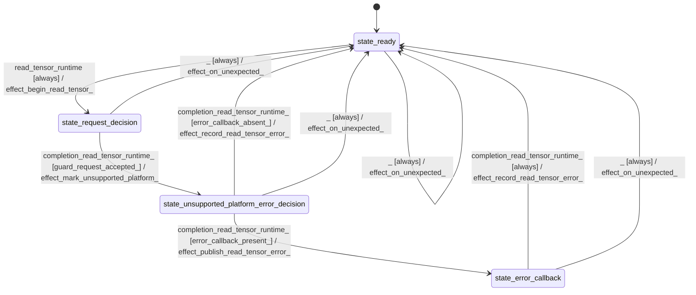

# io_read

Source: [`emel/io/read/sm.hpp`](https://github.com/stateforward/emel.cpp/blob/main/src/emel/io/read/sm.hpp)

## Mermaid

## Transitions

| Source | Event | Guard | Action | Target |
| --- | --- | --- | --- | --- |
| [`state_ready`](https://github.com/stateforward/emel.cpp/blob/main/src/emel/io/read/sm.hpp) | [`read_tensor_runtime`](https://github.com/stateforward/emel.cpp/blob/main/src/emel/io/read/sm.hpp) | [`always`](https://github.com/stateforward/emel.cpp/blob/main/src/emel/io/read/sm.hpp) | [`effect_begin_read_tensor>`](https://github.com/stateforward/emel.cpp/blob/main/src/emel/io/read/sm.hpp) | [`state_request_decision`](https://github.com/stateforward/emel.cpp/blob/main/src/emel/io/read/sm.hpp) |
| [`state_request_decision`](https://github.com/stateforward/emel.cpp/blob/main/src/emel/io/read/sm.hpp) | [`completion<read_tensor_runtime>`](https://github.com/stateforward/emel.cpp/blob/main/src/emel/io/read/sm.hpp) | [`guard_request_accepted>`](https://github.com/stateforward/emel.cpp/blob/main/src/emel/io/read/sm.hpp) | [`effect_mark_unsupported_platform>`](https://github.com/stateforward/emel.cpp/blob/main/src/emel/io/read/sm.hpp) | [`state_unsupported_platform_error_decision`](https://github.com/stateforward/emel.cpp/blob/main/src/emel/io/read/sm.hpp) |
| [`state_unsupported_platform_error_decision`](https://github.com/stateforward/emel.cpp/blob/main/src/emel/io/read/sm.hpp) | [`completion<read_tensor_runtime>`](https://github.com/stateforward/emel.cpp/blob/main/src/emel/io/read/sm.hpp) | [`error_callback_present>`](https://github.com/stateforward/emel.cpp/blob/main/src/emel/io/read/sm.hpp) | [`effect_publish_read_tensor_error>`](https://github.com/stateforward/emel.cpp/blob/main/src/emel/io/read/sm.hpp) | [`state_error_callback`](https://github.com/stateforward/emel.cpp/blob/main/src/emel/io/read/sm.hpp) |
| [`state_unsupported_platform_error_decision`](https://github.com/stateforward/emel.cpp/blob/main/src/emel/io/read/sm.hpp) | [`completion<read_tensor_runtime>`](https://github.com/stateforward/emel.cpp/blob/main/src/emel/io/read/sm.hpp) | [`error_callback_absent>`](https://github.com/stateforward/emel.cpp/blob/main/src/emel/io/read/sm.hpp) | [`effect_record_read_tensor_error>`](https://github.com/stateforward/emel.cpp/blob/main/src/emel/io/read/sm.hpp) | [`state_ready`](https://github.com/stateforward/emel.cpp/blob/main/src/emel/io/read/sm.hpp) |
| [`state_error_callback`](https://github.com/stateforward/emel.cpp/blob/main/src/emel/io/read/sm.hpp) | [`completion<read_tensor_runtime>`](https://github.com/stateforward/emel.cpp/blob/main/src/emel/io/read/sm.hpp) | [`always`](https://github.com/stateforward/emel.cpp/blob/main/src/emel/io/read/sm.hpp) | [`effect_record_read_tensor_error>`](https://github.com/stateforward/emel.cpp/blob/main/src/emel/io/read/sm.hpp) | [`state_ready`](https://github.com/stateforward/emel.cpp/blob/main/src/emel/io/read/sm.hpp) |
| [`state_ready`](https://github.com/stateforward/emel.cpp/blob/main/src/emel/io/read/sm.hpp) | [`_`](https://github.com/stateforward/emel.cpp/blob/main/src/emel/io/read/sm.hpp) | [`always`](https://github.com/stateforward/emel.cpp/blob/main/src/emel/io/read/sm.hpp) | [`effect_on_unexpected>`](https://github.com/stateforward/emel.cpp/blob/main/src/emel/io/read/sm.hpp) | [`state_ready`](https://github.com/stateforward/emel.cpp/blob/main/src/emel/io/read/sm.hpp) |
| [`state_request_decision`](https://github.com/stateforward/emel.cpp/blob/main/src/emel/io/read/sm.hpp) | [`_`](https://github.com/stateforward/emel.cpp/blob/main/src/emel/io/read/sm.hpp) | [`always`](https://github.com/stateforward/emel.cpp/blob/main/src/emel/io/read/sm.hpp) | [`effect_on_unexpected>`](https://github.com/stateforward/emel.cpp/blob/main/src/emel/io/read/sm.hpp) | [`state_ready`](https://github.com/stateforward/emel.cpp/blob/main/src/emel/io/read/sm.hpp) |
| [`state_unsupported_platform_error_decision`](https://github.com/stateforward/emel.cpp/blob/main/src/emel/io/read/sm.hpp) | [`_`](https://github.com/stateforward/emel.cpp/blob/main/src/emel/io/read/sm.hpp) | [`always`](https://github.com/stateforward/emel.cpp/blob/main/src/emel/io/read/sm.hpp) | [`effect_on_unexpected>`](https://github.com/stateforward/emel.cpp/blob/main/src/emel/io/read/sm.hpp) | [`state_ready`](https://github.com/stateforward/emel.cpp/blob/main/src/emel/io/read/sm.hpp) |
| [`state_error_callback`](https://github.com/stateforward/emel.cpp/blob/main/src/emel/io/read/sm.hpp) | [`_`](https://github.com/stateforward/emel.cpp/blob/main/src/emel/io/read/sm.hpp) | [`always`](https://github.com/stateforward/emel.cpp/blob/main/src/emel/io/read/sm.hpp) | [`effect_on_unexpected>`](https://github.com/stateforward/emel.cpp/blob/main/src/emel/io/read/sm.hpp) | [`state_ready`](https://github.com/stateforward/emel.cpp/blob/main/src/emel/io/read/sm.hpp) |
