# io_staged_read

Source: [`emel/io/staged_read/sm.hpp`](https://github.com/stateforward/emel.cpp/blob/main/src/emel/io/staged_read/sm.hpp)

## Mermaid

```mermaid
stateDiagram-v2
  direction TB
  [*] --> state_ready
  state_ready --> state_guard_staged_callbacks_decision : staged_window_runtime [always] / effect_begin_staged_window_
  state_guard_staged_callbacks_decision --> state_guard_source_contract_decision : completion_staged_window_runtime_ [guard_staged_window_callbacks_present_] / none
  state_guard_staged_callbacks_decision --> state_invalid_callbacks_error_decision : completion_staged_window_runtime_ [guard_staged_window_callbacks_missing_] / effect_mark_invalid_callbacks_
  state_guard_source_contract_decision --> state_guard_target_window_decision : completion_staged_window_runtime_ [guard_stg_source_contract_valid_] / none
  state_guard_source_contract_decision --> state_invalid_staging_contract_error_decision : completion_staged_window_runtime_ [guard_stg_source_contract_invalid_] / effect_mark_invalid_staging_contract_
  state_guard_target_window_decision --> state_guard_platform_decision : completion_staged_window_runtime_ [guard_stg_target_window_valid_] / none
  state_guard_target_window_decision --> state_invalid_target_window_error_decision : completion_staged_window_runtime_ [guard_stg_target_window_invalid_] / effect_mark_invalid_target_window_
  state_guard_platform_decision --> state_guard_copy_source_decision : completion_staged_window_runtime_ [guard_platform_staged_read_supported_] / none
  state_guard_platform_decision --> state_unsupported_platform_error_decision : completion_staged_window_runtime_ [guard_platform_staged_read_unsupported_] / effect_mark_unsupported_platform_
  state_guard_source_span_decision --> state_staged_pre_ready : completion_staged_window_runtime_ [guard_stg_copy_span_valid_] / effect_mark_staged_validation_accepted_
  state_guard_copy_source_decision --> state_guard_source_span_decision : completion_staged_window_runtime_ [guard_stg_source_span_present_] / none
  state_guard_copy_source_decision --> state_null_source_span_error_decision : completion_staged_window_runtime_ [guard_stg_source_span_missing_] / effect_mark_null_source_span_
  state_guard_source_span_decision --> state_insufficient_source_span_error_decision : completion_staged_window_runtime_ [guard_stg_source_span_insufficient_] / effect_mark_insufficient_source_span_
  state_guard_source_span_decision --> state_source_span_size_mismatch_error_decision : completion_staged_window_runtime_ [guard_stg_source_span_size_mismatch_] / effect_mark_source_span_size_mismatch_
  state_staged_pre_ready --> state_ready : completion_staged_window_runtime_ [guard_stg_logical_chunk_aligned_] / effect_publish_staged_window_done_aligned_
  state_staged_pre_ready --> state_ready : completion_staged_window_runtime_ [guard_stg_logical_chunk_remainder_] / effect_publish_staged_window_done_remainder_
  state_invalid_callbacks_error_decision --> state_staged_window_error_callback : completion_staged_window_runtime_ [error_callback_present_] / effect_publish_staged_window_error_
  state_invalid_callbacks_error_decision --> state_ready : completion_staged_window_runtime_ [error_callback_absent_] / effect_record_staged_window_error_
  state_invalid_staging_contract_error_decision --> state_staged_window_error_callback : completion_staged_window_runtime_ [error_callback_present_] / effect_publish_staged_window_error_
  state_invalid_staging_contract_error_decision --> state_ready : completion_staged_window_runtime_ [error_callback_absent_] / effect_record_staged_window_error_
  state_invalid_target_window_error_decision --> state_staged_window_error_callback : completion_staged_window_runtime_ [error_callback_present_] / effect_publish_staged_window_error_
  state_invalid_target_window_error_decision --> state_ready : completion_staged_window_runtime_ [error_callback_absent_] / effect_record_staged_window_error_
  state_unsupported_platform_error_decision --> state_staged_window_error_callback : completion_staged_window_runtime_ [error_callback_present_] / effect_publish_staged_window_error_
  state_unsupported_platform_error_decision --> state_ready : completion_staged_window_runtime_ [error_callback_absent_] / effect_record_staged_window_error_
  state_null_source_span_error_decision --> state_staged_window_error_callback : completion_staged_window_runtime_ [error_callback_present_] / effect_publish_staged_window_error_
  state_null_source_span_error_decision --> state_ready : completion_staged_window_runtime_ [error_callback_absent_] / effect_record_staged_window_error_
  state_source_span_size_mismatch_error_decision --> state_staged_window_error_callback : completion_staged_window_runtime_ [error_callback_present_] / effect_publish_staged_window_error_
  state_source_span_size_mismatch_error_decision --> state_ready : completion_staged_window_runtime_ [error_callback_absent_] / effect_record_staged_window_error_
  state_insufficient_source_span_error_decision --> state_staged_window_error_callback : completion_staged_window_runtime_ [error_callback_present_] / effect_publish_staged_window_error_
  state_insufficient_source_span_error_decision --> state_ready : completion_staged_window_runtime_ [error_callback_absent_] / effect_record_staged_window_error_
  state_staged_window_error_callback --> state_ready : completion_staged_window_runtime_ [always] / effect_record_staged_window_error_
  state_ready --> state_batch_guard_callbacks_decision : staged_window_batch_runtime [always] / effect_begin_staged_window_batch_
  state_batch_guard_callbacks_decision --> state_batch_guard_requests_decision : completion_staged_window_batch_runtime_ [guard_staged_window_batch_callbacks_present_] / none
  state_batch_guard_callbacks_decision --> state_batch_invalid_callbacks_error_decision : completion_staged_window_batch_runtime_ [guard_staged_window_batch_callbacks_missing_] / effect_mark_batch_invalid_callbacks_
  state_batch_guard_requests_decision --> state_batch_guard_platform_decision : completion_staged_window_batch_runtime_ [guard_stg_batch_requests_valid_] / none
  state_batch_guard_requests_decision --> state_batch_invalid_staging_contract_error_decision : completion_staged_window_batch_runtime_ [guard_stg_batch_requests_invalid_] / effect_mark_batch_invalid_staging_contract_
  state_batch_guard_platform_decision --> state_batch_done_callback : completion_staged_window_batch_runtime_ [guard_platform_staged_read_batch_supported_] / effect_publish_staged_window_batch_done_
  state_batch_guard_platform_decision --> state_batch_unsupported_platform_error_decision : completion_staged_window_batch_runtime_ [guard_platform_staged_read_batch_unsupported_] / effect_mark_batch_unsupported_platform_
  state_batch_done_callback --> state_ready : completion_staged_window_batch_runtime_ [always] / effect_record_staged_window_batch_done_
  state_batch_invalid_callbacks_error_decision --> state_staged_window_batch_error_callback : completion_staged_window_batch_runtime_ [batch_error_callback_present_] / effect_publish_staged_window_batch_error_
  state_batch_invalid_callbacks_error_decision --> state_ready : completion_staged_window_batch_runtime_ [batch_error_callback_absent_] / effect_record_staged_window_batch_error_
  state_batch_invalid_staging_contract_error_decision --> state_staged_window_batch_error_callback : completion_staged_window_batch_runtime_ [batch_error_callback_present_] / effect_publish_staged_window_batch_error_
  state_batch_invalid_staging_contract_error_decision --> state_ready : completion_staged_window_batch_runtime_ [batch_error_callback_absent_] / effect_record_staged_window_batch_error_
  state_batch_unsupported_platform_error_decision --> state_staged_window_batch_error_callback : completion_staged_window_batch_runtime_ [batch_error_callback_present_] / effect_publish_staged_window_batch_error_
  state_batch_unsupported_platform_error_decision --> state_ready : completion_staged_window_batch_runtime_ [batch_error_callback_absent_] / effect_record_staged_window_batch_error_
  state_staged_window_batch_error_callback --> state_ready : completion_staged_window_batch_runtime_ [always] / effect_record_staged_window_batch_error_
  state_ready --> state_ready : _ [always] / effect_on_unexpected_
  state_guard_staged_callbacks_decision --> state_ready : _ [always] / effect_on_unexpected_
  state_guard_source_contract_decision --> state_ready : _ [always] / effect_on_unexpected_
  state_guard_target_window_decision --> state_ready : _ [always] / effect_on_unexpected_
  state_guard_platform_decision --> state_ready : _ [always] / effect_on_unexpected_
  state_guard_copy_source_decision --> state_ready : _ [always] / effect_on_unexpected_
  state_guard_source_span_decision --> state_ready : _ [always] / effect_on_unexpected_
  state_staged_pre_ready --> state_ready : _ [always] / effect_on_unexpected_
  state_invalid_callbacks_error_decision --> state_ready : _ [always] / effect_on_unexpected_
  state_invalid_staging_contract_error_decision --> state_ready : _ [always] / effect_on_unexpected_
  state_invalid_target_window_error_decision --> state_ready : _ [always] / effect_on_unexpected_
  state_unsupported_platform_error_decision --> state_ready : _ [always] / effect_on_unexpected_
  state_null_source_span_error_decision --> state_ready : _ [always] / effect_on_unexpected_
  state_source_span_size_mismatch_error_decision --> state_ready : _ [always] / effect_on_unexpected_
  state_insufficient_source_span_error_decision --> state_ready : _ [always] / effect_on_unexpected_
  state_staged_window_error_callback --> state_ready : _ [always] / effect_on_unexpected_
  state_batch_guard_callbacks_decision --> state_ready : _ [always] / effect_on_unexpected_
  state_batch_guard_requests_decision --> state_ready : _ [always] / effect_on_unexpected_
  state_batch_guard_platform_decision --> state_ready : _ [always] / effect_on_unexpected_
  state_batch_done_callback --> state_ready : _ [always] / effect_on_unexpected_
  state_batch_invalid_callbacks_error_decision --> state_ready : _ [always] / effect_on_unexpected_
  state_batch_invalid_staging_contract_error_decision --> state_ready : _ [always] / effect_on_unexpected_
  state_batch_unsupported_platform_error_decision --> state_ready : _ [always] / effect_on_unexpected_
  state_staged_window_batch_error_callback --> state_ready : _ [always] / effect_on_unexpected_
```

## Transitions

| Source | Event | Guard | Action | Target |
| --- | --- | --- | --- | --- |
| [`state_ready`](https://github.com/stateforward/emel.cpp/blob/main/src/emel/io/staged_read/sm.hpp) | [`staged_window_runtime`](https://github.com/stateforward/emel.cpp/blob/main/src/emel/io/staged_read/sm.hpp) | [`always`](https://github.com/stateforward/emel.cpp/blob/main/src/emel/io/staged_read/sm.hpp) | [`effect_begin_staged_window>`](https://github.com/stateforward/emel.cpp/blob/main/src/emel/io/staged_read/sm.hpp) | [`state_guard_staged_callbacks_decision`](https://github.com/stateforward/emel.cpp/blob/main/src/emel/io/staged_read/sm.hpp) |
| [`state_guard_staged_callbacks_decision`](https://github.com/stateforward/emel.cpp/blob/main/src/emel/io/staged_read/sm.hpp) | [`completion<staged_window_runtime>`](https://github.com/stateforward/emel.cpp/blob/main/src/emel/io/staged_read/sm.hpp) | [`guard_staged_window_callbacks_present>`](https://github.com/stateforward/emel.cpp/blob/main/src/emel/io/staged_read/sm.hpp) | [`none`](https://github.com/stateforward/emel.cpp/blob/main/src/emel/io/staged_read/sm.hpp) | [`state_guard_source_contract_decision`](https://github.com/stateforward/emel.cpp/blob/main/src/emel/io/staged_read/sm.hpp) |
| [`state_guard_staged_callbacks_decision`](https://github.com/stateforward/emel.cpp/blob/main/src/emel/io/staged_read/sm.hpp) | [`completion<staged_window_runtime>`](https://github.com/stateforward/emel.cpp/blob/main/src/emel/io/staged_read/sm.hpp) | [`guard_staged_window_callbacks_missing>`](https://github.com/stateforward/emel.cpp/blob/main/src/emel/io/staged_read/sm.hpp) | [`effect_mark_invalid_callbacks>`](https://github.com/stateforward/emel.cpp/blob/main/src/emel/io/staged_read/sm.hpp) | [`state_invalid_callbacks_error_decision`](https://github.com/stateforward/emel.cpp/blob/main/src/emel/io/staged_read/sm.hpp) |
| [`state_guard_source_contract_decision`](https://github.com/stateforward/emel.cpp/blob/main/src/emel/io/staged_read/sm.hpp) | [`completion<staged_window_runtime>`](https://github.com/stateforward/emel.cpp/blob/main/src/emel/io/staged_read/sm.hpp) | [`guard_stg_source_contract_valid>`](https://github.com/stateforward/emel.cpp/blob/main/src/emel/io/staged_read/sm.hpp) | [`none`](https://github.com/stateforward/emel.cpp/blob/main/src/emel/io/staged_read/sm.hpp) | [`state_guard_target_window_decision`](https://github.com/stateforward/emel.cpp/blob/main/src/emel/io/staged_read/sm.hpp) |
| [`state_guard_source_contract_decision`](https://github.com/stateforward/emel.cpp/blob/main/src/emel/io/staged_read/sm.hpp) | [`completion<staged_window_runtime>`](https://github.com/stateforward/emel.cpp/blob/main/src/emel/io/staged_read/sm.hpp) | [`guard_stg_source_contract_invalid>`](https://github.com/stateforward/emel.cpp/blob/main/src/emel/io/staged_read/sm.hpp) | [`effect_mark_invalid_staging_contract>`](https://github.com/stateforward/emel.cpp/blob/main/src/emel/io/staged_read/sm.hpp) | [`state_invalid_staging_contract_error_decision`](https://github.com/stateforward/emel.cpp/blob/main/src/emel/io/staged_read/sm.hpp) |
| [`state_guard_target_window_decision`](https://github.com/stateforward/emel.cpp/blob/main/src/emel/io/staged_read/sm.hpp) | [`completion<staged_window_runtime>`](https://github.com/stateforward/emel.cpp/blob/main/src/emel/io/staged_read/sm.hpp) | [`guard_stg_target_window_valid>`](https://github.com/stateforward/emel.cpp/blob/main/src/emel/io/staged_read/sm.hpp) | [`none`](https://github.com/stateforward/emel.cpp/blob/main/src/emel/io/staged_read/sm.hpp) | [`state_guard_platform_decision`](https://github.com/stateforward/emel.cpp/blob/main/src/emel/io/staged_read/sm.hpp) |
| [`state_guard_target_window_decision`](https://github.com/stateforward/emel.cpp/blob/main/src/emel/io/staged_read/sm.hpp) | [`completion<staged_window_runtime>`](https://github.com/stateforward/emel.cpp/blob/main/src/emel/io/staged_read/sm.hpp) | [`guard_stg_target_window_invalid>`](https://github.com/stateforward/emel.cpp/blob/main/src/emel/io/staged_read/sm.hpp) | [`effect_mark_invalid_target_window>`](https://github.com/stateforward/emel.cpp/blob/main/src/emel/io/staged_read/sm.hpp) | [`state_invalid_target_window_error_decision`](https://github.com/stateforward/emel.cpp/blob/main/src/emel/io/staged_read/sm.hpp) |
| [`state_guard_platform_decision`](https://github.com/stateforward/emel.cpp/blob/main/src/emel/io/staged_read/sm.hpp) | [`completion<staged_window_runtime>`](https://github.com/stateforward/emel.cpp/blob/main/src/emel/io/staged_read/sm.hpp) | [`guard_platform_staged_read_supported>`](https://github.com/stateforward/emel.cpp/blob/main/src/emel/io/staged_read/sm.hpp) | [`none`](https://github.com/stateforward/emel.cpp/blob/main/src/emel/io/staged_read/sm.hpp) | [`state_guard_copy_source_decision`](https://github.com/stateforward/emel.cpp/blob/main/src/emel/io/staged_read/sm.hpp) |
| [`state_guard_platform_decision`](https://github.com/stateforward/emel.cpp/blob/main/src/emel/io/staged_read/sm.hpp) | [`completion<staged_window_runtime>`](https://github.com/stateforward/emel.cpp/blob/main/src/emel/io/staged_read/sm.hpp) | [`guard_platform_staged_read_unsupported>`](https://github.com/stateforward/emel.cpp/blob/main/src/emel/io/staged_read/sm.hpp) | [`effect_mark_unsupported_platform>`](https://github.com/stateforward/emel.cpp/blob/main/src/emel/io/staged_read/sm.hpp) | [`state_unsupported_platform_error_decision`](https://github.com/stateforward/emel.cpp/blob/main/src/emel/io/staged_read/sm.hpp) |
| [`state_guard_source_span_decision`](https://github.com/stateforward/emel.cpp/blob/main/src/emel/io/staged_read/sm.hpp) | [`completion<staged_window_runtime>`](https://github.com/stateforward/emel.cpp/blob/main/src/emel/io/staged_read/sm.hpp) | [`guard_stg_copy_span_valid>`](https://github.com/stateforward/emel.cpp/blob/main/src/emel/io/staged_read/sm.hpp) | [`effect_mark_staged_validation_accepted>`](https://github.com/stateforward/emel.cpp/blob/main/src/emel/io/staged_read/sm.hpp) | [`state_staged_pre_ready`](https://github.com/stateforward/emel.cpp/blob/main/src/emel/io/staged_read/sm.hpp) |
| [`state_guard_copy_source_decision`](https://github.com/stateforward/emel.cpp/blob/main/src/emel/io/staged_read/sm.hpp) | [`completion<staged_window_runtime>`](https://github.com/stateforward/emel.cpp/blob/main/src/emel/io/staged_read/sm.hpp) | [`guard_stg_source_span_present>`](https://github.com/stateforward/emel.cpp/blob/main/src/emel/io/staged_read/sm.hpp) | [`none`](https://github.com/stateforward/emel.cpp/blob/main/src/emel/io/staged_read/sm.hpp) | [`state_guard_source_span_decision`](https://github.com/stateforward/emel.cpp/blob/main/src/emel/io/staged_read/sm.hpp) |
| [`state_guard_copy_source_decision`](https://github.com/stateforward/emel.cpp/blob/main/src/emel/io/staged_read/sm.hpp) | [`completion<staged_window_runtime>`](https://github.com/stateforward/emel.cpp/blob/main/src/emel/io/staged_read/sm.hpp) | [`guard_stg_source_span_missing>`](https://github.com/stateforward/emel.cpp/blob/main/src/emel/io/staged_read/sm.hpp) | [`effect_mark_null_source_span>`](https://github.com/stateforward/emel.cpp/blob/main/src/emel/io/staged_read/sm.hpp) | [`state_null_source_span_error_decision`](https://github.com/stateforward/emel.cpp/blob/main/src/emel/io/staged_read/sm.hpp) |
| [`state_guard_source_span_decision`](https://github.com/stateforward/emel.cpp/blob/main/src/emel/io/staged_read/sm.hpp) | [`completion<staged_window_runtime>`](https://github.com/stateforward/emel.cpp/blob/main/src/emel/io/staged_read/sm.hpp) | [`guard_stg_source_span_insufficient>`](https://github.com/stateforward/emel.cpp/blob/main/src/emel/io/staged_read/sm.hpp) | [`effect_mark_insufficient_source_span>`](https://github.com/stateforward/emel.cpp/blob/main/src/emel/io/staged_read/sm.hpp) | [`state_insufficient_source_span_error_decision`](https://github.com/stateforward/emel.cpp/blob/main/src/emel/io/staged_read/sm.hpp) |
| [`state_guard_source_span_decision`](https://github.com/stateforward/emel.cpp/blob/main/src/emel/io/staged_read/sm.hpp) | [`completion<staged_window_runtime>`](https://github.com/stateforward/emel.cpp/blob/main/src/emel/io/staged_read/sm.hpp) | [`guard_stg_source_span_size_mismatch>`](https://github.com/stateforward/emel.cpp/blob/main/src/emel/io/staged_read/sm.hpp) | [`effect_mark_source_span_size_mismatch>`](https://github.com/stateforward/emel.cpp/blob/main/src/emel/io/staged_read/sm.hpp) | [`state_source_span_size_mismatch_error_decision`](https://github.com/stateforward/emel.cpp/blob/main/src/emel/io/staged_read/sm.hpp) |
| [`state_staged_pre_ready`](https://github.com/stateforward/emel.cpp/blob/main/src/emel/io/staged_read/sm.hpp) | [`completion<staged_window_runtime>`](https://github.com/stateforward/emel.cpp/blob/main/src/emel/io/staged_read/sm.hpp) | [`guard_stg_logical_chunk_aligned>`](https://github.com/stateforward/emel.cpp/blob/main/src/emel/io/staged_read/sm.hpp) | [`effect_publish_staged_window_done_aligned>`](https://github.com/stateforward/emel.cpp/blob/main/src/emel/io/staged_read/sm.hpp) | [`state_ready`](https://github.com/stateforward/emel.cpp/blob/main/src/emel/io/staged_read/sm.hpp) |
| [`state_staged_pre_ready`](https://github.com/stateforward/emel.cpp/blob/main/src/emel/io/staged_read/sm.hpp) | [`completion<staged_window_runtime>`](https://github.com/stateforward/emel.cpp/blob/main/src/emel/io/staged_read/sm.hpp) | [`guard_stg_logical_chunk_remainder>`](https://github.com/stateforward/emel.cpp/blob/main/src/emel/io/staged_read/sm.hpp) | [`effect_publish_staged_window_done_remainder>`](https://github.com/stateforward/emel.cpp/blob/main/src/emel/io/staged_read/sm.hpp) | [`state_ready`](https://github.com/stateforward/emel.cpp/blob/main/src/emel/io/staged_read/sm.hpp) |
| [`state_invalid_callbacks_error_decision`](https://github.com/stateforward/emel.cpp/blob/main/src/emel/io/staged_read/sm.hpp) | [`completion<staged_window_runtime>`](https://github.com/stateforward/emel.cpp/blob/main/src/emel/io/staged_read/sm.hpp) | [`error_callback_present>`](https://github.com/stateforward/emel.cpp/blob/main/src/emel/io/staged_read/sm.hpp) | [`effect_publish_staged_window_error>`](https://github.com/stateforward/emel.cpp/blob/main/src/emel/io/staged_read/sm.hpp) | [`state_staged_window_error_callback`](https://github.com/stateforward/emel.cpp/blob/main/src/emel/io/staged_read/sm.hpp) |
| [`state_invalid_callbacks_error_decision`](https://github.com/stateforward/emel.cpp/blob/main/src/emel/io/staged_read/sm.hpp) | [`completion<staged_window_runtime>`](https://github.com/stateforward/emel.cpp/blob/main/src/emel/io/staged_read/sm.hpp) | [`error_callback_absent>`](https://github.com/stateforward/emel.cpp/blob/main/src/emel/io/staged_read/sm.hpp) | [`effect_record_staged_window_error>`](https://github.com/stateforward/emel.cpp/blob/main/src/emel/io/staged_read/sm.hpp) | [`state_ready`](https://github.com/stateforward/emel.cpp/blob/main/src/emel/io/staged_read/sm.hpp) |
| [`state_invalid_staging_contract_error_decision`](https://github.com/stateforward/emel.cpp/blob/main/src/emel/io/staged_read/sm.hpp) | [`completion<staged_window_runtime>`](https://github.com/stateforward/emel.cpp/blob/main/src/emel/io/staged_read/sm.hpp) | [`error_callback_present>`](https://github.com/stateforward/emel.cpp/blob/main/src/emel/io/staged_read/sm.hpp) | [`effect_publish_staged_window_error>`](https://github.com/stateforward/emel.cpp/blob/main/src/emel/io/staged_read/sm.hpp) | [`state_staged_window_error_callback`](https://github.com/stateforward/emel.cpp/blob/main/src/emel/io/staged_read/sm.hpp) |
| [`state_invalid_staging_contract_error_decision`](https://github.com/stateforward/emel.cpp/blob/main/src/emel/io/staged_read/sm.hpp) | [`completion<staged_window_runtime>`](https://github.com/stateforward/emel.cpp/blob/main/src/emel/io/staged_read/sm.hpp) | [`error_callback_absent>`](https://github.com/stateforward/emel.cpp/blob/main/src/emel/io/staged_read/sm.hpp) | [`effect_record_staged_window_error>`](https://github.com/stateforward/emel.cpp/blob/main/src/emel/io/staged_read/sm.hpp) | [`state_ready`](https://github.com/stateforward/emel.cpp/blob/main/src/emel/io/staged_read/sm.hpp) |
| [`state_invalid_target_window_error_decision`](https://github.com/stateforward/emel.cpp/blob/main/src/emel/io/staged_read/sm.hpp) | [`completion<staged_window_runtime>`](https://github.com/stateforward/emel.cpp/blob/main/src/emel/io/staged_read/sm.hpp) | [`error_callback_present>`](https://github.com/stateforward/emel.cpp/blob/main/src/emel/io/staged_read/sm.hpp) | [`effect_publish_staged_window_error>`](https://github.com/stateforward/emel.cpp/blob/main/src/emel/io/staged_read/sm.hpp) | [`state_staged_window_error_callback`](https://github.com/stateforward/emel.cpp/blob/main/src/emel/io/staged_read/sm.hpp) |
| [`state_invalid_target_window_error_decision`](https://github.com/stateforward/emel.cpp/blob/main/src/emel/io/staged_read/sm.hpp) | [`completion<staged_window_runtime>`](https://github.com/stateforward/emel.cpp/blob/main/src/emel/io/staged_read/sm.hpp) | [`error_callback_absent>`](https://github.com/stateforward/emel.cpp/blob/main/src/emel/io/staged_read/sm.hpp) | [`effect_record_staged_window_error>`](https://github.com/stateforward/emel.cpp/blob/main/src/emel/io/staged_read/sm.hpp) | [`state_ready`](https://github.com/stateforward/emel.cpp/blob/main/src/emel/io/staged_read/sm.hpp) |
| [`state_unsupported_platform_error_decision`](https://github.com/stateforward/emel.cpp/blob/main/src/emel/io/staged_read/sm.hpp) | [`completion<staged_window_runtime>`](https://github.com/stateforward/emel.cpp/blob/main/src/emel/io/staged_read/sm.hpp) | [`error_callback_present>`](https://github.com/stateforward/emel.cpp/blob/main/src/emel/io/staged_read/sm.hpp) | [`effect_publish_staged_window_error>`](https://github.com/stateforward/emel.cpp/blob/main/src/emel/io/staged_read/sm.hpp) | [`state_staged_window_error_callback`](https://github.com/stateforward/emel.cpp/blob/main/src/emel/io/staged_read/sm.hpp) |
| [`state_unsupported_platform_error_decision`](https://github.com/stateforward/emel.cpp/blob/main/src/emel/io/staged_read/sm.hpp) | [`completion<staged_window_runtime>`](https://github.com/stateforward/emel.cpp/blob/main/src/emel/io/staged_read/sm.hpp) | [`error_callback_absent>`](https://github.com/stateforward/emel.cpp/blob/main/src/emel/io/staged_read/sm.hpp) | [`effect_record_staged_window_error>`](https://github.com/stateforward/emel.cpp/blob/main/src/emel/io/staged_read/sm.hpp) | [`state_ready`](https://github.com/stateforward/emel.cpp/blob/main/src/emel/io/staged_read/sm.hpp) |
| [`state_null_source_span_error_decision`](https://github.com/stateforward/emel.cpp/blob/main/src/emel/io/staged_read/sm.hpp) | [`completion<staged_window_runtime>`](https://github.com/stateforward/emel.cpp/blob/main/src/emel/io/staged_read/sm.hpp) | [`error_callback_present>`](https://github.com/stateforward/emel.cpp/blob/main/src/emel/io/staged_read/sm.hpp) | [`effect_publish_staged_window_error>`](https://github.com/stateforward/emel.cpp/blob/main/src/emel/io/staged_read/sm.hpp) | [`state_staged_window_error_callback`](https://github.com/stateforward/emel.cpp/blob/main/src/emel/io/staged_read/sm.hpp) |
| [`state_null_source_span_error_decision`](https://github.com/stateforward/emel.cpp/blob/main/src/emel/io/staged_read/sm.hpp) | [`completion<staged_window_runtime>`](https://github.com/stateforward/emel.cpp/blob/main/src/emel/io/staged_read/sm.hpp) | [`error_callback_absent>`](https://github.com/stateforward/emel.cpp/blob/main/src/emel/io/staged_read/sm.hpp) | [`effect_record_staged_window_error>`](https://github.com/stateforward/emel.cpp/blob/main/src/emel/io/staged_read/sm.hpp) | [`state_ready`](https://github.com/stateforward/emel.cpp/blob/main/src/emel/io/staged_read/sm.hpp) |
| [`state_source_span_size_mismatch_error_decision`](https://github.com/stateforward/emel.cpp/blob/main/src/emel/io/staged_read/sm.hpp) | [`completion<staged_window_runtime>`](https://github.com/stateforward/emel.cpp/blob/main/src/emel/io/staged_read/sm.hpp) | [`error_callback_present>`](https://github.com/stateforward/emel.cpp/blob/main/src/emel/io/staged_read/sm.hpp) | [`effect_publish_staged_window_error>`](https://github.com/stateforward/emel.cpp/blob/main/src/emel/io/staged_read/sm.hpp) | [`state_staged_window_error_callback`](https://github.com/stateforward/emel.cpp/blob/main/src/emel/io/staged_read/sm.hpp) |
| [`state_source_span_size_mismatch_error_decision`](https://github.com/stateforward/emel.cpp/blob/main/src/emel/io/staged_read/sm.hpp) | [`completion<staged_window_runtime>`](https://github.com/stateforward/emel.cpp/blob/main/src/emel/io/staged_read/sm.hpp) | [`error_callback_absent>`](https://github.com/stateforward/emel.cpp/blob/main/src/emel/io/staged_read/sm.hpp) | [`effect_record_staged_window_error>`](https://github.com/stateforward/emel.cpp/blob/main/src/emel/io/staged_read/sm.hpp) | [`state_ready`](https://github.com/stateforward/emel.cpp/blob/main/src/emel/io/staged_read/sm.hpp) |
| [`state_insufficient_source_span_error_decision`](https://github.com/stateforward/emel.cpp/blob/main/src/emel/io/staged_read/sm.hpp) | [`completion<staged_window_runtime>`](https://github.com/stateforward/emel.cpp/blob/main/src/emel/io/staged_read/sm.hpp) | [`error_callback_present>`](https://github.com/stateforward/emel.cpp/blob/main/src/emel/io/staged_read/sm.hpp) | [`effect_publish_staged_window_error>`](https://github.com/stateforward/emel.cpp/blob/main/src/emel/io/staged_read/sm.hpp) | [`state_staged_window_error_callback`](https://github.com/stateforward/emel.cpp/blob/main/src/emel/io/staged_read/sm.hpp) |
| [`state_insufficient_source_span_error_decision`](https://github.com/stateforward/emel.cpp/blob/main/src/emel/io/staged_read/sm.hpp) | [`completion<staged_window_runtime>`](https://github.com/stateforward/emel.cpp/blob/main/src/emel/io/staged_read/sm.hpp) | [`error_callback_absent>`](https://github.com/stateforward/emel.cpp/blob/main/src/emel/io/staged_read/sm.hpp) | [`effect_record_staged_window_error>`](https://github.com/stateforward/emel.cpp/blob/main/src/emel/io/staged_read/sm.hpp) | [`state_ready`](https://github.com/stateforward/emel.cpp/blob/main/src/emel/io/staged_read/sm.hpp) |
| [`state_staged_window_error_callback`](https://github.com/stateforward/emel.cpp/blob/main/src/emel/io/staged_read/sm.hpp) | [`completion<staged_window_runtime>`](https://github.com/stateforward/emel.cpp/blob/main/src/emel/io/staged_read/sm.hpp) | [`always`](https://github.com/stateforward/emel.cpp/blob/main/src/emel/io/staged_read/sm.hpp) | [`effect_record_staged_window_error>`](https://github.com/stateforward/emel.cpp/blob/main/src/emel/io/staged_read/sm.hpp) | [`state_ready`](https://github.com/stateforward/emel.cpp/blob/main/src/emel/io/staged_read/sm.hpp) |
| [`state_ready`](https://github.com/stateforward/emel.cpp/blob/main/src/emel/io/staged_read/sm.hpp) | [`staged_window_batch_runtime`](https://github.com/stateforward/emel.cpp/blob/main/src/emel/io/staged_read/sm.hpp) | [`always`](https://github.com/stateforward/emel.cpp/blob/main/src/emel/io/staged_read/sm.hpp) | [`effect_begin_staged_window_batch>`](https://github.com/stateforward/emel.cpp/blob/main/src/emel/io/staged_read/sm.hpp) | [`state_batch_guard_callbacks_decision`](https://github.com/stateforward/emel.cpp/blob/main/src/emel/io/staged_read/sm.hpp) |
| [`state_batch_guard_callbacks_decision`](https://github.com/stateforward/emel.cpp/blob/main/src/emel/io/staged_read/sm.hpp) | [`completion<staged_window_batch_runtime>`](https://github.com/stateforward/emel.cpp/blob/main/src/emel/io/staged_read/sm.hpp) | [`guard_staged_window_batch_callbacks_present>`](https://github.com/stateforward/emel.cpp/blob/main/src/emel/io/staged_read/sm.hpp) | [`none`](https://github.com/stateforward/emel.cpp/blob/main/src/emel/io/staged_read/sm.hpp) | [`state_batch_guard_requests_decision`](https://github.com/stateforward/emel.cpp/blob/main/src/emel/io/staged_read/sm.hpp) |
| [`state_batch_guard_callbacks_decision`](https://github.com/stateforward/emel.cpp/blob/main/src/emel/io/staged_read/sm.hpp) | [`completion<staged_window_batch_runtime>`](https://github.com/stateforward/emel.cpp/blob/main/src/emel/io/staged_read/sm.hpp) | [`guard_staged_window_batch_callbacks_missing>`](https://github.com/stateforward/emel.cpp/blob/main/src/emel/io/staged_read/sm.hpp) | [`effect_mark_batch_invalid_callbacks>`](https://github.com/stateforward/emel.cpp/blob/main/src/emel/io/staged_read/sm.hpp) | [`state_batch_invalid_callbacks_error_decision`](https://github.com/stateforward/emel.cpp/blob/main/src/emel/io/staged_read/sm.hpp) |
| [`state_batch_guard_requests_decision`](https://github.com/stateforward/emel.cpp/blob/main/src/emel/io/staged_read/sm.hpp) | [`completion<staged_window_batch_runtime>`](https://github.com/stateforward/emel.cpp/blob/main/src/emel/io/staged_read/sm.hpp) | [`guard_stg_batch_requests_valid>`](https://github.com/stateforward/emel.cpp/blob/main/src/emel/io/staged_read/sm.hpp) | [`none`](https://github.com/stateforward/emel.cpp/blob/main/src/emel/io/staged_read/sm.hpp) | [`state_batch_guard_platform_decision`](https://github.com/stateforward/emel.cpp/blob/main/src/emel/io/staged_read/sm.hpp) |
| [`state_batch_guard_requests_decision`](https://github.com/stateforward/emel.cpp/blob/main/src/emel/io/staged_read/sm.hpp) | [`completion<staged_window_batch_runtime>`](https://github.com/stateforward/emel.cpp/blob/main/src/emel/io/staged_read/sm.hpp) | [`guard_stg_batch_requests_invalid>`](https://github.com/stateforward/emel.cpp/blob/main/src/emel/io/staged_read/sm.hpp) | [`effect_mark_batch_invalid_staging_contract>`](https://github.com/stateforward/emel.cpp/blob/main/src/emel/io/staged_read/sm.hpp) | [`state_batch_invalid_staging_contract_error_decision`](https://github.com/stateforward/emel.cpp/blob/main/src/emel/io/staged_read/sm.hpp) |
| [`state_batch_guard_platform_decision`](https://github.com/stateforward/emel.cpp/blob/main/src/emel/io/staged_read/sm.hpp) | [`completion<staged_window_batch_runtime>`](https://github.com/stateforward/emel.cpp/blob/main/src/emel/io/staged_read/sm.hpp) | [`guard_platform_staged_read_batch_supported>`](https://github.com/stateforward/emel.cpp/blob/main/src/emel/io/staged_read/sm.hpp) | [`effect_publish_staged_window_batch_done>`](https://github.com/stateforward/emel.cpp/blob/main/src/emel/io/staged_read/sm.hpp) | [`state_batch_done_callback`](https://github.com/stateforward/emel.cpp/blob/main/src/emel/io/staged_read/sm.hpp) |
| [`state_batch_guard_platform_decision`](https://github.com/stateforward/emel.cpp/blob/main/src/emel/io/staged_read/sm.hpp) | [`completion<staged_window_batch_runtime>`](https://github.com/stateforward/emel.cpp/blob/main/src/emel/io/staged_read/sm.hpp) | [`guard_platform_staged_read_batch_unsupported>`](https://github.com/stateforward/emel.cpp/blob/main/src/emel/io/staged_read/sm.hpp) | [`effect_mark_batch_unsupported_platform>`](https://github.com/stateforward/emel.cpp/blob/main/src/emel/io/staged_read/sm.hpp) | [`state_batch_unsupported_platform_error_decision`](https://github.com/stateforward/emel.cpp/blob/main/src/emel/io/staged_read/sm.hpp) |
| [`state_batch_done_callback`](https://github.com/stateforward/emel.cpp/blob/main/src/emel/io/staged_read/sm.hpp) | [`completion<staged_window_batch_runtime>`](https://github.com/stateforward/emel.cpp/blob/main/src/emel/io/staged_read/sm.hpp) | [`always`](https://github.com/stateforward/emel.cpp/blob/main/src/emel/io/staged_read/sm.hpp) | [`effect_record_staged_window_batch_done>`](https://github.com/stateforward/emel.cpp/blob/main/src/emel/io/staged_read/sm.hpp) | [`state_ready`](https://github.com/stateforward/emel.cpp/blob/main/src/emel/io/staged_read/sm.hpp) |
| [`state_batch_invalid_callbacks_error_decision`](https://github.com/stateforward/emel.cpp/blob/main/src/emel/io/staged_read/sm.hpp) | [`completion<staged_window_batch_runtime>`](https://github.com/stateforward/emel.cpp/blob/main/src/emel/io/staged_read/sm.hpp) | [`batch_error_callback_present>`](https://github.com/stateforward/emel.cpp/blob/main/src/emel/io/staged_read/sm.hpp) | [`effect_publish_staged_window_batch_error>`](https://github.com/stateforward/emel.cpp/blob/main/src/emel/io/staged_read/sm.hpp) | [`state_staged_window_batch_error_callback`](https://github.com/stateforward/emel.cpp/blob/main/src/emel/io/staged_read/sm.hpp) |
| [`state_batch_invalid_callbacks_error_decision`](https://github.com/stateforward/emel.cpp/blob/main/src/emel/io/staged_read/sm.hpp) | [`completion<staged_window_batch_runtime>`](https://github.com/stateforward/emel.cpp/blob/main/src/emel/io/staged_read/sm.hpp) | [`batch_error_callback_absent>`](https://github.com/stateforward/emel.cpp/blob/main/src/emel/io/staged_read/sm.hpp) | [`effect_record_staged_window_batch_error>`](https://github.com/stateforward/emel.cpp/blob/main/src/emel/io/staged_read/sm.hpp) | [`state_ready`](https://github.com/stateforward/emel.cpp/blob/main/src/emel/io/staged_read/sm.hpp) |
| [`state_batch_invalid_staging_contract_error_decision`](https://github.com/stateforward/emel.cpp/blob/main/src/emel/io/staged_read/sm.hpp) | [`completion<staged_window_batch_runtime>`](https://github.com/stateforward/emel.cpp/blob/main/src/emel/io/staged_read/sm.hpp) | [`batch_error_callback_present>`](https://github.com/stateforward/emel.cpp/blob/main/src/emel/io/staged_read/sm.hpp) | [`effect_publish_staged_window_batch_error>`](https://github.com/stateforward/emel.cpp/blob/main/src/emel/io/staged_read/sm.hpp) | [`state_staged_window_batch_error_callback`](https://github.com/stateforward/emel.cpp/blob/main/src/emel/io/staged_read/sm.hpp) |
| [`state_batch_invalid_staging_contract_error_decision`](https://github.com/stateforward/emel.cpp/blob/main/src/emel/io/staged_read/sm.hpp) | [`completion<staged_window_batch_runtime>`](https://github.com/stateforward/emel.cpp/blob/main/src/emel/io/staged_read/sm.hpp) | [`batch_error_callback_absent>`](https://github.com/stateforward/emel.cpp/blob/main/src/emel/io/staged_read/sm.hpp) | [`effect_record_staged_window_batch_error>`](https://github.com/stateforward/emel.cpp/blob/main/src/emel/io/staged_read/sm.hpp) | [`state_ready`](https://github.com/stateforward/emel.cpp/blob/main/src/emel/io/staged_read/sm.hpp) |
| [`state_batch_unsupported_platform_error_decision`](https://github.com/stateforward/emel.cpp/blob/main/src/emel/io/staged_read/sm.hpp) | [`completion<staged_window_batch_runtime>`](https://github.com/stateforward/emel.cpp/blob/main/src/emel/io/staged_read/sm.hpp) | [`batch_error_callback_present>`](https://github.com/stateforward/emel.cpp/blob/main/src/emel/io/staged_read/sm.hpp) | [`effect_publish_staged_window_batch_error>`](https://github.com/stateforward/emel.cpp/blob/main/src/emel/io/staged_read/sm.hpp) | [`state_staged_window_batch_error_callback`](https://github.com/stateforward/emel.cpp/blob/main/src/emel/io/staged_read/sm.hpp) |
| [`state_batch_unsupported_platform_error_decision`](https://github.com/stateforward/emel.cpp/blob/main/src/emel/io/staged_read/sm.hpp) | [`completion<staged_window_batch_runtime>`](https://github.com/stateforward/emel.cpp/blob/main/src/emel/io/staged_read/sm.hpp) | [`batch_error_callback_absent>`](https://github.com/stateforward/emel.cpp/blob/main/src/emel/io/staged_read/sm.hpp) | [`effect_record_staged_window_batch_error>`](https://github.com/stateforward/emel.cpp/blob/main/src/emel/io/staged_read/sm.hpp) | [`state_ready`](https://github.com/stateforward/emel.cpp/blob/main/src/emel/io/staged_read/sm.hpp) |
| [`state_staged_window_batch_error_callback`](https://github.com/stateforward/emel.cpp/blob/main/src/emel/io/staged_read/sm.hpp) | [`completion<staged_window_batch_runtime>`](https://github.com/stateforward/emel.cpp/blob/main/src/emel/io/staged_read/sm.hpp) | [`always`](https://github.com/stateforward/emel.cpp/blob/main/src/emel/io/staged_read/sm.hpp) | [`effect_record_staged_window_batch_error>`](https://github.com/stateforward/emel.cpp/blob/main/src/emel/io/staged_read/sm.hpp) | [`state_ready`](https://github.com/stateforward/emel.cpp/blob/main/src/emel/io/staged_read/sm.hpp) |
| [`state_ready`](https://github.com/stateforward/emel.cpp/blob/main/src/emel/io/staged_read/sm.hpp) | [`_`](https://github.com/stateforward/emel.cpp/blob/main/src/emel/io/staged_read/sm.hpp) | [`always`](https://github.com/stateforward/emel.cpp/blob/main/src/emel/io/staged_read/sm.hpp) | [`effect_on_unexpected>`](https://github.com/stateforward/emel.cpp/blob/main/src/emel/io/staged_read/sm.hpp) | [`state_ready`](https://github.com/stateforward/emel.cpp/blob/main/src/emel/io/staged_read/sm.hpp) |
| [`state_guard_staged_callbacks_decision`](https://github.com/stateforward/emel.cpp/blob/main/src/emel/io/staged_read/sm.hpp) | [`_`](https://github.com/stateforward/emel.cpp/blob/main/src/emel/io/staged_read/sm.hpp) | [`always`](https://github.com/stateforward/emel.cpp/blob/main/src/emel/io/staged_read/sm.hpp) | [`effect_on_unexpected>`](https://github.com/stateforward/emel.cpp/blob/main/src/emel/io/staged_read/sm.hpp) | [`state_ready`](https://github.com/stateforward/emel.cpp/blob/main/src/emel/io/staged_read/sm.hpp) |
| [`state_guard_source_contract_decision`](https://github.com/stateforward/emel.cpp/blob/main/src/emel/io/staged_read/sm.hpp) | [`_`](https://github.com/stateforward/emel.cpp/blob/main/src/emel/io/staged_read/sm.hpp) | [`always`](https://github.com/stateforward/emel.cpp/blob/main/src/emel/io/staged_read/sm.hpp) | [`effect_on_unexpected>`](https://github.com/stateforward/emel.cpp/blob/main/src/emel/io/staged_read/sm.hpp) | [`state_ready`](https://github.com/stateforward/emel.cpp/blob/main/src/emel/io/staged_read/sm.hpp) |
| [`state_guard_target_window_decision`](https://github.com/stateforward/emel.cpp/blob/main/src/emel/io/staged_read/sm.hpp) | [`_`](https://github.com/stateforward/emel.cpp/blob/main/src/emel/io/staged_read/sm.hpp) | [`always`](https://github.com/stateforward/emel.cpp/blob/main/src/emel/io/staged_read/sm.hpp) | [`effect_on_unexpected>`](https://github.com/stateforward/emel.cpp/blob/main/src/emel/io/staged_read/sm.hpp) | [`state_ready`](https://github.com/stateforward/emel.cpp/blob/main/src/emel/io/staged_read/sm.hpp) |
| [`state_guard_platform_decision`](https://github.com/stateforward/emel.cpp/blob/main/src/emel/io/staged_read/sm.hpp) | [`_`](https://github.com/stateforward/emel.cpp/blob/main/src/emel/io/staged_read/sm.hpp) | [`always`](https://github.com/stateforward/emel.cpp/blob/main/src/emel/io/staged_read/sm.hpp) | [`effect_on_unexpected>`](https://github.com/stateforward/emel.cpp/blob/main/src/emel/io/staged_read/sm.hpp) | [`state_ready`](https://github.com/stateforward/emel.cpp/blob/main/src/emel/io/staged_read/sm.hpp) |
| [`state_guard_copy_source_decision`](https://github.com/stateforward/emel.cpp/blob/main/src/emel/io/staged_read/sm.hpp) | [`_`](https://github.com/stateforward/emel.cpp/blob/main/src/emel/io/staged_read/sm.hpp) | [`always`](https://github.com/stateforward/emel.cpp/blob/main/src/emel/io/staged_read/sm.hpp) | [`effect_on_unexpected>`](https://github.com/stateforward/emel.cpp/blob/main/src/emel/io/staged_read/sm.hpp) | [`state_ready`](https://github.com/stateforward/emel.cpp/blob/main/src/emel/io/staged_read/sm.hpp) |
| [`state_guard_source_span_decision`](https://github.com/stateforward/emel.cpp/blob/main/src/emel/io/staged_read/sm.hpp) | [`_`](https://github.com/stateforward/emel.cpp/blob/main/src/emel/io/staged_read/sm.hpp) | [`always`](https://github.com/stateforward/emel.cpp/blob/main/src/emel/io/staged_read/sm.hpp) | [`effect_on_unexpected>`](https://github.com/stateforward/emel.cpp/blob/main/src/emel/io/staged_read/sm.hpp) | [`state_ready`](https://github.com/stateforward/emel.cpp/blob/main/src/emel/io/staged_read/sm.hpp) |
| [`state_staged_pre_ready`](https://github.com/stateforward/emel.cpp/blob/main/src/emel/io/staged_read/sm.hpp) | [`_`](https://github.com/stateforward/emel.cpp/blob/main/src/emel/io/staged_read/sm.hpp) | [`always`](https://github.com/stateforward/emel.cpp/blob/main/src/emel/io/staged_read/sm.hpp) | [`effect_on_unexpected>`](https://github.com/stateforward/emel.cpp/blob/main/src/emel/io/staged_read/sm.hpp) | [`state_ready`](https://github.com/stateforward/emel.cpp/blob/main/src/emel/io/staged_read/sm.hpp) |
| [`state_invalid_callbacks_error_decision`](https://github.com/stateforward/emel.cpp/blob/main/src/emel/io/staged_read/sm.hpp) | [`_`](https://github.com/stateforward/emel.cpp/blob/main/src/emel/io/staged_read/sm.hpp) | [`always`](https://github.com/stateforward/emel.cpp/blob/main/src/emel/io/staged_read/sm.hpp) | [`effect_on_unexpected>`](https://github.com/stateforward/emel.cpp/blob/main/src/emel/io/staged_read/sm.hpp) | [`state_ready`](https://github.com/stateforward/emel.cpp/blob/main/src/emel/io/staged_read/sm.hpp) |
| [`state_invalid_staging_contract_error_decision`](https://github.com/stateforward/emel.cpp/blob/main/src/emel/io/staged_read/sm.hpp) | [`_`](https://github.com/stateforward/emel.cpp/blob/main/src/emel/io/staged_read/sm.hpp) | [`always`](https://github.com/stateforward/emel.cpp/blob/main/src/emel/io/staged_read/sm.hpp) | [`effect_on_unexpected>`](https://github.com/stateforward/emel.cpp/blob/main/src/emel/io/staged_read/sm.hpp) | [`state_ready`](https://github.com/stateforward/emel.cpp/blob/main/src/emel/io/staged_read/sm.hpp) |
| [`state_invalid_target_window_error_decision`](https://github.com/stateforward/emel.cpp/blob/main/src/emel/io/staged_read/sm.hpp) | [`_`](https://github.com/stateforward/emel.cpp/blob/main/src/emel/io/staged_read/sm.hpp) | [`always`](https://github.com/stateforward/emel.cpp/blob/main/src/emel/io/staged_read/sm.hpp) | [`effect_on_unexpected>`](https://github.com/stateforward/emel.cpp/blob/main/src/emel/io/staged_read/sm.hpp) | [`state_ready`](https://github.com/stateforward/emel.cpp/blob/main/src/emel/io/staged_read/sm.hpp) |
| [`state_unsupported_platform_error_decision`](https://github.com/stateforward/emel.cpp/blob/main/src/emel/io/staged_read/sm.hpp) | [`_`](https://github.com/stateforward/emel.cpp/blob/main/src/emel/io/staged_read/sm.hpp) | [`always`](https://github.com/stateforward/emel.cpp/blob/main/src/emel/io/staged_read/sm.hpp) | [`effect_on_unexpected>`](https://github.com/stateforward/emel.cpp/blob/main/src/emel/io/staged_read/sm.hpp) | [`state_ready`](https://github.com/stateforward/emel.cpp/blob/main/src/emel/io/staged_read/sm.hpp) |
| [`state_null_source_span_error_decision`](https://github.com/stateforward/emel.cpp/blob/main/src/emel/io/staged_read/sm.hpp) | [`_`](https://github.com/stateforward/emel.cpp/blob/main/src/emel/io/staged_read/sm.hpp) | [`always`](https://github.com/stateforward/emel.cpp/blob/main/src/emel/io/staged_read/sm.hpp) | [`effect_on_unexpected>`](https://github.com/stateforward/emel.cpp/blob/main/src/emel/io/staged_read/sm.hpp) | [`state_ready`](https://github.com/stateforward/emel.cpp/blob/main/src/emel/io/staged_read/sm.hpp) |
| [`state_source_span_size_mismatch_error_decision`](https://github.com/stateforward/emel.cpp/blob/main/src/emel/io/staged_read/sm.hpp) | [`_`](https://github.com/stateforward/emel.cpp/blob/main/src/emel/io/staged_read/sm.hpp) | [`always`](https://github.com/stateforward/emel.cpp/blob/main/src/emel/io/staged_read/sm.hpp) | [`effect_on_unexpected>`](https://github.com/stateforward/emel.cpp/blob/main/src/emel/io/staged_read/sm.hpp) | [`state_ready`](https://github.com/stateforward/emel.cpp/blob/main/src/emel/io/staged_read/sm.hpp) |
| [`state_insufficient_source_span_error_decision`](https://github.com/stateforward/emel.cpp/blob/main/src/emel/io/staged_read/sm.hpp) | [`_`](https://github.com/stateforward/emel.cpp/blob/main/src/emel/io/staged_read/sm.hpp) | [`always`](https://github.com/stateforward/emel.cpp/blob/main/src/emel/io/staged_read/sm.hpp) | [`effect_on_unexpected>`](https://github.com/stateforward/emel.cpp/blob/main/src/emel/io/staged_read/sm.hpp) | [`state_ready`](https://github.com/stateforward/emel.cpp/blob/main/src/emel/io/staged_read/sm.hpp) |
| [`state_staged_window_error_callback`](https://github.com/stateforward/emel.cpp/blob/main/src/emel/io/staged_read/sm.hpp) | [`_`](https://github.com/stateforward/emel.cpp/blob/main/src/emel/io/staged_read/sm.hpp) | [`always`](https://github.com/stateforward/emel.cpp/blob/main/src/emel/io/staged_read/sm.hpp) | [`effect_on_unexpected>`](https://github.com/stateforward/emel.cpp/blob/main/src/emel/io/staged_read/sm.hpp) | [`state_ready`](https://github.com/stateforward/emel.cpp/blob/main/src/emel/io/staged_read/sm.hpp) |
| [`state_batch_guard_callbacks_decision`](https://github.com/stateforward/emel.cpp/blob/main/src/emel/io/staged_read/sm.hpp) | [`_`](https://github.com/stateforward/emel.cpp/blob/main/src/emel/io/staged_read/sm.hpp) | [`always`](https://github.com/stateforward/emel.cpp/blob/main/src/emel/io/staged_read/sm.hpp) | [`effect_on_unexpected>`](https://github.com/stateforward/emel.cpp/blob/main/src/emel/io/staged_read/sm.hpp) | [`state_ready`](https://github.com/stateforward/emel.cpp/blob/main/src/emel/io/staged_read/sm.hpp) |
| [`state_batch_guard_requests_decision`](https://github.com/stateforward/emel.cpp/blob/main/src/emel/io/staged_read/sm.hpp) | [`_`](https://github.com/stateforward/emel.cpp/blob/main/src/emel/io/staged_read/sm.hpp) | [`always`](https://github.com/stateforward/emel.cpp/blob/main/src/emel/io/staged_read/sm.hpp) | [`effect_on_unexpected>`](https://github.com/stateforward/emel.cpp/blob/main/src/emel/io/staged_read/sm.hpp) | [`state_ready`](https://github.com/stateforward/emel.cpp/blob/main/src/emel/io/staged_read/sm.hpp) |
| [`state_batch_guard_platform_decision`](https://github.com/stateforward/emel.cpp/blob/main/src/emel/io/staged_read/sm.hpp) | [`_`](https://github.com/stateforward/emel.cpp/blob/main/src/emel/io/staged_read/sm.hpp) | [`always`](https://github.com/stateforward/emel.cpp/blob/main/src/emel/io/staged_read/sm.hpp) | [`effect_on_unexpected>`](https://github.com/stateforward/emel.cpp/blob/main/src/emel/io/staged_read/sm.hpp) | [`state_ready`](https://github.com/stateforward/emel.cpp/blob/main/src/emel/io/staged_read/sm.hpp) |
| [`state_batch_done_callback`](https://github.com/stateforward/emel.cpp/blob/main/src/emel/io/staged_read/sm.hpp) | [`_`](https://github.com/stateforward/emel.cpp/blob/main/src/emel/io/staged_read/sm.hpp) | [`always`](https://github.com/stateforward/emel.cpp/blob/main/src/emel/io/staged_read/sm.hpp) | [`effect_on_unexpected>`](https://github.com/stateforward/emel.cpp/blob/main/src/emel/io/staged_read/sm.hpp) | [`state_ready`](https://github.com/stateforward/emel.cpp/blob/main/src/emel/io/staged_read/sm.hpp) |
| [`state_batch_invalid_callbacks_error_decision`](https://github.com/stateforward/emel.cpp/blob/main/src/emel/io/staged_read/sm.hpp) | [`_`](https://github.com/stateforward/emel.cpp/blob/main/src/emel/io/staged_read/sm.hpp) | [`always`](https://github.com/stateforward/emel.cpp/blob/main/src/emel/io/staged_read/sm.hpp) | [`effect_on_unexpected>`](https://github.com/stateforward/emel.cpp/blob/main/src/emel/io/staged_read/sm.hpp) | [`state_ready`](https://github.com/stateforward/emel.cpp/blob/main/src/emel/io/staged_read/sm.hpp) |
| [`state_batch_invalid_staging_contract_error_decision`](https://github.com/stateforward/emel.cpp/blob/main/src/emel/io/staged_read/sm.hpp) | [`_`](https://github.com/stateforward/emel.cpp/blob/main/src/emel/io/staged_read/sm.hpp) | [`always`](https://github.com/stateforward/emel.cpp/blob/main/src/emel/io/staged_read/sm.hpp) | [`effect_on_unexpected>`](https://github.com/stateforward/emel.cpp/blob/main/src/emel/io/staged_read/sm.hpp) | [`state_ready`](https://github.com/stateforward/emel.cpp/blob/main/src/emel/io/staged_read/sm.hpp) |
| [`state_batch_unsupported_platform_error_decision`](https://github.com/stateforward/emel.cpp/blob/main/src/emel/io/staged_read/sm.hpp) | [`_`](https://github.com/stateforward/emel.cpp/blob/main/src/emel/io/staged_read/sm.hpp) | [`always`](https://github.com/stateforward/emel.cpp/blob/main/src/emel/io/staged_read/sm.hpp) | [`effect_on_unexpected>`](https://github.com/stateforward/emel.cpp/blob/main/src/emel/io/staged_read/sm.hpp) | [`state_ready`](https://github.com/stateforward/emel.cpp/blob/main/src/emel/io/staged_read/sm.hpp) |
| [`state_staged_window_batch_error_callback`](https://github.com/stateforward/emel.cpp/blob/main/src/emel/io/staged_read/sm.hpp) | [`_`](https://github.com/stateforward/emel.cpp/blob/main/src/emel/io/staged_read/sm.hpp) | [`always`](https://github.com/stateforward/emel.cpp/blob/main/src/emel/io/staged_read/sm.hpp) | [`effect_on_unexpected>`](https://github.com/stateforward/emel.cpp/blob/main/src/emel/io/staged_read/sm.hpp) | [`state_ready`](https://github.com/stateforward/emel.cpp/blob/main/src/emel/io/staged_read/sm.hpp) |
