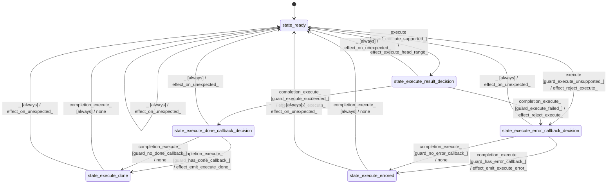

# kernel_attention

Source: [`emel/kernel/attention/sm.hpp`](https://github.com/stateforward/emel.cpp/blob/main/src/emel/kernel/attention/sm.hpp)

## Mermaid

## Transitions

| Source | Event | Guard | Action | Target |
| --- | --- | --- | --- | --- |
| [`state_ready`](https://github.com/stateforward/emel.cpp/blob/main/src/emel/kernel/attention/sm.hpp) | [`execute`](https://github.com/stateforward/emel.cpp/blob/main/src/emel/kernel/attention/sm.hpp) | [`guard_execute_supported>`](https://github.com/stateforward/emel.cpp/blob/main/src/emel/kernel/attention/sm.hpp) | [`effect_execute_head_range>`](https://github.com/stateforward/emel.cpp/blob/main/src/emel/kernel/attention/sm.hpp) | [`state_execute_result_decision`](https://github.com/stateforward/emel.cpp/blob/main/src/emel/kernel/attention/sm.hpp) |
| [`state_ready`](https://github.com/stateforward/emel.cpp/blob/main/src/emel/kernel/attention/sm.hpp) | [`execute`](https://github.com/stateforward/emel.cpp/blob/main/src/emel/kernel/attention/sm.hpp) | [`guard_execute_unsupported>`](https://github.com/stateforward/emel.cpp/blob/main/src/emel/kernel/attention/sm.hpp) | [`effect_reject_execute>`](https://github.com/stateforward/emel.cpp/blob/main/src/emel/kernel/attention/sm.hpp) | [`state_execute_error_callback_decision`](https://github.com/stateforward/emel.cpp/blob/main/src/emel/kernel/attention/sm.hpp) |
| [`state_execute_result_decision`](https://github.com/stateforward/emel.cpp/blob/main/src/emel/kernel/attention/sm.hpp) | [`completion<execute>`](https://github.com/stateforward/emel.cpp/blob/main/src/emel/kernel/attention/sm.hpp) | [`guard_execute_succeeded>`](https://github.com/stateforward/emel.cpp/blob/main/src/emel/kernel/attention/sm.hpp) | [`effect_accept_execute>`](https://github.com/stateforward/emel.cpp/blob/main/src/emel/kernel/attention/sm.hpp) | [`state_execute_done_callback_decision`](https://github.com/stateforward/emel.cpp/blob/main/src/emel/kernel/attention/sm.hpp) |
| [`state_execute_result_decision`](https://github.com/stateforward/emel.cpp/blob/main/src/emel/kernel/attention/sm.hpp) | [`completion<execute>`](https://github.com/stateforward/emel.cpp/blob/main/src/emel/kernel/attention/sm.hpp) | [`guard_execute_failed>`](https://github.com/stateforward/emel.cpp/blob/main/src/emel/kernel/attention/sm.hpp) | [`effect_reject_execute>`](https://github.com/stateforward/emel.cpp/blob/main/src/emel/kernel/attention/sm.hpp) | [`state_execute_error_callback_decision`](https://github.com/stateforward/emel.cpp/blob/main/src/emel/kernel/attention/sm.hpp) |
| [`state_execute_done_callback_decision`](https://github.com/stateforward/emel.cpp/blob/main/src/emel/kernel/attention/sm.hpp) | [`completion<execute>`](https://github.com/stateforward/emel.cpp/blob/main/src/emel/kernel/attention/sm.hpp) | [`guard_has_done_callback>`](https://github.com/stateforward/emel.cpp/blob/main/src/emel/kernel/attention/sm.hpp) | [`effect_emit_execute_done>`](https://github.com/stateforward/emel.cpp/blob/main/src/emel/kernel/attention/sm.hpp) | [`state_execute_done`](https://github.com/stateforward/emel.cpp/blob/main/src/emel/kernel/attention/sm.hpp) |
| [`state_execute_done_callback_decision`](https://github.com/stateforward/emel.cpp/blob/main/src/emel/kernel/attention/sm.hpp) | [`completion<execute>`](https://github.com/stateforward/emel.cpp/blob/main/src/emel/kernel/attention/sm.hpp) | [`guard_no_done_callback>`](https://github.com/stateforward/emel.cpp/blob/main/src/emel/kernel/attention/sm.hpp) | [`none`](https://github.com/stateforward/emel.cpp/blob/main/src/emel/kernel/attention/sm.hpp) | [`state_execute_done`](https://github.com/stateforward/emel.cpp/blob/main/src/emel/kernel/attention/sm.hpp) |
| [`state_execute_error_callback_decision`](https://github.com/stateforward/emel.cpp/blob/main/src/emel/kernel/attention/sm.hpp) | [`completion<execute>`](https://github.com/stateforward/emel.cpp/blob/main/src/emel/kernel/attention/sm.hpp) | [`guard_has_error_callback>`](https://github.com/stateforward/emel.cpp/blob/main/src/emel/kernel/attention/sm.hpp) | [`effect_emit_execute_error>`](https://github.com/stateforward/emel.cpp/blob/main/src/emel/kernel/attention/sm.hpp) | [`state_execute_errored`](https://github.com/stateforward/emel.cpp/blob/main/src/emel/kernel/attention/sm.hpp) |
| [`state_execute_error_callback_decision`](https://github.com/stateforward/emel.cpp/blob/main/src/emel/kernel/attention/sm.hpp) | [`completion<execute>`](https://github.com/stateforward/emel.cpp/blob/main/src/emel/kernel/attention/sm.hpp) | [`guard_no_error_callback>`](https://github.com/stateforward/emel.cpp/blob/main/src/emel/kernel/attention/sm.hpp) | [`none`](https://github.com/stateforward/emel.cpp/blob/main/src/emel/kernel/attention/sm.hpp) | [`state_execute_errored`](https://github.com/stateforward/emel.cpp/blob/main/src/emel/kernel/attention/sm.hpp) |
| [`state_execute_done`](https://github.com/stateforward/emel.cpp/blob/main/src/emel/kernel/attention/sm.hpp) | [`completion<execute>`](https://github.com/stateforward/emel.cpp/blob/main/src/emel/kernel/attention/sm.hpp) | [`always`](https://github.com/stateforward/emel.cpp/blob/main/src/emel/kernel/attention/sm.hpp) | [`none`](https://github.com/stateforward/emel.cpp/blob/main/src/emel/kernel/attention/sm.hpp) | [`state_ready`](https://github.com/stateforward/emel.cpp/blob/main/src/emel/kernel/attention/sm.hpp) |
| [`state_execute_errored`](https://github.com/stateforward/emel.cpp/blob/main/src/emel/kernel/attention/sm.hpp) | [`completion<execute>`](https://github.com/stateforward/emel.cpp/blob/main/src/emel/kernel/attention/sm.hpp) | [`always`](https://github.com/stateforward/emel.cpp/blob/main/src/emel/kernel/attention/sm.hpp) | [`none`](https://github.com/stateforward/emel.cpp/blob/main/src/emel/kernel/attention/sm.hpp) | [`state_ready`](https://github.com/stateforward/emel.cpp/blob/main/src/emel/kernel/attention/sm.hpp) |
| [`state_ready`](https://github.com/stateforward/emel.cpp/blob/main/src/emel/kernel/attention/sm.hpp) | [`_`](https://github.com/stateforward/emel.cpp/blob/main/src/emel/kernel/attention/sm.hpp) | [`always`](https://github.com/stateforward/emel.cpp/blob/main/src/emel/kernel/attention/sm.hpp) | [`effect_on_unexpected>`](https://github.com/stateforward/emel.cpp/blob/main/src/emel/kernel/attention/sm.hpp) | [`state_ready`](https://github.com/stateforward/emel.cpp/blob/main/src/emel/kernel/attention/sm.hpp) |
| [`state_execute_result_decision`](https://github.com/stateforward/emel.cpp/blob/main/src/emel/kernel/attention/sm.hpp) | [`_`](https://github.com/stateforward/emel.cpp/blob/main/src/emel/kernel/attention/sm.hpp) | [`always`](https://github.com/stateforward/emel.cpp/blob/main/src/emel/kernel/attention/sm.hpp) | [`effect_on_unexpected>`](https://github.com/stateforward/emel.cpp/blob/main/src/emel/kernel/attention/sm.hpp) | [`state_ready`](https://github.com/stateforward/emel.cpp/blob/main/src/emel/kernel/attention/sm.hpp) |
| [`state_execute_done_callback_decision`](https://github.com/stateforward/emel.cpp/blob/main/src/emel/kernel/attention/sm.hpp) | [`_`](https://github.com/stateforward/emel.cpp/blob/main/src/emel/kernel/attention/sm.hpp) | [`always`](https://github.com/stateforward/emel.cpp/blob/main/src/emel/kernel/attention/sm.hpp) | [`effect_on_unexpected>`](https://github.com/stateforward/emel.cpp/blob/main/src/emel/kernel/attention/sm.hpp) | [`state_ready`](https://github.com/stateforward/emel.cpp/blob/main/src/emel/kernel/attention/sm.hpp) |
| [`state_execute_error_callback_decision`](https://github.com/stateforward/emel.cpp/blob/main/src/emel/kernel/attention/sm.hpp) | [`_`](https://github.com/stateforward/emel.cpp/blob/main/src/emel/kernel/attention/sm.hpp) | [`always`](https://github.com/stateforward/emel.cpp/blob/main/src/emel/kernel/attention/sm.hpp) | [`effect_on_unexpected>`](https://github.com/stateforward/emel.cpp/blob/main/src/emel/kernel/attention/sm.hpp) | [`state_ready`](https://github.com/stateforward/emel.cpp/blob/main/src/emel/kernel/attention/sm.hpp) |
| [`state_execute_done`](https://github.com/stateforward/emel.cpp/blob/main/src/emel/kernel/attention/sm.hpp) | [`_`](https://github.com/stateforward/emel.cpp/blob/main/src/emel/kernel/attention/sm.hpp) | [`always`](https://github.com/stateforward/emel.cpp/blob/main/src/emel/kernel/attention/sm.hpp) | [`effect_on_unexpected>`](https://github.com/stateforward/emel.cpp/blob/main/src/emel/kernel/attention/sm.hpp) | [`state_ready`](https://github.com/stateforward/emel.cpp/blob/main/src/emel/kernel/attention/sm.hpp) |
| [`state_execute_errored`](https://github.com/stateforward/emel.cpp/blob/main/src/emel/kernel/attention/sm.hpp) | [`_`](https://github.com/stateforward/emel.cpp/blob/main/src/emel/kernel/attention/sm.hpp) | [`always`](https://github.com/stateforward/emel.cpp/blob/main/src/emel/kernel/attention/sm.hpp) | [`effect_on_unexpected>`](https://github.com/stateforward/emel.cpp/blob/main/src/emel/kernel/attention/sm.hpp) | [`state_ready`](https://github.com/stateforward/emel.cpp/blob/main/src/emel/kernel/attention/sm.hpp) |
