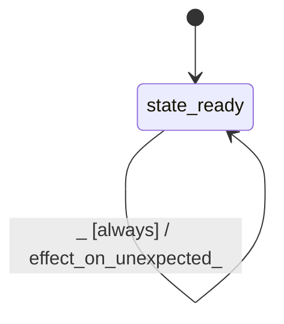

# kernel_cq

Source: [`emel/kernel/cq/sm.hpp`](https://github.com/stateforward/emel.cpp/blob/main/src/emel/kernel/cq/sm.hpp)

## Mermaid

## Transitions

| Source | Event | Guard | Action | Target |
| --- | --- | --- | --- | --- |
| [`state_ready`](https://github.com/stateforward/emel.cpp/blob/main/src/emel/kernel/cq/sm.hpp) | [`execute_avx2<2>`](https://github.com/stateforward/emel.cpp/blob/main/src/emel/kernel/cq/sm.hpp) | [`guard_execute_avx2<2>>`](https://github.com/stateforward/emel.cpp/blob/main/src/emel/kernel/cq/sm.hpp) | [`effect_execute_avx2<2>>`](https://github.com/stateforward/emel.cpp/blob/main/src/emel/kernel/cq/sm.hpp) | [`state_ready`](https://github.com/stateforward/emel.cpp/blob/main/src/emel/kernel/cq/sm.hpp) |
| [`state_ready`](https://github.com/stateforward/emel.cpp/blob/main/src/emel/kernel/cq/sm.hpp) | [`execute_avx2<3>`](https://github.com/stateforward/emel.cpp/blob/main/src/emel/kernel/cq/sm.hpp) | [`guard_execute_avx2<3>>`](https://github.com/stateforward/emel.cpp/blob/main/src/emel/kernel/cq/sm.hpp) | [`effect_execute_avx2<3>>`](https://github.com/stateforward/emel.cpp/blob/main/src/emel/kernel/cq/sm.hpp) | [`state_ready`](https://github.com/stateforward/emel.cpp/blob/main/src/emel/kernel/cq/sm.hpp) |
| [`state_ready`](https://github.com/stateforward/emel.cpp/blob/main/src/emel/kernel/cq/sm.hpp) | [`execute_avx2<4>`](https://github.com/stateforward/emel.cpp/blob/main/src/emel/kernel/cq/sm.hpp) | [`guard_execute_avx2<4>>`](https://github.com/stateforward/emel.cpp/blob/main/src/emel/kernel/cq/sm.hpp) | [`effect_execute_avx2<4>>`](https://github.com/stateforward/emel.cpp/blob/main/src/emel/kernel/cq/sm.hpp) | [`state_ready`](https://github.com/stateforward/emel.cpp/blob/main/src/emel/kernel/cq/sm.hpp) |
| [`state_ready`](https://github.com/stateforward/emel.cpp/blob/main/src/emel/kernel/cq/sm.hpp) | [`execute_scalar<2>`](https://github.com/stateforward/emel.cpp/blob/main/src/emel/kernel/cq/sm.hpp) | [`guard_execute_scalar<2>>`](https://github.com/stateforward/emel.cpp/blob/main/src/emel/kernel/cq/sm.hpp) | [`effect_execute_scalar<2>>`](https://github.com/stateforward/emel.cpp/blob/main/src/emel/kernel/cq/sm.hpp) | [`state_ready`](https://github.com/stateforward/emel.cpp/blob/main/src/emel/kernel/cq/sm.hpp) |
| [`state_ready`](https://github.com/stateforward/emel.cpp/blob/main/src/emel/kernel/cq/sm.hpp) | [`execute_scalar<3>`](https://github.com/stateforward/emel.cpp/blob/main/src/emel/kernel/cq/sm.hpp) | [`guard_execute_scalar<3>>`](https://github.com/stateforward/emel.cpp/blob/main/src/emel/kernel/cq/sm.hpp) | [`effect_execute_scalar<3>>`](https://github.com/stateforward/emel.cpp/blob/main/src/emel/kernel/cq/sm.hpp) | [`state_ready`](https://github.com/stateforward/emel.cpp/blob/main/src/emel/kernel/cq/sm.hpp) |
| [`state_ready`](https://github.com/stateforward/emel.cpp/blob/main/src/emel/kernel/cq/sm.hpp) | [`execute_scalar<4>`](https://github.com/stateforward/emel.cpp/blob/main/src/emel/kernel/cq/sm.hpp) | [`guard_execute_scalar<4>>`](https://github.com/stateforward/emel.cpp/blob/main/src/emel/kernel/cq/sm.hpp) | [`effect_execute_scalar<4>>`](https://github.com/stateforward/emel.cpp/blob/main/src/emel/kernel/cq/sm.hpp) | [`state_ready`](https://github.com/stateforward/emel.cpp/blob/main/src/emel/kernel/cq/sm.hpp) |
| [`state_ready`](https://github.com/stateforward/emel.cpp/blob/main/src/emel/kernel/cq/sm.hpp) | [`execute_scalar<5>`](https://github.com/stateforward/emel.cpp/blob/main/src/emel/kernel/cq/sm.hpp) | [`guard_execute_scalar<5>>`](https://github.com/stateforward/emel.cpp/blob/main/src/emel/kernel/cq/sm.hpp) | [`effect_execute_scalar<5>>`](https://github.com/stateforward/emel.cpp/blob/main/src/emel/kernel/cq/sm.hpp) | [`state_ready`](https://github.com/stateforward/emel.cpp/blob/main/src/emel/kernel/cq/sm.hpp) |
| [`state_ready`](https://github.com/stateforward/emel.cpp/blob/main/src/emel/kernel/cq/sm.hpp) | [`execute_scalar_rows<2>`](https://github.com/stateforward/emel.cpp/blob/main/src/emel/kernel/cq/sm.hpp) | [`guard_execute_scalar_rows<2>>`](https://github.com/stateforward/emel.cpp/blob/main/src/emel/kernel/cq/sm.hpp) | [`effect_execute_scalar_rows<2>>`](https://github.com/stateforward/emel.cpp/blob/main/src/emel/kernel/cq/sm.hpp) | [`state_ready`](https://github.com/stateforward/emel.cpp/blob/main/src/emel/kernel/cq/sm.hpp) |
| [`state_ready`](https://github.com/stateforward/emel.cpp/blob/main/src/emel/kernel/cq/sm.hpp) | [`execute_scalar_rows<3>`](https://github.com/stateforward/emel.cpp/blob/main/src/emel/kernel/cq/sm.hpp) | [`guard_execute_scalar_rows<3>>`](https://github.com/stateforward/emel.cpp/blob/main/src/emel/kernel/cq/sm.hpp) | [`effect_execute_scalar_rows<3>>`](https://github.com/stateforward/emel.cpp/blob/main/src/emel/kernel/cq/sm.hpp) | [`state_ready`](https://github.com/stateforward/emel.cpp/blob/main/src/emel/kernel/cq/sm.hpp) |
| [`state_ready`](https://github.com/stateforward/emel.cpp/blob/main/src/emel/kernel/cq/sm.hpp) | [`execute_scalar_rows<4>`](https://github.com/stateforward/emel.cpp/blob/main/src/emel/kernel/cq/sm.hpp) | [`guard_execute_scalar_rows<4>>`](https://github.com/stateforward/emel.cpp/blob/main/src/emel/kernel/cq/sm.hpp) | [`effect_execute_scalar_rows<4>>`](https://github.com/stateforward/emel.cpp/blob/main/src/emel/kernel/cq/sm.hpp) | [`state_ready`](https://github.com/stateforward/emel.cpp/blob/main/src/emel/kernel/cq/sm.hpp) |
| [`state_ready`](https://github.com/stateforward/emel.cpp/blob/main/src/emel/kernel/cq/sm.hpp) | [`execute_scalar_dequant<2>`](https://github.com/stateforward/emel.cpp/blob/main/src/emel/kernel/cq/sm.hpp) | [`guard_execute_scalar_dequant<2>>`](https://github.com/stateforward/emel.cpp/blob/main/src/emel/kernel/cq/sm.hpp) | [`effect_execute_scalar_dequant<2>>`](https://github.com/stateforward/emel.cpp/blob/main/src/emel/kernel/cq/sm.hpp) | [`state_ready`](https://github.com/stateforward/emel.cpp/blob/main/src/emel/kernel/cq/sm.hpp) |
| [`state_ready`](https://github.com/stateforward/emel.cpp/blob/main/src/emel/kernel/cq/sm.hpp) | [`execute_scalar_dequant<3>`](https://github.com/stateforward/emel.cpp/blob/main/src/emel/kernel/cq/sm.hpp) | [`guard_execute_scalar_dequant<3>>`](https://github.com/stateforward/emel.cpp/blob/main/src/emel/kernel/cq/sm.hpp) | [`effect_execute_scalar_dequant<3>>`](https://github.com/stateforward/emel.cpp/blob/main/src/emel/kernel/cq/sm.hpp) | [`state_ready`](https://github.com/stateforward/emel.cpp/blob/main/src/emel/kernel/cq/sm.hpp) |
| [`state_ready`](https://github.com/stateforward/emel.cpp/blob/main/src/emel/kernel/cq/sm.hpp) | [`execute_scalar_dequant<4>`](https://github.com/stateforward/emel.cpp/blob/main/src/emel/kernel/cq/sm.hpp) | [`guard_execute_scalar_dequant<4>>`](https://github.com/stateforward/emel.cpp/blob/main/src/emel/kernel/cq/sm.hpp) | [`effect_execute_scalar_dequant<4>>`](https://github.com/stateforward/emel.cpp/blob/main/src/emel/kernel/cq/sm.hpp) | [`state_ready`](https://github.com/stateforward/emel.cpp/blob/main/src/emel/kernel/cq/sm.hpp) |
| [`state_ready`](https://github.com/stateforward/emel.cpp/blob/main/src/emel/kernel/cq/sm.hpp) | [`capture_diagnostics`](https://github.com/stateforward/emel.cpp/blob/main/src/emel/kernel/cq/sm.hpp) | [`always`](https://github.com/stateforward/emel.cpp/blob/main/src/emel/kernel/cq/sm.hpp) | [`effect_capture_diagnostics>`](https://github.com/stateforward/emel.cpp/blob/main/src/emel/kernel/cq/sm.hpp) | [`state_ready`](https://github.com/stateforward/emel.cpp/blob/main/src/emel/kernel/cq/sm.hpp) |
| [`state_ready`](https://github.com/stateforward/emel.cpp/blob/main/src/emel/kernel/cq/sm.hpp) | [`_`](https://github.com/stateforward/emel.cpp/blob/main/src/emel/kernel/cq/sm.hpp) | [`always`](https://github.com/stateforward/emel.cpp/blob/main/src/emel/kernel/cq/sm.hpp) | [`effect_on_unexpected>`](https://github.com/stateforward/emel.cpp/blob/main/src/emel/kernel/cq/sm.hpp) | [`state_ready`](https://github.com/stateforward/emel.cpp/blob/main/src/emel/kernel/cq/sm.hpp) |
