# kernel_f32_matvec

Source: [`emel/kernel/f32_matvec/sm.hpp`](https://github.com/stateforward/emel.cpp/blob/main/src/emel/kernel/f32_matvec/sm.hpp)

## Mermaid

```mermaid
stateDiagram-v2
  direction TB
  [*] --> state_ready
  state_ready --> state_prepare_f32_result_decision : prepare_f32 [guard_prepare_f32_supported_] / effect_prepare_f32_
  state_ready --> state_error_callback_decision : prepare_f32 [guard_prepare_f32_unsupported_] / effect_reject_prepare_f32_
  state_prepare_f32_result_decision --> state_done_callback_decision : completion_prepare_f32_ [guard_prepare_f32_succeeded_] / effect_accept_prepare_f32_
  state_prepare_f32_result_decision --> state_error_callback_decision : completion_prepare_f32_ [guard_prepare_f32_failed_] / effect_reject_prepare_f32_
  state_ready --> state_prepare_f16_result_decision : prepare_f16 [guard_prepare_f16_supported_] / effect_prepare_f16_
  state_ready --> state_error_callback_decision : prepare_f16 [guard_prepare_f16_unsupported_] / effect_reject_prepare_f16_
  state_prepare_f16_result_decision --> state_done_callback_decision : completion_prepare_f16_ [guard_prepare_f16_succeeded_] / effect_accept_prepare_f16_
  state_prepare_f16_result_decision --> state_error_callback_decision : completion_prepare_f16_ [guard_prepare_f16_failed_] / effect_reject_prepare_f16_
  state_ready --> state_reference_result_decision : execute_reference [guard_execute_reference_supported_] / effect_execute_reference_
  state_ready --> state_error_callback_decision : execute_reference [guard_execute_reference_unsupported_] / effect_reject_execute_reference_
  state_reference_result_decision --> state_done_callback_decision : completion_execute_reference_ [guard_execute_reference_succeeded_] / effect_accept_execute_reference_
  state_reference_result_decision --> state_error_callback_decision : completion_execute_reference_ [guard_execute_reference_failed_] / effect_reject_execute_reference_
  state_ready --> state_exact_x4_result_decision : execute_exact_x4 [guard_execute_exact_x4_supported_] / effect_execute_exact_x4_
  state_ready --> state_error_callback_decision : execute_exact_x4 [guard_execute_exact_x4_unsupported_] / effect_reject_execute_exact_x4_
  state_exact_x4_result_decision --> state_done_callback_decision : completion_execute_exact_x4_ [guard_execute_exact_x4_succeeded_] / effect_accept_execute_exact_x4_
  state_exact_x4_result_decision --> state_error_callback_decision : completion_execute_exact_x4_ [guard_execute_exact_x4_failed_] / effect_reject_execute_exact_x4_
  state_done_callback_decision --> state_done : completion_prepare_f32_ [guard_prepare_f32_has_done_callback_] / effect_emit_prepare_f32_done_
  state_done_callback_decision --> state_done : completion_prepare_f32_ [guard_prepare_f32_no_done_callback_] / none
  state_error_callback_decision --> state_errored : completion_prepare_f32_ [guard_prepare_f32_has_error_callback_] / effect_emit_prepare_f32_error_
  state_error_callback_decision --> state_errored : completion_prepare_f32_ [guard_prepare_f32_no_error_callback_] / none
  state_done_callback_decision --> state_done : completion_prepare_f16_ [guard_prepare_f16_has_done_callback_] / effect_emit_prepare_f16_done_
  state_done_callback_decision --> state_done : completion_prepare_f16_ [guard_prepare_f16_no_done_callback_] / none
  state_error_callback_decision --> state_errored : completion_prepare_f16_ [guard_prepare_f16_has_error_callback_] / effect_emit_prepare_f16_error_
  state_error_callback_decision --> state_errored : completion_prepare_f16_ [guard_prepare_f16_no_error_callback_] / none
  state_done_callback_decision --> state_done : completion_execute_reference_ [guard_execute_reference_has_done_callback_] / effect_emit_execute_reference_done_
  state_done_callback_decision --> state_done : completion_execute_reference_ [guard_execute_reference_no_done_callback_] / none
  state_error_callback_decision --> state_errored : completion_execute_reference_ [guard_execute_reference_has_error_callback_] / effect_emit_execute_reference_error_
  state_error_callback_decision --> state_errored : completion_execute_reference_ [guard_execute_reference_no_error_callback_] / none
  state_done_callback_decision --> state_done : completion_execute_exact_x4_ [guard_execute_exact_x4_has_done_callback_] / effect_emit_execute_exact_x4_done_
  state_done_callback_decision --> state_done : completion_execute_exact_x4_ [guard_execute_exact_x4_no_done_callback_] / none
  state_error_callback_decision --> state_errored : completion_execute_exact_x4_ [guard_execute_exact_x4_has_error_callback_] / effect_emit_execute_exact_x4_error_
  state_error_callback_decision --> state_errored : completion_execute_exact_x4_ [guard_execute_exact_x4_no_error_callback_] / none
  state_done --> state_ready : completion_prepare_f32_ [always] / none
  state_done --> state_ready : completion_prepare_f16_ [always] / none
  state_done --> state_ready : completion_execute_reference_ [always] / none
  state_done --> state_ready : completion_execute_exact_x4_ [always] / none
  state_errored --> state_ready : completion_prepare_f32_ [always] / none
  state_errored --> state_ready : completion_prepare_f16_ [always] / none
  state_errored --> state_ready : completion_execute_reference_ [always] / none
  state_errored --> state_ready : completion_execute_exact_x4_ [always] / none
  state_ready --> state_ready : capture_diagnostics [always] / effect_capture_diagnostics_
  state_ready --> state_ready : _ [always] / effect_on_unexpected_
  state_done_callback_decision --> state_ready : _ [always] / effect_on_unexpected_
  state_error_callback_decision --> state_ready : _ [always] / effect_on_unexpected_
  state_done --> state_ready : _ [always] / effect_on_unexpected_
  state_errored --> state_ready : _ [always] / effect_on_unexpected_
```

## Transitions

| Source | Event | Guard | Action | Target |
| --- | --- | --- | --- | --- |
| [`state_ready`](https://github.com/stateforward/emel.cpp/blob/main/src/emel/kernel/f32_matvec/sm.hpp) | [`prepare_f32`](https://github.com/stateforward/emel.cpp/blob/main/src/emel/kernel/f32_matvec/sm.hpp) | [`guard_prepare_f32_supported>`](https://github.com/stateforward/emel.cpp/blob/main/src/emel/kernel/f32_matvec/sm.hpp) | [`effect_prepare_f32>`](https://github.com/stateforward/emel.cpp/blob/main/src/emel/kernel/f32_matvec/sm.hpp) | [`state_prepare_f32_result_decision`](https://github.com/stateforward/emel.cpp/blob/main/src/emel/kernel/f32_matvec/sm.hpp) |
| [`state_ready`](https://github.com/stateforward/emel.cpp/blob/main/src/emel/kernel/f32_matvec/sm.hpp) | [`prepare_f32`](https://github.com/stateforward/emel.cpp/blob/main/src/emel/kernel/f32_matvec/sm.hpp) | [`guard_prepare_f32_unsupported>`](https://github.com/stateforward/emel.cpp/blob/main/src/emel/kernel/f32_matvec/sm.hpp) | [`effect_reject_prepare_f32>`](https://github.com/stateforward/emel.cpp/blob/main/src/emel/kernel/f32_matvec/sm.hpp) | [`state_error_callback_decision`](https://github.com/stateforward/emel.cpp/blob/main/src/emel/kernel/f32_matvec/sm.hpp) |
| [`state_prepare_f32_result_decision`](https://github.com/stateforward/emel.cpp/blob/main/src/emel/kernel/f32_matvec/sm.hpp) | [`completion<prepare_f32>`](https://github.com/stateforward/emel.cpp/blob/main/src/emel/kernel/f32_matvec/sm.hpp) | [`guard_prepare_f32_succeeded>`](https://github.com/stateforward/emel.cpp/blob/main/src/emel/kernel/f32_matvec/sm.hpp) | [`effect_accept_prepare_f32>`](https://github.com/stateforward/emel.cpp/blob/main/src/emel/kernel/f32_matvec/sm.hpp) | [`state_done_callback_decision`](https://github.com/stateforward/emel.cpp/blob/main/src/emel/kernel/f32_matvec/sm.hpp) |
| [`state_prepare_f32_result_decision`](https://github.com/stateforward/emel.cpp/blob/main/src/emel/kernel/f32_matvec/sm.hpp) | [`completion<prepare_f32>`](https://github.com/stateforward/emel.cpp/blob/main/src/emel/kernel/f32_matvec/sm.hpp) | [`guard_prepare_f32_failed>`](https://github.com/stateforward/emel.cpp/blob/main/src/emel/kernel/f32_matvec/sm.hpp) | [`effect_reject_prepare_f32>`](https://github.com/stateforward/emel.cpp/blob/main/src/emel/kernel/f32_matvec/sm.hpp) | [`state_error_callback_decision`](https://github.com/stateforward/emel.cpp/blob/main/src/emel/kernel/f32_matvec/sm.hpp) |
| [`state_ready`](https://github.com/stateforward/emel.cpp/blob/main/src/emel/kernel/f32_matvec/sm.hpp) | [`prepare_f16`](https://github.com/stateforward/emel.cpp/blob/main/src/emel/kernel/f32_matvec/sm.hpp) | [`guard_prepare_f16_supported>`](https://github.com/stateforward/emel.cpp/blob/main/src/emel/kernel/f32_matvec/sm.hpp) | [`effect_prepare_f16>`](https://github.com/stateforward/emel.cpp/blob/main/src/emel/kernel/f32_matvec/sm.hpp) | [`state_prepare_f16_result_decision`](https://github.com/stateforward/emel.cpp/blob/main/src/emel/kernel/f32_matvec/sm.hpp) |
| [`state_ready`](https://github.com/stateforward/emel.cpp/blob/main/src/emel/kernel/f32_matvec/sm.hpp) | [`prepare_f16`](https://github.com/stateforward/emel.cpp/blob/main/src/emel/kernel/f32_matvec/sm.hpp) | [`guard_prepare_f16_unsupported>`](https://github.com/stateforward/emel.cpp/blob/main/src/emel/kernel/f32_matvec/sm.hpp) | [`effect_reject_prepare_f16>`](https://github.com/stateforward/emel.cpp/blob/main/src/emel/kernel/f32_matvec/sm.hpp) | [`state_error_callback_decision`](https://github.com/stateforward/emel.cpp/blob/main/src/emel/kernel/f32_matvec/sm.hpp) |
| [`state_prepare_f16_result_decision`](https://github.com/stateforward/emel.cpp/blob/main/src/emel/kernel/f32_matvec/sm.hpp) | [`completion<prepare_f16>`](https://github.com/stateforward/emel.cpp/blob/main/src/emel/kernel/f32_matvec/sm.hpp) | [`guard_prepare_f16_succeeded>`](https://github.com/stateforward/emel.cpp/blob/main/src/emel/kernel/f32_matvec/sm.hpp) | [`effect_accept_prepare_f16>`](https://github.com/stateforward/emel.cpp/blob/main/src/emel/kernel/f32_matvec/sm.hpp) | [`state_done_callback_decision`](https://github.com/stateforward/emel.cpp/blob/main/src/emel/kernel/f32_matvec/sm.hpp) |
| [`state_prepare_f16_result_decision`](https://github.com/stateforward/emel.cpp/blob/main/src/emel/kernel/f32_matvec/sm.hpp) | [`completion<prepare_f16>`](https://github.com/stateforward/emel.cpp/blob/main/src/emel/kernel/f32_matvec/sm.hpp) | [`guard_prepare_f16_failed>`](https://github.com/stateforward/emel.cpp/blob/main/src/emel/kernel/f32_matvec/sm.hpp) | [`effect_reject_prepare_f16>`](https://github.com/stateforward/emel.cpp/blob/main/src/emel/kernel/f32_matvec/sm.hpp) | [`state_error_callback_decision`](https://github.com/stateforward/emel.cpp/blob/main/src/emel/kernel/f32_matvec/sm.hpp) |
| [`state_ready`](https://github.com/stateforward/emel.cpp/blob/main/src/emel/kernel/f32_matvec/sm.hpp) | [`execute_reference`](https://github.com/stateforward/emel.cpp/blob/main/src/emel/kernel/f32_matvec/sm.hpp) | [`guard_execute_reference_supported>`](https://github.com/stateforward/emel.cpp/blob/main/src/emel/kernel/f32_matvec/sm.hpp) | [`effect_execute_reference>`](https://github.com/stateforward/emel.cpp/blob/main/src/emel/kernel/f32_matvec/sm.hpp) | [`state_reference_result_decision`](https://github.com/stateforward/emel.cpp/blob/main/src/emel/kernel/f32_matvec/sm.hpp) |
| [`state_ready`](https://github.com/stateforward/emel.cpp/blob/main/src/emel/kernel/f32_matvec/sm.hpp) | [`execute_reference`](https://github.com/stateforward/emel.cpp/blob/main/src/emel/kernel/f32_matvec/sm.hpp) | [`guard_execute_reference_unsupported>`](https://github.com/stateforward/emel.cpp/blob/main/src/emel/kernel/f32_matvec/sm.hpp) | [`effect_reject_execute_reference>`](https://github.com/stateforward/emel.cpp/blob/main/src/emel/kernel/f32_matvec/sm.hpp) | [`state_error_callback_decision`](https://github.com/stateforward/emel.cpp/blob/main/src/emel/kernel/f32_matvec/sm.hpp) |
| [`state_reference_result_decision`](https://github.com/stateforward/emel.cpp/blob/main/src/emel/kernel/f32_matvec/sm.hpp) | [`completion<execute_reference>`](https://github.com/stateforward/emel.cpp/blob/main/src/emel/kernel/f32_matvec/sm.hpp) | [`guard_execute_reference_succeeded>`](https://github.com/stateforward/emel.cpp/blob/main/src/emel/kernel/f32_matvec/sm.hpp) | [`effect_accept_execute_reference>`](https://github.com/stateforward/emel.cpp/blob/main/src/emel/kernel/f32_matvec/sm.hpp) | [`state_done_callback_decision`](https://github.com/stateforward/emel.cpp/blob/main/src/emel/kernel/f32_matvec/sm.hpp) |
| [`state_reference_result_decision`](https://github.com/stateforward/emel.cpp/blob/main/src/emel/kernel/f32_matvec/sm.hpp) | [`completion<execute_reference>`](https://github.com/stateforward/emel.cpp/blob/main/src/emel/kernel/f32_matvec/sm.hpp) | [`guard_execute_reference_failed>`](https://github.com/stateforward/emel.cpp/blob/main/src/emel/kernel/f32_matvec/sm.hpp) | [`effect_reject_execute_reference>`](https://github.com/stateforward/emel.cpp/blob/main/src/emel/kernel/f32_matvec/sm.hpp) | [`state_error_callback_decision`](https://github.com/stateforward/emel.cpp/blob/main/src/emel/kernel/f32_matvec/sm.hpp) |
| [`state_ready`](https://github.com/stateforward/emel.cpp/blob/main/src/emel/kernel/f32_matvec/sm.hpp) | [`execute_exact_x4`](https://github.com/stateforward/emel.cpp/blob/main/src/emel/kernel/f32_matvec/sm.hpp) | [`guard_execute_exact_x4_supported>`](https://github.com/stateforward/emel.cpp/blob/main/src/emel/kernel/f32_matvec/sm.hpp) | [`effect_execute_exact_x4>`](https://github.com/stateforward/emel.cpp/blob/main/src/emel/kernel/f32_matvec/sm.hpp) | [`state_exact_x4_result_decision`](https://github.com/stateforward/emel.cpp/blob/main/src/emel/kernel/f32_matvec/sm.hpp) |
| [`state_ready`](https://github.com/stateforward/emel.cpp/blob/main/src/emel/kernel/f32_matvec/sm.hpp) | [`execute_exact_x4`](https://github.com/stateforward/emel.cpp/blob/main/src/emel/kernel/f32_matvec/sm.hpp) | [`guard_execute_exact_x4_unsupported>`](https://github.com/stateforward/emel.cpp/blob/main/src/emel/kernel/f32_matvec/sm.hpp) | [`effect_reject_execute_exact_x4>`](https://github.com/stateforward/emel.cpp/blob/main/src/emel/kernel/f32_matvec/sm.hpp) | [`state_error_callback_decision`](https://github.com/stateforward/emel.cpp/blob/main/src/emel/kernel/f32_matvec/sm.hpp) |
| [`state_exact_x4_result_decision`](https://github.com/stateforward/emel.cpp/blob/main/src/emel/kernel/f32_matvec/sm.hpp) | [`completion<execute_exact_x4>`](https://github.com/stateforward/emel.cpp/blob/main/src/emel/kernel/f32_matvec/sm.hpp) | [`guard_execute_exact_x4_succeeded>`](https://github.com/stateforward/emel.cpp/blob/main/src/emel/kernel/f32_matvec/sm.hpp) | [`effect_accept_execute_exact_x4>`](https://github.com/stateforward/emel.cpp/blob/main/src/emel/kernel/f32_matvec/sm.hpp) | [`state_done_callback_decision`](https://github.com/stateforward/emel.cpp/blob/main/src/emel/kernel/f32_matvec/sm.hpp) |
| [`state_exact_x4_result_decision`](https://github.com/stateforward/emel.cpp/blob/main/src/emel/kernel/f32_matvec/sm.hpp) | [`completion<execute_exact_x4>`](https://github.com/stateforward/emel.cpp/blob/main/src/emel/kernel/f32_matvec/sm.hpp) | [`guard_execute_exact_x4_failed>`](https://github.com/stateforward/emel.cpp/blob/main/src/emel/kernel/f32_matvec/sm.hpp) | [`effect_reject_execute_exact_x4>`](https://github.com/stateforward/emel.cpp/blob/main/src/emel/kernel/f32_matvec/sm.hpp) | [`state_error_callback_decision`](https://github.com/stateforward/emel.cpp/blob/main/src/emel/kernel/f32_matvec/sm.hpp) |
| [`state_done_callback_decision`](https://github.com/stateforward/emel.cpp/blob/main/src/emel/kernel/f32_matvec/sm.hpp) | [`completion<prepare_f32>`](https://github.com/stateforward/emel.cpp/blob/main/src/emel/kernel/f32_matvec/sm.hpp) | [`guard_prepare_f32_has_done_callback>`](https://github.com/stateforward/emel.cpp/blob/main/src/emel/kernel/f32_matvec/sm.hpp) | [`effect_emit_prepare_f32_done>`](https://github.com/stateforward/emel.cpp/blob/main/src/emel/kernel/f32_matvec/sm.hpp) | [`state_done`](https://github.com/stateforward/emel.cpp/blob/main/src/emel/kernel/f32_matvec/sm.hpp) |
| [`state_done_callback_decision`](https://github.com/stateforward/emel.cpp/blob/main/src/emel/kernel/f32_matvec/sm.hpp) | [`completion<prepare_f32>`](https://github.com/stateforward/emel.cpp/blob/main/src/emel/kernel/f32_matvec/sm.hpp) | [`guard_prepare_f32_no_done_callback>`](https://github.com/stateforward/emel.cpp/blob/main/src/emel/kernel/f32_matvec/sm.hpp) | [`none`](https://github.com/stateforward/emel.cpp/blob/main/src/emel/kernel/f32_matvec/sm.hpp) | [`state_done`](https://github.com/stateforward/emel.cpp/blob/main/src/emel/kernel/f32_matvec/sm.hpp) |
| [`state_error_callback_decision`](https://github.com/stateforward/emel.cpp/blob/main/src/emel/kernel/f32_matvec/sm.hpp) | [`completion<prepare_f32>`](https://github.com/stateforward/emel.cpp/blob/main/src/emel/kernel/f32_matvec/sm.hpp) | [`guard_prepare_f32_has_error_callback>`](https://github.com/stateforward/emel.cpp/blob/main/src/emel/kernel/f32_matvec/sm.hpp) | [`effect_emit_prepare_f32_error>`](https://github.com/stateforward/emel.cpp/blob/main/src/emel/kernel/f32_matvec/sm.hpp) | [`state_errored`](https://github.com/stateforward/emel.cpp/blob/main/src/emel/kernel/f32_matvec/sm.hpp) |
| [`state_error_callback_decision`](https://github.com/stateforward/emel.cpp/blob/main/src/emel/kernel/f32_matvec/sm.hpp) | [`completion<prepare_f32>`](https://github.com/stateforward/emel.cpp/blob/main/src/emel/kernel/f32_matvec/sm.hpp) | [`guard_prepare_f32_no_error_callback>`](https://github.com/stateforward/emel.cpp/blob/main/src/emel/kernel/f32_matvec/sm.hpp) | [`none`](https://github.com/stateforward/emel.cpp/blob/main/src/emel/kernel/f32_matvec/sm.hpp) | [`state_errored`](https://github.com/stateforward/emel.cpp/blob/main/src/emel/kernel/f32_matvec/sm.hpp) |
| [`state_done_callback_decision`](https://github.com/stateforward/emel.cpp/blob/main/src/emel/kernel/f32_matvec/sm.hpp) | [`completion<prepare_f16>`](https://github.com/stateforward/emel.cpp/blob/main/src/emel/kernel/f32_matvec/sm.hpp) | [`guard_prepare_f16_has_done_callback>`](https://github.com/stateforward/emel.cpp/blob/main/src/emel/kernel/f32_matvec/sm.hpp) | [`effect_emit_prepare_f16_done>`](https://github.com/stateforward/emel.cpp/blob/main/src/emel/kernel/f32_matvec/sm.hpp) | [`state_done`](https://github.com/stateforward/emel.cpp/blob/main/src/emel/kernel/f32_matvec/sm.hpp) |
| [`state_done_callback_decision`](https://github.com/stateforward/emel.cpp/blob/main/src/emel/kernel/f32_matvec/sm.hpp) | [`completion<prepare_f16>`](https://github.com/stateforward/emel.cpp/blob/main/src/emel/kernel/f32_matvec/sm.hpp) | [`guard_prepare_f16_no_done_callback>`](https://github.com/stateforward/emel.cpp/blob/main/src/emel/kernel/f32_matvec/sm.hpp) | [`none`](https://github.com/stateforward/emel.cpp/blob/main/src/emel/kernel/f32_matvec/sm.hpp) | [`state_done`](https://github.com/stateforward/emel.cpp/blob/main/src/emel/kernel/f32_matvec/sm.hpp) |
| [`state_error_callback_decision`](https://github.com/stateforward/emel.cpp/blob/main/src/emel/kernel/f32_matvec/sm.hpp) | [`completion<prepare_f16>`](https://github.com/stateforward/emel.cpp/blob/main/src/emel/kernel/f32_matvec/sm.hpp) | [`guard_prepare_f16_has_error_callback>`](https://github.com/stateforward/emel.cpp/blob/main/src/emel/kernel/f32_matvec/sm.hpp) | [`effect_emit_prepare_f16_error>`](https://github.com/stateforward/emel.cpp/blob/main/src/emel/kernel/f32_matvec/sm.hpp) | [`state_errored`](https://github.com/stateforward/emel.cpp/blob/main/src/emel/kernel/f32_matvec/sm.hpp) |
| [`state_error_callback_decision`](https://github.com/stateforward/emel.cpp/blob/main/src/emel/kernel/f32_matvec/sm.hpp) | [`completion<prepare_f16>`](https://github.com/stateforward/emel.cpp/blob/main/src/emel/kernel/f32_matvec/sm.hpp) | [`guard_prepare_f16_no_error_callback>`](https://github.com/stateforward/emel.cpp/blob/main/src/emel/kernel/f32_matvec/sm.hpp) | [`none`](https://github.com/stateforward/emel.cpp/blob/main/src/emel/kernel/f32_matvec/sm.hpp) | [`state_errored`](https://github.com/stateforward/emel.cpp/blob/main/src/emel/kernel/f32_matvec/sm.hpp) |
| [`state_done_callback_decision`](https://github.com/stateforward/emel.cpp/blob/main/src/emel/kernel/f32_matvec/sm.hpp) | [`completion<execute_reference>`](https://github.com/stateforward/emel.cpp/blob/main/src/emel/kernel/f32_matvec/sm.hpp) | [`guard_execute_reference_has_done_callback>`](https://github.com/stateforward/emel.cpp/blob/main/src/emel/kernel/f32_matvec/sm.hpp) | [`effect_emit_execute_reference_done>`](https://github.com/stateforward/emel.cpp/blob/main/src/emel/kernel/f32_matvec/sm.hpp) | [`state_done`](https://github.com/stateforward/emel.cpp/blob/main/src/emel/kernel/f32_matvec/sm.hpp) |
| [`state_done_callback_decision`](https://github.com/stateforward/emel.cpp/blob/main/src/emel/kernel/f32_matvec/sm.hpp) | [`completion<execute_reference>`](https://github.com/stateforward/emel.cpp/blob/main/src/emel/kernel/f32_matvec/sm.hpp) | [`guard_execute_reference_no_done_callback>`](https://github.com/stateforward/emel.cpp/blob/main/src/emel/kernel/f32_matvec/sm.hpp) | [`none`](https://github.com/stateforward/emel.cpp/blob/main/src/emel/kernel/f32_matvec/sm.hpp) | [`state_done`](https://github.com/stateforward/emel.cpp/blob/main/src/emel/kernel/f32_matvec/sm.hpp) |
| [`state_error_callback_decision`](https://github.com/stateforward/emel.cpp/blob/main/src/emel/kernel/f32_matvec/sm.hpp) | [`completion<execute_reference>`](https://github.com/stateforward/emel.cpp/blob/main/src/emel/kernel/f32_matvec/sm.hpp) | [`guard_execute_reference_has_error_callback>`](https://github.com/stateforward/emel.cpp/blob/main/src/emel/kernel/f32_matvec/sm.hpp) | [`effect_emit_execute_reference_error>`](https://github.com/stateforward/emel.cpp/blob/main/src/emel/kernel/f32_matvec/sm.hpp) | [`state_errored`](https://github.com/stateforward/emel.cpp/blob/main/src/emel/kernel/f32_matvec/sm.hpp) |
| [`state_error_callback_decision`](https://github.com/stateforward/emel.cpp/blob/main/src/emel/kernel/f32_matvec/sm.hpp) | [`completion<execute_reference>`](https://github.com/stateforward/emel.cpp/blob/main/src/emel/kernel/f32_matvec/sm.hpp) | [`guard_execute_reference_no_error_callback>`](https://github.com/stateforward/emel.cpp/blob/main/src/emel/kernel/f32_matvec/sm.hpp) | [`none`](https://github.com/stateforward/emel.cpp/blob/main/src/emel/kernel/f32_matvec/sm.hpp) | [`state_errored`](https://github.com/stateforward/emel.cpp/blob/main/src/emel/kernel/f32_matvec/sm.hpp) |
| [`state_done_callback_decision`](https://github.com/stateforward/emel.cpp/blob/main/src/emel/kernel/f32_matvec/sm.hpp) | [`completion<execute_exact_x4>`](https://github.com/stateforward/emel.cpp/blob/main/src/emel/kernel/f32_matvec/sm.hpp) | [`guard_execute_exact_x4_has_done_callback>`](https://github.com/stateforward/emel.cpp/blob/main/src/emel/kernel/f32_matvec/sm.hpp) | [`effect_emit_execute_exact_x4_done>`](https://github.com/stateforward/emel.cpp/blob/main/src/emel/kernel/f32_matvec/sm.hpp) | [`state_done`](https://github.com/stateforward/emel.cpp/blob/main/src/emel/kernel/f32_matvec/sm.hpp) |
| [`state_done_callback_decision`](https://github.com/stateforward/emel.cpp/blob/main/src/emel/kernel/f32_matvec/sm.hpp) | [`completion<execute_exact_x4>`](https://github.com/stateforward/emel.cpp/blob/main/src/emel/kernel/f32_matvec/sm.hpp) | [`guard_execute_exact_x4_no_done_callback>`](https://github.com/stateforward/emel.cpp/blob/main/src/emel/kernel/f32_matvec/sm.hpp) | [`none`](https://github.com/stateforward/emel.cpp/blob/main/src/emel/kernel/f32_matvec/sm.hpp) | [`state_done`](https://github.com/stateforward/emel.cpp/blob/main/src/emel/kernel/f32_matvec/sm.hpp) |
| [`state_error_callback_decision`](https://github.com/stateforward/emel.cpp/blob/main/src/emel/kernel/f32_matvec/sm.hpp) | [`completion<execute_exact_x4>`](https://github.com/stateforward/emel.cpp/blob/main/src/emel/kernel/f32_matvec/sm.hpp) | [`guard_execute_exact_x4_has_error_callback>`](https://github.com/stateforward/emel.cpp/blob/main/src/emel/kernel/f32_matvec/sm.hpp) | [`effect_emit_execute_exact_x4_error>`](https://github.com/stateforward/emel.cpp/blob/main/src/emel/kernel/f32_matvec/sm.hpp) | [`state_errored`](https://github.com/stateforward/emel.cpp/blob/main/src/emel/kernel/f32_matvec/sm.hpp) |
| [`state_error_callback_decision`](https://github.com/stateforward/emel.cpp/blob/main/src/emel/kernel/f32_matvec/sm.hpp) | [`completion<execute_exact_x4>`](https://github.com/stateforward/emel.cpp/blob/main/src/emel/kernel/f32_matvec/sm.hpp) | [`guard_execute_exact_x4_no_error_callback>`](https://github.com/stateforward/emel.cpp/blob/main/src/emel/kernel/f32_matvec/sm.hpp) | [`none`](https://github.com/stateforward/emel.cpp/blob/main/src/emel/kernel/f32_matvec/sm.hpp) | [`state_errored`](https://github.com/stateforward/emel.cpp/blob/main/src/emel/kernel/f32_matvec/sm.hpp) |
| [`state_done`](https://github.com/stateforward/emel.cpp/blob/main/src/emel/kernel/f32_matvec/sm.hpp) | [`completion<prepare_f32>`](https://github.com/stateforward/emel.cpp/blob/main/src/emel/kernel/f32_matvec/sm.hpp) | [`always`](https://github.com/stateforward/emel.cpp/blob/main/src/emel/kernel/f32_matvec/sm.hpp) | [`none`](https://github.com/stateforward/emel.cpp/blob/main/src/emel/kernel/f32_matvec/sm.hpp) | [`state_ready`](https://github.com/stateforward/emel.cpp/blob/main/src/emel/kernel/f32_matvec/sm.hpp) |
| [`state_done`](https://github.com/stateforward/emel.cpp/blob/main/src/emel/kernel/f32_matvec/sm.hpp) | [`completion<prepare_f16>`](https://github.com/stateforward/emel.cpp/blob/main/src/emel/kernel/f32_matvec/sm.hpp) | [`always`](https://github.com/stateforward/emel.cpp/blob/main/src/emel/kernel/f32_matvec/sm.hpp) | [`none`](https://github.com/stateforward/emel.cpp/blob/main/src/emel/kernel/f32_matvec/sm.hpp) | [`state_ready`](https://github.com/stateforward/emel.cpp/blob/main/src/emel/kernel/f32_matvec/sm.hpp) |
| [`state_done`](https://github.com/stateforward/emel.cpp/blob/main/src/emel/kernel/f32_matvec/sm.hpp) | [`completion<execute_reference>`](https://github.com/stateforward/emel.cpp/blob/main/src/emel/kernel/f32_matvec/sm.hpp) | [`always`](https://github.com/stateforward/emel.cpp/blob/main/src/emel/kernel/f32_matvec/sm.hpp) | [`none`](https://github.com/stateforward/emel.cpp/blob/main/src/emel/kernel/f32_matvec/sm.hpp) | [`state_ready`](https://github.com/stateforward/emel.cpp/blob/main/src/emel/kernel/f32_matvec/sm.hpp) |
| [`state_done`](https://github.com/stateforward/emel.cpp/blob/main/src/emel/kernel/f32_matvec/sm.hpp) | [`completion<execute_exact_x4>`](https://github.com/stateforward/emel.cpp/blob/main/src/emel/kernel/f32_matvec/sm.hpp) | [`always`](https://github.com/stateforward/emel.cpp/blob/main/src/emel/kernel/f32_matvec/sm.hpp) | [`none`](https://github.com/stateforward/emel.cpp/blob/main/src/emel/kernel/f32_matvec/sm.hpp) | [`state_ready`](https://github.com/stateforward/emel.cpp/blob/main/src/emel/kernel/f32_matvec/sm.hpp) |
| [`state_errored`](https://github.com/stateforward/emel.cpp/blob/main/src/emel/kernel/f32_matvec/sm.hpp) | [`completion<prepare_f32>`](https://github.com/stateforward/emel.cpp/blob/main/src/emel/kernel/f32_matvec/sm.hpp) | [`always`](https://github.com/stateforward/emel.cpp/blob/main/src/emel/kernel/f32_matvec/sm.hpp) | [`none`](https://github.com/stateforward/emel.cpp/blob/main/src/emel/kernel/f32_matvec/sm.hpp) | [`state_ready`](https://github.com/stateforward/emel.cpp/blob/main/src/emel/kernel/f32_matvec/sm.hpp) |
| [`state_errored`](https://github.com/stateforward/emel.cpp/blob/main/src/emel/kernel/f32_matvec/sm.hpp) | [`completion<prepare_f16>`](https://github.com/stateforward/emel.cpp/blob/main/src/emel/kernel/f32_matvec/sm.hpp) | [`always`](https://github.com/stateforward/emel.cpp/blob/main/src/emel/kernel/f32_matvec/sm.hpp) | [`none`](https://github.com/stateforward/emel.cpp/blob/main/src/emel/kernel/f32_matvec/sm.hpp) | [`state_ready`](https://github.com/stateforward/emel.cpp/blob/main/src/emel/kernel/f32_matvec/sm.hpp) |
| [`state_errored`](https://github.com/stateforward/emel.cpp/blob/main/src/emel/kernel/f32_matvec/sm.hpp) | [`completion<execute_reference>`](https://github.com/stateforward/emel.cpp/blob/main/src/emel/kernel/f32_matvec/sm.hpp) | [`always`](https://github.com/stateforward/emel.cpp/blob/main/src/emel/kernel/f32_matvec/sm.hpp) | [`none`](https://github.com/stateforward/emel.cpp/blob/main/src/emel/kernel/f32_matvec/sm.hpp) | [`state_ready`](https://github.com/stateforward/emel.cpp/blob/main/src/emel/kernel/f32_matvec/sm.hpp) |
| [`state_errored`](https://github.com/stateforward/emel.cpp/blob/main/src/emel/kernel/f32_matvec/sm.hpp) | [`completion<execute_exact_x4>`](https://github.com/stateforward/emel.cpp/blob/main/src/emel/kernel/f32_matvec/sm.hpp) | [`always`](https://github.com/stateforward/emel.cpp/blob/main/src/emel/kernel/f32_matvec/sm.hpp) | [`none`](https://github.com/stateforward/emel.cpp/blob/main/src/emel/kernel/f32_matvec/sm.hpp) | [`state_ready`](https://github.com/stateforward/emel.cpp/blob/main/src/emel/kernel/f32_matvec/sm.hpp) |
| [`state_ready`](https://github.com/stateforward/emel.cpp/blob/main/src/emel/kernel/f32_matvec/sm.hpp) | [`capture_diagnostics`](https://github.com/stateforward/emel.cpp/blob/main/src/emel/kernel/f32_matvec/sm.hpp) | [`always`](https://github.com/stateforward/emel.cpp/blob/main/src/emel/kernel/f32_matvec/sm.hpp) | [`effect_capture_diagnostics>`](https://github.com/stateforward/emel.cpp/blob/main/src/emel/kernel/f32_matvec/sm.hpp) | [`state_ready`](https://github.com/stateforward/emel.cpp/blob/main/src/emel/kernel/f32_matvec/sm.hpp) |
| [`state_ready`](https://github.com/stateforward/emel.cpp/blob/main/src/emel/kernel/f32_matvec/sm.hpp) | [`_`](https://github.com/stateforward/emel.cpp/blob/main/src/emel/kernel/f32_matvec/sm.hpp) | [`always`](https://github.com/stateforward/emel.cpp/blob/main/src/emel/kernel/f32_matvec/sm.hpp) | [`effect_on_unexpected>`](https://github.com/stateforward/emel.cpp/blob/main/src/emel/kernel/f32_matvec/sm.hpp) | [`state_ready`](https://github.com/stateforward/emel.cpp/blob/main/src/emel/kernel/f32_matvec/sm.hpp) |
| [`state_done_callback_decision`](https://github.com/stateforward/emel.cpp/blob/main/src/emel/kernel/f32_matvec/sm.hpp) | [`_`](https://github.com/stateforward/emel.cpp/blob/main/src/emel/kernel/f32_matvec/sm.hpp) | [`always`](https://github.com/stateforward/emel.cpp/blob/main/src/emel/kernel/f32_matvec/sm.hpp) | [`effect_on_unexpected>`](https://github.com/stateforward/emel.cpp/blob/main/src/emel/kernel/f32_matvec/sm.hpp) | [`state_ready`](https://github.com/stateforward/emel.cpp/blob/main/src/emel/kernel/f32_matvec/sm.hpp) |
| [`state_error_callback_decision`](https://github.com/stateforward/emel.cpp/blob/main/src/emel/kernel/f32_matvec/sm.hpp) | [`_`](https://github.com/stateforward/emel.cpp/blob/main/src/emel/kernel/f32_matvec/sm.hpp) | [`always`](https://github.com/stateforward/emel.cpp/blob/main/src/emel/kernel/f32_matvec/sm.hpp) | [`effect_on_unexpected>`](https://github.com/stateforward/emel.cpp/blob/main/src/emel/kernel/f32_matvec/sm.hpp) | [`state_ready`](https://github.com/stateforward/emel.cpp/blob/main/src/emel/kernel/f32_matvec/sm.hpp) |
| [`state_done`](https://github.com/stateforward/emel.cpp/blob/main/src/emel/kernel/f32_matvec/sm.hpp) | [`_`](https://github.com/stateforward/emel.cpp/blob/main/src/emel/kernel/f32_matvec/sm.hpp) | [`always`](https://github.com/stateforward/emel.cpp/blob/main/src/emel/kernel/f32_matvec/sm.hpp) | [`effect_on_unexpected>`](https://github.com/stateforward/emel.cpp/blob/main/src/emel/kernel/f32_matvec/sm.hpp) | [`state_ready`](https://github.com/stateforward/emel.cpp/blob/main/src/emel/kernel/f32_matvec/sm.hpp) |
| [`state_errored`](https://github.com/stateforward/emel.cpp/blob/main/src/emel/kernel/f32_matvec/sm.hpp) | [`_`](https://github.com/stateforward/emel.cpp/blob/main/src/emel/kernel/f32_matvec/sm.hpp) | [`always`](https://github.com/stateforward/emel.cpp/blob/main/src/emel/kernel/f32_matvec/sm.hpp) | [`effect_on_unexpected>`](https://github.com/stateforward/emel.cpp/blob/main/src/emel/kernel/f32_matvec/sm.hpp) | [`state_ready`](https://github.com/stateforward/emel.cpp/blob/main/src/emel/kernel/f32_matvec/sm.hpp) |
