# kernel_matmul

Source: [`emel/kernel/matmul/sm.hpp`](https://github.com/stateforward/emel.cpp/blob/main/src/emel/kernel/matmul/sm.hpp)

## Mermaid

```mermaid
stateDiagram-v2
  direction TB
  [*] --> state_ready
  state_ready --> state_ready : configure_kernel_kind [always] / effect_configure_kernel_kind_
  state_ready --> state_serial_result_decision : execute_serial [always] / effect_execute_serial_
  state_serial_result_decision --> state_done_callback_decision : completion_execute_serial_ [guard_serial_accepted_] / effect_accept_serial_execution_
  state_serial_result_decision --> state_error_callback_decision : completion_execute_serial_ [guard_serial_rejected_] / effect_reject_serial_execution_
  state_ready --> state_parallel_result_decision : execute_parallel [guard_parallel_ready_8__8__] / effect_execute_parallel_8__8__
  state_ready --> state_parallel_result_decision : execute_parallel [guard_parallel_ready_8__4__] / effect_execute_parallel_8__4__
  state_ready --> state_parallel_result_decision : execute_parallel [guard_parallel_ready_8__1__] / effect_execute_parallel_8__1__
  state_ready --> state_parallel_result_decision : execute_parallel [guard_parallel_ready_4__8__] / effect_execute_parallel_4__8__
  state_ready --> state_parallel_result_decision : execute_parallel [guard_parallel_ready_4__4__] / effect_execute_parallel_4__4__
  state_ready --> state_parallel_result_decision : execute_parallel [guard_parallel_ready_4__1__] / effect_execute_parallel_4__1__
  state_ready --> state_parallel_result_decision : execute_parallel [guard_parallel_ready_2__8__] / effect_execute_parallel_2__8__
  state_ready --> state_parallel_result_decision : execute_parallel [guard_parallel_ready_2__4__] / effect_execute_parallel_2__4__
  state_ready --> state_parallel_result_decision : execute_parallel [guard_parallel_ready_2__1__] / effect_execute_parallel_2__1__
  state_ready --> state_error_callback_decision : execute_parallel [guard_parallel_request_invalid_] / effect_reject_parallel_execution_
  state_ready --> state_error_callback_decision : execute_parallel [guard_parallel_unavailable_] / effect_reject_parallel_execution_
  state_ready --> state_error_callback_decision : execute_parallel [guard_parallel_no_lane_count_] / effect_reject_parallel_execution_
  state_parallel_result_decision --> state_error_callback_decision : completion_execute_parallel_ [guard_parallel_submission_failed_] / effect_reject_parallel_execution_
  state_parallel_result_decision --> state_error_callback_decision : completion_execute_parallel_ [guard_parallel_lane_rejected_] / effect_reject_parallel_execution_
  state_parallel_result_decision --> state_done_callback_decision : completion_execute_parallel_ [guard_parallel_all_lanes_accepted_] / effect_accept_parallel_execution_
  state_done_callback_decision --> state_done : completion_execute_serial_ [guard_serial_has_done_callback_] / effect_emit_serial_done_
  state_done_callback_decision --> state_done : completion_execute_serial_ [guard_serial_no_done_callback_] / none
  state_error_callback_decision --> state_errored : completion_execute_serial_ [guard_serial_has_error_callback_] / effect_emit_serial_error_
  state_error_callback_decision --> state_errored : completion_execute_serial_ [guard_serial_no_error_callback_] / none
  state_done_callback_decision --> state_done : completion_execute_parallel_ [guard_parallel_has_done_callback_] / effect_emit_parallel_done_
  state_done_callback_decision --> state_done : completion_execute_parallel_ [guard_parallel_no_done_callback_] / none
  state_error_callback_decision --> state_errored : completion_execute_parallel_ [guard_parallel_has_error_callback_] / effect_emit_parallel_error_
  state_error_callback_decision --> state_errored : completion_execute_parallel_ [guard_parallel_no_error_callback_] / none
  state_done --> state_ready : completion_execute_serial_ [always] / none
  state_done --> state_ready : completion_execute_parallel_ [always] / none
  state_errored --> state_ready : completion_execute_serial_ [always] / none
  state_errored --> state_ready : completion_execute_parallel_ [always] / none
  state_ready --> state_ready : capture_diagnostics [always] / effect_capture_diagnostics_
  state_ready --> state_ready : _ [always] / effect_on_unexpected_
  state_serial_result_decision --> state_ready : _ [always] / effect_on_unexpected_
  state_parallel_result_decision --> state_ready : _ [always] / effect_on_unexpected_
  state_done_callback_decision --> state_ready : _ [always] / effect_on_unexpected_
  state_error_callback_decision --> state_ready : _ [always] / effect_on_unexpected_
  state_done --> state_ready : _ [always] / effect_on_unexpected_
  state_errored --> state_ready : _ [always] / effect_on_unexpected_
```

## Transitions

| Source | Event | Guard | Action | Target |
| --- | --- | --- | --- | --- |
| [`state_ready`](https://github.com/stateforward/emel.cpp/blob/main/src/emel/kernel/matmul/sm.hpp) | [`configure_kernel_kind`](https://github.com/stateforward/emel.cpp/blob/main/src/emel/kernel/matmul/sm.hpp) | [`always`](https://github.com/stateforward/emel.cpp/blob/main/src/emel/kernel/matmul/sm.hpp) | [`effect_configure_kernel_kind>`](https://github.com/stateforward/emel.cpp/blob/main/src/emel/kernel/matmul/sm.hpp) | [`state_ready`](https://github.com/stateforward/emel.cpp/blob/main/src/emel/kernel/matmul/sm.hpp) |
| [`state_ready`](https://github.com/stateforward/emel.cpp/blob/main/src/emel/kernel/matmul/sm.hpp) | [`execute_serial`](https://github.com/stateforward/emel.cpp/blob/main/src/emel/kernel/matmul/sm.hpp) | [`always`](https://github.com/stateforward/emel.cpp/blob/main/src/emel/kernel/matmul/sm.hpp) | [`effect_execute_serial>`](https://github.com/stateforward/emel.cpp/blob/main/src/emel/kernel/matmul/sm.hpp) | [`state_serial_result_decision`](https://github.com/stateforward/emel.cpp/blob/main/src/emel/kernel/matmul/sm.hpp) |
| [`state_serial_result_decision`](https://github.com/stateforward/emel.cpp/blob/main/src/emel/kernel/matmul/sm.hpp) | [`completion<execute_serial>`](https://github.com/stateforward/emel.cpp/blob/main/src/emel/kernel/matmul/sm.hpp) | [`guard_serial_accepted>`](https://github.com/stateforward/emel.cpp/blob/main/src/emel/kernel/matmul/sm.hpp) | [`effect_accept_serial_execution>`](https://github.com/stateforward/emel.cpp/blob/main/src/emel/kernel/matmul/sm.hpp) | [`state_done_callback_decision`](https://github.com/stateforward/emel.cpp/blob/main/src/emel/kernel/matmul/sm.hpp) |
| [`state_serial_result_decision`](https://github.com/stateforward/emel.cpp/blob/main/src/emel/kernel/matmul/sm.hpp) | [`completion<execute_serial>`](https://github.com/stateforward/emel.cpp/blob/main/src/emel/kernel/matmul/sm.hpp) | [`guard_serial_rejected>`](https://github.com/stateforward/emel.cpp/blob/main/src/emel/kernel/matmul/sm.hpp) | [`effect_reject_serial_execution>`](https://github.com/stateforward/emel.cpp/blob/main/src/emel/kernel/matmul/sm.hpp) | [`state_error_callback_decision`](https://github.com/stateforward/emel.cpp/blob/main/src/emel/kernel/matmul/sm.hpp) |
| [`state_ready`](https://github.com/stateforward/emel.cpp/blob/main/src/emel/kernel/matmul/sm.hpp) | [`execute_parallel`](https://github.com/stateforward/emel.cpp/blob/main/src/emel/kernel/matmul/sm.hpp) | [`guard_parallel_ready<8, 8>>`](https://github.com/stateforward/emel.cpp/blob/main/src/emel/kernel/matmul/sm.hpp) | [`effect_execute_parallel<8, 8>>`](https://github.com/stateforward/emel.cpp/blob/main/src/emel/kernel/matmul/sm.hpp) | [`state_parallel_result_decision`](https://github.com/stateforward/emel.cpp/blob/main/src/emel/kernel/matmul/sm.hpp) |
| [`state_ready`](https://github.com/stateforward/emel.cpp/blob/main/src/emel/kernel/matmul/sm.hpp) | [`execute_parallel`](https://github.com/stateforward/emel.cpp/blob/main/src/emel/kernel/matmul/sm.hpp) | [`guard_parallel_ready<8, 4>>`](https://github.com/stateforward/emel.cpp/blob/main/src/emel/kernel/matmul/sm.hpp) | [`effect_execute_parallel<8, 4>>`](https://github.com/stateforward/emel.cpp/blob/main/src/emel/kernel/matmul/sm.hpp) | [`state_parallel_result_decision`](https://github.com/stateforward/emel.cpp/blob/main/src/emel/kernel/matmul/sm.hpp) |
| [`state_ready`](https://github.com/stateforward/emel.cpp/blob/main/src/emel/kernel/matmul/sm.hpp) | [`execute_parallel`](https://github.com/stateforward/emel.cpp/blob/main/src/emel/kernel/matmul/sm.hpp) | [`guard_parallel_ready<8, 1>>`](https://github.com/stateforward/emel.cpp/blob/main/src/emel/kernel/matmul/sm.hpp) | [`effect_execute_parallel<8, 1>>`](https://github.com/stateforward/emel.cpp/blob/main/src/emel/kernel/matmul/sm.hpp) | [`state_parallel_result_decision`](https://github.com/stateforward/emel.cpp/blob/main/src/emel/kernel/matmul/sm.hpp) |
| [`state_ready`](https://github.com/stateforward/emel.cpp/blob/main/src/emel/kernel/matmul/sm.hpp) | [`execute_parallel`](https://github.com/stateforward/emel.cpp/blob/main/src/emel/kernel/matmul/sm.hpp) | [`guard_parallel_ready<4, 8>>`](https://github.com/stateforward/emel.cpp/blob/main/src/emel/kernel/matmul/sm.hpp) | [`effect_execute_parallel<4, 8>>`](https://github.com/stateforward/emel.cpp/blob/main/src/emel/kernel/matmul/sm.hpp) | [`state_parallel_result_decision`](https://github.com/stateforward/emel.cpp/blob/main/src/emel/kernel/matmul/sm.hpp) |
| [`state_ready`](https://github.com/stateforward/emel.cpp/blob/main/src/emel/kernel/matmul/sm.hpp) | [`execute_parallel`](https://github.com/stateforward/emel.cpp/blob/main/src/emel/kernel/matmul/sm.hpp) | [`guard_parallel_ready<4, 4>>`](https://github.com/stateforward/emel.cpp/blob/main/src/emel/kernel/matmul/sm.hpp) | [`effect_execute_parallel<4, 4>>`](https://github.com/stateforward/emel.cpp/blob/main/src/emel/kernel/matmul/sm.hpp) | [`state_parallel_result_decision`](https://github.com/stateforward/emel.cpp/blob/main/src/emel/kernel/matmul/sm.hpp) |
| [`state_ready`](https://github.com/stateforward/emel.cpp/blob/main/src/emel/kernel/matmul/sm.hpp) | [`execute_parallel`](https://github.com/stateforward/emel.cpp/blob/main/src/emel/kernel/matmul/sm.hpp) | [`guard_parallel_ready<4, 1>>`](https://github.com/stateforward/emel.cpp/blob/main/src/emel/kernel/matmul/sm.hpp) | [`effect_execute_parallel<4, 1>>`](https://github.com/stateforward/emel.cpp/blob/main/src/emel/kernel/matmul/sm.hpp) | [`state_parallel_result_decision`](https://github.com/stateforward/emel.cpp/blob/main/src/emel/kernel/matmul/sm.hpp) |
| [`state_ready`](https://github.com/stateforward/emel.cpp/blob/main/src/emel/kernel/matmul/sm.hpp) | [`execute_parallel`](https://github.com/stateforward/emel.cpp/blob/main/src/emel/kernel/matmul/sm.hpp) | [`guard_parallel_ready<2, 8>>`](https://github.com/stateforward/emel.cpp/blob/main/src/emel/kernel/matmul/sm.hpp) | [`effect_execute_parallel<2, 8>>`](https://github.com/stateforward/emel.cpp/blob/main/src/emel/kernel/matmul/sm.hpp) | [`state_parallel_result_decision`](https://github.com/stateforward/emel.cpp/blob/main/src/emel/kernel/matmul/sm.hpp) |
| [`state_ready`](https://github.com/stateforward/emel.cpp/blob/main/src/emel/kernel/matmul/sm.hpp) | [`execute_parallel`](https://github.com/stateforward/emel.cpp/blob/main/src/emel/kernel/matmul/sm.hpp) | [`guard_parallel_ready<2, 4>>`](https://github.com/stateforward/emel.cpp/blob/main/src/emel/kernel/matmul/sm.hpp) | [`effect_execute_parallel<2, 4>>`](https://github.com/stateforward/emel.cpp/blob/main/src/emel/kernel/matmul/sm.hpp) | [`state_parallel_result_decision`](https://github.com/stateforward/emel.cpp/blob/main/src/emel/kernel/matmul/sm.hpp) |
| [`state_ready`](https://github.com/stateforward/emel.cpp/blob/main/src/emel/kernel/matmul/sm.hpp) | [`execute_parallel`](https://github.com/stateforward/emel.cpp/blob/main/src/emel/kernel/matmul/sm.hpp) | [`guard_parallel_ready<2, 1>>`](https://github.com/stateforward/emel.cpp/blob/main/src/emel/kernel/matmul/sm.hpp) | [`effect_execute_parallel<2, 1>>`](https://github.com/stateforward/emel.cpp/blob/main/src/emel/kernel/matmul/sm.hpp) | [`state_parallel_result_decision`](https://github.com/stateforward/emel.cpp/blob/main/src/emel/kernel/matmul/sm.hpp) |
| [`state_ready`](https://github.com/stateforward/emel.cpp/blob/main/src/emel/kernel/matmul/sm.hpp) | [`execute_parallel`](https://github.com/stateforward/emel.cpp/blob/main/src/emel/kernel/matmul/sm.hpp) | [`guard_parallel_request_invalid>`](https://github.com/stateforward/emel.cpp/blob/main/src/emel/kernel/matmul/sm.hpp) | [`effect_reject_parallel_execution>`](https://github.com/stateforward/emel.cpp/blob/main/src/emel/kernel/matmul/sm.hpp) | [`state_error_callback_decision`](https://github.com/stateforward/emel.cpp/blob/main/src/emel/kernel/matmul/sm.hpp) |
| [`state_ready`](https://github.com/stateforward/emel.cpp/blob/main/src/emel/kernel/matmul/sm.hpp) | [`execute_parallel`](https://github.com/stateforward/emel.cpp/blob/main/src/emel/kernel/matmul/sm.hpp) | [`guard_parallel_unavailable>`](https://github.com/stateforward/emel.cpp/blob/main/src/emel/kernel/matmul/sm.hpp) | [`effect_reject_parallel_execution>`](https://github.com/stateforward/emel.cpp/blob/main/src/emel/kernel/matmul/sm.hpp) | [`state_error_callback_decision`](https://github.com/stateforward/emel.cpp/blob/main/src/emel/kernel/matmul/sm.hpp) |
| [`state_ready`](https://github.com/stateforward/emel.cpp/blob/main/src/emel/kernel/matmul/sm.hpp) | [`execute_parallel`](https://github.com/stateforward/emel.cpp/blob/main/src/emel/kernel/matmul/sm.hpp) | [`guard_parallel_no_lane_count>`](https://github.com/stateforward/emel.cpp/blob/main/src/emel/kernel/matmul/sm.hpp) | [`effect_reject_parallel_execution>`](https://github.com/stateforward/emel.cpp/blob/main/src/emel/kernel/matmul/sm.hpp) | [`state_error_callback_decision`](https://github.com/stateforward/emel.cpp/blob/main/src/emel/kernel/matmul/sm.hpp) |
| [`state_parallel_result_decision`](https://github.com/stateforward/emel.cpp/blob/main/src/emel/kernel/matmul/sm.hpp) | [`completion<execute_parallel>`](https://github.com/stateforward/emel.cpp/blob/main/src/emel/kernel/matmul/sm.hpp) | [`guard_parallel_submission_failed>`](https://github.com/stateforward/emel.cpp/blob/main/src/emel/kernel/matmul/sm.hpp) | [`effect_reject_parallel_execution>`](https://github.com/stateforward/emel.cpp/blob/main/src/emel/kernel/matmul/sm.hpp) | [`state_error_callback_decision`](https://github.com/stateforward/emel.cpp/blob/main/src/emel/kernel/matmul/sm.hpp) |
| [`state_parallel_result_decision`](https://github.com/stateforward/emel.cpp/blob/main/src/emel/kernel/matmul/sm.hpp) | [`completion<execute_parallel>`](https://github.com/stateforward/emel.cpp/blob/main/src/emel/kernel/matmul/sm.hpp) | [`guard_parallel_lane_rejected>`](https://github.com/stateforward/emel.cpp/blob/main/src/emel/kernel/matmul/sm.hpp) | [`effect_reject_parallel_execution>`](https://github.com/stateforward/emel.cpp/blob/main/src/emel/kernel/matmul/sm.hpp) | [`state_error_callback_decision`](https://github.com/stateforward/emel.cpp/blob/main/src/emel/kernel/matmul/sm.hpp) |
| [`state_parallel_result_decision`](https://github.com/stateforward/emel.cpp/blob/main/src/emel/kernel/matmul/sm.hpp) | [`completion<execute_parallel>`](https://github.com/stateforward/emel.cpp/blob/main/src/emel/kernel/matmul/sm.hpp) | [`guard_parallel_all_lanes_accepted>`](https://github.com/stateforward/emel.cpp/blob/main/src/emel/kernel/matmul/sm.hpp) | [`effect_accept_parallel_execution>`](https://github.com/stateforward/emel.cpp/blob/main/src/emel/kernel/matmul/sm.hpp) | [`state_done_callback_decision`](https://github.com/stateforward/emel.cpp/blob/main/src/emel/kernel/matmul/sm.hpp) |
| [`state_done_callback_decision`](https://github.com/stateforward/emel.cpp/blob/main/src/emel/kernel/matmul/sm.hpp) | [`completion<execute_serial>`](https://github.com/stateforward/emel.cpp/blob/main/src/emel/kernel/matmul/sm.hpp) | [`guard_serial_has_done_callback>`](https://github.com/stateforward/emel.cpp/blob/main/src/emel/kernel/matmul/sm.hpp) | [`effect_emit_serial_done>`](https://github.com/stateforward/emel.cpp/blob/main/src/emel/kernel/matmul/sm.hpp) | [`state_done`](https://github.com/stateforward/emel.cpp/blob/main/src/emel/kernel/matmul/sm.hpp) |
| [`state_done_callback_decision`](https://github.com/stateforward/emel.cpp/blob/main/src/emel/kernel/matmul/sm.hpp) | [`completion<execute_serial>`](https://github.com/stateforward/emel.cpp/blob/main/src/emel/kernel/matmul/sm.hpp) | [`guard_serial_no_done_callback>`](https://github.com/stateforward/emel.cpp/blob/main/src/emel/kernel/matmul/sm.hpp) | [`none`](https://github.com/stateforward/emel.cpp/blob/main/src/emel/kernel/matmul/sm.hpp) | [`state_done`](https://github.com/stateforward/emel.cpp/blob/main/src/emel/kernel/matmul/sm.hpp) |
| [`state_error_callback_decision`](https://github.com/stateforward/emel.cpp/blob/main/src/emel/kernel/matmul/sm.hpp) | [`completion<execute_serial>`](https://github.com/stateforward/emel.cpp/blob/main/src/emel/kernel/matmul/sm.hpp) | [`guard_serial_has_error_callback>`](https://github.com/stateforward/emel.cpp/blob/main/src/emel/kernel/matmul/sm.hpp) | [`effect_emit_serial_error>`](https://github.com/stateforward/emel.cpp/blob/main/src/emel/kernel/matmul/sm.hpp) | [`state_errored`](https://github.com/stateforward/emel.cpp/blob/main/src/emel/kernel/matmul/sm.hpp) |
| [`state_error_callback_decision`](https://github.com/stateforward/emel.cpp/blob/main/src/emel/kernel/matmul/sm.hpp) | [`completion<execute_serial>`](https://github.com/stateforward/emel.cpp/blob/main/src/emel/kernel/matmul/sm.hpp) | [`guard_serial_no_error_callback>`](https://github.com/stateforward/emel.cpp/blob/main/src/emel/kernel/matmul/sm.hpp) | [`none`](https://github.com/stateforward/emel.cpp/blob/main/src/emel/kernel/matmul/sm.hpp) | [`state_errored`](https://github.com/stateforward/emel.cpp/blob/main/src/emel/kernel/matmul/sm.hpp) |
| [`state_done_callback_decision`](https://github.com/stateforward/emel.cpp/blob/main/src/emel/kernel/matmul/sm.hpp) | [`completion<execute_parallel>`](https://github.com/stateforward/emel.cpp/blob/main/src/emel/kernel/matmul/sm.hpp) | [`guard_parallel_has_done_callback>`](https://github.com/stateforward/emel.cpp/blob/main/src/emel/kernel/matmul/sm.hpp) | [`effect_emit_parallel_done>`](https://github.com/stateforward/emel.cpp/blob/main/src/emel/kernel/matmul/sm.hpp) | [`state_done`](https://github.com/stateforward/emel.cpp/blob/main/src/emel/kernel/matmul/sm.hpp) |
| [`state_done_callback_decision`](https://github.com/stateforward/emel.cpp/blob/main/src/emel/kernel/matmul/sm.hpp) | [`completion<execute_parallel>`](https://github.com/stateforward/emel.cpp/blob/main/src/emel/kernel/matmul/sm.hpp) | [`guard_parallel_no_done_callback>`](https://github.com/stateforward/emel.cpp/blob/main/src/emel/kernel/matmul/sm.hpp) | [`none`](https://github.com/stateforward/emel.cpp/blob/main/src/emel/kernel/matmul/sm.hpp) | [`state_done`](https://github.com/stateforward/emel.cpp/blob/main/src/emel/kernel/matmul/sm.hpp) |
| [`state_error_callback_decision`](https://github.com/stateforward/emel.cpp/blob/main/src/emel/kernel/matmul/sm.hpp) | [`completion<execute_parallel>`](https://github.com/stateforward/emel.cpp/blob/main/src/emel/kernel/matmul/sm.hpp) | [`guard_parallel_has_error_callback>`](https://github.com/stateforward/emel.cpp/blob/main/src/emel/kernel/matmul/sm.hpp) | [`effect_emit_parallel_error>`](https://github.com/stateforward/emel.cpp/blob/main/src/emel/kernel/matmul/sm.hpp) | [`state_errored`](https://github.com/stateforward/emel.cpp/blob/main/src/emel/kernel/matmul/sm.hpp) |
| [`state_error_callback_decision`](https://github.com/stateforward/emel.cpp/blob/main/src/emel/kernel/matmul/sm.hpp) | [`completion<execute_parallel>`](https://github.com/stateforward/emel.cpp/blob/main/src/emel/kernel/matmul/sm.hpp) | [`guard_parallel_no_error_callback>`](https://github.com/stateforward/emel.cpp/blob/main/src/emel/kernel/matmul/sm.hpp) | [`none`](https://github.com/stateforward/emel.cpp/blob/main/src/emel/kernel/matmul/sm.hpp) | [`state_errored`](https://github.com/stateforward/emel.cpp/blob/main/src/emel/kernel/matmul/sm.hpp) |
| [`state_done`](https://github.com/stateforward/emel.cpp/blob/main/src/emel/kernel/matmul/sm.hpp) | [`completion<execute_serial>`](https://github.com/stateforward/emel.cpp/blob/main/src/emel/kernel/matmul/sm.hpp) | [`always`](https://github.com/stateforward/emel.cpp/blob/main/src/emel/kernel/matmul/sm.hpp) | [`none`](https://github.com/stateforward/emel.cpp/blob/main/src/emel/kernel/matmul/sm.hpp) | [`state_ready`](https://github.com/stateforward/emel.cpp/blob/main/src/emel/kernel/matmul/sm.hpp) |
| [`state_done`](https://github.com/stateforward/emel.cpp/blob/main/src/emel/kernel/matmul/sm.hpp) | [`completion<execute_parallel>`](https://github.com/stateforward/emel.cpp/blob/main/src/emel/kernel/matmul/sm.hpp) | [`always`](https://github.com/stateforward/emel.cpp/blob/main/src/emel/kernel/matmul/sm.hpp) | [`none`](https://github.com/stateforward/emel.cpp/blob/main/src/emel/kernel/matmul/sm.hpp) | [`state_ready`](https://github.com/stateforward/emel.cpp/blob/main/src/emel/kernel/matmul/sm.hpp) |
| [`state_errored`](https://github.com/stateforward/emel.cpp/blob/main/src/emel/kernel/matmul/sm.hpp) | [`completion<execute_serial>`](https://github.com/stateforward/emel.cpp/blob/main/src/emel/kernel/matmul/sm.hpp) | [`always`](https://github.com/stateforward/emel.cpp/blob/main/src/emel/kernel/matmul/sm.hpp) | [`none`](https://github.com/stateforward/emel.cpp/blob/main/src/emel/kernel/matmul/sm.hpp) | [`state_ready`](https://github.com/stateforward/emel.cpp/blob/main/src/emel/kernel/matmul/sm.hpp) |
| [`state_errored`](https://github.com/stateforward/emel.cpp/blob/main/src/emel/kernel/matmul/sm.hpp) | [`completion<execute_parallel>`](https://github.com/stateforward/emel.cpp/blob/main/src/emel/kernel/matmul/sm.hpp) | [`always`](https://github.com/stateforward/emel.cpp/blob/main/src/emel/kernel/matmul/sm.hpp) | [`none`](https://github.com/stateforward/emel.cpp/blob/main/src/emel/kernel/matmul/sm.hpp) | [`state_ready`](https://github.com/stateforward/emel.cpp/blob/main/src/emel/kernel/matmul/sm.hpp) |
| [`state_ready`](https://github.com/stateforward/emel.cpp/blob/main/src/emel/kernel/matmul/sm.hpp) | [`capture_diagnostics`](https://github.com/stateforward/emel.cpp/blob/main/src/emel/kernel/matmul/sm.hpp) | [`always`](https://github.com/stateforward/emel.cpp/blob/main/src/emel/kernel/matmul/sm.hpp) | [`effect_capture_diagnostics>`](https://github.com/stateforward/emel.cpp/blob/main/src/emel/kernel/matmul/sm.hpp) | [`state_ready`](https://github.com/stateforward/emel.cpp/blob/main/src/emel/kernel/matmul/sm.hpp) |
| [`state_ready`](https://github.com/stateforward/emel.cpp/blob/main/src/emel/kernel/matmul/sm.hpp) | [`_`](https://github.com/stateforward/emel.cpp/blob/main/src/emel/kernel/matmul/sm.hpp) | [`always`](https://github.com/stateforward/emel.cpp/blob/main/src/emel/kernel/matmul/sm.hpp) | [`effect_on_unexpected>`](https://github.com/stateforward/emel.cpp/blob/main/src/emel/kernel/matmul/sm.hpp) | [`state_ready`](https://github.com/stateforward/emel.cpp/blob/main/src/emel/kernel/matmul/sm.hpp) |
| [`state_serial_result_decision`](https://github.com/stateforward/emel.cpp/blob/main/src/emel/kernel/matmul/sm.hpp) | [`_`](https://github.com/stateforward/emel.cpp/blob/main/src/emel/kernel/matmul/sm.hpp) | [`always`](https://github.com/stateforward/emel.cpp/blob/main/src/emel/kernel/matmul/sm.hpp) | [`effect_on_unexpected>`](https://github.com/stateforward/emel.cpp/blob/main/src/emel/kernel/matmul/sm.hpp) | [`state_ready`](https://github.com/stateforward/emel.cpp/blob/main/src/emel/kernel/matmul/sm.hpp) |
| [`state_parallel_result_decision`](https://github.com/stateforward/emel.cpp/blob/main/src/emel/kernel/matmul/sm.hpp) | [`_`](https://github.com/stateforward/emel.cpp/blob/main/src/emel/kernel/matmul/sm.hpp) | [`always`](https://github.com/stateforward/emel.cpp/blob/main/src/emel/kernel/matmul/sm.hpp) | [`effect_on_unexpected>`](https://github.com/stateforward/emel.cpp/blob/main/src/emel/kernel/matmul/sm.hpp) | [`state_ready`](https://github.com/stateforward/emel.cpp/blob/main/src/emel/kernel/matmul/sm.hpp) |
| [`state_done_callback_decision`](https://github.com/stateforward/emel.cpp/blob/main/src/emel/kernel/matmul/sm.hpp) | [`_`](https://github.com/stateforward/emel.cpp/blob/main/src/emel/kernel/matmul/sm.hpp) | [`always`](https://github.com/stateforward/emel.cpp/blob/main/src/emel/kernel/matmul/sm.hpp) | [`effect_on_unexpected>`](https://github.com/stateforward/emel.cpp/blob/main/src/emel/kernel/matmul/sm.hpp) | [`state_ready`](https://github.com/stateforward/emel.cpp/blob/main/src/emel/kernel/matmul/sm.hpp) |
| [`state_error_callback_decision`](https://github.com/stateforward/emel.cpp/blob/main/src/emel/kernel/matmul/sm.hpp) | [`_`](https://github.com/stateforward/emel.cpp/blob/main/src/emel/kernel/matmul/sm.hpp) | [`always`](https://github.com/stateforward/emel.cpp/blob/main/src/emel/kernel/matmul/sm.hpp) | [`effect_on_unexpected>`](https://github.com/stateforward/emel.cpp/blob/main/src/emel/kernel/matmul/sm.hpp) | [`state_ready`](https://github.com/stateforward/emel.cpp/blob/main/src/emel/kernel/matmul/sm.hpp) |
| [`state_done`](https://github.com/stateforward/emel.cpp/blob/main/src/emel/kernel/matmul/sm.hpp) | [`_`](https://github.com/stateforward/emel.cpp/blob/main/src/emel/kernel/matmul/sm.hpp) | [`always`](https://github.com/stateforward/emel.cpp/blob/main/src/emel/kernel/matmul/sm.hpp) | [`effect_on_unexpected>`](https://github.com/stateforward/emel.cpp/blob/main/src/emel/kernel/matmul/sm.hpp) | [`state_ready`](https://github.com/stateforward/emel.cpp/blob/main/src/emel/kernel/matmul/sm.hpp) |
| [`state_errored`](https://github.com/stateforward/emel.cpp/blob/main/src/emel/kernel/matmul/sm.hpp) | [`_`](https://github.com/stateforward/emel.cpp/blob/main/src/emel/kernel/matmul/sm.hpp) | [`always`](https://github.com/stateforward/emel.cpp/blob/main/src/emel/kernel/matmul/sm.hpp) | [`effect_on_unexpected>`](https://github.com/stateforward/emel.cpp/blob/main/src/emel/kernel/matmul/sm.hpp) | [`state_ready`](https://github.com/stateforward/emel.cpp/blob/main/src/emel/kernel/matmul/sm.hpp) |
