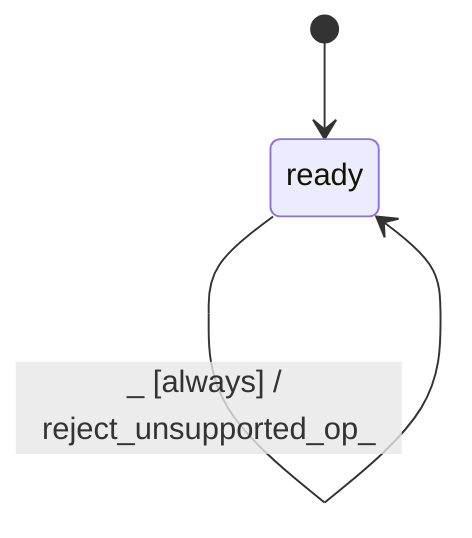

# kernel_metal

Source: [`emel/kernel/metal/sm.hpp`](https://github.com/stateforward/emel.cpp/blob/main/src/emel/kernel/metal/sm.hpp)

## Mermaid

## Transitions

| Source | Event | Guard | Action | Target |
| --- | --- | --- | --- | --- |
| [`ready`](https://github.com/stateforward/emel.cpp/blob/main/src/emel/kernel/metal/sm.hpp) | [`dispatch_request`](https://github.com/stateforward/emel.cpp/blob/main/src/emel/kernel/metal/sm.hpp) | [`always`](https://github.com/stateforward/emel.cpp/blob/main/src/emel/kernel/metal/sm.hpp) | [`exec_dispatch>`](https://github.com/stateforward/emel.cpp/blob/main/src/emel/kernel/metal/sm.hpp) | [`ready`](https://github.com/stateforward/emel.cpp/blob/main/src/emel/kernel/metal/sm.hpp) |
| [`ready`](https://github.com/stateforward/emel.cpp/blob/main/src/emel/kernel/metal/sm.hpp) | [`dispatch_op_mul_mat`](https://github.com/stateforward/emel.cpp/blob/main/src/emel/kernel/metal/sm.hpp) | [`valid_op_mul_mat_q8_0>`](https://github.com/stateforward/emel.cpp/blob/main/src/emel/kernel/metal/sm.hpp) | [`exec_op_mul_mat_q8_0>`](https://github.com/stateforward/emel.cpp/blob/main/src/emel/kernel/metal/sm.hpp) | [`ready`](https://github.com/stateforward/emel.cpp/blob/main/src/emel/kernel/metal/sm.hpp) |
| [`ready`](https://github.com/stateforward/emel.cpp/blob/main/src/emel/kernel/metal/sm.hpp) | [`dispatch_op_mul_mat`](https://github.com/stateforward/emel.cpp/blob/main/src/emel/kernel/metal/sm.hpp) | [`valid_op_mul_mat_f16>`](https://github.com/stateforward/emel.cpp/blob/main/src/emel/kernel/metal/sm.hpp) | [`exec_op_mul_mat_f16>`](https://github.com/stateforward/emel.cpp/blob/main/src/emel/kernel/metal/sm.hpp) | [`ready`](https://github.com/stateforward/emel.cpp/blob/main/src/emel/kernel/metal/sm.hpp) |
| [`ready`](https://github.com/stateforward/emel.cpp/blob/main/src/emel/kernel/metal/sm.hpp) | [`dispatch_op_mul_mat`](https://github.com/stateforward/emel.cpp/blob/main/src/emel/kernel/metal/sm.hpp) | [`valid_op_mul_mat_f32>`](https://github.com/stateforward/emel.cpp/blob/main/src/emel/kernel/metal/sm.hpp) | [`exec_op_mul_mat_f32>`](https://github.com/stateforward/emel.cpp/blob/main/src/emel/kernel/metal/sm.hpp) | [`ready`](https://github.com/stateforward/emel.cpp/blob/main/src/emel/kernel/metal/sm.hpp) |
| [`ready`](https://github.com/stateforward/emel.cpp/blob/main/src/emel/kernel/metal/sm.hpp) | [`dispatch_op_mul_mat`](https://github.com/stateforward/emel.cpp/blob/main/src/emel/kernel/metal/sm.hpp) | [`invalid_op_mul_mat>`](https://github.com/stateforward/emel.cpp/blob/main/src/emel/kernel/metal/sm.hpp) | [`reject_invalid_op_mul_mat>`](https://github.com/stateforward/emel.cpp/blob/main/src/emel/kernel/metal/sm.hpp) | [`ready`](https://github.com/stateforward/emel.cpp/blob/main/src/emel/kernel/metal/sm.hpp) |
| [`ready`](https://github.com/stateforward/emel.cpp/blob/main/src/emel/kernel/metal/sm.hpp) | [`dispatch_op_add`](https://github.com/stateforward/emel.cpp/blob/main/src/emel/kernel/metal/sm.hpp) | [`valid_op_add_equal>`](https://github.com/stateforward/emel.cpp/blob/main/src/emel/kernel/metal/sm.hpp) | [`exec_op_add_equal>`](https://github.com/stateforward/emel.cpp/blob/main/src/emel/kernel/metal/sm.hpp) | [`ready`](https://github.com/stateforward/emel.cpp/blob/main/src/emel/kernel/metal/sm.hpp) |
| [`ready`](https://github.com/stateforward/emel.cpp/blob/main/src/emel/kernel/metal/sm.hpp) | [`dispatch_op_add`](https://github.com/stateforward/emel.cpp/blob/main/src/emel/kernel/metal/sm.hpp) | [`valid_op_add_broadcast_row>`](https://github.com/stateforward/emel.cpp/blob/main/src/emel/kernel/metal/sm.hpp) | [`exec_op_add_broadcast_row>`](https://github.com/stateforward/emel.cpp/blob/main/src/emel/kernel/metal/sm.hpp) | [`ready`](https://github.com/stateforward/emel.cpp/blob/main/src/emel/kernel/metal/sm.hpp) |
| [`ready`](https://github.com/stateforward/emel.cpp/blob/main/src/emel/kernel/metal/sm.hpp) | [`dispatch_op_add`](https://github.com/stateforward/emel.cpp/blob/main/src/emel/kernel/metal/sm.hpp) | [`invalid_op_add>`](https://github.com/stateforward/emel.cpp/blob/main/src/emel/kernel/metal/sm.hpp) | [`reject_invalid_op_add>`](https://github.com/stateforward/emel.cpp/blob/main/src/emel/kernel/metal/sm.hpp) | [`ready`](https://github.com/stateforward/emel.cpp/blob/main/src/emel/kernel/metal/sm.hpp) |
| [`ready`](https://github.com/stateforward/emel.cpp/blob/main/src/emel/kernel/metal/sm.hpp) | [`dispatch_op_unary`](https://github.com/stateforward/emel.cpp/blob/main/src/emel/kernel/metal/sm.hpp) | [`abs>>`](https://github.com/stateforward/emel.cpp/blob/main/src/emel/kernel/metal/sm.hpp) | [`abs>>`](https://github.com/stateforward/emel.cpp/blob/main/src/emel/kernel/metal/sm.hpp) | [`ready`](https://github.com/stateforward/emel.cpp/blob/main/src/emel/kernel/metal/sm.hpp) |
| [`ready`](https://github.com/stateforward/emel.cpp/blob/main/src/emel/kernel/metal/sm.hpp) | [`dispatch_op_unary`](https://github.com/stateforward/emel.cpp/blob/main/src/emel/kernel/metal/sm.hpp) | [`neg>>`](https://github.com/stateforward/emel.cpp/blob/main/src/emel/kernel/metal/sm.hpp) | [`neg>>`](https://github.com/stateforward/emel.cpp/blob/main/src/emel/kernel/metal/sm.hpp) | [`ready`](https://github.com/stateforward/emel.cpp/blob/main/src/emel/kernel/metal/sm.hpp) |
| [`ready`](https://github.com/stateforward/emel.cpp/blob/main/src/emel/kernel/metal/sm.hpp) | [`dispatch_op_unary`](https://github.com/stateforward/emel.cpp/blob/main/src/emel/kernel/metal/sm.hpp) | [`tanh>>`](https://github.com/stateforward/emel.cpp/blob/main/src/emel/kernel/metal/sm.hpp) | [`tanh>>`](https://github.com/stateforward/emel.cpp/blob/main/src/emel/kernel/metal/sm.hpp) | [`ready`](https://github.com/stateforward/emel.cpp/blob/main/src/emel/kernel/metal/sm.hpp) |
| [`ready`](https://github.com/stateforward/emel.cpp/blob/main/src/emel/kernel/metal/sm.hpp) | [`dispatch_op_unary`](https://github.com/stateforward/emel.cpp/blob/main/src/emel/kernel/metal/sm.hpp) | [`elu>>`](https://github.com/stateforward/emel.cpp/blob/main/src/emel/kernel/metal/sm.hpp) | [`elu>>`](https://github.com/stateforward/emel.cpp/blob/main/src/emel/kernel/metal/sm.hpp) | [`ready`](https://github.com/stateforward/emel.cpp/blob/main/src/emel/kernel/metal/sm.hpp) |
| [`ready`](https://github.com/stateforward/emel.cpp/blob/main/src/emel/kernel/metal/sm.hpp) | [`dispatch_op_unary`](https://github.com/stateforward/emel.cpp/blob/main/src/emel/kernel/metal/sm.hpp) | [`relu>>`](https://github.com/stateforward/emel.cpp/blob/main/src/emel/kernel/metal/sm.hpp) | [`relu>>`](https://github.com/stateforward/emel.cpp/blob/main/src/emel/kernel/metal/sm.hpp) | [`ready`](https://github.com/stateforward/emel.cpp/blob/main/src/emel/kernel/metal/sm.hpp) |
| [`ready`](https://github.com/stateforward/emel.cpp/blob/main/src/emel/kernel/metal/sm.hpp) | [`dispatch_op_unary`](https://github.com/stateforward/emel.cpp/blob/main/src/emel/kernel/metal/sm.hpp) | [`gelu>>`](https://github.com/stateforward/emel.cpp/blob/main/src/emel/kernel/metal/sm.hpp) | [`gelu>>`](https://github.com/stateforward/emel.cpp/blob/main/src/emel/kernel/metal/sm.hpp) | [`ready`](https://github.com/stateforward/emel.cpp/blob/main/src/emel/kernel/metal/sm.hpp) |
| [`ready`](https://github.com/stateforward/emel.cpp/blob/main/src/emel/kernel/metal/sm.hpp) | [`dispatch_op_unary`](https://github.com/stateforward/emel.cpp/blob/main/src/emel/kernel/metal/sm.hpp) | [`silu>>`](https://github.com/stateforward/emel.cpp/blob/main/src/emel/kernel/metal/sm.hpp) | [`silu>>`](https://github.com/stateforward/emel.cpp/blob/main/src/emel/kernel/metal/sm.hpp) | [`ready`](https://github.com/stateforward/emel.cpp/blob/main/src/emel/kernel/metal/sm.hpp) |
| [`ready`](https://github.com/stateforward/emel.cpp/blob/main/src/emel/kernel/metal/sm.hpp) | [`dispatch_op_unary`](https://github.com/stateforward/emel.cpp/blob/main/src/emel/kernel/metal/sm.hpp) | [`exp>>`](https://github.com/stateforward/emel.cpp/blob/main/src/emel/kernel/metal/sm.hpp) | [`exp>>`](https://github.com/stateforward/emel.cpp/blob/main/src/emel/kernel/metal/sm.hpp) | [`ready`](https://github.com/stateforward/emel.cpp/blob/main/src/emel/kernel/metal/sm.hpp) |
| [`ready`](https://github.com/stateforward/emel.cpp/blob/main/src/emel/kernel/metal/sm.hpp) | [`dispatch_op_unary`](https://github.com/stateforward/emel.cpp/blob/main/src/emel/kernel/metal/sm.hpp) | [`invalid_op_unary>`](https://github.com/stateforward/emel.cpp/blob/main/src/emel/kernel/metal/sm.hpp) | [`reject_invalid_op_unary>`](https://github.com/stateforward/emel.cpp/blob/main/src/emel/kernel/metal/sm.hpp) | [`ready`](https://github.com/stateforward/emel.cpp/blob/main/src/emel/kernel/metal/sm.hpp) |
| [`ready`](https://github.com/stateforward/emel.cpp/blob/main/src/emel/kernel/metal/sm.hpp) | [`dispatch_op_im2col`](https://github.com/stateforward/emel.cpp/blob/main/src/emel/kernel/metal/sm.hpp) | [`valid_op_im2col_f32>`](https://github.com/stateforward/emel.cpp/blob/main/src/emel/kernel/metal/sm.hpp) | [`exec_op_im2col_f32>`](https://github.com/stateforward/emel.cpp/blob/main/src/emel/kernel/metal/sm.hpp) | [`ready`](https://github.com/stateforward/emel.cpp/blob/main/src/emel/kernel/metal/sm.hpp) |
| [`ready`](https://github.com/stateforward/emel.cpp/blob/main/src/emel/kernel/metal/sm.hpp) | [`dispatch_op_im2col`](https://github.com/stateforward/emel.cpp/blob/main/src/emel/kernel/metal/sm.hpp) | [`valid_op_im2col_f16>`](https://github.com/stateforward/emel.cpp/blob/main/src/emel/kernel/metal/sm.hpp) | [`exec_op_im2col_f16>`](https://github.com/stateforward/emel.cpp/blob/main/src/emel/kernel/metal/sm.hpp) | [`ready`](https://github.com/stateforward/emel.cpp/blob/main/src/emel/kernel/metal/sm.hpp) |
| [`ready`](https://github.com/stateforward/emel.cpp/blob/main/src/emel/kernel/metal/sm.hpp) | [`dispatch_op_im2col`](https://github.com/stateforward/emel.cpp/blob/main/src/emel/kernel/metal/sm.hpp) | [`invalid_op_im2col>`](https://github.com/stateforward/emel.cpp/blob/main/src/emel/kernel/metal/sm.hpp) | [`reject_invalid_op_im2col>`](https://github.com/stateforward/emel.cpp/blob/main/src/emel/kernel/metal/sm.hpp) | [`ready`](https://github.com/stateforward/emel.cpp/blob/main/src/emel/kernel/metal/sm.hpp) |
| [`ready`](https://github.com/stateforward/emel.cpp/blob/main/src/emel/kernel/metal/sm.hpp) | [`dispatch_op_conv_transpose_1d`](https://github.com/stateforward/emel.cpp/blob/main/src/emel/kernel/metal/sm.hpp) | [`valid_op_conv_transpose_1d_f32>`](https://github.com/stateforward/emel.cpp/blob/main/src/emel/kernel/metal/sm.hpp) | [`exec_op_conv_transpose_1d_f32>`](https://github.com/stateforward/emel.cpp/blob/main/src/emel/kernel/metal/sm.hpp) | [`ready`](https://github.com/stateforward/emel.cpp/blob/main/src/emel/kernel/metal/sm.hpp) |
| [`ready`](https://github.com/stateforward/emel.cpp/blob/main/src/emel/kernel/metal/sm.hpp) | [`dispatch_op_conv_transpose_1d`](https://github.com/stateforward/emel.cpp/blob/main/src/emel/kernel/metal/sm.hpp) | [`valid_op_conv_transpose_1d_f16>`](https://github.com/stateforward/emel.cpp/blob/main/src/emel/kernel/metal/sm.hpp) | [`exec_op_conv_transpose_1d_f16>`](https://github.com/stateforward/emel.cpp/blob/main/src/emel/kernel/metal/sm.hpp) | [`ready`](https://github.com/stateforward/emel.cpp/blob/main/src/emel/kernel/metal/sm.hpp) |
| [`ready`](https://github.com/stateforward/emel.cpp/blob/main/src/emel/kernel/metal/sm.hpp) | [`dispatch_op_conv_transpose_1d`](https://github.com/stateforward/emel.cpp/blob/main/src/emel/kernel/metal/sm.hpp) | [`invalid_op_conv_transpose_1d>`](https://github.com/stateforward/emel.cpp/blob/main/src/emel/kernel/metal/sm.hpp) | [`reject_invalid_op_conv_transpose_1d>`](https://github.com/stateforward/emel.cpp/blob/main/src/emel/kernel/metal/sm.hpp) | [`ready`](https://github.com/stateforward/emel.cpp/blob/main/src/emel/kernel/metal/sm.hpp) |
| [`ready`](https://github.com/stateforward/emel.cpp/blob/main/src/emel/kernel/metal/sm.hpp) | [`dispatch_op_get_rows`](https://github.com/stateforward/emel.cpp/blob/main/src/emel/kernel/metal/sm.hpp) | [`valid_op_get_rows_f32>`](https://github.com/stateforward/emel.cpp/blob/main/src/emel/kernel/metal/sm.hpp) | [`exec_op_get_rows_f32>`](https://github.com/stateforward/emel.cpp/blob/main/src/emel/kernel/metal/sm.hpp) | [`ready`](https://github.com/stateforward/emel.cpp/blob/main/src/emel/kernel/metal/sm.hpp) |
| [`ready`](https://github.com/stateforward/emel.cpp/blob/main/src/emel/kernel/metal/sm.hpp) | [`dispatch_op_get_rows`](https://github.com/stateforward/emel.cpp/blob/main/src/emel/kernel/metal/sm.hpp) | [`valid_op_get_rows_f16>`](https://github.com/stateforward/emel.cpp/blob/main/src/emel/kernel/metal/sm.hpp) | [`exec_op_get_rows_f16>`](https://github.com/stateforward/emel.cpp/blob/main/src/emel/kernel/metal/sm.hpp) | [`ready`](https://github.com/stateforward/emel.cpp/blob/main/src/emel/kernel/metal/sm.hpp) |
| [`ready`](https://github.com/stateforward/emel.cpp/blob/main/src/emel/kernel/metal/sm.hpp) | [`dispatch_op_get_rows`](https://github.com/stateforward/emel.cpp/blob/main/src/emel/kernel/metal/sm.hpp) | [`invalid_op_get_rows>`](https://github.com/stateforward/emel.cpp/blob/main/src/emel/kernel/metal/sm.hpp) | [`reject_invalid_op_get_rows>`](https://github.com/stateforward/emel.cpp/blob/main/src/emel/kernel/metal/sm.hpp) | [`ready`](https://github.com/stateforward/emel.cpp/blob/main/src/emel/kernel/metal/sm.hpp) |
| [`ready`](https://github.com/stateforward/emel.cpp/blob/main/src/emel/kernel/metal/sm.hpp) | [`_`](https://github.com/stateforward/emel.cpp/blob/main/src/emel/kernel/metal/sm.hpp) | [`always`](https://github.com/stateforward/emel.cpp/blob/main/src/emel/kernel/metal/sm.hpp) | [`reject_unsupported_op>`](https://github.com/stateforward/emel.cpp/blob/main/src/emel/kernel/metal/sm.hpp) | [`ready`](https://github.com/stateforward/emel.cpp/blob/main/src/emel/kernel/metal/sm.hpp) |
