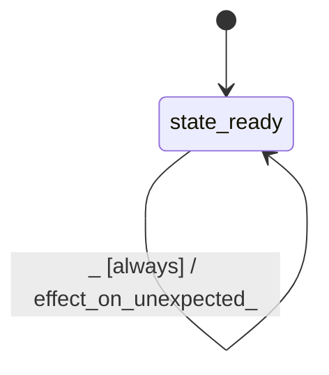

# kernel_rope

Source: [`emel/kernel/rope/sm.hpp`](https://github.com/stateforward/emel.cpp/blob/main/src/emel/kernel/rope/sm.hpp)

## Mermaid

## Transitions

| Source | Event | Guard | Action | Target |
| --- | --- | --- | --- | --- |
| [`state_ready`](https://github.com/stateforward/emel.cpp/blob/main/src/emel/kernel/rope/sm.hpp) | [`execute_precompute`](https://github.com/stateforward/emel.cpp/blob/main/src/emel/kernel/rope/sm.hpp) | [`guard_execute_precompute>`](https://github.com/stateforward/emel.cpp/blob/main/src/emel/kernel/rope/sm.hpp) | [`effect_execute_precompute>`](https://github.com/stateforward/emel.cpp/blob/main/src/emel/kernel/rope/sm.hpp) | [`state_ready`](https://github.com/stateforward/emel.cpp/blob/main/src/emel/kernel/rope/sm.hpp) |
| [`state_ready`](https://github.com/stateforward/emel.cpp/blob/main/src/emel/kernel/rope/sm.hpp) | [`execute_apply_rows`](https://github.com/stateforward/emel.cpp/blob/main/src/emel/kernel/rope/sm.hpp) | [`guard_execute_apply_rows>`](https://github.com/stateforward/emel.cpp/blob/main/src/emel/kernel/rope/sm.hpp) | [`effect_execute_apply_rows>`](https://github.com/stateforward/emel.cpp/blob/main/src/emel/kernel/rope/sm.hpp) | [`state_ready`](https://github.com/stateforward/emel.cpp/blob/main/src/emel/kernel/rope/sm.hpp) |
| [`state_ready`](https://github.com/stateforward/emel.cpp/blob/main/src/emel/kernel/rope/sm.hpp) | [`_`](https://github.com/stateforward/emel.cpp/blob/main/src/emel/kernel/rope/sm.hpp) | [`always`](https://github.com/stateforward/emel.cpp/blob/main/src/emel/kernel/rope/sm.hpp) | [`effect_on_unexpected>`](https://github.com/stateforward/emel.cpp/blob/main/src/emel/kernel/rope/sm.hpp) | [`state_ready`](https://github.com/stateforward/emel.cpp/blob/main/src/emel/kernel/rope/sm.hpp) |
