# logits_sampler

Source: [`emel/logits/sampler/sm.hpp`](https://github.com/stateforward/emel.cpp/blob/main/src/emel/logits/sampler/sm.hpp)

## Mermaid

```mermaid
stateDiagram-v2
  direction TB
  [*] --> ready
  ready --> done : configure_runtime [valid_config_] / configure_table_
  ready --> errored : configure_runtime [invalid_config_] / mark_invalid_request_
  ready --> request_logits_decision : sample_logits_runtime [always] / none
  ready --> request_preselected_decision : sample_preselected_runtime [always] / none
  request_preselected_decision --> done : completion_sample_preselected_runtime_ [preselected_token_valid_] / none
  request_preselected_decision --> errored : completion_sample_preselected_runtime_ [preselected_token_invalid_] / mark_invalid_request_
  request_logits_decision --> preparing_candidates : completion_sample_logits_runtime_ [valid_request_] / begin_sample_
  request_logits_decision --> errored : completion_sample_logits_runtime_ [invalid_request_] / mark_invalid_request_
  preparing_candidates --> apply_samplers : completion_sample_logits_runtime_ [always] / prepare_candidates_
  apply_samplers --> sample_decision : completion_sample_logits_runtime_ [has_more_samplers_] / none
  apply_samplers --> sample_complete_decision : completion_sample_logits_runtime_ [no_more_samplers_] / none
  sample_decision --> sample_call : completion_sample_logits_runtime_ [sampler_fn_available_] / apply_sampler_
  sample_decision --> errored : completion_sample_logits_runtime_ [sampler_fn_missing_] / mark_invalid_request_
  sample_call --> sample_call_decision : completion_sample_logits_runtime_ [always] / none
  sample_call_decision --> apply_samplers : completion_sample_logits_runtime_ [sampler_call_succeeded_with_valid_candidate_count_] / advance_sampler_index_
  sample_call_decision --> errored : completion_sample_logits_runtime_ [sampler_call_succeeded_with_invalid_candidate_count_] / mark_invalid_request_
  sample_call_decision --> errored : completion_sample_logits_runtime_ [sampler_call_failed_] / mark_sampler_error_
  sample_complete_decision --> done : completion_sample_logits_runtime_ [selected_token_valid_] / none
  sample_complete_decision --> errored : completion_sample_logits_runtime_ [selected_token_missing_or_invalid_] / mark_invalid_request_
  ready --> state_temperature_top_k_request_decision : sample_temperature_top_k_runtime [always] / none
  state_temperature_top_k_request_decision --> state_temperature_top_k_scale : completion_sample_temperature_top_k_runtime_ [temperature_top_k_request_valid_] / scale_temperature_logits_
  state_temperature_top_k_request_decision --> errored : completion_sample_temperature_top_k_runtime_ [temperature_top_k_request_invalid_] / mark_invalid_request_
  state_temperature_top_k_scale --> state_temperature_top_k_probabilities : completion_sample_temperature_top_k_runtime_ [always] / compute_temperature_probabilities_
  state_temperature_top_k_probabilities --> state_temperature_top_k_rank : completion_sample_temperature_top_k_runtime_ [always] / compute_temperature_top_k_
  state_temperature_top_k_rank --> state_temperature_top_k_select : completion_sample_temperature_top_k_runtime_ [always] / select_temperature_top_k_
  state_temperature_top_k_select --> done : completion_sample_temperature_top_k_runtime_ [temperature_top_k_selected_token_valid_] / none
  state_temperature_top_k_select --> errored : completion_sample_temperature_top_k_runtime_ [temperature_top_k_selected_token_invalid_] / mark_invalid_request_
  done --> ready : completion_configure_runtime_ [always] / publish_done_
  errored --> ready : completion_configure_runtime_ [always] / publish_error_
  done --> ready : completion_sample_logits_runtime_ [always] / publish_done_
  errored --> ready : completion_sample_logits_runtime_ [always] / publish_error_
  done --> ready : completion_sample_preselected_runtime_ [always] / publish_done_
  errored --> ready : completion_sample_preselected_runtime_ [always] / publish_error_
  done --> ready : completion_sample_temperature_top_k_runtime_ [always] / publish_done_
  errored --> ready : completion_sample_temperature_top_k_runtime_ [always] / publish_error_
  ready --> ready : _ [always] / on_unexpected_
  request_logits_decision --> ready : _ [always] / on_unexpected_
  request_preselected_decision --> ready : _ [always] / on_unexpected_
  preparing_candidates --> ready : _ [always] / on_unexpected_
  apply_samplers --> ready : _ [always] / on_unexpected_
  sample_decision --> ready : _ [always] / on_unexpected_
  sample_call --> ready : _ [always] / on_unexpected_
  sample_call_decision --> ready : _ [always] / on_unexpected_
  sample_complete_decision --> ready : _ [always] / on_unexpected_
  state_temperature_top_k_request_decision --> ready : _ [always] / on_unexpected_
  state_temperature_top_k_scale --> ready : _ [always] / on_unexpected_
  state_temperature_top_k_probabilities --> ready : _ [always] / on_unexpected_
  state_temperature_top_k_rank --> ready : _ [always] / on_unexpected_
  state_temperature_top_k_select --> ready : _ [always] / on_unexpected_
  done --> ready : _ [always] / on_unexpected_
  errored --> ready : _ [always] / on_unexpected_
```

## Transitions

| Source | Event | Guard | Action | Target |
| --- | --- | --- | --- | --- |
| [`ready`](https://github.com/stateforward/emel.cpp/blob/main/src/emel/logits/sampler/sm.hpp) | [`configure_runtime`](https://github.com/stateforward/emel.cpp/blob/main/src/emel/logits/sampler/sm.hpp) | [`valid_config>`](https://github.com/stateforward/emel.cpp/blob/main/src/emel/logits/sampler/sm.hpp) | [`configure_table>`](https://github.com/stateforward/emel.cpp/blob/main/src/emel/logits/sampler/sm.hpp) | [`done`](https://github.com/stateforward/emel.cpp/blob/main/src/emel/logits/sampler/sm.hpp) |
| [`ready`](https://github.com/stateforward/emel.cpp/blob/main/src/emel/logits/sampler/sm.hpp) | [`configure_runtime`](https://github.com/stateforward/emel.cpp/blob/main/src/emel/logits/sampler/sm.hpp) | [`invalid_config>`](https://github.com/stateforward/emel.cpp/blob/main/src/emel/logits/sampler/sm.hpp) | [`mark_invalid_request>`](https://github.com/stateforward/emel.cpp/blob/main/src/emel/logits/sampler/sm.hpp) | [`errored`](https://github.com/stateforward/emel.cpp/blob/main/src/emel/logits/sampler/sm.hpp) |
| [`ready`](https://github.com/stateforward/emel.cpp/blob/main/src/emel/logits/sampler/sm.hpp) | [`sample_logits_runtime`](https://github.com/stateforward/emel.cpp/blob/main/src/emel/logits/sampler/sm.hpp) | [`always`](https://github.com/stateforward/emel.cpp/blob/main/src/emel/logits/sampler/sm.hpp) | [`none`](https://github.com/stateforward/emel.cpp/blob/main/src/emel/logits/sampler/sm.hpp) | [`request_logits_decision`](https://github.com/stateforward/emel.cpp/blob/main/src/emel/logits/sampler/sm.hpp) |
| [`ready`](https://github.com/stateforward/emel.cpp/blob/main/src/emel/logits/sampler/sm.hpp) | [`sample_preselected_runtime`](https://github.com/stateforward/emel.cpp/blob/main/src/emel/logits/sampler/sm.hpp) | [`always`](https://github.com/stateforward/emel.cpp/blob/main/src/emel/logits/sampler/sm.hpp) | [`none`](https://github.com/stateforward/emel.cpp/blob/main/src/emel/logits/sampler/sm.hpp) | [`request_preselected_decision`](https://github.com/stateforward/emel.cpp/blob/main/src/emel/logits/sampler/sm.hpp) |
| [`request_preselected_decision`](https://github.com/stateforward/emel.cpp/blob/main/src/emel/logits/sampler/sm.hpp) | [`completion<sample_preselected_runtime>`](https://github.com/stateforward/emel.cpp/blob/main/src/emel/logits/sampler/sm.hpp) | [`preselected_token_valid>`](https://github.com/stateforward/emel.cpp/blob/main/src/emel/logits/sampler/sm.hpp) | [`none`](https://github.com/stateforward/emel.cpp/blob/main/src/emel/logits/sampler/sm.hpp) | [`done`](https://github.com/stateforward/emel.cpp/blob/main/src/emel/logits/sampler/sm.hpp) |
| [`request_preselected_decision`](https://github.com/stateforward/emel.cpp/blob/main/src/emel/logits/sampler/sm.hpp) | [`completion<sample_preselected_runtime>`](https://github.com/stateforward/emel.cpp/blob/main/src/emel/logits/sampler/sm.hpp) | [`preselected_token_invalid>`](https://github.com/stateforward/emel.cpp/blob/main/src/emel/logits/sampler/sm.hpp) | [`mark_invalid_request>`](https://github.com/stateforward/emel.cpp/blob/main/src/emel/logits/sampler/sm.hpp) | [`errored`](https://github.com/stateforward/emel.cpp/blob/main/src/emel/logits/sampler/sm.hpp) |
| [`request_logits_decision`](https://github.com/stateforward/emel.cpp/blob/main/src/emel/logits/sampler/sm.hpp) | [`completion<sample_logits_runtime>`](https://github.com/stateforward/emel.cpp/blob/main/src/emel/logits/sampler/sm.hpp) | [`valid_request>`](https://github.com/stateforward/emel.cpp/blob/main/src/emel/logits/sampler/sm.hpp) | [`begin_sample>`](https://github.com/stateforward/emel.cpp/blob/main/src/emel/logits/sampler/sm.hpp) | [`preparing_candidates`](https://github.com/stateforward/emel.cpp/blob/main/src/emel/logits/sampler/sm.hpp) |
| [`request_logits_decision`](https://github.com/stateforward/emel.cpp/blob/main/src/emel/logits/sampler/sm.hpp) | [`completion<sample_logits_runtime>`](https://github.com/stateforward/emel.cpp/blob/main/src/emel/logits/sampler/sm.hpp) | [`invalid_request>`](https://github.com/stateforward/emel.cpp/blob/main/src/emel/logits/sampler/sm.hpp) | [`mark_invalid_request>`](https://github.com/stateforward/emel.cpp/blob/main/src/emel/logits/sampler/sm.hpp) | [`errored`](https://github.com/stateforward/emel.cpp/blob/main/src/emel/logits/sampler/sm.hpp) |
| [`preparing_candidates`](https://github.com/stateforward/emel.cpp/blob/main/src/emel/logits/sampler/sm.hpp) | [`completion<sample_logits_runtime>`](https://github.com/stateforward/emel.cpp/blob/main/src/emel/logits/sampler/sm.hpp) | [`always`](https://github.com/stateforward/emel.cpp/blob/main/src/emel/logits/sampler/sm.hpp) | [`prepare_candidates>`](https://github.com/stateforward/emel.cpp/blob/main/src/emel/logits/sampler/sm.hpp) | [`apply_samplers`](https://github.com/stateforward/emel.cpp/blob/main/src/emel/logits/sampler/sm.hpp) |
| [`apply_samplers`](https://github.com/stateforward/emel.cpp/blob/main/src/emel/logits/sampler/sm.hpp) | [`completion<sample_logits_runtime>`](https://github.com/stateforward/emel.cpp/blob/main/src/emel/logits/sampler/sm.hpp) | [`has_more_samplers>`](https://github.com/stateforward/emel.cpp/blob/main/src/emel/logits/sampler/sm.hpp) | [`none`](https://github.com/stateforward/emel.cpp/blob/main/src/emel/logits/sampler/sm.hpp) | [`sample_decision`](https://github.com/stateforward/emel.cpp/blob/main/src/emel/logits/sampler/sm.hpp) |
| [`apply_samplers`](https://github.com/stateforward/emel.cpp/blob/main/src/emel/logits/sampler/sm.hpp) | [`completion<sample_logits_runtime>`](https://github.com/stateforward/emel.cpp/blob/main/src/emel/logits/sampler/sm.hpp) | [`no_more_samplers>`](https://github.com/stateforward/emel.cpp/blob/main/src/emel/logits/sampler/sm.hpp) | [`none`](https://github.com/stateforward/emel.cpp/blob/main/src/emel/logits/sampler/sm.hpp) | [`sample_complete_decision`](https://github.com/stateforward/emel.cpp/blob/main/src/emel/logits/sampler/sm.hpp) |
| [`sample_decision`](https://github.com/stateforward/emel.cpp/blob/main/src/emel/logits/sampler/sm.hpp) | [`completion<sample_logits_runtime>`](https://github.com/stateforward/emel.cpp/blob/main/src/emel/logits/sampler/sm.hpp) | [`sampler_fn_available>`](https://github.com/stateforward/emel.cpp/blob/main/src/emel/logits/sampler/sm.hpp) | [`apply_sampler>`](https://github.com/stateforward/emel.cpp/blob/main/src/emel/logits/sampler/sm.hpp) | [`sample_call`](https://github.com/stateforward/emel.cpp/blob/main/src/emel/logits/sampler/sm.hpp) |
| [`sample_decision`](https://github.com/stateforward/emel.cpp/blob/main/src/emel/logits/sampler/sm.hpp) | [`completion<sample_logits_runtime>`](https://github.com/stateforward/emel.cpp/blob/main/src/emel/logits/sampler/sm.hpp) | [`sampler_fn_missing>`](https://github.com/stateforward/emel.cpp/blob/main/src/emel/logits/sampler/sm.hpp) | [`mark_invalid_request>`](https://github.com/stateforward/emel.cpp/blob/main/src/emel/logits/sampler/sm.hpp) | [`errored`](https://github.com/stateforward/emel.cpp/blob/main/src/emel/logits/sampler/sm.hpp) |
| [`sample_call`](https://github.com/stateforward/emel.cpp/blob/main/src/emel/logits/sampler/sm.hpp) | [`completion<sample_logits_runtime>`](https://github.com/stateforward/emel.cpp/blob/main/src/emel/logits/sampler/sm.hpp) | [`always`](https://github.com/stateforward/emel.cpp/blob/main/src/emel/logits/sampler/sm.hpp) | [`none`](https://github.com/stateforward/emel.cpp/blob/main/src/emel/logits/sampler/sm.hpp) | [`sample_call_decision`](https://github.com/stateforward/emel.cpp/blob/main/src/emel/logits/sampler/sm.hpp) |
| [`sample_call_decision`](https://github.com/stateforward/emel.cpp/blob/main/src/emel/logits/sampler/sm.hpp) | [`completion<sample_logits_runtime>`](https://github.com/stateforward/emel.cpp/blob/main/src/emel/logits/sampler/sm.hpp) | [`sampler_call_succeeded_with_valid_candidate_count>`](https://github.com/stateforward/emel.cpp/blob/main/src/emel/logits/sampler/sm.hpp) | [`advance_sampler_index>`](https://github.com/stateforward/emel.cpp/blob/main/src/emel/logits/sampler/sm.hpp) | [`apply_samplers`](https://github.com/stateforward/emel.cpp/blob/main/src/emel/logits/sampler/sm.hpp) |
| [`sample_call_decision`](https://github.com/stateforward/emel.cpp/blob/main/src/emel/logits/sampler/sm.hpp) | [`completion<sample_logits_runtime>`](https://github.com/stateforward/emel.cpp/blob/main/src/emel/logits/sampler/sm.hpp) | [`sampler_call_succeeded_with_invalid_candidate_count>`](https://github.com/stateforward/emel.cpp/blob/main/src/emel/logits/sampler/sm.hpp) | [`mark_invalid_request>`](https://github.com/stateforward/emel.cpp/blob/main/src/emel/logits/sampler/sm.hpp) | [`errored`](https://github.com/stateforward/emel.cpp/blob/main/src/emel/logits/sampler/sm.hpp) |
| [`sample_call_decision`](https://github.com/stateforward/emel.cpp/blob/main/src/emel/logits/sampler/sm.hpp) | [`completion<sample_logits_runtime>`](https://github.com/stateforward/emel.cpp/blob/main/src/emel/logits/sampler/sm.hpp) | [`sampler_call_failed>`](https://github.com/stateforward/emel.cpp/blob/main/src/emel/logits/sampler/sm.hpp) | [`mark_sampler_error>`](https://github.com/stateforward/emel.cpp/blob/main/src/emel/logits/sampler/sm.hpp) | [`errored`](https://github.com/stateforward/emel.cpp/blob/main/src/emel/logits/sampler/sm.hpp) |
| [`sample_complete_decision`](https://github.com/stateforward/emel.cpp/blob/main/src/emel/logits/sampler/sm.hpp) | [`completion<sample_logits_runtime>`](https://github.com/stateforward/emel.cpp/blob/main/src/emel/logits/sampler/sm.hpp) | [`selected_token_valid>`](https://github.com/stateforward/emel.cpp/blob/main/src/emel/logits/sampler/sm.hpp) | [`none`](https://github.com/stateforward/emel.cpp/blob/main/src/emel/logits/sampler/sm.hpp) | [`done`](https://github.com/stateforward/emel.cpp/blob/main/src/emel/logits/sampler/sm.hpp) |
| [`sample_complete_decision`](https://github.com/stateforward/emel.cpp/blob/main/src/emel/logits/sampler/sm.hpp) | [`completion<sample_logits_runtime>`](https://github.com/stateforward/emel.cpp/blob/main/src/emel/logits/sampler/sm.hpp) | [`selected_token_missing_or_invalid>`](https://github.com/stateforward/emel.cpp/blob/main/src/emel/logits/sampler/sm.hpp) | [`mark_invalid_request>`](https://github.com/stateforward/emel.cpp/blob/main/src/emel/logits/sampler/sm.hpp) | [`errored`](https://github.com/stateforward/emel.cpp/blob/main/src/emel/logits/sampler/sm.hpp) |
| [`ready`](https://github.com/stateforward/emel.cpp/blob/main/src/emel/logits/sampler/sm.hpp) | [`sample_temperature_top_k_runtime`](https://github.com/stateforward/emel.cpp/blob/main/src/emel/logits/sampler/sm.hpp) | [`always`](https://github.com/stateforward/emel.cpp/blob/main/src/emel/logits/sampler/sm.hpp) | [`none`](https://github.com/stateforward/emel.cpp/blob/main/src/emel/logits/sampler/sm.hpp) | [`state_temperature_top_k_request_decision`](https://github.com/stateforward/emel.cpp/blob/main/src/emel/logits/sampler/sm.hpp) |
| [`state_temperature_top_k_request_decision`](https://github.com/stateforward/emel.cpp/blob/main/src/emel/logits/sampler/sm.hpp) | [`completion<sample_temperature_top_k_runtime>`](https://github.com/stateforward/emel.cpp/blob/main/src/emel/logits/sampler/sm.hpp) | [`temperature_top_k_request_valid>`](https://github.com/stateforward/emel.cpp/blob/main/src/emel/logits/sampler/sm.hpp) | [`scale_temperature_logits>`](https://github.com/stateforward/emel.cpp/blob/main/src/emel/logits/sampler/sm.hpp) | [`state_temperature_top_k_scale`](https://github.com/stateforward/emel.cpp/blob/main/src/emel/logits/sampler/sm.hpp) |
| [`state_temperature_top_k_request_decision`](https://github.com/stateforward/emel.cpp/blob/main/src/emel/logits/sampler/sm.hpp) | [`completion<sample_temperature_top_k_runtime>`](https://github.com/stateforward/emel.cpp/blob/main/src/emel/logits/sampler/sm.hpp) | [`temperature_top_k_request_invalid>`](https://github.com/stateforward/emel.cpp/blob/main/src/emel/logits/sampler/sm.hpp) | [`mark_invalid_request>`](https://github.com/stateforward/emel.cpp/blob/main/src/emel/logits/sampler/sm.hpp) | [`errored`](https://github.com/stateforward/emel.cpp/blob/main/src/emel/logits/sampler/sm.hpp) |
| [`state_temperature_top_k_scale`](https://github.com/stateforward/emel.cpp/blob/main/src/emel/logits/sampler/sm.hpp) | [`completion<sample_temperature_top_k_runtime>`](https://github.com/stateforward/emel.cpp/blob/main/src/emel/logits/sampler/sm.hpp) | [`always`](https://github.com/stateforward/emel.cpp/blob/main/src/emel/logits/sampler/sm.hpp) | [`compute_temperature_probabilities>`](https://github.com/stateforward/emel.cpp/blob/main/src/emel/logits/sampler/sm.hpp) | [`state_temperature_top_k_probabilities`](https://github.com/stateforward/emel.cpp/blob/main/src/emel/logits/sampler/sm.hpp) |
| [`state_temperature_top_k_probabilities`](https://github.com/stateforward/emel.cpp/blob/main/src/emel/logits/sampler/sm.hpp) | [`completion<sample_temperature_top_k_runtime>`](https://github.com/stateforward/emel.cpp/blob/main/src/emel/logits/sampler/sm.hpp) | [`always`](https://github.com/stateforward/emel.cpp/blob/main/src/emel/logits/sampler/sm.hpp) | [`compute_temperature_top_k>`](https://github.com/stateforward/emel.cpp/blob/main/src/emel/logits/sampler/sm.hpp) | [`state_temperature_top_k_rank`](https://github.com/stateforward/emel.cpp/blob/main/src/emel/logits/sampler/sm.hpp) |
| [`state_temperature_top_k_rank`](https://github.com/stateforward/emel.cpp/blob/main/src/emel/logits/sampler/sm.hpp) | [`completion<sample_temperature_top_k_runtime>`](https://github.com/stateforward/emel.cpp/blob/main/src/emel/logits/sampler/sm.hpp) | [`always`](https://github.com/stateforward/emel.cpp/blob/main/src/emel/logits/sampler/sm.hpp) | [`select_temperature_top_k>`](https://github.com/stateforward/emel.cpp/blob/main/src/emel/logits/sampler/sm.hpp) | [`state_temperature_top_k_select`](https://github.com/stateforward/emel.cpp/blob/main/src/emel/logits/sampler/sm.hpp) |
| [`state_temperature_top_k_select`](https://github.com/stateforward/emel.cpp/blob/main/src/emel/logits/sampler/sm.hpp) | [`completion<sample_temperature_top_k_runtime>`](https://github.com/stateforward/emel.cpp/blob/main/src/emel/logits/sampler/sm.hpp) | [`temperature_top_k_selected_token_valid>`](https://github.com/stateforward/emel.cpp/blob/main/src/emel/logits/sampler/sm.hpp) | [`none`](https://github.com/stateforward/emel.cpp/blob/main/src/emel/logits/sampler/sm.hpp) | [`done`](https://github.com/stateforward/emel.cpp/blob/main/src/emel/logits/sampler/sm.hpp) |
| [`state_temperature_top_k_select`](https://github.com/stateforward/emel.cpp/blob/main/src/emel/logits/sampler/sm.hpp) | [`completion<sample_temperature_top_k_runtime>`](https://github.com/stateforward/emel.cpp/blob/main/src/emel/logits/sampler/sm.hpp) | [`temperature_top_k_selected_token_invalid>`](https://github.com/stateforward/emel.cpp/blob/main/src/emel/logits/sampler/sm.hpp) | [`mark_invalid_request>`](https://github.com/stateforward/emel.cpp/blob/main/src/emel/logits/sampler/sm.hpp) | [`errored`](https://github.com/stateforward/emel.cpp/blob/main/src/emel/logits/sampler/sm.hpp) |
| [`done`](https://github.com/stateforward/emel.cpp/blob/main/src/emel/logits/sampler/sm.hpp) | [`completion<configure_runtime>`](https://github.com/stateforward/emel.cpp/blob/main/src/emel/logits/sampler/sm.hpp) | [`always`](https://github.com/stateforward/emel.cpp/blob/main/src/emel/logits/sampler/sm.hpp) | [`publish_done>`](https://github.com/stateforward/emel.cpp/blob/main/src/emel/logits/sampler/sm.hpp) | [`ready`](https://github.com/stateforward/emel.cpp/blob/main/src/emel/logits/sampler/sm.hpp) |
| [`errored`](https://github.com/stateforward/emel.cpp/blob/main/src/emel/logits/sampler/sm.hpp) | [`completion<configure_runtime>`](https://github.com/stateforward/emel.cpp/blob/main/src/emel/logits/sampler/sm.hpp) | [`always`](https://github.com/stateforward/emel.cpp/blob/main/src/emel/logits/sampler/sm.hpp) | [`publish_error>`](https://github.com/stateforward/emel.cpp/blob/main/src/emel/logits/sampler/sm.hpp) | [`ready`](https://github.com/stateforward/emel.cpp/blob/main/src/emel/logits/sampler/sm.hpp) |
| [`done`](https://github.com/stateforward/emel.cpp/blob/main/src/emel/logits/sampler/sm.hpp) | [`completion<sample_logits_runtime>`](https://github.com/stateforward/emel.cpp/blob/main/src/emel/logits/sampler/sm.hpp) | [`always`](https://github.com/stateforward/emel.cpp/blob/main/src/emel/logits/sampler/sm.hpp) | [`publish_done>`](https://github.com/stateforward/emel.cpp/blob/main/src/emel/logits/sampler/sm.hpp) | [`ready`](https://github.com/stateforward/emel.cpp/blob/main/src/emel/logits/sampler/sm.hpp) |
| [`errored`](https://github.com/stateforward/emel.cpp/blob/main/src/emel/logits/sampler/sm.hpp) | [`completion<sample_logits_runtime>`](https://github.com/stateforward/emel.cpp/blob/main/src/emel/logits/sampler/sm.hpp) | [`always`](https://github.com/stateforward/emel.cpp/blob/main/src/emel/logits/sampler/sm.hpp) | [`publish_error>`](https://github.com/stateforward/emel.cpp/blob/main/src/emel/logits/sampler/sm.hpp) | [`ready`](https://github.com/stateforward/emel.cpp/blob/main/src/emel/logits/sampler/sm.hpp) |
| [`done`](https://github.com/stateforward/emel.cpp/blob/main/src/emel/logits/sampler/sm.hpp) | [`completion<sample_preselected_runtime>`](https://github.com/stateforward/emel.cpp/blob/main/src/emel/logits/sampler/sm.hpp) | [`always`](https://github.com/stateforward/emel.cpp/blob/main/src/emel/logits/sampler/sm.hpp) | [`publish_done>`](https://github.com/stateforward/emel.cpp/blob/main/src/emel/logits/sampler/sm.hpp) | [`ready`](https://github.com/stateforward/emel.cpp/blob/main/src/emel/logits/sampler/sm.hpp) |
| [`errored`](https://github.com/stateforward/emel.cpp/blob/main/src/emel/logits/sampler/sm.hpp) | [`completion<sample_preselected_runtime>`](https://github.com/stateforward/emel.cpp/blob/main/src/emel/logits/sampler/sm.hpp) | [`always`](https://github.com/stateforward/emel.cpp/blob/main/src/emel/logits/sampler/sm.hpp) | [`publish_error>`](https://github.com/stateforward/emel.cpp/blob/main/src/emel/logits/sampler/sm.hpp) | [`ready`](https://github.com/stateforward/emel.cpp/blob/main/src/emel/logits/sampler/sm.hpp) |
| [`done`](https://github.com/stateforward/emel.cpp/blob/main/src/emel/logits/sampler/sm.hpp) | [`completion<sample_temperature_top_k_runtime>`](https://github.com/stateforward/emel.cpp/blob/main/src/emel/logits/sampler/sm.hpp) | [`always`](https://github.com/stateforward/emel.cpp/blob/main/src/emel/logits/sampler/sm.hpp) | [`publish_done>`](https://github.com/stateforward/emel.cpp/blob/main/src/emel/logits/sampler/sm.hpp) | [`ready`](https://github.com/stateforward/emel.cpp/blob/main/src/emel/logits/sampler/sm.hpp) |
| [`errored`](https://github.com/stateforward/emel.cpp/blob/main/src/emel/logits/sampler/sm.hpp) | [`completion<sample_temperature_top_k_runtime>`](https://github.com/stateforward/emel.cpp/blob/main/src/emel/logits/sampler/sm.hpp) | [`always`](https://github.com/stateforward/emel.cpp/blob/main/src/emel/logits/sampler/sm.hpp) | [`publish_error>`](https://github.com/stateforward/emel.cpp/blob/main/src/emel/logits/sampler/sm.hpp) | [`ready`](https://github.com/stateforward/emel.cpp/blob/main/src/emel/logits/sampler/sm.hpp) |
| [`ready`](https://github.com/stateforward/emel.cpp/blob/main/src/emel/logits/sampler/sm.hpp) | [`_`](https://github.com/stateforward/emel.cpp/blob/main/src/emel/logits/sampler/sm.hpp) | [`always`](https://github.com/stateforward/emel.cpp/blob/main/src/emel/logits/sampler/sm.hpp) | [`on_unexpected>`](https://github.com/stateforward/emel.cpp/blob/main/src/emel/logits/sampler/sm.hpp) | [`ready`](https://github.com/stateforward/emel.cpp/blob/main/src/emel/logits/sampler/sm.hpp) |
| [`request_logits_decision`](https://github.com/stateforward/emel.cpp/blob/main/src/emel/logits/sampler/sm.hpp) | [`_`](https://github.com/stateforward/emel.cpp/blob/main/src/emel/logits/sampler/sm.hpp) | [`always`](https://github.com/stateforward/emel.cpp/blob/main/src/emel/logits/sampler/sm.hpp) | [`on_unexpected>`](https://github.com/stateforward/emel.cpp/blob/main/src/emel/logits/sampler/sm.hpp) | [`ready`](https://github.com/stateforward/emel.cpp/blob/main/src/emel/logits/sampler/sm.hpp) |
| [`request_preselected_decision`](https://github.com/stateforward/emel.cpp/blob/main/src/emel/logits/sampler/sm.hpp) | [`_`](https://github.com/stateforward/emel.cpp/blob/main/src/emel/logits/sampler/sm.hpp) | [`always`](https://github.com/stateforward/emel.cpp/blob/main/src/emel/logits/sampler/sm.hpp) | [`on_unexpected>`](https://github.com/stateforward/emel.cpp/blob/main/src/emel/logits/sampler/sm.hpp) | [`ready`](https://github.com/stateforward/emel.cpp/blob/main/src/emel/logits/sampler/sm.hpp) |
| [`preparing_candidates`](https://github.com/stateforward/emel.cpp/blob/main/src/emel/logits/sampler/sm.hpp) | [`_`](https://github.com/stateforward/emel.cpp/blob/main/src/emel/logits/sampler/sm.hpp) | [`always`](https://github.com/stateforward/emel.cpp/blob/main/src/emel/logits/sampler/sm.hpp) | [`on_unexpected>`](https://github.com/stateforward/emel.cpp/blob/main/src/emel/logits/sampler/sm.hpp) | [`ready`](https://github.com/stateforward/emel.cpp/blob/main/src/emel/logits/sampler/sm.hpp) |
| [`apply_samplers`](https://github.com/stateforward/emel.cpp/blob/main/src/emel/logits/sampler/sm.hpp) | [`_`](https://github.com/stateforward/emel.cpp/blob/main/src/emel/logits/sampler/sm.hpp) | [`always`](https://github.com/stateforward/emel.cpp/blob/main/src/emel/logits/sampler/sm.hpp) | [`on_unexpected>`](https://github.com/stateforward/emel.cpp/blob/main/src/emel/logits/sampler/sm.hpp) | [`ready`](https://github.com/stateforward/emel.cpp/blob/main/src/emel/logits/sampler/sm.hpp) |
| [`sample_decision`](https://github.com/stateforward/emel.cpp/blob/main/src/emel/logits/sampler/sm.hpp) | [`_`](https://github.com/stateforward/emel.cpp/blob/main/src/emel/logits/sampler/sm.hpp) | [`always`](https://github.com/stateforward/emel.cpp/blob/main/src/emel/logits/sampler/sm.hpp) | [`on_unexpected>`](https://github.com/stateforward/emel.cpp/blob/main/src/emel/logits/sampler/sm.hpp) | [`ready`](https://github.com/stateforward/emel.cpp/blob/main/src/emel/logits/sampler/sm.hpp) |
| [`sample_call`](https://github.com/stateforward/emel.cpp/blob/main/src/emel/logits/sampler/sm.hpp) | [`_`](https://github.com/stateforward/emel.cpp/blob/main/src/emel/logits/sampler/sm.hpp) | [`always`](https://github.com/stateforward/emel.cpp/blob/main/src/emel/logits/sampler/sm.hpp) | [`on_unexpected>`](https://github.com/stateforward/emel.cpp/blob/main/src/emel/logits/sampler/sm.hpp) | [`ready`](https://github.com/stateforward/emel.cpp/blob/main/src/emel/logits/sampler/sm.hpp) |
| [`sample_call_decision`](https://github.com/stateforward/emel.cpp/blob/main/src/emel/logits/sampler/sm.hpp) | [`_`](https://github.com/stateforward/emel.cpp/blob/main/src/emel/logits/sampler/sm.hpp) | [`always`](https://github.com/stateforward/emel.cpp/blob/main/src/emel/logits/sampler/sm.hpp) | [`on_unexpected>`](https://github.com/stateforward/emel.cpp/blob/main/src/emel/logits/sampler/sm.hpp) | [`ready`](https://github.com/stateforward/emel.cpp/blob/main/src/emel/logits/sampler/sm.hpp) |
| [`sample_complete_decision`](https://github.com/stateforward/emel.cpp/blob/main/src/emel/logits/sampler/sm.hpp) | [`_`](https://github.com/stateforward/emel.cpp/blob/main/src/emel/logits/sampler/sm.hpp) | [`always`](https://github.com/stateforward/emel.cpp/blob/main/src/emel/logits/sampler/sm.hpp) | [`on_unexpected>`](https://github.com/stateforward/emel.cpp/blob/main/src/emel/logits/sampler/sm.hpp) | [`ready`](https://github.com/stateforward/emel.cpp/blob/main/src/emel/logits/sampler/sm.hpp) |
| [`state_temperature_top_k_request_decision`](https://github.com/stateforward/emel.cpp/blob/main/src/emel/logits/sampler/sm.hpp) | [`_`](https://github.com/stateforward/emel.cpp/blob/main/src/emel/logits/sampler/sm.hpp) | [`always`](https://github.com/stateforward/emel.cpp/blob/main/src/emel/logits/sampler/sm.hpp) | [`on_unexpected>`](https://github.com/stateforward/emel.cpp/blob/main/src/emel/logits/sampler/sm.hpp) | [`ready`](https://github.com/stateforward/emel.cpp/blob/main/src/emel/logits/sampler/sm.hpp) |
| [`state_temperature_top_k_scale`](https://github.com/stateforward/emel.cpp/blob/main/src/emel/logits/sampler/sm.hpp) | [`_`](https://github.com/stateforward/emel.cpp/blob/main/src/emel/logits/sampler/sm.hpp) | [`always`](https://github.com/stateforward/emel.cpp/blob/main/src/emel/logits/sampler/sm.hpp) | [`on_unexpected>`](https://github.com/stateforward/emel.cpp/blob/main/src/emel/logits/sampler/sm.hpp) | [`ready`](https://github.com/stateforward/emel.cpp/blob/main/src/emel/logits/sampler/sm.hpp) |
| [`state_temperature_top_k_probabilities`](https://github.com/stateforward/emel.cpp/blob/main/src/emel/logits/sampler/sm.hpp) | [`_`](https://github.com/stateforward/emel.cpp/blob/main/src/emel/logits/sampler/sm.hpp) | [`always`](https://github.com/stateforward/emel.cpp/blob/main/src/emel/logits/sampler/sm.hpp) | [`on_unexpected>`](https://github.com/stateforward/emel.cpp/blob/main/src/emel/logits/sampler/sm.hpp) | [`ready`](https://github.com/stateforward/emel.cpp/blob/main/src/emel/logits/sampler/sm.hpp) |
| [`state_temperature_top_k_rank`](https://github.com/stateforward/emel.cpp/blob/main/src/emel/logits/sampler/sm.hpp) | [`_`](https://github.com/stateforward/emel.cpp/blob/main/src/emel/logits/sampler/sm.hpp) | [`always`](https://github.com/stateforward/emel.cpp/blob/main/src/emel/logits/sampler/sm.hpp) | [`on_unexpected>`](https://github.com/stateforward/emel.cpp/blob/main/src/emel/logits/sampler/sm.hpp) | [`ready`](https://github.com/stateforward/emel.cpp/blob/main/src/emel/logits/sampler/sm.hpp) |
| [`state_temperature_top_k_select`](https://github.com/stateforward/emel.cpp/blob/main/src/emel/logits/sampler/sm.hpp) | [`_`](https://github.com/stateforward/emel.cpp/blob/main/src/emel/logits/sampler/sm.hpp) | [`always`](https://github.com/stateforward/emel.cpp/blob/main/src/emel/logits/sampler/sm.hpp) | [`on_unexpected>`](https://github.com/stateforward/emel.cpp/blob/main/src/emel/logits/sampler/sm.hpp) | [`ready`](https://github.com/stateforward/emel.cpp/blob/main/src/emel/logits/sampler/sm.hpp) |
| [`done`](https://github.com/stateforward/emel.cpp/blob/main/src/emel/logits/sampler/sm.hpp) | [`_`](https://github.com/stateforward/emel.cpp/blob/main/src/emel/logits/sampler/sm.hpp) | [`always`](https://github.com/stateforward/emel.cpp/blob/main/src/emel/logits/sampler/sm.hpp) | [`on_unexpected>`](https://github.com/stateforward/emel.cpp/blob/main/src/emel/logits/sampler/sm.hpp) | [`ready`](https://github.com/stateforward/emel.cpp/blob/main/src/emel/logits/sampler/sm.hpp) |
| [`errored`](https://github.com/stateforward/emel.cpp/blob/main/src/emel/logits/sampler/sm.hpp) | [`_`](https://github.com/stateforward/emel.cpp/blob/main/src/emel/logits/sampler/sm.hpp) | [`always`](https://github.com/stateforward/emel.cpp/blob/main/src/emel/logits/sampler/sm.hpp) | [`on_unexpected>`](https://github.com/stateforward/emel.cpp/blob/main/src/emel/logits/sampler/sm.hpp) | [`ready`](https://github.com/stateforward/emel.cpp/blob/main/src/emel/logits/sampler/sm.hpp) |
