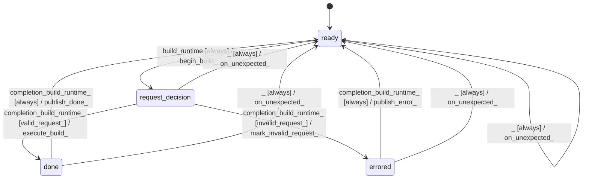

# logits_validator

Source: [`emel/logits/validator/sm.hpp`](https://github.com/stateforward/emel.cpp/blob/main/src/emel/logits/validator/sm.hpp)

## Mermaid

## Transitions

| Source | Event | Guard | Action | Target |
| --- | --- | --- | --- | --- |
| [`ready`](https://github.com/stateforward/emel.cpp/blob/main/src/emel/logits/validator/sm.hpp) | [`build_runtime`](https://github.com/stateforward/emel.cpp/blob/main/src/emel/logits/validator/sm.hpp) | [`always`](https://github.com/stateforward/emel.cpp/blob/main/src/emel/logits/validator/sm.hpp) | [`begin_build>`](https://github.com/stateforward/emel.cpp/blob/main/src/emel/logits/validator/sm.hpp) | [`request_decision`](https://github.com/stateforward/emel.cpp/blob/main/src/emel/logits/validator/sm.hpp) |
| [`request_decision`](https://github.com/stateforward/emel.cpp/blob/main/src/emel/logits/validator/sm.hpp) | [`completion<build_runtime>`](https://github.com/stateforward/emel.cpp/blob/main/src/emel/logits/validator/sm.hpp) | [`valid_request>`](https://github.com/stateforward/emel.cpp/blob/main/src/emel/logits/validator/sm.hpp) | [`execute_build>`](https://github.com/stateforward/emel.cpp/blob/main/src/emel/logits/validator/sm.hpp) | [`done`](https://github.com/stateforward/emel.cpp/blob/main/src/emel/logits/validator/sm.hpp) |
| [`request_decision`](https://github.com/stateforward/emel.cpp/blob/main/src/emel/logits/validator/sm.hpp) | [`completion<build_runtime>`](https://github.com/stateforward/emel.cpp/blob/main/src/emel/logits/validator/sm.hpp) | [`invalid_request>`](https://github.com/stateforward/emel.cpp/blob/main/src/emel/logits/validator/sm.hpp) | [`mark_invalid_request>`](https://github.com/stateforward/emel.cpp/blob/main/src/emel/logits/validator/sm.hpp) | [`errored`](https://github.com/stateforward/emel.cpp/blob/main/src/emel/logits/validator/sm.hpp) |
| [`done`](https://github.com/stateforward/emel.cpp/blob/main/src/emel/logits/validator/sm.hpp) | [`completion<build_runtime>`](https://github.com/stateforward/emel.cpp/blob/main/src/emel/logits/validator/sm.hpp) | [`always`](https://github.com/stateforward/emel.cpp/blob/main/src/emel/logits/validator/sm.hpp) | [`publish_done>`](https://github.com/stateforward/emel.cpp/blob/main/src/emel/logits/validator/sm.hpp) | [`ready`](https://github.com/stateforward/emel.cpp/blob/main/src/emel/logits/validator/sm.hpp) |
| [`errored`](https://github.com/stateforward/emel.cpp/blob/main/src/emel/logits/validator/sm.hpp) | [`completion<build_runtime>`](https://github.com/stateforward/emel.cpp/blob/main/src/emel/logits/validator/sm.hpp) | [`always`](https://github.com/stateforward/emel.cpp/blob/main/src/emel/logits/validator/sm.hpp) | [`publish_error>`](https://github.com/stateforward/emel.cpp/blob/main/src/emel/logits/validator/sm.hpp) | [`ready`](https://github.com/stateforward/emel.cpp/blob/main/src/emel/logits/validator/sm.hpp) |
| [`ready`](https://github.com/stateforward/emel.cpp/blob/main/src/emel/logits/validator/sm.hpp) | [`_`](https://github.com/stateforward/emel.cpp/blob/main/src/emel/logits/validator/sm.hpp) | [`always`](https://github.com/stateforward/emel.cpp/blob/main/src/emel/logits/validator/sm.hpp) | [`on_unexpected>`](https://github.com/stateforward/emel.cpp/blob/main/src/emel/logits/validator/sm.hpp) | [`ready`](https://github.com/stateforward/emel.cpp/blob/main/src/emel/logits/validator/sm.hpp) |
| [`request_decision`](https://github.com/stateforward/emel.cpp/blob/main/src/emel/logits/validator/sm.hpp) | [`_`](https://github.com/stateforward/emel.cpp/blob/main/src/emel/logits/validator/sm.hpp) | [`always`](https://github.com/stateforward/emel.cpp/blob/main/src/emel/logits/validator/sm.hpp) | [`on_unexpected>`](https://github.com/stateforward/emel.cpp/blob/main/src/emel/logits/validator/sm.hpp) | [`ready`](https://github.com/stateforward/emel.cpp/blob/main/src/emel/logits/validator/sm.hpp) |
| [`done`](https://github.com/stateforward/emel.cpp/blob/main/src/emel/logits/validator/sm.hpp) | [`_`](https://github.com/stateforward/emel.cpp/blob/main/src/emel/logits/validator/sm.hpp) | [`always`](https://github.com/stateforward/emel.cpp/blob/main/src/emel/logits/validator/sm.hpp) | [`on_unexpected>`](https://github.com/stateforward/emel.cpp/blob/main/src/emel/logits/validator/sm.hpp) | [`ready`](https://github.com/stateforward/emel.cpp/blob/main/src/emel/logits/validator/sm.hpp) |
| [`errored`](https://github.com/stateforward/emel.cpp/blob/main/src/emel/logits/validator/sm.hpp) | [`_`](https://github.com/stateforward/emel.cpp/blob/main/src/emel/logits/validator/sm.hpp) | [`always`](https://github.com/stateforward/emel.cpp/blob/main/src/emel/logits/validator/sm.hpp) | [`on_unexpected>`](https://github.com/stateforward/emel.cpp/blob/main/src/emel/logits/validator/sm.hpp) | [`ready`](https://github.com/stateforward/emel.cpp/blob/main/src/emel/logits/validator/sm.hpp) |
