# memory_kv

Source: [`emel/memory/kv/sm.hpp`](https://github.com/stateforward/emel.cpp/blob/main/src/emel/memory/kv/sm.hpp)

## Mermaid

```mermaid
stateDiagram-v2
  direction TB
  [*] --> ready
  ready --> reserve_request_decision : reserve_runtime [always] / begin_reserve_
  reserve_request_decision --> reserve_exec : completion_reserve_runtime_ [reserve_request_valid_] / none
  reserve_request_decision --> errored : completion_reserve_runtime_ [reserve_request_invalid_] / mark_invalid_request_
  reserve_exec --> reserve_result_decision : completion_reserve_runtime_ [always] / exec_reserve_
  reserve_result_decision --> done : completion_reserve_runtime_ [operation_succeeded_] / none
  reserve_result_decision --> errored : completion_reserve_runtime_ [operation_failed_with_error_] / mark_error_from_operation_
  reserve_result_decision --> errored : completion_reserve_runtime_ [operation_failed_without_error_] / mark_backend_error_
  ready --> allocate_sequence_request_decision : allocate_sequence_runtime [always] / begin_allocate_sequence_
  allocate_sequence_request_decision --> allocate_sequence_exec : completion_allocate_sequence_runtime_ [allocate_sequence_request_valid_] / none
  allocate_sequence_request_decision --> errored : completion_allocate_sequence_runtime_ [allocate_sequence_request_invalid_] / mark_invalid_request_
  allocate_sequence_exec --> allocate_sequence_result_decision : completion_allocate_sequence_runtime_ [always] / exec_allocate_sequence_
  allocate_sequence_result_decision --> done : completion_allocate_sequence_runtime_ [operation_succeeded_] / none
  allocate_sequence_result_decision --> errored : completion_allocate_sequence_runtime_ [operation_failed_with_error_] / mark_error_from_operation_
  allocate_sequence_result_decision --> errored : completion_allocate_sequence_runtime_ [operation_failed_without_error_] / mark_backend_error_
  ready --> allocate_slots_request_decision : allocate_slots_runtime [always] / begin_allocate_slots_
  allocate_slots_request_decision --> allocate_slots_request_shape_decision : completion_allocate_slots_runtime_ [always] / none
  allocate_slots_request_shape_decision --> allocate_slots_request_length_decision : completion_allocate_slots_runtime_ [allocate_slots_request_shape_valid_] / none
  allocate_slots_request_shape_decision --> errored : completion_allocate_slots_runtime_ [allocate_slots_request_shape_invalid_] / mark_invalid_request_
  allocate_slots_request_length_decision --> allocate_slots_request_block_layout_decision : completion_allocate_slots_runtime_ [allocate_slots_request_length_valid_] / none
  allocate_slots_request_length_decision --> errored : completion_allocate_slots_runtime_ [allocate_slots_request_length_invalid_] / mark_invalid_request_
  allocate_slots_request_block_layout_decision --> allocate_slots_request_capacity_decision : completion_allocate_slots_runtime_ [allocate_slots_request_block_layout_valid_] / none
  allocate_slots_request_block_layout_decision --> errored : completion_allocate_slots_runtime_ [allocate_slots_request_block_layout_invalid_] / mark_backend_error_
  allocate_slots_request_capacity_decision --> allocate_slots_exec : completion_allocate_slots_runtime_ [allocate_slots_request_capacity_valid_] / none
  allocate_slots_request_capacity_decision --> errored : completion_allocate_slots_runtime_ [allocate_slots_request_capacity_invalid_] / mark_out_of_memory_
  allocate_slots_exec --> allocate_slots_result_decision : completion_allocate_slots_runtime_ [always] / exec_allocate_slots_
  allocate_slots_result_decision --> done : completion_allocate_slots_runtime_ [operation_succeeded_] / none
  allocate_slots_result_decision --> errored : completion_allocate_slots_runtime_ [operation_failed_with_error_] / mark_error_from_operation_
  allocate_slots_result_decision --> errored : completion_allocate_slots_runtime_ [operation_failed_without_error_] / mark_backend_error_
  ready --> branch_sequence_request_decision : branch_sequence_runtime [always] / begin_branch_sequence_
  branch_sequence_request_decision --> branch_sequence_exec : completion_branch_sequence_runtime_ [branch_sequence_request_valid_] / none
  branch_sequence_request_decision --> errored : completion_branch_sequence_runtime_ [branch_sequence_request_invalid_] / mark_invalid_request_
  branch_sequence_exec --> branch_sequence_result_decision : completion_branch_sequence_runtime_ [always] / exec_branch_sequence_
  branch_sequence_result_decision --> done : completion_branch_sequence_runtime_ [operation_succeeded_] / none
  branch_sequence_result_decision --> errored : completion_branch_sequence_runtime_ [operation_failed_with_error_] / mark_error_from_operation_
  branch_sequence_result_decision --> errored : completion_branch_sequence_runtime_ [operation_failed_without_error_] / mark_backend_error_
  ready --> free_sequence_request_decision : free_sequence_runtime [always] / begin_free_sequence_
  free_sequence_request_decision --> free_sequence_exec : completion_free_sequence_runtime_ [free_sequence_request_valid_] / none
  free_sequence_request_decision --> errored : completion_free_sequence_runtime_ [free_sequence_request_invalid_] / mark_invalid_request_
  free_sequence_exec --> free_sequence_result_decision : completion_free_sequence_runtime_ [always] / exec_free_sequence_
  free_sequence_result_decision --> done : completion_free_sequence_runtime_ [operation_succeeded_] / none
  free_sequence_result_decision --> errored : completion_free_sequence_runtime_ [operation_failed_with_error_] / mark_error_from_operation_
  free_sequence_result_decision --> errored : completion_free_sequence_runtime_ [operation_failed_without_error_] / mark_backend_error_
  ready --> rollback_slots_request_decision : rollback_slots_runtime [always] / begin_rollback_slots_
  rollback_slots_request_decision --> rollback_slots_exec : completion_rollback_slots_runtime_ [rollback_slots_request_valid_] / none
  rollback_slots_request_decision --> errored : completion_rollback_slots_runtime_ [rollback_slots_request_invalid_] / mark_invalid_request_
  rollback_slots_exec --> rollback_slots_result_decision : completion_rollback_slots_runtime_ [always] / exec_rollback_slots_
  rollback_slots_result_decision --> done : completion_rollback_slots_runtime_ [operation_succeeded_] / none
  rollback_slots_result_decision --> errored : completion_rollback_slots_runtime_ [operation_failed_with_error_] / mark_error_from_operation_
  rollback_slots_result_decision --> errored : completion_rollback_slots_runtime_ [operation_failed_without_error_] / mark_backend_error_
  ready --> capture_request_decision : capture_view_runtime [always] / begin_capture_view_
  capture_request_decision --> capture_exec : completion_capture_view_runtime_ [capture_request_valid_] / none
  capture_request_decision --> errored : completion_capture_view_runtime_ [capture_request_invalid_] / mark_invalid_request_
  capture_exec --> capture_result_decision : completion_capture_view_runtime_ [always] / exec_capture_view_
  capture_result_decision --> done : completion_capture_view_runtime_ [operation_succeeded_] / none
  capture_result_decision --> errored : completion_capture_view_runtime_ [operation_failed_with_error_] / mark_error_from_operation_
  capture_result_decision --> errored : completion_capture_view_runtime_ [operation_failed_without_error_] / mark_backend_error_
  done --> ready : completion_reserve_runtime_ [always] / publish_done_
  errored --> ready : completion_reserve_runtime_ [always] / publish_error_
  done --> ready : completion_allocate_sequence_runtime_ [always] / publish_done_
  errored --> ready : completion_allocate_sequence_runtime_ [always] / publish_error_
  done --> ready : completion_allocate_slots_runtime_ [always] / publish_done_
  errored --> ready : completion_allocate_slots_runtime_ [always] / publish_error_
  done --> ready : completion_branch_sequence_runtime_ [always] / publish_done_
  errored --> ready : completion_branch_sequence_runtime_ [always] / publish_error_
  done --> ready : completion_free_sequence_runtime_ [always] / publish_done_
  errored --> ready : completion_free_sequence_runtime_ [always] / publish_error_
  done --> ready : completion_rollback_slots_runtime_ [always] / publish_done_
  errored --> ready : completion_rollback_slots_runtime_ [always] / publish_error_
  done --> ready : completion_capture_view_runtime_ [always] / publish_done_
  errored --> ready : completion_capture_view_runtime_ [always] / publish_error_
  ready --> ready : _ [always] / on_unexpected_
  reserve_request_decision --> ready : _ [always] / on_unexpected_
  reserve_exec --> ready : _ [always] / on_unexpected_
  reserve_result_decision --> ready : _ [always] / on_unexpected_
  allocate_sequence_request_decision --> ready : _ [always] / on_unexpected_
  allocate_sequence_exec --> ready : _ [always] / on_unexpected_
  allocate_sequence_result_decision --> ready : _ [always] / on_unexpected_
  allocate_slots_request_decision --> ready : _ [always] / on_unexpected_
  allocate_slots_request_shape_decision --> ready : _ [always] / on_unexpected_
  allocate_slots_request_length_decision --> ready : _ [always] / on_unexpected_
  allocate_slots_request_block_layout_decision --> ready : _ [always] / on_unexpected_
  allocate_slots_request_capacity_decision --> ready : _ [always] / on_unexpected_
  allocate_slots_exec --> ready : _ [always] / on_unexpected_
  allocate_slots_result_decision --> ready : _ [always] / on_unexpected_
  branch_sequence_request_decision --> ready : _ [always] / on_unexpected_
  branch_sequence_exec --> ready : _ [always] / on_unexpected_
  branch_sequence_result_decision --> ready : _ [always] / on_unexpected_
  free_sequence_request_decision --> ready : _ [always] / on_unexpected_
  free_sequence_exec --> ready : _ [always] / on_unexpected_
  free_sequence_result_decision --> ready : _ [always] / on_unexpected_
  rollback_slots_request_decision --> ready : _ [always] / on_unexpected_
  rollback_slots_exec --> ready : _ [always] / on_unexpected_
  rollback_slots_result_decision --> ready : _ [always] / on_unexpected_
  capture_request_decision --> ready : _ [always] / on_unexpected_
  capture_exec --> ready : _ [always] / on_unexpected_
  capture_result_decision --> ready : _ [always] / on_unexpected_
  done --> ready : _ [always] / on_unexpected_
  errored --> ready : _ [always] / on_unexpected_
```

## Transitions

| Source | Event | Guard | Action | Target |
| --- | --- | --- | --- | --- |
| [`ready`](https://github.com/stateforward/emel.cpp/blob/main/src/emel/memory/kv/sm.hpp) | [`reserve_runtime`](https://github.com/stateforward/emel.cpp/blob/main/src/emel/memory/kv/sm.hpp) | [`always`](https://github.com/stateforward/emel.cpp/blob/main/src/emel/memory/kv/sm.hpp) | [`begin_reserve>`](https://github.com/stateforward/emel.cpp/blob/main/src/emel/memory/kv/sm.hpp) | [`reserve_request_decision`](https://github.com/stateforward/emel.cpp/blob/main/src/emel/memory/kv/sm.hpp) |
| [`reserve_request_decision`](https://github.com/stateforward/emel.cpp/blob/main/src/emel/memory/kv/sm.hpp) | [`completion<reserve_runtime>`](https://github.com/stateforward/emel.cpp/blob/main/src/emel/memory/kv/sm.hpp) | [`reserve_request_valid>`](https://github.com/stateforward/emel.cpp/blob/main/src/emel/memory/kv/sm.hpp) | [`none`](https://github.com/stateforward/emel.cpp/blob/main/src/emel/memory/kv/sm.hpp) | [`reserve_exec`](https://github.com/stateforward/emel.cpp/blob/main/src/emel/memory/kv/sm.hpp) |
| [`reserve_request_decision`](https://github.com/stateforward/emel.cpp/blob/main/src/emel/memory/kv/sm.hpp) | [`completion<reserve_runtime>`](https://github.com/stateforward/emel.cpp/blob/main/src/emel/memory/kv/sm.hpp) | [`reserve_request_invalid>`](https://github.com/stateforward/emel.cpp/blob/main/src/emel/memory/kv/sm.hpp) | [`mark_invalid_request>`](https://github.com/stateforward/emel.cpp/blob/main/src/emel/memory/kv/sm.hpp) | [`errored`](https://github.com/stateforward/emel.cpp/blob/main/src/emel/memory/kv/sm.hpp) |
| [`reserve_exec`](https://github.com/stateforward/emel.cpp/blob/main/src/emel/memory/kv/sm.hpp) | [`completion<reserve_runtime>`](https://github.com/stateforward/emel.cpp/blob/main/src/emel/memory/kv/sm.hpp) | [`always`](https://github.com/stateforward/emel.cpp/blob/main/src/emel/memory/kv/sm.hpp) | [`exec_reserve>`](https://github.com/stateforward/emel.cpp/blob/main/src/emel/memory/kv/sm.hpp) | [`reserve_result_decision`](https://github.com/stateforward/emel.cpp/blob/main/src/emel/memory/kv/sm.hpp) |
| [`reserve_result_decision`](https://github.com/stateforward/emel.cpp/blob/main/src/emel/memory/kv/sm.hpp) | [`completion<reserve_runtime>`](https://github.com/stateforward/emel.cpp/blob/main/src/emel/memory/kv/sm.hpp) | [`operation_succeeded>`](https://github.com/stateforward/emel.cpp/blob/main/src/emel/memory/kv/sm.hpp) | [`none`](https://github.com/stateforward/emel.cpp/blob/main/src/emel/memory/kv/sm.hpp) | [`done`](https://github.com/stateforward/emel.cpp/blob/main/src/emel/memory/kv/sm.hpp) |
| [`reserve_result_decision`](https://github.com/stateforward/emel.cpp/blob/main/src/emel/memory/kv/sm.hpp) | [`completion<reserve_runtime>`](https://github.com/stateforward/emel.cpp/blob/main/src/emel/memory/kv/sm.hpp) | [`operation_failed_with_error>`](https://github.com/stateforward/emel.cpp/blob/main/src/emel/memory/kv/sm.hpp) | [`mark_error_from_operation>`](https://github.com/stateforward/emel.cpp/blob/main/src/emel/memory/kv/sm.hpp) | [`errored`](https://github.com/stateforward/emel.cpp/blob/main/src/emel/memory/kv/sm.hpp) |
| [`reserve_result_decision`](https://github.com/stateforward/emel.cpp/blob/main/src/emel/memory/kv/sm.hpp) | [`completion<reserve_runtime>`](https://github.com/stateforward/emel.cpp/blob/main/src/emel/memory/kv/sm.hpp) | [`operation_failed_without_error>`](https://github.com/stateforward/emel.cpp/blob/main/src/emel/memory/kv/sm.hpp) | [`mark_backend_error>`](https://github.com/stateforward/emel.cpp/blob/main/src/emel/memory/kv/sm.hpp) | [`errored`](https://github.com/stateforward/emel.cpp/blob/main/src/emel/memory/kv/sm.hpp) |
| [`ready`](https://github.com/stateforward/emel.cpp/blob/main/src/emel/memory/kv/sm.hpp) | [`allocate_sequence_runtime`](https://github.com/stateforward/emel.cpp/blob/main/src/emel/memory/kv/sm.hpp) | [`always`](https://github.com/stateforward/emel.cpp/blob/main/src/emel/memory/kv/sm.hpp) | [`begin_allocate_sequence>`](https://github.com/stateforward/emel.cpp/blob/main/src/emel/memory/kv/sm.hpp) | [`allocate_sequence_request_decision`](https://github.com/stateforward/emel.cpp/blob/main/src/emel/memory/kv/sm.hpp) |
| [`allocate_sequence_request_decision`](https://github.com/stateforward/emel.cpp/blob/main/src/emel/memory/kv/sm.hpp) | [`completion<allocate_sequence_runtime>`](https://github.com/stateforward/emel.cpp/blob/main/src/emel/memory/kv/sm.hpp) | [`allocate_sequence_request_valid>`](https://github.com/stateforward/emel.cpp/blob/main/src/emel/memory/kv/sm.hpp) | [`none`](https://github.com/stateforward/emel.cpp/blob/main/src/emel/memory/kv/sm.hpp) | [`allocate_sequence_exec`](https://github.com/stateforward/emel.cpp/blob/main/src/emel/memory/kv/sm.hpp) |
| [`allocate_sequence_request_decision`](https://github.com/stateforward/emel.cpp/blob/main/src/emel/memory/kv/sm.hpp) | [`completion<allocate_sequence_runtime>`](https://github.com/stateforward/emel.cpp/blob/main/src/emel/memory/kv/sm.hpp) | [`allocate_sequence_request_invalid>`](https://github.com/stateforward/emel.cpp/blob/main/src/emel/memory/kv/sm.hpp) | [`mark_invalid_request>`](https://github.com/stateforward/emel.cpp/blob/main/src/emel/memory/kv/sm.hpp) | [`errored`](https://github.com/stateforward/emel.cpp/blob/main/src/emel/memory/kv/sm.hpp) |
| [`allocate_sequence_exec`](https://github.com/stateforward/emel.cpp/blob/main/src/emel/memory/kv/sm.hpp) | [`completion<allocate_sequence_runtime>`](https://github.com/stateforward/emel.cpp/blob/main/src/emel/memory/kv/sm.hpp) | [`always`](https://github.com/stateforward/emel.cpp/blob/main/src/emel/memory/kv/sm.hpp) | [`exec_allocate_sequence>`](https://github.com/stateforward/emel.cpp/blob/main/src/emel/memory/kv/sm.hpp) | [`allocate_sequence_result_decision`](https://github.com/stateforward/emel.cpp/blob/main/src/emel/memory/kv/sm.hpp) |
| [`allocate_sequence_result_decision`](https://github.com/stateforward/emel.cpp/blob/main/src/emel/memory/kv/sm.hpp) | [`completion<allocate_sequence_runtime>`](https://github.com/stateforward/emel.cpp/blob/main/src/emel/memory/kv/sm.hpp) | [`operation_succeeded>`](https://github.com/stateforward/emel.cpp/blob/main/src/emel/memory/kv/sm.hpp) | [`none`](https://github.com/stateforward/emel.cpp/blob/main/src/emel/memory/kv/sm.hpp) | [`done`](https://github.com/stateforward/emel.cpp/blob/main/src/emel/memory/kv/sm.hpp) |
| [`allocate_sequence_result_decision`](https://github.com/stateforward/emel.cpp/blob/main/src/emel/memory/kv/sm.hpp) | [`completion<allocate_sequence_runtime>`](https://github.com/stateforward/emel.cpp/blob/main/src/emel/memory/kv/sm.hpp) | [`operation_failed_with_error>`](https://github.com/stateforward/emel.cpp/blob/main/src/emel/memory/kv/sm.hpp) | [`mark_error_from_operation>`](https://github.com/stateforward/emel.cpp/blob/main/src/emel/memory/kv/sm.hpp) | [`errored`](https://github.com/stateforward/emel.cpp/blob/main/src/emel/memory/kv/sm.hpp) |
| [`allocate_sequence_result_decision`](https://github.com/stateforward/emel.cpp/blob/main/src/emel/memory/kv/sm.hpp) | [`completion<allocate_sequence_runtime>`](https://github.com/stateforward/emel.cpp/blob/main/src/emel/memory/kv/sm.hpp) | [`operation_failed_without_error>`](https://github.com/stateforward/emel.cpp/blob/main/src/emel/memory/kv/sm.hpp) | [`mark_backend_error>`](https://github.com/stateforward/emel.cpp/blob/main/src/emel/memory/kv/sm.hpp) | [`errored`](https://github.com/stateforward/emel.cpp/blob/main/src/emel/memory/kv/sm.hpp) |
| [`ready`](https://github.com/stateforward/emel.cpp/blob/main/src/emel/memory/kv/sm.hpp) | [`allocate_slots_runtime`](https://github.com/stateforward/emel.cpp/blob/main/src/emel/memory/kv/sm.hpp) | [`always`](https://github.com/stateforward/emel.cpp/blob/main/src/emel/memory/kv/sm.hpp) | [`begin_allocate_slots>`](https://github.com/stateforward/emel.cpp/blob/main/src/emel/memory/kv/sm.hpp) | [`allocate_slots_request_decision`](https://github.com/stateforward/emel.cpp/blob/main/src/emel/memory/kv/sm.hpp) |
| [`allocate_slots_request_decision`](https://github.com/stateforward/emel.cpp/blob/main/src/emel/memory/kv/sm.hpp) | [`completion<allocate_slots_runtime>`](https://github.com/stateforward/emel.cpp/blob/main/src/emel/memory/kv/sm.hpp) | [`always`](https://github.com/stateforward/emel.cpp/blob/main/src/emel/memory/kv/sm.hpp) | [`none`](https://github.com/stateforward/emel.cpp/blob/main/src/emel/memory/kv/sm.hpp) | [`allocate_slots_request_shape_decision`](https://github.com/stateforward/emel.cpp/blob/main/src/emel/memory/kv/sm.hpp) |
| [`allocate_slots_request_shape_decision`](https://github.com/stateforward/emel.cpp/blob/main/src/emel/memory/kv/sm.hpp) | [`completion<allocate_slots_runtime>`](https://github.com/stateforward/emel.cpp/blob/main/src/emel/memory/kv/sm.hpp) | [`allocate_slots_request_shape_valid>`](https://github.com/stateforward/emel.cpp/blob/main/src/emel/memory/kv/sm.hpp) | [`none`](https://github.com/stateforward/emel.cpp/blob/main/src/emel/memory/kv/sm.hpp) | [`allocate_slots_request_length_decision`](https://github.com/stateforward/emel.cpp/blob/main/src/emel/memory/kv/sm.hpp) |
| [`allocate_slots_request_shape_decision`](https://github.com/stateforward/emel.cpp/blob/main/src/emel/memory/kv/sm.hpp) | [`completion<allocate_slots_runtime>`](https://github.com/stateforward/emel.cpp/blob/main/src/emel/memory/kv/sm.hpp) | [`allocate_slots_request_shape_invalid>`](https://github.com/stateforward/emel.cpp/blob/main/src/emel/memory/kv/sm.hpp) | [`mark_invalid_request>`](https://github.com/stateforward/emel.cpp/blob/main/src/emel/memory/kv/sm.hpp) | [`errored`](https://github.com/stateforward/emel.cpp/blob/main/src/emel/memory/kv/sm.hpp) |
| [`allocate_slots_request_length_decision`](https://github.com/stateforward/emel.cpp/blob/main/src/emel/memory/kv/sm.hpp) | [`completion<allocate_slots_runtime>`](https://github.com/stateforward/emel.cpp/blob/main/src/emel/memory/kv/sm.hpp) | [`allocate_slots_request_length_valid>`](https://github.com/stateforward/emel.cpp/blob/main/src/emel/memory/kv/sm.hpp) | [`none`](https://github.com/stateforward/emel.cpp/blob/main/src/emel/memory/kv/sm.hpp) | [`allocate_slots_request_block_layout_decision`](https://github.com/stateforward/emel.cpp/blob/main/src/emel/memory/kv/sm.hpp) |
| [`allocate_slots_request_length_decision`](https://github.com/stateforward/emel.cpp/blob/main/src/emel/memory/kv/sm.hpp) | [`completion<allocate_slots_runtime>`](https://github.com/stateforward/emel.cpp/blob/main/src/emel/memory/kv/sm.hpp) | [`allocate_slots_request_length_invalid>`](https://github.com/stateforward/emel.cpp/blob/main/src/emel/memory/kv/sm.hpp) | [`mark_invalid_request>`](https://github.com/stateforward/emel.cpp/blob/main/src/emel/memory/kv/sm.hpp) | [`errored`](https://github.com/stateforward/emel.cpp/blob/main/src/emel/memory/kv/sm.hpp) |
| [`allocate_slots_request_block_layout_decision`](https://github.com/stateforward/emel.cpp/blob/main/src/emel/memory/kv/sm.hpp) | [`completion<allocate_slots_runtime>`](https://github.com/stateforward/emel.cpp/blob/main/src/emel/memory/kv/sm.hpp) | [`allocate_slots_request_block_layout_valid>`](https://github.com/stateforward/emel.cpp/blob/main/src/emel/memory/kv/sm.hpp) | [`none`](https://github.com/stateforward/emel.cpp/blob/main/src/emel/memory/kv/sm.hpp) | [`allocate_slots_request_capacity_decision`](https://github.com/stateforward/emel.cpp/blob/main/src/emel/memory/kv/sm.hpp) |
| [`allocate_slots_request_block_layout_decision`](https://github.com/stateforward/emel.cpp/blob/main/src/emel/memory/kv/sm.hpp) | [`completion<allocate_slots_runtime>`](https://github.com/stateforward/emel.cpp/blob/main/src/emel/memory/kv/sm.hpp) | [`allocate_slots_request_block_layout_invalid>`](https://github.com/stateforward/emel.cpp/blob/main/src/emel/memory/kv/sm.hpp) | [`mark_backend_error>`](https://github.com/stateforward/emel.cpp/blob/main/src/emel/memory/kv/sm.hpp) | [`errored`](https://github.com/stateforward/emel.cpp/blob/main/src/emel/memory/kv/sm.hpp) |
| [`allocate_slots_request_capacity_decision`](https://github.com/stateforward/emel.cpp/blob/main/src/emel/memory/kv/sm.hpp) | [`completion<allocate_slots_runtime>`](https://github.com/stateforward/emel.cpp/blob/main/src/emel/memory/kv/sm.hpp) | [`allocate_slots_request_capacity_valid>`](https://github.com/stateforward/emel.cpp/blob/main/src/emel/memory/kv/sm.hpp) | [`none`](https://github.com/stateforward/emel.cpp/blob/main/src/emel/memory/kv/sm.hpp) | [`allocate_slots_exec`](https://github.com/stateforward/emel.cpp/blob/main/src/emel/memory/kv/sm.hpp) |
| [`allocate_slots_request_capacity_decision`](https://github.com/stateforward/emel.cpp/blob/main/src/emel/memory/kv/sm.hpp) | [`completion<allocate_slots_runtime>`](https://github.com/stateforward/emel.cpp/blob/main/src/emel/memory/kv/sm.hpp) | [`allocate_slots_request_capacity_invalid>`](https://github.com/stateforward/emel.cpp/blob/main/src/emel/memory/kv/sm.hpp) | [`mark_out_of_memory>`](https://github.com/stateforward/emel.cpp/blob/main/src/emel/memory/kv/sm.hpp) | [`errored`](https://github.com/stateforward/emel.cpp/blob/main/src/emel/memory/kv/sm.hpp) |
| [`allocate_slots_exec`](https://github.com/stateforward/emel.cpp/blob/main/src/emel/memory/kv/sm.hpp) | [`completion<allocate_slots_runtime>`](https://github.com/stateforward/emel.cpp/blob/main/src/emel/memory/kv/sm.hpp) | [`always`](https://github.com/stateforward/emel.cpp/blob/main/src/emel/memory/kv/sm.hpp) | [`exec_allocate_slots>`](https://github.com/stateforward/emel.cpp/blob/main/src/emel/memory/kv/sm.hpp) | [`allocate_slots_result_decision`](https://github.com/stateforward/emel.cpp/blob/main/src/emel/memory/kv/sm.hpp) |
| [`allocate_slots_result_decision`](https://github.com/stateforward/emel.cpp/blob/main/src/emel/memory/kv/sm.hpp) | [`completion<allocate_slots_runtime>`](https://github.com/stateforward/emel.cpp/blob/main/src/emel/memory/kv/sm.hpp) | [`operation_succeeded>`](https://github.com/stateforward/emel.cpp/blob/main/src/emel/memory/kv/sm.hpp) | [`none`](https://github.com/stateforward/emel.cpp/blob/main/src/emel/memory/kv/sm.hpp) | [`done`](https://github.com/stateforward/emel.cpp/blob/main/src/emel/memory/kv/sm.hpp) |
| [`allocate_slots_result_decision`](https://github.com/stateforward/emel.cpp/blob/main/src/emel/memory/kv/sm.hpp) | [`completion<allocate_slots_runtime>`](https://github.com/stateforward/emel.cpp/blob/main/src/emel/memory/kv/sm.hpp) | [`operation_failed_with_error>`](https://github.com/stateforward/emel.cpp/blob/main/src/emel/memory/kv/sm.hpp) | [`mark_error_from_operation>`](https://github.com/stateforward/emel.cpp/blob/main/src/emel/memory/kv/sm.hpp) | [`errored`](https://github.com/stateforward/emel.cpp/blob/main/src/emel/memory/kv/sm.hpp) |
| [`allocate_slots_result_decision`](https://github.com/stateforward/emel.cpp/blob/main/src/emel/memory/kv/sm.hpp) | [`completion<allocate_slots_runtime>`](https://github.com/stateforward/emel.cpp/blob/main/src/emel/memory/kv/sm.hpp) | [`operation_failed_without_error>`](https://github.com/stateforward/emel.cpp/blob/main/src/emel/memory/kv/sm.hpp) | [`mark_backend_error>`](https://github.com/stateforward/emel.cpp/blob/main/src/emel/memory/kv/sm.hpp) | [`errored`](https://github.com/stateforward/emel.cpp/blob/main/src/emel/memory/kv/sm.hpp) |
| [`ready`](https://github.com/stateforward/emel.cpp/blob/main/src/emel/memory/kv/sm.hpp) | [`branch_sequence_runtime`](https://github.com/stateforward/emel.cpp/blob/main/src/emel/memory/kv/sm.hpp) | [`always`](https://github.com/stateforward/emel.cpp/blob/main/src/emel/memory/kv/sm.hpp) | [`begin_branch_sequence>`](https://github.com/stateforward/emel.cpp/blob/main/src/emel/memory/kv/sm.hpp) | [`branch_sequence_request_decision`](https://github.com/stateforward/emel.cpp/blob/main/src/emel/memory/kv/sm.hpp) |
| [`branch_sequence_request_decision`](https://github.com/stateforward/emel.cpp/blob/main/src/emel/memory/kv/sm.hpp) | [`completion<branch_sequence_runtime>`](https://github.com/stateforward/emel.cpp/blob/main/src/emel/memory/kv/sm.hpp) | [`branch_sequence_request_valid>`](https://github.com/stateforward/emel.cpp/blob/main/src/emel/memory/kv/sm.hpp) | [`none`](https://github.com/stateforward/emel.cpp/blob/main/src/emel/memory/kv/sm.hpp) | [`branch_sequence_exec`](https://github.com/stateforward/emel.cpp/blob/main/src/emel/memory/kv/sm.hpp) |
| [`branch_sequence_request_decision`](https://github.com/stateforward/emel.cpp/blob/main/src/emel/memory/kv/sm.hpp) | [`completion<branch_sequence_runtime>`](https://github.com/stateforward/emel.cpp/blob/main/src/emel/memory/kv/sm.hpp) | [`branch_sequence_request_invalid>`](https://github.com/stateforward/emel.cpp/blob/main/src/emel/memory/kv/sm.hpp) | [`mark_invalid_request>`](https://github.com/stateforward/emel.cpp/blob/main/src/emel/memory/kv/sm.hpp) | [`errored`](https://github.com/stateforward/emel.cpp/blob/main/src/emel/memory/kv/sm.hpp) |
| [`branch_sequence_exec`](https://github.com/stateforward/emel.cpp/blob/main/src/emel/memory/kv/sm.hpp) | [`completion<branch_sequence_runtime>`](https://github.com/stateforward/emel.cpp/blob/main/src/emel/memory/kv/sm.hpp) | [`always`](https://github.com/stateforward/emel.cpp/blob/main/src/emel/memory/kv/sm.hpp) | [`exec_branch_sequence>`](https://github.com/stateforward/emel.cpp/blob/main/src/emel/memory/kv/sm.hpp) | [`branch_sequence_result_decision`](https://github.com/stateforward/emel.cpp/blob/main/src/emel/memory/kv/sm.hpp) |
| [`branch_sequence_result_decision`](https://github.com/stateforward/emel.cpp/blob/main/src/emel/memory/kv/sm.hpp) | [`completion<branch_sequence_runtime>`](https://github.com/stateforward/emel.cpp/blob/main/src/emel/memory/kv/sm.hpp) | [`operation_succeeded>`](https://github.com/stateforward/emel.cpp/blob/main/src/emel/memory/kv/sm.hpp) | [`none`](https://github.com/stateforward/emel.cpp/blob/main/src/emel/memory/kv/sm.hpp) | [`done`](https://github.com/stateforward/emel.cpp/blob/main/src/emel/memory/kv/sm.hpp) |
| [`branch_sequence_result_decision`](https://github.com/stateforward/emel.cpp/blob/main/src/emel/memory/kv/sm.hpp) | [`completion<branch_sequence_runtime>`](https://github.com/stateforward/emel.cpp/blob/main/src/emel/memory/kv/sm.hpp) | [`operation_failed_with_error>`](https://github.com/stateforward/emel.cpp/blob/main/src/emel/memory/kv/sm.hpp) | [`mark_error_from_operation>`](https://github.com/stateforward/emel.cpp/blob/main/src/emel/memory/kv/sm.hpp) | [`errored`](https://github.com/stateforward/emel.cpp/blob/main/src/emel/memory/kv/sm.hpp) |
| [`branch_sequence_result_decision`](https://github.com/stateforward/emel.cpp/blob/main/src/emel/memory/kv/sm.hpp) | [`completion<branch_sequence_runtime>`](https://github.com/stateforward/emel.cpp/blob/main/src/emel/memory/kv/sm.hpp) | [`operation_failed_without_error>`](https://github.com/stateforward/emel.cpp/blob/main/src/emel/memory/kv/sm.hpp) | [`mark_backend_error>`](https://github.com/stateforward/emel.cpp/blob/main/src/emel/memory/kv/sm.hpp) | [`errored`](https://github.com/stateforward/emel.cpp/blob/main/src/emel/memory/kv/sm.hpp) |
| [`ready`](https://github.com/stateforward/emel.cpp/blob/main/src/emel/memory/kv/sm.hpp) | [`free_sequence_runtime`](https://github.com/stateforward/emel.cpp/blob/main/src/emel/memory/kv/sm.hpp) | [`always`](https://github.com/stateforward/emel.cpp/blob/main/src/emel/memory/kv/sm.hpp) | [`begin_free_sequence>`](https://github.com/stateforward/emel.cpp/blob/main/src/emel/memory/kv/sm.hpp) | [`free_sequence_request_decision`](https://github.com/stateforward/emel.cpp/blob/main/src/emel/memory/kv/sm.hpp) |
| [`free_sequence_request_decision`](https://github.com/stateforward/emel.cpp/blob/main/src/emel/memory/kv/sm.hpp) | [`completion<free_sequence_runtime>`](https://github.com/stateforward/emel.cpp/blob/main/src/emel/memory/kv/sm.hpp) | [`free_sequence_request_valid>`](https://github.com/stateforward/emel.cpp/blob/main/src/emel/memory/kv/sm.hpp) | [`none`](https://github.com/stateforward/emel.cpp/blob/main/src/emel/memory/kv/sm.hpp) | [`free_sequence_exec`](https://github.com/stateforward/emel.cpp/blob/main/src/emel/memory/kv/sm.hpp) |
| [`free_sequence_request_decision`](https://github.com/stateforward/emel.cpp/blob/main/src/emel/memory/kv/sm.hpp) | [`completion<free_sequence_runtime>`](https://github.com/stateforward/emel.cpp/blob/main/src/emel/memory/kv/sm.hpp) | [`free_sequence_request_invalid>`](https://github.com/stateforward/emel.cpp/blob/main/src/emel/memory/kv/sm.hpp) | [`mark_invalid_request>`](https://github.com/stateforward/emel.cpp/blob/main/src/emel/memory/kv/sm.hpp) | [`errored`](https://github.com/stateforward/emel.cpp/blob/main/src/emel/memory/kv/sm.hpp) |
| [`free_sequence_exec`](https://github.com/stateforward/emel.cpp/blob/main/src/emel/memory/kv/sm.hpp) | [`completion<free_sequence_runtime>`](https://github.com/stateforward/emel.cpp/blob/main/src/emel/memory/kv/sm.hpp) | [`always`](https://github.com/stateforward/emel.cpp/blob/main/src/emel/memory/kv/sm.hpp) | [`exec_free_sequence>`](https://github.com/stateforward/emel.cpp/blob/main/src/emel/memory/kv/sm.hpp) | [`free_sequence_result_decision`](https://github.com/stateforward/emel.cpp/blob/main/src/emel/memory/kv/sm.hpp) |
| [`free_sequence_result_decision`](https://github.com/stateforward/emel.cpp/blob/main/src/emel/memory/kv/sm.hpp) | [`completion<free_sequence_runtime>`](https://github.com/stateforward/emel.cpp/blob/main/src/emel/memory/kv/sm.hpp) | [`operation_succeeded>`](https://github.com/stateforward/emel.cpp/blob/main/src/emel/memory/kv/sm.hpp) | [`none`](https://github.com/stateforward/emel.cpp/blob/main/src/emel/memory/kv/sm.hpp) | [`done`](https://github.com/stateforward/emel.cpp/blob/main/src/emel/memory/kv/sm.hpp) |
| [`free_sequence_result_decision`](https://github.com/stateforward/emel.cpp/blob/main/src/emel/memory/kv/sm.hpp) | [`completion<free_sequence_runtime>`](https://github.com/stateforward/emel.cpp/blob/main/src/emel/memory/kv/sm.hpp) | [`operation_failed_with_error>`](https://github.com/stateforward/emel.cpp/blob/main/src/emel/memory/kv/sm.hpp) | [`mark_error_from_operation>`](https://github.com/stateforward/emel.cpp/blob/main/src/emel/memory/kv/sm.hpp) | [`errored`](https://github.com/stateforward/emel.cpp/blob/main/src/emel/memory/kv/sm.hpp) |
| [`free_sequence_result_decision`](https://github.com/stateforward/emel.cpp/blob/main/src/emel/memory/kv/sm.hpp) | [`completion<free_sequence_runtime>`](https://github.com/stateforward/emel.cpp/blob/main/src/emel/memory/kv/sm.hpp) | [`operation_failed_without_error>`](https://github.com/stateforward/emel.cpp/blob/main/src/emel/memory/kv/sm.hpp) | [`mark_backend_error>`](https://github.com/stateforward/emel.cpp/blob/main/src/emel/memory/kv/sm.hpp) | [`errored`](https://github.com/stateforward/emel.cpp/blob/main/src/emel/memory/kv/sm.hpp) |
| [`ready`](https://github.com/stateforward/emel.cpp/blob/main/src/emel/memory/kv/sm.hpp) | [`rollback_slots_runtime`](https://github.com/stateforward/emel.cpp/blob/main/src/emel/memory/kv/sm.hpp) | [`always`](https://github.com/stateforward/emel.cpp/blob/main/src/emel/memory/kv/sm.hpp) | [`begin_rollback_slots>`](https://github.com/stateforward/emel.cpp/blob/main/src/emel/memory/kv/sm.hpp) | [`rollback_slots_request_decision`](https://github.com/stateforward/emel.cpp/blob/main/src/emel/memory/kv/sm.hpp) |
| [`rollback_slots_request_decision`](https://github.com/stateforward/emel.cpp/blob/main/src/emel/memory/kv/sm.hpp) | [`completion<rollback_slots_runtime>`](https://github.com/stateforward/emel.cpp/blob/main/src/emel/memory/kv/sm.hpp) | [`rollback_slots_request_valid>`](https://github.com/stateforward/emel.cpp/blob/main/src/emel/memory/kv/sm.hpp) | [`none`](https://github.com/stateforward/emel.cpp/blob/main/src/emel/memory/kv/sm.hpp) | [`rollback_slots_exec`](https://github.com/stateforward/emel.cpp/blob/main/src/emel/memory/kv/sm.hpp) |
| [`rollback_slots_request_decision`](https://github.com/stateforward/emel.cpp/blob/main/src/emel/memory/kv/sm.hpp) | [`completion<rollback_slots_runtime>`](https://github.com/stateforward/emel.cpp/blob/main/src/emel/memory/kv/sm.hpp) | [`rollback_slots_request_invalid>`](https://github.com/stateforward/emel.cpp/blob/main/src/emel/memory/kv/sm.hpp) | [`mark_invalid_request>`](https://github.com/stateforward/emel.cpp/blob/main/src/emel/memory/kv/sm.hpp) | [`errored`](https://github.com/stateforward/emel.cpp/blob/main/src/emel/memory/kv/sm.hpp) |
| [`rollback_slots_exec`](https://github.com/stateforward/emel.cpp/blob/main/src/emel/memory/kv/sm.hpp) | [`completion<rollback_slots_runtime>`](https://github.com/stateforward/emel.cpp/blob/main/src/emel/memory/kv/sm.hpp) | [`always`](https://github.com/stateforward/emel.cpp/blob/main/src/emel/memory/kv/sm.hpp) | [`exec_rollback_slots>`](https://github.com/stateforward/emel.cpp/blob/main/src/emel/memory/kv/sm.hpp) | [`rollback_slots_result_decision`](https://github.com/stateforward/emel.cpp/blob/main/src/emel/memory/kv/sm.hpp) |
| [`rollback_slots_result_decision`](https://github.com/stateforward/emel.cpp/blob/main/src/emel/memory/kv/sm.hpp) | [`completion<rollback_slots_runtime>`](https://github.com/stateforward/emel.cpp/blob/main/src/emel/memory/kv/sm.hpp) | [`operation_succeeded>`](https://github.com/stateforward/emel.cpp/blob/main/src/emel/memory/kv/sm.hpp) | [`none`](https://github.com/stateforward/emel.cpp/blob/main/src/emel/memory/kv/sm.hpp) | [`done`](https://github.com/stateforward/emel.cpp/blob/main/src/emel/memory/kv/sm.hpp) |
| [`rollback_slots_result_decision`](https://github.com/stateforward/emel.cpp/blob/main/src/emel/memory/kv/sm.hpp) | [`completion<rollback_slots_runtime>`](https://github.com/stateforward/emel.cpp/blob/main/src/emel/memory/kv/sm.hpp) | [`operation_failed_with_error>`](https://github.com/stateforward/emel.cpp/blob/main/src/emel/memory/kv/sm.hpp) | [`mark_error_from_operation>`](https://github.com/stateforward/emel.cpp/blob/main/src/emel/memory/kv/sm.hpp) | [`errored`](https://github.com/stateforward/emel.cpp/blob/main/src/emel/memory/kv/sm.hpp) |
| [`rollback_slots_result_decision`](https://github.com/stateforward/emel.cpp/blob/main/src/emel/memory/kv/sm.hpp) | [`completion<rollback_slots_runtime>`](https://github.com/stateforward/emel.cpp/blob/main/src/emel/memory/kv/sm.hpp) | [`operation_failed_without_error>`](https://github.com/stateforward/emel.cpp/blob/main/src/emel/memory/kv/sm.hpp) | [`mark_backend_error>`](https://github.com/stateforward/emel.cpp/blob/main/src/emel/memory/kv/sm.hpp) | [`errored`](https://github.com/stateforward/emel.cpp/blob/main/src/emel/memory/kv/sm.hpp) |
| [`ready`](https://github.com/stateforward/emel.cpp/blob/main/src/emel/memory/kv/sm.hpp) | [`capture_view_runtime`](https://github.com/stateforward/emel.cpp/blob/main/src/emel/memory/kv/sm.hpp) | [`always`](https://github.com/stateforward/emel.cpp/blob/main/src/emel/memory/kv/sm.hpp) | [`begin_capture_view>`](https://github.com/stateforward/emel.cpp/blob/main/src/emel/memory/kv/sm.hpp) | [`capture_request_decision`](https://github.com/stateforward/emel.cpp/blob/main/src/emel/memory/kv/sm.hpp) |
| [`capture_request_decision`](https://github.com/stateforward/emel.cpp/blob/main/src/emel/memory/kv/sm.hpp) | [`completion<capture_view_runtime>`](https://github.com/stateforward/emel.cpp/blob/main/src/emel/memory/kv/sm.hpp) | [`capture_request_valid>`](https://github.com/stateforward/emel.cpp/blob/main/src/emel/memory/kv/sm.hpp) | [`none`](https://github.com/stateforward/emel.cpp/blob/main/src/emel/memory/kv/sm.hpp) | [`capture_exec`](https://github.com/stateforward/emel.cpp/blob/main/src/emel/memory/kv/sm.hpp) |
| [`capture_request_decision`](https://github.com/stateforward/emel.cpp/blob/main/src/emel/memory/kv/sm.hpp) | [`completion<capture_view_runtime>`](https://github.com/stateforward/emel.cpp/blob/main/src/emel/memory/kv/sm.hpp) | [`capture_request_invalid>`](https://github.com/stateforward/emel.cpp/blob/main/src/emel/memory/kv/sm.hpp) | [`mark_invalid_request>`](https://github.com/stateforward/emel.cpp/blob/main/src/emel/memory/kv/sm.hpp) | [`errored`](https://github.com/stateforward/emel.cpp/blob/main/src/emel/memory/kv/sm.hpp) |
| [`capture_exec`](https://github.com/stateforward/emel.cpp/blob/main/src/emel/memory/kv/sm.hpp) | [`completion<capture_view_runtime>`](https://github.com/stateforward/emel.cpp/blob/main/src/emel/memory/kv/sm.hpp) | [`always`](https://github.com/stateforward/emel.cpp/blob/main/src/emel/memory/kv/sm.hpp) | [`exec_capture_view>`](https://github.com/stateforward/emel.cpp/blob/main/src/emel/memory/kv/sm.hpp) | [`capture_result_decision`](https://github.com/stateforward/emel.cpp/blob/main/src/emel/memory/kv/sm.hpp) |
| [`capture_result_decision`](https://github.com/stateforward/emel.cpp/blob/main/src/emel/memory/kv/sm.hpp) | [`completion<capture_view_runtime>`](https://github.com/stateforward/emel.cpp/blob/main/src/emel/memory/kv/sm.hpp) | [`operation_succeeded>`](https://github.com/stateforward/emel.cpp/blob/main/src/emel/memory/kv/sm.hpp) | [`none`](https://github.com/stateforward/emel.cpp/blob/main/src/emel/memory/kv/sm.hpp) | [`done`](https://github.com/stateforward/emel.cpp/blob/main/src/emel/memory/kv/sm.hpp) |
| [`capture_result_decision`](https://github.com/stateforward/emel.cpp/blob/main/src/emel/memory/kv/sm.hpp) | [`completion<capture_view_runtime>`](https://github.com/stateforward/emel.cpp/blob/main/src/emel/memory/kv/sm.hpp) | [`operation_failed_with_error>`](https://github.com/stateforward/emel.cpp/blob/main/src/emel/memory/kv/sm.hpp) | [`mark_error_from_operation>`](https://github.com/stateforward/emel.cpp/blob/main/src/emel/memory/kv/sm.hpp) | [`errored`](https://github.com/stateforward/emel.cpp/blob/main/src/emel/memory/kv/sm.hpp) |
| [`capture_result_decision`](https://github.com/stateforward/emel.cpp/blob/main/src/emel/memory/kv/sm.hpp) | [`completion<capture_view_runtime>`](https://github.com/stateforward/emel.cpp/blob/main/src/emel/memory/kv/sm.hpp) | [`operation_failed_without_error>`](https://github.com/stateforward/emel.cpp/blob/main/src/emel/memory/kv/sm.hpp) | [`mark_backend_error>`](https://github.com/stateforward/emel.cpp/blob/main/src/emel/memory/kv/sm.hpp) | [`errored`](https://github.com/stateforward/emel.cpp/blob/main/src/emel/memory/kv/sm.hpp) |
| [`done`](https://github.com/stateforward/emel.cpp/blob/main/src/emel/memory/kv/sm.hpp) | [`completion<reserve_runtime>`](https://github.com/stateforward/emel.cpp/blob/main/src/emel/memory/kv/sm.hpp) | [`always`](https://github.com/stateforward/emel.cpp/blob/main/src/emel/memory/kv/sm.hpp) | [`publish_done>`](https://github.com/stateforward/emel.cpp/blob/main/src/emel/memory/kv/sm.hpp) | [`ready`](https://github.com/stateforward/emel.cpp/blob/main/src/emel/memory/kv/sm.hpp) |
| [`errored`](https://github.com/stateforward/emel.cpp/blob/main/src/emel/memory/kv/sm.hpp) | [`completion<reserve_runtime>`](https://github.com/stateforward/emel.cpp/blob/main/src/emel/memory/kv/sm.hpp) | [`always`](https://github.com/stateforward/emel.cpp/blob/main/src/emel/memory/kv/sm.hpp) | [`publish_error>`](https://github.com/stateforward/emel.cpp/blob/main/src/emel/memory/kv/sm.hpp) | [`ready`](https://github.com/stateforward/emel.cpp/blob/main/src/emel/memory/kv/sm.hpp) |
| [`done`](https://github.com/stateforward/emel.cpp/blob/main/src/emel/memory/kv/sm.hpp) | [`completion<allocate_sequence_runtime>`](https://github.com/stateforward/emel.cpp/blob/main/src/emel/memory/kv/sm.hpp) | [`always`](https://github.com/stateforward/emel.cpp/blob/main/src/emel/memory/kv/sm.hpp) | [`publish_done>`](https://github.com/stateforward/emel.cpp/blob/main/src/emel/memory/kv/sm.hpp) | [`ready`](https://github.com/stateforward/emel.cpp/blob/main/src/emel/memory/kv/sm.hpp) |
| [`errored`](https://github.com/stateforward/emel.cpp/blob/main/src/emel/memory/kv/sm.hpp) | [`completion<allocate_sequence_runtime>`](https://github.com/stateforward/emel.cpp/blob/main/src/emel/memory/kv/sm.hpp) | [`always`](https://github.com/stateforward/emel.cpp/blob/main/src/emel/memory/kv/sm.hpp) | [`publish_error>`](https://github.com/stateforward/emel.cpp/blob/main/src/emel/memory/kv/sm.hpp) | [`ready`](https://github.com/stateforward/emel.cpp/blob/main/src/emel/memory/kv/sm.hpp) |
| [`done`](https://github.com/stateforward/emel.cpp/blob/main/src/emel/memory/kv/sm.hpp) | [`completion<allocate_slots_runtime>`](https://github.com/stateforward/emel.cpp/blob/main/src/emel/memory/kv/sm.hpp) | [`always`](https://github.com/stateforward/emel.cpp/blob/main/src/emel/memory/kv/sm.hpp) | [`publish_done>`](https://github.com/stateforward/emel.cpp/blob/main/src/emel/memory/kv/sm.hpp) | [`ready`](https://github.com/stateforward/emel.cpp/blob/main/src/emel/memory/kv/sm.hpp) |
| [`errored`](https://github.com/stateforward/emel.cpp/blob/main/src/emel/memory/kv/sm.hpp) | [`completion<allocate_slots_runtime>`](https://github.com/stateforward/emel.cpp/blob/main/src/emel/memory/kv/sm.hpp) | [`always`](https://github.com/stateforward/emel.cpp/blob/main/src/emel/memory/kv/sm.hpp) | [`publish_error>`](https://github.com/stateforward/emel.cpp/blob/main/src/emel/memory/kv/sm.hpp) | [`ready`](https://github.com/stateforward/emel.cpp/blob/main/src/emel/memory/kv/sm.hpp) |
| [`done`](https://github.com/stateforward/emel.cpp/blob/main/src/emel/memory/kv/sm.hpp) | [`completion<branch_sequence_runtime>`](https://github.com/stateforward/emel.cpp/blob/main/src/emel/memory/kv/sm.hpp) | [`always`](https://github.com/stateforward/emel.cpp/blob/main/src/emel/memory/kv/sm.hpp) | [`publish_done>`](https://github.com/stateforward/emel.cpp/blob/main/src/emel/memory/kv/sm.hpp) | [`ready`](https://github.com/stateforward/emel.cpp/blob/main/src/emel/memory/kv/sm.hpp) |
| [`errored`](https://github.com/stateforward/emel.cpp/blob/main/src/emel/memory/kv/sm.hpp) | [`completion<branch_sequence_runtime>`](https://github.com/stateforward/emel.cpp/blob/main/src/emel/memory/kv/sm.hpp) | [`always`](https://github.com/stateforward/emel.cpp/blob/main/src/emel/memory/kv/sm.hpp) | [`publish_error>`](https://github.com/stateforward/emel.cpp/blob/main/src/emel/memory/kv/sm.hpp) | [`ready`](https://github.com/stateforward/emel.cpp/blob/main/src/emel/memory/kv/sm.hpp) |
| [`done`](https://github.com/stateforward/emel.cpp/blob/main/src/emel/memory/kv/sm.hpp) | [`completion<free_sequence_runtime>`](https://github.com/stateforward/emel.cpp/blob/main/src/emel/memory/kv/sm.hpp) | [`always`](https://github.com/stateforward/emel.cpp/blob/main/src/emel/memory/kv/sm.hpp) | [`publish_done>`](https://github.com/stateforward/emel.cpp/blob/main/src/emel/memory/kv/sm.hpp) | [`ready`](https://github.com/stateforward/emel.cpp/blob/main/src/emel/memory/kv/sm.hpp) |
| [`errored`](https://github.com/stateforward/emel.cpp/blob/main/src/emel/memory/kv/sm.hpp) | [`completion<free_sequence_runtime>`](https://github.com/stateforward/emel.cpp/blob/main/src/emel/memory/kv/sm.hpp) | [`always`](https://github.com/stateforward/emel.cpp/blob/main/src/emel/memory/kv/sm.hpp) | [`publish_error>`](https://github.com/stateforward/emel.cpp/blob/main/src/emel/memory/kv/sm.hpp) | [`ready`](https://github.com/stateforward/emel.cpp/blob/main/src/emel/memory/kv/sm.hpp) |
| [`done`](https://github.com/stateforward/emel.cpp/blob/main/src/emel/memory/kv/sm.hpp) | [`completion<rollback_slots_runtime>`](https://github.com/stateforward/emel.cpp/blob/main/src/emel/memory/kv/sm.hpp) | [`always`](https://github.com/stateforward/emel.cpp/blob/main/src/emel/memory/kv/sm.hpp) | [`publish_done>`](https://github.com/stateforward/emel.cpp/blob/main/src/emel/memory/kv/sm.hpp) | [`ready`](https://github.com/stateforward/emel.cpp/blob/main/src/emel/memory/kv/sm.hpp) |
| [`errored`](https://github.com/stateforward/emel.cpp/blob/main/src/emel/memory/kv/sm.hpp) | [`completion<rollback_slots_runtime>`](https://github.com/stateforward/emel.cpp/blob/main/src/emel/memory/kv/sm.hpp) | [`always`](https://github.com/stateforward/emel.cpp/blob/main/src/emel/memory/kv/sm.hpp) | [`publish_error>`](https://github.com/stateforward/emel.cpp/blob/main/src/emel/memory/kv/sm.hpp) | [`ready`](https://github.com/stateforward/emel.cpp/blob/main/src/emel/memory/kv/sm.hpp) |
| [`done`](https://github.com/stateforward/emel.cpp/blob/main/src/emel/memory/kv/sm.hpp) | [`completion<capture_view_runtime>`](https://github.com/stateforward/emel.cpp/blob/main/src/emel/memory/kv/sm.hpp) | [`always`](https://github.com/stateforward/emel.cpp/blob/main/src/emel/memory/kv/sm.hpp) | [`publish_done>`](https://github.com/stateforward/emel.cpp/blob/main/src/emel/memory/kv/sm.hpp) | [`ready`](https://github.com/stateforward/emel.cpp/blob/main/src/emel/memory/kv/sm.hpp) |
| [`errored`](https://github.com/stateforward/emel.cpp/blob/main/src/emel/memory/kv/sm.hpp) | [`completion<capture_view_runtime>`](https://github.com/stateforward/emel.cpp/blob/main/src/emel/memory/kv/sm.hpp) | [`always`](https://github.com/stateforward/emel.cpp/blob/main/src/emel/memory/kv/sm.hpp) | [`publish_error>`](https://github.com/stateforward/emel.cpp/blob/main/src/emel/memory/kv/sm.hpp) | [`ready`](https://github.com/stateforward/emel.cpp/blob/main/src/emel/memory/kv/sm.hpp) |
| [`ready`](https://github.com/stateforward/emel.cpp/blob/main/src/emel/memory/kv/sm.hpp) | [`_`](https://github.com/stateforward/emel.cpp/blob/main/src/emel/memory/kv/sm.hpp) | [`always`](https://github.com/stateforward/emel.cpp/blob/main/src/emel/memory/kv/sm.hpp) | [`on_unexpected>`](https://github.com/stateforward/emel.cpp/blob/main/src/emel/memory/kv/sm.hpp) | [`ready`](https://github.com/stateforward/emel.cpp/blob/main/src/emel/memory/kv/sm.hpp) |
| [`reserve_request_decision`](https://github.com/stateforward/emel.cpp/blob/main/src/emel/memory/kv/sm.hpp) | [`_`](https://github.com/stateforward/emel.cpp/blob/main/src/emel/memory/kv/sm.hpp) | [`always`](https://github.com/stateforward/emel.cpp/blob/main/src/emel/memory/kv/sm.hpp) | [`on_unexpected>`](https://github.com/stateforward/emel.cpp/blob/main/src/emel/memory/kv/sm.hpp) | [`ready`](https://github.com/stateforward/emel.cpp/blob/main/src/emel/memory/kv/sm.hpp) |
| [`reserve_exec`](https://github.com/stateforward/emel.cpp/blob/main/src/emel/memory/kv/sm.hpp) | [`_`](https://github.com/stateforward/emel.cpp/blob/main/src/emel/memory/kv/sm.hpp) | [`always`](https://github.com/stateforward/emel.cpp/blob/main/src/emel/memory/kv/sm.hpp) | [`on_unexpected>`](https://github.com/stateforward/emel.cpp/blob/main/src/emel/memory/kv/sm.hpp) | [`ready`](https://github.com/stateforward/emel.cpp/blob/main/src/emel/memory/kv/sm.hpp) |
| [`reserve_result_decision`](https://github.com/stateforward/emel.cpp/blob/main/src/emel/memory/kv/sm.hpp) | [`_`](https://github.com/stateforward/emel.cpp/blob/main/src/emel/memory/kv/sm.hpp) | [`always`](https://github.com/stateforward/emel.cpp/blob/main/src/emel/memory/kv/sm.hpp) | [`on_unexpected>`](https://github.com/stateforward/emel.cpp/blob/main/src/emel/memory/kv/sm.hpp) | [`ready`](https://github.com/stateforward/emel.cpp/blob/main/src/emel/memory/kv/sm.hpp) |
| [`allocate_sequence_request_decision`](https://github.com/stateforward/emel.cpp/blob/main/src/emel/memory/kv/sm.hpp) | [`_`](https://github.com/stateforward/emel.cpp/blob/main/src/emel/memory/kv/sm.hpp) | [`always`](https://github.com/stateforward/emel.cpp/blob/main/src/emel/memory/kv/sm.hpp) | [`on_unexpected>`](https://github.com/stateforward/emel.cpp/blob/main/src/emel/memory/kv/sm.hpp) | [`ready`](https://github.com/stateforward/emel.cpp/blob/main/src/emel/memory/kv/sm.hpp) |
| [`allocate_sequence_exec`](https://github.com/stateforward/emel.cpp/blob/main/src/emel/memory/kv/sm.hpp) | [`_`](https://github.com/stateforward/emel.cpp/blob/main/src/emel/memory/kv/sm.hpp) | [`always`](https://github.com/stateforward/emel.cpp/blob/main/src/emel/memory/kv/sm.hpp) | [`on_unexpected>`](https://github.com/stateforward/emel.cpp/blob/main/src/emel/memory/kv/sm.hpp) | [`ready`](https://github.com/stateforward/emel.cpp/blob/main/src/emel/memory/kv/sm.hpp) |
| [`allocate_sequence_result_decision`](https://github.com/stateforward/emel.cpp/blob/main/src/emel/memory/kv/sm.hpp) | [`_`](https://github.com/stateforward/emel.cpp/blob/main/src/emel/memory/kv/sm.hpp) | [`always`](https://github.com/stateforward/emel.cpp/blob/main/src/emel/memory/kv/sm.hpp) | [`on_unexpected>`](https://github.com/stateforward/emel.cpp/blob/main/src/emel/memory/kv/sm.hpp) | [`ready`](https://github.com/stateforward/emel.cpp/blob/main/src/emel/memory/kv/sm.hpp) |
| [`allocate_slots_request_decision`](https://github.com/stateforward/emel.cpp/blob/main/src/emel/memory/kv/sm.hpp) | [`_`](https://github.com/stateforward/emel.cpp/blob/main/src/emel/memory/kv/sm.hpp) | [`always`](https://github.com/stateforward/emel.cpp/blob/main/src/emel/memory/kv/sm.hpp) | [`on_unexpected>`](https://github.com/stateforward/emel.cpp/blob/main/src/emel/memory/kv/sm.hpp) | [`ready`](https://github.com/stateforward/emel.cpp/blob/main/src/emel/memory/kv/sm.hpp) |
| [`allocate_slots_request_shape_decision`](https://github.com/stateforward/emel.cpp/blob/main/src/emel/memory/kv/sm.hpp) | [`_`](https://github.com/stateforward/emel.cpp/blob/main/src/emel/memory/kv/sm.hpp) | [`always`](https://github.com/stateforward/emel.cpp/blob/main/src/emel/memory/kv/sm.hpp) | [`on_unexpected>`](https://github.com/stateforward/emel.cpp/blob/main/src/emel/memory/kv/sm.hpp) | [`ready`](https://github.com/stateforward/emel.cpp/blob/main/src/emel/memory/kv/sm.hpp) |
| [`allocate_slots_request_length_decision`](https://github.com/stateforward/emel.cpp/blob/main/src/emel/memory/kv/sm.hpp) | [`_`](https://github.com/stateforward/emel.cpp/blob/main/src/emel/memory/kv/sm.hpp) | [`always`](https://github.com/stateforward/emel.cpp/blob/main/src/emel/memory/kv/sm.hpp) | [`on_unexpected>`](https://github.com/stateforward/emel.cpp/blob/main/src/emel/memory/kv/sm.hpp) | [`ready`](https://github.com/stateforward/emel.cpp/blob/main/src/emel/memory/kv/sm.hpp) |
| [`allocate_slots_request_block_layout_decision`](https://github.com/stateforward/emel.cpp/blob/main/src/emel/memory/kv/sm.hpp) | [`_`](https://github.com/stateforward/emel.cpp/blob/main/src/emel/memory/kv/sm.hpp) | [`always`](https://github.com/stateforward/emel.cpp/blob/main/src/emel/memory/kv/sm.hpp) | [`on_unexpected>`](https://github.com/stateforward/emel.cpp/blob/main/src/emel/memory/kv/sm.hpp) | [`ready`](https://github.com/stateforward/emel.cpp/blob/main/src/emel/memory/kv/sm.hpp) |
| [`allocate_slots_request_capacity_decision`](https://github.com/stateforward/emel.cpp/blob/main/src/emel/memory/kv/sm.hpp) | [`_`](https://github.com/stateforward/emel.cpp/blob/main/src/emel/memory/kv/sm.hpp) | [`always`](https://github.com/stateforward/emel.cpp/blob/main/src/emel/memory/kv/sm.hpp) | [`on_unexpected>`](https://github.com/stateforward/emel.cpp/blob/main/src/emel/memory/kv/sm.hpp) | [`ready`](https://github.com/stateforward/emel.cpp/blob/main/src/emel/memory/kv/sm.hpp) |
| [`allocate_slots_exec`](https://github.com/stateforward/emel.cpp/blob/main/src/emel/memory/kv/sm.hpp) | [`_`](https://github.com/stateforward/emel.cpp/blob/main/src/emel/memory/kv/sm.hpp) | [`always`](https://github.com/stateforward/emel.cpp/blob/main/src/emel/memory/kv/sm.hpp) | [`on_unexpected>`](https://github.com/stateforward/emel.cpp/blob/main/src/emel/memory/kv/sm.hpp) | [`ready`](https://github.com/stateforward/emel.cpp/blob/main/src/emel/memory/kv/sm.hpp) |
| [`allocate_slots_result_decision`](https://github.com/stateforward/emel.cpp/blob/main/src/emel/memory/kv/sm.hpp) | [`_`](https://github.com/stateforward/emel.cpp/blob/main/src/emel/memory/kv/sm.hpp) | [`always`](https://github.com/stateforward/emel.cpp/blob/main/src/emel/memory/kv/sm.hpp) | [`on_unexpected>`](https://github.com/stateforward/emel.cpp/blob/main/src/emel/memory/kv/sm.hpp) | [`ready`](https://github.com/stateforward/emel.cpp/blob/main/src/emel/memory/kv/sm.hpp) |
| [`branch_sequence_request_decision`](https://github.com/stateforward/emel.cpp/blob/main/src/emel/memory/kv/sm.hpp) | [`_`](https://github.com/stateforward/emel.cpp/blob/main/src/emel/memory/kv/sm.hpp) | [`always`](https://github.com/stateforward/emel.cpp/blob/main/src/emel/memory/kv/sm.hpp) | [`on_unexpected>`](https://github.com/stateforward/emel.cpp/blob/main/src/emel/memory/kv/sm.hpp) | [`ready`](https://github.com/stateforward/emel.cpp/blob/main/src/emel/memory/kv/sm.hpp) |
| [`branch_sequence_exec`](https://github.com/stateforward/emel.cpp/blob/main/src/emel/memory/kv/sm.hpp) | [`_`](https://github.com/stateforward/emel.cpp/blob/main/src/emel/memory/kv/sm.hpp) | [`always`](https://github.com/stateforward/emel.cpp/blob/main/src/emel/memory/kv/sm.hpp) | [`on_unexpected>`](https://github.com/stateforward/emel.cpp/blob/main/src/emel/memory/kv/sm.hpp) | [`ready`](https://github.com/stateforward/emel.cpp/blob/main/src/emel/memory/kv/sm.hpp) |
| [`branch_sequence_result_decision`](https://github.com/stateforward/emel.cpp/blob/main/src/emel/memory/kv/sm.hpp) | [`_`](https://github.com/stateforward/emel.cpp/blob/main/src/emel/memory/kv/sm.hpp) | [`always`](https://github.com/stateforward/emel.cpp/blob/main/src/emel/memory/kv/sm.hpp) | [`on_unexpected>`](https://github.com/stateforward/emel.cpp/blob/main/src/emel/memory/kv/sm.hpp) | [`ready`](https://github.com/stateforward/emel.cpp/blob/main/src/emel/memory/kv/sm.hpp) |
| [`free_sequence_request_decision`](https://github.com/stateforward/emel.cpp/blob/main/src/emel/memory/kv/sm.hpp) | [`_`](https://github.com/stateforward/emel.cpp/blob/main/src/emel/memory/kv/sm.hpp) | [`always`](https://github.com/stateforward/emel.cpp/blob/main/src/emel/memory/kv/sm.hpp) | [`on_unexpected>`](https://github.com/stateforward/emel.cpp/blob/main/src/emel/memory/kv/sm.hpp) | [`ready`](https://github.com/stateforward/emel.cpp/blob/main/src/emel/memory/kv/sm.hpp) |
| [`free_sequence_exec`](https://github.com/stateforward/emel.cpp/blob/main/src/emel/memory/kv/sm.hpp) | [`_`](https://github.com/stateforward/emel.cpp/blob/main/src/emel/memory/kv/sm.hpp) | [`always`](https://github.com/stateforward/emel.cpp/blob/main/src/emel/memory/kv/sm.hpp) | [`on_unexpected>`](https://github.com/stateforward/emel.cpp/blob/main/src/emel/memory/kv/sm.hpp) | [`ready`](https://github.com/stateforward/emel.cpp/blob/main/src/emel/memory/kv/sm.hpp) |
| [`free_sequence_result_decision`](https://github.com/stateforward/emel.cpp/blob/main/src/emel/memory/kv/sm.hpp) | [`_`](https://github.com/stateforward/emel.cpp/blob/main/src/emel/memory/kv/sm.hpp) | [`always`](https://github.com/stateforward/emel.cpp/blob/main/src/emel/memory/kv/sm.hpp) | [`on_unexpected>`](https://github.com/stateforward/emel.cpp/blob/main/src/emel/memory/kv/sm.hpp) | [`ready`](https://github.com/stateforward/emel.cpp/blob/main/src/emel/memory/kv/sm.hpp) |
| [`rollback_slots_request_decision`](https://github.com/stateforward/emel.cpp/blob/main/src/emel/memory/kv/sm.hpp) | [`_`](https://github.com/stateforward/emel.cpp/blob/main/src/emel/memory/kv/sm.hpp) | [`always`](https://github.com/stateforward/emel.cpp/blob/main/src/emel/memory/kv/sm.hpp) | [`on_unexpected>`](https://github.com/stateforward/emel.cpp/blob/main/src/emel/memory/kv/sm.hpp) | [`ready`](https://github.com/stateforward/emel.cpp/blob/main/src/emel/memory/kv/sm.hpp) |
| [`rollback_slots_exec`](https://github.com/stateforward/emel.cpp/blob/main/src/emel/memory/kv/sm.hpp) | [`_`](https://github.com/stateforward/emel.cpp/blob/main/src/emel/memory/kv/sm.hpp) | [`always`](https://github.com/stateforward/emel.cpp/blob/main/src/emel/memory/kv/sm.hpp) | [`on_unexpected>`](https://github.com/stateforward/emel.cpp/blob/main/src/emel/memory/kv/sm.hpp) | [`ready`](https://github.com/stateforward/emel.cpp/blob/main/src/emel/memory/kv/sm.hpp) |
| [`rollback_slots_result_decision`](https://github.com/stateforward/emel.cpp/blob/main/src/emel/memory/kv/sm.hpp) | [`_`](https://github.com/stateforward/emel.cpp/blob/main/src/emel/memory/kv/sm.hpp) | [`always`](https://github.com/stateforward/emel.cpp/blob/main/src/emel/memory/kv/sm.hpp) | [`on_unexpected>`](https://github.com/stateforward/emel.cpp/blob/main/src/emel/memory/kv/sm.hpp) | [`ready`](https://github.com/stateforward/emel.cpp/blob/main/src/emel/memory/kv/sm.hpp) |
| [`capture_request_decision`](https://github.com/stateforward/emel.cpp/blob/main/src/emel/memory/kv/sm.hpp) | [`_`](https://github.com/stateforward/emel.cpp/blob/main/src/emel/memory/kv/sm.hpp) | [`always`](https://github.com/stateforward/emel.cpp/blob/main/src/emel/memory/kv/sm.hpp) | [`on_unexpected>`](https://github.com/stateforward/emel.cpp/blob/main/src/emel/memory/kv/sm.hpp) | [`ready`](https://github.com/stateforward/emel.cpp/blob/main/src/emel/memory/kv/sm.hpp) |
| [`capture_exec`](https://github.com/stateforward/emel.cpp/blob/main/src/emel/memory/kv/sm.hpp) | [`_`](https://github.com/stateforward/emel.cpp/blob/main/src/emel/memory/kv/sm.hpp) | [`always`](https://github.com/stateforward/emel.cpp/blob/main/src/emel/memory/kv/sm.hpp) | [`on_unexpected>`](https://github.com/stateforward/emel.cpp/blob/main/src/emel/memory/kv/sm.hpp) | [`ready`](https://github.com/stateforward/emel.cpp/blob/main/src/emel/memory/kv/sm.hpp) |
| [`capture_result_decision`](https://github.com/stateforward/emel.cpp/blob/main/src/emel/memory/kv/sm.hpp) | [`_`](https://github.com/stateforward/emel.cpp/blob/main/src/emel/memory/kv/sm.hpp) | [`always`](https://github.com/stateforward/emel.cpp/blob/main/src/emel/memory/kv/sm.hpp) | [`on_unexpected>`](https://github.com/stateforward/emel.cpp/blob/main/src/emel/memory/kv/sm.hpp) | [`ready`](https://github.com/stateforward/emel.cpp/blob/main/src/emel/memory/kv/sm.hpp) |
| [`done`](https://github.com/stateforward/emel.cpp/blob/main/src/emel/memory/kv/sm.hpp) | [`_`](https://github.com/stateforward/emel.cpp/blob/main/src/emel/memory/kv/sm.hpp) | [`always`](https://github.com/stateforward/emel.cpp/blob/main/src/emel/memory/kv/sm.hpp) | [`on_unexpected>`](https://github.com/stateforward/emel.cpp/blob/main/src/emel/memory/kv/sm.hpp) | [`ready`](https://github.com/stateforward/emel.cpp/blob/main/src/emel/memory/kv/sm.hpp) |
| [`errored`](https://github.com/stateforward/emel.cpp/blob/main/src/emel/memory/kv/sm.hpp) | [`_`](https://github.com/stateforward/emel.cpp/blob/main/src/emel/memory/kv/sm.hpp) | [`always`](https://github.com/stateforward/emel.cpp/blob/main/src/emel/memory/kv/sm.hpp) | [`on_unexpected>`](https://github.com/stateforward/emel.cpp/blob/main/src/emel/memory/kv/sm.hpp) | [`ready`](https://github.com/stateforward/emel.cpp/blob/main/src/emel/memory/kv/sm.hpp) |
