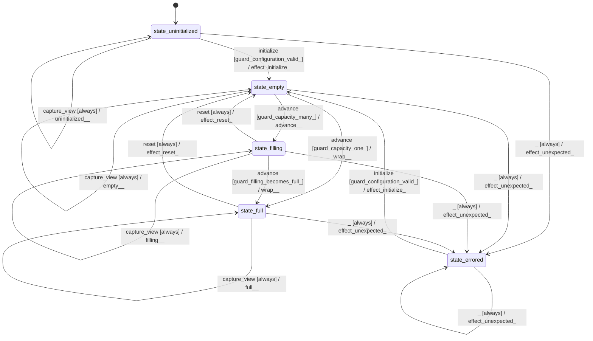

# memory_streaming

Source: [`emel/memory/streaming/sm.hpp`](https://github.com/stateforward/emel.cpp/blob/main/src/emel/memory/streaming/sm.hpp)

## Mermaid

## Transitions

| Source | Event | Guard | Action | Target |
| --- | --- | --- | --- | --- |
| [`state_uninitialized`](https://github.com/stateforward/emel.cpp/blob/main/src/emel/memory/streaming/sm.hpp) | [`initialize`](https://github.com/stateforward/emel.cpp/blob/main/src/emel/memory/streaming/sm.hpp) | [`guard_configuration_valid>`](https://github.com/stateforward/emel.cpp/blob/main/src/emel/memory/streaming/sm.hpp) | [`effect_initialize>`](https://github.com/stateforward/emel.cpp/blob/main/src/emel/memory/streaming/sm.hpp) | [`state_empty`](https://github.com/stateforward/emel.cpp/blob/main/src/emel/memory/streaming/sm.hpp) |
| [`state_uninitialized`](https://github.com/stateforward/emel.cpp/blob/main/src/emel/memory/streaming/sm.hpp) | [`initialize`](https://github.com/stateforward/emel.cpp/blob/main/src/emel/memory/streaming/sm.hpp) | [`guard_configuration_invalid>`](https://github.com/stateforward/emel.cpp/blob/main/src/emel/memory/streaming/sm.hpp) | [`invalid_configuration>>`](https://github.com/stateforward/emel.cpp/blob/main/src/emel/memory/streaming/sm.hpp) | [`state_uninitialized`](https://github.com/stateforward/emel.cpp/blob/main/src/emel/memory/streaming/sm.hpp) |
| [`state_empty`](https://github.com/stateforward/emel.cpp/blob/main/src/emel/memory/streaming/sm.hpp) | [`initialize`](https://github.com/stateforward/emel.cpp/blob/main/src/emel/memory/streaming/sm.hpp) | [`always`](https://github.com/stateforward/emel.cpp/blob/main/src/emel/memory/streaming/sm.hpp) | [`already_initialized>>`](https://github.com/stateforward/emel.cpp/blob/main/src/emel/memory/streaming/sm.hpp) | [`state_empty`](https://github.com/stateforward/emel.cpp/blob/main/src/emel/memory/streaming/sm.hpp) |
| [`state_filling`](https://github.com/stateforward/emel.cpp/blob/main/src/emel/memory/streaming/sm.hpp) | [`initialize`](https://github.com/stateforward/emel.cpp/blob/main/src/emel/memory/streaming/sm.hpp) | [`always`](https://github.com/stateforward/emel.cpp/blob/main/src/emel/memory/streaming/sm.hpp) | [`already_initialized>>`](https://github.com/stateforward/emel.cpp/blob/main/src/emel/memory/streaming/sm.hpp) | [`state_filling`](https://github.com/stateforward/emel.cpp/blob/main/src/emel/memory/streaming/sm.hpp) |
| [`state_full`](https://github.com/stateforward/emel.cpp/blob/main/src/emel/memory/streaming/sm.hpp) | [`initialize`](https://github.com/stateforward/emel.cpp/blob/main/src/emel/memory/streaming/sm.hpp) | [`always`](https://github.com/stateforward/emel.cpp/blob/main/src/emel/memory/streaming/sm.hpp) | [`already_initialized>>`](https://github.com/stateforward/emel.cpp/blob/main/src/emel/memory/streaming/sm.hpp) | [`state_full`](https://github.com/stateforward/emel.cpp/blob/main/src/emel/memory/streaming/sm.hpp) |
| [`state_errored`](https://github.com/stateforward/emel.cpp/blob/main/src/emel/memory/streaming/sm.hpp) | [`initialize`](https://github.com/stateforward/emel.cpp/blob/main/src/emel/memory/streaming/sm.hpp) | [`guard_configuration_valid>`](https://github.com/stateforward/emel.cpp/blob/main/src/emel/memory/streaming/sm.hpp) | [`effect_initialize>`](https://github.com/stateforward/emel.cpp/blob/main/src/emel/memory/streaming/sm.hpp) | [`state_empty`](https://github.com/stateforward/emel.cpp/blob/main/src/emel/memory/streaming/sm.hpp) |
| [`state_errored`](https://github.com/stateforward/emel.cpp/blob/main/src/emel/memory/streaming/sm.hpp) | [`initialize`](https://github.com/stateforward/emel.cpp/blob/main/src/emel/memory/streaming/sm.hpp) | [`guard_configuration_invalid>`](https://github.com/stateforward/emel.cpp/blob/main/src/emel/memory/streaming/sm.hpp) | [`invalid_configuration>>`](https://github.com/stateforward/emel.cpp/blob/main/src/emel/memory/streaming/sm.hpp) | [`state_errored`](https://github.com/stateforward/emel.cpp/blob/main/src/emel/memory/streaming/sm.hpp) |
| [`state_empty`](https://github.com/stateforward/emel.cpp/blob/main/src/emel/memory/streaming/sm.hpp) | [`advance`](https://github.com/stateforward/emel.cpp/blob/main/src/emel/memory/streaming/sm.hpp) | [`guard_capacity_one>`](https://github.com/stateforward/emel.cpp/blob/main/src/emel/memory/streaming/sm.hpp) | [`wrap>>`](https://github.com/stateforward/emel.cpp/blob/main/src/emel/memory/streaming/sm.hpp) | [`state_full`](https://github.com/stateforward/emel.cpp/blob/main/src/emel/memory/streaming/sm.hpp) |
| [`state_empty`](https://github.com/stateforward/emel.cpp/blob/main/src/emel/memory/streaming/sm.hpp) | [`advance`](https://github.com/stateforward/emel.cpp/blob/main/src/emel/memory/streaming/sm.hpp) | [`guard_capacity_many>`](https://github.com/stateforward/emel.cpp/blob/main/src/emel/memory/streaming/sm.hpp) | [`advance>>`](https://github.com/stateforward/emel.cpp/blob/main/src/emel/memory/streaming/sm.hpp) | [`state_filling`](https://github.com/stateforward/emel.cpp/blob/main/src/emel/memory/streaming/sm.hpp) |
| [`state_filling`](https://github.com/stateforward/emel.cpp/blob/main/src/emel/memory/streaming/sm.hpp) | [`advance`](https://github.com/stateforward/emel.cpp/blob/main/src/emel/memory/streaming/sm.hpp) | [`guard_filling_remains_partial>`](https://github.com/stateforward/emel.cpp/blob/main/src/emel/memory/streaming/sm.hpp) | [`advance>>`](https://github.com/stateforward/emel.cpp/blob/main/src/emel/memory/streaming/sm.hpp) | [`state_filling`](https://github.com/stateforward/emel.cpp/blob/main/src/emel/memory/streaming/sm.hpp) |
| [`state_filling`](https://github.com/stateforward/emel.cpp/blob/main/src/emel/memory/streaming/sm.hpp) | [`advance`](https://github.com/stateforward/emel.cpp/blob/main/src/emel/memory/streaming/sm.hpp) | [`guard_filling_becomes_full>`](https://github.com/stateforward/emel.cpp/blob/main/src/emel/memory/streaming/sm.hpp) | [`wrap>>`](https://github.com/stateforward/emel.cpp/blob/main/src/emel/memory/streaming/sm.hpp) | [`state_full`](https://github.com/stateforward/emel.cpp/blob/main/src/emel/memory/streaming/sm.hpp) |
| [`state_full`](https://github.com/stateforward/emel.cpp/blob/main/src/emel/memory/streaming/sm.hpp) | [`advance`](https://github.com/stateforward/emel.cpp/blob/main/src/emel/memory/streaming/sm.hpp) | [`guard_full_position_available_before_wrap>`](https://github.com/stateforward/emel.cpp/blob/main/src/emel/memory/streaming/sm.hpp) | [`advance>>`](https://github.com/stateforward/emel.cpp/blob/main/src/emel/memory/streaming/sm.hpp) | [`state_full`](https://github.com/stateforward/emel.cpp/blob/main/src/emel/memory/streaming/sm.hpp) |
| [`state_full`](https://github.com/stateforward/emel.cpp/blob/main/src/emel/memory/streaming/sm.hpp) | [`advance`](https://github.com/stateforward/emel.cpp/blob/main/src/emel/memory/streaming/sm.hpp) | [`guard_full_position_available_at_wrap>`](https://github.com/stateforward/emel.cpp/blob/main/src/emel/memory/streaming/sm.hpp) | [`wrap>>`](https://github.com/stateforward/emel.cpp/blob/main/src/emel/memory/streaming/sm.hpp) | [`state_full`](https://github.com/stateforward/emel.cpp/blob/main/src/emel/memory/streaming/sm.hpp) |
| [`state_full`](https://github.com/stateforward/emel.cpp/blob/main/src/emel/memory/streaming/sm.hpp) | [`advance`](https://github.com/stateforward/emel.cpp/blob/main/src/emel/memory/streaming/sm.hpp) | [`guard_full_position_overflow>`](https://github.com/stateforward/emel.cpp/blob/main/src/emel/memory/streaming/sm.hpp) | [`position_overflow>>`](https://github.com/stateforward/emel.cpp/blob/main/src/emel/memory/streaming/sm.hpp) | [`state_full`](https://github.com/stateforward/emel.cpp/blob/main/src/emel/memory/streaming/sm.hpp) |
| [`state_full`](https://github.com/stateforward/emel.cpp/blob/main/src/emel/memory/streaming/sm.hpp) | [`advance`](https://github.com/stateforward/emel.cpp/blob/main/src/emel/memory/streaming/sm.hpp) | [`guard_full_cursor_invalid>`](https://github.com/stateforward/emel.cpp/blob/main/src/emel/memory/streaming/sm.hpp) | [`internal_error>>`](https://github.com/stateforward/emel.cpp/blob/main/src/emel/memory/streaming/sm.hpp) | [`state_full`](https://github.com/stateforward/emel.cpp/blob/main/src/emel/memory/streaming/sm.hpp) |
| [`state_empty`](https://github.com/stateforward/emel.cpp/blob/main/src/emel/memory/streaming/sm.hpp) | [`reset`](https://github.com/stateforward/emel.cpp/blob/main/src/emel/memory/streaming/sm.hpp) | [`always`](https://github.com/stateforward/emel.cpp/blob/main/src/emel/memory/streaming/sm.hpp) | [`effect_reset>`](https://github.com/stateforward/emel.cpp/blob/main/src/emel/memory/streaming/sm.hpp) | [`state_empty`](https://github.com/stateforward/emel.cpp/blob/main/src/emel/memory/streaming/sm.hpp) |
| [`state_filling`](https://github.com/stateforward/emel.cpp/blob/main/src/emel/memory/streaming/sm.hpp) | [`reset`](https://github.com/stateforward/emel.cpp/blob/main/src/emel/memory/streaming/sm.hpp) | [`always`](https://github.com/stateforward/emel.cpp/blob/main/src/emel/memory/streaming/sm.hpp) | [`effect_reset>`](https://github.com/stateforward/emel.cpp/blob/main/src/emel/memory/streaming/sm.hpp) | [`state_empty`](https://github.com/stateforward/emel.cpp/blob/main/src/emel/memory/streaming/sm.hpp) |
| [`state_full`](https://github.com/stateforward/emel.cpp/blob/main/src/emel/memory/streaming/sm.hpp) | [`reset`](https://github.com/stateforward/emel.cpp/blob/main/src/emel/memory/streaming/sm.hpp) | [`always`](https://github.com/stateforward/emel.cpp/blob/main/src/emel/memory/streaming/sm.hpp) | [`effect_reset>`](https://github.com/stateforward/emel.cpp/blob/main/src/emel/memory/streaming/sm.hpp) | [`state_empty`](https://github.com/stateforward/emel.cpp/blob/main/src/emel/memory/streaming/sm.hpp) |
| [`state_empty`](https://github.com/stateforward/emel.cpp/blob/main/src/emel/memory/streaming/sm.hpp) | [`capture_view`](https://github.com/stateforward/emel.cpp/blob/main/src/emel/memory/streaming/sm.hpp) | [`always`](https://github.com/stateforward/emel.cpp/blob/main/src/emel/memory/streaming/sm.hpp) | [`empty>>`](https://github.com/stateforward/emel.cpp/blob/main/src/emel/memory/streaming/sm.hpp) | [`state_empty`](https://github.com/stateforward/emel.cpp/blob/main/src/emel/memory/streaming/sm.hpp) |
| [`state_filling`](https://github.com/stateforward/emel.cpp/blob/main/src/emel/memory/streaming/sm.hpp) | [`capture_view`](https://github.com/stateforward/emel.cpp/blob/main/src/emel/memory/streaming/sm.hpp) | [`always`](https://github.com/stateforward/emel.cpp/blob/main/src/emel/memory/streaming/sm.hpp) | [`filling>>`](https://github.com/stateforward/emel.cpp/blob/main/src/emel/memory/streaming/sm.hpp) | [`state_filling`](https://github.com/stateforward/emel.cpp/blob/main/src/emel/memory/streaming/sm.hpp) |
| [`state_full`](https://github.com/stateforward/emel.cpp/blob/main/src/emel/memory/streaming/sm.hpp) | [`capture_view`](https://github.com/stateforward/emel.cpp/blob/main/src/emel/memory/streaming/sm.hpp) | [`always`](https://github.com/stateforward/emel.cpp/blob/main/src/emel/memory/streaming/sm.hpp) | [`full>>`](https://github.com/stateforward/emel.cpp/blob/main/src/emel/memory/streaming/sm.hpp) | [`state_full`](https://github.com/stateforward/emel.cpp/blob/main/src/emel/memory/streaming/sm.hpp) |
| [`state_uninitialized`](https://github.com/stateforward/emel.cpp/blob/main/src/emel/memory/streaming/sm.hpp) | [`advance`](https://github.com/stateforward/emel.cpp/blob/main/src/emel/memory/streaming/sm.hpp) | [`always`](https://github.com/stateforward/emel.cpp/blob/main/src/emel/memory/streaming/sm.hpp) | [`uninitialized>>`](https://github.com/stateforward/emel.cpp/blob/main/src/emel/memory/streaming/sm.hpp) | [`state_uninitialized`](https://github.com/stateforward/emel.cpp/blob/main/src/emel/memory/streaming/sm.hpp) |
| [`state_uninitialized`](https://github.com/stateforward/emel.cpp/blob/main/src/emel/memory/streaming/sm.hpp) | [`reset`](https://github.com/stateforward/emel.cpp/blob/main/src/emel/memory/streaming/sm.hpp) | [`always`](https://github.com/stateforward/emel.cpp/blob/main/src/emel/memory/streaming/sm.hpp) | [`uninitialized>>`](https://github.com/stateforward/emel.cpp/blob/main/src/emel/memory/streaming/sm.hpp) | [`state_uninitialized`](https://github.com/stateforward/emel.cpp/blob/main/src/emel/memory/streaming/sm.hpp) |
| [`state_uninitialized`](https://github.com/stateforward/emel.cpp/blob/main/src/emel/memory/streaming/sm.hpp) | [`capture_view`](https://github.com/stateforward/emel.cpp/blob/main/src/emel/memory/streaming/sm.hpp) | [`always`](https://github.com/stateforward/emel.cpp/blob/main/src/emel/memory/streaming/sm.hpp) | [`uninitialized>>`](https://github.com/stateforward/emel.cpp/blob/main/src/emel/memory/streaming/sm.hpp) | [`state_uninitialized`](https://github.com/stateforward/emel.cpp/blob/main/src/emel/memory/streaming/sm.hpp) |
| [`state_errored`](https://github.com/stateforward/emel.cpp/blob/main/src/emel/memory/streaming/sm.hpp) | [`advance`](https://github.com/stateforward/emel.cpp/blob/main/src/emel/memory/streaming/sm.hpp) | [`always`](https://github.com/stateforward/emel.cpp/blob/main/src/emel/memory/streaming/sm.hpp) | [`internal_error>>`](https://github.com/stateforward/emel.cpp/blob/main/src/emel/memory/streaming/sm.hpp) | [`state_errored`](https://github.com/stateforward/emel.cpp/blob/main/src/emel/memory/streaming/sm.hpp) |
| [`state_errored`](https://github.com/stateforward/emel.cpp/blob/main/src/emel/memory/streaming/sm.hpp) | [`reset`](https://github.com/stateforward/emel.cpp/blob/main/src/emel/memory/streaming/sm.hpp) | [`always`](https://github.com/stateforward/emel.cpp/blob/main/src/emel/memory/streaming/sm.hpp) | [`internal_error>>`](https://github.com/stateforward/emel.cpp/blob/main/src/emel/memory/streaming/sm.hpp) | [`state_errored`](https://github.com/stateforward/emel.cpp/blob/main/src/emel/memory/streaming/sm.hpp) |
| [`state_errored`](https://github.com/stateforward/emel.cpp/blob/main/src/emel/memory/streaming/sm.hpp) | [`capture_view`](https://github.com/stateforward/emel.cpp/blob/main/src/emel/memory/streaming/sm.hpp) | [`always`](https://github.com/stateforward/emel.cpp/blob/main/src/emel/memory/streaming/sm.hpp) | [`internal_error>>`](https://github.com/stateforward/emel.cpp/blob/main/src/emel/memory/streaming/sm.hpp) | [`state_errored`](https://github.com/stateforward/emel.cpp/blob/main/src/emel/memory/streaming/sm.hpp) |
| [`state_uninitialized`](https://github.com/stateforward/emel.cpp/blob/main/src/emel/memory/streaming/sm.hpp) | [`_`](https://github.com/stateforward/emel.cpp/blob/main/src/emel/memory/streaming/sm.hpp) | [`always`](https://github.com/stateforward/emel.cpp/blob/main/src/emel/memory/streaming/sm.hpp) | [`effect_unexpected>`](https://github.com/stateforward/emel.cpp/blob/main/src/emel/memory/streaming/sm.hpp) | [`state_errored`](https://github.com/stateforward/emel.cpp/blob/main/src/emel/memory/streaming/sm.hpp) |
| [`state_empty`](https://github.com/stateforward/emel.cpp/blob/main/src/emel/memory/streaming/sm.hpp) | [`_`](https://github.com/stateforward/emel.cpp/blob/main/src/emel/memory/streaming/sm.hpp) | [`always`](https://github.com/stateforward/emel.cpp/blob/main/src/emel/memory/streaming/sm.hpp) | [`effect_unexpected>`](https://github.com/stateforward/emel.cpp/blob/main/src/emel/memory/streaming/sm.hpp) | [`state_errored`](https://github.com/stateforward/emel.cpp/blob/main/src/emel/memory/streaming/sm.hpp) |
| [`state_filling`](https://github.com/stateforward/emel.cpp/blob/main/src/emel/memory/streaming/sm.hpp) | [`_`](https://github.com/stateforward/emel.cpp/blob/main/src/emel/memory/streaming/sm.hpp) | [`always`](https://github.com/stateforward/emel.cpp/blob/main/src/emel/memory/streaming/sm.hpp) | [`effect_unexpected>`](https://github.com/stateforward/emel.cpp/blob/main/src/emel/memory/streaming/sm.hpp) | [`state_errored`](https://github.com/stateforward/emel.cpp/blob/main/src/emel/memory/streaming/sm.hpp) |
| [`state_full`](https://github.com/stateforward/emel.cpp/blob/main/src/emel/memory/streaming/sm.hpp) | [`_`](https://github.com/stateforward/emel.cpp/blob/main/src/emel/memory/streaming/sm.hpp) | [`always`](https://github.com/stateforward/emel.cpp/blob/main/src/emel/memory/streaming/sm.hpp) | [`effect_unexpected>`](https://github.com/stateforward/emel.cpp/blob/main/src/emel/memory/streaming/sm.hpp) | [`state_errored`](https://github.com/stateforward/emel.cpp/blob/main/src/emel/memory/streaming/sm.hpp) |
| [`state_errored`](https://github.com/stateforward/emel.cpp/blob/main/src/emel/memory/streaming/sm.hpp) | [`_`](https://github.com/stateforward/emel.cpp/blob/main/src/emel/memory/streaming/sm.hpp) | [`always`](https://github.com/stateforward/emel.cpp/blob/main/src/emel/memory/streaming/sm.hpp) | [`effect_unexpected>`](https://github.com/stateforward/emel.cpp/blob/main/src/emel/memory/streaming/sm.hpp) | [`state_errored`](https://github.com/stateforward/emel.cpp/blob/main/src/emel/memory/streaming/sm.hpp) |
