# model_loader

Source: [`emel/model/loader/sm.hpp`](https://github.com/stateforward/emel.cpp/blob/main/src/emel/model/loader/sm.hpp)

## Ownership

`model/loader` orchestrates parser callbacks, the tensor actor, and the I/O actor. It must not implement low-level file APIs or tensor residency lifecycle.

## Mermaid

```mermaid
stateDiagram-v2
  direction TB
  [*] --> ready
  ready --> request_decision : load_runtime [always] / begin_load_
  request_decision --> parsing : completion_load_runtime_ [valid_request_] / none
  request_decision --> errored : completion_load_runtime_ [invalid_request_] / mark_invalid_request_
  parsing --> parse_decision : completion_load_runtime_ [always] / run_parse_
  parse_decision --> parse_phase_decision : completion_load_runtime_ [always] / none
  parse_phase_decision --> parse_load_tensors_policy_decision : completion_load_runtime_ [error_none_] / none
  parse_phase_decision --> errored : completion_load_runtime_ [error_invalid_request_] / none
  parse_phase_decision --> errored : completion_load_runtime_ [error_parse_failed_] / none
  parse_phase_decision --> errored : completion_load_runtime_ [error_backend_error_] / none
  parse_phase_decision --> errored : completion_load_runtime_ [error_model_invalid_] / none
  parse_phase_decision --> errored : completion_load_runtime_ [error_internal_error_] / none
  parse_phase_decision --> errored : completion_load_runtime_ [error_untracked_] / none
  parse_phase_decision --> errored : completion_load_runtime_ [error_io_strategy_unavailable_] / none
  parse_phase_decision --> errored : completion_load_runtime_ [error_unclassified_code_] / none
  parse_load_tensors_policy_decision --> parse_load_tensors_handler_decision : completion_load_runtime_ [should_load_tensors_] / none
  parse_load_tensors_policy_decision --> structure_decision : completion_load_runtime_ [skip_load_tensors_] / none
  parse_load_tensors_policy_decision --> errored : completion_load_runtime_ [always] / mark_internal_error_
  parse_load_tensors_handler_decision --> loading_tensors : completion_load_runtime_ [can_load_tensors_] / none
  parse_load_tensors_handler_decision --> errored : completion_load_runtime_ [model_has_no_tensors_] / mark_model_invalid_
  parse_load_tensors_handler_decision --> errored : completion_load_runtime_ [cannot_load_tensors_] / mark_invalid_request_
  parse_load_tensors_handler_decision --> errored : completion_load_runtime_ [always] / mark_internal_error_
  loading_tensors --> state_tensor_bind_decision : completion_load_runtime_ [always] / effect_dispatch_tensor_bind_storage_
  state_tensor_bind_decision --> state_tensor_plan_dispatch : completion_load_runtime_ [tensor_bind_done_raised_] / none
  state_tensor_bind_decision --> errored : completion_load_runtime_ [tensor_bind_error_raised_] / effect_mark_tensor_bind_error_
  state_tensor_bind_decision --> errored : completion_load_runtime_ [tensor_bind_unhandled_] / mark_internal_error_
  state_tensor_plan_dispatch --> state_tensor_plan_decision : completion_load_runtime_ [always] / effect_dispatch_tensor_plan_load_
  state_tensor_plan_decision --> state_tensor_apply_dispatch : completion_load_runtime_ [tensor_plan_done_without_io_strategy_] / none
  state_tensor_plan_decision --> state_tensor_effect_error_cleanup : completion_load_runtime_ [tensor_plan_done_with_io_strategy_without_loader_] / effect_dispatch_tensor_apply_error_results_
  state_tensor_plan_decision --> state_io_load_dispatch : completion_load_runtime_ [tensor_plan_done_with_io_strategy_with_loader_] / none
  state_tensor_plan_decision --> errored : completion_load_runtime_ [tensor_plan_error_raised_] / effect_mark_tensor_plan_error_
  state_tensor_plan_decision --> errored : completion_load_runtime_ [tensor_plan_unhandled_] / mark_internal_error_
  state_io_load_dispatch --> state_io_load_decision : completion_load_runtime_ [always] / effect_dispatch_io_loads_
  state_io_load_decision --> state_tensor_apply_dispatch : completion_load_runtime_ [io_load_done_all_] / none
  state_io_load_decision --> state_tensor_effect_error_cleanup : completion_load_runtime_ [io_load_error_raised_] / effect_dispatch_tensor_apply_error_results_
  state_io_load_decision --> state_tensor_effect_error_cleanup : completion_load_runtime_ [io_load_unhandled_] / effect_dispatch_tensor_apply_error_results_
  state_tensor_effect_error_cleanup --> errored : completion_load_runtime_ [tensor_plan_done_with_io_strategy_without_loader_] / effect_mark_io_strategy_unavailable_
  state_tensor_effect_error_cleanup --> errored : completion_load_runtime_ [io_load_error_invalid_request_] / mark_invalid_request_
  state_tensor_effect_error_cleanup --> errored : completion_load_runtime_ [io_load_error_strategy_unavailable_] / effect_mark_io_strategy_unavailable_
  state_tensor_effect_error_cleanup --> errored : completion_load_runtime_ [io_load_error_internal_] / mark_internal_error_
  state_tensor_effect_error_cleanup --> errored : completion_load_runtime_ [io_load_error_untracked_] / mark_untracked_
  state_tensor_effect_error_cleanup --> errored : completion_load_runtime_ [io_load_error_unclassified_] / mark_internal_error_
  state_tensor_effect_error_cleanup --> errored : completion_load_runtime_ [io_load_unhandled_] / mark_internal_error_
  state_tensor_effect_error_cleanup --> errored : completion_load_runtime_ [always] / mark_internal_error_
  state_tensor_apply_dispatch --> state_tensor_apply_decision : completion_load_runtime_ [always] / effect_dispatch_tensor_apply_results_
  state_tensor_apply_decision --> load_map_policy_decision : completion_load_runtime_ [tensor_apply_done_with_file_image_] / effect_publish_tensor_load_done_from_file_image_
  state_tensor_apply_decision --> load_map_policy_decision : completion_load_runtime_ [tensor_apply_done_without_file_image_] / effect_publish_tensor_load_done_from_model_data_
  state_tensor_apply_decision --> errored : completion_load_runtime_ [tensor_apply_error_raised_] / effect_mark_tensor_apply_error_
  state_tensor_apply_decision --> errored : completion_load_runtime_ [tensor_apply_unhandled_] / mark_internal_error_
  load_map_policy_decision --> mapping_layers : completion_load_runtime_ [can_map_layers_] / none
  load_map_policy_decision --> errored : completion_load_runtime_ [cannot_map_layers_] / mark_invalid_request_
  load_map_policy_decision --> errored : completion_load_runtime_ [always] / mark_internal_error_
  mapping_layers --> map_layers_decision : completion_load_runtime_ [always] / run_map_layers_
  map_layers_decision --> structure_decision : completion_load_runtime_ [error_none_] / none
  map_layers_decision --> errored : completion_load_runtime_ [error_invalid_request_] / none
  map_layers_decision --> errored : completion_load_runtime_ [error_parse_failed_] / none
  map_layers_decision --> errored : completion_load_runtime_ [error_backend_error_] / none
  map_layers_decision --> errored : completion_load_runtime_ [error_model_invalid_] / none
  map_layers_decision --> errored : completion_load_runtime_ [error_internal_error_] / none
  map_layers_decision --> errored : completion_load_runtime_ [error_untracked_] / none
  map_layers_decision --> errored : completion_load_runtime_ [error_io_strategy_unavailable_] / none
  map_layers_decision --> errored : completion_load_runtime_ [error_unclassified_code_] / none
  structure_decision --> structure_policy_decision : completion_load_runtime_ [always] / none
  structure_policy_decision --> architecture_decision : completion_load_runtime_ [skip_validate_structure_] / none
  structure_policy_decision --> validating_structure : completion_load_runtime_ [can_validate_structure_] / none
  structure_policy_decision --> errored : completion_load_runtime_ [cannot_validate_structure_] / mark_invalid_request_
  structure_policy_decision --> errored : completion_load_runtime_ [always] / mark_internal_error_
  validating_structure --> structure_validation_decision : completion_load_runtime_ [always] / run_validate_structure_
  structure_validation_decision --> architecture_decision : completion_load_runtime_ [error_none_] / none
  structure_validation_decision --> errored : completion_load_runtime_ [error_invalid_request_] / none
  structure_validation_decision --> errored : completion_load_runtime_ [error_parse_failed_] / none
  structure_validation_decision --> errored : completion_load_runtime_ [error_backend_error_] / none
  structure_validation_decision --> errored : completion_load_runtime_ [error_model_invalid_] / none
  structure_validation_decision --> errored : completion_load_runtime_ [error_internal_error_] / none
  structure_validation_decision --> errored : completion_load_runtime_ [error_untracked_] / none
  structure_validation_decision --> errored : completion_load_runtime_ [error_io_strategy_unavailable_] / none
  structure_validation_decision --> errored : completion_load_runtime_ [error_unclassified_code_] / none
  architecture_decision --> architecture_policy_decision : completion_load_runtime_ [always] / none
  architecture_policy_decision --> done : completion_load_runtime_ [skip_validate_architecture_] / none
  architecture_policy_decision --> validating_architecture : completion_load_runtime_ [can_validate_architecture_] / none
  architecture_policy_decision --> errored : completion_load_runtime_ [cannot_validate_architecture_] / mark_invalid_request_
  architecture_policy_decision --> errored : completion_load_runtime_ [always] / mark_internal_error_
  validating_architecture --> architecture_validation_decision : completion_load_runtime_ [always] / run_validate_architecture_
  architecture_validation_decision --> done : completion_load_runtime_ [error_none_] / none
  architecture_validation_decision --> errored : completion_load_runtime_ [error_invalid_request_] / none
  architecture_validation_decision --> errored : completion_load_runtime_ [error_parse_failed_] / none
  architecture_validation_decision --> errored : completion_load_runtime_ [error_backend_error_] / none
  architecture_validation_decision --> errored : completion_load_runtime_ [error_model_invalid_] / none
  architecture_validation_decision --> errored : completion_load_runtime_ [error_internal_error_] / none
  architecture_validation_decision --> errored : completion_load_runtime_ [error_untracked_] / none
  architecture_validation_decision --> errored : completion_load_runtime_ [error_io_strategy_unavailable_] / none
  architecture_validation_decision --> errored : completion_load_runtime_ [error_unclassified_code_] / none
  done --> ready : completion_load_runtime_ [done_callback_present_] / publish_done_
  done --> ready : completion_load_runtime_ [done_callback_absent_] / publish_done_noop_
  errored --> ready : completion_load_runtime_ [error_callback_present_] / publish_error_
  errored --> ready : completion_load_runtime_ [error_callback_absent_] / publish_error_noop_
  ready --> ready : _ [always] / on_unexpected_
  request_decision --> ready : _ [always] / on_unexpected_
  parsing --> ready : _ [always] / on_unexpected_
  parse_decision --> ready : _ [always] / on_unexpected_
  parse_phase_decision --> ready : _ [always] / on_unexpected_
  parse_load_tensors_policy_decision --> ready : _ [always] / on_unexpected_
  parse_load_tensors_handler_decision --> ready : _ [always] / on_unexpected_
  loading_tensors --> ready : _ [always] / on_unexpected_
  state_tensor_bind_decision --> ready : _ [always] / on_unexpected_
  state_tensor_plan_dispatch --> ready : _ [always] / on_unexpected_
  state_tensor_plan_decision --> ready : _ [always] / on_unexpected_
  state_io_load_dispatch --> ready : _ [always] / on_unexpected_
  state_io_load_decision --> ready : _ [always] / on_unexpected_
  state_tensor_effect_error_cleanup --> ready : _ [always] / on_unexpected_
  state_tensor_apply_dispatch --> ready : _ [always] / on_unexpected_
  state_tensor_apply_decision --> ready : _ [always] / on_unexpected_
  load_map_policy_decision --> ready : _ [always] / on_unexpected_
  mapping_layers --> ready : _ [always] / on_unexpected_
  map_layers_decision --> ready : _ [always] / on_unexpected_
  structure_decision --> ready : _ [always] / on_unexpected_
  structure_policy_decision --> ready : _ [always] / on_unexpected_
  validating_structure --> ready : _ [always] / on_unexpected_
  structure_validation_decision --> ready : _ [always] / on_unexpected_
  architecture_decision --> ready : _ [always] / on_unexpected_
  architecture_policy_decision --> ready : _ [always] / on_unexpected_
  validating_architecture --> ready : _ [always] / on_unexpected_
  architecture_validation_decision --> ready : _ [always] / on_unexpected_
  done --> ready : _ [always] / on_unexpected_
  errored --> ready : _ [always] / on_unexpected_
```

## Transitions

| Source | Event | Guard | Action | Target |
| --- | --- | --- | --- | --- |
| [`ready`](https://github.com/stateforward/emel.cpp/blob/main/src/emel/model/loader/sm.hpp) | [`load_runtime`](https://github.com/stateforward/emel.cpp/blob/main/src/emel/model/loader/sm.hpp) | [`always`](https://github.com/stateforward/emel.cpp/blob/main/src/emel/model/loader/sm.hpp) | [`begin_load>`](https://github.com/stateforward/emel.cpp/blob/main/src/emel/model/loader/sm.hpp) | [`request_decision`](https://github.com/stateforward/emel.cpp/blob/main/src/emel/model/loader/sm.hpp) |
| [`request_decision`](https://github.com/stateforward/emel.cpp/blob/main/src/emel/model/loader/sm.hpp) | [`completion<load_runtime>`](https://github.com/stateforward/emel.cpp/blob/main/src/emel/model/loader/sm.hpp) | [`valid_request>`](https://github.com/stateforward/emel.cpp/blob/main/src/emel/model/loader/sm.hpp) | [`none`](https://github.com/stateforward/emel.cpp/blob/main/src/emel/model/loader/sm.hpp) | [`parsing`](https://github.com/stateforward/emel.cpp/blob/main/src/emel/model/loader/sm.hpp) |
| [`request_decision`](https://github.com/stateforward/emel.cpp/blob/main/src/emel/model/loader/sm.hpp) | [`completion<load_runtime>`](https://github.com/stateforward/emel.cpp/blob/main/src/emel/model/loader/sm.hpp) | [`invalid_request>`](https://github.com/stateforward/emel.cpp/blob/main/src/emel/model/loader/sm.hpp) | [`mark_invalid_request>`](https://github.com/stateforward/emel.cpp/blob/main/src/emel/model/loader/sm.hpp) | [`errored`](https://github.com/stateforward/emel.cpp/blob/main/src/emel/model/loader/sm.hpp) |
| [`parsing`](https://github.com/stateforward/emel.cpp/blob/main/src/emel/model/loader/sm.hpp) | [`completion<load_runtime>`](https://github.com/stateforward/emel.cpp/blob/main/src/emel/model/loader/sm.hpp) | [`always`](https://github.com/stateforward/emel.cpp/blob/main/src/emel/model/loader/sm.hpp) | [`run_parse>`](https://github.com/stateforward/emel.cpp/blob/main/src/emel/model/loader/sm.hpp) | [`parse_decision`](https://github.com/stateforward/emel.cpp/blob/main/src/emel/model/loader/sm.hpp) |
| [`parse_decision`](https://github.com/stateforward/emel.cpp/blob/main/src/emel/model/loader/sm.hpp) | [`completion<load_runtime>`](https://github.com/stateforward/emel.cpp/blob/main/src/emel/model/loader/sm.hpp) | [`always`](https://github.com/stateforward/emel.cpp/blob/main/src/emel/model/loader/sm.hpp) | [`none`](https://github.com/stateforward/emel.cpp/blob/main/src/emel/model/loader/sm.hpp) | [`parse_phase_decision`](https://github.com/stateforward/emel.cpp/blob/main/src/emel/model/loader/sm.hpp) |
| [`parse_phase_decision`](https://github.com/stateforward/emel.cpp/blob/main/src/emel/model/loader/sm.hpp) | [`completion<load_runtime>`](https://github.com/stateforward/emel.cpp/blob/main/src/emel/model/loader/sm.hpp) | [`error_none>`](https://github.com/stateforward/emel.cpp/blob/main/src/emel/model/loader/sm.hpp) | [`none`](https://github.com/stateforward/emel.cpp/blob/main/src/emel/model/loader/sm.hpp) | [`parse_load_tensors_policy_decision`](https://github.com/stateforward/emel.cpp/blob/main/src/emel/model/loader/sm.hpp) |
| [`parse_phase_decision`](https://github.com/stateforward/emel.cpp/blob/main/src/emel/model/loader/sm.hpp) | [`completion<load_runtime>`](https://github.com/stateforward/emel.cpp/blob/main/src/emel/model/loader/sm.hpp) | [`error_invalid_request>`](https://github.com/stateforward/emel.cpp/blob/main/src/emel/model/loader/sm.hpp) | [`none`](https://github.com/stateforward/emel.cpp/blob/main/src/emel/model/loader/sm.hpp) | [`errored`](https://github.com/stateforward/emel.cpp/blob/main/src/emel/model/loader/sm.hpp) |
| [`parse_phase_decision`](https://github.com/stateforward/emel.cpp/blob/main/src/emel/model/loader/sm.hpp) | [`completion<load_runtime>`](https://github.com/stateforward/emel.cpp/blob/main/src/emel/model/loader/sm.hpp) | [`error_parse_failed>`](https://github.com/stateforward/emel.cpp/blob/main/src/emel/model/loader/sm.hpp) | [`none`](https://github.com/stateforward/emel.cpp/blob/main/src/emel/model/loader/sm.hpp) | [`errored`](https://github.com/stateforward/emel.cpp/blob/main/src/emel/model/loader/sm.hpp) |
| [`parse_phase_decision`](https://github.com/stateforward/emel.cpp/blob/main/src/emel/model/loader/sm.hpp) | [`completion<load_runtime>`](https://github.com/stateforward/emel.cpp/blob/main/src/emel/model/loader/sm.hpp) | [`error_backend_error>`](https://github.com/stateforward/emel.cpp/blob/main/src/emel/model/loader/sm.hpp) | [`none`](https://github.com/stateforward/emel.cpp/blob/main/src/emel/model/loader/sm.hpp) | [`errored`](https://github.com/stateforward/emel.cpp/blob/main/src/emel/model/loader/sm.hpp) |
| [`parse_phase_decision`](https://github.com/stateforward/emel.cpp/blob/main/src/emel/model/loader/sm.hpp) | [`completion<load_runtime>`](https://github.com/stateforward/emel.cpp/blob/main/src/emel/model/loader/sm.hpp) | [`error_model_invalid>`](https://github.com/stateforward/emel.cpp/blob/main/src/emel/model/loader/sm.hpp) | [`none`](https://github.com/stateforward/emel.cpp/blob/main/src/emel/model/loader/sm.hpp) | [`errored`](https://github.com/stateforward/emel.cpp/blob/main/src/emel/model/loader/sm.hpp) |
| [`parse_phase_decision`](https://github.com/stateforward/emel.cpp/blob/main/src/emel/model/loader/sm.hpp) | [`completion<load_runtime>`](https://github.com/stateforward/emel.cpp/blob/main/src/emel/model/loader/sm.hpp) | [`error_internal_error>`](https://github.com/stateforward/emel.cpp/blob/main/src/emel/model/loader/sm.hpp) | [`none`](https://github.com/stateforward/emel.cpp/blob/main/src/emel/model/loader/sm.hpp) | [`errored`](https://github.com/stateforward/emel.cpp/blob/main/src/emel/model/loader/sm.hpp) |
| [`parse_phase_decision`](https://github.com/stateforward/emel.cpp/blob/main/src/emel/model/loader/sm.hpp) | [`completion<load_runtime>`](https://github.com/stateforward/emel.cpp/blob/main/src/emel/model/loader/sm.hpp) | [`error_untracked>`](https://github.com/stateforward/emel.cpp/blob/main/src/emel/model/loader/sm.hpp) | [`none`](https://github.com/stateforward/emel.cpp/blob/main/src/emel/model/loader/sm.hpp) | [`errored`](https://github.com/stateforward/emel.cpp/blob/main/src/emel/model/loader/sm.hpp) |
| [`parse_phase_decision`](https://github.com/stateforward/emel.cpp/blob/main/src/emel/model/loader/sm.hpp) | [`completion<load_runtime>`](https://github.com/stateforward/emel.cpp/blob/main/src/emel/model/loader/sm.hpp) | [`error_io_strategy_unavailable>`](https://github.com/stateforward/emel.cpp/blob/main/src/emel/model/loader/sm.hpp) | [`none`](https://github.com/stateforward/emel.cpp/blob/main/src/emel/model/loader/sm.hpp) | [`errored`](https://github.com/stateforward/emel.cpp/blob/main/src/emel/model/loader/sm.hpp) |
| [`parse_phase_decision`](https://github.com/stateforward/emel.cpp/blob/main/src/emel/model/loader/sm.hpp) | [`completion<load_runtime>`](https://github.com/stateforward/emel.cpp/blob/main/src/emel/model/loader/sm.hpp) | [`error_unclassified_code>`](https://github.com/stateforward/emel.cpp/blob/main/src/emel/model/loader/sm.hpp) | [`none`](https://github.com/stateforward/emel.cpp/blob/main/src/emel/model/loader/sm.hpp) | [`errored`](https://github.com/stateforward/emel.cpp/blob/main/src/emel/model/loader/sm.hpp) |
| [`parse_load_tensors_policy_decision`](https://github.com/stateforward/emel.cpp/blob/main/src/emel/model/loader/sm.hpp) | [`completion<load_runtime>`](https://github.com/stateforward/emel.cpp/blob/main/src/emel/model/loader/sm.hpp) | [`should_load_tensors>`](https://github.com/stateforward/emel.cpp/blob/main/src/emel/model/loader/sm.hpp) | [`none`](https://github.com/stateforward/emel.cpp/blob/main/src/emel/model/loader/sm.hpp) | [`parse_load_tensors_handler_decision`](https://github.com/stateforward/emel.cpp/blob/main/src/emel/model/loader/sm.hpp) |
| [`parse_load_tensors_policy_decision`](https://github.com/stateforward/emel.cpp/blob/main/src/emel/model/loader/sm.hpp) | [`completion<load_runtime>`](https://github.com/stateforward/emel.cpp/blob/main/src/emel/model/loader/sm.hpp) | [`skip_load_tensors>`](https://github.com/stateforward/emel.cpp/blob/main/src/emel/model/loader/sm.hpp) | [`none`](https://github.com/stateforward/emel.cpp/blob/main/src/emel/model/loader/sm.hpp) | [`structure_decision`](https://github.com/stateforward/emel.cpp/blob/main/src/emel/model/loader/sm.hpp) |
| [`parse_load_tensors_policy_decision`](https://github.com/stateforward/emel.cpp/blob/main/src/emel/model/loader/sm.hpp) | [`completion<load_runtime>`](https://github.com/stateforward/emel.cpp/blob/main/src/emel/model/loader/sm.hpp) | [`always`](https://github.com/stateforward/emel.cpp/blob/main/src/emel/model/loader/sm.hpp) | [`mark_internal_error>`](https://github.com/stateforward/emel.cpp/blob/main/src/emel/model/loader/sm.hpp) | [`errored`](https://github.com/stateforward/emel.cpp/blob/main/src/emel/model/loader/sm.hpp) |
| [`parse_load_tensors_handler_decision`](https://github.com/stateforward/emel.cpp/blob/main/src/emel/model/loader/sm.hpp) | [`completion<load_runtime>`](https://github.com/stateforward/emel.cpp/blob/main/src/emel/model/loader/sm.hpp) | [`can_load_tensors>`](https://github.com/stateforward/emel.cpp/blob/main/src/emel/model/loader/sm.hpp) | [`none`](https://github.com/stateforward/emel.cpp/blob/main/src/emel/model/loader/sm.hpp) | [`loading_tensors`](https://github.com/stateforward/emel.cpp/blob/main/src/emel/model/loader/sm.hpp) |
| [`parse_load_tensors_handler_decision`](https://github.com/stateforward/emel.cpp/blob/main/src/emel/model/loader/sm.hpp) | [`completion<load_runtime>`](https://github.com/stateforward/emel.cpp/blob/main/src/emel/model/loader/sm.hpp) | [`model_has_no_tensors>`](https://github.com/stateforward/emel.cpp/blob/main/src/emel/model/loader/sm.hpp) | [`mark_model_invalid>`](https://github.com/stateforward/emel.cpp/blob/main/src/emel/model/loader/sm.hpp) | [`errored`](https://github.com/stateforward/emel.cpp/blob/main/src/emel/model/loader/sm.hpp) |
| [`parse_load_tensors_handler_decision`](https://github.com/stateforward/emel.cpp/blob/main/src/emel/model/loader/sm.hpp) | [`completion<load_runtime>`](https://github.com/stateforward/emel.cpp/blob/main/src/emel/model/loader/sm.hpp) | [`cannot_load_tensors>`](https://github.com/stateforward/emel.cpp/blob/main/src/emel/model/loader/sm.hpp) | [`mark_invalid_request>`](https://github.com/stateforward/emel.cpp/blob/main/src/emel/model/loader/sm.hpp) | [`errored`](https://github.com/stateforward/emel.cpp/blob/main/src/emel/model/loader/sm.hpp) |
| [`parse_load_tensors_handler_decision`](https://github.com/stateforward/emel.cpp/blob/main/src/emel/model/loader/sm.hpp) | [`completion<load_runtime>`](https://github.com/stateforward/emel.cpp/blob/main/src/emel/model/loader/sm.hpp) | [`always`](https://github.com/stateforward/emel.cpp/blob/main/src/emel/model/loader/sm.hpp) | [`mark_internal_error>`](https://github.com/stateforward/emel.cpp/blob/main/src/emel/model/loader/sm.hpp) | [`errored`](https://github.com/stateforward/emel.cpp/blob/main/src/emel/model/loader/sm.hpp) |
| [`loading_tensors`](https://github.com/stateforward/emel.cpp/blob/main/src/emel/model/loader/sm.hpp) | [`completion<load_runtime>`](https://github.com/stateforward/emel.cpp/blob/main/src/emel/model/loader/sm.hpp) | [`always`](https://github.com/stateforward/emel.cpp/blob/main/src/emel/model/loader/sm.hpp) | [`effect_dispatch_tensor_bind_storage>`](https://github.com/stateforward/emel.cpp/blob/main/src/emel/model/loader/sm.hpp) | [`state_tensor_bind_decision`](https://github.com/stateforward/emel.cpp/blob/main/src/emel/model/loader/sm.hpp) |
| [`state_tensor_bind_decision`](https://github.com/stateforward/emel.cpp/blob/main/src/emel/model/loader/sm.hpp) | [`completion<load_runtime>`](https://github.com/stateforward/emel.cpp/blob/main/src/emel/model/loader/sm.hpp) | [`tensor_bind_done_raised>`](https://github.com/stateforward/emel.cpp/blob/main/src/emel/model/loader/sm.hpp) | [`none`](https://github.com/stateforward/emel.cpp/blob/main/src/emel/model/loader/sm.hpp) | [`state_tensor_plan_dispatch`](https://github.com/stateforward/emel.cpp/blob/main/src/emel/model/loader/sm.hpp) |
| [`state_tensor_bind_decision`](https://github.com/stateforward/emel.cpp/blob/main/src/emel/model/loader/sm.hpp) | [`completion<load_runtime>`](https://github.com/stateforward/emel.cpp/blob/main/src/emel/model/loader/sm.hpp) | [`tensor_bind_error_raised>`](https://github.com/stateforward/emel.cpp/blob/main/src/emel/model/loader/sm.hpp) | [`effect_mark_tensor_bind_error>`](https://github.com/stateforward/emel.cpp/blob/main/src/emel/model/loader/sm.hpp) | [`errored`](https://github.com/stateforward/emel.cpp/blob/main/src/emel/model/loader/sm.hpp) |
| [`state_tensor_bind_decision`](https://github.com/stateforward/emel.cpp/blob/main/src/emel/model/loader/sm.hpp) | [`completion<load_runtime>`](https://github.com/stateforward/emel.cpp/blob/main/src/emel/model/loader/sm.hpp) | [`tensor_bind_unhandled>`](https://github.com/stateforward/emel.cpp/blob/main/src/emel/model/loader/sm.hpp) | [`mark_internal_error>`](https://github.com/stateforward/emel.cpp/blob/main/src/emel/model/loader/sm.hpp) | [`errored`](https://github.com/stateforward/emel.cpp/blob/main/src/emel/model/loader/sm.hpp) |
| [`state_tensor_plan_dispatch`](https://github.com/stateforward/emel.cpp/blob/main/src/emel/model/loader/sm.hpp) | [`completion<load_runtime>`](https://github.com/stateforward/emel.cpp/blob/main/src/emel/model/loader/sm.hpp) | [`always`](https://github.com/stateforward/emel.cpp/blob/main/src/emel/model/loader/sm.hpp) | [`effect_dispatch_tensor_plan_load>`](https://github.com/stateforward/emel.cpp/blob/main/src/emel/model/loader/sm.hpp) | [`state_tensor_plan_decision`](https://github.com/stateforward/emel.cpp/blob/main/src/emel/model/loader/sm.hpp) |
| [`state_tensor_plan_decision`](https://github.com/stateforward/emel.cpp/blob/main/src/emel/model/loader/sm.hpp) | [`completion<load_runtime>`](https://github.com/stateforward/emel.cpp/blob/main/src/emel/model/loader/sm.hpp) | [`tensor_plan_done_without_io_strategy>`](https://github.com/stateforward/emel.cpp/blob/main/src/emel/model/loader/sm.hpp) | [`none`](https://github.com/stateforward/emel.cpp/blob/main/src/emel/model/loader/sm.hpp) | [`state_tensor_apply_dispatch`](https://github.com/stateforward/emel.cpp/blob/main/src/emel/model/loader/sm.hpp) |
| [`state_tensor_plan_decision`](https://github.com/stateforward/emel.cpp/blob/main/src/emel/model/loader/sm.hpp) | [`completion<load_runtime>`](https://github.com/stateforward/emel.cpp/blob/main/src/emel/model/loader/sm.hpp) | [`tensor_plan_done_with_io_strategy_without_loader>`](https://github.com/stateforward/emel.cpp/blob/main/src/emel/model/loader/sm.hpp) | [`effect_dispatch_tensor_apply_error_results>`](https://github.com/stateforward/emel.cpp/blob/main/src/emel/model/loader/sm.hpp) | [`state_tensor_effect_error_cleanup`](https://github.com/stateforward/emel.cpp/blob/main/src/emel/model/loader/sm.hpp) |
| [`state_tensor_plan_decision`](https://github.com/stateforward/emel.cpp/blob/main/src/emel/model/loader/sm.hpp) | [`completion<load_runtime>`](https://github.com/stateforward/emel.cpp/blob/main/src/emel/model/loader/sm.hpp) | [`tensor_plan_done_with_io_strategy_with_loader>`](https://github.com/stateforward/emel.cpp/blob/main/src/emel/model/loader/sm.hpp) | [`none`](https://github.com/stateforward/emel.cpp/blob/main/src/emel/model/loader/sm.hpp) | [`state_io_load_dispatch`](https://github.com/stateforward/emel.cpp/blob/main/src/emel/model/loader/sm.hpp) |
| [`state_tensor_plan_decision`](https://github.com/stateforward/emel.cpp/blob/main/src/emel/model/loader/sm.hpp) | [`completion<load_runtime>`](https://github.com/stateforward/emel.cpp/blob/main/src/emel/model/loader/sm.hpp) | [`tensor_plan_error_raised>`](https://github.com/stateforward/emel.cpp/blob/main/src/emel/model/loader/sm.hpp) | [`effect_mark_tensor_plan_error>`](https://github.com/stateforward/emel.cpp/blob/main/src/emel/model/loader/sm.hpp) | [`errored`](https://github.com/stateforward/emel.cpp/blob/main/src/emel/model/loader/sm.hpp) |
| [`state_tensor_plan_decision`](https://github.com/stateforward/emel.cpp/blob/main/src/emel/model/loader/sm.hpp) | [`completion<load_runtime>`](https://github.com/stateforward/emel.cpp/blob/main/src/emel/model/loader/sm.hpp) | [`tensor_plan_unhandled>`](https://github.com/stateforward/emel.cpp/blob/main/src/emel/model/loader/sm.hpp) | [`mark_internal_error>`](https://github.com/stateforward/emel.cpp/blob/main/src/emel/model/loader/sm.hpp) | [`errored`](https://github.com/stateforward/emel.cpp/blob/main/src/emel/model/loader/sm.hpp) |
| [`state_io_load_dispatch`](https://github.com/stateforward/emel.cpp/blob/main/src/emel/model/loader/sm.hpp) | [`completion<load_runtime>`](https://github.com/stateforward/emel.cpp/blob/main/src/emel/model/loader/sm.hpp) | [`always`](https://github.com/stateforward/emel.cpp/blob/main/src/emel/model/loader/sm.hpp) | [`effect_dispatch_io_loads>`](https://github.com/stateforward/emel.cpp/blob/main/src/emel/model/loader/sm.hpp) | [`state_io_load_decision`](https://github.com/stateforward/emel.cpp/blob/main/src/emel/model/loader/sm.hpp) |
| [`state_io_load_decision`](https://github.com/stateforward/emel.cpp/blob/main/src/emel/model/loader/sm.hpp) | [`completion<load_runtime>`](https://github.com/stateforward/emel.cpp/blob/main/src/emel/model/loader/sm.hpp) | [`io_load_done_all>`](https://github.com/stateforward/emel.cpp/blob/main/src/emel/model/loader/sm.hpp) | [`none`](https://github.com/stateforward/emel.cpp/blob/main/src/emel/model/loader/sm.hpp) | [`state_tensor_apply_dispatch`](https://github.com/stateforward/emel.cpp/blob/main/src/emel/model/loader/sm.hpp) |
| [`state_io_load_decision`](https://github.com/stateforward/emel.cpp/blob/main/src/emel/model/loader/sm.hpp) | [`completion<load_runtime>`](https://github.com/stateforward/emel.cpp/blob/main/src/emel/model/loader/sm.hpp) | [`io_load_error_raised>`](https://github.com/stateforward/emel.cpp/blob/main/src/emel/model/loader/sm.hpp) | [`effect_dispatch_tensor_apply_error_results>`](https://github.com/stateforward/emel.cpp/blob/main/src/emel/model/loader/sm.hpp) | [`state_tensor_effect_error_cleanup`](https://github.com/stateforward/emel.cpp/blob/main/src/emel/model/loader/sm.hpp) |
| [`state_io_load_decision`](https://github.com/stateforward/emel.cpp/blob/main/src/emel/model/loader/sm.hpp) | [`completion<load_runtime>`](https://github.com/stateforward/emel.cpp/blob/main/src/emel/model/loader/sm.hpp) | [`io_load_unhandled>`](https://github.com/stateforward/emel.cpp/blob/main/src/emel/model/loader/sm.hpp) | [`effect_dispatch_tensor_apply_error_results>`](https://github.com/stateforward/emel.cpp/blob/main/src/emel/model/loader/sm.hpp) | [`state_tensor_effect_error_cleanup`](https://github.com/stateforward/emel.cpp/blob/main/src/emel/model/loader/sm.hpp) |
| [`state_tensor_effect_error_cleanup`](https://github.com/stateforward/emel.cpp/blob/main/src/emel/model/loader/sm.hpp) | [`completion<load_runtime>`](https://github.com/stateforward/emel.cpp/blob/main/src/emel/model/loader/sm.hpp) | [`tensor_plan_done_with_io_strategy_without_loader>`](https://github.com/stateforward/emel.cpp/blob/main/src/emel/model/loader/sm.hpp) | [`effect_mark_io_strategy_unavailable>`](https://github.com/stateforward/emel.cpp/blob/main/src/emel/model/loader/sm.hpp) | [`errored`](https://github.com/stateforward/emel.cpp/blob/main/src/emel/model/loader/sm.hpp) |
| [`state_tensor_effect_error_cleanup`](https://github.com/stateforward/emel.cpp/blob/main/src/emel/model/loader/sm.hpp) | [`completion<load_runtime>`](https://github.com/stateforward/emel.cpp/blob/main/src/emel/model/loader/sm.hpp) | [`io_load_error_invalid_request>`](https://github.com/stateforward/emel.cpp/blob/main/src/emel/model/loader/sm.hpp) | [`mark_invalid_request>`](https://github.com/stateforward/emel.cpp/blob/main/src/emel/model/loader/sm.hpp) | [`errored`](https://github.com/stateforward/emel.cpp/blob/main/src/emel/model/loader/sm.hpp) |
| [`state_tensor_effect_error_cleanup`](https://github.com/stateforward/emel.cpp/blob/main/src/emel/model/loader/sm.hpp) | [`completion<load_runtime>`](https://github.com/stateforward/emel.cpp/blob/main/src/emel/model/loader/sm.hpp) | [`io_load_error_strategy_unavailable>`](https://github.com/stateforward/emel.cpp/blob/main/src/emel/model/loader/sm.hpp) | [`effect_mark_io_strategy_unavailable>`](https://github.com/stateforward/emel.cpp/blob/main/src/emel/model/loader/sm.hpp) | [`errored`](https://github.com/stateforward/emel.cpp/blob/main/src/emel/model/loader/sm.hpp) |
| [`state_tensor_effect_error_cleanup`](https://github.com/stateforward/emel.cpp/blob/main/src/emel/model/loader/sm.hpp) | [`completion<load_runtime>`](https://github.com/stateforward/emel.cpp/blob/main/src/emel/model/loader/sm.hpp) | [`io_load_error_internal>`](https://github.com/stateforward/emel.cpp/blob/main/src/emel/model/loader/sm.hpp) | [`mark_internal_error>`](https://github.com/stateforward/emel.cpp/blob/main/src/emel/model/loader/sm.hpp) | [`errored`](https://github.com/stateforward/emel.cpp/blob/main/src/emel/model/loader/sm.hpp) |
| [`state_tensor_effect_error_cleanup`](https://github.com/stateforward/emel.cpp/blob/main/src/emel/model/loader/sm.hpp) | [`completion<load_runtime>`](https://github.com/stateforward/emel.cpp/blob/main/src/emel/model/loader/sm.hpp) | [`io_load_error_untracked>`](https://github.com/stateforward/emel.cpp/blob/main/src/emel/model/loader/sm.hpp) | [`mark_untracked>`](https://github.com/stateforward/emel.cpp/blob/main/src/emel/model/loader/sm.hpp) | [`errored`](https://github.com/stateforward/emel.cpp/blob/main/src/emel/model/loader/sm.hpp) |
| [`state_tensor_effect_error_cleanup`](https://github.com/stateforward/emel.cpp/blob/main/src/emel/model/loader/sm.hpp) | [`completion<load_runtime>`](https://github.com/stateforward/emel.cpp/blob/main/src/emel/model/loader/sm.hpp) | [`io_load_error_unclassified>`](https://github.com/stateforward/emel.cpp/blob/main/src/emel/model/loader/sm.hpp) | [`mark_internal_error>`](https://github.com/stateforward/emel.cpp/blob/main/src/emel/model/loader/sm.hpp) | [`errored`](https://github.com/stateforward/emel.cpp/blob/main/src/emel/model/loader/sm.hpp) |
| [`state_tensor_effect_error_cleanup`](https://github.com/stateforward/emel.cpp/blob/main/src/emel/model/loader/sm.hpp) | [`completion<load_runtime>`](https://github.com/stateforward/emel.cpp/blob/main/src/emel/model/loader/sm.hpp) | [`io_load_unhandled>`](https://github.com/stateforward/emel.cpp/blob/main/src/emel/model/loader/sm.hpp) | [`mark_internal_error>`](https://github.com/stateforward/emel.cpp/blob/main/src/emel/model/loader/sm.hpp) | [`errored`](https://github.com/stateforward/emel.cpp/blob/main/src/emel/model/loader/sm.hpp) |
| [`state_tensor_effect_error_cleanup`](https://github.com/stateforward/emel.cpp/blob/main/src/emel/model/loader/sm.hpp) | [`completion<load_runtime>`](https://github.com/stateforward/emel.cpp/blob/main/src/emel/model/loader/sm.hpp) | [`always`](https://github.com/stateforward/emel.cpp/blob/main/src/emel/model/loader/sm.hpp) | [`mark_internal_error>`](https://github.com/stateforward/emel.cpp/blob/main/src/emel/model/loader/sm.hpp) | [`errored`](https://github.com/stateforward/emel.cpp/blob/main/src/emel/model/loader/sm.hpp) |
| [`state_tensor_apply_dispatch`](https://github.com/stateforward/emel.cpp/blob/main/src/emel/model/loader/sm.hpp) | [`completion<load_runtime>`](https://github.com/stateforward/emel.cpp/blob/main/src/emel/model/loader/sm.hpp) | [`always`](https://github.com/stateforward/emel.cpp/blob/main/src/emel/model/loader/sm.hpp) | [`effect_dispatch_tensor_apply_results>`](https://github.com/stateforward/emel.cpp/blob/main/src/emel/model/loader/sm.hpp) | [`state_tensor_apply_decision`](https://github.com/stateforward/emel.cpp/blob/main/src/emel/model/loader/sm.hpp) |
| [`state_tensor_apply_decision`](https://github.com/stateforward/emel.cpp/blob/main/src/emel/model/loader/sm.hpp) | [`completion<load_runtime>`](https://github.com/stateforward/emel.cpp/blob/main/src/emel/model/loader/sm.hpp) | [`tensor_apply_done_with_file_image>`](https://github.com/stateforward/emel.cpp/blob/main/src/emel/model/loader/sm.hpp) | [`effect_publish_tensor_load_done_from_file_image>`](https://github.com/stateforward/emel.cpp/blob/main/src/emel/model/loader/sm.hpp) | [`load_map_policy_decision`](https://github.com/stateforward/emel.cpp/blob/main/src/emel/model/loader/sm.hpp) |
| [`state_tensor_apply_decision`](https://github.com/stateforward/emel.cpp/blob/main/src/emel/model/loader/sm.hpp) | [`completion<load_runtime>`](https://github.com/stateforward/emel.cpp/blob/main/src/emel/model/loader/sm.hpp) | [`tensor_apply_done_without_file_image>`](https://github.com/stateforward/emel.cpp/blob/main/src/emel/model/loader/sm.hpp) | [`effect_publish_tensor_load_done_from_model_data>`](https://github.com/stateforward/emel.cpp/blob/main/src/emel/model/loader/sm.hpp) | [`load_map_policy_decision`](https://github.com/stateforward/emel.cpp/blob/main/src/emel/model/loader/sm.hpp) |
| [`state_tensor_apply_decision`](https://github.com/stateforward/emel.cpp/blob/main/src/emel/model/loader/sm.hpp) | [`completion<load_runtime>`](https://github.com/stateforward/emel.cpp/blob/main/src/emel/model/loader/sm.hpp) | [`tensor_apply_error_raised>`](https://github.com/stateforward/emel.cpp/blob/main/src/emel/model/loader/sm.hpp) | [`effect_mark_tensor_apply_error>`](https://github.com/stateforward/emel.cpp/blob/main/src/emel/model/loader/sm.hpp) | [`errored`](https://github.com/stateforward/emel.cpp/blob/main/src/emel/model/loader/sm.hpp) |
| [`state_tensor_apply_decision`](https://github.com/stateforward/emel.cpp/blob/main/src/emel/model/loader/sm.hpp) | [`completion<load_runtime>`](https://github.com/stateforward/emel.cpp/blob/main/src/emel/model/loader/sm.hpp) | [`tensor_apply_unhandled>`](https://github.com/stateforward/emel.cpp/blob/main/src/emel/model/loader/sm.hpp) | [`mark_internal_error>`](https://github.com/stateforward/emel.cpp/blob/main/src/emel/model/loader/sm.hpp) | [`errored`](https://github.com/stateforward/emel.cpp/blob/main/src/emel/model/loader/sm.hpp) |
| [`load_map_policy_decision`](https://github.com/stateforward/emel.cpp/blob/main/src/emel/model/loader/sm.hpp) | [`completion<load_runtime>`](https://github.com/stateforward/emel.cpp/blob/main/src/emel/model/loader/sm.hpp) | [`can_map_layers>`](https://github.com/stateforward/emel.cpp/blob/main/src/emel/model/loader/sm.hpp) | [`none`](https://github.com/stateforward/emel.cpp/blob/main/src/emel/model/loader/sm.hpp) | [`mapping_layers`](https://github.com/stateforward/emel.cpp/blob/main/src/emel/model/loader/sm.hpp) |
| [`load_map_policy_decision`](https://github.com/stateforward/emel.cpp/blob/main/src/emel/model/loader/sm.hpp) | [`completion<load_runtime>`](https://github.com/stateforward/emel.cpp/blob/main/src/emel/model/loader/sm.hpp) | [`cannot_map_layers>`](https://github.com/stateforward/emel.cpp/blob/main/src/emel/model/loader/sm.hpp) | [`mark_invalid_request>`](https://github.com/stateforward/emel.cpp/blob/main/src/emel/model/loader/sm.hpp) | [`errored`](https://github.com/stateforward/emel.cpp/blob/main/src/emel/model/loader/sm.hpp) |
| [`load_map_policy_decision`](https://github.com/stateforward/emel.cpp/blob/main/src/emel/model/loader/sm.hpp) | [`completion<load_runtime>`](https://github.com/stateforward/emel.cpp/blob/main/src/emel/model/loader/sm.hpp) | [`always`](https://github.com/stateforward/emel.cpp/blob/main/src/emel/model/loader/sm.hpp) | [`mark_internal_error>`](https://github.com/stateforward/emel.cpp/blob/main/src/emel/model/loader/sm.hpp) | [`errored`](https://github.com/stateforward/emel.cpp/blob/main/src/emel/model/loader/sm.hpp) |
| [`mapping_layers`](https://github.com/stateforward/emel.cpp/blob/main/src/emel/model/loader/sm.hpp) | [`completion<load_runtime>`](https://github.com/stateforward/emel.cpp/blob/main/src/emel/model/loader/sm.hpp) | [`always`](https://github.com/stateforward/emel.cpp/blob/main/src/emel/model/loader/sm.hpp) | [`run_map_layers>`](https://github.com/stateforward/emel.cpp/blob/main/src/emel/model/loader/sm.hpp) | [`map_layers_decision`](https://github.com/stateforward/emel.cpp/blob/main/src/emel/model/loader/sm.hpp) |
| [`map_layers_decision`](https://github.com/stateforward/emel.cpp/blob/main/src/emel/model/loader/sm.hpp) | [`completion<load_runtime>`](https://github.com/stateforward/emel.cpp/blob/main/src/emel/model/loader/sm.hpp) | [`error_none>`](https://github.com/stateforward/emel.cpp/blob/main/src/emel/model/loader/sm.hpp) | [`none`](https://github.com/stateforward/emel.cpp/blob/main/src/emel/model/loader/sm.hpp) | [`structure_decision`](https://github.com/stateforward/emel.cpp/blob/main/src/emel/model/loader/sm.hpp) |
| [`map_layers_decision`](https://github.com/stateforward/emel.cpp/blob/main/src/emel/model/loader/sm.hpp) | [`completion<load_runtime>`](https://github.com/stateforward/emel.cpp/blob/main/src/emel/model/loader/sm.hpp) | [`error_invalid_request>`](https://github.com/stateforward/emel.cpp/blob/main/src/emel/model/loader/sm.hpp) | [`none`](https://github.com/stateforward/emel.cpp/blob/main/src/emel/model/loader/sm.hpp) | [`errored`](https://github.com/stateforward/emel.cpp/blob/main/src/emel/model/loader/sm.hpp) |
| [`map_layers_decision`](https://github.com/stateforward/emel.cpp/blob/main/src/emel/model/loader/sm.hpp) | [`completion<load_runtime>`](https://github.com/stateforward/emel.cpp/blob/main/src/emel/model/loader/sm.hpp) | [`error_parse_failed>`](https://github.com/stateforward/emel.cpp/blob/main/src/emel/model/loader/sm.hpp) | [`none`](https://github.com/stateforward/emel.cpp/blob/main/src/emel/model/loader/sm.hpp) | [`errored`](https://github.com/stateforward/emel.cpp/blob/main/src/emel/model/loader/sm.hpp) |
| [`map_layers_decision`](https://github.com/stateforward/emel.cpp/blob/main/src/emel/model/loader/sm.hpp) | [`completion<load_runtime>`](https://github.com/stateforward/emel.cpp/blob/main/src/emel/model/loader/sm.hpp) | [`error_backend_error>`](https://github.com/stateforward/emel.cpp/blob/main/src/emel/model/loader/sm.hpp) | [`none`](https://github.com/stateforward/emel.cpp/blob/main/src/emel/model/loader/sm.hpp) | [`errored`](https://github.com/stateforward/emel.cpp/blob/main/src/emel/model/loader/sm.hpp) |
| [`map_layers_decision`](https://github.com/stateforward/emel.cpp/blob/main/src/emel/model/loader/sm.hpp) | [`completion<load_runtime>`](https://github.com/stateforward/emel.cpp/blob/main/src/emel/model/loader/sm.hpp) | [`error_model_invalid>`](https://github.com/stateforward/emel.cpp/blob/main/src/emel/model/loader/sm.hpp) | [`none`](https://github.com/stateforward/emel.cpp/blob/main/src/emel/model/loader/sm.hpp) | [`errored`](https://github.com/stateforward/emel.cpp/blob/main/src/emel/model/loader/sm.hpp) |
| [`map_layers_decision`](https://github.com/stateforward/emel.cpp/blob/main/src/emel/model/loader/sm.hpp) | [`completion<load_runtime>`](https://github.com/stateforward/emel.cpp/blob/main/src/emel/model/loader/sm.hpp) | [`error_internal_error>`](https://github.com/stateforward/emel.cpp/blob/main/src/emel/model/loader/sm.hpp) | [`none`](https://github.com/stateforward/emel.cpp/blob/main/src/emel/model/loader/sm.hpp) | [`errored`](https://github.com/stateforward/emel.cpp/blob/main/src/emel/model/loader/sm.hpp) |
| [`map_layers_decision`](https://github.com/stateforward/emel.cpp/blob/main/src/emel/model/loader/sm.hpp) | [`completion<load_runtime>`](https://github.com/stateforward/emel.cpp/blob/main/src/emel/model/loader/sm.hpp) | [`error_untracked>`](https://github.com/stateforward/emel.cpp/blob/main/src/emel/model/loader/sm.hpp) | [`none`](https://github.com/stateforward/emel.cpp/blob/main/src/emel/model/loader/sm.hpp) | [`errored`](https://github.com/stateforward/emel.cpp/blob/main/src/emel/model/loader/sm.hpp) |
| [`map_layers_decision`](https://github.com/stateforward/emel.cpp/blob/main/src/emel/model/loader/sm.hpp) | [`completion<load_runtime>`](https://github.com/stateforward/emel.cpp/blob/main/src/emel/model/loader/sm.hpp) | [`error_io_strategy_unavailable>`](https://github.com/stateforward/emel.cpp/blob/main/src/emel/model/loader/sm.hpp) | [`none`](https://github.com/stateforward/emel.cpp/blob/main/src/emel/model/loader/sm.hpp) | [`errored`](https://github.com/stateforward/emel.cpp/blob/main/src/emel/model/loader/sm.hpp) |
| [`map_layers_decision`](https://github.com/stateforward/emel.cpp/blob/main/src/emel/model/loader/sm.hpp) | [`completion<load_runtime>`](https://github.com/stateforward/emel.cpp/blob/main/src/emel/model/loader/sm.hpp) | [`error_unclassified_code>`](https://github.com/stateforward/emel.cpp/blob/main/src/emel/model/loader/sm.hpp) | [`none`](https://github.com/stateforward/emel.cpp/blob/main/src/emel/model/loader/sm.hpp) | [`errored`](https://github.com/stateforward/emel.cpp/blob/main/src/emel/model/loader/sm.hpp) |
| [`structure_decision`](https://github.com/stateforward/emel.cpp/blob/main/src/emel/model/loader/sm.hpp) | [`completion<load_runtime>`](https://github.com/stateforward/emel.cpp/blob/main/src/emel/model/loader/sm.hpp) | [`always`](https://github.com/stateforward/emel.cpp/blob/main/src/emel/model/loader/sm.hpp) | [`none`](https://github.com/stateforward/emel.cpp/blob/main/src/emel/model/loader/sm.hpp) | [`structure_policy_decision`](https://github.com/stateforward/emel.cpp/blob/main/src/emel/model/loader/sm.hpp) |
| [`structure_policy_decision`](https://github.com/stateforward/emel.cpp/blob/main/src/emel/model/loader/sm.hpp) | [`completion<load_runtime>`](https://github.com/stateforward/emel.cpp/blob/main/src/emel/model/loader/sm.hpp) | [`skip_validate_structure>`](https://github.com/stateforward/emel.cpp/blob/main/src/emel/model/loader/sm.hpp) | [`none`](https://github.com/stateforward/emel.cpp/blob/main/src/emel/model/loader/sm.hpp) | [`architecture_decision`](https://github.com/stateforward/emel.cpp/blob/main/src/emel/model/loader/sm.hpp) |
| [`structure_policy_decision`](https://github.com/stateforward/emel.cpp/blob/main/src/emel/model/loader/sm.hpp) | [`completion<load_runtime>`](https://github.com/stateforward/emel.cpp/blob/main/src/emel/model/loader/sm.hpp) | [`can_validate_structure>`](https://github.com/stateforward/emel.cpp/blob/main/src/emel/model/loader/sm.hpp) | [`none`](https://github.com/stateforward/emel.cpp/blob/main/src/emel/model/loader/sm.hpp) | [`validating_structure`](https://github.com/stateforward/emel.cpp/blob/main/src/emel/model/loader/sm.hpp) |
| [`structure_policy_decision`](https://github.com/stateforward/emel.cpp/blob/main/src/emel/model/loader/sm.hpp) | [`completion<load_runtime>`](https://github.com/stateforward/emel.cpp/blob/main/src/emel/model/loader/sm.hpp) | [`cannot_validate_structure>`](https://github.com/stateforward/emel.cpp/blob/main/src/emel/model/loader/sm.hpp) | [`mark_invalid_request>`](https://github.com/stateforward/emel.cpp/blob/main/src/emel/model/loader/sm.hpp) | [`errored`](https://github.com/stateforward/emel.cpp/blob/main/src/emel/model/loader/sm.hpp) |
| [`structure_policy_decision`](https://github.com/stateforward/emel.cpp/blob/main/src/emel/model/loader/sm.hpp) | [`completion<load_runtime>`](https://github.com/stateforward/emel.cpp/blob/main/src/emel/model/loader/sm.hpp) | [`always`](https://github.com/stateforward/emel.cpp/blob/main/src/emel/model/loader/sm.hpp) | [`mark_internal_error>`](https://github.com/stateforward/emel.cpp/blob/main/src/emel/model/loader/sm.hpp) | [`errored`](https://github.com/stateforward/emel.cpp/blob/main/src/emel/model/loader/sm.hpp) |
| [`validating_structure`](https://github.com/stateforward/emel.cpp/blob/main/src/emel/model/loader/sm.hpp) | [`completion<load_runtime>`](https://github.com/stateforward/emel.cpp/blob/main/src/emel/model/loader/sm.hpp) | [`always`](https://github.com/stateforward/emel.cpp/blob/main/src/emel/model/loader/sm.hpp) | [`run_validate_structure>`](https://github.com/stateforward/emel.cpp/blob/main/src/emel/model/loader/sm.hpp) | [`structure_validation_decision`](https://github.com/stateforward/emel.cpp/blob/main/src/emel/model/loader/sm.hpp) |
| [`structure_validation_decision`](https://github.com/stateforward/emel.cpp/blob/main/src/emel/model/loader/sm.hpp) | [`completion<load_runtime>`](https://github.com/stateforward/emel.cpp/blob/main/src/emel/model/loader/sm.hpp) | [`error_none>`](https://github.com/stateforward/emel.cpp/blob/main/src/emel/model/loader/sm.hpp) | [`none`](https://github.com/stateforward/emel.cpp/blob/main/src/emel/model/loader/sm.hpp) | [`architecture_decision`](https://github.com/stateforward/emel.cpp/blob/main/src/emel/model/loader/sm.hpp) |
| [`structure_validation_decision`](https://github.com/stateforward/emel.cpp/blob/main/src/emel/model/loader/sm.hpp) | [`completion<load_runtime>`](https://github.com/stateforward/emel.cpp/blob/main/src/emel/model/loader/sm.hpp) | [`error_invalid_request>`](https://github.com/stateforward/emel.cpp/blob/main/src/emel/model/loader/sm.hpp) | [`none`](https://github.com/stateforward/emel.cpp/blob/main/src/emel/model/loader/sm.hpp) | [`errored`](https://github.com/stateforward/emel.cpp/blob/main/src/emel/model/loader/sm.hpp) |
| [`structure_validation_decision`](https://github.com/stateforward/emel.cpp/blob/main/src/emel/model/loader/sm.hpp) | [`completion<load_runtime>`](https://github.com/stateforward/emel.cpp/blob/main/src/emel/model/loader/sm.hpp) | [`error_parse_failed>`](https://github.com/stateforward/emel.cpp/blob/main/src/emel/model/loader/sm.hpp) | [`none`](https://github.com/stateforward/emel.cpp/blob/main/src/emel/model/loader/sm.hpp) | [`errored`](https://github.com/stateforward/emel.cpp/blob/main/src/emel/model/loader/sm.hpp) |
| [`structure_validation_decision`](https://github.com/stateforward/emel.cpp/blob/main/src/emel/model/loader/sm.hpp) | [`completion<load_runtime>`](https://github.com/stateforward/emel.cpp/blob/main/src/emel/model/loader/sm.hpp) | [`error_backend_error>`](https://github.com/stateforward/emel.cpp/blob/main/src/emel/model/loader/sm.hpp) | [`none`](https://github.com/stateforward/emel.cpp/blob/main/src/emel/model/loader/sm.hpp) | [`errored`](https://github.com/stateforward/emel.cpp/blob/main/src/emel/model/loader/sm.hpp) |
| [`structure_validation_decision`](https://github.com/stateforward/emel.cpp/blob/main/src/emel/model/loader/sm.hpp) | [`completion<load_runtime>`](https://github.com/stateforward/emel.cpp/blob/main/src/emel/model/loader/sm.hpp) | [`error_model_invalid>`](https://github.com/stateforward/emel.cpp/blob/main/src/emel/model/loader/sm.hpp) | [`none`](https://github.com/stateforward/emel.cpp/blob/main/src/emel/model/loader/sm.hpp) | [`errored`](https://github.com/stateforward/emel.cpp/blob/main/src/emel/model/loader/sm.hpp) |
| [`structure_validation_decision`](https://github.com/stateforward/emel.cpp/blob/main/src/emel/model/loader/sm.hpp) | [`completion<load_runtime>`](https://github.com/stateforward/emel.cpp/blob/main/src/emel/model/loader/sm.hpp) | [`error_internal_error>`](https://github.com/stateforward/emel.cpp/blob/main/src/emel/model/loader/sm.hpp) | [`none`](https://github.com/stateforward/emel.cpp/blob/main/src/emel/model/loader/sm.hpp) | [`errored`](https://github.com/stateforward/emel.cpp/blob/main/src/emel/model/loader/sm.hpp) |
| [`structure_validation_decision`](https://github.com/stateforward/emel.cpp/blob/main/src/emel/model/loader/sm.hpp) | [`completion<load_runtime>`](https://github.com/stateforward/emel.cpp/blob/main/src/emel/model/loader/sm.hpp) | [`error_untracked>`](https://github.com/stateforward/emel.cpp/blob/main/src/emel/model/loader/sm.hpp) | [`none`](https://github.com/stateforward/emel.cpp/blob/main/src/emel/model/loader/sm.hpp) | [`errored`](https://github.com/stateforward/emel.cpp/blob/main/src/emel/model/loader/sm.hpp) |
| [`structure_validation_decision`](https://github.com/stateforward/emel.cpp/blob/main/src/emel/model/loader/sm.hpp) | [`completion<load_runtime>`](https://github.com/stateforward/emel.cpp/blob/main/src/emel/model/loader/sm.hpp) | [`error_io_strategy_unavailable>`](https://github.com/stateforward/emel.cpp/blob/main/src/emel/model/loader/sm.hpp) | [`none`](https://github.com/stateforward/emel.cpp/blob/main/src/emel/model/loader/sm.hpp) | [`errored`](https://github.com/stateforward/emel.cpp/blob/main/src/emel/model/loader/sm.hpp) |
| [`structure_validation_decision`](https://github.com/stateforward/emel.cpp/blob/main/src/emel/model/loader/sm.hpp) | [`completion<load_runtime>`](https://github.com/stateforward/emel.cpp/blob/main/src/emel/model/loader/sm.hpp) | [`error_unclassified_code>`](https://github.com/stateforward/emel.cpp/blob/main/src/emel/model/loader/sm.hpp) | [`none`](https://github.com/stateforward/emel.cpp/blob/main/src/emel/model/loader/sm.hpp) | [`errored`](https://github.com/stateforward/emel.cpp/blob/main/src/emel/model/loader/sm.hpp) |
| [`architecture_decision`](https://github.com/stateforward/emel.cpp/blob/main/src/emel/model/loader/sm.hpp) | [`completion<load_runtime>`](https://github.com/stateforward/emel.cpp/blob/main/src/emel/model/loader/sm.hpp) | [`always`](https://github.com/stateforward/emel.cpp/blob/main/src/emel/model/loader/sm.hpp) | [`none`](https://github.com/stateforward/emel.cpp/blob/main/src/emel/model/loader/sm.hpp) | [`architecture_policy_decision`](https://github.com/stateforward/emel.cpp/blob/main/src/emel/model/loader/sm.hpp) |
| [`architecture_policy_decision`](https://github.com/stateforward/emel.cpp/blob/main/src/emel/model/loader/sm.hpp) | [`completion<load_runtime>`](https://github.com/stateforward/emel.cpp/blob/main/src/emel/model/loader/sm.hpp) | [`skip_validate_architecture>`](https://github.com/stateforward/emel.cpp/blob/main/src/emel/model/loader/sm.hpp) | [`none`](https://github.com/stateforward/emel.cpp/blob/main/src/emel/model/loader/sm.hpp) | [`done`](https://github.com/stateforward/emel.cpp/blob/main/src/emel/model/loader/sm.hpp) |
| [`architecture_policy_decision`](https://github.com/stateforward/emel.cpp/blob/main/src/emel/model/loader/sm.hpp) | [`completion<load_runtime>`](https://github.com/stateforward/emel.cpp/blob/main/src/emel/model/loader/sm.hpp) | [`can_validate_architecture>`](https://github.com/stateforward/emel.cpp/blob/main/src/emel/model/loader/sm.hpp) | [`none`](https://github.com/stateforward/emel.cpp/blob/main/src/emel/model/loader/sm.hpp) | [`validating_architecture`](https://github.com/stateforward/emel.cpp/blob/main/src/emel/model/loader/sm.hpp) |
| [`architecture_policy_decision`](https://github.com/stateforward/emel.cpp/blob/main/src/emel/model/loader/sm.hpp) | [`completion<load_runtime>`](https://github.com/stateforward/emel.cpp/blob/main/src/emel/model/loader/sm.hpp) | [`cannot_validate_architecture>`](https://github.com/stateforward/emel.cpp/blob/main/src/emel/model/loader/sm.hpp) | [`mark_invalid_request>`](https://github.com/stateforward/emel.cpp/blob/main/src/emel/model/loader/sm.hpp) | [`errored`](https://github.com/stateforward/emel.cpp/blob/main/src/emel/model/loader/sm.hpp) |
| [`architecture_policy_decision`](https://github.com/stateforward/emel.cpp/blob/main/src/emel/model/loader/sm.hpp) | [`completion<load_runtime>`](https://github.com/stateforward/emel.cpp/blob/main/src/emel/model/loader/sm.hpp) | [`always`](https://github.com/stateforward/emel.cpp/blob/main/src/emel/model/loader/sm.hpp) | [`mark_internal_error>`](https://github.com/stateforward/emel.cpp/blob/main/src/emel/model/loader/sm.hpp) | [`errored`](https://github.com/stateforward/emel.cpp/blob/main/src/emel/model/loader/sm.hpp) |
| [`validating_architecture`](https://github.com/stateforward/emel.cpp/blob/main/src/emel/model/loader/sm.hpp) | [`completion<load_runtime>`](https://github.com/stateforward/emel.cpp/blob/main/src/emel/model/loader/sm.hpp) | [`always`](https://github.com/stateforward/emel.cpp/blob/main/src/emel/model/loader/sm.hpp) | [`run_validate_architecture>`](https://github.com/stateforward/emel.cpp/blob/main/src/emel/model/loader/sm.hpp) | [`architecture_validation_decision`](https://github.com/stateforward/emel.cpp/blob/main/src/emel/model/loader/sm.hpp) |
| [`architecture_validation_decision`](https://github.com/stateforward/emel.cpp/blob/main/src/emel/model/loader/sm.hpp) | [`completion<load_runtime>`](https://github.com/stateforward/emel.cpp/blob/main/src/emel/model/loader/sm.hpp) | [`error_none>`](https://github.com/stateforward/emel.cpp/blob/main/src/emel/model/loader/sm.hpp) | [`none`](https://github.com/stateforward/emel.cpp/blob/main/src/emel/model/loader/sm.hpp) | [`done`](https://github.com/stateforward/emel.cpp/blob/main/src/emel/model/loader/sm.hpp) |
| [`architecture_validation_decision`](https://github.com/stateforward/emel.cpp/blob/main/src/emel/model/loader/sm.hpp) | [`completion<load_runtime>`](https://github.com/stateforward/emel.cpp/blob/main/src/emel/model/loader/sm.hpp) | [`error_invalid_request>`](https://github.com/stateforward/emel.cpp/blob/main/src/emel/model/loader/sm.hpp) | [`none`](https://github.com/stateforward/emel.cpp/blob/main/src/emel/model/loader/sm.hpp) | [`errored`](https://github.com/stateforward/emel.cpp/blob/main/src/emel/model/loader/sm.hpp) |
| [`architecture_validation_decision`](https://github.com/stateforward/emel.cpp/blob/main/src/emel/model/loader/sm.hpp) | [`completion<load_runtime>`](https://github.com/stateforward/emel.cpp/blob/main/src/emel/model/loader/sm.hpp) | [`error_parse_failed>`](https://github.com/stateforward/emel.cpp/blob/main/src/emel/model/loader/sm.hpp) | [`none`](https://github.com/stateforward/emel.cpp/blob/main/src/emel/model/loader/sm.hpp) | [`errored`](https://github.com/stateforward/emel.cpp/blob/main/src/emel/model/loader/sm.hpp) |
| [`architecture_validation_decision`](https://github.com/stateforward/emel.cpp/blob/main/src/emel/model/loader/sm.hpp) | [`completion<load_runtime>`](https://github.com/stateforward/emel.cpp/blob/main/src/emel/model/loader/sm.hpp) | [`error_backend_error>`](https://github.com/stateforward/emel.cpp/blob/main/src/emel/model/loader/sm.hpp) | [`none`](https://github.com/stateforward/emel.cpp/blob/main/src/emel/model/loader/sm.hpp) | [`errored`](https://github.com/stateforward/emel.cpp/blob/main/src/emel/model/loader/sm.hpp) |
| [`architecture_validation_decision`](https://github.com/stateforward/emel.cpp/blob/main/src/emel/model/loader/sm.hpp) | [`completion<load_runtime>`](https://github.com/stateforward/emel.cpp/blob/main/src/emel/model/loader/sm.hpp) | [`error_model_invalid>`](https://github.com/stateforward/emel.cpp/blob/main/src/emel/model/loader/sm.hpp) | [`none`](https://github.com/stateforward/emel.cpp/blob/main/src/emel/model/loader/sm.hpp) | [`errored`](https://github.com/stateforward/emel.cpp/blob/main/src/emel/model/loader/sm.hpp) |
| [`architecture_validation_decision`](https://github.com/stateforward/emel.cpp/blob/main/src/emel/model/loader/sm.hpp) | [`completion<load_runtime>`](https://github.com/stateforward/emel.cpp/blob/main/src/emel/model/loader/sm.hpp) | [`error_internal_error>`](https://github.com/stateforward/emel.cpp/blob/main/src/emel/model/loader/sm.hpp) | [`none`](https://github.com/stateforward/emel.cpp/blob/main/src/emel/model/loader/sm.hpp) | [`errored`](https://github.com/stateforward/emel.cpp/blob/main/src/emel/model/loader/sm.hpp) |
| [`architecture_validation_decision`](https://github.com/stateforward/emel.cpp/blob/main/src/emel/model/loader/sm.hpp) | [`completion<load_runtime>`](https://github.com/stateforward/emel.cpp/blob/main/src/emel/model/loader/sm.hpp) | [`error_untracked>`](https://github.com/stateforward/emel.cpp/blob/main/src/emel/model/loader/sm.hpp) | [`none`](https://github.com/stateforward/emel.cpp/blob/main/src/emel/model/loader/sm.hpp) | [`errored`](https://github.com/stateforward/emel.cpp/blob/main/src/emel/model/loader/sm.hpp) |
| [`architecture_validation_decision`](https://github.com/stateforward/emel.cpp/blob/main/src/emel/model/loader/sm.hpp) | [`completion<load_runtime>`](https://github.com/stateforward/emel.cpp/blob/main/src/emel/model/loader/sm.hpp) | [`error_io_strategy_unavailable>`](https://github.com/stateforward/emel.cpp/blob/main/src/emel/model/loader/sm.hpp) | [`none`](https://github.com/stateforward/emel.cpp/blob/main/src/emel/model/loader/sm.hpp) | [`errored`](https://github.com/stateforward/emel.cpp/blob/main/src/emel/model/loader/sm.hpp) |
| [`architecture_validation_decision`](https://github.com/stateforward/emel.cpp/blob/main/src/emel/model/loader/sm.hpp) | [`completion<load_runtime>`](https://github.com/stateforward/emel.cpp/blob/main/src/emel/model/loader/sm.hpp) | [`error_unclassified_code>`](https://github.com/stateforward/emel.cpp/blob/main/src/emel/model/loader/sm.hpp) | [`none`](https://github.com/stateforward/emel.cpp/blob/main/src/emel/model/loader/sm.hpp) | [`errored`](https://github.com/stateforward/emel.cpp/blob/main/src/emel/model/loader/sm.hpp) |
| [`done`](https://github.com/stateforward/emel.cpp/blob/main/src/emel/model/loader/sm.hpp) | [`completion<load_runtime>`](https://github.com/stateforward/emel.cpp/blob/main/src/emel/model/loader/sm.hpp) | [`done_callback_present>`](https://github.com/stateforward/emel.cpp/blob/main/src/emel/model/loader/sm.hpp) | [`publish_done>`](https://github.com/stateforward/emel.cpp/blob/main/src/emel/model/loader/sm.hpp) | [`ready`](https://github.com/stateforward/emel.cpp/blob/main/src/emel/model/loader/sm.hpp) |
| [`done`](https://github.com/stateforward/emel.cpp/blob/main/src/emel/model/loader/sm.hpp) | [`completion<load_runtime>`](https://github.com/stateforward/emel.cpp/blob/main/src/emel/model/loader/sm.hpp) | [`done_callback_absent>`](https://github.com/stateforward/emel.cpp/blob/main/src/emel/model/loader/sm.hpp) | [`publish_done_noop>`](https://github.com/stateforward/emel.cpp/blob/main/src/emel/model/loader/sm.hpp) | [`ready`](https://github.com/stateforward/emel.cpp/blob/main/src/emel/model/loader/sm.hpp) |
| [`errored`](https://github.com/stateforward/emel.cpp/blob/main/src/emel/model/loader/sm.hpp) | [`completion<load_runtime>`](https://github.com/stateforward/emel.cpp/blob/main/src/emel/model/loader/sm.hpp) | [`error_callback_present>`](https://github.com/stateforward/emel.cpp/blob/main/src/emel/model/loader/sm.hpp) | [`publish_error>`](https://github.com/stateforward/emel.cpp/blob/main/src/emel/model/loader/sm.hpp) | [`ready`](https://github.com/stateforward/emel.cpp/blob/main/src/emel/model/loader/sm.hpp) |
| [`errored`](https://github.com/stateforward/emel.cpp/blob/main/src/emel/model/loader/sm.hpp) | [`completion<load_runtime>`](https://github.com/stateforward/emel.cpp/blob/main/src/emel/model/loader/sm.hpp) | [`error_callback_absent>`](https://github.com/stateforward/emel.cpp/blob/main/src/emel/model/loader/sm.hpp) | [`publish_error_noop>`](https://github.com/stateforward/emel.cpp/blob/main/src/emel/model/loader/sm.hpp) | [`ready`](https://github.com/stateforward/emel.cpp/blob/main/src/emel/model/loader/sm.hpp) |
| [`ready`](https://github.com/stateforward/emel.cpp/blob/main/src/emel/model/loader/sm.hpp) | [`_`](https://github.com/stateforward/emel.cpp/blob/main/src/emel/model/loader/sm.hpp) | [`always`](https://github.com/stateforward/emel.cpp/blob/main/src/emel/model/loader/sm.hpp) | [`on_unexpected>`](https://github.com/stateforward/emel.cpp/blob/main/src/emel/model/loader/sm.hpp) | [`ready`](https://github.com/stateforward/emel.cpp/blob/main/src/emel/model/loader/sm.hpp) |
| [`request_decision`](https://github.com/stateforward/emel.cpp/blob/main/src/emel/model/loader/sm.hpp) | [`_`](https://github.com/stateforward/emel.cpp/blob/main/src/emel/model/loader/sm.hpp) | [`always`](https://github.com/stateforward/emel.cpp/blob/main/src/emel/model/loader/sm.hpp) | [`on_unexpected>`](https://github.com/stateforward/emel.cpp/blob/main/src/emel/model/loader/sm.hpp) | [`ready`](https://github.com/stateforward/emel.cpp/blob/main/src/emel/model/loader/sm.hpp) |
| [`parsing`](https://github.com/stateforward/emel.cpp/blob/main/src/emel/model/loader/sm.hpp) | [`_`](https://github.com/stateforward/emel.cpp/blob/main/src/emel/model/loader/sm.hpp) | [`always`](https://github.com/stateforward/emel.cpp/blob/main/src/emel/model/loader/sm.hpp) | [`on_unexpected>`](https://github.com/stateforward/emel.cpp/blob/main/src/emel/model/loader/sm.hpp) | [`ready`](https://github.com/stateforward/emel.cpp/blob/main/src/emel/model/loader/sm.hpp) |
| [`parse_decision`](https://github.com/stateforward/emel.cpp/blob/main/src/emel/model/loader/sm.hpp) | [`_`](https://github.com/stateforward/emel.cpp/blob/main/src/emel/model/loader/sm.hpp) | [`always`](https://github.com/stateforward/emel.cpp/blob/main/src/emel/model/loader/sm.hpp) | [`on_unexpected>`](https://github.com/stateforward/emel.cpp/blob/main/src/emel/model/loader/sm.hpp) | [`ready`](https://github.com/stateforward/emel.cpp/blob/main/src/emel/model/loader/sm.hpp) |
| [`parse_phase_decision`](https://github.com/stateforward/emel.cpp/blob/main/src/emel/model/loader/sm.hpp) | [`_`](https://github.com/stateforward/emel.cpp/blob/main/src/emel/model/loader/sm.hpp) | [`always`](https://github.com/stateforward/emel.cpp/blob/main/src/emel/model/loader/sm.hpp) | [`on_unexpected>`](https://github.com/stateforward/emel.cpp/blob/main/src/emel/model/loader/sm.hpp) | [`ready`](https://github.com/stateforward/emel.cpp/blob/main/src/emel/model/loader/sm.hpp) |
| [`parse_load_tensors_policy_decision`](https://github.com/stateforward/emel.cpp/blob/main/src/emel/model/loader/sm.hpp) | [`_`](https://github.com/stateforward/emel.cpp/blob/main/src/emel/model/loader/sm.hpp) | [`always`](https://github.com/stateforward/emel.cpp/blob/main/src/emel/model/loader/sm.hpp) | [`on_unexpected>`](https://github.com/stateforward/emel.cpp/blob/main/src/emel/model/loader/sm.hpp) | [`ready`](https://github.com/stateforward/emel.cpp/blob/main/src/emel/model/loader/sm.hpp) |
| [`parse_load_tensors_handler_decision`](https://github.com/stateforward/emel.cpp/blob/main/src/emel/model/loader/sm.hpp) | [`_`](https://github.com/stateforward/emel.cpp/blob/main/src/emel/model/loader/sm.hpp) | [`always`](https://github.com/stateforward/emel.cpp/blob/main/src/emel/model/loader/sm.hpp) | [`on_unexpected>`](https://github.com/stateforward/emel.cpp/blob/main/src/emel/model/loader/sm.hpp) | [`ready`](https://github.com/stateforward/emel.cpp/blob/main/src/emel/model/loader/sm.hpp) |
| [`loading_tensors`](https://github.com/stateforward/emel.cpp/blob/main/src/emel/model/loader/sm.hpp) | [`_`](https://github.com/stateforward/emel.cpp/blob/main/src/emel/model/loader/sm.hpp) | [`always`](https://github.com/stateforward/emel.cpp/blob/main/src/emel/model/loader/sm.hpp) | [`on_unexpected>`](https://github.com/stateforward/emel.cpp/blob/main/src/emel/model/loader/sm.hpp) | [`ready`](https://github.com/stateforward/emel.cpp/blob/main/src/emel/model/loader/sm.hpp) |
| [`state_tensor_bind_decision`](https://github.com/stateforward/emel.cpp/blob/main/src/emel/model/loader/sm.hpp) | [`_`](https://github.com/stateforward/emel.cpp/blob/main/src/emel/model/loader/sm.hpp) | [`always`](https://github.com/stateforward/emel.cpp/blob/main/src/emel/model/loader/sm.hpp) | [`on_unexpected>`](https://github.com/stateforward/emel.cpp/blob/main/src/emel/model/loader/sm.hpp) | [`ready`](https://github.com/stateforward/emel.cpp/blob/main/src/emel/model/loader/sm.hpp) |
| [`state_tensor_plan_dispatch`](https://github.com/stateforward/emel.cpp/blob/main/src/emel/model/loader/sm.hpp) | [`_`](https://github.com/stateforward/emel.cpp/blob/main/src/emel/model/loader/sm.hpp) | [`always`](https://github.com/stateforward/emel.cpp/blob/main/src/emel/model/loader/sm.hpp) | [`on_unexpected>`](https://github.com/stateforward/emel.cpp/blob/main/src/emel/model/loader/sm.hpp) | [`ready`](https://github.com/stateforward/emel.cpp/blob/main/src/emel/model/loader/sm.hpp) |
| [`state_tensor_plan_decision`](https://github.com/stateforward/emel.cpp/blob/main/src/emel/model/loader/sm.hpp) | [`_`](https://github.com/stateforward/emel.cpp/blob/main/src/emel/model/loader/sm.hpp) | [`always`](https://github.com/stateforward/emel.cpp/blob/main/src/emel/model/loader/sm.hpp) | [`on_unexpected>`](https://github.com/stateforward/emel.cpp/blob/main/src/emel/model/loader/sm.hpp) | [`ready`](https://github.com/stateforward/emel.cpp/blob/main/src/emel/model/loader/sm.hpp) |
| [`state_io_load_dispatch`](https://github.com/stateforward/emel.cpp/blob/main/src/emel/model/loader/sm.hpp) | [`_`](https://github.com/stateforward/emel.cpp/blob/main/src/emel/model/loader/sm.hpp) | [`always`](https://github.com/stateforward/emel.cpp/blob/main/src/emel/model/loader/sm.hpp) | [`on_unexpected>`](https://github.com/stateforward/emel.cpp/blob/main/src/emel/model/loader/sm.hpp) | [`ready`](https://github.com/stateforward/emel.cpp/blob/main/src/emel/model/loader/sm.hpp) |
| [`state_io_load_decision`](https://github.com/stateforward/emel.cpp/blob/main/src/emel/model/loader/sm.hpp) | [`_`](https://github.com/stateforward/emel.cpp/blob/main/src/emel/model/loader/sm.hpp) | [`always`](https://github.com/stateforward/emel.cpp/blob/main/src/emel/model/loader/sm.hpp) | [`on_unexpected>`](https://github.com/stateforward/emel.cpp/blob/main/src/emel/model/loader/sm.hpp) | [`ready`](https://github.com/stateforward/emel.cpp/blob/main/src/emel/model/loader/sm.hpp) |
| [`state_tensor_effect_error_cleanup`](https://github.com/stateforward/emel.cpp/blob/main/src/emel/model/loader/sm.hpp) | [`_`](https://github.com/stateforward/emel.cpp/blob/main/src/emel/model/loader/sm.hpp) | [`always`](https://github.com/stateforward/emel.cpp/blob/main/src/emel/model/loader/sm.hpp) | [`on_unexpected>`](https://github.com/stateforward/emel.cpp/blob/main/src/emel/model/loader/sm.hpp) | [`ready`](https://github.com/stateforward/emel.cpp/blob/main/src/emel/model/loader/sm.hpp) |
| [`state_tensor_apply_dispatch`](https://github.com/stateforward/emel.cpp/blob/main/src/emel/model/loader/sm.hpp) | [`_`](https://github.com/stateforward/emel.cpp/blob/main/src/emel/model/loader/sm.hpp) | [`always`](https://github.com/stateforward/emel.cpp/blob/main/src/emel/model/loader/sm.hpp) | [`on_unexpected>`](https://github.com/stateforward/emel.cpp/blob/main/src/emel/model/loader/sm.hpp) | [`ready`](https://github.com/stateforward/emel.cpp/blob/main/src/emel/model/loader/sm.hpp) |
| [`state_tensor_apply_decision`](https://github.com/stateforward/emel.cpp/blob/main/src/emel/model/loader/sm.hpp) | [`_`](https://github.com/stateforward/emel.cpp/blob/main/src/emel/model/loader/sm.hpp) | [`always`](https://github.com/stateforward/emel.cpp/blob/main/src/emel/model/loader/sm.hpp) | [`on_unexpected>`](https://github.com/stateforward/emel.cpp/blob/main/src/emel/model/loader/sm.hpp) | [`ready`](https://github.com/stateforward/emel.cpp/blob/main/src/emel/model/loader/sm.hpp) |
| [`load_map_policy_decision`](https://github.com/stateforward/emel.cpp/blob/main/src/emel/model/loader/sm.hpp) | [`_`](https://github.com/stateforward/emel.cpp/blob/main/src/emel/model/loader/sm.hpp) | [`always`](https://github.com/stateforward/emel.cpp/blob/main/src/emel/model/loader/sm.hpp) | [`on_unexpected>`](https://github.com/stateforward/emel.cpp/blob/main/src/emel/model/loader/sm.hpp) | [`ready`](https://github.com/stateforward/emel.cpp/blob/main/src/emel/model/loader/sm.hpp) |
| [`mapping_layers`](https://github.com/stateforward/emel.cpp/blob/main/src/emel/model/loader/sm.hpp) | [`_`](https://github.com/stateforward/emel.cpp/blob/main/src/emel/model/loader/sm.hpp) | [`always`](https://github.com/stateforward/emel.cpp/blob/main/src/emel/model/loader/sm.hpp) | [`on_unexpected>`](https://github.com/stateforward/emel.cpp/blob/main/src/emel/model/loader/sm.hpp) | [`ready`](https://github.com/stateforward/emel.cpp/blob/main/src/emel/model/loader/sm.hpp) |
| [`map_layers_decision`](https://github.com/stateforward/emel.cpp/blob/main/src/emel/model/loader/sm.hpp) | [`_`](https://github.com/stateforward/emel.cpp/blob/main/src/emel/model/loader/sm.hpp) | [`always`](https://github.com/stateforward/emel.cpp/blob/main/src/emel/model/loader/sm.hpp) | [`on_unexpected>`](https://github.com/stateforward/emel.cpp/blob/main/src/emel/model/loader/sm.hpp) | [`ready`](https://github.com/stateforward/emel.cpp/blob/main/src/emel/model/loader/sm.hpp) |
| [`structure_decision`](https://github.com/stateforward/emel.cpp/blob/main/src/emel/model/loader/sm.hpp) | [`_`](https://github.com/stateforward/emel.cpp/blob/main/src/emel/model/loader/sm.hpp) | [`always`](https://github.com/stateforward/emel.cpp/blob/main/src/emel/model/loader/sm.hpp) | [`on_unexpected>`](https://github.com/stateforward/emel.cpp/blob/main/src/emel/model/loader/sm.hpp) | [`ready`](https://github.com/stateforward/emel.cpp/blob/main/src/emel/model/loader/sm.hpp) |
| [`structure_policy_decision`](https://github.com/stateforward/emel.cpp/blob/main/src/emel/model/loader/sm.hpp) | [`_`](https://github.com/stateforward/emel.cpp/blob/main/src/emel/model/loader/sm.hpp) | [`always`](https://github.com/stateforward/emel.cpp/blob/main/src/emel/model/loader/sm.hpp) | [`on_unexpected>`](https://github.com/stateforward/emel.cpp/blob/main/src/emel/model/loader/sm.hpp) | [`ready`](https://github.com/stateforward/emel.cpp/blob/main/src/emel/model/loader/sm.hpp) |
| [`validating_structure`](https://github.com/stateforward/emel.cpp/blob/main/src/emel/model/loader/sm.hpp) | [`_`](https://github.com/stateforward/emel.cpp/blob/main/src/emel/model/loader/sm.hpp) | [`always`](https://github.com/stateforward/emel.cpp/blob/main/src/emel/model/loader/sm.hpp) | [`on_unexpected>`](https://github.com/stateforward/emel.cpp/blob/main/src/emel/model/loader/sm.hpp) | [`ready`](https://github.com/stateforward/emel.cpp/blob/main/src/emel/model/loader/sm.hpp) |
| [`structure_validation_decision`](https://github.com/stateforward/emel.cpp/blob/main/src/emel/model/loader/sm.hpp) | [`_`](https://github.com/stateforward/emel.cpp/blob/main/src/emel/model/loader/sm.hpp) | [`always`](https://github.com/stateforward/emel.cpp/blob/main/src/emel/model/loader/sm.hpp) | [`on_unexpected>`](https://github.com/stateforward/emel.cpp/blob/main/src/emel/model/loader/sm.hpp) | [`ready`](https://github.com/stateforward/emel.cpp/blob/main/src/emel/model/loader/sm.hpp) |
| [`architecture_decision`](https://github.com/stateforward/emel.cpp/blob/main/src/emel/model/loader/sm.hpp) | [`_`](https://github.com/stateforward/emel.cpp/blob/main/src/emel/model/loader/sm.hpp) | [`always`](https://github.com/stateforward/emel.cpp/blob/main/src/emel/model/loader/sm.hpp) | [`on_unexpected>`](https://github.com/stateforward/emel.cpp/blob/main/src/emel/model/loader/sm.hpp) | [`ready`](https://github.com/stateforward/emel.cpp/blob/main/src/emel/model/loader/sm.hpp) |
| [`architecture_policy_decision`](https://github.com/stateforward/emel.cpp/blob/main/src/emel/model/loader/sm.hpp) | [`_`](https://github.com/stateforward/emel.cpp/blob/main/src/emel/model/loader/sm.hpp) | [`always`](https://github.com/stateforward/emel.cpp/blob/main/src/emel/model/loader/sm.hpp) | [`on_unexpected>`](https://github.com/stateforward/emel.cpp/blob/main/src/emel/model/loader/sm.hpp) | [`ready`](https://github.com/stateforward/emel.cpp/blob/main/src/emel/model/loader/sm.hpp) |
| [`validating_architecture`](https://github.com/stateforward/emel.cpp/blob/main/src/emel/model/loader/sm.hpp) | [`_`](https://github.com/stateforward/emel.cpp/blob/main/src/emel/model/loader/sm.hpp) | [`always`](https://github.com/stateforward/emel.cpp/blob/main/src/emel/model/loader/sm.hpp) | [`on_unexpected>`](https://github.com/stateforward/emel.cpp/blob/main/src/emel/model/loader/sm.hpp) | [`ready`](https://github.com/stateforward/emel.cpp/blob/main/src/emel/model/loader/sm.hpp) |
| [`architecture_validation_decision`](https://github.com/stateforward/emel.cpp/blob/main/src/emel/model/loader/sm.hpp) | [`_`](https://github.com/stateforward/emel.cpp/blob/main/src/emel/model/loader/sm.hpp) | [`always`](https://github.com/stateforward/emel.cpp/blob/main/src/emel/model/loader/sm.hpp) | [`on_unexpected>`](https://github.com/stateforward/emel.cpp/blob/main/src/emel/model/loader/sm.hpp) | [`ready`](https://github.com/stateforward/emel.cpp/blob/main/src/emel/model/loader/sm.hpp) |
| [`done`](https://github.com/stateforward/emel.cpp/blob/main/src/emel/model/loader/sm.hpp) | [`_`](https://github.com/stateforward/emel.cpp/blob/main/src/emel/model/loader/sm.hpp) | [`always`](https://github.com/stateforward/emel.cpp/blob/main/src/emel/model/loader/sm.hpp) | [`on_unexpected>`](https://github.com/stateforward/emel.cpp/blob/main/src/emel/model/loader/sm.hpp) | [`ready`](https://github.com/stateforward/emel.cpp/blob/main/src/emel/model/loader/sm.hpp) |
| [`errored`](https://github.com/stateforward/emel.cpp/blob/main/src/emel/model/loader/sm.hpp) | [`_`](https://github.com/stateforward/emel.cpp/blob/main/src/emel/model/loader/sm.hpp) | [`always`](https://github.com/stateforward/emel.cpp/blob/main/src/emel/model/loader/sm.hpp) | [`on_unexpected>`](https://github.com/stateforward/emel.cpp/blob/main/src/emel/model/loader/sm.hpp) | [`ready`](https://github.com/stateforward/emel.cpp/blob/main/src/emel/model/loader/sm.hpp) |
