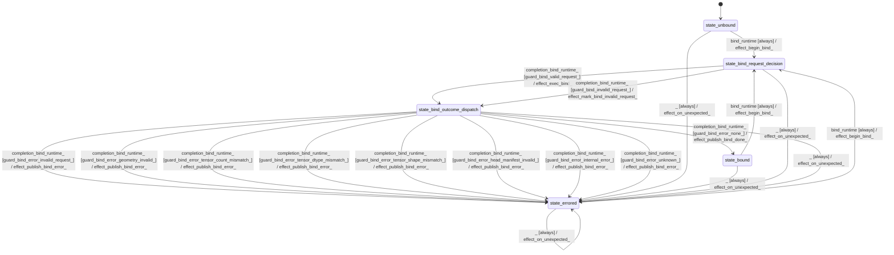

# model_needle

Source: [`emel/model/needle/sm.hpp`](https://github.com/stateforward/emel.cpp/blob/main/src/emel/model/needle/sm.hpp)

## Mermaid

## Transitions

| Source | Event | Guard | Action | Target |
| --- | --- | --- | --- | --- |
| [`state_unbound`](https://github.com/stateforward/emel.cpp/blob/main/src/emel/model/needle/sm.hpp) | [`bind_runtime`](https://github.com/stateforward/emel.cpp/blob/main/src/emel/model/needle/sm.hpp) | [`always`](https://github.com/stateforward/emel.cpp/blob/main/src/emel/model/needle/sm.hpp) | [`effect_begin_bind>`](https://github.com/stateforward/emel.cpp/blob/main/src/emel/model/needle/sm.hpp) | [`state_bind_request_decision`](https://github.com/stateforward/emel.cpp/blob/main/src/emel/model/needle/sm.hpp) |
| [`state_bound`](https://github.com/stateforward/emel.cpp/blob/main/src/emel/model/needle/sm.hpp) | [`bind_runtime`](https://github.com/stateforward/emel.cpp/blob/main/src/emel/model/needle/sm.hpp) | [`always`](https://github.com/stateforward/emel.cpp/blob/main/src/emel/model/needle/sm.hpp) | [`effect_begin_bind>`](https://github.com/stateforward/emel.cpp/blob/main/src/emel/model/needle/sm.hpp) | [`state_bind_request_decision`](https://github.com/stateforward/emel.cpp/blob/main/src/emel/model/needle/sm.hpp) |
| [`state_errored`](https://github.com/stateforward/emel.cpp/blob/main/src/emel/model/needle/sm.hpp) | [`bind_runtime`](https://github.com/stateforward/emel.cpp/blob/main/src/emel/model/needle/sm.hpp) | [`always`](https://github.com/stateforward/emel.cpp/blob/main/src/emel/model/needle/sm.hpp) | [`effect_begin_bind>`](https://github.com/stateforward/emel.cpp/blob/main/src/emel/model/needle/sm.hpp) | [`state_bind_request_decision`](https://github.com/stateforward/emel.cpp/blob/main/src/emel/model/needle/sm.hpp) |
| [`state_bind_request_decision`](https://github.com/stateforward/emel.cpp/blob/main/src/emel/model/needle/sm.hpp) | [`completion<bind_runtime>`](https://github.com/stateforward/emel.cpp/blob/main/src/emel/model/needle/sm.hpp) | [`guard_bind_valid_request>`](https://github.com/stateforward/emel.cpp/blob/main/src/emel/model/needle/sm.hpp) | [`effect_exec_bind>`](https://github.com/stateforward/emel.cpp/blob/main/src/emel/model/needle/sm.hpp) | [`state_bind_outcome_dispatch`](https://github.com/stateforward/emel.cpp/blob/main/src/emel/model/needle/sm.hpp) |
| [`state_bind_request_decision`](https://github.com/stateforward/emel.cpp/blob/main/src/emel/model/needle/sm.hpp) | [`completion<bind_runtime>`](https://github.com/stateforward/emel.cpp/blob/main/src/emel/model/needle/sm.hpp) | [`guard_bind_invalid_request>`](https://github.com/stateforward/emel.cpp/blob/main/src/emel/model/needle/sm.hpp) | [`effect_mark_bind_invalid_request>`](https://github.com/stateforward/emel.cpp/blob/main/src/emel/model/needle/sm.hpp) | [`state_bind_outcome_dispatch`](https://github.com/stateforward/emel.cpp/blob/main/src/emel/model/needle/sm.hpp) |
| [`state_bind_outcome_dispatch`](https://github.com/stateforward/emel.cpp/blob/main/src/emel/model/needle/sm.hpp) | [`completion<bind_runtime>`](https://github.com/stateforward/emel.cpp/blob/main/src/emel/model/needle/sm.hpp) | [`guard_bind_error_none>`](https://github.com/stateforward/emel.cpp/blob/main/src/emel/model/needle/sm.hpp) | [`effect_publish_bind_done>`](https://github.com/stateforward/emel.cpp/blob/main/src/emel/model/needle/sm.hpp) | [`state_bound`](https://github.com/stateforward/emel.cpp/blob/main/src/emel/model/needle/sm.hpp) |
| [`state_bind_outcome_dispatch`](https://github.com/stateforward/emel.cpp/blob/main/src/emel/model/needle/sm.hpp) | [`completion<bind_runtime>`](https://github.com/stateforward/emel.cpp/blob/main/src/emel/model/needle/sm.hpp) | [`guard_bind_error_invalid_request>`](https://github.com/stateforward/emel.cpp/blob/main/src/emel/model/needle/sm.hpp) | [`effect_publish_bind_error>`](https://github.com/stateforward/emel.cpp/blob/main/src/emel/model/needle/sm.hpp) | [`state_errored`](https://github.com/stateforward/emel.cpp/blob/main/src/emel/model/needle/sm.hpp) |
| [`state_bind_outcome_dispatch`](https://github.com/stateforward/emel.cpp/blob/main/src/emel/model/needle/sm.hpp) | [`completion<bind_runtime>`](https://github.com/stateforward/emel.cpp/blob/main/src/emel/model/needle/sm.hpp) | [`guard_bind_error_geometry_invalid>`](https://github.com/stateforward/emel.cpp/blob/main/src/emel/model/needle/sm.hpp) | [`effect_publish_bind_error>`](https://github.com/stateforward/emel.cpp/blob/main/src/emel/model/needle/sm.hpp) | [`state_errored`](https://github.com/stateforward/emel.cpp/blob/main/src/emel/model/needle/sm.hpp) |
| [`state_bind_outcome_dispatch`](https://github.com/stateforward/emel.cpp/blob/main/src/emel/model/needle/sm.hpp) | [`completion<bind_runtime>`](https://github.com/stateforward/emel.cpp/blob/main/src/emel/model/needle/sm.hpp) | [`guard_bind_error_tensor_count_mismatch>`](https://github.com/stateforward/emel.cpp/blob/main/src/emel/model/needle/sm.hpp) | [`effect_publish_bind_error>`](https://github.com/stateforward/emel.cpp/blob/main/src/emel/model/needle/sm.hpp) | [`state_errored`](https://github.com/stateforward/emel.cpp/blob/main/src/emel/model/needle/sm.hpp) |
| [`state_bind_outcome_dispatch`](https://github.com/stateforward/emel.cpp/blob/main/src/emel/model/needle/sm.hpp) | [`completion<bind_runtime>`](https://github.com/stateforward/emel.cpp/blob/main/src/emel/model/needle/sm.hpp) | [`guard_bind_error_tensor_dtype_mismatch>`](https://github.com/stateforward/emel.cpp/blob/main/src/emel/model/needle/sm.hpp) | [`effect_publish_bind_error>`](https://github.com/stateforward/emel.cpp/blob/main/src/emel/model/needle/sm.hpp) | [`state_errored`](https://github.com/stateforward/emel.cpp/blob/main/src/emel/model/needle/sm.hpp) |
| [`state_bind_outcome_dispatch`](https://github.com/stateforward/emel.cpp/blob/main/src/emel/model/needle/sm.hpp) | [`completion<bind_runtime>`](https://github.com/stateforward/emel.cpp/blob/main/src/emel/model/needle/sm.hpp) | [`guard_bind_error_tensor_shape_mismatch>`](https://github.com/stateforward/emel.cpp/blob/main/src/emel/model/needle/sm.hpp) | [`effect_publish_bind_error>`](https://github.com/stateforward/emel.cpp/blob/main/src/emel/model/needle/sm.hpp) | [`state_errored`](https://github.com/stateforward/emel.cpp/blob/main/src/emel/model/needle/sm.hpp) |
| [`state_bind_outcome_dispatch`](https://github.com/stateforward/emel.cpp/blob/main/src/emel/model/needle/sm.hpp) | [`completion<bind_runtime>`](https://github.com/stateforward/emel.cpp/blob/main/src/emel/model/needle/sm.hpp) | [`guard_bind_error_head_manifest_invalid>`](https://github.com/stateforward/emel.cpp/blob/main/src/emel/model/needle/sm.hpp) | [`effect_publish_bind_error>`](https://github.com/stateforward/emel.cpp/blob/main/src/emel/model/needle/sm.hpp) | [`state_errored`](https://github.com/stateforward/emel.cpp/blob/main/src/emel/model/needle/sm.hpp) |
| [`state_bind_outcome_dispatch`](https://github.com/stateforward/emel.cpp/blob/main/src/emel/model/needle/sm.hpp) | [`completion<bind_runtime>`](https://github.com/stateforward/emel.cpp/blob/main/src/emel/model/needle/sm.hpp) | [`guard_bind_error_internal_error>`](https://github.com/stateforward/emel.cpp/blob/main/src/emel/model/needle/sm.hpp) | [`effect_publish_bind_error>`](https://github.com/stateforward/emel.cpp/blob/main/src/emel/model/needle/sm.hpp) | [`state_errored`](https://github.com/stateforward/emel.cpp/blob/main/src/emel/model/needle/sm.hpp) |
| [`state_bind_outcome_dispatch`](https://github.com/stateforward/emel.cpp/blob/main/src/emel/model/needle/sm.hpp) | [`completion<bind_runtime>`](https://github.com/stateforward/emel.cpp/blob/main/src/emel/model/needle/sm.hpp) | [`guard_bind_error_unknown>`](https://github.com/stateforward/emel.cpp/blob/main/src/emel/model/needle/sm.hpp) | [`effect_publish_bind_error>`](https://github.com/stateforward/emel.cpp/blob/main/src/emel/model/needle/sm.hpp) | [`state_errored`](https://github.com/stateforward/emel.cpp/blob/main/src/emel/model/needle/sm.hpp) |
| [`state_unbound`](https://github.com/stateforward/emel.cpp/blob/main/src/emel/model/needle/sm.hpp) | [`_`](https://github.com/stateforward/emel.cpp/blob/main/src/emel/model/needle/sm.hpp) | [`always`](https://github.com/stateforward/emel.cpp/blob/main/src/emel/model/needle/sm.hpp) | [`effect_on_unexpected>`](https://github.com/stateforward/emel.cpp/blob/main/src/emel/model/needle/sm.hpp) | [`state_errored`](https://github.com/stateforward/emel.cpp/blob/main/src/emel/model/needle/sm.hpp) |
| [`state_bound`](https://github.com/stateforward/emel.cpp/blob/main/src/emel/model/needle/sm.hpp) | [`_`](https://github.com/stateforward/emel.cpp/blob/main/src/emel/model/needle/sm.hpp) | [`always`](https://github.com/stateforward/emel.cpp/blob/main/src/emel/model/needle/sm.hpp) | [`effect_on_unexpected>`](https://github.com/stateforward/emel.cpp/blob/main/src/emel/model/needle/sm.hpp) | [`state_errored`](https://github.com/stateforward/emel.cpp/blob/main/src/emel/model/needle/sm.hpp) |
| [`state_errored`](https://github.com/stateforward/emel.cpp/blob/main/src/emel/model/needle/sm.hpp) | [`_`](https://github.com/stateforward/emel.cpp/blob/main/src/emel/model/needle/sm.hpp) | [`always`](https://github.com/stateforward/emel.cpp/blob/main/src/emel/model/needle/sm.hpp) | [`effect_on_unexpected>`](https://github.com/stateforward/emel.cpp/blob/main/src/emel/model/needle/sm.hpp) | [`state_errored`](https://github.com/stateforward/emel.cpp/blob/main/src/emel/model/needle/sm.hpp) |
| [`state_bind_request_decision`](https://github.com/stateforward/emel.cpp/blob/main/src/emel/model/needle/sm.hpp) | [`_`](https://github.com/stateforward/emel.cpp/blob/main/src/emel/model/needle/sm.hpp) | [`always`](https://github.com/stateforward/emel.cpp/blob/main/src/emel/model/needle/sm.hpp) | [`effect_on_unexpected>`](https://github.com/stateforward/emel.cpp/blob/main/src/emel/model/needle/sm.hpp) | [`state_errored`](https://github.com/stateforward/emel.cpp/blob/main/src/emel/model/needle/sm.hpp) |
| [`state_bind_outcome_dispatch`](https://github.com/stateforward/emel.cpp/blob/main/src/emel/model/needle/sm.hpp) | [`_`](https://github.com/stateforward/emel.cpp/blob/main/src/emel/model/needle/sm.hpp) | [`always`](https://github.com/stateforward/emel.cpp/blob/main/src/emel/model/needle/sm.hpp) | [`effect_on_unexpected>`](https://github.com/stateforward/emel.cpp/blob/main/src/emel/model/needle/sm.hpp) | [`state_errored`](https://github.com/stateforward/emel.cpp/blob/main/src/emel/model/needle/sm.hpp) |
