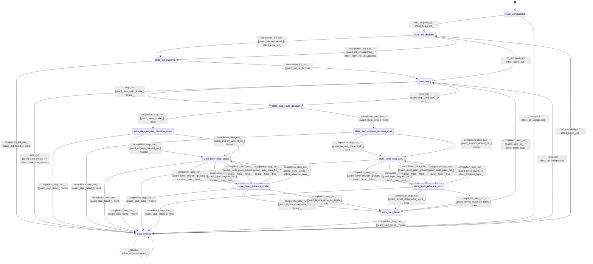

# model_needle_graph

Source: [`emel/model/needle/graph/sm.hpp`](https://github.com/stateforward/emel.cpp/blob/main/src/emel/model/needle/graph/sm.hpp)

## Mermaid

## Transitions

| Source | Event | Guard | Action | Target |
| --- | --- | --- | --- | --- |
| [`state_uninitialized`](https://github.com/stateforward/emel.cpp/blob/main/src/emel/model/needle/graph/sm.hpp) | [`init_run`](https://github.com/stateforward/emel.cpp/blob/main/src/emel/model/needle/graph/sm.hpp) | [`always`](https://github.com/stateforward/emel.cpp/blob/main/src/emel/model/needle/graph/sm.hpp) | [`effect_begin_init>`](https://github.com/stateforward/emel.cpp/blob/main/src/emel/model/needle/graph/sm.hpp) | [`state_init_decision`](https://github.com/stateforward/emel.cpp/blob/main/src/emel/model/needle/graph/sm.hpp) |
| [`state_ready`](https://github.com/stateforward/emel.cpp/blob/main/src/emel/model/needle/graph/sm.hpp) | [`init_run`](https://github.com/stateforward/emel.cpp/blob/main/src/emel/model/needle/graph/sm.hpp) | [`always`](https://github.com/stateforward/emel.cpp/blob/main/src/emel/model/needle/graph/sm.hpp) | [`effect_begin_init>`](https://github.com/stateforward/emel.cpp/blob/main/src/emel/model/needle/graph/sm.hpp) | [`state_init_decision`](https://github.com/stateforward/emel.cpp/blob/main/src/emel/model/needle/graph/sm.hpp) |
| [`state_errored`](https://github.com/stateforward/emel.cpp/blob/main/src/emel/model/needle/graph/sm.hpp) | [`init_run`](https://github.com/stateforward/emel.cpp/blob/main/src/emel/model/needle/graph/sm.hpp) | [`always`](https://github.com/stateforward/emel.cpp/blob/main/src/emel/model/needle/graph/sm.hpp) | [`effect_begin_init>`](https://github.com/stateforward/emel.cpp/blob/main/src/emel/model/needle/graph/sm.hpp) | [`state_init_decision`](https://github.com/stateforward/emel.cpp/blob/main/src/emel/model/needle/graph/sm.hpp) |
| [`state_init_decision`](https://github.com/stateforward/emel.cpp/blob/main/src/emel/model/needle/graph/sm.hpp) | [`completion<init_run>`](https://github.com/stateforward/emel.cpp/blob/main/src/emel/model/needle/graph/sm.hpp) | [`guard_init_supported>`](https://github.com/stateforward/emel.cpp/blob/main/src/emel/model/needle/graph/sm.hpp) | [`effect_exec_init>`](https://github.com/stateforward/emel.cpp/blob/main/src/emel/model/needle/graph/sm.hpp) | [`state_init_outcome`](https://github.com/stateforward/emel.cpp/blob/main/src/emel/model/needle/graph/sm.hpp) |
| [`state_init_decision`](https://github.com/stateforward/emel.cpp/blob/main/src/emel/model/needle/graph/sm.hpp) | [`completion<init_run>`](https://github.com/stateforward/emel.cpp/blob/main/src/emel/model/needle/graph/sm.hpp) | [`guard_init_unsupported>`](https://github.com/stateforward/emel.cpp/blob/main/src/emel/model/needle/graph/sm.hpp) | [`effect_mark_init_unsupported>`](https://github.com/stateforward/emel.cpp/blob/main/src/emel/model/needle/graph/sm.hpp) | [`state_init_outcome`](https://github.com/stateforward/emel.cpp/blob/main/src/emel/model/needle/graph/sm.hpp) |
| [`state_init_outcome`](https://github.com/stateforward/emel.cpp/blob/main/src/emel/model/needle/graph/sm.hpp) | [`completion<init_run>`](https://github.com/stateforward/emel.cpp/blob/main/src/emel/model/needle/graph/sm.hpp) | [`guard_init_ok>`](https://github.com/stateforward/emel.cpp/blob/main/src/emel/model/needle/graph/sm.hpp) | [`none`](https://github.com/stateforward/emel.cpp/blob/main/src/emel/model/needle/graph/sm.hpp) | [`state_ready`](https://github.com/stateforward/emel.cpp/blob/main/src/emel/model/needle/graph/sm.hpp) |
| [`state_init_outcome`](https://github.com/stateforward/emel.cpp/blob/main/src/emel/model/needle/graph/sm.hpp) | [`completion<init_run>`](https://github.com/stateforward/emel.cpp/blob/main/src/emel/model/needle/graph/sm.hpp) | [`guard_init_failed>`](https://github.com/stateforward/emel.cpp/blob/main/src/emel/model/needle/graph/sm.hpp) | [`none`](https://github.com/stateforward/emel.cpp/blob/main/src/emel/model/needle/graph/sm.hpp) | [`state_errored`](https://github.com/stateforward/emel.cpp/blob/main/src/emel/model/needle/graph/sm.hpp) |
| [`state_ready`](https://github.com/stateforward/emel.cpp/blob/main/src/emel/model/needle/graph/sm.hpp) | [`step_run`](https://github.com/stateforward/emel.cpp/blob/main/src/emel/model/needle/graph/sm.hpp) | [`guard_step_valid_scalar>`](https://github.com/stateforward/emel.cpp/blob/main/src/emel/model/needle/graph/sm.hpp) | [`scalar>>`](https://github.com/stateforward/emel.cpp/blob/main/src/emel/model/needle/graph/sm.hpp) | [`state_step_route_decision`](https://github.com/stateforward/emel.cpp/blob/main/src/emel/model/needle/graph/sm.hpp) |
| [`state_ready`](https://github.com/stateforward/emel.cpp/blob/main/src/emel/model/needle/graph/sm.hpp) | [`step_run`](https://github.com/stateforward/emel.cpp/blob/main/src/emel/model/needle/graph/sm.hpp) | [`guard_step_valid_avx2>`](https://github.com/stateforward/emel.cpp/blob/main/src/emel/model/needle/graph/sm.hpp) | [`avx2>>`](https://github.com/stateforward/emel.cpp/blob/main/src/emel/model/needle/graph/sm.hpp) | [`state_step_route_decision`](https://github.com/stateforward/emel.cpp/blob/main/src/emel/model/needle/graph/sm.hpp) |
| [`state_ready`](https://github.com/stateforward/emel.cpp/blob/main/src/emel/model/needle/graph/sm.hpp) | [`step_run`](https://github.com/stateforward/emel.cpp/blob/main/src/emel/model/needle/graph/sm.hpp) | [`guard_step_invalid>`](https://github.com/stateforward/emel.cpp/blob/main/src/emel/model/needle/graph/sm.hpp) | [`effect_mark_step_invalid>`](https://github.com/stateforward/emel.cpp/blob/main/src/emel/model/needle/graph/sm.hpp) | [`state_errored`](https://github.com/stateforward/emel.cpp/blob/main/src/emel/model/needle/graph/sm.hpp) |
| [`state_step_route_decision`](https://github.com/stateforward/emel.cpp/blob/main/src/emel/model/needle/graph/sm.hpp) | [`completion<step_run>`](https://github.com/stateforward/emel.cpp/blob/main/src/emel/model/needle/graph/sm.hpp) | [`guard_route_scalar>`](https://github.com/stateforward/emel.cpp/blob/main/src/emel/model/needle/graph/sm.hpp) | [`none`](https://github.com/stateforward/emel.cpp/blob/main/src/emel/model/needle/graph/sm.hpp) | [`state_step_engram_decision_scalar`](https://github.com/stateforward/emel.cpp/blob/main/src/emel/model/needle/graph/sm.hpp) |
| [`state_step_route_decision`](https://github.com/stateforward/emel.cpp/blob/main/src/emel/model/needle/graph/sm.hpp) | [`completion<step_run>`](https://github.com/stateforward/emel.cpp/blob/main/src/emel/model/needle/graph/sm.hpp) | [`guard_route_avx2>`](https://github.com/stateforward/emel.cpp/blob/main/src/emel/model/needle/graph/sm.hpp) | [`none`](https://github.com/stateforward/emel.cpp/blob/main/src/emel/model/needle/graph/sm.hpp) | [`state_step_engram_decision_avx2`](https://github.com/stateforward/emel.cpp/blob/main/src/emel/model/needle/graph/sm.hpp) |
| [`state_step_engram_decision_scalar`](https://github.com/stateforward/emel.cpp/blob/main/src/emel/model/needle/graph/sm.hpp) | [`completion<step_run>`](https://github.com/stateforward/emel.cpp/blob/main/src/emel/model/needle/graph/sm.hpp) | [`guard_engram_present_ok>`](https://github.com/stateforward/emel.cpp/blob/main/src/emel/model/needle/graph/sm.hpp) | [`scalar>>`](https://github.com/stateforward/emel.cpp/blob/main/src/emel/model/needle/graph/sm.hpp) | [`state_layer_loop_scalar`](https://github.com/stateforward/emel.cpp/blob/main/src/emel/model/needle/graph/sm.hpp) |
| [`state_step_engram_decision_scalar`](https://github.com/stateforward/emel.cpp/blob/main/src/emel/model/needle/graph/sm.hpp) | [`completion<step_run>`](https://github.com/stateforward/emel.cpp/blob/main/src/emel/model/needle/graph/sm.hpp) | [`guard_engram_absent_ok>`](https://github.com/stateforward/emel.cpp/blob/main/src/emel/model/needle/graph/sm.hpp) | [`none`](https://github.com/stateforward/emel.cpp/blob/main/src/emel/model/needle/graph/sm.hpp) | [`state_layer_loop_scalar`](https://github.com/stateforward/emel.cpp/blob/main/src/emel/model/needle/graph/sm.hpp) |
| [`state_step_engram_decision_scalar`](https://github.com/stateforward/emel.cpp/blob/main/src/emel/model/needle/graph/sm.hpp) | [`completion<step_run>`](https://github.com/stateforward/emel.cpp/blob/main/src/emel/model/needle/graph/sm.hpp) | [`guard_step_failed>`](https://github.com/stateforward/emel.cpp/blob/main/src/emel/model/needle/graph/sm.hpp) | [`none`](https://github.com/stateforward/emel.cpp/blob/main/src/emel/model/needle/graph/sm.hpp) | [`state_errored`](https://github.com/stateforward/emel.cpp/blob/main/src/emel/model/needle/graph/sm.hpp) |
| [`state_step_engram_decision_avx2`](https://github.com/stateforward/emel.cpp/blob/main/src/emel/model/needle/graph/sm.hpp) | [`completion<step_run>`](https://github.com/stateforward/emel.cpp/blob/main/src/emel/model/needle/graph/sm.hpp) | [`guard_engram_present_ok>`](https://github.com/stateforward/emel.cpp/blob/main/src/emel/model/needle/graph/sm.hpp) | [`avx2>>`](https://github.com/stateforward/emel.cpp/blob/main/src/emel/model/needle/graph/sm.hpp) | [`state_layer_loop_avx2`](https://github.com/stateforward/emel.cpp/blob/main/src/emel/model/needle/graph/sm.hpp) |
| [`state_step_engram_decision_avx2`](https://github.com/stateforward/emel.cpp/blob/main/src/emel/model/needle/graph/sm.hpp) | [`completion<step_run>`](https://github.com/stateforward/emel.cpp/blob/main/src/emel/model/needle/graph/sm.hpp) | [`guard_engram_absent_ok>`](https://github.com/stateforward/emel.cpp/blob/main/src/emel/model/needle/graph/sm.hpp) | [`none`](https://github.com/stateforward/emel.cpp/blob/main/src/emel/model/needle/graph/sm.hpp) | [`state_layer_loop_avx2`](https://github.com/stateforward/emel.cpp/blob/main/src/emel/model/needle/graph/sm.hpp) |
| [`state_step_engram_decision_avx2`](https://github.com/stateforward/emel.cpp/blob/main/src/emel/model/needle/graph/sm.hpp) | [`completion<step_run>`](https://github.com/stateforward/emel.cpp/blob/main/src/emel/model/needle/graph/sm.hpp) | [`guard_step_failed>`](https://github.com/stateforward/emel.cpp/blob/main/src/emel/model/needle/graph/sm.hpp) | [`none`](https://github.com/stateforward/emel.cpp/blob/main/src/emel/model/needle/graph/sm.hpp) | [`state_errored`](https://github.com/stateforward/emel.cpp/blob/main/src/emel/model/needle/graph/sm.hpp) |
| [`state_layer_loop_scalar`](https://github.com/stateforward/emel.cpp/blob/main/src/emel/model/needle/graph/sm.hpp) | [`completion<step_run>`](https://github.com/stateforward/emel.cpp/blob/main/src/emel/model/needle/graph/sm.hpp) | [`guard_layer_engram_growing>`](https://github.com/stateforward/emel.cpp/blob/main/src/emel/model/needle/graph/sm.hpp) | [`scalar, true, false>>`](https://github.com/stateforward/emel.cpp/blob/main/src/emel/model/needle/graph/sm.hpp) | [`state_layer_advance_scalar`](https://github.com/stateforward/emel.cpp/blob/main/src/emel/model/needle/graph/sm.hpp) |
| [`state_layer_loop_scalar`](https://github.com/stateforward/emel.cpp/blob/main/src/emel/model/needle/graph/sm.hpp) | [`completion<step_run>`](https://github.com/stateforward/emel.cpp/blob/main/src/emel/model/needle/graph/sm.hpp) | [`guard_layer_engram_full>`](https://github.com/stateforward/emel.cpp/blob/main/src/emel/model/needle/graph/sm.hpp) | [`scalar, true, true>>`](https://github.com/stateforward/emel.cpp/blob/main/src/emel/model/needle/graph/sm.hpp) | [`state_layer_advance_scalar`](https://github.com/stateforward/emel.cpp/blob/main/src/emel/model/needle/graph/sm.hpp) |
| [`state_layer_loop_scalar`](https://github.com/stateforward/emel.cpp/blob/main/src/emel/model/needle/graph/sm.hpp) | [`completion<step_run>`](https://github.com/stateforward/emel.cpp/blob/main/src/emel/model/needle/graph/sm.hpp) | [`guard_layer_plain_growing>`](https://github.com/stateforward/emel.cpp/blob/main/src/emel/model/needle/graph/sm.hpp) | [`scalar, false, false>>`](https://github.com/stateforward/emel.cpp/blob/main/src/emel/model/needle/graph/sm.hpp) | [`state_layer_advance_scalar`](https://github.com/stateforward/emel.cpp/blob/main/src/emel/model/needle/graph/sm.hpp) |
| [`state_layer_loop_scalar`](https://github.com/stateforward/emel.cpp/blob/main/src/emel/model/needle/graph/sm.hpp) | [`completion<step_run>`](https://github.com/stateforward/emel.cpp/blob/main/src/emel/model/needle/graph/sm.hpp) | [`guard_layer_plain_full>`](https://github.com/stateforward/emel.cpp/blob/main/src/emel/model/needle/graph/sm.hpp) | [`scalar, false, true>>`](https://github.com/stateforward/emel.cpp/blob/main/src/emel/model/needle/graph/sm.hpp) | [`state_layer_advance_scalar`](https://github.com/stateforward/emel.cpp/blob/main/src/emel/model/needle/graph/sm.hpp) |
| [`state_layer_loop_scalar`](https://github.com/stateforward/emel.cpp/blob/main/src/emel/model/needle/graph/sm.hpp) | [`completion<step_run>`](https://github.com/stateforward/emel.cpp/blob/main/src/emel/model/needle/graph/sm.hpp) | [`guard_step_failed>`](https://github.com/stateforward/emel.cpp/blob/main/src/emel/model/needle/graph/sm.hpp) | [`none`](https://github.com/stateforward/emel.cpp/blob/main/src/emel/model/needle/graph/sm.hpp) | [`state_errored`](https://github.com/stateforward/emel.cpp/blob/main/src/emel/model/needle/graph/sm.hpp) |
| [`state_layer_advance_scalar`](https://github.com/stateforward/emel.cpp/blob/main/src/emel/model/needle/graph/sm.hpp) | [`completion<step_run>`](https://github.com/stateforward/emel.cpp/blob/main/src/emel/model/needle/graph/sm.hpp) | [`guard_more_layers>`](https://github.com/stateforward/emel.cpp/blob/main/src/emel/model/needle/graph/sm.hpp) | [`effect_advance_layer>`](https://github.com/stateforward/emel.cpp/blob/main/src/emel/model/needle/graph/sm.hpp) | [`state_layer_loop_scalar`](https://github.com/stateforward/emel.cpp/blob/main/src/emel/model/needle/graph/sm.hpp) |
| [`state_layer_advance_scalar`](https://github.com/stateforward/emel.cpp/blob/main/src/emel/model/needle/graph/sm.hpp) | [`completion<step_run>`](https://github.com/stateforward/emel.cpp/blob/main/src/emel/model/needle/graph/sm.hpp) | [`guard_layers_done_want_logits>`](https://github.com/stateforward/emel.cpp/blob/main/src/emel/model/needle/graph/sm.hpp) | [`scalar>>`](https://github.com/stateforward/emel.cpp/blob/main/src/emel/model/needle/graph/sm.hpp) | [`state_step_finish`](https://github.com/stateforward/emel.cpp/blob/main/src/emel/model/needle/graph/sm.hpp) |
| [`state_layer_advance_scalar`](https://github.com/stateforward/emel.cpp/blob/main/src/emel/model/needle/graph/sm.hpp) | [`completion<step_run>`](https://github.com/stateforward/emel.cpp/blob/main/src/emel/model/needle/graph/sm.hpp) | [`guard_layers_done_no_logits>`](https://github.com/stateforward/emel.cpp/blob/main/src/emel/model/needle/graph/sm.hpp) | [`none`](https://github.com/stateforward/emel.cpp/blob/main/src/emel/model/needle/graph/sm.hpp) | [`state_step_finish`](https://github.com/stateforward/emel.cpp/blob/main/src/emel/model/needle/graph/sm.hpp) |
| [`state_layer_advance_scalar`](https://github.com/stateforward/emel.cpp/blob/main/src/emel/model/needle/graph/sm.hpp) | [`completion<step_run>`](https://github.com/stateforward/emel.cpp/blob/main/src/emel/model/needle/graph/sm.hpp) | [`guard_step_failed>`](https://github.com/stateforward/emel.cpp/blob/main/src/emel/model/needle/graph/sm.hpp) | [`none`](https://github.com/stateforward/emel.cpp/blob/main/src/emel/model/needle/graph/sm.hpp) | [`state_errored`](https://github.com/stateforward/emel.cpp/blob/main/src/emel/model/needle/graph/sm.hpp) |
| [`state_layer_loop_avx2`](https://github.com/stateforward/emel.cpp/blob/main/src/emel/model/needle/graph/sm.hpp) | [`completion<step_run>`](https://github.com/stateforward/emel.cpp/blob/main/src/emel/model/needle/graph/sm.hpp) | [`guard_layer_engram_growing>`](https://github.com/stateforward/emel.cpp/blob/main/src/emel/model/needle/graph/sm.hpp) | [`avx2, true, false>>`](https://github.com/stateforward/emel.cpp/blob/main/src/emel/model/needle/graph/sm.hpp) | [`state_layer_advance_avx2`](https://github.com/stateforward/emel.cpp/blob/main/src/emel/model/needle/graph/sm.hpp) |
| [`state_layer_loop_avx2`](https://github.com/stateforward/emel.cpp/blob/main/src/emel/model/needle/graph/sm.hpp) | [`completion<step_run>`](https://github.com/stateforward/emel.cpp/blob/main/src/emel/model/needle/graph/sm.hpp) | [`guard_layer_engram_full>`](https://github.com/stateforward/emel.cpp/blob/main/src/emel/model/needle/graph/sm.hpp) | [`avx2, true, true>>`](https://github.com/stateforward/emel.cpp/blob/main/src/emel/model/needle/graph/sm.hpp) | [`state_layer_advance_avx2`](https://github.com/stateforward/emel.cpp/blob/main/src/emel/model/needle/graph/sm.hpp) |
| [`state_layer_loop_avx2`](https://github.com/stateforward/emel.cpp/blob/main/src/emel/model/needle/graph/sm.hpp) | [`completion<step_run>`](https://github.com/stateforward/emel.cpp/blob/main/src/emel/model/needle/graph/sm.hpp) | [`guard_layer_plain_growing>`](https://github.com/stateforward/emel.cpp/blob/main/src/emel/model/needle/graph/sm.hpp) | [`avx2, false, false>>`](https://github.com/stateforward/emel.cpp/blob/main/src/emel/model/needle/graph/sm.hpp) | [`state_layer_advance_avx2`](https://github.com/stateforward/emel.cpp/blob/main/src/emel/model/needle/graph/sm.hpp) |
| [`state_layer_loop_avx2`](https://github.com/stateforward/emel.cpp/blob/main/src/emel/model/needle/graph/sm.hpp) | [`completion<step_run>`](https://github.com/stateforward/emel.cpp/blob/main/src/emel/model/needle/graph/sm.hpp) | [`guard_layer_plain_full>`](https://github.com/stateforward/emel.cpp/blob/main/src/emel/model/needle/graph/sm.hpp) | [`avx2, false, true>>`](https://github.com/stateforward/emel.cpp/blob/main/src/emel/model/needle/graph/sm.hpp) | [`state_layer_advance_avx2`](https://github.com/stateforward/emel.cpp/blob/main/src/emel/model/needle/graph/sm.hpp) |
| [`state_layer_loop_avx2`](https://github.com/stateforward/emel.cpp/blob/main/src/emel/model/needle/graph/sm.hpp) | [`completion<step_run>`](https://github.com/stateforward/emel.cpp/blob/main/src/emel/model/needle/graph/sm.hpp) | [`guard_step_failed>`](https://github.com/stateforward/emel.cpp/blob/main/src/emel/model/needle/graph/sm.hpp) | [`none`](https://github.com/stateforward/emel.cpp/blob/main/src/emel/model/needle/graph/sm.hpp) | [`state_errored`](https://github.com/stateforward/emel.cpp/blob/main/src/emel/model/needle/graph/sm.hpp) |
| [`state_layer_advance_avx2`](https://github.com/stateforward/emel.cpp/blob/main/src/emel/model/needle/graph/sm.hpp) | [`completion<step_run>`](https://github.com/stateforward/emel.cpp/blob/main/src/emel/model/needle/graph/sm.hpp) | [`guard_more_layers>`](https://github.com/stateforward/emel.cpp/blob/main/src/emel/model/needle/graph/sm.hpp) | [`effect_advance_layer>`](https://github.com/stateforward/emel.cpp/blob/main/src/emel/model/needle/graph/sm.hpp) | [`state_layer_loop_avx2`](https://github.com/stateforward/emel.cpp/blob/main/src/emel/model/needle/graph/sm.hpp) |
| [`state_layer_advance_avx2`](https://github.com/stateforward/emel.cpp/blob/main/src/emel/model/needle/graph/sm.hpp) | [`completion<step_run>`](https://github.com/stateforward/emel.cpp/blob/main/src/emel/model/needle/graph/sm.hpp) | [`guard_layers_done_want_logits>`](https://github.com/stateforward/emel.cpp/blob/main/src/emel/model/needle/graph/sm.hpp) | [`avx2>>`](https://github.com/stateforward/emel.cpp/blob/main/src/emel/model/needle/graph/sm.hpp) | [`state_step_finish`](https://github.com/stateforward/emel.cpp/blob/main/src/emel/model/needle/graph/sm.hpp) |
| [`state_layer_advance_avx2`](https://github.com/stateforward/emel.cpp/blob/main/src/emel/model/needle/graph/sm.hpp) | [`completion<step_run>`](https://github.com/stateforward/emel.cpp/blob/main/src/emel/model/needle/graph/sm.hpp) | [`guard_layers_done_no_logits>`](https://github.com/stateforward/emel.cpp/blob/main/src/emel/model/needle/graph/sm.hpp) | [`none`](https://github.com/stateforward/emel.cpp/blob/main/src/emel/model/needle/graph/sm.hpp) | [`state_step_finish`](https://github.com/stateforward/emel.cpp/blob/main/src/emel/model/needle/graph/sm.hpp) |
| [`state_layer_advance_avx2`](https://github.com/stateforward/emel.cpp/blob/main/src/emel/model/needle/graph/sm.hpp) | [`completion<step_run>`](https://github.com/stateforward/emel.cpp/blob/main/src/emel/model/needle/graph/sm.hpp) | [`guard_step_failed>`](https://github.com/stateforward/emel.cpp/blob/main/src/emel/model/needle/graph/sm.hpp) | [`none`](https://github.com/stateforward/emel.cpp/blob/main/src/emel/model/needle/graph/sm.hpp) | [`state_errored`](https://github.com/stateforward/emel.cpp/blob/main/src/emel/model/needle/graph/sm.hpp) |
| [`state_step_finish`](https://github.com/stateforward/emel.cpp/blob/main/src/emel/model/needle/graph/sm.hpp) | [`completion<step_run>`](https://github.com/stateforward/emel.cpp/blob/main/src/emel/model/needle/graph/sm.hpp) | [`guard_step_ok>`](https://github.com/stateforward/emel.cpp/blob/main/src/emel/model/needle/graph/sm.hpp) | [`effect_finish_step>`](https://github.com/stateforward/emel.cpp/blob/main/src/emel/model/needle/graph/sm.hpp) | [`state_ready`](https://github.com/stateforward/emel.cpp/blob/main/src/emel/model/needle/graph/sm.hpp) |
| [`state_step_finish`](https://github.com/stateforward/emel.cpp/blob/main/src/emel/model/needle/graph/sm.hpp) | [`completion<step_run>`](https://github.com/stateforward/emel.cpp/blob/main/src/emel/model/needle/graph/sm.hpp) | [`guard_step_failed>`](https://github.com/stateforward/emel.cpp/blob/main/src/emel/model/needle/graph/sm.hpp) | [`none`](https://github.com/stateforward/emel.cpp/blob/main/src/emel/model/needle/graph/sm.hpp) | [`state_errored`](https://github.com/stateforward/emel.cpp/blob/main/src/emel/model/needle/graph/sm.hpp) |
| [`state_uninitialized`](https://github.com/stateforward/emel.cpp/blob/main/src/emel/model/needle/graph/sm.hpp) | [`_`](https://github.com/stateforward/emel.cpp/blob/main/src/emel/model/needle/graph/sm.hpp) | [`always`](https://github.com/stateforward/emel.cpp/blob/main/src/emel/model/needle/graph/sm.hpp) | [`effect_on_unexpected>`](https://github.com/stateforward/emel.cpp/blob/main/src/emel/model/needle/graph/sm.hpp) | [`state_errored`](https://github.com/stateforward/emel.cpp/blob/main/src/emel/model/needle/graph/sm.hpp) |
| [`state_ready`](https://github.com/stateforward/emel.cpp/blob/main/src/emel/model/needle/graph/sm.hpp) | [`_`](https://github.com/stateforward/emel.cpp/blob/main/src/emel/model/needle/graph/sm.hpp) | [`always`](https://github.com/stateforward/emel.cpp/blob/main/src/emel/model/needle/graph/sm.hpp) | [`effect_on_unexpected>`](https://github.com/stateforward/emel.cpp/blob/main/src/emel/model/needle/graph/sm.hpp) | [`state_errored`](https://github.com/stateforward/emel.cpp/blob/main/src/emel/model/needle/graph/sm.hpp) |
| [`state_errored`](https://github.com/stateforward/emel.cpp/blob/main/src/emel/model/needle/graph/sm.hpp) | [`_`](https://github.com/stateforward/emel.cpp/blob/main/src/emel/model/needle/graph/sm.hpp) | [`always`](https://github.com/stateforward/emel.cpp/blob/main/src/emel/model/needle/graph/sm.hpp) | [`effect_on_unexpected>`](https://github.com/stateforward/emel.cpp/blob/main/src/emel/model/needle/graph/sm.hpp) | [`state_errored`](https://github.com/stateforward/emel.cpp/blob/main/src/emel/model/needle/graph/sm.hpp) |
