# model_tensor

Source: [`emel/model/tensor/sm.hpp`](https://github.com/stateforward/emel.cpp/blob/main/src/emel/model/tensor/sm.hpp)

## Mermaid

```mermaid
stateDiagram-v2
  direction TB
  [*] --> ready
  ready --> bind_tensor_request_decision : bind_tensor_runtime [always] / begin_bind_tensor_
  bind_tensor_request_decision --> bind_tensor_exec : completion_bind_tensor_runtime_ [bind_tensor_request_valid_] / none
  bind_tensor_request_decision --> errored : completion_bind_tensor_runtime_ [bind_tensor_request_invalid_] / mark_invalid_request_
  bind_tensor_exec --> bind_tensor_result_decision : completion_bind_tensor_runtime_ [always] / exec_bind_tensor_
  bind_tensor_result_decision --> done : completion_bind_tensor_runtime_ [operation_succeeded_] / none
  bind_tensor_result_decision --> errored : completion_bind_tensor_runtime_ [operation_not_dispatched_] / mark_invalid_request_
  ready --> evict_tensor_request_decision : evict_tensor_runtime [always] / begin_evict_tensor_
  evict_tensor_request_decision --> evict_tensor_exec : completion_evict_tensor_runtime_ [evict_tensor_request_valid_] / none
  evict_tensor_request_decision --> errored : completion_evict_tensor_runtime_ [evict_tensor_request_invalid_] / mark_invalid_request_
  evict_tensor_exec --> evict_tensor_result_decision : completion_evict_tensor_runtime_ [always] / exec_evict_tensor_
  evict_tensor_result_decision --> done : completion_evict_tensor_runtime_ [operation_succeeded_] / none
  evict_tensor_result_decision --> errored : completion_evict_tensor_runtime_ [operation_not_dispatched_] / mark_invalid_request_
  ready --> capture_tensor_state_request_decision : capture_tensor_state_runtime [always] / begin_capture_tensor_state_
  capture_tensor_state_request_decision --> capture_tensor_state_exec : completion_capture_tensor_state_runtime_ [capture_tensor_state_request_valid_] / none
  capture_tensor_state_request_decision --> errored : completion_capture_tensor_state_runtime_ [capture_tensor_state_request_invalid_] / mark_invalid_request_
  capture_tensor_state_exec --> capture_tensor_state_result_decision : completion_capture_tensor_state_runtime_ [always] / exec_capture_tensor_state_
  capture_tensor_state_result_decision --> done : completion_capture_tensor_state_runtime_ [operation_succeeded_] / none
  capture_tensor_state_result_decision --> errored : completion_capture_tensor_state_runtime_ [operation_not_dispatched_] / mark_invalid_request_
  done --> ready : completion_bind_tensor_runtime_ [always] / publish_done_
  errored --> ready : completion_bind_tensor_runtime_ [always] / publish_error_
  done --> ready : completion_evict_tensor_runtime_ [always] / publish_done_
  errored --> ready : completion_evict_tensor_runtime_ [always] / publish_error_
  done --> ready : completion_capture_tensor_state_runtime_ [always] / publish_done_
  errored --> ready : completion_capture_tensor_state_runtime_ [always] / publish_error_
  ready --> ready : _ [always] / on_unexpected_
  bind_tensor_request_decision --> ready : _ [always] / on_unexpected_
  bind_tensor_exec --> ready : _ [always] / on_unexpected_
  bind_tensor_result_decision --> ready : _ [always] / on_unexpected_
  evict_tensor_request_decision --> ready : _ [always] / on_unexpected_
  evict_tensor_exec --> ready : _ [always] / on_unexpected_
  evict_tensor_result_decision --> ready : _ [always] / on_unexpected_
  capture_tensor_state_request_decision --> ready : _ [always] / on_unexpected_
  capture_tensor_state_exec --> ready : _ [always] / on_unexpected_
  capture_tensor_state_result_decision --> ready : _ [always] / on_unexpected_
  done --> ready : _ [always] / on_unexpected_
  errored --> ready : _ [always] / on_unexpected_
```

## Transitions

| Source | Event | Guard | Action | Target |
| --- | --- | --- | --- | --- |
| [`ready`](https://github.com/stateforward/emel.cpp/blob/main/src/emel/model/tensor/sm.hpp) | [`bind_tensor_runtime`](https://github.com/stateforward/emel.cpp/blob/main/src/emel/model/tensor/sm.hpp) | [`always`](https://github.com/stateforward/emel.cpp/blob/main/src/emel/model/tensor/sm.hpp) | [`begin_bind_tensor>`](https://github.com/stateforward/emel.cpp/blob/main/src/emel/model/tensor/sm.hpp) | [`bind_tensor_request_decision`](https://github.com/stateforward/emel.cpp/blob/main/src/emel/model/tensor/sm.hpp) |
| [`bind_tensor_request_decision`](https://github.com/stateforward/emel.cpp/blob/main/src/emel/model/tensor/sm.hpp) | [`completion<bind_tensor_runtime>`](https://github.com/stateforward/emel.cpp/blob/main/src/emel/model/tensor/sm.hpp) | [`bind_tensor_request_valid>`](https://github.com/stateforward/emel.cpp/blob/main/src/emel/model/tensor/sm.hpp) | [`none`](https://github.com/stateforward/emel.cpp/blob/main/src/emel/model/tensor/sm.hpp) | [`bind_tensor_exec`](https://github.com/stateforward/emel.cpp/blob/main/src/emel/model/tensor/sm.hpp) |
| [`bind_tensor_request_decision`](https://github.com/stateforward/emel.cpp/blob/main/src/emel/model/tensor/sm.hpp) | [`completion<bind_tensor_runtime>`](https://github.com/stateforward/emel.cpp/blob/main/src/emel/model/tensor/sm.hpp) | [`bind_tensor_request_invalid>`](https://github.com/stateforward/emel.cpp/blob/main/src/emel/model/tensor/sm.hpp) | [`mark_invalid_request>`](https://github.com/stateforward/emel.cpp/blob/main/src/emel/model/tensor/sm.hpp) | [`errored`](https://github.com/stateforward/emel.cpp/blob/main/src/emel/model/tensor/sm.hpp) |
| [`bind_tensor_exec`](https://github.com/stateforward/emel.cpp/blob/main/src/emel/model/tensor/sm.hpp) | [`completion<bind_tensor_runtime>`](https://github.com/stateforward/emel.cpp/blob/main/src/emel/model/tensor/sm.hpp) | [`always`](https://github.com/stateforward/emel.cpp/blob/main/src/emel/model/tensor/sm.hpp) | [`exec_bind_tensor>`](https://github.com/stateforward/emel.cpp/blob/main/src/emel/model/tensor/sm.hpp) | [`bind_tensor_result_decision`](https://github.com/stateforward/emel.cpp/blob/main/src/emel/model/tensor/sm.hpp) |
| [`bind_tensor_result_decision`](https://github.com/stateforward/emel.cpp/blob/main/src/emel/model/tensor/sm.hpp) | [`completion<bind_tensor_runtime>`](https://github.com/stateforward/emel.cpp/blob/main/src/emel/model/tensor/sm.hpp) | [`operation_succeeded>`](https://github.com/stateforward/emel.cpp/blob/main/src/emel/model/tensor/sm.hpp) | [`none`](https://github.com/stateforward/emel.cpp/blob/main/src/emel/model/tensor/sm.hpp) | [`done`](https://github.com/stateforward/emel.cpp/blob/main/src/emel/model/tensor/sm.hpp) |
| [`bind_tensor_result_decision`](https://github.com/stateforward/emel.cpp/blob/main/src/emel/model/tensor/sm.hpp) | [`completion<bind_tensor_runtime>`](https://github.com/stateforward/emel.cpp/blob/main/src/emel/model/tensor/sm.hpp) | [`operation_not_dispatched>`](https://github.com/stateforward/emel.cpp/blob/main/src/emel/model/tensor/sm.hpp) | [`mark_invalid_request>`](https://github.com/stateforward/emel.cpp/blob/main/src/emel/model/tensor/sm.hpp) | [`errored`](https://github.com/stateforward/emel.cpp/blob/main/src/emel/model/tensor/sm.hpp) |
| [`ready`](https://github.com/stateforward/emel.cpp/blob/main/src/emel/model/tensor/sm.hpp) | [`evict_tensor_runtime`](https://github.com/stateforward/emel.cpp/blob/main/src/emel/model/tensor/sm.hpp) | [`always`](https://github.com/stateforward/emel.cpp/blob/main/src/emel/model/tensor/sm.hpp) | [`begin_evict_tensor>`](https://github.com/stateforward/emel.cpp/blob/main/src/emel/model/tensor/sm.hpp) | [`evict_tensor_request_decision`](https://github.com/stateforward/emel.cpp/blob/main/src/emel/model/tensor/sm.hpp) |
| [`evict_tensor_request_decision`](https://github.com/stateforward/emel.cpp/blob/main/src/emel/model/tensor/sm.hpp) | [`completion<evict_tensor_runtime>`](https://github.com/stateforward/emel.cpp/blob/main/src/emel/model/tensor/sm.hpp) | [`evict_tensor_request_valid>`](https://github.com/stateforward/emel.cpp/blob/main/src/emel/model/tensor/sm.hpp) | [`none`](https://github.com/stateforward/emel.cpp/blob/main/src/emel/model/tensor/sm.hpp) | [`evict_tensor_exec`](https://github.com/stateforward/emel.cpp/blob/main/src/emel/model/tensor/sm.hpp) |
| [`evict_tensor_request_decision`](https://github.com/stateforward/emel.cpp/blob/main/src/emel/model/tensor/sm.hpp) | [`completion<evict_tensor_runtime>`](https://github.com/stateforward/emel.cpp/blob/main/src/emel/model/tensor/sm.hpp) | [`evict_tensor_request_invalid>`](https://github.com/stateforward/emel.cpp/blob/main/src/emel/model/tensor/sm.hpp) | [`mark_invalid_request>`](https://github.com/stateforward/emel.cpp/blob/main/src/emel/model/tensor/sm.hpp) | [`errored`](https://github.com/stateforward/emel.cpp/blob/main/src/emel/model/tensor/sm.hpp) |
| [`evict_tensor_exec`](https://github.com/stateforward/emel.cpp/blob/main/src/emel/model/tensor/sm.hpp) | [`completion<evict_tensor_runtime>`](https://github.com/stateforward/emel.cpp/blob/main/src/emel/model/tensor/sm.hpp) | [`always`](https://github.com/stateforward/emel.cpp/blob/main/src/emel/model/tensor/sm.hpp) | [`exec_evict_tensor>`](https://github.com/stateforward/emel.cpp/blob/main/src/emel/model/tensor/sm.hpp) | [`evict_tensor_result_decision`](https://github.com/stateforward/emel.cpp/blob/main/src/emel/model/tensor/sm.hpp) |
| [`evict_tensor_result_decision`](https://github.com/stateforward/emel.cpp/blob/main/src/emel/model/tensor/sm.hpp) | [`completion<evict_tensor_runtime>`](https://github.com/stateforward/emel.cpp/blob/main/src/emel/model/tensor/sm.hpp) | [`operation_succeeded>`](https://github.com/stateforward/emel.cpp/blob/main/src/emel/model/tensor/sm.hpp) | [`none`](https://github.com/stateforward/emel.cpp/blob/main/src/emel/model/tensor/sm.hpp) | [`done`](https://github.com/stateforward/emel.cpp/blob/main/src/emel/model/tensor/sm.hpp) |
| [`evict_tensor_result_decision`](https://github.com/stateforward/emel.cpp/blob/main/src/emel/model/tensor/sm.hpp) | [`completion<evict_tensor_runtime>`](https://github.com/stateforward/emel.cpp/blob/main/src/emel/model/tensor/sm.hpp) | [`operation_not_dispatched>`](https://github.com/stateforward/emel.cpp/blob/main/src/emel/model/tensor/sm.hpp) | [`mark_invalid_request>`](https://github.com/stateforward/emel.cpp/blob/main/src/emel/model/tensor/sm.hpp) | [`errored`](https://github.com/stateforward/emel.cpp/blob/main/src/emel/model/tensor/sm.hpp) |
| [`ready`](https://github.com/stateforward/emel.cpp/blob/main/src/emel/model/tensor/sm.hpp) | [`capture_tensor_state_runtime`](https://github.com/stateforward/emel.cpp/blob/main/src/emel/model/tensor/sm.hpp) | [`always`](https://github.com/stateforward/emel.cpp/blob/main/src/emel/model/tensor/sm.hpp) | [`begin_capture_tensor_state>`](https://github.com/stateforward/emel.cpp/blob/main/src/emel/model/tensor/sm.hpp) | [`capture_tensor_state_request_decision`](https://github.com/stateforward/emel.cpp/blob/main/src/emel/model/tensor/sm.hpp) |
| [`capture_tensor_state_request_decision`](https://github.com/stateforward/emel.cpp/blob/main/src/emel/model/tensor/sm.hpp) | [`completion<capture_tensor_state_runtime>`](https://github.com/stateforward/emel.cpp/blob/main/src/emel/model/tensor/sm.hpp) | [`capture_tensor_state_request_valid>`](https://github.com/stateforward/emel.cpp/blob/main/src/emel/model/tensor/sm.hpp) | [`none`](https://github.com/stateforward/emel.cpp/blob/main/src/emel/model/tensor/sm.hpp) | [`capture_tensor_state_exec`](https://github.com/stateforward/emel.cpp/blob/main/src/emel/model/tensor/sm.hpp) |
| [`capture_tensor_state_request_decision`](https://github.com/stateforward/emel.cpp/blob/main/src/emel/model/tensor/sm.hpp) | [`completion<capture_tensor_state_runtime>`](https://github.com/stateforward/emel.cpp/blob/main/src/emel/model/tensor/sm.hpp) | [`capture_tensor_state_request_invalid>`](https://github.com/stateforward/emel.cpp/blob/main/src/emel/model/tensor/sm.hpp) | [`mark_invalid_request>`](https://github.com/stateforward/emel.cpp/blob/main/src/emel/model/tensor/sm.hpp) | [`errored`](https://github.com/stateforward/emel.cpp/blob/main/src/emel/model/tensor/sm.hpp) |
| [`capture_tensor_state_exec`](https://github.com/stateforward/emel.cpp/blob/main/src/emel/model/tensor/sm.hpp) | [`completion<capture_tensor_state_runtime>`](https://github.com/stateforward/emel.cpp/blob/main/src/emel/model/tensor/sm.hpp) | [`always`](https://github.com/stateforward/emel.cpp/blob/main/src/emel/model/tensor/sm.hpp) | [`exec_capture_tensor_state>`](https://github.com/stateforward/emel.cpp/blob/main/src/emel/model/tensor/sm.hpp) | [`capture_tensor_state_result_decision`](https://github.com/stateforward/emel.cpp/blob/main/src/emel/model/tensor/sm.hpp) |
| [`capture_tensor_state_result_decision`](https://github.com/stateforward/emel.cpp/blob/main/src/emel/model/tensor/sm.hpp) | [`completion<capture_tensor_state_runtime>`](https://github.com/stateforward/emel.cpp/blob/main/src/emel/model/tensor/sm.hpp) | [`operation_succeeded>`](https://github.com/stateforward/emel.cpp/blob/main/src/emel/model/tensor/sm.hpp) | [`none`](https://github.com/stateforward/emel.cpp/blob/main/src/emel/model/tensor/sm.hpp) | [`done`](https://github.com/stateforward/emel.cpp/blob/main/src/emel/model/tensor/sm.hpp) |
| [`capture_tensor_state_result_decision`](https://github.com/stateforward/emel.cpp/blob/main/src/emel/model/tensor/sm.hpp) | [`completion<capture_tensor_state_runtime>`](https://github.com/stateforward/emel.cpp/blob/main/src/emel/model/tensor/sm.hpp) | [`operation_not_dispatched>`](https://github.com/stateforward/emel.cpp/blob/main/src/emel/model/tensor/sm.hpp) | [`mark_invalid_request>`](https://github.com/stateforward/emel.cpp/blob/main/src/emel/model/tensor/sm.hpp) | [`errored`](https://github.com/stateforward/emel.cpp/blob/main/src/emel/model/tensor/sm.hpp) |
| [`done`](https://github.com/stateforward/emel.cpp/blob/main/src/emel/model/tensor/sm.hpp) | [`completion<bind_tensor_runtime>`](https://github.com/stateforward/emel.cpp/blob/main/src/emel/model/tensor/sm.hpp) | [`always`](https://github.com/stateforward/emel.cpp/blob/main/src/emel/model/tensor/sm.hpp) | [`publish_done>`](https://github.com/stateforward/emel.cpp/blob/main/src/emel/model/tensor/sm.hpp) | [`ready`](https://github.com/stateforward/emel.cpp/blob/main/src/emel/model/tensor/sm.hpp) |
| [`errored`](https://github.com/stateforward/emel.cpp/blob/main/src/emel/model/tensor/sm.hpp) | [`completion<bind_tensor_runtime>`](https://github.com/stateforward/emel.cpp/blob/main/src/emel/model/tensor/sm.hpp) | [`always`](https://github.com/stateforward/emel.cpp/blob/main/src/emel/model/tensor/sm.hpp) | [`publish_error>`](https://github.com/stateforward/emel.cpp/blob/main/src/emel/model/tensor/sm.hpp) | [`ready`](https://github.com/stateforward/emel.cpp/blob/main/src/emel/model/tensor/sm.hpp) |
| [`done`](https://github.com/stateforward/emel.cpp/blob/main/src/emel/model/tensor/sm.hpp) | [`completion<evict_tensor_runtime>`](https://github.com/stateforward/emel.cpp/blob/main/src/emel/model/tensor/sm.hpp) | [`always`](https://github.com/stateforward/emel.cpp/blob/main/src/emel/model/tensor/sm.hpp) | [`publish_done>`](https://github.com/stateforward/emel.cpp/blob/main/src/emel/model/tensor/sm.hpp) | [`ready`](https://github.com/stateforward/emel.cpp/blob/main/src/emel/model/tensor/sm.hpp) |
| [`errored`](https://github.com/stateforward/emel.cpp/blob/main/src/emel/model/tensor/sm.hpp) | [`completion<evict_tensor_runtime>`](https://github.com/stateforward/emel.cpp/blob/main/src/emel/model/tensor/sm.hpp) | [`always`](https://github.com/stateforward/emel.cpp/blob/main/src/emel/model/tensor/sm.hpp) | [`publish_error>`](https://github.com/stateforward/emel.cpp/blob/main/src/emel/model/tensor/sm.hpp) | [`ready`](https://github.com/stateforward/emel.cpp/blob/main/src/emel/model/tensor/sm.hpp) |
| [`done`](https://github.com/stateforward/emel.cpp/blob/main/src/emel/model/tensor/sm.hpp) | [`completion<capture_tensor_state_runtime>`](https://github.com/stateforward/emel.cpp/blob/main/src/emel/model/tensor/sm.hpp) | [`always`](https://github.com/stateforward/emel.cpp/blob/main/src/emel/model/tensor/sm.hpp) | [`publish_done>`](https://github.com/stateforward/emel.cpp/blob/main/src/emel/model/tensor/sm.hpp) | [`ready`](https://github.com/stateforward/emel.cpp/blob/main/src/emel/model/tensor/sm.hpp) |
| [`errored`](https://github.com/stateforward/emel.cpp/blob/main/src/emel/model/tensor/sm.hpp) | [`completion<capture_tensor_state_runtime>`](https://github.com/stateforward/emel.cpp/blob/main/src/emel/model/tensor/sm.hpp) | [`always`](https://github.com/stateforward/emel.cpp/blob/main/src/emel/model/tensor/sm.hpp) | [`publish_error>`](https://github.com/stateforward/emel.cpp/blob/main/src/emel/model/tensor/sm.hpp) | [`ready`](https://github.com/stateforward/emel.cpp/blob/main/src/emel/model/tensor/sm.hpp) |
| [`ready`](https://github.com/stateforward/emel.cpp/blob/main/src/emel/model/tensor/sm.hpp) | [`_`](https://github.com/stateforward/emel.cpp/blob/main/src/emel/model/tensor/sm.hpp) | [`always`](https://github.com/stateforward/emel.cpp/blob/main/src/emel/model/tensor/sm.hpp) | [`on_unexpected>`](https://github.com/stateforward/emel.cpp/blob/main/src/emel/model/tensor/sm.hpp) | [`ready`](https://github.com/stateforward/emel.cpp/blob/main/src/emel/model/tensor/sm.hpp) |
| [`bind_tensor_request_decision`](https://github.com/stateforward/emel.cpp/blob/main/src/emel/model/tensor/sm.hpp) | [`_`](https://github.com/stateforward/emel.cpp/blob/main/src/emel/model/tensor/sm.hpp) | [`always`](https://github.com/stateforward/emel.cpp/blob/main/src/emel/model/tensor/sm.hpp) | [`on_unexpected>`](https://github.com/stateforward/emel.cpp/blob/main/src/emel/model/tensor/sm.hpp) | [`ready`](https://github.com/stateforward/emel.cpp/blob/main/src/emel/model/tensor/sm.hpp) |
| [`bind_tensor_exec`](https://github.com/stateforward/emel.cpp/blob/main/src/emel/model/tensor/sm.hpp) | [`_`](https://github.com/stateforward/emel.cpp/blob/main/src/emel/model/tensor/sm.hpp) | [`always`](https://github.com/stateforward/emel.cpp/blob/main/src/emel/model/tensor/sm.hpp) | [`on_unexpected>`](https://github.com/stateforward/emel.cpp/blob/main/src/emel/model/tensor/sm.hpp) | [`ready`](https://github.com/stateforward/emel.cpp/blob/main/src/emel/model/tensor/sm.hpp) |
| [`bind_tensor_result_decision`](https://github.com/stateforward/emel.cpp/blob/main/src/emel/model/tensor/sm.hpp) | [`_`](https://github.com/stateforward/emel.cpp/blob/main/src/emel/model/tensor/sm.hpp) | [`always`](https://github.com/stateforward/emel.cpp/blob/main/src/emel/model/tensor/sm.hpp) | [`on_unexpected>`](https://github.com/stateforward/emel.cpp/blob/main/src/emel/model/tensor/sm.hpp) | [`ready`](https://github.com/stateforward/emel.cpp/blob/main/src/emel/model/tensor/sm.hpp) |
| [`evict_tensor_request_decision`](https://github.com/stateforward/emel.cpp/blob/main/src/emel/model/tensor/sm.hpp) | [`_`](https://github.com/stateforward/emel.cpp/blob/main/src/emel/model/tensor/sm.hpp) | [`always`](https://github.com/stateforward/emel.cpp/blob/main/src/emel/model/tensor/sm.hpp) | [`on_unexpected>`](https://github.com/stateforward/emel.cpp/blob/main/src/emel/model/tensor/sm.hpp) | [`ready`](https://github.com/stateforward/emel.cpp/blob/main/src/emel/model/tensor/sm.hpp) |
| [`evict_tensor_exec`](https://github.com/stateforward/emel.cpp/blob/main/src/emel/model/tensor/sm.hpp) | [`_`](https://github.com/stateforward/emel.cpp/blob/main/src/emel/model/tensor/sm.hpp) | [`always`](https://github.com/stateforward/emel.cpp/blob/main/src/emel/model/tensor/sm.hpp) | [`on_unexpected>`](https://github.com/stateforward/emel.cpp/blob/main/src/emel/model/tensor/sm.hpp) | [`ready`](https://github.com/stateforward/emel.cpp/blob/main/src/emel/model/tensor/sm.hpp) |
| [`evict_tensor_result_decision`](https://github.com/stateforward/emel.cpp/blob/main/src/emel/model/tensor/sm.hpp) | [`_`](https://github.com/stateforward/emel.cpp/blob/main/src/emel/model/tensor/sm.hpp) | [`always`](https://github.com/stateforward/emel.cpp/blob/main/src/emel/model/tensor/sm.hpp) | [`on_unexpected>`](https://github.com/stateforward/emel.cpp/blob/main/src/emel/model/tensor/sm.hpp) | [`ready`](https://github.com/stateforward/emel.cpp/blob/main/src/emel/model/tensor/sm.hpp) |
| [`capture_tensor_state_request_decision`](https://github.com/stateforward/emel.cpp/blob/main/src/emel/model/tensor/sm.hpp) | [`_`](https://github.com/stateforward/emel.cpp/blob/main/src/emel/model/tensor/sm.hpp) | [`always`](https://github.com/stateforward/emel.cpp/blob/main/src/emel/model/tensor/sm.hpp) | [`on_unexpected>`](https://github.com/stateforward/emel.cpp/blob/main/src/emel/model/tensor/sm.hpp) | [`ready`](https://github.com/stateforward/emel.cpp/blob/main/src/emel/model/tensor/sm.hpp) |
| [`capture_tensor_state_exec`](https://github.com/stateforward/emel.cpp/blob/main/src/emel/model/tensor/sm.hpp) | [`_`](https://github.com/stateforward/emel.cpp/blob/main/src/emel/model/tensor/sm.hpp) | [`always`](https://github.com/stateforward/emel.cpp/blob/main/src/emel/model/tensor/sm.hpp) | [`on_unexpected>`](https://github.com/stateforward/emel.cpp/blob/main/src/emel/model/tensor/sm.hpp) | [`ready`](https://github.com/stateforward/emel.cpp/blob/main/src/emel/model/tensor/sm.hpp) |
| [`capture_tensor_state_result_decision`](https://github.com/stateforward/emel.cpp/blob/main/src/emel/model/tensor/sm.hpp) | [`_`](https://github.com/stateforward/emel.cpp/blob/main/src/emel/model/tensor/sm.hpp) | [`always`](https://github.com/stateforward/emel.cpp/blob/main/src/emel/model/tensor/sm.hpp) | [`on_unexpected>`](https://github.com/stateforward/emel.cpp/blob/main/src/emel/model/tensor/sm.hpp) | [`ready`](https://github.com/stateforward/emel.cpp/blob/main/src/emel/model/tensor/sm.hpp) |
| [`done`](https://github.com/stateforward/emel.cpp/blob/main/src/emel/model/tensor/sm.hpp) | [`_`](https://github.com/stateforward/emel.cpp/blob/main/src/emel/model/tensor/sm.hpp) | [`always`](https://github.com/stateforward/emel.cpp/blob/main/src/emel/model/tensor/sm.hpp) | [`on_unexpected>`](https://github.com/stateforward/emel.cpp/blob/main/src/emel/model/tensor/sm.hpp) | [`ready`](https://github.com/stateforward/emel.cpp/blob/main/src/emel/model/tensor/sm.hpp) |
| [`errored`](https://github.com/stateforward/emel.cpp/blob/main/src/emel/model/tensor/sm.hpp) | [`_`](https://github.com/stateforward/emel.cpp/blob/main/src/emel/model/tensor/sm.hpp) | [`always`](https://github.com/stateforward/emel.cpp/blob/main/src/emel/model/tensor/sm.hpp) | [`on_unexpected>`](https://github.com/stateforward/emel.cpp/blob/main/src/emel/model/tensor/sm.hpp) | [`ready`](https://github.com/stateforward/emel.cpp/blob/main/src/emel/model/tensor/sm.hpp) |
