# model_tensor_window

Source: [`emel/model/tensor/window/sm.hpp`](https://github.com/stateforward/emel.cpp/blob/main/src/emel/model/tensor/window/sm.hpp)

## Mermaid

```mermaid
stateDiagram-v2
  direction TB
  [*] --> state_unbound
  state_unbound --> state_bind_request_decision : bind_window_runtime [always] / effect_begin_bind_
  state_bind_request_decision --> state_bind_source_decision : completion_bind_window_runtime_ [guard_bind_request_valid_] / effect_map_source_
  state_bind_request_decision --> state_bind_error_ready : completion_bind_window_runtime_ [guard_bind_request_invalid_] / effect_mark_bind_invalid_
  state_bind_source_decision --> state_bind_budget_decision : completion_bind_window_runtime_ [guard_source_map_succeeded_] / effect_scan_layer_plan_
  state_bind_source_decision --> state_bind_error_ready : completion_bind_window_runtime_ [guard_source_map_failed_] / effect_mark_source_map_failed_
  state_bind_budget_decision --> state_passthrough_ready : completion_bind_window_runtime_ [guard_bind_fits_budget_callback_present_] / effect_activate_passthrough_and_publish_
  state_bind_budget_decision --> state_passthrough_ready : completion_bind_window_runtime_ [guard_bind_fits_budget_callback_absent_] / effect_activate_passthrough_and_record_
  state_bind_budget_decision --> state_bind_alloc_decision : completion_bind_window_runtime_ [guard_bind_requires_streaming_] / effect_allocate_slots_
  state_bind_budget_decision --> state_bind_error_ready : completion_bind_window_runtime_ [guard_bind_budget_too_small_] / effect_release_and_mark_budget_too_small_
  state_bind_budget_decision --> state_bind_error_ready : completion_bind_window_runtime_ [guard_bind_streaming_config_invalid_] / effect_release_and_mark_streaming_config_invalid_
  state_bind_alloc_decision --> state_ready : completion_bind_window_runtime_ [guard_bind_slots_alloc_ok_callback_present_] / effect_finish_streaming_and_publish_
  state_bind_alloc_decision --> state_ready : completion_bind_window_runtime_ [guard_bind_slots_alloc_ok_callback_absent_] / effect_finish_streaming_and_record_
  state_bind_alloc_decision --> state_bind_error_ready : completion_bind_window_runtime_ [guard_bind_slots_alloc_failed_] / effect_release_and_mark_alloc_failed_
  state_bind_error_ready --> state_bind_error_callback : completion_bind_window_runtime_ [guard_bind_error_callback_present_] / effect_publish_bind_error_
  state_bind_error_ready --> state_unbound : completion_bind_window_runtime_ [guard_bind_error_callback_absent_] / effect_record_bind_error_
  state_bind_error_callback --> state_unbound : completion_bind_window_runtime_ [always] / effect_record_bind_error_
  state_ready --> state_ready : bind_window_runtime [always] / effect_mark_already_bound_and_publish_
  state_passthrough_ready --> state_passthrough_ready : bind_window_runtime [always] / effect_mark_already_bound_and_publish_
  state_ready --> state_acquire_resolve_decision : acquire_resolve_runtime [always] / effect_begin_acquire_resolve_
  state_acquire_resolve_decision --> state_acquire_resolved : completion_acquire_resolve_runtime_ [guard_resolve_layer_out_of_range_] / effect_mark_resolve_out_of_range_
  state_acquire_resolve_decision --> state_acquire_resolved : completion_acquire_resolve_runtime_ [guard_resolve_slot_busy_other_layer_] / effect_require_busy_slot_
  state_acquire_resolve_decision --> state_acquire_resolved : completion_acquire_resolve_runtime_ [guard_resolve_slot_ready_for_target_] / none
  state_acquire_resolved --> state_acquire_resolved : completion [always] / effect_commit_slot_load_
  state_acquire_resolved --> state_acquire_decision : acquire_runtime [always] / none
  state_acquire_decision --> state_acquire_pending : completion_acquire_runtime_ [guard_acquire_layer_out_of_range_] / effect_mark_acquire_out_of_range_
  state_acquire_decision --> state_acquire_pending : completion_acquire_runtime_ [guard_acquire_layer_resident_] / none
  state_acquire_decision --> state_acquire_pending : completion_acquire_runtime_ [guard_acquire_layer_loading_] / effect_require_layer_completion_
  state_acquire_decision --> state_acquire_pending : completion_acquire_runtime_ [guard_acquire_layer_unscheduled_] / effect_submit_and_require_layer_
  state_acquire_decision --> state_acquire_pending : completion_acquire_runtime_ [guard_acquire_layer_failed_] / effect_submit_and_require_layer_
  state_acquire_pending --> state_acquire_publish_decision : acquire_publish_runtime [always] / none
  state_acquire_publish_decision --> state_acquire_advance_decision : completion_acquire_publish_runtime_ [guard_acquire_result_ready_] / effect_stage_acquire_result_
  state_acquire_publish_decision --> state_acquire_error_ready : completion_acquire_publish_runtime_ [guard_acquire_error_pending_] / none
  state_acquire_publish_decision --> state_acquire_error_ready : completion_acquire_publish_runtime_ [guard_acquire_copy_failed_] / effect_mark_slot_copy_failed_
  state_acquire_advance_decision --> state_acquire_publish_ready : completion_acquire_publish_runtime_ [guard_prefetch_ahead_needed_] / effect_advance_window_
  state_acquire_advance_decision --> state_acquire_publish_ready : completion_acquire_publish_runtime_ [guard_prefetch_ahead_not_needed_] / none
  state_acquire_publish_ready --> state_acquire_done_callback : completion_acquire_publish_runtime_ [guard_acquire_done_callback_present_] / effect_publish_acquire_done_
  state_acquire_publish_ready --> state_ready : completion_acquire_publish_runtime_ [guard_acquire_done_callback_absent_] / effect_record_acquire_done_
  state_acquire_done_callback --> state_ready : completion_acquire_publish_runtime_ [always] / effect_record_acquire_done_
  state_acquire_error_ready --> state_acquire_error_callback : completion_acquire_publish_runtime_ [guard_acquire_error_callback_present_] / effect_publish_acquire_error_
  state_acquire_error_ready --> state_ready : completion_acquire_publish_runtime_ [guard_acquire_error_callback_absent_] / effect_record_acquire_error_
  state_acquire_error_callback --> state_ready : completion_acquire_publish_runtime_ [always] / effect_record_acquire_error_
  state_passthrough_ready --> state_passthrough_acquire_resolved : acquire_resolve_runtime [always] / effect_begin_resolve_not_streaming_
  state_passthrough_acquire_resolved --> state_passthrough_acquire_pending : acquire_runtime [always] / none
  state_passthrough_acquire_pending --> state_passthrough_acquire_error_ready : acquire_publish_runtime [always] / none
  state_passthrough_acquire_error_ready --> state_passthrough_acquire_error_callback : completion_acquire_publish_runtime_ [guard_acquire_error_callback_present_] / effect_publish_acquire_error_
  state_passthrough_acquire_error_ready --> state_passthrough_ready : completion_acquire_publish_runtime_ [guard_acquire_error_callback_absent_] / effect_record_acquire_error_
  state_passthrough_acquire_error_callback --> state_passthrough_ready : completion_acquire_publish_runtime_ [always] / effect_record_acquire_error_
  state_unbound --> state_unbound : acquire_resolve_runtime [always] / effect_begin_resolve_not_bound_
  state_unbound --> state_unbound : acquire_runtime [always] / none
  state_unbound --> state_unbound : acquire_publish_runtime [guard_acquire_error_callback_present_] / effect_publish_acquire_error_
  state_unbound --> state_unbound : acquire_publish_runtime [guard_acquire_error_callback_absent_] / effect_record_acquire_error_
  state_ready --> state_ready : completion [always] / effect_commit_slot_load_
  state_acquire_pending --> state_acquire_pending : completion [always] / effect_commit_slot_load_
  state_unbind_pending --> state_unbind_pending : completion [always] / effect_commit_slot_load_
  state_passthrough_ready --> state_passthrough_ready : completion [always] / effect_record_stray_completion_
  state_unbound --> state_unbound : completion [always] / effect_record_stray_completion_
  state_ready --> state_unbind_pending : unbind_runtime [always] / effect_begin_unbind_
  state_passthrough_ready --> state_unbind_pending : unbind_runtime [always] / effect_begin_unbind_
  state_unbind_pending --> state_unbind_finish_decision : unbind_finish_runtime [always] / effect_attempt_release_source_
  state_unbind_finish_decision --> state_unbind_publish_ready : completion_unbind_finish_runtime_ [guard_unbind_release_succeeded_] / effect_reset_window_after_release_
  state_unbind_finish_decision --> state_unbind_error_ready : completion_unbind_finish_runtime_ [guard_unbind_release_failed_] / effect_mark_unbind_release_failed_
  state_unbind_publish_ready --> state_unbind_done_callback : completion_unbind_finish_runtime_ [guard_unbind_done_callback_present_] / effect_publish_unbind_done_
  state_unbind_publish_ready --> state_unbound : completion_unbind_finish_runtime_ [guard_unbind_done_callback_absent_] / effect_record_unbind_done_
  state_unbind_done_callback --> state_unbound : completion_unbind_finish_runtime_ [always] / effect_record_unbind_done_
  state_unbind_error_ready --> state_unbind_error_callback : completion_unbind_finish_runtime_ [guard_unbind_error_callback_present_] / effect_publish_unbind_error_
  state_unbind_error_ready --> state_ready : completion_unbind_finish_runtime_ [guard_unbind_error_callback_absent_streaming_] / effect_record_unbind_error_
  state_unbind_error_ready --> state_passthrough_ready : completion_unbind_finish_runtime_ [guard_unbind_error_callback_absent_passthrough_] / effect_record_unbind_error_
  state_unbind_error_callback --> state_ready : completion_unbind_finish_runtime_ [guard_unbind_window_streaming_] / effect_record_unbind_error_
  state_unbind_error_callback --> state_passthrough_ready : completion_unbind_finish_runtime_ [guard_unbind_window_passthrough_] / effect_record_unbind_error_
  state_unbound --> state_unbound : unbind_runtime [always] / effect_mark_unbind_not_bound_
  state_unbound --> state_unbound : unbind_finish_runtime [guard_unbind_error_callback_present_] / effect_publish_unbind_error_
  state_unbound --> state_unbound : unbind_finish_runtime [guard_unbind_error_callback_absent_] / effect_record_unbind_error_
  state_unbound --> state_unbound : _ [always] / effect_on_unexpected_
  state_ready --> state_ready : _ [always] / effect_on_unexpected_
  state_passthrough_ready --> state_passthrough_ready : _ [always] / effect_on_unexpected_
  state_acquire_resolved --> state_acquire_resolved : _ [always] / effect_on_unexpected_
  state_passthrough_acquire_resolved --> state_passthrough_acquire_resolved : _ [always] / effect_on_unexpected_
  state_acquire_pending --> state_acquire_pending : _ [always] / effect_on_unexpected_
  state_passthrough_acquire_pending --> state_passthrough_acquire_pending : _ [always] / effect_on_unexpected_
  state_unbind_pending --> state_unbind_pending : _ [always] / effect_on_unexpected_
```

## Transitions

| Source | Event | Guard | Action | Target |
| --- | --- | --- | --- | --- |
| [`state_unbound`](https://github.com/stateforward/emel.cpp/blob/main/src/emel/model/tensor/window/sm.hpp) | [`bind_window_runtime`](https://github.com/stateforward/emel.cpp/blob/main/src/emel/model/tensor/window/sm.hpp) | [`always`](https://github.com/stateforward/emel.cpp/blob/main/src/emel/model/tensor/window/sm.hpp) | [`effect_begin_bind>`](https://github.com/stateforward/emel.cpp/blob/main/src/emel/model/tensor/window/sm.hpp) | [`state_bind_request_decision`](https://github.com/stateforward/emel.cpp/blob/main/src/emel/model/tensor/window/sm.hpp) |
| [`state_bind_request_decision`](https://github.com/stateforward/emel.cpp/blob/main/src/emel/model/tensor/window/sm.hpp) | [`completion<bind_window_runtime>`](https://github.com/stateforward/emel.cpp/blob/main/src/emel/model/tensor/window/sm.hpp) | [`guard_bind_request_valid>`](https://github.com/stateforward/emel.cpp/blob/main/src/emel/model/tensor/window/sm.hpp) | [`effect_map_source>`](https://github.com/stateforward/emel.cpp/blob/main/src/emel/model/tensor/window/sm.hpp) | [`state_bind_source_decision`](https://github.com/stateforward/emel.cpp/blob/main/src/emel/model/tensor/window/sm.hpp) |
| [`state_bind_request_decision`](https://github.com/stateforward/emel.cpp/blob/main/src/emel/model/tensor/window/sm.hpp) | [`completion<bind_window_runtime>`](https://github.com/stateforward/emel.cpp/blob/main/src/emel/model/tensor/window/sm.hpp) | [`guard_bind_request_invalid>`](https://github.com/stateforward/emel.cpp/blob/main/src/emel/model/tensor/window/sm.hpp) | [`effect_mark_bind_invalid>`](https://github.com/stateforward/emel.cpp/blob/main/src/emel/model/tensor/window/sm.hpp) | [`state_bind_error_ready`](https://github.com/stateforward/emel.cpp/blob/main/src/emel/model/tensor/window/sm.hpp) |
| [`state_bind_source_decision`](https://github.com/stateforward/emel.cpp/blob/main/src/emel/model/tensor/window/sm.hpp) | [`completion<bind_window_runtime>`](https://github.com/stateforward/emel.cpp/blob/main/src/emel/model/tensor/window/sm.hpp) | [`guard_source_map_succeeded>`](https://github.com/stateforward/emel.cpp/blob/main/src/emel/model/tensor/window/sm.hpp) | [`effect_scan_layer_plan>`](https://github.com/stateforward/emel.cpp/blob/main/src/emel/model/tensor/window/sm.hpp) | [`state_bind_budget_decision`](https://github.com/stateforward/emel.cpp/blob/main/src/emel/model/tensor/window/sm.hpp) |
| [`state_bind_source_decision`](https://github.com/stateforward/emel.cpp/blob/main/src/emel/model/tensor/window/sm.hpp) | [`completion<bind_window_runtime>`](https://github.com/stateforward/emel.cpp/blob/main/src/emel/model/tensor/window/sm.hpp) | [`guard_source_map_failed>`](https://github.com/stateforward/emel.cpp/blob/main/src/emel/model/tensor/window/sm.hpp) | [`effect_mark_source_map_failed>`](https://github.com/stateforward/emel.cpp/blob/main/src/emel/model/tensor/window/sm.hpp) | [`state_bind_error_ready`](https://github.com/stateforward/emel.cpp/blob/main/src/emel/model/tensor/window/sm.hpp) |
| [`state_bind_budget_decision`](https://github.com/stateforward/emel.cpp/blob/main/src/emel/model/tensor/window/sm.hpp) | [`completion<bind_window_runtime>`](https://github.com/stateforward/emel.cpp/blob/main/src/emel/model/tensor/window/sm.hpp) | [`guard_bind_fits_budget_callback_present>`](https://github.com/stateforward/emel.cpp/blob/main/src/emel/model/tensor/window/sm.hpp) | [`effect_activate_passthrough_and_publish>`](https://github.com/stateforward/emel.cpp/blob/main/src/emel/model/tensor/window/sm.hpp) | [`state_passthrough_ready`](https://github.com/stateforward/emel.cpp/blob/main/src/emel/model/tensor/window/sm.hpp) |
| [`state_bind_budget_decision`](https://github.com/stateforward/emel.cpp/blob/main/src/emel/model/tensor/window/sm.hpp) | [`completion<bind_window_runtime>`](https://github.com/stateforward/emel.cpp/blob/main/src/emel/model/tensor/window/sm.hpp) | [`guard_bind_fits_budget_callback_absent>`](https://github.com/stateforward/emel.cpp/blob/main/src/emel/model/tensor/window/sm.hpp) | [`effect_activate_passthrough_and_record>`](https://github.com/stateforward/emel.cpp/blob/main/src/emel/model/tensor/window/sm.hpp) | [`state_passthrough_ready`](https://github.com/stateforward/emel.cpp/blob/main/src/emel/model/tensor/window/sm.hpp) |
| [`state_bind_budget_decision`](https://github.com/stateforward/emel.cpp/blob/main/src/emel/model/tensor/window/sm.hpp) | [`completion<bind_window_runtime>`](https://github.com/stateforward/emel.cpp/blob/main/src/emel/model/tensor/window/sm.hpp) | [`guard_bind_requires_streaming>`](https://github.com/stateforward/emel.cpp/blob/main/src/emel/model/tensor/window/sm.hpp) | [`effect_allocate_slots>`](https://github.com/stateforward/emel.cpp/blob/main/src/emel/model/tensor/window/sm.hpp) | [`state_bind_alloc_decision`](https://github.com/stateforward/emel.cpp/blob/main/src/emel/model/tensor/window/sm.hpp) |
| [`state_bind_budget_decision`](https://github.com/stateforward/emel.cpp/blob/main/src/emel/model/tensor/window/sm.hpp) | [`completion<bind_window_runtime>`](https://github.com/stateforward/emel.cpp/blob/main/src/emel/model/tensor/window/sm.hpp) | [`guard_bind_budget_too_small>`](https://github.com/stateforward/emel.cpp/blob/main/src/emel/model/tensor/window/sm.hpp) | [`effect_release_and_mark_budget_too_small>`](https://github.com/stateforward/emel.cpp/blob/main/src/emel/model/tensor/window/sm.hpp) | [`state_bind_error_ready`](https://github.com/stateforward/emel.cpp/blob/main/src/emel/model/tensor/window/sm.hpp) |
| [`state_bind_budget_decision`](https://github.com/stateforward/emel.cpp/blob/main/src/emel/model/tensor/window/sm.hpp) | [`completion<bind_window_runtime>`](https://github.com/stateforward/emel.cpp/blob/main/src/emel/model/tensor/window/sm.hpp) | [`guard_bind_streaming_config_invalid>`](https://github.com/stateforward/emel.cpp/blob/main/src/emel/model/tensor/window/sm.hpp) | [`effect_release_and_mark_streaming_config_invalid>`](https://github.com/stateforward/emel.cpp/blob/main/src/emel/model/tensor/window/sm.hpp) | [`state_bind_error_ready`](https://github.com/stateforward/emel.cpp/blob/main/src/emel/model/tensor/window/sm.hpp) |
| [`state_bind_alloc_decision`](https://github.com/stateforward/emel.cpp/blob/main/src/emel/model/tensor/window/sm.hpp) | [`completion<bind_window_runtime>`](https://github.com/stateforward/emel.cpp/blob/main/src/emel/model/tensor/window/sm.hpp) | [`guard_bind_slots_alloc_ok_callback_present>`](https://github.com/stateforward/emel.cpp/blob/main/src/emel/model/tensor/window/sm.hpp) | [`effect_finish_streaming_and_publish>`](https://github.com/stateforward/emel.cpp/blob/main/src/emel/model/tensor/window/sm.hpp) | [`state_ready`](https://github.com/stateforward/emel.cpp/blob/main/src/emel/model/tensor/window/sm.hpp) |
| [`state_bind_alloc_decision`](https://github.com/stateforward/emel.cpp/blob/main/src/emel/model/tensor/window/sm.hpp) | [`completion<bind_window_runtime>`](https://github.com/stateforward/emel.cpp/blob/main/src/emel/model/tensor/window/sm.hpp) | [`guard_bind_slots_alloc_ok_callback_absent>`](https://github.com/stateforward/emel.cpp/blob/main/src/emel/model/tensor/window/sm.hpp) | [`effect_finish_streaming_and_record>`](https://github.com/stateforward/emel.cpp/blob/main/src/emel/model/tensor/window/sm.hpp) | [`state_ready`](https://github.com/stateforward/emel.cpp/blob/main/src/emel/model/tensor/window/sm.hpp) |
| [`state_bind_alloc_decision`](https://github.com/stateforward/emel.cpp/blob/main/src/emel/model/tensor/window/sm.hpp) | [`completion<bind_window_runtime>`](https://github.com/stateforward/emel.cpp/blob/main/src/emel/model/tensor/window/sm.hpp) | [`guard_bind_slots_alloc_failed>`](https://github.com/stateforward/emel.cpp/blob/main/src/emel/model/tensor/window/sm.hpp) | [`effect_release_and_mark_alloc_failed>`](https://github.com/stateforward/emel.cpp/blob/main/src/emel/model/tensor/window/sm.hpp) | [`state_bind_error_ready`](https://github.com/stateforward/emel.cpp/blob/main/src/emel/model/tensor/window/sm.hpp) |
| [`state_bind_error_ready`](https://github.com/stateforward/emel.cpp/blob/main/src/emel/model/tensor/window/sm.hpp) | [`completion<bind_window_runtime>`](https://github.com/stateforward/emel.cpp/blob/main/src/emel/model/tensor/window/sm.hpp) | [`guard_bind_error_callback_present>`](https://github.com/stateforward/emel.cpp/blob/main/src/emel/model/tensor/window/sm.hpp) | [`effect_publish_bind_error>`](https://github.com/stateforward/emel.cpp/blob/main/src/emel/model/tensor/window/sm.hpp) | [`state_bind_error_callback`](https://github.com/stateforward/emel.cpp/blob/main/src/emel/model/tensor/window/sm.hpp) |
| [`state_bind_error_ready`](https://github.com/stateforward/emel.cpp/blob/main/src/emel/model/tensor/window/sm.hpp) | [`completion<bind_window_runtime>`](https://github.com/stateforward/emel.cpp/blob/main/src/emel/model/tensor/window/sm.hpp) | [`guard_bind_error_callback_absent>`](https://github.com/stateforward/emel.cpp/blob/main/src/emel/model/tensor/window/sm.hpp) | [`effect_record_bind_error>`](https://github.com/stateforward/emel.cpp/blob/main/src/emel/model/tensor/window/sm.hpp) | [`state_unbound`](https://github.com/stateforward/emel.cpp/blob/main/src/emel/model/tensor/window/sm.hpp) |
| [`state_bind_error_callback`](https://github.com/stateforward/emel.cpp/blob/main/src/emel/model/tensor/window/sm.hpp) | [`completion<bind_window_runtime>`](https://github.com/stateforward/emel.cpp/blob/main/src/emel/model/tensor/window/sm.hpp) | [`always`](https://github.com/stateforward/emel.cpp/blob/main/src/emel/model/tensor/window/sm.hpp) | [`effect_record_bind_error>`](https://github.com/stateforward/emel.cpp/blob/main/src/emel/model/tensor/window/sm.hpp) | [`state_unbound`](https://github.com/stateforward/emel.cpp/blob/main/src/emel/model/tensor/window/sm.hpp) |
| [`state_ready`](https://github.com/stateforward/emel.cpp/blob/main/src/emel/model/tensor/window/sm.hpp) | [`bind_window_runtime`](https://github.com/stateforward/emel.cpp/blob/main/src/emel/model/tensor/window/sm.hpp) | [`always`](https://github.com/stateforward/emel.cpp/blob/main/src/emel/model/tensor/window/sm.hpp) | [`effect_mark_already_bound_and_publish>`](https://github.com/stateforward/emel.cpp/blob/main/src/emel/model/tensor/window/sm.hpp) | [`state_ready`](https://github.com/stateforward/emel.cpp/blob/main/src/emel/model/tensor/window/sm.hpp) |
| [`state_passthrough_ready`](https://github.com/stateforward/emel.cpp/blob/main/src/emel/model/tensor/window/sm.hpp) | [`bind_window_runtime`](https://github.com/stateforward/emel.cpp/blob/main/src/emel/model/tensor/window/sm.hpp) | [`always`](https://github.com/stateforward/emel.cpp/blob/main/src/emel/model/tensor/window/sm.hpp) | [`effect_mark_already_bound_and_publish>`](https://github.com/stateforward/emel.cpp/blob/main/src/emel/model/tensor/window/sm.hpp) | [`state_passthrough_ready`](https://github.com/stateforward/emel.cpp/blob/main/src/emel/model/tensor/window/sm.hpp) |
| [`state_ready`](https://github.com/stateforward/emel.cpp/blob/main/src/emel/model/tensor/window/sm.hpp) | [`acquire_resolve_runtime`](https://github.com/stateforward/emel.cpp/blob/main/src/emel/model/tensor/window/sm.hpp) | [`always`](https://github.com/stateforward/emel.cpp/blob/main/src/emel/model/tensor/window/sm.hpp) | [`effect_begin_acquire_resolve>`](https://github.com/stateforward/emel.cpp/blob/main/src/emel/model/tensor/window/sm.hpp) | [`state_acquire_resolve_decision`](https://github.com/stateforward/emel.cpp/blob/main/src/emel/model/tensor/window/sm.hpp) |
| [`state_acquire_resolve_decision`](https://github.com/stateforward/emel.cpp/blob/main/src/emel/model/tensor/window/sm.hpp) | [`completion<acquire_resolve_runtime>`](https://github.com/stateforward/emel.cpp/blob/main/src/emel/model/tensor/window/sm.hpp) | [`guard_resolve_layer_out_of_range>`](https://github.com/stateforward/emel.cpp/blob/main/src/emel/model/tensor/window/sm.hpp) | [`effect_mark_resolve_out_of_range>`](https://github.com/stateforward/emel.cpp/blob/main/src/emel/model/tensor/window/sm.hpp) | [`state_acquire_resolved`](https://github.com/stateforward/emel.cpp/blob/main/src/emel/model/tensor/window/sm.hpp) |
| [`state_acquire_resolve_decision`](https://github.com/stateforward/emel.cpp/blob/main/src/emel/model/tensor/window/sm.hpp) | [`completion<acquire_resolve_runtime>`](https://github.com/stateforward/emel.cpp/blob/main/src/emel/model/tensor/window/sm.hpp) | [`guard_resolve_slot_busy_other_layer>`](https://github.com/stateforward/emel.cpp/blob/main/src/emel/model/tensor/window/sm.hpp) | [`effect_require_busy_slot>`](https://github.com/stateforward/emel.cpp/blob/main/src/emel/model/tensor/window/sm.hpp) | [`state_acquire_resolved`](https://github.com/stateforward/emel.cpp/blob/main/src/emel/model/tensor/window/sm.hpp) |
| [`state_acquire_resolve_decision`](https://github.com/stateforward/emel.cpp/blob/main/src/emel/model/tensor/window/sm.hpp) | [`completion<acquire_resolve_runtime>`](https://github.com/stateforward/emel.cpp/blob/main/src/emel/model/tensor/window/sm.hpp) | [`guard_resolve_slot_ready_for_target>`](https://github.com/stateforward/emel.cpp/blob/main/src/emel/model/tensor/window/sm.hpp) | [`none`](https://github.com/stateforward/emel.cpp/blob/main/src/emel/model/tensor/window/sm.hpp) | [`state_acquire_resolved`](https://github.com/stateforward/emel.cpp/blob/main/src/emel/model/tensor/window/sm.hpp) |
| [`state_acquire_resolved`](https://github.com/stateforward/emel.cpp/blob/main/src/emel/model/tensor/window/sm.hpp) | [`completion`](https://github.com/stateforward/emel.cpp/blob/main/src/emel/model/tensor/window/sm.hpp) | [`always`](https://github.com/stateforward/emel.cpp/blob/main/src/emel/model/tensor/window/sm.hpp) | [`effect_commit_slot_load>`](https://github.com/stateforward/emel.cpp/blob/main/src/emel/model/tensor/window/sm.hpp) | [`state_acquire_resolved`](https://github.com/stateforward/emel.cpp/blob/main/src/emel/model/tensor/window/sm.hpp) |
| [`state_acquire_resolved`](https://github.com/stateforward/emel.cpp/blob/main/src/emel/model/tensor/window/sm.hpp) | [`acquire_runtime`](https://github.com/stateforward/emel.cpp/blob/main/src/emel/model/tensor/window/sm.hpp) | [`always`](https://github.com/stateforward/emel.cpp/blob/main/src/emel/model/tensor/window/sm.hpp) | [`none`](https://github.com/stateforward/emel.cpp/blob/main/src/emel/model/tensor/window/sm.hpp) | [`state_acquire_decision`](https://github.com/stateforward/emel.cpp/blob/main/src/emel/model/tensor/window/sm.hpp) |
| [`state_acquire_decision`](https://github.com/stateforward/emel.cpp/blob/main/src/emel/model/tensor/window/sm.hpp) | [`completion<acquire_runtime>`](https://github.com/stateforward/emel.cpp/blob/main/src/emel/model/tensor/window/sm.hpp) | [`guard_acquire_layer_out_of_range>`](https://github.com/stateforward/emel.cpp/blob/main/src/emel/model/tensor/window/sm.hpp) | [`effect_mark_acquire_out_of_range>`](https://github.com/stateforward/emel.cpp/blob/main/src/emel/model/tensor/window/sm.hpp) | [`state_acquire_pending`](https://github.com/stateforward/emel.cpp/blob/main/src/emel/model/tensor/window/sm.hpp) |
| [`state_acquire_decision`](https://github.com/stateforward/emel.cpp/blob/main/src/emel/model/tensor/window/sm.hpp) | [`completion<acquire_runtime>`](https://github.com/stateforward/emel.cpp/blob/main/src/emel/model/tensor/window/sm.hpp) | [`guard_acquire_layer_resident>`](https://github.com/stateforward/emel.cpp/blob/main/src/emel/model/tensor/window/sm.hpp) | [`none`](https://github.com/stateforward/emel.cpp/blob/main/src/emel/model/tensor/window/sm.hpp) | [`state_acquire_pending`](https://github.com/stateforward/emel.cpp/blob/main/src/emel/model/tensor/window/sm.hpp) |
| [`state_acquire_decision`](https://github.com/stateforward/emel.cpp/blob/main/src/emel/model/tensor/window/sm.hpp) | [`completion<acquire_runtime>`](https://github.com/stateforward/emel.cpp/blob/main/src/emel/model/tensor/window/sm.hpp) | [`guard_acquire_layer_loading>`](https://github.com/stateforward/emel.cpp/blob/main/src/emel/model/tensor/window/sm.hpp) | [`effect_require_layer_completion>`](https://github.com/stateforward/emel.cpp/blob/main/src/emel/model/tensor/window/sm.hpp) | [`state_acquire_pending`](https://github.com/stateforward/emel.cpp/blob/main/src/emel/model/tensor/window/sm.hpp) |
| [`state_acquire_decision`](https://github.com/stateforward/emel.cpp/blob/main/src/emel/model/tensor/window/sm.hpp) | [`completion<acquire_runtime>`](https://github.com/stateforward/emel.cpp/blob/main/src/emel/model/tensor/window/sm.hpp) | [`guard_acquire_layer_unscheduled>`](https://github.com/stateforward/emel.cpp/blob/main/src/emel/model/tensor/window/sm.hpp) | [`effect_submit_and_require_layer>`](https://github.com/stateforward/emel.cpp/blob/main/src/emel/model/tensor/window/sm.hpp) | [`state_acquire_pending`](https://github.com/stateforward/emel.cpp/blob/main/src/emel/model/tensor/window/sm.hpp) |
| [`state_acquire_decision`](https://github.com/stateforward/emel.cpp/blob/main/src/emel/model/tensor/window/sm.hpp) | [`completion<acquire_runtime>`](https://github.com/stateforward/emel.cpp/blob/main/src/emel/model/tensor/window/sm.hpp) | [`guard_acquire_layer_failed>`](https://github.com/stateforward/emel.cpp/blob/main/src/emel/model/tensor/window/sm.hpp) | [`effect_submit_and_require_layer>`](https://github.com/stateforward/emel.cpp/blob/main/src/emel/model/tensor/window/sm.hpp) | [`state_acquire_pending`](https://github.com/stateforward/emel.cpp/blob/main/src/emel/model/tensor/window/sm.hpp) |
| [`state_acquire_pending`](https://github.com/stateforward/emel.cpp/blob/main/src/emel/model/tensor/window/sm.hpp) | [`acquire_publish_runtime`](https://github.com/stateforward/emel.cpp/blob/main/src/emel/model/tensor/window/sm.hpp) | [`always`](https://github.com/stateforward/emel.cpp/blob/main/src/emel/model/tensor/window/sm.hpp) | [`none`](https://github.com/stateforward/emel.cpp/blob/main/src/emel/model/tensor/window/sm.hpp) | [`state_acquire_publish_decision`](https://github.com/stateforward/emel.cpp/blob/main/src/emel/model/tensor/window/sm.hpp) |
| [`state_acquire_publish_decision`](https://github.com/stateforward/emel.cpp/blob/main/src/emel/model/tensor/window/sm.hpp) | [`completion<acquire_publish_runtime>`](https://github.com/stateforward/emel.cpp/blob/main/src/emel/model/tensor/window/sm.hpp) | [`guard_acquire_result_ready>`](https://github.com/stateforward/emel.cpp/blob/main/src/emel/model/tensor/window/sm.hpp) | [`effect_stage_acquire_result>`](https://github.com/stateforward/emel.cpp/blob/main/src/emel/model/tensor/window/sm.hpp) | [`state_acquire_advance_decision`](https://github.com/stateforward/emel.cpp/blob/main/src/emel/model/tensor/window/sm.hpp) |
| [`state_acquire_publish_decision`](https://github.com/stateforward/emel.cpp/blob/main/src/emel/model/tensor/window/sm.hpp) | [`completion<acquire_publish_runtime>`](https://github.com/stateforward/emel.cpp/blob/main/src/emel/model/tensor/window/sm.hpp) | [`guard_acquire_error_pending>`](https://github.com/stateforward/emel.cpp/blob/main/src/emel/model/tensor/window/sm.hpp) | [`none`](https://github.com/stateforward/emel.cpp/blob/main/src/emel/model/tensor/window/sm.hpp) | [`state_acquire_error_ready`](https://github.com/stateforward/emel.cpp/blob/main/src/emel/model/tensor/window/sm.hpp) |
| [`state_acquire_publish_decision`](https://github.com/stateforward/emel.cpp/blob/main/src/emel/model/tensor/window/sm.hpp) | [`completion<acquire_publish_runtime>`](https://github.com/stateforward/emel.cpp/blob/main/src/emel/model/tensor/window/sm.hpp) | [`guard_acquire_copy_failed>`](https://github.com/stateforward/emel.cpp/blob/main/src/emel/model/tensor/window/sm.hpp) | [`effect_mark_slot_copy_failed>`](https://github.com/stateforward/emel.cpp/blob/main/src/emel/model/tensor/window/sm.hpp) | [`state_acquire_error_ready`](https://github.com/stateforward/emel.cpp/blob/main/src/emel/model/tensor/window/sm.hpp) |
| [`state_acquire_advance_decision`](https://github.com/stateforward/emel.cpp/blob/main/src/emel/model/tensor/window/sm.hpp) | [`completion<acquire_publish_runtime>`](https://github.com/stateforward/emel.cpp/blob/main/src/emel/model/tensor/window/sm.hpp) | [`guard_prefetch_ahead_needed>`](https://github.com/stateforward/emel.cpp/blob/main/src/emel/model/tensor/window/sm.hpp) | [`effect_advance_window>`](https://github.com/stateforward/emel.cpp/blob/main/src/emel/model/tensor/window/sm.hpp) | [`state_acquire_publish_ready`](https://github.com/stateforward/emel.cpp/blob/main/src/emel/model/tensor/window/sm.hpp) |
| [`state_acquire_advance_decision`](https://github.com/stateforward/emel.cpp/blob/main/src/emel/model/tensor/window/sm.hpp) | [`completion<acquire_publish_runtime>`](https://github.com/stateforward/emel.cpp/blob/main/src/emel/model/tensor/window/sm.hpp) | [`guard_prefetch_ahead_not_needed>`](https://github.com/stateforward/emel.cpp/blob/main/src/emel/model/tensor/window/sm.hpp) | [`none`](https://github.com/stateforward/emel.cpp/blob/main/src/emel/model/tensor/window/sm.hpp) | [`state_acquire_publish_ready`](https://github.com/stateforward/emel.cpp/blob/main/src/emel/model/tensor/window/sm.hpp) |
| [`state_acquire_publish_ready`](https://github.com/stateforward/emel.cpp/blob/main/src/emel/model/tensor/window/sm.hpp) | [`completion<acquire_publish_runtime>`](https://github.com/stateforward/emel.cpp/blob/main/src/emel/model/tensor/window/sm.hpp) | [`guard_acquire_done_callback_present>`](https://github.com/stateforward/emel.cpp/blob/main/src/emel/model/tensor/window/sm.hpp) | [`effect_publish_acquire_done>`](https://github.com/stateforward/emel.cpp/blob/main/src/emel/model/tensor/window/sm.hpp) | [`state_acquire_done_callback`](https://github.com/stateforward/emel.cpp/blob/main/src/emel/model/tensor/window/sm.hpp) |
| [`state_acquire_publish_ready`](https://github.com/stateforward/emel.cpp/blob/main/src/emel/model/tensor/window/sm.hpp) | [`completion<acquire_publish_runtime>`](https://github.com/stateforward/emel.cpp/blob/main/src/emel/model/tensor/window/sm.hpp) | [`guard_acquire_done_callback_absent>`](https://github.com/stateforward/emel.cpp/blob/main/src/emel/model/tensor/window/sm.hpp) | [`effect_record_acquire_done>`](https://github.com/stateforward/emel.cpp/blob/main/src/emel/model/tensor/window/sm.hpp) | [`state_ready`](https://github.com/stateforward/emel.cpp/blob/main/src/emel/model/tensor/window/sm.hpp) |
| [`state_acquire_done_callback`](https://github.com/stateforward/emel.cpp/blob/main/src/emel/model/tensor/window/sm.hpp) | [`completion<acquire_publish_runtime>`](https://github.com/stateforward/emel.cpp/blob/main/src/emel/model/tensor/window/sm.hpp) | [`always`](https://github.com/stateforward/emel.cpp/blob/main/src/emel/model/tensor/window/sm.hpp) | [`effect_record_acquire_done>`](https://github.com/stateforward/emel.cpp/blob/main/src/emel/model/tensor/window/sm.hpp) | [`state_ready`](https://github.com/stateforward/emel.cpp/blob/main/src/emel/model/tensor/window/sm.hpp) |
| [`state_acquire_error_ready`](https://github.com/stateforward/emel.cpp/blob/main/src/emel/model/tensor/window/sm.hpp) | [`completion<acquire_publish_runtime>`](https://github.com/stateforward/emel.cpp/blob/main/src/emel/model/tensor/window/sm.hpp) | [`guard_acquire_error_callback_present>`](https://github.com/stateforward/emel.cpp/blob/main/src/emel/model/tensor/window/sm.hpp) | [`effect_publish_acquire_error>`](https://github.com/stateforward/emel.cpp/blob/main/src/emel/model/tensor/window/sm.hpp) | [`state_acquire_error_callback`](https://github.com/stateforward/emel.cpp/blob/main/src/emel/model/tensor/window/sm.hpp) |
| [`state_acquire_error_ready`](https://github.com/stateforward/emel.cpp/blob/main/src/emel/model/tensor/window/sm.hpp) | [`completion<acquire_publish_runtime>`](https://github.com/stateforward/emel.cpp/blob/main/src/emel/model/tensor/window/sm.hpp) | [`guard_acquire_error_callback_absent>`](https://github.com/stateforward/emel.cpp/blob/main/src/emel/model/tensor/window/sm.hpp) | [`effect_record_acquire_error>`](https://github.com/stateforward/emel.cpp/blob/main/src/emel/model/tensor/window/sm.hpp) | [`state_ready`](https://github.com/stateforward/emel.cpp/blob/main/src/emel/model/tensor/window/sm.hpp) |
| [`state_acquire_error_callback`](https://github.com/stateforward/emel.cpp/blob/main/src/emel/model/tensor/window/sm.hpp) | [`completion<acquire_publish_runtime>`](https://github.com/stateforward/emel.cpp/blob/main/src/emel/model/tensor/window/sm.hpp) | [`always`](https://github.com/stateforward/emel.cpp/blob/main/src/emel/model/tensor/window/sm.hpp) | [`effect_record_acquire_error>`](https://github.com/stateforward/emel.cpp/blob/main/src/emel/model/tensor/window/sm.hpp) | [`state_ready`](https://github.com/stateforward/emel.cpp/blob/main/src/emel/model/tensor/window/sm.hpp) |
| [`state_passthrough_ready`](https://github.com/stateforward/emel.cpp/blob/main/src/emel/model/tensor/window/sm.hpp) | [`acquire_resolve_runtime`](https://github.com/stateforward/emel.cpp/blob/main/src/emel/model/tensor/window/sm.hpp) | [`always`](https://github.com/stateforward/emel.cpp/blob/main/src/emel/model/tensor/window/sm.hpp) | [`effect_begin_resolve_not_streaming>`](https://github.com/stateforward/emel.cpp/blob/main/src/emel/model/tensor/window/sm.hpp) | [`state_passthrough_acquire_resolved`](https://github.com/stateforward/emel.cpp/blob/main/src/emel/model/tensor/window/sm.hpp) |
| [`state_passthrough_acquire_resolved`](https://github.com/stateforward/emel.cpp/blob/main/src/emel/model/tensor/window/sm.hpp) | [`acquire_runtime`](https://github.com/stateforward/emel.cpp/blob/main/src/emel/model/tensor/window/sm.hpp) | [`always`](https://github.com/stateforward/emel.cpp/blob/main/src/emel/model/tensor/window/sm.hpp) | [`none`](https://github.com/stateforward/emel.cpp/blob/main/src/emel/model/tensor/window/sm.hpp) | [`state_passthrough_acquire_pending`](https://github.com/stateforward/emel.cpp/blob/main/src/emel/model/tensor/window/sm.hpp) |
| [`state_passthrough_acquire_pending`](https://github.com/stateforward/emel.cpp/blob/main/src/emel/model/tensor/window/sm.hpp) | [`acquire_publish_runtime`](https://github.com/stateforward/emel.cpp/blob/main/src/emel/model/tensor/window/sm.hpp) | [`always`](https://github.com/stateforward/emel.cpp/blob/main/src/emel/model/tensor/window/sm.hpp) | [`none`](https://github.com/stateforward/emel.cpp/blob/main/src/emel/model/tensor/window/sm.hpp) | [`state_passthrough_acquire_error_ready`](https://github.com/stateforward/emel.cpp/blob/main/src/emel/model/tensor/window/sm.hpp) |
| [`state_passthrough_acquire_error_ready`](https://github.com/stateforward/emel.cpp/blob/main/src/emel/model/tensor/window/sm.hpp) | [`completion<acquire_publish_runtime>`](https://github.com/stateforward/emel.cpp/blob/main/src/emel/model/tensor/window/sm.hpp) | [`guard_acquire_error_callback_present>`](https://github.com/stateforward/emel.cpp/blob/main/src/emel/model/tensor/window/sm.hpp) | [`effect_publish_acquire_error>`](https://github.com/stateforward/emel.cpp/blob/main/src/emel/model/tensor/window/sm.hpp) | [`state_passthrough_acquire_error_callback`](https://github.com/stateforward/emel.cpp/blob/main/src/emel/model/tensor/window/sm.hpp) |
| [`state_passthrough_acquire_error_ready`](https://github.com/stateforward/emel.cpp/blob/main/src/emel/model/tensor/window/sm.hpp) | [`completion<acquire_publish_runtime>`](https://github.com/stateforward/emel.cpp/blob/main/src/emel/model/tensor/window/sm.hpp) | [`guard_acquire_error_callback_absent>`](https://github.com/stateforward/emel.cpp/blob/main/src/emel/model/tensor/window/sm.hpp) | [`effect_record_acquire_error>`](https://github.com/stateforward/emel.cpp/blob/main/src/emel/model/tensor/window/sm.hpp) | [`state_passthrough_ready`](https://github.com/stateforward/emel.cpp/blob/main/src/emel/model/tensor/window/sm.hpp) |
| [`state_passthrough_acquire_error_callback`](https://github.com/stateforward/emel.cpp/blob/main/src/emel/model/tensor/window/sm.hpp) | [`completion<acquire_publish_runtime>`](https://github.com/stateforward/emel.cpp/blob/main/src/emel/model/tensor/window/sm.hpp) | [`always`](https://github.com/stateforward/emel.cpp/blob/main/src/emel/model/tensor/window/sm.hpp) | [`effect_record_acquire_error>`](https://github.com/stateforward/emel.cpp/blob/main/src/emel/model/tensor/window/sm.hpp) | [`state_passthrough_ready`](https://github.com/stateforward/emel.cpp/blob/main/src/emel/model/tensor/window/sm.hpp) |
| [`state_unbound`](https://github.com/stateforward/emel.cpp/blob/main/src/emel/model/tensor/window/sm.hpp) | [`acquire_resolve_runtime`](https://github.com/stateforward/emel.cpp/blob/main/src/emel/model/tensor/window/sm.hpp) | [`always`](https://github.com/stateforward/emel.cpp/blob/main/src/emel/model/tensor/window/sm.hpp) | [`effect_begin_resolve_not_bound>`](https://github.com/stateforward/emel.cpp/blob/main/src/emel/model/tensor/window/sm.hpp) | [`state_unbound`](https://github.com/stateforward/emel.cpp/blob/main/src/emel/model/tensor/window/sm.hpp) |
| [`state_unbound`](https://github.com/stateforward/emel.cpp/blob/main/src/emel/model/tensor/window/sm.hpp) | [`acquire_runtime`](https://github.com/stateforward/emel.cpp/blob/main/src/emel/model/tensor/window/sm.hpp) | [`always`](https://github.com/stateforward/emel.cpp/blob/main/src/emel/model/tensor/window/sm.hpp) | [`none`](https://github.com/stateforward/emel.cpp/blob/main/src/emel/model/tensor/window/sm.hpp) | [`state_unbound`](https://github.com/stateforward/emel.cpp/blob/main/src/emel/model/tensor/window/sm.hpp) |
| [`state_unbound`](https://github.com/stateforward/emel.cpp/blob/main/src/emel/model/tensor/window/sm.hpp) | [`acquire_publish_runtime`](https://github.com/stateforward/emel.cpp/blob/main/src/emel/model/tensor/window/sm.hpp) | [`guard_acquire_error_callback_present>`](https://github.com/stateforward/emel.cpp/blob/main/src/emel/model/tensor/window/sm.hpp) | [`effect_publish_acquire_error>`](https://github.com/stateforward/emel.cpp/blob/main/src/emel/model/tensor/window/sm.hpp) | [`state_unbound`](https://github.com/stateforward/emel.cpp/blob/main/src/emel/model/tensor/window/sm.hpp) |
| [`state_unbound`](https://github.com/stateforward/emel.cpp/blob/main/src/emel/model/tensor/window/sm.hpp) | [`acquire_publish_runtime`](https://github.com/stateforward/emel.cpp/blob/main/src/emel/model/tensor/window/sm.hpp) | [`guard_acquire_error_callback_absent>`](https://github.com/stateforward/emel.cpp/blob/main/src/emel/model/tensor/window/sm.hpp) | [`effect_record_acquire_error>`](https://github.com/stateforward/emel.cpp/blob/main/src/emel/model/tensor/window/sm.hpp) | [`state_unbound`](https://github.com/stateforward/emel.cpp/blob/main/src/emel/model/tensor/window/sm.hpp) |
| [`state_ready`](https://github.com/stateforward/emel.cpp/blob/main/src/emel/model/tensor/window/sm.hpp) | [`completion`](https://github.com/stateforward/emel.cpp/blob/main/src/emel/model/tensor/window/sm.hpp) | [`always`](https://github.com/stateforward/emel.cpp/blob/main/src/emel/model/tensor/window/sm.hpp) | [`effect_commit_slot_load>`](https://github.com/stateforward/emel.cpp/blob/main/src/emel/model/tensor/window/sm.hpp) | [`state_ready`](https://github.com/stateforward/emel.cpp/blob/main/src/emel/model/tensor/window/sm.hpp) |
| [`state_acquire_pending`](https://github.com/stateforward/emel.cpp/blob/main/src/emel/model/tensor/window/sm.hpp) | [`completion`](https://github.com/stateforward/emel.cpp/blob/main/src/emel/model/tensor/window/sm.hpp) | [`always`](https://github.com/stateforward/emel.cpp/blob/main/src/emel/model/tensor/window/sm.hpp) | [`effect_commit_slot_load>`](https://github.com/stateforward/emel.cpp/blob/main/src/emel/model/tensor/window/sm.hpp) | [`state_acquire_pending`](https://github.com/stateforward/emel.cpp/blob/main/src/emel/model/tensor/window/sm.hpp) |
| [`state_unbind_pending`](https://github.com/stateforward/emel.cpp/blob/main/src/emel/model/tensor/window/sm.hpp) | [`completion`](https://github.com/stateforward/emel.cpp/blob/main/src/emel/model/tensor/window/sm.hpp) | [`always`](https://github.com/stateforward/emel.cpp/blob/main/src/emel/model/tensor/window/sm.hpp) | [`effect_commit_slot_load>`](https://github.com/stateforward/emel.cpp/blob/main/src/emel/model/tensor/window/sm.hpp) | [`state_unbind_pending`](https://github.com/stateforward/emel.cpp/blob/main/src/emel/model/tensor/window/sm.hpp) |
| [`state_passthrough_ready`](https://github.com/stateforward/emel.cpp/blob/main/src/emel/model/tensor/window/sm.hpp) | [`completion`](https://github.com/stateforward/emel.cpp/blob/main/src/emel/model/tensor/window/sm.hpp) | [`always`](https://github.com/stateforward/emel.cpp/blob/main/src/emel/model/tensor/window/sm.hpp) | [`effect_record_stray_completion>`](https://github.com/stateforward/emel.cpp/blob/main/src/emel/model/tensor/window/sm.hpp) | [`state_passthrough_ready`](https://github.com/stateforward/emel.cpp/blob/main/src/emel/model/tensor/window/sm.hpp) |
| [`state_unbound`](https://github.com/stateforward/emel.cpp/blob/main/src/emel/model/tensor/window/sm.hpp) | [`completion`](https://github.com/stateforward/emel.cpp/blob/main/src/emel/model/tensor/window/sm.hpp) | [`always`](https://github.com/stateforward/emel.cpp/blob/main/src/emel/model/tensor/window/sm.hpp) | [`effect_record_stray_completion>`](https://github.com/stateforward/emel.cpp/blob/main/src/emel/model/tensor/window/sm.hpp) | [`state_unbound`](https://github.com/stateforward/emel.cpp/blob/main/src/emel/model/tensor/window/sm.hpp) |
| [`state_ready`](https://github.com/stateforward/emel.cpp/blob/main/src/emel/model/tensor/window/sm.hpp) | [`unbind_runtime`](https://github.com/stateforward/emel.cpp/blob/main/src/emel/model/tensor/window/sm.hpp) | [`always`](https://github.com/stateforward/emel.cpp/blob/main/src/emel/model/tensor/window/sm.hpp) | [`effect_begin_unbind>`](https://github.com/stateforward/emel.cpp/blob/main/src/emel/model/tensor/window/sm.hpp) | [`state_unbind_pending`](https://github.com/stateforward/emel.cpp/blob/main/src/emel/model/tensor/window/sm.hpp) |
| [`state_passthrough_ready`](https://github.com/stateforward/emel.cpp/blob/main/src/emel/model/tensor/window/sm.hpp) | [`unbind_runtime`](https://github.com/stateforward/emel.cpp/blob/main/src/emel/model/tensor/window/sm.hpp) | [`always`](https://github.com/stateforward/emel.cpp/blob/main/src/emel/model/tensor/window/sm.hpp) | [`effect_begin_unbind>`](https://github.com/stateforward/emel.cpp/blob/main/src/emel/model/tensor/window/sm.hpp) | [`state_unbind_pending`](https://github.com/stateforward/emel.cpp/blob/main/src/emel/model/tensor/window/sm.hpp) |
| [`state_unbind_pending`](https://github.com/stateforward/emel.cpp/blob/main/src/emel/model/tensor/window/sm.hpp) | [`unbind_finish_runtime`](https://github.com/stateforward/emel.cpp/blob/main/src/emel/model/tensor/window/sm.hpp) | [`always`](https://github.com/stateforward/emel.cpp/blob/main/src/emel/model/tensor/window/sm.hpp) | [`effect_attempt_release_source>`](https://github.com/stateforward/emel.cpp/blob/main/src/emel/model/tensor/window/sm.hpp) | [`state_unbind_finish_decision`](https://github.com/stateforward/emel.cpp/blob/main/src/emel/model/tensor/window/sm.hpp) |
| [`state_unbind_finish_decision`](https://github.com/stateforward/emel.cpp/blob/main/src/emel/model/tensor/window/sm.hpp) | [`completion<unbind_finish_runtime>`](https://github.com/stateforward/emel.cpp/blob/main/src/emel/model/tensor/window/sm.hpp) | [`guard_unbind_release_succeeded>`](https://github.com/stateforward/emel.cpp/blob/main/src/emel/model/tensor/window/sm.hpp) | [`effect_reset_window_after_release>`](https://github.com/stateforward/emel.cpp/blob/main/src/emel/model/tensor/window/sm.hpp) | [`state_unbind_publish_ready`](https://github.com/stateforward/emel.cpp/blob/main/src/emel/model/tensor/window/sm.hpp) |
| [`state_unbind_finish_decision`](https://github.com/stateforward/emel.cpp/blob/main/src/emel/model/tensor/window/sm.hpp) | [`completion<unbind_finish_runtime>`](https://github.com/stateforward/emel.cpp/blob/main/src/emel/model/tensor/window/sm.hpp) | [`guard_unbind_release_failed>`](https://github.com/stateforward/emel.cpp/blob/main/src/emel/model/tensor/window/sm.hpp) | [`effect_mark_unbind_release_failed>`](https://github.com/stateforward/emel.cpp/blob/main/src/emel/model/tensor/window/sm.hpp) | [`state_unbind_error_ready`](https://github.com/stateforward/emel.cpp/blob/main/src/emel/model/tensor/window/sm.hpp) |
| [`state_unbind_publish_ready`](https://github.com/stateforward/emel.cpp/blob/main/src/emel/model/tensor/window/sm.hpp) | [`completion<unbind_finish_runtime>`](https://github.com/stateforward/emel.cpp/blob/main/src/emel/model/tensor/window/sm.hpp) | [`guard_unbind_done_callback_present>`](https://github.com/stateforward/emel.cpp/blob/main/src/emel/model/tensor/window/sm.hpp) | [`effect_publish_unbind_done>`](https://github.com/stateforward/emel.cpp/blob/main/src/emel/model/tensor/window/sm.hpp) | [`state_unbind_done_callback`](https://github.com/stateforward/emel.cpp/blob/main/src/emel/model/tensor/window/sm.hpp) |
| [`state_unbind_publish_ready`](https://github.com/stateforward/emel.cpp/blob/main/src/emel/model/tensor/window/sm.hpp) | [`completion<unbind_finish_runtime>`](https://github.com/stateforward/emel.cpp/blob/main/src/emel/model/tensor/window/sm.hpp) | [`guard_unbind_done_callback_absent>`](https://github.com/stateforward/emel.cpp/blob/main/src/emel/model/tensor/window/sm.hpp) | [`effect_record_unbind_done>`](https://github.com/stateforward/emel.cpp/blob/main/src/emel/model/tensor/window/sm.hpp) | [`state_unbound`](https://github.com/stateforward/emel.cpp/blob/main/src/emel/model/tensor/window/sm.hpp) |
| [`state_unbind_done_callback`](https://github.com/stateforward/emel.cpp/blob/main/src/emel/model/tensor/window/sm.hpp) | [`completion<unbind_finish_runtime>`](https://github.com/stateforward/emel.cpp/blob/main/src/emel/model/tensor/window/sm.hpp) | [`always`](https://github.com/stateforward/emel.cpp/blob/main/src/emel/model/tensor/window/sm.hpp) | [`effect_record_unbind_done>`](https://github.com/stateforward/emel.cpp/blob/main/src/emel/model/tensor/window/sm.hpp) | [`state_unbound`](https://github.com/stateforward/emel.cpp/blob/main/src/emel/model/tensor/window/sm.hpp) |
| [`state_unbind_error_ready`](https://github.com/stateforward/emel.cpp/blob/main/src/emel/model/tensor/window/sm.hpp) | [`completion<unbind_finish_runtime>`](https://github.com/stateforward/emel.cpp/blob/main/src/emel/model/tensor/window/sm.hpp) | [`guard_unbind_error_callback_present>`](https://github.com/stateforward/emel.cpp/blob/main/src/emel/model/tensor/window/sm.hpp) | [`effect_publish_unbind_error>`](https://github.com/stateforward/emel.cpp/blob/main/src/emel/model/tensor/window/sm.hpp) | [`state_unbind_error_callback`](https://github.com/stateforward/emel.cpp/blob/main/src/emel/model/tensor/window/sm.hpp) |
| [`state_unbind_error_ready`](https://github.com/stateforward/emel.cpp/blob/main/src/emel/model/tensor/window/sm.hpp) | [`completion<unbind_finish_runtime>`](https://github.com/stateforward/emel.cpp/blob/main/src/emel/model/tensor/window/sm.hpp) | [`guard_unbind_error_callback_absent_streaming>`](https://github.com/stateforward/emel.cpp/blob/main/src/emel/model/tensor/window/sm.hpp) | [`effect_record_unbind_error>`](https://github.com/stateforward/emel.cpp/blob/main/src/emel/model/tensor/window/sm.hpp) | [`state_ready`](https://github.com/stateforward/emel.cpp/blob/main/src/emel/model/tensor/window/sm.hpp) |
| [`state_unbind_error_ready`](https://github.com/stateforward/emel.cpp/blob/main/src/emel/model/tensor/window/sm.hpp) | [`completion<unbind_finish_runtime>`](https://github.com/stateforward/emel.cpp/blob/main/src/emel/model/tensor/window/sm.hpp) | [`guard_unbind_error_callback_absent_passthrough>`](https://github.com/stateforward/emel.cpp/blob/main/src/emel/model/tensor/window/sm.hpp) | [`effect_record_unbind_error>`](https://github.com/stateforward/emel.cpp/blob/main/src/emel/model/tensor/window/sm.hpp) | [`state_passthrough_ready`](https://github.com/stateforward/emel.cpp/blob/main/src/emel/model/tensor/window/sm.hpp) |
| [`state_unbind_error_callback`](https://github.com/stateforward/emel.cpp/blob/main/src/emel/model/tensor/window/sm.hpp) | [`completion<unbind_finish_runtime>`](https://github.com/stateforward/emel.cpp/blob/main/src/emel/model/tensor/window/sm.hpp) | [`guard_unbind_window_streaming>`](https://github.com/stateforward/emel.cpp/blob/main/src/emel/model/tensor/window/sm.hpp) | [`effect_record_unbind_error>`](https://github.com/stateforward/emel.cpp/blob/main/src/emel/model/tensor/window/sm.hpp) | [`state_ready`](https://github.com/stateforward/emel.cpp/blob/main/src/emel/model/tensor/window/sm.hpp) |
| [`state_unbind_error_callback`](https://github.com/stateforward/emel.cpp/blob/main/src/emel/model/tensor/window/sm.hpp) | [`completion<unbind_finish_runtime>`](https://github.com/stateforward/emel.cpp/blob/main/src/emel/model/tensor/window/sm.hpp) | [`guard_unbind_window_passthrough>`](https://github.com/stateforward/emel.cpp/blob/main/src/emel/model/tensor/window/sm.hpp) | [`effect_record_unbind_error>`](https://github.com/stateforward/emel.cpp/blob/main/src/emel/model/tensor/window/sm.hpp) | [`state_passthrough_ready`](https://github.com/stateforward/emel.cpp/blob/main/src/emel/model/tensor/window/sm.hpp) |
| [`state_unbound`](https://github.com/stateforward/emel.cpp/blob/main/src/emel/model/tensor/window/sm.hpp) | [`unbind_runtime`](https://github.com/stateforward/emel.cpp/blob/main/src/emel/model/tensor/window/sm.hpp) | [`always`](https://github.com/stateforward/emel.cpp/blob/main/src/emel/model/tensor/window/sm.hpp) | [`effect_mark_unbind_not_bound>`](https://github.com/stateforward/emel.cpp/blob/main/src/emel/model/tensor/window/sm.hpp) | [`state_unbound`](https://github.com/stateforward/emel.cpp/blob/main/src/emel/model/tensor/window/sm.hpp) |
| [`state_unbound`](https://github.com/stateforward/emel.cpp/blob/main/src/emel/model/tensor/window/sm.hpp) | [`unbind_finish_runtime`](https://github.com/stateforward/emel.cpp/blob/main/src/emel/model/tensor/window/sm.hpp) | [`guard_unbind_error_callback_present>`](https://github.com/stateforward/emel.cpp/blob/main/src/emel/model/tensor/window/sm.hpp) | [`effect_publish_unbind_error>`](https://github.com/stateforward/emel.cpp/blob/main/src/emel/model/tensor/window/sm.hpp) | [`state_unbound`](https://github.com/stateforward/emel.cpp/blob/main/src/emel/model/tensor/window/sm.hpp) |
| [`state_unbound`](https://github.com/stateforward/emel.cpp/blob/main/src/emel/model/tensor/window/sm.hpp) | [`unbind_finish_runtime`](https://github.com/stateforward/emel.cpp/blob/main/src/emel/model/tensor/window/sm.hpp) | [`guard_unbind_error_callback_absent>`](https://github.com/stateforward/emel.cpp/blob/main/src/emel/model/tensor/window/sm.hpp) | [`effect_record_unbind_error>`](https://github.com/stateforward/emel.cpp/blob/main/src/emel/model/tensor/window/sm.hpp) | [`state_unbound`](https://github.com/stateforward/emel.cpp/blob/main/src/emel/model/tensor/window/sm.hpp) |
| [`state_unbound`](https://github.com/stateforward/emel.cpp/blob/main/src/emel/model/tensor/window/sm.hpp) | [`_`](https://github.com/stateforward/emel.cpp/blob/main/src/emel/model/tensor/window/sm.hpp) | [`always`](https://github.com/stateforward/emel.cpp/blob/main/src/emel/model/tensor/window/sm.hpp) | [`effect_on_unexpected>`](https://github.com/stateforward/emel.cpp/blob/main/src/emel/model/tensor/window/sm.hpp) | [`state_unbound`](https://github.com/stateforward/emel.cpp/blob/main/src/emel/model/tensor/window/sm.hpp) |
| [`state_ready`](https://github.com/stateforward/emel.cpp/blob/main/src/emel/model/tensor/window/sm.hpp) | [`_`](https://github.com/stateforward/emel.cpp/blob/main/src/emel/model/tensor/window/sm.hpp) | [`always`](https://github.com/stateforward/emel.cpp/blob/main/src/emel/model/tensor/window/sm.hpp) | [`effect_on_unexpected>`](https://github.com/stateforward/emel.cpp/blob/main/src/emel/model/tensor/window/sm.hpp) | [`state_ready`](https://github.com/stateforward/emel.cpp/blob/main/src/emel/model/tensor/window/sm.hpp) |
| [`state_passthrough_ready`](https://github.com/stateforward/emel.cpp/blob/main/src/emel/model/tensor/window/sm.hpp) | [`_`](https://github.com/stateforward/emel.cpp/blob/main/src/emel/model/tensor/window/sm.hpp) | [`always`](https://github.com/stateforward/emel.cpp/blob/main/src/emel/model/tensor/window/sm.hpp) | [`effect_on_unexpected>`](https://github.com/stateforward/emel.cpp/blob/main/src/emel/model/tensor/window/sm.hpp) | [`state_passthrough_ready`](https://github.com/stateforward/emel.cpp/blob/main/src/emel/model/tensor/window/sm.hpp) |
| [`state_acquire_resolved`](https://github.com/stateforward/emel.cpp/blob/main/src/emel/model/tensor/window/sm.hpp) | [`_`](https://github.com/stateforward/emel.cpp/blob/main/src/emel/model/tensor/window/sm.hpp) | [`always`](https://github.com/stateforward/emel.cpp/blob/main/src/emel/model/tensor/window/sm.hpp) | [`effect_on_unexpected>`](https://github.com/stateforward/emel.cpp/blob/main/src/emel/model/tensor/window/sm.hpp) | [`state_acquire_resolved`](https://github.com/stateforward/emel.cpp/blob/main/src/emel/model/tensor/window/sm.hpp) |
| [`state_passthrough_acquire_resolved`](https://github.com/stateforward/emel.cpp/blob/main/src/emel/model/tensor/window/sm.hpp) | [`_`](https://github.com/stateforward/emel.cpp/blob/main/src/emel/model/tensor/window/sm.hpp) | [`always`](https://github.com/stateforward/emel.cpp/blob/main/src/emel/model/tensor/window/sm.hpp) | [`effect_on_unexpected>`](https://github.com/stateforward/emel.cpp/blob/main/src/emel/model/tensor/window/sm.hpp) | [`state_passthrough_acquire_resolved`](https://github.com/stateforward/emel.cpp/blob/main/src/emel/model/tensor/window/sm.hpp) |
| [`state_acquire_pending`](https://github.com/stateforward/emel.cpp/blob/main/src/emel/model/tensor/window/sm.hpp) | [`_`](https://github.com/stateforward/emel.cpp/blob/main/src/emel/model/tensor/window/sm.hpp) | [`always`](https://github.com/stateforward/emel.cpp/blob/main/src/emel/model/tensor/window/sm.hpp) | [`effect_on_unexpected>`](https://github.com/stateforward/emel.cpp/blob/main/src/emel/model/tensor/window/sm.hpp) | [`state_acquire_pending`](https://github.com/stateforward/emel.cpp/blob/main/src/emel/model/tensor/window/sm.hpp) |
| [`state_passthrough_acquire_pending`](https://github.com/stateforward/emel.cpp/blob/main/src/emel/model/tensor/window/sm.hpp) | [`_`](https://github.com/stateforward/emel.cpp/blob/main/src/emel/model/tensor/window/sm.hpp) | [`always`](https://github.com/stateforward/emel.cpp/blob/main/src/emel/model/tensor/window/sm.hpp) | [`effect_on_unexpected>`](https://github.com/stateforward/emel.cpp/blob/main/src/emel/model/tensor/window/sm.hpp) | [`state_passthrough_acquire_pending`](https://github.com/stateforward/emel.cpp/blob/main/src/emel/model/tensor/window/sm.hpp) |
| [`state_unbind_pending`](https://github.com/stateforward/emel.cpp/blob/main/src/emel/model/tensor/window/sm.hpp) | [`_`](https://github.com/stateforward/emel.cpp/blob/main/src/emel/model/tensor/window/sm.hpp) | [`always`](https://github.com/stateforward/emel.cpp/blob/main/src/emel/model/tensor/window/sm.hpp) | [`effect_on_unexpected>`](https://github.com/stateforward/emel.cpp/blob/main/src/emel/model/tensor/window/sm.hpp) | [`state_unbind_pending`](https://github.com/stateforward/emel.cpp/blob/main/src/emel/model/tensor/window/sm.hpp) |
