# model_weight_loader

Source: [`emel/model/weight_loader/sm.hpp`](https://github.com/stateforward/emel.cpp/blob/main/src/emel/model/weight_loader/sm.hpp)

## Mermaid

```mermaid
stateDiagram-v2
  direction TB
  [*] --> unbound
  unbound --> bind_dispatch_decision : bind_runtime [valid_bind_] / exec_bind_
  unbound --> bind_dispatch_decision : bind_runtime [invalid_bind_] / mark_invalid_request_
  bound --> bind_dispatch_decision : bind_runtime [valid_bind_] / exec_bind_
  bound --> bind_dispatch_decision : bind_runtime [invalid_bind_] / mark_invalid_request_
  awaiting_effects --> bind_dispatch_decision : bind_runtime [valid_bind_] / exec_bind_
  awaiting_effects --> bind_dispatch_decision : bind_runtime [invalid_bind_] / mark_invalid_request_
  ready --> bind_dispatch_decision : bind_runtime [valid_bind_] / exec_bind_
  ready --> bind_dispatch_decision : bind_runtime [invalid_bind_] / mark_invalid_request_
  errored --> bind_dispatch_decision : bind_runtime [valid_bind_] / exec_bind_
  errored --> bind_dispatch_decision : bind_runtime [invalid_bind_] / mark_invalid_request_
  bind_dispatch_decision --> bind_done_decision : completion_bind_runtime_ [bind_error_none_] / none
  bind_dispatch_decision --> bind_error_decision : completion_bind_runtime_ [bind_error_invalid_request_] / none
  bind_dispatch_decision --> bind_error_decision : completion_bind_runtime_ [bind_error_capacity_] / none
  bind_dispatch_decision --> bind_error_decision : completion_bind_runtime_ [bind_error_backend_error_] / none
  bind_dispatch_decision --> bind_error_decision : completion_bind_runtime_ [bind_error_model_invalid_] / none
  bind_dispatch_decision --> bind_error_decision : completion_bind_runtime_ [bind_error_out_of_memory_] / none
  bind_dispatch_decision --> bind_error_decision : completion_bind_runtime_ [bind_error_internal_error_] / none
  bind_dispatch_decision --> bind_error_decision : completion_bind_runtime_ [bind_error_untracked_] / none
  bind_dispatch_decision --> bind_error_decision : completion_bind_runtime_ [bind_error_unknown_] / none
  bind_done_decision --> bind_done_callback : completion_bind_runtime_ [bind_done_callback_present_] / publish_bind_done_
  bind_done_decision --> bound : completion_bind_runtime_ [bind_done_callback_absent_] / none
  bind_done_callback --> bound : completion_bind_runtime_ [always] / none
  bind_error_decision --> bind_error_callback : completion_bind_runtime_ [bind_error_callback_present_] / publish_bind_error_
  bind_error_decision --> errored : completion_bind_runtime_ [bind_error_callback_absent_] / none
  bind_error_callback --> errored : completion_bind_runtime_ [always] / none
  bound --> plan_dispatch_decision : plan_runtime [valid_plan_] / exec_plan_
  bound --> plan_dispatch_decision : plan_runtime [invalid_plan_request_] / mark_invalid_request_
  bound --> plan_dispatch_decision : plan_runtime [invalid_plan_capacity_] / mark_capacity_
  ready --> plan_dispatch_decision : plan_runtime [valid_plan_] / exec_plan_
  ready --> plan_dispatch_decision : plan_runtime [invalid_plan_request_] / mark_invalid_request_
  ready --> plan_dispatch_decision : plan_runtime [invalid_plan_capacity_] / mark_capacity_
  unbound --> plan_dispatch_decision : plan_runtime [always] / mark_invalid_request_
  awaiting_effects --> plan_dispatch_decision : plan_runtime [always] / mark_invalid_request_
  errored --> plan_dispatch_decision : plan_runtime [always] / mark_invalid_request_
  plan_dispatch_decision --> plan_done_decision : completion_plan_runtime_ [plan_error_none_] / none
  plan_dispatch_decision --> plan_error_decision : completion_plan_runtime_ [plan_error_invalid_request_] / none
  plan_dispatch_decision --> plan_error_decision : completion_plan_runtime_ [plan_error_capacity_] / none
  plan_dispatch_decision --> plan_error_decision : completion_plan_runtime_ [plan_error_backend_error_] / none
  plan_dispatch_decision --> plan_error_decision : completion_plan_runtime_ [plan_error_model_invalid_] / none
  plan_dispatch_decision --> plan_error_decision : completion_plan_runtime_ [plan_error_out_of_memory_] / none
  plan_dispatch_decision --> plan_error_decision : completion_plan_runtime_ [plan_error_internal_error_] / none
  plan_dispatch_decision --> plan_error_decision : completion_plan_runtime_ [plan_error_untracked_] / none
  plan_dispatch_decision --> plan_error_decision : completion_plan_runtime_ [plan_error_unknown_] / none
  plan_done_decision --> plan_done_callback : completion_plan_runtime_ [plan_done_callback_present_] / publish_plan_done_
  plan_done_decision --> awaiting_effects : completion_plan_runtime_ [plan_done_callback_absent_] / none
  plan_done_callback --> awaiting_effects : completion_plan_runtime_ [always] / none
  plan_error_decision --> plan_error_callback : completion_plan_runtime_ [plan_error_callback_present_] / publish_plan_error_
  plan_error_decision --> errored : completion_plan_runtime_ [plan_error_callback_absent_] / none
  plan_error_callback --> errored : completion_plan_runtime_ [always] / none
  awaiting_effects --> apply_request_decision : apply_runtime [always] / none
  apply_request_decision --> apply_dispatch_decision : completion_apply_runtime_ [invalid_apply_request_] / mark_apply_invalid_request_
  apply_request_decision --> apply_error_scan_exec : completion_apply_runtime_ [valid_apply_request_] / scan_apply_effect_errors_
  apply_request_decision --> apply_dispatch_decision : completion_apply_runtime_ [always] / mark_apply_invalid_request_
  apply_error_scan_exec --> apply_scan_result_decision : completion_apply_runtime_ [always] / none
  apply_scan_result_decision --> apply_dispatch_decision : completion_apply_runtime_ [apply_effect_errors_present_] / mark_apply_backend_error_
  apply_scan_result_decision --> apply_dispatch_decision : completion_apply_runtime_ [apply_effect_errors_absent_] / exec_apply_
  apply_scan_result_decision --> apply_dispatch_decision : completion_apply_runtime_ [always] / mark_apply_backend_error_
  unbound --> apply_dispatch_decision : apply_runtime [invalid_apply_request_] / mark_apply_invalid_request_
  bound --> apply_dispatch_decision : apply_runtime [always] / mark_apply_invalid_request_
  ready --> apply_dispatch_decision : apply_runtime [always] / mark_apply_invalid_request_
  errored --> apply_dispatch_decision : apply_runtime [always] / mark_apply_invalid_request_
  apply_dispatch_decision --> apply_done_decision : completion_apply_runtime_ [apply_error_none_] / none
  apply_dispatch_decision --> apply_error_decision : completion_apply_runtime_ [apply_error_invalid_request_] / none
  apply_dispatch_decision --> apply_error_decision : completion_apply_runtime_ [apply_error_capacity_] / none
  apply_dispatch_decision --> apply_error_decision : completion_apply_runtime_ [apply_error_backend_error_] / none
  apply_dispatch_decision --> apply_error_decision : completion_apply_runtime_ [apply_error_model_invalid_] / none
  apply_dispatch_decision --> apply_error_decision : completion_apply_runtime_ [apply_error_out_of_memory_] / none
  apply_dispatch_decision --> apply_error_decision : completion_apply_runtime_ [apply_error_internal_error_] / none
  apply_dispatch_decision --> apply_error_decision : completion_apply_runtime_ [apply_error_untracked_] / none
  apply_dispatch_decision --> apply_error_decision : completion_apply_runtime_ [apply_error_unknown_] / none
  apply_done_decision --> apply_done_callback : completion_apply_runtime_ [apply_done_callback_present_] / publish_apply_done_
  apply_done_decision --> ready : completion_apply_runtime_ [apply_done_callback_absent_] / none
  apply_done_callback --> ready : completion_apply_runtime_ [always] / none
  apply_error_decision --> apply_error_callback : completion_apply_runtime_ [apply_error_callback_present_] / publish_apply_error_
  apply_error_decision --> errored : completion_apply_runtime_ [apply_error_callback_absent_] / none
  apply_error_callback --> errored : completion_apply_runtime_ [always] / none
  unbound --> errored : _ [always] / on_unexpected_
  bound --> errored : _ [always] / on_unexpected_
  awaiting_effects --> errored : _ [always] / on_unexpected_
  ready --> errored : _ [always] / on_unexpected_
  errored --> errored : _ [always] / on_unexpected_
  bind_dispatch_decision --> errored : _ [always] / on_unexpected_
  bind_done_decision --> errored : _ [always] / on_unexpected_
  bind_done_callback --> errored : _ [always] / on_unexpected_
  bind_error_decision --> errored : _ [always] / on_unexpected_
  bind_error_callback --> errored : _ [always] / on_unexpected_
  plan_dispatch_decision --> errored : _ [always] / on_unexpected_
  plan_done_decision --> errored : _ [always] / on_unexpected_
  plan_done_callback --> errored : _ [always] / on_unexpected_
  plan_error_decision --> errored : _ [always] / on_unexpected_
  plan_error_callback --> errored : _ [always] / on_unexpected_
  apply_dispatch_decision --> errored : _ [always] / on_unexpected_
  apply_request_decision --> errored : _ [always] / on_unexpected_
  apply_error_scan_exec --> errored : _ [always] / on_unexpected_
  apply_scan_result_decision --> errored : _ [always] / on_unexpected_
  apply_done_decision --> errored : _ [always] / on_unexpected_
  apply_done_callback --> errored : _ [always] / on_unexpected_
  apply_error_decision --> errored : _ [always] / on_unexpected_
  apply_error_callback --> errored : _ [always] / on_unexpected_
```

## Transitions

| Source | Event | Guard | Action | Target |
| --- | --- | --- | --- | --- |
| [`unbound`](https://github.com/stateforward/emel.cpp/blob/main/src/emel/model/weight_loader/sm.hpp) | [`bind_runtime`](https://github.com/stateforward/emel.cpp/blob/main/src/emel/model/weight_loader/sm.hpp) | [`valid_bind>`](https://github.com/stateforward/emel.cpp/blob/main/src/emel/model/weight_loader/sm.hpp) | [`exec_bind>`](https://github.com/stateforward/emel.cpp/blob/main/src/emel/model/weight_loader/sm.hpp) | [`bind_dispatch_decision`](https://github.com/stateforward/emel.cpp/blob/main/src/emel/model/weight_loader/sm.hpp) |
| [`unbound`](https://github.com/stateforward/emel.cpp/blob/main/src/emel/model/weight_loader/sm.hpp) | [`bind_runtime`](https://github.com/stateforward/emel.cpp/blob/main/src/emel/model/weight_loader/sm.hpp) | [`invalid_bind>`](https://github.com/stateforward/emel.cpp/blob/main/src/emel/model/weight_loader/sm.hpp) | [`mark_invalid_request>`](https://github.com/stateforward/emel.cpp/blob/main/src/emel/model/weight_loader/sm.hpp) | [`bind_dispatch_decision`](https://github.com/stateforward/emel.cpp/blob/main/src/emel/model/weight_loader/sm.hpp) |
| [`bound`](https://github.com/stateforward/emel.cpp/blob/main/src/emel/model/weight_loader/sm.hpp) | [`bind_runtime`](https://github.com/stateforward/emel.cpp/blob/main/src/emel/model/weight_loader/sm.hpp) | [`valid_bind>`](https://github.com/stateforward/emel.cpp/blob/main/src/emel/model/weight_loader/sm.hpp) | [`exec_bind>`](https://github.com/stateforward/emel.cpp/blob/main/src/emel/model/weight_loader/sm.hpp) | [`bind_dispatch_decision`](https://github.com/stateforward/emel.cpp/blob/main/src/emel/model/weight_loader/sm.hpp) |
| [`bound`](https://github.com/stateforward/emel.cpp/blob/main/src/emel/model/weight_loader/sm.hpp) | [`bind_runtime`](https://github.com/stateforward/emel.cpp/blob/main/src/emel/model/weight_loader/sm.hpp) | [`invalid_bind>`](https://github.com/stateforward/emel.cpp/blob/main/src/emel/model/weight_loader/sm.hpp) | [`mark_invalid_request>`](https://github.com/stateforward/emel.cpp/blob/main/src/emel/model/weight_loader/sm.hpp) | [`bind_dispatch_decision`](https://github.com/stateforward/emel.cpp/blob/main/src/emel/model/weight_loader/sm.hpp) |
| [`awaiting_effects`](https://github.com/stateforward/emel.cpp/blob/main/src/emel/model/weight_loader/sm.hpp) | [`bind_runtime`](https://github.com/stateforward/emel.cpp/blob/main/src/emel/model/weight_loader/sm.hpp) | [`valid_bind>`](https://github.com/stateforward/emel.cpp/blob/main/src/emel/model/weight_loader/sm.hpp) | [`exec_bind>`](https://github.com/stateforward/emel.cpp/blob/main/src/emel/model/weight_loader/sm.hpp) | [`bind_dispatch_decision`](https://github.com/stateforward/emel.cpp/blob/main/src/emel/model/weight_loader/sm.hpp) |
| [`awaiting_effects`](https://github.com/stateforward/emel.cpp/blob/main/src/emel/model/weight_loader/sm.hpp) | [`bind_runtime`](https://github.com/stateforward/emel.cpp/blob/main/src/emel/model/weight_loader/sm.hpp) | [`invalid_bind>`](https://github.com/stateforward/emel.cpp/blob/main/src/emel/model/weight_loader/sm.hpp) | [`mark_invalid_request>`](https://github.com/stateforward/emel.cpp/blob/main/src/emel/model/weight_loader/sm.hpp) | [`bind_dispatch_decision`](https://github.com/stateforward/emel.cpp/blob/main/src/emel/model/weight_loader/sm.hpp) |
| [`ready`](https://github.com/stateforward/emel.cpp/blob/main/src/emel/model/weight_loader/sm.hpp) | [`bind_runtime`](https://github.com/stateforward/emel.cpp/blob/main/src/emel/model/weight_loader/sm.hpp) | [`valid_bind>`](https://github.com/stateforward/emel.cpp/blob/main/src/emel/model/weight_loader/sm.hpp) | [`exec_bind>`](https://github.com/stateforward/emel.cpp/blob/main/src/emel/model/weight_loader/sm.hpp) | [`bind_dispatch_decision`](https://github.com/stateforward/emel.cpp/blob/main/src/emel/model/weight_loader/sm.hpp) |
| [`ready`](https://github.com/stateforward/emel.cpp/blob/main/src/emel/model/weight_loader/sm.hpp) | [`bind_runtime`](https://github.com/stateforward/emel.cpp/blob/main/src/emel/model/weight_loader/sm.hpp) | [`invalid_bind>`](https://github.com/stateforward/emel.cpp/blob/main/src/emel/model/weight_loader/sm.hpp) | [`mark_invalid_request>`](https://github.com/stateforward/emel.cpp/blob/main/src/emel/model/weight_loader/sm.hpp) | [`bind_dispatch_decision`](https://github.com/stateforward/emel.cpp/blob/main/src/emel/model/weight_loader/sm.hpp) |
| [`errored`](https://github.com/stateforward/emel.cpp/blob/main/src/emel/model/weight_loader/sm.hpp) | [`bind_runtime`](https://github.com/stateforward/emel.cpp/blob/main/src/emel/model/weight_loader/sm.hpp) | [`valid_bind>`](https://github.com/stateforward/emel.cpp/blob/main/src/emel/model/weight_loader/sm.hpp) | [`exec_bind>`](https://github.com/stateforward/emel.cpp/blob/main/src/emel/model/weight_loader/sm.hpp) | [`bind_dispatch_decision`](https://github.com/stateforward/emel.cpp/blob/main/src/emel/model/weight_loader/sm.hpp) |
| [`errored`](https://github.com/stateforward/emel.cpp/blob/main/src/emel/model/weight_loader/sm.hpp) | [`bind_runtime`](https://github.com/stateforward/emel.cpp/blob/main/src/emel/model/weight_loader/sm.hpp) | [`invalid_bind>`](https://github.com/stateforward/emel.cpp/blob/main/src/emel/model/weight_loader/sm.hpp) | [`mark_invalid_request>`](https://github.com/stateforward/emel.cpp/blob/main/src/emel/model/weight_loader/sm.hpp) | [`bind_dispatch_decision`](https://github.com/stateforward/emel.cpp/blob/main/src/emel/model/weight_loader/sm.hpp) |
| [`bind_dispatch_decision`](https://github.com/stateforward/emel.cpp/blob/main/src/emel/model/weight_loader/sm.hpp) | [`completion<bind_runtime>`](https://github.com/stateforward/emel.cpp/blob/main/src/emel/model/weight_loader/sm.hpp) | [`bind_error_none>`](https://github.com/stateforward/emel.cpp/blob/main/src/emel/model/weight_loader/sm.hpp) | [`none`](https://github.com/stateforward/emel.cpp/blob/main/src/emel/model/weight_loader/sm.hpp) | [`bind_done_decision`](https://github.com/stateforward/emel.cpp/blob/main/src/emel/model/weight_loader/sm.hpp) |
| [`bind_dispatch_decision`](https://github.com/stateforward/emel.cpp/blob/main/src/emel/model/weight_loader/sm.hpp) | [`completion<bind_runtime>`](https://github.com/stateforward/emel.cpp/blob/main/src/emel/model/weight_loader/sm.hpp) | [`bind_error_invalid_request>`](https://github.com/stateforward/emel.cpp/blob/main/src/emel/model/weight_loader/sm.hpp) | [`none`](https://github.com/stateforward/emel.cpp/blob/main/src/emel/model/weight_loader/sm.hpp) | [`bind_error_decision`](https://github.com/stateforward/emel.cpp/blob/main/src/emel/model/weight_loader/sm.hpp) |
| [`bind_dispatch_decision`](https://github.com/stateforward/emel.cpp/blob/main/src/emel/model/weight_loader/sm.hpp) | [`completion<bind_runtime>`](https://github.com/stateforward/emel.cpp/blob/main/src/emel/model/weight_loader/sm.hpp) | [`bind_error_capacity>`](https://github.com/stateforward/emel.cpp/blob/main/src/emel/model/weight_loader/sm.hpp) | [`none`](https://github.com/stateforward/emel.cpp/blob/main/src/emel/model/weight_loader/sm.hpp) | [`bind_error_decision`](https://github.com/stateforward/emel.cpp/blob/main/src/emel/model/weight_loader/sm.hpp) |
| [`bind_dispatch_decision`](https://github.com/stateforward/emel.cpp/blob/main/src/emel/model/weight_loader/sm.hpp) | [`completion<bind_runtime>`](https://github.com/stateforward/emel.cpp/blob/main/src/emel/model/weight_loader/sm.hpp) | [`bind_error_backend_error>`](https://github.com/stateforward/emel.cpp/blob/main/src/emel/model/weight_loader/sm.hpp) | [`none`](https://github.com/stateforward/emel.cpp/blob/main/src/emel/model/weight_loader/sm.hpp) | [`bind_error_decision`](https://github.com/stateforward/emel.cpp/blob/main/src/emel/model/weight_loader/sm.hpp) |
| [`bind_dispatch_decision`](https://github.com/stateforward/emel.cpp/blob/main/src/emel/model/weight_loader/sm.hpp) | [`completion<bind_runtime>`](https://github.com/stateforward/emel.cpp/blob/main/src/emel/model/weight_loader/sm.hpp) | [`bind_error_model_invalid>`](https://github.com/stateforward/emel.cpp/blob/main/src/emel/model/weight_loader/sm.hpp) | [`none`](https://github.com/stateforward/emel.cpp/blob/main/src/emel/model/weight_loader/sm.hpp) | [`bind_error_decision`](https://github.com/stateforward/emel.cpp/blob/main/src/emel/model/weight_loader/sm.hpp) |
| [`bind_dispatch_decision`](https://github.com/stateforward/emel.cpp/blob/main/src/emel/model/weight_loader/sm.hpp) | [`completion<bind_runtime>`](https://github.com/stateforward/emel.cpp/blob/main/src/emel/model/weight_loader/sm.hpp) | [`bind_error_out_of_memory>`](https://github.com/stateforward/emel.cpp/blob/main/src/emel/model/weight_loader/sm.hpp) | [`none`](https://github.com/stateforward/emel.cpp/blob/main/src/emel/model/weight_loader/sm.hpp) | [`bind_error_decision`](https://github.com/stateforward/emel.cpp/blob/main/src/emel/model/weight_loader/sm.hpp) |
| [`bind_dispatch_decision`](https://github.com/stateforward/emel.cpp/blob/main/src/emel/model/weight_loader/sm.hpp) | [`completion<bind_runtime>`](https://github.com/stateforward/emel.cpp/blob/main/src/emel/model/weight_loader/sm.hpp) | [`bind_error_internal_error>`](https://github.com/stateforward/emel.cpp/blob/main/src/emel/model/weight_loader/sm.hpp) | [`none`](https://github.com/stateforward/emel.cpp/blob/main/src/emel/model/weight_loader/sm.hpp) | [`bind_error_decision`](https://github.com/stateforward/emel.cpp/blob/main/src/emel/model/weight_loader/sm.hpp) |
| [`bind_dispatch_decision`](https://github.com/stateforward/emel.cpp/blob/main/src/emel/model/weight_loader/sm.hpp) | [`completion<bind_runtime>`](https://github.com/stateforward/emel.cpp/blob/main/src/emel/model/weight_loader/sm.hpp) | [`bind_error_untracked>`](https://github.com/stateforward/emel.cpp/blob/main/src/emel/model/weight_loader/sm.hpp) | [`none`](https://github.com/stateforward/emel.cpp/blob/main/src/emel/model/weight_loader/sm.hpp) | [`bind_error_decision`](https://github.com/stateforward/emel.cpp/blob/main/src/emel/model/weight_loader/sm.hpp) |
| [`bind_dispatch_decision`](https://github.com/stateforward/emel.cpp/blob/main/src/emel/model/weight_loader/sm.hpp) | [`completion<bind_runtime>`](https://github.com/stateforward/emel.cpp/blob/main/src/emel/model/weight_loader/sm.hpp) | [`bind_error_unknown>`](https://github.com/stateforward/emel.cpp/blob/main/src/emel/model/weight_loader/sm.hpp) | [`none`](https://github.com/stateforward/emel.cpp/blob/main/src/emel/model/weight_loader/sm.hpp) | [`bind_error_decision`](https://github.com/stateforward/emel.cpp/blob/main/src/emel/model/weight_loader/sm.hpp) |
| [`bind_done_decision`](https://github.com/stateforward/emel.cpp/blob/main/src/emel/model/weight_loader/sm.hpp) | [`completion<bind_runtime>`](https://github.com/stateforward/emel.cpp/blob/main/src/emel/model/weight_loader/sm.hpp) | [`bind_done_callback_present>`](https://github.com/stateforward/emel.cpp/blob/main/src/emel/model/weight_loader/sm.hpp) | [`publish_bind_done>`](https://github.com/stateforward/emel.cpp/blob/main/src/emel/model/weight_loader/sm.hpp) | [`bind_done_callback`](https://github.com/stateforward/emel.cpp/blob/main/src/emel/model/weight_loader/sm.hpp) |
| [`bind_done_decision`](https://github.com/stateforward/emel.cpp/blob/main/src/emel/model/weight_loader/sm.hpp) | [`completion<bind_runtime>`](https://github.com/stateforward/emel.cpp/blob/main/src/emel/model/weight_loader/sm.hpp) | [`bind_done_callback_absent>`](https://github.com/stateforward/emel.cpp/blob/main/src/emel/model/weight_loader/sm.hpp) | [`none`](https://github.com/stateforward/emel.cpp/blob/main/src/emel/model/weight_loader/sm.hpp) | [`bound`](https://github.com/stateforward/emel.cpp/blob/main/src/emel/model/weight_loader/sm.hpp) |
| [`bind_done_callback`](https://github.com/stateforward/emel.cpp/blob/main/src/emel/model/weight_loader/sm.hpp) | [`completion<bind_runtime>`](https://github.com/stateforward/emel.cpp/blob/main/src/emel/model/weight_loader/sm.hpp) | [`always`](https://github.com/stateforward/emel.cpp/blob/main/src/emel/model/weight_loader/sm.hpp) | [`none`](https://github.com/stateforward/emel.cpp/blob/main/src/emel/model/weight_loader/sm.hpp) | [`bound`](https://github.com/stateforward/emel.cpp/blob/main/src/emel/model/weight_loader/sm.hpp) |
| [`bind_error_decision`](https://github.com/stateforward/emel.cpp/blob/main/src/emel/model/weight_loader/sm.hpp) | [`completion<bind_runtime>`](https://github.com/stateforward/emel.cpp/blob/main/src/emel/model/weight_loader/sm.hpp) | [`bind_error_callback_present>`](https://github.com/stateforward/emel.cpp/blob/main/src/emel/model/weight_loader/sm.hpp) | [`publish_bind_error>`](https://github.com/stateforward/emel.cpp/blob/main/src/emel/model/weight_loader/sm.hpp) | [`bind_error_callback`](https://github.com/stateforward/emel.cpp/blob/main/src/emel/model/weight_loader/sm.hpp) |
| [`bind_error_decision`](https://github.com/stateforward/emel.cpp/blob/main/src/emel/model/weight_loader/sm.hpp) | [`completion<bind_runtime>`](https://github.com/stateforward/emel.cpp/blob/main/src/emel/model/weight_loader/sm.hpp) | [`bind_error_callback_absent>`](https://github.com/stateforward/emel.cpp/blob/main/src/emel/model/weight_loader/sm.hpp) | [`none`](https://github.com/stateforward/emel.cpp/blob/main/src/emel/model/weight_loader/sm.hpp) | [`errored`](https://github.com/stateforward/emel.cpp/blob/main/src/emel/model/weight_loader/sm.hpp) |
| [`bind_error_callback`](https://github.com/stateforward/emel.cpp/blob/main/src/emel/model/weight_loader/sm.hpp) | [`completion<bind_runtime>`](https://github.com/stateforward/emel.cpp/blob/main/src/emel/model/weight_loader/sm.hpp) | [`always`](https://github.com/stateforward/emel.cpp/blob/main/src/emel/model/weight_loader/sm.hpp) | [`none`](https://github.com/stateforward/emel.cpp/blob/main/src/emel/model/weight_loader/sm.hpp) | [`errored`](https://github.com/stateforward/emel.cpp/blob/main/src/emel/model/weight_loader/sm.hpp) |
| [`bound`](https://github.com/stateforward/emel.cpp/blob/main/src/emel/model/weight_loader/sm.hpp) | [`plan_runtime`](https://github.com/stateforward/emel.cpp/blob/main/src/emel/model/weight_loader/sm.hpp) | [`valid_plan>`](https://github.com/stateforward/emel.cpp/blob/main/src/emel/model/weight_loader/sm.hpp) | [`exec_plan>`](https://github.com/stateforward/emel.cpp/blob/main/src/emel/model/weight_loader/sm.hpp) | [`plan_dispatch_decision`](https://github.com/stateforward/emel.cpp/blob/main/src/emel/model/weight_loader/sm.hpp) |
| [`bound`](https://github.com/stateforward/emel.cpp/blob/main/src/emel/model/weight_loader/sm.hpp) | [`plan_runtime`](https://github.com/stateforward/emel.cpp/blob/main/src/emel/model/weight_loader/sm.hpp) | [`invalid_plan_request>`](https://github.com/stateforward/emel.cpp/blob/main/src/emel/model/weight_loader/sm.hpp) | [`mark_invalid_request>`](https://github.com/stateforward/emel.cpp/blob/main/src/emel/model/weight_loader/sm.hpp) | [`plan_dispatch_decision`](https://github.com/stateforward/emel.cpp/blob/main/src/emel/model/weight_loader/sm.hpp) |
| [`bound`](https://github.com/stateforward/emel.cpp/blob/main/src/emel/model/weight_loader/sm.hpp) | [`plan_runtime`](https://github.com/stateforward/emel.cpp/blob/main/src/emel/model/weight_loader/sm.hpp) | [`invalid_plan_capacity>`](https://github.com/stateforward/emel.cpp/blob/main/src/emel/model/weight_loader/sm.hpp) | [`mark_capacity>`](https://github.com/stateforward/emel.cpp/blob/main/src/emel/model/weight_loader/sm.hpp) | [`plan_dispatch_decision`](https://github.com/stateforward/emel.cpp/blob/main/src/emel/model/weight_loader/sm.hpp) |
| [`ready`](https://github.com/stateforward/emel.cpp/blob/main/src/emel/model/weight_loader/sm.hpp) | [`plan_runtime`](https://github.com/stateforward/emel.cpp/blob/main/src/emel/model/weight_loader/sm.hpp) | [`valid_plan>`](https://github.com/stateforward/emel.cpp/blob/main/src/emel/model/weight_loader/sm.hpp) | [`exec_plan>`](https://github.com/stateforward/emel.cpp/blob/main/src/emel/model/weight_loader/sm.hpp) | [`plan_dispatch_decision`](https://github.com/stateforward/emel.cpp/blob/main/src/emel/model/weight_loader/sm.hpp) |
| [`ready`](https://github.com/stateforward/emel.cpp/blob/main/src/emel/model/weight_loader/sm.hpp) | [`plan_runtime`](https://github.com/stateforward/emel.cpp/blob/main/src/emel/model/weight_loader/sm.hpp) | [`invalid_plan_request>`](https://github.com/stateforward/emel.cpp/blob/main/src/emel/model/weight_loader/sm.hpp) | [`mark_invalid_request>`](https://github.com/stateforward/emel.cpp/blob/main/src/emel/model/weight_loader/sm.hpp) | [`plan_dispatch_decision`](https://github.com/stateforward/emel.cpp/blob/main/src/emel/model/weight_loader/sm.hpp) |
| [`ready`](https://github.com/stateforward/emel.cpp/blob/main/src/emel/model/weight_loader/sm.hpp) | [`plan_runtime`](https://github.com/stateforward/emel.cpp/blob/main/src/emel/model/weight_loader/sm.hpp) | [`invalid_plan_capacity>`](https://github.com/stateforward/emel.cpp/blob/main/src/emel/model/weight_loader/sm.hpp) | [`mark_capacity>`](https://github.com/stateforward/emel.cpp/blob/main/src/emel/model/weight_loader/sm.hpp) | [`plan_dispatch_decision`](https://github.com/stateforward/emel.cpp/blob/main/src/emel/model/weight_loader/sm.hpp) |
| [`unbound`](https://github.com/stateforward/emel.cpp/blob/main/src/emel/model/weight_loader/sm.hpp) | [`plan_runtime`](https://github.com/stateforward/emel.cpp/blob/main/src/emel/model/weight_loader/sm.hpp) | [`always`](https://github.com/stateforward/emel.cpp/blob/main/src/emel/model/weight_loader/sm.hpp) | [`mark_invalid_request>`](https://github.com/stateforward/emel.cpp/blob/main/src/emel/model/weight_loader/sm.hpp) | [`plan_dispatch_decision`](https://github.com/stateforward/emel.cpp/blob/main/src/emel/model/weight_loader/sm.hpp) |
| [`awaiting_effects`](https://github.com/stateforward/emel.cpp/blob/main/src/emel/model/weight_loader/sm.hpp) | [`plan_runtime`](https://github.com/stateforward/emel.cpp/blob/main/src/emel/model/weight_loader/sm.hpp) | [`always`](https://github.com/stateforward/emel.cpp/blob/main/src/emel/model/weight_loader/sm.hpp) | [`mark_invalid_request>`](https://github.com/stateforward/emel.cpp/blob/main/src/emel/model/weight_loader/sm.hpp) | [`plan_dispatch_decision`](https://github.com/stateforward/emel.cpp/blob/main/src/emel/model/weight_loader/sm.hpp) |
| [`errored`](https://github.com/stateforward/emel.cpp/blob/main/src/emel/model/weight_loader/sm.hpp) | [`plan_runtime`](https://github.com/stateforward/emel.cpp/blob/main/src/emel/model/weight_loader/sm.hpp) | [`always`](https://github.com/stateforward/emel.cpp/blob/main/src/emel/model/weight_loader/sm.hpp) | [`mark_invalid_request>`](https://github.com/stateforward/emel.cpp/blob/main/src/emel/model/weight_loader/sm.hpp) | [`plan_dispatch_decision`](https://github.com/stateforward/emel.cpp/blob/main/src/emel/model/weight_loader/sm.hpp) |
| [`plan_dispatch_decision`](https://github.com/stateforward/emel.cpp/blob/main/src/emel/model/weight_loader/sm.hpp) | [`completion<plan_runtime>`](https://github.com/stateforward/emel.cpp/blob/main/src/emel/model/weight_loader/sm.hpp) | [`plan_error_none>`](https://github.com/stateforward/emel.cpp/blob/main/src/emel/model/weight_loader/sm.hpp) | [`none`](https://github.com/stateforward/emel.cpp/blob/main/src/emel/model/weight_loader/sm.hpp) | [`plan_done_decision`](https://github.com/stateforward/emel.cpp/blob/main/src/emel/model/weight_loader/sm.hpp) |
| [`plan_dispatch_decision`](https://github.com/stateforward/emel.cpp/blob/main/src/emel/model/weight_loader/sm.hpp) | [`completion<plan_runtime>`](https://github.com/stateforward/emel.cpp/blob/main/src/emel/model/weight_loader/sm.hpp) | [`plan_error_invalid_request>`](https://github.com/stateforward/emel.cpp/blob/main/src/emel/model/weight_loader/sm.hpp) | [`none`](https://github.com/stateforward/emel.cpp/blob/main/src/emel/model/weight_loader/sm.hpp) | [`plan_error_decision`](https://github.com/stateforward/emel.cpp/blob/main/src/emel/model/weight_loader/sm.hpp) |
| [`plan_dispatch_decision`](https://github.com/stateforward/emel.cpp/blob/main/src/emel/model/weight_loader/sm.hpp) | [`completion<plan_runtime>`](https://github.com/stateforward/emel.cpp/blob/main/src/emel/model/weight_loader/sm.hpp) | [`plan_error_capacity>`](https://github.com/stateforward/emel.cpp/blob/main/src/emel/model/weight_loader/sm.hpp) | [`none`](https://github.com/stateforward/emel.cpp/blob/main/src/emel/model/weight_loader/sm.hpp) | [`plan_error_decision`](https://github.com/stateforward/emel.cpp/blob/main/src/emel/model/weight_loader/sm.hpp) |
| [`plan_dispatch_decision`](https://github.com/stateforward/emel.cpp/blob/main/src/emel/model/weight_loader/sm.hpp) | [`completion<plan_runtime>`](https://github.com/stateforward/emel.cpp/blob/main/src/emel/model/weight_loader/sm.hpp) | [`plan_error_backend_error>`](https://github.com/stateforward/emel.cpp/blob/main/src/emel/model/weight_loader/sm.hpp) | [`none`](https://github.com/stateforward/emel.cpp/blob/main/src/emel/model/weight_loader/sm.hpp) | [`plan_error_decision`](https://github.com/stateforward/emel.cpp/blob/main/src/emel/model/weight_loader/sm.hpp) |
| [`plan_dispatch_decision`](https://github.com/stateforward/emel.cpp/blob/main/src/emel/model/weight_loader/sm.hpp) | [`completion<plan_runtime>`](https://github.com/stateforward/emel.cpp/blob/main/src/emel/model/weight_loader/sm.hpp) | [`plan_error_model_invalid>`](https://github.com/stateforward/emel.cpp/blob/main/src/emel/model/weight_loader/sm.hpp) | [`none`](https://github.com/stateforward/emel.cpp/blob/main/src/emel/model/weight_loader/sm.hpp) | [`plan_error_decision`](https://github.com/stateforward/emel.cpp/blob/main/src/emel/model/weight_loader/sm.hpp) |
| [`plan_dispatch_decision`](https://github.com/stateforward/emel.cpp/blob/main/src/emel/model/weight_loader/sm.hpp) | [`completion<plan_runtime>`](https://github.com/stateforward/emel.cpp/blob/main/src/emel/model/weight_loader/sm.hpp) | [`plan_error_out_of_memory>`](https://github.com/stateforward/emel.cpp/blob/main/src/emel/model/weight_loader/sm.hpp) | [`none`](https://github.com/stateforward/emel.cpp/blob/main/src/emel/model/weight_loader/sm.hpp) | [`plan_error_decision`](https://github.com/stateforward/emel.cpp/blob/main/src/emel/model/weight_loader/sm.hpp) |
| [`plan_dispatch_decision`](https://github.com/stateforward/emel.cpp/blob/main/src/emel/model/weight_loader/sm.hpp) | [`completion<plan_runtime>`](https://github.com/stateforward/emel.cpp/blob/main/src/emel/model/weight_loader/sm.hpp) | [`plan_error_internal_error>`](https://github.com/stateforward/emel.cpp/blob/main/src/emel/model/weight_loader/sm.hpp) | [`none`](https://github.com/stateforward/emel.cpp/blob/main/src/emel/model/weight_loader/sm.hpp) | [`plan_error_decision`](https://github.com/stateforward/emel.cpp/blob/main/src/emel/model/weight_loader/sm.hpp) |
| [`plan_dispatch_decision`](https://github.com/stateforward/emel.cpp/blob/main/src/emel/model/weight_loader/sm.hpp) | [`completion<plan_runtime>`](https://github.com/stateforward/emel.cpp/blob/main/src/emel/model/weight_loader/sm.hpp) | [`plan_error_untracked>`](https://github.com/stateforward/emel.cpp/blob/main/src/emel/model/weight_loader/sm.hpp) | [`none`](https://github.com/stateforward/emel.cpp/blob/main/src/emel/model/weight_loader/sm.hpp) | [`plan_error_decision`](https://github.com/stateforward/emel.cpp/blob/main/src/emel/model/weight_loader/sm.hpp) |
| [`plan_dispatch_decision`](https://github.com/stateforward/emel.cpp/blob/main/src/emel/model/weight_loader/sm.hpp) | [`completion<plan_runtime>`](https://github.com/stateforward/emel.cpp/blob/main/src/emel/model/weight_loader/sm.hpp) | [`plan_error_unknown>`](https://github.com/stateforward/emel.cpp/blob/main/src/emel/model/weight_loader/sm.hpp) | [`none`](https://github.com/stateforward/emel.cpp/blob/main/src/emel/model/weight_loader/sm.hpp) | [`plan_error_decision`](https://github.com/stateforward/emel.cpp/blob/main/src/emel/model/weight_loader/sm.hpp) |
| [`plan_done_decision`](https://github.com/stateforward/emel.cpp/blob/main/src/emel/model/weight_loader/sm.hpp) | [`completion<plan_runtime>`](https://github.com/stateforward/emel.cpp/blob/main/src/emel/model/weight_loader/sm.hpp) | [`plan_done_callback_present>`](https://github.com/stateforward/emel.cpp/blob/main/src/emel/model/weight_loader/sm.hpp) | [`publish_plan_done>`](https://github.com/stateforward/emel.cpp/blob/main/src/emel/model/weight_loader/sm.hpp) | [`plan_done_callback`](https://github.com/stateforward/emel.cpp/blob/main/src/emel/model/weight_loader/sm.hpp) |
| [`plan_done_decision`](https://github.com/stateforward/emel.cpp/blob/main/src/emel/model/weight_loader/sm.hpp) | [`completion<plan_runtime>`](https://github.com/stateforward/emel.cpp/blob/main/src/emel/model/weight_loader/sm.hpp) | [`plan_done_callback_absent>`](https://github.com/stateforward/emel.cpp/blob/main/src/emel/model/weight_loader/sm.hpp) | [`none`](https://github.com/stateforward/emel.cpp/blob/main/src/emel/model/weight_loader/sm.hpp) | [`awaiting_effects`](https://github.com/stateforward/emel.cpp/blob/main/src/emel/model/weight_loader/sm.hpp) |
| [`plan_done_callback`](https://github.com/stateforward/emel.cpp/blob/main/src/emel/model/weight_loader/sm.hpp) | [`completion<plan_runtime>`](https://github.com/stateforward/emel.cpp/blob/main/src/emel/model/weight_loader/sm.hpp) | [`always`](https://github.com/stateforward/emel.cpp/blob/main/src/emel/model/weight_loader/sm.hpp) | [`none`](https://github.com/stateforward/emel.cpp/blob/main/src/emel/model/weight_loader/sm.hpp) | [`awaiting_effects`](https://github.com/stateforward/emel.cpp/blob/main/src/emel/model/weight_loader/sm.hpp) |
| [`plan_error_decision`](https://github.com/stateforward/emel.cpp/blob/main/src/emel/model/weight_loader/sm.hpp) | [`completion<plan_runtime>`](https://github.com/stateforward/emel.cpp/blob/main/src/emel/model/weight_loader/sm.hpp) | [`plan_error_callback_present>`](https://github.com/stateforward/emel.cpp/blob/main/src/emel/model/weight_loader/sm.hpp) | [`publish_plan_error>`](https://github.com/stateforward/emel.cpp/blob/main/src/emel/model/weight_loader/sm.hpp) | [`plan_error_callback`](https://github.com/stateforward/emel.cpp/blob/main/src/emel/model/weight_loader/sm.hpp) |
| [`plan_error_decision`](https://github.com/stateforward/emel.cpp/blob/main/src/emel/model/weight_loader/sm.hpp) | [`completion<plan_runtime>`](https://github.com/stateforward/emel.cpp/blob/main/src/emel/model/weight_loader/sm.hpp) | [`plan_error_callback_absent>`](https://github.com/stateforward/emel.cpp/blob/main/src/emel/model/weight_loader/sm.hpp) | [`none`](https://github.com/stateforward/emel.cpp/blob/main/src/emel/model/weight_loader/sm.hpp) | [`errored`](https://github.com/stateforward/emel.cpp/blob/main/src/emel/model/weight_loader/sm.hpp) |
| [`plan_error_callback`](https://github.com/stateforward/emel.cpp/blob/main/src/emel/model/weight_loader/sm.hpp) | [`completion<plan_runtime>`](https://github.com/stateforward/emel.cpp/blob/main/src/emel/model/weight_loader/sm.hpp) | [`always`](https://github.com/stateforward/emel.cpp/blob/main/src/emel/model/weight_loader/sm.hpp) | [`none`](https://github.com/stateforward/emel.cpp/blob/main/src/emel/model/weight_loader/sm.hpp) | [`errored`](https://github.com/stateforward/emel.cpp/blob/main/src/emel/model/weight_loader/sm.hpp) |
| [`awaiting_effects`](https://github.com/stateforward/emel.cpp/blob/main/src/emel/model/weight_loader/sm.hpp) | [`apply_runtime`](https://github.com/stateforward/emel.cpp/blob/main/src/emel/model/weight_loader/sm.hpp) | [`always`](https://github.com/stateforward/emel.cpp/blob/main/src/emel/model/weight_loader/sm.hpp) | [`none`](https://github.com/stateforward/emel.cpp/blob/main/src/emel/model/weight_loader/sm.hpp) | [`apply_request_decision`](https://github.com/stateforward/emel.cpp/blob/main/src/emel/model/weight_loader/sm.hpp) |
| [`apply_request_decision`](https://github.com/stateforward/emel.cpp/blob/main/src/emel/model/weight_loader/sm.hpp) | [`completion<apply_runtime>`](https://github.com/stateforward/emel.cpp/blob/main/src/emel/model/weight_loader/sm.hpp) | [`invalid_apply_request>`](https://github.com/stateforward/emel.cpp/blob/main/src/emel/model/weight_loader/sm.hpp) | [`mark_apply_invalid_request>`](https://github.com/stateforward/emel.cpp/blob/main/src/emel/model/weight_loader/sm.hpp) | [`apply_dispatch_decision`](https://github.com/stateforward/emel.cpp/blob/main/src/emel/model/weight_loader/sm.hpp) |
| [`apply_request_decision`](https://github.com/stateforward/emel.cpp/blob/main/src/emel/model/weight_loader/sm.hpp) | [`completion<apply_runtime>`](https://github.com/stateforward/emel.cpp/blob/main/src/emel/model/weight_loader/sm.hpp) | [`valid_apply_request>`](https://github.com/stateforward/emel.cpp/blob/main/src/emel/model/weight_loader/sm.hpp) | [`scan_apply_effect_errors>`](https://github.com/stateforward/emel.cpp/blob/main/src/emel/model/weight_loader/sm.hpp) | [`apply_error_scan_exec`](https://github.com/stateforward/emel.cpp/blob/main/src/emel/model/weight_loader/sm.hpp) |
| [`apply_request_decision`](https://github.com/stateforward/emel.cpp/blob/main/src/emel/model/weight_loader/sm.hpp) | [`completion<apply_runtime>`](https://github.com/stateforward/emel.cpp/blob/main/src/emel/model/weight_loader/sm.hpp) | [`always`](https://github.com/stateforward/emel.cpp/blob/main/src/emel/model/weight_loader/sm.hpp) | [`mark_apply_invalid_request>`](https://github.com/stateforward/emel.cpp/blob/main/src/emel/model/weight_loader/sm.hpp) | [`apply_dispatch_decision`](https://github.com/stateforward/emel.cpp/blob/main/src/emel/model/weight_loader/sm.hpp) |
| [`apply_error_scan_exec`](https://github.com/stateforward/emel.cpp/blob/main/src/emel/model/weight_loader/sm.hpp) | [`completion<apply_runtime>`](https://github.com/stateforward/emel.cpp/blob/main/src/emel/model/weight_loader/sm.hpp) | [`always`](https://github.com/stateforward/emel.cpp/blob/main/src/emel/model/weight_loader/sm.hpp) | [`none`](https://github.com/stateforward/emel.cpp/blob/main/src/emel/model/weight_loader/sm.hpp) | [`apply_scan_result_decision`](https://github.com/stateforward/emel.cpp/blob/main/src/emel/model/weight_loader/sm.hpp) |
| [`apply_scan_result_decision`](https://github.com/stateforward/emel.cpp/blob/main/src/emel/model/weight_loader/sm.hpp) | [`completion<apply_runtime>`](https://github.com/stateforward/emel.cpp/blob/main/src/emel/model/weight_loader/sm.hpp) | [`apply_effect_errors_present>`](https://github.com/stateforward/emel.cpp/blob/main/src/emel/model/weight_loader/sm.hpp) | [`mark_apply_backend_error>`](https://github.com/stateforward/emel.cpp/blob/main/src/emel/model/weight_loader/sm.hpp) | [`apply_dispatch_decision`](https://github.com/stateforward/emel.cpp/blob/main/src/emel/model/weight_loader/sm.hpp) |
| [`apply_scan_result_decision`](https://github.com/stateforward/emel.cpp/blob/main/src/emel/model/weight_loader/sm.hpp) | [`completion<apply_runtime>`](https://github.com/stateforward/emel.cpp/blob/main/src/emel/model/weight_loader/sm.hpp) | [`apply_effect_errors_absent>`](https://github.com/stateforward/emel.cpp/blob/main/src/emel/model/weight_loader/sm.hpp) | [`exec_apply>`](https://github.com/stateforward/emel.cpp/blob/main/src/emel/model/weight_loader/sm.hpp) | [`apply_dispatch_decision`](https://github.com/stateforward/emel.cpp/blob/main/src/emel/model/weight_loader/sm.hpp) |
| [`apply_scan_result_decision`](https://github.com/stateforward/emel.cpp/blob/main/src/emel/model/weight_loader/sm.hpp) | [`completion<apply_runtime>`](https://github.com/stateforward/emel.cpp/blob/main/src/emel/model/weight_loader/sm.hpp) | [`always`](https://github.com/stateforward/emel.cpp/blob/main/src/emel/model/weight_loader/sm.hpp) | [`mark_apply_backend_error>`](https://github.com/stateforward/emel.cpp/blob/main/src/emel/model/weight_loader/sm.hpp) | [`apply_dispatch_decision`](https://github.com/stateforward/emel.cpp/blob/main/src/emel/model/weight_loader/sm.hpp) |
| [`unbound`](https://github.com/stateforward/emel.cpp/blob/main/src/emel/model/weight_loader/sm.hpp) | [`apply_runtime`](https://github.com/stateforward/emel.cpp/blob/main/src/emel/model/weight_loader/sm.hpp) | [`invalid_apply_request>`](https://github.com/stateforward/emel.cpp/blob/main/src/emel/model/weight_loader/sm.hpp) | [`mark_apply_invalid_request>`](https://github.com/stateforward/emel.cpp/blob/main/src/emel/model/weight_loader/sm.hpp) | [`apply_dispatch_decision`](https://github.com/stateforward/emel.cpp/blob/main/src/emel/model/weight_loader/sm.hpp) |
| [`bound`](https://github.com/stateforward/emel.cpp/blob/main/src/emel/model/weight_loader/sm.hpp) | [`apply_runtime`](https://github.com/stateforward/emel.cpp/blob/main/src/emel/model/weight_loader/sm.hpp) | [`always`](https://github.com/stateforward/emel.cpp/blob/main/src/emel/model/weight_loader/sm.hpp) | [`mark_apply_invalid_request>`](https://github.com/stateforward/emel.cpp/blob/main/src/emel/model/weight_loader/sm.hpp) | [`apply_dispatch_decision`](https://github.com/stateforward/emel.cpp/blob/main/src/emel/model/weight_loader/sm.hpp) |
| [`ready`](https://github.com/stateforward/emel.cpp/blob/main/src/emel/model/weight_loader/sm.hpp) | [`apply_runtime`](https://github.com/stateforward/emel.cpp/blob/main/src/emel/model/weight_loader/sm.hpp) | [`always`](https://github.com/stateforward/emel.cpp/blob/main/src/emel/model/weight_loader/sm.hpp) | [`mark_apply_invalid_request>`](https://github.com/stateforward/emel.cpp/blob/main/src/emel/model/weight_loader/sm.hpp) | [`apply_dispatch_decision`](https://github.com/stateforward/emel.cpp/blob/main/src/emel/model/weight_loader/sm.hpp) |
| [`errored`](https://github.com/stateforward/emel.cpp/blob/main/src/emel/model/weight_loader/sm.hpp) | [`apply_runtime`](https://github.com/stateforward/emel.cpp/blob/main/src/emel/model/weight_loader/sm.hpp) | [`always`](https://github.com/stateforward/emel.cpp/blob/main/src/emel/model/weight_loader/sm.hpp) | [`mark_apply_invalid_request>`](https://github.com/stateforward/emel.cpp/blob/main/src/emel/model/weight_loader/sm.hpp) | [`apply_dispatch_decision`](https://github.com/stateforward/emel.cpp/blob/main/src/emel/model/weight_loader/sm.hpp) |
| [`apply_dispatch_decision`](https://github.com/stateforward/emel.cpp/blob/main/src/emel/model/weight_loader/sm.hpp) | [`completion<apply_runtime>`](https://github.com/stateforward/emel.cpp/blob/main/src/emel/model/weight_loader/sm.hpp) | [`apply_error_none>`](https://github.com/stateforward/emel.cpp/blob/main/src/emel/model/weight_loader/sm.hpp) | [`none`](https://github.com/stateforward/emel.cpp/blob/main/src/emel/model/weight_loader/sm.hpp) | [`apply_done_decision`](https://github.com/stateforward/emel.cpp/blob/main/src/emel/model/weight_loader/sm.hpp) |
| [`apply_dispatch_decision`](https://github.com/stateforward/emel.cpp/blob/main/src/emel/model/weight_loader/sm.hpp) | [`completion<apply_runtime>`](https://github.com/stateforward/emel.cpp/blob/main/src/emel/model/weight_loader/sm.hpp) | [`apply_error_invalid_request>`](https://github.com/stateforward/emel.cpp/blob/main/src/emel/model/weight_loader/sm.hpp) | [`none`](https://github.com/stateforward/emel.cpp/blob/main/src/emel/model/weight_loader/sm.hpp) | [`apply_error_decision`](https://github.com/stateforward/emel.cpp/blob/main/src/emel/model/weight_loader/sm.hpp) |
| [`apply_dispatch_decision`](https://github.com/stateforward/emel.cpp/blob/main/src/emel/model/weight_loader/sm.hpp) | [`completion<apply_runtime>`](https://github.com/stateforward/emel.cpp/blob/main/src/emel/model/weight_loader/sm.hpp) | [`apply_error_capacity>`](https://github.com/stateforward/emel.cpp/blob/main/src/emel/model/weight_loader/sm.hpp) | [`none`](https://github.com/stateforward/emel.cpp/blob/main/src/emel/model/weight_loader/sm.hpp) | [`apply_error_decision`](https://github.com/stateforward/emel.cpp/blob/main/src/emel/model/weight_loader/sm.hpp) |
| [`apply_dispatch_decision`](https://github.com/stateforward/emel.cpp/blob/main/src/emel/model/weight_loader/sm.hpp) | [`completion<apply_runtime>`](https://github.com/stateforward/emel.cpp/blob/main/src/emel/model/weight_loader/sm.hpp) | [`apply_error_backend_error>`](https://github.com/stateforward/emel.cpp/blob/main/src/emel/model/weight_loader/sm.hpp) | [`none`](https://github.com/stateforward/emel.cpp/blob/main/src/emel/model/weight_loader/sm.hpp) | [`apply_error_decision`](https://github.com/stateforward/emel.cpp/blob/main/src/emel/model/weight_loader/sm.hpp) |
| [`apply_dispatch_decision`](https://github.com/stateforward/emel.cpp/blob/main/src/emel/model/weight_loader/sm.hpp) | [`completion<apply_runtime>`](https://github.com/stateforward/emel.cpp/blob/main/src/emel/model/weight_loader/sm.hpp) | [`apply_error_model_invalid>`](https://github.com/stateforward/emel.cpp/blob/main/src/emel/model/weight_loader/sm.hpp) | [`none`](https://github.com/stateforward/emel.cpp/blob/main/src/emel/model/weight_loader/sm.hpp) | [`apply_error_decision`](https://github.com/stateforward/emel.cpp/blob/main/src/emel/model/weight_loader/sm.hpp) |
| [`apply_dispatch_decision`](https://github.com/stateforward/emel.cpp/blob/main/src/emel/model/weight_loader/sm.hpp) | [`completion<apply_runtime>`](https://github.com/stateforward/emel.cpp/blob/main/src/emel/model/weight_loader/sm.hpp) | [`apply_error_out_of_memory>`](https://github.com/stateforward/emel.cpp/blob/main/src/emel/model/weight_loader/sm.hpp) | [`none`](https://github.com/stateforward/emel.cpp/blob/main/src/emel/model/weight_loader/sm.hpp) | [`apply_error_decision`](https://github.com/stateforward/emel.cpp/blob/main/src/emel/model/weight_loader/sm.hpp) |
| [`apply_dispatch_decision`](https://github.com/stateforward/emel.cpp/blob/main/src/emel/model/weight_loader/sm.hpp) | [`completion<apply_runtime>`](https://github.com/stateforward/emel.cpp/blob/main/src/emel/model/weight_loader/sm.hpp) | [`apply_error_internal_error>`](https://github.com/stateforward/emel.cpp/blob/main/src/emel/model/weight_loader/sm.hpp) | [`none`](https://github.com/stateforward/emel.cpp/blob/main/src/emel/model/weight_loader/sm.hpp) | [`apply_error_decision`](https://github.com/stateforward/emel.cpp/blob/main/src/emel/model/weight_loader/sm.hpp) |
| [`apply_dispatch_decision`](https://github.com/stateforward/emel.cpp/blob/main/src/emel/model/weight_loader/sm.hpp) | [`completion<apply_runtime>`](https://github.com/stateforward/emel.cpp/blob/main/src/emel/model/weight_loader/sm.hpp) | [`apply_error_untracked>`](https://github.com/stateforward/emel.cpp/blob/main/src/emel/model/weight_loader/sm.hpp) | [`none`](https://github.com/stateforward/emel.cpp/blob/main/src/emel/model/weight_loader/sm.hpp) | [`apply_error_decision`](https://github.com/stateforward/emel.cpp/blob/main/src/emel/model/weight_loader/sm.hpp) |
| [`apply_dispatch_decision`](https://github.com/stateforward/emel.cpp/blob/main/src/emel/model/weight_loader/sm.hpp) | [`completion<apply_runtime>`](https://github.com/stateforward/emel.cpp/blob/main/src/emel/model/weight_loader/sm.hpp) | [`apply_error_unknown>`](https://github.com/stateforward/emel.cpp/blob/main/src/emel/model/weight_loader/sm.hpp) | [`none`](https://github.com/stateforward/emel.cpp/blob/main/src/emel/model/weight_loader/sm.hpp) | [`apply_error_decision`](https://github.com/stateforward/emel.cpp/blob/main/src/emel/model/weight_loader/sm.hpp) |
| [`apply_done_decision`](https://github.com/stateforward/emel.cpp/blob/main/src/emel/model/weight_loader/sm.hpp) | [`completion<apply_runtime>`](https://github.com/stateforward/emel.cpp/blob/main/src/emel/model/weight_loader/sm.hpp) | [`apply_done_callback_present>`](https://github.com/stateforward/emel.cpp/blob/main/src/emel/model/weight_loader/sm.hpp) | [`publish_apply_done>`](https://github.com/stateforward/emel.cpp/blob/main/src/emel/model/weight_loader/sm.hpp) | [`apply_done_callback`](https://github.com/stateforward/emel.cpp/blob/main/src/emel/model/weight_loader/sm.hpp) |
| [`apply_done_decision`](https://github.com/stateforward/emel.cpp/blob/main/src/emel/model/weight_loader/sm.hpp) | [`completion<apply_runtime>`](https://github.com/stateforward/emel.cpp/blob/main/src/emel/model/weight_loader/sm.hpp) | [`apply_done_callback_absent>`](https://github.com/stateforward/emel.cpp/blob/main/src/emel/model/weight_loader/sm.hpp) | [`none`](https://github.com/stateforward/emel.cpp/blob/main/src/emel/model/weight_loader/sm.hpp) | [`ready`](https://github.com/stateforward/emel.cpp/blob/main/src/emel/model/weight_loader/sm.hpp) |
| [`apply_done_callback`](https://github.com/stateforward/emel.cpp/blob/main/src/emel/model/weight_loader/sm.hpp) | [`completion<apply_runtime>`](https://github.com/stateforward/emel.cpp/blob/main/src/emel/model/weight_loader/sm.hpp) | [`always`](https://github.com/stateforward/emel.cpp/blob/main/src/emel/model/weight_loader/sm.hpp) | [`none`](https://github.com/stateforward/emel.cpp/blob/main/src/emel/model/weight_loader/sm.hpp) | [`ready`](https://github.com/stateforward/emel.cpp/blob/main/src/emel/model/weight_loader/sm.hpp) |
| [`apply_error_decision`](https://github.com/stateforward/emel.cpp/blob/main/src/emel/model/weight_loader/sm.hpp) | [`completion<apply_runtime>`](https://github.com/stateforward/emel.cpp/blob/main/src/emel/model/weight_loader/sm.hpp) | [`apply_error_callback_present>`](https://github.com/stateforward/emel.cpp/blob/main/src/emel/model/weight_loader/sm.hpp) | [`publish_apply_error>`](https://github.com/stateforward/emel.cpp/blob/main/src/emel/model/weight_loader/sm.hpp) | [`apply_error_callback`](https://github.com/stateforward/emel.cpp/blob/main/src/emel/model/weight_loader/sm.hpp) |
| [`apply_error_decision`](https://github.com/stateforward/emel.cpp/blob/main/src/emel/model/weight_loader/sm.hpp) | [`completion<apply_runtime>`](https://github.com/stateforward/emel.cpp/blob/main/src/emel/model/weight_loader/sm.hpp) | [`apply_error_callback_absent>`](https://github.com/stateforward/emel.cpp/blob/main/src/emel/model/weight_loader/sm.hpp) | [`none`](https://github.com/stateforward/emel.cpp/blob/main/src/emel/model/weight_loader/sm.hpp) | [`errored`](https://github.com/stateforward/emel.cpp/blob/main/src/emel/model/weight_loader/sm.hpp) |
| [`apply_error_callback`](https://github.com/stateforward/emel.cpp/blob/main/src/emel/model/weight_loader/sm.hpp) | [`completion<apply_runtime>`](https://github.com/stateforward/emel.cpp/blob/main/src/emel/model/weight_loader/sm.hpp) | [`always`](https://github.com/stateforward/emel.cpp/blob/main/src/emel/model/weight_loader/sm.hpp) | [`none`](https://github.com/stateforward/emel.cpp/blob/main/src/emel/model/weight_loader/sm.hpp) | [`errored`](https://github.com/stateforward/emel.cpp/blob/main/src/emel/model/weight_loader/sm.hpp) |
| [`unbound`](https://github.com/stateforward/emel.cpp/blob/main/src/emel/model/weight_loader/sm.hpp) | [`_`](https://github.com/stateforward/emel.cpp/blob/main/src/emel/model/weight_loader/sm.hpp) | [`always`](https://github.com/stateforward/emel.cpp/blob/main/src/emel/model/weight_loader/sm.hpp) | [`on_unexpected>`](https://github.com/stateforward/emel.cpp/blob/main/src/emel/model/weight_loader/sm.hpp) | [`errored`](https://github.com/stateforward/emel.cpp/blob/main/src/emel/model/weight_loader/sm.hpp) |
| [`bound`](https://github.com/stateforward/emel.cpp/blob/main/src/emel/model/weight_loader/sm.hpp) | [`_`](https://github.com/stateforward/emel.cpp/blob/main/src/emel/model/weight_loader/sm.hpp) | [`always`](https://github.com/stateforward/emel.cpp/blob/main/src/emel/model/weight_loader/sm.hpp) | [`on_unexpected>`](https://github.com/stateforward/emel.cpp/blob/main/src/emel/model/weight_loader/sm.hpp) | [`errored`](https://github.com/stateforward/emel.cpp/blob/main/src/emel/model/weight_loader/sm.hpp) |
| [`awaiting_effects`](https://github.com/stateforward/emel.cpp/blob/main/src/emel/model/weight_loader/sm.hpp) | [`_`](https://github.com/stateforward/emel.cpp/blob/main/src/emel/model/weight_loader/sm.hpp) | [`always`](https://github.com/stateforward/emel.cpp/blob/main/src/emel/model/weight_loader/sm.hpp) | [`on_unexpected>`](https://github.com/stateforward/emel.cpp/blob/main/src/emel/model/weight_loader/sm.hpp) | [`errored`](https://github.com/stateforward/emel.cpp/blob/main/src/emel/model/weight_loader/sm.hpp) |
| [`ready`](https://github.com/stateforward/emel.cpp/blob/main/src/emel/model/weight_loader/sm.hpp) | [`_`](https://github.com/stateforward/emel.cpp/blob/main/src/emel/model/weight_loader/sm.hpp) | [`always`](https://github.com/stateforward/emel.cpp/blob/main/src/emel/model/weight_loader/sm.hpp) | [`on_unexpected>`](https://github.com/stateforward/emel.cpp/blob/main/src/emel/model/weight_loader/sm.hpp) | [`errored`](https://github.com/stateforward/emel.cpp/blob/main/src/emel/model/weight_loader/sm.hpp) |
| [`errored`](https://github.com/stateforward/emel.cpp/blob/main/src/emel/model/weight_loader/sm.hpp) | [`_`](https://github.com/stateforward/emel.cpp/blob/main/src/emel/model/weight_loader/sm.hpp) | [`always`](https://github.com/stateforward/emel.cpp/blob/main/src/emel/model/weight_loader/sm.hpp) | [`on_unexpected>`](https://github.com/stateforward/emel.cpp/blob/main/src/emel/model/weight_loader/sm.hpp) | [`errored`](https://github.com/stateforward/emel.cpp/blob/main/src/emel/model/weight_loader/sm.hpp) |
| [`bind_dispatch_decision`](https://github.com/stateforward/emel.cpp/blob/main/src/emel/model/weight_loader/sm.hpp) | [`_`](https://github.com/stateforward/emel.cpp/blob/main/src/emel/model/weight_loader/sm.hpp) | [`always`](https://github.com/stateforward/emel.cpp/blob/main/src/emel/model/weight_loader/sm.hpp) | [`on_unexpected>`](https://github.com/stateforward/emel.cpp/blob/main/src/emel/model/weight_loader/sm.hpp) | [`errored`](https://github.com/stateforward/emel.cpp/blob/main/src/emel/model/weight_loader/sm.hpp) |
| [`bind_done_decision`](https://github.com/stateforward/emel.cpp/blob/main/src/emel/model/weight_loader/sm.hpp) | [`_`](https://github.com/stateforward/emel.cpp/blob/main/src/emel/model/weight_loader/sm.hpp) | [`always`](https://github.com/stateforward/emel.cpp/blob/main/src/emel/model/weight_loader/sm.hpp) | [`on_unexpected>`](https://github.com/stateforward/emel.cpp/blob/main/src/emel/model/weight_loader/sm.hpp) | [`errored`](https://github.com/stateforward/emel.cpp/blob/main/src/emel/model/weight_loader/sm.hpp) |
| [`bind_done_callback`](https://github.com/stateforward/emel.cpp/blob/main/src/emel/model/weight_loader/sm.hpp) | [`_`](https://github.com/stateforward/emel.cpp/blob/main/src/emel/model/weight_loader/sm.hpp) | [`always`](https://github.com/stateforward/emel.cpp/blob/main/src/emel/model/weight_loader/sm.hpp) | [`on_unexpected>`](https://github.com/stateforward/emel.cpp/blob/main/src/emel/model/weight_loader/sm.hpp) | [`errored`](https://github.com/stateforward/emel.cpp/blob/main/src/emel/model/weight_loader/sm.hpp) |
| [`bind_error_decision`](https://github.com/stateforward/emel.cpp/blob/main/src/emel/model/weight_loader/sm.hpp) | [`_`](https://github.com/stateforward/emel.cpp/blob/main/src/emel/model/weight_loader/sm.hpp) | [`always`](https://github.com/stateforward/emel.cpp/blob/main/src/emel/model/weight_loader/sm.hpp) | [`on_unexpected>`](https://github.com/stateforward/emel.cpp/blob/main/src/emel/model/weight_loader/sm.hpp) | [`errored`](https://github.com/stateforward/emel.cpp/blob/main/src/emel/model/weight_loader/sm.hpp) |
| [`bind_error_callback`](https://github.com/stateforward/emel.cpp/blob/main/src/emel/model/weight_loader/sm.hpp) | [`_`](https://github.com/stateforward/emel.cpp/blob/main/src/emel/model/weight_loader/sm.hpp) | [`always`](https://github.com/stateforward/emel.cpp/blob/main/src/emel/model/weight_loader/sm.hpp) | [`on_unexpected>`](https://github.com/stateforward/emel.cpp/blob/main/src/emel/model/weight_loader/sm.hpp) | [`errored`](https://github.com/stateforward/emel.cpp/blob/main/src/emel/model/weight_loader/sm.hpp) |
| [`plan_dispatch_decision`](https://github.com/stateforward/emel.cpp/blob/main/src/emel/model/weight_loader/sm.hpp) | [`_`](https://github.com/stateforward/emel.cpp/blob/main/src/emel/model/weight_loader/sm.hpp) | [`always`](https://github.com/stateforward/emel.cpp/blob/main/src/emel/model/weight_loader/sm.hpp) | [`on_unexpected>`](https://github.com/stateforward/emel.cpp/blob/main/src/emel/model/weight_loader/sm.hpp) | [`errored`](https://github.com/stateforward/emel.cpp/blob/main/src/emel/model/weight_loader/sm.hpp) |
| [`plan_done_decision`](https://github.com/stateforward/emel.cpp/blob/main/src/emel/model/weight_loader/sm.hpp) | [`_`](https://github.com/stateforward/emel.cpp/blob/main/src/emel/model/weight_loader/sm.hpp) | [`always`](https://github.com/stateforward/emel.cpp/blob/main/src/emel/model/weight_loader/sm.hpp) | [`on_unexpected>`](https://github.com/stateforward/emel.cpp/blob/main/src/emel/model/weight_loader/sm.hpp) | [`errored`](https://github.com/stateforward/emel.cpp/blob/main/src/emel/model/weight_loader/sm.hpp) |
| [`plan_done_callback`](https://github.com/stateforward/emel.cpp/blob/main/src/emel/model/weight_loader/sm.hpp) | [`_`](https://github.com/stateforward/emel.cpp/blob/main/src/emel/model/weight_loader/sm.hpp) | [`always`](https://github.com/stateforward/emel.cpp/blob/main/src/emel/model/weight_loader/sm.hpp) | [`on_unexpected>`](https://github.com/stateforward/emel.cpp/blob/main/src/emel/model/weight_loader/sm.hpp) | [`errored`](https://github.com/stateforward/emel.cpp/blob/main/src/emel/model/weight_loader/sm.hpp) |
| [`plan_error_decision`](https://github.com/stateforward/emel.cpp/blob/main/src/emel/model/weight_loader/sm.hpp) | [`_`](https://github.com/stateforward/emel.cpp/blob/main/src/emel/model/weight_loader/sm.hpp) | [`always`](https://github.com/stateforward/emel.cpp/blob/main/src/emel/model/weight_loader/sm.hpp) | [`on_unexpected>`](https://github.com/stateforward/emel.cpp/blob/main/src/emel/model/weight_loader/sm.hpp) | [`errored`](https://github.com/stateforward/emel.cpp/blob/main/src/emel/model/weight_loader/sm.hpp) |
| [`plan_error_callback`](https://github.com/stateforward/emel.cpp/blob/main/src/emel/model/weight_loader/sm.hpp) | [`_`](https://github.com/stateforward/emel.cpp/blob/main/src/emel/model/weight_loader/sm.hpp) | [`always`](https://github.com/stateforward/emel.cpp/blob/main/src/emel/model/weight_loader/sm.hpp) | [`on_unexpected>`](https://github.com/stateforward/emel.cpp/blob/main/src/emel/model/weight_loader/sm.hpp) | [`errored`](https://github.com/stateforward/emel.cpp/blob/main/src/emel/model/weight_loader/sm.hpp) |
| [`apply_dispatch_decision`](https://github.com/stateforward/emel.cpp/blob/main/src/emel/model/weight_loader/sm.hpp) | [`_`](https://github.com/stateforward/emel.cpp/blob/main/src/emel/model/weight_loader/sm.hpp) | [`always`](https://github.com/stateforward/emel.cpp/blob/main/src/emel/model/weight_loader/sm.hpp) | [`on_unexpected>`](https://github.com/stateforward/emel.cpp/blob/main/src/emel/model/weight_loader/sm.hpp) | [`errored`](https://github.com/stateforward/emel.cpp/blob/main/src/emel/model/weight_loader/sm.hpp) |
| [`apply_request_decision`](https://github.com/stateforward/emel.cpp/blob/main/src/emel/model/weight_loader/sm.hpp) | [`_`](https://github.com/stateforward/emel.cpp/blob/main/src/emel/model/weight_loader/sm.hpp) | [`always`](https://github.com/stateforward/emel.cpp/blob/main/src/emel/model/weight_loader/sm.hpp) | [`on_unexpected>`](https://github.com/stateforward/emel.cpp/blob/main/src/emel/model/weight_loader/sm.hpp) | [`errored`](https://github.com/stateforward/emel.cpp/blob/main/src/emel/model/weight_loader/sm.hpp) |
| [`apply_error_scan_exec`](https://github.com/stateforward/emel.cpp/blob/main/src/emel/model/weight_loader/sm.hpp) | [`_`](https://github.com/stateforward/emel.cpp/blob/main/src/emel/model/weight_loader/sm.hpp) | [`always`](https://github.com/stateforward/emel.cpp/blob/main/src/emel/model/weight_loader/sm.hpp) | [`on_unexpected>`](https://github.com/stateforward/emel.cpp/blob/main/src/emel/model/weight_loader/sm.hpp) | [`errored`](https://github.com/stateforward/emel.cpp/blob/main/src/emel/model/weight_loader/sm.hpp) |
| [`apply_scan_result_decision`](https://github.com/stateforward/emel.cpp/blob/main/src/emel/model/weight_loader/sm.hpp) | [`_`](https://github.com/stateforward/emel.cpp/blob/main/src/emel/model/weight_loader/sm.hpp) | [`always`](https://github.com/stateforward/emel.cpp/blob/main/src/emel/model/weight_loader/sm.hpp) | [`on_unexpected>`](https://github.com/stateforward/emel.cpp/blob/main/src/emel/model/weight_loader/sm.hpp) | [`errored`](https://github.com/stateforward/emel.cpp/blob/main/src/emel/model/weight_loader/sm.hpp) |
| [`apply_done_decision`](https://github.com/stateforward/emel.cpp/blob/main/src/emel/model/weight_loader/sm.hpp) | [`_`](https://github.com/stateforward/emel.cpp/blob/main/src/emel/model/weight_loader/sm.hpp) | [`always`](https://github.com/stateforward/emel.cpp/blob/main/src/emel/model/weight_loader/sm.hpp) | [`on_unexpected>`](https://github.com/stateforward/emel.cpp/blob/main/src/emel/model/weight_loader/sm.hpp) | [`errored`](https://github.com/stateforward/emel.cpp/blob/main/src/emel/model/weight_loader/sm.hpp) |
| [`apply_done_callback`](https://github.com/stateforward/emel.cpp/blob/main/src/emel/model/weight_loader/sm.hpp) | [`_`](https://github.com/stateforward/emel.cpp/blob/main/src/emel/model/weight_loader/sm.hpp) | [`always`](https://github.com/stateforward/emel.cpp/blob/main/src/emel/model/weight_loader/sm.hpp) | [`on_unexpected>`](https://github.com/stateforward/emel.cpp/blob/main/src/emel/model/weight_loader/sm.hpp) | [`errored`](https://github.com/stateforward/emel.cpp/blob/main/src/emel/model/weight_loader/sm.hpp) |
| [`apply_error_decision`](https://github.com/stateforward/emel.cpp/blob/main/src/emel/model/weight_loader/sm.hpp) | [`_`](https://github.com/stateforward/emel.cpp/blob/main/src/emel/model/weight_loader/sm.hpp) | [`always`](https://github.com/stateforward/emel.cpp/blob/main/src/emel/model/weight_loader/sm.hpp) | [`on_unexpected>`](https://github.com/stateforward/emel.cpp/blob/main/src/emel/model/weight_loader/sm.hpp) | [`errored`](https://github.com/stateforward/emel.cpp/blob/main/src/emel/model/weight_loader/sm.hpp) |
| [`apply_error_callback`](https://github.com/stateforward/emel.cpp/blob/main/src/emel/model/weight_loader/sm.hpp) | [`_`](https://github.com/stateforward/emel.cpp/blob/main/src/emel/model/weight_loader/sm.hpp) | [`always`](https://github.com/stateforward/emel.cpp/blob/main/src/emel/model/weight_loader/sm.hpp) | [`on_unexpected>`](https://github.com/stateforward/emel.cpp/blob/main/src/emel/model/weight_loader/sm.hpp) | [`errored`](https://github.com/stateforward/emel.cpp/blob/main/src/emel/model/weight_loader/sm.hpp) |
