# speech_codec_mimi

Source: [`emel/speech/codec/mimi/sm.hpp`](https://github.com/stateforward/emel.cpp/blob/main/src/emel/speech/codec/mimi/sm.hpp)

## Mermaid

```mermaid
stateDiagram-v2
  direction TB
  [*] --> state_uninitialized
  state_uninitialized --> state_bind_contract_decision : initialize_run [always] / none
  state_bind_contract_decision --> state_bind_capacity_decision : completion_initialize_run_ [guard_bind_contract_valid_] / none
  state_bind_contract_decision --> state_init_failed_error_out_decision : completion_initialize_run_ [guard_bind_contract_invalid_] / effect_mark_bind_failed_
  state_bind_capacity_decision --> state_binding : completion_initialize_run_ [guard_arena_capacity_valid_] / effect_bind_
  state_bind_capacity_decision --> state_init_failed_error_out_decision : completion_initialize_run_ [guard_arena_capacity_invalid_] / effect_mark_arena_capacity_invalid_
  state_binding --> state_init_error_out_decision : completion_initialize_run_ [always] / none
  state_init_error_out_decision --> state_init_callback_decision : completion_initialize_run_ [initialize_run__] / initialize_run__
  state_init_error_out_decision --> state_init_callback_decision : completion_initialize_run_ [initialize_run__] / none
  state_init_failed_error_out_decision --> state_init_failed_callback_decision : completion_initialize_run_ [initialize_run__] / initialize_run__
  state_init_failed_error_out_decision --> state_init_failed_callback_decision : completion_initialize_run_ [initialize_run__] / none
  state_init_callback_decision --> state_session_ready : completion_initialize_run_ [initialize_run__] / effect_emit_initialize_done_
  state_init_callback_decision --> state_session_ready : completion_initialize_run_ [initialize_run__] / none
  state_init_failed_callback_decision --> state_uninitialized : completion_initialize_run_ [initialize_run__] / effect_emit_initialize_error_
  state_init_failed_callback_decision --> state_uninitialized : completion_initialize_run_ [initialize_run__] / none
  state_session_ready --> state_encode_request_decision : encode_frame_run [always] / none
  state_encode_request_decision --> state_encoding : completion_encode_frame_run_ [guard_encode_request_valid_] / effect_run_frontend_child_
  state_encode_request_decision --> state_encode_failed_error_out_decision : completion_encode_frame_run_ [guard_encode_request_invalid_] / encode_frame_run__
  state_encoding --> state_quantizing : completion_encode_frame_run_ [always] / effect_run_quantize_child_
  state_quantizing --> state_encode_error_out_decision : completion_encode_frame_run_ [always] / none
  state_encode_error_out_decision --> state_encode_callback_decision : completion_encode_frame_run_ [encode_frame_run__] / encode_frame_run__
  state_encode_error_out_decision --> state_encode_callback_decision : completion_encode_frame_run_ [encode_frame_run__] / none
  state_encode_failed_error_out_decision --> state_encode_failed_callback_decision : completion_encode_frame_run_ [encode_frame_run__] / encode_frame_run__
  state_encode_failed_error_out_decision --> state_encode_failed_callback_decision : completion_encode_frame_run_ [encode_frame_run__] / none
  state_encode_callback_decision --> state_session_ready : completion_encode_frame_run_ [encode_frame_run__] / effect_emit_encode_done_
  state_encode_callback_decision --> state_session_ready : completion_encode_frame_run_ [encode_frame_run__] / none
  state_encode_failed_callback_decision --> state_session_ready : completion_encode_frame_run_ [encode_frame_run__] / effect_emit_encode_error_
  state_encode_failed_callback_decision --> state_session_ready : completion_encode_frame_run_ [encode_frame_run__] / none
  state_session_ready --> state_decode_request_decision : decode_frame_run [always] / none
  state_decode_request_decision --> state_decode_codes_decision : completion_decode_frame_run_ [guard_decode_request_valid_] / none
  state_decode_request_decision --> state_decode_failed_error_out_decision : completion_decode_frame_run_ [guard_decode_request_invalid_] / decode_frame_run__
  state_decode_codes_decision --> state_dequantizing : completion_decode_frame_run_ [guard_decode_codes_valid_] / effect_run_dequantize_child_
  state_decode_codes_decision --> state_decode_failed_error_out_decision : completion_decode_frame_run_ [guard_decode_codes_invalid_] / effect_mark_code_range_invalid_
  state_dequantizing --> state_decoding : completion_decode_frame_run_ [always] / effect_run_backend_child_
  state_decoding --> state_decode_error_out_decision : completion_decode_frame_run_ [always] / none
  state_decode_error_out_decision --> state_decode_callback_decision : completion_decode_frame_run_ [decode_frame_run__] / decode_frame_run__
  state_decode_error_out_decision --> state_decode_callback_decision : completion_decode_frame_run_ [decode_frame_run__] / none
  state_decode_failed_error_out_decision --> state_decode_failed_callback_decision : completion_decode_frame_run_ [decode_frame_run__] / decode_frame_run__
  state_decode_failed_error_out_decision --> state_decode_failed_callback_decision : completion_decode_frame_run_ [decode_frame_run__] / none
  state_decode_callback_decision --> state_session_ready : completion_decode_frame_run_ [decode_frame_run__] / effect_emit_decode_done_
  state_decode_callback_decision --> state_session_ready : completion_decode_frame_run_ [decode_frame_run__] / none
  state_decode_failed_callback_decision --> state_session_ready : completion_decode_frame_run_ [decode_frame_run__] / effect_emit_decode_error_
  state_decode_failed_callback_decision --> state_session_ready : completion_decode_frame_run_ [decode_frame_run__] / none
  state_session_ready --> state_session_ready : reset_stream_run [always] / effect_reset_stream_
  state_uninitialized --> state_uninit_encode_error_out_decision : encode_frame_run [always] / encode_frame_run__
  state_uninit_encode_error_out_decision --> state_uninit_encode_callback_decision : completion_encode_frame_run_ [encode_frame_run__] / encode_frame_run__
  state_uninit_encode_error_out_decision --> state_uninit_encode_callback_decision : completion_encode_frame_run_ [encode_frame_run__] / none
  state_uninit_encode_callback_decision --> state_uninitialized : completion_encode_frame_run_ [encode_frame_run__] / effect_emit_encode_error_
  state_uninit_encode_callback_decision --> state_uninitialized : completion_encode_frame_run_ [encode_frame_run__] / none
  state_uninitialized --> state_uninit_decode_error_out_decision : decode_frame_run [always] / decode_frame_run__
  state_uninit_decode_error_out_decision --> state_uninit_decode_callback_decision : completion_decode_frame_run_ [decode_frame_run__] / decode_frame_run__
  state_uninit_decode_error_out_decision --> state_uninit_decode_callback_decision : completion_decode_frame_run_ [decode_frame_run__] / none
  state_uninit_decode_callback_decision --> state_uninitialized : completion_decode_frame_run_ [decode_frame_run__] / effect_emit_decode_error_
  state_uninit_decode_callback_decision --> state_uninitialized : completion_decode_frame_run_ [decode_frame_run__] / none
  state_uninitialized --> state_uninitialized : _ [always] / effect_on_unexpected_
  state_session_ready --> state_session_ready : _ [always] / effect_on_unexpected_
  state_encode_request_decision --> state_session_ready : _ [always] / effect_on_unexpected_
  state_decode_request_decision --> state_session_ready : _ [always] / effect_on_unexpected_
  state_decode_codes_decision --> state_session_ready : _ [always] / effect_on_unexpected_
  state_encoding --> state_session_ready : _ [always] / effect_on_unexpected_
  state_quantizing --> state_session_ready : _ [always] / effect_on_unexpected_
  state_dequantizing --> state_session_ready : _ [always] / effect_on_unexpected_
  state_decoding --> state_session_ready : _ [always] / effect_on_unexpected_
  state_encode_error_out_decision --> state_session_ready : _ [always] / effect_on_unexpected_
  state_encode_callback_decision --> state_session_ready : _ [always] / effect_on_unexpected_
  state_encode_failed_error_out_decision --> state_session_ready : _ [always] / effect_on_unexpected_
  state_encode_failed_callback_decision --> state_session_ready : _ [always] / effect_on_unexpected_
  state_decode_error_out_decision --> state_session_ready : _ [always] / effect_on_unexpected_
  state_decode_callback_decision --> state_session_ready : _ [always] / effect_on_unexpected_
  state_decode_failed_error_out_decision --> state_session_ready : _ [always] / effect_on_unexpected_
  state_decode_failed_callback_decision --> state_session_ready : _ [always] / effect_on_unexpected_
  state_bind_contract_decision --> state_uninitialized : _ [always] / effect_on_unexpected_
  state_bind_capacity_decision --> state_uninitialized : _ [always] / effect_on_unexpected_
  state_binding --> state_uninitialized : _ [always] / effect_on_unexpected_
  state_init_error_out_decision --> state_uninitialized : _ [always] / effect_on_unexpected_
  state_init_callback_decision --> state_uninitialized : _ [always] / effect_on_unexpected_
  state_init_failed_error_out_decision --> state_uninitialized : _ [always] / effect_on_unexpected_
  state_init_failed_callback_decision --> state_uninitialized : _ [always] / effect_on_unexpected_
  state_uninit_encode_error_out_decision --> state_uninitialized : _ [always] / effect_on_unexpected_
  state_uninit_encode_callback_decision --> state_uninitialized : _ [always] / effect_on_unexpected_
  state_uninit_decode_error_out_decision --> state_uninitialized : _ [always] / effect_on_unexpected_
  state_uninit_decode_callback_decision --> state_uninitialized : _ [always] / effect_on_unexpected_
```

## Transitions

| Source | Event | Guard | Action | Target |
| --- | --- | --- | --- | --- |
| [`state_uninitialized`](https://github.com/stateforward/emel.cpp/blob/main/src/emel/speech/codec/mimi/sm.hpp) | [`initialize_run`](https://github.com/stateforward/emel.cpp/blob/main/src/emel/speech/codec/mimi/sm.hpp) | [`always`](https://github.com/stateforward/emel.cpp/blob/main/src/emel/speech/codec/mimi/sm.hpp) | [`none`](https://github.com/stateforward/emel.cpp/blob/main/src/emel/speech/codec/mimi/sm.hpp) | [`state_bind_contract_decision`](https://github.com/stateforward/emel.cpp/blob/main/src/emel/speech/codec/mimi/sm.hpp) |
| [`state_bind_contract_decision`](https://github.com/stateforward/emel.cpp/blob/main/src/emel/speech/codec/mimi/sm.hpp) | [`completion<initialize_run>`](https://github.com/stateforward/emel.cpp/blob/main/src/emel/speech/codec/mimi/sm.hpp) | [`guard_bind_contract_valid>`](https://github.com/stateforward/emel.cpp/blob/main/src/emel/speech/codec/mimi/sm.hpp) | [`none`](https://github.com/stateforward/emel.cpp/blob/main/src/emel/speech/codec/mimi/sm.hpp) | [`state_bind_capacity_decision`](https://github.com/stateforward/emel.cpp/blob/main/src/emel/speech/codec/mimi/sm.hpp) |
| [`state_bind_contract_decision`](https://github.com/stateforward/emel.cpp/blob/main/src/emel/speech/codec/mimi/sm.hpp) | [`completion<initialize_run>`](https://github.com/stateforward/emel.cpp/blob/main/src/emel/speech/codec/mimi/sm.hpp) | [`guard_bind_contract_invalid>`](https://github.com/stateforward/emel.cpp/blob/main/src/emel/speech/codec/mimi/sm.hpp) | [`effect_mark_bind_failed>`](https://github.com/stateforward/emel.cpp/blob/main/src/emel/speech/codec/mimi/sm.hpp) | [`state_init_failed_error_out_decision`](https://github.com/stateforward/emel.cpp/blob/main/src/emel/speech/codec/mimi/sm.hpp) |
| [`state_bind_capacity_decision`](https://github.com/stateforward/emel.cpp/blob/main/src/emel/speech/codec/mimi/sm.hpp) | [`completion<initialize_run>`](https://github.com/stateforward/emel.cpp/blob/main/src/emel/speech/codec/mimi/sm.hpp) | [`guard_arena_capacity_valid>`](https://github.com/stateforward/emel.cpp/blob/main/src/emel/speech/codec/mimi/sm.hpp) | [`effect_bind>`](https://github.com/stateforward/emel.cpp/blob/main/src/emel/speech/codec/mimi/sm.hpp) | [`state_binding`](https://github.com/stateforward/emel.cpp/blob/main/src/emel/speech/codec/mimi/sm.hpp) |
| [`state_bind_capacity_decision`](https://github.com/stateforward/emel.cpp/blob/main/src/emel/speech/codec/mimi/sm.hpp) | [`completion<initialize_run>`](https://github.com/stateforward/emel.cpp/blob/main/src/emel/speech/codec/mimi/sm.hpp) | [`guard_arena_capacity_invalid>`](https://github.com/stateforward/emel.cpp/blob/main/src/emel/speech/codec/mimi/sm.hpp) | [`effect_mark_arena_capacity_invalid>`](https://github.com/stateforward/emel.cpp/blob/main/src/emel/speech/codec/mimi/sm.hpp) | [`state_init_failed_error_out_decision`](https://github.com/stateforward/emel.cpp/blob/main/src/emel/speech/codec/mimi/sm.hpp) |
| [`state_binding`](https://github.com/stateforward/emel.cpp/blob/main/src/emel/speech/codec/mimi/sm.hpp) | [`completion<initialize_run>`](https://github.com/stateforward/emel.cpp/blob/main/src/emel/speech/codec/mimi/sm.hpp) | [`always`](https://github.com/stateforward/emel.cpp/blob/main/src/emel/speech/codec/mimi/sm.hpp) | [`none`](https://github.com/stateforward/emel.cpp/blob/main/src/emel/speech/codec/mimi/sm.hpp) | [`state_init_error_out_decision`](https://github.com/stateforward/emel.cpp/blob/main/src/emel/speech/codec/mimi/sm.hpp) |
| [`state_init_error_out_decision`](https://github.com/stateforward/emel.cpp/blob/main/src/emel/speech/codec/mimi/sm.hpp) | [`completion<initialize_run>`](https://github.com/stateforward/emel.cpp/blob/main/src/emel/speech/codec/mimi/sm.hpp) | [`initialize_run>>`](https://github.com/stateforward/emel.cpp/blob/main/src/emel/speech/codec/mimi/sm.hpp) | [`initialize_run>>`](https://github.com/stateforward/emel.cpp/blob/main/src/emel/speech/codec/mimi/sm.hpp) | [`state_init_callback_decision`](https://github.com/stateforward/emel.cpp/blob/main/src/emel/speech/codec/mimi/sm.hpp) |
| [`state_init_error_out_decision`](https://github.com/stateforward/emel.cpp/blob/main/src/emel/speech/codec/mimi/sm.hpp) | [`completion<initialize_run>`](https://github.com/stateforward/emel.cpp/blob/main/src/emel/speech/codec/mimi/sm.hpp) | [`initialize_run>>`](https://github.com/stateforward/emel.cpp/blob/main/src/emel/speech/codec/mimi/sm.hpp) | [`none`](https://github.com/stateforward/emel.cpp/blob/main/src/emel/speech/codec/mimi/sm.hpp) | [`state_init_callback_decision`](https://github.com/stateforward/emel.cpp/blob/main/src/emel/speech/codec/mimi/sm.hpp) |
| [`state_init_failed_error_out_decision`](https://github.com/stateforward/emel.cpp/blob/main/src/emel/speech/codec/mimi/sm.hpp) | [`completion<initialize_run>`](https://github.com/stateforward/emel.cpp/blob/main/src/emel/speech/codec/mimi/sm.hpp) | [`initialize_run>>`](https://github.com/stateforward/emel.cpp/blob/main/src/emel/speech/codec/mimi/sm.hpp) | [`initialize_run>>`](https://github.com/stateforward/emel.cpp/blob/main/src/emel/speech/codec/mimi/sm.hpp) | [`state_init_failed_callback_decision`](https://github.com/stateforward/emel.cpp/blob/main/src/emel/speech/codec/mimi/sm.hpp) |
| [`state_init_failed_error_out_decision`](https://github.com/stateforward/emel.cpp/blob/main/src/emel/speech/codec/mimi/sm.hpp) | [`completion<initialize_run>`](https://github.com/stateforward/emel.cpp/blob/main/src/emel/speech/codec/mimi/sm.hpp) | [`initialize_run>>`](https://github.com/stateforward/emel.cpp/blob/main/src/emel/speech/codec/mimi/sm.hpp) | [`none`](https://github.com/stateforward/emel.cpp/blob/main/src/emel/speech/codec/mimi/sm.hpp) | [`state_init_failed_callback_decision`](https://github.com/stateforward/emel.cpp/blob/main/src/emel/speech/codec/mimi/sm.hpp) |
| [`state_init_callback_decision`](https://github.com/stateforward/emel.cpp/blob/main/src/emel/speech/codec/mimi/sm.hpp) | [`completion<initialize_run>`](https://github.com/stateforward/emel.cpp/blob/main/src/emel/speech/codec/mimi/sm.hpp) | [`initialize_run>>`](https://github.com/stateforward/emel.cpp/blob/main/src/emel/speech/codec/mimi/sm.hpp) | [`effect_emit_initialize_done>`](https://github.com/stateforward/emel.cpp/blob/main/src/emel/speech/codec/mimi/sm.hpp) | [`state_session_ready`](https://github.com/stateforward/emel.cpp/blob/main/src/emel/speech/codec/mimi/sm.hpp) |
| [`state_init_callback_decision`](https://github.com/stateforward/emel.cpp/blob/main/src/emel/speech/codec/mimi/sm.hpp) | [`completion<initialize_run>`](https://github.com/stateforward/emel.cpp/blob/main/src/emel/speech/codec/mimi/sm.hpp) | [`initialize_run>>`](https://github.com/stateforward/emel.cpp/blob/main/src/emel/speech/codec/mimi/sm.hpp) | [`none`](https://github.com/stateforward/emel.cpp/blob/main/src/emel/speech/codec/mimi/sm.hpp) | [`state_session_ready`](https://github.com/stateforward/emel.cpp/blob/main/src/emel/speech/codec/mimi/sm.hpp) |
| [`state_init_failed_callback_decision`](https://github.com/stateforward/emel.cpp/blob/main/src/emel/speech/codec/mimi/sm.hpp) | [`completion<initialize_run>`](https://github.com/stateforward/emel.cpp/blob/main/src/emel/speech/codec/mimi/sm.hpp) | [`initialize_run>>`](https://github.com/stateforward/emel.cpp/blob/main/src/emel/speech/codec/mimi/sm.hpp) | [`effect_emit_initialize_error>`](https://github.com/stateforward/emel.cpp/blob/main/src/emel/speech/codec/mimi/sm.hpp) | [`state_uninitialized`](https://github.com/stateforward/emel.cpp/blob/main/src/emel/speech/codec/mimi/sm.hpp) |
| [`state_init_failed_callback_decision`](https://github.com/stateforward/emel.cpp/blob/main/src/emel/speech/codec/mimi/sm.hpp) | [`completion<initialize_run>`](https://github.com/stateforward/emel.cpp/blob/main/src/emel/speech/codec/mimi/sm.hpp) | [`initialize_run>>`](https://github.com/stateforward/emel.cpp/blob/main/src/emel/speech/codec/mimi/sm.hpp) | [`none`](https://github.com/stateforward/emel.cpp/blob/main/src/emel/speech/codec/mimi/sm.hpp) | [`state_uninitialized`](https://github.com/stateforward/emel.cpp/blob/main/src/emel/speech/codec/mimi/sm.hpp) |
| [`state_session_ready`](https://github.com/stateforward/emel.cpp/blob/main/src/emel/speech/codec/mimi/sm.hpp) | [`encode_frame_run`](https://github.com/stateforward/emel.cpp/blob/main/src/emel/speech/codec/mimi/sm.hpp) | [`always`](https://github.com/stateforward/emel.cpp/blob/main/src/emel/speech/codec/mimi/sm.hpp) | [`none`](https://github.com/stateforward/emel.cpp/blob/main/src/emel/speech/codec/mimi/sm.hpp) | [`state_encode_request_decision`](https://github.com/stateforward/emel.cpp/blob/main/src/emel/speech/codec/mimi/sm.hpp) |
| [`state_encode_request_decision`](https://github.com/stateforward/emel.cpp/blob/main/src/emel/speech/codec/mimi/sm.hpp) | [`completion<encode_frame_run>`](https://github.com/stateforward/emel.cpp/blob/main/src/emel/speech/codec/mimi/sm.hpp) | [`guard_encode_request_valid>`](https://github.com/stateforward/emel.cpp/blob/main/src/emel/speech/codec/mimi/sm.hpp) | [`effect_run_frontend_child>`](https://github.com/stateforward/emel.cpp/blob/main/src/emel/speech/codec/mimi/sm.hpp) | [`state_encoding`](https://github.com/stateforward/emel.cpp/blob/main/src/emel/speech/codec/mimi/sm.hpp) |
| [`state_encode_request_decision`](https://github.com/stateforward/emel.cpp/blob/main/src/emel/speech/codec/mimi/sm.hpp) | [`completion<encode_frame_run>`](https://github.com/stateforward/emel.cpp/blob/main/src/emel/speech/codec/mimi/sm.hpp) | [`guard_encode_request_invalid>`](https://github.com/stateforward/emel.cpp/blob/main/src/emel/speech/codec/mimi/sm.hpp) | [`encode_frame_run>>`](https://github.com/stateforward/emel.cpp/blob/main/src/emel/speech/codec/mimi/sm.hpp) | [`state_encode_failed_error_out_decision`](https://github.com/stateforward/emel.cpp/blob/main/src/emel/speech/codec/mimi/sm.hpp) |
| [`state_encoding`](https://github.com/stateforward/emel.cpp/blob/main/src/emel/speech/codec/mimi/sm.hpp) | [`completion<encode_frame_run>`](https://github.com/stateforward/emel.cpp/blob/main/src/emel/speech/codec/mimi/sm.hpp) | [`always`](https://github.com/stateforward/emel.cpp/blob/main/src/emel/speech/codec/mimi/sm.hpp) | [`effect_run_quantize_child>`](https://github.com/stateforward/emel.cpp/blob/main/src/emel/speech/codec/mimi/sm.hpp) | [`state_quantizing`](https://github.com/stateforward/emel.cpp/blob/main/src/emel/speech/codec/mimi/sm.hpp) |
| [`state_quantizing`](https://github.com/stateforward/emel.cpp/blob/main/src/emel/speech/codec/mimi/sm.hpp) | [`completion<encode_frame_run>`](https://github.com/stateforward/emel.cpp/blob/main/src/emel/speech/codec/mimi/sm.hpp) | [`always`](https://github.com/stateforward/emel.cpp/blob/main/src/emel/speech/codec/mimi/sm.hpp) | [`none`](https://github.com/stateforward/emel.cpp/blob/main/src/emel/speech/codec/mimi/sm.hpp) | [`state_encode_error_out_decision`](https://github.com/stateforward/emel.cpp/blob/main/src/emel/speech/codec/mimi/sm.hpp) |
| [`state_encode_error_out_decision`](https://github.com/stateforward/emel.cpp/blob/main/src/emel/speech/codec/mimi/sm.hpp) | [`completion<encode_frame_run>`](https://github.com/stateforward/emel.cpp/blob/main/src/emel/speech/codec/mimi/sm.hpp) | [`encode_frame_run>>`](https://github.com/stateforward/emel.cpp/blob/main/src/emel/speech/codec/mimi/sm.hpp) | [`encode_frame_run>>`](https://github.com/stateforward/emel.cpp/blob/main/src/emel/speech/codec/mimi/sm.hpp) | [`state_encode_callback_decision`](https://github.com/stateforward/emel.cpp/blob/main/src/emel/speech/codec/mimi/sm.hpp) |
| [`state_encode_error_out_decision`](https://github.com/stateforward/emel.cpp/blob/main/src/emel/speech/codec/mimi/sm.hpp) | [`completion<encode_frame_run>`](https://github.com/stateforward/emel.cpp/blob/main/src/emel/speech/codec/mimi/sm.hpp) | [`encode_frame_run>>`](https://github.com/stateforward/emel.cpp/blob/main/src/emel/speech/codec/mimi/sm.hpp) | [`none`](https://github.com/stateforward/emel.cpp/blob/main/src/emel/speech/codec/mimi/sm.hpp) | [`state_encode_callback_decision`](https://github.com/stateforward/emel.cpp/blob/main/src/emel/speech/codec/mimi/sm.hpp) |
| [`state_encode_failed_error_out_decision`](https://github.com/stateforward/emel.cpp/blob/main/src/emel/speech/codec/mimi/sm.hpp) | [`completion<encode_frame_run>`](https://github.com/stateforward/emel.cpp/blob/main/src/emel/speech/codec/mimi/sm.hpp) | [`encode_frame_run>>`](https://github.com/stateforward/emel.cpp/blob/main/src/emel/speech/codec/mimi/sm.hpp) | [`encode_frame_run>>`](https://github.com/stateforward/emel.cpp/blob/main/src/emel/speech/codec/mimi/sm.hpp) | [`state_encode_failed_callback_decision`](https://github.com/stateforward/emel.cpp/blob/main/src/emel/speech/codec/mimi/sm.hpp) |
| [`state_encode_failed_error_out_decision`](https://github.com/stateforward/emel.cpp/blob/main/src/emel/speech/codec/mimi/sm.hpp) | [`completion<encode_frame_run>`](https://github.com/stateforward/emel.cpp/blob/main/src/emel/speech/codec/mimi/sm.hpp) | [`encode_frame_run>>`](https://github.com/stateforward/emel.cpp/blob/main/src/emel/speech/codec/mimi/sm.hpp) | [`none`](https://github.com/stateforward/emel.cpp/blob/main/src/emel/speech/codec/mimi/sm.hpp) | [`state_encode_failed_callback_decision`](https://github.com/stateforward/emel.cpp/blob/main/src/emel/speech/codec/mimi/sm.hpp) |
| [`state_encode_callback_decision`](https://github.com/stateforward/emel.cpp/blob/main/src/emel/speech/codec/mimi/sm.hpp) | [`completion<encode_frame_run>`](https://github.com/stateforward/emel.cpp/blob/main/src/emel/speech/codec/mimi/sm.hpp) | [`encode_frame_run>>`](https://github.com/stateforward/emel.cpp/blob/main/src/emel/speech/codec/mimi/sm.hpp) | [`effect_emit_encode_done>`](https://github.com/stateforward/emel.cpp/blob/main/src/emel/speech/codec/mimi/sm.hpp) | [`state_session_ready`](https://github.com/stateforward/emel.cpp/blob/main/src/emel/speech/codec/mimi/sm.hpp) |
| [`state_encode_callback_decision`](https://github.com/stateforward/emel.cpp/blob/main/src/emel/speech/codec/mimi/sm.hpp) | [`completion<encode_frame_run>`](https://github.com/stateforward/emel.cpp/blob/main/src/emel/speech/codec/mimi/sm.hpp) | [`encode_frame_run>>`](https://github.com/stateforward/emel.cpp/blob/main/src/emel/speech/codec/mimi/sm.hpp) | [`none`](https://github.com/stateforward/emel.cpp/blob/main/src/emel/speech/codec/mimi/sm.hpp) | [`state_session_ready`](https://github.com/stateforward/emel.cpp/blob/main/src/emel/speech/codec/mimi/sm.hpp) |
| [`state_encode_failed_callback_decision`](https://github.com/stateforward/emel.cpp/blob/main/src/emel/speech/codec/mimi/sm.hpp) | [`completion<encode_frame_run>`](https://github.com/stateforward/emel.cpp/blob/main/src/emel/speech/codec/mimi/sm.hpp) | [`encode_frame_run>>`](https://github.com/stateforward/emel.cpp/blob/main/src/emel/speech/codec/mimi/sm.hpp) | [`effect_emit_encode_error>`](https://github.com/stateforward/emel.cpp/blob/main/src/emel/speech/codec/mimi/sm.hpp) | [`state_session_ready`](https://github.com/stateforward/emel.cpp/blob/main/src/emel/speech/codec/mimi/sm.hpp) |
| [`state_encode_failed_callback_decision`](https://github.com/stateforward/emel.cpp/blob/main/src/emel/speech/codec/mimi/sm.hpp) | [`completion<encode_frame_run>`](https://github.com/stateforward/emel.cpp/blob/main/src/emel/speech/codec/mimi/sm.hpp) | [`encode_frame_run>>`](https://github.com/stateforward/emel.cpp/blob/main/src/emel/speech/codec/mimi/sm.hpp) | [`none`](https://github.com/stateforward/emel.cpp/blob/main/src/emel/speech/codec/mimi/sm.hpp) | [`state_session_ready`](https://github.com/stateforward/emel.cpp/blob/main/src/emel/speech/codec/mimi/sm.hpp) |
| [`state_session_ready`](https://github.com/stateforward/emel.cpp/blob/main/src/emel/speech/codec/mimi/sm.hpp) | [`decode_frame_run`](https://github.com/stateforward/emel.cpp/blob/main/src/emel/speech/codec/mimi/sm.hpp) | [`always`](https://github.com/stateforward/emel.cpp/blob/main/src/emel/speech/codec/mimi/sm.hpp) | [`none`](https://github.com/stateforward/emel.cpp/blob/main/src/emel/speech/codec/mimi/sm.hpp) | [`state_decode_request_decision`](https://github.com/stateforward/emel.cpp/blob/main/src/emel/speech/codec/mimi/sm.hpp) |
| [`state_decode_request_decision`](https://github.com/stateforward/emel.cpp/blob/main/src/emel/speech/codec/mimi/sm.hpp) | [`completion<decode_frame_run>`](https://github.com/stateforward/emel.cpp/blob/main/src/emel/speech/codec/mimi/sm.hpp) | [`guard_decode_request_valid>`](https://github.com/stateforward/emel.cpp/blob/main/src/emel/speech/codec/mimi/sm.hpp) | [`none`](https://github.com/stateforward/emel.cpp/blob/main/src/emel/speech/codec/mimi/sm.hpp) | [`state_decode_codes_decision`](https://github.com/stateforward/emel.cpp/blob/main/src/emel/speech/codec/mimi/sm.hpp) |
| [`state_decode_request_decision`](https://github.com/stateforward/emel.cpp/blob/main/src/emel/speech/codec/mimi/sm.hpp) | [`completion<decode_frame_run>`](https://github.com/stateforward/emel.cpp/blob/main/src/emel/speech/codec/mimi/sm.hpp) | [`guard_decode_request_invalid>`](https://github.com/stateforward/emel.cpp/blob/main/src/emel/speech/codec/mimi/sm.hpp) | [`decode_frame_run>>`](https://github.com/stateforward/emel.cpp/blob/main/src/emel/speech/codec/mimi/sm.hpp) | [`state_decode_failed_error_out_decision`](https://github.com/stateforward/emel.cpp/blob/main/src/emel/speech/codec/mimi/sm.hpp) |
| [`state_decode_codes_decision`](https://github.com/stateforward/emel.cpp/blob/main/src/emel/speech/codec/mimi/sm.hpp) | [`completion<decode_frame_run>`](https://github.com/stateforward/emel.cpp/blob/main/src/emel/speech/codec/mimi/sm.hpp) | [`guard_decode_codes_valid>`](https://github.com/stateforward/emel.cpp/blob/main/src/emel/speech/codec/mimi/sm.hpp) | [`effect_run_dequantize_child>`](https://github.com/stateforward/emel.cpp/blob/main/src/emel/speech/codec/mimi/sm.hpp) | [`state_dequantizing`](https://github.com/stateforward/emel.cpp/blob/main/src/emel/speech/codec/mimi/sm.hpp) |
| [`state_decode_codes_decision`](https://github.com/stateforward/emel.cpp/blob/main/src/emel/speech/codec/mimi/sm.hpp) | [`completion<decode_frame_run>`](https://github.com/stateforward/emel.cpp/blob/main/src/emel/speech/codec/mimi/sm.hpp) | [`guard_decode_codes_invalid>`](https://github.com/stateforward/emel.cpp/blob/main/src/emel/speech/codec/mimi/sm.hpp) | [`effect_mark_code_range_invalid>`](https://github.com/stateforward/emel.cpp/blob/main/src/emel/speech/codec/mimi/sm.hpp) | [`state_decode_failed_error_out_decision`](https://github.com/stateforward/emel.cpp/blob/main/src/emel/speech/codec/mimi/sm.hpp) |
| [`state_dequantizing`](https://github.com/stateforward/emel.cpp/blob/main/src/emel/speech/codec/mimi/sm.hpp) | [`completion<decode_frame_run>`](https://github.com/stateforward/emel.cpp/blob/main/src/emel/speech/codec/mimi/sm.hpp) | [`always`](https://github.com/stateforward/emel.cpp/blob/main/src/emel/speech/codec/mimi/sm.hpp) | [`effect_run_backend_child>`](https://github.com/stateforward/emel.cpp/blob/main/src/emel/speech/codec/mimi/sm.hpp) | [`state_decoding`](https://github.com/stateforward/emel.cpp/blob/main/src/emel/speech/codec/mimi/sm.hpp) |
| [`state_decoding`](https://github.com/stateforward/emel.cpp/blob/main/src/emel/speech/codec/mimi/sm.hpp) | [`completion<decode_frame_run>`](https://github.com/stateforward/emel.cpp/blob/main/src/emel/speech/codec/mimi/sm.hpp) | [`always`](https://github.com/stateforward/emel.cpp/blob/main/src/emel/speech/codec/mimi/sm.hpp) | [`none`](https://github.com/stateforward/emel.cpp/blob/main/src/emel/speech/codec/mimi/sm.hpp) | [`state_decode_error_out_decision`](https://github.com/stateforward/emel.cpp/blob/main/src/emel/speech/codec/mimi/sm.hpp) |
| [`state_decode_error_out_decision`](https://github.com/stateforward/emel.cpp/blob/main/src/emel/speech/codec/mimi/sm.hpp) | [`completion<decode_frame_run>`](https://github.com/stateforward/emel.cpp/blob/main/src/emel/speech/codec/mimi/sm.hpp) | [`decode_frame_run>>`](https://github.com/stateforward/emel.cpp/blob/main/src/emel/speech/codec/mimi/sm.hpp) | [`decode_frame_run>>`](https://github.com/stateforward/emel.cpp/blob/main/src/emel/speech/codec/mimi/sm.hpp) | [`state_decode_callback_decision`](https://github.com/stateforward/emel.cpp/blob/main/src/emel/speech/codec/mimi/sm.hpp) |
| [`state_decode_error_out_decision`](https://github.com/stateforward/emel.cpp/blob/main/src/emel/speech/codec/mimi/sm.hpp) | [`completion<decode_frame_run>`](https://github.com/stateforward/emel.cpp/blob/main/src/emel/speech/codec/mimi/sm.hpp) | [`decode_frame_run>>`](https://github.com/stateforward/emel.cpp/blob/main/src/emel/speech/codec/mimi/sm.hpp) | [`none`](https://github.com/stateforward/emel.cpp/blob/main/src/emel/speech/codec/mimi/sm.hpp) | [`state_decode_callback_decision`](https://github.com/stateforward/emel.cpp/blob/main/src/emel/speech/codec/mimi/sm.hpp) |
| [`state_decode_failed_error_out_decision`](https://github.com/stateforward/emel.cpp/blob/main/src/emel/speech/codec/mimi/sm.hpp) | [`completion<decode_frame_run>`](https://github.com/stateforward/emel.cpp/blob/main/src/emel/speech/codec/mimi/sm.hpp) | [`decode_frame_run>>`](https://github.com/stateforward/emel.cpp/blob/main/src/emel/speech/codec/mimi/sm.hpp) | [`decode_frame_run>>`](https://github.com/stateforward/emel.cpp/blob/main/src/emel/speech/codec/mimi/sm.hpp) | [`state_decode_failed_callback_decision`](https://github.com/stateforward/emel.cpp/blob/main/src/emel/speech/codec/mimi/sm.hpp) |
| [`state_decode_failed_error_out_decision`](https://github.com/stateforward/emel.cpp/blob/main/src/emel/speech/codec/mimi/sm.hpp) | [`completion<decode_frame_run>`](https://github.com/stateforward/emel.cpp/blob/main/src/emel/speech/codec/mimi/sm.hpp) | [`decode_frame_run>>`](https://github.com/stateforward/emel.cpp/blob/main/src/emel/speech/codec/mimi/sm.hpp) | [`none`](https://github.com/stateforward/emel.cpp/blob/main/src/emel/speech/codec/mimi/sm.hpp) | [`state_decode_failed_callback_decision`](https://github.com/stateforward/emel.cpp/blob/main/src/emel/speech/codec/mimi/sm.hpp) |
| [`state_decode_callback_decision`](https://github.com/stateforward/emel.cpp/blob/main/src/emel/speech/codec/mimi/sm.hpp) | [`completion<decode_frame_run>`](https://github.com/stateforward/emel.cpp/blob/main/src/emel/speech/codec/mimi/sm.hpp) | [`decode_frame_run>>`](https://github.com/stateforward/emel.cpp/blob/main/src/emel/speech/codec/mimi/sm.hpp) | [`effect_emit_decode_done>`](https://github.com/stateforward/emel.cpp/blob/main/src/emel/speech/codec/mimi/sm.hpp) | [`state_session_ready`](https://github.com/stateforward/emel.cpp/blob/main/src/emel/speech/codec/mimi/sm.hpp) |
| [`state_decode_callback_decision`](https://github.com/stateforward/emel.cpp/blob/main/src/emel/speech/codec/mimi/sm.hpp) | [`completion<decode_frame_run>`](https://github.com/stateforward/emel.cpp/blob/main/src/emel/speech/codec/mimi/sm.hpp) | [`decode_frame_run>>`](https://github.com/stateforward/emel.cpp/blob/main/src/emel/speech/codec/mimi/sm.hpp) | [`none`](https://github.com/stateforward/emel.cpp/blob/main/src/emel/speech/codec/mimi/sm.hpp) | [`state_session_ready`](https://github.com/stateforward/emel.cpp/blob/main/src/emel/speech/codec/mimi/sm.hpp) |
| [`state_decode_failed_callback_decision`](https://github.com/stateforward/emel.cpp/blob/main/src/emel/speech/codec/mimi/sm.hpp) | [`completion<decode_frame_run>`](https://github.com/stateforward/emel.cpp/blob/main/src/emel/speech/codec/mimi/sm.hpp) | [`decode_frame_run>>`](https://github.com/stateforward/emel.cpp/blob/main/src/emel/speech/codec/mimi/sm.hpp) | [`effect_emit_decode_error>`](https://github.com/stateforward/emel.cpp/blob/main/src/emel/speech/codec/mimi/sm.hpp) | [`state_session_ready`](https://github.com/stateforward/emel.cpp/blob/main/src/emel/speech/codec/mimi/sm.hpp) |
| [`state_decode_failed_callback_decision`](https://github.com/stateforward/emel.cpp/blob/main/src/emel/speech/codec/mimi/sm.hpp) | [`completion<decode_frame_run>`](https://github.com/stateforward/emel.cpp/blob/main/src/emel/speech/codec/mimi/sm.hpp) | [`decode_frame_run>>`](https://github.com/stateforward/emel.cpp/blob/main/src/emel/speech/codec/mimi/sm.hpp) | [`none`](https://github.com/stateforward/emel.cpp/blob/main/src/emel/speech/codec/mimi/sm.hpp) | [`state_session_ready`](https://github.com/stateforward/emel.cpp/blob/main/src/emel/speech/codec/mimi/sm.hpp) |
| [`state_session_ready`](https://github.com/stateforward/emel.cpp/blob/main/src/emel/speech/codec/mimi/sm.hpp) | [`reset_stream_run`](https://github.com/stateforward/emel.cpp/blob/main/src/emel/speech/codec/mimi/sm.hpp) | [`always`](https://github.com/stateforward/emel.cpp/blob/main/src/emel/speech/codec/mimi/sm.hpp) | [`effect_reset_stream>`](https://github.com/stateforward/emel.cpp/blob/main/src/emel/speech/codec/mimi/sm.hpp) | [`state_session_ready`](https://github.com/stateforward/emel.cpp/blob/main/src/emel/speech/codec/mimi/sm.hpp) |
| [`state_uninitialized`](https://github.com/stateforward/emel.cpp/blob/main/src/emel/speech/codec/mimi/sm.hpp) | [`encode_frame_run`](https://github.com/stateforward/emel.cpp/blob/main/src/emel/speech/codec/mimi/sm.hpp) | [`always`](https://github.com/stateforward/emel.cpp/blob/main/src/emel/speech/codec/mimi/sm.hpp) | [`encode_frame_run>>`](https://github.com/stateforward/emel.cpp/blob/main/src/emel/speech/codec/mimi/sm.hpp) | [`state_uninit_encode_error_out_decision`](https://github.com/stateforward/emel.cpp/blob/main/src/emel/speech/codec/mimi/sm.hpp) |
| [`state_uninit_encode_error_out_decision`](https://github.com/stateforward/emel.cpp/blob/main/src/emel/speech/codec/mimi/sm.hpp) | [`completion<encode_frame_run>`](https://github.com/stateforward/emel.cpp/blob/main/src/emel/speech/codec/mimi/sm.hpp) | [`encode_frame_run>>`](https://github.com/stateforward/emel.cpp/blob/main/src/emel/speech/codec/mimi/sm.hpp) | [`encode_frame_run>>`](https://github.com/stateforward/emel.cpp/blob/main/src/emel/speech/codec/mimi/sm.hpp) | [`state_uninit_encode_callback_decision`](https://github.com/stateforward/emel.cpp/blob/main/src/emel/speech/codec/mimi/sm.hpp) |
| [`state_uninit_encode_error_out_decision`](https://github.com/stateforward/emel.cpp/blob/main/src/emel/speech/codec/mimi/sm.hpp) | [`completion<encode_frame_run>`](https://github.com/stateforward/emel.cpp/blob/main/src/emel/speech/codec/mimi/sm.hpp) | [`encode_frame_run>>`](https://github.com/stateforward/emel.cpp/blob/main/src/emel/speech/codec/mimi/sm.hpp) | [`none`](https://github.com/stateforward/emel.cpp/blob/main/src/emel/speech/codec/mimi/sm.hpp) | [`state_uninit_encode_callback_decision`](https://github.com/stateforward/emel.cpp/blob/main/src/emel/speech/codec/mimi/sm.hpp) |
| [`state_uninit_encode_callback_decision`](https://github.com/stateforward/emel.cpp/blob/main/src/emel/speech/codec/mimi/sm.hpp) | [`completion<encode_frame_run>`](https://github.com/stateforward/emel.cpp/blob/main/src/emel/speech/codec/mimi/sm.hpp) | [`encode_frame_run>>`](https://github.com/stateforward/emel.cpp/blob/main/src/emel/speech/codec/mimi/sm.hpp) | [`effect_emit_encode_error>`](https://github.com/stateforward/emel.cpp/blob/main/src/emel/speech/codec/mimi/sm.hpp) | [`state_uninitialized`](https://github.com/stateforward/emel.cpp/blob/main/src/emel/speech/codec/mimi/sm.hpp) |
| [`state_uninit_encode_callback_decision`](https://github.com/stateforward/emel.cpp/blob/main/src/emel/speech/codec/mimi/sm.hpp) | [`completion<encode_frame_run>`](https://github.com/stateforward/emel.cpp/blob/main/src/emel/speech/codec/mimi/sm.hpp) | [`encode_frame_run>>`](https://github.com/stateforward/emel.cpp/blob/main/src/emel/speech/codec/mimi/sm.hpp) | [`none`](https://github.com/stateforward/emel.cpp/blob/main/src/emel/speech/codec/mimi/sm.hpp) | [`state_uninitialized`](https://github.com/stateforward/emel.cpp/blob/main/src/emel/speech/codec/mimi/sm.hpp) |
| [`state_uninitialized`](https://github.com/stateforward/emel.cpp/blob/main/src/emel/speech/codec/mimi/sm.hpp) | [`decode_frame_run`](https://github.com/stateforward/emel.cpp/blob/main/src/emel/speech/codec/mimi/sm.hpp) | [`always`](https://github.com/stateforward/emel.cpp/blob/main/src/emel/speech/codec/mimi/sm.hpp) | [`decode_frame_run>>`](https://github.com/stateforward/emel.cpp/blob/main/src/emel/speech/codec/mimi/sm.hpp) | [`state_uninit_decode_error_out_decision`](https://github.com/stateforward/emel.cpp/blob/main/src/emel/speech/codec/mimi/sm.hpp) |
| [`state_uninit_decode_error_out_decision`](https://github.com/stateforward/emel.cpp/blob/main/src/emel/speech/codec/mimi/sm.hpp) | [`completion<decode_frame_run>`](https://github.com/stateforward/emel.cpp/blob/main/src/emel/speech/codec/mimi/sm.hpp) | [`decode_frame_run>>`](https://github.com/stateforward/emel.cpp/blob/main/src/emel/speech/codec/mimi/sm.hpp) | [`decode_frame_run>>`](https://github.com/stateforward/emel.cpp/blob/main/src/emel/speech/codec/mimi/sm.hpp) | [`state_uninit_decode_callback_decision`](https://github.com/stateforward/emel.cpp/blob/main/src/emel/speech/codec/mimi/sm.hpp) |
| [`state_uninit_decode_error_out_decision`](https://github.com/stateforward/emel.cpp/blob/main/src/emel/speech/codec/mimi/sm.hpp) | [`completion<decode_frame_run>`](https://github.com/stateforward/emel.cpp/blob/main/src/emel/speech/codec/mimi/sm.hpp) | [`decode_frame_run>>`](https://github.com/stateforward/emel.cpp/blob/main/src/emel/speech/codec/mimi/sm.hpp) | [`none`](https://github.com/stateforward/emel.cpp/blob/main/src/emel/speech/codec/mimi/sm.hpp) | [`state_uninit_decode_callback_decision`](https://github.com/stateforward/emel.cpp/blob/main/src/emel/speech/codec/mimi/sm.hpp) |
| [`state_uninit_decode_callback_decision`](https://github.com/stateforward/emel.cpp/blob/main/src/emel/speech/codec/mimi/sm.hpp) | [`completion<decode_frame_run>`](https://github.com/stateforward/emel.cpp/blob/main/src/emel/speech/codec/mimi/sm.hpp) | [`decode_frame_run>>`](https://github.com/stateforward/emel.cpp/blob/main/src/emel/speech/codec/mimi/sm.hpp) | [`effect_emit_decode_error>`](https://github.com/stateforward/emel.cpp/blob/main/src/emel/speech/codec/mimi/sm.hpp) | [`state_uninitialized`](https://github.com/stateforward/emel.cpp/blob/main/src/emel/speech/codec/mimi/sm.hpp) |
| [`state_uninit_decode_callback_decision`](https://github.com/stateforward/emel.cpp/blob/main/src/emel/speech/codec/mimi/sm.hpp) | [`completion<decode_frame_run>`](https://github.com/stateforward/emel.cpp/blob/main/src/emel/speech/codec/mimi/sm.hpp) | [`decode_frame_run>>`](https://github.com/stateforward/emel.cpp/blob/main/src/emel/speech/codec/mimi/sm.hpp) | [`none`](https://github.com/stateforward/emel.cpp/blob/main/src/emel/speech/codec/mimi/sm.hpp) | [`state_uninitialized`](https://github.com/stateforward/emel.cpp/blob/main/src/emel/speech/codec/mimi/sm.hpp) |
| [`state_uninitialized`](https://github.com/stateforward/emel.cpp/blob/main/src/emel/speech/codec/mimi/sm.hpp) | [`_`](https://github.com/stateforward/emel.cpp/blob/main/src/emel/speech/codec/mimi/sm.hpp) | [`always`](https://github.com/stateforward/emel.cpp/blob/main/src/emel/speech/codec/mimi/sm.hpp) | [`effect_on_unexpected>`](https://github.com/stateforward/emel.cpp/blob/main/src/emel/speech/codec/mimi/sm.hpp) | [`state_uninitialized`](https://github.com/stateforward/emel.cpp/blob/main/src/emel/speech/codec/mimi/sm.hpp) |
| [`state_session_ready`](https://github.com/stateforward/emel.cpp/blob/main/src/emel/speech/codec/mimi/sm.hpp) | [`_`](https://github.com/stateforward/emel.cpp/blob/main/src/emel/speech/codec/mimi/sm.hpp) | [`always`](https://github.com/stateforward/emel.cpp/blob/main/src/emel/speech/codec/mimi/sm.hpp) | [`effect_on_unexpected>`](https://github.com/stateforward/emel.cpp/blob/main/src/emel/speech/codec/mimi/sm.hpp) | [`state_session_ready`](https://github.com/stateforward/emel.cpp/blob/main/src/emel/speech/codec/mimi/sm.hpp) |
| [`state_encode_request_decision`](https://github.com/stateforward/emel.cpp/blob/main/src/emel/speech/codec/mimi/sm.hpp) | [`_`](https://github.com/stateforward/emel.cpp/blob/main/src/emel/speech/codec/mimi/sm.hpp) | [`always`](https://github.com/stateforward/emel.cpp/blob/main/src/emel/speech/codec/mimi/sm.hpp) | [`effect_on_unexpected>`](https://github.com/stateforward/emel.cpp/blob/main/src/emel/speech/codec/mimi/sm.hpp) | [`state_session_ready`](https://github.com/stateforward/emel.cpp/blob/main/src/emel/speech/codec/mimi/sm.hpp) |
| [`state_decode_request_decision`](https://github.com/stateforward/emel.cpp/blob/main/src/emel/speech/codec/mimi/sm.hpp) | [`_`](https://github.com/stateforward/emel.cpp/blob/main/src/emel/speech/codec/mimi/sm.hpp) | [`always`](https://github.com/stateforward/emel.cpp/blob/main/src/emel/speech/codec/mimi/sm.hpp) | [`effect_on_unexpected>`](https://github.com/stateforward/emel.cpp/blob/main/src/emel/speech/codec/mimi/sm.hpp) | [`state_session_ready`](https://github.com/stateforward/emel.cpp/blob/main/src/emel/speech/codec/mimi/sm.hpp) |
| [`state_decode_codes_decision`](https://github.com/stateforward/emel.cpp/blob/main/src/emel/speech/codec/mimi/sm.hpp) | [`_`](https://github.com/stateforward/emel.cpp/blob/main/src/emel/speech/codec/mimi/sm.hpp) | [`always`](https://github.com/stateforward/emel.cpp/blob/main/src/emel/speech/codec/mimi/sm.hpp) | [`effect_on_unexpected>`](https://github.com/stateforward/emel.cpp/blob/main/src/emel/speech/codec/mimi/sm.hpp) | [`state_session_ready`](https://github.com/stateforward/emel.cpp/blob/main/src/emel/speech/codec/mimi/sm.hpp) |
| [`state_encoding`](https://github.com/stateforward/emel.cpp/blob/main/src/emel/speech/codec/mimi/sm.hpp) | [`_`](https://github.com/stateforward/emel.cpp/blob/main/src/emel/speech/codec/mimi/sm.hpp) | [`always`](https://github.com/stateforward/emel.cpp/blob/main/src/emel/speech/codec/mimi/sm.hpp) | [`effect_on_unexpected>`](https://github.com/stateforward/emel.cpp/blob/main/src/emel/speech/codec/mimi/sm.hpp) | [`state_session_ready`](https://github.com/stateforward/emel.cpp/blob/main/src/emel/speech/codec/mimi/sm.hpp) |
| [`state_quantizing`](https://github.com/stateforward/emel.cpp/blob/main/src/emel/speech/codec/mimi/sm.hpp) | [`_`](https://github.com/stateforward/emel.cpp/blob/main/src/emel/speech/codec/mimi/sm.hpp) | [`always`](https://github.com/stateforward/emel.cpp/blob/main/src/emel/speech/codec/mimi/sm.hpp) | [`effect_on_unexpected>`](https://github.com/stateforward/emel.cpp/blob/main/src/emel/speech/codec/mimi/sm.hpp) | [`state_session_ready`](https://github.com/stateforward/emel.cpp/blob/main/src/emel/speech/codec/mimi/sm.hpp) |
| [`state_dequantizing`](https://github.com/stateforward/emel.cpp/blob/main/src/emel/speech/codec/mimi/sm.hpp) | [`_`](https://github.com/stateforward/emel.cpp/blob/main/src/emel/speech/codec/mimi/sm.hpp) | [`always`](https://github.com/stateforward/emel.cpp/blob/main/src/emel/speech/codec/mimi/sm.hpp) | [`effect_on_unexpected>`](https://github.com/stateforward/emel.cpp/blob/main/src/emel/speech/codec/mimi/sm.hpp) | [`state_session_ready`](https://github.com/stateforward/emel.cpp/blob/main/src/emel/speech/codec/mimi/sm.hpp) |
| [`state_decoding`](https://github.com/stateforward/emel.cpp/blob/main/src/emel/speech/codec/mimi/sm.hpp) | [`_`](https://github.com/stateforward/emel.cpp/blob/main/src/emel/speech/codec/mimi/sm.hpp) | [`always`](https://github.com/stateforward/emel.cpp/blob/main/src/emel/speech/codec/mimi/sm.hpp) | [`effect_on_unexpected>`](https://github.com/stateforward/emel.cpp/blob/main/src/emel/speech/codec/mimi/sm.hpp) | [`state_session_ready`](https://github.com/stateforward/emel.cpp/blob/main/src/emel/speech/codec/mimi/sm.hpp) |
| [`state_encode_error_out_decision`](https://github.com/stateforward/emel.cpp/blob/main/src/emel/speech/codec/mimi/sm.hpp) | [`_`](https://github.com/stateforward/emel.cpp/blob/main/src/emel/speech/codec/mimi/sm.hpp) | [`always`](https://github.com/stateforward/emel.cpp/blob/main/src/emel/speech/codec/mimi/sm.hpp) | [`effect_on_unexpected>`](https://github.com/stateforward/emel.cpp/blob/main/src/emel/speech/codec/mimi/sm.hpp) | [`state_session_ready`](https://github.com/stateforward/emel.cpp/blob/main/src/emel/speech/codec/mimi/sm.hpp) |
| [`state_encode_callback_decision`](https://github.com/stateforward/emel.cpp/blob/main/src/emel/speech/codec/mimi/sm.hpp) | [`_`](https://github.com/stateforward/emel.cpp/blob/main/src/emel/speech/codec/mimi/sm.hpp) | [`always`](https://github.com/stateforward/emel.cpp/blob/main/src/emel/speech/codec/mimi/sm.hpp) | [`effect_on_unexpected>`](https://github.com/stateforward/emel.cpp/blob/main/src/emel/speech/codec/mimi/sm.hpp) | [`state_session_ready`](https://github.com/stateforward/emel.cpp/blob/main/src/emel/speech/codec/mimi/sm.hpp) |
| [`state_encode_failed_error_out_decision`](https://github.com/stateforward/emel.cpp/blob/main/src/emel/speech/codec/mimi/sm.hpp) | [`_`](https://github.com/stateforward/emel.cpp/blob/main/src/emel/speech/codec/mimi/sm.hpp) | [`always`](https://github.com/stateforward/emel.cpp/blob/main/src/emel/speech/codec/mimi/sm.hpp) | [`effect_on_unexpected>`](https://github.com/stateforward/emel.cpp/blob/main/src/emel/speech/codec/mimi/sm.hpp) | [`state_session_ready`](https://github.com/stateforward/emel.cpp/blob/main/src/emel/speech/codec/mimi/sm.hpp) |
| [`state_encode_failed_callback_decision`](https://github.com/stateforward/emel.cpp/blob/main/src/emel/speech/codec/mimi/sm.hpp) | [`_`](https://github.com/stateforward/emel.cpp/blob/main/src/emel/speech/codec/mimi/sm.hpp) | [`always`](https://github.com/stateforward/emel.cpp/blob/main/src/emel/speech/codec/mimi/sm.hpp) | [`effect_on_unexpected>`](https://github.com/stateforward/emel.cpp/blob/main/src/emel/speech/codec/mimi/sm.hpp) | [`state_session_ready`](https://github.com/stateforward/emel.cpp/blob/main/src/emel/speech/codec/mimi/sm.hpp) |
| [`state_decode_error_out_decision`](https://github.com/stateforward/emel.cpp/blob/main/src/emel/speech/codec/mimi/sm.hpp) | [`_`](https://github.com/stateforward/emel.cpp/blob/main/src/emel/speech/codec/mimi/sm.hpp) | [`always`](https://github.com/stateforward/emel.cpp/blob/main/src/emel/speech/codec/mimi/sm.hpp) | [`effect_on_unexpected>`](https://github.com/stateforward/emel.cpp/blob/main/src/emel/speech/codec/mimi/sm.hpp) | [`state_session_ready`](https://github.com/stateforward/emel.cpp/blob/main/src/emel/speech/codec/mimi/sm.hpp) |
| [`state_decode_callback_decision`](https://github.com/stateforward/emel.cpp/blob/main/src/emel/speech/codec/mimi/sm.hpp) | [`_`](https://github.com/stateforward/emel.cpp/blob/main/src/emel/speech/codec/mimi/sm.hpp) | [`always`](https://github.com/stateforward/emel.cpp/blob/main/src/emel/speech/codec/mimi/sm.hpp) | [`effect_on_unexpected>`](https://github.com/stateforward/emel.cpp/blob/main/src/emel/speech/codec/mimi/sm.hpp) | [`state_session_ready`](https://github.com/stateforward/emel.cpp/blob/main/src/emel/speech/codec/mimi/sm.hpp) |
| [`state_decode_failed_error_out_decision`](https://github.com/stateforward/emel.cpp/blob/main/src/emel/speech/codec/mimi/sm.hpp) | [`_`](https://github.com/stateforward/emel.cpp/blob/main/src/emel/speech/codec/mimi/sm.hpp) | [`always`](https://github.com/stateforward/emel.cpp/blob/main/src/emel/speech/codec/mimi/sm.hpp) | [`effect_on_unexpected>`](https://github.com/stateforward/emel.cpp/blob/main/src/emel/speech/codec/mimi/sm.hpp) | [`state_session_ready`](https://github.com/stateforward/emel.cpp/blob/main/src/emel/speech/codec/mimi/sm.hpp) |
| [`state_decode_failed_callback_decision`](https://github.com/stateforward/emel.cpp/blob/main/src/emel/speech/codec/mimi/sm.hpp) | [`_`](https://github.com/stateforward/emel.cpp/blob/main/src/emel/speech/codec/mimi/sm.hpp) | [`always`](https://github.com/stateforward/emel.cpp/blob/main/src/emel/speech/codec/mimi/sm.hpp) | [`effect_on_unexpected>`](https://github.com/stateforward/emel.cpp/blob/main/src/emel/speech/codec/mimi/sm.hpp) | [`state_session_ready`](https://github.com/stateforward/emel.cpp/blob/main/src/emel/speech/codec/mimi/sm.hpp) |
| [`state_bind_contract_decision`](https://github.com/stateforward/emel.cpp/blob/main/src/emel/speech/codec/mimi/sm.hpp) | [`_`](https://github.com/stateforward/emel.cpp/blob/main/src/emel/speech/codec/mimi/sm.hpp) | [`always`](https://github.com/stateforward/emel.cpp/blob/main/src/emel/speech/codec/mimi/sm.hpp) | [`effect_on_unexpected>`](https://github.com/stateforward/emel.cpp/blob/main/src/emel/speech/codec/mimi/sm.hpp) | [`state_uninitialized`](https://github.com/stateforward/emel.cpp/blob/main/src/emel/speech/codec/mimi/sm.hpp) |
| [`state_bind_capacity_decision`](https://github.com/stateforward/emel.cpp/blob/main/src/emel/speech/codec/mimi/sm.hpp) | [`_`](https://github.com/stateforward/emel.cpp/blob/main/src/emel/speech/codec/mimi/sm.hpp) | [`always`](https://github.com/stateforward/emel.cpp/blob/main/src/emel/speech/codec/mimi/sm.hpp) | [`effect_on_unexpected>`](https://github.com/stateforward/emel.cpp/blob/main/src/emel/speech/codec/mimi/sm.hpp) | [`state_uninitialized`](https://github.com/stateforward/emel.cpp/blob/main/src/emel/speech/codec/mimi/sm.hpp) |
| [`state_binding`](https://github.com/stateforward/emel.cpp/blob/main/src/emel/speech/codec/mimi/sm.hpp) | [`_`](https://github.com/stateforward/emel.cpp/blob/main/src/emel/speech/codec/mimi/sm.hpp) | [`always`](https://github.com/stateforward/emel.cpp/blob/main/src/emel/speech/codec/mimi/sm.hpp) | [`effect_on_unexpected>`](https://github.com/stateforward/emel.cpp/blob/main/src/emel/speech/codec/mimi/sm.hpp) | [`state_uninitialized`](https://github.com/stateforward/emel.cpp/blob/main/src/emel/speech/codec/mimi/sm.hpp) |
| [`state_init_error_out_decision`](https://github.com/stateforward/emel.cpp/blob/main/src/emel/speech/codec/mimi/sm.hpp) | [`_`](https://github.com/stateforward/emel.cpp/blob/main/src/emel/speech/codec/mimi/sm.hpp) | [`always`](https://github.com/stateforward/emel.cpp/blob/main/src/emel/speech/codec/mimi/sm.hpp) | [`effect_on_unexpected>`](https://github.com/stateforward/emel.cpp/blob/main/src/emel/speech/codec/mimi/sm.hpp) | [`state_uninitialized`](https://github.com/stateforward/emel.cpp/blob/main/src/emel/speech/codec/mimi/sm.hpp) |
| [`state_init_callback_decision`](https://github.com/stateforward/emel.cpp/blob/main/src/emel/speech/codec/mimi/sm.hpp) | [`_`](https://github.com/stateforward/emel.cpp/blob/main/src/emel/speech/codec/mimi/sm.hpp) | [`always`](https://github.com/stateforward/emel.cpp/blob/main/src/emel/speech/codec/mimi/sm.hpp) | [`effect_on_unexpected>`](https://github.com/stateforward/emel.cpp/blob/main/src/emel/speech/codec/mimi/sm.hpp) | [`state_uninitialized`](https://github.com/stateforward/emel.cpp/blob/main/src/emel/speech/codec/mimi/sm.hpp) |
| [`state_init_failed_error_out_decision`](https://github.com/stateforward/emel.cpp/blob/main/src/emel/speech/codec/mimi/sm.hpp) | [`_`](https://github.com/stateforward/emel.cpp/blob/main/src/emel/speech/codec/mimi/sm.hpp) | [`always`](https://github.com/stateforward/emel.cpp/blob/main/src/emel/speech/codec/mimi/sm.hpp) | [`effect_on_unexpected>`](https://github.com/stateforward/emel.cpp/blob/main/src/emel/speech/codec/mimi/sm.hpp) | [`state_uninitialized`](https://github.com/stateforward/emel.cpp/blob/main/src/emel/speech/codec/mimi/sm.hpp) |
| [`state_init_failed_callback_decision`](https://github.com/stateforward/emel.cpp/blob/main/src/emel/speech/codec/mimi/sm.hpp) | [`_`](https://github.com/stateforward/emel.cpp/blob/main/src/emel/speech/codec/mimi/sm.hpp) | [`always`](https://github.com/stateforward/emel.cpp/blob/main/src/emel/speech/codec/mimi/sm.hpp) | [`effect_on_unexpected>`](https://github.com/stateforward/emel.cpp/blob/main/src/emel/speech/codec/mimi/sm.hpp) | [`state_uninitialized`](https://github.com/stateforward/emel.cpp/blob/main/src/emel/speech/codec/mimi/sm.hpp) |
| [`state_uninit_encode_error_out_decision`](https://github.com/stateforward/emel.cpp/blob/main/src/emel/speech/codec/mimi/sm.hpp) | [`_`](https://github.com/stateforward/emel.cpp/blob/main/src/emel/speech/codec/mimi/sm.hpp) | [`always`](https://github.com/stateforward/emel.cpp/blob/main/src/emel/speech/codec/mimi/sm.hpp) | [`effect_on_unexpected>`](https://github.com/stateforward/emel.cpp/blob/main/src/emel/speech/codec/mimi/sm.hpp) | [`state_uninitialized`](https://github.com/stateforward/emel.cpp/blob/main/src/emel/speech/codec/mimi/sm.hpp) |
| [`state_uninit_encode_callback_decision`](https://github.com/stateforward/emel.cpp/blob/main/src/emel/speech/codec/mimi/sm.hpp) | [`_`](https://github.com/stateforward/emel.cpp/blob/main/src/emel/speech/codec/mimi/sm.hpp) | [`always`](https://github.com/stateforward/emel.cpp/blob/main/src/emel/speech/codec/mimi/sm.hpp) | [`effect_on_unexpected>`](https://github.com/stateforward/emel.cpp/blob/main/src/emel/speech/codec/mimi/sm.hpp) | [`state_uninitialized`](https://github.com/stateforward/emel.cpp/blob/main/src/emel/speech/codec/mimi/sm.hpp) |
| [`state_uninit_decode_error_out_decision`](https://github.com/stateforward/emel.cpp/blob/main/src/emel/speech/codec/mimi/sm.hpp) | [`_`](https://github.com/stateforward/emel.cpp/blob/main/src/emel/speech/codec/mimi/sm.hpp) | [`always`](https://github.com/stateforward/emel.cpp/blob/main/src/emel/speech/codec/mimi/sm.hpp) | [`effect_on_unexpected>`](https://github.com/stateforward/emel.cpp/blob/main/src/emel/speech/codec/mimi/sm.hpp) | [`state_uninitialized`](https://github.com/stateforward/emel.cpp/blob/main/src/emel/speech/codec/mimi/sm.hpp) |
| [`state_uninit_decode_callback_decision`](https://github.com/stateforward/emel.cpp/blob/main/src/emel/speech/codec/mimi/sm.hpp) | [`_`](https://github.com/stateforward/emel.cpp/blob/main/src/emel/speech/codec/mimi/sm.hpp) | [`always`](https://github.com/stateforward/emel.cpp/blob/main/src/emel/speech/codec/mimi/sm.hpp) | [`effect_on_unexpected>`](https://github.com/stateforward/emel.cpp/blob/main/src/emel/speech/codec/mimi/sm.hpp) | [`state_uninitialized`](https://github.com/stateforward/emel.cpp/blob/main/src/emel/speech/codec/mimi/sm.hpp) |
