# speech_codec_mimi_quantizer

Source: [`emel/speech/codec/mimi/quantizer/sm.hpp`](https://github.com/stateforward/emel.cpp/blob/main/src/emel/speech/codec/mimi/quantizer/sm.hpp)

## Mermaid

```mermaid
stateDiagram-v2
  direction TB
  [*] --> state_ready
  state_ready --> state_encode_runtime_decision : encode_run [always] / none
  state_encode_runtime_decision --> state_encode_shape_decision : completion_encode_run_ [encode_run__] / none
  state_encode_runtime_decision --> state_encode_error_error_out_decision : completion_encode_run_ [encode_run__] / encode_run__
  state_encode_shape_decision --> state_encode_variant_decision : completion_encode_run_ [guard_encode_shape_valid_] / none
  state_encode_variant_decision --> state_encode_running : completion_encode_run_ [encode_run__] / effect_run_quantize_false__false__
  state_encode_variant_decision --> state_encode_running : completion_encode_run_ [encode_run__] / effect_run_quantize_true__false__
  state_encode_variant_decision --> state_encode_running : completion_encode_run_ [encode_run__] / effect_run_quantize_true__true__
  state_encode_shape_decision --> state_encode_error_error_out_decision : completion_encode_run_ [guard_encode_shape_invalid_] / encode_run__
  state_encode_running --> state_encode_success_error_out_decision : completion_encode_run_ [always] / none
  state_encode_success_error_out_decision --> state_encode_success_callback_decision : completion_encode_run_ [encode_run__] / encode_run__
  state_encode_success_error_out_decision --> state_encode_success_callback_decision : completion_encode_run_ [encode_run__] / none
  state_encode_error_error_out_decision --> state_encode_error_callback_decision : completion_encode_run_ [encode_run__] / encode_run__
  state_encode_error_error_out_decision --> state_encode_error_callback_decision : completion_encode_run_ [encode_run__] / none
  state_encode_success_callback_decision --> state_encode_done : completion_encode_run_ [encode_run__] / effect_emit_encode_done_
  state_encode_success_callback_decision --> state_encode_done : completion_encode_run_ [encode_run__] / none
  state_encode_error_callback_decision --> state_encode_errored : completion_encode_run_ [encode_run__] / effect_emit_encode_error_
  state_encode_error_callback_decision --> state_encode_errored : completion_encode_run_ [encode_run__] / none
  state_encode_done --> state_ready : completion_encode_run_ [always] / none
  state_encode_errored --> state_ready : completion_encode_run_ [always] / none
  state_ready --> state_decode_runtime_decision : decode_run [always] / none
  state_decode_runtime_decision --> state_decode_shape_decision : completion_decode_run_ [decode_run__] / none
  state_decode_runtime_decision --> state_decode_error_error_out_decision : completion_decode_run_ [decode_run__] / decode_run__
  state_decode_shape_decision --> state_decode_codes_decision : completion_decode_run_ [guard_decode_shape_valid_] / none
  state_decode_codes_decision --> state_decode_variant_decision : completion_decode_run_ [guard_decode_codes_valid_] / none
  state_decode_codes_decision --> state_decode_error_error_out_decision : completion_decode_run_ [guard_decode_codes_invalid_] / effect_mark_code_range_invalid_
  state_decode_variant_decision --> state_decode_running : completion_decode_run_ [decode_run__] / effect_run_dequantize_false__false__
  state_decode_variant_decision --> state_decode_running : completion_decode_run_ [decode_run__] / effect_run_dequantize_true__false__
  state_decode_variant_decision --> state_decode_running : completion_decode_run_ [decode_run__] / effect_run_dequantize_true__true__
  state_decode_shape_decision --> state_decode_error_error_out_decision : completion_decode_run_ [guard_decode_shape_invalid_] / decode_run__
  state_decode_running --> state_decode_success_error_out_decision : completion_decode_run_ [always] / none
  state_decode_success_error_out_decision --> state_decode_success_callback_decision : completion_decode_run_ [decode_run__] / decode_run__
  state_decode_success_error_out_decision --> state_decode_success_callback_decision : completion_decode_run_ [decode_run__] / none
  state_decode_error_error_out_decision --> state_decode_error_callback_decision : completion_decode_run_ [decode_run__] / decode_run__
  state_decode_error_error_out_decision --> state_decode_error_callback_decision : completion_decode_run_ [decode_run__] / none
  state_decode_success_callback_decision --> state_decode_done : completion_decode_run_ [decode_run__] / effect_emit_decode_done_
  state_decode_success_callback_decision --> state_decode_done : completion_decode_run_ [decode_run__] / none
  state_decode_error_callback_decision --> state_decode_errored : completion_decode_run_ [decode_run__] / effect_emit_decode_error_
  state_decode_error_callback_decision --> state_decode_errored : completion_decode_run_ [decode_run__] / none
  state_decode_done --> state_ready : completion_decode_run_ [always] / none
  state_decode_errored --> state_ready : completion_decode_run_ [always] / none
  state_ready --> state_ready : _ [always] / effect_on_unexpected_
  state_encode_runtime_decision --> state_ready : _ [always] / effect_on_unexpected_
  state_encode_shape_decision --> state_ready : _ [always] / effect_on_unexpected_
  state_encode_variant_decision --> state_ready : _ [always] / effect_on_unexpected_
  state_encode_running --> state_ready : _ [always] / effect_on_unexpected_
  state_encode_success_error_out_decision --> state_ready : _ [always] / effect_on_unexpected_
  state_encode_success_callback_decision --> state_ready : _ [always] / effect_on_unexpected_
  state_encode_error_error_out_decision --> state_ready : _ [always] / effect_on_unexpected_
  state_encode_error_callback_decision --> state_ready : _ [always] / effect_on_unexpected_
  state_encode_done --> state_ready : _ [always] / effect_on_unexpected_
  state_encode_errored --> state_ready : _ [always] / effect_on_unexpected_
  state_decode_runtime_decision --> state_ready : _ [always] / effect_on_unexpected_
  state_decode_shape_decision --> state_ready : _ [always] / effect_on_unexpected_
  state_decode_codes_decision --> state_ready : _ [always] / effect_on_unexpected_
  state_decode_variant_decision --> state_ready : _ [always] / effect_on_unexpected_
  state_decode_running --> state_ready : _ [always] / effect_on_unexpected_
  state_decode_success_error_out_decision --> state_ready : _ [always] / effect_on_unexpected_
  state_decode_success_callback_decision --> state_ready : _ [always] / effect_on_unexpected_
  state_decode_error_error_out_decision --> state_ready : _ [always] / effect_on_unexpected_
  state_decode_error_callback_decision --> state_ready : _ [always] / effect_on_unexpected_
  state_decode_done --> state_ready : _ [always] / effect_on_unexpected_
  state_decode_errored --> state_ready : _ [always] / effect_on_unexpected_
```

## Transitions

| Source | Event | Guard | Action | Target |
| --- | --- | --- | --- | --- |
| [`state_ready`](https://github.com/stateforward/emel.cpp/blob/main/src/emel/speech/codec/mimi/quantizer/sm.hpp) | [`encode_run`](https://github.com/stateforward/emel.cpp/blob/main/src/emel/speech/codec/mimi/quantizer/sm.hpp) | [`always`](https://github.com/stateforward/emel.cpp/blob/main/src/emel/speech/codec/mimi/quantizer/sm.hpp) | [`none`](https://github.com/stateforward/emel.cpp/blob/main/src/emel/speech/codec/mimi/quantizer/sm.hpp) | [`state_encode_runtime_decision`](https://github.com/stateforward/emel.cpp/blob/main/src/emel/speech/codec/mimi/quantizer/sm.hpp) |
| [`state_encode_runtime_decision`](https://github.com/stateforward/emel.cpp/blob/main/src/emel/speech/codec/mimi/quantizer/sm.hpp) | [`completion<encode_run>`](https://github.com/stateforward/emel.cpp/blob/main/src/emel/speech/codec/mimi/quantizer/sm.hpp) | [`encode_run>>`](https://github.com/stateforward/emel.cpp/blob/main/src/emel/speech/codec/mimi/quantizer/sm.hpp) | [`none`](https://github.com/stateforward/emel.cpp/blob/main/src/emel/speech/codec/mimi/quantizer/sm.hpp) | [`state_encode_shape_decision`](https://github.com/stateforward/emel.cpp/blob/main/src/emel/speech/codec/mimi/quantizer/sm.hpp) |
| [`state_encode_runtime_decision`](https://github.com/stateforward/emel.cpp/blob/main/src/emel/speech/codec/mimi/quantizer/sm.hpp) | [`completion<encode_run>`](https://github.com/stateforward/emel.cpp/blob/main/src/emel/speech/codec/mimi/quantizer/sm.hpp) | [`encode_run>>`](https://github.com/stateforward/emel.cpp/blob/main/src/emel/speech/codec/mimi/quantizer/sm.hpp) | [`encode_run>>`](https://github.com/stateforward/emel.cpp/blob/main/src/emel/speech/codec/mimi/quantizer/sm.hpp) | [`state_encode_error_error_out_decision`](https://github.com/stateforward/emel.cpp/blob/main/src/emel/speech/codec/mimi/quantizer/sm.hpp) |
| [`state_encode_shape_decision`](https://github.com/stateforward/emel.cpp/blob/main/src/emel/speech/codec/mimi/quantizer/sm.hpp) | [`completion<encode_run>`](https://github.com/stateforward/emel.cpp/blob/main/src/emel/speech/codec/mimi/quantizer/sm.hpp) | [`guard_encode_shape_valid>`](https://github.com/stateforward/emel.cpp/blob/main/src/emel/speech/codec/mimi/quantizer/sm.hpp) | [`none`](https://github.com/stateforward/emel.cpp/blob/main/src/emel/speech/codec/mimi/quantizer/sm.hpp) | [`state_encode_variant_decision`](https://github.com/stateforward/emel.cpp/blob/main/src/emel/speech/codec/mimi/quantizer/sm.hpp) |
| [`state_encode_variant_decision`](https://github.com/stateforward/emel.cpp/blob/main/src/emel/speech/codec/mimi/quantizer/sm.hpp) | [`completion<encode_run>`](https://github.com/stateforward/emel.cpp/blob/main/src/emel/speech/codec/mimi/quantizer/sm.hpp) | [`encode_run>>`](https://github.com/stateforward/emel.cpp/blob/main/src/emel/speech/codec/mimi/quantizer/sm.hpp) | [`effect_run_quantize<false, false>>`](https://github.com/stateforward/emel.cpp/blob/main/src/emel/speech/codec/mimi/quantizer/sm.hpp) | [`state_encode_running`](https://github.com/stateforward/emel.cpp/blob/main/src/emel/speech/codec/mimi/quantizer/sm.hpp) |
| [`state_encode_variant_decision`](https://github.com/stateforward/emel.cpp/blob/main/src/emel/speech/codec/mimi/quantizer/sm.hpp) | [`completion<encode_run>`](https://github.com/stateforward/emel.cpp/blob/main/src/emel/speech/codec/mimi/quantizer/sm.hpp) | [`encode_run>>`](https://github.com/stateforward/emel.cpp/blob/main/src/emel/speech/codec/mimi/quantizer/sm.hpp) | [`effect_run_quantize<true, false>>`](https://github.com/stateforward/emel.cpp/blob/main/src/emel/speech/codec/mimi/quantizer/sm.hpp) | [`state_encode_running`](https://github.com/stateforward/emel.cpp/blob/main/src/emel/speech/codec/mimi/quantizer/sm.hpp) |
| [`state_encode_variant_decision`](https://github.com/stateforward/emel.cpp/blob/main/src/emel/speech/codec/mimi/quantizer/sm.hpp) | [`completion<encode_run>`](https://github.com/stateforward/emel.cpp/blob/main/src/emel/speech/codec/mimi/quantizer/sm.hpp) | [`encode_run>>`](https://github.com/stateforward/emel.cpp/blob/main/src/emel/speech/codec/mimi/quantizer/sm.hpp) | [`effect_run_quantize<true, true>>`](https://github.com/stateforward/emel.cpp/blob/main/src/emel/speech/codec/mimi/quantizer/sm.hpp) | [`state_encode_running`](https://github.com/stateforward/emel.cpp/blob/main/src/emel/speech/codec/mimi/quantizer/sm.hpp) |
| [`state_encode_shape_decision`](https://github.com/stateforward/emel.cpp/blob/main/src/emel/speech/codec/mimi/quantizer/sm.hpp) | [`completion<encode_run>`](https://github.com/stateforward/emel.cpp/blob/main/src/emel/speech/codec/mimi/quantizer/sm.hpp) | [`guard_encode_shape_invalid>`](https://github.com/stateforward/emel.cpp/blob/main/src/emel/speech/codec/mimi/quantizer/sm.hpp) | [`encode_run>>`](https://github.com/stateforward/emel.cpp/blob/main/src/emel/speech/codec/mimi/quantizer/sm.hpp) | [`state_encode_error_error_out_decision`](https://github.com/stateforward/emel.cpp/blob/main/src/emel/speech/codec/mimi/quantizer/sm.hpp) |
| [`state_encode_running`](https://github.com/stateforward/emel.cpp/blob/main/src/emel/speech/codec/mimi/quantizer/sm.hpp) | [`completion<encode_run>`](https://github.com/stateforward/emel.cpp/blob/main/src/emel/speech/codec/mimi/quantizer/sm.hpp) | [`always`](https://github.com/stateforward/emel.cpp/blob/main/src/emel/speech/codec/mimi/quantizer/sm.hpp) | [`none`](https://github.com/stateforward/emel.cpp/blob/main/src/emel/speech/codec/mimi/quantizer/sm.hpp) | [`state_encode_success_error_out_decision`](https://github.com/stateforward/emel.cpp/blob/main/src/emel/speech/codec/mimi/quantizer/sm.hpp) |
| [`state_encode_success_error_out_decision`](https://github.com/stateforward/emel.cpp/blob/main/src/emel/speech/codec/mimi/quantizer/sm.hpp) | [`completion<encode_run>`](https://github.com/stateforward/emel.cpp/blob/main/src/emel/speech/codec/mimi/quantizer/sm.hpp) | [`encode_run>>`](https://github.com/stateforward/emel.cpp/blob/main/src/emel/speech/codec/mimi/quantizer/sm.hpp) | [`encode_run>>`](https://github.com/stateforward/emel.cpp/blob/main/src/emel/speech/codec/mimi/quantizer/sm.hpp) | [`state_encode_success_callback_decision`](https://github.com/stateforward/emel.cpp/blob/main/src/emel/speech/codec/mimi/quantizer/sm.hpp) |
| [`state_encode_success_error_out_decision`](https://github.com/stateforward/emel.cpp/blob/main/src/emel/speech/codec/mimi/quantizer/sm.hpp) | [`completion<encode_run>`](https://github.com/stateforward/emel.cpp/blob/main/src/emel/speech/codec/mimi/quantizer/sm.hpp) | [`encode_run>>`](https://github.com/stateforward/emel.cpp/blob/main/src/emel/speech/codec/mimi/quantizer/sm.hpp) | [`none`](https://github.com/stateforward/emel.cpp/blob/main/src/emel/speech/codec/mimi/quantizer/sm.hpp) | [`state_encode_success_callback_decision`](https://github.com/stateforward/emel.cpp/blob/main/src/emel/speech/codec/mimi/quantizer/sm.hpp) |
| [`state_encode_error_error_out_decision`](https://github.com/stateforward/emel.cpp/blob/main/src/emel/speech/codec/mimi/quantizer/sm.hpp) | [`completion<encode_run>`](https://github.com/stateforward/emel.cpp/blob/main/src/emel/speech/codec/mimi/quantizer/sm.hpp) | [`encode_run>>`](https://github.com/stateforward/emel.cpp/blob/main/src/emel/speech/codec/mimi/quantizer/sm.hpp) | [`encode_run>>`](https://github.com/stateforward/emel.cpp/blob/main/src/emel/speech/codec/mimi/quantizer/sm.hpp) | [`state_encode_error_callback_decision`](https://github.com/stateforward/emel.cpp/blob/main/src/emel/speech/codec/mimi/quantizer/sm.hpp) |
| [`state_encode_error_error_out_decision`](https://github.com/stateforward/emel.cpp/blob/main/src/emel/speech/codec/mimi/quantizer/sm.hpp) | [`completion<encode_run>`](https://github.com/stateforward/emel.cpp/blob/main/src/emel/speech/codec/mimi/quantizer/sm.hpp) | [`encode_run>>`](https://github.com/stateforward/emel.cpp/blob/main/src/emel/speech/codec/mimi/quantizer/sm.hpp) | [`none`](https://github.com/stateforward/emel.cpp/blob/main/src/emel/speech/codec/mimi/quantizer/sm.hpp) | [`state_encode_error_callback_decision`](https://github.com/stateforward/emel.cpp/blob/main/src/emel/speech/codec/mimi/quantizer/sm.hpp) |
| [`state_encode_success_callback_decision`](https://github.com/stateforward/emel.cpp/blob/main/src/emel/speech/codec/mimi/quantizer/sm.hpp) | [`completion<encode_run>`](https://github.com/stateforward/emel.cpp/blob/main/src/emel/speech/codec/mimi/quantizer/sm.hpp) | [`encode_run>>`](https://github.com/stateforward/emel.cpp/blob/main/src/emel/speech/codec/mimi/quantizer/sm.hpp) | [`effect_emit_encode_done>`](https://github.com/stateforward/emel.cpp/blob/main/src/emel/speech/codec/mimi/quantizer/sm.hpp) | [`state_encode_done`](https://github.com/stateforward/emel.cpp/blob/main/src/emel/speech/codec/mimi/quantizer/sm.hpp) |
| [`state_encode_success_callback_decision`](https://github.com/stateforward/emel.cpp/blob/main/src/emel/speech/codec/mimi/quantizer/sm.hpp) | [`completion<encode_run>`](https://github.com/stateforward/emel.cpp/blob/main/src/emel/speech/codec/mimi/quantizer/sm.hpp) | [`encode_run>>`](https://github.com/stateforward/emel.cpp/blob/main/src/emel/speech/codec/mimi/quantizer/sm.hpp) | [`none`](https://github.com/stateforward/emel.cpp/blob/main/src/emel/speech/codec/mimi/quantizer/sm.hpp) | [`state_encode_done`](https://github.com/stateforward/emel.cpp/blob/main/src/emel/speech/codec/mimi/quantizer/sm.hpp) |
| [`state_encode_error_callback_decision`](https://github.com/stateforward/emel.cpp/blob/main/src/emel/speech/codec/mimi/quantizer/sm.hpp) | [`completion<encode_run>`](https://github.com/stateforward/emel.cpp/blob/main/src/emel/speech/codec/mimi/quantizer/sm.hpp) | [`encode_run>>`](https://github.com/stateforward/emel.cpp/blob/main/src/emel/speech/codec/mimi/quantizer/sm.hpp) | [`effect_emit_encode_error>`](https://github.com/stateforward/emel.cpp/blob/main/src/emel/speech/codec/mimi/quantizer/sm.hpp) | [`state_encode_errored`](https://github.com/stateforward/emel.cpp/blob/main/src/emel/speech/codec/mimi/quantizer/sm.hpp) |
| [`state_encode_error_callback_decision`](https://github.com/stateforward/emel.cpp/blob/main/src/emel/speech/codec/mimi/quantizer/sm.hpp) | [`completion<encode_run>`](https://github.com/stateforward/emel.cpp/blob/main/src/emel/speech/codec/mimi/quantizer/sm.hpp) | [`encode_run>>`](https://github.com/stateforward/emel.cpp/blob/main/src/emel/speech/codec/mimi/quantizer/sm.hpp) | [`none`](https://github.com/stateforward/emel.cpp/blob/main/src/emel/speech/codec/mimi/quantizer/sm.hpp) | [`state_encode_errored`](https://github.com/stateforward/emel.cpp/blob/main/src/emel/speech/codec/mimi/quantizer/sm.hpp) |
| [`state_encode_done`](https://github.com/stateforward/emel.cpp/blob/main/src/emel/speech/codec/mimi/quantizer/sm.hpp) | [`completion<encode_run>`](https://github.com/stateforward/emel.cpp/blob/main/src/emel/speech/codec/mimi/quantizer/sm.hpp) | [`always`](https://github.com/stateforward/emel.cpp/blob/main/src/emel/speech/codec/mimi/quantizer/sm.hpp) | [`none`](https://github.com/stateforward/emel.cpp/blob/main/src/emel/speech/codec/mimi/quantizer/sm.hpp) | [`state_ready`](https://github.com/stateforward/emel.cpp/blob/main/src/emel/speech/codec/mimi/quantizer/sm.hpp) |
| [`state_encode_errored`](https://github.com/stateforward/emel.cpp/blob/main/src/emel/speech/codec/mimi/quantizer/sm.hpp) | [`completion<encode_run>`](https://github.com/stateforward/emel.cpp/blob/main/src/emel/speech/codec/mimi/quantizer/sm.hpp) | [`always`](https://github.com/stateforward/emel.cpp/blob/main/src/emel/speech/codec/mimi/quantizer/sm.hpp) | [`none`](https://github.com/stateforward/emel.cpp/blob/main/src/emel/speech/codec/mimi/quantizer/sm.hpp) | [`state_ready`](https://github.com/stateforward/emel.cpp/blob/main/src/emel/speech/codec/mimi/quantizer/sm.hpp) |
| [`state_ready`](https://github.com/stateforward/emel.cpp/blob/main/src/emel/speech/codec/mimi/quantizer/sm.hpp) | [`decode_run`](https://github.com/stateforward/emel.cpp/blob/main/src/emel/speech/codec/mimi/quantizer/sm.hpp) | [`always`](https://github.com/stateforward/emel.cpp/blob/main/src/emel/speech/codec/mimi/quantizer/sm.hpp) | [`none`](https://github.com/stateforward/emel.cpp/blob/main/src/emel/speech/codec/mimi/quantizer/sm.hpp) | [`state_decode_runtime_decision`](https://github.com/stateforward/emel.cpp/blob/main/src/emel/speech/codec/mimi/quantizer/sm.hpp) |
| [`state_decode_runtime_decision`](https://github.com/stateforward/emel.cpp/blob/main/src/emel/speech/codec/mimi/quantizer/sm.hpp) | [`completion<decode_run>`](https://github.com/stateforward/emel.cpp/blob/main/src/emel/speech/codec/mimi/quantizer/sm.hpp) | [`decode_run>>`](https://github.com/stateforward/emel.cpp/blob/main/src/emel/speech/codec/mimi/quantizer/sm.hpp) | [`none`](https://github.com/stateforward/emel.cpp/blob/main/src/emel/speech/codec/mimi/quantizer/sm.hpp) | [`state_decode_shape_decision`](https://github.com/stateforward/emel.cpp/blob/main/src/emel/speech/codec/mimi/quantizer/sm.hpp) |
| [`state_decode_runtime_decision`](https://github.com/stateforward/emel.cpp/blob/main/src/emel/speech/codec/mimi/quantizer/sm.hpp) | [`completion<decode_run>`](https://github.com/stateforward/emel.cpp/blob/main/src/emel/speech/codec/mimi/quantizer/sm.hpp) | [`decode_run>>`](https://github.com/stateforward/emel.cpp/blob/main/src/emel/speech/codec/mimi/quantizer/sm.hpp) | [`decode_run>>`](https://github.com/stateforward/emel.cpp/blob/main/src/emel/speech/codec/mimi/quantizer/sm.hpp) | [`state_decode_error_error_out_decision`](https://github.com/stateforward/emel.cpp/blob/main/src/emel/speech/codec/mimi/quantizer/sm.hpp) |
| [`state_decode_shape_decision`](https://github.com/stateforward/emel.cpp/blob/main/src/emel/speech/codec/mimi/quantizer/sm.hpp) | [`completion<decode_run>`](https://github.com/stateforward/emel.cpp/blob/main/src/emel/speech/codec/mimi/quantizer/sm.hpp) | [`guard_decode_shape_valid>`](https://github.com/stateforward/emel.cpp/blob/main/src/emel/speech/codec/mimi/quantizer/sm.hpp) | [`none`](https://github.com/stateforward/emel.cpp/blob/main/src/emel/speech/codec/mimi/quantizer/sm.hpp) | [`state_decode_codes_decision`](https://github.com/stateforward/emel.cpp/blob/main/src/emel/speech/codec/mimi/quantizer/sm.hpp) |
| [`state_decode_codes_decision`](https://github.com/stateforward/emel.cpp/blob/main/src/emel/speech/codec/mimi/quantizer/sm.hpp) | [`completion<decode_run>`](https://github.com/stateforward/emel.cpp/blob/main/src/emel/speech/codec/mimi/quantizer/sm.hpp) | [`guard_decode_codes_valid>`](https://github.com/stateforward/emel.cpp/blob/main/src/emel/speech/codec/mimi/quantizer/sm.hpp) | [`none`](https://github.com/stateforward/emel.cpp/blob/main/src/emel/speech/codec/mimi/quantizer/sm.hpp) | [`state_decode_variant_decision`](https://github.com/stateforward/emel.cpp/blob/main/src/emel/speech/codec/mimi/quantizer/sm.hpp) |
| [`state_decode_codes_decision`](https://github.com/stateforward/emel.cpp/blob/main/src/emel/speech/codec/mimi/quantizer/sm.hpp) | [`completion<decode_run>`](https://github.com/stateforward/emel.cpp/blob/main/src/emel/speech/codec/mimi/quantizer/sm.hpp) | [`guard_decode_codes_invalid>`](https://github.com/stateforward/emel.cpp/blob/main/src/emel/speech/codec/mimi/quantizer/sm.hpp) | [`effect_mark_code_range_invalid>`](https://github.com/stateforward/emel.cpp/blob/main/src/emel/speech/codec/mimi/quantizer/sm.hpp) | [`state_decode_error_error_out_decision`](https://github.com/stateforward/emel.cpp/blob/main/src/emel/speech/codec/mimi/quantizer/sm.hpp) |
| [`state_decode_variant_decision`](https://github.com/stateforward/emel.cpp/blob/main/src/emel/speech/codec/mimi/quantizer/sm.hpp) | [`completion<decode_run>`](https://github.com/stateforward/emel.cpp/blob/main/src/emel/speech/codec/mimi/quantizer/sm.hpp) | [`decode_run>>`](https://github.com/stateforward/emel.cpp/blob/main/src/emel/speech/codec/mimi/quantizer/sm.hpp) | [`effect_run_dequantize<false, false>>`](https://github.com/stateforward/emel.cpp/blob/main/src/emel/speech/codec/mimi/quantizer/sm.hpp) | [`state_decode_running`](https://github.com/stateforward/emel.cpp/blob/main/src/emel/speech/codec/mimi/quantizer/sm.hpp) |
| [`state_decode_variant_decision`](https://github.com/stateforward/emel.cpp/blob/main/src/emel/speech/codec/mimi/quantizer/sm.hpp) | [`completion<decode_run>`](https://github.com/stateforward/emel.cpp/blob/main/src/emel/speech/codec/mimi/quantizer/sm.hpp) | [`decode_run>>`](https://github.com/stateforward/emel.cpp/blob/main/src/emel/speech/codec/mimi/quantizer/sm.hpp) | [`effect_run_dequantize<true, false>>`](https://github.com/stateforward/emel.cpp/blob/main/src/emel/speech/codec/mimi/quantizer/sm.hpp) | [`state_decode_running`](https://github.com/stateforward/emel.cpp/blob/main/src/emel/speech/codec/mimi/quantizer/sm.hpp) |
| [`state_decode_variant_decision`](https://github.com/stateforward/emel.cpp/blob/main/src/emel/speech/codec/mimi/quantizer/sm.hpp) | [`completion<decode_run>`](https://github.com/stateforward/emel.cpp/blob/main/src/emel/speech/codec/mimi/quantizer/sm.hpp) | [`decode_run>>`](https://github.com/stateforward/emel.cpp/blob/main/src/emel/speech/codec/mimi/quantizer/sm.hpp) | [`effect_run_dequantize<true, true>>`](https://github.com/stateforward/emel.cpp/blob/main/src/emel/speech/codec/mimi/quantizer/sm.hpp) | [`state_decode_running`](https://github.com/stateforward/emel.cpp/blob/main/src/emel/speech/codec/mimi/quantizer/sm.hpp) |
| [`state_decode_shape_decision`](https://github.com/stateforward/emel.cpp/blob/main/src/emel/speech/codec/mimi/quantizer/sm.hpp) | [`completion<decode_run>`](https://github.com/stateforward/emel.cpp/blob/main/src/emel/speech/codec/mimi/quantizer/sm.hpp) | [`guard_decode_shape_invalid>`](https://github.com/stateforward/emel.cpp/blob/main/src/emel/speech/codec/mimi/quantizer/sm.hpp) | [`decode_run>>`](https://github.com/stateforward/emel.cpp/blob/main/src/emel/speech/codec/mimi/quantizer/sm.hpp) | [`state_decode_error_error_out_decision`](https://github.com/stateforward/emel.cpp/blob/main/src/emel/speech/codec/mimi/quantizer/sm.hpp) |
| [`state_decode_running`](https://github.com/stateforward/emel.cpp/blob/main/src/emel/speech/codec/mimi/quantizer/sm.hpp) | [`completion<decode_run>`](https://github.com/stateforward/emel.cpp/blob/main/src/emel/speech/codec/mimi/quantizer/sm.hpp) | [`always`](https://github.com/stateforward/emel.cpp/blob/main/src/emel/speech/codec/mimi/quantizer/sm.hpp) | [`none`](https://github.com/stateforward/emel.cpp/blob/main/src/emel/speech/codec/mimi/quantizer/sm.hpp) | [`state_decode_success_error_out_decision`](https://github.com/stateforward/emel.cpp/blob/main/src/emel/speech/codec/mimi/quantizer/sm.hpp) |
| [`state_decode_success_error_out_decision`](https://github.com/stateforward/emel.cpp/blob/main/src/emel/speech/codec/mimi/quantizer/sm.hpp) | [`completion<decode_run>`](https://github.com/stateforward/emel.cpp/blob/main/src/emel/speech/codec/mimi/quantizer/sm.hpp) | [`decode_run>>`](https://github.com/stateforward/emel.cpp/blob/main/src/emel/speech/codec/mimi/quantizer/sm.hpp) | [`decode_run>>`](https://github.com/stateforward/emel.cpp/blob/main/src/emel/speech/codec/mimi/quantizer/sm.hpp) | [`state_decode_success_callback_decision`](https://github.com/stateforward/emel.cpp/blob/main/src/emel/speech/codec/mimi/quantizer/sm.hpp) |
| [`state_decode_success_error_out_decision`](https://github.com/stateforward/emel.cpp/blob/main/src/emel/speech/codec/mimi/quantizer/sm.hpp) | [`completion<decode_run>`](https://github.com/stateforward/emel.cpp/blob/main/src/emel/speech/codec/mimi/quantizer/sm.hpp) | [`decode_run>>`](https://github.com/stateforward/emel.cpp/blob/main/src/emel/speech/codec/mimi/quantizer/sm.hpp) | [`none`](https://github.com/stateforward/emel.cpp/blob/main/src/emel/speech/codec/mimi/quantizer/sm.hpp) | [`state_decode_success_callback_decision`](https://github.com/stateforward/emel.cpp/blob/main/src/emel/speech/codec/mimi/quantizer/sm.hpp) |
| [`state_decode_error_error_out_decision`](https://github.com/stateforward/emel.cpp/blob/main/src/emel/speech/codec/mimi/quantizer/sm.hpp) | [`completion<decode_run>`](https://github.com/stateforward/emel.cpp/blob/main/src/emel/speech/codec/mimi/quantizer/sm.hpp) | [`decode_run>>`](https://github.com/stateforward/emel.cpp/blob/main/src/emel/speech/codec/mimi/quantizer/sm.hpp) | [`decode_run>>`](https://github.com/stateforward/emel.cpp/blob/main/src/emel/speech/codec/mimi/quantizer/sm.hpp) | [`state_decode_error_callback_decision`](https://github.com/stateforward/emel.cpp/blob/main/src/emel/speech/codec/mimi/quantizer/sm.hpp) |
| [`state_decode_error_error_out_decision`](https://github.com/stateforward/emel.cpp/blob/main/src/emel/speech/codec/mimi/quantizer/sm.hpp) | [`completion<decode_run>`](https://github.com/stateforward/emel.cpp/blob/main/src/emel/speech/codec/mimi/quantizer/sm.hpp) | [`decode_run>>`](https://github.com/stateforward/emel.cpp/blob/main/src/emel/speech/codec/mimi/quantizer/sm.hpp) | [`none`](https://github.com/stateforward/emel.cpp/blob/main/src/emel/speech/codec/mimi/quantizer/sm.hpp) | [`state_decode_error_callback_decision`](https://github.com/stateforward/emel.cpp/blob/main/src/emel/speech/codec/mimi/quantizer/sm.hpp) |
| [`state_decode_success_callback_decision`](https://github.com/stateforward/emel.cpp/blob/main/src/emel/speech/codec/mimi/quantizer/sm.hpp) | [`completion<decode_run>`](https://github.com/stateforward/emel.cpp/blob/main/src/emel/speech/codec/mimi/quantizer/sm.hpp) | [`decode_run>>`](https://github.com/stateforward/emel.cpp/blob/main/src/emel/speech/codec/mimi/quantizer/sm.hpp) | [`effect_emit_decode_done>`](https://github.com/stateforward/emel.cpp/blob/main/src/emel/speech/codec/mimi/quantizer/sm.hpp) | [`state_decode_done`](https://github.com/stateforward/emel.cpp/blob/main/src/emel/speech/codec/mimi/quantizer/sm.hpp) |
| [`state_decode_success_callback_decision`](https://github.com/stateforward/emel.cpp/blob/main/src/emel/speech/codec/mimi/quantizer/sm.hpp) | [`completion<decode_run>`](https://github.com/stateforward/emel.cpp/blob/main/src/emel/speech/codec/mimi/quantizer/sm.hpp) | [`decode_run>>`](https://github.com/stateforward/emel.cpp/blob/main/src/emel/speech/codec/mimi/quantizer/sm.hpp) | [`none`](https://github.com/stateforward/emel.cpp/blob/main/src/emel/speech/codec/mimi/quantizer/sm.hpp) | [`state_decode_done`](https://github.com/stateforward/emel.cpp/blob/main/src/emel/speech/codec/mimi/quantizer/sm.hpp) |
| [`state_decode_error_callback_decision`](https://github.com/stateforward/emel.cpp/blob/main/src/emel/speech/codec/mimi/quantizer/sm.hpp) | [`completion<decode_run>`](https://github.com/stateforward/emel.cpp/blob/main/src/emel/speech/codec/mimi/quantizer/sm.hpp) | [`decode_run>>`](https://github.com/stateforward/emel.cpp/blob/main/src/emel/speech/codec/mimi/quantizer/sm.hpp) | [`effect_emit_decode_error>`](https://github.com/stateforward/emel.cpp/blob/main/src/emel/speech/codec/mimi/quantizer/sm.hpp) | [`state_decode_errored`](https://github.com/stateforward/emel.cpp/blob/main/src/emel/speech/codec/mimi/quantizer/sm.hpp) |
| [`state_decode_error_callback_decision`](https://github.com/stateforward/emel.cpp/blob/main/src/emel/speech/codec/mimi/quantizer/sm.hpp) | [`completion<decode_run>`](https://github.com/stateforward/emel.cpp/blob/main/src/emel/speech/codec/mimi/quantizer/sm.hpp) | [`decode_run>>`](https://github.com/stateforward/emel.cpp/blob/main/src/emel/speech/codec/mimi/quantizer/sm.hpp) | [`none`](https://github.com/stateforward/emel.cpp/blob/main/src/emel/speech/codec/mimi/quantizer/sm.hpp) | [`state_decode_errored`](https://github.com/stateforward/emel.cpp/blob/main/src/emel/speech/codec/mimi/quantizer/sm.hpp) |
| [`state_decode_done`](https://github.com/stateforward/emel.cpp/blob/main/src/emel/speech/codec/mimi/quantizer/sm.hpp) | [`completion<decode_run>`](https://github.com/stateforward/emel.cpp/blob/main/src/emel/speech/codec/mimi/quantizer/sm.hpp) | [`always`](https://github.com/stateforward/emel.cpp/blob/main/src/emel/speech/codec/mimi/quantizer/sm.hpp) | [`none`](https://github.com/stateforward/emel.cpp/blob/main/src/emel/speech/codec/mimi/quantizer/sm.hpp) | [`state_ready`](https://github.com/stateforward/emel.cpp/blob/main/src/emel/speech/codec/mimi/quantizer/sm.hpp) |
| [`state_decode_errored`](https://github.com/stateforward/emel.cpp/blob/main/src/emel/speech/codec/mimi/quantizer/sm.hpp) | [`completion<decode_run>`](https://github.com/stateforward/emel.cpp/blob/main/src/emel/speech/codec/mimi/quantizer/sm.hpp) | [`always`](https://github.com/stateforward/emel.cpp/blob/main/src/emel/speech/codec/mimi/quantizer/sm.hpp) | [`none`](https://github.com/stateforward/emel.cpp/blob/main/src/emel/speech/codec/mimi/quantizer/sm.hpp) | [`state_ready`](https://github.com/stateforward/emel.cpp/blob/main/src/emel/speech/codec/mimi/quantizer/sm.hpp) |
| [`state_ready`](https://github.com/stateforward/emel.cpp/blob/main/src/emel/speech/codec/mimi/quantizer/sm.hpp) | [`_`](https://github.com/stateforward/emel.cpp/blob/main/src/emel/speech/codec/mimi/quantizer/sm.hpp) | [`always`](https://github.com/stateforward/emel.cpp/blob/main/src/emel/speech/codec/mimi/quantizer/sm.hpp) | [`effect_on_unexpected>`](https://github.com/stateforward/emel.cpp/blob/main/src/emel/speech/codec/mimi/quantizer/sm.hpp) | [`state_ready`](https://github.com/stateforward/emel.cpp/blob/main/src/emel/speech/codec/mimi/quantizer/sm.hpp) |
| [`state_encode_runtime_decision`](https://github.com/stateforward/emel.cpp/blob/main/src/emel/speech/codec/mimi/quantizer/sm.hpp) | [`_`](https://github.com/stateforward/emel.cpp/blob/main/src/emel/speech/codec/mimi/quantizer/sm.hpp) | [`always`](https://github.com/stateforward/emel.cpp/blob/main/src/emel/speech/codec/mimi/quantizer/sm.hpp) | [`effect_on_unexpected>`](https://github.com/stateforward/emel.cpp/blob/main/src/emel/speech/codec/mimi/quantizer/sm.hpp) | [`state_ready`](https://github.com/stateforward/emel.cpp/blob/main/src/emel/speech/codec/mimi/quantizer/sm.hpp) |
| [`state_encode_shape_decision`](https://github.com/stateforward/emel.cpp/blob/main/src/emel/speech/codec/mimi/quantizer/sm.hpp) | [`_`](https://github.com/stateforward/emel.cpp/blob/main/src/emel/speech/codec/mimi/quantizer/sm.hpp) | [`always`](https://github.com/stateforward/emel.cpp/blob/main/src/emel/speech/codec/mimi/quantizer/sm.hpp) | [`effect_on_unexpected>`](https://github.com/stateforward/emel.cpp/blob/main/src/emel/speech/codec/mimi/quantizer/sm.hpp) | [`state_ready`](https://github.com/stateforward/emel.cpp/blob/main/src/emel/speech/codec/mimi/quantizer/sm.hpp) |
| [`state_encode_variant_decision`](https://github.com/stateforward/emel.cpp/blob/main/src/emel/speech/codec/mimi/quantizer/sm.hpp) | [`_`](https://github.com/stateforward/emel.cpp/blob/main/src/emel/speech/codec/mimi/quantizer/sm.hpp) | [`always`](https://github.com/stateforward/emel.cpp/blob/main/src/emel/speech/codec/mimi/quantizer/sm.hpp) | [`effect_on_unexpected>`](https://github.com/stateforward/emel.cpp/blob/main/src/emel/speech/codec/mimi/quantizer/sm.hpp) | [`state_ready`](https://github.com/stateforward/emel.cpp/blob/main/src/emel/speech/codec/mimi/quantizer/sm.hpp) |
| [`state_encode_running`](https://github.com/stateforward/emel.cpp/blob/main/src/emel/speech/codec/mimi/quantizer/sm.hpp) | [`_`](https://github.com/stateforward/emel.cpp/blob/main/src/emel/speech/codec/mimi/quantizer/sm.hpp) | [`always`](https://github.com/stateforward/emel.cpp/blob/main/src/emel/speech/codec/mimi/quantizer/sm.hpp) | [`effect_on_unexpected>`](https://github.com/stateforward/emel.cpp/blob/main/src/emel/speech/codec/mimi/quantizer/sm.hpp) | [`state_ready`](https://github.com/stateforward/emel.cpp/blob/main/src/emel/speech/codec/mimi/quantizer/sm.hpp) |
| [`state_encode_success_error_out_decision`](https://github.com/stateforward/emel.cpp/blob/main/src/emel/speech/codec/mimi/quantizer/sm.hpp) | [`_`](https://github.com/stateforward/emel.cpp/blob/main/src/emel/speech/codec/mimi/quantizer/sm.hpp) | [`always`](https://github.com/stateforward/emel.cpp/blob/main/src/emel/speech/codec/mimi/quantizer/sm.hpp) | [`effect_on_unexpected>`](https://github.com/stateforward/emel.cpp/blob/main/src/emel/speech/codec/mimi/quantizer/sm.hpp) | [`state_ready`](https://github.com/stateforward/emel.cpp/blob/main/src/emel/speech/codec/mimi/quantizer/sm.hpp) |
| [`state_encode_success_callback_decision`](https://github.com/stateforward/emel.cpp/blob/main/src/emel/speech/codec/mimi/quantizer/sm.hpp) | [`_`](https://github.com/stateforward/emel.cpp/blob/main/src/emel/speech/codec/mimi/quantizer/sm.hpp) | [`always`](https://github.com/stateforward/emel.cpp/blob/main/src/emel/speech/codec/mimi/quantizer/sm.hpp) | [`effect_on_unexpected>`](https://github.com/stateforward/emel.cpp/blob/main/src/emel/speech/codec/mimi/quantizer/sm.hpp) | [`state_ready`](https://github.com/stateforward/emel.cpp/blob/main/src/emel/speech/codec/mimi/quantizer/sm.hpp) |
| [`state_encode_error_error_out_decision`](https://github.com/stateforward/emel.cpp/blob/main/src/emel/speech/codec/mimi/quantizer/sm.hpp) | [`_`](https://github.com/stateforward/emel.cpp/blob/main/src/emel/speech/codec/mimi/quantizer/sm.hpp) | [`always`](https://github.com/stateforward/emel.cpp/blob/main/src/emel/speech/codec/mimi/quantizer/sm.hpp) | [`effect_on_unexpected>`](https://github.com/stateforward/emel.cpp/blob/main/src/emel/speech/codec/mimi/quantizer/sm.hpp) | [`state_ready`](https://github.com/stateforward/emel.cpp/blob/main/src/emel/speech/codec/mimi/quantizer/sm.hpp) |
| [`state_encode_error_callback_decision`](https://github.com/stateforward/emel.cpp/blob/main/src/emel/speech/codec/mimi/quantizer/sm.hpp) | [`_`](https://github.com/stateforward/emel.cpp/blob/main/src/emel/speech/codec/mimi/quantizer/sm.hpp) | [`always`](https://github.com/stateforward/emel.cpp/blob/main/src/emel/speech/codec/mimi/quantizer/sm.hpp) | [`effect_on_unexpected>`](https://github.com/stateforward/emel.cpp/blob/main/src/emel/speech/codec/mimi/quantizer/sm.hpp) | [`state_ready`](https://github.com/stateforward/emel.cpp/blob/main/src/emel/speech/codec/mimi/quantizer/sm.hpp) |
| [`state_encode_done`](https://github.com/stateforward/emel.cpp/blob/main/src/emel/speech/codec/mimi/quantizer/sm.hpp) | [`_`](https://github.com/stateforward/emel.cpp/blob/main/src/emel/speech/codec/mimi/quantizer/sm.hpp) | [`always`](https://github.com/stateforward/emel.cpp/blob/main/src/emel/speech/codec/mimi/quantizer/sm.hpp) | [`effect_on_unexpected>`](https://github.com/stateforward/emel.cpp/blob/main/src/emel/speech/codec/mimi/quantizer/sm.hpp) | [`state_ready`](https://github.com/stateforward/emel.cpp/blob/main/src/emel/speech/codec/mimi/quantizer/sm.hpp) |
| [`state_encode_errored`](https://github.com/stateforward/emel.cpp/blob/main/src/emel/speech/codec/mimi/quantizer/sm.hpp) | [`_`](https://github.com/stateforward/emel.cpp/blob/main/src/emel/speech/codec/mimi/quantizer/sm.hpp) | [`always`](https://github.com/stateforward/emel.cpp/blob/main/src/emel/speech/codec/mimi/quantizer/sm.hpp) | [`effect_on_unexpected>`](https://github.com/stateforward/emel.cpp/blob/main/src/emel/speech/codec/mimi/quantizer/sm.hpp) | [`state_ready`](https://github.com/stateforward/emel.cpp/blob/main/src/emel/speech/codec/mimi/quantizer/sm.hpp) |
| [`state_decode_runtime_decision`](https://github.com/stateforward/emel.cpp/blob/main/src/emel/speech/codec/mimi/quantizer/sm.hpp) | [`_`](https://github.com/stateforward/emel.cpp/blob/main/src/emel/speech/codec/mimi/quantizer/sm.hpp) | [`always`](https://github.com/stateforward/emel.cpp/blob/main/src/emel/speech/codec/mimi/quantizer/sm.hpp) | [`effect_on_unexpected>`](https://github.com/stateforward/emel.cpp/blob/main/src/emel/speech/codec/mimi/quantizer/sm.hpp) | [`state_ready`](https://github.com/stateforward/emel.cpp/blob/main/src/emel/speech/codec/mimi/quantizer/sm.hpp) |
| [`state_decode_shape_decision`](https://github.com/stateforward/emel.cpp/blob/main/src/emel/speech/codec/mimi/quantizer/sm.hpp) | [`_`](https://github.com/stateforward/emel.cpp/blob/main/src/emel/speech/codec/mimi/quantizer/sm.hpp) | [`always`](https://github.com/stateforward/emel.cpp/blob/main/src/emel/speech/codec/mimi/quantizer/sm.hpp) | [`effect_on_unexpected>`](https://github.com/stateforward/emel.cpp/blob/main/src/emel/speech/codec/mimi/quantizer/sm.hpp) | [`state_ready`](https://github.com/stateforward/emel.cpp/blob/main/src/emel/speech/codec/mimi/quantizer/sm.hpp) |
| [`state_decode_codes_decision`](https://github.com/stateforward/emel.cpp/blob/main/src/emel/speech/codec/mimi/quantizer/sm.hpp) | [`_`](https://github.com/stateforward/emel.cpp/blob/main/src/emel/speech/codec/mimi/quantizer/sm.hpp) | [`always`](https://github.com/stateforward/emel.cpp/blob/main/src/emel/speech/codec/mimi/quantizer/sm.hpp) | [`effect_on_unexpected>`](https://github.com/stateforward/emel.cpp/blob/main/src/emel/speech/codec/mimi/quantizer/sm.hpp) | [`state_ready`](https://github.com/stateforward/emel.cpp/blob/main/src/emel/speech/codec/mimi/quantizer/sm.hpp) |
| [`state_decode_variant_decision`](https://github.com/stateforward/emel.cpp/blob/main/src/emel/speech/codec/mimi/quantizer/sm.hpp) | [`_`](https://github.com/stateforward/emel.cpp/blob/main/src/emel/speech/codec/mimi/quantizer/sm.hpp) | [`always`](https://github.com/stateforward/emel.cpp/blob/main/src/emel/speech/codec/mimi/quantizer/sm.hpp) | [`effect_on_unexpected>`](https://github.com/stateforward/emel.cpp/blob/main/src/emel/speech/codec/mimi/quantizer/sm.hpp) | [`state_ready`](https://github.com/stateforward/emel.cpp/blob/main/src/emel/speech/codec/mimi/quantizer/sm.hpp) |
| [`state_decode_running`](https://github.com/stateforward/emel.cpp/blob/main/src/emel/speech/codec/mimi/quantizer/sm.hpp) | [`_`](https://github.com/stateforward/emel.cpp/blob/main/src/emel/speech/codec/mimi/quantizer/sm.hpp) | [`always`](https://github.com/stateforward/emel.cpp/blob/main/src/emel/speech/codec/mimi/quantizer/sm.hpp) | [`effect_on_unexpected>`](https://github.com/stateforward/emel.cpp/blob/main/src/emel/speech/codec/mimi/quantizer/sm.hpp) | [`state_ready`](https://github.com/stateforward/emel.cpp/blob/main/src/emel/speech/codec/mimi/quantizer/sm.hpp) |
| [`state_decode_success_error_out_decision`](https://github.com/stateforward/emel.cpp/blob/main/src/emel/speech/codec/mimi/quantizer/sm.hpp) | [`_`](https://github.com/stateforward/emel.cpp/blob/main/src/emel/speech/codec/mimi/quantizer/sm.hpp) | [`always`](https://github.com/stateforward/emel.cpp/blob/main/src/emel/speech/codec/mimi/quantizer/sm.hpp) | [`effect_on_unexpected>`](https://github.com/stateforward/emel.cpp/blob/main/src/emel/speech/codec/mimi/quantizer/sm.hpp) | [`state_ready`](https://github.com/stateforward/emel.cpp/blob/main/src/emel/speech/codec/mimi/quantizer/sm.hpp) |
| [`state_decode_success_callback_decision`](https://github.com/stateforward/emel.cpp/blob/main/src/emel/speech/codec/mimi/quantizer/sm.hpp) | [`_`](https://github.com/stateforward/emel.cpp/blob/main/src/emel/speech/codec/mimi/quantizer/sm.hpp) | [`always`](https://github.com/stateforward/emel.cpp/blob/main/src/emel/speech/codec/mimi/quantizer/sm.hpp) | [`effect_on_unexpected>`](https://github.com/stateforward/emel.cpp/blob/main/src/emel/speech/codec/mimi/quantizer/sm.hpp) | [`state_ready`](https://github.com/stateforward/emel.cpp/blob/main/src/emel/speech/codec/mimi/quantizer/sm.hpp) |
| [`state_decode_error_error_out_decision`](https://github.com/stateforward/emel.cpp/blob/main/src/emel/speech/codec/mimi/quantizer/sm.hpp) | [`_`](https://github.com/stateforward/emel.cpp/blob/main/src/emel/speech/codec/mimi/quantizer/sm.hpp) | [`always`](https://github.com/stateforward/emel.cpp/blob/main/src/emel/speech/codec/mimi/quantizer/sm.hpp) | [`effect_on_unexpected>`](https://github.com/stateforward/emel.cpp/blob/main/src/emel/speech/codec/mimi/quantizer/sm.hpp) | [`state_ready`](https://github.com/stateforward/emel.cpp/blob/main/src/emel/speech/codec/mimi/quantizer/sm.hpp) |
| [`state_decode_error_callback_decision`](https://github.com/stateforward/emel.cpp/blob/main/src/emel/speech/codec/mimi/quantizer/sm.hpp) | [`_`](https://github.com/stateforward/emel.cpp/blob/main/src/emel/speech/codec/mimi/quantizer/sm.hpp) | [`always`](https://github.com/stateforward/emel.cpp/blob/main/src/emel/speech/codec/mimi/quantizer/sm.hpp) | [`effect_on_unexpected>`](https://github.com/stateforward/emel.cpp/blob/main/src/emel/speech/codec/mimi/quantizer/sm.hpp) | [`state_ready`](https://github.com/stateforward/emel.cpp/blob/main/src/emel/speech/codec/mimi/quantizer/sm.hpp) |
| [`state_decode_done`](https://github.com/stateforward/emel.cpp/blob/main/src/emel/speech/codec/mimi/quantizer/sm.hpp) | [`_`](https://github.com/stateforward/emel.cpp/blob/main/src/emel/speech/codec/mimi/quantizer/sm.hpp) | [`always`](https://github.com/stateforward/emel.cpp/blob/main/src/emel/speech/codec/mimi/quantizer/sm.hpp) | [`effect_on_unexpected>`](https://github.com/stateforward/emel.cpp/blob/main/src/emel/speech/codec/mimi/quantizer/sm.hpp) | [`state_ready`](https://github.com/stateforward/emel.cpp/blob/main/src/emel/speech/codec/mimi/quantizer/sm.hpp) |
| [`state_decode_errored`](https://github.com/stateforward/emel.cpp/blob/main/src/emel/speech/codec/mimi/quantizer/sm.hpp) | [`_`](https://github.com/stateforward/emel.cpp/blob/main/src/emel/speech/codec/mimi/quantizer/sm.hpp) | [`always`](https://github.com/stateforward/emel.cpp/blob/main/src/emel/speech/codec/mimi/quantizer/sm.hpp) | [`effect_on_unexpected>`](https://github.com/stateforward/emel.cpp/blob/main/src/emel/speech/codec/mimi/quantizer/sm.hpp) | [`state_ready`](https://github.com/stateforward/emel.cpp/blob/main/src/emel/speech/codec/mimi/quantizer/sm.hpp) |
