# speech_encoder_whisper

Source: [`emel/speech/encoder/whisper/sm.hpp`](https://github.com/stateforward/emel.cpp/blob/main/src/emel/speech/encoder/whisper/sm.hpp)

## Mermaid

```mermaid
stateDiagram-v2
  direction TB
  [*] --> state_ready
  state_ready --> state_model_contract_decision : encode_run [always] / effect_begin_encode_
  state_model_contract_decision --> state_sample_rate_decision : completion_encode_run_ [guard_model_contract_valid_] / none
  state_model_contract_decision --> state_error_error_out_decision : completion_encode_run_ [guard_model_contract_invalid_] / effect_mark_model_invalid_
  state_sample_rate_decision --> state_channel_count_decision : completion_encode_run_ [guard_sample_rate_valid_] / none
  state_sample_rate_decision --> state_error_error_out_decision : completion_encode_run_ [guard_sample_rate_invalid_] / effect_mark_sample_rate_invalid_
  state_channel_count_decision --> state_pcm_shape_decision : completion_encode_run_ [guard_channel_count_valid_] / none
  state_channel_count_decision --> state_error_error_out_decision : completion_encode_run_ [guard_channel_count_invalid_] / effect_mark_channel_count_invalid_
  state_pcm_shape_decision --> state_output_capacity_decision : completion_encode_run_ [guard_pcm_shape_valid_] / none
  state_pcm_shape_decision --> state_error_error_out_decision : completion_encode_run_ [guard_pcm_shape_invalid_] / effect_mark_pcm_shape_invalid_
  state_output_capacity_decision --> state_workspace_capacity_decision : completion_encode_run_ [guard_output_capacity_valid_] / none
  state_output_capacity_decision --> state_error_error_out_decision : completion_encode_run_ [guard_output_capacity_invalid_] / effect_mark_output_capacity_invalid_
  state_workspace_capacity_decision --> state_variant_decision : completion_encode_run_ [guard_workspace_capacity_valid_] / none
  state_workspace_capacity_decision --> state_error_error_out_decision : completion_encode_run_ [guard_workspace_capacity_invalid_] / effect_mark_workspace_capacity_invalid_
  state_variant_decision --> state_running_q8_0_f32_aux : completion_encode_run_ [guard_q8_0_f32_aux_variant_] / f32__
  state_variant_decision --> state_running_q8_0 : completion_encode_run_ [guard_q8_0_variant_] / q8_0__
  state_variant_decision --> state_running_q4_0 : completion_encode_run_ [guard_q4_0_variant_] / q4_0__
  state_variant_decision --> state_running_q4_1 : completion_encode_run_ [guard_q4_1_variant_] / q4_1__
  state_variant_decision --> state_error_error_out_decision : completion_encode_run_ [guard_unsupported_variant_] / effect_mark_unsupported_variant_
  state_running_q8_0_f32_aux --> state_success_error_out_decision : completion_encode_run_ [always] / none
  state_running_q8_0 --> state_success_error_out_decision : completion_encode_run_ [always] / none
  state_running_q4_0 --> state_success_error_out_decision : completion_encode_run_ [always] / none
  state_running_q4_1 --> state_success_error_out_decision : completion_encode_run_ [always] / none
  state_success_error_out_decision --> state_success_callback_decision : completion_encode_run_ [guard_has_error_out_] / effect_store_success_error_
  state_success_error_out_decision --> state_success_callback_decision : completion_encode_run_ [guard_no_error_out_] / none
  state_error_error_out_decision --> state_error_callback_decision : completion_encode_run_ [guard_has_error_out_] / effect_store_error_error_
  state_error_error_out_decision --> state_error_callback_decision : completion_encode_run_ [guard_no_error_out_] / none
  state_success_callback_decision --> state_done : completion_encode_run_ [guard_has_done_callback_] / effect_emit_done_
  state_success_callback_decision --> state_done : completion_encode_run_ [guard_no_done_callback_] / none
  state_error_callback_decision --> state_errored : completion_encode_run_ [guard_has_error_callback_] / effect_emit_error_
  state_error_callback_decision --> state_errored : completion_encode_run_ [guard_no_error_callback_] / none
  state_done --> state_ready : completion_encode_run_ [always] / none
  state_errored --> state_ready : completion_encode_run_ [always] / none
  state_ready --> state_ready : _ [always] / effect_on_unexpected_
  state_model_contract_decision --> state_ready : _ [always] / effect_on_unexpected_
  state_sample_rate_decision --> state_ready : _ [always] / effect_on_unexpected_
  state_channel_count_decision --> state_ready : _ [always] / effect_on_unexpected_
  state_pcm_shape_decision --> state_ready : _ [always] / effect_on_unexpected_
  state_output_capacity_decision --> state_ready : _ [always] / effect_on_unexpected_
  state_workspace_capacity_decision --> state_ready : _ [always] / effect_on_unexpected_
  state_variant_decision --> state_ready : _ [always] / effect_on_unexpected_
  state_running_q8_0 --> state_ready : _ [always] / effect_on_unexpected_
  state_running_q8_0_f32_aux --> state_ready : _ [always] / effect_on_unexpected_
  state_running_q4_0 --> state_ready : _ [always] / effect_on_unexpected_
  state_running_q4_1 --> state_ready : _ [always] / effect_on_unexpected_
  state_success_error_out_decision --> state_ready : _ [always] / effect_on_unexpected_
  state_success_callback_decision --> state_ready : _ [always] / effect_on_unexpected_
  state_error_error_out_decision --> state_ready : _ [always] / effect_on_unexpected_
  state_error_callback_decision --> state_ready : _ [always] / effect_on_unexpected_
  state_done --> state_ready : _ [always] / effect_on_unexpected_
  state_errored --> state_ready : _ [always] / effect_on_unexpected_
```

## Transitions

| Source | Event | Guard | Action | Target |
| --- | --- | --- | --- | --- |
| [`state_ready`](https://github.com/stateforward/emel.cpp/blob/main/src/emel/speech/encoder/whisper/sm.hpp) | [`encode_run`](https://github.com/stateforward/emel.cpp/blob/main/src/emel/speech/encoder/whisper/sm.hpp) | [`always`](https://github.com/stateforward/emel.cpp/blob/main/src/emel/speech/encoder/whisper/sm.hpp) | [`effect_begin_encode>`](https://github.com/stateforward/emel.cpp/blob/main/src/emel/speech/encoder/whisper/sm.hpp) | [`state_model_contract_decision`](https://github.com/stateforward/emel.cpp/blob/main/src/emel/speech/encoder/whisper/sm.hpp) |
| [`state_model_contract_decision`](https://github.com/stateforward/emel.cpp/blob/main/src/emel/speech/encoder/whisper/sm.hpp) | [`completion<encode_run>`](https://github.com/stateforward/emel.cpp/blob/main/src/emel/speech/encoder/whisper/sm.hpp) | [`guard_model_contract_valid>`](https://github.com/stateforward/emel.cpp/blob/main/src/emel/speech/encoder/whisper/sm.hpp) | [`none`](https://github.com/stateforward/emel.cpp/blob/main/src/emel/speech/encoder/whisper/sm.hpp) | [`state_sample_rate_decision`](https://github.com/stateforward/emel.cpp/blob/main/src/emel/speech/encoder/whisper/sm.hpp) |
| [`state_model_contract_decision`](https://github.com/stateforward/emel.cpp/blob/main/src/emel/speech/encoder/whisper/sm.hpp) | [`completion<encode_run>`](https://github.com/stateforward/emel.cpp/blob/main/src/emel/speech/encoder/whisper/sm.hpp) | [`guard_model_contract_invalid>`](https://github.com/stateforward/emel.cpp/blob/main/src/emel/speech/encoder/whisper/sm.hpp) | [`effect_mark_model_invalid>`](https://github.com/stateforward/emel.cpp/blob/main/src/emel/speech/encoder/whisper/sm.hpp) | [`state_error_error_out_decision`](https://github.com/stateforward/emel.cpp/blob/main/src/emel/speech/encoder/whisper/sm.hpp) |
| [`state_sample_rate_decision`](https://github.com/stateforward/emel.cpp/blob/main/src/emel/speech/encoder/whisper/sm.hpp) | [`completion<encode_run>`](https://github.com/stateforward/emel.cpp/blob/main/src/emel/speech/encoder/whisper/sm.hpp) | [`guard_sample_rate_valid>`](https://github.com/stateforward/emel.cpp/blob/main/src/emel/speech/encoder/whisper/sm.hpp) | [`none`](https://github.com/stateforward/emel.cpp/blob/main/src/emel/speech/encoder/whisper/sm.hpp) | [`state_channel_count_decision`](https://github.com/stateforward/emel.cpp/blob/main/src/emel/speech/encoder/whisper/sm.hpp) |
| [`state_sample_rate_decision`](https://github.com/stateforward/emel.cpp/blob/main/src/emel/speech/encoder/whisper/sm.hpp) | [`completion<encode_run>`](https://github.com/stateforward/emel.cpp/blob/main/src/emel/speech/encoder/whisper/sm.hpp) | [`guard_sample_rate_invalid>`](https://github.com/stateforward/emel.cpp/blob/main/src/emel/speech/encoder/whisper/sm.hpp) | [`effect_mark_sample_rate_invalid>`](https://github.com/stateforward/emel.cpp/blob/main/src/emel/speech/encoder/whisper/sm.hpp) | [`state_error_error_out_decision`](https://github.com/stateforward/emel.cpp/blob/main/src/emel/speech/encoder/whisper/sm.hpp) |
| [`state_channel_count_decision`](https://github.com/stateforward/emel.cpp/blob/main/src/emel/speech/encoder/whisper/sm.hpp) | [`completion<encode_run>`](https://github.com/stateforward/emel.cpp/blob/main/src/emel/speech/encoder/whisper/sm.hpp) | [`guard_channel_count_valid>`](https://github.com/stateforward/emel.cpp/blob/main/src/emel/speech/encoder/whisper/sm.hpp) | [`none`](https://github.com/stateforward/emel.cpp/blob/main/src/emel/speech/encoder/whisper/sm.hpp) | [`state_pcm_shape_decision`](https://github.com/stateforward/emel.cpp/blob/main/src/emel/speech/encoder/whisper/sm.hpp) |
| [`state_channel_count_decision`](https://github.com/stateforward/emel.cpp/blob/main/src/emel/speech/encoder/whisper/sm.hpp) | [`completion<encode_run>`](https://github.com/stateforward/emel.cpp/blob/main/src/emel/speech/encoder/whisper/sm.hpp) | [`guard_channel_count_invalid>`](https://github.com/stateforward/emel.cpp/blob/main/src/emel/speech/encoder/whisper/sm.hpp) | [`effect_mark_channel_count_invalid>`](https://github.com/stateforward/emel.cpp/blob/main/src/emel/speech/encoder/whisper/sm.hpp) | [`state_error_error_out_decision`](https://github.com/stateforward/emel.cpp/blob/main/src/emel/speech/encoder/whisper/sm.hpp) |
| [`state_pcm_shape_decision`](https://github.com/stateforward/emel.cpp/blob/main/src/emel/speech/encoder/whisper/sm.hpp) | [`completion<encode_run>`](https://github.com/stateforward/emel.cpp/blob/main/src/emel/speech/encoder/whisper/sm.hpp) | [`guard_pcm_shape_valid>`](https://github.com/stateforward/emel.cpp/blob/main/src/emel/speech/encoder/whisper/sm.hpp) | [`none`](https://github.com/stateforward/emel.cpp/blob/main/src/emel/speech/encoder/whisper/sm.hpp) | [`state_output_capacity_decision`](https://github.com/stateforward/emel.cpp/blob/main/src/emel/speech/encoder/whisper/sm.hpp) |
| [`state_pcm_shape_decision`](https://github.com/stateforward/emel.cpp/blob/main/src/emel/speech/encoder/whisper/sm.hpp) | [`completion<encode_run>`](https://github.com/stateforward/emel.cpp/blob/main/src/emel/speech/encoder/whisper/sm.hpp) | [`guard_pcm_shape_invalid>`](https://github.com/stateforward/emel.cpp/blob/main/src/emel/speech/encoder/whisper/sm.hpp) | [`effect_mark_pcm_shape_invalid>`](https://github.com/stateforward/emel.cpp/blob/main/src/emel/speech/encoder/whisper/sm.hpp) | [`state_error_error_out_decision`](https://github.com/stateforward/emel.cpp/blob/main/src/emel/speech/encoder/whisper/sm.hpp) |
| [`state_output_capacity_decision`](https://github.com/stateforward/emel.cpp/blob/main/src/emel/speech/encoder/whisper/sm.hpp) | [`completion<encode_run>`](https://github.com/stateforward/emel.cpp/blob/main/src/emel/speech/encoder/whisper/sm.hpp) | [`guard_output_capacity_valid>`](https://github.com/stateforward/emel.cpp/blob/main/src/emel/speech/encoder/whisper/sm.hpp) | [`none`](https://github.com/stateforward/emel.cpp/blob/main/src/emel/speech/encoder/whisper/sm.hpp) | [`state_workspace_capacity_decision`](https://github.com/stateforward/emel.cpp/blob/main/src/emel/speech/encoder/whisper/sm.hpp) |
| [`state_output_capacity_decision`](https://github.com/stateforward/emel.cpp/blob/main/src/emel/speech/encoder/whisper/sm.hpp) | [`completion<encode_run>`](https://github.com/stateforward/emel.cpp/blob/main/src/emel/speech/encoder/whisper/sm.hpp) | [`guard_output_capacity_invalid>`](https://github.com/stateforward/emel.cpp/blob/main/src/emel/speech/encoder/whisper/sm.hpp) | [`effect_mark_output_capacity_invalid>`](https://github.com/stateforward/emel.cpp/blob/main/src/emel/speech/encoder/whisper/sm.hpp) | [`state_error_error_out_decision`](https://github.com/stateforward/emel.cpp/blob/main/src/emel/speech/encoder/whisper/sm.hpp) |
| [`state_workspace_capacity_decision`](https://github.com/stateforward/emel.cpp/blob/main/src/emel/speech/encoder/whisper/sm.hpp) | [`completion<encode_run>`](https://github.com/stateforward/emel.cpp/blob/main/src/emel/speech/encoder/whisper/sm.hpp) | [`guard_workspace_capacity_valid>`](https://github.com/stateforward/emel.cpp/blob/main/src/emel/speech/encoder/whisper/sm.hpp) | [`none`](https://github.com/stateforward/emel.cpp/blob/main/src/emel/speech/encoder/whisper/sm.hpp) | [`state_variant_decision`](https://github.com/stateforward/emel.cpp/blob/main/src/emel/speech/encoder/whisper/sm.hpp) |
| [`state_workspace_capacity_decision`](https://github.com/stateforward/emel.cpp/blob/main/src/emel/speech/encoder/whisper/sm.hpp) | [`completion<encode_run>`](https://github.com/stateforward/emel.cpp/blob/main/src/emel/speech/encoder/whisper/sm.hpp) | [`guard_workspace_capacity_invalid>`](https://github.com/stateforward/emel.cpp/blob/main/src/emel/speech/encoder/whisper/sm.hpp) | [`effect_mark_workspace_capacity_invalid>`](https://github.com/stateforward/emel.cpp/blob/main/src/emel/speech/encoder/whisper/sm.hpp) | [`state_error_error_out_decision`](https://github.com/stateforward/emel.cpp/blob/main/src/emel/speech/encoder/whisper/sm.hpp) |
| [`state_variant_decision`](https://github.com/stateforward/emel.cpp/blob/main/src/emel/speech/encoder/whisper/sm.hpp) | [`completion<encode_run>`](https://github.com/stateforward/emel.cpp/blob/main/src/emel/speech/encoder/whisper/sm.hpp) | [`guard_q8_0_f32_aux_variant>`](https://github.com/stateforward/emel.cpp/blob/main/src/emel/speech/encoder/whisper/sm.hpp) | [`f32>>`](https://github.com/stateforward/emel.cpp/blob/main/src/emel/speech/encoder/whisper/sm.hpp) | [`state_running_q8_0_f32_aux`](https://github.com/stateforward/emel.cpp/blob/main/src/emel/speech/encoder/whisper/sm.hpp) |
| [`state_variant_decision`](https://github.com/stateforward/emel.cpp/blob/main/src/emel/speech/encoder/whisper/sm.hpp) | [`completion<encode_run>`](https://github.com/stateforward/emel.cpp/blob/main/src/emel/speech/encoder/whisper/sm.hpp) | [`guard_q8_0_variant>`](https://github.com/stateforward/emel.cpp/blob/main/src/emel/speech/encoder/whisper/sm.hpp) | [`q8_0>>`](https://github.com/stateforward/emel.cpp/blob/main/src/emel/speech/encoder/whisper/sm.hpp) | [`state_running_q8_0`](https://github.com/stateforward/emel.cpp/blob/main/src/emel/speech/encoder/whisper/sm.hpp) |
| [`state_variant_decision`](https://github.com/stateforward/emel.cpp/blob/main/src/emel/speech/encoder/whisper/sm.hpp) | [`completion<encode_run>`](https://github.com/stateforward/emel.cpp/blob/main/src/emel/speech/encoder/whisper/sm.hpp) | [`guard_q4_0_variant>`](https://github.com/stateforward/emel.cpp/blob/main/src/emel/speech/encoder/whisper/sm.hpp) | [`q4_0>>`](https://github.com/stateforward/emel.cpp/blob/main/src/emel/speech/encoder/whisper/sm.hpp) | [`state_running_q4_0`](https://github.com/stateforward/emel.cpp/blob/main/src/emel/speech/encoder/whisper/sm.hpp) |
| [`state_variant_decision`](https://github.com/stateforward/emel.cpp/blob/main/src/emel/speech/encoder/whisper/sm.hpp) | [`completion<encode_run>`](https://github.com/stateforward/emel.cpp/blob/main/src/emel/speech/encoder/whisper/sm.hpp) | [`guard_q4_1_variant>`](https://github.com/stateforward/emel.cpp/blob/main/src/emel/speech/encoder/whisper/sm.hpp) | [`q4_1>>`](https://github.com/stateforward/emel.cpp/blob/main/src/emel/speech/encoder/whisper/sm.hpp) | [`state_running_q4_1`](https://github.com/stateforward/emel.cpp/blob/main/src/emel/speech/encoder/whisper/sm.hpp) |
| [`state_variant_decision`](https://github.com/stateforward/emel.cpp/blob/main/src/emel/speech/encoder/whisper/sm.hpp) | [`completion<encode_run>`](https://github.com/stateforward/emel.cpp/blob/main/src/emel/speech/encoder/whisper/sm.hpp) | [`guard_unsupported_variant>`](https://github.com/stateforward/emel.cpp/blob/main/src/emel/speech/encoder/whisper/sm.hpp) | [`effect_mark_unsupported_variant>`](https://github.com/stateforward/emel.cpp/blob/main/src/emel/speech/encoder/whisper/sm.hpp) | [`state_error_error_out_decision`](https://github.com/stateforward/emel.cpp/blob/main/src/emel/speech/encoder/whisper/sm.hpp) |
| [`state_running_q8_0_f32_aux`](https://github.com/stateforward/emel.cpp/blob/main/src/emel/speech/encoder/whisper/sm.hpp) | [`completion<encode_run>`](https://github.com/stateforward/emel.cpp/blob/main/src/emel/speech/encoder/whisper/sm.hpp) | [`always`](https://github.com/stateforward/emel.cpp/blob/main/src/emel/speech/encoder/whisper/sm.hpp) | [`none`](https://github.com/stateforward/emel.cpp/blob/main/src/emel/speech/encoder/whisper/sm.hpp) | [`state_success_error_out_decision`](https://github.com/stateforward/emel.cpp/blob/main/src/emel/speech/encoder/whisper/sm.hpp) |
| [`state_running_q8_0`](https://github.com/stateforward/emel.cpp/blob/main/src/emel/speech/encoder/whisper/sm.hpp) | [`completion<encode_run>`](https://github.com/stateforward/emel.cpp/blob/main/src/emel/speech/encoder/whisper/sm.hpp) | [`always`](https://github.com/stateforward/emel.cpp/blob/main/src/emel/speech/encoder/whisper/sm.hpp) | [`none`](https://github.com/stateforward/emel.cpp/blob/main/src/emel/speech/encoder/whisper/sm.hpp) | [`state_success_error_out_decision`](https://github.com/stateforward/emel.cpp/blob/main/src/emel/speech/encoder/whisper/sm.hpp) |
| [`state_running_q4_0`](https://github.com/stateforward/emel.cpp/blob/main/src/emel/speech/encoder/whisper/sm.hpp) | [`completion<encode_run>`](https://github.com/stateforward/emel.cpp/blob/main/src/emel/speech/encoder/whisper/sm.hpp) | [`always`](https://github.com/stateforward/emel.cpp/blob/main/src/emel/speech/encoder/whisper/sm.hpp) | [`none`](https://github.com/stateforward/emel.cpp/blob/main/src/emel/speech/encoder/whisper/sm.hpp) | [`state_success_error_out_decision`](https://github.com/stateforward/emel.cpp/blob/main/src/emel/speech/encoder/whisper/sm.hpp) |
| [`state_running_q4_1`](https://github.com/stateforward/emel.cpp/blob/main/src/emel/speech/encoder/whisper/sm.hpp) | [`completion<encode_run>`](https://github.com/stateforward/emel.cpp/blob/main/src/emel/speech/encoder/whisper/sm.hpp) | [`always`](https://github.com/stateforward/emel.cpp/blob/main/src/emel/speech/encoder/whisper/sm.hpp) | [`none`](https://github.com/stateforward/emel.cpp/blob/main/src/emel/speech/encoder/whisper/sm.hpp) | [`state_success_error_out_decision`](https://github.com/stateforward/emel.cpp/blob/main/src/emel/speech/encoder/whisper/sm.hpp) |
| [`state_success_error_out_decision`](https://github.com/stateforward/emel.cpp/blob/main/src/emel/speech/encoder/whisper/sm.hpp) | [`completion<encode_run>`](https://github.com/stateforward/emel.cpp/blob/main/src/emel/speech/encoder/whisper/sm.hpp) | [`guard_has_error_out>`](https://github.com/stateforward/emel.cpp/blob/main/src/emel/speech/encoder/whisper/sm.hpp) | [`effect_store_success_error>`](https://github.com/stateforward/emel.cpp/blob/main/src/emel/speech/encoder/whisper/sm.hpp) | [`state_success_callback_decision`](https://github.com/stateforward/emel.cpp/blob/main/src/emel/speech/encoder/whisper/sm.hpp) |
| [`state_success_error_out_decision`](https://github.com/stateforward/emel.cpp/blob/main/src/emel/speech/encoder/whisper/sm.hpp) | [`completion<encode_run>`](https://github.com/stateforward/emel.cpp/blob/main/src/emel/speech/encoder/whisper/sm.hpp) | [`guard_no_error_out>`](https://github.com/stateforward/emel.cpp/blob/main/src/emel/speech/encoder/whisper/sm.hpp) | [`none`](https://github.com/stateforward/emel.cpp/blob/main/src/emel/speech/encoder/whisper/sm.hpp) | [`state_success_callback_decision`](https://github.com/stateforward/emel.cpp/blob/main/src/emel/speech/encoder/whisper/sm.hpp) |
| [`state_error_error_out_decision`](https://github.com/stateforward/emel.cpp/blob/main/src/emel/speech/encoder/whisper/sm.hpp) | [`completion<encode_run>`](https://github.com/stateforward/emel.cpp/blob/main/src/emel/speech/encoder/whisper/sm.hpp) | [`guard_has_error_out>`](https://github.com/stateforward/emel.cpp/blob/main/src/emel/speech/encoder/whisper/sm.hpp) | [`effect_store_error_error>`](https://github.com/stateforward/emel.cpp/blob/main/src/emel/speech/encoder/whisper/sm.hpp) | [`state_error_callback_decision`](https://github.com/stateforward/emel.cpp/blob/main/src/emel/speech/encoder/whisper/sm.hpp) |
| [`state_error_error_out_decision`](https://github.com/stateforward/emel.cpp/blob/main/src/emel/speech/encoder/whisper/sm.hpp) | [`completion<encode_run>`](https://github.com/stateforward/emel.cpp/blob/main/src/emel/speech/encoder/whisper/sm.hpp) | [`guard_no_error_out>`](https://github.com/stateforward/emel.cpp/blob/main/src/emel/speech/encoder/whisper/sm.hpp) | [`none`](https://github.com/stateforward/emel.cpp/blob/main/src/emel/speech/encoder/whisper/sm.hpp) | [`state_error_callback_decision`](https://github.com/stateforward/emel.cpp/blob/main/src/emel/speech/encoder/whisper/sm.hpp) |
| [`state_success_callback_decision`](https://github.com/stateforward/emel.cpp/blob/main/src/emel/speech/encoder/whisper/sm.hpp) | [`completion<encode_run>`](https://github.com/stateforward/emel.cpp/blob/main/src/emel/speech/encoder/whisper/sm.hpp) | [`guard_has_done_callback>`](https://github.com/stateforward/emel.cpp/blob/main/src/emel/speech/encoder/whisper/sm.hpp) | [`effect_emit_done>`](https://github.com/stateforward/emel.cpp/blob/main/src/emel/speech/encoder/whisper/sm.hpp) | [`state_done`](https://github.com/stateforward/emel.cpp/blob/main/src/emel/speech/encoder/whisper/sm.hpp) |
| [`state_success_callback_decision`](https://github.com/stateforward/emel.cpp/blob/main/src/emel/speech/encoder/whisper/sm.hpp) | [`completion<encode_run>`](https://github.com/stateforward/emel.cpp/blob/main/src/emel/speech/encoder/whisper/sm.hpp) | [`guard_no_done_callback>`](https://github.com/stateforward/emel.cpp/blob/main/src/emel/speech/encoder/whisper/sm.hpp) | [`none`](https://github.com/stateforward/emel.cpp/blob/main/src/emel/speech/encoder/whisper/sm.hpp) | [`state_done`](https://github.com/stateforward/emel.cpp/blob/main/src/emel/speech/encoder/whisper/sm.hpp) |
| [`state_error_callback_decision`](https://github.com/stateforward/emel.cpp/blob/main/src/emel/speech/encoder/whisper/sm.hpp) | [`completion<encode_run>`](https://github.com/stateforward/emel.cpp/blob/main/src/emel/speech/encoder/whisper/sm.hpp) | [`guard_has_error_callback>`](https://github.com/stateforward/emel.cpp/blob/main/src/emel/speech/encoder/whisper/sm.hpp) | [`effect_emit_error>`](https://github.com/stateforward/emel.cpp/blob/main/src/emel/speech/encoder/whisper/sm.hpp) | [`state_errored`](https://github.com/stateforward/emel.cpp/blob/main/src/emel/speech/encoder/whisper/sm.hpp) |
| [`state_error_callback_decision`](https://github.com/stateforward/emel.cpp/blob/main/src/emel/speech/encoder/whisper/sm.hpp) | [`completion<encode_run>`](https://github.com/stateforward/emel.cpp/blob/main/src/emel/speech/encoder/whisper/sm.hpp) | [`guard_no_error_callback>`](https://github.com/stateforward/emel.cpp/blob/main/src/emel/speech/encoder/whisper/sm.hpp) | [`none`](https://github.com/stateforward/emel.cpp/blob/main/src/emel/speech/encoder/whisper/sm.hpp) | [`state_errored`](https://github.com/stateforward/emel.cpp/blob/main/src/emel/speech/encoder/whisper/sm.hpp) |
| [`state_done`](https://github.com/stateforward/emel.cpp/blob/main/src/emel/speech/encoder/whisper/sm.hpp) | [`completion<encode_run>`](https://github.com/stateforward/emel.cpp/blob/main/src/emel/speech/encoder/whisper/sm.hpp) | [`always`](https://github.com/stateforward/emel.cpp/blob/main/src/emel/speech/encoder/whisper/sm.hpp) | [`none`](https://github.com/stateforward/emel.cpp/blob/main/src/emel/speech/encoder/whisper/sm.hpp) | [`state_ready`](https://github.com/stateforward/emel.cpp/blob/main/src/emel/speech/encoder/whisper/sm.hpp) |
| [`state_errored`](https://github.com/stateforward/emel.cpp/blob/main/src/emel/speech/encoder/whisper/sm.hpp) | [`completion<encode_run>`](https://github.com/stateforward/emel.cpp/blob/main/src/emel/speech/encoder/whisper/sm.hpp) | [`always`](https://github.com/stateforward/emel.cpp/blob/main/src/emel/speech/encoder/whisper/sm.hpp) | [`none`](https://github.com/stateforward/emel.cpp/blob/main/src/emel/speech/encoder/whisper/sm.hpp) | [`state_ready`](https://github.com/stateforward/emel.cpp/blob/main/src/emel/speech/encoder/whisper/sm.hpp) |
| [`state_ready`](https://github.com/stateforward/emel.cpp/blob/main/src/emel/speech/encoder/whisper/sm.hpp) | [`_`](https://github.com/stateforward/emel.cpp/blob/main/src/emel/speech/encoder/whisper/sm.hpp) | [`always`](https://github.com/stateforward/emel.cpp/blob/main/src/emel/speech/encoder/whisper/sm.hpp) | [`effect_on_unexpected>`](https://github.com/stateforward/emel.cpp/blob/main/src/emel/speech/encoder/whisper/sm.hpp) | [`state_ready`](https://github.com/stateforward/emel.cpp/blob/main/src/emel/speech/encoder/whisper/sm.hpp) |
| [`state_model_contract_decision`](https://github.com/stateforward/emel.cpp/blob/main/src/emel/speech/encoder/whisper/sm.hpp) | [`_`](https://github.com/stateforward/emel.cpp/blob/main/src/emel/speech/encoder/whisper/sm.hpp) | [`always`](https://github.com/stateforward/emel.cpp/blob/main/src/emel/speech/encoder/whisper/sm.hpp) | [`effect_on_unexpected>`](https://github.com/stateforward/emel.cpp/blob/main/src/emel/speech/encoder/whisper/sm.hpp) | [`state_ready`](https://github.com/stateforward/emel.cpp/blob/main/src/emel/speech/encoder/whisper/sm.hpp) |
| [`state_sample_rate_decision`](https://github.com/stateforward/emel.cpp/blob/main/src/emel/speech/encoder/whisper/sm.hpp) | [`_`](https://github.com/stateforward/emel.cpp/blob/main/src/emel/speech/encoder/whisper/sm.hpp) | [`always`](https://github.com/stateforward/emel.cpp/blob/main/src/emel/speech/encoder/whisper/sm.hpp) | [`effect_on_unexpected>`](https://github.com/stateforward/emel.cpp/blob/main/src/emel/speech/encoder/whisper/sm.hpp) | [`state_ready`](https://github.com/stateforward/emel.cpp/blob/main/src/emel/speech/encoder/whisper/sm.hpp) |
| [`state_channel_count_decision`](https://github.com/stateforward/emel.cpp/blob/main/src/emel/speech/encoder/whisper/sm.hpp) | [`_`](https://github.com/stateforward/emel.cpp/blob/main/src/emel/speech/encoder/whisper/sm.hpp) | [`always`](https://github.com/stateforward/emel.cpp/blob/main/src/emel/speech/encoder/whisper/sm.hpp) | [`effect_on_unexpected>`](https://github.com/stateforward/emel.cpp/blob/main/src/emel/speech/encoder/whisper/sm.hpp) | [`state_ready`](https://github.com/stateforward/emel.cpp/blob/main/src/emel/speech/encoder/whisper/sm.hpp) |
| [`state_pcm_shape_decision`](https://github.com/stateforward/emel.cpp/blob/main/src/emel/speech/encoder/whisper/sm.hpp) | [`_`](https://github.com/stateforward/emel.cpp/blob/main/src/emel/speech/encoder/whisper/sm.hpp) | [`always`](https://github.com/stateforward/emel.cpp/blob/main/src/emel/speech/encoder/whisper/sm.hpp) | [`effect_on_unexpected>`](https://github.com/stateforward/emel.cpp/blob/main/src/emel/speech/encoder/whisper/sm.hpp) | [`state_ready`](https://github.com/stateforward/emel.cpp/blob/main/src/emel/speech/encoder/whisper/sm.hpp) |
| [`state_output_capacity_decision`](https://github.com/stateforward/emel.cpp/blob/main/src/emel/speech/encoder/whisper/sm.hpp) | [`_`](https://github.com/stateforward/emel.cpp/blob/main/src/emel/speech/encoder/whisper/sm.hpp) | [`always`](https://github.com/stateforward/emel.cpp/blob/main/src/emel/speech/encoder/whisper/sm.hpp) | [`effect_on_unexpected>`](https://github.com/stateforward/emel.cpp/blob/main/src/emel/speech/encoder/whisper/sm.hpp) | [`state_ready`](https://github.com/stateforward/emel.cpp/blob/main/src/emel/speech/encoder/whisper/sm.hpp) |
| [`state_workspace_capacity_decision`](https://github.com/stateforward/emel.cpp/blob/main/src/emel/speech/encoder/whisper/sm.hpp) | [`_`](https://github.com/stateforward/emel.cpp/blob/main/src/emel/speech/encoder/whisper/sm.hpp) | [`always`](https://github.com/stateforward/emel.cpp/blob/main/src/emel/speech/encoder/whisper/sm.hpp) | [`effect_on_unexpected>`](https://github.com/stateforward/emel.cpp/blob/main/src/emel/speech/encoder/whisper/sm.hpp) | [`state_ready`](https://github.com/stateforward/emel.cpp/blob/main/src/emel/speech/encoder/whisper/sm.hpp) |
| [`state_variant_decision`](https://github.com/stateforward/emel.cpp/blob/main/src/emel/speech/encoder/whisper/sm.hpp) | [`_`](https://github.com/stateforward/emel.cpp/blob/main/src/emel/speech/encoder/whisper/sm.hpp) | [`always`](https://github.com/stateforward/emel.cpp/blob/main/src/emel/speech/encoder/whisper/sm.hpp) | [`effect_on_unexpected>`](https://github.com/stateforward/emel.cpp/blob/main/src/emel/speech/encoder/whisper/sm.hpp) | [`state_ready`](https://github.com/stateforward/emel.cpp/blob/main/src/emel/speech/encoder/whisper/sm.hpp) |
| [`state_running_q8_0`](https://github.com/stateforward/emel.cpp/blob/main/src/emel/speech/encoder/whisper/sm.hpp) | [`_`](https://github.com/stateforward/emel.cpp/blob/main/src/emel/speech/encoder/whisper/sm.hpp) | [`always`](https://github.com/stateforward/emel.cpp/blob/main/src/emel/speech/encoder/whisper/sm.hpp) | [`effect_on_unexpected>`](https://github.com/stateforward/emel.cpp/blob/main/src/emel/speech/encoder/whisper/sm.hpp) | [`state_ready`](https://github.com/stateforward/emel.cpp/blob/main/src/emel/speech/encoder/whisper/sm.hpp) |
| [`state_running_q8_0_f32_aux`](https://github.com/stateforward/emel.cpp/blob/main/src/emel/speech/encoder/whisper/sm.hpp) | [`_`](https://github.com/stateforward/emel.cpp/blob/main/src/emel/speech/encoder/whisper/sm.hpp) | [`always`](https://github.com/stateforward/emel.cpp/blob/main/src/emel/speech/encoder/whisper/sm.hpp) | [`effect_on_unexpected>`](https://github.com/stateforward/emel.cpp/blob/main/src/emel/speech/encoder/whisper/sm.hpp) | [`state_ready`](https://github.com/stateforward/emel.cpp/blob/main/src/emel/speech/encoder/whisper/sm.hpp) |
| [`state_running_q4_0`](https://github.com/stateforward/emel.cpp/blob/main/src/emel/speech/encoder/whisper/sm.hpp) | [`_`](https://github.com/stateforward/emel.cpp/blob/main/src/emel/speech/encoder/whisper/sm.hpp) | [`always`](https://github.com/stateforward/emel.cpp/blob/main/src/emel/speech/encoder/whisper/sm.hpp) | [`effect_on_unexpected>`](https://github.com/stateforward/emel.cpp/blob/main/src/emel/speech/encoder/whisper/sm.hpp) | [`state_ready`](https://github.com/stateforward/emel.cpp/blob/main/src/emel/speech/encoder/whisper/sm.hpp) |
| [`state_running_q4_1`](https://github.com/stateforward/emel.cpp/blob/main/src/emel/speech/encoder/whisper/sm.hpp) | [`_`](https://github.com/stateforward/emel.cpp/blob/main/src/emel/speech/encoder/whisper/sm.hpp) | [`always`](https://github.com/stateforward/emel.cpp/blob/main/src/emel/speech/encoder/whisper/sm.hpp) | [`effect_on_unexpected>`](https://github.com/stateforward/emel.cpp/blob/main/src/emel/speech/encoder/whisper/sm.hpp) | [`state_ready`](https://github.com/stateforward/emel.cpp/blob/main/src/emel/speech/encoder/whisper/sm.hpp) |
| [`state_success_error_out_decision`](https://github.com/stateforward/emel.cpp/blob/main/src/emel/speech/encoder/whisper/sm.hpp) | [`_`](https://github.com/stateforward/emel.cpp/blob/main/src/emel/speech/encoder/whisper/sm.hpp) | [`always`](https://github.com/stateforward/emel.cpp/blob/main/src/emel/speech/encoder/whisper/sm.hpp) | [`effect_on_unexpected>`](https://github.com/stateforward/emel.cpp/blob/main/src/emel/speech/encoder/whisper/sm.hpp) | [`state_ready`](https://github.com/stateforward/emel.cpp/blob/main/src/emel/speech/encoder/whisper/sm.hpp) |
| [`state_success_callback_decision`](https://github.com/stateforward/emel.cpp/blob/main/src/emel/speech/encoder/whisper/sm.hpp) | [`_`](https://github.com/stateforward/emel.cpp/blob/main/src/emel/speech/encoder/whisper/sm.hpp) | [`always`](https://github.com/stateforward/emel.cpp/blob/main/src/emel/speech/encoder/whisper/sm.hpp) | [`effect_on_unexpected>`](https://github.com/stateforward/emel.cpp/blob/main/src/emel/speech/encoder/whisper/sm.hpp) | [`state_ready`](https://github.com/stateforward/emel.cpp/blob/main/src/emel/speech/encoder/whisper/sm.hpp) |
| [`state_error_error_out_decision`](https://github.com/stateforward/emel.cpp/blob/main/src/emel/speech/encoder/whisper/sm.hpp) | [`_`](https://github.com/stateforward/emel.cpp/blob/main/src/emel/speech/encoder/whisper/sm.hpp) | [`always`](https://github.com/stateforward/emel.cpp/blob/main/src/emel/speech/encoder/whisper/sm.hpp) | [`effect_on_unexpected>`](https://github.com/stateforward/emel.cpp/blob/main/src/emel/speech/encoder/whisper/sm.hpp) | [`state_ready`](https://github.com/stateforward/emel.cpp/blob/main/src/emel/speech/encoder/whisper/sm.hpp) |
| [`state_error_callback_decision`](https://github.com/stateforward/emel.cpp/blob/main/src/emel/speech/encoder/whisper/sm.hpp) | [`_`](https://github.com/stateforward/emel.cpp/blob/main/src/emel/speech/encoder/whisper/sm.hpp) | [`always`](https://github.com/stateforward/emel.cpp/blob/main/src/emel/speech/encoder/whisper/sm.hpp) | [`effect_on_unexpected>`](https://github.com/stateforward/emel.cpp/blob/main/src/emel/speech/encoder/whisper/sm.hpp) | [`state_ready`](https://github.com/stateforward/emel.cpp/blob/main/src/emel/speech/encoder/whisper/sm.hpp) |
| [`state_done`](https://github.com/stateforward/emel.cpp/blob/main/src/emel/speech/encoder/whisper/sm.hpp) | [`_`](https://github.com/stateforward/emel.cpp/blob/main/src/emel/speech/encoder/whisper/sm.hpp) | [`always`](https://github.com/stateforward/emel.cpp/blob/main/src/emel/speech/encoder/whisper/sm.hpp) | [`effect_on_unexpected>`](https://github.com/stateforward/emel.cpp/blob/main/src/emel/speech/encoder/whisper/sm.hpp) | [`state_ready`](https://github.com/stateforward/emel.cpp/blob/main/src/emel/speech/encoder/whisper/sm.hpp) |
| [`state_errored`](https://github.com/stateforward/emel.cpp/blob/main/src/emel/speech/encoder/whisper/sm.hpp) | [`_`](https://github.com/stateforward/emel.cpp/blob/main/src/emel/speech/encoder/whisper/sm.hpp) | [`always`](https://github.com/stateforward/emel.cpp/blob/main/src/emel/speech/encoder/whisper/sm.hpp) | [`effect_on_unexpected>`](https://github.com/stateforward/emel.cpp/blob/main/src/emel/speech/encoder/whisper/sm.hpp) | [`state_ready`](https://github.com/stateforward/emel.cpp/blob/main/src/emel/speech/encoder/whisper/sm.hpp) |
