# speech_generator

Source: [`emel/speech/generator/sm.hpp`](https://github.com/stateforward/emel.cpp/blob/main/src/emel/speech/generator/sm.hpp)

## Mermaid

```mermaid
stateDiagram-v2
  direction TB
  [*] --> state_uninitialized
  state_uninitialized --> state_initialize_done_channel_decision : initialize_run [always] / effect_accept_initialize_
  state_ready --> state_initialize_error_ready_channel_decision : initialize_run [always] / already_initialized__
  state_errored --> state_initialize_done_channel_decision : initialize_run [always] / effect_accept_initialize_
  state_initialize_done_channel_decision --> state_ready : completion_initialize_run_ [guard_initialize_done_callback_present_] / effect_emit_initialize_done_
  state_initialize_done_channel_decision --> state_ready : completion_initialize_run_ [guard_initialize_done_callback_absent_] / none
  state_initialize_error_ready_channel_decision --> state_ready : completion_initialize_run_ [initialize_run__] / effect_emit_initialize_error_
  state_initialize_error_ready_channel_decision --> state_ready : completion_initialize_run_ [initialize_run__] / none
  state_ready --> state_generate_conditioning : generate_run [guard_generate_request_valid_] / effect_prepare_generate_
  state_ready --> state_generate_error_ready_channel_decision : generate_run [guard_generate_request_invalid_] / invalid_request__
  state_generate_conditioning --> state_generate_prefill : completion_generate_run_ [always] / none
  state_generate_prefill --> state_generate_predict : completion_generate_run_ [always] / none
  state_generate_predict --> state_generate_sample : completion_generate_run_ [always] / none
  state_generate_sample --> state_generate_decode : completion_generate_run_ [always] / none
  state_generate_decode --> state_generate_postprocess : completion_generate_run_ [always] / none
  state_generate_postprocess --> state_generate_error_ready_channel_decision : completion_generate_run_ [always] / cutover_pending__
  state_generate_error_ready_channel_decision --> state_ready : completion_generate_run_ [generate_run__] / effect_emit_generation_error_
  state_generate_error_ready_channel_decision --> state_ready : completion_generate_run_ [generate_run__] / none
  state_ready --> state_stream_encode : stream_frame_run [guard_stream_request_valid_] / effect_prepare_stream_frame_
  state_ready --> state_stream_error_ready_channel_decision : stream_frame_run [guard_stream_request_invalid_] / invalid_request__
  state_stream_encode --> state_stream_tokenize : completion_stream_frame_run_ [always] / none
  state_stream_tokenize --> state_stream_prefill : completion_stream_frame_run_ [always] / none
  state_stream_prefill --> state_stream_predict : completion_stream_frame_run_ [always] / none
  state_stream_predict --> state_stream_sample : completion_stream_frame_run_ [always] / none
  state_stream_sample --> state_stream_detokenize : completion_stream_frame_run_ [always] / none
  state_stream_detokenize --> state_stream_decode : completion_stream_frame_run_ [always] / none
  state_stream_decode --> state_stream_postprocess : completion_stream_frame_run_ [always] / none
  state_stream_postprocess --> state_stream_error_ready_channel_decision : completion_stream_frame_run_ [always] / cutover_pending__
  state_stream_error_ready_channel_decision --> state_ready : completion_stream_frame_run_ [stream_frame_run__] / effect_emit_stream_frame_error_
  state_stream_error_ready_channel_decision --> state_ready : completion_stream_frame_run_ [stream_frame_run__] / none
  state_ready --> state_flush_decode : flush_run [guard_flush_request_valid_] / effect_prepare_flush_
  state_ready --> state_flush_error_ready_channel_decision : flush_run [guard_flush_request_invalid_] / invalid_request__
  state_flush_decode --> state_flush_postprocess : completion_flush_run_ [always] / none
  state_flush_postprocess --> state_flush_error_ready_channel_decision : completion_flush_run_ [always] / cutover_pending__
  state_flush_error_ready_channel_decision --> state_ready : completion_flush_run_ [flush_run__] / effect_emit_flush_error_
  state_flush_error_ready_channel_decision --> state_ready : completion_flush_run_ [flush_run__] / none
  state_uninitialized --> state_generate_error_uninitialized_channel_decision : generate_run [always] / uninitialized__
  state_generate_error_uninitialized_channel_decision --> state_uninitialized : completion_generate_run_ [generate_run__] / effect_emit_generation_error_
  state_generate_error_uninitialized_channel_decision --> state_uninitialized : completion_generate_run_ [generate_run__] / none
  state_uninitialized --> state_stream_error_uninitialized_channel_decision : stream_frame_run [always] / uninitialized__
  state_stream_error_uninitialized_channel_decision --> state_uninitialized : completion_stream_frame_run_ [stream_frame_run__] / effect_emit_stream_frame_error_
  state_stream_error_uninitialized_channel_decision --> state_uninitialized : completion_stream_frame_run_ [stream_frame_run__] / none
  state_uninitialized --> state_flush_error_uninitialized_channel_decision : flush_run [always] / uninitialized__
  state_flush_error_uninitialized_channel_decision --> state_uninitialized : completion_flush_run_ [flush_run__] / effect_emit_flush_error_
  state_flush_error_uninitialized_channel_decision --> state_uninitialized : completion_flush_run_ [flush_run__] / none
  state_uninitialized --> state_uninitialized : reset [always] / uninitialized__
  state_errored --> state_generate_error_errored_channel_decision : generate_run [always] / internal_error__
  state_generate_error_errored_channel_decision --> state_errored : completion_generate_run_ [generate_run__] / effect_emit_generation_error_
  state_generate_error_errored_channel_decision --> state_errored : completion_generate_run_ [generate_run__] / none
  state_errored --> state_stream_error_errored_channel_decision : stream_frame_run [always] / internal_error__
  state_stream_error_errored_channel_decision --> state_errored : completion_stream_frame_run_ [stream_frame_run__] / effect_emit_stream_frame_error_
  state_stream_error_errored_channel_decision --> state_errored : completion_stream_frame_run_ [stream_frame_run__] / none
  state_errored --> state_flush_error_errored_channel_decision : flush_run [always] / internal_error__
  state_flush_error_errored_channel_decision --> state_errored : completion_flush_run_ [flush_run__] / effect_emit_flush_error_
  state_flush_error_errored_channel_decision --> state_errored : completion_flush_run_ [flush_run__] / none
  state_ready --> state_ready : reset [always] / effect_reset_
  state_errored --> state_ready : reset [always] / effect_reset_
  state_uninitialized --> state_errored : _ [always] / effect_unexpected_
  state_ready --> state_errored : _ [always] / effect_unexpected_
  state_errored --> state_errored : _ [always] / effect_unexpected_
```

## Transitions

| Source | Event | Guard | Action | Target |
| --- | --- | --- | --- | --- |
| [`state_uninitialized`](https://github.com/stateforward/emel.cpp/blob/main/src/emel/speech/generator/sm.hpp) | [`initialize_run`](https://github.com/stateforward/emel.cpp/blob/main/src/emel/speech/generator/sm.hpp) | [`always`](https://github.com/stateforward/emel.cpp/blob/main/src/emel/speech/generator/sm.hpp) | [`effect_accept_initialize>`](https://github.com/stateforward/emel.cpp/blob/main/src/emel/speech/generator/sm.hpp) | [`state_initialize_done_channel_decision`](https://github.com/stateforward/emel.cpp/blob/main/src/emel/speech/generator/sm.hpp) |
| [`state_ready`](https://github.com/stateforward/emel.cpp/blob/main/src/emel/speech/generator/sm.hpp) | [`initialize_run`](https://github.com/stateforward/emel.cpp/blob/main/src/emel/speech/generator/sm.hpp) | [`always`](https://github.com/stateforward/emel.cpp/blob/main/src/emel/speech/generator/sm.hpp) | [`already_initialized>>`](https://github.com/stateforward/emel.cpp/blob/main/src/emel/speech/generator/sm.hpp) | [`state_initialize_error_ready_channel_decision`](https://github.com/stateforward/emel.cpp/blob/main/src/emel/speech/generator/sm.hpp) |
| [`state_errored`](https://github.com/stateforward/emel.cpp/blob/main/src/emel/speech/generator/sm.hpp) | [`initialize_run`](https://github.com/stateforward/emel.cpp/blob/main/src/emel/speech/generator/sm.hpp) | [`always`](https://github.com/stateforward/emel.cpp/blob/main/src/emel/speech/generator/sm.hpp) | [`effect_accept_initialize>`](https://github.com/stateforward/emel.cpp/blob/main/src/emel/speech/generator/sm.hpp) | [`state_initialize_done_channel_decision`](https://github.com/stateforward/emel.cpp/blob/main/src/emel/speech/generator/sm.hpp) |
| [`state_initialize_done_channel_decision`](https://github.com/stateforward/emel.cpp/blob/main/src/emel/speech/generator/sm.hpp) | [`completion<initialize_run>`](https://github.com/stateforward/emel.cpp/blob/main/src/emel/speech/generator/sm.hpp) | [`guard_initialize_done_callback_present>`](https://github.com/stateforward/emel.cpp/blob/main/src/emel/speech/generator/sm.hpp) | [`effect_emit_initialize_done>`](https://github.com/stateforward/emel.cpp/blob/main/src/emel/speech/generator/sm.hpp) | [`state_ready`](https://github.com/stateforward/emel.cpp/blob/main/src/emel/speech/generator/sm.hpp) |
| [`state_initialize_done_channel_decision`](https://github.com/stateforward/emel.cpp/blob/main/src/emel/speech/generator/sm.hpp) | [`completion<initialize_run>`](https://github.com/stateforward/emel.cpp/blob/main/src/emel/speech/generator/sm.hpp) | [`guard_initialize_done_callback_absent>`](https://github.com/stateforward/emel.cpp/blob/main/src/emel/speech/generator/sm.hpp) | [`none`](https://github.com/stateforward/emel.cpp/blob/main/src/emel/speech/generator/sm.hpp) | [`state_ready`](https://github.com/stateforward/emel.cpp/blob/main/src/emel/speech/generator/sm.hpp) |
| [`state_initialize_error_ready_channel_decision`](https://github.com/stateforward/emel.cpp/blob/main/src/emel/speech/generator/sm.hpp) | [`completion<initialize_run>`](https://github.com/stateforward/emel.cpp/blob/main/src/emel/speech/generator/sm.hpp) | [`initialize_run>>`](https://github.com/stateforward/emel.cpp/blob/main/src/emel/speech/generator/sm.hpp) | [`effect_emit_initialize_error>`](https://github.com/stateforward/emel.cpp/blob/main/src/emel/speech/generator/sm.hpp) | [`state_ready`](https://github.com/stateforward/emel.cpp/blob/main/src/emel/speech/generator/sm.hpp) |
| [`state_initialize_error_ready_channel_decision`](https://github.com/stateforward/emel.cpp/blob/main/src/emel/speech/generator/sm.hpp) | [`completion<initialize_run>`](https://github.com/stateforward/emel.cpp/blob/main/src/emel/speech/generator/sm.hpp) | [`initialize_run>>`](https://github.com/stateforward/emel.cpp/blob/main/src/emel/speech/generator/sm.hpp) | [`none`](https://github.com/stateforward/emel.cpp/blob/main/src/emel/speech/generator/sm.hpp) | [`state_ready`](https://github.com/stateforward/emel.cpp/blob/main/src/emel/speech/generator/sm.hpp) |
| [`state_ready`](https://github.com/stateforward/emel.cpp/blob/main/src/emel/speech/generator/sm.hpp) | [`generate_run`](https://github.com/stateforward/emel.cpp/blob/main/src/emel/speech/generator/sm.hpp) | [`guard_generate_request_valid>`](https://github.com/stateforward/emel.cpp/blob/main/src/emel/speech/generator/sm.hpp) | [`effect_prepare_generate>`](https://github.com/stateforward/emel.cpp/blob/main/src/emel/speech/generator/sm.hpp) | [`state_generate_conditioning`](https://github.com/stateforward/emel.cpp/blob/main/src/emel/speech/generator/sm.hpp) |
| [`state_ready`](https://github.com/stateforward/emel.cpp/blob/main/src/emel/speech/generator/sm.hpp) | [`generate_run`](https://github.com/stateforward/emel.cpp/blob/main/src/emel/speech/generator/sm.hpp) | [`guard_generate_request_invalid>`](https://github.com/stateforward/emel.cpp/blob/main/src/emel/speech/generator/sm.hpp) | [`invalid_request>>`](https://github.com/stateforward/emel.cpp/blob/main/src/emel/speech/generator/sm.hpp) | [`state_generate_error_ready_channel_decision`](https://github.com/stateforward/emel.cpp/blob/main/src/emel/speech/generator/sm.hpp) |
| [`state_generate_conditioning`](https://github.com/stateforward/emel.cpp/blob/main/src/emel/speech/generator/sm.hpp) | [`completion<generate_run>`](https://github.com/stateforward/emel.cpp/blob/main/src/emel/speech/generator/sm.hpp) | [`always`](https://github.com/stateforward/emel.cpp/blob/main/src/emel/speech/generator/sm.hpp) | [`none`](https://github.com/stateforward/emel.cpp/blob/main/src/emel/speech/generator/sm.hpp) | [`state_generate_prefill`](https://github.com/stateforward/emel.cpp/blob/main/src/emel/speech/generator/sm.hpp) |
| [`state_generate_prefill`](https://github.com/stateforward/emel.cpp/blob/main/src/emel/speech/generator/sm.hpp) | [`completion<generate_run>`](https://github.com/stateforward/emel.cpp/blob/main/src/emel/speech/generator/sm.hpp) | [`always`](https://github.com/stateforward/emel.cpp/blob/main/src/emel/speech/generator/sm.hpp) | [`none`](https://github.com/stateforward/emel.cpp/blob/main/src/emel/speech/generator/sm.hpp) | [`state_generate_predict`](https://github.com/stateforward/emel.cpp/blob/main/src/emel/speech/generator/sm.hpp) |
| [`state_generate_predict`](https://github.com/stateforward/emel.cpp/blob/main/src/emel/speech/generator/sm.hpp) | [`completion<generate_run>`](https://github.com/stateforward/emel.cpp/blob/main/src/emel/speech/generator/sm.hpp) | [`always`](https://github.com/stateforward/emel.cpp/blob/main/src/emel/speech/generator/sm.hpp) | [`none`](https://github.com/stateforward/emel.cpp/blob/main/src/emel/speech/generator/sm.hpp) | [`state_generate_sample`](https://github.com/stateforward/emel.cpp/blob/main/src/emel/speech/generator/sm.hpp) |
| [`state_generate_sample`](https://github.com/stateforward/emel.cpp/blob/main/src/emel/speech/generator/sm.hpp) | [`completion<generate_run>`](https://github.com/stateforward/emel.cpp/blob/main/src/emel/speech/generator/sm.hpp) | [`always`](https://github.com/stateforward/emel.cpp/blob/main/src/emel/speech/generator/sm.hpp) | [`none`](https://github.com/stateforward/emel.cpp/blob/main/src/emel/speech/generator/sm.hpp) | [`state_generate_decode`](https://github.com/stateforward/emel.cpp/blob/main/src/emel/speech/generator/sm.hpp) |
| [`state_generate_decode`](https://github.com/stateforward/emel.cpp/blob/main/src/emel/speech/generator/sm.hpp) | [`completion<generate_run>`](https://github.com/stateforward/emel.cpp/blob/main/src/emel/speech/generator/sm.hpp) | [`always`](https://github.com/stateforward/emel.cpp/blob/main/src/emel/speech/generator/sm.hpp) | [`none`](https://github.com/stateforward/emel.cpp/blob/main/src/emel/speech/generator/sm.hpp) | [`state_generate_postprocess`](https://github.com/stateforward/emel.cpp/blob/main/src/emel/speech/generator/sm.hpp) |
| [`state_generate_postprocess`](https://github.com/stateforward/emel.cpp/blob/main/src/emel/speech/generator/sm.hpp) | [`completion<generate_run>`](https://github.com/stateforward/emel.cpp/blob/main/src/emel/speech/generator/sm.hpp) | [`always`](https://github.com/stateforward/emel.cpp/blob/main/src/emel/speech/generator/sm.hpp) | [`cutover_pending>>`](https://github.com/stateforward/emel.cpp/blob/main/src/emel/speech/generator/sm.hpp) | [`state_generate_error_ready_channel_decision`](https://github.com/stateforward/emel.cpp/blob/main/src/emel/speech/generator/sm.hpp) |
| [`state_generate_error_ready_channel_decision`](https://github.com/stateforward/emel.cpp/blob/main/src/emel/speech/generator/sm.hpp) | [`completion<generate_run>`](https://github.com/stateforward/emel.cpp/blob/main/src/emel/speech/generator/sm.hpp) | [`generate_run>>`](https://github.com/stateforward/emel.cpp/blob/main/src/emel/speech/generator/sm.hpp) | [`effect_emit_generation_error>`](https://github.com/stateforward/emel.cpp/blob/main/src/emel/speech/generator/sm.hpp) | [`state_ready`](https://github.com/stateforward/emel.cpp/blob/main/src/emel/speech/generator/sm.hpp) |
| [`state_generate_error_ready_channel_decision`](https://github.com/stateforward/emel.cpp/blob/main/src/emel/speech/generator/sm.hpp) | [`completion<generate_run>`](https://github.com/stateforward/emel.cpp/blob/main/src/emel/speech/generator/sm.hpp) | [`generate_run>>`](https://github.com/stateforward/emel.cpp/blob/main/src/emel/speech/generator/sm.hpp) | [`none`](https://github.com/stateforward/emel.cpp/blob/main/src/emel/speech/generator/sm.hpp) | [`state_ready`](https://github.com/stateforward/emel.cpp/blob/main/src/emel/speech/generator/sm.hpp) |
| [`state_ready`](https://github.com/stateforward/emel.cpp/blob/main/src/emel/speech/generator/sm.hpp) | [`stream_frame_run`](https://github.com/stateforward/emel.cpp/blob/main/src/emel/speech/generator/sm.hpp) | [`guard_stream_request_valid>`](https://github.com/stateforward/emel.cpp/blob/main/src/emel/speech/generator/sm.hpp) | [`effect_prepare_stream_frame>`](https://github.com/stateforward/emel.cpp/blob/main/src/emel/speech/generator/sm.hpp) | [`state_stream_encode`](https://github.com/stateforward/emel.cpp/blob/main/src/emel/speech/generator/sm.hpp) |
| [`state_ready`](https://github.com/stateforward/emel.cpp/blob/main/src/emel/speech/generator/sm.hpp) | [`stream_frame_run`](https://github.com/stateforward/emel.cpp/blob/main/src/emel/speech/generator/sm.hpp) | [`guard_stream_request_invalid>`](https://github.com/stateforward/emel.cpp/blob/main/src/emel/speech/generator/sm.hpp) | [`invalid_request>>`](https://github.com/stateforward/emel.cpp/blob/main/src/emel/speech/generator/sm.hpp) | [`state_stream_error_ready_channel_decision`](https://github.com/stateforward/emel.cpp/blob/main/src/emel/speech/generator/sm.hpp) |
| [`state_stream_encode`](https://github.com/stateforward/emel.cpp/blob/main/src/emel/speech/generator/sm.hpp) | [`completion<stream_frame_run>`](https://github.com/stateforward/emel.cpp/blob/main/src/emel/speech/generator/sm.hpp) | [`always`](https://github.com/stateforward/emel.cpp/blob/main/src/emel/speech/generator/sm.hpp) | [`none`](https://github.com/stateforward/emel.cpp/blob/main/src/emel/speech/generator/sm.hpp) | [`state_stream_tokenize`](https://github.com/stateforward/emel.cpp/blob/main/src/emel/speech/generator/sm.hpp) |
| [`state_stream_tokenize`](https://github.com/stateforward/emel.cpp/blob/main/src/emel/speech/generator/sm.hpp) | [`completion<stream_frame_run>`](https://github.com/stateforward/emel.cpp/blob/main/src/emel/speech/generator/sm.hpp) | [`always`](https://github.com/stateforward/emel.cpp/blob/main/src/emel/speech/generator/sm.hpp) | [`none`](https://github.com/stateforward/emel.cpp/blob/main/src/emel/speech/generator/sm.hpp) | [`state_stream_prefill`](https://github.com/stateforward/emel.cpp/blob/main/src/emel/speech/generator/sm.hpp) |
| [`state_stream_prefill`](https://github.com/stateforward/emel.cpp/blob/main/src/emel/speech/generator/sm.hpp) | [`completion<stream_frame_run>`](https://github.com/stateforward/emel.cpp/blob/main/src/emel/speech/generator/sm.hpp) | [`always`](https://github.com/stateforward/emel.cpp/blob/main/src/emel/speech/generator/sm.hpp) | [`none`](https://github.com/stateforward/emel.cpp/blob/main/src/emel/speech/generator/sm.hpp) | [`state_stream_predict`](https://github.com/stateforward/emel.cpp/blob/main/src/emel/speech/generator/sm.hpp) |
| [`state_stream_predict`](https://github.com/stateforward/emel.cpp/blob/main/src/emel/speech/generator/sm.hpp) | [`completion<stream_frame_run>`](https://github.com/stateforward/emel.cpp/blob/main/src/emel/speech/generator/sm.hpp) | [`always`](https://github.com/stateforward/emel.cpp/blob/main/src/emel/speech/generator/sm.hpp) | [`none`](https://github.com/stateforward/emel.cpp/blob/main/src/emel/speech/generator/sm.hpp) | [`state_stream_sample`](https://github.com/stateforward/emel.cpp/blob/main/src/emel/speech/generator/sm.hpp) |
| [`state_stream_sample`](https://github.com/stateforward/emel.cpp/blob/main/src/emel/speech/generator/sm.hpp) | [`completion<stream_frame_run>`](https://github.com/stateforward/emel.cpp/blob/main/src/emel/speech/generator/sm.hpp) | [`always`](https://github.com/stateforward/emel.cpp/blob/main/src/emel/speech/generator/sm.hpp) | [`none`](https://github.com/stateforward/emel.cpp/blob/main/src/emel/speech/generator/sm.hpp) | [`state_stream_detokenize`](https://github.com/stateforward/emel.cpp/blob/main/src/emel/speech/generator/sm.hpp) |
| [`state_stream_detokenize`](https://github.com/stateforward/emel.cpp/blob/main/src/emel/speech/generator/sm.hpp) | [`completion<stream_frame_run>`](https://github.com/stateforward/emel.cpp/blob/main/src/emel/speech/generator/sm.hpp) | [`always`](https://github.com/stateforward/emel.cpp/blob/main/src/emel/speech/generator/sm.hpp) | [`none`](https://github.com/stateforward/emel.cpp/blob/main/src/emel/speech/generator/sm.hpp) | [`state_stream_decode`](https://github.com/stateforward/emel.cpp/blob/main/src/emel/speech/generator/sm.hpp) |
| [`state_stream_decode`](https://github.com/stateforward/emel.cpp/blob/main/src/emel/speech/generator/sm.hpp) | [`completion<stream_frame_run>`](https://github.com/stateforward/emel.cpp/blob/main/src/emel/speech/generator/sm.hpp) | [`always`](https://github.com/stateforward/emel.cpp/blob/main/src/emel/speech/generator/sm.hpp) | [`none`](https://github.com/stateforward/emel.cpp/blob/main/src/emel/speech/generator/sm.hpp) | [`state_stream_postprocess`](https://github.com/stateforward/emel.cpp/blob/main/src/emel/speech/generator/sm.hpp) |
| [`state_stream_postprocess`](https://github.com/stateforward/emel.cpp/blob/main/src/emel/speech/generator/sm.hpp) | [`completion<stream_frame_run>`](https://github.com/stateforward/emel.cpp/blob/main/src/emel/speech/generator/sm.hpp) | [`always`](https://github.com/stateforward/emel.cpp/blob/main/src/emel/speech/generator/sm.hpp) | [`cutover_pending>>`](https://github.com/stateforward/emel.cpp/blob/main/src/emel/speech/generator/sm.hpp) | [`state_stream_error_ready_channel_decision`](https://github.com/stateforward/emel.cpp/blob/main/src/emel/speech/generator/sm.hpp) |
| [`state_stream_error_ready_channel_decision`](https://github.com/stateforward/emel.cpp/blob/main/src/emel/speech/generator/sm.hpp) | [`completion<stream_frame_run>`](https://github.com/stateforward/emel.cpp/blob/main/src/emel/speech/generator/sm.hpp) | [`stream_frame_run>>`](https://github.com/stateforward/emel.cpp/blob/main/src/emel/speech/generator/sm.hpp) | [`effect_emit_stream_frame_error>`](https://github.com/stateforward/emel.cpp/blob/main/src/emel/speech/generator/sm.hpp) | [`state_ready`](https://github.com/stateforward/emel.cpp/blob/main/src/emel/speech/generator/sm.hpp) |
| [`state_stream_error_ready_channel_decision`](https://github.com/stateforward/emel.cpp/blob/main/src/emel/speech/generator/sm.hpp) | [`completion<stream_frame_run>`](https://github.com/stateforward/emel.cpp/blob/main/src/emel/speech/generator/sm.hpp) | [`stream_frame_run>>`](https://github.com/stateforward/emel.cpp/blob/main/src/emel/speech/generator/sm.hpp) | [`none`](https://github.com/stateforward/emel.cpp/blob/main/src/emel/speech/generator/sm.hpp) | [`state_ready`](https://github.com/stateforward/emel.cpp/blob/main/src/emel/speech/generator/sm.hpp) |
| [`state_ready`](https://github.com/stateforward/emel.cpp/blob/main/src/emel/speech/generator/sm.hpp) | [`flush_run`](https://github.com/stateforward/emel.cpp/blob/main/src/emel/speech/generator/sm.hpp) | [`guard_flush_request_valid>`](https://github.com/stateforward/emel.cpp/blob/main/src/emel/speech/generator/sm.hpp) | [`effect_prepare_flush>`](https://github.com/stateforward/emel.cpp/blob/main/src/emel/speech/generator/sm.hpp) | [`state_flush_decode`](https://github.com/stateforward/emel.cpp/blob/main/src/emel/speech/generator/sm.hpp) |
| [`state_ready`](https://github.com/stateforward/emel.cpp/blob/main/src/emel/speech/generator/sm.hpp) | [`flush_run`](https://github.com/stateforward/emel.cpp/blob/main/src/emel/speech/generator/sm.hpp) | [`guard_flush_request_invalid>`](https://github.com/stateforward/emel.cpp/blob/main/src/emel/speech/generator/sm.hpp) | [`invalid_request>>`](https://github.com/stateforward/emel.cpp/blob/main/src/emel/speech/generator/sm.hpp) | [`state_flush_error_ready_channel_decision`](https://github.com/stateforward/emel.cpp/blob/main/src/emel/speech/generator/sm.hpp) |
| [`state_flush_decode`](https://github.com/stateforward/emel.cpp/blob/main/src/emel/speech/generator/sm.hpp) | [`completion<flush_run>`](https://github.com/stateforward/emel.cpp/blob/main/src/emel/speech/generator/sm.hpp) | [`always`](https://github.com/stateforward/emel.cpp/blob/main/src/emel/speech/generator/sm.hpp) | [`none`](https://github.com/stateforward/emel.cpp/blob/main/src/emel/speech/generator/sm.hpp) | [`state_flush_postprocess`](https://github.com/stateforward/emel.cpp/blob/main/src/emel/speech/generator/sm.hpp) |
| [`state_flush_postprocess`](https://github.com/stateforward/emel.cpp/blob/main/src/emel/speech/generator/sm.hpp) | [`completion<flush_run>`](https://github.com/stateforward/emel.cpp/blob/main/src/emel/speech/generator/sm.hpp) | [`always`](https://github.com/stateforward/emel.cpp/blob/main/src/emel/speech/generator/sm.hpp) | [`cutover_pending>>`](https://github.com/stateforward/emel.cpp/blob/main/src/emel/speech/generator/sm.hpp) | [`state_flush_error_ready_channel_decision`](https://github.com/stateforward/emel.cpp/blob/main/src/emel/speech/generator/sm.hpp) |
| [`state_flush_error_ready_channel_decision`](https://github.com/stateforward/emel.cpp/blob/main/src/emel/speech/generator/sm.hpp) | [`completion<flush_run>`](https://github.com/stateforward/emel.cpp/blob/main/src/emel/speech/generator/sm.hpp) | [`flush_run>>`](https://github.com/stateforward/emel.cpp/blob/main/src/emel/speech/generator/sm.hpp) | [`effect_emit_flush_error>`](https://github.com/stateforward/emel.cpp/blob/main/src/emel/speech/generator/sm.hpp) | [`state_ready`](https://github.com/stateforward/emel.cpp/blob/main/src/emel/speech/generator/sm.hpp) |
| [`state_flush_error_ready_channel_decision`](https://github.com/stateforward/emel.cpp/blob/main/src/emel/speech/generator/sm.hpp) | [`completion<flush_run>`](https://github.com/stateforward/emel.cpp/blob/main/src/emel/speech/generator/sm.hpp) | [`flush_run>>`](https://github.com/stateforward/emel.cpp/blob/main/src/emel/speech/generator/sm.hpp) | [`none`](https://github.com/stateforward/emel.cpp/blob/main/src/emel/speech/generator/sm.hpp) | [`state_ready`](https://github.com/stateforward/emel.cpp/blob/main/src/emel/speech/generator/sm.hpp) |
| [`state_uninitialized`](https://github.com/stateforward/emel.cpp/blob/main/src/emel/speech/generator/sm.hpp) | [`generate_run`](https://github.com/stateforward/emel.cpp/blob/main/src/emel/speech/generator/sm.hpp) | [`always`](https://github.com/stateforward/emel.cpp/blob/main/src/emel/speech/generator/sm.hpp) | [`uninitialized>>`](https://github.com/stateforward/emel.cpp/blob/main/src/emel/speech/generator/sm.hpp) | [`state_generate_error_uninitialized_channel_decision`](https://github.com/stateforward/emel.cpp/blob/main/src/emel/speech/generator/sm.hpp) |
| [`state_generate_error_uninitialized_channel_decision`](https://github.com/stateforward/emel.cpp/blob/main/src/emel/speech/generator/sm.hpp) | [`completion<generate_run>`](https://github.com/stateforward/emel.cpp/blob/main/src/emel/speech/generator/sm.hpp) | [`generate_run>>`](https://github.com/stateforward/emel.cpp/blob/main/src/emel/speech/generator/sm.hpp) | [`effect_emit_generation_error>`](https://github.com/stateforward/emel.cpp/blob/main/src/emel/speech/generator/sm.hpp) | [`state_uninitialized`](https://github.com/stateforward/emel.cpp/blob/main/src/emel/speech/generator/sm.hpp) |
| [`state_generate_error_uninitialized_channel_decision`](https://github.com/stateforward/emel.cpp/blob/main/src/emel/speech/generator/sm.hpp) | [`completion<generate_run>`](https://github.com/stateforward/emel.cpp/blob/main/src/emel/speech/generator/sm.hpp) | [`generate_run>>`](https://github.com/stateforward/emel.cpp/blob/main/src/emel/speech/generator/sm.hpp) | [`none`](https://github.com/stateforward/emel.cpp/blob/main/src/emel/speech/generator/sm.hpp) | [`state_uninitialized`](https://github.com/stateforward/emel.cpp/blob/main/src/emel/speech/generator/sm.hpp) |
| [`state_uninitialized`](https://github.com/stateforward/emel.cpp/blob/main/src/emel/speech/generator/sm.hpp) | [`stream_frame_run`](https://github.com/stateforward/emel.cpp/blob/main/src/emel/speech/generator/sm.hpp) | [`always`](https://github.com/stateforward/emel.cpp/blob/main/src/emel/speech/generator/sm.hpp) | [`uninitialized>>`](https://github.com/stateforward/emel.cpp/blob/main/src/emel/speech/generator/sm.hpp) | [`state_stream_error_uninitialized_channel_decision`](https://github.com/stateforward/emel.cpp/blob/main/src/emel/speech/generator/sm.hpp) |
| [`state_stream_error_uninitialized_channel_decision`](https://github.com/stateforward/emel.cpp/blob/main/src/emel/speech/generator/sm.hpp) | [`completion<stream_frame_run>`](https://github.com/stateforward/emel.cpp/blob/main/src/emel/speech/generator/sm.hpp) | [`stream_frame_run>>`](https://github.com/stateforward/emel.cpp/blob/main/src/emel/speech/generator/sm.hpp) | [`effect_emit_stream_frame_error>`](https://github.com/stateforward/emel.cpp/blob/main/src/emel/speech/generator/sm.hpp) | [`state_uninitialized`](https://github.com/stateforward/emel.cpp/blob/main/src/emel/speech/generator/sm.hpp) |
| [`state_stream_error_uninitialized_channel_decision`](https://github.com/stateforward/emel.cpp/blob/main/src/emel/speech/generator/sm.hpp) | [`completion<stream_frame_run>`](https://github.com/stateforward/emel.cpp/blob/main/src/emel/speech/generator/sm.hpp) | [`stream_frame_run>>`](https://github.com/stateforward/emel.cpp/blob/main/src/emel/speech/generator/sm.hpp) | [`none`](https://github.com/stateforward/emel.cpp/blob/main/src/emel/speech/generator/sm.hpp) | [`state_uninitialized`](https://github.com/stateforward/emel.cpp/blob/main/src/emel/speech/generator/sm.hpp) |
| [`state_uninitialized`](https://github.com/stateforward/emel.cpp/blob/main/src/emel/speech/generator/sm.hpp) | [`flush_run`](https://github.com/stateforward/emel.cpp/blob/main/src/emel/speech/generator/sm.hpp) | [`always`](https://github.com/stateforward/emel.cpp/blob/main/src/emel/speech/generator/sm.hpp) | [`uninitialized>>`](https://github.com/stateforward/emel.cpp/blob/main/src/emel/speech/generator/sm.hpp) | [`state_flush_error_uninitialized_channel_decision`](https://github.com/stateforward/emel.cpp/blob/main/src/emel/speech/generator/sm.hpp) |
| [`state_flush_error_uninitialized_channel_decision`](https://github.com/stateforward/emel.cpp/blob/main/src/emel/speech/generator/sm.hpp) | [`completion<flush_run>`](https://github.com/stateforward/emel.cpp/blob/main/src/emel/speech/generator/sm.hpp) | [`flush_run>>`](https://github.com/stateforward/emel.cpp/blob/main/src/emel/speech/generator/sm.hpp) | [`effect_emit_flush_error>`](https://github.com/stateforward/emel.cpp/blob/main/src/emel/speech/generator/sm.hpp) | [`state_uninitialized`](https://github.com/stateforward/emel.cpp/blob/main/src/emel/speech/generator/sm.hpp) |
| [`state_flush_error_uninitialized_channel_decision`](https://github.com/stateforward/emel.cpp/blob/main/src/emel/speech/generator/sm.hpp) | [`completion<flush_run>`](https://github.com/stateforward/emel.cpp/blob/main/src/emel/speech/generator/sm.hpp) | [`flush_run>>`](https://github.com/stateforward/emel.cpp/blob/main/src/emel/speech/generator/sm.hpp) | [`none`](https://github.com/stateforward/emel.cpp/blob/main/src/emel/speech/generator/sm.hpp) | [`state_uninitialized`](https://github.com/stateforward/emel.cpp/blob/main/src/emel/speech/generator/sm.hpp) |
| [`state_uninitialized`](https://github.com/stateforward/emel.cpp/blob/main/src/emel/speech/generator/sm.hpp) | [`reset`](https://github.com/stateforward/emel.cpp/blob/main/src/emel/speech/generator/sm.hpp) | [`always`](https://github.com/stateforward/emel.cpp/blob/main/src/emel/speech/generator/sm.hpp) | [`uninitialized>>`](https://github.com/stateforward/emel.cpp/blob/main/src/emel/speech/generator/sm.hpp) | [`state_uninitialized`](https://github.com/stateforward/emel.cpp/blob/main/src/emel/speech/generator/sm.hpp) |
| [`state_errored`](https://github.com/stateforward/emel.cpp/blob/main/src/emel/speech/generator/sm.hpp) | [`generate_run`](https://github.com/stateforward/emel.cpp/blob/main/src/emel/speech/generator/sm.hpp) | [`always`](https://github.com/stateforward/emel.cpp/blob/main/src/emel/speech/generator/sm.hpp) | [`internal_error>>`](https://github.com/stateforward/emel.cpp/blob/main/src/emel/speech/generator/sm.hpp) | [`state_generate_error_errored_channel_decision`](https://github.com/stateforward/emel.cpp/blob/main/src/emel/speech/generator/sm.hpp) |
| [`state_generate_error_errored_channel_decision`](https://github.com/stateforward/emel.cpp/blob/main/src/emel/speech/generator/sm.hpp) | [`completion<generate_run>`](https://github.com/stateforward/emel.cpp/blob/main/src/emel/speech/generator/sm.hpp) | [`generate_run>>`](https://github.com/stateforward/emel.cpp/blob/main/src/emel/speech/generator/sm.hpp) | [`effect_emit_generation_error>`](https://github.com/stateforward/emel.cpp/blob/main/src/emel/speech/generator/sm.hpp) | [`state_errored`](https://github.com/stateforward/emel.cpp/blob/main/src/emel/speech/generator/sm.hpp) |
| [`state_generate_error_errored_channel_decision`](https://github.com/stateforward/emel.cpp/blob/main/src/emel/speech/generator/sm.hpp) | [`completion<generate_run>`](https://github.com/stateforward/emel.cpp/blob/main/src/emel/speech/generator/sm.hpp) | [`generate_run>>`](https://github.com/stateforward/emel.cpp/blob/main/src/emel/speech/generator/sm.hpp) | [`none`](https://github.com/stateforward/emel.cpp/blob/main/src/emel/speech/generator/sm.hpp) | [`state_errored`](https://github.com/stateforward/emel.cpp/blob/main/src/emel/speech/generator/sm.hpp) |
| [`state_errored`](https://github.com/stateforward/emel.cpp/blob/main/src/emel/speech/generator/sm.hpp) | [`stream_frame_run`](https://github.com/stateforward/emel.cpp/blob/main/src/emel/speech/generator/sm.hpp) | [`always`](https://github.com/stateforward/emel.cpp/blob/main/src/emel/speech/generator/sm.hpp) | [`internal_error>>`](https://github.com/stateforward/emel.cpp/blob/main/src/emel/speech/generator/sm.hpp) | [`state_stream_error_errored_channel_decision`](https://github.com/stateforward/emel.cpp/blob/main/src/emel/speech/generator/sm.hpp) |
| [`state_stream_error_errored_channel_decision`](https://github.com/stateforward/emel.cpp/blob/main/src/emel/speech/generator/sm.hpp) | [`completion<stream_frame_run>`](https://github.com/stateforward/emel.cpp/blob/main/src/emel/speech/generator/sm.hpp) | [`stream_frame_run>>`](https://github.com/stateforward/emel.cpp/blob/main/src/emel/speech/generator/sm.hpp) | [`effect_emit_stream_frame_error>`](https://github.com/stateforward/emel.cpp/blob/main/src/emel/speech/generator/sm.hpp) | [`state_errored`](https://github.com/stateforward/emel.cpp/blob/main/src/emel/speech/generator/sm.hpp) |
| [`state_stream_error_errored_channel_decision`](https://github.com/stateforward/emel.cpp/blob/main/src/emel/speech/generator/sm.hpp) | [`completion<stream_frame_run>`](https://github.com/stateforward/emel.cpp/blob/main/src/emel/speech/generator/sm.hpp) | [`stream_frame_run>>`](https://github.com/stateforward/emel.cpp/blob/main/src/emel/speech/generator/sm.hpp) | [`none`](https://github.com/stateforward/emel.cpp/blob/main/src/emel/speech/generator/sm.hpp) | [`state_errored`](https://github.com/stateforward/emel.cpp/blob/main/src/emel/speech/generator/sm.hpp) |
| [`state_errored`](https://github.com/stateforward/emel.cpp/blob/main/src/emel/speech/generator/sm.hpp) | [`flush_run`](https://github.com/stateforward/emel.cpp/blob/main/src/emel/speech/generator/sm.hpp) | [`always`](https://github.com/stateforward/emel.cpp/blob/main/src/emel/speech/generator/sm.hpp) | [`internal_error>>`](https://github.com/stateforward/emel.cpp/blob/main/src/emel/speech/generator/sm.hpp) | [`state_flush_error_errored_channel_decision`](https://github.com/stateforward/emel.cpp/blob/main/src/emel/speech/generator/sm.hpp) |
| [`state_flush_error_errored_channel_decision`](https://github.com/stateforward/emel.cpp/blob/main/src/emel/speech/generator/sm.hpp) | [`completion<flush_run>`](https://github.com/stateforward/emel.cpp/blob/main/src/emel/speech/generator/sm.hpp) | [`flush_run>>`](https://github.com/stateforward/emel.cpp/blob/main/src/emel/speech/generator/sm.hpp) | [`effect_emit_flush_error>`](https://github.com/stateforward/emel.cpp/blob/main/src/emel/speech/generator/sm.hpp) | [`state_errored`](https://github.com/stateforward/emel.cpp/blob/main/src/emel/speech/generator/sm.hpp) |
| [`state_flush_error_errored_channel_decision`](https://github.com/stateforward/emel.cpp/blob/main/src/emel/speech/generator/sm.hpp) | [`completion<flush_run>`](https://github.com/stateforward/emel.cpp/blob/main/src/emel/speech/generator/sm.hpp) | [`flush_run>>`](https://github.com/stateforward/emel.cpp/blob/main/src/emel/speech/generator/sm.hpp) | [`none`](https://github.com/stateforward/emel.cpp/blob/main/src/emel/speech/generator/sm.hpp) | [`state_errored`](https://github.com/stateforward/emel.cpp/blob/main/src/emel/speech/generator/sm.hpp) |
| [`state_ready`](https://github.com/stateforward/emel.cpp/blob/main/src/emel/speech/generator/sm.hpp) | [`reset`](https://github.com/stateforward/emel.cpp/blob/main/src/emel/speech/generator/sm.hpp) | [`always`](https://github.com/stateforward/emel.cpp/blob/main/src/emel/speech/generator/sm.hpp) | [`effect_reset>`](https://github.com/stateforward/emel.cpp/blob/main/src/emel/speech/generator/sm.hpp) | [`state_ready`](https://github.com/stateforward/emel.cpp/blob/main/src/emel/speech/generator/sm.hpp) |
| [`state_errored`](https://github.com/stateforward/emel.cpp/blob/main/src/emel/speech/generator/sm.hpp) | [`reset`](https://github.com/stateforward/emel.cpp/blob/main/src/emel/speech/generator/sm.hpp) | [`always`](https://github.com/stateforward/emel.cpp/blob/main/src/emel/speech/generator/sm.hpp) | [`effect_reset>`](https://github.com/stateforward/emel.cpp/blob/main/src/emel/speech/generator/sm.hpp) | [`state_ready`](https://github.com/stateforward/emel.cpp/blob/main/src/emel/speech/generator/sm.hpp) |
| [`state_uninitialized`](https://github.com/stateforward/emel.cpp/blob/main/src/emel/speech/generator/sm.hpp) | [`_`](https://github.com/stateforward/emel.cpp/blob/main/src/emel/speech/generator/sm.hpp) | [`always`](https://github.com/stateforward/emel.cpp/blob/main/src/emel/speech/generator/sm.hpp) | [`effect_unexpected>`](https://github.com/stateforward/emel.cpp/blob/main/src/emel/speech/generator/sm.hpp) | [`state_errored`](https://github.com/stateforward/emel.cpp/blob/main/src/emel/speech/generator/sm.hpp) |
| [`state_ready`](https://github.com/stateforward/emel.cpp/blob/main/src/emel/speech/generator/sm.hpp) | [`_`](https://github.com/stateforward/emel.cpp/blob/main/src/emel/speech/generator/sm.hpp) | [`always`](https://github.com/stateforward/emel.cpp/blob/main/src/emel/speech/generator/sm.hpp) | [`effect_unexpected>`](https://github.com/stateforward/emel.cpp/blob/main/src/emel/speech/generator/sm.hpp) | [`state_errored`](https://github.com/stateforward/emel.cpp/blob/main/src/emel/speech/generator/sm.hpp) |
| [`state_errored`](https://github.com/stateforward/emel.cpp/blob/main/src/emel/speech/generator/sm.hpp) | [`_`](https://github.com/stateforward/emel.cpp/blob/main/src/emel/speech/generator/sm.hpp) | [`always`](https://github.com/stateforward/emel.cpp/blob/main/src/emel/speech/generator/sm.hpp) | [`effect_unexpected>`](https://github.com/stateforward/emel.cpp/blob/main/src/emel/speech/generator/sm.hpp) | [`state_errored`](https://github.com/stateforward/emel.cpp/blob/main/src/emel/speech/generator/sm.hpp) |
