# speech_generator_moshi_personaplex_session

Source: [`emel/speech/generator/moshi/personaplex/session/sm.hpp`](https://github.com/stateforward/emel.cpp/blob/main/src/emel/speech/generator/moshi/personaplex/session/sm.hpp)

## Mermaid

```mermaid
stateDiagram-v2
  direction TB
  [*] --> state_uninitialized
  state_uninitialized --> state_initialize_temporal_positions_result : initialize_run [guard_initialize_request_valid_] / effect_initialize_temporal_positions_
  state_initialize_temporal_positions_result --> state_initialize_depformer_positions_result : completion_initialize_run_ [initialize_run__] / effect_initialize_depformer_positions_
  state_initialize_temporal_positions_result --> state_failed : completion_initialize_run_ [initialize_run__] / memory_initialize_failed__
  state_initialize_depformer_positions_result --> state_initialize_encoder_result : completion_initialize_run_ [initialize_run__] / effect_initialize_encoder_
  state_initialize_depformer_positions_result --> state_failed : completion_initialize_run_ [initialize_run__] / memory_initialize_failed__
  state_uninitialized --> state_failed : initialize_run [guard_initialize_request_invalid_] / effect_fail_initialize_invalid_
  state_initialize_encoder_result --> state_initialize_decoder_result : completion_initialize_run_ [guard_encoder_initialize_succeeded_] / effect_initialize_decoder_
  state_initialize_encoder_result --> state_failed : completion_initialize_run_ [guard_encoder_initialize_failed_] / codec_initialize_failed__
  state_initialize_decoder_result --> state_initialize_executor_result : completion_initialize_run_ [initialize_run__] / effect_initialize_executor_
  state_initialize_decoder_result --> state_failed : completion_initialize_run_ [initialize_run__] / codec_initialize_failed__
  state_initialize_executor_result --> state_initialize_generator_result : completion_initialize_run_ [initialize_run__] / effect_initialize_generator_
  state_initialize_executor_result --> state_failed : completion_initialize_run_ [initialize_run__] / executor_initialize_failed__
  state_initialize_generator_result --> state_load_voice_result : completion_initialize_run_ [initialize_run__] / effect_load_voice_
  state_initialize_generator_result --> state_failed : completion_initialize_run_ [initialize_run__] / generator_initialize_failed__
  state_load_voice_result --> state_voice_prefill : completion_initialize_run_ [initialize_run__] / effect_publish_initialize_done_
  state_load_voice_result --> state_failed : completion_initialize_run_ [initialize_run__] / voice_load_failed__
  state_voice_prefill --> state_voice_prefill_result : advance_voice_run [always] / effect_prefill_voice_
  state_voice_prefill_result --> state_voice_prefill : completion_advance_voice_run_ [advance_voice_run__] / effect_publish_advance_voice_done_
  state_voice_prefill_result --> state_prompt_begin_result : completion_advance_voice_run_ [advance_voice_run__] / effect_begin_prompt_
  state_voice_prefill_result --> state_failed : completion_advance_voice_run_ [advance_voice_run__] / voice_prefill_failed__
  state_prompt_begin_result --> state_prompt_prefill : completion_advance_voice_run_ [advance_voice_run__] / effect_publish_advance_voice_done_
  state_prompt_begin_result --> state_failed : completion_advance_voice_run_ [advance_voice_run__] / prompt_begin_failed__
  state_prompt_prefill --> state_prompt_prefill_result : advance_prompt_run [always] / effect_prefill_prompt_
  state_prompt_prefill_result --> state_prompt_prefill : completion_advance_prompt_run_ [advance_prompt_run__] / effect_publish_advance_prompt_done_
  state_prompt_prefill_result --> state_live : completion_advance_prompt_run_ [advance_prompt_run__] / effect_publish_advance_prompt_done_
  state_prompt_prefill_result --> state_failed : completion_advance_prompt_run_ [advance_prompt_run__] / prompt_prefill_failed__
  state_live --> state_live_encode_result : live_frame_run [live_frame_run__] / live_frame_run__
  state_live --> state_failed : live_frame_run [live_frame_run__] / invalid_request__
  state_live_encode_result --> state_live_generate_result : completion_live_frame_run_ [live_frame_run__] / live_frame_run__
  state_live_encode_result --> state_failed : completion_live_frame_run_ [live_frame_run__] / encode_failed__
  state_live_generate_result --> state_live_decode_result : completion_live_frame_run_ [live_frame_run__] / live_frame_run__
  state_live_generate_result --> state_live : completion_live_frame_run_ [live_frame_run__] / live_frame_run__
  state_live_generate_result --> state_failed : completion_live_frame_run_ [live_frame_run__] / generate_failed__
  state_live_decode_result --> state_live : completion_live_frame_run_ [live_frame_run__] / live_frame_run__
  state_live_decode_result --> state_failed : completion_live_frame_run_ [live_frame_run__] / decode_failed__
  state_live --> state_flush : begin_flush_run [always] / effect_publish_begin_flush_done_
  state_flush --> state_flush_encode_result : flush_frame_run [flush_frame_run__] / flush_frame_run__
  state_flush --> state_failed : flush_frame_run [flush_frame_run__] / invalid_request__
  state_flush_encode_result --> state_flush_generate_result : completion_flush_frame_run_ [flush_frame_run__] / flush_frame_run__
  state_flush_encode_result --> state_failed : completion_flush_frame_run_ [flush_frame_run__] / encode_failed__
  state_flush_generate_result --> state_flush_decode_result : completion_flush_frame_run_ [flush_frame_run__] / flush_frame_run__
  state_flush_generate_result --> state_flush : completion_flush_frame_run_ [flush_frame_run__] / flush_frame_run__
  state_flush_generate_result --> state_failed : completion_flush_frame_run_ [flush_frame_run__] / generate_failed__
  state_flush_decode_result --> state_flush : completion_flush_frame_run_ [flush_frame_run__] / flush_frame_run__
  state_flush_decode_result --> state_failed : completion_flush_frame_run_ [flush_frame_run__] / decode_failed__
  state_flush --> state_done : finish_run [always] / effect_publish_finish_done_
  state_uninitialized --> state_failed : _ [always] / effect_mark_unexpected_
  state_initialize_temporal_positions_result --> state_failed : _ [always] / effect_mark_unexpected_
  state_initialize_depformer_positions_result --> state_failed : _ [always] / effect_mark_unexpected_
  state_initialize_encoder_result --> state_failed : _ [always] / effect_mark_unexpected_
  state_initialize_decoder_result --> state_failed : _ [always] / effect_mark_unexpected_
  state_initialize_executor_result --> state_failed : _ [always] / effect_mark_unexpected_
  state_initialize_generator_result --> state_failed : _ [always] / effect_mark_unexpected_
  state_load_voice_result --> state_failed : _ [always] / effect_mark_unexpected_
  state_voice_prefill --> state_failed : _ [always] / effect_mark_unexpected_
  state_voice_prefill_result --> state_failed : _ [always] / effect_mark_unexpected_
  state_prompt_begin_result --> state_failed : _ [always] / effect_mark_unexpected_
  state_prompt_prefill --> state_failed : _ [always] / effect_mark_unexpected_
  state_prompt_prefill_result --> state_failed : _ [always] / effect_mark_unexpected_
  state_live --> state_failed : _ [always] / effect_mark_unexpected_
  state_live_encode_result --> state_failed : _ [always] / effect_mark_unexpected_
  state_live_generate_result --> state_failed : _ [always] / effect_mark_unexpected_
  state_live_decode_result --> state_failed : _ [always] / effect_mark_unexpected_
  state_flush --> state_failed : _ [always] / effect_mark_unexpected_
  state_flush_encode_result --> state_failed : _ [always] / effect_mark_unexpected_
  state_flush_generate_result --> state_failed : _ [always] / effect_mark_unexpected_
  state_flush_decode_result --> state_failed : _ [always] / effect_mark_unexpected_
  state_done --> state_failed : _ [always] / effect_mark_unexpected_
  state_failed --> state_failed : _ [always] / effect_mark_unexpected_
```

## Transitions

| Source | Event | Guard | Action | Target |
| --- | --- | --- | --- | --- |
| [`state_uninitialized`](https://github.com/stateforward/emel.cpp/blob/main/src/emel/speech/generator/moshi/personaplex/session/sm.hpp) | [`initialize_run`](https://github.com/stateforward/emel.cpp/blob/main/src/emel/speech/generator/moshi/personaplex/session/sm.hpp) | [`guard_initialize_request_valid>`](https://github.com/stateforward/emel.cpp/blob/main/src/emel/speech/generator/moshi/personaplex/session/sm.hpp) | [`effect_initialize_temporal_positions>`](https://github.com/stateforward/emel.cpp/blob/main/src/emel/speech/generator/moshi/personaplex/session/sm.hpp) | [`state_initialize_temporal_positions_result`](https://github.com/stateforward/emel.cpp/blob/main/src/emel/speech/generator/moshi/personaplex/session/sm.hpp) |
| [`state_initialize_temporal_positions_result`](https://github.com/stateforward/emel.cpp/blob/main/src/emel/speech/generator/moshi/personaplex/session/sm.hpp) | [`completion<initialize_run>`](https://github.com/stateforward/emel.cpp/blob/main/src/emel/speech/generator/moshi/personaplex/session/sm.hpp) | [`initialize_run>>`](https://github.com/stateforward/emel.cpp/blob/main/src/emel/speech/generator/moshi/personaplex/session/sm.hpp) | [`effect_initialize_depformer_positions>`](https://github.com/stateforward/emel.cpp/blob/main/src/emel/speech/generator/moshi/personaplex/session/sm.hpp) | [`state_initialize_depformer_positions_result`](https://github.com/stateforward/emel.cpp/blob/main/src/emel/speech/generator/moshi/personaplex/session/sm.hpp) |
| [`state_initialize_temporal_positions_result`](https://github.com/stateforward/emel.cpp/blob/main/src/emel/speech/generator/moshi/personaplex/session/sm.hpp) | [`completion<initialize_run>`](https://github.com/stateforward/emel.cpp/blob/main/src/emel/speech/generator/moshi/personaplex/session/sm.hpp) | [`initialize_run>>`](https://github.com/stateforward/emel.cpp/blob/main/src/emel/speech/generator/moshi/personaplex/session/sm.hpp) | [`memory_initialize_failed>>`](https://github.com/stateforward/emel.cpp/blob/main/src/emel/speech/generator/moshi/personaplex/session/sm.hpp) | [`state_failed`](https://github.com/stateforward/emel.cpp/blob/main/src/emel/speech/generator/moshi/personaplex/session/sm.hpp) |
| [`state_initialize_depformer_positions_result`](https://github.com/stateforward/emel.cpp/blob/main/src/emel/speech/generator/moshi/personaplex/session/sm.hpp) | [`completion<initialize_run>`](https://github.com/stateforward/emel.cpp/blob/main/src/emel/speech/generator/moshi/personaplex/session/sm.hpp) | [`initialize_run>>`](https://github.com/stateforward/emel.cpp/blob/main/src/emel/speech/generator/moshi/personaplex/session/sm.hpp) | [`effect_initialize_encoder>`](https://github.com/stateforward/emel.cpp/blob/main/src/emel/speech/generator/moshi/personaplex/session/sm.hpp) | [`state_initialize_encoder_result`](https://github.com/stateforward/emel.cpp/blob/main/src/emel/speech/generator/moshi/personaplex/session/sm.hpp) |
| [`state_initialize_depformer_positions_result`](https://github.com/stateforward/emel.cpp/blob/main/src/emel/speech/generator/moshi/personaplex/session/sm.hpp) | [`completion<initialize_run>`](https://github.com/stateforward/emel.cpp/blob/main/src/emel/speech/generator/moshi/personaplex/session/sm.hpp) | [`initialize_run>>`](https://github.com/stateforward/emel.cpp/blob/main/src/emel/speech/generator/moshi/personaplex/session/sm.hpp) | [`memory_initialize_failed>>`](https://github.com/stateforward/emel.cpp/blob/main/src/emel/speech/generator/moshi/personaplex/session/sm.hpp) | [`state_failed`](https://github.com/stateforward/emel.cpp/blob/main/src/emel/speech/generator/moshi/personaplex/session/sm.hpp) |
| [`state_uninitialized`](https://github.com/stateforward/emel.cpp/blob/main/src/emel/speech/generator/moshi/personaplex/session/sm.hpp) | [`initialize_run`](https://github.com/stateforward/emel.cpp/blob/main/src/emel/speech/generator/moshi/personaplex/session/sm.hpp) | [`guard_initialize_request_invalid>`](https://github.com/stateforward/emel.cpp/blob/main/src/emel/speech/generator/moshi/personaplex/session/sm.hpp) | [`effect_fail_initialize_invalid>`](https://github.com/stateforward/emel.cpp/blob/main/src/emel/speech/generator/moshi/personaplex/session/sm.hpp) | [`state_failed`](https://github.com/stateforward/emel.cpp/blob/main/src/emel/speech/generator/moshi/personaplex/session/sm.hpp) |
| [`state_initialize_encoder_result`](https://github.com/stateforward/emel.cpp/blob/main/src/emel/speech/generator/moshi/personaplex/session/sm.hpp) | [`completion<initialize_run>`](https://github.com/stateforward/emel.cpp/blob/main/src/emel/speech/generator/moshi/personaplex/session/sm.hpp) | [`guard_encoder_initialize_succeeded>`](https://github.com/stateforward/emel.cpp/blob/main/src/emel/speech/generator/moshi/personaplex/session/sm.hpp) | [`effect_initialize_decoder>`](https://github.com/stateforward/emel.cpp/blob/main/src/emel/speech/generator/moshi/personaplex/session/sm.hpp) | [`state_initialize_decoder_result`](https://github.com/stateforward/emel.cpp/blob/main/src/emel/speech/generator/moshi/personaplex/session/sm.hpp) |
| [`state_initialize_encoder_result`](https://github.com/stateforward/emel.cpp/blob/main/src/emel/speech/generator/moshi/personaplex/session/sm.hpp) | [`completion<initialize_run>`](https://github.com/stateforward/emel.cpp/blob/main/src/emel/speech/generator/moshi/personaplex/session/sm.hpp) | [`guard_encoder_initialize_failed>`](https://github.com/stateforward/emel.cpp/blob/main/src/emel/speech/generator/moshi/personaplex/session/sm.hpp) | [`codec_initialize_failed>>`](https://github.com/stateforward/emel.cpp/blob/main/src/emel/speech/generator/moshi/personaplex/session/sm.hpp) | [`state_failed`](https://github.com/stateforward/emel.cpp/blob/main/src/emel/speech/generator/moshi/personaplex/session/sm.hpp) |
| [`state_initialize_decoder_result`](https://github.com/stateforward/emel.cpp/blob/main/src/emel/speech/generator/moshi/personaplex/session/sm.hpp) | [`completion<initialize_run>`](https://github.com/stateforward/emel.cpp/blob/main/src/emel/speech/generator/moshi/personaplex/session/sm.hpp) | [`initialize_run>>`](https://github.com/stateforward/emel.cpp/blob/main/src/emel/speech/generator/moshi/personaplex/session/sm.hpp) | [`effect_initialize_executor>`](https://github.com/stateforward/emel.cpp/blob/main/src/emel/speech/generator/moshi/personaplex/session/sm.hpp) | [`state_initialize_executor_result`](https://github.com/stateforward/emel.cpp/blob/main/src/emel/speech/generator/moshi/personaplex/session/sm.hpp) |
| [`state_initialize_decoder_result`](https://github.com/stateforward/emel.cpp/blob/main/src/emel/speech/generator/moshi/personaplex/session/sm.hpp) | [`completion<initialize_run>`](https://github.com/stateforward/emel.cpp/blob/main/src/emel/speech/generator/moshi/personaplex/session/sm.hpp) | [`initialize_run>>`](https://github.com/stateforward/emel.cpp/blob/main/src/emel/speech/generator/moshi/personaplex/session/sm.hpp) | [`codec_initialize_failed>>`](https://github.com/stateforward/emel.cpp/blob/main/src/emel/speech/generator/moshi/personaplex/session/sm.hpp) | [`state_failed`](https://github.com/stateforward/emel.cpp/blob/main/src/emel/speech/generator/moshi/personaplex/session/sm.hpp) |
| [`state_initialize_executor_result`](https://github.com/stateforward/emel.cpp/blob/main/src/emel/speech/generator/moshi/personaplex/session/sm.hpp) | [`completion<initialize_run>`](https://github.com/stateforward/emel.cpp/blob/main/src/emel/speech/generator/moshi/personaplex/session/sm.hpp) | [`initialize_run>>`](https://github.com/stateforward/emel.cpp/blob/main/src/emel/speech/generator/moshi/personaplex/session/sm.hpp) | [`effect_initialize_generator>`](https://github.com/stateforward/emel.cpp/blob/main/src/emel/speech/generator/moshi/personaplex/session/sm.hpp) | [`state_initialize_generator_result`](https://github.com/stateforward/emel.cpp/blob/main/src/emel/speech/generator/moshi/personaplex/session/sm.hpp) |
| [`state_initialize_executor_result`](https://github.com/stateforward/emel.cpp/blob/main/src/emel/speech/generator/moshi/personaplex/session/sm.hpp) | [`completion<initialize_run>`](https://github.com/stateforward/emel.cpp/blob/main/src/emel/speech/generator/moshi/personaplex/session/sm.hpp) | [`initialize_run>>`](https://github.com/stateforward/emel.cpp/blob/main/src/emel/speech/generator/moshi/personaplex/session/sm.hpp) | [`executor_initialize_failed>>`](https://github.com/stateforward/emel.cpp/blob/main/src/emel/speech/generator/moshi/personaplex/session/sm.hpp) | [`state_failed`](https://github.com/stateforward/emel.cpp/blob/main/src/emel/speech/generator/moshi/personaplex/session/sm.hpp) |
| [`state_initialize_generator_result`](https://github.com/stateforward/emel.cpp/blob/main/src/emel/speech/generator/moshi/personaplex/session/sm.hpp) | [`completion<initialize_run>`](https://github.com/stateforward/emel.cpp/blob/main/src/emel/speech/generator/moshi/personaplex/session/sm.hpp) | [`initialize_run>>`](https://github.com/stateforward/emel.cpp/blob/main/src/emel/speech/generator/moshi/personaplex/session/sm.hpp) | [`effect_load_voice>`](https://github.com/stateforward/emel.cpp/blob/main/src/emel/speech/generator/moshi/personaplex/session/sm.hpp) | [`state_load_voice_result`](https://github.com/stateforward/emel.cpp/blob/main/src/emel/speech/generator/moshi/personaplex/session/sm.hpp) |
| [`state_initialize_generator_result`](https://github.com/stateforward/emel.cpp/blob/main/src/emel/speech/generator/moshi/personaplex/session/sm.hpp) | [`completion<initialize_run>`](https://github.com/stateforward/emel.cpp/blob/main/src/emel/speech/generator/moshi/personaplex/session/sm.hpp) | [`initialize_run>>`](https://github.com/stateforward/emel.cpp/blob/main/src/emel/speech/generator/moshi/personaplex/session/sm.hpp) | [`generator_initialize_failed>>`](https://github.com/stateforward/emel.cpp/blob/main/src/emel/speech/generator/moshi/personaplex/session/sm.hpp) | [`state_failed`](https://github.com/stateforward/emel.cpp/blob/main/src/emel/speech/generator/moshi/personaplex/session/sm.hpp) |
| [`state_load_voice_result`](https://github.com/stateforward/emel.cpp/blob/main/src/emel/speech/generator/moshi/personaplex/session/sm.hpp) | [`completion<initialize_run>`](https://github.com/stateforward/emel.cpp/blob/main/src/emel/speech/generator/moshi/personaplex/session/sm.hpp) | [`initialize_run>>`](https://github.com/stateforward/emel.cpp/blob/main/src/emel/speech/generator/moshi/personaplex/session/sm.hpp) | [`effect_publish_initialize_done>`](https://github.com/stateforward/emel.cpp/blob/main/src/emel/speech/generator/moshi/personaplex/session/sm.hpp) | [`state_voice_prefill`](https://github.com/stateforward/emel.cpp/blob/main/src/emel/speech/generator/moshi/personaplex/session/sm.hpp) |
| [`state_load_voice_result`](https://github.com/stateforward/emel.cpp/blob/main/src/emel/speech/generator/moshi/personaplex/session/sm.hpp) | [`completion<initialize_run>`](https://github.com/stateforward/emel.cpp/blob/main/src/emel/speech/generator/moshi/personaplex/session/sm.hpp) | [`initialize_run>>`](https://github.com/stateforward/emel.cpp/blob/main/src/emel/speech/generator/moshi/personaplex/session/sm.hpp) | [`voice_load_failed>>`](https://github.com/stateforward/emel.cpp/blob/main/src/emel/speech/generator/moshi/personaplex/session/sm.hpp) | [`state_failed`](https://github.com/stateforward/emel.cpp/blob/main/src/emel/speech/generator/moshi/personaplex/session/sm.hpp) |
| [`state_voice_prefill`](https://github.com/stateforward/emel.cpp/blob/main/src/emel/speech/generator/moshi/personaplex/session/sm.hpp) | [`advance_voice_run`](https://github.com/stateforward/emel.cpp/blob/main/src/emel/speech/generator/moshi/personaplex/session/sm.hpp) | [`always`](https://github.com/stateforward/emel.cpp/blob/main/src/emel/speech/generator/moshi/personaplex/session/sm.hpp) | [`effect_prefill_voice>`](https://github.com/stateforward/emel.cpp/blob/main/src/emel/speech/generator/moshi/personaplex/session/sm.hpp) | [`state_voice_prefill_result`](https://github.com/stateforward/emel.cpp/blob/main/src/emel/speech/generator/moshi/personaplex/session/sm.hpp) |
| [`state_voice_prefill_result`](https://github.com/stateforward/emel.cpp/blob/main/src/emel/speech/generator/moshi/personaplex/session/sm.hpp) | [`completion<advance_voice_run>`](https://github.com/stateforward/emel.cpp/blob/main/src/emel/speech/generator/moshi/personaplex/session/sm.hpp) | [`advance_voice_run>>`](https://github.com/stateforward/emel.cpp/blob/main/src/emel/speech/generator/moshi/personaplex/session/sm.hpp) | [`effect_publish_advance_voice_done>`](https://github.com/stateforward/emel.cpp/blob/main/src/emel/speech/generator/moshi/personaplex/session/sm.hpp) | [`state_voice_prefill`](https://github.com/stateforward/emel.cpp/blob/main/src/emel/speech/generator/moshi/personaplex/session/sm.hpp) |
| [`state_voice_prefill_result`](https://github.com/stateforward/emel.cpp/blob/main/src/emel/speech/generator/moshi/personaplex/session/sm.hpp) | [`completion<advance_voice_run>`](https://github.com/stateforward/emel.cpp/blob/main/src/emel/speech/generator/moshi/personaplex/session/sm.hpp) | [`advance_voice_run>>`](https://github.com/stateforward/emel.cpp/blob/main/src/emel/speech/generator/moshi/personaplex/session/sm.hpp) | [`effect_begin_prompt>`](https://github.com/stateforward/emel.cpp/blob/main/src/emel/speech/generator/moshi/personaplex/session/sm.hpp) | [`state_prompt_begin_result`](https://github.com/stateforward/emel.cpp/blob/main/src/emel/speech/generator/moshi/personaplex/session/sm.hpp) |
| [`state_voice_prefill_result`](https://github.com/stateforward/emel.cpp/blob/main/src/emel/speech/generator/moshi/personaplex/session/sm.hpp) | [`completion<advance_voice_run>`](https://github.com/stateforward/emel.cpp/blob/main/src/emel/speech/generator/moshi/personaplex/session/sm.hpp) | [`advance_voice_run>>`](https://github.com/stateforward/emel.cpp/blob/main/src/emel/speech/generator/moshi/personaplex/session/sm.hpp) | [`voice_prefill_failed>>`](https://github.com/stateforward/emel.cpp/blob/main/src/emel/speech/generator/moshi/personaplex/session/sm.hpp) | [`state_failed`](https://github.com/stateforward/emel.cpp/blob/main/src/emel/speech/generator/moshi/personaplex/session/sm.hpp) |
| [`state_prompt_begin_result`](https://github.com/stateforward/emel.cpp/blob/main/src/emel/speech/generator/moshi/personaplex/session/sm.hpp) | [`completion<advance_voice_run>`](https://github.com/stateforward/emel.cpp/blob/main/src/emel/speech/generator/moshi/personaplex/session/sm.hpp) | [`advance_voice_run>>`](https://github.com/stateforward/emel.cpp/blob/main/src/emel/speech/generator/moshi/personaplex/session/sm.hpp) | [`effect_publish_advance_voice_done>`](https://github.com/stateforward/emel.cpp/blob/main/src/emel/speech/generator/moshi/personaplex/session/sm.hpp) | [`state_prompt_prefill`](https://github.com/stateforward/emel.cpp/blob/main/src/emel/speech/generator/moshi/personaplex/session/sm.hpp) |
| [`state_prompt_begin_result`](https://github.com/stateforward/emel.cpp/blob/main/src/emel/speech/generator/moshi/personaplex/session/sm.hpp) | [`completion<advance_voice_run>`](https://github.com/stateforward/emel.cpp/blob/main/src/emel/speech/generator/moshi/personaplex/session/sm.hpp) | [`advance_voice_run>>`](https://github.com/stateforward/emel.cpp/blob/main/src/emel/speech/generator/moshi/personaplex/session/sm.hpp) | [`prompt_begin_failed>>`](https://github.com/stateforward/emel.cpp/blob/main/src/emel/speech/generator/moshi/personaplex/session/sm.hpp) | [`state_failed`](https://github.com/stateforward/emel.cpp/blob/main/src/emel/speech/generator/moshi/personaplex/session/sm.hpp) |
| [`state_prompt_prefill`](https://github.com/stateforward/emel.cpp/blob/main/src/emel/speech/generator/moshi/personaplex/session/sm.hpp) | [`advance_prompt_run`](https://github.com/stateforward/emel.cpp/blob/main/src/emel/speech/generator/moshi/personaplex/session/sm.hpp) | [`always`](https://github.com/stateforward/emel.cpp/blob/main/src/emel/speech/generator/moshi/personaplex/session/sm.hpp) | [`effect_prefill_prompt>`](https://github.com/stateforward/emel.cpp/blob/main/src/emel/speech/generator/moshi/personaplex/session/sm.hpp) | [`state_prompt_prefill_result`](https://github.com/stateforward/emel.cpp/blob/main/src/emel/speech/generator/moshi/personaplex/session/sm.hpp) |
| [`state_prompt_prefill_result`](https://github.com/stateforward/emel.cpp/blob/main/src/emel/speech/generator/moshi/personaplex/session/sm.hpp) | [`completion<advance_prompt_run>`](https://github.com/stateforward/emel.cpp/blob/main/src/emel/speech/generator/moshi/personaplex/session/sm.hpp) | [`advance_prompt_run>>`](https://github.com/stateforward/emel.cpp/blob/main/src/emel/speech/generator/moshi/personaplex/session/sm.hpp) | [`effect_publish_advance_prompt_done>`](https://github.com/stateforward/emel.cpp/blob/main/src/emel/speech/generator/moshi/personaplex/session/sm.hpp) | [`state_prompt_prefill`](https://github.com/stateforward/emel.cpp/blob/main/src/emel/speech/generator/moshi/personaplex/session/sm.hpp) |
| [`state_prompt_prefill_result`](https://github.com/stateforward/emel.cpp/blob/main/src/emel/speech/generator/moshi/personaplex/session/sm.hpp) | [`completion<advance_prompt_run>`](https://github.com/stateforward/emel.cpp/blob/main/src/emel/speech/generator/moshi/personaplex/session/sm.hpp) | [`advance_prompt_run>>`](https://github.com/stateforward/emel.cpp/blob/main/src/emel/speech/generator/moshi/personaplex/session/sm.hpp) | [`effect_publish_advance_prompt_done>`](https://github.com/stateforward/emel.cpp/blob/main/src/emel/speech/generator/moshi/personaplex/session/sm.hpp) | [`state_live`](https://github.com/stateforward/emel.cpp/blob/main/src/emel/speech/generator/moshi/personaplex/session/sm.hpp) |
| [`state_prompt_prefill_result`](https://github.com/stateforward/emel.cpp/blob/main/src/emel/speech/generator/moshi/personaplex/session/sm.hpp) | [`completion<advance_prompt_run>`](https://github.com/stateforward/emel.cpp/blob/main/src/emel/speech/generator/moshi/personaplex/session/sm.hpp) | [`advance_prompt_run>>`](https://github.com/stateforward/emel.cpp/blob/main/src/emel/speech/generator/moshi/personaplex/session/sm.hpp) | [`prompt_prefill_failed>>`](https://github.com/stateforward/emel.cpp/blob/main/src/emel/speech/generator/moshi/personaplex/session/sm.hpp) | [`state_failed`](https://github.com/stateforward/emel.cpp/blob/main/src/emel/speech/generator/moshi/personaplex/session/sm.hpp) |
| [`state_live`](https://github.com/stateforward/emel.cpp/blob/main/src/emel/speech/generator/moshi/personaplex/session/sm.hpp) | [`live_frame_run`](https://github.com/stateforward/emel.cpp/blob/main/src/emel/speech/generator/moshi/personaplex/session/sm.hpp) | [`live_frame_run>>`](https://github.com/stateforward/emel.cpp/blob/main/src/emel/speech/generator/moshi/personaplex/session/sm.hpp) | [`live_frame_run>>`](https://github.com/stateforward/emel.cpp/blob/main/src/emel/speech/generator/moshi/personaplex/session/sm.hpp) | [`state_live_encode_result`](https://github.com/stateforward/emel.cpp/blob/main/src/emel/speech/generator/moshi/personaplex/session/sm.hpp) |
| [`state_live`](https://github.com/stateforward/emel.cpp/blob/main/src/emel/speech/generator/moshi/personaplex/session/sm.hpp) | [`live_frame_run`](https://github.com/stateforward/emel.cpp/blob/main/src/emel/speech/generator/moshi/personaplex/session/sm.hpp) | [`live_frame_run>>`](https://github.com/stateforward/emel.cpp/blob/main/src/emel/speech/generator/moshi/personaplex/session/sm.hpp) | [`invalid_request>>`](https://github.com/stateforward/emel.cpp/blob/main/src/emel/speech/generator/moshi/personaplex/session/sm.hpp) | [`state_failed`](https://github.com/stateforward/emel.cpp/blob/main/src/emel/speech/generator/moshi/personaplex/session/sm.hpp) |
| [`state_live_encode_result`](https://github.com/stateforward/emel.cpp/blob/main/src/emel/speech/generator/moshi/personaplex/session/sm.hpp) | [`completion<live_frame_run>`](https://github.com/stateforward/emel.cpp/blob/main/src/emel/speech/generator/moshi/personaplex/session/sm.hpp) | [`live_frame_run>>`](https://github.com/stateforward/emel.cpp/blob/main/src/emel/speech/generator/moshi/personaplex/session/sm.hpp) | [`live_frame_run>>`](https://github.com/stateforward/emel.cpp/blob/main/src/emel/speech/generator/moshi/personaplex/session/sm.hpp) | [`state_live_generate_result`](https://github.com/stateforward/emel.cpp/blob/main/src/emel/speech/generator/moshi/personaplex/session/sm.hpp) |
| [`state_live_encode_result`](https://github.com/stateforward/emel.cpp/blob/main/src/emel/speech/generator/moshi/personaplex/session/sm.hpp) | [`completion<live_frame_run>`](https://github.com/stateforward/emel.cpp/blob/main/src/emel/speech/generator/moshi/personaplex/session/sm.hpp) | [`live_frame_run>>`](https://github.com/stateforward/emel.cpp/blob/main/src/emel/speech/generator/moshi/personaplex/session/sm.hpp) | [`encode_failed>>`](https://github.com/stateforward/emel.cpp/blob/main/src/emel/speech/generator/moshi/personaplex/session/sm.hpp) | [`state_failed`](https://github.com/stateforward/emel.cpp/blob/main/src/emel/speech/generator/moshi/personaplex/session/sm.hpp) |
| [`state_live_generate_result`](https://github.com/stateforward/emel.cpp/blob/main/src/emel/speech/generator/moshi/personaplex/session/sm.hpp) | [`completion<live_frame_run>`](https://github.com/stateforward/emel.cpp/blob/main/src/emel/speech/generator/moshi/personaplex/session/sm.hpp) | [`live_frame_run>>`](https://github.com/stateforward/emel.cpp/blob/main/src/emel/speech/generator/moshi/personaplex/session/sm.hpp) | [`live_frame_run>>`](https://github.com/stateforward/emel.cpp/blob/main/src/emel/speech/generator/moshi/personaplex/session/sm.hpp) | [`state_live_decode_result`](https://github.com/stateforward/emel.cpp/blob/main/src/emel/speech/generator/moshi/personaplex/session/sm.hpp) |
| [`state_live_generate_result`](https://github.com/stateforward/emel.cpp/blob/main/src/emel/speech/generator/moshi/personaplex/session/sm.hpp) | [`completion<live_frame_run>`](https://github.com/stateforward/emel.cpp/blob/main/src/emel/speech/generator/moshi/personaplex/session/sm.hpp) | [`live_frame_run>>`](https://github.com/stateforward/emel.cpp/blob/main/src/emel/speech/generator/moshi/personaplex/session/sm.hpp) | [`live_frame_run>>`](https://github.com/stateforward/emel.cpp/blob/main/src/emel/speech/generator/moshi/personaplex/session/sm.hpp) | [`state_live`](https://github.com/stateforward/emel.cpp/blob/main/src/emel/speech/generator/moshi/personaplex/session/sm.hpp) |
| [`state_live_generate_result`](https://github.com/stateforward/emel.cpp/blob/main/src/emel/speech/generator/moshi/personaplex/session/sm.hpp) | [`completion<live_frame_run>`](https://github.com/stateforward/emel.cpp/blob/main/src/emel/speech/generator/moshi/personaplex/session/sm.hpp) | [`live_frame_run>>`](https://github.com/stateforward/emel.cpp/blob/main/src/emel/speech/generator/moshi/personaplex/session/sm.hpp) | [`generate_failed>>`](https://github.com/stateforward/emel.cpp/blob/main/src/emel/speech/generator/moshi/personaplex/session/sm.hpp) | [`state_failed`](https://github.com/stateforward/emel.cpp/blob/main/src/emel/speech/generator/moshi/personaplex/session/sm.hpp) |
| [`state_live_decode_result`](https://github.com/stateforward/emel.cpp/blob/main/src/emel/speech/generator/moshi/personaplex/session/sm.hpp) | [`completion<live_frame_run>`](https://github.com/stateforward/emel.cpp/blob/main/src/emel/speech/generator/moshi/personaplex/session/sm.hpp) | [`live_frame_run>>`](https://github.com/stateforward/emel.cpp/blob/main/src/emel/speech/generator/moshi/personaplex/session/sm.hpp) | [`live_frame_run>>`](https://github.com/stateforward/emel.cpp/blob/main/src/emel/speech/generator/moshi/personaplex/session/sm.hpp) | [`state_live`](https://github.com/stateforward/emel.cpp/blob/main/src/emel/speech/generator/moshi/personaplex/session/sm.hpp) |
| [`state_live_decode_result`](https://github.com/stateforward/emel.cpp/blob/main/src/emel/speech/generator/moshi/personaplex/session/sm.hpp) | [`completion<live_frame_run>`](https://github.com/stateforward/emel.cpp/blob/main/src/emel/speech/generator/moshi/personaplex/session/sm.hpp) | [`live_frame_run>>`](https://github.com/stateforward/emel.cpp/blob/main/src/emel/speech/generator/moshi/personaplex/session/sm.hpp) | [`decode_failed>>`](https://github.com/stateforward/emel.cpp/blob/main/src/emel/speech/generator/moshi/personaplex/session/sm.hpp) | [`state_failed`](https://github.com/stateforward/emel.cpp/blob/main/src/emel/speech/generator/moshi/personaplex/session/sm.hpp) |
| [`state_live`](https://github.com/stateforward/emel.cpp/blob/main/src/emel/speech/generator/moshi/personaplex/session/sm.hpp) | [`begin_flush_run`](https://github.com/stateforward/emel.cpp/blob/main/src/emel/speech/generator/moshi/personaplex/session/sm.hpp) | [`always`](https://github.com/stateforward/emel.cpp/blob/main/src/emel/speech/generator/moshi/personaplex/session/sm.hpp) | [`effect_publish_begin_flush_done>`](https://github.com/stateforward/emel.cpp/blob/main/src/emel/speech/generator/moshi/personaplex/session/sm.hpp) | [`state_flush`](https://github.com/stateforward/emel.cpp/blob/main/src/emel/speech/generator/moshi/personaplex/session/sm.hpp) |
| [`state_flush`](https://github.com/stateforward/emel.cpp/blob/main/src/emel/speech/generator/moshi/personaplex/session/sm.hpp) | [`flush_frame_run`](https://github.com/stateforward/emel.cpp/blob/main/src/emel/speech/generator/moshi/personaplex/session/sm.hpp) | [`flush_frame_run>>`](https://github.com/stateforward/emel.cpp/blob/main/src/emel/speech/generator/moshi/personaplex/session/sm.hpp) | [`flush_frame_run>>`](https://github.com/stateforward/emel.cpp/blob/main/src/emel/speech/generator/moshi/personaplex/session/sm.hpp) | [`state_flush_encode_result`](https://github.com/stateforward/emel.cpp/blob/main/src/emel/speech/generator/moshi/personaplex/session/sm.hpp) |
| [`state_flush`](https://github.com/stateforward/emel.cpp/blob/main/src/emel/speech/generator/moshi/personaplex/session/sm.hpp) | [`flush_frame_run`](https://github.com/stateforward/emel.cpp/blob/main/src/emel/speech/generator/moshi/personaplex/session/sm.hpp) | [`flush_frame_run>>`](https://github.com/stateforward/emel.cpp/blob/main/src/emel/speech/generator/moshi/personaplex/session/sm.hpp) | [`invalid_request>>`](https://github.com/stateforward/emel.cpp/blob/main/src/emel/speech/generator/moshi/personaplex/session/sm.hpp) | [`state_failed`](https://github.com/stateforward/emel.cpp/blob/main/src/emel/speech/generator/moshi/personaplex/session/sm.hpp) |
| [`state_flush_encode_result`](https://github.com/stateforward/emel.cpp/blob/main/src/emel/speech/generator/moshi/personaplex/session/sm.hpp) | [`completion<flush_frame_run>`](https://github.com/stateforward/emel.cpp/blob/main/src/emel/speech/generator/moshi/personaplex/session/sm.hpp) | [`flush_frame_run>>`](https://github.com/stateforward/emel.cpp/blob/main/src/emel/speech/generator/moshi/personaplex/session/sm.hpp) | [`flush_frame_run>>`](https://github.com/stateforward/emel.cpp/blob/main/src/emel/speech/generator/moshi/personaplex/session/sm.hpp) | [`state_flush_generate_result`](https://github.com/stateforward/emel.cpp/blob/main/src/emel/speech/generator/moshi/personaplex/session/sm.hpp) |
| [`state_flush_encode_result`](https://github.com/stateforward/emel.cpp/blob/main/src/emel/speech/generator/moshi/personaplex/session/sm.hpp) | [`completion<flush_frame_run>`](https://github.com/stateforward/emel.cpp/blob/main/src/emel/speech/generator/moshi/personaplex/session/sm.hpp) | [`flush_frame_run>>`](https://github.com/stateforward/emel.cpp/blob/main/src/emel/speech/generator/moshi/personaplex/session/sm.hpp) | [`encode_failed>>`](https://github.com/stateforward/emel.cpp/blob/main/src/emel/speech/generator/moshi/personaplex/session/sm.hpp) | [`state_failed`](https://github.com/stateforward/emel.cpp/blob/main/src/emel/speech/generator/moshi/personaplex/session/sm.hpp) |
| [`state_flush_generate_result`](https://github.com/stateforward/emel.cpp/blob/main/src/emel/speech/generator/moshi/personaplex/session/sm.hpp) | [`completion<flush_frame_run>`](https://github.com/stateforward/emel.cpp/blob/main/src/emel/speech/generator/moshi/personaplex/session/sm.hpp) | [`flush_frame_run>>`](https://github.com/stateforward/emel.cpp/blob/main/src/emel/speech/generator/moshi/personaplex/session/sm.hpp) | [`flush_frame_run>>`](https://github.com/stateforward/emel.cpp/blob/main/src/emel/speech/generator/moshi/personaplex/session/sm.hpp) | [`state_flush_decode_result`](https://github.com/stateforward/emel.cpp/blob/main/src/emel/speech/generator/moshi/personaplex/session/sm.hpp) |
| [`state_flush_generate_result`](https://github.com/stateforward/emel.cpp/blob/main/src/emel/speech/generator/moshi/personaplex/session/sm.hpp) | [`completion<flush_frame_run>`](https://github.com/stateforward/emel.cpp/blob/main/src/emel/speech/generator/moshi/personaplex/session/sm.hpp) | [`flush_frame_run>>`](https://github.com/stateforward/emel.cpp/blob/main/src/emel/speech/generator/moshi/personaplex/session/sm.hpp) | [`flush_frame_run>>`](https://github.com/stateforward/emel.cpp/blob/main/src/emel/speech/generator/moshi/personaplex/session/sm.hpp) | [`state_flush`](https://github.com/stateforward/emel.cpp/blob/main/src/emel/speech/generator/moshi/personaplex/session/sm.hpp) |
| [`state_flush_generate_result`](https://github.com/stateforward/emel.cpp/blob/main/src/emel/speech/generator/moshi/personaplex/session/sm.hpp) | [`completion<flush_frame_run>`](https://github.com/stateforward/emel.cpp/blob/main/src/emel/speech/generator/moshi/personaplex/session/sm.hpp) | [`flush_frame_run>>`](https://github.com/stateforward/emel.cpp/blob/main/src/emel/speech/generator/moshi/personaplex/session/sm.hpp) | [`generate_failed>>`](https://github.com/stateforward/emel.cpp/blob/main/src/emel/speech/generator/moshi/personaplex/session/sm.hpp) | [`state_failed`](https://github.com/stateforward/emel.cpp/blob/main/src/emel/speech/generator/moshi/personaplex/session/sm.hpp) |
| [`state_flush_decode_result`](https://github.com/stateforward/emel.cpp/blob/main/src/emel/speech/generator/moshi/personaplex/session/sm.hpp) | [`completion<flush_frame_run>`](https://github.com/stateforward/emel.cpp/blob/main/src/emel/speech/generator/moshi/personaplex/session/sm.hpp) | [`flush_frame_run>>`](https://github.com/stateforward/emel.cpp/blob/main/src/emel/speech/generator/moshi/personaplex/session/sm.hpp) | [`flush_frame_run>>`](https://github.com/stateforward/emel.cpp/blob/main/src/emel/speech/generator/moshi/personaplex/session/sm.hpp) | [`state_flush`](https://github.com/stateforward/emel.cpp/blob/main/src/emel/speech/generator/moshi/personaplex/session/sm.hpp) |
| [`state_flush_decode_result`](https://github.com/stateforward/emel.cpp/blob/main/src/emel/speech/generator/moshi/personaplex/session/sm.hpp) | [`completion<flush_frame_run>`](https://github.com/stateforward/emel.cpp/blob/main/src/emel/speech/generator/moshi/personaplex/session/sm.hpp) | [`flush_frame_run>>`](https://github.com/stateforward/emel.cpp/blob/main/src/emel/speech/generator/moshi/personaplex/session/sm.hpp) | [`decode_failed>>`](https://github.com/stateforward/emel.cpp/blob/main/src/emel/speech/generator/moshi/personaplex/session/sm.hpp) | [`state_failed`](https://github.com/stateforward/emel.cpp/blob/main/src/emel/speech/generator/moshi/personaplex/session/sm.hpp) |
| [`state_flush`](https://github.com/stateforward/emel.cpp/blob/main/src/emel/speech/generator/moshi/personaplex/session/sm.hpp) | [`finish_run`](https://github.com/stateforward/emel.cpp/blob/main/src/emel/speech/generator/moshi/personaplex/session/sm.hpp) | [`always`](https://github.com/stateforward/emel.cpp/blob/main/src/emel/speech/generator/moshi/personaplex/session/sm.hpp) | [`effect_publish_finish_done>`](https://github.com/stateforward/emel.cpp/blob/main/src/emel/speech/generator/moshi/personaplex/session/sm.hpp) | [`state_done`](https://github.com/stateforward/emel.cpp/blob/main/src/emel/speech/generator/moshi/personaplex/session/sm.hpp) |
| [`state_uninitialized`](https://github.com/stateforward/emel.cpp/blob/main/src/emel/speech/generator/moshi/personaplex/session/sm.hpp) | [`_`](https://github.com/stateforward/emel.cpp/blob/main/src/emel/speech/generator/moshi/personaplex/session/sm.hpp) | [`always`](https://github.com/stateforward/emel.cpp/blob/main/src/emel/speech/generator/moshi/personaplex/session/sm.hpp) | [`effect_mark_unexpected>`](https://github.com/stateforward/emel.cpp/blob/main/src/emel/speech/generator/moshi/personaplex/session/sm.hpp) | [`state_failed`](https://github.com/stateforward/emel.cpp/blob/main/src/emel/speech/generator/moshi/personaplex/session/sm.hpp) |
| [`state_initialize_temporal_positions_result`](https://github.com/stateforward/emel.cpp/blob/main/src/emel/speech/generator/moshi/personaplex/session/sm.hpp) | [`_`](https://github.com/stateforward/emel.cpp/blob/main/src/emel/speech/generator/moshi/personaplex/session/sm.hpp) | [`always`](https://github.com/stateforward/emel.cpp/blob/main/src/emel/speech/generator/moshi/personaplex/session/sm.hpp) | [`effect_mark_unexpected>`](https://github.com/stateforward/emel.cpp/blob/main/src/emel/speech/generator/moshi/personaplex/session/sm.hpp) | [`state_failed`](https://github.com/stateforward/emel.cpp/blob/main/src/emel/speech/generator/moshi/personaplex/session/sm.hpp) |
| [`state_initialize_depformer_positions_result`](https://github.com/stateforward/emel.cpp/blob/main/src/emel/speech/generator/moshi/personaplex/session/sm.hpp) | [`_`](https://github.com/stateforward/emel.cpp/blob/main/src/emel/speech/generator/moshi/personaplex/session/sm.hpp) | [`always`](https://github.com/stateforward/emel.cpp/blob/main/src/emel/speech/generator/moshi/personaplex/session/sm.hpp) | [`effect_mark_unexpected>`](https://github.com/stateforward/emel.cpp/blob/main/src/emel/speech/generator/moshi/personaplex/session/sm.hpp) | [`state_failed`](https://github.com/stateforward/emel.cpp/blob/main/src/emel/speech/generator/moshi/personaplex/session/sm.hpp) |
| [`state_initialize_encoder_result`](https://github.com/stateforward/emel.cpp/blob/main/src/emel/speech/generator/moshi/personaplex/session/sm.hpp) | [`_`](https://github.com/stateforward/emel.cpp/blob/main/src/emel/speech/generator/moshi/personaplex/session/sm.hpp) | [`always`](https://github.com/stateforward/emel.cpp/blob/main/src/emel/speech/generator/moshi/personaplex/session/sm.hpp) | [`effect_mark_unexpected>`](https://github.com/stateforward/emel.cpp/blob/main/src/emel/speech/generator/moshi/personaplex/session/sm.hpp) | [`state_failed`](https://github.com/stateforward/emel.cpp/blob/main/src/emel/speech/generator/moshi/personaplex/session/sm.hpp) |
| [`state_initialize_decoder_result`](https://github.com/stateforward/emel.cpp/blob/main/src/emel/speech/generator/moshi/personaplex/session/sm.hpp) | [`_`](https://github.com/stateforward/emel.cpp/blob/main/src/emel/speech/generator/moshi/personaplex/session/sm.hpp) | [`always`](https://github.com/stateforward/emel.cpp/blob/main/src/emel/speech/generator/moshi/personaplex/session/sm.hpp) | [`effect_mark_unexpected>`](https://github.com/stateforward/emel.cpp/blob/main/src/emel/speech/generator/moshi/personaplex/session/sm.hpp) | [`state_failed`](https://github.com/stateforward/emel.cpp/blob/main/src/emel/speech/generator/moshi/personaplex/session/sm.hpp) |
| [`state_initialize_executor_result`](https://github.com/stateforward/emel.cpp/blob/main/src/emel/speech/generator/moshi/personaplex/session/sm.hpp) | [`_`](https://github.com/stateforward/emel.cpp/blob/main/src/emel/speech/generator/moshi/personaplex/session/sm.hpp) | [`always`](https://github.com/stateforward/emel.cpp/blob/main/src/emel/speech/generator/moshi/personaplex/session/sm.hpp) | [`effect_mark_unexpected>`](https://github.com/stateforward/emel.cpp/blob/main/src/emel/speech/generator/moshi/personaplex/session/sm.hpp) | [`state_failed`](https://github.com/stateforward/emel.cpp/blob/main/src/emel/speech/generator/moshi/personaplex/session/sm.hpp) |
| [`state_initialize_generator_result`](https://github.com/stateforward/emel.cpp/blob/main/src/emel/speech/generator/moshi/personaplex/session/sm.hpp) | [`_`](https://github.com/stateforward/emel.cpp/blob/main/src/emel/speech/generator/moshi/personaplex/session/sm.hpp) | [`always`](https://github.com/stateforward/emel.cpp/blob/main/src/emel/speech/generator/moshi/personaplex/session/sm.hpp) | [`effect_mark_unexpected>`](https://github.com/stateforward/emel.cpp/blob/main/src/emel/speech/generator/moshi/personaplex/session/sm.hpp) | [`state_failed`](https://github.com/stateforward/emel.cpp/blob/main/src/emel/speech/generator/moshi/personaplex/session/sm.hpp) |
| [`state_load_voice_result`](https://github.com/stateforward/emel.cpp/blob/main/src/emel/speech/generator/moshi/personaplex/session/sm.hpp) | [`_`](https://github.com/stateforward/emel.cpp/blob/main/src/emel/speech/generator/moshi/personaplex/session/sm.hpp) | [`always`](https://github.com/stateforward/emel.cpp/blob/main/src/emel/speech/generator/moshi/personaplex/session/sm.hpp) | [`effect_mark_unexpected>`](https://github.com/stateforward/emel.cpp/blob/main/src/emel/speech/generator/moshi/personaplex/session/sm.hpp) | [`state_failed`](https://github.com/stateforward/emel.cpp/blob/main/src/emel/speech/generator/moshi/personaplex/session/sm.hpp) |
| [`state_voice_prefill`](https://github.com/stateforward/emel.cpp/blob/main/src/emel/speech/generator/moshi/personaplex/session/sm.hpp) | [`_`](https://github.com/stateforward/emel.cpp/blob/main/src/emel/speech/generator/moshi/personaplex/session/sm.hpp) | [`always`](https://github.com/stateforward/emel.cpp/blob/main/src/emel/speech/generator/moshi/personaplex/session/sm.hpp) | [`effect_mark_unexpected>`](https://github.com/stateforward/emel.cpp/blob/main/src/emel/speech/generator/moshi/personaplex/session/sm.hpp) | [`state_failed`](https://github.com/stateforward/emel.cpp/blob/main/src/emel/speech/generator/moshi/personaplex/session/sm.hpp) |
| [`state_voice_prefill_result`](https://github.com/stateforward/emel.cpp/blob/main/src/emel/speech/generator/moshi/personaplex/session/sm.hpp) | [`_`](https://github.com/stateforward/emel.cpp/blob/main/src/emel/speech/generator/moshi/personaplex/session/sm.hpp) | [`always`](https://github.com/stateforward/emel.cpp/blob/main/src/emel/speech/generator/moshi/personaplex/session/sm.hpp) | [`effect_mark_unexpected>`](https://github.com/stateforward/emel.cpp/blob/main/src/emel/speech/generator/moshi/personaplex/session/sm.hpp) | [`state_failed`](https://github.com/stateforward/emel.cpp/blob/main/src/emel/speech/generator/moshi/personaplex/session/sm.hpp) |
| [`state_prompt_begin_result`](https://github.com/stateforward/emel.cpp/blob/main/src/emel/speech/generator/moshi/personaplex/session/sm.hpp) | [`_`](https://github.com/stateforward/emel.cpp/blob/main/src/emel/speech/generator/moshi/personaplex/session/sm.hpp) | [`always`](https://github.com/stateforward/emel.cpp/blob/main/src/emel/speech/generator/moshi/personaplex/session/sm.hpp) | [`effect_mark_unexpected>`](https://github.com/stateforward/emel.cpp/blob/main/src/emel/speech/generator/moshi/personaplex/session/sm.hpp) | [`state_failed`](https://github.com/stateforward/emel.cpp/blob/main/src/emel/speech/generator/moshi/personaplex/session/sm.hpp) |
| [`state_prompt_prefill`](https://github.com/stateforward/emel.cpp/blob/main/src/emel/speech/generator/moshi/personaplex/session/sm.hpp) | [`_`](https://github.com/stateforward/emel.cpp/blob/main/src/emel/speech/generator/moshi/personaplex/session/sm.hpp) | [`always`](https://github.com/stateforward/emel.cpp/blob/main/src/emel/speech/generator/moshi/personaplex/session/sm.hpp) | [`effect_mark_unexpected>`](https://github.com/stateforward/emel.cpp/blob/main/src/emel/speech/generator/moshi/personaplex/session/sm.hpp) | [`state_failed`](https://github.com/stateforward/emel.cpp/blob/main/src/emel/speech/generator/moshi/personaplex/session/sm.hpp) |
| [`state_prompt_prefill_result`](https://github.com/stateforward/emel.cpp/blob/main/src/emel/speech/generator/moshi/personaplex/session/sm.hpp) | [`_`](https://github.com/stateforward/emel.cpp/blob/main/src/emel/speech/generator/moshi/personaplex/session/sm.hpp) | [`always`](https://github.com/stateforward/emel.cpp/blob/main/src/emel/speech/generator/moshi/personaplex/session/sm.hpp) | [`effect_mark_unexpected>`](https://github.com/stateforward/emel.cpp/blob/main/src/emel/speech/generator/moshi/personaplex/session/sm.hpp) | [`state_failed`](https://github.com/stateforward/emel.cpp/blob/main/src/emel/speech/generator/moshi/personaplex/session/sm.hpp) |
| [`state_live`](https://github.com/stateforward/emel.cpp/blob/main/src/emel/speech/generator/moshi/personaplex/session/sm.hpp) | [`_`](https://github.com/stateforward/emel.cpp/blob/main/src/emel/speech/generator/moshi/personaplex/session/sm.hpp) | [`always`](https://github.com/stateforward/emel.cpp/blob/main/src/emel/speech/generator/moshi/personaplex/session/sm.hpp) | [`effect_mark_unexpected>`](https://github.com/stateforward/emel.cpp/blob/main/src/emel/speech/generator/moshi/personaplex/session/sm.hpp) | [`state_failed`](https://github.com/stateforward/emel.cpp/blob/main/src/emel/speech/generator/moshi/personaplex/session/sm.hpp) |
| [`state_live_encode_result`](https://github.com/stateforward/emel.cpp/blob/main/src/emel/speech/generator/moshi/personaplex/session/sm.hpp) | [`_`](https://github.com/stateforward/emel.cpp/blob/main/src/emel/speech/generator/moshi/personaplex/session/sm.hpp) | [`always`](https://github.com/stateforward/emel.cpp/blob/main/src/emel/speech/generator/moshi/personaplex/session/sm.hpp) | [`effect_mark_unexpected>`](https://github.com/stateforward/emel.cpp/blob/main/src/emel/speech/generator/moshi/personaplex/session/sm.hpp) | [`state_failed`](https://github.com/stateforward/emel.cpp/blob/main/src/emel/speech/generator/moshi/personaplex/session/sm.hpp) |
| [`state_live_generate_result`](https://github.com/stateforward/emel.cpp/blob/main/src/emel/speech/generator/moshi/personaplex/session/sm.hpp) | [`_`](https://github.com/stateforward/emel.cpp/blob/main/src/emel/speech/generator/moshi/personaplex/session/sm.hpp) | [`always`](https://github.com/stateforward/emel.cpp/blob/main/src/emel/speech/generator/moshi/personaplex/session/sm.hpp) | [`effect_mark_unexpected>`](https://github.com/stateforward/emel.cpp/blob/main/src/emel/speech/generator/moshi/personaplex/session/sm.hpp) | [`state_failed`](https://github.com/stateforward/emel.cpp/blob/main/src/emel/speech/generator/moshi/personaplex/session/sm.hpp) |
| [`state_live_decode_result`](https://github.com/stateforward/emel.cpp/blob/main/src/emel/speech/generator/moshi/personaplex/session/sm.hpp) | [`_`](https://github.com/stateforward/emel.cpp/blob/main/src/emel/speech/generator/moshi/personaplex/session/sm.hpp) | [`always`](https://github.com/stateforward/emel.cpp/blob/main/src/emel/speech/generator/moshi/personaplex/session/sm.hpp) | [`effect_mark_unexpected>`](https://github.com/stateforward/emel.cpp/blob/main/src/emel/speech/generator/moshi/personaplex/session/sm.hpp) | [`state_failed`](https://github.com/stateforward/emel.cpp/blob/main/src/emel/speech/generator/moshi/personaplex/session/sm.hpp) |
| [`state_flush`](https://github.com/stateforward/emel.cpp/blob/main/src/emel/speech/generator/moshi/personaplex/session/sm.hpp) | [`_`](https://github.com/stateforward/emel.cpp/blob/main/src/emel/speech/generator/moshi/personaplex/session/sm.hpp) | [`always`](https://github.com/stateforward/emel.cpp/blob/main/src/emel/speech/generator/moshi/personaplex/session/sm.hpp) | [`effect_mark_unexpected>`](https://github.com/stateforward/emel.cpp/blob/main/src/emel/speech/generator/moshi/personaplex/session/sm.hpp) | [`state_failed`](https://github.com/stateforward/emel.cpp/blob/main/src/emel/speech/generator/moshi/personaplex/session/sm.hpp) |
| [`state_flush_encode_result`](https://github.com/stateforward/emel.cpp/blob/main/src/emel/speech/generator/moshi/personaplex/session/sm.hpp) | [`_`](https://github.com/stateforward/emel.cpp/blob/main/src/emel/speech/generator/moshi/personaplex/session/sm.hpp) | [`always`](https://github.com/stateforward/emel.cpp/blob/main/src/emel/speech/generator/moshi/personaplex/session/sm.hpp) | [`effect_mark_unexpected>`](https://github.com/stateforward/emel.cpp/blob/main/src/emel/speech/generator/moshi/personaplex/session/sm.hpp) | [`state_failed`](https://github.com/stateforward/emel.cpp/blob/main/src/emel/speech/generator/moshi/personaplex/session/sm.hpp) |
| [`state_flush_generate_result`](https://github.com/stateforward/emel.cpp/blob/main/src/emel/speech/generator/moshi/personaplex/session/sm.hpp) | [`_`](https://github.com/stateforward/emel.cpp/blob/main/src/emel/speech/generator/moshi/personaplex/session/sm.hpp) | [`always`](https://github.com/stateforward/emel.cpp/blob/main/src/emel/speech/generator/moshi/personaplex/session/sm.hpp) | [`effect_mark_unexpected>`](https://github.com/stateforward/emel.cpp/blob/main/src/emel/speech/generator/moshi/personaplex/session/sm.hpp) | [`state_failed`](https://github.com/stateforward/emel.cpp/blob/main/src/emel/speech/generator/moshi/personaplex/session/sm.hpp) |
| [`state_flush_decode_result`](https://github.com/stateforward/emel.cpp/blob/main/src/emel/speech/generator/moshi/personaplex/session/sm.hpp) | [`_`](https://github.com/stateforward/emel.cpp/blob/main/src/emel/speech/generator/moshi/personaplex/session/sm.hpp) | [`always`](https://github.com/stateforward/emel.cpp/blob/main/src/emel/speech/generator/moshi/personaplex/session/sm.hpp) | [`effect_mark_unexpected>`](https://github.com/stateforward/emel.cpp/blob/main/src/emel/speech/generator/moshi/personaplex/session/sm.hpp) | [`state_failed`](https://github.com/stateforward/emel.cpp/blob/main/src/emel/speech/generator/moshi/personaplex/session/sm.hpp) |
| [`state_done`](https://github.com/stateforward/emel.cpp/blob/main/src/emel/speech/generator/moshi/personaplex/session/sm.hpp) | [`_`](https://github.com/stateforward/emel.cpp/blob/main/src/emel/speech/generator/moshi/personaplex/session/sm.hpp) | [`always`](https://github.com/stateforward/emel.cpp/blob/main/src/emel/speech/generator/moshi/personaplex/session/sm.hpp) | [`effect_mark_unexpected>`](https://github.com/stateforward/emel.cpp/blob/main/src/emel/speech/generator/moshi/personaplex/session/sm.hpp) | [`state_failed`](https://github.com/stateforward/emel.cpp/blob/main/src/emel/speech/generator/moshi/personaplex/session/sm.hpp) |
| [`state_failed`](https://github.com/stateforward/emel.cpp/blob/main/src/emel/speech/generator/moshi/personaplex/session/sm.hpp) | [`_`](https://github.com/stateforward/emel.cpp/blob/main/src/emel/speech/generator/moshi/personaplex/session/sm.hpp) | [`always`](https://github.com/stateforward/emel.cpp/blob/main/src/emel/speech/generator/moshi/personaplex/session/sm.hpp) | [`effect_mark_unexpected>`](https://github.com/stateforward/emel.cpp/blob/main/src/emel/speech/generator/moshi/personaplex/session/sm.hpp) | [`state_failed`](https://github.com/stateforward/emel.cpp/blob/main/src/emel/speech/generator/moshi/personaplex/session/sm.hpp) |
