# speech_tokenizer_moshi

Source: [`emel/speech/tokenizer/moshi/sm.hpp`](https://github.com/stateforward/emel.cpp/blob/main/src/emel/speech/tokenizer/moshi/sm.hpp)

## Mermaid

```mermaid
stateDiagram-v2
  direction TB
  [*] --> state_uninitialized
  state_uninitialized --> state_ready : initialize [guard_configuration_valid_] / effect_initialize_
  state_uninitialized --> state_uninitialized : initialize [guard_configuration_invalid_] / invalid_configuration__
  state_ready --> state_ready : initialize [always] / already_initialized__
  state_prepared_full --> state_prepared_full : initialize [always] / already_initialized__
  state_prepared_generated --> state_prepared_generated : initialize [always] / already_initialized__
  state_prepared_tail --> state_prepared_tail : initialize [always] / already_initialized__
  state_errored --> state_ready : initialize [guard_configuration_valid_] / effect_initialize_
  state_errored --> state_errored : initialize [guard_configuration_invalid_] / invalid_configuration__
  state_ready --> state_prepared_full : tokenize [guard_tokenize_full_] / effect_tokenize_full_
  state_ready --> state_prepared_tail : tokenize [guard_tokenize_tail_] / effect_tokenize_tail_
  state_ready --> state_prepared_generated : tokenize [guard_tokenize_empty_] / effect_tokenize_empty_
  state_ready --> state_ready : tokenize [guard_tokenize_invalid_] / request_shape__
  state_ready --> state_ready : tokenize [guard_tokenize_position_overflow_] / position_overflow__
  state_prepared_full --> state_prepared_full : tokenize [always] / phase_order__
  state_prepared_generated --> state_prepared_generated : tokenize [always] / phase_order__
  state_prepared_tail --> state_prepared_tail : tokenize [always] / phase_order__
  state_prepared_full --> state_commit_full_zero : detokenize_run [guard_detokenize_valid_replace_] / effect_begin_detokenize_
  state_prepared_full --> state_commit_full_generated : detokenize_run [guard_detokenize_valid_generated_] / effect_begin_detokenize_
  state_prepared_tail --> state_commit_generated_zero : detokenize_run [guard_detokenize_valid_replace_] / effect_begin_detokenize_
  state_prepared_tail --> state_commit_generated : detokenize_run [guard_detokenize_valid_generated_] / effect_begin_detokenize_
  state_prepared_generated --> state_commit_generated_zero : detokenize_run [guard_detokenize_valid_replace_] / effect_begin_detokenize_
  state_prepared_generated --> state_commit_generated : detokenize_run [guard_detokenize_valid_generated_] / effect_begin_detokenize_
  state_prepared_full --> state_prepared_full : detokenize_run [guard_detokenize_request_invalid_] / request_shape__
  state_prepared_generated --> state_prepared_generated : detokenize_run [guard_detokenize_request_invalid_] / request_shape__
  state_prepared_tail --> state_prepared_tail : detokenize_run [guard_detokenize_request_invalid_] / request_shape__
  state_prepared_full --> state_prepared_full : detokenize_run [guard_position_overflow_] / position_overflow__
  state_prepared_generated --> state_prepared_generated : detokenize_run [guard_position_overflow_] / position_overflow__
  state_prepared_tail --> state_prepared_tail : detokenize_run [guard_position_overflow_] / position_overflow__
  state_commit_full_zero --> state_output_decision : completion_detokenize_run_ [always] / zero__
  state_commit_full_generated --> state_output_decision : completion_detokenize_run_ [always] / generated__
  state_commit_generated_zero --> state_output_decision : completion_detokenize_run_ [always] / zero__
  state_commit_generated --> state_output_decision : completion_detokenize_run_ [always] / generated__
  state_output_decision --> state_ready : completion_detokenize_run_ [guard_before_output_delay_] / effect_publish_no_output_
  state_output_decision --> state_output_validation : completion_detokenize_run_ [guard_past_output_delay_] / effect_collect_output_
  state_output_validation --> state_ready : completion_detokenize_run_ [guard_output_complete_] / effect_publish_output_
  state_output_validation --> state_ready : completion_detokenize_run_ [guard_output_incomplete_] / effect_publish_no_output_
  state_ready --> state_ready : restore_cache [guard_restore_valid_] / effect_restore_column_major_cache_
  state_ready --> state_ready : restore_cache [guard_restore_invalid_] / request_shape__
  state_prepared_full --> state_prepared_full : restore_cache [always] / phase_order__
  state_prepared_generated --> state_prepared_generated : restore_cache [always] / phase_order__
  state_prepared_tail --> state_prepared_tail : restore_cache [always] / phase_order__
  state_prepared_full --> state_ready : advance [guard_advance_position_available_] / effect_advance_
  state_prepared_full --> state_prepared_full : advance [guard_advance_position_overflow_] / position_overflow__
  state_prepared_generated --> state_prepared_generated : advance [always] / phase_order__
  state_prepared_tail --> state_prepared_tail : advance [always] / phase_order__
  state_ready --> state_ready : advance [always] / phase_order__
  state_ready --> state_ready : reset [always] / effect_reset_
  state_prepared_full --> state_ready : reset [always] / effect_reset_
  state_prepared_generated --> state_ready : reset [always] / effect_reset_
  state_prepared_tail --> state_ready : reset [always] / effect_reset_
  state_errored --> state_ready : reset [always] / effect_reset_
  state_uninitialized --> state_uninitialized : tokenize [always] / uninitialized__
  state_uninitialized --> state_uninitialized : detokenize_run [always] / uninitialized__
  state_uninitialized --> state_uninitialized : restore_cache [always] / uninitialized__
  state_uninitialized --> state_uninitialized : advance [always] / uninitialized__
  state_uninitialized --> state_uninitialized : reset [always] / uninitialized__
  state_ready --> state_ready : detokenize_run [always] / phase_order__
  state_errored --> state_errored : tokenize [always] / internal_error__
  state_errored --> state_errored : detokenize_run [always] / internal_error__
  state_errored --> state_errored : restore_cache [always] / internal_error__
  state_errored --> state_errored : advance [always] / internal_error__
  state_uninitialized --> state_errored : _ [always] / effect_unexpected_
  state_ready --> state_errored : _ [always] / effect_unexpected_
  state_prepared_full --> state_errored : _ [always] / effect_unexpected_
  state_prepared_generated --> state_errored : _ [always] / effect_unexpected_
  state_prepared_tail --> state_errored : _ [always] / effect_unexpected_
  state_errored --> state_errored : _ [always] / effect_unexpected_
```

## Transitions

| Source | Event | Guard | Action | Target |
| --- | --- | --- | --- | --- |
| [`state_uninitialized`](https://github.com/stateforward/emel.cpp/blob/main/src/emel/speech/tokenizer/moshi/sm.hpp) | [`initialize`](https://github.com/stateforward/emel.cpp/blob/main/src/emel/speech/tokenizer/moshi/sm.hpp) | [`guard_configuration_valid>`](https://github.com/stateforward/emel.cpp/blob/main/src/emel/speech/tokenizer/moshi/sm.hpp) | [`effect_initialize>`](https://github.com/stateforward/emel.cpp/blob/main/src/emel/speech/tokenizer/moshi/sm.hpp) | [`state_ready`](https://github.com/stateforward/emel.cpp/blob/main/src/emel/speech/tokenizer/moshi/sm.hpp) |
| [`state_uninitialized`](https://github.com/stateforward/emel.cpp/blob/main/src/emel/speech/tokenizer/moshi/sm.hpp) | [`initialize`](https://github.com/stateforward/emel.cpp/blob/main/src/emel/speech/tokenizer/moshi/sm.hpp) | [`guard_configuration_invalid>`](https://github.com/stateforward/emel.cpp/blob/main/src/emel/speech/tokenizer/moshi/sm.hpp) | [`invalid_configuration>>`](https://github.com/stateforward/emel.cpp/blob/main/src/emel/speech/tokenizer/moshi/sm.hpp) | [`state_uninitialized`](https://github.com/stateforward/emel.cpp/blob/main/src/emel/speech/tokenizer/moshi/sm.hpp) |
| [`state_ready`](https://github.com/stateforward/emel.cpp/blob/main/src/emel/speech/tokenizer/moshi/sm.hpp) | [`initialize`](https://github.com/stateforward/emel.cpp/blob/main/src/emel/speech/tokenizer/moshi/sm.hpp) | [`always`](https://github.com/stateforward/emel.cpp/blob/main/src/emel/speech/tokenizer/moshi/sm.hpp) | [`already_initialized>>`](https://github.com/stateforward/emel.cpp/blob/main/src/emel/speech/tokenizer/moshi/sm.hpp) | [`state_ready`](https://github.com/stateforward/emel.cpp/blob/main/src/emel/speech/tokenizer/moshi/sm.hpp) |
| [`state_prepared_full`](https://github.com/stateforward/emel.cpp/blob/main/src/emel/speech/tokenizer/moshi/sm.hpp) | [`initialize`](https://github.com/stateforward/emel.cpp/blob/main/src/emel/speech/tokenizer/moshi/sm.hpp) | [`always`](https://github.com/stateforward/emel.cpp/blob/main/src/emel/speech/tokenizer/moshi/sm.hpp) | [`already_initialized>>`](https://github.com/stateforward/emel.cpp/blob/main/src/emel/speech/tokenizer/moshi/sm.hpp) | [`state_prepared_full`](https://github.com/stateforward/emel.cpp/blob/main/src/emel/speech/tokenizer/moshi/sm.hpp) |
| [`state_prepared_generated`](https://github.com/stateforward/emel.cpp/blob/main/src/emel/speech/tokenizer/moshi/sm.hpp) | [`initialize`](https://github.com/stateforward/emel.cpp/blob/main/src/emel/speech/tokenizer/moshi/sm.hpp) | [`always`](https://github.com/stateforward/emel.cpp/blob/main/src/emel/speech/tokenizer/moshi/sm.hpp) | [`already_initialized>>`](https://github.com/stateforward/emel.cpp/blob/main/src/emel/speech/tokenizer/moshi/sm.hpp) | [`state_prepared_generated`](https://github.com/stateforward/emel.cpp/blob/main/src/emel/speech/tokenizer/moshi/sm.hpp) |
| [`state_prepared_tail`](https://github.com/stateforward/emel.cpp/blob/main/src/emel/speech/tokenizer/moshi/sm.hpp) | [`initialize`](https://github.com/stateforward/emel.cpp/blob/main/src/emel/speech/tokenizer/moshi/sm.hpp) | [`always`](https://github.com/stateforward/emel.cpp/blob/main/src/emel/speech/tokenizer/moshi/sm.hpp) | [`already_initialized>>`](https://github.com/stateforward/emel.cpp/blob/main/src/emel/speech/tokenizer/moshi/sm.hpp) | [`state_prepared_tail`](https://github.com/stateforward/emel.cpp/blob/main/src/emel/speech/tokenizer/moshi/sm.hpp) |
| [`state_errored`](https://github.com/stateforward/emel.cpp/blob/main/src/emel/speech/tokenizer/moshi/sm.hpp) | [`initialize`](https://github.com/stateforward/emel.cpp/blob/main/src/emel/speech/tokenizer/moshi/sm.hpp) | [`guard_configuration_valid>`](https://github.com/stateforward/emel.cpp/blob/main/src/emel/speech/tokenizer/moshi/sm.hpp) | [`effect_initialize>`](https://github.com/stateforward/emel.cpp/blob/main/src/emel/speech/tokenizer/moshi/sm.hpp) | [`state_ready`](https://github.com/stateforward/emel.cpp/blob/main/src/emel/speech/tokenizer/moshi/sm.hpp) |
| [`state_errored`](https://github.com/stateforward/emel.cpp/blob/main/src/emel/speech/tokenizer/moshi/sm.hpp) | [`initialize`](https://github.com/stateforward/emel.cpp/blob/main/src/emel/speech/tokenizer/moshi/sm.hpp) | [`guard_configuration_invalid>`](https://github.com/stateforward/emel.cpp/blob/main/src/emel/speech/tokenizer/moshi/sm.hpp) | [`invalid_configuration>>`](https://github.com/stateforward/emel.cpp/blob/main/src/emel/speech/tokenizer/moshi/sm.hpp) | [`state_errored`](https://github.com/stateforward/emel.cpp/blob/main/src/emel/speech/tokenizer/moshi/sm.hpp) |
| [`state_ready`](https://github.com/stateforward/emel.cpp/blob/main/src/emel/speech/tokenizer/moshi/sm.hpp) | [`tokenize`](https://github.com/stateforward/emel.cpp/blob/main/src/emel/speech/tokenizer/moshi/sm.hpp) | [`guard_tokenize_full>`](https://github.com/stateforward/emel.cpp/blob/main/src/emel/speech/tokenizer/moshi/sm.hpp) | [`effect_tokenize_full>`](https://github.com/stateforward/emel.cpp/blob/main/src/emel/speech/tokenizer/moshi/sm.hpp) | [`state_prepared_full`](https://github.com/stateforward/emel.cpp/blob/main/src/emel/speech/tokenizer/moshi/sm.hpp) |
| [`state_ready`](https://github.com/stateforward/emel.cpp/blob/main/src/emel/speech/tokenizer/moshi/sm.hpp) | [`tokenize`](https://github.com/stateforward/emel.cpp/blob/main/src/emel/speech/tokenizer/moshi/sm.hpp) | [`guard_tokenize_tail>`](https://github.com/stateforward/emel.cpp/blob/main/src/emel/speech/tokenizer/moshi/sm.hpp) | [`effect_tokenize_tail>`](https://github.com/stateforward/emel.cpp/blob/main/src/emel/speech/tokenizer/moshi/sm.hpp) | [`state_prepared_tail`](https://github.com/stateforward/emel.cpp/blob/main/src/emel/speech/tokenizer/moshi/sm.hpp) |
| [`state_ready`](https://github.com/stateforward/emel.cpp/blob/main/src/emel/speech/tokenizer/moshi/sm.hpp) | [`tokenize`](https://github.com/stateforward/emel.cpp/blob/main/src/emel/speech/tokenizer/moshi/sm.hpp) | [`guard_tokenize_empty>`](https://github.com/stateforward/emel.cpp/blob/main/src/emel/speech/tokenizer/moshi/sm.hpp) | [`effect_tokenize_empty>`](https://github.com/stateforward/emel.cpp/blob/main/src/emel/speech/tokenizer/moshi/sm.hpp) | [`state_prepared_generated`](https://github.com/stateforward/emel.cpp/blob/main/src/emel/speech/tokenizer/moshi/sm.hpp) |
| [`state_ready`](https://github.com/stateforward/emel.cpp/blob/main/src/emel/speech/tokenizer/moshi/sm.hpp) | [`tokenize`](https://github.com/stateforward/emel.cpp/blob/main/src/emel/speech/tokenizer/moshi/sm.hpp) | [`guard_tokenize_invalid>`](https://github.com/stateforward/emel.cpp/blob/main/src/emel/speech/tokenizer/moshi/sm.hpp) | [`request_shape>>`](https://github.com/stateforward/emel.cpp/blob/main/src/emel/speech/tokenizer/moshi/sm.hpp) | [`state_ready`](https://github.com/stateforward/emel.cpp/blob/main/src/emel/speech/tokenizer/moshi/sm.hpp) |
| [`state_ready`](https://github.com/stateforward/emel.cpp/blob/main/src/emel/speech/tokenizer/moshi/sm.hpp) | [`tokenize`](https://github.com/stateforward/emel.cpp/blob/main/src/emel/speech/tokenizer/moshi/sm.hpp) | [`guard_tokenize_position_overflow>`](https://github.com/stateforward/emel.cpp/blob/main/src/emel/speech/tokenizer/moshi/sm.hpp) | [`position_overflow>>`](https://github.com/stateforward/emel.cpp/blob/main/src/emel/speech/tokenizer/moshi/sm.hpp) | [`state_ready`](https://github.com/stateforward/emel.cpp/blob/main/src/emel/speech/tokenizer/moshi/sm.hpp) |
| [`state_prepared_full`](https://github.com/stateforward/emel.cpp/blob/main/src/emel/speech/tokenizer/moshi/sm.hpp) | [`tokenize`](https://github.com/stateforward/emel.cpp/blob/main/src/emel/speech/tokenizer/moshi/sm.hpp) | [`always`](https://github.com/stateforward/emel.cpp/blob/main/src/emel/speech/tokenizer/moshi/sm.hpp) | [`phase_order>>`](https://github.com/stateforward/emel.cpp/blob/main/src/emel/speech/tokenizer/moshi/sm.hpp) | [`state_prepared_full`](https://github.com/stateforward/emel.cpp/blob/main/src/emel/speech/tokenizer/moshi/sm.hpp) |
| [`state_prepared_generated`](https://github.com/stateforward/emel.cpp/blob/main/src/emel/speech/tokenizer/moshi/sm.hpp) | [`tokenize`](https://github.com/stateforward/emel.cpp/blob/main/src/emel/speech/tokenizer/moshi/sm.hpp) | [`always`](https://github.com/stateforward/emel.cpp/blob/main/src/emel/speech/tokenizer/moshi/sm.hpp) | [`phase_order>>`](https://github.com/stateforward/emel.cpp/blob/main/src/emel/speech/tokenizer/moshi/sm.hpp) | [`state_prepared_generated`](https://github.com/stateforward/emel.cpp/blob/main/src/emel/speech/tokenizer/moshi/sm.hpp) |
| [`state_prepared_tail`](https://github.com/stateforward/emel.cpp/blob/main/src/emel/speech/tokenizer/moshi/sm.hpp) | [`tokenize`](https://github.com/stateforward/emel.cpp/blob/main/src/emel/speech/tokenizer/moshi/sm.hpp) | [`always`](https://github.com/stateforward/emel.cpp/blob/main/src/emel/speech/tokenizer/moshi/sm.hpp) | [`phase_order>>`](https://github.com/stateforward/emel.cpp/blob/main/src/emel/speech/tokenizer/moshi/sm.hpp) | [`state_prepared_tail`](https://github.com/stateforward/emel.cpp/blob/main/src/emel/speech/tokenizer/moshi/sm.hpp) |
| [`state_prepared_full`](https://github.com/stateforward/emel.cpp/blob/main/src/emel/speech/tokenizer/moshi/sm.hpp) | [`detokenize_run`](https://github.com/stateforward/emel.cpp/blob/main/src/emel/speech/tokenizer/moshi/sm.hpp) | [`guard_detokenize_valid_replace>`](https://github.com/stateforward/emel.cpp/blob/main/src/emel/speech/tokenizer/moshi/sm.hpp) | [`effect_begin_detokenize>`](https://github.com/stateforward/emel.cpp/blob/main/src/emel/speech/tokenizer/moshi/sm.hpp) | [`state_commit_full_zero`](https://github.com/stateforward/emel.cpp/blob/main/src/emel/speech/tokenizer/moshi/sm.hpp) |
| [`state_prepared_full`](https://github.com/stateforward/emel.cpp/blob/main/src/emel/speech/tokenizer/moshi/sm.hpp) | [`detokenize_run`](https://github.com/stateforward/emel.cpp/blob/main/src/emel/speech/tokenizer/moshi/sm.hpp) | [`guard_detokenize_valid_generated>`](https://github.com/stateforward/emel.cpp/blob/main/src/emel/speech/tokenizer/moshi/sm.hpp) | [`effect_begin_detokenize>`](https://github.com/stateforward/emel.cpp/blob/main/src/emel/speech/tokenizer/moshi/sm.hpp) | [`state_commit_full_generated`](https://github.com/stateforward/emel.cpp/blob/main/src/emel/speech/tokenizer/moshi/sm.hpp) |
| [`state_prepared_tail`](https://github.com/stateforward/emel.cpp/blob/main/src/emel/speech/tokenizer/moshi/sm.hpp) | [`detokenize_run`](https://github.com/stateforward/emel.cpp/blob/main/src/emel/speech/tokenizer/moshi/sm.hpp) | [`guard_detokenize_valid_replace>`](https://github.com/stateforward/emel.cpp/blob/main/src/emel/speech/tokenizer/moshi/sm.hpp) | [`effect_begin_detokenize>`](https://github.com/stateforward/emel.cpp/blob/main/src/emel/speech/tokenizer/moshi/sm.hpp) | [`state_commit_generated_zero`](https://github.com/stateforward/emel.cpp/blob/main/src/emel/speech/tokenizer/moshi/sm.hpp) |
| [`state_prepared_tail`](https://github.com/stateforward/emel.cpp/blob/main/src/emel/speech/tokenizer/moshi/sm.hpp) | [`detokenize_run`](https://github.com/stateforward/emel.cpp/blob/main/src/emel/speech/tokenizer/moshi/sm.hpp) | [`guard_detokenize_valid_generated>`](https://github.com/stateforward/emel.cpp/blob/main/src/emel/speech/tokenizer/moshi/sm.hpp) | [`effect_begin_detokenize>`](https://github.com/stateforward/emel.cpp/blob/main/src/emel/speech/tokenizer/moshi/sm.hpp) | [`state_commit_generated`](https://github.com/stateforward/emel.cpp/blob/main/src/emel/speech/tokenizer/moshi/sm.hpp) |
| [`state_prepared_generated`](https://github.com/stateforward/emel.cpp/blob/main/src/emel/speech/tokenizer/moshi/sm.hpp) | [`detokenize_run`](https://github.com/stateforward/emel.cpp/blob/main/src/emel/speech/tokenizer/moshi/sm.hpp) | [`guard_detokenize_valid_replace>`](https://github.com/stateforward/emel.cpp/blob/main/src/emel/speech/tokenizer/moshi/sm.hpp) | [`effect_begin_detokenize>`](https://github.com/stateforward/emel.cpp/blob/main/src/emel/speech/tokenizer/moshi/sm.hpp) | [`state_commit_generated_zero`](https://github.com/stateforward/emel.cpp/blob/main/src/emel/speech/tokenizer/moshi/sm.hpp) |
| [`state_prepared_generated`](https://github.com/stateforward/emel.cpp/blob/main/src/emel/speech/tokenizer/moshi/sm.hpp) | [`detokenize_run`](https://github.com/stateforward/emel.cpp/blob/main/src/emel/speech/tokenizer/moshi/sm.hpp) | [`guard_detokenize_valid_generated>`](https://github.com/stateforward/emel.cpp/blob/main/src/emel/speech/tokenizer/moshi/sm.hpp) | [`effect_begin_detokenize>`](https://github.com/stateforward/emel.cpp/blob/main/src/emel/speech/tokenizer/moshi/sm.hpp) | [`state_commit_generated`](https://github.com/stateforward/emel.cpp/blob/main/src/emel/speech/tokenizer/moshi/sm.hpp) |
| [`state_prepared_full`](https://github.com/stateforward/emel.cpp/blob/main/src/emel/speech/tokenizer/moshi/sm.hpp) | [`detokenize_run`](https://github.com/stateforward/emel.cpp/blob/main/src/emel/speech/tokenizer/moshi/sm.hpp) | [`guard_detokenize_request_invalid>`](https://github.com/stateforward/emel.cpp/blob/main/src/emel/speech/tokenizer/moshi/sm.hpp) | [`request_shape>>`](https://github.com/stateforward/emel.cpp/blob/main/src/emel/speech/tokenizer/moshi/sm.hpp) | [`state_prepared_full`](https://github.com/stateforward/emel.cpp/blob/main/src/emel/speech/tokenizer/moshi/sm.hpp) |
| [`state_prepared_generated`](https://github.com/stateforward/emel.cpp/blob/main/src/emel/speech/tokenizer/moshi/sm.hpp) | [`detokenize_run`](https://github.com/stateforward/emel.cpp/blob/main/src/emel/speech/tokenizer/moshi/sm.hpp) | [`guard_detokenize_request_invalid>`](https://github.com/stateforward/emel.cpp/blob/main/src/emel/speech/tokenizer/moshi/sm.hpp) | [`request_shape>>`](https://github.com/stateforward/emel.cpp/blob/main/src/emel/speech/tokenizer/moshi/sm.hpp) | [`state_prepared_generated`](https://github.com/stateforward/emel.cpp/blob/main/src/emel/speech/tokenizer/moshi/sm.hpp) |
| [`state_prepared_tail`](https://github.com/stateforward/emel.cpp/blob/main/src/emel/speech/tokenizer/moshi/sm.hpp) | [`detokenize_run`](https://github.com/stateforward/emel.cpp/blob/main/src/emel/speech/tokenizer/moshi/sm.hpp) | [`guard_detokenize_request_invalid>`](https://github.com/stateforward/emel.cpp/blob/main/src/emel/speech/tokenizer/moshi/sm.hpp) | [`request_shape>>`](https://github.com/stateforward/emel.cpp/blob/main/src/emel/speech/tokenizer/moshi/sm.hpp) | [`state_prepared_tail`](https://github.com/stateforward/emel.cpp/blob/main/src/emel/speech/tokenizer/moshi/sm.hpp) |
| [`state_prepared_full`](https://github.com/stateforward/emel.cpp/blob/main/src/emel/speech/tokenizer/moshi/sm.hpp) | [`detokenize_run`](https://github.com/stateforward/emel.cpp/blob/main/src/emel/speech/tokenizer/moshi/sm.hpp) | [`guard_position_overflow>`](https://github.com/stateforward/emel.cpp/blob/main/src/emel/speech/tokenizer/moshi/sm.hpp) | [`position_overflow>>`](https://github.com/stateforward/emel.cpp/blob/main/src/emel/speech/tokenizer/moshi/sm.hpp) | [`state_prepared_full`](https://github.com/stateforward/emel.cpp/blob/main/src/emel/speech/tokenizer/moshi/sm.hpp) |
| [`state_prepared_generated`](https://github.com/stateforward/emel.cpp/blob/main/src/emel/speech/tokenizer/moshi/sm.hpp) | [`detokenize_run`](https://github.com/stateforward/emel.cpp/blob/main/src/emel/speech/tokenizer/moshi/sm.hpp) | [`guard_position_overflow>`](https://github.com/stateforward/emel.cpp/blob/main/src/emel/speech/tokenizer/moshi/sm.hpp) | [`position_overflow>>`](https://github.com/stateforward/emel.cpp/blob/main/src/emel/speech/tokenizer/moshi/sm.hpp) | [`state_prepared_generated`](https://github.com/stateforward/emel.cpp/blob/main/src/emel/speech/tokenizer/moshi/sm.hpp) |
| [`state_prepared_tail`](https://github.com/stateforward/emel.cpp/blob/main/src/emel/speech/tokenizer/moshi/sm.hpp) | [`detokenize_run`](https://github.com/stateforward/emel.cpp/blob/main/src/emel/speech/tokenizer/moshi/sm.hpp) | [`guard_position_overflow>`](https://github.com/stateforward/emel.cpp/blob/main/src/emel/speech/tokenizer/moshi/sm.hpp) | [`position_overflow>>`](https://github.com/stateforward/emel.cpp/blob/main/src/emel/speech/tokenizer/moshi/sm.hpp) | [`state_prepared_tail`](https://github.com/stateforward/emel.cpp/blob/main/src/emel/speech/tokenizer/moshi/sm.hpp) |
| [`state_commit_full_zero`](https://github.com/stateforward/emel.cpp/blob/main/src/emel/speech/tokenizer/moshi/sm.hpp) | [`completion<detokenize_run>`](https://github.com/stateforward/emel.cpp/blob/main/src/emel/speech/tokenizer/moshi/sm.hpp) | [`always`](https://github.com/stateforward/emel.cpp/blob/main/src/emel/speech/tokenizer/moshi/sm.hpp) | [`zero>>`](https://github.com/stateforward/emel.cpp/blob/main/src/emel/speech/tokenizer/moshi/sm.hpp) | [`state_output_decision`](https://github.com/stateforward/emel.cpp/blob/main/src/emel/speech/tokenizer/moshi/sm.hpp) |
| [`state_commit_full_generated`](https://github.com/stateforward/emel.cpp/blob/main/src/emel/speech/tokenizer/moshi/sm.hpp) | [`completion<detokenize_run>`](https://github.com/stateforward/emel.cpp/blob/main/src/emel/speech/tokenizer/moshi/sm.hpp) | [`always`](https://github.com/stateforward/emel.cpp/blob/main/src/emel/speech/tokenizer/moshi/sm.hpp) | [`generated>>`](https://github.com/stateforward/emel.cpp/blob/main/src/emel/speech/tokenizer/moshi/sm.hpp) | [`state_output_decision`](https://github.com/stateforward/emel.cpp/blob/main/src/emel/speech/tokenizer/moshi/sm.hpp) |
| [`state_commit_generated_zero`](https://github.com/stateforward/emel.cpp/blob/main/src/emel/speech/tokenizer/moshi/sm.hpp) | [`completion<detokenize_run>`](https://github.com/stateforward/emel.cpp/blob/main/src/emel/speech/tokenizer/moshi/sm.hpp) | [`always`](https://github.com/stateforward/emel.cpp/blob/main/src/emel/speech/tokenizer/moshi/sm.hpp) | [`zero>>`](https://github.com/stateforward/emel.cpp/blob/main/src/emel/speech/tokenizer/moshi/sm.hpp) | [`state_output_decision`](https://github.com/stateforward/emel.cpp/blob/main/src/emel/speech/tokenizer/moshi/sm.hpp) |
| [`state_commit_generated`](https://github.com/stateforward/emel.cpp/blob/main/src/emel/speech/tokenizer/moshi/sm.hpp) | [`completion<detokenize_run>`](https://github.com/stateforward/emel.cpp/blob/main/src/emel/speech/tokenizer/moshi/sm.hpp) | [`always`](https://github.com/stateforward/emel.cpp/blob/main/src/emel/speech/tokenizer/moshi/sm.hpp) | [`generated>>`](https://github.com/stateforward/emel.cpp/blob/main/src/emel/speech/tokenizer/moshi/sm.hpp) | [`state_output_decision`](https://github.com/stateforward/emel.cpp/blob/main/src/emel/speech/tokenizer/moshi/sm.hpp) |
| [`state_output_decision`](https://github.com/stateforward/emel.cpp/blob/main/src/emel/speech/tokenizer/moshi/sm.hpp) | [`completion<detokenize_run>`](https://github.com/stateforward/emel.cpp/blob/main/src/emel/speech/tokenizer/moshi/sm.hpp) | [`guard_before_output_delay>`](https://github.com/stateforward/emel.cpp/blob/main/src/emel/speech/tokenizer/moshi/sm.hpp) | [`effect_publish_no_output>`](https://github.com/stateforward/emel.cpp/blob/main/src/emel/speech/tokenizer/moshi/sm.hpp) | [`state_ready`](https://github.com/stateforward/emel.cpp/blob/main/src/emel/speech/tokenizer/moshi/sm.hpp) |
| [`state_output_decision`](https://github.com/stateforward/emel.cpp/blob/main/src/emel/speech/tokenizer/moshi/sm.hpp) | [`completion<detokenize_run>`](https://github.com/stateforward/emel.cpp/blob/main/src/emel/speech/tokenizer/moshi/sm.hpp) | [`guard_past_output_delay>`](https://github.com/stateforward/emel.cpp/blob/main/src/emel/speech/tokenizer/moshi/sm.hpp) | [`effect_collect_output>`](https://github.com/stateforward/emel.cpp/blob/main/src/emel/speech/tokenizer/moshi/sm.hpp) | [`state_output_validation`](https://github.com/stateforward/emel.cpp/blob/main/src/emel/speech/tokenizer/moshi/sm.hpp) |
| [`state_output_validation`](https://github.com/stateforward/emel.cpp/blob/main/src/emel/speech/tokenizer/moshi/sm.hpp) | [`completion<detokenize_run>`](https://github.com/stateforward/emel.cpp/blob/main/src/emel/speech/tokenizer/moshi/sm.hpp) | [`guard_output_complete>`](https://github.com/stateforward/emel.cpp/blob/main/src/emel/speech/tokenizer/moshi/sm.hpp) | [`effect_publish_output>`](https://github.com/stateforward/emel.cpp/blob/main/src/emel/speech/tokenizer/moshi/sm.hpp) | [`state_ready`](https://github.com/stateforward/emel.cpp/blob/main/src/emel/speech/tokenizer/moshi/sm.hpp) |
| [`state_output_validation`](https://github.com/stateforward/emel.cpp/blob/main/src/emel/speech/tokenizer/moshi/sm.hpp) | [`completion<detokenize_run>`](https://github.com/stateforward/emel.cpp/blob/main/src/emel/speech/tokenizer/moshi/sm.hpp) | [`guard_output_incomplete>`](https://github.com/stateforward/emel.cpp/blob/main/src/emel/speech/tokenizer/moshi/sm.hpp) | [`effect_publish_no_output>`](https://github.com/stateforward/emel.cpp/blob/main/src/emel/speech/tokenizer/moshi/sm.hpp) | [`state_ready`](https://github.com/stateforward/emel.cpp/blob/main/src/emel/speech/tokenizer/moshi/sm.hpp) |
| [`state_ready`](https://github.com/stateforward/emel.cpp/blob/main/src/emel/speech/tokenizer/moshi/sm.hpp) | [`restore_cache`](https://github.com/stateforward/emel.cpp/blob/main/src/emel/speech/tokenizer/moshi/sm.hpp) | [`guard_restore_valid>`](https://github.com/stateforward/emel.cpp/blob/main/src/emel/speech/tokenizer/moshi/sm.hpp) | [`effect_restore_column_major_cache>`](https://github.com/stateforward/emel.cpp/blob/main/src/emel/speech/tokenizer/moshi/sm.hpp) | [`state_ready`](https://github.com/stateforward/emel.cpp/blob/main/src/emel/speech/tokenizer/moshi/sm.hpp) |
| [`state_ready`](https://github.com/stateforward/emel.cpp/blob/main/src/emel/speech/tokenizer/moshi/sm.hpp) | [`restore_cache`](https://github.com/stateforward/emel.cpp/blob/main/src/emel/speech/tokenizer/moshi/sm.hpp) | [`guard_restore_invalid>`](https://github.com/stateforward/emel.cpp/blob/main/src/emel/speech/tokenizer/moshi/sm.hpp) | [`request_shape>>`](https://github.com/stateforward/emel.cpp/blob/main/src/emel/speech/tokenizer/moshi/sm.hpp) | [`state_ready`](https://github.com/stateforward/emel.cpp/blob/main/src/emel/speech/tokenizer/moshi/sm.hpp) |
| [`state_prepared_full`](https://github.com/stateforward/emel.cpp/blob/main/src/emel/speech/tokenizer/moshi/sm.hpp) | [`restore_cache`](https://github.com/stateforward/emel.cpp/blob/main/src/emel/speech/tokenizer/moshi/sm.hpp) | [`always`](https://github.com/stateforward/emel.cpp/blob/main/src/emel/speech/tokenizer/moshi/sm.hpp) | [`phase_order>>`](https://github.com/stateforward/emel.cpp/blob/main/src/emel/speech/tokenizer/moshi/sm.hpp) | [`state_prepared_full`](https://github.com/stateforward/emel.cpp/blob/main/src/emel/speech/tokenizer/moshi/sm.hpp) |
| [`state_prepared_generated`](https://github.com/stateforward/emel.cpp/blob/main/src/emel/speech/tokenizer/moshi/sm.hpp) | [`restore_cache`](https://github.com/stateforward/emel.cpp/blob/main/src/emel/speech/tokenizer/moshi/sm.hpp) | [`always`](https://github.com/stateforward/emel.cpp/blob/main/src/emel/speech/tokenizer/moshi/sm.hpp) | [`phase_order>>`](https://github.com/stateforward/emel.cpp/blob/main/src/emel/speech/tokenizer/moshi/sm.hpp) | [`state_prepared_generated`](https://github.com/stateforward/emel.cpp/blob/main/src/emel/speech/tokenizer/moshi/sm.hpp) |
| [`state_prepared_tail`](https://github.com/stateforward/emel.cpp/blob/main/src/emel/speech/tokenizer/moshi/sm.hpp) | [`restore_cache`](https://github.com/stateforward/emel.cpp/blob/main/src/emel/speech/tokenizer/moshi/sm.hpp) | [`always`](https://github.com/stateforward/emel.cpp/blob/main/src/emel/speech/tokenizer/moshi/sm.hpp) | [`phase_order>>`](https://github.com/stateforward/emel.cpp/blob/main/src/emel/speech/tokenizer/moshi/sm.hpp) | [`state_prepared_tail`](https://github.com/stateforward/emel.cpp/blob/main/src/emel/speech/tokenizer/moshi/sm.hpp) |
| [`state_prepared_full`](https://github.com/stateforward/emel.cpp/blob/main/src/emel/speech/tokenizer/moshi/sm.hpp) | [`advance`](https://github.com/stateforward/emel.cpp/blob/main/src/emel/speech/tokenizer/moshi/sm.hpp) | [`guard_advance_position_available>`](https://github.com/stateforward/emel.cpp/blob/main/src/emel/speech/tokenizer/moshi/sm.hpp) | [`effect_advance>`](https://github.com/stateforward/emel.cpp/blob/main/src/emel/speech/tokenizer/moshi/sm.hpp) | [`state_ready`](https://github.com/stateforward/emel.cpp/blob/main/src/emel/speech/tokenizer/moshi/sm.hpp) |
| [`state_prepared_full`](https://github.com/stateforward/emel.cpp/blob/main/src/emel/speech/tokenizer/moshi/sm.hpp) | [`advance`](https://github.com/stateforward/emel.cpp/blob/main/src/emel/speech/tokenizer/moshi/sm.hpp) | [`guard_advance_position_overflow>`](https://github.com/stateforward/emel.cpp/blob/main/src/emel/speech/tokenizer/moshi/sm.hpp) | [`position_overflow>>`](https://github.com/stateforward/emel.cpp/blob/main/src/emel/speech/tokenizer/moshi/sm.hpp) | [`state_prepared_full`](https://github.com/stateforward/emel.cpp/blob/main/src/emel/speech/tokenizer/moshi/sm.hpp) |
| [`state_prepared_generated`](https://github.com/stateforward/emel.cpp/blob/main/src/emel/speech/tokenizer/moshi/sm.hpp) | [`advance`](https://github.com/stateforward/emel.cpp/blob/main/src/emel/speech/tokenizer/moshi/sm.hpp) | [`always`](https://github.com/stateforward/emel.cpp/blob/main/src/emel/speech/tokenizer/moshi/sm.hpp) | [`phase_order>>`](https://github.com/stateforward/emel.cpp/blob/main/src/emel/speech/tokenizer/moshi/sm.hpp) | [`state_prepared_generated`](https://github.com/stateforward/emel.cpp/blob/main/src/emel/speech/tokenizer/moshi/sm.hpp) |
| [`state_prepared_tail`](https://github.com/stateforward/emel.cpp/blob/main/src/emel/speech/tokenizer/moshi/sm.hpp) | [`advance`](https://github.com/stateforward/emel.cpp/blob/main/src/emel/speech/tokenizer/moshi/sm.hpp) | [`always`](https://github.com/stateforward/emel.cpp/blob/main/src/emel/speech/tokenizer/moshi/sm.hpp) | [`phase_order>>`](https://github.com/stateforward/emel.cpp/blob/main/src/emel/speech/tokenizer/moshi/sm.hpp) | [`state_prepared_tail`](https://github.com/stateforward/emel.cpp/blob/main/src/emel/speech/tokenizer/moshi/sm.hpp) |
| [`state_ready`](https://github.com/stateforward/emel.cpp/blob/main/src/emel/speech/tokenizer/moshi/sm.hpp) | [`advance`](https://github.com/stateforward/emel.cpp/blob/main/src/emel/speech/tokenizer/moshi/sm.hpp) | [`always`](https://github.com/stateforward/emel.cpp/blob/main/src/emel/speech/tokenizer/moshi/sm.hpp) | [`phase_order>>`](https://github.com/stateforward/emel.cpp/blob/main/src/emel/speech/tokenizer/moshi/sm.hpp) | [`state_ready`](https://github.com/stateforward/emel.cpp/blob/main/src/emel/speech/tokenizer/moshi/sm.hpp) |
| [`state_ready`](https://github.com/stateforward/emel.cpp/blob/main/src/emel/speech/tokenizer/moshi/sm.hpp) | [`reset`](https://github.com/stateforward/emel.cpp/blob/main/src/emel/speech/tokenizer/moshi/sm.hpp) | [`always`](https://github.com/stateforward/emel.cpp/blob/main/src/emel/speech/tokenizer/moshi/sm.hpp) | [`effect_reset>`](https://github.com/stateforward/emel.cpp/blob/main/src/emel/speech/tokenizer/moshi/sm.hpp) | [`state_ready`](https://github.com/stateforward/emel.cpp/blob/main/src/emel/speech/tokenizer/moshi/sm.hpp) |
| [`state_prepared_full`](https://github.com/stateforward/emel.cpp/blob/main/src/emel/speech/tokenizer/moshi/sm.hpp) | [`reset`](https://github.com/stateforward/emel.cpp/blob/main/src/emel/speech/tokenizer/moshi/sm.hpp) | [`always`](https://github.com/stateforward/emel.cpp/blob/main/src/emel/speech/tokenizer/moshi/sm.hpp) | [`effect_reset>`](https://github.com/stateforward/emel.cpp/blob/main/src/emel/speech/tokenizer/moshi/sm.hpp) | [`state_ready`](https://github.com/stateforward/emel.cpp/blob/main/src/emel/speech/tokenizer/moshi/sm.hpp) |
| [`state_prepared_generated`](https://github.com/stateforward/emel.cpp/blob/main/src/emel/speech/tokenizer/moshi/sm.hpp) | [`reset`](https://github.com/stateforward/emel.cpp/blob/main/src/emel/speech/tokenizer/moshi/sm.hpp) | [`always`](https://github.com/stateforward/emel.cpp/blob/main/src/emel/speech/tokenizer/moshi/sm.hpp) | [`effect_reset>`](https://github.com/stateforward/emel.cpp/blob/main/src/emel/speech/tokenizer/moshi/sm.hpp) | [`state_ready`](https://github.com/stateforward/emel.cpp/blob/main/src/emel/speech/tokenizer/moshi/sm.hpp) |
| [`state_prepared_tail`](https://github.com/stateforward/emel.cpp/blob/main/src/emel/speech/tokenizer/moshi/sm.hpp) | [`reset`](https://github.com/stateforward/emel.cpp/blob/main/src/emel/speech/tokenizer/moshi/sm.hpp) | [`always`](https://github.com/stateforward/emel.cpp/blob/main/src/emel/speech/tokenizer/moshi/sm.hpp) | [`effect_reset>`](https://github.com/stateforward/emel.cpp/blob/main/src/emel/speech/tokenizer/moshi/sm.hpp) | [`state_ready`](https://github.com/stateforward/emel.cpp/blob/main/src/emel/speech/tokenizer/moshi/sm.hpp) |
| [`state_errored`](https://github.com/stateforward/emel.cpp/blob/main/src/emel/speech/tokenizer/moshi/sm.hpp) | [`reset`](https://github.com/stateforward/emel.cpp/blob/main/src/emel/speech/tokenizer/moshi/sm.hpp) | [`always`](https://github.com/stateforward/emel.cpp/blob/main/src/emel/speech/tokenizer/moshi/sm.hpp) | [`effect_reset>`](https://github.com/stateforward/emel.cpp/blob/main/src/emel/speech/tokenizer/moshi/sm.hpp) | [`state_ready`](https://github.com/stateforward/emel.cpp/blob/main/src/emel/speech/tokenizer/moshi/sm.hpp) |
| [`state_uninitialized`](https://github.com/stateforward/emel.cpp/blob/main/src/emel/speech/tokenizer/moshi/sm.hpp) | [`tokenize`](https://github.com/stateforward/emel.cpp/blob/main/src/emel/speech/tokenizer/moshi/sm.hpp) | [`always`](https://github.com/stateforward/emel.cpp/blob/main/src/emel/speech/tokenizer/moshi/sm.hpp) | [`uninitialized>>`](https://github.com/stateforward/emel.cpp/blob/main/src/emel/speech/tokenizer/moshi/sm.hpp) | [`state_uninitialized`](https://github.com/stateforward/emel.cpp/blob/main/src/emel/speech/tokenizer/moshi/sm.hpp) |
| [`state_uninitialized`](https://github.com/stateforward/emel.cpp/blob/main/src/emel/speech/tokenizer/moshi/sm.hpp) | [`detokenize_run`](https://github.com/stateforward/emel.cpp/blob/main/src/emel/speech/tokenizer/moshi/sm.hpp) | [`always`](https://github.com/stateforward/emel.cpp/blob/main/src/emel/speech/tokenizer/moshi/sm.hpp) | [`uninitialized>>`](https://github.com/stateforward/emel.cpp/blob/main/src/emel/speech/tokenizer/moshi/sm.hpp) | [`state_uninitialized`](https://github.com/stateforward/emel.cpp/blob/main/src/emel/speech/tokenizer/moshi/sm.hpp) |
| [`state_uninitialized`](https://github.com/stateforward/emel.cpp/blob/main/src/emel/speech/tokenizer/moshi/sm.hpp) | [`restore_cache`](https://github.com/stateforward/emel.cpp/blob/main/src/emel/speech/tokenizer/moshi/sm.hpp) | [`always`](https://github.com/stateforward/emel.cpp/blob/main/src/emel/speech/tokenizer/moshi/sm.hpp) | [`uninitialized>>`](https://github.com/stateforward/emel.cpp/blob/main/src/emel/speech/tokenizer/moshi/sm.hpp) | [`state_uninitialized`](https://github.com/stateforward/emel.cpp/blob/main/src/emel/speech/tokenizer/moshi/sm.hpp) |
| [`state_uninitialized`](https://github.com/stateforward/emel.cpp/blob/main/src/emel/speech/tokenizer/moshi/sm.hpp) | [`advance`](https://github.com/stateforward/emel.cpp/blob/main/src/emel/speech/tokenizer/moshi/sm.hpp) | [`always`](https://github.com/stateforward/emel.cpp/blob/main/src/emel/speech/tokenizer/moshi/sm.hpp) | [`uninitialized>>`](https://github.com/stateforward/emel.cpp/blob/main/src/emel/speech/tokenizer/moshi/sm.hpp) | [`state_uninitialized`](https://github.com/stateforward/emel.cpp/blob/main/src/emel/speech/tokenizer/moshi/sm.hpp) |
| [`state_uninitialized`](https://github.com/stateforward/emel.cpp/blob/main/src/emel/speech/tokenizer/moshi/sm.hpp) | [`reset`](https://github.com/stateforward/emel.cpp/blob/main/src/emel/speech/tokenizer/moshi/sm.hpp) | [`always`](https://github.com/stateforward/emel.cpp/blob/main/src/emel/speech/tokenizer/moshi/sm.hpp) | [`uninitialized>>`](https://github.com/stateforward/emel.cpp/blob/main/src/emel/speech/tokenizer/moshi/sm.hpp) | [`state_uninitialized`](https://github.com/stateforward/emel.cpp/blob/main/src/emel/speech/tokenizer/moshi/sm.hpp) |
| [`state_ready`](https://github.com/stateforward/emel.cpp/blob/main/src/emel/speech/tokenizer/moshi/sm.hpp) | [`detokenize_run`](https://github.com/stateforward/emel.cpp/blob/main/src/emel/speech/tokenizer/moshi/sm.hpp) | [`always`](https://github.com/stateforward/emel.cpp/blob/main/src/emel/speech/tokenizer/moshi/sm.hpp) | [`phase_order>>`](https://github.com/stateforward/emel.cpp/blob/main/src/emel/speech/tokenizer/moshi/sm.hpp) | [`state_ready`](https://github.com/stateforward/emel.cpp/blob/main/src/emel/speech/tokenizer/moshi/sm.hpp) |
| [`state_errored`](https://github.com/stateforward/emel.cpp/blob/main/src/emel/speech/tokenizer/moshi/sm.hpp) | [`tokenize`](https://github.com/stateforward/emel.cpp/blob/main/src/emel/speech/tokenizer/moshi/sm.hpp) | [`always`](https://github.com/stateforward/emel.cpp/blob/main/src/emel/speech/tokenizer/moshi/sm.hpp) | [`internal_error>>`](https://github.com/stateforward/emel.cpp/blob/main/src/emel/speech/tokenizer/moshi/sm.hpp) | [`state_errored`](https://github.com/stateforward/emel.cpp/blob/main/src/emel/speech/tokenizer/moshi/sm.hpp) |
| [`state_errored`](https://github.com/stateforward/emel.cpp/blob/main/src/emel/speech/tokenizer/moshi/sm.hpp) | [`detokenize_run`](https://github.com/stateforward/emel.cpp/blob/main/src/emel/speech/tokenizer/moshi/sm.hpp) | [`always`](https://github.com/stateforward/emel.cpp/blob/main/src/emel/speech/tokenizer/moshi/sm.hpp) | [`internal_error>>`](https://github.com/stateforward/emel.cpp/blob/main/src/emel/speech/tokenizer/moshi/sm.hpp) | [`state_errored`](https://github.com/stateforward/emel.cpp/blob/main/src/emel/speech/tokenizer/moshi/sm.hpp) |
| [`state_errored`](https://github.com/stateforward/emel.cpp/blob/main/src/emel/speech/tokenizer/moshi/sm.hpp) | [`restore_cache`](https://github.com/stateforward/emel.cpp/blob/main/src/emel/speech/tokenizer/moshi/sm.hpp) | [`always`](https://github.com/stateforward/emel.cpp/blob/main/src/emel/speech/tokenizer/moshi/sm.hpp) | [`internal_error>>`](https://github.com/stateforward/emel.cpp/blob/main/src/emel/speech/tokenizer/moshi/sm.hpp) | [`state_errored`](https://github.com/stateforward/emel.cpp/blob/main/src/emel/speech/tokenizer/moshi/sm.hpp) |
| [`state_errored`](https://github.com/stateforward/emel.cpp/blob/main/src/emel/speech/tokenizer/moshi/sm.hpp) | [`advance`](https://github.com/stateforward/emel.cpp/blob/main/src/emel/speech/tokenizer/moshi/sm.hpp) | [`always`](https://github.com/stateforward/emel.cpp/blob/main/src/emel/speech/tokenizer/moshi/sm.hpp) | [`internal_error>>`](https://github.com/stateforward/emel.cpp/blob/main/src/emel/speech/tokenizer/moshi/sm.hpp) | [`state_errored`](https://github.com/stateforward/emel.cpp/blob/main/src/emel/speech/tokenizer/moshi/sm.hpp) |
| [`state_uninitialized`](https://github.com/stateforward/emel.cpp/blob/main/src/emel/speech/tokenizer/moshi/sm.hpp) | [`_`](https://github.com/stateforward/emel.cpp/blob/main/src/emel/speech/tokenizer/moshi/sm.hpp) | [`always`](https://github.com/stateforward/emel.cpp/blob/main/src/emel/speech/tokenizer/moshi/sm.hpp) | [`effect_unexpected>`](https://github.com/stateforward/emel.cpp/blob/main/src/emel/speech/tokenizer/moshi/sm.hpp) | [`state_errored`](https://github.com/stateforward/emel.cpp/blob/main/src/emel/speech/tokenizer/moshi/sm.hpp) |
| [`state_ready`](https://github.com/stateforward/emel.cpp/blob/main/src/emel/speech/tokenizer/moshi/sm.hpp) | [`_`](https://github.com/stateforward/emel.cpp/blob/main/src/emel/speech/tokenizer/moshi/sm.hpp) | [`always`](https://github.com/stateforward/emel.cpp/blob/main/src/emel/speech/tokenizer/moshi/sm.hpp) | [`effect_unexpected>`](https://github.com/stateforward/emel.cpp/blob/main/src/emel/speech/tokenizer/moshi/sm.hpp) | [`state_errored`](https://github.com/stateforward/emel.cpp/blob/main/src/emel/speech/tokenizer/moshi/sm.hpp) |
| [`state_prepared_full`](https://github.com/stateforward/emel.cpp/blob/main/src/emel/speech/tokenizer/moshi/sm.hpp) | [`_`](https://github.com/stateforward/emel.cpp/blob/main/src/emel/speech/tokenizer/moshi/sm.hpp) | [`always`](https://github.com/stateforward/emel.cpp/blob/main/src/emel/speech/tokenizer/moshi/sm.hpp) | [`effect_unexpected>`](https://github.com/stateforward/emel.cpp/blob/main/src/emel/speech/tokenizer/moshi/sm.hpp) | [`state_errored`](https://github.com/stateforward/emel.cpp/blob/main/src/emel/speech/tokenizer/moshi/sm.hpp) |
| [`state_prepared_generated`](https://github.com/stateforward/emel.cpp/blob/main/src/emel/speech/tokenizer/moshi/sm.hpp) | [`_`](https://github.com/stateforward/emel.cpp/blob/main/src/emel/speech/tokenizer/moshi/sm.hpp) | [`always`](https://github.com/stateforward/emel.cpp/blob/main/src/emel/speech/tokenizer/moshi/sm.hpp) | [`effect_unexpected>`](https://github.com/stateforward/emel.cpp/blob/main/src/emel/speech/tokenizer/moshi/sm.hpp) | [`state_errored`](https://github.com/stateforward/emel.cpp/blob/main/src/emel/speech/tokenizer/moshi/sm.hpp) |
| [`state_prepared_tail`](https://github.com/stateforward/emel.cpp/blob/main/src/emel/speech/tokenizer/moshi/sm.hpp) | [`_`](https://github.com/stateforward/emel.cpp/blob/main/src/emel/speech/tokenizer/moshi/sm.hpp) | [`always`](https://github.com/stateforward/emel.cpp/blob/main/src/emel/speech/tokenizer/moshi/sm.hpp) | [`effect_unexpected>`](https://github.com/stateforward/emel.cpp/blob/main/src/emel/speech/tokenizer/moshi/sm.hpp) | [`state_errored`](https://github.com/stateforward/emel.cpp/blob/main/src/emel/speech/tokenizer/moshi/sm.hpp) |
| [`state_errored`](https://github.com/stateforward/emel.cpp/blob/main/src/emel/speech/tokenizer/moshi/sm.hpp) | [`_`](https://github.com/stateforward/emel.cpp/blob/main/src/emel/speech/tokenizer/moshi/sm.hpp) | [`always`](https://github.com/stateforward/emel.cpp/blob/main/src/emel/speech/tokenizer/moshi/sm.hpp) | [`effect_unexpected>`](https://github.com/stateforward/emel.cpp/blob/main/src/emel/speech/tokenizer/moshi/sm.hpp) | [`state_errored`](https://github.com/stateforward/emel.cpp/blob/main/src/emel/speech/tokenizer/moshi/sm.hpp) |
