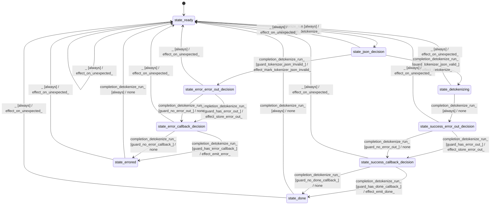

# speech_tokenizer_whisper

Source: [`emel/speech/tokenizer/whisper/sm.hpp`](https://github.com/stateforward/emel.cpp/blob/main/src/emel/speech/tokenizer/whisper/sm.hpp)

## Mermaid

## Transitions

| Source | Event | Guard | Action | Target |
| --- | --- | --- | --- | --- |
| [`state_ready`](https://github.com/stateforward/emel.cpp/blob/main/src/emel/speech/tokenizer/whisper/sm.hpp) | [`detokenize_run`](https://github.com/stateforward/emel.cpp/blob/main/src/emel/speech/tokenizer/whisper/sm.hpp) | [`always`](https://github.com/stateforward/emel.cpp/blob/main/src/emel/speech/tokenizer/whisper/sm.hpp) | [`effect_begin_detokenize>`](https://github.com/stateforward/emel.cpp/blob/main/src/emel/speech/tokenizer/whisper/sm.hpp) | [`state_json_decision`](https://github.com/stateforward/emel.cpp/blob/main/src/emel/speech/tokenizer/whisper/sm.hpp) |
| [`state_json_decision`](https://github.com/stateforward/emel.cpp/blob/main/src/emel/speech/tokenizer/whisper/sm.hpp) | [`completion<detokenize_run>`](https://github.com/stateforward/emel.cpp/blob/main/src/emel/speech/tokenizer/whisper/sm.hpp) | [`guard_tokenizer_json_valid>`](https://github.com/stateforward/emel.cpp/blob/main/src/emel/speech/tokenizer/whisper/sm.hpp) | [`effect_detokenize>`](https://github.com/stateforward/emel.cpp/blob/main/src/emel/speech/tokenizer/whisper/sm.hpp) | [`state_detokenizing`](https://github.com/stateforward/emel.cpp/blob/main/src/emel/speech/tokenizer/whisper/sm.hpp) |
| [`state_json_decision`](https://github.com/stateforward/emel.cpp/blob/main/src/emel/speech/tokenizer/whisper/sm.hpp) | [`completion<detokenize_run>`](https://github.com/stateforward/emel.cpp/blob/main/src/emel/speech/tokenizer/whisper/sm.hpp) | [`guard_tokenizer_json_invalid>`](https://github.com/stateforward/emel.cpp/blob/main/src/emel/speech/tokenizer/whisper/sm.hpp) | [`effect_mark_tokenizer_json_invalid>`](https://github.com/stateforward/emel.cpp/blob/main/src/emel/speech/tokenizer/whisper/sm.hpp) | [`state_error_error_out_decision`](https://github.com/stateforward/emel.cpp/blob/main/src/emel/speech/tokenizer/whisper/sm.hpp) |
| [`state_detokenizing`](https://github.com/stateforward/emel.cpp/blob/main/src/emel/speech/tokenizer/whisper/sm.hpp) | [`completion<detokenize_run>`](https://github.com/stateforward/emel.cpp/blob/main/src/emel/speech/tokenizer/whisper/sm.hpp) | [`always`](https://github.com/stateforward/emel.cpp/blob/main/src/emel/speech/tokenizer/whisper/sm.hpp) | [`none`](https://github.com/stateforward/emel.cpp/blob/main/src/emel/speech/tokenizer/whisper/sm.hpp) | [`state_success_error_out_decision`](https://github.com/stateforward/emel.cpp/blob/main/src/emel/speech/tokenizer/whisper/sm.hpp) |
| [`state_success_error_out_decision`](https://github.com/stateforward/emel.cpp/blob/main/src/emel/speech/tokenizer/whisper/sm.hpp) | [`completion<detokenize_run>`](https://github.com/stateforward/emel.cpp/blob/main/src/emel/speech/tokenizer/whisper/sm.hpp) | [`guard_has_error_out>`](https://github.com/stateforward/emel.cpp/blob/main/src/emel/speech/tokenizer/whisper/sm.hpp) | [`effect_store_error_out>`](https://github.com/stateforward/emel.cpp/blob/main/src/emel/speech/tokenizer/whisper/sm.hpp) | [`state_success_callback_decision`](https://github.com/stateforward/emel.cpp/blob/main/src/emel/speech/tokenizer/whisper/sm.hpp) |
| [`state_success_error_out_decision`](https://github.com/stateforward/emel.cpp/blob/main/src/emel/speech/tokenizer/whisper/sm.hpp) | [`completion<detokenize_run>`](https://github.com/stateforward/emel.cpp/blob/main/src/emel/speech/tokenizer/whisper/sm.hpp) | [`guard_no_error_out>`](https://github.com/stateforward/emel.cpp/blob/main/src/emel/speech/tokenizer/whisper/sm.hpp) | [`none`](https://github.com/stateforward/emel.cpp/blob/main/src/emel/speech/tokenizer/whisper/sm.hpp) | [`state_success_callback_decision`](https://github.com/stateforward/emel.cpp/blob/main/src/emel/speech/tokenizer/whisper/sm.hpp) |
| [`state_error_error_out_decision`](https://github.com/stateforward/emel.cpp/blob/main/src/emel/speech/tokenizer/whisper/sm.hpp) | [`completion<detokenize_run>`](https://github.com/stateforward/emel.cpp/blob/main/src/emel/speech/tokenizer/whisper/sm.hpp) | [`guard_has_error_out>`](https://github.com/stateforward/emel.cpp/blob/main/src/emel/speech/tokenizer/whisper/sm.hpp) | [`effect_store_error_out>`](https://github.com/stateforward/emel.cpp/blob/main/src/emel/speech/tokenizer/whisper/sm.hpp) | [`state_error_callback_decision`](https://github.com/stateforward/emel.cpp/blob/main/src/emel/speech/tokenizer/whisper/sm.hpp) |
| [`state_error_error_out_decision`](https://github.com/stateforward/emel.cpp/blob/main/src/emel/speech/tokenizer/whisper/sm.hpp) | [`completion<detokenize_run>`](https://github.com/stateforward/emel.cpp/blob/main/src/emel/speech/tokenizer/whisper/sm.hpp) | [`guard_no_error_out>`](https://github.com/stateforward/emel.cpp/blob/main/src/emel/speech/tokenizer/whisper/sm.hpp) | [`none`](https://github.com/stateforward/emel.cpp/blob/main/src/emel/speech/tokenizer/whisper/sm.hpp) | [`state_error_callback_decision`](https://github.com/stateforward/emel.cpp/blob/main/src/emel/speech/tokenizer/whisper/sm.hpp) |
| [`state_success_callback_decision`](https://github.com/stateforward/emel.cpp/blob/main/src/emel/speech/tokenizer/whisper/sm.hpp) | [`completion<detokenize_run>`](https://github.com/stateforward/emel.cpp/blob/main/src/emel/speech/tokenizer/whisper/sm.hpp) | [`guard_has_done_callback>`](https://github.com/stateforward/emel.cpp/blob/main/src/emel/speech/tokenizer/whisper/sm.hpp) | [`effect_emit_done>`](https://github.com/stateforward/emel.cpp/blob/main/src/emel/speech/tokenizer/whisper/sm.hpp) | [`state_done`](https://github.com/stateforward/emel.cpp/blob/main/src/emel/speech/tokenizer/whisper/sm.hpp) |
| [`state_success_callback_decision`](https://github.com/stateforward/emel.cpp/blob/main/src/emel/speech/tokenizer/whisper/sm.hpp) | [`completion<detokenize_run>`](https://github.com/stateforward/emel.cpp/blob/main/src/emel/speech/tokenizer/whisper/sm.hpp) | [`guard_no_done_callback>`](https://github.com/stateforward/emel.cpp/blob/main/src/emel/speech/tokenizer/whisper/sm.hpp) | [`none`](https://github.com/stateforward/emel.cpp/blob/main/src/emel/speech/tokenizer/whisper/sm.hpp) | [`state_done`](https://github.com/stateforward/emel.cpp/blob/main/src/emel/speech/tokenizer/whisper/sm.hpp) |
| [`state_error_callback_decision`](https://github.com/stateforward/emel.cpp/blob/main/src/emel/speech/tokenizer/whisper/sm.hpp) | [`completion<detokenize_run>`](https://github.com/stateforward/emel.cpp/blob/main/src/emel/speech/tokenizer/whisper/sm.hpp) | [`guard_has_error_callback>`](https://github.com/stateforward/emel.cpp/blob/main/src/emel/speech/tokenizer/whisper/sm.hpp) | [`effect_emit_error>`](https://github.com/stateforward/emel.cpp/blob/main/src/emel/speech/tokenizer/whisper/sm.hpp) | [`state_errored`](https://github.com/stateforward/emel.cpp/blob/main/src/emel/speech/tokenizer/whisper/sm.hpp) |
| [`state_error_callback_decision`](https://github.com/stateforward/emel.cpp/blob/main/src/emel/speech/tokenizer/whisper/sm.hpp) | [`completion<detokenize_run>`](https://github.com/stateforward/emel.cpp/blob/main/src/emel/speech/tokenizer/whisper/sm.hpp) | [`guard_no_error_callback>`](https://github.com/stateforward/emel.cpp/blob/main/src/emel/speech/tokenizer/whisper/sm.hpp) | [`none`](https://github.com/stateforward/emel.cpp/blob/main/src/emel/speech/tokenizer/whisper/sm.hpp) | [`state_errored`](https://github.com/stateforward/emel.cpp/blob/main/src/emel/speech/tokenizer/whisper/sm.hpp) |
| [`state_done`](https://github.com/stateforward/emel.cpp/blob/main/src/emel/speech/tokenizer/whisper/sm.hpp) | [`completion<detokenize_run>`](https://github.com/stateforward/emel.cpp/blob/main/src/emel/speech/tokenizer/whisper/sm.hpp) | [`always`](https://github.com/stateforward/emel.cpp/blob/main/src/emel/speech/tokenizer/whisper/sm.hpp) | [`none`](https://github.com/stateforward/emel.cpp/blob/main/src/emel/speech/tokenizer/whisper/sm.hpp) | [`state_ready`](https://github.com/stateforward/emel.cpp/blob/main/src/emel/speech/tokenizer/whisper/sm.hpp) |
| [`state_errored`](https://github.com/stateforward/emel.cpp/blob/main/src/emel/speech/tokenizer/whisper/sm.hpp) | [`completion<detokenize_run>`](https://github.com/stateforward/emel.cpp/blob/main/src/emel/speech/tokenizer/whisper/sm.hpp) | [`always`](https://github.com/stateforward/emel.cpp/blob/main/src/emel/speech/tokenizer/whisper/sm.hpp) | [`none`](https://github.com/stateforward/emel.cpp/blob/main/src/emel/speech/tokenizer/whisper/sm.hpp) | [`state_ready`](https://github.com/stateforward/emel.cpp/blob/main/src/emel/speech/tokenizer/whisper/sm.hpp) |
| [`state_ready`](https://github.com/stateforward/emel.cpp/blob/main/src/emel/speech/tokenizer/whisper/sm.hpp) | [`_`](https://github.com/stateforward/emel.cpp/blob/main/src/emel/speech/tokenizer/whisper/sm.hpp) | [`always`](https://github.com/stateforward/emel.cpp/blob/main/src/emel/speech/tokenizer/whisper/sm.hpp) | [`effect_on_unexpected>`](https://github.com/stateforward/emel.cpp/blob/main/src/emel/speech/tokenizer/whisper/sm.hpp) | [`state_ready`](https://github.com/stateforward/emel.cpp/blob/main/src/emel/speech/tokenizer/whisper/sm.hpp) |
| [`state_json_decision`](https://github.com/stateforward/emel.cpp/blob/main/src/emel/speech/tokenizer/whisper/sm.hpp) | [`_`](https://github.com/stateforward/emel.cpp/blob/main/src/emel/speech/tokenizer/whisper/sm.hpp) | [`always`](https://github.com/stateforward/emel.cpp/blob/main/src/emel/speech/tokenizer/whisper/sm.hpp) | [`effect_on_unexpected>`](https://github.com/stateforward/emel.cpp/blob/main/src/emel/speech/tokenizer/whisper/sm.hpp) | [`state_ready`](https://github.com/stateforward/emel.cpp/blob/main/src/emel/speech/tokenizer/whisper/sm.hpp) |
| [`state_detokenizing`](https://github.com/stateforward/emel.cpp/blob/main/src/emel/speech/tokenizer/whisper/sm.hpp) | [`_`](https://github.com/stateforward/emel.cpp/blob/main/src/emel/speech/tokenizer/whisper/sm.hpp) | [`always`](https://github.com/stateforward/emel.cpp/blob/main/src/emel/speech/tokenizer/whisper/sm.hpp) | [`effect_on_unexpected>`](https://github.com/stateforward/emel.cpp/blob/main/src/emel/speech/tokenizer/whisper/sm.hpp) | [`state_ready`](https://github.com/stateforward/emel.cpp/blob/main/src/emel/speech/tokenizer/whisper/sm.hpp) |
| [`state_success_error_out_decision`](https://github.com/stateforward/emel.cpp/blob/main/src/emel/speech/tokenizer/whisper/sm.hpp) | [`_`](https://github.com/stateforward/emel.cpp/blob/main/src/emel/speech/tokenizer/whisper/sm.hpp) | [`always`](https://github.com/stateforward/emel.cpp/blob/main/src/emel/speech/tokenizer/whisper/sm.hpp) | [`effect_on_unexpected>`](https://github.com/stateforward/emel.cpp/blob/main/src/emel/speech/tokenizer/whisper/sm.hpp) | [`state_ready`](https://github.com/stateforward/emel.cpp/blob/main/src/emel/speech/tokenizer/whisper/sm.hpp) |
| [`state_success_callback_decision`](https://github.com/stateforward/emel.cpp/blob/main/src/emel/speech/tokenizer/whisper/sm.hpp) | [`_`](https://github.com/stateforward/emel.cpp/blob/main/src/emel/speech/tokenizer/whisper/sm.hpp) | [`always`](https://github.com/stateforward/emel.cpp/blob/main/src/emel/speech/tokenizer/whisper/sm.hpp) | [`effect_on_unexpected>`](https://github.com/stateforward/emel.cpp/blob/main/src/emel/speech/tokenizer/whisper/sm.hpp) | [`state_ready`](https://github.com/stateforward/emel.cpp/blob/main/src/emel/speech/tokenizer/whisper/sm.hpp) |
| [`state_error_error_out_decision`](https://github.com/stateforward/emel.cpp/blob/main/src/emel/speech/tokenizer/whisper/sm.hpp) | [`_`](https://github.com/stateforward/emel.cpp/blob/main/src/emel/speech/tokenizer/whisper/sm.hpp) | [`always`](https://github.com/stateforward/emel.cpp/blob/main/src/emel/speech/tokenizer/whisper/sm.hpp) | [`effect_on_unexpected>`](https://github.com/stateforward/emel.cpp/blob/main/src/emel/speech/tokenizer/whisper/sm.hpp) | [`state_ready`](https://github.com/stateforward/emel.cpp/blob/main/src/emel/speech/tokenizer/whisper/sm.hpp) |
| [`state_error_callback_decision`](https://github.com/stateforward/emel.cpp/blob/main/src/emel/speech/tokenizer/whisper/sm.hpp) | [`_`](https://github.com/stateforward/emel.cpp/blob/main/src/emel/speech/tokenizer/whisper/sm.hpp) | [`always`](https://github.com/stateforward/emel.cpp/blob/main/src/emel/speech/tokenizer/whisper/sm.hpp) | [`effect_on_unexpected>`](https://github.com/stateforward/emel.cpp/blob/main/src/emel/speech/tokenizer/whisper/sm.hpp) | [`state_ready`](https://github.com/stateforward/emel.cpp/blob/main/src/emel/speech/tokenizer/whisper/sm.hpp) |
| [`state_done`](https://github.com/stateforward/emel.cpp/blob/main/src/emel/speech/tokenizer/whisper/sm.hpp) | [`_`](https://github.com/stateforward/emel.cpp/blob/main/src/emel/speech/tokenizer/whisper/sm.hpp) | [`always`](https://github.com/stateforward/emel.cpp/blob/main/src/emel/speech/tokenizer/whisper/sm.hpp) | [`effect_on_unexpected>`](https://github.com/stateforward/emel.cpp/blob/main/src/emel/speech/tokenizer/whisper/sm.hpp) | [`state_ready`](https://github.com/stateforward/emel.cpp/blob/main/src/emel/speech/tokenizer/whisper/sm.hpp) |
| [`state_errored`](https://github.com/stateforward/emel.cpp/blob/main/src/emel/speech/tokenizer/whisper/sm.hpp) | [`_`](https://github.com/stateforward/emel.cpp/blob/main/src/emel/speech/tokenizer/whisper/sm.hpp) | [`always`](https://github.com/stateforward/emel.cpp/blob/main/src/emel/speech/tokenizer/whisper/sm.hpp) | [`effect_on_unexpected>`](https://github.com/stateforward/emel.cpp/blob/main/src/emel/speech/tokenizer/whisper/sm.hpp) | [`state_ready`](https://github.com/stateforward/emel.cpp/blob/main/src/emel/speech/tokenizer/whisper/sm.hpp) |
