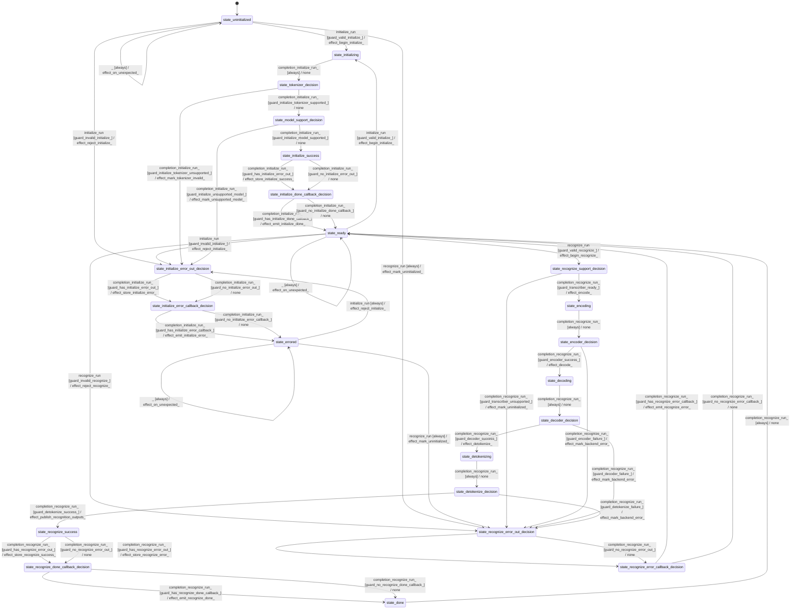

# speech_transcriber

Source: [`emel/speech/transcriber/sm.hpp`](https://github.com/stateforward/emel.cpp/blob/main/src/emel/speech/transcriber/sm.hpp)

## Mermaid

## Transitions

| Source | Event | Guard | Action | Target |
| --- | --- | --- | --- | --- |
| [`state_uninitialized`](https://github.com/stateforward/emel.cpp/blob/main/src/emel/speech/transcriber/sm.hpp) | [`initialize_run`](https://github.com/stateforward/emel.cpp/blob/main/src/emel/speech/transcriber/sm.hpp) | [`guard_valid_initialize>`](https://github.com/stateforward/emel.cpp/blob/main/src/emel/speech/transcriber/sm.hpp) | [`effect_begin_initialize>`](https://github.com/stateforward/emel.cpp/blob/main/src/emel/speech/transcriber/sm.hpp) | [`state_initializing`](https://github.com/stateforward/emel.cpp/blob/main/src/emel/speech/transcriber/sm.hpp) |
| [`state_uninitialized`](https://github.com/stateforward/emel.cpp/blob/main/src/emel/speech/transcriber/sm.hpp) | [`initialize_run`](https://github.com/stateforward/emel.cpp/blob/main/src/emel/speech/transcriber/sm.hpp) | [`guard_invalid_initialize>`](https://github.com/stateforward/emel.cpp/blob/main/src/emel/speech/transcriber/sm.hpp) | [`effect_reject_initialize>`](https://github.com/stateforward/emel.cpp/blob/main/src/emel/speech/transcriber/sm.hpp) | [`state_initialize_error_out_decision`](https://github.com/stateforward/emel.cpp/blob/main/src/emel/speech/transcriber/sm.hpp) |
| [`state_ready`](https://github.com/stateforward/emel.cpp/blob/main/src/emel/speech/transcriber/sm.hpp) | [`initialize_run`](https://github.com/stateforward/emel.cpp/blob/main/src/emel/speech/transcriber/sm.hpp) | [`guard_valid_initialize>`](https://github.com/stateforward/emel.cpp/blob/main/src/emel/speech/transcriber/sm.hpp) | [`effect_begin_initialize>`](https://github.com/stateforward/emel.cpp/blob/main/src/emel/speech/transcriber/sm.hpp) | [`state_initializing`](https://github.com/stateforward/emel.cpp/blob/main/src/emel/speech/transcriber/sm.hpp) |
| [`state_ready`](https://github.com/stateforward/emel.cpp/blob/main/src/emel/speech/transcriber/sm.hpp) | [`initialize_run`](https://github.com/stateforward/emel.cpp/blob/main/src/emel/speech/transcriber/sm.hpp) | [`guard_invalid_initialize>`](https://github.com/stateforward/emel.cpp/blob/main/src/emel/speech/transcriber/sm.hpp) | [`effect_reject_initialize>`](https://github.com/stateforward/emel.cpp/blob/main/src/emel/speech/transcriber/sm.hpp) | [`state_initialize_error_out_decision`](https://github.com/stateforward/emel.cpp/blob/main/src/emel/speech/transcriber/sm.hpp) |
| [`state_errored`](https://github.com/stateforward/emel.cpp/blob/main/src/emel/speech/transcriber/sm.hpp) | [`initialize_run`](https://github.com/stateforward/emel.cpp/blob/main/src/emel/speech/transcriber/sm.hpp) | [`always`](https://github.com/stateforward/emel.cpp/blob/main/src/emel/speech/transcriber/sm.hpp) | [`effect_reject_initialize>`](https://github.com/stateforward/emel.cpp/blob/main/src/emel/speech/transcriber/sm.hpp) | [`state_initialize_error_out_decision`](https://github.com/stateforward/emel.cpp/blob/main/src/emel/speech/transcriber/sm.hpp) |
| [`state_initializing`](https://github.com/stateforward/emel.cpp/blob/main/src/emel/speech/transcriber/sm.hpp) | [`completion<initialize_run>`](https://github.com/stateforward/emel.cpp/blob/main/src/emel/speech/transcriber/sm.hpp) | [`always`](https://github.com/stateforward/emel.cpp/blob/main/src/emel/speech/transcriber/sm.hpp) | [`none`](https://github.com/stateforward/emel.cpp/blob/main/src/emel/speech/transcriber/sm.hpp) | [`state_tokenizer_decision`](https://github.com/stateforward/emel.cpp/blob/main/src/emel/speech/transcriber/sm.hpp) |
| [`state_tokenizer_decision`](https://github.com/stateforward/emel.cpp/blob/main/src/emel/speech/transcriber/sm.hpp) | [`completion<initialize_run>`](https://github.com/stateforward/emel.cpp/blob/main/src/emel/speech/transcriber/sm.hpp) | [`guard_initialize_tokenizer_supported>`](https://github.com/stateforward/emel.cpp/blob/main/src/emel/speech/transcriber/sm.hpp) | [`none`](https://github.com/stateforward/emel.cpp/blob/main/src/emel/speech/transcriber/sm.hpp) | [`state_model_support_decision`](https://github.com/stateforward/emel.cpp/blob/main/src/emel/speech/transcriber/sm.hpp) |
| [`state_tokenizer_decision`](https://github.com/stateforward/emel.cpp/blob/main/src/emel/speech/transcriber/sm.hpp) | [`completion<initialize_run>`](https://github.com/stateforward/emel.cpp/blob/main/src/emel/speech/transcriber/sm.hpp) | [`guard_initialize_tokenizer_unsupported>`](https://github.com/stateforward/emel.cpp/blob/main/src/emel/speech/transcriber/sm.hpp) | [`effect_mark_tokenizer_invalid>`](https://github.com/stateforward/emel.cpp/blob/main/src/emel/speech/transcriber/sm.hpp) | [`state_initialize_error_out_decision`](https://github.com/stateforward/emel.cpp/blob/main/src/emel/speech/transcriber/sm.hpp) |
| [`state_model_support_decision`](https://github.com/stateforward/emel.cpp/blob/main/src/emel/speech/transcriber/sm.hpp) | [`completion<initialize_run>`](https://github.com/stateforward/emel.cpp/blob/main/src/emel/speech/transcriber/sm.hpp) | [`guard_initialize_model_supported>`](https://github.com/stateforward/emel.cpp/blob/main/src/emel/speech/transcriber/sm.hpp) | [`none`](https://github.com/stateforward/emel.cpp/blob/main/src/emel/speech/transcriber/sm.hpp) | [`state_initialize_success`](https://github.com/stateforward/emel.cpp/blob/main/src/emel/speech/transcriber/sm.hpp) |
| [`state_model_support_decision`](https://github.com/stateforward/emel.cpp/blob/main/src/emel/speech/transcriber/sm.hpp) | [`completion<initialize_run>`](https://github.com/stateforward/emel.cpp/blob/main/src/emel/speech/transcriber/sm.hpp) | [`guard_initialize_unsupported_model>`](https://github.com/stateforward/emel.cpp/blob/main/src/emel/speech/transcriber/sm.hpp) | [`effect_mark_unsupported_model>`](https://github.com/stateforward/emel.cpp/blob/main/src/emel/speech/transcriber/sm.hpp) | [`state_initialize_error_out_decision`](https://github.com/stateforward/emel.cpp/blob/main/src/emel/speech/transcriber/sm.hpp) |
| [`state_initialize_success`](https://github.com/stateforward/emel.cpp/blob/main/src/emel/speech/transcriber/sm.hpp) | [`completion<initialize_run>`](https://github.com/stateforward/emel.cpp/blob/main/src/emel/speech/transcriber/sm.hpp) | [`guard_has_initialize_error_out>`](https://github.com/stateforward/emel.cpp/blob/main/src/emel/speech/transcriber/sm.hpp) | [`effect_store_initialize_success>`](https://github.com/stateforward/emel.cpp/blob/main/src/emel/speech/transcriber/sm.hpp) | [`state_initialize_done_callback_decision`](https://github.com/stateforward/emel.cpp/blob/main/src/emel/speech/transcriber/sm.hpp) |
| [`state_initialize_success`](https://github.com/stateforward/emel.cpp/blob/main/src/emel/speech/transcriber/sm.hpp) | [`completion<initialize_run>`](https://github.com/stateforward/emel.cpp/blob/main/src/emel/speech/transcriber/sm.hpp) | [`guard_no_initialize_error_out>`](https://github.com/stateforward/emel.cpp/blob/main/src/emel/speech/transcriber/sm.hpp) | [`none`](https://github.com/stateforward/emel.cpp/blob/main/src/emel/speech/transcriber/sm.hpp) | [`state_initialize_done_callback_decision`](https://github.com/stateforward/emel.cpp/blob/main/src/emel/speech/transcriber/sm.hpp) |
| [`state_initialize_error_out_decision`](https://github.com/stateforward/emel.cpp/blob/main/src/emel/speech/transcriber/sm.hpp) | [`completion<initialize_run>`](https://github.com/stateforward/emel.cpp/blob/main/src/emel/speech/transcriber/sm.hpp) | [`guard_has_initialize_error_out>`](https://github.com/stateforward/emel.cpp/blob/main/src/emel/speech/transcriber/sm.hpp) | [`effect_store_initialize_error>`](https://github.com/stateforward/emel.cpp/blob/main/src/emel/speech/transcriber/sm.hpp) | [`state_initialize_error_callback_decision`](https://github.com/stateforward/emel.cpp/blob/main/src/emel/speech/transcriber/sm.hpp) |
| [`state_initialize_error_out_decision`](https://github.com/stateforward/emel.cpp/blob/main/src/emel/speech/transcriber/sm.hpp) | [`completion<initialize_run>`](https://github.com/stateforward/emel.cpp/blob/main/src/emel/speech/transcriber/sm.hpp) | [`guard_no_initialize_error_out>`](https://github.com/stateforward/emel.cpp/blob/main/src/emel/speech/transcriber/sm.hpp) | [`none`](https://github.com/stateforward/emel.cpp/blob/main/src/emel/speech/transcriber/sm.hpp) | [`state_initialize_error_callback_decision`](https://github.com/stateforward/emel.cpp/blob/main/src/emel/speech/transcriber/sm.hpp) |
| [`state_initialize_done_callback_decision`](https://github.com/stateforward/emel.cpp/blob/main/src/emel/speech/transcriber/sm.hpp) | [`completion<initialize_run>`](https://github.com/stateforward/emel.cpp/blob/main/src/emel/speech/transcriber/sm.hpp) | [`guard_has_initialize_done_callback>`](https://github.com/stateforward/emel.cpp/blob/main/src/emel/speech/transcriber/sm.hpp) | [`effect_emit_initialize_done>`](https://github.com/stateforward/emel.cpp/blob/main/src/emel/speech/transcriber/sm.hpp) | [`state_ready`](https://github.com/stateforward/emel.cpp/blob/main/src/emel/speech/transcriber/sm.hpp) |
| [`state_initialize_done_callback_decision`](https://github.com/stateforward/emel.cpp/blob/main/src/emel/speech/transcriber/sm.hpp) | [`completion<initialize_run>`](https://github.com/stateforward/emel.cpp/blob/main/src/emel/speech/transcriber/sm.hpp) | [`guard_no_initialize_done_callback>`](https://github.com/stateforward/emel.cpp/blob/main/src/emel/speech/transcriber/sm.hpp) | [`none`](https://github.com/stateforward/emel.cpp/blob/main/src/emel/speech/transcriber/sm.hpp) | [`state_ready`](https://github.com/stateforward/emel.cpp/blob/main/src/emel/speech/transcriber/sm.hpp) |
| [`state_initialize_error_callback_decision`](https://github.com/stateforward/emel.cpp/blob/main/src/emel/speech/transcriber/sm.hpp) | [`completion<initialize_run>`](https://github.com/stateforward/emel.cpp/blob/main/src/emel/speech/transcriber/sm.hpp) | [`guard_has_initialize_error_callback>`](https://github.com/stateforward/emel.cpp/blob/main/src/emel/speech/transcriber/sm.hpp) | [`effect_emit_initialize_error>`](https://github.com/stateforward/emel.cpp/blob/main/src/emel/speech/transcriber/sm.hpp) | [`state_errored`](https://github.com/stateforward/emel.cpp/blob/main/src/emel/speech/transcriber/sm.hpp) |
| [`state_initialize_error_callback_decision`](https://github.com/stateforward/emel.cpp/blob/main/src/emel/speech/transcriber/sm.hpp) | [`completion<initialize_run>`](https://github.com/stateforward/emel.cpp/blob/main/src/emel/speech/transcriber/sm.hpp) | [`guard_no_initialize_error_callback>`](https://github.com/stateforward/emel.cpp/blob/main/src/emel/speech/transcriber/sm.hpp) | [`none`](https://github.com/stateforward/emel.cpp/blob/main/src/emel/speech/transcriber/sm.hpp) | [`state_errored`](https://github.com/stateforward/emel.cpp/blob/main/src/emel/speech/transcriber/sm.hpp) |
| [`state_ready`](https://github.com/stateforward/emel.cpp/blob/main/src/emel/speech/transcriber/sm.hpp) | [`recognize_run`](https://github.com/stateforward/emel.cpp/blob/main/src/emel/speech/transcriber/sm.hpp) | [`guard_valid_recognize>`](https://github.com/stateforward/emel.cpp/blob/main/src/emel/speech/transcriber/sm.hpp) | [`effect_begin_recognize>`](https://github.com/stateforward/emel.cpp/blob/main/src/emel/speech/transcriber/sm.hpp) | [`state_recognize_support_decision`](https://github.com/stateforward/emel.cpp/blob/main/src/emel/speech/transcriber/sm.hpp) |
| [`state_ready`](https://github.com/stateforward/emel.cpp/blob/main/src/emel/speech/transcriber/sm.hpp) | [`recognize_run`](https://github.com/stateforward/emel.cpp/blob/main/src/emel/speech/transcriber/sm.hpp) | [`guard_invalid_recognize>`](https://github.com/stateforward/emel.cpp/blob/main/src/emel/speech/transcriber/sm.hpp) | [`effect_reject_recognize>`](https://github.com/stateforward/emel.cpp/blob/main/src/emel/speech/transcriber/sm.hpp) | [`state_recognize_error_out_decision`](https://github.com/stateforward/emel.cpp/blob/main/src/emel/speech/transcriber/sm.hpp) |
| [`state_uninitialized`](https://github.com/stateforward/emel.cpp/blob/main/src/emel/speech/transcriber/sm.hpp) | [`recognize_run`](https://github.com/stateforward/emel.cpp/blob/main/src/emel/speech/transcriber/sm.hpp) | [`always`](https://github.com/stateforward/emel.cpp/blob/main/src/emel/speech/transcriber/sm.hpp) | [`effect_mark_uninitialized>`](https://github.com/stateforward/emel.cpp/blob/main/src/emel/speech/transcriber/sm.hpp) | [`state_recognize_error_out_decision`](https://github.com/stateforward/emel.cpp/blob/main/src/emel/speech/transcriber/sm.hpp) |
| [`state_errored`](https://github.com/stateforward/emel.cpp/blob/main/src/emel/speech/transcriber/sm.hpp) | [`recognize_run`](https://github.com/stateforward/emel.cpp/blob/main/src/emel/speech/transcriber/sm.hpp) | [`always`](https://github.com/stateforward/emel.cpp/blob/main/src/emel/speech/transcriber/sm.hpp) | [`effect_mark_uninitialized>`](https://github.com/stateforward/emel.cpp/blob/main/src/emel/speech/transcriber/sm.hpp) | [`state_recognize_error_out_decision`](https://github.com/stateforward/emel.cpp/blob/main/src/emel/speech/transcriber/sm.hpp) |
| [`state_recognize_support_decision`](https://github.com/stateforward/emel.cpp/blob/main/src/emel/speech/transcriber/sm.hpp) | [`completion<recognize_run>`](https://github.com/stateforward/emel.cpp/blob/main/src/emel/speech/transcriber/sm.hpp) | [`guard_transcriber_unsupported>`](https://github.com/stateforward/emel.cpp/blob/main/src/emel/speech/transcriber/sm.hpp) | [`effect_mark_uninitialized>`](https://github.com/stateforward/emel.cpp/blob/main/src/emel/speech/transcriber/sm.hpp) | [`state_recognize_error_out_decision`](https://github.com/stateforward/emel.cpp/blob/main/src/emel/speech/transcriber/sm.hpp) |
| [`state_recognize_support_decision`](https://github.com/stateforward/emel.cpp/blob/main/src/emel/speech/transcriber/sm.hpp) | [`completion<recognize_run>`](https://github.com/stateforward/emel.cpp/blob/main/src/emel/speech/transcriber/sm.hpp) | [`guard_transcriber_ready>`](https://github.com/stateforward/emel.cpp/blob/main/src/emel/speech/transcriber/sm.hpp) | [`effect_encode>`](https://github.com/stateforward/emel.cpp/blob/main/src/emel/speech/transcriber/sm.hpp) | [`state_encoding`](https://github.com/stateforward/emel.cpp/blob/main/src/emel/speech/transcriber/sm.hpp) |
| [`state_encoding`](https://github.com/stateforward/emel.cpp/blob/main/src/emel/speech/transcriber/sm.hpp) | [`completion<recognize_run>`](https://github.com/stateforward/emel.cpp/blob/main/src/emel/speech/transcriber/sm.hpp) | [`always`](https://github.com/stateforward/emel.cpp/blob/main/src/emel/speech/transcriber/sm.hpp) | [`none`](https://github.com/stateforward/emel.cpp/blob/main/src/emel/speech/transcriber/sm.hpp) | [`state_encoder_decision`](https://github.com/stateforward/emel.cpp/blob/main/src/emel/speech/transcriber/sm.hpp) |
| [`state_encoder_decision`](https://github.com/stateforward/emel.cpp/blob/main/src/emel/speech/transcriber/sm.hpp) | [`completion<recognize_run>`](https://github.com/stateforward/emel.cpp/blob/main/src/emel/speech/transcriber/sm.hpp) | [`guard_encoder_success>`](https://github.com/stateforward/emel.cpp/blob/main/src/emel/speech/transcriber/sm.hpp) | [`effect_decode>`](https://github.com/stateforward/emel.cpp/blob/main/src/emel/speech/transcriber/sm.hpp) | [`state_decoding`](https://github.com/stateforward/emel.cpp/blob/main/src/emel/speech/transcriber/sm.hpp) |
| [`state_encoder_decision`](https://github.com/stateforward/emel.cpp/blob/main/src/emel/speech/transcriber/sm.hpp) | [`completion<recognize_run>`](https://github.com/stateforward/emel.cpp/blob/main/src/emel/speech/transcriber/sm.hpp) | [`guard_encoder_failure>`](https://github.com/stateforward/emel.cpp/blob/main/src/emel/speech/transcriber/sm.hpp) | [`effect_mark_backend_error>`](https://github.com/stateforward/emel.cpp/blob/main/src/emel/speech/transcriber/sm.hpp) | [`state_recognize_error_out_decision`](https://github.com/stateforward/emel.cpp/blob/main/src/emel/speech/transcriber/sm.hpp) |
| [`state_decoding`](https://github.com/stateforward/emel.cpp/blob/main/src/emel/speech/transcriber/sm.hpp) | [`completion<recognize_run>`](https://github.com/stateforward/emel.cpp/blob/main/src/emel/speech/transcriber/sm.hpp) | [`always`](https://github.com/stateforward/emel.cpp/blob/main/src/emel/speech/transcriber/sm.hpp) | [`none`](https://github.com/stateforward/emel.cpp/blob/main/src/emel/speech/transcriber/sm.hpp) | [`state_decoder_decision`](https://github.com/stateforward/emel.cpp/blob/main/src/emel/speech/transcriber/sm.hpp) |
| [`state_decoder_decision`](https://github.com/stateforward/emel.cpp/blob/main/src/emel/speech/transcriber/sm.hpp) | [`completion<recognize_run>`](https://github.com/stateforward/emel.cpp/blob/main/src/emel/speech/transcriber/sm.hpp) | [`guard_decoder_success>`](https://github.com/stateforward/emel.cpp/blob/main/src/emel/speech/transcriber/sm.hpp) | [`effect_detokenize>`](https://github.com/stateforward/emel.cpp/blob/main/src/emel/speech/transcriber/sm.hpp) | [`state_detokenizing`](https://github.com/stateforward/emel.cpp/blob/main/src/emel/speech/transcriber/sm.hpp) |
| [`state_decoder_decision`](https://github.com/stateforward/emel.cpp/blob/main/src/emel/speech/transcriber/sm.hpp) | [`completion<recognize_run>`](https://github.com/stateforward/emel.cpp/blob/main/src/emel/speech/transcriber/sm.hpp) | [`guard_decoder_failure>`](https://github.com/stateforward/emel.cpp/blob/main/src/emel/speech/transcriber/sm.hpp) | [`effect_mark_backend_error>`](https://github.com/stateforward/emel.cpp/blob/main/src/emel/speech/transcriber/sm.hpp) | [`state_recognize_error_out_decision`](https://github.com/stateforward/emel.cpp/blob/main/src/emel/speech/transcriber/sm.hpp) |
| [`state_detokenizing`](https://github.com/stateforward/emel.cpp/blob/main/src/emel/speech/transcriber/sm.hpp) | [`completion<recognize_run>`](https://github.com/stateforward/emel.cpp/blob/main/src/emel/speech/transcriber/sm.hpp) | [`always`](https://github.com/stateforward/emel.cpp/blob/main/src/emel/speech/transcriber/sm.hpp) | [`none`](https://github.com/stateforward/emel.cpp/blob/main/src/emel/speech/transcriber/sm.hpp) | [`state_detokenize_decision`](https://github.com/stateforward/emel.cpp/blob/main/src/emel/speech/transcriber/sm.hpp) |
| [`state_detokenize_decision`](https://github.com/stateforward/emel.cpp/blob/main/src/emel/speech/transcriber/sm.hpp) | [`completion<recognize_run>`](https://github.com/stateforward/emel.cpp/blob/main/src/emel/speech/transcriber/sm.hpp) | [`guard_detokenize_success>`](https://github.com/stateforward/emel.cpp/blob/main/src/emel/speech/transcriber/sm.hpp) | [`effect_publish_recognition_outputs>`](https://github.com/stateforward/emel.cpp/blob/main/src/emel/speech/transcriber/sm.hpp) | [`state_recognize_success`](https://github.com/stateforward/emel.cpp/blob/main/src/emel/speech/transcriber/sm.hpp) |
| [`state_detokenize_decision`](https://github.com/stateforward/emel.cpp/blob/main/src/emel/speech/transcriber/sm.hpp) | [`completion<recognize_run>`](https://github.com/stateforward/emel.cpp/blob/main/src/emel/speech/transcriber/sm.hpp) | [`guard_detokenize_failure>`](https://github.com/stateforward/emel.cpp/blob/main/src/emel/speech/transcriber/sm.hpp) | [`effect_mark_backend_error>`](https://github.com/stateforward/emel.cpp/blob/main/src/emel/speech/transcriber/sm.hpp) | [`state_recognize_error_out_decision`](https://github.com/stateforward/emel.cpp/blob/main/src/emel/speech/transcriber/sm.hpp) |
| [`state_recognize_success`](https://github.com/stateforward/emel.cpp/blob/main/src/emel/speech/transcriber/sm.hpp) | [`completion<recognize_run>`](https://github.com/stateforward/emel.cpp/blob/main/src/emel/speech/transcriber/sm.hpp) | [`guard_has_recognize_error_out>`](https://github.com/stateforward/emel.cpp/blob/main/src/emel/speech/transcriber/sm.hpp) | [`effect_store_recognize_success>`](https://github.com/stateforward/emel.cpp/blob/main/src/emel/speech/transcriber/sm.hpp) | [`state_recognize_done_callback_decision`](https://github.com/stateforward/emel.cpp/blob/main/src/emel/speech/transcriber/sm.hpp) |
| [`state_recognize_success`](https://github.com/stateforward/emel.cpp/blob/main/src/emel/speech/transcriber/sm.hpp) | [`completion<recognize_run>`](https://github.com/stateforward/emel.cpp/blob/main/src/emel/speech/transcriber/sm.hpp) | [`guard_no_recognize_error_out>`](https://github.com/stateforward/emel.cpp/blob/main/src/emel/speech/transcriber/sm.hpp) | [`none`](https://github.com/stateforward/emel.cpp/blob/main/src/emel/speech/transcriber/sm.hpp) | [`state_recognize_done_callback_decision`](https://github.com/stateforward/emel.cpp/blob/main/src/emel/speech/transcriber/sm.hpp) |
| [`state_recognize_error_out_decision`](https://github.com/stateforward/emel.cpp/blob/main/src/emel/speech/transcriber/sm.hpp) | [`completion<recognize_run>`](https://github.com/stateforward/emel.cpp/blob/main/src/emel/speech/transcriber/sm.hpp) | [`guard_has_recognize_error_out>`](https://github.com/stateforward/emel.cpp/blob/main/src/emel/speech/transcriber/sm.hpp) | [`effect_store_recognize_error>`](https://github.com/stateforward/emel.cpp/blob/main/src/emel/speech/transcriber/sm.hpp) | [`state_recognize_error_callback_decision`](https://github.com/stateforward/emel.cpp/blob/main/src/emel/speech/transcriber/sm.hpp) |
| [`state_recognize_error_out_decision`](https://github.com/stateforward/emel.cpp/blob/main/src/emel/speech/transcriber/sm.hpp) | [`completion<recognize_run>`](https://github.com/stateforward/emel.cpp/blob/main/src/emel/speech/transcriber/sm.hpp) | [`guard_no_recognize_error_out>`](https://github.com/stateforward/emel.cpp/blob/main/src/emel/speech/transcriber/sm.hpp) | [`none`](https://github.com/stateforward/emel.cpp/blob/main/src/emel/speech/transcriber/sm.hpp) | [`state_recognize_error_callback_decision`](https://github.com/stateforward/emel.cpp/blob/main/src/emel/speech/transcriber/sm.hpp) |
| [`state_recognize_done_callback_decision`](https://github.com/stateforward/emel.cpp/blob/main/src/emel/speech/transcriber/sm.hpp) | [`completion<recognize_run>`](https://github.com/stateforward/emel.cpp/blob/main/src/emel/speech/transcriber/sm.hpp) | [`guard_has_recognize_done_callback>`](https://github.com/stateforward/emel.cpp/blob/main/src/emel/speech/transcriber/sm.hpp) | [`effect_emit_recognize_done>`](https://github.com/stateforward/emel.cpp/blob/main/src/emel/speech/transcriber/sm.hpp) | [`state_done`](https://github.com/stateforward/emel.cpp/blob/main/src/emel/speech/transcriber/sm.hpp) |
| [`state_recognize_done_callback_decision`](https://github.com/stateforward/emel.cpp/blob/main/src/emel/speech/transcriber/sm.hpp) | [`completion<recognize_run>`](https://github.com/stateforward/emel.cpp/blob/main/src/emel/speech/transcriber/sm.hpp) | [`guard_no_recognize_done_callback>`](https://github.com/stateforward/emel.cpp/blob/main/src/emel/speech/transcriber/sm.hpp) | [`none`](https://github.com/stateforward/emel.cpp/blob/main/src/emel/speech/transcriber/sm.hpp) | [`state_done`](https://github.com/stateforward/emel.cpp/blob/main/src/emel/speech/transcriber/sm.hpp) |
| [`state_recognize_error_callback_decision`](https://github.com/stateforward/emel.cpp/blob/main/src/emel/speech/transcriber/sm.hpp) | [`completion<recognize_run>`](https://github.com/stateforward/emel.cpp/blob/main/src/emel/speech/transcriber/sm.hpp) | [`guard_has_recognize_error_callback>`](https://github.com/stateforward/emel.cpp/blob/main/src/emel/speech/transcriber/sm.hpp) | [`effect_emit_recognize_error>`](https://github.com/stateforward/emel.cpp/blob/main/src/emel/speech/transcriber/sm.hpp) | [`state_ready`](https://github.com/stateforward/emel.cpp/blob/main/src/emel/speech/transcriber/sm.hpp) |
| [`state_recognize_error_callback_decision`](https://github.com/stateforward/emel.cpp/blob/main/src/emel/speech/transcriber/sm.hpp) | [`completion<recognize_run>`](https://github.com/stateforward/emel.cpp/blob/main/src/emel/speech/transcriber/sm.hpp) | [`guard_no_recognize_error_callback>`](https://github.com/stateforward/emel.cpp/blob/main/src/emel/speech/transcriber/sm.hpp) | [`none`](https://github.com/stateforward/emel.cpp/blob/main/src/emel/speech/transcriber/sm.hpp) | [`state_ready`](https://github.com/stateforward/emel.cpp/blob/main/src/emel/speech/transcriber/sm.hpp) |
| [`state_done`](https://github.com/stateforward/emel.cpp/blob/main/src/emel/speech/transcriber/sm.hpp) | [`completion<recognize_run>`](https://github.com/stateforward/emel.cpp/blob/main/src/emel/speech/transcriber/sm.hpp) | [`always`](https://github.com/stateforward/emel.cpp/blob/main/src/emel/speech/transcriber/sm.hpp) | [`none`](https://github.com/stateforward/emel.cpp/blob/main/src/emel/speech/transcriber/sm.hpp) | [`state_ready`](https://github.com/stateforward/emel.cpp/blob/main/src/emel/speech/transcriber/sm.hpp) |
| [`state_uninitialized`](https://github.com/stateforward/emel.cpp/blob/main/src/emel/speech/transcriber/sm.hpp) | [`_`](https://github.com/stateforward/emel.cpp/blob/main/src/emel/speech/transcriber/sm.hpp) | [`always`](https://github.com/stateforward/emel.cpp/blob/main/src/emel/speech/transcriber/sm.hpp) | [`effect_on_unexpected>`](https://github.com/stateforward/emel.cpp/blob/main/src/emel/speech/transcriber/sm.hpp) | [`state_uninitialized`](https://github.com/stateforward/emel.cpp/blob/main/src/emel/speech/transcriber/sm.hpp) |
| [`state_ready`](https://github.com/stateforward/emel.cpp/blob/main/src/emel/speech/transcriber/sm.hpp) | [`_`](https://github.com/stateforward/emel.cpp/blob/main/src/emel/speech/transcriber/sm.hpp) | [`always`](https://github.com/stateforward/emel.cpp/blob/main/src/emel/speech/transcriber/sm.hpp) | [`effect_on_unexpected>`](https://github.com/stateforward/emel.cpp/blob/main/src/emel/speech/transcriber/sm.hpp) | [`state_ready`](https://github.com/stateforward/emel.cpp/blob/main/src/emel/speech/transcriber/sm.hpp) |
| [`state_errored`](https://github.com/stateforward/emel.cpp/blob/main/src/emel/speech/transcriber/sm.hpp) | [`_`](https://github.com/stateforward/emel.cpp/blob/main/src/emel/speech/transcriber/sm.hpp) | [`always`](https://github.com/stateforward/emel.cpp/blob/main/src/emel/speech/transcriber/sm.hpp) | [`effect_on_unexpected>`](https://github.com/stateforward/emel.cpp/blob/main/src/emel/speech/transcriber/sm.hpp) | [`state_errored`](https://github.com/stateforward/emel.cpp/blob/main/src/emel/speech/transcriber/sm.hpp) |
