# tensor_view

Source: [`emel/tensor/view/sm.hpp`](https://github.com/stateforward/emel.cpp/blob/main/src/emel/tensor/view/sm.hpp)

## Mermaid

```mermaid
stateDiagram-v2
  direction TB
  [*] --> ready_docsgen_tensor_view_policy_
  ready_docsgen_tensor_view_policy_ --> capture_tensor_view_request_decision_docsgen_tensor_view_policy_ : capture_tensor_view_runtime_docsgen_tensor_view_policy_ [always] / begin_capture_tensor_view_
  capture_tensor_view_request_decision_docsgen_tensor_view_policy_ --> capture_tensor_view_exec_docsgen_tensor_view_policy_ : completion_capture_tensor_view_runtime_docsgen_tensor_view_policy__ [capture_tensor_view_request_valid_] / none
  capture_tensor_view_request_decision_docsgen_tensor_view_policy_ --> errored_docsgen_tensor_view_policy_ : completion_capture_tensor_view_runtime_docsgen_tensor_view_policy__ [capture_tensor_view_request_invalid_] / mark_invalid_request_
  capture_tensor_view_exec_docsgen_tensor_view_policy_ --> capture_tensor_view_result_decision_docsgen_tensor_view_policy_ : completion_capture_tensor_view_runtime_docsgen_tensor_view_policy__ [always] / exec_capture_tensor_view_
  capture_tensor_view_result_decision_docsgen_tensor_view_policy_ --> done_docsgen_tensor_view_policy_ : completion_capture_tensor_view_runtime_docsgen_tensor_view_policy__ [operation_succeeded_] / none
  capture_tensor_view_result_decision_docsgen_tensor_view_policy_ --> errored_docsgen_tensor_view_policy_ : completion_capture_tensor_view_runtime_docsgen_tensor_view_policy__ [operation_failed_with_error_] / mark_error_from_operation_
  capture_tensor_view_result_decision_docsgen_tensor_view_policy_ --> errored_docsgen_tensor_view_policy_ : completion_capture_tensor_view_runtime_docsgen_tensor_view_policy__ [operation_failed_without_error_] / mark_internal_error_
  done_docsgen_tensor_view_policy_ --> ready_docsgen_tensor_view_policy_ : completion_capture_tensor_view_runtime_docsgen_tensor_view_policy__ [always] / publish_done_
  errored_docsgen_tensor_view_policy_ --> ready_docsgen_tensor_view_policy_ : completion_capture_tensor_view_runtime_docsgen_tensor_view_policy__ [always] / publish_error_
  ready_docsgen_tensor_view_policy_ --> ready_docsgen_tensor_view_policy_ : _ [always] / on_unexpected_
  capture_tensor_view_request_decision_docsgen_tensor_view_policy_ --> ready_docsgen_tensor_view_policy_ : _ [always] / on_unexpected_
  capture_tensor_view_exec_docsgen_tensor_view_policy_ --> ready_docsgen_tensor_view_policy_ : _ [always] / on_unexpected_
  capture_tensor_view_result_decision_docsgen_tensor_view_policy_ --> ready_docsgen_tensor_view_policy_ : _ [always] / on_unexpected_
  done_docsgen_tensor_view_policy_ --> ready_docsgen_tensor_view_policy_ : _ [always] / on_unexpected_
  errored_docsgen_tensor_view_policy_ --> ready_docsgen_tensor_view_policy_ : _ [always] / on_unexpected_
```

## Transitions

| Source | Event | Guard | Action | Target |
| --- | --- | --- | --- | --- |
| [`ready<docsgen_tensor_view_policy>`](https://github.com/stateforward/emel.cpp/blob/main/src/emel/tensor/view/sm.hpp) | [`capture_tensor_view_runtime<docsgen_tensor_view_policy>`](https://github.com/stateforward/emel.cpp/blob/main/src/emel/tensor/view/sm.hpp) | [`always`](https://github.com/stateforward/emel.cpp/blob/main/src/emel/tensor/view/sm.hpp) | [`begin_capture_tensor_view>`](https://github.com/stateforward/emel.cpp/blob/main/src/emel/tensor/view/sm.hpp) | [`capture_tensor_view_request_decision<docsgen_tensor_view_policy>`](https://github.com/stateforward/emel.cpp/blob/main/src/emel/tensor/view/sm.hpp) |
| [`capture_tensor_view_request_decision<docsgen_tensor_view_policy>`](https://github.com/stateforward/emel.cpp/blob/main/src/emel/tensor/view/sm.hpp) | [`completion<capture_tensor_view_runtime<docsgen_tensor_view_policy>>`](https://github.com/stateforward/emel.cpp/blob/main/src/emel/tensor/view/sm.hpp) | [`capture_tensor_view_request_valid>`](https://github.com/stateforward/emel.cpp/blob/main/src/emel/tensor/view/sm.hpp) | [`none`](https://github.com/stateforward/emel.cpp/blob/main/src/emel/tensor/view/sm.hpp) | [`capture_tensor_view_exec<docsgen_tensor_view_policy>`](https://github.com/stateforward/emel.cpp/blob/main/src/emel/tensor/view/sm.hpp) |
| [`capture_tensor_view_request_decision<docsgen_tensor_view_policy>`](https://github.com/stateforward/emel.cpp/blob/main/src/emel/tensor/view/sm.hpp) | [`completion<capture_tensor_view_runtime<docsgen_tensor_view_policy>>`](https://github.com/stateforward/emel.cpp/blob/main/src/emel/tensor/view/sm.hpp) | [`capture_tensor_view_request_invalid>`](https://github.com/stateforward/emel.cpp/blob/main/src/emel/tensor/view/sm.hpp) | [`mark_invalid_request>`](https://github.com/stateforward/emel.cpp/blob/main/src/emel/tensor/view/sm.hpp) | [`errored<docsgen_tensor_view_policy>`](https://github.com/stateforward/emel.cpp/blob/main/src/emel/tensor/view/sm.hpp) |
| [`capture_tensor_view_exec<docsgen_tensor_view_policy>`](https://github.com/stateforward/emel.cpp/blob/main/src/emel/tensor/view/sm.hpp) | [`completion<capture_tensor_view_runtime<docsgen_tensor_view_policy>>`](https://github.com/stateforward/emel.cpp/blob/main/src/emel/tensor/view/sm.hpp) | [`always`](https://github.com/stateforward/emel.cpp/blob/main/src/emel/tensor/view/sm.hpp) | [`exec_capture_tensor_view>`](https://github.com/stateforward/emel.cpp/blob/main/src/emel/tensor/view/sm.hpp) | [`capture_tensor_view_result_decision<docsgen_tensor_view_policy>`](https://github.com/stateforward/emel.cpp/blob/main/src/emel/tensor/view/sm.hpp) |
| [`capture_tensor_view_result_decision<docsgen_tensor_view_policy>`](https://github.com/stateforward/emel.cpp/blob/main/src/emel/tensor/view/sm.hpp) | [`completion<capture_tensor_view_runtime<docsgen_tensor_view_policy>>`](https://github.com/stateforward/emel.cpp/blob/main/src/emel/tensor/view/sm.hpp) | [`operation_succeeded>`](https://github.com/stateforward/emel.cpp/blob/main/src/emel/tensor/view/sm.hpp) | [`none`](https://github.com/stateforward/emel.cpp/blob/main/src/emel/tensor/view/sm.hpp) | [`done<docsgen_tensor_view_policy>`](https://github.com/stateforward/emel.cpp/blob/main/src/emel/tensor/view/sm.hpp) |
| [`capture_tensor_view_result_decision<docsgen_tensor_view_policy>`](https://github.com/stateforward/emel.cpp/blob/main/src/emel/tensor/view/sm.hpp) | [`completion<capture_tensor_view_runtime<docsgen_tensor_view_policy>>`](https://github.com/stateforward/emel.cpp/blob/main/src/emel/tensor/view/sm.hpp) | [`operation_failed_with_error>`](https://github.com/stateforward/emel.cpp/blob/main/src/emel/tensor/view/sm.hpp) | [`mark_error_from_operation>`](https://github.com/stateforward/emel.cpp/blob/main/src/emel/tensor/view/sm.hpp) | [`errored<docsgen_tensor_view_policy>`](https://github.com/stateforward/emel.cpp/blob/main/src/emel/tensor/view/sm.hpp) |
| [`capture_tensor_view_result_decision<docsgen_tensor_view_policy>`](https://github.com/stateforward/emel.cpp/blob/main/src/emel/tensor/view/sm.hpp) | [`completion<capture_tensor_view_runtime<docsgen_tensor_view_policy>>`](https://github.com/stateforward/emel.cpp/blob/main/src/emel/tensor/view/sm.hpp) | [`operation_failed_without_error>`](https://github.com/stateforward/emel.cpp/blob/main/src/emel/tensor/view/sm.hpp) | [`mark_internal_error>`](https://github.com/stateforward/emel.cpp/blob/main/src/emel/tensor/view/sm.hpp) | [`errored<docsgen_tensor_view_policy>`](https://github.com/stateforward/emel.cpp/blob/main/src/emel/tensor/view/sm.hpp) |
| [`done<docsgen_tensor_view_policy>`](https://github.com/stateforward/emel.cpp/blob/main/src/emel/tensor/view/sm.hpp) | [`completion<capture_tensor_view_runtime<docsgen_tensor_view_policy>>`](https://github.com/stateforward/emel.cpp/blob/main/src/emel/tensor/view/sm.hpp) | [`always`](https://github.com/stateforward/emel.cpp/blob/main/src/emel/tensor/view/sm.hpp) | [`publish_done>`](https://github.com/stateforward/emel.cpp/blob/main/src/emel/tensor/view/sm.hpp) | [`ready<docsgen_tensor_view_policy>`](https://github.com/stateforward/emel.cpp/blob/main/src/emel/tensor/view/sm.hpp) |
| [`errored<docsgen_tensor_view_policy>`](https://github.com/stateforward/emel.cpp/blob/main/src/emel/tensor/view/sm.hpp) | [`completion<capture_tensor_view_runtime<docsgen_tensor_view_policy>>`](https://github.com/stateforward/emel.cpp/blob/main/src/emel/tensor/view/sm.hpp) | [`always`](https://github.com/stateforward/emel.cpp/blob/main/src/emel/tensor/view/sm.hpp) | [`publish_error>`](https://github.com/stateforward/emel.cpp/blob/main/src/emel/tensor/view/sm.hpp) | [`ready<docsgen_tensor_view_policy>`](https://github.com/stateforward/emel.cpp/blob/main/src/emel/tensor/view/sm.hpp) |
| [`ready<docsgen_tensor_view_policy>`](https://github.com/stateforward/emel.cpp/blob/main/src/emel/tensor/view/sm.hpp) | [`_`](https://github.com/stateforward/emel.cpp/blob/main/src/emel/tensor/view/sm.hpp) | [`always`](https://github.com/stateforward/emel.cpp/blob/main/src/emel/tensor/view/sm.hpp) | [`on_unexpected>`](https://github.com/stateforward/emel.cpp/blob/main/src/emel/tensor/view/sm.hpp) | [`ready<docsgen_tensor_view_policy>`](https://github.com/stateforward/emel.cpp/blob/main/src/emel/tensor/view/sm.hpp) |
| [`capture_tensor_view_request_decision<docsgen_tensor_view_policy>`](https://github.com/stateforward/emel.cpp/blob/main/src/emel/tensor/view/sm.hpp) | [`_`](https://github.com/stateforward/emel.cpp/blob/main/src/emel/tensor/view/sm.hpp) | [`always`](https://github.com/stateforward/emel.cpp/blob/main/src/emel/tensor/view/sm.hpp) | [`on_unexpected>`](https://github.com/stateforward/emel.cpp/blob/main/src/emel/tensor/view/sm.hpp) | [`ready<docsgen_tensor_view_policy>`](https://github.com/stateforward/emel.cpp/blob/main/src/emel/tensor/view/sm.hpp) |
| [`capture_tensor_view_exec<docsgen_tensor_view_policy>`](https://github.com/stateforward/emel.cpp/blob/main/src/emel/tensor/view/sm.hpp) | [`_`](https://github.com/stateforward/emel.cpp/blob/main/src/emel/tensor/view/sm.hpp) | [`always`](https://github.com/stateforward/emel.cpp/blob/main/src/emel/tensor/view/sm.hpp) | [`on_unexpected>`](https://github.com/stateforward/emel.cpp/blob/main/src/emel/tensor/view/sm.hpp) | [`ready<docsgen_tensor_view_policy>`](https://github.com/stateforward/emel.cpp/blob/main/src/emel/tensor/view/sm.hpp) |
| [`capture_tensor_view_result_decision<docsgen_tensor_view_policy>`](https://github.com/stateforward/emel.cpp/blob/main/src/emel/tensor/view/sm.hpp) | [`_`](https://github.com/stateforward/emel.cpp/blob/main/src/emel/tensor/view/sm.hpp) | [`always`](https://github.com/stateforward/emel.cpp/blob/main/src/emel/tensor/view/sm.hpp) | [`on_unexpected>`](https://github.com/stateforward/emel.cpp/blob/main/src/emel/tensor/view/sm.hpp) | [`ready<docsgen_tensor_view_policy>`](https://github.com/stateforward/emel.cpp/blob/main/src/emel/tensor/view/sm.hpp) |
| [`done<docsgen_tensor_view_policy>`](https://github.com/stateforward/emel.cpp/blob/main/src/emel/tensor/view/sm.hpp) | [`_`](https://github.com/stateforward/emel.cpp/blob/main/src/emel/tensor/view/sm.hpp) | [`always`](https://github.com/stateforward/emel.cpp/blob/main/src/emel/tensor/view/sm.hpp) | [`on_unexpected>`](https://github.com/stateforward/emel.cpp/blob/main/src/emel/tensor/view/sm.hpp) | [`ready<docsgen_tensor_view_policy>`](https://github.com/stateforward/emel.cpp/blob/main/src/emel/tensor/view/sm.hpp) |
| [`errored<docsgen_tensor_view_policy>`](https://github.com/stateforward/emel.cpp/blob/main/src/emel/tensor/view/sm.hpp) | [`_`](https://github.com/stateforward/emel.cpp/blob/main/src/emel/tensor/view/sm.hpp) | [`always`](https://github.com/stateforward/emel.cpp/blob/main/src/emel/tensor/view/sm.hpp) | [`on_unexpected>`](https://github.com/stateforward/emel.cpp/blob/main/src/emel/tensor/view/sm.hpp) | [`ready<docsgen_tensor_view_policy>`](https://github.com/stateforward/emel.cpp/blob/main/src/emel/tensor/view/sm.hpp) |
