# text_conditioner

Source: [`emel/text/conditioner/sm.hpp`](https://github.com/stateforward/emel.cpp/blob/main/src/emel/text/conditioner/sm.hpp)

## Mermaid

```mermaid
stateDiagram-v2
  direction TB
  [*] --> uninitialized
  uninitialized --> binding : bind_runtime [valid_bind_] / begin_bind_
  uninitialized --> bind_error : bind_runtime [invalid_bind_] / reject_bind_
  uninitialized --> prepare_error : prepare_runtime [always] / reject_prepare_
  idle --> binding : bind_runtime [valid_bind_] / begin_bind_
  idle --> bind_error : bind_runtime [invalid_bind_] / reject_bind_
  idle --> preparing : prepare_runtime [valid_prepare_with_bind_defaults_] / begin_prepare_bind_defaults_
  idle --> preparing : prepare_runtime [valid_prepare_with_request_overrides_] / begin_prepare_from_request_
  idle --> prepare_error : prepare_runtime [invalid_prepare_] / reject_prepare_
  done --> binding : bind_runtime [valid_bind_] / begin_bind_
  done --> bind_error : bind_runtime [invalid_bind_] / reject_bind_
  done --> preparing : prepare_runtime [valid_prepare_with_bind_defaults_] / begin_prepare_bind_defaults_
  done --> preparing : prepare_runtime [valid_prepare_with_request_overrides_] / begin_prepare_from_request_
  done --> prepare_error : prepare_runtime [invalid_prepare_] / reject_prepare_
  errored --> binding : bind_runtime [valid_bind_] / begin_bind_
  errored --> bind_error : bind_runtime [invalid_bind_] / reject_bind_
  errored --> preparing : prepare_runtime [valid_prepare_with_bind_defaults_] / begin_prepare_bind_defaults_
  errored --> preparing : prepare_runtime [valid_prepare_with_request_overrides_] / begin_prepare_from_request_
  errored --> prepare_error : prepare_runtime [invalid_prepare_] / reject_prepare_
  unexpected --> binding : bind_runtime [valid_bind_] / begin_bind_
  unexpected --> bind_error : bind_runtime [invalid_bind_] / reject_bind_
  unexpected --> preparing : prepare_runtime [valid_prepare_with_bind_defaults_] / begin_prepare_bind_defaults_
  unexpected --> preparing : prepare_runtime [valid_prepare_with_request_overrides_] / begin_prepare_from_request_
  unexpected --> prepare_error : prepare_runtime [invalid_prepare_] / reject_prepare_
  binding --> bind_decision : completion_bind_runtime_ [always] / dispatch_bind_tokenizer_
  bind_decision --> bind_error : completion_bind_runtime_ [bind_rejected_no_error_] / bind_error_backend_
  bind_decision --> bind_error : completion_bind_runtime_ [bind_error_invalid_argument_code_] / set_error_invalid_argument_
  bind_decision --> bind_error : completion_bind_runtime_ [bind_error_model_invalid_code_] / set_error_model_invalid_
  bind_decision --> bind_error : completion_bind_runtime_ [bind_error_capacity_code_] / set_error_capacity_
  bind_decision --> bind_error : completion_bind_runtime_ [bind_error_backend_code_] / set_error_backend_
  bind_decision --> bind_error : completion_bind_runtime_ [bind_error_untracked_code_] / set_error_untracked_
  bind_decision --> bind_success : completion_bind_runtime_ [bind_successful_] / bind_success_
  bind_success --> bind_publish_success : completion_bind_runtime_ [has_bind_error_out_] / write_bind_error_out_
  bind_success --> bind_publish_success : completion_bind_runtime_ [no_bind_error_out_] / none
  bind_publish_success --> idle : completion_bind_runtime_ [has_bind_done_callback_] / emit_bind_done_
  bind_publish_success --> idle : completion_bind_runtime_ [no_bind_done_callback_] / none
  bind_error --> bind_publish_error : completion_bind_runtime_ [has_bind_error_out_] / write_bind_error_out_
  bind_error --> bind_publish_error : completion_bind_runtime_ [no_bind_error_out_] / none
  bind_publish_error --> errored : completion_bind_runtime_ [has_bind_error_callback_] / emit_bind_error_
  bind_publish_error --> errored : completion_bind_runtime_ [no_bind_error_callback_] / none
  preparing --> format_decision : completion_prepare_runtime_ [always] / dispatch_format_
  format_decision --> prepare_error : completion_prepare_runtime_ [format_rejected_no_error_] / format_error_backend_
  format_decision --> prepare_error : completion_prepare_runtime_ [format_error_invalid_argument_code_] / set_error_invalid_argument_
  format_decision --> prepare_error : completion_prepare_runtime_ [format_error_model_invalid_code_] / set_error_model_invalid_
  format_decision --> prepare_error : completion_prepare_runtime_ [format_error_capacity_code_] / set_error_capacity_
  format_decision --> prepare_error : completion_prepare_runtime_ [format_error_backend_code_] / set_error_backend_
  format_decision --> prepare_error : completion_prepare_runtime_ [format_error_untracked_code_] / set_error_untracked_
  format_decision --> prepare_error : completion_prepare_runtime_ [format_length_overflow_] / format_error_invalid_argument_
  format_decision --> tokenizing : completion_prepare_runtime_ [format_successful_] / none
  tokenizing --> tokenize_decision : completion_prepare_runtime_ [always] / dispatch_tokenize_
  tokenize_decision --> prepare_error : completion_prepare_runtime_ [tokenize_rejected_no_error_] / tokenize_error_backend_
  tokenize_decision --> prepare_error : completion_prepare_runtime_ [tokenize_error_invalid_argument_code_] / set_error_invalid_argument_
  tokenize_decision --> prepare_error : completion_prepare_runtime_ [tokenize_error_model_invalid_code_] / set_error_model_invalid_
  tokenize_decision --> prepare_error : completion_prepare_runtime_ [tokenize_error_capacity_code_] / set_error_capacity_
  tokenize_decision --> prepare_error : completion_prepare_runtime_ [tokenize_error_backend_code_] / set_error_backend_
  tokenize_decision --> prepare_error : completion_prepare_runtime_ [tokenize_error_untracked_code_] / set_error_untracked_
  tokenize_decision --> prepare_error : completion_prepare_runtime_ [tokenize_count_invalid_] / tokenize_error_backend_
  tokenize_decision --> prepare_success : completion_prepare_runtime_ [tokenize_successful_] / prepare_success_
  prepare_success --> prepare_publish_success_count : completion_prepare_runtime_ [always] / write_prepare_token_count_
  prepare_publish_success_count --> prepare_publish_success_error : completion_prepare_runtime_ [always] / write_prepare_error_out_
  prepare_publish_success_error --> done : completion_prepare_runtime_ [has_prepare_done_callback_] / emit_prepare_done_
  prepare_publish_success_error --> done : completion_prepare_runtime_ [no_prepare_done_callback_] / none
  prepare_error --> prepare_publish_error_count : completion_prepare_runtime_ [always] / write_prepare_token_count_
  prepare_publish_error_count --> prepare_publish_error : completion_prepare_runtime_ [always] / write_prepare_error_out_
  prepare_publish_error --> errored : completion_prepare_runtime_ [has_prepare_error_callback_] / emit_prepare_error_
  prepare_publish_error --> errored : completion_prepare_runtime_ [no_prepare_error_callback_] / none
  uninitialized --> unexpected : _ [always] / on_unexpected_
  binding --> unexpected : _ [always] / on_unexpected_
  bind_decision --> unexpected : _ [always] / on_unexpected_
  bind_success --> unexpected : _ [always] / on_unexpected_
  bind_error --> unexpected : _ [always] / on_unexpected_
  bind_publish_success --> unexpected : _ [always] / on_unexpected_
  bind_publish_error --> unexpected : _ [always] / on_unexpected_
  preparing --> unexpected : _ [always] / on_unexpected_
  format_decision --> unexpected : _ [always] / on_unexpected_
  tokenizing --> unexpected : _ [always] / on_unexpected_
  tokenize_decision --> unexpected : _ [always] / on_unexpected_
  prepare_success --> unexpected : _ [always] / on_unexpected_
  prepare_error --> unexpected : _ [always] / on_unexpected_
  prepare_publish_success_count --> unexpected : _ [always] / on_unexpected_
  prepare_publish_success_error --> unexpected : _ [always] / on_unexpected_
  prepare_publish_error_count --> unexpected : _ [always] / on_unexpected_
  prepare_publish_error --> unexpected : _ [always] / on_unexpected_
  done --> unexpected : _ [always] / on_unexpected_
  errored --> unexpected : _ [always] / on_unexpected_
  idle --> unexpected : _ [always] / on_unexpected_
  unexpected --> unexpected : _ [always] / on_unexpected_
```

## Transitions

| Source | Event | Guard | Action | Target |
| --- | --- | --- | --- | --- |
| [`uninitialized`](https://github.com/stateforward/emel.cpp/blob/main/src/emel/text/conditioner/sm.hpp) | [`bind_runtime`](https://github.com/stateforward/emel.cpp/blob/main/src/emel/text/conditioner/sm.hpp) | [`valid_bind>`](https://github.com/stateforward/emel.cpp/blob/main/src/emel/text/conditioner/sm.hpp) | [`begin_bind>`](https://github.com/stateforward/emel.cpp/blob/main/src/emel/text/conditioner/sm.hpp) | [`binding`](https://github.com/stateforward/emel.cpp/blob/main/src/emel/text/conditioner/sm.hpp) |
| [`uninitialized`](https://github.com/stateforward/emel.cpp/blob/main/src/emel/text/conditioner/sm.hpp) | [`bind_runtime`](https://github.com/stateforward/emel.cpp/blob/main/src/emel/text/conditioner/sm.hpp) | [`invalid_bind>`](https://github.com/stateforward/emel.cpp/blob/main/src/emel/text/conditioner/sm.hpp) | [`reject_bind>`](https://github.com/stateforward/emel.cpp/blob/main/src/emel/text/conditioner/sm.hpp) | [`bind_error`](https://github.com/stateforward/emel.cpp/blob/main/src/emel/text/conditioner/sm.hpp) |
| [`uninitialized`](https://github.com/stateforward/emel.cpp/blob/main/src/emel/text/conditioner/sm.hpp) | [`prepare_runtime`](https://github.com/stateforward/emel.cpp/blob/main/src/emel/text/conditioner/sm.hpp) | [`always`](https://github.com/stateforward/emel.cpp/blob/main/src/emel/text/conditioner/sm.hpp) | [`reject_prepare>`](https://github.com/stateforward/emel.cpp/blob/main/src/emel/text/conditioner/sm.hpp) | [`prepare_error`](https://github.com/stateforward/emel.cpp/blob/main/src/emel/text/conditioner/sm.hpp) |
| [`idle`](https://github.com/stateforward/emel.cpp/blob/main/src/emel/text/conditioner/sm.hpp) | [`bind_runtime`](https://github.com/stateforward/emel.cpp/blob/main/src/emel/text/conditioner/sm.hpp) | [`valid_bind>`](https://github.com/stateforward/emel.cpp/blob/main/src/emel/text/conditioner/sm.hpp) | [`begin_bind>`](https://github.com/stateforward/emel.cpp/blob/main/src/emel/text/conditioner/sm.hpp) | [`binding`](https://github.com/stateforward/emel.cpp/blob/main/src/emel/text/conditioner/sm.hpp) |
| [`idle`](https://github.com/stateforward/emel.cpp/blob/main/src/emel/text/conditioner/sm.hpp) | [`bind_runtime`](https://github.com/stateforward/emel.cpp/blob/main/src/emel/text/conditioner/sm.hpp) | [`invalid_bind>`](https://github.com/stateforward/emel.cpp/blob/main/src/emel/text/conditioner/sm.hpp) | [`reject_bind>`](https://github.com/stateforward/emel.cpp/blob/main/src/emel/text/conditioner/sm.hpp) | [`bind_error`](https://github.com/stateforward/emel.cpp/blob/main/src/emel/text/conditioner/sm.hpp) |
| [`idle`](https://github.com/stateforward/emel.cpp/blob/main/src/emel/text/conditioner/sm.hpp) | [`prepare_runtime`](https://github.com/stateforward/emel.cpp/blob/main/src/emel/text/conditioner/sm.hpp) | [`valid_prepare_with_bind_defaults>`](https://github.com/stateforward/emel.cpp/blob/main/src/emel/text/conditioner/sm.hpp) | [`begin_prepare_bind_defaults>`](https://github.com/stateforward/emel.cpp/blob/main/src/emel/text/conditioner/sm.hpp) | [`preparing`](https://github.com/stateforward/emel.cpp/blob/main/src/emel/text/conditioner/sm.hpp) |
| [`idle`](https://github.com/stateforward/emel.cpp/blob/main/src/emel/text/conditioner/sm.hpp) | [`prepare_runtime`](https://github.com/stateforward/emel.cpp/blob/main/src/emel/text/conditioner/sm.hpp) | [`valid_prepare_with_request_overrides>`](https://github.com/stateforward/emel.cpp/blob/main/src/emel/text/conditioner/sm.hpp) | [`begin_prepare_from_request>`](https://github.com/stateforward/emel.cpp/blob/main/src/emel/text/conditioner/sm.hpp) | [`preparing`](https://github.com/stateforward/emel.cpp/blob/main/src/emel/text/conditioner/sm.hpp) |
| [`idle`](https://github.com/stateforward/emel.cpp/blob/main/src/emel/text/conditioner/sm.hpp) | [`prepare_runtime`](https://github.com/stateforward/emel.cpp/blob/main/src/emel/text/conditioner/sm.hpp) | [`invalid_prepare>`](https://github.com/stateforward/emel.cpp/blob/main/src/emel/text/conditioner/sm.hpp) | [`reject_prepare>`](https://github.com/stateforward/emel.cpp/blob/main/src/emel/text/conditioner/sm.hpp) | [`prepare_error`](https://github.com/stateforward/emel.cpp/blob/main/src/emel/text/conditioner/sm.hpp) |
| [`done`](https://github.com/stateforward/emel.cpp/blob/main/src/emel/text/conditioner/sm.hpp) | [`bind_runtime`](https://github.com/stateforward/emel.cpp/blob/main/src/emel/text/conditioner/sm.hpp) | [`valid_bind>`](https://github.com/stateforward/emel.cpp/blob/main/src/emel/text/conditioner/sm.hpp) | [`begin_bind>`](https://github.com/stateforward/emel.cpp/blob/main/src/emel/text/conditioner/sm.hpp) | [`binding`](https://github.com/stateforward/emel.cpp/blob/main/src/emel/text/conditioner/sm.hpp) |
| [`done`](https://github.com/stateforward/emel.cpp/blob/main/src/emel/text/conditioner/sm.hpp) | [`bind_runtime`](https://github.com/stateforward/emel.cpp/blob/main/src/emel/text/conditioner/sm.hpp) | [`invalid_bind>`](https://github.com/stateforward/emel.cpp/blob/main/src/emel/text/conditioner/sm.hpp) | [`reject_bind>`](https://github.com/stateforward/emel.cpp/blob/main/src/emel/text/conditioner/sm.hpp) | [`bind_error`](https://github.com/stateforward/emel.cpp/blob/main/src/emel/text/conditioner/sm.hpp) |
| [`done`](https://github.com/stateforward/emel.cpp/blob/main/src/emel/text/conditioner/sm.hpp) | [`prepare_runtime`](https://github.com/stateforward/emel.cpp/blob/main/src/emel/text/conditioner/sm.hpp) | [`valid_prepare_with_bind_defaults>`](https://github.com/stateforward/emel.cpp/blob/main/src/emel/text/conditioner/sm.hpp) | [`begin_prepare_bind_defaults>`](https://github.com/stateforward/emel.cpp/blob/main/src/emel/text/conditioner/sm.hpp) | [`preparing`](https://github.com/stateforward/emel.cpp/blob/main/src/emel/text/conditioner/sm.hpp) |
| [`done`](https://github.com/stateforward/emel.cpp/blob/main/src/emel/text/conditioner/sm.hpp) | [`prepare_runtime`](https://github.com/stateforward/emel.cpp/blob/main/src/emel/text/conditioner/sm.hpp) | [`valid_prepare_with_request_overrides>`](https://github.com/stateforward/emel.cpp/blob/main/src/emel/text/conditioner/sm.hpp) | [`begin_prepare_from_request>`](https://github.com/stateforward/emel.cpp/blob/main/src/emel/text/conditioner/sm.hpp) | [`preparing`](https://github.com/stateforward/emel.cpp/blob/main/src/emel/text/conditioner/sm.hpp) |
| [`done`](https://github.com/stateforward/emel.cpp/blob/main/src/emel/text/conditioner/sm.hpp) | [`prepare_runtime`](https://github.com/stateforward/emel.cpp/blob/main/src/emel/text/conditioner/sm.hpp) | [`invalid_prepare>`](https://github.com/stateforward/emel.cpp/blob/main/src/emel/text/conditioner/sm.hpp) | [`reject_prepare>`](https://github.com/stateforward/emel.cpp/blob/main/src/emel/text/conditioner/sm.hpp) | [`prepare_error`](https://github.com/stateforward/emel.cpp/blob/main/src/emel/text/conditioner/sm.hpp) |
| [`errored`](https://github.com/stateforward/emel.cpp/blob/main/src/emel/text/conditioner/sm.hpp) | [`bind_runtime`](https://github.com/stateforward/emel.cpp/blob/main/src/emel/text/conditioner/sm.hpp) | [`valid_bind>`](https://github.com/stateforward/emel.cpp/blob/main/src/emel/text/conditioner/sm.hpp) | [`begin_bind>`](https://github.com/stateforward/emel.cpp/blob/main/src/emel/text/conditioner/sm.hpp) | [`binding`](https://github.com/stateforward/emel.cpp/blob/main/src/emel/text/conditioner/sm.hpp) |
| [`errored`](https://github.com/stateforward/emel.cpp/blob/main/src/emel/text/conditioner/sm.hpp) | [`bind_runtime`](https://github.com/stateforward/emel.cpp/blob/main/src/emel/text/conditioner/sm.hpp) | [`invalid_bind>`](https://github.com/stateforward/emel.cpp/blob/main/src/emel/text/conditioner/sm.hpp) | [`reject_bind>`](https://github.com/stateforward/emel.cpp/blob/main/src/emel/text/conditioner/sm.hpp) | [`bind_error`](https://github.com/stateforward/emel.cpp/blob/main/src/emel/text/conditioner/sm.hpp) |
| [`errored`](https://github.com/stateforward/emel.cpp/blob/main/src/emel/text/conditioner/sm.hpp) | [`prepare_runtime`](https://github.com/stateforward/emel.cpp/blob/main/src/emel/text/conditioner/sm.hpp) | [`valid_prepare_with_bind_defaults>`](https://github.com/stateforward/emel.cpp/blob/main/src/emel/text/conditioner/sm.hpp) | [`begin_prepare_bind_defaults>`](https://github.com/stateforward/emel.cpp/blob/main/src/emel/text/conditioner/sm.hpp) | [`preparing`](https://github.com/stateforward/emel.cpp/blob/main/src/emel/text/conditioner/sm.hpp) |
| [`errored`](https://github.com/stateforward/emel.cpp/blob/main/src/emel/text/conditioner/sm.hpp) | [`prepare_runtime`](https://github.com/stateforward/emel.cpp/blob/main/src/emel/text/conditioner/sm.hpp) | [`valid_prepare_with_request_overrides>`](https://github.com/stateforward/emel.cpp/blob/main/src/emel/text/conditioner/sm.hpp) | [`begin_prepare_from_request>`](https://github.com/stateforward/emel.cpp/blob/main/src/emel/text/conditioner/sm.hpp) | [`preparing`](https://github.com/stateforward/emel.cpp/blob/main/src/emel/text/conditioner/sm.hpp) |
| [`errored`](https://github.com/stateforward/emel.cpp/blob/main/src/emel/text/conditioner/sm.hpp) | [`prepare_runtime`](https://github.com/stateforward/emel.cpp/blob/main/src/emel/text/conditioner/sm.hpp) | [`invalid_prepare>`](https://github.com/stateforward/emel.cpp/blob/main/src/emel/text/conditioner/sm.hpp) | [`reject_prepare>`](https://github.com/stateforward/emel.cpp/blob/main/src/emel/text/conditioner/sm.hpp) | [`prepare_error`](https://github.com/stateforward/emel.cpp/blob/main/src/emel/text/conditioner/sm.hpp) |
| [`unexpected`](https://github.com/stateforward/emel.cpp/blob/main/src/emel/text/conditioner/sm.hpp) | [`bind_runtime`](https://github.com/stateforward/emel.cpp/blob/main/src/emel/text/conditioner/sm.hpp) | [`valid_bind>`](https://github.com/stateforward/emel.cpp/blob/main/src/emel/text/conditioner/sm.hpp) | [`begin_bind>`](https://github.com/stateforward/emel.cpp/blob/main/src/emel/text/conditioner/sm.hpp) | [`binding`](https://github.com/stateforward/emel.cpp/blob/main/src/emel/text/conditioner/sm.hpp) |
| [`unexpected`](https://github.com/stateforward/emel.cpp/blob/main/src/emel/text/conditioner/sm.hpp) | [`bind_runtime`](https://github.com/stateforward/emel.cpp/blob/main/src/emel/text/conditioner/sm.hpp) | [`invalid_bind>`](https://github.com/stateforward/emel.cpp/blob/main/src/emel/text/conditioner/sm.hpp) | [`reject_bind>`](https://github.com/stateforward/emel.cpp/blob/main/src/emel/text/conditioner/sm.hpp) | [`bind_error`](https://github.com/stateforward/emel.cpp/blob/main/src/emel/text/conditioner/sm.hpp) |
| [`unexpected`](https://github.com/stateforward/emel.cpp/blob/main/src/emel/text/conditioner/sm.hpp) | [`prepare_runtime`](https://github.com/stateforward/emel.cpp/blob/main/src/emel/text/conditioner/sm.hpp) | [`valid_prepare_with_bind_defaults>`](https://github.com/stateforward/emel.cpp/blob/main/src/emel/text/conditioner/sm.hpp) | [`begin_prepare_bind_defaults>`](https://github.com/stateforward/emel.cpp/blob/main/src/emel/text/conditioner/sm.hpp) | [`preparing`](https://github.com/stateforward/emel.cpp/blob/main/src/emel/text/conditioner/sm.hpp) |
| [`unexpected`](https://github.com/stateforward/emel.cpp/blob/main/src/emel/text/conditioner/sm.hpp) | [`prepare_runtime`](https://github.com/stateforward/emel.cpp/blob/main/src/emel/text/conditioner/sm.hpp) | [`valid_prepare_with_request_overrides>`](https://github.com/stateforward/emel.cpp/blob/main/src/emel/text/conditioner/sm.hpp) | [`begin_prepare_from_request>`](https://github.com/stateforward/emel.cpp/blob/main/src/emel/text/conditioner/sm.hpp) | [`preparing`](https://github.com/stateforward/emel.cpp/blob/main/src/emel/text/conditioner/sm.hpp) |
| [`unexpected`](https://github.com/stateforward/emel.cpp/blob/main/src/emel/text/conditioner/sm.hpp) | [`prepare_runtime`](https://github.com/stateforward/emel.cpp/blob/main/src/emel/text/conditioner/sm.hpp) | [`invalid_prepare>`](https://github.com/stateforward/emel.cpp/blob/main/src/emel/text/conditioner/sm.hpp) | [`reject_prepare>`](https://github.com/stateforward/emel.cpp/blob/main/src/emel/text/conditioner/sm.hpp) | [`prepare_error`](https://github.com/stateforward/emel.cpp/blob/main/src/emel/text/conditioner/sm.hpp) |
| [`binding`](https://github.com/stateforward/emel.cpp/blob/main/src/emel/text/conditioner/sm.hpp) | [`completion<bind_runtime>`](https://github.com/stateforward/emel.cpp/blob/main/src/emel/text/conditioner/sm.hpp) | [`always`](https://github.com/stateforward/emel.cpp/blob/main/src/emel/text/conditioner/sm.hpp) | [`dispatch_bind_tokenizer>`](https://github.com/stateforward/emel.cpp/blob/main/src/emel/text/conditioner/sm.hpp) | [`bind_decision`](https://github.com/stateforward/emel.cpp/blob/main/src/emel/text/conditioner/sm.hpp) |
| [`bind_decision`](https://github.com/stateforward/emel.cpp/blob/main/src/emel/text/conditioner/sm.hpp) | [`completion<bind_runtime>`](https://github.com/stateforward/emel.cpp/blob/main/src/emel/text/conditioner/sm.hpp) | [`bind_rejected_no_error>`](https://github.com/stateforward/emel.cpp/blob/main/src/emel/text/conditioner/sm.hpp) | [`bind_error_backend>`](https://github.com/stateforward/emel.cpp/blob/main/src/emel/text/conditioner/sm.hpp) | [`bind_error`](https://github.com/stateforward/emel.cpp/blob/main/src/emel/text/conditioner/sm.hpp) |
| [`bind_decision`](https://github.com/stateforward/emel.cpp/blob/main/src/emel/text/conditioner/sm.hpp) | [`completion<bind_runtime>`](https://github.com/stateforward/emel.cpp/blob/main/src/emel/text/conditioner/sm.hpp) | [`bind_error_invalid_argument_code>`](https://github.com/stateforward/emel.cpp/blob/main/src/emel/text/conditioner/sm.hpp) | [`set_error_invalid_argument>`](https://github.com/stateforward/emel.cpp/blob/main/src/emel/text/conditioner/sm.hpp) | [`bind_error`](https://github.com/stateforward/emel.cpp/blob/main/src/emel/text/conditioner/sm.hpp) |
| [`bind_decision`](https://github.com/stateforward/emel.cpp/blob/main/src/emel/text/conditioner/sm.hpp) | [`completion<bind_runtime>`](https://github.com/stateforward/emel.cpp/blob/main/src/emel/text/conditioner/sm.hpp) | [`bind_error_model_invalid_code>`](https://github.com/stateforward/emel.cpp/blob/main/src/emel/text/conditioner/sm.hpp) | [`set_error_model_invalid>`](https://github.com/stateforward/emel.cpp/blob/main/src/emel/text/conditioner/sm.hpp) | [`bind_error`](https://github.com/stateforward/emel.cpp/blob/main/src/emel/text/conditioner/sm.hpp) |
| [`bind_decision`](https://github.com/stateforward/emel.cpp/blob/main/src/emel/text/conditioner/sm.hpp) | [`completion<bind_runtime>`](https://github.com/stateforward/emel.cpp/blob/main/src/emel/text/conditioner/sm.hpp) | [`bind_error_capacity_code>`](https://github.com/stateforward/emel.cpp/blob/main/src/emel/text/conditioner/sm.hpp) | [`set_error_capacity>`](https://github.com/stateforward/emel.cpp/blob/main/src/emel/text/conditioner/sm.hpp) | [`bind_error`](https://github.com/stateforward/emel.cpp/blob/main/src/emel/text/conditioner/sm.hpp) |
| [`bind_decision`](https://github.com/stateforward/emel.cpp/blob/main/src/emel/text/conditioner/sm.hpp) | [`completion<bind_runtime>`](https://github.com/stateforward/emel.cpp/blob/main/src/emel/text/conditioner/sm.hpp) | [`bind_error_backend_code>`](https://github.com/stateforward/emel.cpp/blob/main/src/emel/text/conditioner/sm.hpp) | [`set_error_backend>`](https://github.com/stateforward/emel.cpp/blob/main/src/emel/text/conditioner/sm.hpp) | [`bind_error`](https://github.com/stateforward/emel.cpp/blob/main/src/emel/text/conditioner/sm.hpp) |
| [`bind_decision`](https://github.com/stateforward/emel.cpp/blob/main/src/emel/text/conditioner/sm.hpp) | [`completion<bind_runtime>`](https://github.com/stateforward/emel.cpp/blob/main/src/emel/text/conditioner/sm.hpp) | [`bind_error_untracked_code>`](https://github.com/stateforward/emel.cpp/blob/main/src/emel/text/conditioner/sm.hpp) | [`set_error_untracked>`](https://github.com/stateforward/emel.cpp/blob/main/src/emel/text/conditioner/sm.hpp) | [`bind_error`](https://github.com/stateforward/emel.cpp/blob/main/src/emel/text/conditioner/sm.hpp) |
| [`bind_decision`](https://github.com/stateforward/emel.cpp/blob/main/src/emel/text/conditioner/sm.hpp) | [`completion<bind_runtime>`](https://github.com/stateforward/emel.cpp/blob/main/src/emel/text/conditioner/sm.hpp) | [`bind_successful>`](https://github.com/stateforward/emel.cpp/blob/main/src/emel/text/conditioner/sm.hpp) | [`bind_success>`](https://github.com/stateforward/emel.cpp/blob/main/src/emel/text/conditioner/sm.hpp) | [`bind_success`](https://github.com/stateforward/emel.cpp/blob/main/src/emel/text/conditioner/sm.hpp) |
| [`bind_success`](https://github.com/stateforward/emel.cpp/blob/main/src/emel/text/conditioner/sm.hpp) | [`completion<bind_runtime>`](https://github.com/stateforward/emel.cpp/blob/main/src/emel/text/conditioner/sm.hpp) | [`has_bind_error_out>`](https://github.com/stateforward/emel.cpp/blob/main/src/emel/text/conditioner/sm.hpp) | [`write_bind_error_out>`](https://github.com/stateforward/emel.cpp/blob/main/src/emel/text/conditioner/sm.hpp) | [`bind_publish_success`](https://github.com/stateforward/emel.cpp/blob/main/src/emel/text/conditioner/sm.hpp) |
| [`bind_success`](https://github.com/stateforward/emel.cpp/blob/main/src/emel/text/conditioner/sm.hpp) | [`completion<bind_runtime>`](https://github.com/stateforward/emel.cpp/blob/main/src/emel/text/conditioner/sm.hpp) | [`no_bind_error_out>`](https://github.com/stateforward/emel.cpp/blob/main/src/emel/text/conditioner/sm.hpp) | [`none`](https://github.com/stateforward/emel.cpp/blob/main/src/emel/text/conditioner/sm.hpp) | [`bind_publish_success`](https://github.com/stateforward/emel.cpp/blob/main/src/emel/text/conditioner/sm.hpp) |
| [`bind_publish_success`](https://github.com/stateforward/emel.cpp/blob/main/src/emel/text/conditioner/sm.hpp) | [`completion<bind_runtime>`](https://github.com/stateforward/emel.cpp/blob/main/src/emel/text/conditioner/sm.hpp) | [`has_bind_done_callback>`](https://github.com/stateforward/emel.cpp/blob/main/src/emel/text/conditioner/sm.hpp) | [`emit_bind_done>`](https://github.com/stateforward/emel.cpp/blob/main/src/emel/text/conditioner/sm.hpp) | [`idle`](https://github.com/stateforward/emel.cpp/blob/main/src/emel/text/conditioner/sm.hpp) |
| [`bind_publish_success`](https://github.com/stateforward/emel.cpp/blob/main/src/emel/text/conditioner/sm.hpp) | [`completion<bind_runtime>`](https://github.com/stateforward/emel.cpp/blob/main/src/emel/text/conditioner/sm.hpp) | [`no_bind_done_callback>`](https://github.com/stateforward/emel.cpp/blob/main/src/emel/text/conditioner/sm.hpp) | [`none`](https://github.com/stateforward/emel.cpp/blob/main/src/emel/text/conditioner/sm.hpp) | [`idle`](https://github.com/stateforward/emel.cpp/blob/main/src/emel/text/conditioner/sm.hpp) |
| [`bind_error`](https://github.com/stateforward/emel.cpp/blob/main/src/emel/text/conditioner/sm.hpp) | [`completion<bind_runtime>`](https://github.com/stateforward/emel.cpp/blob/main/src/emel/text/conditioner/sm.hpp) | [`has_bind_error_out>`](https://github.com/stateforward/emel.cpp/blob/main/src/emel/text/conditioner/sm.hpp) | [`write_bind_error_out>`](https://github.com/stateforward/emel.cpp/blob/main/src/emel/text/conditioner/sm.hpp) | [`bind_publish_error`](https://github.com/stateforward/emel.cpp/blob/main/src/emel/text/conditioner/sm.hpp) |
| [`bind_error`](https://github.com/stateforward/emel.cpp/blob/main/src/emel/text/conditioner/sm.hpp) | [`completion<bind_runtime>`](https://github.com/stateforward/emel.cpp/blob/main/src/emel/text/conditioner/sm.hpp) | [`no_bind_error_out>`](https://github.com/stateforward/emel.cpp/blob/main/src/emel/text/conditioner/sm.hpp) | [`none`](https://github.com/stateforward/emel.cpp/blob/main/src/emel/text/conditioner/sm.hpp) | [`bind_publish_error`](https://github.com/stateforward/emel.cpp/blob/main/src/emel/text/conditioner/sm.hpp) |
| [`bind_publish_error`](https://github.com/stateforward/emel.cpp/blob/main/src/emel/text/conditioner/sm.hpp) | [`completion<bind_runtime>`](https://github.com/stateforward/emel.cpp/blob/main/src/emel/text/conditioner/sm.hpp) | [`has_bind_error_callback>`](https://github.com/stateforward/emel.cpp/blob/main/src/emel/text/conditioner/sm.hpp) | [`emit_bind_error>`](https://github.com/stateforward/emel.cpp/blob/main/src/emel/text/conditioner/sm.hpp) | [`errored`](https://github.com/stateforward/emel.cpp/blob/main/src/emel/text/conditioner/sm.hpp) |
| [`bind_publish_error`](https://github.com/stateforward/emel.cpp/blob/main/src/emel/text/conditioner/sm.hpp) | [`completion<bind_runtime>`](https://github.com/stateforward/emel.cpp/blob/main/src/emel/text/conditioner/sm.hpp) | [`no_bind_error_callback>`](https://github.com/stateforward/emel.cpp/blob/main/src/emel/text/conditioner/sm.hpp) | [`none`](https://github.com/stateforward/emel.cpp/blob/main/src/emel/text/conditioner/sm.hpp) | [`errored`](https://github.com/stateforward/emel.cpp/blob/main/src/emel/text/conditioner/sm.hpp) |
| [`preparing`](https://github.com/stateforward/emel.cpp/blob/main/src/emel/text/conditioner/sm.hpp) | [`completion<prepare_runtime>`](https://github.com/stateforward/emel.cpp/blob/main/src/emel/text/conditioner/sm.hpp) | [`always`](https://github.com/stateforward/emel.cpp/blob/main/src/emel/text/conditioner/sm.hpp) | [`dispatch_format>`](https://github.com/stateforward/emel.cpp/blob/main/src/emel/text/conditioner/sm.hpp) | [`format_decision`](https://github.com/stateforward/emel.cpp/blob/main/src/emel/text/conditioner/sm.hpp) |
| [`format_decision`](https://github.com/stateforward/emel.cpp/blob/main/src/emel/text/conditioner/sm.hpp) | [`completion<prepare_runtime>`](https://github.com/stateforward/emel.cpp/blob/main/src/emel/text/conditioner/sm.hpp) | [`format_rejected_no_error>`](https://github.com/stateforward/emel.cpp/blob/main/src/emel/text/conditioner/sm.hpp) | [`format_error_backend>`](https://github.com/stateforward/emel.cpp/blob/main/src/emel/text/conditioner/sm.hpp) | [`prepare_error`](https://github.com/stateforward/emel.cpp/blob/main/src/emel/text/conditioner/sm.hpp) |
| [`format_decision`](https://github.com/stateforward/emel.cpp/blob/main/src/emel/text/conditioner/sm.hpp) | [`completion<prepare_runtime>`](https://github.com/stateforward/emel.cpp/blob/main/src/emel/text/conditioner/sm.hpp) | [`format_error_invalid_argument_code>`](https://github.com/stateforward/emel.cpp/blob/main/src/emel/text/conditioner/sm.hpp) | [`set_error_invalid_argument>`](https://github.com/stateforward/emel.cpp/blob/main/src/emel/text/conditioner/sm.hpp) | [`prepare_error`](https://github.com/stateforward/emel.cpp/blob/main/src/emel/text/conditioner/sm.hpp) |
| [`format_decision`](https://github.com/stateforward/emel.cpp/blob/main/src/emel/text/conditioner/sm.hpp) | [`completion<prepare_runtime>`](https://github.com/stateforward/emel.cpp/blob/main/src/emel/text/conditioner/sm.hpp) | [`format_error_model_invalid_code>`](https://github.com/stateforward/emel.cpp/blob/main/src/emel/text/conditioner/sm.hpp) | [`set_error_model_invalid>`](https://github.com/stateforward/emel.cpp/blob/main/src/emel/text/conditioner/sm.hpp) | [`prepare_error`](https://github.com/stateforward/emel.cpp/blob/main/src/emel/text/conditioner/sm.hpp) |
| [`format_decision`](https://github.com/stateforward/emel.cpp/blob/main/src/emel/text/conditioner/sm.hpp) | [`completion<prepare_runtime>`](https://github.com/stateforward/emel.cpp/blob/main/src/emel/text/conditioner/sm.hpp) | [`format_error_capacity_code>`](https://github.com/stateforward/emel.cpp/blob/main/src/emel/text/conditioner/sm.hpp) | [`set_error_capacity>`](https://github.com/stateforward/emel.cpp/blob/main/src/emel/text/conditioner/sm.hpp) | [`prepare_error`](https://github.com/stateforward/emel.cpp/blob/main/src/emel/text/conditioner/sm.hpp) |
| [`format_decision`](https://github.com/stateforward/emel.cpp/blob/main/src/emel/text/conditioner/sm.hpp) | [`completion<prepare_runtime>`](https://github.com/stateforward/emel.cpp/blob/main/src/emel/text/conditioner/sm.hpp) | [`format_error_backend_code>`](https://github.com/stateforward/emel.cpp/blob/main/src/emel/text/conditioner/sm.hpp) | [`set_error_backend>`](https://github.com/stateforward/emel.cpp/blob/main/src/emel/text/conditioner/sm.hpp) | [`prepare_error`](https://github.com/stateforward/emel.cpp/blob/main/src/emel/text/conditioner/sm.hpp) |
| [`format_decision`](https://github.com/stateforward/emel.cpp/blob/main/src/emel/text/conditioner/sm.hpp) | [`completion<prepare_runtime>`](https://github.com/stateforward/emel.cpp/blob/main/src/emel/text/conditioner/sm.hpp) | [`format_error_untracked_code>`](https://github.com/stateforward/emel.cpp/blob/main/src/emel/text/conditioner/sm.hpp) | [`set_error_untracked>`](https://github.com/stateforward/emel.cpp/blob/main/src/emel/text/conditioner/sm.hpp) | [`prepare_error`](https://github.com/stateforward/emel.cpp/blob/main/src/emel/text/conditioner/sm.hpp) |
| [`format_decision`](https://github.com/stateforward/emel.cpp/blob/main/src/emel/text/conditioner/sm.hpp) | [`completion<prepare_runtime>`](https://github.com/stateforward/emel.cpp/blob/main/src/emel/text/conditioner/sm.hpp) | [`format_length_overflow>`](https://github.com/stateforward/emel.cpp/blob/main/src/emel/text/conditioner/sm.hpp) | [`format_error_invalid_argument>`](https://github.com/stateforward/emel.cpp/blob/main/src/emel/text/conditioner/sm.hpp) | [`prepare_error`](https://github.com/stateforward/emel.cpp/blob/main/src/emel/text/conditioner/sm.hpp) |
| [`format_decision`](https://github.com/stateforward/emel.cpp/blob/main/src/emel/text/conditioner/sm.hpp) | [`completion<prepare_runtime>`](https://github.com/stateforward/emel.cpp/blob/main/src/emel/text/conditioner/sm.hpp) | [`format_successful>`](https://github.com/stateforward/emel.cpp/blob/main/src/emel/text/conditioner/sm.hpp) | [`none`](https://github.com/stateforward/emel.cpp/blob/main/src/emel/text/conditioner/sm.hpp) | [`tokenizing`](https://github.com/stateforward/emel.cpp/blob/main/src/emel/text/conditioner/sm.hpp) |
| [`tokenizing`](https://github.com/stateforward/emel.cpp/blob/main/src/emel/text/conditioner/sm.hpp) | [`completion<prepare_runtime>`](https://github.com/stateforward/emel.cpp/blob/main/src/emel/text/conditioner/sm.hpp) | [`always`](https://github.com/stateforward/emel.cpp/blob/main/src/emel/text/conditioner/sm.hpp) | [`dispatch_tokenize>`](https://github.com/stateforward/emel.cpp/blob/main/src/emel/text/conditioner/sm.hpp) | [`tokenize_decision`](https://github.com/stateforward/emel.cpp/blob/main/src/emel/text/conditioner/sm.hpp) |
| [`tokenize_decision`](https://github.com/stateforward/emel.cpp/blob/main/src/emel/text/conditioner/sm.hpp) | [`completion<prepare_runtime>`](https://github.com/stateforward/emel.cpp/blob/main/src/emel/text/conditioner/sm.hpp) | [`tokenize_rejected_no_error>`](https://github.com/stateforward/emel.cpp/blob/main/src/emel/text/conditioner/sm.hpp) | [`tokenize_error_backend>`](https://github.com/stateforward/emel.cpp/blob/main/src/emel/text/conditioner/sm.hpp) | [`prepare_error`](https://github.com/stateforward/emel.cpp/blob/main/src/emel/text/conditioner/sm.hpp) |
| [`tokenize_decision`](https://github.com/stateforward/emel.cpp/blob/main/src/emel/text/conditioner/sm.hpp) | [`completion<prepare_runtime>`](https://github.com/stateforward/emel.cpp/blob/main/src/emel/text/conditioner/sm.hpp) | [`tokenize_error_invalid_argument_code>`](https://github.com/stateforward/emel.cpp/blob/main/src/emel/text/conditioner/sm.hpp) | [`set_error_invalid_argument>`](https://github.com/stateforward/emel.cpp/blob/main/src/emel/text/conditioner/sm.hpp) | [`prepare_error`](https://github.com/stateforward/emel.cpp/blob/main/src/emel/text/conditioner/sm.hpp) |
| [`tokenize_decision`](https://github.com/stateforward/emel.cpp/blob/main/src/emel/text/conditioner/sm.hpp) | [`completion<prepare_runtime>`](https://github.com/stateforward/emel.cpp/blob/main/src/emel/text/conditioner/sm.hpp) | [`tokenize_error_model_invalid_code>`](https://github.com/stateforward/emel.cpp/blob/main/src/emel/text/conditioner/sm.hpp) | [`set_error_model_invalid>`](https://github.com/stateforward/emel.cpp/blob/main/src/emel/text/conditioner/sm.hpp) | [`prepare_error`](https://github.com/stateforward/emel.cpp/blob/main/src/emel/text/conditioner/sm.hpp) |
| [`tokenize_decision`](https://github.com/stateforward/emel.cpp/blob/main/src/emel/text/conditioner/sm.hpp) | [`completion<prepare_runtime>`](https://github.com/stateforward/emel.cpp/blob/main/src/emel/text/conditioner/sm.hpp) | [`tokenize_error_capacity_code>`](https://github.com/stateforward/emel.cpp/blob/main/src/emel/text/conditioner/sm.hpp) | [`set_error_capacity>`](https://github.com/stateforward/emel.cpp/blob/main/src/emel/text/conditioner/sm.hpp) | [`prepare_error`](https://github.com/stateforward/emel.cpp/blob/main/src/emel/text/conditioner/sm.hpp) |
| [`tokenize_decision`](https://github.com/stateforward/emel.cpp/blob/main/src/emel/text/conditioner/sm.hpp) | [`completion<prepare_runtime>`](https://github.com/stateforward/emel.cpp/blob/main/src/emel/text/conditioner/sm.hpp) | [`tokenize_error_backend_code>`](https://github.com/stateforward/emel.cpp/blob/main/src/emel/text/conditioner/sm.hpp) | [`set_error_backend>`](https://github.com/stateforward/emel.cpp/blob/main/src/emel/text/conditioner/sm.hpp) | [`prepare_error`](https://github.com/stateforward/emel.cpp/blob/main/src/emel/text/conditioner/sm.hpp) |
| [`tokenize_decision`](https://github.com/stateforward/emel.cpp/blob/main/src/emel/text/conditioner/sm.hpp) | [`completion<prepare_runtime>`](https://github.com/stateforward/emel.cpp/blob/main/src/emel/text/conditioner/sm.hpp) | [`tokenize_error_untracked_code>`](https://github.com/stateforward/emel.cpp/blob/main/src/emel/text/conditioner/sm.hpp) | [`set_error_untracked>`](https://github.com/stateforward/emel.cpp/blob/main/src/emel/text/conditioner/sm.hpp) | [`prepare_error`](https://github.com/stateforward/emel.cpp/blob/main/src/emel/text/conditioner/sm.hpp) |
| [`tokenize_decision`](https://github.com/stateforward/emel.cpp/blob/main/src/emel/text/conditioner/sm.hpp) | [`completion<prepare_runtime>`](https://github.com/stateforward/emel.cpp/blob/main/src/emel/text/conditioner/sm.hpp) | [`tokenize_count_invalid>`](https://github.com/stateforward/emel.cpp/blob/main/src/emel/text/conditioner/sm.hpp) | [`tokenize_error_backend>`](https://github.com/stateforward/emel.cpp/blob/main/src/emel/text/conditioner/sm.hpp) | [`prepare_error`](https://github.com/stateforward/emel.cpp/blob/main/src/emel/text/conditioner/sm.hpp) |
| [`tokenize_decision`](https://github.com/stateforward/emel.cpp/blob/main/src/emel/text/conditioner/sm.hpp) | [`completion<prepare_runtime>`](https://github.com/stateforward/emel.cpp/blob/main/src/emel/text/conditioner/sm.hpp) | [`tokenize_successful>`](https://github.com/stateforward/emel.cpp/blob/main/src/emel/text/conditioner/sm.hpp) | [`prepare_success>`](https://github.com/stateforward/emel.cpp/blob/main/src/emel/text/conditioner/sm.hpp) | [`prepare_success`](https://github.com/stateforward/emel.cpp/blob/main/src/emel/text/conditioner/sm.hpp) |
| [`prepare_success`](https://github.com/stateforward/emel.cpp/blob/main/src/emel/text/conditioner/sm.hpp) | [`completion<prepare_runtime>`](https://github.com/stateforward/emel.cpp/blob/main/src/emel/text/conditioner/sm.hpp) | [`always`](https://github.com/stateforward/emel.cpp/blob/main/src/emel/text/conditioner/sm.hpp) | [`write_prepare_token_count>`](https://github.com/stateforward/emel.cpp/blob/main/src/emel/text/conditioner/sm.hpp) | [`prepare_publish_success_count`](https://github.com/stateforward/emel.cpp/blob/main/src/emel/text/conditioner/sm.hpp) |
| [`prepare_publish_success_count`](https://github.com/stateforward/emel.cpp/blob/main/src/emel/text/conditioner/sm.hpp) | [`completion<prepare_runtime>`](https://github.com/stateforward/emel.cpp/blob/main/src/emel/text/conditioner/sm.hpp) | [`always`](https://github.com/stateforward/emel.cpp/blob/main/src/emel/text/conditioner/sm.hpp) | [`write_prepare_error_out>`](https://github.com/stateforward/emel.cpp/blob/main/src/emel/text/conditioner/sm.hpp) | [`prepare_publish_success_error`](https://github.com/stateforward/emel.cpp/blob/main/src/emel/text/conditioner/sm.hpp) |
| [`prepare_publish_success_error`](https://github.com/stateforward/emel.cpp/blob/main/src/emel/text/conditioner/sm.hpp) | [`completion<prepare_runtime>`](https://github.com/stateforward/emel.cpp/blob/main/src/emel/text/conditioner/sm.hpp) | [`has_prepare_done_callback>`](https://github.com/stateforward/emel.cpp/blob/main/src/emel/text/conditioner/sm.hpp) | [`emit_prepare_done>`](https://github.com/stateforward/emel.cpp/blob/main/src/emel/text/conditioner/sm.hpp) | [`done`](https://github.com/stateforward/emel.cpp/blob/main/src/emel/text/conditioner/sm.hpp) |
| [`prepare_publish_success_error`](https://github.com/stateforward/emel.cpp/blob/main/src/emel/text/conditioner/sm.hpp) | [`completion<prepare_runtime>`](https://github.com/stateforward/emel.cpp/blob/main/src/emel/text/conditioner/sm.hpp) | [`no_prepare_done_callback>`](https://github.com/stateforward/emel.cpp/blob/main/src/emel/text/conditioner/sm.hpp) | [`none`](https://github.com/stateforward/emel.cpp/blob/main/src/emel/text/conditioner/sm.hpp) | [`done`](https://github.com/stateforward/emel.cpp/blob/main/src/emel/text/conditioner/sm.hpp) |
| [`prepare_error`](https://github.com/stateforward/emel.cpp/blob/main/src/emel/text/conditioner/sm.hpp) | [`completion<prepare_runtime>`](https://github.com/stateforward/emel.cpp/blob/main/src/emel/text/conditioner/sm.hpp) | [`always`](https://github.com/stateforward/emel.cpp/blob/main/src/emel/text/conditioner/sm.hpp) | [`write_prepare_token_count>`](https://github.com/stateforward/emel.cpp/blob/main/src/emel/text/conditioner/sm.hpp) | [`prepare_publish_error_count`](https://github.com/stateforward/emel.cpp/blob/main/src/emel/text/conditioner/sm.hpp) |
| [`prepare_publish_error_count`](https://github.com/stateforward/emel.cpp/blob/main/src/emel/text/conditioner/sm.hpp) | [`completion<prepare_runtime>`](https://github.com/stateforward/emel.cpp/blob/main/src/emel/text/conditioner/sm.hpp) | [`always`](https://github.com/stateforward/emel.cpp/blob/main/src/emel/text/conditioner/sm.hpp) | [`write_prepare_error_out>`](https://github.com/stateforward/emel.cpp/blob/main/src/emel/text/conditioner/sm.hpp) | [`prepare_publish_error`](https://github.com/stateforward/emel.cpp/blob/main/src/emel/text/conditioner/sm.hpp) |
| [`prepare_publish_error`](https://github.com/stateforward/emel.cpp/blob/main/src/emel/text/conditioner/sm.hpp) | [`completion<prepare_runtime>`](https://github.com/stateforward/emel.cpp/blob/main/src/emel/text/conditioner/sm.hpp) | [`has_prepare_error_callback>`](https://github.com/stateforward/emel.cpp/blob/main/src/emel/text/conditioner/sm.hpp) | [`emit_prepare_error>`](https://github.com/stateforward/emel.cpp/blob/main/src/emel/text/conditioner/sm.hpp) | [`errored`](https://github.com/stateforward/emel.cpp/blob/main/src/emel/text/conditioner/sm.hpp) |
| [`prepare_publish_error`](https://github.com/stateforward/emel.cpp/blob/main/src/emel/text/conditioner/sm.hpp) | [`completion<prepare_runtime>`](https://github.com/stateforward/emel.cpp/blob/main/src/emel/text/conditioner/sm.hpp) | [`no_prepare_error_callback>`](https://github.com/stateforward/emel.cpp/blob/main/src/emel/text/conditioner/sm.hpp) | [`none`](https://github.com/stateforward/emel.cpp/blob/main/src/emel/text/conditioner/sm.hpp) | [`errored`](https://github.com/stateforward/emel.cpp/blob/main/src/emel/text/conditioner/sm.hpp) |
| [`uninitialized`](https://github.com/stateforward/emel.cpp/blob/main/src/emel/text/conditioner/sm.hpp) | [`_`](https://github.com/stateforward/emel.cpp/blob/main/src/emel/text/conditioner/sm.hpp) | [`always`](https://github.com/stateforward/emel.cpp/blob/main/src/emel/text/conditioner/sm.hpp) | [`on_unexpected>`](https://github.com/stateforward/emel.cpp/blob/main/src/emel/text/conditioner/sm.hpp) | [`unexpected`](https://github.com/stateforward/emel.cpp/blob/main/src/emel/text/conditioner/sm.hpp) |
| [`binding`](https://github.com/stateforward/emel.cpp/blob/main/src/emel/text/conditioner/sm.hpp) | [`_`](https://github.com/stateforward/emel.cpp/blob/main/src/emel/text/conditioner/sm.hpp) | [`always`](https://github.com/stateforward/emel.cpp/blob/main/src/emel/text/conditioner/sm.hpp) | [`on_unexpected>`](https://github.com/stateforward/emel.cpp/blob/main/src/emel/text/conditioner/sm.hpp) | [`unexpected`](https://github.com/stateforward/emel.cpp/blob/main/src/emel/text/conditioner/sm.hpp) |
| [`bind_decision`](https://github.com/stateforward/emel.cpp/blob/main/src/emel/text/conditioner/sm.hpp) | [`_`](https://github.com/stateforward/emel.cpp/blob/main/src/emel/text/conditioner/sm.hpp) | [`always`](https://github.com/stateforward/emel.cpp/blob/main/src/emel/text/conditioner/sm.hpp) | [`on_unexpected>`](https://github.com/stateforward/emel.cpp/blob/main/src/emel/text/conditioner/sm.hpp) | [`unexpected`](https://github.com/stateforward/emel.cpp/blob/main/src/emel/text/conditioner/sm.hpp) |
| [`bind_success`](https://github.com/stateforward/emel.cpp/blob/main/src/emel/text/conditioner/sm.hpp) | [`_`](https://github.com/stateforward/emel.cpp/blob/main/src/emel/text/conditioner/sm.hpp) | [`always`](https://github.com/stateforward/emel.cpp/blob/main/src/emel/text/conditioner/sm.hpp) | [`on_unexpected>`](https://github.com/stateforward/emel.cpp/blob/main/src/emel/text/conditioner/sm.hpp) | [`unexpected`](https://github.com/stateforward/emel.cpp/blob/main/src/emel/text/conditioner/sm.hpp) |
| [`bind_error`](https://github.com/stateforward/emel.cpp/blob/main/src/emel/text/conditioner/sm.hpp) | [`_`](https://github.com/stateforward/emel.cpp/blob/main/src/emel/text/conditioner/sm.hpp) | [`always`](https://github.com/stateforward/emel.cpp/blob/main/src/emel/text/conditioner/sm.hpp) | [`on_unexpected>`](https://github.com/stateforward/emel.cpp/blob/main/src/emel/text/conditioner/sm.hpp) | [`unexpected`](https://github.com/stateforward/emel.cpp/blob/main/src/emel/text/conditioner/sm.hpp) |
| [`bind_publish_success`](https://github.com/stateforward/emel.cpp/blob/main/src/emel/text/conditioner/sm.hpp) | [`_`](https://github.com/stateforward/emel.cpp/blob/main/src/emel/text/conditioner/sm.hpp) | [`always`](https://github.com/stateforward/emel.cpp/blob/main/src/emel/text/conditioner/sm.hpp) | [`on_unexpected>`](https://github.com/stateforward/emel.cpp/blob/main/src/emel/text/conditioner/sm.hpp) | [`unexpected`](https://github.com/stateforward/emel.cpp/blob/main/src/emel/text/conditioner/sm.hpp) |
| [`bind_publish_error`](https://github.com/stateforward/emel.cpp/blob/main/src/emel/text/conditioner/sm.hpp) | [`_`](https://github.com/stateforward/emel.cpp/blob/main/src/emel/text/conditioner/sm.hpp) | [`always`](https://github.com/stateforward/emel.cpp/blob/main/src/emel/text/conditioner/sm.hpp) | [`on_unexpected>`](https://github.com/stateforward/emel.cpp/blob/main/src/emel/text/conditioner/sm.hpp) | [`unexpected`](https://github.com/stateforward/emel.cpp/blob/main/src/emel/text/conditioner/sm.hpp) |
| [`preparing`](https://github.com/stateforward/emel.cpp/blob/main/src/emel/text/conditioner/sm.hpp) | [`_`](https://github.com/stateforward/emel.cpp/blob/main/src/emel/text/conditioner/sm.hpp) | [`always`](https://github.com/stateforward/emel.cpp/blob/main/src/emel/text/conditioner/sm.hpp) | [`on_unexpected>`](https://github.com/stateforward/emel.cpp/blob/main/src/emel/text/conditioner/sm.hpp) | [`unexpected`](https://github.com/stateforward/emel.cpp/blob/main/src/emel/text/conditioner/sm.hpp) |
| [`format_decision`](https://github.com/stateforward/emel.cpp/blob/main/src/emel/text/conditioner/sm.hpp) | [`_`](https://github.com/stateforward/emel.cpp/blob/main/src/emel/text/conditioner/sm.hpp) | [`always`](https://github.com/stateforward/emel.cpp/blob/main/src/emel/text/conditioner/sm.hpp) | [`on_unexpected>`](https://github.com/stateforward/emel.cpp/blob/main/src/emel/text/conditioner/sm.hpp) | [`unexpected`](https://github.com/stateforward/emel.cpp/blob/main/src/emel/text/conditioner/sm.hpp) |
| [`tokenizing`](https://github.com/stateforward/emel.cpp/blob/main/src/emel/text/conditioner/sm.hpp) | [`_`](https://github.com/stateforward/emel.cpp/blob/main/src/emel/text/conditioner/sm.hpp) | [`always`](https://github.com/stateforward/emel.cpp/blob/main/src/emel/text/conditioner/sm.hpp) | [`on_unexpected>`](https://github.com/stateforward/emel.cpp/blob/main/src/emel/text/conditioner/sm.hpp) | [`unexpected`](https://github.com/stateforward/emel.cpp/blob/main/src/emel/text/conditioner/sm.hpp) |
| [`tokenize_decision`](https://github.com/stateforward/emel.cpp/blob/main/src/emel/text/conditioner/sm.hpp) | [`_`](https://github.com/stateforward/emel.cpp/blob/main/src/emel/text/conditioner/sm.hpp) | [`always`](https://github.com/stateforward/emel.cpp/blob/main/src/emel/text/conditioner/sm.hpp) | [`on_unexpected>`](https://github.com/stateforward/emel.cpp/blob/main/src/emel/text/conditioner/sm.hpp) | [`unexpected`](https://github.com/stateforward/emel.cpp/blob/main/src/emel/text/conditioner/sm.hpp) |
| [`prepare_success`](https://github.com/stateforward/emel.cpp/blob/main/src/emel/text/conditioner/sm.hpp) | [`_`](https://github.com/stateforward/emel.cpp/blob/main/src/emel/text/conditioner/sm.hpp) | [`always`](https://github.com/stateforward/emel.cpp/blob/main/src/emel/text/conditioner/sm.hpp) | [`on_unexpected>`](https://github.com/stateforward/emel.cpp/blob/main/src/emel/text/conditioner/sm.hpp) | [`unexpected`](https://github.com/stateforward/emel.cpp/blob/main/src/emel/text/conditioner/sm.hpp) |
| [`prepare_error`](https://github.com/stateforward/emel.cpp/blob/main/src/emel/text/conditioner/sm.hpp) | [`_`](https://github.com/stateforward/emel.cpp/blob/main/src/emel/text/conditioner/sm.hpp) | [`always`](https://github.com/stateforward/emel.cpp/blob/main/src/emel/text/conditioner/sm.hpp) | [`on_unexpected>`](https://github.com/stateforward/emel.cpp/blob/main/src/emel/text/conditioner/sm.hpp) | [`unexpected`](https://github.com/stateforward/emel.cpp/blob/main/src/emel/text/conditioner/sm.hpp) |
| [`prepare_publish_success_count`](https://github.com/stateforward/emel.cpp/blob/main/src/emel/text/conditioner/sm.hpp) | [`_`](https://github.com/stateforward/emel.cpp/blob/main/src/emel/text/conditioner/sm.hpp) | [`always`](https://github.com/stateforward/emel.cpp/blob/main/src/emel/text/conditioner/sm.hpp) | [`on_unexpected>`](https://github.com/stateforward/emel.cpp/blob/main/src/emel/text/conditioner/sm.hpp) | [`unexpected`](https://github.com/stateforward/emel.cpp/blob/main/src/emel/text/conditioner/sm.hpp) |
| [`prepare_publish_success_error`](https://github.com/stateforward/emel.cpp/blob/main/src/emel/text/conditioner/sm.hpp) | [`_`](https://github.com/stateforward/emel.cpp/blob/main/src/emel/text/conditioner/sm.hpp) | [`always`](https://github.com/stateforward/emel.cpp/blob/main/src/emel/text/conditioner/sm.hpp) | [`on_unexpected>`](https://github.com/stateforward/emel.cpp/blob/main/src/emel/text/conditioner/sm.hpp) | [`unexpected`](https://github.com/stateforward/emel.cpp/blob/main/src/emel/text/conditioner/sm.hpp) |
| [`prepare_publish_error_count`](https://github.com/stateforward/emel.cpp/blob/main/src/emel/text/conditioner/sm.hpp) | [`_`](https://github.com/stateforward/emel.cpp/blob/main/src/emel/text/conditioner/sm.hpp) | [`always`](https://github.com/stateforward/emel.cpp/blob/main/src/emel/text/conditioner/sm.hpp) | [`on_unexpected>`](https://github.com/stateforward/emel.cpp/blob/main/src/emel/text/conditioner/sm.hpp) | [`unexpected`](https://github.com/stateforward/emel.cpp/blob/main/src/emel/text/conditioner/sm.hpp) |
| [`prepare_publish_error`](https://github.com/stateforward/emel.cpp/blob/main/src/emel/text/conditioner/sm.hpp) | [`_`](https://github.com/stateforward/emel.cpp/blob/main/src/emel/text/conditioner/sm.hpp) | [`always`](https://github.com/stateforward/emel.cpp/blob/main/src/emel/text/conditioner/sm.hpp) | [`on_unexpected>`](https://github.com/stateforward/emel.cpp/blob/main/src/emel/text/conditioner/sm.hpp) | [`unexpected`](https://github.com/stateforward/emel.cpp/blob/main/src/emel/text/conditioner/sm.hpp) |
| [`done`](https://github.com/stateforward/emel.cpp/blob/main/src/emel/text/conditioner/sm.hpp) | [`_`](https://github.com/stateforward/emel.cpp/blob/main/src/emel/text/conditioner/sm.hpp) | [`always`](https://github.com/stateforward/emel.cpp/blob/main/src/emel/text/conditioner/sm.hpp) | [`on_unexpected>`](https://github.com/stateforward/emel.cpp/blob/main/src/emel/text/conditioner/sm.hpp) | [`unexpected`](https://github.com/stateforward/emel.cpp/blob/main/src/emel/text/conditioner/sm.hpp) |
| [`errored`](https://github.com/stateforward/emel.cpp/blob/main/src/emel/text/conditioner/sm.hpp) | [`_`](https://github.com/stateforward/emel.cpp/blob/main/src/emel/text/conditioner/sm.hpp) | [`always`](https://github.com/stateforward/emel.cpp/blob/main/src/emel/text/conditioner/sm.hpp) | [`on_unexpected>`](https://github.com/stateforward/emel.cpp/blob/main/src/emel/text/conditioner/sm.hpp) | [`unexpected`](https://github.com/stateforward/emel.cpp/blob/main/src/emel/text/conditioner/sm.hpp) |
| [`idle`](https://github.com/stateforward/emel.cpp/blob/main/src/emel/text/conditioner/sm.hpp) | [`_`](https://github.com/stateforward/emel.cpp/blob/main/src/emel/text/conditioner/sm.hpp) | [`always`](https://github.com/stateforward/emel.cpp/blob/main/src/emel/text/conditioner/sm.hpp) | [`on_unexpected>`](https://github.com/stateforward/emel.cpp/blob/main/src/emel/text/conditioner/sm.hpp) | [`unexpected`](https://github.com/stateforward/emel.cpp/blob/main/src/emel/text/conditioner/sm.hpp) |
| [`unexpected`](https://github.com/stateforward/emel.cpp/blob/main/src/emel/text/conditioner/sm.hpp) | [`_`](https://github.com/stateforward/emel.cpp/blob/main/src/emel/text/conditioner/sm.hpp) | [`always`](https://github.com/stateforward/emel.cpp/blob/main/src/emel/text/conditioner/sm.hpp) | [`on_unexpected>`](https://github.com/stateforward/emel.cpp/blob/main/src/emel/text/conditioner/sm.hpp) | [`unexpected`](https://github.com/stateforward/emel.cpp/blob/main/src/emel/text/conditioner/sm.hpp) |
