# text_detokenizer

Source: [`emel/text/detokenizer/sm.hpp`](https://github.com/stateforward/emel.cpp/blob/main/src/emel/text/detokenizer/sm.hpp)

## Mermaid

```mermaid
stateDiagram-v2
  direction TB
  [*] --> uninitialized
  uninitialized --> binding : bind [valid_bind_] / begin_bind_
  uninitialized --> binding_error_decision : bind [invalid_bind_] / reject_bind_
  uninitialized --> detokenize_error_decision : detokenize [always] / reject_detokenize_
  idle --> binding : bind [valid_bind_] / begin_bind_
  idle --> binding_error_decision : bind [invalid_bind_] / reject_bind_
  idle --> decoding : detokenize [valid_detokenize_] / begin_detokenize_
  idle --> detokenize_error_decision : detokenize [invalid_detokenize_] / reject_detokenize_
  done --> binding : bind [valid_bind_] / begin_bind_
  done --> binding_error_decision : bind [invalid_bind_] / reject_bind_
  done --> decoding : detokenize [valid_detokenize_] / begin_detokenize_
  done --> detokenize_error_decision : detokenize [invalid_detokenize_] / reject_detokenize_
  errored --> binding : bind [valid_bind_] / begin_bind_
  errored --> binding_error_decision : bind [invalid_bind_] / reject_bind_
  errored --> decoding : detokenize [valid_detokenize_] / begin_detokenize_
  errored --> detokenize_error_decision : detokenize [invalid_detokenize_] / reject_detokenize_
  unexpected --> binding : bind [valid_bind_] / begin_bind_
  unexpected --> binding_error_decision : bind [invalid_bind_] / reject_bind_
  unexpected --> decoding : detokenize [valid_detokenize_] / begin_detokenize_
  unexpected --> detokenize_error_decision : detokenize [invalid_detokenize_] / reject_detokenize_
  binding --> binding_error_decision : bind [always] / reject_bind_
  binding --> detokenize_error_decision : detokenize [always] / reject_detokenize_
  binding_decision --> binding_error_decision : bind [always] / reject_bind_
  binding_decision --> detokenize_error_decision : detokenize [always] / reject_detokenize_
  binding_done_decision --> binding_error_decision : bind [always] / reject_bind_
  binding_done_decision --> detokenize_error_decision : detokenize [always] / reject_detokenize_
  binding_done_callback --> binding_error_decision : bind [always] / reject_bind_
  binding_done_callback --> detokenize_error_decision : detokenize [always] / reject_detokenize_
  binding_error_decision --> binding_error_decision : bind [always] / reject_bind_
  binding_error_decision --> detokenize_error_decision : detokenize [always] / reject_detokenize_
  binding_error_callback --> binding_error_decision : bind [always] / reject_bind_
  binding_error_callback --> detokenize_error_decision : detokenize [always] / reject_detokenize_
  decoding --> binding_error_decision : bind [always] / reject_bind_
  decoding --> detokenize_error_decision : detokenize [always] / reject_detokenize_
  decode_token_validation --> binding_error_decision : bind [always] / reject_bind_
  decode_token_validation --> detokenize_error_decision : detokenize [always] / reject_detokenize_
  decode_piece_decision --> binding_error_decision : bind [always] / reject_bind_
  decode_piece_decision --> detokenize_error_decision : detokenize [always] / reject_detokenize_
  decode_byte_capacity_decision --> binding_error_decision : bind [always] / reject_bind_
  decode_byte_capacity_decision --> detokenize_error_decision : detokenize [always] / reject_detokenize_
  decode_byte_pending_decision --> binding_error_decision : bind [always] / reject_bind_
  decode_byte_pending_decision --> detokenize_error_decision : detokenize [always] / reject_detokenize_
  decode_byte_pending_write --> binding_error_decision : bind [always] / reject_bind_
  decode_byte_pending_write --> detokenize_error_decision : detokenize [always] / reject_detokenize_
  decode_text_pending_decision --> binding_error_decision : bind [always] / reject_bind_
  decode_text_pending_decision --> detokenize_error_decision : detokenize [always] / reject_detokenize_
  decode_text_pending_write --> binding_error_decision : bind [always] / reject_bind_
  decode_text_pending_write --> detokenize_error_decision : detokenize [always] / reject_detokenize_
  decode_text_write --> binding_error_decision : bind [always] / reject_bind_
  decode_text_write --> detokenize_error_decision : detokenize [always] / reject_detokenize_
  decode_decision --> binding_error_decision : bind [always] / reject_bind_
  decode_decision --> detokenize_error_decision : detokenize [always] / reject_detokenize_
  detokenize_done_decision --> binding_error_decision : bind [always] / reject_bind_
  detokenize_done_decision --> detokenize_error_decision : detokenize [always] / reject_detokenize_
  detokenize_done_callback --> binding_error_decision : bind [always] / reject_bind_
  detokenize_done_callback --> detokenize_error_decision : detokenize [always] / reject_detokenize_
  detokenize_error_decision --> binding_error_decision : bind [always] / reject_bind_
  detokenize_error_decision --> detokenize_error_decision : detokenize [always] / reject_detokenize_
  detokenize_error_callback --> binding_error_decision : bind [always] / reject_bind_
  detokenize_error_callback --> detokenize_error_decision : detokenize [always] / reject_detokenize_
  binding --> binding_decision : completion_bind_ [always] / commit_bind_
  binding_decision --> binding_done_decision : completion_bind_ [bind_error_none_] / none
  binding_decision --> binding_error_decision : completion_bind_ [bind_error_invalid_request_] / none
  binding_decision --> binding_error_decision : completion_bind_ [bind_error_model_invalid_] / none
  binding_decision --> binding_error_decision : completion_bind_ [bind_error_backend_error_] / none
  binding_decision --> binding_error_decision : completion_bind_ [bind_error_internal_error_] / none
  binding_decision --> binding_error_decision : completion_bind_ [bind_error_untracked_] / none
  binding_decision --> binding_error_decision : completion_bind_ [bind_error_unknown_] / none
  binding_done_decision --> binding_done_callback : completion_bind_ [has_bind_done_callback_] / notify_bind_done_
  binding_done_decision --> idle : completion_bind_ [no_bind_done_callback_] / none
  binding_done_callback --> idle : completion_bind_ [always] / none
  binding_error_decision --> binding_error_callback : completion_bind_ [has_bind_error_callback_] / notify_bind_error_
  binding_error_decision --> errored : completion_bind_ [no_bind_error_callback_] / none
  binding_error_callback --> errored : completion_bind_ [always] / none
  decoding --> decode_token_validation : completion_detokenize_ [always] / none
  decode_token_validation --> decode_piece_decision : completion_detokenize_ [detokenize_token_in_vocab_] / none
  decode_token_validation --> detokenize_error_decision : completion_detokenize_ [detokenize_token_out_of_vocab_] / mark_model_invalid_
  decode_piece_decision --> detokenize_done_decision : completion_detokenize_ [detokenize_skip_special_piece_] / mark_done_
  decode_piece_decision --> decode_byte_capacity_decision : completion_detokenize_ [detokenize_byte_piece_] / none
  decode_piece_decision --> decode_text_pending_decision : completion_detokenize_ [detokenize_text_piece_] / none
  decode_piece_decision --> detokenize_error_decision : completion_detokenize_ [always] / mark_internal_error_
  decode_byte_capacity_decision --> decode_byte_pending_decision : completion_detokenize_ [detokenize_pending_has_capacity_for_byte_] / append_byte_piece_
  decode_byte_capacity_decision --> detokenize_error_decision : completion_detokenize_ [detokenize_pending_no_capacity_for_byte_] / mark_invalid_pending_full_
  decode_byte_pending_decision --> detokenize_error_decision : completion_detokenize_ [detokenize_error_invalid_request_] / none
  decode_byte_pending_decision --> detokenize_error_decision : completion_detokenize_ [detokenize_error_model_invalid_] / none
  decode_byte_pending_decision --> detokenize_error_decision : completion_detokenize_ [detokenize_error_backend_error_] / none
  decode_byte_pending_decision --> detokenize_error_decision : completion_detokenize_ [detokenize_error_internal_error_] / none
  decode_byte_pending_decision --> detokenize_error_decision : completion_detokenize_ [detokenize_error_untracked_] / none
  decode_byte_pending_decision --> detokenize_error_decision : completion_detokenize_ [detokenize_error_unknown_] / none
  decode_byte_pending_decision --> decode_byte_pending_write : completion_detokenize_ [detokenize_pending_head_complete_] / write_pending_head_sequence_
  decode_byte_pending_decision --> decode_decision : completion_detokenize_ [detokenize_pending_empty_] / none
  decode_byte_pending_decision --> decode_decision : completion_detokenize_ [detokenize_pending_head_incomplete_] / none
  decode_byte_pending_decision --> detokenize_error_decision : completion_detokenize_ [detokenize_pending_head_invalid_] / mark_invalid_pending_sequence_
  decode_byte_pending_write --> decode_byte_pending_decision : completion_detokenize_ [always] / none
  decode_text_pending_decision --> detokenize_error_decision : completion_detokenize_ [detokenize_error_invalid_request_] / none
  decode_text_pending_decision --> detokenize_error_decision : completion_detokenize_ [detokenize_error_model_invalid_] / none
  decode_text_pending_decision --> detokenize_error_decision : completion_detokenize_ [detokenize_error_backend_error_] / none
  decode_text_pending_decision --> detokenize_error_decision : completion_detokenize_ [detokenize_error_internal_error_] / none
  decode_text_pending_decision --> detokenize_error_decision : completion_detokenize_ [detokenize_error_untracked_] / none
  decode_text_pending_decision --> detokenize_error_decision : completion_detokenize_ [detokenize_error_unknown_] / none
  decode_text_pending_decision --> decode_text_pending_write : completion_detokenize_ [detokenize_pending_head_complete_] / write_pending_head_sequence_
  decode_text_pending_decision --> decode_text_write : completion_detokenize_ [detokenize_pending_empty_] / write_text_piece_
  decode_text_pending_decision --> detokenize_error_decision : completion_detokenize_ [detokenize_pending_head_incomplete_] / mark_invalid_pending_not_empty_
  decode_text_pending_decision --> detokenize_error_decision : completion_detokenize_ [detokenize_pending_head_invalid_] / mark_invalid_pending_sequence_
  decode_text_pending_write --> decode_text_pending_decision : completion_detokenize_ [always] / none
  decode_text_write --> decode_decision : completion_detokenize_ [always] / none
  decode_decision --> detokenize_done_decision : completion_detokenize_ [detokenize_error_none_] / mark_done_
  decode_decision --> detokenize_error_decision : completion_detokenize_ [detokenize_error_invalid_request_] / none
  decode_decision --> detokenize_error_decision : completion_detokenize_ [detokenize_error_model_invalid_] / none
  decode_decision --> detokenize_error_decision : completion_detokenize_ [detokenize_error_backend_error_] / none
  decode_decision --> detokenize_error_decision : completion_detokenize_ [detokenize_error_internal_error_] / none
  decode_decision --> detokenize_error_decision : completion_detokenize_ [detokenize_error_untracked_] / none
  decode_decision --> detokenize_error_decision : completion_detokenize_ [detokenize_error_unknown_] / none
  detokenize_done_decision --> detokenize_done_callback : completion_detokenize_ [has_detokenize_done_callback_] / none
  detokenize_done_decision --> done : completion_detokenize_ [no_detokenize_done_callback_] / none
  detokenize_done_callback --> done : completion_detokenize_ [always] / notify_detokenize_done_
  detokenize_error_decision --> detokenize_error_callback : completion_detokenize_ [has_detokenize_error_callback_] / notify_detokenize_error_
  detokenize_error_decision --> errored : completion_detokenize_ [no_detokenize_error_callback_] / none
  detokenize_error_callback --> errored : completion_detokenize_ [always] / none
  uninitialized --> unexpected : _ [always] / on_unexpected_
  binding --> unexpected : _ [always] / on_unexpected_
  binding_decision --> unexpected : _ [always] / on_unexpected_
  binding_done_decision --> unexpected : _ [always] / on_unexpected_
  binding_done_callback --> unexpected : _ [always] / on_unexpected_
  binding_error_decision --> unexpected : _ [always] / on_unexpected_
  binding_error_callback --> unexpected : _ [always] / on_unexpected_
  idle --> unexpected : _ [always] / on_unexpected_
  decoding --> unexpected : _ [always] / on_unexpected_
  decode_token_validation --> unexpected : _ [always] / on_unexpected_
  decode_piece_decision --> unexpected : _ [always] / on_unexpected_
  decode_byte_capacity_decision --> unexpected : _ [always] / on_unexpected_
  decode_byte_pending_decision --> unexpected : _ [always] / on_unexpected_
  decode_byte_pending_write --> unexpected : _ [always] / on_unexpected_
  decode_text_pending_decision --> unexpected : _ [always] / on_unexpected_
  decode_text_pending_write --> unexpected : _ [always] / on_unexpected_
  decode_text_write --> unexpected : _ [always] / on_unexpected_
  decode_decision --> unexpected : _ [always] / on_unexpected_
  detokenize_done_decision --> unexpected : _ [always] / on_unexpected_
  detokenize_done_callback --> unexpected : _ [always] / on_unexpected_
  detokenize_error_decision --> unexpected : _ [always] / on_unexpected_
  detokenize_error_callback --> unexpected : _ [always] / on_unexpected_
  done --> unexpected : _ [always] / on_unexpected_
  errored --> unexpected : _ [always] / on_unexpected_
  unexpected --> unexpected : _ [always] / on_unexpected_
```

## Transitions

| Source | Event | Guard | Action | Target |
| --- | --- | --- | --- | --- |
| [`uninitialized`](https://github.com/stateforward/emel.cpp/blob/main/src/emel/text/detokenizer/sm.hpp) | [`bind`](https://github.com/stateforward/emel.cpp/blob/main/src/emel/text/detokenizer/sm.hpp) | [`valid_bind>`](https://github.com/stateforward/emel.cpp/blob/main/src/emel/text/detokenizer/sm.hpp) | [`begin_bind>`](https://github.com/stateforward/emel.cpp/blob/main/src/emel/text/detokenizer/sm.hpp) | [`binding`](https://github.com/stateforward/emel.cpp/blob/main/src/emel/text/detokenizer/sm.hpp) |
| [`uninitialized`](https://github.com/stateforward/emel.cpp/blob/main/src/emel/text/detokenizer/sm.hpp) | [`bind`](https://github.com/stateforward/emel.cpp/blob/main/src/emel/text/detokenizer/sm.hpp) | [`invalid_bind>`](https://github.com/stateforward/emel.cpp/blob/main/src/emel/text/detokenizer/sm.hpp) | [`reject_bind>`](https://github.com/stateforward/emel.cpp/blob/main/src/emel/text/detokenizer/sm.hpp) | [`binding_error_decision`](https://github.com/stateforward/emel.cpp/blob/main/src/emel/text/detokenizer/sm.hpp) |
| [`uninitialized`](https://github.com/stateforward/emel.cpp/blob/main/src/emel/text/detokenizer/sm.hpp) | [`detokenize`](https://github.com/stateforward/emel.cpp/blob/main/src/emel/text/detokenizer/sm.hpp) | [`always`](https://github.com/stateforward/emel.cpp/blob/main/src/emel/text/detokenizer/sm.hpp) | [`reject_detokenize>`](https://github.com/stateforward/emel.cpp/blob/main/src/emel/text/detokenizer/sm.hpp) | [`detokenize_error_decision`](https://github.com/stateforward/emel.cpp/blob/main/src/emel/text/detokenizer/sm.hpp) |
| [`idle`](https://github.com/stateforward/emel.cpp/blob/main/src/emel/text/detokenizer/sm.hpp) | [`bind`](https://github.com/stateforward/emel.cpp/blob/main/src/emel/text/detokenizer/sm.hpp) | [`valid_bind>`](https://github.com/stateforward/emel.cpp/blob/main/src/emel/text/detokenizer/sm.hpp) | [`begin_bind>`](https://github.com/stateforward/emel.cpp/blob/main/src/emel/text/detokenizer/sm.hpp) | [`binding`](https://github.com/stateforward/emel.cpp/blob/main/src/emel/text/detokenizer/sm.hpp) |
| [`idle`](https://github.com/stateforward/emel.cpp/blob/main/src/emel/text/detokenizer/sm.hpp) | [`bind`](https://github.com/stateforward/emel.cpp/blob/main/src/emel/text/detokenizer/sm.hpp) | [`invalid_bind>`](https://github.com/stateforward/emel.cpp/blob/main/src/emel/text/detokenizer/sm.hpp) | [`reject_bind>`](https://github.com/stateforward/emel.cpp/blob/main/src/emel/text/detokenizer/sm.hpp) | [`binding_error_decision`](https://github.com/stateforward/emel.cpp/blob/main/src/emel/text/detokenizer/sm.hpp) |
| [`idle`](https://github.com/stateforward/emel.cpp/blob/main/src/emel/text/detokenizer/sm.hpp) | [`detokenize`](https://github.com/stateforward/emel.cpp/blob/main/src/emel/text/detokenizer/sm.hpp) | [`valid_detokenize>`](https://github.com/stateforward/emel.cpp/blob/main/src/emel/text/detokenizer/sm.hpp) | [`begin_detokenize>`](https://github.com/stateforward/emel.cpp/blob/main/src/emel/text/detokenizer/sm.hpp) | [`decoding`](https://github.com/stateforward/emel.cpp/blob/main/src/emel/text/detokenizer/sm.hpp) |
| [`idle`](https://github.com/stateforward/emel.cpp/blob/main/src/emel/text/detokenizer/sm.hpp) | [`detokenize`](https://github.com/stateforward/emel.cpp/blob/main/src/emel/text/detokenizer/sm.hpp) | [`invalid_detokenize>`](https://github.com/stateforward/emel.cpp/blob/main/src/emel/text/detokenizer/sm.hpp) | [`reject_detokenize>`](https://github.com/stateforward/emel.cpp/blob/main/src/emel/text/detokenizer/sm.hpp) | [`detokenize_error_decision`](https://github.com/stateforward/emel.cpp/blob/main/src/emel/text/detokenizer/sm.hpp) |
| [`done`](https://github.com/stateforward/emel.cpp/blob/main/src/emel/text/detokenizer/sm.hpp) | [`bind`](https://github.com/stateforward/emel.cpp/blob/main/src/emel/text/detokenizer/sm.hpp) | [`valid_bind>`](https://github.com/stateforward/emel.cpp/blob/main/src/emel/text/detokenizer/sm.hpp) | [`begin_bind>`](https://github.com/stateforward/emel.cpp/blob/main/src/emel/text/detokenizer/sm.hpp) | [`binding`](https://github.com/stateforward/emel.cpp/blob/main/src/emel/text/detokenizer/sm.hpp) |
| [`done`](https://github.com/stateforward/emel.cpp/blob/main/src/emel/text/detokenizer/sm.hpp) | [`bind`](https://github.com/stateforward/emel.cpp/blob/main/src/emel/text/detokenizer/sm.hpp) | [`invalid_bind>`](https://github.com/stateforward/emel.cpp/blob/main/src/emel/text/detokenizer/sm.hpp) | [`reject_bind>`](https://github.com/stateforward/emel.cpp/blob/main/src/emel/text/detokenizer/sm.hpp) | [`binding_error_decision`](https://github.com/stateforward/emel.cpp/blob/main/src/emel/text/detokenizer/sm.hpp) |
| [`done`](https://github.com/stateforward/emel.cpp/blob/main/src/emel/text/detokenizer/sm.hpp) | [`detokenize`](https://github.com/stateforward/emel.cpp/blob/main/src/emel/text/detokenizer/sm.hpp) | [`valid_detokenize>`](https://github.com/stateforward/emel.cpp/blob/main/src/emel/text/detokenizer/sm.hpp) | [`begin_detokenize>`](https://github.com/stateforward/emel.cpp/blob/main/src/emel/text/detokenizer/sm.hpp) | [`decoding`](https://github.com/stateforward/emel.cpp/blob/main/src/emel/text/detokenizer/sm.hpp) |
| [`done`](https://github.com/stateforward/emel.cpp/blob/main/src/emel/text/detokenizer/sm.hpp) | [`detokenize`](https://github.com/stateforward/emel.cpp/blob/main/src/emel/text/detokenizer/sm.hpp) | [`invalid_detokenize>`](https://github.com/stateforward/emel.cpp/blob/main/src/emel/text/detokenizer/sm.hpp) | [`reject_detokenize>`](https://github.com/stateforward/emel.cpp/blob/main/src/emel/text/detokenizer/sm.hpp) | [`detokenize_error_decision`](https://github.com/stateforward/emel.cpp/blob/main/src/emel/text/detokenizer/sm.hpp) |
| [`errored`](https://github.com/stateforward/emel.cpp/blob/main/src/emel/text/detokenizer/sm.hpp) | [`bind`](https://github.com/stateforward/emel.cpp/blob/main/src/emel/text/detokenizer/sm.hpp) | [`valid_bind>`](https://github.com/stateforward/emel.cpp/blob/main/src/emel/text/detokenizer/sm.hpp) | [`begin_bind>`](https://github.com/stateforward/emel.cpp/blob/main/src/emel/text/detokenizer/sm.hpp) | [`binding`](https://github.com/stateforward/emel.cpp/blob/main/src/emel/text/detokenizer/sm.hpp) |
| [`errored`](https://github.com/stateforward/emel.cpp/blob/main/src/emel/text/detokenizer/sm.hpp) | [`bind`](https://github.com/stateforward/emel.cpp/blob/main/src/emel/text/detokenizer/sm.hpp) | [`invalid_bind>`](https://github.com/stateforward/emel.cpp/blob/main/src/emel/text/detokenizer/sm.hpp) | [`reject_bind>`](https://github.com/stateforward/emel.cpp/blob/main/src/emel/text/detokenizer/sm.hpp) | [`binding_error_decision`](https://github.com/stateforward/emel.cpp/blob/main/src/emel/text/detokenizer/sm.hpp) |
| [`errored`](https://github.com/stateforward/emel.cpp/blob/main/src/emel/text/detokenizer/sm.hpp) | [`detokenize`](https://github.com/stateforward/emel.cpp/blob/main/src/emel/text/detokenizer/sm.hpp) | [`valid_detokenize>`](https://github.com/stateforward/emel.cpp/blob/main/src/emel/text/detokenizer/sm.hpp) | [`begin_detokenize>`](https://github.com/stateforward/emel.cpp/blob/main/src/emel/text/detokenizer/sm.hpp) | [`decoding`](https://github.com/stateforward/emel.cpp/blob/main/src/emel/text/detokenizer/sm.hpp) |
| [`errored`](https://github.com/stateforward/emel.cpp/blob/main/src/emel/text/detokenizer/sm.hpp) | [`detokenize`](https://github.com/stateforward/emel.cpp/blob/main/src/emel/text/detokenizer/sm.hpp) | [`invalid_detokenize>`](https://github.com/stateforward/emel.cpp/blob/main/src/emel/text/detokenizer/sm.hpp) | [`reject_detokenize>`](https://github.com/stateforward/emel.cpp/blob/main/src/emel/text/detokenizer/sm.hpp) | [`detokenize_error_decision`](https://github.com/stateforward/emel.cpp/blob/main/src/emel/text/detokenizer/sm.hpp) |
| [`unexpected`](https://github.com/stateforward/emel.cpp/blob/main/src/emel/text/detokenizer/sm.hpp) | [`bind`](https://github.com/stateforward/emel.cpp/blob/main/src/emel/text/detokenizer/sm.hpp) | [`valid_bind>`](https://github.com/stateforward/emel.cpp/blob/main/src/emel/text/detokenizer/sm.hpp) | [`begin_bind>`](https://github.com/stateforward/emel.cpp/blob/main/src/emel/text/detokenizer/sm.hpp) | [`binding`](https://github.com/stateforward/emel.cpp/blob/main/src/emel/text/detokenizer/sm.hpp) |
| [`unexpected`](https://github.com/stateforward/emel.cpp/blob/main/src/emel/text/detokenizer/sm.hpp) | [`bind`](https://github.com/stateforward/emel.cpp/blob/main/src/emel/text/detokenizer/sm.hpp) | [`invalid_bind>`](https://github.com/stateforward/emel.cpp/blob/main/src/emel/text/detokenizer/sm.hpp) | [`reject_bind>`](https://github.com/stateforward/emel.cpp/blob/main/src/emel/text/detokenizer/sm.hpp) | [`binding_error_decision`](https://github.com/stateforward/emel.cpp/blob/main/src/emel/text/detokenizer/sm.hpp) |
| [`unexpected`](https://github.com/stateforward/emel.cpp/blob/main/src/emel/text/detokenizer/sm.hpp) | [`detokenize`](https://github.com/stateforward/emel.cpp/blob/main/src/emel/text/detokenizer/sm.hpp) | [`valid_detokenize>`](https://github.com/stateforward/emel.cpp/blob/main/src/emel/text/detokenizer/sm.hpp) | [`begin_detokenize>`](https://github.com/stateforward/emel.cpp/blob/main/src/emel/text/detokenizer/sm.hpp) | [`decoding`](https://github.com/stateforward/emel.cpp/blob/main/src/emel/text/detokenizer/sm.hpp) |
| [`unexpected`](https://github.com/stateforward/emel.cpp/blob/main/src/emel/text/detokenizer/sm.hpp) | [`detokenize`](https://github.com/stateforward/emel.cpp/blob/main/src/emel/text/detokenizer/sm.hpp) | [`invalid_detokenize>`](https://github.com/stateforward/emel.cpp/blob/main/src/emel/text/detokenizer/sm.hpp) | [`reject_detokenize>`](https://github.com/stateforward/emel.cpp/blob/main/src/emel/text/detokenizer/sm.hpp) | [`detokenize_error_decision`](https://github.com/stateforward/emel.cpp/blob/main/src/emel/text/detokenizer/sm.hpp) |
| [`binding`](https://github.com/stateforward/emel.cpp/blob/main/src/emel/text/detokenizer/sm.hpp) | [`bind`](https://github.com/stateforward/emel.cpp/blob/main/src/emel/text/detokenizer/sm.hpp) | [`always`](https://github.com/stateforward/emel.cpp/blob/main/src/emel/text/detokenizer/sm.hpp) | [`reject_bind>`](https://github.com/stateforward/emel.cpp/blob/main/src/emel/text/detokenizer/sm.hpp) | [`binding_error_decision`](https://github.com/stateforward/emel.cpp/blob/main/src/emel/text/detokenizer/sm.hpp) |
| [`binding`](https://github.com/stateforward/emel.cpp/blob/main/src/emel/text/detokenizer/sm.hpp) | [`detokenize`](https://github.com/stateforward/emel.cpp/blob/main/src/emel/text/detokenizer/sm.hpp) | [`always`](https://github.com/stateforward/emel.cpp/blob/main/src/emel/text/detokenizer/sm.hpp) | [`reject_detokenize>`](https://github.com/stateforward/emel.cpp/blob/main/src/emel/text/detokenizer/sm.hpp) | [`detokenize_error_decision`](https://github.com/stateforward/emel.cpp/blob/main/src/emel/text/detokenizer/sm.hpp) |
| [`binding_decision`](https://github.com/stateforward/emel.cpp/blob/main/src/emel/text/detokenizer/sm.hpp) | [`bind`](https://github.com/stateforward/emel.cpp/blob/main/src/emel/text/detokenizer/sm.hpp) | [`always`](https://github.com/stateforward/emel.cpp/blob/main/src/emel/text/detokenizer/sm.hpp) | [`reject_bind>`](https://github.com/stateforward/emel.cpp/blob/main/src/emel/text/detokenizer/sm.hpp) | [`binding_error_decision`](https://github.com/stateforward/emel.cpp/blob/main/src/emel/text/detokenizer/sm.hpp) |
| [`binding_decision`](https://github.com/stateforward/emel.cpp/blob/main/src/emel/text/detokenizer/sm.hpp) | [`detokenize`](https://github.com/stateforward/emel.cpp/blob/main/src/emel/text/detokenizer/sm.hpp) | [`always`](https://github.com/stateforward/emel.cpp/blob/main/src/emel/text/detokenizer/sm.hpp) | [`reject_detokenize>`](https://github.com/stateforward/emel.cpp/blob/main/src/emel/text/detokenizer/sm.hpp) | [`detokenize_error_decision`](https://github.com/stateforward/emel.cpp/blob/main/src/emel/text/detokenizer/sm.hpp) |
| [`binding_done_decision`](https://github.com/stateforward/emel.cpp/blob/main/src/emel/text/detokenizer/sm.hpp) | [`bind`](https://github.com/stateforward/emel.cpp/blob/main/src/emel/text/detokenizer/sm.hpp) | [`always`](https://github.com/stateforward/emel.cpp/blob/main/src/emel/text/detokenizer/sm.hpp) | [`reject_bind>`](https://github.com/stateforward/emel.cpp/blob/main/src/emel/text/detokenizer/sm.hpp) | [`binding_error_decision`](https://github.com/stateforward/emel.cpp/blob/main/src/emel/text/detokenizer/sm.hpp) |
| [`binding_done_decision`](https://github.com/stateforward/emel.cpp/blob/main/src/emel/text/detokenizer/sm.hpp) | [`detokenize`](https://github.com/stateforward/emel.cpp/blob/main/src/emel/text/detokenizer/sm.hpp) | [`always`](https://github.com/stateforward/emel.cpp/blob/main/src/emel/text/detokenizer/sm.hpp) | [`reject_detokenize>`](https://github.com/stateforward/emel.cpp/blob/main/src/emel/text/detokenizer/sm.hpp) | [`detokenize_error_decision`](https://github.com/stateforward/emel.cpp/blob/main/src/emel/text/detokenizer/sm.hpp) |
| [`binding_done_callback`](https://github.com/stateforward/emel.cpp/blob/main/src/emel/text/detokenizer/sm.hpp) | [`bind`](https://github.com/stateforward/emel.cpp/blob/main/src/emel/text/detokenizer/sm.hpp) | [`always`](https://github.com/stateforward/emel.cpp/blob/main/src/emel/text/detokenizer/sm.hpp) | [`reject_bind>`](https://github.com/stateforward/emel.cpp/blob/main/src/emel/text/detokenizer/sm.hpp) | [`binding_error_decision`](https://github.com/stateforward/emel.cpp/blob/main/src/emel/text/detokenizer/sm.hpp) |
| [`binding_done_callback`](https://github.com/stateforward/emel.cpp/blob/main/src/emel/text/detokenizer/sm.hpp) | [`detokenize`](https://github.com/stateforward/emel.cpp/blob/main/src/emel/text/detokenizer/sm.hpp) | [`always`](https://github.com/stateforward/emel.cpp/blob/main/src/emel/text/detokenizer/sm.hpp) | [`reject_detokenize>`](https://github.com/stateforward/emel.cpp/blob/main/src/emel/text/detokenizer/sm.hpp) | [`detokenize_error_decision`](https://github.com/stateforward/emel.cpp/blob/main/src/emel/text/detokenizer/sm.hpp) |
| [`binding_error_decision`](https://github.com/stateforward/emel.cpp/blob/main/src/emel/text/detokenizer/sm.hpp) | [`bind`](https://github.com/stateforward/emel.cpp/blob/main/src/emel/text/detokenizer/sm.hpp) | [`always`](https://github.com/stateforward/emel.cpp/blob/main/src/emel/text/detokenizer/sm.hpp) | [`reject_bind>`](https://github.com/stateforward/emel.cpp/blob/main/src/emel/text/detokenizer/sm.hpp) | [`binding_error_decision`](https://github.com/stateforward/emel.cpp/blob/main/src/emel/text/detokenizer/sm.hpp) |
| [`binding_error_decision`](https://github.com/stateforward/emel.cpp/blob/main/src/emel/text/detokenizer/sm.hpp) | [`detokenize`](https://github.com/stateforward/emel.cpp/blob/main/src/emel/text/detokenizer/sm.hpp) | [`always`](https://github.com/stateforward/emel.cpp/blob/main/src/emel/text/detokenizer/sm.hpp) | [`reject_detokenize>`](https://github.com/stateforward/emel.cpp/blob/main/src/emel/text/detokenizer/sm.hpp) | [`detokenize_error_decision`](https://github.com/stateforward/emel.cpp/blob/main/src/emel/text/detokenizer/sm.hpp) |
| [`binding_error_callback`](https://github.com/stateforward/emel.cpp/blob/main/src/emel/text/detokenizer/sm.hpp) | [`bind`](https://github.com/stateforward/emel.cpp/blob/main/src/emel/text/detokenizer/sm.hpp) | [`always`](https://github.com/stateforward/emel.cpp/blob/main/src/emel/text/detokenizer/sm.hpp) | [`reject_bind>`](https://github.com/stateforward/emel.cpp/blob/main/src/emel/text/detokenizer/sm.hpp) | [`binding_error_decision`](https://github.com/stateforward/emel.cpp/blob/main/src/emel/text/detokenizer/sm.hpp) |
| [`binding_error_callback`](https://github.com/stateforward/emel.cpp/blob/main/src/emel/text/detokenizer/sm.hpp) | [`detokenize`](https://github.com/stateforward/emel.cpp/blob/main/src/emel/text/detokenizer/sm.hpp) | [`always`](https://github.com/stateforward/emel.cpp/blob/main/src/emel/text/detokenizer/sm.hpp) | [`reject_detokenize>`](https://github.com/stateforward/emel.cpp/blob/main/src/emel/text/detokenizer/sm.hpp) | [`detokenize_error_decision`](https://github.com/stateforward/emel.cpp/blob/main/src/emel/text/detokenizer/sm.hpp) |
| [`decoding`](https://github.com/stateforward/emel.cpp/blob/main/src/emel/text/detokenizer/sm.hpp) | [`bind`](https://github.com/stateforward/emel.cpp/blob/main/src/emel/text/detokenizer/sm.hpp) | [`always`](https://github.com/stateforward/emel.cpp/blob/main/src/emel/text/detokenizer/sm.hpp) | [`reject_bind>`](https://github.com/stateforward/emel.cpp/blob/main/src/emel/text/detokenizer/sm.hpp) | [`binding_error_decision`](https://github.com/stateforward/emel.cpp/blob/main/src/emel/text/detokenizer/sm.hpp) |
| [`decoding`](https://github.com/stateforward/emel.cpp/blob/main/src/emel/text/detokenizer/sm.hpp) | [`detokenize`](https://github.com/stateforward/emel.cpp/blob/main/src/emel/text/detokenizer/sm.hpp) | [`always`](https://github.com/stateforward/emel.cpp/blob/main/src/emel/text/detokenizer/sm.hpp) | [`reject_detokenize>`](https://github.com/stateforward/emel.cpp/blob/main/src/emel/text/detokenizer/sm.hpp) | [`detokenize_error_decision`](https://github.com/stateforward/emel.cpp/blob/main/src/emel/text/detokenizer/sm.hpp) |
| [`decode_token_validation`](https://github.com/stateforward/emel.cpp/blob/main/src/emel/text/detokenizer/sm.hpp) | [`bind`](https://github.com/stateforward/emel.cpp/blob/main/src/emel/text/detokenizer/sm.hpp) | [`always`](https://github.com/stateforward/emel.cpp/blob/main/src/emel/text/detokenizer/sm.hpp) | [`reject_bind>`](https://github.com/stateforward/emel.cpp/blob/main/src/emel/text/detokenizer/sm.hpp) | [`binding_error_decision`](https://github.com/stateforward/emel.cpp/blob/main/src/emel/text/detokenizer/sm.hpp) |
| [`decode_token_validation`](https://github.com/stateforward/emel.cpp/blob/main/src/emel/text/detokenizer/sm.hpp) | [`detokenize`](https://github.com/stateforward/emel.cpp/blob/main/src/emel/text/detokenizer/sm.hpp) | [`always`](https://github.com/stateforward/emel.cpp/blob/main/src/emel/text/detokenizer/sm.hpp) | [`reject_detokenize>`](https://github.com/stateforward/emel.cpp/blob/main/src/emel/text/detokenizer/sm.hpp) | [`detokenize_error_decision`](https://github.com/stateforward/emel.cpp/blob/main/src/emel/text/detokenizer/sm.hpp) |
| [`decode_piece_decision`](https://github.com/stateforward/emel.cpp/blob/main/src/emel/text/detokenizer/sm.hpp) | [`bind`](https://github.com/stateforward/emel.cpp/blob/main/src/emel/text/detokenizer/sm.hpp) | [`always`](https://github.com/stateforward/emel.cpp/blob/main/src/emel/text/detokenizer/sm.hpp) | [`reject_bind>`](https://github.com/stateforward/emel.cpp/blob/main/src/emel/text/detokenizer/sm.hpp) | [`binding_error_decision`](https://github.com/stateforward/emel.cpp/blob/main/src/emel/text/detokenizer/sm.hpp) |
| [`decode_piece_decision`](https://github.com/stateforward/emel.cpp/blob/main/src/emel/text/detokenizer/sm.hpp) | [`detokenize`](https://github.com/stateforward/emel.cpp/blob/main/src/emel/text/detokenizer/sm.hpp) | [`always`](https://github.com/stateforward/emel.cpp/blob/main/src/emel/text/detokenizer/sm.hpp) | [`reject_detokenize>`](https://github.com/stateforward/emel.cpp/blob/main/src/emel/text/detokenizer/sm.hpp) | [`detokenize_error_decision`](https://github.com/stateforward/emel.cpp/blob/main/src/emel/text/detokenizer/sm.hpp) |
| [`decode_byte_capacity_decision`](https://github.com/stateforward/emel.cpp/blob/main/src/emel/text/detokenizer/sm.hpp) | [`bind`](https://github.com/stateforward/emel.cpp/blob/main/src/emel/text/detokenizer/sm.hpp) | [`always`](https://github.com/stateforward/emel.cpp/blob/main/src/emel/text/detokenizer/sm.hpp) | [`reject_bind>`](https://github.com/stateforward/emel.cpp/blob/main/src/emel/text/detokenizer/sm.hpp) | [`binding_error_decision`](https://github.com/stateforward/emel.cpp/blob/main/src/emel/text/detokenizer/sm.hpp) |
| [`decode_byte_capacity_decision`](https://github.com/stateforward/emel.cpp/blob/main/src/emel/text/detokenizer/sm.hpp) | [`detokenize`](https://github.com/stateforward/emel.cpp/blob/main/src/emel/text/detokenizer/sm.hpp) | [`always`](https://github.com/stateforward/emel.cpp/blob/main/src/emel/text/detokenizer/sm.hpp) | [`reject_detokenize>`](https://github.com/stateforward/emel.cpp/blob/main/src/emel/text/detokenizer/sm.hpp) | [`detokenize_error_decision`](https://github.com/stateforward/emel.cpp/blob/main/src/emel/text/detokenizer/sm.hpp) |
| [`decode_byte_pending_decision`](https://github.com/stateforward/emel.cpp/blob/main/src/emel/text/detokenizer/sm.hpp) | [`bind`](https://github.com/stateforward/emel.cpp/blob/main/src/emel/text/detokenizer/sm.hpp) | [`always`](https://github.com/stateforward/emel.cpp/blob/main/src/emel/text/detokenizer/sm.hpp) | [`reject_bind>`](https://github.com/stateforward/emel.cpp/blob/main/src/emel/text/detokenizer/sm.hpp) | [`binding_error_decision`](https://github.com/stateforward/emel.cpp/blob/main/src/emel/text/detokenizer/sm.hpp) |
| [`decode_byte_pending_decision`](https://github.com/stateforward/emel.cpp/blob/main/src/emel/text/detokenizer/sm.hpp) | [`detokenize`](https://github.com/stateforward/emel.cpp/blob/main/src/emel/text/detokenizer/sm.hpp) | [`always`](https://github.com/stateforward/emel.cpp/blob/main/src/emel/text/detokenizer/sm.hpp) | [`reject_detokenize>`](https://github.com/stateforward/emel.cpp/blob/main/src/emel/text/detokenizer/sm.hpp) | [`detokenize_error_decision`](https://github.com/stateforward/emel.cpp/blob/main/src/emel/text/detokenizer/sm.hpp) |
| [`decode_byte_pending_write`](https://github.com/stateforward/emel.cpp/blob/main/src/emel/text/detokenizer/sm.hpp) | [`bind`](https://github.com/stateforward/emel.cpp/blob/main/src/emel/text/detokenizer/sm.hpp) | [`always`](https://github.com/stateforward/emel.cpp/blob/main/src/emel/text/detokenizer/sm.hpp) | [`reject_bind>`](https://github.com/stateforward/emel.cpp/blob/main/src/emel/text/detokenizer/sm.hpp) | [`binding_error_decision`](https://github.com/stateforward/emel.cpp/blob/main/src/emel/text/detokenizer/sm.hpp) |
| [`decode_byte_pending_write`](https://github.com/stateforward/emel.cpp/blob/main/src/emel/text/detokenizer/sm.hpp) | [`detokenize`](https://github.com/stateforward/emel.cpp/blob/main/src/emel/text/detokenizer/sm.hpp) | [`always`](https://github.com/stateforward/emel.cpp/blob/main/src/emel/text/detokenizer/sm.hpp) | [`reject_detokenize>`](https://github.com/stateforward/emel.cpp/blob/main/src/emel/text/detokenizer/sm.hpp) | [`detokenize_error_decision`](https://github.com/stateforward/emel.cpp/blob/main/src/emel/text/detokenizer/sm.hpp) |
| [`decode_text_pending_decision`](https://github.com/stateforward/emel.cpp/blob/main/src/emel/text/detokenizer/sm.hpp) | [`bind`](https://github.com/stateforward/emel.cpp/blob/main/src/emel/text/detokenizer/sm.hpp) | [`always`](https://github.com/stateforward/emel.cpp/blob/main/src/emel/text/detokenizer/sm.hpp) | [`reject_bind>`](https://github.com/stateforward/emel.cpp/blob/main/src/emel/text/detokenizer/sm.hpp) | [`binding_error_decision`](https://github.com/stateforward/emel.cpp/blob/main/src/emel/text/detokenizer/sm.hpp) |
| [`decode_text_pending_decision`](https://github.com/stateforward/emel.cpp/blob/main/src/emel/text/detokenizer/sm.hpp) | [`detokenize`](https://github.com/stateforward/emel.cpp/blob/main/src/emel/text/detokenizer/sm.hpp) | [`always`](https://github.com/stateforward/emel.cpp/blob/main/src/emel/text/detokenizer/sm.hpp) | [`reject_detokenize>`](https://github.com/stateforward/emel.cpp/blob/main/src/emel/text/detokenizer/sm.hpp) | [`detokenize_error_decision`](https://github.com/stateforward/emel.cpp/blob/main/src/emel/text/detokenizer/sm.hpp) |
| [`decode_text_pending_write`](https://github.com/stateforward/emel.cpp/blob/main/src/emel/text/detokenizer/sm.hpp) | [`bind`](https://github.com/stateforward/emel.cpp/blob/main/src/emel/text/detokenizer/sm.hpp) | [`always`](https://github.com/stateforward/emel.cpp/blob/main/src/emel/text/detokenizer/sm.hpp) | [`reject_bind>`](https://github.com/stateforward/emel.cpp/blob/main/src/emel/text/detokenizer/sm.hpp) | [`binding_error_decision`](https://github.com/stateforward/emel.cpp/blob/main/src/emel/text/detokenizer/sm.hpp) |
| [`decode_text_pending_write`](https://github.com/stateforward/emel.cpp/blob/main/src/emel/text/detokenizer/sm.hpp) | [`detokenize`](https://github.com/stateforward/emel.cpp/blob/main/src/emel/text/detokenizer/sm.hpp) | [`always`](https://github.com/stateforward/emel.cpp/blob/main/src/emel/text/detokenizer/sm.hpp) | [`reject_detokenize>`](https://github.com/stateforward/emel.cpp/blob/main/src/emel/text/detokenizer/sm.hpp) | [`detokenize_error_decision`](https://github.com/stateforward/emel.cpp/blob/main/src/emel/text/detokenizer/sm.hpp) |
| [`decode_text_write`](https://github.com/stateforward/emel.cpp/blob/main/src/emel/text/detokenizer/sm.hpp) | [`bind`](https://github.com/stateforward/emel.cpp/blob/main/src/emel/text/detokenizer/sm.hpp) | [`always`](https://github.com/stateforward/emel.cpp/blob/main/src/emel/text/detokenizer/sm.hpp) | [`reject_bind>`](https://github.com/stateforward/emel.cpp/blob/main/src/emel/text/detokenizer/sm.hpp) | [`binding_error_decision`](https://github.com/stateforward/emel.cpp/blob/main/src/emel/text/detokenizer/sm.hpp) |
| [`decode_text_write`](https://github.com/stateforward/emel.cpp/blob/main/src/emel/text/detokenizer/sm.hpp) | [`detokenize`](https://github.com/stateforward/emel.cpp/blob/main/src/emel/text/detokenizer/sm.hpp) | [`always`](https://github.com/stateforward/emel.cpp/blob/main/src/emel/text/detokenizer/sm.hpp) | [`reject_detokenize>`](https://github.com/stateforward/emel.cpp/blob/main/src/emel/text/detokenizer/sm.hpp) | [`detokenize_error_decision`](https://github.com/stateforward/emel.cpp/blob/main/src/emel/text/detokenizer/sm.hpp) |
| [`decode_decision`](https://github.com/stateforward/emel.cpp/blob/main/src/emel/text/detokenizer/sm.hpp) | [`bind`](https://github.com/stateforward/emel.cpp/blob/main/src/emel/text/detokenizer/sm.hpp) | [`always`](https://github.com/stateforward/emel.cpp/blob/main/src/emel/text/detokenizer/sm.hpp) | [`reject_bind>`](https://github.com/stateforward/emel.cpp/blob/main/src/emel/text/detokenizer/sm.hpp) | [`binding_error_decision`](https://github.com/stateforward/emel.cpp/blob/main/src/emel/text/detokenizer/sm.hpp) |
| [`decode_decision`](https://github.com/stateforward/emel.cpp/blob/main/src/emel/text/detokenizer/sm.hpp) | [`detokenize`](https://github.com/stateforward/emel.cpp/blob/main/src/emel/text/detokenizer/sm.hpp) | [`always`](https://github.com/stateforward/emel.cpp/blob/main/src/emel/text/detokenizer/sm.hpp) | [`reject_detokenize>`](https://github.com/stateforward/emel.cpp/blob/main/src/emel/text/detokenizer/sm.hpp) | [`detokenize_error_decision`](https://github.com/stateforward/emel.cpp/blob/main/src/emel/text/detokenizer/sm.hpp) |
| [`detokenize_done_decision`](https://github.com/stateforward/emel.cpp/blob/main/src/emel/text/detokenizer/sm.hpp) | [`bind`](https://github.com/stateforward/emel.cpp/blob/main/src/emel/text/detokenizer/sm.hpp) | [`always`](https://github.com/stateforward/emel.cpp/blob/main/src/emel/text/detokenizer/sm.hpp) | [`reject_bind>`](https://github.com/stateforward/emel.cpp/blob/main/src/emel/text/detokenizer/sm.hpp) | [`binding_error_decision`](https://github.com/stateforward/emel.cpp/blob/main/src/emel/text/detokenizer/sm.hpp) |
| [`detokenize_done_decision`](https://github.com/stateforward/emel.cpp/blob/main/src/emel/text/detokenizer/sm.hpp) | [`detokenize`](https://github.com/stateforward/emel.cpp/blob/main/src/emel/text/detokenizer/sm.hpp) | [`always`](https://github.com/stateforward/emel.cpp/blob/main/src/emel/text/detokenizer/sm.hpp) | [`reject_detokenize>`](https://github.com/stateforward/emel.cpp/blob/main/src/emel/text/detokenizer/sm.hpp) | [`detokenize_error_decision`](https://github.com/stateforward/emel.cpp/blob/main/src/emel/text/detokenizer/sm.hpp) |
| [`detokenize_done_callback`](https://github.com/stateforward/emel.cpp/blob/main/src/emel/text/detokenizer/sm.hpp) | [`bind`](https://github.com/stateforward/emel.cpp/blob/main/src/emel/text/detokenizer/sm.hpp) | [`always`](https://github.com/stateforward/emel.cpp/blob/main/src/emel/text/detokenizer/sm.hpp) | [`reject_bind>`](https://github.com/stateforward/emel.cpp/blob/main/src/emel/text/detokenizer/sm.hpp) | [`binding_error_decision`](https://github.com/stateforward/emel.cpp/blob/main/src/emel/text/detokenizer/sm.hpp) |
| [`detokenize_done_callback`](https://github.com/stateforward/emel.cpp/blob/main/src/emel/text/detokenizer/sm.hpp) | [`detokenize`](https://github.com/stateforward/emel.cpp/blob/main/src/emel/text/detokenizer/sm.hpp) | [`always`](https://github.com/stateforward/emel.cpp/blob/main/src/emel/text/detokenizer/sm.hpp) | [`reject_detokenize>`](https://github.com/stateforward/emel.cpp/blob/main/src/emel/text/detokenizer/sm.hpp) | [`detokenize_error_decision`](https://github.com/stateforward/emel.cpp/blob/main/src/emel/text/detokenizer/sm.hpp) |
| [`detokenize_error_decision`](https://github.com/stateforward/emel.cpp/blob/main/src/emel/text/detokenizer/sm.hpp) | [`bind`](https://github.com/stateforward/emel.cpp/blob/main/src/emel/text/detokenizer/sm.hpp) | [`always`](https://github.com/stateforward/emel.cpp/blob/main/src/emel/text/detokenizer/sm.hpp) | [`reject_bind>`](https://github.com/stateforward/emel.cpp/blob/main/src/emel/text/detokenizer/sm.hpp) | [`binding_error_decision`](https://github.com/stateforward/emel.cpp/blob/main/src/emel/text/detokenizer/sm.hpp) |
| [`detokenize_error_decision`](https://github.com/stateforward/emel.cpp/blob/main/src/emel/text/detokenizer/sm.hpp) | [`detokenize`](https://github.com/stateforward/emel.cpp/blob/main/src/emel/text/detokenizer/sm.hpp) | [`always`](https://github.com/stateforward/emel.cpp/blob/main/src/emel/text/detokenizer/sm.hpp) | [`reject_detokenize>`](https://github.com/stateforward/emel.cpp/blob/main/src/emel/text/detokenizer/sm.hpp) | [`detokenize_error_decision`](https://github.com/stateforward/emel.cpp/blob/main/src/emel/text/detokenizer/sm.hpp) |
| [`detokenize_error_callback`](https://github.com/stateforward/emel.cpp/blob/main/src/emel/text/detokenizer/sm.hpp) | [`bind`](https://github.com/stateforward/emel.cpp/blob/main/src/emel/text/detokenizer/sm.hpp) | [`always`](https://github.com/stateforward/emel.cpp/blob/main/src/emel/text/detokenizer/sm.hpp) | [`reject_bind>`](https://github.com/stateforward/emel.cpp/blob/main/src/emel/text/detokenizer/sm.hpp) | [`binding_error_decision`](https://github.com/stateforward/emel.cpp/blob/main/src/emel/text/detokenizer/sm.hpp) |
| [`detokenize_error_callback`](https://github.com/stateforward/emel.cpp/blob/main/src/emel/text/detokenizer/sm.hpp) | [`detokenize`](https://github.com/stateforward/emel.cpp/blob/main/src/emel/text/detokenizer/sm.hpp) | [`always`](https://github.com/stateforward/emel.cpp/blob/main/src/emel/text/detokenizer/sm.hpp) | [`reject_detokenize>`](https://github.com/stateforward/emel.cpp/blob/main/src/emel/text/detokenizer/sm.hpp) | [`detokenize_error_decision`](https://github.com/stateforward/emel.cpp/blob/main/src/emel/text/detokenizer/sm.hpp) |
| [`binding`](https://github.com/stateforward/emel.cpp/blob/main/src/emel/text/detokenizer/sm.hpp) | [`completion<bind>`](https://github.com/stateforward/emel.cpp/blob/main/src/emel/text/detokenizer/sm.hpp) | [`always`](https://github.com/stateforward/emel.cpp/blob/main/src/emel/text/detokenizer/sm.hpp) | [`commit_bind>`](https://github.com/stateforward/emel.cpp/blob/main/src/emel/text/detokenizer/sm.hpp) | [`binding_decision`](https://github.com/stateforward/emel.cpp/blob/main/src/emel/text/detokenizer/sm.hpp) |
| [`binding_decision`](https://github.com/stateforward/emel.cpp/blob/main/src/emel/text/detokenizer/sm.hpp) | [`completion<bind>`](https://github.com/stateforward/emel.cpp/blob/main/src/emel/text/detokenizer/sm.hpp) | [`bind_error_none>`](https://github.com/stateforward/emel.cpp/blob/main/src/emel/text/detokenizer/sm.hpp) | [`none`](https://github.com/stateforward/emel.cpp/blob/main/src/emel/text/detokenizer/sm.hpp) | [`binding_done_decision`](https://github.com/stateforward/emel.cpp/blob/main/src/emel/text/detokenizer/sm.hpp) |
| [`binding_decision`](https://github.com/stateforward/emel.cpp/blob/main/src/emel/text/detokenizer/sm.hpp) | [`completion<bind>`](https://github.com/stateforward/emel.cpp/blob/main/src/emel/text/detokenizer/sm.hpp) | [`bind_error_invalid_request>`](https://github.com/stateforward/emel.cpp/blob/main/src/emel/text/detokenizer/sm.hpp) | [`none`](https://github.com/stateforward/emel.cpp/blob/main/src/emel/text/detokenizer/sm.hpp) | [`binding_error_decision`](https://github.com/stateforward/emel.cpp/blob/main/src/emel/text/detokenizer/sm.hpp) |
| [`binding_decision`](https://github.com/stateforward/emel.cpp/blob/main/src/emel/text/detokenizer/sm.hpp) | [`completion<bind>`](https://github.com/stateforward/emel.cpp/blob/main/src/emel/text/detokenizer/sm.hpp) | [`bind_error_model_invalid>`](https://github.com/stateforward/emel.cpp/blob/main/src/emel/text/detokenizer/sm.hpp) | [`none`](https://github.com/stateforward/emel.cpp/blob/main/src/emel/text/detokenizer/sm.hpp) | [`binding_error_decision`](https://github.com/stateforward/emel.cpp/blob/main/src/emel/text/detokenizer/sm.hpp) |
| [`binding_decision`](https://github.com/stateforward/emel.cpp/blob/main/src/emel/text/detokenizer/sm.hpp) | [`completion<bind>`](https://github.com/stateforward/emel.cpp/blob/main/src/emel/text/detokenizer/sm.hpp) | [`bind_error_backend_error>`](https://github.com/stateforward/emel.cpp/blob/main/src/emel/text/detokenizer/sm.hpp) | [`none`](https://github.com/stateforward/emel.cpp/blob/main/src/emel/text/detokenizer/sm.hpp) | [`binding_error_decision`](https://github.com/stateforward/emel.cpp/blob/main/src/emel/text/detokenizer/sm.hpp) |
| [`binding_decision`](https://github.com/stateforward/emel.cpp/blob/main/src/emel/text/detokenizer/sm.hpp) | [`completion<bind>`](https://github.com/stateforward/emel.cpp/blob/main/src/emel/text/detokenizer/sm.hpp) | [`bind_error_internal_error>`](https://github.com/stateforward/emel.cpp/blob/main/src/emel/text/detokenizer/sm.hpp) | [`none`](https://github.com/stateforward/emel.cpp/blob/main/src/emel/text/detokenizer/sm.hpp) | [`binding_error_decision`](https://github.com/stateforward/emel.cpp/blob/main/src/emel/text/detokenizer/sm.hpp) |
| [`binding_decision`](https://github.com/stateforward/emel.cpp/blob/main/src/emel/text/detokenizer/sm.hpp) | [`completion<bind>`](https://github.com/stateforward/emel.cpp/blob/main/src/emel/text/detokenizer/sm.hpp) | [`bind_error_untracked>`](https://github.com/stateforward/emel.cpp/blob/main/src/emel/text/detokenizer/sm.hpp) | [`none`](https://github.com/stateforward/emel.cpp/blob/main/src/emel/text/detokenizer/sm.hpp) | [`binding_error_decision`](https://github.com/stateforward/emel.cpp/blob/main/src/emel/text/detokenizer/sm.hpp) |
| [`binding_decision`](https://github.com/stateforward/emel.cpp/blob/main/src/emel/text/detokenizer/sm.hpp) | [`completion<bind>`](https://github.com/stateforward/emel.cpp/blob/main/src/emel/text/detokenizer/sm.hpp) | [`bind_error_unknown>`](https://github.com/stateforward/emel.cpp/blob/main/src/emel/text/detokenizer/sm.hpp) | [`none`](https://github.com/stateforward/emel.cpp/blob/main/src/emel/text/detokenizer/sm.hpp) | [`binding_error_decision`](https://github.com/stateforward/emel.cpp/blob/main/src/emel/text/detokenizer/sm.hpp) |
| [`binding_done_decision`](https://github.com/stateforward/emel.cpp/blob/main/src/emel/text/detokenizer/sm.hpp) | [`completion<bind>`](https://github.com/stateforward/emel.cpp/blob/main/src/emel/text/detokenizer/sm.hpp) | [`has_bind_done_callback>`](https://github.com/stateforward/emel.cpp/blob/main/src/emel/text/detokenizer/sm.hpp) | [`notify_bind_done>`](https://github.com/stateforward/emel.cpp/blob/main/src/emel/text/detokenizer/sm.hpp) | [`binding_done_callback`](https://github.com/stateforward/emel.cpp/blob/main/src/emel/text/detokenizer/sm.hpp) |
| [`binding_done_decision`](https://github.com/stateforward/emel.cpp/blob/main/src/emel/text/detokenizer/sm.hpp) | [`completion<bind>`](https://github.com/stateforward/emel.cpp/blob/main/src/emel/text/detokenizer/sm.hpp) | [`no_bind_done_callback>`](https://github.com/stateforward/emel.cpp/blob/main/src/emel/text/detokenizer/sm.hpp) | [`none`](https://github.com/stateforward/emel.cpp/blob/main/src/emel/text/detokenizer/sm.hpp) | [`idle`](https://github.com/stateforward/emel.cpp/blob/main/src/emel/text/detokenizer/sm.hpp) |
| [`binding_done_callback`](https://github.com/stateforward/emel.cpp/blob/main/src/emel/text/detokenizer/sm.hpp) | [`completion<bind>`](https://github.com/stateforward/emel.cpp/blob/main/src/emel/text/detokenizer/sm.hpp) | [`always`](https://github.com/stateforward/emel.cpp/blob/main/src/emel/text/detokenizer/sm.hpp) | [`none`](https://github.com/stateforward/emel.cpp/blob/main/src/emel/text/detokenizer/sm.hpp) | [`idle`](https://github.com/stateforward/emel.cpp/blob/main/src/emel/text/detokenizer/sm.hpp) |
| [`binding_error_decision`](https://github.com/stateforward/emel.cpp/blob/main/src/emel/text/detokenizer/sm.hpp) | [`completion<bind>`](https://github.com/stateforward/emel.cpp/blob/main/src/emel/text/detokenizer/sm.hpp) | [`has_bind_error_callback>`](https://github.com/stateforward/emel.cpp/blob/main/src/emel/text/detokenizer/sm.hpp) | [`notify_bind_error>`](https://github.com/stateforward/emel.cpp/blob/main/src/emel/text/detokenizer/sm.hpp) | [`binding_error_callback`](https://github.com/stateforward/emel.cpp/blob/main/src/emel/text/detokenizer/sm.hpp) |
| [`binding_error_decision`](https://github.com/stateforward/emel.cpp/blob/main/src/emel/text/detokenizer/sm.hpp) | [`completion<bind>`](https://github.com/stateforward/emel.cpp/blob/main/src/emel/text/detokenizer/sm.hpp) | [`no_bind_error_callback>`](https://github.com/stateforward/emel.cpp/blob/main/src/emel/text/detokenizer/sm.hpp) | [`none`](https://github.com/stateforward/emel.cpp/blob/main/src/emel/text/detokenizer/sm.hpp) | [`errored`](https://github.com/stateforward/emel.cpp/blob/main/src/emel/text/detokenizer/sm.hpp) |
| [`binding_error_callback`](https://github.com/stateforward/emel.cpp/blob/main/src/emel/text/detokenizer/sm.hpp) | [`completion<bind>`](https://github.com/stateforward/emel.cpp/blob/main/src/emel/text/detokenizer/sm.hpp) | [`always`](https://github.com/stateforward/emel.cpp/blob/main/src/emel/text/detokenizer/sm.hpp) | [`none`](https://github.com/stateforward/emel.cpp/blob/main/src/emel/text/detokenizer/sm.hpp) | [`errored`](https://github.com/stateforward/emel.cpp/blob/main/src/emel/text/detokenizer/sm.hpp) |
| [`decoding`](https://github.com/stateforward/emel.cpp/blob/main/src/emel/text/detokenizer/sm.hpp) | [`completion<detokenize>`](https://github.com/stateforward/emel.cpp/blob/main/src/emel/text/detokenizer/sm.hpp) | [`always`](https://github.com/stateforward/emel.cpp/blob/main/src/emel/text/detokenizer/sm.hpp) | [`none`](https://github.com/stateforward/emel.cpp/blob/main/src/emel/text/detokenizer/sm.hpp) | [`decode_token_validation`](https://github.com/stateforward/emel.cpp/blob/main/src/emel/text/detokenizer/sm.hpp) |
| [`decode_token_validation`](https://github.com/stateforward/emel.cpp/blob/main/src/emel/text/detokenizer/sm.hpp) | [`completion<detokenize>`](https://github.com/stateforward/emel.cpp/blob/main/src/emel/text/detokenizer/sm.hpp) | [`detokenize_token_in_vocab>`](https://github.com/stateforward/emel.cpp/blob/main/src/emel/text/detokenizer/sm.hpp) | [`none`](https://github.com/stateforward/emel.cpp/blob/main/src/emel/text/detokenizer/sm.hpp) | [`decode_piece_decision`](https://github.com/stateforward/emel.cpp/blob/main/src/emel/text/detokenizer/sm.hpp) |
| [`decode_token_validation`](https://github.com/stateforward/emel.cpp/blob/main/src/emel/text/detokenizer/sm.hpp) | [`completion<detokenize>`](https://github.com/stateforward/emel.cpp/blob/main/src/emel/text/detokenizer/sm.hpp) | [`detokenize_token_out_of_vocab>`](https://github.com/stateforward/emel.cpp/blob/main/src/emel/text/detokenizer/sm.hpp) | [`mark_model_invalid>`](https://github.com/stateforward/emel.cpp/blob/main/src/emel/text/detokenizer/sm.hpp) | [`detokenize_error_decision`](https://github.com/stateforward/emel.cpp/blob/main/src/emel/text/detokenizer/sm.hpp) |
| [`decode_piece_decision`](https://github.com/stateforward/emel.cpp/blob/main/src/emel/text/detokenizer/sm.hpp) | [`completion<detokenize>`](https://github.com/stateforward/emel.cpp/blob/main/src/emel/text/detokenizer/sm.hpp) | [`detokenize_skip_special_piece>`](https://github.com/stateforward/emel.cpp/blob/main/src/emel/text/detokenizer/sm.hpp) | [`mark_done>`](https://github.com/stateforward/emel.cpp/blob/main/src/emel/text/detokenizer/sm.hpp) | [`detokenize_done_decision`](https://github.com/stateforward/emel.cpp/blob/main/src/emel/text/detokenizer/sm.hpp) |
| [`decode_piece_decision`](https://github.com/stateforward/emel.cpp/blob/main/src/emel/text/detokenizer/sm.hpp) | [`completion<detokenize>`](https://github.com/stateforward/emel.cpp/blob/main/src/emel/text/detokenizer/sm.hpp) | [`detokenize_byte_piece>`](https://github.com/stateforward/emel.cpp/blob/main/src/emel/text/detokenizer/sm.hpp) | [`none`](https://github.com/stateforward/emel.cpp/blob/main/src/emel/text/detokenizer/sm.hpp) | [`decode_byte_capacity_decision`](https://github.com/stateforward/emel.cpp/blob/main/src/emel/text/detokenizer/sm.hpp) |
| [`decode_piece_decision`](https://github.com/stateforward/emel.cpp/blob/main/src/emel/text/detokenizer/sm.hpp) | [`completion<detokenize>`](https://github.com/stateforward/emel.cpp/blob/main/src/emel/text/detokenizer/sm.hpp) | [`detokenize_text_piece>`](https://github.com/stateforward/emel.cpp/blob/main/src/emel/text/detokenizer/sm.hpp) | [`none`](https://github.com/stateforward/emel.cpp/blob/main/src/emel/text/detokenizer/sm.hpp) | [`decode_text_pending_decision`](https://github.com/stateforward/emel.cpp/blob/main/src/emel/text/detokenizer/sm.hpp) |
| [`decode_piece_decision`](https://github.com/stateforward/emel.cpp/blob/main/src/emel/text/detokenizer/sm.hpp) | [`completion<detokenize>`](https://github.com/stateforward/emel.cpp/blob/main/src/emel/text/detokenizer/sm.hpp) | [`always`](https://github.com/stateforward/emel.cpp/blob/main/src/emel/text/detokenizer/sm.hpp) | [`mark_internal_error>`](https://github.com/stateforward/emel.cpp/blob/main/src/emel/text/detokenizer/sm.hpp) | [`detokenize_error_decision`](https://github.com/stateforward/emel.cpp/blob/main/src/emel/text/detokenizer/sm.hpp) |
| [`decode_byte_capacity_decision`](https://github.com/stateforward/emel.cpp/blob/main/src/emel/text/detokenizer/sm.hpp) | [`completion<detokenize>`](https://github.com/stateforward/emel.cpp/blob/main/src/emel/text/detokenizer/sm.hpp) | [`detokenize_pending_has_capacity_for_byte>`](https://github.com/stateforward/emel.cpp/blob/main/src/emel/text/detokenizer/sm.hpp) | [`append_byte_piece>`](https://github.com/stateforward/emel.cpp/blob/main/src/emel/text/detokenizer/sm.hpp) | [`decode_byte_pending_decision`](https://github.com/stateforward/emel.cpp/blob/main/src/emel/text/detokenizer/sm.hpp) |
| [`decode_byte_capacity_decision`](https://github.com/stateforward/emel.cpp/blob/main/src/emel/text/detokenizer/sm.hpp) | [`completion<detokenize>`](https://github.com/stateforward/emel.cpp/blob/main/src/emel/text/detokenizer/sm.hpp) | [`detokenize_pending_no_capacity_for_byte>`](https://github.com/stateforward/emel.cpp/blob/main/src/emel/text/detokenizer/sm.hpp) | [`mark_invalid_pending_full>`](https://github.com/stateforward/emel.cpp/blob/main/src/emel/text/detokenizer/sm.hpp) | [`detokenize_error_decision`](https://github.com/stateforward/emel.cpp/blob/main/src/emel/text/detokenizer/sm.hpp) |
| [`decode_byte_pending_decision`](https://github.com/stateforward/emel.cpp/blob/main/src/emel/text/detokenizer/sm.hpp) | [`completion<detokenize>`](https://github.com/stateforward/emel.cpp/blob/main/src/emel/text/detokenizer/sm.hpp) | [`detokenize_error_invalid_request>`](https://github.com/stateforward/emel.cpp/blob/main/src/emel/text/detokenizer/sm.hpp) | [`none`](https://github.com/stateforward/emel.cpp/blob/main/src/emel/text/detokenizer/sm.hpp) | [`detokenize_error_decision`](https://github.com/stateforward/emel.cpp/blob/main/src/emel/text/detokenizer/sm.hpp) |
| [`decode_byte_pending_decision`](https://github.com/stateforward/emel.cpp/blob/main/src/emel/text/detokenizer/sm.hpp) | [`completion<detokenize>`](https://github.com/stateforward/emel.cpp/blob/main/src/emel/text/detokenizer/sm.hpp) | [`detokenize_error_model_invalid>`](https://github.com/stateforward/emel.cpp/blob/main/src/emel/text/detokenizer/sm.hpp) | [`none`](https://github.com/stateforward/emel.cpp/blob/main/src/emel/text/detokenizer/sm.hpp) | [`detokenize_error_decision`](https://github.com/stateforward/emel.cpp/blob/main/src/emel/text/detokenizer/sm.hpp) |
| [`decode_byte_pending_decision`](https://github.com/stateforward/emel.cpp/blob/main/src/emel/text/detokenizer/sm.hpp) | [`completion<detokenize>`](https://github.com/stateforward/emel.cpp/blob/main/src/emel/text/detokenizer/sm.hpp) | [`detokenize_error_backend_error>`](https://github.com/stateforward/emel.cpp/blob/main/src/emel/text/detokenizer/sm.hpp) | [`none`](https://github.com/stateforward/emel.cpp/blob/main/src/emel/text/detokenizer/sm.hpp) | [`detokenize_error_decision`](https://github.com/stateforward/emel.cpp/blob/main/src/emel/text/detokenizer/sm.hpp) |
| [`decode_byte_pending_decision`](https://github.com/stateforward/emel.cpp/blob/main/src/emel/text/detokenizer/sm.hpp) | [`completion<detokenize>`](https://github.com/stateforward/emel.cpp/blob/main/src/emel/text/detokenizer/sm.hpp) | [`detokenize_error_internal_error>`](https://github.com/stateforward/emel.cpp/blob/main/src/emel/text/detokenizer/sm.hpp) | [`none`](https://github.com/stateforward/emel.cpp/blob/main/src/emel/text/detokenizer/sm.hpp) | [`detokenize_error_decision`](https://github.com/stateforward/emel.cpp/blob/main/src/emel/text/detokenizer/sm.hpp) |
| [`decode_byte_pending_decision`](https://github.com/stateforward/emel.cpp/blob/main/src/emel/text/detokenizer/sm.hpp) | [`completion<detokenize>`](https://github.com/stateforward/emel.cpp/blob/main/src/emel/text/detokenizer/sm.hpp) | [`detokenize_error_untracked>`](https://github.com/stateforward/emel.cpp/blob/main/src/emel/text/detokenizer/sm.hpp) | [`none`](https://github.com/stateforward/emel.cpp/blob/main/src/emel/text/detokenizer/sm.hpp) | [`detokenize_error_decision`](https://github.com/stateforward/emel.cpp/blob/main/src/emel/text/detokenizer/sm.hpp) |
| [`decode_byte_pending_decision`](https://github.com/stateforward/emel.cpp/blob/main/src/emel/text/detokenizer/sm.hpp) | [`completion<detokenize>`](https://github.com/stateforward/emel.cpp/blob/main/src/emel/text/detokenizer/sm.hpp) | [`detokenize_error_unknown>`](https://github.com/stateforward/emel.cpp/blob/main/src/emel/text/detokenizer/sm.hpp) | [`none`](https://github.com/stateforward/emel.cpp/blob/main/src/emel/text/detokenizer/sm.hpp) | [`detokenize_error_decision`](https://github.com/stateforward/emel.cpp/blob/main/src/emel/text/detokenizer/sm.hpp) |
| [`decode_byte_pending_decision`](https://github.com/stateforward/emel.cpp/blob/main/src/emel/text/detokenizer/sm.hpp) | [`completion<detokenize>`](https://github.com/stateforward/emel.cpp/blob/main/src/emel/text/detokenizer/sm.hpp) | [`detokenize_pending_head_complete>`](https://github.com/stateforward/emel.cpp/blob/main/src/emel/text/detokenizer/sm.hpp) | [`write_pending_head_sequence>`](https://github.com/stateforward/emel.cpp/blob/main/src/emel/text/detokenizer/sm.hpp) | [`decode_byte_pending_write`](https://github.com/stateforward/emel.cpp/blob/main/src/emel/text/detokenizer/sm.hpp) |
| [`decode_byte_pending_decision`](https://github.com/stateforward/emel.cpp/blob/main/src/emel/text/detokenizer/sm.hpp) | [`completion<detokenize>`](https://github.com/stateforward/emel.cpp/blob/main/src/emel/text/detokenizer/sm.hpp) | [`detokenize_pending_empty>`](https://github.com/stateforward/emel.cpp/blob/main/src/emel/text/detokenizer/sm.hpp) | [`none`](https://github.com/stateforward/emel.cpp/blob/main/src/emel/text/detokenizer/sm.hpp) | [`decode_decision`](https://github.com/stateforward/emel.cpp/blob/main/src/emel/text/detokenizer/sm.hpp) |
| [`decode_byte_pending_decision`](https://github.com/stateforward/emel.cpp/blob/main/src/emel/text/detokenizer/sm.hpp) | [`completion<detokenize>`](https://github.com/stateforward/emel.cpp/blob/main/src/emel/text/detokenizer/sm.hpp) | [`detokenize_pending_head_incomplete>`](https://github.com/stateforward/emel.cpp/blob/main/src/emel/text/detokenizer/sm.hpp) | [`none`](https://github.com/stateforward/emel.cpp/blob/main/src/emel/text/detokenizer/sm.hpp) | [`decode_decision`](https://github.com/stateforward/emel.cpp/blob/main/src/emel/text/detokenizer/sm.hpp) |
| [`decode_byte_pending_decision`](https://github.com/stateforward/emel.cpp/blob/main/src/emel/text/detokenizer/sm.hpp) | [`completion<detokenize>`](https://github.com/stateforward/emel.cpp/blob/main/src/emel/text/detokenizer/sm.hpp) | [`detokenize_pending_head_invalid>`](https://github.com/stateforward/emel.cpp/blob/main/src/emel/text/detokenizer/sm.hpp) | [`mark_invalid_pending_sequence>`](https://github.com/stateforward/emel.cpp/blob/main/src/emel/text/detokenizer/sm.hpp) | [`detokenize_error_decision`](https://github.com/stateforward/emel.cpp/blob/main/src/emel/text/detokenizer/sm.hpp) |
| [`decode_byte_pending_write`](https://github.com/stateforward/emel.cpp/blob/main/src/emel/text/detokenizer/sm.hpp) | [`completion<detokenize>`](https://github.com/stateforward/emel.cpp/blob/main/src/emel/text/detokenizer/sm.hpp) | [`always`](https://github.com/stateforward/emel.cpp/blob/main/src/emel/text/detokenizer/sm.hpp) | [`none`](https://github.com/stateforward/emel.cpp/blob/main/src/emel/text/detokenizer/sm.hpp) | [`decode_byte_pending_decision`](https://github.com/stateforward/emel.cpp/blob/main/src/emel/text/detokenizer/sm.hpp) |
| [`decode_text_pending_decision`](https://github.com/stateforward/emel.cpp/blob/main/src/emel/text/detokenizer/sm.hpp) | [`completion<detokenize>`](https://github.com/stateforward/emel.cpp/blob/main/src/emel/text/detokenizer/sm.hpp) | [`detokenize_error_invalid_request>`](https://github.com/stateforward/emel.cpp/blob/main/src/emel/text/detokenizer/sm.hpp) | [`none`](https://github.com/stateforward/emel.cpp/blob/main/src/emel/text/detokenizer/sm.hpp) | [`detokenize_error_decision`](https://github.com/stateforward/emel.cpp/blob/main/src/emel/text/detokenizer/sm.hpp) |
| [`decode_text_pending_decision`](https://github.com/stateforward/emel.cpp/blob/main/src/emel/text/detokenizer/sm.hpp) | [`completion<detokenize>`](https://github.com/stateforward/emel.cpp/blob/main/src/emel/text/detokenizer/sm.hpp) | [`detokenize_error_model_invalid>`](https://github.com/stateforward/emel.cpp/blob/main/src/emel/text/detokenizer/sm.hpp) | [`none`](https://github.com/stateforward/emel.cpp/blob/main/src/emel/text/detokenizer/sm.hpp) | [`detokenize_error_decision`](https://github.com/stateforward/emel.cpp/blob/main/src/emel/text/detokenizer/sm.hpp) |
| [`decode_text_pending_decision`](https://github.com/stateforward/emel.cpp/blob/main/src/emel/text/detokenizer/sm.hpp) | [`completion<detokenize>`](https://github.com/stateforward/emel.cpp/blob/main/src/emel/text/detokenizer/sm.hpp) | [`detokenize_error_backend_error>`](https://github.com/stateforward/emel.cpp/blob/main/src/emel/text/detokenizer/sm.hpp) | [`none`](https://github.com/stateforward/emel.cpp/blob/main/src/emel/text/detokenizer/sm.hpp) | [`detokenize_error_decision`](https://github.com/stateforward/emel.cpp/blob/main/src/emel/text/detokenizer/sm.hpp) |
| [`decode_text_pending_decision`](https://github.com/stateforward/emel.cpp/blob/main/src/emel/text/detokenizer/sm.hpp) | [`completion<detokenize>`](https://github.com/stateforward/emel.cpp/blob/main/src/emel/text/detokenizer/sm.hpp) | [`detokenize_error_internal_error>`](https://github.com/stateforward/emel.cpp/blob/main/src/emel/text/detokenizer/sm.hpp) | [`none`](https://github.com/stateforward/emel.cpp/blob/main/src/emel/text/detokenizer/sm.hpp) | [`detokenize_error_decision`](https://github.com/stateforward/emel.cpp/blob/main/src/emel/text/detokenizer/sm.hpp) |
| [`decode_text_pending_decision`](https://github.com/stateforward/emel.cpp/blob/main/src/emel/text/detokenizer/sm.hpp) | [`completion<detokenize>`](https://github.com/stateforward/emel.cpp/blob/main/src/emel/text/detokenizer/sm.hpp) | [`detokenize_error_untracked>`](https://github.com/stateforward/emel.cpp/blob/main/src/emel/text/detokenizer/sm.hpp) | [`none`](https://github.com/stateforward/emel.cpp/blob/main/src/emel/text/detokenizer/sm.hpp) | [`detokenize_error_decision`](https://github.com/stateforward/emel.cpp/blob/main/src/emel/text/detokenizer/sm.hpp) |
| [`decode_text_pending_decision`](https://github.com/stateforward/emel.cpp/blob/main/src/emel/text/detokenizer/sm.hpp) | [`completion<detokenize>`](https://github.com/stateforward/emel.cpp/blob/main/src/emel/text/detokenizer/sm.hpp) | [`detokenize_error_unknown>`](https://github.com/stateforward/emel.cpp/blob/main/src/emel/text/detokenizer/sm.hpp) | [`none`](https://github.com/stateforward/emel.cpp/blob/main/src/emel/text/detokenizer/sm.hpp) | [`detokenize_error_decision`](https://github.com/stateforward/emel.cpp/blob/main/src/emel/text/detokenizer/sm.hpp) |
| [`decode_text_pending_decision`](https://github.com/stateforward/emel.cpp/blob/main/src/emel/text/detokenizer/sm.hpp) | [`completion<detokenize>`](https://github.com/stateforward/emel.cpp/blob/main/src/emel/text/detokenizer/sm.hpp) | [`detokenize_pending_head_complete>`](https://github.com/stateforward/emel.cpp/blob/main/src/emel/text/detokenizer/sm.hpp) | [`write_pending_head_sequence>`](https://github.com/stateforward/emel.cpp/blob/main/src/emel/text/detokenizer/sm.hpp) | [`decode_text_pending_write`](https://github.com/stateforward/emel.cpp/blob/main/src/emel/text/detokenizer/sm.hpp) |
| [`decode_text_pending_decision`](https://github.com/stateforward/emel.cpp/blob/main/src/emel/text/detokenizer/sm.hpp) | [`completion<detokenize>`](https://github.com/stateforward/emel.cpp/blob/main/src/emel/text/detokenizer/sm.hpp) | [`detokenize_pending_empty>`](https://github.com/stateforward/emel.cpp/blob/main/src/emel/text/detokenizer/sm.hpp) | [`write_text_piece>`](https://github.com/stateforward/emel.cpp/blob/main/src/emel/text/detokenizer/sm.hpp) | [`decode_text_write`](https://github.com/stateforward/emel.cpp/blob/main/src/emel/text/detokenizer/sm.hpp) |
| [`decode_text_pending_decision`](https://github.com/stateforward/emel.cpp/blob/main/src/emel/text/detokenizer/sm.hpp) | [`completion<detokenize>`](https://github.com/stateforward/emel.cpp/blob/main/src/emel/text/detokenizer/sm.hpp) | [`detokenize_pending_head_incomplete>`](https://github.com/stateforward/emel.cpp/blob/main/src/emel/text/detokenizer/sm.hpp) | [`mark_invalid_pending_not_empty>`](https://github.com/stateforward/emel.cpp/blob/main/src/emel/text/detokenizer/sm.hpp) | [`detokenize_error_decision`](https://github.com/stateforward/emel.cpp/blob/main/src/emel/text/detokenizer/sm.hpp) |
| [`decode_text_pending_decision`](https://github.com/stateforward/emel.cpp/blob/main/src/emel/text/detokenizer/sm.hpp) | [`completion<detokenize>`](https://github.com/stateforward/emel.cpp/blob/main/src/emel/text/detokenizer/sm.hpp) | [`detokenize_pending_head_invalid>`](https://github.com/stateforward/emel.cpp/blob/main/src/emel/text/detokenizer/sm.hpp) | [`mark_invalid_pending_sequence>`](https://github.com/stateforward/emel.cpp/blob/main/src/emel/text/detokenizer/sm.hpp) | [`detokenize_error_decision`](https://github.com/stateforward/emel.cpp/blob/main/src/emel/text/detokenizer/sm.hpp) |
| [`decode_text_pending_write`](https://github.com/stateforward/emel.cpp/blob/main/src/emel/text/detokenizer/sm.hpp) | [`completion<detokenize>`](https://github.com/stateforward/emel.cpp/blob/main/src/emel/text/detokenizer/sm.hpp) | [`always`](https://github.com/stateforward/emel.cpp/blob/main/src/emel/text/detokenizer/sm.hpp) | [`none`](https://github.com/stateforward/emel.cpp/blob/main/src/emel/text/detokenizer/sm.hpp) | [`decode_text_pending_decision`](https://github.com/stateforward/emel.cpp/blob/main/src/emel/text/detokenizer/sm.hpp) |
| [`decode_text_write`](https://github.com/stateforward/emel.cpp/blob/main/src/emel/text/detokenizer/sm.hpp) | [`completion<detokenize>`](https://github.com/stateforward/emel.cpp/blob/main/src/emel/text/detokenizer/sm.hpp) | [`always`](https://github.com/stateforward/emel.cpp/blob/main/src/emel/text/detokenizer/sm.hpp) | [`none`](https://github.com/stateforward/emel.cpp/blob/main/src/emel/text/detokenizer/sm.hpp) | [`decode_decision`](https://github.com/stateforward/emel.cpp/blob/main/src/emel/text/detokenizer/sm.hpp) |
| [`decode_decision`](https://github.com/stateforward/emel.cpp/blob/main/src/emel/text/detokenizer/sm.hpp) | [`completion<detokenize>`](https://github.com/stateforward/emel.cpp/blob/main/src/emel/text/detokenizer/sm.hpp) | [`detokenize_error_none>`](https://github.com/stateforward/emel.cpp/blob/main/src/emel/text/detokenizer/sm.hpp) | [`mark_done>`](https://github.com/stateforward/emel.cpp/blob/main/src/emel/text/detokenizer/sm.hpp) | [`detokenize_done_decision`](https://github.com/stateforward/emel.cpp/blob/main/src/emel/text/detokenizer/sm.hpp) |
| [`decode_decision`](https://github.com/stateforward/emel.cpp/blob/main/src/emel/text/detokenizer/sm.hpp) | [`completion<detokenize>`](https://github.com/stateforward/emel.cpp/blob/main/src/emel/text/detokenizer/sm.hpp) | [`detokenize_error_invalid_request>`](https://github.com/stateforward/emel.cpp/blob/main/src/emel/text/detokenizer/sm.hpp) | [`none`](https://github.com/stateforward/emel.cpp/blob/main/src/emel/text/detokenizer/sm.hpp) | [`detokenize_error_decision`](https://github.com/stateforward/emel.cpp/blob/main/src/emel/text/detokenizer/sm.hpp) |
| [`decode_decision`](https://github.com/stateforward/emel.cpp/blob/main/src/emel/text/detokenizer/sm.hpp) | [`completion<detokenize>`](https://github.com/stateforward/emel.cpp/blob/main/src/emel/text/detokenizer/sm.hpp) | [`detokenize_error_model_invalid>`](https://github.com/stateforward/emel.cpp/blob/main/src/emel/text/detokenizer/sm.hpp) | [`none`](https://github.com/stateforward/emel.cpp/blob/main/src/emel/text/detokenizer/sm.hpp) | [`detokenize_error_decision`](https://github.com/stateforward/emel.cpp/blob/main/src/emel/text/detokenizer/sm.hpp) |
| [`decode_decision`](https://github.com/stateforward/emel.cpp/blob/main/src/emel/text/detokenizer/sm.hpp) | [`completion<detokenize>`](https://github.com/stateforward/emel.cpp/blob/main/src/emel/text/detokenizer/sm.hpp) | [`detokenize_error_backend_error>`](https://github.com/stateforward/emel.cpp/blob/main/src/emel/text/detokenizer/sm.hpp) | [`none`](https://github.com/stateforward/emel.cpp/blob/main/src/emel/text/detokenizer/sm.hpp) | [`detokenize_error_decision`](https://github.com/stateforward/emel.cpp/blob/main/src/emel/text/detokenizer/sm.hpp) |
| [`decode_decision`](https://github.com/stateforward/emel.cpp/blob/main/src/emel/text/detokenizer/sm.hpp) | [`completion<detokenize>`](https://github.com/stateforward/emel.cpp/blob/main/src/emel/text/detokenizer/sm.hpp) | [`detokenize_error_internal_error>`](https://github.com/stateforward/emel.cpp/blob/main/src/emel/text/detokenizer/sm.hpp) | [`none`](https://github.com/stateforward/emel.cpp/blob/main/src/emel/text/detokenizer/sm.hpp) | [`detokenize_error_decision`](https://github.com/stateforward/emel.cpp/blob/main/src/emel/text/detokenizer/sm.hpp) |
| [`decode_decision`](https://github.com/stateforward/emel.cpp/blob/main/src/emel/text/detokenizer/sm.hpp) | [`completion<detokenize>`](https://github.com/stateforward/emel.cpp/blob/main/src/emel/text/detokenizer/sm.hpp) | [`detokenize_error_untracked>`](https://github.com/stateforward/emel.cpp/blob/main/src/emel/text/detokenizer/sm.hpp) | [`none`](https://github.com/stateforward/emel.cpp/blob/main/src/emel/text/detokenizer/sm.hpp) | [`detokenize_error_decision`](https://github.com/stateforward/emel.cpp/blob/main/src/emel/text/detokenizer/sm.hpp) |
| [`decode_decision`](https://github.com/stateforward/emel.cpp/blob/main/src/emel/text/detokenizer/sm.hpp) | [`completion<detokenize>`](https://github.com/stateforward/emel.cpp/blob/main/src/emel/text/detokenizer/sm.hpp) | [`detokenize_error_unknown>`](https://github.com/stateforward/emel.cpp/blob/main/src/emel/text/detokenizer/sm.hpp) | [`none`](https://github.com/stateforward/emel.cpp/blob/main/src/emel/text/detokenizer/sm.hpp) | [`detokenize_error_decision`](https://github.com/stateforward/emel.cpp/blob/main/src/emel/text/detokenizer/sm.hpp) |
| [`detokenize_done_decision`](https://github.com/stateforward/emel.cpp/blob/main/src/emel/text/detokenizer/sm.hpp) | [`completion<detokenize>`](https://github.com/stateforward/emel.cpp/blob/main/src/emel/text/detokenizer/sm.hpp) | [`has_detokenize_done_callback>`](https://github.com/stateforward/emel.cpp/blob/main/src/emel/text/detokenizer/sm.hpp) | [`none`](https://github.com/stateforward/emel.cpp/blob/main/src/emel/text/detokenizer/sm.hpp) | [`detokenize_done_callback`](https://github.com/stateforward/emel.cpp/blob/main/src/emel/text/detokenizer/sm.hpp) |
| [`detokenize_done_decision`](https://github.com/stateforward/emel.cpp/blob/main/src/emel/text/detokenizer/sm.hpp) | [`completion<detokenize>`](https://github.com/stateforward/emel.cpp/blob/main/src/emel/text/detokenizer/sm.hpp) | [`no_detokenize_done_callback>`](https://github.com/stateforward/emel.cpp/blob/main/src/emel/text/detokenizer/sm.hpp) | [`none`](https://github.com/stateforward/emel.cpp/blob/main/src/emel/text/detokenizer/sm.hpp) | [`done`](https://github.com/stateforward/emel.cpp/blob/main/src/emel/text/detokenizer/sm.hpp) |
| [`detokenize_done_callback`](https://github.com/stateforward/emel.cpp/blob/main/src/emel/text/detokenizer/sm.hpp) | [`completion<detokenize>`](https://github.com/stateforward/emel.cpp/blob/main/src/emel/text/detokenizer/sm.hpp) | [`always`](https://github.com/stateforward/emel.cpp/blob/main/src/emel/text/detokenizer/sm.hpp) | [`notify_detokenize_done>`](https://github.com/stateforward/emel.cpp/blob/main/src/emel/text/detokenizer/sm.hpp) | [`done`](https://github.com/stateforward/emel.cpp/blob/main/src/emel/text/detokenizer/sm.hpp) |
| [`detokenize_error_decision`](https://github.com/stateforward/emel.cpp/blob/main/src/emel/text/detokenizer/sm.hpp) | [`completion<detokenize>`](https://github.com/stateforward/emel.cpp/blob/main/src/emel/text/detokenizer/sm.hpp) | [`has_detokenize_error_callback>`](https://github.com/stateforward/emel.cpp/blob/main/src/emel/text/detokenizer/sm.hpp) | [`notify_detokenize_error>`](https://github.com/stateforward/emel.cpp/blob/main/src/emel/text/detokenizer/sm.hpp) | [`detokenize_error_callback`](https://github.com/stateforward/emel.cpp/blob/main/src/emel/text/detokenizer/sm.hpp) |
| [`detokenize_error_decision`](https://github.com/stateforward/emel.cpp/blob/main/src/emel/text/detokenizer/sm.hpp) | [`completion<detokenize>`](https://github.com/stateforward/emel.cpp/blob/main/src/emel/text/detokenizer/sm.hpp) | [`no_detokenize_error_callback>`](https://github.com/stateforward/emel.cpp/blob/main/src/emel/text/detokenizer/sm.hpp) | [`none`](https://github.com/stateforward/emel.cpp/blob/main/src/emel/text/detokenizer/sm.hpp) | [`errored`](https://github.com/stateforward/emel.cpp/blob/main/src/emel/text/detokenizer/sm.hpp) |
| [`detokenize_error_callback`](https://github.com/stateforward/emel.cpp/blob/main/src/emel/text/detokenizer/sm.hpp) | [`completion<detokenize>`](https://github.com/stateforward/emel.cpp/blob/main/src/emel/text/detokenizer/sm.hpp) | [`always`](https://github.com/stateforward/emel.cpp/blob/main/src/emel/text/detokenizer/sm.hpp) | [`none`](https://github.com/stateforward/emel.cpp/blob/main/src/emel/text/detokenizer/sm.hpp) | [`errored`](https://github.com/stateforward/emel.cpp/blob/main/src/emel/text/detokenizer/sm.hpp) |
| [`uninitialized`](https://github.com/stateforward/emel.cpp/blob/main/src/emel/text/detokenizer/sm.hpp) | [`_`](https://github.com/stateforward/emel.cpp/blob/main/src/emel/text/detokenizer/sm.hpp) | [`always`](https://github.com/stateforward/emel.cpp/blob/main/src/emel/text/detokenizer/sm.hpp) | [`on_unexpected>`](https://github.com/stateforward/emel.cpp/blob/main/src/emel/text/detokenizer/sm.hpp) | [`unexpected`](https://github.com/stateforward/emel.cpp/blob/main/src/emel/text/detokenizer/sm.hpp) |
| [`binding`](https://github.com/stateforward/emel.cpp/blob/main/src/emel/text/detokenizer/sm.hpp) | [`_`](https://github.com/stateforward/emel.cpp/blob/main/src/emel/text/detokenizer/sm.hpp) | [`always`](https://github.com/stateforward/emel.cpp/blob/main/src/emel/text/detokenizer/sm.hpp) | [`on_unexpected>`](https://github.com/stateforward/emel.cpp/blob/main/src/emel/text/detokenizer/sm.hpp) | [`unexpected`](https://github.com/stateforward/emel.cpp/blob/main/src/emel/text/detokenizer/sm.hpp) |
| [`binding_decision`](https://github.com/stateforward/emel.cpp/blob/main/src/emel/text/detokenizer/sm.hpp) | [`_`](https://github.com/stateforward/emel.cpp/blob/main/src/emel/text/detokenizer/sm.hpp) | [`always`](https://github.com/stateforward/emel.cpp/blob/main/src/emel/text/detokenizer/sm.hpp) | [`on_unexpected>`](https://github.com/stateforward/emel.cpp/blob/main/src/emel/text/detokenizer/sm.hpp) | [`unexpected`](https://github.com/stateforward/emel.cpp/blob/main/src/emel/text/detokenizer/sm.hpp) |
| [`binding_done_decision`](https://github.com/stateforward/emel.cpp/blob/main/src/emel/text/detokenizer/sm.hpp) | [`_`](https://github.com/stateforward/emel.cpp/blob/main/src/emel/text/detokenizer/sm.hpp) | [`always`](https://github.com/stateforward/emel.cpp/blob/main/src/emel/text/detokenizer/sm.hpp) | [`on_unexpected>`](https://github.com/stateforward/emel.cpp/blob/main/src/emel/text/detokenizer/sm.hpp) | [`unexpected`](https://github.com/stateforward/emel.cpp/blob/main/src/emel/text/detokenizer/sm.hpp) |
| [`binding_done_callback`](https://github.com/stateforward/emel.cpp/blob/main/src/emel/text/detokenizer/sm.hpp) | [`_`](https://github.com/stateforward/emel.cpp/blob/main/src/emel/text/detokenizer/sm.hpp) | [`always`](https://github.com/stateforward/emel.cpp/blob/main/src/emel/text/detokenizer/sm.hpp) | [`on_unexpected>`](https://github.com/stateforward/emel.cpp/blob/main/src/emel/text/detokenizer/sm.hpp) | [`unexpected`](https://github.com/stateforward/emel.cpp/blob/main/src/emel/text/detokenizer/sm.hpp) |
| [`binding_error_decision`](https://github.com/stateforward/emel.cpp/blob/main/src/emel/text/detokenizer/sm.hpp) | [`_`](https://github.com/stateforward/emel.cpp/blob/main/src/emel/text/detokenizer/sm.hpp) | [`always`](https://github.com/stateforward/emel.cpp/blob/main/src/emel/text/detokenizer/sm.hpp) | [`on_unexpected>`](https://github.com/stateforward/emel.cpp/blob/main/src/emel/text/detokenizer/sm.hpp) | [`unexpected`](https://github.com/stateforward/emel.cpp/blob/main/src/emel/text/detokenizer/sm.hpp) |
| [`binding_error_callback`](https://github.com/stateforward/emel.cpp/blob/main/src/emel/text/detokenizer/sm.hpp) | [`_`](https://github.com/stateforward/emel.cpp/blob/main/src/emel/text/detokenizer/sm.hpp) | [`always`](https://github.com/stateforward/emel.cpp/blob/main/src/emel/text/detokenizer/sm.hpp) | [`on_unexpected>`](https://github.com/stateforward/emel.cpp/blob/main/src/emel/text/detokenizer/sm.hpp) | [`unexpected`](https://github.com/stateforward/emel.cpp/blob/main/src/emel/text/detokenizer/sm.hpp) |
| [`idle`](https://github.com/stateforward/emel.cpp/blob/main/src/emel/text/detokenizer/sm.hpp) | [`_`](https://github.com/stateforward/emel.cpp/blob/main/src/emel/text/detokenizer/sm.hpp) | [`always`](https://github.com/stateforward/emel.cpp/blob/main/src/emel/text/detokenizer/sm.hpp) | [`on_unexpected>`](https://github.com/stateforward/emel.cpp/blob/main/src/emel/text/detokenizer/sm.hpp) | [`unexpected`](https://github.com/stateforward/emel.cpp/blob/main/src/emel/text/detokenizer/sm.hpp) |
| [`decoding`](https://github.com/stateforward/emel.cpp/blob/main/src/emel/text/detokenizer/sm.hpp) | [`_`](https://github.com/stateforward/emel.cpp/blob/main/src/emel/text/detokenizer/sm.hpp) | [`always`](https://github.com/stateforward/emel.cpp/blob/main/src/emel/text/detokenizer/sm.hpp) | [`on_unexpected>`](https://github.com/stateforward/emel.cpp/blob/main/src/emel/text/detokenizer/sm.hpp) | [`unexpected`](https://github.com/stateforward/emel.cpp/blob/main/src/emel/text/detokenizer/sm.hpp) |
| [`decode_token_validation`](https://github.com/stateforward/emel.cpp/blob/main/src/emel/text/detokenizer/sm.hpp) | [`_`](https://github.com/stateforward/emel.cpp/blob/main/src/emel/text/detokenizer/sm.hpp) | [`always`](https://github.com/stateforward/emel.cpp/blob/main/src/emel/text/detokenizer/sm.hpp) | [`on_unexpected>`](https://github.com/stateforward/emel.cpp/blob/main/src/emel/text/detokenizer/sm.hpp) | [`unexpected`](https://github.com/stateforward/emel.cpp/blob/main/src/emel/text/detokenizer/sm.hpp) |
| [`decode_piece_decision`](https://github.com/stateforward/emel.cpp/blob/main/src/emel/text/detokenizer/sm.hpp) | [`_`](https://github.com/stateforward/emel.cpp/blob/main/src/emel/text/detokenizer/sm.hpp) | [`always`](https://github.com/stateforward/emel.cpp/blob/main/src/emel/text/detokenizer/sm.hpp) | [`on_unexpected>`](https://github.com/stateforward/emel.cpp/blob/main/src/emel/text/detokenizer/sm.hpp) | [`unexpected`](https://github.com/stateforward/emel.cpp/blob/main/src/emel/text/detokenizer/sm.hpp) |
| [`decode_byte_capacity_decision`](https://github.com/stateforward/emel.cpp/blob/main/src/emel/text/detokenizer/sm.hpp) | [`_`](https://github.com/stateforward/emel.cpp/blob/main/src/emel/text/detokenizer/sm.hpp) | [`always`](https://github.com/stateforward/emel.cpp/blob/main/src/emel/text/detokenizer/sm.hpp) | [`on_unexpected>`](https://github.com/stateforward/emel.cpp/blob/main/src/emel/text/detokenizer/sm.hpp) | [`unexpected`](https://github.com/stateforward/emel.cpp/blob/main/src/emel/text/detokenizer/sm.hpp) |
| [`decode_byte_pending_decision`](https://github.com/stateforward/emel.cpp/blob/main/src/emel/text/detokenizer/sm.hpp) | [`_`](https://github.com/stateforward/emel.cpp/blob/main/src/emel/text/detokenizer/sm.hpp) | [`always`](https://github.com/stateforward/emel.cpp/blob/main/src/emel/text/detokenizer/sm.hpp) | [`on_unexpected>`](https://github.com/stateforward/emel.cpp/blob/main/src/emel/text/detokenizer/sm.hpp) | [`unexpected`](https://github.com/stateforward/emel.cpp/blob/main/src/emel/text/detokenizer/sm.hpp) |
| [`decode_byte_pending_write`](https://github.com/stateforward/emel.cpp/blob/main/src/emel/text/detokenizer/sm.hpp) | [`_`](https://github.com/stateforward/emel.cpp/blob/main/src/emel/text/detokenizer/sm.hpp) | [`always`](https://github.com/stateforward/emel.cpp/blob/main/src/emel/text/detokenizer/sm.hpp) | [`on_unexpected>`](https://github.com/stateforward/emel.cpp/blob/main/src/emel/text/detokenizer/sm.hpp) | [`unexpected`](https://github.com/stateforward/emel.cpp/blob/main/src/emel/text/detokenizer/sm.hpp) |
| [`decode_text_pending_decision`](https://github.com/stateforward/emel.cpp/blob/main/src/emel/text/detokenizer/sm.hpp) | [`_`](https://github.com/stateforward/emel.cpp/blob/main/src/emel/text/detokenizer/sm.hpp) | [`always`](https://github.com/stateforward/emel.cpp/blob/main/src/emel/text/detokenizer/sm.hpp) | [`on_unexpected>`](https://github.com/stateforward/emel.cpp/blob/main/src/emel/text/detokenizer/sm.hpp) | [`unexpected`](https://github.com/stateforward/emel.cpp/blob/main/src/emel/text/detokenizer/sm.hpp) |
| [`decode_text_pending_write`](https://github.com/stateforward/emel.cpp/blob/main/src/emel/text/detokenizer/sm.hpp) | [`_`](https://github.com/stateforward/emel.cpp/blob/main/src/emel/text/detokenizer/sm.hpp) | [`always`](https://github.com/stateforward/emel.cpp/blob/main/src/emel/text/detokenizer/sm.hpp) | [`on_unexpected>`](https://github.com/stateforward/emel.cpp/blob/main/src/emel/text/detokenizer/sm.hpp) | [`unexpected`](https://github.com/stateforward/emel.cpp/blob/main/src/emel/text/detokenizer/sm.hpp) |
| [`decode_text_write`](https://github.com/stateforward/emel.cpp/blob/main/src/emel/text/detokenizer/sm.hpp) | [`_`](https://github.com/stateforward/emel.cpp/blob/main/src/emel/text/detokenizer/sm.hpp) | [`always`](https://github.com/stateforward/emel.cpp/blob/main/src/emel/text/detokenizer/sm.hpp) | [`on_unexpected>`](https://github.com/stateforward/emel.cpp/blob/main/src/emel/text/detokenizer/sm.hpp) | [`unexpected`](https://github.com/stateforward/emel.cpp/blob/main/src/emel/text/detokenizer/sm.hpp) |
| [`decode_decision`](https://github.com/stateforward/emel.cpp/blob/main/src/emel/text/detokenizer/sm.hpp) | [`_`](https://github.com/stateforward/emel.cpp/blob/main/src/emel/text/detokenizer/sm.hpp) | [`always`](https://github.com/stateforward/emel.cpp/blob/main/src/emel/text/detokenizer/sm.hpp) | [`on_unexpected>`](https://github.com/stateforward/emel.cpp/blob/main/src/emel/text/detokenizer/sm.hpp) | [`unexpected`](https://github.com/stateforward/emel.cpp/blob/main/src/emel/text/detokenizer/sm.hpp) |
| [`detokenize_done_decision`](https://github.com/stateforward/emel.cpp/blob/main/src/emel/text/detokenizer/sm.hpp) | [`_`](https://github.com/stateforward/emel.cpp/blob/main/src/emel/text/detokenizer/sm.hpp) | [`always`](https://github.com/stateforward/emel.cpp/blob/main/src/emel/text/detokenizer/sm.hpp) | [`on_unexpected>`](https://github.com/stateforward/emel.cpp/blob/main/src/emel/text/detokenizer/sm.hpp) | [`unexpected`](https://github.com/stateforward/emel.cpp/blob/main/src/emel/text/detokenizer/sm.hpp) |
| [`detokenize_done_callback`](https://github.com/stateforward/emel.cpp/blob/main/src/emel/text/detokenizer/sm.hpp) | [`_`](https://github.com/stateforward/emel.cpp/blob/main/src/emel/text/detokenizer/sm.hpp) | [`always`](https://github.com/stateforward/emel.cpp/blob/main/src/emel/text/detokenizer/sm.hpp) | [`on_unexpected>`](https://github.com/stateforward/emel.cpp/blob/main/src/emel/text/detokenizer/sm.hpp) | [`unexpected`](https://github.com/stateforward/emel.cpp/blob/main/src/emel/text/detokenizer/sm.hpp) |
| [`detokenize_error_decision`](https://github.com/stateforward/emel.cpp/blob/main/src/emel/text/detokenizer/sm.hpp) | [`_`](https://github.com/stateforward/emel.cpp/blob/main/src/emel/text/detokenizer/sm.hpp) | [`always`](https://github.com/stateforward/emel.cpp/blob/main/src/emel/text/detokenizer/sm.hpp) | [`on_unexpected>`](https://github.com/stateforward/emel.cpp/blob/main/src/emel/text/detokenizer/sm.hpp) | [`unexpected`](https://github.com/stateforward/emel.cpp/blob/main/src/emel/text/detokenizer/sm.hpp) |
| [`detokenize_error_callback`](https://github.com/stateforward/emel.cpp/blob/main/src/emel/text/detokenizer/sm.hpp) | [`_`](https://github.com/stateforward/emel.cpp/blob/main/src/emel/text/detokenizer/sm.hpp) | [`always`](https://github.com/stateforward/emel.cpp/blob/main/src/emel/text/detokenizer/sm.hpp) | [`on_unexpected>`](https://github.com/stateforward/emel.cpp/blob/main/src/emel/text/detokenizer/sm.hpp) | [`unexpected`](https://github.com/stateforward/emel.cpp/blob/main/src/emel/text/detokenizer/sm.hpp) |
| [`done`](https://github.com/stateforward/emel.cpp/blob/main/src/emel/text/detokenizer/sm.hpp) | [`_`](https://github.com/stateforward/emel.cpp/blob/main/src/emel/text/detokenizer/sm.hpp) | [`always`](https://github.com/stateforward/emel.cpp/blob/main/src/emel/text/detokenizer/sm.hpp) | [`on_unexpected>`](https://github.com/stateforward/emel.cpp/blob/main/src/emel/text/detokenizer/sm.hpp) | [`unexpected`](https://github.com/stateforward/emel.cpp/blob/main/src/emel/text/detokenizer/sm.hpp) |
| [`errored`](https://github.com/stateforward/emel.cpp/blob/main/src/emel/text/detokenizer/sm.hpp) | [`_`](https://github.com/stateforward/emel.cpp/blob/main/src/emel/text/detokenizer/sm.hpp) | [`always`](https://github.com/stateforward/emel.cpp/blob/main/src/emel/text/detokenizer/sm.hpp) | [`on_unexpected>`](https://github.com/stateforward/emel.cpp/blob/main/src/emel/text/detokenizer/sm.hpp) | [`unexpected`](https://github.com/stateforward/emel.cpp/blob/main/src/emel/text/detokenizer/sm.hpp) |
| [`unexpected`](https://github.com/stateforward/emel.cpp/blob/main/src/emel/text/detokenizer/sm.hpp) | [`_`](https://github.com/stateforward/emel.cpp/blob/main/src/emel/text/detokenizer/sm.hpp) | [`always`](https://github.com/stateforward/emel.cpp/blob/main/src/emel/text/detokenizer/sm.hpp) | [`on_unexpected>`](https://github.com/stateforward/emel.cpp/blob/main/src/emel/text/detokenizer/sm.hpp) | [`unexpected`](https://github.com/stateforward/emel.cpp/blob/main/src/emel/text/detokenizer/sm.hpp) |
