# text_encoders_fallback

Source: [`emel/text/encoders/fallback/sm.hpp`](https://github.com/stateforward/emel.cpp/blob/main/src/emel/text/encoders/fallback/sm.hpp)

## Mermaid

```mermaid
stateDiagram-v2
  direction TB
  [*] --> initialized
  initialized --> encode_validity_decision : encode_runtime [always] / none
  done --> encode_validity_decision : encode_runtime [always] / none
  errored --> encode_validity_decision : encode_runtime [always] / none
  unexpected --> encode_validity_decision : encode_runtime [always] / none
  encode_validity_decision --> encode_vocab_sync_decision : completion_encode_runtime_ [valid_encode_] / none
  encode_validity_decision --> errored : completion_encode_runtime_ [invalid_encode_] / reject_invalid_encode_
  encode_validity_decision --> errored : completion_encode_runtime_ [always] / reject_invalid_encode_
  encode_vocab_sync_decision --> encode_precheck_decision : completion_encode_runtime_ [vocab_changed_] / begin_encode_sync_vocab_
  encode_vocab_sync_decision --> encode_precheck_decision : completion_encode_runtime_ [vocab_unchanged_] / begin_encode_
  encode_vocab_sync_decision --> errored : completion_encode_runtime_ [always] / reject_invalid_encode_
  encode_precheck_decision --> done : completion_encode_runtime_ [text_empty_] / mark_done_
  encode_precheck_decision --> encode_table_prepare : completion_encode_runtime_ [text_non_empty_] / prepare_tables_
  encode_table_prepare --> encode_exec : completion_encode_runtime_ [table_prepare_ok_] / none
  encode_table_prepare --> errored : completion_encode_runtime_ [table_prepare_invalid_argument_error_] / ensure_last_error_
  encode_table_prepare --> errored : completion_encode_runtime_ [table_prepare_backend_error_] / ensure_last_error_
  encode_table_prepare --> errored : completion_encode_runtime_ [table_prepare_model_invalid_error_] / ensure_last_error_
  encode_table_prepare --> errored : completion_encode_runtime_ [table_prepare_unclassified_error_code_] / ensure_last_error_
  encode_exec --> emit_result_decision : completion_encode_runtime_ [always] / run_encode_exec_
  emit_result_decision --> encode_result_decision : completion_encode_runtime_ [emit_result_ok_] / apply_emit_result_ok_
  emit_result_decision --> encode_result_decision : completion_encode_runtime_ [emit_result_failed_] / apply_emit_result_failed_
  emit_result_decision --> errored : completion_encode_runtime_ [always] / ensure_last_error_
  encode_result_decision --> done : completion_encode_runtime_ [encode_result_ok_] / mark_done_
  encode_result_decision --> errored : completion_encode_runtime_ [encode_result_invalid_argument_error_] / ensure_last_error_
  encode_result_decision --> errored : completion_encode_runtime_ [encode_result_backend_error_] / ensure_last_error_
  encode_result_decision --> errored : completion_encode_runtime_ [encode_result_model_invalid_error_] / ensure_last_error_
  encode_result_decision --> errored : completion_encode_runtime_ [encode_result_unclassified_error_code_] / ensure_last_error_
  encode_validity_decision --> unexpected : encode_runtime [always] / on_unexpected_
  encode_vocab_sync_decision --> unexpected : encode_runtime [always] / on_unexpected_
  encode_precheck_decision --> unexpected : encode_runtime [always] / on_unexpected_
  encode_table_prepare --> unexpected : encode_runtime [always] / on_unexpected_
  encode_exec --> unexpected : encode_runtime [always] / on_unexpected_
  emit_result_decision --> unexpected : encode_runtime [always] / on_unexpected_
  encode_result_decision --> unexpected : encode_runtime [always] / on_unexpected_
  initialized --> unexpected : encoding_done [always] / on_unexpected_
  initialized --> unexpected : encoding_error [always] / on_unexpected_
  encode_validity_decision --> unexpected : encoding_done [always] / on_unexpected_
  encode_validity_decision --> unexpected : encoding_error [always] / on_unexpected_
  encode_vocab_sync_decision --> unexpected : encoding_done [always] / on_unexpected_
  encode_vocab_sync_decision --> unexpected : encoding_error [always] / on_unexpected_
  encode_precheck_decision --> unexpected : encoding_done [always] / on_unexpected_
  encode_precheck_decision --> unexpected : encoding_error [always] / on_unexpected_
  encode_table_prepare --> unexpected : encoding_done [always] / on_unexpected_
  encode_table_prepare --> unexpected : encoding_error [always] / on_unexpected_
  encode_exec --> unexpected : encoding_done [always] / on_unexpected_
  encode_exec --> unexpected : encoding_error [always] / on_unexpected_
  emit_result_decision --> unexpected : encoding_done [always] / on_unexpected_
  emit_result_decision --> unexpected : encoding_error [always] / on_unexpected_
  encode_result_decision --> unexpected : encoding_done [always] / on_unexpected_
  encode_result_decision --> unexpected : encoding_error [always] / on_unexpected_
  done --> unexpected : encoding_done [always] / on_unexpected_
  done --> unexpected : encoding_error [always] / on_unexpected_
  errored --> unexpected : encoding_done [always] / on_unexpected_
  errored --> unexpected : encoding_error [always] / on_unexpected_
  unexpected --> unexpected : encoding_done [always] / on_unexpected_
  unexpected --> unexpected : encoding_error [always] / on_unexpected_
  initialized --> unexpected : _ [always] / on_unexpected_
  encode_validity_decision --> unexpected : _ [always] / on_unexpected_
  encode_vocab_sync_decision --> unexpected : _ [always] / on_unexpected_
  encode_precheck_decision --> unexpected : _ [always] / on_unexpected_
  encode_table_prepare --> unexpected : _ [always] / on_unexpected_
  encode_exec --> unexpected : _ [always] / on_unexpected_
  emit_result_decision --> unexpected : _ [always] / on_unexpected_
  encode_result_decision --> unexpected : _ [always] / on_unexpected_
  done --> unexpected : _ [always] / on_unexpected_
  errored --> unexpected : _ [always] / on_unexpected_
  unexpected --> unexpected : _ [always] / on_unexpected_
```

## Transitions

| Source | Event | Guard | Action | Target |
| --- | --- | --- | --- | --- |
| [`initialized`](https://github.com/stateforward/emel.cpp/blob/main/src/emel/text/encoders/fallback/sm.hpp) | [`encode_runtime`](https://github.com/stateforward/emel.cpp/blob/main/src/emel/text/encoders/fallback/sm.hpp) | [`always`](https://github.com/stateforward/emel.cpp/blob/main/src/emel/text/encoders/fallback/sm.hpp) | [`none`](https://github.com/stateforward/emel.cpp/blob/main/src/emel/text/encoders/fallback/sm.hpp) | [`encode_validity_decision`](https://github.com/stateforward/emel.cpp/blob/main/src/emel/text/encoders/fallback/sm.hpp) |
| [`done`](https://github.com/stateforward/emel.cpp/blob/main/src/emel/text/encoders/fallback/sm.hpp) | [`encode_runtime`](https://github.com/stateforward/emel.cpp/blob/main/src/emel/text/encoders/fallback/sm.hpp) | [`always`](https://github.com/stateforward/emel.cpp/blob/main/src/emel/text/encoders/fallback/sm.hpp) | [`none`](https://github.com/stateforward/emel.cpp/blob/main/src/emel/text/encoders/fallback/sm.hpp) | [`encode_validity_decision`](https://github.com/stateforward/emel.cpp/blob/main/src/emel/text/encoders/fallback/sm.hpp) |
| [`errored`](https://github.com/stateforward/emel.cpp/blob/main/src/emel/text/encoders/fallback/sm.hpp) | [`encode_runtime`](https://github.com/stateforward/emel.cpp/blob/main/src/emel/text/encoders/fallback/sm.hpp) | [`always`](https://github.com/stateforward/emel.cpp/blob/main/src/emel/text/encoders/fallback/sm.hpp) | [`none`](https://github.com/stateforward/emel.cpp/blob/main/src/emel/text/encoders/fallback/sm.hpp) | [`encode_validity_decision`](https://github.com/stateforward/emel.cpp/blob/main/src/emel/text/encoders/fallback/sm.hpp) |
| [`unexpected`](https://github.com/stateforward/emel.cpp/blob/main/src/emel/text/encoders/fallback/sm.hpp) | [`encode_runtime`](https://github.com/stateforward/emel.cpp/blob/main/src/emel/text/encoders/fallback/sm.hpp) | [`always`](https://github.com/stateforward/emel.cpp/blob/main/src/emel/text/encoders/fallback/sm.hpp) | [`none`](https://github.com/stateforward/emel.cpp/blob/main/src/emel/text/encoders/fallback/sm.hpp) | [`encode_validity_decision`](https://github.com/stateforward/emel.cpp/blob/main/src/emel/text/encoders/fallback/sm.hpp) |
| [`encode_validity_decision`](https://github.com/stateforward/emel.cpp/blob/main/src/emel/text/encoders/fallback/sm.hpp) | [`completion<encode_runtime>`](https://github.com/stateforward/emel.cpp/blob/main/src/emel/text/encoders/fallback/sm.hpp) | [`valid_encode>`](https://github.com/stateforward/emel.cpp/blob/main/src/emel/text/encoders/fallback/sm.hpp) | [`none`](https://github.com/stateforward/emel.cpp/blob/main/src/emel/text/encoders/fallback/sm.hpp) | [`encode_vocab_sync_decision`](https://github.com/stateforward/emel.cpp/blob/main/src/emel/text/encoders/fallback/sm.hpp) |
| [`encode_validity_decision`](https://github.com/stateforward/emel.cpp/blob/main/src/emel/text/encoders/fallback/sm.hpp) | [`completion<encode_runtime>`](https://github.com/stateforward/emel.cpp/blob/main/src/emel/text/encoders/fallback/sm.hpp) | [`invalid_encode>`](https://github.com/stateforward/emel.cpp/blob/main/src/emel/text/encoders/fallback/sm.hpp) | [`reject_invalid_encode>`](https://github.com/stateforward/emel.cpp/blob/main/src/emel/text/encoders/fallback/sm.hpp) | [`errored`](https://github.com/stateforward/emel.cpp/blob/main/src/emel/text/encoders/fallback/sm.hpp) |
| [`encode_validity_decision`](https://github.com/stateforward/emel.cpp/blob/main/src/emel/text/encoders/fallback/sm.hpp) | [`completion<encode_runtime>`](https://github.com/stateforward/emel.cpp/blob/main/src/emel/text/encoders/fallback/sm.hpp) | [`always`](https://github.com/stateforward/emel.cpp/blob/main/src/emel/text/encoders/fallback/sm.hpp) | [`reject_invalid_encode>`](https://github.com/stateforward/emel.cpp/blob/main/src/emel/text/encoders/fallback/sm.hpp) | [`errored`](https://github.com/stateforward/emel.cpp/blob/main/src/emel/text/encoders/fallback/sm.hpp) |
| [`encode_vocab_sync_decision`](https://github.com/stateforward/emel.cpp/blob/main/src/emel/text/encoders/fallback/sm.hpp) | [`completion<encode_runtime>`](https://github.com/stateforward/emel.cpp/blob/main/src/emel/text/encoders/fallback/sm.hpp) | [`vocab_changed>`](https://github.com/stateforward/emel.cpp/blob/main/src/emel/text/encoders/fallback/sm.hpp) | [`begin_encode_sync_vocab>`](https://github.com/stateforward/emel.cpp/blob/main/src/emel/text/encoders/fallback/sm.hpp) | [`encode_precheck_decision`](https://github.com/stateforward/emel.cpp/blob/main/src/emel/text/encoders/fallback/sm.hpp) |
| [`encode_vocab_sync_decision`](https://github.com/stateforward/emel.cpp/blob/main/src/emel/text/encoders/fallback/sm.hpp) | [`completion<encode_runtime>`](https://github.com/stateforward/emel.cpp/blob/main/src/emel/text/encoders/fallback/sm.hpp) | [`vocab_unchanged>`](https://github.com/stateforward/emel.cpp/blob/main/src/emel/text/encoders/fallback/sm.hpp) | [`begin_encode>`](https://github.com/stateforward/emel.cpp/blob/main/src/emel/text/encoders/fallback/sm.hpp) | [`encode_precheck_decision`](https://github.com/stateforward/emel.cpp/blob/main/src/emel/text/encoders/fallback/sm.hpp) |
| [`encode_vocab_sync_decision`](https://github.com/stateforward/emel.cpp/blob/main/src/emel/text/encoders/fallback/sm.hpp) | [`completion<encode_runtime>`](https://github.com/stateforward/emel.cpp/blob/main/src/emel/text/encoders/fallback/sm.hpp) | [`always`](https://github.com/stateforward/emel.cpp/blob/main/src/emel/text/encoders/fallback/sm.hpp) | [`reject_invalid_encode>`](https://github.com/stateforward/emel.cpp/blob/main/src/emel/text/encoders/fallback/sm.hpp) | [`errored`](https://github.com/stateforward/emel.cpp/blob/main/src/emel/text/encoders/fallback/sm.hpp) |
| [`encode_precheck_decision`](https://github.com/stateforward/emel.cpp/blob/main/src/emel/text/encoders/fallback/sm.hpp) | [`completion<encode_runtime>`](https://github.com/stateforward/emel.cpp/blob/main/src/emel/text/encoders/fallback/sm.hpp) | [`text_empty>`](https://github.com/stateforward/emel.cpp/blob/main/src/emel/text/encoders/fallback/sm.hpp) | [`mark_done>`](https://github.com/stateforward/emel.cpp/blob/main/src/emel/text/encoders/fallback/sm.hpp) | [`done`](https://github.com/stateforward/emel.cpp/blob/main/src/emel/text/encoders/fallback/sm.hpp) |
| [`encode_precheck_decision`](https://github.com/stateforward/emel.cpp/blob/main/src/emel/text/encoders/fallback/sm.hpp) | [`completion<encode_runtime>`](https://github.com/stateforward/emel.cpp/blob/main/src/emel/text/encoders/fallback/sm.hpp) | [`text_non_empty>`](https://github.com/stateforward/emel.cpp/blob/main/src/emel/text/encoders/fallback/sm.hpp) | [`prepare_tables>`](https://github.com/stateforward/emel.cpp/blob/main/src/emel/text/encoders/fallback/sm.hpp) | [`encode_table_prepare`](https://github.com/stateforward/emel.cpp/blob/main/src/emel/text/encoders/fallback/sm.hpp) |
| [`encode_table_prepare`](https://github.com/stateforward/emel.cpp/blob/main/src/emel/text/encoders/fallback/sm.hpp) | [`completion<encode_runtime>`](https://github.com/stateforward/emel.cpp/blob/main/src/emel/text/encoders/fallback/sm.hpp) | [`table_prepare_ok>`](https://github.com/stateforward/emel.cpp/blob/main/src/emel/text/encoders/fallback/sm.hpp) | [`none`](https://github.com/stateforward/emel.cpp/blob/main/src/emel/text/encoders/fallback/sm.hpp) | [`encode_exec`](https://github.com/stateforward/emel.cpp/blob/main/src/emel/text/encoders/fallback/sm.hpp) |
| [`encode_table_prepare`](https://github.com/stateforward/emel.cpp/blob/main/src/emel/text/encoders/fallback/sm.hpp) | [`completion<encode_runtime>`](https://github.com/stateforward/emel.cpp/blob/main/src/emel/text/encoders/fallback/sm.hpp) | [`table_prepare_invalid_argument_error>`](https://github.com/stateforward/emel.cpp/blob/main/src/emel/text/encoders/fallback/sm.hpp) | [`ensure_last_error>`](https://github.com/stateforward/emel.cpp/blob/main/src/emel/text/encoders/fallback/sm.hpp) | [`errored`](https://github.com/stateforward/emel.cpp/blob/main/src/emel/text/encoders/fallback/sm.hpp) |
| [`encode_table_prepare`](https://github.com/stateforward/emel.cpp/blob/main/src/emel/text/encoders/fallback/sm.hpp) | [`completion<encode_runtime>`](https://github.com/stateforward/emel.cpp/blob/main/src/emel/text/encoders/fallback/sm.hpp) | [`table_prepare_backend_error>`](https://github.com/stateforward/emel.cpp/blob/main/src/emel/text/encoders/fallback/sm.hpp) | [`ensure_last_error>`](https://github.com/stateforward/emel.cpp/blob/main/src/emel/text/encoders/fallback/sm.hpp) | [`errored`](https://github.com/stateforward/emel.cpp/blob/main/src/emel/text/encoders/fallback/sm.hpp) |
| [`encode_table_prepare`](https://github.com/stateforward/emel.cpp/blob/main/src/emel/text/encoders/fallback/sm.hpp) | [`completion<encode_runtime>`](https://github.com/stateforward/emel.cpp/blob/main/src/emel/text/encoders/fallback/sm.hpp) | [`table_prepare_model_invalid_error>`](https://github.com/stateforward/emel.cpp/blob/main/src/emel/text/encoders/fallback/sm.hpp) | [`ensure_last_error>`](https://github.com/stateforward/emel.cpp/blob/main/src/emel/text/encoders/fallback/sm.hpp) | [`errored`](https://github.com/stateforward/emel.cpp/blob/main/src/emel/text/encoders/fallback/sm.hpp) |
| [`encode_table_prepare`](https://github.com/stateforward/emel.cpp/blob/main/src/emel/text/encoders/fallback/sm.hpp) | [`completion<encode_runtime>`](https://github.com/stateforward/emel.cpp/blob/main/src/emel/text/encoders/fallback/sm.hpp) | [`table_prepare_unclassified_error_code>`](https://github.com/stateforward/emel.cpp/blob/main/src/emel/text/encoders/fallback/sm.hpp) | [`ensure_last_error>`](https://github.com/stateforward/emel.cpp/blob/main/src/emel/text/encoders/fallback/sm.hpp) | [`errored`](https://github.com/stateforward/emel.cpp/blob/main/src/emel/text/encoders/fallback/sm.hpp) |
| [`encode_exec`](https://github.com/stateforward/emel.cpp/blob/main/src/emel/text/encoders/fallback/sm.hpp) | [`completion<encode_runtime>`](https://github.com/stateforward/emel.cpp/blob/main/src/emel/text/encoders/fallback/sm.hpp) | [`always`](https://github.com/stateforward/emel.cpp/blob/main/src/emel/text/encoders/fallback/sm.hpp) | [`run_encode_exec>`](https://github.com/stateforward/emel.cpp/blob/main/src/emel/text/encoders/fallback/sm.hpp) | [`emit_result_decision`](https://github.com/stateforward/emel.cpp/blob/main/src/emel/text/encoders/fallback/sm.hpp) |
| [`emit_result_decision`](https://github.com/stateforward/emel.cpp/blob/main/src/emel/text/encoders/fallback/sm.hpp) | [`completion<encode_runtime>`](https://github.com/stateforward/emel.cpp/blob/main/src/emel/text/encoders/fallback/sm.hpp) | [`emit_result_ok>`](https://github.com/stateforward/emel.cpp/blob/main/src/emel/text/encoders/fallback/sm.hpp) | [`apply_emit_result_ok>`](https://github.com/stateforward/emel.cpp/blob/main/src/emel/text/encoders/fallback/sm.hpp) | [`encode_result_decision`](https://github.com/stateforward/emel.cpp/blob/main/src/emel/text/encoders/fallback/sm.hpp) |
| [`emit_result_decision`](https://github.com/stateforward/emel.cpp/blob/main/src/emel/text/encoders/fallback/sm.hpp) | [`completion<encode_runtime>`](https://github.com/stateforward/emel.cpp/blob/main/src/emel/text/encoders/fallback/sm.hpp) | [`emit_result_failed>`](https://github.com/stateforward/emel.cpp/blob/main/src/emel/text/encoders/fallback/sm.hpp) | [`apply_emit_result_failed>`](https://github.com/stateforward/emel.cpp/blob/main/src/emel/text/encoders/fallback/sm.hpp) | [`encode_result_decision`](https://github.com/stateforward/emel.cpp/blob/main/src/emel/text/encoders/fallback/sm.hpp) |
| [`emit_result_decision`](https://github.com/stateforward/emel.cpp/blob/main/src/emel/text/encoders/fallback/sm.hpp) | [`completion<encode_runtime>`](https://github.com/stateforward/emel.cpp/blob/main/src/emel/text/encoders/fallback/sm.hpp) | [`always`](https://github.com/stateforward/emel.cpp/blob/main/src/emel/text/encoders/fallback/sm.hpp) | [`ensure_last_error>`](https://github.com/stateforward/emel.cpp/blob/main/src/emel/text/encoders/fallback/sm.hpp) | [`errored`](https://github.com/stateforward/emel.cpp/blob/main/src/emel/text/encoders/fallback/sm.hpp) |
| [`encode_result_decision`](https://github.com/stateforward/emel.cpp/blob/main/src/emel/text/encoders/fallback/sm.hpp) | [`completion<encode_runtime>`](https://github.com/stateforward/emel.cpp/blob/main/src/emel/text/encoders/fallback/sm.hpp) | [`encode_result_ok>`](https://github.com/stateforward/emel.cpp/blob/main/src/emel/text/encoders/fallback/sm.hpp) | [`mark_done>`](https://github.com/stateforward/emel.cpp/blob/main/src/emel/text/encoders/fallback/sm.hpp) | [`done`](https://github.com/stateforward/emel.cpp/blob/main/src/emel/text/encoders/fallback/sm.hpp) |
| [`encode_result_decision`](https://github.com/stateforward/emel.cpp/blob/main/src/emel/text/encoders/fallback/sm.hpp) | [`completion<encode_runtime>`](https://github.com/stateforward/emel.cpp/blob/main/src/emel/text/encoders/fallback/sm.hpp) | [`encode_result_invalid_argument_error>`](https://github.com/stateforward/emel.cpp/blob/main/src/emel/text/encoders/fallback/sm.hpp) | [`ensure_last_error>`](https://github.com/stateforward/emel.cpp/blob/main/src/emel/text/encoders/fallback/sm.hpp) | [`errored`](https://github.com/stateforward/emel.cpp/blob/main/src/emel/text/encoders/fallback/sm.hpp) |
| [`encode_result_decision`](https://github.com/stateforward/emel.cpp/blob/main/src/emel/text/encoders/fallback/sm.hpp) | [`completion<encode_runtime>`](https://github.com/stateforward/emel.cpp/blob/main/src/emel/text/encoders/fallback/sm.hpp) | [`encode_result_backend_error>`](https://github.com/stateforward/emel.cpp/blob/main/src/emel/text/encoders/fallback/sm.hpp) | [`ensure_last_error>`](https://github.com/stateforward/emel.cpp/blob/main/src/emel/text/encoders/fallback/sm.hpp) | [`errored`](https://github.com/stateforward/emel.cpp/blob/main/src/emel/text/encoders/fallback/sm.hpp) |
| [`encode_result_decision`](https://github.com/stateforward/emel.cpp/blob/main/src/emel/text/encoders/fallback/sm.hpp) | [`completion<encode_runtime>`](https://github.com/stateforward/emel.cpp/blob/main/src/emel/text/encoders/fallback/sm.hpp) | [`encode_result_model_invalid_error>`](https://github.com/stateforward/emel.cpp/blob/main/src/emel/text/encoders/fallback/sm.hpp) | [`ensure_last_error>`](https://github.com/stateforward/emel.cpp/blob/main/src/emel/text/encoders/fallback/sm.hpp) | [`errored`](https://github.com/stateforward/emel.cpp/blob/main/src/emel/text/encoders/fallback/sm.hpp) |
| [`encode_result_decision`](https://github.com/stateforward/emel.cpp/blob/main/src/emel/text/encoders/fallback/sm.hpp) | [`completion<encode_runtime>`](https://github.com/stateforward/emel.cpp/blob/main/src/emel/text/encoders/fallback/sm.hpp) | [`encode_result_unclassified_error_code>`](https://github.com/stateforward/emel.cpp/blob/main/src/emel/text/encoders/fallback/sm.hpp) | [`ensure_last_error>`](https://github.com/stateforward/emel.cpp/blob/main/src/emel/text/encoders/fallback/sm.hpp) | [`errored`](https://github.com/stateforward/emel.cpp/blob/main/src/emel/text/encoders/fallback/sm.hpp) |
| [`encode_validity_decision`](https://github.com/stateforward/emel.cpp/blob/main/src/emel/text/encoders/fallback/sm.hpp) | [`encode_runtime`](https://github.com/stateforward/emel.cpp/blob/main/src/emel/text/encoders/fallback/sm.hpp) | [`always`](https://github.com/stateforward/emel.cpp/blob/main/src/emel/text/encoders/fallback/sm.hpp) | [`on_unexpected>`](https://github.com/stateforward/emel.cpp/blob/main/src/emel/text/encoders/fallback/sm.hpp) | [`unexpected`](https://github.com/stateforward/emel.cpp/blob/main/src/emel/text/encoders/fallback/sm.hpp) |
| [`encode_vocab_sync_decision`](https://github.com/stateforward/emel.cpp/blob/main/src/emel/text/encoders/fallback/sm.hpp) | [`encode_runtime`](https://github.com/stateforward/emel.cpp/blob/main/src/emel/text/encoders/fallback/sm.hpp) | [`always`](https://github.com/stateforward/emel.cpp/blob/main/src/emel/text/encoders/fallback/sm.hpp) | [`on_unexpected>`](https://github.com/stateforward/emel.cpp/blob/main/src/emel/text/encoders/fallback/sm.hpp) | [`unexpected`](https://github.com/stateforward/emel.cpp/blob/main/src/emel/text/encoders/fallback/sm.hpp) |
| [`encode_precheck_decision`](https://github.com/stateforward/emel.cpp/blob/main/src/emel/text/encoders/fallback/sm.hpp) | [`encode_runtime`](https://github.com/stateforward/emel.cpp/blob/main/src/emel/text/encoders/fallback/sm.hpp) | [`always`](https://github.com/stateforward/emel.cpp/blob/main/src/emel/text/encoders/fallback/sm.hpp) | [`on_unexpected>`](https://github.com/stateforward/emel.cpp/blob/main/src/emel/text/encoders/fallback/sm.hpp) | [`unexpected`](https://github.com/stateforward/emel.cpp/blob/main/src/emel/text/encoders/fallback/sm.hpp) |
| [`encode_table_prepare`](https://github.com/stateforward/emel.cpp/blob/main/src/emel/text/encoders/fallback/sm.hpp) | [`encode_runtime`](https://github.com/stateforward/emel.cpp/blob/main/src/emel/text/encoders/fallback/sm.hpp) | [`always`](https://github.com/stateforward/emel.cpp/blob/main/src/emel/text/encoders/fallback/sm.hpp) | [`on_unexpected>`](https://github.com/stateforward/emel.cpp/blob/main/src/emel/text/encoders/fallback/sm.hpp) | [`unexpected`](https://github.com/stateforward/emel.cpp/blob/main/src/emel/text/encoders/fallback/sm.hpp) |
| [`encode_exec`](https://github.com/stateforward/emel.cpp/blob/main/src/emel/text/encoders/fallback/sm.hpp) | [`encode_runtime`](https://github.com/stateforward/emel.cpp/blob/main/src/emel/text/encoders/fallback/sm.hpp) | [`always`](https://github.com/stateforward/emel.cpp/blob/main/src/emel/text/encoders/fallback/sm.hpp) | [`on_unexpected>`](https://github.com/stateforward/emel.cpp/blob/main/src/emel/text/encoders/fallback/sm.hpp) | [`unexpected`](https://github.com/stateforward/emel.cpp/blob/main/src/emel/text/encoders/fallback/sm.hpp) |
| [`emit_result_decision`](https://github.com/stateforward/emel.cpp/blob/main/src/emel/text/encoders/fallback/sm.hpp) | [`encode_runtime`](https://github.com/stateforward/emel.cpp/blob/main/src/emel/text/encoders/fallback/sm.hpp) | [`always`](https://github.com/stateforward/emel.cpp/blob/main/src/emel/text/encoders/fallback/sm.hpp) | [`on_unexpected>`](https://github.com/stateforward/emel.cpp/blob/main/src/emel/text/encoders/fallback/sm.hpp) | [`unexpected`](https://github.com/stateforward/emel.cpp/blob/main/src/emel/text/encoders/fallback/sm.hpp) |
| [`encode_result_decision`](https://github.com/stateforward/emel.cpp/blob/main/src/emel/text/encoders/fallback/sm.hpp) | [`encode_runtime`](https://github.com/stateforward/emel.cpp/blob/main/src/emel/text/encoders/fallback/sm.hpp) | [`always`](https://github.com/stateforward/emel.cpp/blob/main/src/emel/text/encoders/fallback/sm.hpp) | [`on_unexpected>`](https://github.com/stateforward/emel.cpp/blob/main/src/emel/text/encoders/fallback/sm.hpp) | [`unexpected`](https://github.com/stateforward/emel.cpp/blob/main/src/emel/text/encoders/fallback/sm.hpp) |
| [`initialized`](https://github.com/stateforward/emel.cpp/blob/main/src/emel/text/encoders/fallback/sm.hpp) | [`encoding_done`](https://github.com/stateforward/emel.cpp/blob/main/src/emel/text/encoders/fallback/sm.hpp) | [`always`](https://github.com/stateforward/emel.cpp/blob/main/src/emel/text/encoders/fallback/sm.hpp) | [`on_unexpected>`](https://github.com/stateforward/emel.cpp/blob/main/src/emel/text/encoders/fallback/sm.hpp) | [`unexpected`](https://github.com/stateforward/emel.cpp/blob/main/src/emel/text/encoders/fallback/sm.hpp) |
| [`initialized`](https://github.com/stateforward/emel.cpp/blob/main/src/emel/text/encoders/fallback/sm.hpp) | [`encoding_error`](https://github.com/stateforward/emel.cpp/blob/main/src/emel/text/encoders/fallback/sm.hpp) | [`always`](https://github.com/stateforward/emel.cpp/blob/main/src/emel/text/encoders/fallback/sm.hpp) | [`on_unexpected>`](https://github.com/stateforward/emel.cpp/blob/main/src/emel/text/encoders/fallback/sm.hpp) | [`unexpected`](https://github.com/stateforward/emel.cpp/blob/main/src/emel/text/encoders/fallback/sm.hpp) |
| [`encode_validity_decision`](https://github.com/stateforward/emel.cpp/blob/main/src/emel/text/encoders/fallback/sm.hpp) | [`encoding_done`](https://github.com/stateforward/emel.cpp/blob/main/src/emel/text/encoders/fallback/sm.hpp) | [`always`](https://github.com/stateforward/emel.cpp/blob/main/src/emel/text/encoders/fallback/sm.hpp) | [`on_unexpected>`](https://github.com/stateforward/emel.cpp/blob/main/src/emel/text/encoders/fallback/sm.hpp) | [`unexpected`](https://github.com/stateforward/emel.cpp/blob/main/src/emel/text/encoders/fallback/sm.hpp) |
| [`encode_validity_decision`](https://github.com/stateforward/emel.cpp/blob/main/src/emel/text/encoders/fallback/sm.hpp) | [`encoding_error`](https://github.com/stateforward/emel.cpp/blob/main/src/emel/text/encoders/fallback/sm.hpp) | [`always`](https://github.com/stateforward/emel.cpp/blob/main/src/emel/text/encoders/fallback/sm.hpp) | [`on_unexpected>`](https://github.com/stateforward/emel.cpp/blob/main/src/emel/text/encoders/fallback/sm.hpp) | [`unexpected`](https://github.com/stateforward/emel.cpp/blob/main/src/emel/text/encoders/fallback/sm.hpp) |
| [`encode_vocab_sync_decision`](https://github.com/stateforward/emel.cpp/blob/main/src/emel/text/encoders/fallback/sm.hpp) | [`encoding_done`](https://github.com/stateforward/emel.cpp/blob/main/src/emel/text/encoders/fallback/sm.hpp) | [`always`](https://github.com/stateforward/emel.cpp/blob/main/src/emel/text/encoders/fallback/sm.hpp) | [`on_unexpected>`](https://github.com/stateforward/emel.cpp/blob/main/src/emel/text/encoders/fallback/sm.hpp) | [`unexpected`](https://github.com/stateforward/emel.cpp/blob/main/src/emel/text/encoders/fallback/sm.hpp) |
| [`encode_vocab_sync_decision`](https://github.com/stateforward/emel.cpp/blob/main/src/emel/text/encoders/fallback/sm.hpp) | [`encoding_error`](https://github.com/stateforward/emel.cpp/blob/main/src/emel/text/encoders/fallback/sm.hpp) | [`always`](https://github.com/stateforward/emel.cpp/blob/main/src/emel/text/encoders/fallback/sm.hpp) | [`on_unexpected>`](https://github.com/stateforward/emel.cpp/blob/main/src/emel/text/encoders/fallback/sm.hpp) | [`unexpected`](https://github.com/stateforward/emel.cpp/blob/main/src/emel/text/encoders/fallback/sm.hpp) |
| [`encode_precheck_decision`](https://github.com/stateforward/emel.cpp/blob/main/src/emel/text/encoders/fallback/sm.hpp) | [`encoding_done`](https://github.com/stateforward/emel.cpp/blob/main/src/emel/text/encoders/fallback/sm.hpp) | [`always`](https://github.com/stateforward/emel.cpp/blob/main/src/emel/text/encoders/fallback/sm.hpp) | [`on_unexpected>`](https://github.com/stateforward/emel.cpp/blob/main/src/emel/text/encoders/fallback/sm.hpp) | [`unexpected`](https://github.com/stateforward/emel.cpp/blob/main/src/emel/text/encoders/fallback/sm.hpp) |
| [`encode_precheck_decision`](https://github.com/stateforward/emel.cpp/blob/main/src/emel/text/encoders/fallback/sm.hpp) | [`encoding_error`](https://github.com/stateforward/emel.cpp/blob/main/src/emel/text/encoders/fallback/sm.hpp) | [`always`](https://github.com/stateforward/emel.cpp/blob/main/src/emel/text/encoders/fallback/sm.hpp) | [`on_unexpected>`](https://github.com/stateforward/emel.cpp/blob/main/src/emel/text/encoders/fallback/sm.hpp) | [`unexpected`](https://github.com/stateforward/emel.cpp/blob/main/src/emel/text/encoders/fallback/sm.hpp) |
| [`encode_table_prepare`](https://github.com/stateforward/emel.cpp/blob/main/src/emel/text/encoders/fallback/sm.hpp) | [`encoding_done`](https://github.com/stateforward/emel.cpp/blob/main/src/emel/text/encoders/fallback/sm.hpp) | [`always`](https://github.com/stateforward/emel.cpp/blob/main/src/emel/text/encoders/fallback/sm.hpp) | [`on_unexpected>`](https://github.com/stateforward/emel.cpp/blob/main/src/emel/text/encoders/fallback/sm.hpp) | [`unexpected`](https://github.com/stateforward/emel.cpp/blob/main/src/emel/text/encoders/fallback/sm.hpp) |
| [`encode_table_prepare`](https://github.com/stateforward/emel.cpp/blob/main/src/emel/text/encoders/fallback/sm.hpp) | [`encoding_error`](https://github.com/stateforward/emel.cpp/blob/main/src/emel/text/encoders/fallback/sm.hpp) | [`always`](https://github.com/stateforward/emel.cpp/blob/main/src/emel/text/encoders/fallback/sm.hpp) | [`on_unexpected>`](https://github.com/stateforward/emel.cpp/blob/main/src/emel/text/encoders/fallback/sm.hpp) | [`unexpected`](https://github.com/stateforward/emel.cpp/blob/main/src/emel/text/encoders/fallback/sm.hpp) |
| [`encode_exec`](https://github.com/stateforward/emel.cpp/blob/main/src/emel/text/encoders/fallback/sm.hpp) | [`encoding_done`](https://github.com/stateforward/emel.cpp/blob/main/src/emel/text/encoders/fallback/sm.hpp) | [`always`](https://github.com/stateforward/emel.cpp/blob/main/src/emel/text/encoders/fallback/sm.hpp) | [`on_unexpected>`](https://github.com/stateforward/emel.cpp/blob/main/src/emel/text/encoders/fallback/sm.hpp) | [`unexpected`](https://github.com/stateforward/emel.cpp/blob/main/src/emel/text/encoders/fallback/sm.hpp) |
| [`encode_exec`](https://github.com/stateforward/emel.cpp/blob/main/src/emel/text/encoders/fallback/sm.hpp) | [`encoding_error`](https://github.com/stateforward/emel.cpp/blob/main/src/emel/text/encoders/fallback/sm.hpp) | [`always`](https://github.com/stateforward/emel.cpp/blob/main/src/emel/text/encoders/fallback/sm.hpp) | [`on_unexpected>`](https://github.com/stateforward/emel.cpp/blob/main/src/emel/text/encoders/fallback/sm.hpp) | [`unexpected`](https://github.com/stateforward/emel.cpp/blob/main/src/emel/text/encoders/fallback/sm.hpp) |
| [`emit_result_decision`](https://github.com/stateforward/emel.cpp/blob/main/src/emel/text/encoders/fallback/sm.hpp) | [`encoding_done`](https://github.com/stateforward/emel.cpp/blob/main/src/emel/text/encoders/fallback/sm.hpp) | [`always`](https://github.com/stateforward/emel.cpp/blob/main/src/emel/text/encoders/fallback/sm.hpp) | [`on_unexpected>`](https://github.com/stateforward/emel.cpp/blob/main/src/emel/text/encoders/fallback/sm.hpp) | [`unexpected`](https://github.com/stateforward/emel.cpp/blob/main/src/emel/text/encoders/fallback/sm.hpp) |
| [`emit_result_decision`](https://github.com/stateforward/emel.cpp/blob/main/src/emel/text/encoders/fallback/sm.hpp) | [`encoding_error`](https://github.com/stateforward/emel.cpp/blob/main/src/emel/text/encoders/fallback/sm.hpp) | [`always`](https://github.com/stateforward/emel.cpp/blob/main/src/emel/text/encoders/fallback/sm.hpp) | [`on_unexpected>`](https://github.com/stateforward/emel.cpp/blob/main/src/emel/text/encoders/fallback/sm.hpp) | [`unexpected`](https://github.com/stateforward/emel.cpp/blob/main/src/emel/text/encoders/fallback/sm.hpp) |
| [`encode_result_decision`](https://github.com/stateforward/emel.cpp/blob/main/src/emel/text/encoders/fallback/sm.hpp) | [`encoding_done`](https://github.com/stateforward/emel.cpp/blob/main/src/emel/text/encoders/fallback/sm.hpp) | [`always`](https://github.com/stateforward/emel.cpp/blob/main/src/emel/text/encoders/fallback/sm.hpp) | [`on_unexpected>`](https://github.com/stateforward/emel.cpp/blob/main/src/emel/text/encoders/fallback/sm.hpp) | [`unexpected`](https://github.com/stateforward/emel.cpp/blob/main/src/emel/text/encoders/fallback/sm.hpp) |
| [`encode_result_decision`](https://github.com/stateforward/emel.cpp/blob/main/src/emel/text/encoders/fallback/sm.hpp) | [`encoding_error`](https://github.com/stateforward/emel.cpp/blob/main/src/emel/text/encoders/fallback/sm.hpp) | [`always`](https://github.com/stateforward/emel.cpp/blob/main/src/emel/text/encoders/fallback/sm.hpp) | [`on_unexpected>`](https://github.com/stateforward/emel.cpp/blob/main/src/emel/text/encoders/fallback/sm.hpp) | [`unexpected`](https://github.com/stateforward/emel.cpp/blob/main/src/emel/text/encoders/fallback/sm.hpp) |
| [`done`](https://github.com/stateforward/emel.cpp/blob/main/src/emel/text/encoders/fallback/sm.hpp) | [`encoding_done`](https://github.com/stateforward/emel.cpp/blob/main/src/emel/text/encoders/fallback/sm.hpp) | [`always`](https://github.com/stateforward/emel.cpp/blob/main/src/emel/text/encoders/fallback/sm.hpp) | [`on_unexpected>`](https://github.com/stateforward/emel.cpp/blob/main/src/emel/text/encoders/fallback/sm.hpp) | [`unexpected`](https://github.com/stateforward/emel.cpp/blob/main/src/emel/text/encoders/fallback/sm.hpp) |
| [`done`](https://github.com/stateforward/emel.cpp/blob/main/src/emel/text/encoders/fallback/sm.hpp) | [`encoding_error`](https://github.com/stateforward/emel.cpp/blob/main/src/emel/text/encoders/fallback/sm.hpp) | [`always`](https://github.com/stateforward/emel.cpp/blob/main/src/emel/text/encoders/fallback/sm.hpp) | [`on_unexpected>`](https://github.com/stateforward/emel.cpp/blob/main/src/emel/text/encoders/fallback/sm.hpp) | [`unexpected`](https://github.com/stateforward/emel.cpp/blob/main/src/emel/text/encoders/fallback/sm.hpp) |
| [`errored`](https://github.com/stateforward/emel.cpp/blob/main/src/emel/text/encoders/fallback/sm.hpp) | [`encoding_done`](https://github.com/stateforward/emel.cpp/blob/main/src/emel/text/encoders/fallback/sm.hpp) | [`always`](https://github.com/stateforward/emel.cpp/blob/main/src/emel/text/encoders/fallback/sm.hpp) | [`on_unexpected>`](https://github.com/stateforward/emel.cpp/blob/main/src/emel/text/encoders/fallback/sm.hpp) | [`unexpected`](https://github.com/stateforward/emel.cpp/blob/main/src/emel/text/encoders/fallback/sm.hpp) |
| [`errored`](https://github.com/stateforward/emel.cpp/blob/main/src/emel/text/encoders/fallback/sm.hpp) | [`encoding_error`](https://github.com/stateforward/emel.cpp/blob/main/src/emel/text/encoders/fallback/sm.hpp) | [`always`](https://github.com/stateforward/emel.cpp/blob/main/src/emel/text/encoders/fallback/sm.hpp) | [`on_unexpected>`](https://github.com/stateforward/emel.cpp/blob/main/src/emel/text/encoders/fallback/sm.hpp) | [`unexpected`](https://github.com/stateforward/emel.cpp/blob/main/src/emel/text/encoders/fallback/sm.hpp) |
| [`unexpected`](https://github.com/stateforward/emel.cpp/blob/main/src/emel/text/encoders/fallback/sm.hpp) | [`encoding_done`](https://github.com/stateforward/emel.cpp/blob/main/src/emel/text/encoders/fallback/sm.hpp) | [`always`](https://github.com/stateforward/emel.cpp/blob/main/src/emel/text/encoders/fallback/sm.hpp) | [`on_unexpected>`](https://github.com/stateforward/emel.cpp/blob/main/src/emel/text/encoders/fallback/sm.hpp) | [`unexpected`](https://github.com/stateforward/emel.cpp/blob/main/src/emel/text/encoders/fallback/sm.hpp) |
| [`unexpected`](https://github.com/stateforward/emel.cpp/blob/main/src/emel/text/encoders/fallback/sm.hpp) | [`encoding_error`](https://github.com/stateforward/emel.cpp/blob/main/src/emel/text/encoders/fallback/sm.hpp) | [`always`](https://github.com/stateforward/emel.cpp/blob/main/src/emel/text/encoders/fallback/sm.hpp) | [`on_unexpected>`](https://github.com/stateforward/emel.cpp/blob/main/src/emel/text/encoders/fallback/sm.hpp) | [`unexpected`](https://github.com/stateforward/emel.cpp/blob/main/src/emel/text/encoders/fallback/sm.hpp) |
| [`initialized`](https://github.com/stateforward/emel.cpp/blob/main/src/emel/text/encoders/fallback/sm.hpp) | [`_`](https://github.com/stateforward/emel.cpp/blob/main/src/emel/text/encoders/fallback/sm.hpp) | [`always`](https://github.com/stateforward/emel.cpp/blob/main/src/emel/text/encoders/fallback/sm.hpp) | [`on_unexpected>`](https://github.com/stateforward/emel.cpp/blob/main/src/emel/text/encoders/fallback/sm.hpp) | [`unexpected`](https://github.com/stateforward/emel.cpp/blob/main/src/emel/text/encoders/fallback/sm.hpp) |
| [`encode_validity_decision`](https://github.com/stateforward/emel.cpp/blob/main/src/emel/text/encoders/fallback/sm.hpp) | [`_`](https://github.com/stateforward/emel.cpp/blob/main/src/emel/text/encoders/fallback/sm.hpp) | [`always`](https://github.com/stateforward/emel.cpp/blob/main/src/emel/text/encoders/fallback/sm.hpp) | [`on_unexpected>`](https://github.com/stateforward/emel.cpp/blob/main/src/emel/text/encoders/fallback/sm.hpp) | [`unexpected`](https://github.com/stateforward/emel.cpp/blob/main/src/emel/text/encoders/fallback/sm.hpp) |
| [`encode_vocab_sync_decision`](https://github.com/stateforward/emel.cpp/blob/main/src/emel/text/encoders/fallback/sm.hpp) | [`_`](https://github.com/stateforward/emel.cpp/blob/main/src/emel/text/encoders/fallback/sm.hpp) | [`always`](https://github.com/stateforward/emel.cpp/blob/main/src/emel/text/encoders/fallback/sm.hpp) | [`on_unexpected>`](https://github.com/stateforward/emel.cpp/blob/main/src/emel/text/encoders/fallback/sm.hpp) | [`unexpected`](https://github.com/stateforward/emel.cpp/blob/main/src/emel/text/encoders/fallback/sm.hpp) |
| [`encode_precheck_decision`](https://github.com/stateforward/emel.cpp/blob/main/src/emel/text/encoders/fallback/sm.hpp) | [`_`](https://github.com/stateforward/emel.cpp/blob/main/src/emel/text/encoders/fallback/sm.hpp) | [`always`](https://github.com/stateforward/emel.cpp/blob/main/src/emel/text/encoders/fallback/sm.hpp) | [`on_unexpected>`](https://github.com/stateforward/emel.cpp/blob/main/src/emel/text/encoders/fallback/sm.hpp) | [`unexpected`](https://github.com/stateforward/emel.cpp/blob/main/src/emel/text/encoders/fallback/sm.hpp) |
| [`encode_table_prepare`](https://github.com/stateforward/emel.cpp/blob/main/src/emel/text/encoders/fallback/sm.hpp) | [`_`](https://github.com/stateforward/emel.cpp/blob/main/src/emel/text/encoders/fallback/sm.hpp) | [`always`](https://github.com/stateforward/emel.cpp/blob/main/src/emel/text/encoders/fallback/sm.hpp) | [`on_unexpected>`](https://github.com/stateforward/emel.cpp/blob/main/src/emel/text/encoders/fallback/sm.hpp) | [`unexpected`](https://github.com/stateforward/emel.cpp/blob/main/src/emel/text/encoders/fallback/sm.hpp) |
| [`encode_exec`](https://github.com/stateforward/emel.cpp/blob/main/src/emel/text/encoders/fallback/sm.hpp) | [`_`](https://github.com/stateforward/emel.cpp/blob/main/src/emel/text/encoders/fallback/sm.hpp) | [`always`](https://github.com/stateforward/emel.cpp/blob/main/src/emel/text/encoders/fallback/sm.hpp) | [`on_unexpected>`](https://github.com/stateforward/emel.cpp/blob/main/src/emel/text/encoders/fallback/sm.hpp) | [`unexpected`](https://github.com/stateforward/emel.cpp/blob/main/src/emel/text/encoders/fallback/sm.hpp) |
| [`emit_result_decision`](https://github.com/stateforward/emel.cpp/blob/main/src/emel/text/encoders/fallback/sm.hpp) | [`_`](https://github.com/stateforward/emel.cpp/blob/main/src/emel/text/encoders/fallback/sm.hpp) | [`always`](https://github.com/stateforward/emel.cpp/blob/main/src/emel/text/encoders/fallback/sm.hpp) | [`on_unexpected>`](https://github.com/stateforward/emel.cpp/blob/main/src/emel/text/encoders/fallback/sm.hpp) | [`unexpected`](https://github.com/stateforward/emel.cpp/blob/main/src/emel/text/encoders/fallback/sm.hpp) |
| [`encode_result_decision`](https://github.com/stateforward/emel.cpp/blob/main/src/emel/text/encoders/fallback/sm.hpp) | [`_`](https://github.com/stateforward/emel.cpp/blob/main/src/emel/text/encoders/fallback/sm.hpp) | [`always`](https://github.com/stateforward/emel.cpp/blob/main/src/emel/text/encoders/fallback/sm.hpp) | [`on_unexpected>`](https://github.com/stateforward/emel.cpp/blob/main/src/emel/text/encoders/fallback/sm.hpp) | [`unexpected`](https://github.com/stateforward/emel.cpp/blob/main/src/emel/text/encoders/fallback/sm.hpp) |
| [`done`](https://github.com/stateforward/emel.cpp/blob/main/src/emel/text/encoders/fallback/sm.hpp) | [`_`](https://github.com/stateforward/emel.cpp/blob/main/src/emel/text/encoders/fallback/sm.hpp) | [`always`](https://github.com/stateforward/emel.cpp/blob/main/src/emel/text/encoders/fallback/sm.hpp) | [`on_unexpected>`](https://github.com/stateforward/emel.cpp/blob/main/src/emel/text/encoders/fallback/sm.hpp) | [`unexpected`](https://github.com/stateforward/emel.cpp/blob/main/src/emel/text/encoders/fallback/sm.hpp) |
| [`errored`](https://github.com/stateforward/emel.cpp/blob/main/src/emel/text/encoders/fallback/sm.hpp) | [`_`](https://github.com/stateforward/emel.cpp/blob/main/src/emel/text/encoders/fallback/sm.hpp) | [`always`](https://github.com/stateforward/emel.cpp/blob/main/src/emel/text/encoders/fallback/sm.hpp) | [`on_unexpected>`](https://github.com/stateforward/emel.cpp/blob/main/src/emel/text/encoders/fallback/sm.hpp) | [`unexpected`](https://github.com/stateforward/emel.cpp/blob/main/src/emel/text/encoders/fallback/sm.hpp) |
| [`unexpected`](https://github.com/stateforward/emel.cpp/blob/main/src/emel/text/encoders/fallback/sm.hpp) | [`_`](https://github.com/stateforward/emel.cpp/blob/main/src/emel/text/encoders/fallback/sm.hpp) | [`always`](https://github.com/stateforward/emel.cpp/blob/main/src/emel/text/encoders/fallback/sm.hpp) | [`on_unexpected>`](https://github.com/stateforward/emel.cpp/blob/main/src/emel/text/encoders/fallback/sm.hpp) | [`unexpected`](https://github.com/stateforward/emel.cpp/blob/main/src/emel/text/encoders/fallback/sm.hpp) |
