# text_encoders_spm

Source: [`emel/text/encoders/spm/sm.hpp`](https://github.com/stateforward/emel.cpp/blob/main/src/emel/text/encoders/spm/sm.hpp)

## Mermaid

```mermaid
stateDiagram-v2
  direction TB
  [*] --> initialized
  initialized --> encode_validity_decision : encode_runtime [always] / none
  done --> encode_validity_decision : encode_runtime [always] / none
  errored --> encode_validity_decision : encode_runtime [always] / none
  unexpected --> encode_validity_decision : encode_runtime [always] / none
  encode_validity_decision --> encode_vocab_sync_decision : completion_encode_runtime_ [valid_encode_] / none
  encode_validity_decision --> errored : completion_encode_runtime_ [invalid_encode_] / reject_invalid_encode_
  encode_validity_decision --> errored : completion_encode_runtime_ [always] / reject_invalid_encode_
  encode_vocab_sync_decision --> encode_precheck_decision : completion_encode_runtime_ [vocab_changed_] / begin_encode_sync_vocab_
  encode_vocab_sync_decision --> encode_precheck_decision : completion_encode_runtime_ [vocab_unchanged_] / begin_encode_
  encode_vocab_sync_decision --> errored : completion_encode_runtime_ [always] / reject_invalid_encode_
  encode_precheck_decision --> done : completion_encode_runtime_ [text_empty_] / mark_done_
  encode_precheck_decision --> table_policy_decision : completion_encode_runtime_ [text_non_empty_] / none
  encode_precheck_decision --> errored : completion_encode_runtime_ [always] / ensure_last_error_
  table_policy_decision --> table_sync_exec : completion_encode_runtime_ [tables_missing_] / none
  table_policy_decision --> encode_prepare_exec : completion_encode_runtime_ [tables_ready_] / none
  table_policy_decision --> errored : completion_encode_runtime_ [always] / ensure_last_error_
  table_sync_exec --> table_sync_result_decision : completion_encode_runtime_ [always] / sync_tables_
  table_sync_result_decision --> encode_prepare_exec : completion_encode_runtime_ [table_sync_ok_] / none
  table_sync_result_decision --> errored : completion_encode_runtime_ [table_sync_invalid_argument_error_] / ensure_last_error_
  table_sync_result_decision --> errored : completion_encode_runtime_ [table_sync_backend_error_] / ensure_last_error_
  table_sync_result_decision --> errored : completion_encode_runtime_ [table_sync_model_invalid_error_] / ensure_last_error_
  table_sync_result_decision --> errored : completion_encode_runtime_ [table_sync_unclassified_error_code_] / ensure_last_error_
  encode_prepare_exec --> encode_prepare_result_decision : completion_encode_runtime_ [always] / run_prepare_
  encode_prepare_result_decision --> encode_merge_input_capacity_decision : completion_encode_runtime_ [prepare_result_ok_] / none
  encode_prepare_result_decision --> errored : completion_encode_runtime_ [prepare_result_invalid_argument_error_] / ensure_last_error_
  encode_prepare_result_decision --> errored : completion_encode_runtime_ [prepare_result_backend_error_] / ensure_last_error_
  encode_prepare_result_decision --> errored : completion_encode_runtime_ [prepare_result_model_invalid_error_] / ensure_last_error_
  encode_prepare_result_decision --> errored : completion_encode_runtime_ [prepare_result_unclassified_error_code_] / ensure_last_error_
  encode_merge_input_capacity_decision --> encode_merge_exec : completion_encode_runtime_ [merge_symbol_capacity_within_limit_] / none
  encode_merge_input_capacity_decision --> errored : completion_encode_runtime_ [merge_symbol_capacity_exceeded_] / reject_invalid_encode_
  encode_merge_input_capacity_decision --> errored : completion_encode_runtime_ [always] / reject_invalid_encode_
  encode_merge_exec --> encode_merge_result_decision : completion_encode_runtime_ [always] / run_merge_
  encode_merge_result_decision --> encode_emit_input_decision : completion_encode_runtime_ [merge_result_ok_] / none
  encode_merge_result_decision --> errored : completion_encode_runtime_ [merge_result_invalid_argument_error_] / ensure_last_error_
  encode_merge_result_decision --> errored : completion_encode_runtime_ [merge_result_backend_error_] / ensure_last_error_
  encode_merge_result_decision --> errored : completion_encode_runtime_ [merge_result_model_invalid_error_] / ensure_last_error_
  encode_merge_result_decision --> errored : completion_encode_runtime_ [merge_result_unclassified_error_code_] / ensure_last_error_
  encode_emit_input_decision --> encode_exec : completion_encode_runtime_ [symbols_present_] / none
  encode_emit_input_decision --> encode_result_decision : completion_encode_runtime_ [symbols_absent_] / set_emit_result_empty_
  encode_emit_input_decision --> errored : completion_encode_runtime_ [always] / ensure_last_error_
  encode_exec --> emit_result_decision : completion_encode_runtime_ [always] / run_encode_
  emit_result_decision --> encode_result_decision : completion_encode_runtime_ [emit_result_ok_] / apply_emit_result_ok_
  emit_result_decision --> encode_result_decision : completion_encode_runtime_ [emit_result_failed_] / apply_emit_result_failed_
  emit_result_decision --> errored : completion_encode_runtime_ [always] / ensure_last_error_
  encode_result_decision --> done : completion_encode_runtime_ [encode_result_ok_] / mark_done_
  encode_result_decision --> errored : completion_encode_runtime_ [encode_result_invalid_argument_error_] / ensure_last_error_
  encode_result_decision --> errored : completion_encode_runtime_ [encode_result_backend_error_] / ensure_last_error_
  encode_result_decision --> errored : completion_encode_runtime_ [encode_result_model_invalid_error_] / ensure_last_error_
  encode_result_decision --> errored : completion_encode_runtime_ [encode_result_unclassified_error_code_] / ensure_last_error_
  encode_validity_decision --> unexpected : encode_runtime [always] / on_unexpected_
  encode_vocab_sync_decision --> unexpected : encode_runtime [always] / on_unexpected_
  encode_precheck_decision --> unexpected : encode_runtime [always] / on_unexpected_
  table_policy_decision --> unexpected : encode_runtime [always] / on_unexpected_
  table_sync_exec --> unexpected : encode_runtime [always] / on_unexpected_
  table_sync_result_decision --> unexpected : encode_runtime [always] / on_unexpected_
  encode_prepare_exec --> unexpected : encode_runtime [always] / on_unexpected_
  encode_prepare_result_decision --> unexpected : encode_runtime [always] / on_unexpected_
  encode_merge_input_capacity_decision --> unexpected : encode_runtime [always] / on_unexpected_
  encode_merge_exec --> unexpected : encode_runtime [always] / on_unexpected_
  encode_merge_result_decision --> unexpected : encode_runtime [always] / on_unexpected_
  encode_emit_input_decision --> unexpected : encode_runtime [always] / on_unexpected_
  encode_exec --> unexpected : encode_runtime [always] / on_unexpected_
  emit_result_decision --> unexpected : encode_runtime [always] / on_unexpected_
  encode_result_decision --> unexpected : encode_runtime [always] / on_unexpected_
  initialized --> unexpected : encoding_done [always] / on_unexpected_
  initialized --> unexpected : encoding_error [always] / on_unexpected_
  encode_validity_decision --> unexpected : encoding_done [always] / on_unexpected_
  encode_validity_decision --> unexpected : encoding_error [always] / on_unexpected_
  encode_vocab_sync_decision --> unexpected : encoding_done [always] / on_unexpected_
  encode_vocab_sync_decision --> unexpected : encoding_error [always] / on_unexpected_
  encode_precheck_decision --> unexpected : encoding_done [always] / on_unexpected_
  encode_precheck_decision --> unexpected : encoding_error [always] / on_unexpected_
  table_policy_decision --> unexpected : encoding_done [always] / on_unexpected_
  table_policy_decision --> unexpected : encoding_error [always] / on_unexpected_
  table_sync_exec --> unexpected : encoding_done [always] / on_unexpected_
  table_sync_exec --> unexpected : encoding_error [always] / on_unexpected_
  table_sync_result_decision --> unexpected : encoding_done [always] / on_unexpected_
  table_sync_result_decision --> unexpected : encoding_error [always] / on_unexpected_
  encode_prepare_exec --> unexpected : encoding_done [always] / on_unexpected_
  encode_prepare_exec --> unexpected : encoding_error [always] / on_unexpected_
  encode_prepare_result_decision --> unexpected : encoding_done [always] / on_unexpected_
  encode_prepare_result_decision --> unexpected : encoding_error [always] / on_unexpected_
  encode_merge_input_capacity_decision --> unexpected : encoding_done [always] / on_unexpected_
  encode_merge_input_capacity_decision --> unexpected : encoding_error [always] / on_unexpected_
  encode_merge_exec --> unexpected : encoding_done [always] / on_unexpected_
  encode_merge_exec --> unexpected : encoding_error [always] / on_unexpected_
  encode_merge_result_decision --> unexpected : encoding_done [always] / on_unexpected_
  encode_merge_result_decision --> unexpected : encoding_error [always] / on_unexpected_
  encode_emit_input_decision --> unexpected : encoding_done [always] / on_unexpected_
  encode_emit_input_decision --> unexpected : encoding_error [always] / on_unexpected_
  encode_exec --> unexpected : encoding_done [always] / on_unexpected_
  encode_exec --> unexpected : encoding_error [always] / on_unexpected_
  emit_result_decision --> unexpected : encoding_done [always] / on_unexpected_
  emit_result_decision --> unexpected : encoding_error [always] / on_unexpected_
  encode_result_decision --> unexpected : encoding_done [always] / on_unexpected_
  encode_result_decision --> unexpected : encoding_error [always] / on_unexpected_
  done --> unexpected : encoding_done [always] / on_unexpected_
  done --> unexpected : encoding_error [always] / on_unexpected_
  errored --> unexpected : encoding_done [always] / on_unexpected_
  errored --> unexpected : encoding_error [always] / on_unexpected_
  unexpected --> unexpected : encoding_done [always] / on_unexpected_
  unexpected --> unexpected : encoding_error [always] / on_unexpected_
  initialized --> unexpected : _ [always] / on_unexpected_
  encode_validity_decision --> unexpected : _ [always] / on_unexpected_
  encode_vocab_sync_decision --> unexpected : _ [always] / on_unexpected_
  encode_precheck_decision --> unexpected : _ [always] / on_unexpected_
  table_policy_decision --> unexpected : _ [always] / on_unexpected_
  table_sync_exec --> unexpected : _ [always] / on_unexpected_
  table_sync_result_decision --> unexpected : _ [always] / on_unexpected_
  encode_prepare_exec --> unexpected : _ [always] / on_unexpected_
  encode_prepare_result_decision --> unexpected : _ [always] / on_unexpected_
  encode_merge_input_capacity_decision --> unexpected : _ [always] / on_unexpected_
  encode_merge_exec --> unexpected : _ [always] / on_unexpected_
  encode_merge_result_decision --> unexpected : _ [always] / on_unexpected_
  encode_emit_input_decision --> unexpected : _ [always] / on_unexpected_
  encode_exec --> unexpected : _ [always] / on_unexpected_
  emit_result_decision --> unexpected : _ [always] / on_unexpected_
  encode_result_decision --> unexpected : _ [always] / on_unexpected_
  done --> unexpected : _ [always] / on_unexpected_
  errored --> unexpected : _ [always] / on_unexpected_
  unexpected --> unexpected : _ [always] / on_unexpected_
```

## Transitions

| Source | Event | Guard | Action | Target |
| --- | --- | --- | --- | --- |
| [`initialized`](https://github.com/stateforward/emel.cpp/blob/main/src/emel/text/encoders/spm/sm.hpp) | [`encode_runtime`](https://github.com/stateforward/emel.cpp/blob/main/src/emel/text/encoders/spm/sm.hpp) | [`always`](https://github.com/stateforward/emel.cpp/blob/main/src/emel/text/encoders/spm/sm.hpp) | [`none`](https://github.com/stateforward/emel.cpp/blob/main/src/emel/text/encoders/spm/sm.hpp) | [`encode_validity_decision`](https://github.com/stateforward/emel.cpp/blob/main/src/emel/text/encoders/spm/sm.hpp) |
| [`done`](https://github.com/stateforward/emel.cpp/blob/main/src/emel/text/encoders/spm/sm.hpp) | [`encode_runtime`](https://github.com/stateforward/emel.cpp/blob/main/src/emel/text/encoders/spm/sm.hpp) | [`always`](https://github.com/stateforward/emel.cpp/blob/main/src/emel/text/encoders/spm/sm.hpp) | [`none`](https://github.com/stateforward/emel.cpp/blob/main/src/emel/text/encoders/spm/sm.hpp) | [`encode_validity_decision`](https://github.com/stateforward/emel.cpp/blob/main/src/emel/text/encoders/spm/sm.hpp) |
| [`errored`](https://github.com/stateforward/emel.cpp/blob/main/src/emel/text/encoders/spm/sm.hpp) | [`encode_runtime`](https://github.com/stateforward/emel.cpp/blob/main/src/emel/text/encoders/spm/sm.hpp) | [`always`](https://github.com/stateforward/emel.cpp/blob/main/src/emel/text/encoders/spm/sm.hpp) | [`none`](https://github.com/stateforward/emel.cpp/blob/main/src/emel/text/encoders/spm/sm.hpp) | [`encode_validity_decision`](https://github.com/stateforward/emel.cpp/blob/main/src/emel/text/encoders/spm/sm.hpp) |
| [`unexpected`](https://github.com/stateforward/emel.cpp/blob/main/src/emel/text/encoders/spm/sm.hpp) | [`encode_runtime`](https://github.com/stateforward/emel.cpp/blob/main/src/emel/text/encoders/spm/sm.hpp) | [`always`](https://github.com/stateforward/emel.cpp/blob/main/src/emel/text/encoders/spm/sm.hpp) | [`none`](https://github.com/stateforward/emel.cpp/blob/main/src/emel/text/encoders/spm/sm.hpp) | [`encode_validity_decision`](https://github.com/stateforward/emel.cpp/blob/main/src/emel/text/encoders/spm/sm.hpp) |
| [`encode_validity_decision`](https://github.com/stateforward/emel.cpp/blob/main/src/emel/text/encoders/spm/sm.hpp) | [`completion<encode_runtime>`](https://github.com/stateforward/emel.cpp/blob/main/src/emel/text/encoders/spm/sm.hpp) | [`valid_encode>`](https://github.com/stateforward/emel.cpp/blob/main/src/emel/text/encoders/spm/sm.hpp) | [`none`](https://github.com/stateforward/emel.cpp/blob/main/src/emel/text/encoders/spm/sm.hpp) | [`encode_vocab_sync_decision`](https://github.com/stateforward/emel.cpp/blob/main/src/emel/text/encoders/spm/sm.hpp) |
| [`encode_validity_decision`](https://github.com/stateforward/emel.cpp/blob/main/src/emel/text/encoders/spm/sm.hpp) | [`completion<encode_runtime>`](https://github.com/stateforward/emel.cpp/blob/main/src/emel/text/encoders/spm/sm.hpp) | [`invalid_encode>`](https://github.com/stateforward/emel.cpp/blob/main/src/emel/text/encoders/spm/sm.hpp) | [`reject_invalid_encode>`](https://github.com/stateforward/emel.cpp/blob/main/src/emel/text/encoders/spm/sm.hpp) | [`errored`](https://github.com/stateforward/emel.cpp/blob/main/src/emel/text/encoders/spm/sm.hpp) |
| [`encode_validity_decision`](https://github.com/stateforward/emel.cpp/blob/main/src/emel/text/encoders/spm/sm.hpp) | [`completion<encode_runtime>`](https://github.com/stateforward/emel.cpp/blob/main/src/emel/text/encoders/spm/sm.hpp) | [`always`](https://github.com/stateforward/emel.cpp/blob/main/src/emel/text/encoders/spm/sm.hpp) | [`reject_invalid_encode>`](https://github.com/stateforward/emel.cpp/blob/main/src/emel/text/encoders/spm/sm.hpp) | [`errored`](https://github.com/stateforward/emel.cpp/blob/main/src/emel/text/encoders/spm/sm.hpp) |
| [`encode_vocab_sync_decision`](https://github.com/stateforward/emel.cpp/blob/main/src/emel/text/encoders/spm/sm.hpp) | [`completion<encode_runtime>`](https://github.com/stateforward/emel.cpp/blob/main/src/emel/text/encoders/spm/sm.hpp) | [`vocab_changed>`](https://github.com/stateforward/emel.cpp/blob/main/src/emel/text/encoders/spm/sm.hpp) | [`begin_encode_sync_vocab>`](https://github.com/stateforward/emel.cpp/blob/main/src/emel/text/encoders/spm/sm.hpp) | [`encode_precheck_decision`](https://github.com/stateforward/emel.cpp/blob/main/src/emel/text/encoders/spm/sm.hpp) |
| [`encode_vocab_sync_decision`](https://github.com/stateforward/emel.cpp/blob/main/src/emel/text/encoders/spm/sm.hpp) | [`completion<encode_runtime>`](https://github.com/stateforward/emel.cpp/blob/main/src/emel/text/encoders/spm/sm.hpp) | [`vocab_unchanged>`](https://github.com/stateforward/emel.cpp/blob/main/src/emel/text/encoders/spm/sm.hpp) | [`begin_encode>`](https://github.com/stateforward/emel.cpp/blob/main/src/emel/text/encoders/spm/sm.hpp) | [`encode_precheck_decision`](https://github.com/stateforward/emel.cpp/blob/main/src/emel/text/encoders/spm/sm.hpp) |
| [`encode_vocab_sync_decision`](https://github.com/stateforward/emel.cpp/blob/main/src/emel/text/encoders/spm/sm.hpp) | [`completion<encode_runtime>`](https://github.com/stateforward/emel.cpp/blob/main/src/emel/text/encoders/spm/sm.hpp) | [`always`](https://github.com/stateforward/emel.cpp/blob/main/src/emel/text/encoders/spm/sm.hpp) | [`reject_invalid_encode>`](https://github.com/stateforward/emel.cpp/blob/main/src/emel/text/encoders/spm/sm.hpp) | [`errored`](https://github.com/stateforward/emel.cpp/blob/main/src/emel/text/encoders/spm/sm.hpp) |
| [`encode_precheck_decision`](https://github.com/stateforward/emel.cpp/blob/main/src/emel/text/encoders/spm/sm.hpp) | [`completion<encode_runtime>`](https://github.com/stateforward/emel.cpp/blob/main/src/emel/text/encoders/spm/sm.hpp) | [`text_empty>`](https://github.com/stateforward/emel.cpp/blob/main/src/emel/text/encoders/spm/sm.hpp) | [`mark_done>`](https://github.com/stateforward/emel.cpp/blob/main/src/emel/text/encoders/spm/sm.hpp) | [`done`](https://github.com/stateforward/emel.cpp/blob/main/src/emel/text/encoders/spm/sm.hpp) |
| [`encode_precheck_decision`](https://github.com/stateforward/emel.cpp/blob/main/src/emel/text/encoders/spm/sm.hpp) | [`completion<encode_runtime>`](https://github.com/stateforward/emel.cpp/blob/main/src/emel/text/encoders/spm/sm.hpp) | [`text_non_empty>`](https://github.com/stateforward/emel.cpp/blob/main/src/emel/text/encoders/spm/sm.hpp) | [`none`](https://github.com/stateforward/emel.cpp/blob/main/src/emel/text/encoders/spm/sm.hpp) | [`table_policy_decision`](https://github.com/stateforward/emel.cpp/blob/main/src/emel/text/encoders/spm/sm.hpp) |
| [`encode_precheck_decision`](https://github.com/stateforward/emel.cpp/blob/main/src/emel/text/encoders/spm/sm.hpp) | [`completion<encode_runtime>`](https://github.com/stateforward/emel.cpp/blob/main/src/emel/text/encoders/spm/sm.hpp) | [`always`](https://github.com/stateforward/emel.cpp/blob/main/src/emel/text/encoders/spm/sm.hpp) | [`ensure_last_error>`](https://github.com/stateforward/emel.cpp/blob/main/src/emel/text/encoders/spm/sm.hpp) | [`errored`](https://github.com/stateforward/emel.cpp/blob/main/src/emel/text/encoders/spm/sm.hpp) |
| [`table_policy_decision`](https://github.com/stateforward/emel.cpp/blob/main/src/emel/text/encoders/spm/sm.hpp) | [`completion<encode_runtime>`](https://github.com/stateforward/emel.cpp/blob/main/src/emel/text/encoders/spm/sm.hpp) | [`tables_missing>`](https://github.com/stateforward/emel.cpp/blob/main/src/emel/text/encoders/spm/sm.hpp) | [`none`](https://github.com/stateforward/emel.cpp/blob/main/src/emel/text/encoders/spm/sm.hpp) | [`table_sync_exec`](https://github.com/stateforward/emel.cpp/blob/main/src/emel/text/encoders/spm/sm.hpp) |
| [`table_policy_decision`](https://github.com/stateforward/emel.cpp/blob/main/src/emel/text/encoders/spm/sm.hpp) | [`completion<encode_runtime>`](https://github.com/stateforward/emel.cpp/blob/main/src/emel/text/encoders/spm/sm.hpp) | [`tables_ready>`](https://github.com/stateforward/emel.cpp/blob/main/src/emel/text/encoders/spm/sm.hpp) | [`none`](https://github.com/stateforward/emel.cpp/blob/main/src/emel/text/encoders/spm/sm.hpp) | [`encode_prepare_exec`](https://github.com/stateforward/emel.cpp/blob/main/src/emel/text/encoders/spm/sm.hpp) |
| [`table_policy_decision`](https://github.com/stateforward/emel.cpp/blob/main/src/emel/text/encoders/spm/sm.hpp) | [`completion<encode_runtime>`](https://github.com/stateforward/emel.cpp/blob/main/src/emel/text/encoders/spm/sm.hpp) | [`always`](https://github.com/stateforward/emel.cpp/blob/main/src/emel/text/encoders/spm/sm.hpp) | [`ensure_last_error>`](https://github.com/stateforward/emel.cpp/blob/main/src/emel/text/encoders/spm/sm.hpp) | [`errored`](https://github.com/stateforward/emel.cpp/blob/main/src/emel/text/encoders/spm/sm.hpp) |
| [`table_sync_exec`](https://github.com/stateforward/emel.cpp/blob/main/src/emel/text/encoders/spm/sm.hpp) | [`completion<encode_runtime>`](https://github.com/stateforward/emel.cpp/blob/main/src/emel/text/encoders/spm/sm.hpp) | [`always`](https://github.com/stateforward/emel.cpp/blob/main/src/emel/text/encoders/spm/sm.hpp) | [`sync_tables>`](https://github.com/stateforward/emel.cpp/blob/main/src/emel/text/encoders/spm/sm.hpp) | [`table_sync_result_decision`](https://github.com/stateforward/emel.cpp/blob/main/src/emel/text/encoders/spm/sm.hpp) |
| [`table_sync_result_decision`](https://github.com/stateforward/emel.cpp/blob/main/src/emel/text/encoders/spm/sm.hpp) | [`completion<encode_runtime>`](https://github.com/stateforward/emel.cpp/blob/main/src/emel/text/encoders/spm/sm.hpp) | [`table_sync_ok>`](https://github.com/stateforward/emel.cpp/blob/main/src/emel/text/encoders/spm/sm.hpp) | [`none`](https://github.com/stateforward/emel.cpp/blob/main/src/emel/text/encoders/spm/sm.hpp) | [`encode_prepare_exec`](https://github.com/stateforward/emel.cpp/blob/main/src/emel/text/encoders/spm/sm.hpp) |
| [`table_sync_result_decision`](https://github.com/stateforward/emel.cpp/blob/main/src/emel/text/encoders/spm/sm.hpp) | [`completion<encode_runtime>`](https://github.com/stateforward/emel.cpp/blob/main/src/emel/text/encoders/spm/sm.hpp) | [`table_sync_invalid_argument_error>`](https://github.com/stateforward/emel.cpp/blob/main/src/emel/text/encoders/spm/sm.hpp) | [`ensure_last_error>`](https://github.com/stateforward/emel.cpp/blob/main/src/emel/text/encoders/spm/sm.hpp) | [`errored`](https://github.com/stateforward/emel.cpp/blob/main/src/emel/text/encoders/spm/sm.hpp) |
| [`table_sync_result_decision`](https://github.com/stateforward/emel.cpp/blob/main/src/emel/text/encoders/spm/sm.hpp) | [`completion<encode_runtime>`](https://github.com/stateforward/emel.cpp/blob/main/src/emel/text/encoders/spm/sm.hpp) | [`table_sync_backend_error>`](https://github.com/stateforward/emel.cpp/blob/main/src/emel/text/encoders/spm/sm.hpp) | [`ensure_last_error>`](https://github.com/stateforward/emel.cpp/blob/main/src/emel/text/encoders/spm/sm.hpp) | [`errored`](https://github.com/stateforward/emel.cpp/blob/main/src/emel/text/encoders/spm/sm.hpp) |
| [`table_sync_result_decision`](https://github.com/stateforward/emel.cpp/blob/main/src/emel/text/encoders/spm/sm.hpp) | [`completion<encode_runtime>`](https://github.com/stateforward/emel.cpp/blob/main/src/emel/text/encoders/spm/sm.hpp) | [`table_sync_model_invalid_error>`](https://github.com/stateforward/emel.cpp/blob/main/src/emel/text/encoders/spm/sm.hpp) | [`ensure_last_error>`](https://github.com/stateforward/emel.cpp/blob/main/src/emel/text/encoders/spm/sm.hpp) | [`errored`](https://github.com/stateforward/emel.cpp/blob/main/src/emel/text/encoders/spm/sm.hpp) |
| [`table_sync_result_decision`](https://github.com/stateforward/emel.cpp/blob/main/src/emel/text/encoders/spm/sm.hpp) | [`completion<encode_runtime>`](https://github.com/stateforward/emel.cpp/blob/main/src/emel/text/encoders/spm/sm.hpp) | [`table_sync_unclassified_error_code>`](https://github.com/stateforward/emel.cpp/blob/main/src/emel/text/encoders/spm/sm.hpp) | [`ensure_last_error>`](https://github.com/stateforward/emel.cpp/blob/main/src/emel/text/encoders/spm/sm.hpp) | [`errored`](https://github.com/stateforward/emel.cpp/blob/main/src/emel/text/encoders/spm/sm.hpp) |
| [`encode_prepare_exec`](https://github.com/stateforward/emel.cpp/blob/main/src/emel/text/encoders/spm/sm.hpp) | [`completion<encode_runtime>`](https://github.com/stateforward/emel.cpp/blob/main/src/emel/text/encoders/spm/sm.hpp) | [`always`](https://github.com/stateforward/emel.cpp/blob/main/src/emel/text/encoders/spm/sm.hpp) | [`run_prepare>`](https://github.com/stateforward/emel.cpp/blob/main/src/emel/text/encoders/spm/sm.hpp) | [`encode_prepare_result_decision`](https://github.com/stateforward/emel.cpp/blob/main/src/emel/text/encoders/spm/sm.hpp) |
| [`encode_prepare_result_decision`](https://github.com/stateforward/emel.cpp/blob/main/src/emel/text/encoders/spm/sm.hpp) | [`completion<encode_runtime>`](https://github.com/stateforward/emel.cpp/blob/main/src/emel/text/encoders/spm/sm.hpp) | [`prepare_result_ok>`](https://github.com/stateforward/emel.cpp/blob/main/src/emel/text/encoders/spm/sm.hpp) | [`none`](https://github.com/stateforward/emel.cpp/blob/main/src/emel/text/encoders/spm/sm.hpp) | [`encode_merge_input_capacity_decision`](https://github.com/stateforward/emel.cpp/blob/main/src/emel/text/encoders/spm/sm.hpp) |
| [`encode_prepare_result_decision`](https://github.com/stateforward/emel.cpp/blob/main/src/emel/text/encoders/spm/sm.hpp) | [`completion<encode_runtime>`](https://github.com/stateforward/emel.cpp/blob/main/src/emel/text/encoders/spm/sm.hpp) | [`prepare_result_invalid_argument_error>`](https://github.com/stateforward/emel.cpp/blob/main/src/emel/text/encoders/spm/sm.hpp) | [`ensure_last_error>`](https://github.com/stateforward/emel.cpp/blob/main/src/emel/text/encoders/spm/sm.hpp) | [`errored`](https://github.com/stateforward/emel.cpp/blob/main/src/emel/text/encoders/spm/sm.hpp) |
| [`encode_prepare_result_decision`](https://github.com/stateforward/emel.cpp/blob/main/src/emel/text/encoders/spm/sm.hpp) | [`completion<encode_runtime>`](https://github.com/stateforward/emel.cpp/blob/main/src/emel/text/encoders/spm/sm.hpp) | [`prepare_result_backend_error>`](https://github.com/stateforward/emel.cpp/blob/main/src/emel/text/encoders/spm/sm.hpp) | [`ensure_last_error>`](https://github.com/stateforward/emel.cpp/blob/main/src/emel/text/encoders/spm/sm.hpp) | [`errored`](https://github.com/stateforward/emel.cpp/blob/main/src/emel/text/encoders/spm/sm.hpp) |
| [`encode_prepare_result_decision`](https://github.com/stateforward/emel.cpp/blob/main/src/emel/text/encoders/spm/sm.hpp) | [`completion<encode_runtime>`](https://github.com/stateforward/emel.cpp/blob/main/src/emel/text/encoders/spm/sm.hpp) | [`prepare_result_model_invalid_error>`](https://github.com/stateforward/emel.cpp/blob/main/src/emel/text/encoders/spm/sm.hpp) | [`ensure_last_error>`](https://github.com/stateforward/emel.cpp/blob/main/src/emel/text/encoders/spm/sm.hpp) | [`errored`](https://github.com/stateforward/emel.cpp/blob/main/src/emel/text/encoders/spm/sm.hpp) |
| [`encode_prepare_result_decision`](https://github.com/stateforward/emel.cpp/blob/main/src/emel/text/encoders/spm/sm.hpp) | [`completion<encode_runtime>`](https://github.com/stateforward/emel.cpp/blob/main/src/emel/text/encoders/spm/sm.hpp) | [`prepare_result_unclassified_error_code>`](https://github.com/stateforward/emel.cpp/blob/main/src/emel/text/encoders/spm/sm.hpp) | [`ensure_last_error>`](https://github.com/stateforward/emel.cpp/blob/main/src/emel/text/encoders/spm/sm.hpp) | [`errored`](https://github.com/stateforward/emel.cpp/blob/main/src/emel/text/encoders/spm/sm.hpp) |
| [`encode_merge_input_capacity_decision`](https://github.com/stateforward/emel.cpp/blob/main/src/emel/text/encoders/spm/sm.hpp) | [`completion<encode_runtime>`](https://github.com/stateforward/emel.cpp/blob/main/src/emel/text/encoders/spm/sm.hpp) | [`merge_symbol_capacity_within_limit>`](https://github.com/stateforward/emel.cpp/blob/main/src/emel/text/encoders/spm/sm.hpp) | [`none`](https://github.com/stateforward/emel.cpp/blob/main/src/emel/text/encoders/spm/sm.hpp) | [`encode_merge_exec`](https://github.com/stateforward/emel.cpp/blob/main/src/emel/text/encoders/spm/sm.hpp) |
| [`encode_merge_input_capacity_decision`](https://github.com/stateforward/emel.cpp/blob/main/src/emel/text/encoders/spm/sm.hpp) | [`completion<encode_runtime>`](https://github.com/stateforward/emel.cpp/blob/main/src/emel/text/encoders/spm/sm.hpp) | [`merge_symbol_capacity_exceeded>`](https://github.com/stateforward/emel.cpp/blob/main/src/emel/text/encoders/spm/sm.hpp) | [`reject_invalid_encode>`](https://github.com/stateforward/emel.cpp/blob/main/src/emel/text/encoders/spm/sm.hpp) | [`errored`](https://github.com/stateforward/emel.cpp/blob/main/src/emel/text/encoders/spm/sm.hpp) |
| [`encode_merge_input_capacity_decision`](https://github.com/stateforward/emel.cpp/blob/main/src/emel/text/encoders/spm/sm.hpp) | [`completion<encode_runtime>`](https://github.com/stateforward/emel.cpp/blob/main/src/emel/text/encoders/spm/sm.hpp) | [`always`](https://github.com/stateforward/emel.cpp/blob/main/src/emel/text/encoders/spm/sm.hpp) | [`reject_invalid_encode>`](https://github.com/stateforward/emel.cpp/blob/main/src/emel/text/encoders/spm/sm.hpp) | [`errored`](https://github.com/stateforward/emel.cpp/blob/main/src/emel/text/encoders/spm/sm.hpp) |
| [`encode_merge_exec`](https://github.com/stateforward/emel.cpp/blob/main/src/emel/text/encoders/spm/sm.hpp) | [`completion<encode_runtime>`](https://github.com/stateforward/emel.cpp/blob/main/src/emel/text/encoders/spm/sm.hpp) | [`always`](https://github.com/stateforward/emel.cpp/blob/main/src/emel/text/encoders/spm/sm.hpp) | [`run_merge>`](https://github.com/stateforward/emel.cpp/blob/main/src/emel/text/encoders/spm/sm.hpp) | [`encode_merge_result_decision`](https://github.com/stateforward/emel.cpp/blob/main/src/emel/text/encoders/spm/sm.hpp) |
| [`encode_merge_result_decision`](https://github.com/stateforward/emel.cpp/blob/main/src/emel/text/encoders/spm/sm.hpp) | [`completion<encode_runtime>`](https://github.com/stateforward/emel.cpp/blob/main/src/emel/text/encoders/spm/sm.hpp) | [`merge_result_ok>`](https://github.com/stateforward/emel.cpp/blob/main/src/emel/text/encoders/spm/sm.hpp) | [`none`](https://github.com/stateforward/emel.cpp/blob/main/src/emel/text/encoders/spm/sm.hpp) | [`encode_emit_input_decision`](https://github.com/stateforward/emel.cpp/blob/main/src/emel/text/encoders/spm/sm.hpp) |
| [`encode_merge_result_decision`](https://github.com/stateforward/emel.cpp/blob/main/src/emel/text/encoders/spm/sm.hpp) | [`completion<encode_runtime>`](https://github.com/stateforward/emel.cpp/blob/main/src/emel/text/encoders/spm/sm.hpp) | [`merge_result_invalid_argument_error>`](https://github.com/stateforward/emel.cpp/blob/main/src/emel/text/encoders/spm/sm.hpp) | [`ensure_last_error>`](https://github.com/stateforward/emel.cpp/blob/main/src/emel/text/encoders/spm/sm.hpp) | [`errored`](https://github.com/stateforward/emel.cpp/blob/main/src/emel/text/encoders/spm/sm.hpp) |
| [`encode_merge_result_decision`](https://github.com/stateforward/emel.cpp/blob/main/src/emel/text/encoders/spm/sm.hpp) | [`completion<encode_runtime>`](https://github.com/stateforward/emel.cpp/blob/main/src/emel/text/encoders/spm/sm.hpp) | [`merge_result_backend_error>`](https://github.com/stateforward/emel.cpp/blob/main/src/emel/text/encoders/spm/sm.hpp) | [`ensure_last_error>`](https://github.com/stateforward/emel.cpp/blob/main/src/emel/text/encoders/spm/sm.hpp) | [`errored`](https://github.com/stateforward/emel.cpp/blob/main/src/emel/text/encoders/spm/sm.hpp) |
| [`encode_merge_result_decision`](https://github.com/stateforward/emel.cpp/blob/main/src/emel/text/encoders/spm/sm.hpp) | [`completion<encode_runtime>`](https://github.com/stateforward/emel.cpp/blob/main/src/emel/text/encoders/spm/sm.hpp) | [`merge_result_model_invalid_error>`](https://github.com/stateforward/emel.cpp/blob/main/src/emel/text/encoders/spm/sm.hpp) | [`ensure_last_error>`](https://github.com/stateforward/emel.cpp/blob/main/src/emel/text/encoders/spm/sm.hpp) | [`errored`](https://github.com/stateforward/emel.cpp/blob/main/src/emel/text/encoders/spm/sm.hpp) |
| [`encode_merge_result_decision`](https://github.com/stateforward/emel.cpp/blob/main/src/emel/text/encoders/spm/sm.hpp) | [`completion<encode_runtime>`](https://github.com/stateforward/emel.cpp/blob/main/src/emel/text/encoders/spm/sm.hpp) | [`merge_result_unclassified_error_code>`](https://github.com/stateforward/emel.cpp/blob/main/src/emel/text/encoders/spm/sm.hpp) | [`ensure_last_error>`](https://github.com/stateforward/emel.cpp/blob/main/src/emel/text/encoders/spm/sm.hpp) | [`errored`](https://github.com/stateforward/emel.cpp/blob/main/src/emel/text/encoders/spm/sm.hpp) |
| [`encode_emit_input_decision`](https://github.com/stateforward/emel.cpp/blob/main/src/emel/text/encoders/spm/sm.hpp) | [`completion<encode_runtime>`](https://github.com/stateforward/emel.cpp/blob/main/src/emel/text/encoders/spm/sm.hpp) | [`symbols_present>`](https://github.com/stateforward/emel.cpp/blob/main/src/emel/text/encoders/spm/sm.hpp) | [`none`](https://github.com/stateforward/emel.cpp/blob/main/src/emel/text/encoders/spm/sm.hpp) | [`encode_exec`](https://github.com/stateforward/emel.cpp/blob/main/src/emel/text/encoders/spm/sm.hpp) |
| [`encode_emit_input_decision`](https://github.com/stateforward/emel.cpp/blob/main/src/emel/text/encoders/spm/sm.hpp) | [`completion<encode_runtime>`](https://github.com/stateforward/emel.cpp/blob/main/src/emel/text/encoders/spm/sm.hpp) | [`symbols_absent>`](https://github.com/stateforward/emel.cpp/blob/main/src/emel/text/encoders/spm/sm.hpp) | [`set_emit_result_empty>`](https://github.com/stateforward/emel.cpp/blob/main/src/emel/text/encoders/spm/sm.hpp) | [`encode_result_decision`](https://github.com/stateforward/emel.cpp/blob/main/src/emel/text/encoders/spm/sm.hpp) |
| [`encode_emit_input_decision`](https://github.com/stateforward/emel.cpp/blob/main/src/emel/text/encoders/spm/sm.hpp) | [`completion<encode_runtime>`](https://github.com/stateforward/emel.cpp/blob/main/src/emel/text/encoders/spm/sm.hpp) | [`always`](https://github.com/stateforward/emel.cpp/blob/main/src/emel/text/encoders/spm/sm.hpp) | [`ensure_last_error>`](https://github.com/stateforward/emel.cpp/blob/main/src/emel/text/encoders/spm/sm.hpp) | [`errored`](https://github.com/stateforward/emel.cpp/blob/main/src/emel/text/encoders/spm/sm.hpp) |
| [`encode_exec`](https://github.com/stateforward/emel.cpp/blob/main/src/emel/text/encoders/spm/sm.hpp) | [`completion<encode_runtime>`](https://github.com/stateforward/emel.cpp/blob/main/src/emel/text/encoders/spm/sm.hpp) | [`always`](https://github.com/stateforward/emel.cpp/blob/main/src/emel/text/encoders/spm/sm.hpp) | [`run_encode>`](https://github.com/stateforward/emel.cpp/blob/main/src/emel/text/encoders/spm/sm.hpp) | [`emit_result_decision`](https://github.com/stateforward/emel.cpp/blob/main/src/emel/text/encoders/spm/sm.hpp) |
| [`emit_result_decision`](https://github.com/stateforward/emel.cpp/blob/main/src/emel/text/encoders/spm/sm.hpp) | [`completion<encode_runtime>`](https://github.com/stateforward/emel.cpp/blob/main/src/emel/text/encoders/spm/sm.hpp) | [`emit_result_ok>`](https://github.com/stateforward/emel.cpp/blob/main/src/emel/text/encoders/spm/sm.hpp) | [`apply_emit_result_ok>`](https://github.com/stateforward/emel.cpp/blob/main/src/emel/text/encoders/spm/sm.hpp) | [`encode_result_decision`](https://github.com/stateforward/emel.cpp/blob/main/src/emel/text/encoders/spm/sm.hpp) |
| [`emit_result_decision`](https://github.com/stateforward/emel.cpp/blob/main/src/emel/text/encoders/spm/sm.hpp) | [`completion<encode_runtime>`](https://github.com/stateforward/emel.cpp/blob/main/src/emel/text/encoders/spm/sm.hpp) | [`emit_result_failed>`](https://github.com/stateforward/emel.cpp/blob/main/src/emel/text/encoders/spm/sm.hpp) | [`apply_emit_result_failed>`](https://github.com/stateforward/emel.cpp/blob/main/src/emel/text/encoders/spm/sm.hpp) | [`encode_result_decision`](https://github.com/stateforward/emel.cpp/blob/main/src/emel/text/encoders/spm/sm.hpp) |
| [`emit_result_decision`](https://github.com/stateforward/emel.cpp/blob/main/src/emel/text/encoders/spm/sm.hpp) | [`completion<encode_runtime>`](https://github.com/stateforward/emel.cpp/blob/main/src/emel/text/encoders/spm/sm.hpp) | [`always`](https://github.com/stateforward/emel.cpp/blob/main/src/emel/text/encoders/spm/sm.hpp) | [`ensure_last_error>`](https://github.com/stateforward/emel.cpp/blob/main/src/emel/text/encoders/spm/sm.hpp) | [`errored`](https://github.com/stateforward/emel.cpp/blob/main/src/emel/text/encoders/spm/sm.hpp) |
| [`encode_result_decision`](https://github.com/stateforward/emel.cpp/blob/main/src/emel/text/encoders/spm/sm.hpp) | [`completion<encode_runtime>`](https://github.com/stateforward/emel.cpp/blob/main/src/emel/text/encoders/spm/sm.hpp) | [`encode_result_ok>`](https://github.com/stateforward/emel.cpp/blob/main/src/emel/text/encoders/spm/sm.hpp) | [`mark_done>`](https://github.com/stateforward/emel.cpp/blob/main/src/emel/text/encoders/spm/sm.hpp) | [`done`](https://github.com/stateforward/emel.cpp/blob/main/src/emel/text/encoders/spm/sm.hpp) |
| [`encode_result_decision`](https://github.com/stateforward/emel.cpp/blob/main/src/emel/text/encoders/spm/sm.hpp) | [`completion<encode_runtime>`](https://github.com/stateforward/emel.cpp/blob/main/src/emel/text/encoders/spm/sm.hpp) | [`encode_result_invalid_argument_error>`](https://github.com/stateforward/emel.cpp/blob/main/src/emel/text/encoders/spm/sm.hpp) | [`ensure_last_error>`](https://github.com/stateforward/emel.cpp/blob/main/src/emel/text/encoders/spm/sm.hpp) | [`errored`](https://github.com/stateforward/emel.cpp/blob/main/src/emel/text/encoders/spm/sm.hpp) |
| [`encode_result_decision`](https://github.com/stateforward/emel.cpp/blob/main/src/emel/text/encoders/spm/sm.hpp) | [`completion<encode_runtime>`](https://github.com/stateforward/emel.cpp/blob/main/src/emel/text/encoders/spm/sm.hpp) | [`encode_result_backend_error>`](https://github.com/stateforward/emel.cpp/blob/main/src/emel/text/encoders/spm/sm.hpp) | [`ensure_last_error>`](https://github.com/stateforward/emel.cpp/blob/main/src/emel/text/encoders/spm/sm.hpp) | [`errored`](https://github.com/stateforward/emel.cpp/blob/main/src/emel/text/encoders/spm/sm.hpp) |
| [`encode_result_decision`](https://github.com/stateforward/emel.cpp/blob/main/src/emel/text/encoders/spm/sm.hpp) | [`completion<encode_runtime>`](https://github.com/stateforward/emel.cpp/blob/main/src/emel/text/encoders/spm/sm.hpp) | [`encode_result_model_invalid_error>`](https://github.com/stateforward/emel.cpp/blob/main/src/emel/text/encoders/spm/sm.hpp) | [`ensure_last_error>`](https://github.com/stateforward/emel.cpp/blob/main/src/emel/text/encoders/spm/sm.hpp) | [`errored`](https://github.com/stateforward/emel.cpp/blob/main/src/emel/text/encoders/spm/sm.hpp) |
| [`encode_result_decision`](https://github.com/stateforward/emel.cpp/blob/main/src/emel/text/encoders/spm/sm.hpp) | [`completion<encode_runtime>`](https://github.com/stateforward/emel.cpp/blob/main/src/emel/text/encoders/spm/sm.hpp) | [`encode_result_unclassified_error_code>`](https://github.com/stateforward/emel.cpp/blob/main/src/emel/text/encoders/spm/sm.hpp) | [`ensure_last_error>`](https://github.com/stateforward/emel.cpp/blob/main/src/emel/text/encoders/spm/sm.hpp) | [`errored`](https://github.com/stateforward/emel.cpp/blob/main/src/emel/text/encoders/spm/sm.hpp) |
| [`encode_validity_decision`](https://github.com/stateforward/emel.cpp/blob/main/src/emel/text/encoders/spm/sm.hpp) | [`encode_runtime`](https://github.com/stateforward/emel.cpp/blob/main/src/emel/text/encoders/spm/sm.hpp) | [`always`](https://github.com/stateforward/emel.cpp/blob/main/src/emel/text/encoders/spm/sm.hpp) | [`on_unexpected>`](https://github.com/stateforward/emel.cpp/blob/main/src/emel/text/encoders/spm/sm.hpp) | [`unexpected`](https://github.com/stateforward/emel.cpp/blob/main/src/emel/text/encoders/spm/sm.hpp) |
| [`encode_vocab_sync_decision`](https://github.com/stateforward/emel.cpp/blob/main/src/emel/text/encoders/spm/sm.hpp) | [`encode_runtime`](https://github.com/stateforward/emel.cpp/blob/main/src/emel/text/encoders/spm/sm.hpp) | [`always`](https://github.com/stateforward/emel.cpp/blob/main/src/emel/text/encoders/spm/sm.hpp) | [`on_unexpected>`](https://github.com/stateforward/emel.cpp/blob/main/src/emel/text/encoders/spm/sm.hpp) | [`unexpected`](https://github.com/stateforward/emel.cpp/blob/main/src/emel/text/encoders/spm/sm.hpp) |
| [`encode_precheck_decision`](https://github.com/stateforward/emel.cpp/blob/main/src/emel/text/encoders/spm/sm.hpp) | [`encode_runtime`](https://github.com/stateforward/emel.cpp/blob/main/src/emel/text/encoders/spm/sm.hpp) | [`always`](https://github.com/stateforward/emel.cpp/blob/main/src/emel/text/encoders/spm/sm.hpp) | [`on_unexpected>`](https://github.com/stateforward/emel.cpp/blob/main/src/emel/text/encoders/spm/sm.hpp) | [`unexpected`](https://github.com/stateforward/emel.cpp/blob/main/src/emel/text/encoders/spm/sm.hpp) |
| [`table_policy_decision`](https://github.com/stateforward/emel.cpp/blob/main/src/emel/text/encoders/spm/sm.hpp) | [`encode_runtime`](https://github.com/stateforward/emel.cpp/blob/main/src/emel/text/encoders/spm/sm.hpp) | [`always`](https://github.com/stateforward/emel.cpp/blob/main/src/emel/text/encoders/spm/sm.hpp) | [`on_unexpected>`](https://github.com/stateforward/emel.cpp/blob/main/src/emel/text/encoders/spm/sm.hpp) | [`unexpected`](https://github.com/stateforward/emel.cpp/blob/main/src/emel/text/encoders/spm/sm.hpp) |
| [`table_sync_exec`](https://github.com/stateforward/emel.cpp/blob/main/src/emel/text/encoders/spm/sm.hpp) | [`encode_runtime`](https://github.com/stateforward/emel.cpp/blob/main/src/emel/text/encoders/spm/sm.hpp) | [`always`](https://github.com/stateforward/emel.cpp/blob/main/src/emel/text/encoders/spm/sm.hpp) | [`on_unexpected>`](https://github.com/stateforward/emel.cpp/blob/main/src/emel/text/encoders/spm/sm.hpp) | [`unexpected`](https://github.com/stateforward/emel.cpp/blob/main/src/emel/text/encoders/spm/sm.hpp) |
| [`table_sync_result_decision`](https://github.com/stateforward/emel.cpp/blob/main/src/emel/text/encoders/spm/sm.hpp) | [`encode_runtime`](https://github.com/stateforward/emel.cpp/blob/main/src/emel/text/encoders/spm/sm.hpp) | [`always`](https://github.com/stateforward/emel.cpp/blob/main/src/emel/text/encoders/spm/sm.hpp) | [`on_unexpected>`](https://github.com/stateforward/emel.cpp/blob/main/src/emel/text/encoders/spm/sm.hpp) | [`unexpected`](https://github.com/stateforward/emel.cpp/blob/main/src/emel/text/encoders/spm/sm.hpp) |
| [`encode_prepare_exec`](https://github.com/stateforward/emel.cpp/blob/main/src/emel/text/encoders/spm/sm.hpp) | [`encode_runtime`](https://github.com/stateforward/emel.cpp/blob/main/src/emel/text/encoders/spm/sm.hpp) | [`always`](https://github.com/stateforward/emel.cpp/blob/main/src/emel/text/encoders/spm/sm.hpp) | [`on_unexpected>`](https://github.com/stateforward/emel.cpp/blob/main/src/emel/text/encoders/spm/sm.hpp) | [`unexpected`](https://github.com/stateforward/emel.cpp/blob/main/src/emel/text/encoders/spm/sm.hpp) |
| [`encode_prepare_result_decision`](https://github.com/stateforward/emel.cpp/blob/main/src/emel/text/encoders/spm/sm.hpp) | [`encode_runtime`](https://github.com/stateforward/emel.cpp/blob/main/src/emel/text/encoders/spm/sm.hpp) | [`always`](https://github.com/stateforward/emel.cpp/blob/main/src/emel/text/encoders/spm/sm.hpp) | [`on_unexpected>`](https://github.com/stateforward/emel.cpp/blob/main/src/emel/text/encoders/spm/sm.hpp) | [`unexpected`](https://github.com/stateforward/emel.cpp/blob/main/src/emel/text/encoders/spm/sm.hpp) |
| [`encode_merge_input_capacity_decision`](https://github.com/stateforward/emel.cpp/blob/main/src/emel/text/encoders/spm/sm.hpp) | [`encode_runtime`](https://github.com/stateforward/emel.cpp/blob/main/src/emel/text/encoders/spm/sm.hpp) | [`always`](https://github.com/stateforward/emel.cpp/blob/main/src/emel/text/encoders/spm/sm.hpp) | [`on_unexpected>`](https://github.com/stateforward/emel.cpp/blob/main/src/emel/text/encoders/spm/sm.hpp) | [`unexpected`](https://github.com/stateforward/emel.cpp/blob/main/src/emel/text/encoders/spm/sm.hpp) |
| [`encode_merge_exec`](https://github.com/stateforward/emel.cpp/blob/main/src/emel/text/encoders/spm/sm.hpp) | [`encode_runtime`](https://github.com/stateforward/emel.cpp/blob/main/src/emel/text/encoders/spm/sm.hpp) | [`always`](https://github.com/stateforward/emel.cpp/blob/main/src/emel/text/encoders/spm/sm.hpp) | [`on_unexpected>`](https://github.com/stateforward/emel.cpp/blob/main/src/emel/text/encoders/spm/sm.hpp) | [`unexpected`](https://github.com/stateforward/emel.cpp/blob/main/src/emel/text/encoders/spm/sm.hpp) |
| [`encode_merge_result_decision`](https://github.com/stateforward/emel.cpp/blob/main/src/emel/text/encoders/spm/sm.hpp) | [`encode_runtime`](https://github.com/stateforward/emel.cpp/blob/main/src/emel/text/encoders/spm/sm.hpp) | [`always`](https://github.com/stateforward/emel.cpp/blob/main/src/emel/text/encoders/spm/sm.hpp) | [`on_unexpected>`](https://github.com/stateforward/emel.cpp/blob/main/src/emel/text/encoders/spm/sm.hpp) | [`unexpected`](https://github.com/stateforward/emel.cpp/blob/main/src/emel/text/encoders/spm/sm.hpp) |
| [`encode_emit_input_decision`](https://github.com/stateforward/emel.cpp/blob/main/src/emel/text/encoders/spm/sm.hpp) | [`encode_runtime`](https://github.com/stateforward/emel.cpp/blob/main/src/emel/text/encoders/spm/sm.hpp) | [`always`](https://github.com/stateforward/emel.cpp/blob/main/src/emel/text/encoders/spm/sm.hpp) | [`on_unexpected>`](https://github.com/stateforward/emel.cpp/blob/main/src/emel/text/encoders/spm/sm.hpp) | [`unexpected`](https://github.com/stateforward/emel.cpp/blob/main/src/emel/text/encoders/spm/sm.hpp) |
| [`encode_exec`](https://github.com/stateforward/emel.cpp/blob/main/src/emel/text/encoders/spm/sm.hpp) | [`encode_runtime`](https://github.com/stateforward/emel.cpp/blob/main/src/emel/text/encoders/spm/sm.hpp) | [`always`](https://github.com/stateforward/emel.cpp/blob/main/src/emel/text/encoders/spm/sm.hpp) | [`on_unexpected>`](https://github.com/stateforward/emel.cpp/blob/main/src/emel/text/encoders/spm/sm.hpp) | [`unexpected`](https://github.com/stateforward/emel.cpp/blob/main/src/emel/text/encoders/spm/sm.hpp) |
| [`emit_result_decision`](https://github.com/stateforward/emel.cpp/blob/main/src/emel/text/encoders/spm/sm.hpp) | [`encode_runtime`](https://github.com/stateforward/emel.cpp/blob/main/src/emel/text/encoders/spm/sm.hpp) | [`always`](https://github.com/stateforward/emel.cpp/blob/main/src/emel/text/encoders/spm/sm.hpp) | [`on_unexpected>`](https://github.com/stateforward/emel.cpp/blob/main/src/emel/text/encoders/spm/sm.hpp) | [`unexpected`](https://github.com/stateforward/emel.cpp/blob/main/src/emel/text/encoders/spm/sm.hpp) |
| [`encode_result_decision`](https://github.com/stateforward/emel.cpp/blob/main/src/emel/text/encoders/spm/sm.hpp) | [`encode_runtime`](https://github.com/stateforward/emel.cpp/blob/main/src/emel/text/encoders/spm/sm.hpp) | [`always`](https://github.com/stateforward/emel.cpp/blob/main/src/emel/text/encoders/spm/sm.hpp) | [`on_unexpected>`](https://github.com/stateforward/emel.cpp/blob/main/src/emel/text/encoders/spm/sm.hpp) | [`unexpected`](https://github.com/stateforward/emel.cpp/blob/main/src/emel/text/encoders/spm/sm.hpp) |
| [`initialized`](https://github.com/stateforward/emel.cpp/blob/main/src/emel/text/encoders/spm/sm.hpp) | [`encoding_done`](https://github.com/stateforward/emel.cpp/blob/main/src/emel/text/encoders/spm/sm.hpp) | [`always`](https://github.com/stateforward/emel.cpp/blob/main/src/emel/text/encoders/spm/sm.hpp) | [`on_unexpected>`](https://github.com/stateforward/emel.cpp/blob/main/src/emel/text/encoders/spm/sm.hpp) | [`unexpected`](https://github.com/stateforward/emel.cpp/blob/main/src/emel/text/encoders/spm/sm.hpp) |
| [`initialized`](https://github.com/stateforward/emel.cpp/blob/main/src/emel/text/encoders/spm/sm.hpp) | [`encoding_error`](https://github.com/stateforward/emel.cpp/blob/main/src/emel/text/encoders/spm/sm.hpp) | [`always`](https://github.com/stateforward/emel.cpp/blob/main/src/emel/text/encoders/spm/sm.hpp) | [`on_unexpected>`](https://github.com/stateforward/emel.cpp/blob/main/src/emel/text/encoders/spm/sm.hpp) | [`unexpected`](https://github.com/stateforward/emel.cpp/blob/main/src/emel/text/encoders/spm/sm.hpp) |
| [`encode_validity_decision`](https://github.com/stateforward/emel.cpp/blob/main/src/emel/text/encoders/spm/sm.hpp) | [`encoding_done`](https://github.com/stateforward/emel.cpp/blob/main/src/emel/text/encoders/spm/sm.hpp) | [`always`](https://github.com/stateforward/emel.cpp/blob/main/src/emel/text/encoders/spm/sm.hpp) | [`on_unexpected>`](https://github.com/stateforward/emel.cpp/blob/main/src/emel/text/encoders/spm/sm.hpp) | [`unexpected`](https://github.com/stateforward/emel.cpp/blob/main/src/emel/text/encoders/spm/sm.hpp) |
| [`encode_validity_decision`](https://github.com/stateforward/emel.cpp/blob/main/src/emel/text/encoders/spm/sm.hpp) | [`encoding_error`](https://github.com/stateforward/emel.cpp/blob/main/src/emel/text/encoders/spm/sm.hpp) | [`always`](https://github.com/stateforward/emel.cpp/blob/main/src/emel/text/encoders/spm/sm.hpp) | [`on_unexpected>`](https://github.com/stateforward/emel.cpp/blob/main/src/emel/text/encoders/spm/sm.hpp) | [`unexpected`](https://github.com/stateforward/emel.cpp/blob/main/src/emel/text/encoders/spm/sm.hpp) |
| [`encode_vocab_sync_decision`](https://github.com/stateforward/emel.cpp/blob/main/src/emel/text/encoders/spm/sm.hpp) | [`encoding_done`](https://github.com/stateforward/emel.cpp/blob/main/src/emel/text/encoders/spm/sm.hpp) | [`always`](https://github.com/stateforward/emel.cpp/blob/main/src/emel/text/encoders/spm/sm.hpp) | [`on_unexpected>`](https://github.com/stateforward/emel.cpp/blob/main/src/emel/text/encoders/spm/sm.hpp) | [`unexpected`](https://github.com/stateforward/emel.cpp/blob/main/src/emel/text/encoders/spm/sm.hpp) |
| [`encode_vocab_sync_decision`](https://github.com/stateforward/emel.cpp/blob/main/src/emel/text/encoders/spm/sm.hpp) | [`encoding_error`](https://github.com/stateforward/emel.cpp/blob/main/src/emel/text/encoders/spm/sm.hpp) | [`always`](https://github.com/stateforward/emel.cpp/blob/main/src/emel/text/encoders/spm/sm.hpp) | [`on_unexpected>`](https://github.com/stateforward/emel.cpp/blob/main/src/emel/text/encoders/spm/sm.hpp) | [`unexpected`](https://github.com/stateforward/emel.cpp/blob/main/src/emel/text/encoders/spm/sm.hpp) |
| [`encode_precheck_decision`](https://github.com/stateforward/emel.cpp/blob/main/src/emel/text/encoders/spm/sm.hpp) | [`encoding_done`](https://github.com/stateforward/emel.cpp/blob/main/src/emel/text/encoders/spm/sm.hpp) | [`always`](https://github.com/stateforward/emel.cpp/blob/main/src/emel/text/encoders/spm/sm.hpp) | [`on_unexpected>`](https://github.com/stateforward/emel.cpp/blob/main/src/emel/text/encoders/spm/sm.hpp) | [`unexpected`](https://github.com/stateforward/emel.cpp/blob/main/src/emel/text/encoders/spm/sm.hpp) |
| [`encode_precheck_decision`](https://github.com/stateforward/emel.cpp/blob/main/src/emel/text/encoders/spm/sm.hpp) | [`encoding_error`](https://github.com/stateforward/emel.cpp/blob/main/src/emel/text/encoders/spm/sm.hpp) | [`always`](https://github.com/stateforward/emel.cpp/blob/main/src/emel/text/encoders/spm/sm.hpp) | [`on_unexpected>`](https://github.com/stateforward/emel.cpp/blob/main/src/emel/text/encoders/spm/sm.hpp) | [`unexpected`](https://github.com/stateforward/emel.cpp/blob/main/src/emel/text/encoders/spm/sm.hpp) |
| [`table_policy_decision`](https://github.com/stateforward/emel.cpp/blob/main/src/emel/text/encoders/spm/sm.hpp) | [`encoding_done`](https://github.com/stateforward/emel.cpp/blob/main/src/emel/text/encoders/spm/sm.hpp) | [`always`](https://github.com/stateforward/emel.cpp/blob/main/src/emel/text/encoders/spm/sm.hpp) | [`on_unexpected>`](https://github.com/stateforward/emel.cpp/blob/main/src/emel/text/encoders/spm/sm.hpp) | [`unexpected`](https://github.com/stateforward/emel.cpp/blob/main/src/emel/text/encoders/spm/sm.hpp) |
| [`table_policy_decision`](https://github.com/stateforward/emel.cpp/blob/main/src/emel/text/encoders/spm/sm.hpp) | [`encoding_error`](https://github.com/stateforward/emel.cpp/blob/main/src/emel/text/encoders/spm/sm.hpp) | [`always`](https://github.com/stateforward/emel.cpp/blob/main/src/emel/text/encoders/spm/sm.hpp) | [`on_unexpected>`](https://github.com/stateforward/emel.cpp/blob/main/src/emel/text/encoders/spm/sm.hpp) | [`unexpected`](https://github.com/stateforward/emel.cpp/blob/main/src/emel/text/encoders/spm/sm.hpp) |
| [`table_sync_exec`](https://github.com/stateforward/emel.cpp/blob/main/src/emel/text/encoders/spm/sm.hpp) | [`encoding_done`](https://github.com/stateforward/emel.cpp/blob/main/src/emel/text/encoders/spm/sm.hpp) | [`always`](https://github.com/stateforward/emel.cpp/blob/main/src/emel/text/encoders/spm/sm.hpp) | [`on_unexpected>`](https://github.com/stateforward/emel.cpp/blob/main/src/emel/text/encoders/spm/sm.hpp) | [`unexpected`](https://github.com/stateforward/emel.cpp/blob/main/src/emel/text/encoders/spm/sm.hpp) |
| [`table_sync_exec`](https://github.com/stateforward/emel.cpp/blob/main/src/emel/text/encoders/spm/sm.hpp) | [`encoding_error`](https://github.com/stateforward/emel.cpp/blob/main/src/emel/text/encoders/spm/sm.hpp) | [`always`](https://github.com/stateforward/emel.cpp/blob/main/src/emel/text/encoders/spm/sm.hpp) | [`on_unexpected>`](https://github.com/stateforward/emel.cpp/blob/main/src/emel/text/encoders/spm/sm.hpp) | [`unexpected`](https://github.com/stateforward/emel.cpp/blob/main/src/emel/text/encoders/spm/sm.hpp) |
| [`table_sync_result_decision`](https://github.com/stateforward/emel.cpp/blob/main/src/emel/text/encoders/spm/sm.hpp) | [`encoding_done`](https://github.com/stateforward/emel.cpp/blob/main/src/emel/text/encoders/spm/sm.hpp) | [`always`](https://github.com/stateforward/emel.cpp/blob/main/src/emel/text/encoders/spm/sm.hpp) | [`on_unexpected>`](https://github.com/stateforward/emel.cpp/blob/main/src/emel/text/encoders/spm/sm.hpp) | [`unexpected`](https://github.com/stateforward/emel.cpp/blob/main/src/emel/text/encoders/spm/sm.hpp) |
| [`table_sync_result_decision`](https://github.com/stateforward/emel.cpp/blob/main/src/emel/text/encoders/spm/sm.hpp) | [`encoding_error`](https://github.com/stateforward/emel.cpp/blob/main/src/emel/text/encoders/spm/sm.hpp) | [`always`](https://github.com/stateforward/emel.cpp/blob/main/src/emel/text/encoders/spm/sm.hpp) | [`on_unexpected>`](https://github.com/stateforward/emel.cpp/blob/main/src/emel/text/encoders/spm/sm.hpp) | [`unexpected`](https://github.com/stateforward/emel.cpp/blob/main/src/emel/text/encoders/spm/sm.hpp) |
| [`encode_prepare_exec`](https://github.com/stateforward/emel.cpp/blob/main/src/emel/text/encoders/spm/sm.hpp) | [`encoding_done`](https://github.com/stateforward/emel.cpp/blob/main/src/emel/text/encoders/spm/sm.hpp) | [`always`](https://github.com/stateforward/emel.cpp/blob/main/src/emel/text/encoders/spm/sm.hpp) | [`on_unexpected>`](https://github.com/stateforward/emel.cpp/blob/main/src/emel/text/encoders/spm/sm.hpp) | [`unexpected`](https://github.com/stateforward/emel.cpp/blob/main/src/emel/text/encoders/spm/sm.hpp) |
| [`encode_prepare_exec`](https://github.com/stateforward/emel.cpp/blob/main/src/emel/text/encoders/spm/sm.hpp) | [`encoding_error`](https://github.com/stateforward/emel.cpp/blob/main/src/emel/text/encoders/spm/sm.hpp) | [`always`](https://github.com/stateforward/emel.cpp/blob/main/src/emel/text/encoders/spm/sm.hpp) | [`on_unexpected>`](https://github.com/stateforward/emel.cpp/blob/main/src/emel/text/encoders/spm/sm.hpp) | [`unexpected`](https://github.com/stateforward/emel.cpp/blob/main/src/emel/text/encoders/spm/sm.hpp) |
| [`encode_prepare_result_decision`](https://github.com/stateforward/emel.cpp/blob/main/src/emel/text/encoders/spm/sm.hpp) | [`encoding_done`](https://github.com/stateforward/emel.cpp/blob/main/src/emel/text/encoders/spm/sm.hpp) | [`always`](https://github.com/stateforward/emel.cpp/blob/main/src/emel/text/encoders/spm/sm.hpp) | [`on_unexpected>`](https://github.com/stateforward/emel.cpp/blob/main/src/emel/text/encoders/spm/sm.hpp) | [`unexpected`](https://github.com/stateforward/emel.cpp/blob/main/src/emel/text/encoders/spm/sm.hpp) |
| [`encode_prepare_result_decision`](https://github.com/stateforward/emel.cpp/blob/main/src/emel/text/encoders/spm/sm.hpp) | [`encoding_error`](https://github.com/stateforward/emel.cpp/blob/main/src/emel/text/encoders/spm/sm.hpp) | [`always`](https://github.com/stateforward/emel.cpp/blob/main/src/emel/text/encoders/spm/sm.hpp) | [`on_unexpected>`](https://github.com/stateforward/emel.cpp/blob/main/src/emel/text/encoders/spm/sm.hpp) | [`unexpected`](https://github.com/stateforward/emel.cpp/blob/main/src/emel/text/encoders/spm/sm.hpp) |
| [`encode_merge_input_capacity_decision`](https://github.com/stateforward/emel.cpp/blob/main/src/emel/text/encoders/spm/sm.hpp) | [`encoding_done`](https://github.com/stateforward/emel.cpp/blob/main/src/emel/text/encoders/spm/sm.hpp) | [`always`](https://github.com/stateforward/emel.cpp/blob/main/src/emel/text/encoders/spm/sm.hpp) | [`on_unexpected>`](https://github.com/stateforward/emel.cpp/blob/main/src/emel/text/encoders/spm/sm.hpp) | [`unexpected`](https://github.com/stateforward/emel.cpp/blob/main/src/emel/text/encoders/spm/sm.hpp) |
| [`encode_merge_input_capacity_decision`](https://github.com/stateforward/emel.cpp/blob/main/src/emel/text/encoders/spm/sm.hpp) | [`encoding_error`](https://github.com/stateforward/emel.cpp/blob/main/src/emel/text/encoders/spm/sm.hpp) | [`always`](https://github.com/stateforward/emel.cpp/blob/main/src/emel/text/encoders/spm/sm.hpp) | [`on_unexpected>`](https://github.com/stateforward/emel.cpp/blob/main/src/emel/text/encoders/spm/sm.hpp) | [`unexpected`](https://github.com/stateforward/emel.cpp/blob/main/src/emel/text/encoders/spm/sm.hpp) |
| [`encode_merge_exec`](https://github.com/stateforward/emel.cpp/blob/main/src/emel/text/encoders/spm/sm.hpp) | [`encoding_done`](https://github.com/stateforward/emel.cpp/blob/main/src/emel/text/encoders/spm/sm.hpp) | [`always`](https://github.com/stateforward/emel.cpp/blob/main/src/emel/text/encoders/spm/sm.hpp) | [`on_unexpected>`](https://github.com/stateforward/emel.cpp/blob/main/src/emel/text/encoders/spm/sm.hpp) | [`unexpected`](https://github.com/stateforward/emel.cpp/blob/main/src/emel/text/encoders/spm/sm.hpp) |
| [`encode_merge_exec`](https://github.com/stateforward/emel.cpp/blob/main/src/emel/text/encoders/spm/sm.hpp) | [`encoding_error`](https://github.com/stateforward/emel.cpp/blob/main/src/emel/text/encoders/spm/sm.hpp) | [`always`](https://github.com/stateforward/emel.cpp/blob/main/src/emel/text/encoders/spm/sm.hpp) | [`on_unexpected>`](https://github.com/stateforward/emel.cpp/blob/main/src/emel/text/encoders/spm/sm.hpp) | [`unexpected`](https://github.com/stateforward/emel.cpp/blob/main/src/emel/text/encoders/spm/sm.hpp) |
| [`encode_merge_result_decision`](https://github.com/stateforward/emel.cpp/blob/main/src/emel/text/encoders/spm/sm.hpp) | [`encoding_done`](https://github.com/stateforward/emel.cpp/blob/main/src/emel/text/encoders/spm/sm.hpp) | [`always`](https://github.com/stateforward/emel.cpp/blob/main/src/emel/text/encoders/spm/sm.hpp) | [`on_unexpected>`](https://github.com/stateforward/emel.cpp/blob/main/src/emel/text/encoders/spm/sm.hpp) | [`unexpected`](https://github.com/stateforward/emel.cpp/blob/main/src/emel/text/encoders/spm/sm.hpp) |
| [`encode_merge_result_decision`](https://github.com/stateforward/emel.cpp/blob/main/src/emel/text/encoders/spm/sm.hpp) | [`encoding_error`](https://github.com/stateforward/emel.cpp/blob/main/src/emel/text/encoders/spm/sm.hpp) | [`always`](https://github.com/stateforward/emel.cpp/blob/main/src/emel/text/encoders/spm/sm.hpp) | [`on_unexpected>`](https://github.com/stateforward/emel.cpp/blob/main/src/emel/text/encoders/spm/sm.hpp) | [`unexpected`](https://github.com/stateforward/emel.cpp/blob/main/src/emel/text/encoders/spm/sm.hpp) |
| [`encode_emit_input_decision`](https://github.com/stateforward/emel.cpp/blob/main/src/emel/text/encoders/spm/sm.hpp) | [`encoding_done`](https://github.com/stateforward/emel.cpp/blob/main/src/emel/text/encoders/spm/sm.hpp) | [`always`](https://github.com/stateforward/emel.cpp/blob/main/src/emel/text/encoders/spm/sm.hpp) | [`on_unexpected>`](https://github.com/stateforward/emel.cpp/blob/main/src/emel/text/encoders/spm/sm.hpp) | [`unexpected`](https://github.com/stateforward/emel.cpp/blob/main/src/emel/text/encoders/spm/sm.hpp) |
| [`encode_emit_input_decision`](https://github.com/stateforward/emel.cpp/blob/main/src/emel/text/encoders/spm/sm.hpp) | [`encoding_error`](https://github.com/stateforward/emel.cpp/blob/main/src/emel/text/encoders/spm/sm.hpp) | [`always`](https://github.com/stateforward/emel.cpp/blob/main/src/emel/text/encoders/spm/sm.hpp) | [`on_unexpected>`](https://github.com/stateforward/emel.cpp/blob/main/src/emel/text/encoders/spm/sm.hpp) | [`unexpected`](https://github.com/stateforward/emel.cpp/blob/main/src/emel/text/encoders/spm/sm.hpp) |
| [`encode_exec`](https://github.com/stateforward/emel.cpp/blob/main/src/emel/text/encoders/spm/sm.hpp) | [`encoding_done`](https://github.com/stateforward/emel.cpp/blob/main/src/emel/text/encoders/spm/sm.hpp) | [`always`](https://github.com/stateforward/emel.cpp/blob/main/src/emel/text/encoders/spm/sm.hpp) | [`on_unexpected>`](https://github.com/stateforward/emel.cpp/blob/main/src/emel/text/encoders/spm/sm.hpp) | [`unexpected`](https://github.com/stateforward/emel.cpp/blob/main/src/emel/text/encoders/spm/sm.hpp) |
| [`encode_exec`](https://github.com/stateforward/emel.cpp/blob/main/src/emel/text/encoders/spm/sm.hpp) | [`encoding_error`](https://github.com/stateforward/emel.cpp/blob/main/src/emel/text/encoders/spm/sm.hpp) | [`always`](https://github.com/stateforward/emel.cpp/blob/main/src/emel/text/encoders/spm/sm.hpp) | [`on_unexpected>`](https://github.com/stateforward/emel.cpp/blob/main/src/emel/text/encoders/spm/sm.hpp) | [`unexpected`](https://github.com/stateforward/emel.cpp/blob/main/src/emel/text/encoders/spm/sm.hpp) |
| [`emit_result_decision`](https://github.com/stateforward/emel.cpp/blob/main/src/emel/text/encoders/spm/sm.hpp) | [`encoding_done`](https://github.com/stateforward/emel.cpp/blob/main/src/emel/text/encoders/spm/sm.hpp) | [`always`](https://github.com/stateforward/emel.cpp/blob/main/src/emel/text/encoders/spm/sm.hpp) | [`on_unexpected>`](https://github.com/stateforward/emel.cpp/blob/main/src/emel/text/encoders/spm/sm.hpp) | [`unexpected`](https://github.com/stateforward/emel.cpp/blob/main/src/emel/text/encoders/spm/sm.hpp) |
| [`emit_result_decision`](https://github.com/stateforward/emel.cpp/blob/main/src/emel/text/encoders/spm/sm.hpp) | [`encoding_error`](https://github.com/stateforward/emel.cpp/blob/main/src/emel/text/encoders/spm/sm.hpp) | [`always`](https://github.com/stateforward/emel.cpp/blob/main/src/emel/text/encoders/spm/sm.hpp) | [`on_unexpected>`](https://github.com/stateforward/emel.cpp/blob/main/src/emel/text/encoders/spm/sm.hpp) | [`unexpected`](https://github.com/stateforward/emel.cpp/blob/main/src/emel/text/encoders/spm/sm.hpp) |
| [`encode_result_decision`](https://github.com/stateforward/emel.cpp/blob/main/src/emel/text/encoders/spm/sm.hpp) | [`encoding_done`](https://github.com/stateforward/emel.cpp/blob/main/src/emel/text/encoders/spm/sm.hpp) | [`always`](https://github.com/stateforward/emel.cpp/blob/main/src/emel/text/encoders/spm/sm.hpp) | [`on_unexpected>`](https://github.com/stateforward/emel.cpp/blob/main/src/emel/text/encoders/spm/sm.hpp) | [`unexpected`](https://github.com/stateforward/emel.cpp/blob/main/src/emel/text/encoders/spm/sm.hpp) |
| [`encode_result_decision`](https://github.com/stateforward/emel.cpp/blob/main/src/emel/text/encoders/spm/sm.hpp) | [`encoding_error`](https://github.com/stateforward/emel.cpp/blob/main/src/emel/text/encoders/spm/sm.hpp) | [`always`](https://github.com/stateforward/emel.cpp/blob/main/src/emel/text/encoders/spm/sm.hpp) | [`on_unexpected>`](https://github.com/stateforward/emel.cpp/blob/main/src/emel/text/encoders/spm/sm.hpp) | [`unexpected`](https://github.com/stateforward/emel.cpp/blob/main/src/emel/text/encoders/spm/sm.hpp) |
| [`done`](https://github.com/stateforward/emel.cpp/blob/main/src/emel/text/encoders/spm/sm.hpp) | [`encoding_done`](https://github.com/stateforward/emel.cpp/blob/main/src/emel/text/encoders/spm/sm.hpp) | [`always`](https://github.com/stateforward/emel.cpp/blob/main/src/emel/text/encoders/spm/sm.hpp) | [`on_unexpected>`](https://github.com/stateforward/emel.cpp/blob/main/src/emel/text/encoders/spm/sm.hpp) | [`unexpected`](https://github.com/stateforward/emel.cpp/blob/main/src/emel/text/encoders/spm/sm.hpp) |
| [`done`](https://github.com/stateforward/emel.cpp/blob/main/src/emel/text/encoders/spm/sm.hpp) | [`encoding_error`](https://github.com/stateforward/emel.cpp/blob/main/src/emel/text/encoders/spm/sm.hpp) | [`always`](https://github.com/stateforward/emel.cpp/blob/main/src/emel/text/encoders/spm/sm.hpp) | [`on_unexpected>`](https://github.com/stateforward/emel.cpp/blob/main/src/emel/text/encoders/spm/sm.hpp) | [`unexpected`](https://github.com/stateforward/emel.cpp/blob/main/src/emel/text/encoders/spm/sm.hpp) |
| [`errored`](https://github.com/stateforward/emel.cpp/blob/main/src/emel/text/encoders/spm/sm.hpp) | [`encoding_done`](https://github.com/stateforward/emel.cpp/blob/main/src/emel/text/encoders/spm/sm.hpp) | [`always`](https://github.com/stateforward/emel.cpp/blob/main/src/emel/text/encoders/spm/sm.hpp) | [`on_unexpected>`](https://github.com/stateforward/emel.cpp/blob/main/src/emel/text/encoders/spm/sm.hpp) | [`unexpected`](https://github.com/stateforward/emel.cpp/blob/main/src/emel/text/encoders/spm/sm.hpp) |
| [`errored`](https://github.com/stateforward/emel.cpp/blob/main/src/emel/text/encoders/spm/sm.hpp) | [`encoding_error`](https://github.com/stateforward/emel.cpp/blob/main/src/emel/text/encoders/spm/sm.hpp) | [`always`](https://github.com/stateforward/emel.cpp/blob/main/src/emel/text/encoders/spm/sm.hpp) | [`on_unexpected>`](https://github.com/stateforward/emel.cpp/blob/main/src/emel/text/encoders/spm/sm.hpp) | [`unexpected`](https://github.com/stateforward/emel.cpp/blob/main/src/emel/text/encoders/spm/sm.hpp) |
| [`unexpected`](https://github.com/stateforward/emel.cpp/blob/main/src/emel/text/encoders/spm/sm.hpp) | [`encoding_done`](https://github.com/stateforward/emel.cpp/blob/main/src/emel/text/encoders/spm/sm.hpp) | [`always`](https://github.com/stateforward/emel.cpp/blob/main/src/emel/text/encoders/spm/sm.hpp) | [`on_unexpected>`](https://github.com/stateforward/emel.cpp/blob/main/src/emel/text/encoders/spm/sm.hpp) | [`unexpected`](https://github.com/stateforward/emel.cpp/blob/main/src/emel/text/encoders/spm/sm.hpp) |
| [`unexpected`](https://github.com/stateforward/emel.cpp/blob/main/src/emel/text/encoders/spm/sm.hpp) | [`encoding_error`](https://github.com/stateforward/emel.cpp/blob/main/src/emel/text/encoders/spm/sm.hpp) | [`always`](https://github.com/stateforward/emel.cpp/blob/main/src/emel/text/encoders/spm/sm.hpp) | [`on_unexpected>`](https://github.com/stateforward/emel.cpp/blob/main/src/emel/text/encoders/spm/sm.hpp) | [`unexpected`](https://github.com/stateforward/emel.cpp/blob/main/src/emel/text/encoders/spm/sm.hpp) |
| [`initialized`](https://github.com/stateforward/emel.cpp/blob/main/src/emel/text/encoders/spm/sm.hpp) | [`_`](https://github.com/stateforward/emel.cpp/blob/main/src/emel/text/encoders/spm/sm.hpp) | [`always`](https://github.com/stateforward/emel.cpp/blob/main/src/emel/text/encoders/spm/sm.hpp) | [`on_unexpected>`](https://github.com/stateforward/emel.cpp/blob/main/src/emel/text/encoders/spm/sm.hpp) | [`unexpected`](https://github.com/stateforward/emel.cpp/blob/main/src/emel/text/encoders/spm/sm.hpp) |
| [`encode_validity_decision`](https://github.com/stateforward/emel.cpp/blob/main/src/emel/text/encoders/spm/sm.hpp) | [`_`](https://github.com/stateforward/emel.cpp/blob/main/src/emel/text/encoders/spm/sm.hpp) | [`always`](https://github.com/stateforward/emel.cpp/blob/main/src/emel/text/encoders/spm/sm.hpp) | [`on_unexpected>`](https://github.com/stateforward/emel.cpp/blob/main/src/emel/text/encoders/spm/sm.hpp) | [`unexpected`](https://github.com/stateforward/emel.cpp/blob/main/src/emel/text/encoders/spm/sm.hpp) |
| [`encode_vocab_sync_decision`](https://github.com/stateforward/emel.cpp/blob/main/src/emel/text/encoders/spm/sm.hpp) | [`_`](https://github.com/stateforward/emel.cpp/blob/main/src/emel/text/encoders/spm/sm.hpp) | [`always`](https://github.com/stateforward/emel.cpp/blob/main/src/emel/text/encoders/spm/sm.hpp) | [`on_unexpected>`](https://github.com/stateforward/emel.cpp/blob/main/src/emel/text/encoders/spm/sm.hpp) | [`unexpected`](https://github.com/stateforward/emel.cpp/blob/main/src/emel/text/encoders/spm/sm.hpp) |
| [`encode_precheck_decision`](https://github.com/stateforward/emel.cpp/blob/main/src/emel/text/encoders/spm/sm.hpp) | [`_`](https://github.com/stateforward/emel.cpp/blob/main/src/emel/text/encoders/spm/sm.hpp) | [`always`](https://github.com/stateforward/emel.cpp/blob/main/src/emel/text/encoders/spm/sm.hpp) | [`on_unexpected>`](https://github.com/stateforward/emel.cpp/blob/main/src/emel/text/encoders/spm/sm.hpp) | [`unexpected`](https://github.com/stateforward/emel.cpp/blob/main/src/emel/text/encoders/spm/sm.hpp) |
| [`table_policy_decision`](https://github.com/stateforward/emel.cpp/blob/main/src/emel/text/encoders/spm/sm.hpp) | [`_`](https://github.com/stateforward/emel.cpp/blob/main/src/emel/text/encoders/spm/sm.hpp) | [`always`](https://github.com/stateforward/emel.cpp/blob/main/src/emel/text/encoders/spm/sm.hpp) | [`on_unexpected>`](https://github.com/stateforward/emel.cpp/blob/main/src/emel/text/encoders/spm/sm.hpp) | [`unexpected`](https://github.com/stateforward/emel.cpp/blob/main/src/emel/text/encoders/spm/sm.hpp) |
| [`table_sync_exec`](https://github.com/stateforward/emel.cpp/blob/main/src/emel/text/encoders/spm/sm.hpp) | [`_`](https://github.com/stateforward/emel.cpp/blob/main/src/emel/text/encoders/spm/sm.hpp) | [`always`](https://github.com/stateforward/emel.cpp/blob/main/src/emel/text/encoders/spm/sm.hpp) | [`on_unexpected>`](https://github.com/stateforward/emel.cpp/blob/main/src/emel/text/encoders/spm/sm.hpp) | [`unexpected`](https://github.com/stateforward/emel.cpp/blob/main/src/emel/text/encoders/spm/sm.hpp) |
| [`table_sync_result_decision`](https://github.com/stateforward/emel.cpp/blob/main/src/emel/text/encoders/spm/sm.hpp) | [`_`](https://github.com/stateforward/emel.cpp/blob/main/src/emel/text/encoders/spm/sm.hpp) | [`always`](https://github.com/stateforward/emel.cpp/blob/main/src/emel/text/encoders/spm/sm.hpp) | [`on_unexpected>`](https://github.com/stateforward/emel.cpp/blob/main/src/emel/text/encoders/spm/sm.hpp) | [`unexpected`](https://github.com/stateforward/emel.cpp/blob/main/src/emel/text/encoders/spm/sm.hpp) |
| [`encode_prepare_exec`](https://github.com/stateforward/emel.cpp/blob/main/src/emel/text/encoders/spm/sm.hpp) | [`_`](https://github.com/stateforward/emel.cpp/blob/main/src/emel/text/encoders/spm/sm.hpp) | [`always`](https://github.com/stateforward/emel.cpp/blob/main/src/emel/text/encoders/spm/sm.hpp) | [`on_unexpected>`](https://github.com/stateforward/emel.cpp/blob/main/src/emel/text/encoders/spm/sm.hpp) | [`unexpected`](https://github.com/stateforward/emel.cpp/blob/main/src/emel/text/encoders/spm/sm.hpp) |
| [`encode_prepare_result_decision`](https://github.com/stateforward/emel.cpp/blob/main/src/emel/text/encoders/spm/sm.hpp) | [`_`](https://github.com/stateforward/emel.cpp/blob/main/src/emel/text/encoders/spm/sm.hpp) | [`always`](https://github.com/stateforward/emel.cpp/blob/main/src/emel/text/encoders/spm/sm.hpp) | [`on_unexpected>`](https://github.com/stateforward/emel.cpp/blob/main/src/emel/text/encoders/spm/sm.hpp) | [`unexpected`](https://github.com/stateforward/emel.cpp/blob/main/src/emel/text/encoders/spm/sm.hpp) |
| [`encode_merge_input_capacity_decision`](https://github.com/stateforward/emel.cpp/blob/main/src/emel/text/encoders/spm/sm.hpp) | [`_`](https://github.com/stateforward/emel.cpp/blob/main/src/emel/text/encoders/spm/sm.hpp) | [`always`](https://github.com/stateforward/emel.cpp/blob/main/src/emel/text/encoders/spm/sm.hpp) | [`on_unexpected>`](https://github.com/stateforward/emel.cpp/blob/main/src/emel/text/encoders/spm/sm.hpp) | [`unexpected`](https://github.com/stateforward/emel.cpp/blob/main/src/emel/text/encoders/spm/sm.hpp) |
| [`encode_merge_exec`](https://github.com/stateforward/emel.cpp/blob/main/src/emel/text/encoders/spm/sm.hpp) | [`_`](https://github.com/stateforward/emel.cpp/blob/main/src/emel/text/encoders/spm/sm.hpp) | [`always`](https://github.com/stateforward/emel.cpp/blob/main/src/emel/text/encoders/spm/sm.hpp) | [`on_unexpected>`](https://github.com/stateforward/emel.cpp/blob/main/src/emel/text/encoders/spm/sm.hpp) | [`unexpected`](https://github.com/stateforward/emel.cpp/blob/main/src/emel/text/encoders/spm/sm.hpp) |
| [`encode_merge_result_decision`](https://github.com/stateforward/emel.cpp/blob/main/src/emel/text/encoders/spm/sm.hpp) | [`_`](https://github.com/stateforward/emel.cpp/blob/main/src/emel/text/encoders/spm/sm.hpp) | [`always`](https://github.com/stateforward/emel.cpp/blob/main/src/emel/text/encoders/spm/sm.hpp) | [`on_unexpected>`](https://github.com/stateforward/emel.cpp/blob/main/src/emel/text/encoders/spm/sm.hpp) | [`unexpected`](https://github.com/stateforward/emel.cpp/blob/main/src/emel/text/encoders/spm/sm.hpp) |
| [`encode_emit_input_decision`](https://github.com/stateforward/emel.cpp/blob/main/src/emel/text/encoders/spm/sm.hpp) | [`_`](https://github.com/stateforward/emel.cpp/blob/main/src/emel/text/encoders/spm/sm.hpp) | [`always`](https://github.com/stateforward/emel.cpp/blob/main/src/emel/text/encoders/spm/sm.hpp) | [`on_unexpected>`](https://github.com/stateforward/emel.cpp/blob/main/src/emel/text/encoders/spm/sm.hpp) | [`unexpected`](https://github.com/stateforward/emel.cpp/blob/main/src/emel/text/encoders/spm/sm.hpp) |
| [`encode_exec`](https://github.com/stateforward/emel.cpp/blob/main/src/emel/text/encoders/spm/sm.hpp) | [`_`](https://github.com/stateforward/emel.cpp/blob/main/src/emel/text/encoders/spm/sm.hpp) | [`always`](https://github.com/stateforward/emel.cpp/blob/main/src/emel/text/encoders/spm/sm.hpp) | [`on_unexpected>`](https://github.com/stateforward/emel.cpp/blob/main/src/emel/text/encoders/spm/sm.hpp) | [`unexpected`](https://github.com/stateforward/emel.cpp/blob/main/src/emel/text/encoders/spm/sm.hpp) |
| [`emit_result_decision`](https://github.com/stateforward/emel.cpp/blob/main/src/emel/text/encoders/spm/sm.hpp) | [`_`](https://github.com/stateforward/emel.cpp/blob/main/src/emel/text/encoders/spm/sm.hpp) | [`always`](https://github.com/stateforward/emel.cpp/blob/main/src/emel/text/encoders/spm/sm.hpp) | [`on_unexpected>`](https://github.com/stateforward/emel.cpp/blob/main/src/emel/text/encoders/spm/sm.hpp) | [`unexpected`](https://github.com/stateforward/emel.cpp/blob/main/src/emel/text/encoders/spm/sm.hpp) |
| [`encode_result_decision`](https://github.com/stateforward/emel.cpp/blob/main/src/emel/text/encoders/spm/sm.hpp) | [`_`](https://github.com/stateforward/emel.cpp/blob/main/src/emel/text/encoders/spm/sm.hpp) | [`always`](https://github.com/stateforward/emel.cpp/blob/main/src/emel/text/encoders/spm/sm.hpp) | [`on_unexpected>`](https://github.com/stateforward/emel.cpp/blob/main/src/emel/text/encoders/spm/sm.hpp) | [`unexpected`](https://github.com/stateforward/emel.cpp/blob/main/src/emel/text/encoders/spm/sm.hpp) |
| [`done`](https://github.com/stateforward/emel.cpp/blob/main/src/emel/text/encoders/spm/sm.hpp) | [`_`](https://github.com/stateforward/emel.cpp/blob/main/src/emel/text/encoders/spm/sm.hpp) | [`always`](https://github.com/stateforward/emel.cpp/blob/main/src/emel/text/encoders/spm/sm.hpp) | [`on_unexpected>`](https://github.com/stateforward/emel.cpp/blob/main/src/emel/text/encoders/spm/sm.hpp) | [`unexpected`](https://github.com/stateforward/emel.cpp/blob/main/src/emel/text/encoders/spm/sm.hpp) |
| [`errored`](https://github.com/stateforward/emel.cpp/blob/main/src/emel/text/encoders/spm/sm.hpp) | [`_`](https://github.com/stateforward/emel.cpp/blob/main/src/emel/text/encoders/spm/sm.hpp) | [`always`](https://github.com/stateforward/emel.cpp/blob/main/src/emel/text/encoders/spm/sm.hpp) | [`on_unexpected>`](https://github.com/stateforward/emel.cpp/blob/main/src/emel/text/encoders/spm/sm.hpp) | [`unexpected`](https://github.com/stateforward/emel.cpp/blob/main/src/emel/text/encoders/spm/sm.hpp) |
| [`unexpected`](https://github.com/stateforward/emel.cpp/blob/main/src/emel/text/encoders/spm/sm.hpp) | [`_`](https://github.com/stateforward/emel.cpp/blob/main/src/emel/text/encoders/spm/sm.hpp) | [`always`](https://github.com/stateforward/emel.cpp/blob/main/src/emel/text/encoders/spm/sm.hpp) | [`on_unexpected>`](https://github.com/stateforward/emel.cpp/blob/main/src/emel/text/encoders/spm/sm.hpp) | [`unexpected`](https://github.com/stateforward/emel.cpp/blob/main/src/emel/text/encoders/spm/sm.hpp) |
