# text_generator_decode_wavefront

Source: [`emel/text/generator/decode_wavefront/sm.hpp`](https://github.com/stateforward/emel.cpp/blob/main/src/emel/text/generator/decode_wavefront/sm.hpp)

## Mermaid

```mermaid
stateDiagram-v2
  direction TB
  [*] --> state_idle
  state_idle --> state_validation_decision : run [always] / effect_begin_run_
  state_validation_decision --> state_idle : completion_run_ [guard_invalid_request_] / effect_reject_invalid_request_
  state_validation_decision --> state_idle : completion_run_ [guard_multi_lane_incompatible_] / effect_reject_incompatible_lanes_
  state_validation_decision --> state_group_ready : completion_run_ [guard_single_lane_] / effect_mark_single_lane_
  state_validation_decision --> state_group_ready : completion_run_ [guard_multi_lane_compatible_] / effect_mark_grouped_lanes_
  state_group_ready --> state_parallel_decision : completion_run_ [guard_parallel_dispatch_] / effect_dispatch_parallel_lanes_
  state_group_ready --> state_lane0_decision : completion_run_ [guard_serial_dispatch_] / effect_dispatch_lane_0__
  state_lane0_decision --> state_idle : completion_run_ [guard_lane_rejected_0__] / effect_mark_lane_rejected_0__
  state_lane0_decision --> state_idle : completion_run_ [guard_lane_accepted_and_last_0__] / effect_commit_done_
  state_lane0_decision --> state_lane1_decision : completion_run_ [guard_lane_accepted_and_more_0__] / effect_dispatch_lane_1__
  state_lane1_decision --> state_idle : completion_run_ [guard_lane_rejected_1__] / effect_mark_lane_rejected_1__
  state_lane1_decision --> state_idle : completion_run_ [guard_lane_accepted_and_last_1__] / effect_commit_done_
  state_lane1_decision --> state_lane2_decision : completion_run_ [guard_lane_accepted_and_more_1__] / effect_dispatch_lane_2__
  state_lane2_decision --> state_idle : completion_run_ [guard_lane_rejected_2__] / effect_mark_lane_rejected_2__
  state_lane2_decision --> state_idle : completion_run_ [guard_lane_accepted_and_last_2__] / effect_commit_done_
  state_lane2_decision --> state_lane3_decision : completion_run_ [guard_lane_accepted_and_more_2__] / effect_dispatch_lane_3__
  state_lane3_decision --> state_idle : completion_run_ [guard_lane_rejected_3__] / effect_mark_lane_rejected_3__
  state_lane3_decision --> state_idle : completion_run_ [guard_lane_accepted_and_last_3__] / effect_commit_done_
  state_lane3_decision --> state_lane4_decision : completion_run_ [guard_lane_accepted_and_more_3__] / effect_dispatch_lane_4__
  state_lane4_decision --> state_idle : completion_run_ [guard_lane_rejected_4__] / effect_mark_lane_rejected_4__
  state_lane4_decision --> state_idle : completion_run_ [guard_lane_accepted_and_last_4__] / effect_commit_done_
  state_lane4_decision --> state_lane5_decision : completion_run_ [guard_lane_accepted_and_more_4__] / effect_dispatch_lane_5__
  state_lane5_decision --> state_idle : completion_run_ [guard_lane_rejected_5__] / effect_mark_lane_rejected_5__
  state_lane5_decision --> state_idle : completion_run_ [guard_lane_accepted_and_last_5__] / effect_commit_done_
  state_lane5_decision --> state_lane6_decision : completion_run_ [guard_lane_accepted_and_more_5__] / effect_dispatch_lane_6__
  state_lane6_decision --> state_idle : completion_run_ [guard_lane_rejected_6__] / effect_mark_lane_rejected_6__
  state_lane6_decision --> state_idle : completion_run_ [guard_lane_accepted_and_last_6__] / effect_commit_done_
  state_lane6_decision --> state_lane7_decision : completion_run_ [guard_lane_accepted_and_more_6__] / effect_dispatch_lane_7__
  state_lane7_decision --> state_idle : completion_run_ [guard_lane_rejected_7__] / effect_mark_lane_rejected_7__
  state_lane7_decision --> state_idle : completion_run_ [guard_lane_accepted_and_last_7__] / effect_commit_done_
  state_parallel_decision --> state_idle : completion_run_ [guard_parallel_submission_failed_] / effect_reject_parallel_scheduler_
  state_parallel_decision --> state_idle : completion_run_ [guard_parallel_join_failed_] / effect_reject_parallel_scheduler_
  state_parallel_decision --> state_idle : completion_run_ [guard_parallel_lane_rejected_0__] / effect_mark_lane_rejected_0__
  state_parallel_decision --> state_idle : completion_run_ [guard_parallel_lane_rejected_1__] / effect_mark_lane_rejected_1__
  state_parallel_decision --> state_idle : completion_run_ [guard_parallel_lane_rejected_2__] / effect_mark_lane_rejected_2__
  state_parallel_decision --> state_idle : completion_run_ [guard_parallel_lane_rejected_3__] / effect_mark_lane_rejected_3__
  state_parallel_decision --> state_idle : completion_run_ [guard_parallel_lane_rejected_4__] / effect_mark_lane_rejected_4__
  state_parallel_decision --> state_idle : completion_run_ [guard_parallel_lane_rejected_5__] / effect_mark_lane_rejected_5__
  state_parallel_decision --> state_idle : completion_run_ [guard_parallel_lane_rejected_6__] / effect_mark_lane_rejected_6__
  state_parallel_decision --> state_idle : completion_run_ [guard_parallel_lane_rejected_7__] / effect_mark_lane_rejected_7__
  state_parallel_decision --> state_idle : completion_run_ [guard_parallel_all_lanes_accepted_] / effect_commit_done_
  state_idle --> state_idle : _ [always] / effect_on_unexpected_
  state_validation_decision --> state_idle : _ [always] / effect_on_unexpected_
  state_group_ready --> state_idle : _ [always] / effect_on_unexpected_
  state_lane0_decision --> state_idle : _ [always] / effect_on_unexpected_
  state_lane1_decision --> state_idle : _ [always] / effect_on_unexpected_
  state_lane2_decision --> state_idle : _ [always] / effect_on_unexpected_
  state_lane3_decision --> state_idle : _ [always] / effect_on_unexpected_
  state_lane4_decision --> state_idle : _ [always] / effect_on_unexpected_
  state_lane5_decision --> state_idle : _ [always] / effect_on_unexpected_
  state_lane6_decision --> state_idle : _ [always] / effect_on_unexpected_
  state_lane7_decision --> state_idle : _ [always] / effect_on_unexpected_
  state_parallel_decision --> state_idle : _ [always] / effect_on_unexpected_
```

## Transitions

| Source | Event | Guard | Action | Target |
| --- | --- | --- | --- | --- |
| [`state_idle`](https://github.com/stateforward/emel.cpp/blob/main/src/emel/text/generator/decode_wavefront/sm.hpp) | [`run`](https://github.com/stateforward/emel.cpp/blob/main/src/emel/text/generator/decode_wavefront/sm.hpp) | [`always`](https://github.com/stateforward/emel.cpp/blob/main/src/emel/text/generator/decode_wavefront/sm.hpp) | [`effect_begin_run>`](https://github.com/stateforward/emel.cpp/blob/main/src/emel/text/generator/decode_wavefront/sm.hpp) | [`state_validation_decision`](https://github.com/stateforward/emel.cpp/blob/main/src/emel/text/generator/decode_wavefront/sm.hpp) |
| [`state_validation_decision`](https://github.com/stateforward/emel.cpp/blob/main/src/emel/text/generator/decode_wavefront/sm.hpp) | [`completion<run>`](https://github.com/stateforward/emel.cpp/blob/main/src/emel/text/generator/decode_wavefront/sm.hpp) | [`guard_invalid_request>`](https://github.com/stateforward/emel.cpp/blob/main/src/emel/text/generator/decode_wavefront/sm.hpp) | [`effect_reject_invalid_request>`](https://github.com/stateforward/emel.cpp/blob/main/src/emel/text/generator/decode_wavefront/sm.hpp) | [`state_idle`](https://github.com/stateforward/emel.cpp/blob/main/src/emel/text/generator/decode_wavefront/sm.hpp) |
| [`state_validation_decision`](https://github.com/stateforward/emel.cpp/blob/main/src/emel/text/generator/decode_wavefront/sm.hpp) | [`completion<run>`](https://github.com/stateforward/emel.cpp/blob/main/src/emel/text/generator/decode_wavefront/sm.hpp) | [`guard_multi_lane_incompatible>`](https://github.com/stateforward/emel.cpp/blob/main/src/emel/text/generator/decode_wavefront/sm.hpp) | [`effect_reject_incompatible_lanes>`](https://github.com/stateforward/emel.cpp/blob/main/src/emel/text/generator/decode_wavefront/sm.hpp) | [`state_idle`](https://github.com/stateforward/emel.cpp/blob/main/src/emel/text/generator/decode_wavefront/sm.hpp) |
| [`state_validation_decision`](https://github.com/stateforward/emel.cpp/blob/main/src/emel/text/generator/decode_wavefront/sm.hpp) | [`completion<run>`](https://github.com/stateforward/emel.cpp/blob/main/src/emel/text/generator/decode_wavefront/sm.hpp) | [`guard_single_lane>`](https://github.com/stateforward/emel.cpp/blob/main/src/emel/text/generator/decode_wavefront/sm.hpp) | [`effect_mark_single_lane>`](https://github.com/stateforward/emel.cpp/blob/main/src/emel/text/generator/decode_wavefront/sm.hpp) | [`state_group_ready`](https://github.com/stateforward/emel.cpp/blob/main/src/emel/text/generator/decode_wavefront/sm.hpp) |
| [`state_validation_decision`](https://github.com/stateforward/emel.cpp/blob/main/src/emel/text/generator/decode_wavefront/sm.hpp) | [`completion<run>`](https://github.com/stateforward/emel.cpp/blob/main/src/emel/text/generator/decode_wavefront/sm.hpp) | [`guard_multi_lane_compatible>`](https://github.com/stateforward/emel.cpp/blob/main/src/emel/text/generator/decode_wavefront/sm.hpp) | [`effect_mark_grouped_lanes>`](https://github.com/stateforward/emel.cpp/blob/main/src/emel/text/generator/decode_wavefront/sm.hpp) | [`state_group_ready`](https://github.com/stateforward/emel.cpp/blob/main/src/emel/text/generator/decode_wavefront/sm.hpp) |
| [`state_group_ready`](https://github.com/stateforward/emel.cpp/blob/main/src/emel/text/generator/decode_wavefront/sm.hpp) | [`completion<run>`](https://github.com/stateforward/emel.cpp/blob/main/src/emel/text/generator/decode_wavefront/sm.hpp) | [`guard_parallel_dispatch>`](https://github.com/stateforward/emel.cpp/blob/main/src/emel/text/generator/decode_wavefront/sm.hpp) | [`effect_dispatch_parallel_lanes>`](https://github.com/stateforward/emel.cpp/blob/main/src/emel/text/generator/decode_wavefront/sm.hpp) | [`state_parallel_decision`](https://github.com/stateforward/emel.cpp/blob/main/src/emel/text/generator/decode_wavefront/sm.hpp) |
| [`state_group_ready`](https://github.com/stateforward/emel.cpp/blob/main/src/emel/text/generator/decode_wavefront/sm.hpp) | [`completion<run>`](https://github.com/stateforward/emel.cpp/blob/main/src/emel/text/generator/decode_wavefront/sm.hpp) | [`guard_serial_dispatch>`](https://github.com/stateforward/emel.cpp/blob/main/src/emel/text/generator/decode_wavefront/sm.hpp) | [`effect_dispatch_lane<0>>`](https://github.com/stateforward/emel.cpp/blob/main/src/emel/text/generator/decode_wavefront/sm.hpp) | [`state_lane0_decision`](https://github.com/stateforward/emel.cpp/blob/main/src/emel/text/generator/decode_wavefront/sm.hpp) |
| [`state_lane0_decision`](https://github.com/stateforward/emel.cpp/blob/main/src/emel/text/generator/decode_wavefront/sm.hpp) | [`completion<run>`](https://github.com/stateforward/emel.cpp/blob/main/src/emel/text/generator/decode_wavefront/sm.hpp) | [`guard_lane_rejected<0>>`](https://github.com/stateforward/emel.cpp/blob/main/src/emel/text/generator/decode_wavefront/sm.hpp) | [`effect_mark_lane_rejected<0>>`](https://github.com/stateforward/emel.cpp/blob/main/src/emel/text/generator/decode_wavefront/sm.hpp) | [`state_idle`](https://github.com/stateforward/emel.cpp/blob/main/src/emel/text/generator/decode_wavefront/sm.hpp) |
| [`state_lane0_decision`](https://github.com/stateforward/emel.cpp/blob/main/src/emel/text/generator/decode_wavefront/sm.hpp) | [`completion<run>`](https://github.com/stateforward/emel.cpp/blob/main/src/emel/text/generator/decode_wavefront/sm.hpp) | [`guard_lane_accepted_and_last<0>>`](https://github.com/stateforward/emel.cpp/blob/main/src/emel/text/generator/decode_wavefront/sm.hpp) | [`effect_commit_done>`](https://github.com/stateforward/emel.cpp/blob/main/src/emel/text/generator/decode_wavefront/sm.hpp) | [`state_idle`](https://github.com/stateforward/emel.cpp/blob/main/src/emel/text/generator/decode_wavefront/sm.hpp) |
| [`state_lane0_decision`](https://github.com/stateforward/emel.cpp/blob/main/src/emel/text/generator/decode_wavefront/sm.hpp) | [`completion<run>`](https://github.com/stateforward/emel.cpp/blob/main/src/emel/text/generator/decode_wavefront/sm.hpp) | [`guard_lane_accepted_and_more<0>>`](https://github.com/stateforward/emel.cpp/blob/main/src/emel/text/generator/decode_wavefront/sm.hpp) | [`effect_dispatch_lane<1>>`](https://github.com/stateforward/emel.cpp/blob/main/src/emel/text/generator/decode_wavefront/sm.hpp) | [`state_lane1_decision`](https://github.com/stateforward/emel.cpp/blob/main/src/emel/text/generator/decode_wavefront/sm.hpp) |
| [`state_lane1_decision`](https://github.com/stateforward/emel.cpp/blob/main/src/emel/text/generator/decode_wavefront/sm.hpp) | [`completion<run>`](https://github.com/stateforward/emel.cpp/blob/main/src/emel/text/generator/decode_wavefront/sm.hpp) | [`guard_lane_rejected<1>>`](https://github.com/stateforward/emel.cpp/blob/main/src/emel/text/generator/decode_wavefront/sm.hpp) | [`effect_mark_lane_rejected<1>>`](https://github.com/stateforward/emel.cpp/blob/main/src/emel/text/generator/decode_wavefront/sm.hpp) | [`state_idle`](https://github.com/stateforward/emel.cpp/blob/main/src/emel/text/generator/decode_wavefront/sm.hpp) |
| [`state_lane1_decision`](https://github.com/stateforward/emel.cpp/blob/main/src/emel/text/generator/decode_wavefront/sm.hpp) | [`completion<run>`](https://github.com/stateforward/emel.cpp/blob/main/src/emel/text/generator/decode_wavefront/sm.hpp) | [`guard_lane_accepted_and_last<1>>`](https://github.com/stateforward/emel.cpp/blob/main/src/emel/text/generator/decode_wavefront/sm.hpp) | [`effect_commit_done>`](https://github.com/stateforward/emel.cpp/blob/main/src/emel/text/generator/decode_wavefront/sm.hpp) | [`state_idle`](https://github.com/stateforward/emel.cpp/blob/main/src/emel/text/generator/decode_wavefront/sm.hpp) |
| [`state_lane1_decision`](https://github.com/stateforward/emel.cpp/blob/main/src/emel/text/generator/decode_wavefront/sm.hpp) | [`completion<run>`](https://github.com/stateforward/emel.cpp/blob/main/src/emel/text/generator/decode_wavefront/sm.hpp) | [`guard_lane_accepted_and_more<1>>`](https://github.com/stateforward/emel.cpp/blob/main/src/emel/text/generator/decode_wavefront/sm.hpp) | [`effect_dispatch_lane<2>>`](https://github.com/stateforward/emel.cpp/blob/main/src/emel/text/generator/decode_wavefront/sm.hpp) | [`state_lane2_decision`](https://github.com/stateforward/emel.cpp/blob/main/src/emel/text/generator/decode_wavefront/sm.hpp) |
| [`state_lane2_decision`](https://github.com/stateforward/emel.cpp/blob/main/src/emel/text/generator/decode_wavefront/sm.hpp) | [`completion<run>`](https://github.com/stateforward/emel.cpp/blob/main/src/emel/text/generator/decode_wavefront/sm.hpp) | [`guard_lane_rejected<2>>`](https://github.com/stateforward/emel.cpp/blob/main/src/emel/text/generator/decode_wavefront/sm.hpp) | [`effect_mark_lane_rejected<2>>`](https://github.com/stateforward/emel.cpp/blob/main/src/emel/text/generator/decode_wavefront/sm.hpp) | [`state_idle`](https://github.com/stateforward/emel.cpp/blob/main/src/emel/text/generator/decode_wavefront/sm.hpp) |
| [`state_lane2_decision`](https://github.com/stateforward/emel.cpp/blob/main/src/emel/text/generator/decode_wavefront/sm.hpp) | [`completion<run>`](https://github.com/stateforward/emel.cpp/blob/main/src/emel/text/generator/decode_wavefront/sm.hpp) | [`guard_lane_accepted_and_last<2>>`](https://github.com/stateforward/emel.cpp/blob/main/src/emel/text/generator/decode_wavefront/sm.hpp) | [`effect_commit_done>`](https://github.com/stateforward/emel.cpp/blob/main/src/emel/text/generator/decode_wavefront/sm.hpp) | [`state_idle`](https://github.com/stateforward/emel.cpp/blob/main/src/emel/text/generator/decode_wavefront/sm.hpp) |
| [`state_lane2_decision`](https://github.com/stateforward/emel.cpp/blob/main/src/emel/text/generator/decode_wavefront/sm.hpp) | [`completion<run>`](https://github.com/stateforward/emel.cpp/blob/main/src/emel/text/generator/decode_wavefront/sm.hpp) | [`guard_lane_accepted_and_more<2>>`](https://github.com/stateforward/emel.cpp/blob/main/src/emel/text/generator/decode_wavefront/sm.hpp) | [`effect_dispatch_lane<3>>`](https://github.com/stateforward/emel.cpp/blob/main/src/emel/text/generator/decode_wavefront/sm.hpp) | [`state_lane3_decision`](https://github.com/stateforward/emel.cpp/blob/main/src/emel/text/generator/decode_wavefront/sm.hpp) |
| [`state_lane3_decision`](https://github.com/stateforward/emel.cpp/blob/main/src/emel/text/generator/decode_wavefront/sm.hpp) | [`completion<run>`](https://github.com/stateforward/emel.cpp/blob/main/src/emel/text/generator/decode_wavefront/sm.hpp) | [`guard_lane_rejected<3>>`](https://github.com/stateforward/emel.cpp/blob/main/src/emel/text/generator/decode_wavefront/sm.hpp) | [`effect_mark_lane_rejected<3>>`](https://github.com/stateforward/emel.cpp/blob/main/src/emel/text/generator/decode_wavefront/sm.hpp) | [`state_idle`](https://github.com/stateforward/emel.cpp/blob/main/src/emel/text/generator/decode_wavefront/sm.hpp) |
| [`state_lane3_decision`](https://github.com/stateforward/emel.cpp/blob/main/src/emel/text/generator/decode_wavefront/sm.hpp) | [`completion<run>`](https://github.com/stateforward/emel.cpp/blob/main/src/emel/text/generator/decode_wavefront/sm.hpp) | [`guard_lane_accepted_and_last<3>>`](https://github.com/stateforward/emel.cpp/blob/main/src/emel/text/generator/decode_wavefront/sm.hpp) | [`effect_commit_done>`](https://github.com/stateforward/emel.cpp/blob/main/src/emel/text/generator/decode_wavefront/sm.hpp) | [`state_idle`](https://github.com/stateforward/emel.cpp/blob/main/src/emel/text/generator/decode_wavefront/sm.hpp) |
| [`state_lane3_decision`](https://github.com/stateforward/emel.cpp/blob/main/src/emel/text/generator/decode_wavefront/sm.hpp) | [`completion<run>`](https://github.com/stateforward/emel.cpp/blob/main/src/emel/text/generator/decode_wavefront/sm.hpp) | [`guard_lane_accepted_and_more<3>>`](https://github.com/stateforward/emel.cpp/blob/main/src/emel/text/generator/decode_wavefront/sm.hpp) | [`effect_dispatch_lane<4>>`](https://github.com/stateforward/emel.cpp/blob/main/src/emel/text/generator/decode_wavefront/sm.hpp) | [`state_lane4_decision`](https://github.com/stateforward/emel.cpp/blob/main/src/emel/text/generator/decode_wavefront/sm.hpp) |
| [`state_lane4_decision`](https://github.com/stateforward/emel.cpp/blob/main/src/emel/text/generator/decode_wavefront/sm.hpp) | [`completion<run>`](https://github.com/stateforward/emel.cpp/blob/main/src/emel/text/generator/decode_wavefront/sm.hpp) | [`guard_lane_rejected<4>>`](https://github.com/stateforward/emel.cpp/blob/main/src/emel/text/generator/decode_wavefront/sm.hpp) | [`effect_mark_lane_rejected<4>>`](https://github.com/stateforward/emel.cpp/blob/main/src/emel/text/generator/decode_wavefront/sm.hpp) | [`state_idle`](https://github.com/stateforward/emel.cpp/blob/main/src/emel/text/generator/decode_wavefront/sm.hpp) |
| [`state_lane4_decision`](https://github.com/stateforward/emel.cpp/blob/main/src/emel/text/generator/decode_wavefront/sm.hpp) | [`completion<run>`](https://github.com/stateforward/emel.cpp/blob/main/src/emel/text/generator/decode_wavefront/sm.hpp) | [`guard_lane_accepted_and_last<4>>`](https://github.com/stateforward/emel.cpp/blob/main/src/emel/text/generator/decode_wavefront/sm.hpp) | [`effect_commit_done>`](https://github.com/stateforward/emel.cpp/blob/main/src/emel/text/generator/decode_wavefront/sm.hpp) | [`state_idle`](https://github.com/stateforward/emel.cpp/blob/main/src/emel/text/generator/decode_wavefront/sm.hpp) |
| [`state_lane4_decision`](https://github.com/stateforward/emel.cpp/blob/main/src/emel/text/generator/decode_wavefront/sm.hpp) | [`completion<run>`](https://github.com/stateforward/emel.cpp/blob/main/src/emel/text/generator/decode_wavefront/sm.hpp) | [`guard_lane_accepted_and_more<4>>`](https://github.com/stateforward/emel.cpp/blob/main/src/emel/text/generator/decode_wavefront/sm.hpp) | [`effect_dispatch_lane<5>>`](https://github.com/stateforward/emel.cpp/blob/main/src/emel/text/generator/decode_wavefront/sm.hpp) | [`state_lane5_decision`](https://github.com/stateforward/emel.cpp/blob/main/src/emel/text/generator/decode_wavefront/sm.hpp) |
| [`state_lane5_decision`](https://github.com/stateforward/emel.cpp/blob/main/src/emel/text/generator/decode_wavefront/sm.hpp) | [`completion<run>`](https://github.com/stateforward/emel.cpp/blob/main/src/emel/text/generator/decode_wavefront/sm.hpp) | [`guard_lane_rejected<5>>`](https://github.com/stateforward/emel.cpp/blob/main/src/emel/text/generator/decode_wavefront/sm.hpp) | [`effect_mark_lane_rejected<5>>`](https://github.com/stateforward/emel.cpp/blob/main/src/emel/text/generator/decode_wavefront/sm.hpp) | [`state_idle`](https://github.com/stateforward/emel.cpp/blob/main/src/emel/text/generator/decode_wavefront/sm.hpp) |
| [`state_lane5_decision`](https://github.com/stateforward/emel.cpp/blob/main/src/emel/text/generator/decode_wavefront/sm.hpp) | [`completion<run>`](https://github.com/stateforward/emel.cpp/blob/main/src/emel/text/generator/decode_wavefront/sm.hpp) | [`guard_lane_accepted_and_last<5>>`](https://github.com/stateforward/emel.cpp/blob/main/src/emel/text/generator/decode_wavefront/sm.hpp) | [`effect_commit_done>`](https://github.com/stateforward/emel.cpp/blob/main/src/emel/text/generator/decode_wavefront/sm.hpp) | [`state_idle`](https://github.com/stateforward/emel.cpp/blob/main/src/emel/text/generator/decode_wavefront/sm.hpp) |
| [`state_lane5_decision`](https://github.com/stateforward/emel.cpp/blob/main/src/emel/text/generator/decode_wavefront/sm.hpp) | [`completion<run>`](https://github.com/stateforward/emel.cpp/blob/main/src/emel/text/generator/decode_wavefront/sm.hpp) | [`guard_lane_accepted_and_more<5>>`](https://github.com/stateforward/emel.cpp/blob/main/src/emel/text/generator/decode_wavefront/sm.hpp) | [`effect_dispatch_lane<6>>`](https://github.com/stateforward/emel.cpp/blob/main/src/emel/text/generator/decode_wavefront/sm.hpp) | [`state_lane6_decision`](https://github.com/stateforward/emel.cpp/blob/main/src/emel/text/generator/decode_wavefront/sm.hpp) |
| [`state_lane6_decision`](https://github.com/stateforward/emel.cpp/blob/main/src/emel/text/generator/decode_wavefront/sm.hpp) | [`completion<run>`](https://github.com/stateforward/emel.cpp/blob/main/src/emel/text/generator/decode_wavefront/sm.hpp) | [`guard_lane_rejected<6>>`](https://github.com/stateforward/emel.cpp/blob/main/src/emel/text/generator/decode_wavefront/sm.hpp) | [`effect_mark_lane_rejected<6>>`](https://github.com/stateforward/emel.cpp/blob/main/src/emel/text/generator/decode_wavefront/sm.hpp) | [`state_idle`](https://github.com/stateforward/emel.cpp/blob/main/src/emel/text/generator/decode_wavefront/sm.hpp) |
| [`state_lane6_decision`](https://github.com/stateforward/emel.cpp/blob/main/src/emel/text/generator/decode_wavefront/sm.hpp) | [`completion<run>`](https://github.com/stateforward/emel.cpp/blob/main/src/emel/text/generator/decode_wavefront/sm.hpp) | [`guard_lane_accepted_and_last<6>>`](https://github.com/stateforward/emel.cpp/blob/main/src/emel/text/generator/decode_wavefront/sm.hpp) | [`effect_commit_done>`](https://github.com/stateforward/emel.cpp/blob/main/src/emel/text/generator/decode_wavefront/sm.hpp) | [`state_idle`](https://github.com/stateforward/emel.cpp/blob/main/src/emel/text/generator/decode_wavefront/sm.hpp) |
| [`state_lane6_decision`](https://github.com/stateforward/emel.cpp/blob/main/src/emel/text/generator/decode_wavefront/sm.hpp) | [`completion<run>`](https://github.com/stateforward/emel.cpp/blob/main/src/emel/text/generator/decode_wavefront/sm.hpp) | [`guard_lane_accepted_and_more<6>>`](https://github.com/stateforward/emel.cpp/blob/main/src/emel/text/generator/decode_wavefront/sm.hpp) | [`effect_dispatch_lane<7>>`](https://github.com/stateforward/emel.cpp/blob/main/src/emel/text/generator/decode_wavefront/sm.hpp) | [`state_lane7_decision`](https://github.com/stateforward/emel.cpp/blob/main/src/emel/text/generator/decode_wavefront/sm.hpp) |
| [`state_lane7_decision`](https://github.com/stateforward/emel.cpp/blob/main/src/emel/text/generator/decode_wavefront/sm.hpp) | [`completion<run>`](https://github.com/stateforward/emel.cpp/blob/main/src/emel/text/generator/decode_wavefront/sm.hpp) | [`guard_lane_rejected<7>>`](https://github.com/stateforward/emel.cpp/blob/main/src/emel/text/generator/decode_wavefront/sm.hpp) | [`effect_mark_lane_rejected<7>>`](https://github.com/stateforward/emel.cpp/blob/main/src/emel/text/generator/decode_wavefront/sm.hpp) | [`state_idle`](https://github.com/stateforward/emel.cpp/blob/main/src/emel/text/generator/decode_wavefront/sm.hpp) |
| [`state_lane7_decision`](https://github.com/stateforward/emel.cpp/blob/main/src/emel/text/generator/decode_wavefront/sm.hpp) | [`completion<run>`](https://github.com/stateforward/emel.cpp/blob/main/src/emel/text/generator/decode_wavefront/sm.hpp) | [`guard_lane_accepted_and_last<7>>`](https://github.com/stateforward/emel.cpp/blob/main/src/emel/text/generator/decode_wavefront/sm.hpp) | [`effect_commit_done>`](https://github.com/stateforward/emel.cpp/blob/main/src/emel/text/generator/decode_wavefront/sm.hpp) | [`state_idle`](https://github.com/stateforward/emel.cpp/blob/main/src/emel/text/generator/decode_wavefront/sm.hpp) |
| [`state_parallel_decision`](https://github.com/stateforward/emel.cpp/blob/main/src/emel/text/generator/decode_wavefront/sm.hpp) | [`completion<run>`](https://github.com/stateforward/emel.cpp/blob/main/src/emel/text/generator/decode_wavefront/sm.hpp) | [`guard_parallel_submission_failed>`](https://github.com/stateforward/emel.cpp/blob/main/src/emel/text/generator/decode_wavefront/sm.hpp) | [`effect_reject_parallel_scheduler>`](https://github.com/stateforward/emel.cpp/blob/main/src/emel/text/generator/decode_wavefront/sm.hpp) | [`state_idle`](https://github.com/stateforward/emel.cpp/blob/main/src/emel/text/generator/decode_wavefront/sm.hpp) |
| [`state_parallel_decision`](https://github.com/stateforward/emel.cpp/blob/main/src/emel/text/generator/decode_wavefront/sm.hpp) | [`completion<run>`](https://github.com/stateforward/emel.cpp/blob/main/src/emel/text/generator/decode_wavefront/sm.hpp) | [`guard_parallel_join_failed>`](https://github.com/stateforward/emel.cpp/blob/main/src/emel/text/generator/decode_wavefront/sm.hpp) | [`effect_reject_parallel_scheduler>`](https://github.com/stateforward/emel.cpp/blob/main/src/emel/text/generator/decode_wavefront/sm.hpp) | [`state_idle`](https://github.com/stateforward/emel.cpp/blob/main/src/emel/text/generator/decode_wavefront/sm.hpp) |
| [`state_parallel_decision`](https://github.com/stateforward/emel.cpp/blob/main/src/emel/text/generator/decode_wavefront/sm.hpp) | [`completion<run>`](https://github.com/stateforward/emel.cpp/blob/main/src/emel/text/generator/decode_wavefront/sm.hpp) | [`guard_parallel_lane_rejected<0>>`](https://github.com/stateforward/emel.cpp/blob/main/src/emel/text/generator/decode_wavefront/sm.hpp) | [`effect_mark_lane_rejected<0>>`](https://github.com/stateforward/emel.cpp/blob/main/src/emel/text/generator/decode_wavefront/sm.hpp) | [`state_idle`](https://github.com/stateforward/emel.cpp/blob/main/src/emel/text/generator/decode_wavefront/sm.hpp) |
| [`state_parallel_decision`](https://github.com/stateforward/emel.cpp/blob/main/src/emel/text/generator/decode_wavefront/sm.hpp) | [`completion<run>`](https://github.com/stateforward/emel.cpp/blob/main/src/emel/text/generator/decode_wavefront/sm.hpp) | [`guard_parallel_lane_rejected<1>>`](https://github.com/stateforward/emel.cpp/blob/main/src/emel/text/generator/decode_wavefront/sm.hpp) | [`effect_mark_lane_rejected<1>>`](https://github.com/stateforward/emel.cpp/blob/main/src/emel/text/generator/decode_wavefront/sm.hpp) | [`state_idle`](https://github.com/stateforward/emel.cpp/blob/main/src/emel/text/generator/decode_wavefront/sm.hpp) |
| [`state_parallel_decision`](https://github.com/stateforward/emel.cpp/blob/main/src/emel/text/generator/decode_wavefront/sm.hpp) | [`completion<run>`](https://github.com/stateforward/emel.cpp/blob/main/src/emel/text/generator/decode_wavefront/sm.hpp) | [`guard_parallel_lane_rejected<2>>`](https://github.com/stateforward/emel.cpp/blob/main/src/emel/text/generator/decode_wavefront/sm.hpp) | [`effect_mark_lane_rejected<2>>`](https://github.com/stateforward/emel.cpp/blob/main/src/emel/text/generator/decode_wavefront/sm.hpp) | [`state_idle`](https://github.com/stateforward/emel.cpp/blob/main/src/emel/text/generator/decode_wavefront/sm.hpp) |
| [`state_parallel_decision`](https://github.com/stateforward/emel.cpp/blob/main/src/emel/text/generator/decode_wavefront/sm.hpp) | [`completion<run>`](https://github.com/stateforward/emel.cpp/blob/main/src/emel/text/generator/decode_wavefront/sm.hpp) | [`guard_parallel_lane_rejected<3>>`](https://github.com/stateforward/emel.cpp/blob/main/src/emel/text/generator/decode_wavefront/sm.hpp) | [`effect_mark_lane_rejected<3>>`](https://github.com/stateforward/emel.cpp/blob/main/src/emel/text/generator/decode_wavefront/sm.hpp) | [`state_idle`](https://github.com/stateforward/emel.cpp/blob/main/src/emel/text/generator/decode_wavefront/sm.hpp) |
| [`state_parallel_decision`](https://github.com/stateforward/emel.cpp/blob/main/src/emel/text/generator/decode_wavefront/sm.hpp) | [`completion<run>`](https://github.com/stateforward/emel.cpp/blob/main/src/emel/text/generator/decode_wavefront/sm.hpp) | [`guard_parallel_lane_rejected<4>>`](https://github.com/stateforward/emel.cpp/blob/main/src/emel/text/generator/decode_wavefront/sm.hpp) | [`effect_mark_lane_rejected<4>>`](https://github.com/stateforward/emel.cpp/blob/main/src/emel/text/generator/decode_wavefront/sm.hpp) | [`state_idle`](https://github.com/stateforward/emel.cpp/blob/main/src/emel/text/generator/decode_wavefront/sm.hpp) |
| [`state_parallel_decision`](https://github.com/stateforward/emel.cpp/blob/main/src/emel/text/generator/decode_wavefront/sm.hpp) | [`completion<run>`](https://github.com/stateforward/emel.cpp/blob/main/src/emel/text/generator/decode_wavefront/sm.hpp) | [`guard_parallel_lane_rejected<5>>`](https://github.com/stateforward/emel.cpp/blob/main/src/emel/text/generator/decode_wavefront/sm.hpp) | [`effect_mark_lane_rejected<5>>`](https://github.com/stateforward/emel.cpp/blob/main/src/emel/text/generator/decode_wavefront/sm.hpp) | [`state_idle`](https://github.com/stateforward/emel.cpp/blob/main/src/emel/text/generator/decode_wavefront/sm.hpp) |
| [`state_parallel_decision`](https://github.com/stateforward/emel.cpp/blob/main/src/emel/text/generator/decode_wavefront/sm.hpp) | [`completion<run>`](https://github.com/stateforward/emel.cpp/blob/main/src/emel/text/generator/decode_wavefront/sm.hpp) | [`guard_parallel_lane_rejected<6>>`](https://github.com/stateforward/emel.cpp/blob/main/src/emel/text/generator/decode_wavefront/sm.hpp) | [`effect_mark_lane_rejected<6>>`](https://github.com/stateforward/emel.cpp/blob/main/src/emel/text/generator/decode_wavefront/sm.hpp) | [`state_idle`](https://github.com/stateforward/emel.cpp/blob/main/src/emel/text/generator/decode_wavefront/sm.hpp) |
| [`state_parallel_decision`](https://github.com/stateforward/emel.cpp/blob/main/src/emel/text/generator/decode_wavefront/sm.hpp) | [`completion<run>`](https://github.com/stateforward/emel.cpp/blob/main/src/emel/text/generator/decode_wavefront/sm.hpp) | [`guard_parallel_lane_rejected<7>>`](https://github.com/stateforward/emel.cpp/blob/main/src/emel/text/generator/decode_wavefront/sm.hpp) | [`effect_mark_lane_rejected<7>>`](https://github.com/stateforward/emel.cpp/blob/main/src/emel/text/generator/decode_wavefront/sm.hpp) | [`state_idle`](https://github.com/stateforward/emel.cpp/blob/main/src/emel/text/generator/decode_wavefront/sm.hpp) |
| [`state_parallel_decision`](https://github.com/stateforward/emel.cpp/blob/main/src/emel/text/generator/decode_wavefront/sm.hpp) | [`completion<run>`](https://github.com/stateforward/emel.cpp/blob/main/src/emel/text/generator/decode_wavefront/sm.hpp) | [`guard_parallel_all_lanes_accepted>`](https://github.com/stateforward/emel.cpp/blob/main/src/emel/text/generator/decode_wavefront/sm.hpp) | [`effect_commit_done>`](https://github.com/stateforward/emel.cpp/blob/main/src/emel/text/generator/decode_wavefront/sm.hpp) | [`state_idle`](https://github.com/stateforward/emel.cpp/blob/main/src/emel/text/generator/decode_wavefront/sm.hpp) |
| [`state_idle`](https://github.com/stateforward/emel.cpp/blob/main/src/emel/text/generator/decode_wavefront/sm.hpp) | [`_`](https://github.com/stateforward/emel.cpp/blob/main/src/emel/text/generator/decode_wavefront/sm.hpp) | [`always`](https://github.com/stateforward/emel.cpp/blob/main/src/emel/text/generator/decode_wavefront/sm.hpp) | [`effect_on_unexpected>`](https://github.com/stateforward/emel.cpp/blob/main/src/emel/text/generator/decode_wavefront/sm.hpp) | [`state_idle`](https://github.com/stateforward/emel.cpp/blob/main/src/emel/text/generator/decode_wavefront/sm.hpp) |
| [`state_validation_decision`](https://github.com/stateforward/emel.cpp/blob/main/src/emel/text/generator/decode_wavefront/sm.hpp) | [`_`](https://github.com/stateforward/emel.cpp/blob/main/src/emel/text/generator/decode_wavefront/sm.hpp) | [`always`](https://github.com/stateforward/emel.cpp/blob/main/src/emel/text/generator/decode_wavefront/sm.hpp) | [`effect_on_unexpected>`](https://github.com/stateforward/emel.cpp/blob/main/src/emel/text/generator/decode_wavefront/sm.hpp) | [`state_idle`](https://github.com/stateforward/emel.cpp/blob/main/src/emel/text/generator/decode_wavefront/sm.hpp) |
| [`state_group_ready`](https://github.com/stateforward/emel.cpp/blob/main/src/emel/text/generator/decode_wavefront/sm.hpp) | [`_`](https://github.com/stateforward/emel.cpp/blob/main/src/emel/text/generator/decode_wavefront/sm.hpp) | [`always`](https://github.com/stateforward/emel.cpp/blob/main/src/emel/text/generator/decode_wavefront/sm.hpp) | [`effect_on_unexpected>`](https://github.com/stateforward/emel.cpp/blob/main/src/emel/text/generator/decode_wavefront/sm.hpp) | [`state_idle`](https://github.com/stateforward/emel.cpp/blob/main/src/emel/text/generator/decode_wavefront/sm.hpp) |
| [`state_lane0_decision`](https://github.com/stateforward/emel.cpp/blob/main/src/emel/text/generator/decode_wavefront/sm.hpp) | [`_`](https://github.com/stateforward/emel.cpp/blob/main/src/emel/text/generator/decode_wavefront/sm.hpp) | [`always`](https://github.com/stateforward/emel.cpp/blob/main/src/emel/text/generator/decode_wavefront/sm.hpp) | [`effect_on_unexpected>`](https://github.com/stateforward/emel.cpp/blob/main/src/emel/text/generator/decode_wavefront/sm.hpp) | [`state_idle`](https://github.com/stateforward/emel.cpp/blob/main/src/emel/text/generator/decode_wavefront/sm.hpp) |
| [`state_lane1_decision`](https://github.com/stateforward/emel.cpp/blob/main/src/emel/text/generator/decode_wavefront/sm.hpp) | [`_`](https://github.com/stateforward/emel.cpp/blob/main/src/emel/text/generator/decode_wavefront/sm.hpp) | [`always`](https://github.com/stateforward/emel.cpp/blob/main/src/emel/text/generator/decode_wavefront/sm.hpp) | [`effect_on_unexpected>`](https://github.com/stateforward/emel.cpp/blob/main/src/emel/text/generator/decode_wavefront/sm.hpp) | [`state_idle`](https://github.com/stateforward/emel.cpp/blob/main/src/emel/text/generator/decode_wavefront/sm.hpp) |
| [`state_lane2_decision`](https://github.com/stateforward/emel.cpp/blob/main/src/emel/text/generator/decode_wavefront/sm.hpp) | [`_`](https://github.com/stateforward/emel.cpp/blob/main/src/emel/text/generator/decode_wavefront/sm.hpp) | [`always`](https://github.com/stateforward/emel.cpp/blob/main/src/emel/text/generator/decode_wavefront/sm.hpp) | [`effect_on_unexpected>`](https://github.com/stateforward/emel.cpp/blob/main/src/emel/text/generator/decode_wavefront/sm.hpp) | [`state_idle`](https://github.com/stateforward/emel.cpp/blob/main/src/emel/text/generator/decode_wavefront/sm.hpp) |
| [`state_lane3_decision`](https://github.com/stateforward/emel.cpp/blob/main/src/emel/text/generator/decode_wavefront/sm.hpp) | [`_`](https://github.com/stateforward/emel.cpp/blob/main/src/emel/text/generator/decode_wavefront/sm.hpp) | [`always`](https://github.com/stateforward/emel.cpp/blob/main/src/emel/text/generator/decode_wavefront/sm.hpp) | [`effect_on_unexpected>`](https://github.com/stateforward/emel.cpp/blob/main/src/emel/text/generator/decode_wavefront/sm.hpp) | [`state_idle`](https://github.com/stateforward/emel.cpp/blob/main/src/emel/text/generator/decode_wavefront/sm.hpp) |
| [`state_lane4_decision`](https://github.com/stateforward/emel.cpp/blob/main/src/emel/text/generator/decode_wavefront/sm.hpp) | [`_`](https://github.com/stateforward/emel.cpp/blob/main/src/emel/text/generator/decode_wavefront/sm.hpp) | [`always`](https://github.com/stateforward/emel.cpp/blob/main/src/emel/text/generator/decode_wavefront/sm.hpp) | [`effect_on_unexpected>`](https://github.com/stateforward/emel.cpp/blob/main/src/emel/text/generator/decode_wavefront/sm.hpp) | [`state_idle`](https://github.com/stateforward/emel.cpp/blob/main/src/emel/text/generator/decode_wavefront/sm.hpp) |
| [`state_lane5_decision`](https://github.com/stateforward/emel.cpp/blob/main/src/emel/text/generator/decode_wavefront/sm.hpp) | [`_`](https://github.com/stateforward/emel.cpp/blob/main/src/emel/text/generator/decode_wavefront/sm.hpp) | [`always`](https://github.com/stateforward/emel.cpp/blob/main/src/emel/text/generator/decode_wavefront/sm.hpp) | [`effect_on_unexpected>`](https://github.com/stateforward/emel.cpp/blob/main/src/emel/text/generator/decode_wavefront/sm.hpp) | [`state_idle`](https://github.com/stateforward/emel.cpp/blob/main/src/emel/text/generator/decode_wavefront/sm.hpp) |
| [`state_lane6_decision`](https://github.com/stateforward/emel.cpp/blob/main/src/emel/text/generator/decode_wavefront/sm.hpp) | [`_`](https://github.com/stateforward/emel.cpp/blob/main/src/emel/text/generator/decode_wavefront/sm.hpp) | [`always`](https://github.com/stateforward/emel.cpp/blob/main/src/emel/text/generator/decode_wavefront/sm.hpp) | [`effect_on_unexpected>`](https://github.com/stateforward/emel.cpp/blob/main/src/emel/text/generator/decode_wavefront/sm.hpp) | [`state_idle`](https://github.com/stateforward/emel.cpp/blob/main/src/emel/text/generator/decode_wavefront/sm.hpp) |
| [`state_lane7_decision`](https://github.com/stateforward/emel.cpp/blob/main/src/emel/text/generator/decode_wavefront/sm.hpp) | [`_`](https://github.com/stateforward/emel.cpp/blob/main/src/emel/text/generator/decode_wavefront/sm.hpp) | [`always`](https://github.com/stateforward/emel.cpp/blob/main/src/emel/text/generator/decode_wavefront/sm.hpp) | [`effect_on_unexpected>`](https://github.com/stateforward/emel.cpp/blob/main/src/emel/text/generator/decode_wavefront/sm.hpp) | [`state_idle`](https://github.com/stateforward/emel.cpp/blob/main/src/emel/text/generator/decode_wavefront/sm.hpp) |
| [`state_parallel_decision`](https://github.com/stateforward/emel.cpp/blob/main/src/emel/text/generator/decode_wavefront/sm.hpp) | [`_`](https://github.com/stateforward/emel.cpp/blob/main/src/emel/text/generator/decode_wavefront/sm.hpp) | [`always`](https://github.com/stateforward/emel.cpp/blob/main/src/emel/text/generator/decode_wavefront/sm.hpp) | [`effect_on_unexpected>`](https://github.com/stateforward/emel.cpp/blob/main/src/emel/text/generator/decode_wavefront/sm.hpp) | [`state_idle`](https://github.com/stateforward/emel.cpp/blob/main/src/emel/text/generator/decode_wavefront/sm.hpp) |
